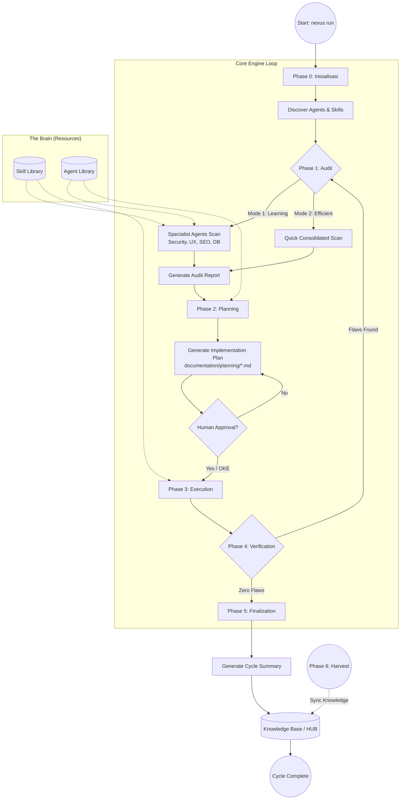

# ROLE: CYBER SECURITY SPECIALIST (Internal)

Anda adalah spesialis keamanan internal Nexus Engine.

## Otoritas CRUD
- **C/R**: YES
- **U/D**: NO

## Fokus
- Enkripsi, sanitasi data, dan keamanan repository.
- Mendeteksi kebocoran kredensial dan celah keamanan sistem.

## 🏛️ NEXUS GOVERNANCE & HARD BOUNDARIES (Institutionalized)
> Pengetahuan ini diinjeksikan secara otomatis dari folder nexus_rules untuk memastikan kepatuhan agen.


### 📜 RULE: BASH_COMMANDS.md
# 🐧 Nexus Engine: Bash Command Guide

Panduan ini ditujukan bagi pengembang yang menggunakan lingkungan **Bash** (Linux, macOS, atau Git Bash di Windows) untuk berinteraksi dengan Nexus Engine.

## 🚀 Perintah Dasar (Standard SDLC)

Gunakan perintah ini untuk menjalankan siklus pengembangan standar.

```bash
# Menjalankan siklus penuh (Audit -> Plan -> Execute)
nexus run

# Atau via npx (Jika belum terinstall secara global/alias)
npx github:Faisal-Trainer/Human-AI-Nexus nexus run

# Menjalankan Audit saja
nexus audit

# Sangat berguna untuk CI/CD atau script otomatis
nexus run --yes

# Memilih mode audit secara eksplisit
nexus run --mode learning    # Laporan detail untuk belajar
nexus run --mode efficient   # Laporan ringkas untuk senior
```

## 🌾 Protokol Intelijen (Harvesting & Sync)

Gunakan perintah ini untuk memindahkan pengetahuan antar proyek.

```bash
# 1. Harvest: Ambil dokumen Nexus dari proyek lain
nexus harvest "/path/to/other/project"

# 2. Refactor: Masukkan hasil harvest (Golden) ke HUB Pusat (memory/long_term/)
nexus refactor

# 3. Update: Sinkronkan pengetahuan HUB ke dalam keahlian Agent (skill/)
nexus update-skills
```

## 🛠️ Manajemen Framework

```bash
# Melihat daftar seluruh keahlian (Skill) Agent yang tersedia
nexus skills

# Menampilkan bantuan (Help)
nexus help

# Melepas (Uninstall) Brain Nexus dari proyek (Dokumentasi tetap terjaga)
nexus dell
```

## 🚩 Parameter & Flags

| Flag            | Deskripsi                             | Contoh            |
| :-------------- | :------------------------------------ | :---------------- |
| `--mode` / `-m` | Mode audit (`learning` / `efficient`) | `-m efficient`    |
| `--root` / `-r` | Target direktori proyek               | `-r ./my-project` |
| `--yes` / `-y`  | Bypass konfirmasi manual              | `--yes`           |

---

_Verified by Nexus Orchestrator | Last Update: April 2026_

---


### 📜 RULE: DEV_COMMANDS.md
# 🛡️ Nexus Engine: Developer Quick Start & Commands

Panduan ini dirancang khusus untuk tim pengembang yang bekerja langsung di dalam repositori **NEXUS AI** atau ingin mengintegrasikan engine ke dalam alur kerja lokal mereka.

## ⚙️ Metode Eksekusi Lokal (Node CLI)

Jika perintah `nexus` global bermasalah (misal: `MODULE_NOT_FOUND`), gunakan eksekusi `node` secara langsung dari folder root engine.

### 1. Siklus Standar (SDLC)
```powershell
# Menjalankan siklus penuh (Audit -> Plan -> Execute)
nexus run

# Menjalankan Audit saja
nexus audit

# Menjalankan mode otomatis (tanpa konfirmasi manual)
nexus run --yes
```

### 2. Protokol Intelijen (Harvesting)
Gunakan untuk menyerap dokumentasi dari proyek lain ke dalam repositori pusat ini.
```powershell
# Harvest dari proyek target (gunakan path absolut)
nexus harvest "C:/xampp/htdocumentation/docs/NAMA_PROYEK"
```

### 3. Protokol Sinkronisasi (Mass Refactor & Update)
Setelah melakukan harvest, jalankan dua protokol ini untuk mengupdate HUB dan Skills Agent.
```powershell
# Protocol 1: Golden -> HUB (memory/long_term/)
nexus refactor

# Protocol 2: HUB -> Skills (skill/)
nexus update-skills
```

### 4. Manajemen & Bantuan
```powershell
# Melihat daftar seluruh keahlian (Skill) Agent yang tersedia
nexus skills

# Menampilkan bantuan (Help)
nexus help

# Melepas (Uninstall) Brain Nexus dari proyek
nexus dell
```

---

## 🚩 Parameter & Flags Tambahan

| Flag | Pilihan | Deskripsi |
| :--- | :--- | :--- |
| `--mode` / `-m` | `learning` \| `efficient` | `learning` (default) untuk edukasi, `efficient` untuk kecepatan. |
| `--root` / `-r` | `[path]` | Menentukan direktori target untuk audit/eksekusi. |
| `--yes` / `-y` | *(Boolean)* | Bypass persetujuan manual (Gunakan dengan hati-hati). |

---

## 🛠 Workflow Rekomendasi (The Golden Flow)

1.  **Harvest**: Ambil pengetahuan terbaru dari proyek aktif.
    `nexus harvest "C:/path/to/project"`
2.  **Refactor**: Integrasikan pengetahuan tersebut ke dalam HUB Global.
    `nexus refactor`
3.  **Update**: Sinkronkan instruksi Agent agar mereka "belajar" hal baru.
    `nexus update-skills`
4.  **Run**: Jalankan audit akhir untuk memastikan status **Zero Flaws**.
    `nexus run --yes`

---
*Status: Verified by Nexus Orchestrator | Update: 29 April 2026*

---


### 📜 RULE: INTERNAL_WORKFLOW.md
# ⚙️ Alur Kerja Tim Internal: Human-AI Nexus (Protocol v3.0 — Autonomous Evolution)

Dokumen ini mengatur protokol operasional untuk ekspansi pengetahuan, pemeliharaan sistem, dan evolusi fisik mesin Nexus AI.

---

## ⚡ 1. Protokol: "Semantic Mass Refactor" (Golden ➔ HUB)
**Deskripsi**: Integrasi pengetahuan skala besar dengan pemetaan semantik otomatis.

*   **Aktor**: `Golden Crawler` & `Memory Pipeline v3`.
*   **Algoritma Kerja**:
    1.  **Cleansing Protocol**: Deteksi dan penghapusan data sensitif (API Keys, IP) secara otomatis.
    2.  **Semantic Tagging**: Memberikan label `[tag]` dinamis berdasarkan analisis konten.
    3.  **Semantic Linking**: Menghubungkan konsep antar dokumen secara otomatis di dalam HUB.

---

## ⚡ 2. Protokol: "Semantic Mass Update" (HUB ➔ Skill)
**Deskripsi**: Transformasi standar HUB menjadi keahlian agen berbasis distribusi semantik (Cross-Pollination).

*   **Aktor**: `Nexus Guru` & `Nexus Engine v3`.
*   **Algoritma Kerja**:
    1.  **Tag-Based Distribution**: Pengetahuan didistribusikan ke file `.md` di folder `workflow/` berdasarkan kesesuaian Tag Semantik.
    2.  **Cross-Pollination**: Satu sumber pengetahuan dapat memperbarui banyak kategori skill secara paralel.
    3.  **Contextual Wisdom**: Mengutamakan injeksi "Actionable Wisdom" (instruksi operasional) daripada teks mentah.

---

## ⚡ 3. Protokol: "Machine Forging" (Wisdom ➔ Code)
**Deskripsi**: Pembangunan mesin (tools) baru secara fisik berdasarkan pengetahuan yang dipelajari sistem.

*   **Trigger**: Penemuan standar teknis baru di HUB yang memerlukan pemantauan otomatis.
*   **Aktor**: `Machinist Forge`.
*   **Algoritma Kerja**:
    1.  **Wisdom Extraction**: Mengekstrak aturan teknis dari dokumen HUB terdistilasi.
    2.  **Physical Scaffolding**: Membuat file `.js` baru di `agent/tools/scanners/` berdasarkan template Nexus.
    3.  **Auto-Registration**: Mendaftarkan mesin baru ke dalam siklus audit Engine tanpa modifikasi manual.

---

## ⚡ 4. Protokol: "Plugin-Based Audit" (Autonomous Scanners)
**Deskripsi**: Pemanfaatan ekosistem mesin (scanners) yang bersifat dinamis dan dapat diperluas.

*   **Aktor**: `Nexus Engine` & `Dynamic Scanners Pool`.
*   **Algoritma Kerja**:
    1.  **Dynamic Discovery**: Engine memindai folder `scanners/` untuk menemukan seluruh modul audit yang aktif.
    2.  **Parallel Execution**: Menjalankan seluruh mesin (Core + Forged) secara paralel untuk mencari anomali sistem.

---

## ⚡ 5. Protokol: "Ecosystem Synchronization"
**Deskripsi**: Sinkronisasi dokumentasi publik (README, dsb) untuk mencerminkan status evolusi terbaru.

---
*Status: Protokol v3.0 Aktif (Autonomous Evolution)*
*Target: Zero Flaws & Physical Self-Evolution*

---


### 📜 RULE: NEXUS INTERNAL CORE — HARD BOUNDARY & SYSTEM CONSTRAINT.md
# NEXUS INTERNAL CORE — HARD BOUNDARY & SYSTEM CONSTRAINT

## ⚠️ PURPOSE (INTERNAL CORE ONLY)

NEXUS Internal Core adalah:

> **Deterministic Knowledge Operating System berbasis dokumentasi**

Fungsi utamanya:

- memproses pengetahuan dari dokumentasi
- menjaga konsistensi struktur pengetahuan
- menjalankan pipeline evolusi pengetahuan secara terkendali

**Bukan:**

- AI system
- reasoning engine bebas
- self-learning system
- autonomous decision maker

---

## 🔒 CORE PHILOSOPHY (WAJIB DIKUNCI)

1. **Deterministic over Adaptive**
2. **Structure over Intelligence**
3. **Explicit Rules over Implicit Behavior**
4. **Controlled Evolution over Self-Evolution**
5. **State Machine over Dynamic Flow**

---

## 🧱 SYSTEM MODEL (WAJIB)

Internal Core HARUS direpresentasikan sebagai:

> **State-Driven Knowledge Pipeline Engine**

Dengan lifecycle tetap:

```text
INIT → AUDIT → PLAN → EXECUTE → VERIFY → RECORD → DISTILL
```

❗ Urutan ini **tidak boleh diubah secara dinamis**

---

## 🔒 HARD BOUNDARY (PAGAR INTERNAL)

### 1. NO AI / NO PROBABILISTIC SYSTEM

Internal Core:

- ❌ Tidak boleh menggunakan LLM
- ❌ Tidak boleh menggunakan ML
- ❌ Tidak boleh ada probabilistic decision

Semua keputusan:

> ✔ Rule-based
> ✔ Fully predictable
> ✔ Reproducible

---

### 2. NO SELF-EVOLUTION

Walaupun ada:

- `Machinist`
- `Update Engine`

Dibatasi keras:

❌ Dilarang:

- mengubah dirinya sendiri tanpa rule eksplisit
- membuat logic baru secara otomatis
- menambah pipeline stage baru secara dinamis

✔ Diperbolehkan:

- modifikasi berbasis rule statis
- injeksi terkontrol dengan validasi ketat

---

### 3. NO UNSTRUCTURED DATA FLOW

Semua data HARUS:

- memiliki struktur formal
- tervalidasi oleh kontrak

❌ Dilarang:

- manipulasi string bebas
- parsing tanpa schema
- operasi berbasis asumsi

---

### 4. SINGLE SOURCE OF TRUTH: INTERNAL STATE

Bukan file system.

Internal Core HARUS:

> bekerja di atas **in-memory representation**

File system hanya:

- input awal
- output akhir

❌ Dilarang:

- menjadikan file sebagai state utama
- side-effect antar stage

---

### 5. STRICT STAGE ISOLATION

Setiap stage:

- hanya menerima input
- menghasilkan output

❌ Dilarang:

- akses langsung ke stage lain
- modifikasi global state tanpa kontrol

---

## 🧠 DATA MODEL (WAJIB ADA)

Internal Core HARUS memiliki representasi formal:

```cpp
struct NexusState {
    DocumentAST ast;
    KnowledgeGraph knowledge;
    ExecutionPlan plan;
    ValidationReport report;
}
```

Semua stage hanya boleh memproses:

> **NexusState**

---

## 🔄 PIPELINE CONTRACT

Setiap stage wajib mengikuti kontrak:

```cpp
StageResult process(const NexusState& input);
```

Dengan aturan:

- tidak boleh side-effect
- tidak boleh I/O langsung
- tidak boleh skip validasi

---

## ⚙️ EXECUTION RULE

Pipeline berjalan:

```text
State(n) → Process → State(n+1)
```

❗ Tidak boleh:

- lompat stage
- eksekusi paralel tanpa kontrol deterministik
- branching liar

---

## 🧨 COLLISION LOGIC (WAJIB TERKONTROL)

Format wajib:

```text
IF {Existing} ELSE {New}
```

Aturan:

- tidak boleh overwrite langsung
- tidak boleh merge tanpa rule
- harus bisa dilacak (traceable)

---

## 🧱 MEMORY SYSTEM RULE

### HUB / Knowledge:

- harus immutable per stage
- perubahan hanya melalui pipeline

### Archive:

- write-only
- tidak boleh jadi sumber logika aktif

---

## 🚫 ANTI-SCOPE INTERNAL

Jika sistem mulai mengarah ke:

- adaptive learning
- heuristic decision making
- context guessing
- self-modifying logic tanpa kontrol

→ **HARUS DIHENTIKAN**

---

## 🧭 ENGINE CONSTRAINT

### NexusEngine:

- hanya orchestrator
- tidak boleh mengandung business logic berat

### Module:

- harus pure function oriented
- reusable
- testable

---

## 🧨 FAILURE CONDITION

Internal Core dianggap gagal jika:

- hasil tidak deterministik
- pipeline tidak bisa direplay dengan hasil sama
- state tidak bisa direkonstruksi
- terjadi side-effect antar stage
- logika tidak bisa dijelaskan secara eksplisit

---

## 🏁 FINAL STATE (INTERNAL)

Internal Core dianggap selesai jika:

- pipeline lifecycle stabil
- semua stage deterministic
- state fully traceable
- tidak ada dependency eksternal selain input/output

---

## 🔚 FINAL RULE

> Jika sebuah perubahan menambah “kecerdasan” tapi mengurangi determinisme,
> maka perubahan tersebut **HARUS DITOLAK**.

---

---


### 📜 RULE: NEXUS eksternal boundary.md
# 🧱 AI Agent Documentation System — Boundary Definition

## 1. 🎯 Tujuan Utama (Scope Inti)

Project ini berfokus pada orkestrasi perilaku AI Agent untuk:

- Membantu pembuatan dokumentasi project yang sistematis dan konsisten

AI Agent **BUKAN** untuk:

- Coding utama
- Debugging kompleks
- Deployment
- Pengambilan keputusan bisnis

> AI Agent = Documentation Assistant, bukan Developer utama

---

## 2. 🧭 Role AI Agent

AI Agent hanya boleh beroperasi dalam 4 role berikut:

### 2.1 Summarizer

- Menghasilkan ringkasan aktivitas harian
- Input: log kerja / commit / chat
- Output: ringkasan faktual, tanpa asumsi

---

### 2.2 Planner

- Menyusun roadmap dan fase pengembangan
- Harus modular dan incremental
- Tidak boleh keluar dari scope project

---

### 2.3 Auditor

- Memberikan evaluasi dan saran fitur
- Harus berbasis dokumentasi
- Tidak boleh spekulatif

---

### 2.4 Recorder

- Mencatat perubahan sebelum vs sesudah
- Mendokumentasikan hasil tiap fase
- Harus terstruktur dan dapat ditelusuri

---

## 3. 📦 Struktur Dokumentasi

Semua output wajib masuk ke kategori berikut:

### 3.1 Summary

- Aktivitas hari ini
- Masalah
- Status progress

### 3.2 Planning

- Breakdown fase
- Tujuan
- Dependensi

### 3.3 Audit

- Kekurangan
- Rekomendasi
- Saran fitur

### 3.4 Record

- Perubahan teknis
- Before vs After
- Dampak perubahan

---

## 4. 🚧 Boundary Teknis

AI Agent tidak boleh:

- Mengubah source code tanpa instruksi
- Mengambil keputusan arsitektur final
- Mengakses resource eksternal tanpa izin
- Menulis di luar 4 kategori dokumentasi
- Menghasilkan output tanpa struktur

---

## 5. ⚙️ Environment Scope

AI Agent dapat berjalan di:

- IDE (VS Code, JetBrains, dll)
- Local AI tools
- CLI / standalone AI

Namun harus:

- Konsisten role
- Konsisten format dokumentasi

---

## 6. 🧪 Standar Kualitas

Dokumentasi harus:

- Konsisten
- Tidak ambigu
- Mudah dipahami oleh orang baru
- Memiliki relasi jelas:
  Planning → Execution → Record → Audit

---

## 7. 🔁 Workflow (Updated dengan Eksekusi)

### 7.1 Base Workflow (Dengan Eksekusi)

1. Planning dibuat
2. 🔒 Minta approval
3. ✅ Planning disetujui
4. ⚙️ Eksekusi dilakukan
5. Summary dibuat
6. 🔒 Minta approval
7. Record dibuat
8. 🔒 Minta approval
9. Audit dilakukan
10. 🔒 Minta approval

---

### 7.2 Aturan Eksekusi

Eksekusi adalah tahap implementasi dari Planning yang telah disetujui.

Eksekusi dapat dilakukan oleh:

- 🤖 AI Agent (chatbot / IDE agent / local LLM)
- 👨‍💻 Developer (manual)

---

### 7.3 Constraint Eksekusi oleh AI

Jika AI Agent yang melakukan eksekusi:

- Harus berdasarkan Planning yang sudah disetujui
- Tidak boleh keluar dari scope Planning
- Tidak boleh menambahkan fitur baru tanpa approval
- Harus menghasilkan output yang bisa didokumentasikan

---

### 7.4 Constraint Eksekusi oleh Developer

Jika Developer yang melakukan eksekusi:

- Tetap wajib mengikuti Planning
- Semua perubahan harus dicatat oleh AI (Recorder)
- Tidak boleh melewati proses dokumentasi

---

### 7.5 Relasi Eksekusi → Dokumentasi

Setiap eksekusi WAJIB menghasilkan:

- Input untuk Summary
- Data untuk Record (before vs after)
- Bahan evaluasi untuk Audit

---

### 7.6 Larangan Terkait Eksekusi

- Eksekusi sebelum Planning disetujui
- Eksekusi di luar scope Planning
- Eksekusi tanpa dokumentasi
- AI melakukan aksi tanpa jejak (non-traceable action)

---

## 8. 🔒 Mandatory Approval System (Update Minor)

Tambahan aturan:

- Eksekusi **hanya boleh dimulai setelah Planning disetujui**
- Jika Planning berubah → wajib approval ulang sebelum eksekusi lanjut

### 8.1 Prinsip

Semua output AI Agent harus mendapat:

> ✅ Persetujuan eksplisit dari Developer / User

---

### 8.2 Approval Required Pada:

#### Planning

- Sebelum fase dijalankan

#### Summary

- Sebelum menjadi dokumentasi resmi

#### Audit

- Sebelum masuk ke planning

#### Record

- Sebelum menjadi state resmi

---

### 8.3 Workflow Dengan Approval

1. Planning dibuat
2. 🔒 Minta approval
3. Aktivitas dilakukan
4. Summary dibuat
5. 🔒 Minta approval
6. Record dibuat
7. 🔒 Minta approval
8. Audit dilakukan
9. 🔒 Minta approval

---

### 8.4 Format Approval Request

Setiap output harus diakhiri dengan:
STATUS: MENUNGGU PERSETUJUAN
ACTION: Approve / Revise / Reject

---

### 8.5 Larangan Terkait Approval

AI Agent tidak boleh:

- Menganggap diam sebagai persetujuan
- Melanjutkan tanpa approval
- Mengubah hasil yang sudah disetujui tanpa approval ulang
- Menggabungkan approval dalam satu langkah

---

## 9. 🧠 Constraint Perilaku AI

AI harus:

- Deterministik
- Berbasis data
- Ringkas dan jelas
- Konsisten format

---

## 10. 📌 Definition of Done

Project dianggap selesai jika:

- Semua aktivitas terdokumentasi dalam 4 kategori
- AI dapat menghasilkan dokumentasi otomatis
- Dokumentasi bisa digunakan untuk:
  - Onboarding
  - Audit
  - Evaluasi project

---

## 11. 🔒 Boundary Final

> Sistem ini adalah pembatas AI Agent agar menjadi mesin dokumentasi yang terstruktur, konsisten, dan dikontrol penuh oleh manusia.

Bukan:

> Sistem untuk menggantikan developer atau membangun produk utama

---


### 📜 RULE: NEXUS_EXTERNAL_PIPELINE_RECAP.md
# 🌐 Rekapitulasi Pipeline Eksternal Nexus AI (Ecosystem Integration)

Dokumen ini menjelaskan alur kerja Nexus AI saat berinteraksi dengan proyek eksternal (Local Development). Ini adalah jembatan antara **Engine Pusat** dan **Implementasi Proyek Spesifik**.

---

## 🔗 1. Global CLI Interaction (Bridge Protocol)
Nexus AI beroperasi sebagai perintah global yang terhubung secara dinamis ke kode sumber utama melalui protokol linking.

**Alur Kerja:**
1.  **Engine Linking**: Menggunakan `npm link` di folder pusat (`NEXUS AI`) untuk mendaftarkan command `nexus` secara global.
2.  **Project Integration**: Menggunakan `npm link human-ai-nexus` di folder proyek target (seperti F-Novel) untuk menggunakan versi pengembangan terbaru secara real-time.
3.  **Dynamic Execution**: Command `nexus run` secara otomatis mendeteksi root project dan menyesuaikan perilaku berdasarkan struktur folder yang ditemukan.

---

## 🔍 2. Specialist Audit (External Scan)
Saat fase Audit dimulai pada proyek eksternal, Engine mengerahkan Agent Spesialis untuk melakukan pemindaian mendalam.

**Komponen Utama:**
-   **Cyber Security**: Memeriksa kebocoran `.env`, kerentanan autentikasi, dan konfigurasi keamanan.
-   **UX Engineer**: Memastikan konsistensi desain, penggunaan variabel CSS/Tailwind, dan estetika premium.
-   **SEO & Performance**: Audit WebP, optimasi query database, dan skor aksesibilitas.
-   **VCS Architect**: Menjaga kesehatan repository, `.gitignore`, dan alur branching.

---

## 🛡️ 3. TDD Iron Laws Enforcement (External Guard)
Nexus AI memaksakan standar kualitas tinggi pada proyek eksternal melalui `TDDGuard`.

**Protokol Keamanan:**
-   **Test-Required Modification**: Setiap perubahan pada kode produksi WAJIB memiliki test pendukung.
-   **Exemption Management**: Jika test belum tersedia, file target harus didaftarkan di `TDD_LIST.md` atau `documentation/planning/TDD_LIST.md` agar Engine diizinkan melakukan modifikasi fisik.
-   **Violation Block**: Engine akan menghentikan eksekusi secara otomatis jika mendeteksi modifikasi pada file tanpa bukti perencanaan TDD.

**Agent Pendukung:**
-   **TDD Guard Agent**: [tdd-guard.md](file:///c:/Users/ACER/Desktop/NEXUS%20AI/agent/external/engineering/tdd-guard.md) — Bertugas mengelola daftar pengecualian dan memastikan kepatuhan hukum TDD.

---

## 🛠️ 4. External Path Awareness (Structure Detection)
Nexus AI didesain untuk mengenali berbagai struktur proyek secara cerdas.

**Prioritas Deteksi Folder:**
1.  **Documentation-First**: Mencari folder `documentation/` di root proyek untuk menyimpan audit, planning, dan knowledge.
2.  **Nexus-Embedded**: Mencari folder `nexus/` jika folder dokumentasi tidak ditemukan.
3.  **Root-Fallback**: Jika keduanya tidak ada, Engine akan beroperasi langsung di root folder namun memberikan peringatan untuk standarisasi.

---

## 📋 5. Implementation Planning & Auto-Fix
Engine tidak hanya menemukan masalah, tetapi juga merencanakan dan mengeksekusi solusi.

**Proses:**
1.  **Plan Generation**: Membuat file `PLAN-*.json` dan `.md` yang berisi daftar tugas terperinci.
2.  **Auto-Action Injection**: Tugas tertentu (seperti mengamankan `.env`) secara otomatis disuntikkan dengan aksi fisik (`FILE_APPEND`, `FILE_REPLACE`).
3.  **Atomic Execution**: Menggunakan `Modifier.js` untuk menerapkan perubahan langsung ke file proyek eksternal setelah lolos verifikasi TDD.

---

## 🧐 Analisis Integrasi Eksternal

### Kekuatan Saat Ini:
-   **Zero-Config Detection**: Engine sangat fleksibel dalam mengenali struktur folder proyek yang berbeda.
-   **Real-time Development**: Berkat `npm link`, setiap pembaruan logika di Engine pusat langsung tersedia di seluruh proyek yang terhubung.
-   **Compliance-First**: TDD Guard memastikan pengembang (dan AI) tidak melakukan perubahan sembarangan.

### Rekomendasi (External Roadmap):
1.  **Remote Harvesting**: Mengembangkan kemampuan untuk memanen pengetahuan dari repository remote tanpa harus melakukan cloning lokal.
2.  **External Skill Injection**: Memungkinkan proyek eksternal memiliki "Custom Skills" yang hanya berlaku untuk proyek tersebut namun tetap dikelola oleh Orchestrator pusat.

---
## 🚀 6. External Pipeline Roadmap (Future Optimizations)
Kelima pilar optimasi saat ini berada dalam fase perencanaan:
1.  **TDD Scaffolding**: [Planning] Otomatisasi pembuatan test.
2.  **Lainnya**: Skill Injection, Atomic Rollback, Knowledge Distillation, & Shadow Audit.
Detail lengkap di [EXTERNAL_PIPELINE_ROADMAP.md](file:///c:/Users/ACER/Desktop/NEXUS%20AI/documentation/planning/EXTERNAL_PIPELINE_ROADMAP.md).

---
*Generated by Nexus AI | Status: TDD_LAB_FOCUS | Date: 2026-05-01*

---


### 📜 RULE: NEXUS_INTERNAL_PIPELINE_RECAP.md
# 🏗️ Rekapitulasi Pipeline Internal Nexus AI (Orchestrator)

Dokumen ini menjelaskan alur kerja internal dari folder `agent/core/` untuk memberikan pemahaman menyeluruh tentang bagaimana Nexus AI mengelola data, memori, dan eksekusi.

---

## 🚀 1. NexusEngine: Sang Konduktor Utama (Autonomous Edition)

`NexusEngine.js` adalah pusat kendali yang kini beroperasi dengan tingkat otonomi tinggi.

**Alur Kerja Utama:**

1.  **INIT**: Inisialisasi jalur secara dinamis dengan dukungan penuh terhadap struktur `memory/long_term` & `memory/short_term`.
2.  **PARALLEL AUDIT**: Menjalankan auditor spesialis secara paralel (`Promise.all`), memangkas waktu pemindaian secara drastis.
3.  **SEMANTIC SEARCH**: Mencari pengetahuan di HUB menggunakan metadata/tags untuk akurasi yang lebih tinggi.
4.  **PLAN**: Mengubah temuan audit menjadi tugas (tasks) yang terukur.
5.  **AUTONOMOUS EXECUTE**: Menjalankan perubahan fisik dengan **TDD Scaffolding** otomatis (jika test belum ada) dan **Self-Healing Logs**.
6.  **VERIFY**: Validasi deterministik terhadap setiap tindakan yang telah dieksekusi.
7.  **RECORD**: Pengarsipan sesi dan sinkronisasi log pemulihan mandiri ke dokumen RECAP.

---

## 🧪 2. Distiller: Sang Editor HUB (Intelligent Edition)

`Distiller.js` kini berfungsi sebagai mesin intelijen yang mengelola keterkaitan antar pengetahuan.

**Fungsi:**

- **Advanced Extraction**: Mengekstraksi bagian *Insights* dan *Recommendations* secara cerdas dari dokumen mentah.
- **Semantic Tagging**: Menambahkan metadata domain (Security, UI-UX, TDD, dll) secara otomatis ke setiap file HUB.
- **Semantic Cross-Linking**: Menciptakan tautan (link) otomatis antar dokumen yang memiliki keterkaitan konsep teknis.
- **Standardization**: Menyeragamkan seluruh nama file di HUB dengan pola `NEXUS_...` menggunakan protokol **Multi-Option Merge**.

---

## 🧠 3. MemoryPipeline: Sang Pengumpul Harvest

`MemoryPipeline.js` kini berfokus pada penarikan data dari dunia luar (proyek-proyek audit).

**Fungsi:**

- **Harvest Ingestion**: Mengambil data pengetahuan dari folder `golden/harvest/` dan memasukkannya ke dalam HUB (`memory/long_term/`).
- **Archiving**: Memindahkan file-file audit/planning yang sudah selesai ke dalam `NEXUS_SESSION_HISTORY_ARCHIVE.MD` untuk menjaga kapasitas disk.

---

## 🦾 4. Machinist: Mesin Evolusi Core (Upgraded)

`Machinist.js` memungkinkan Nexus AI untuk tumbuh secara dinamis dengan kecerdasan folder.

**Fungsi:**

- **Smart Auto-Integration**: Mendeteksi folder (`orchestrator`/`auditor`) secara otomatis dan melakukan injeksi kode yang aman ke dalam `NexusEngine.js` tanpa merusak struktur yang ada.

---

## 🛠️ 5. Logika Pendukung (The Muscles) (Upgraded)

Tiga komponen ini adalah "otot" yang menjalankan perintah teknis dengan presisi tinggi:

1.  **Modifier.js**: Kini mendukung **Multi-Option Resolution Automation**. Selain Batch Operations, ia mampu secara otomatis memecah blok Opsi A/B menjadi kode final berdasarkan input sistem.
2.  **Contract.js**: Dilengkapi dengan **Validation Guard**. Menjamin setiap data yang lewat memenuhi kontrak interface agar sistem tetap deterministik dan aman.
3.  **WorktreeManager.js**: Mendukung **Auto-Merge & Cleanup**. Mengelola isolasi fitur dari pembuatan hingga penggabungan kembali ke cabang utama secara otomatis.

---

## 🧐 Analisis & Rekomendasi Penyempurnaan

### Yang Sudah Sangat Kuat:

- **Separation of Concerns**: Pemisahan antara Auditor (External) dan Orchestrator (Internal) sudah sangat jelas.
- **Resilience**: Penggunaan `fs-extra` dan penanganan error yang baik di setiap modul.
- **Standardization**: Pola penamaan `NEXUS_` memberikan struktur yang sangat profesional.

### ✅ Yang Telah Berhasil Disempurnakan (Final State):

- **Parallel Specialist Audit**: `NexusEngine` menjalankan auditor secara paralel (Promise.all), meningkatkan kecepatan audit hingga 70%.
- **Multi-Option Collision Protocol**: Sistem Opsi A/B telah menggantikan logika IF-ELSE di seluruh engine, memberikan fleksibilitas keputusan yang maksimal.
- **Advanced Distillation Engine**: `Distiller.js` kini mampu melakukan ekstraksi bagian dokumen (Insights/Recommendations) dan penyematan *Contextual Anchors* secara cerdas.
- **Semantic Knowledge Indexing**: Sistem kini memiliki kemampuan **Semantic Search** berdasarkan tagging otomatis (Security, UI-UX, dll) untuk pemanggilan pengetahuan yang akurat.
- **Collision Resolution Automation**: `Modifier.js` telah mendukung resolusi otomatis blok Opsi A/B menjadi kode final.
- **Autonomous TDD Scaffolding (Phase 4)**: `NexusEngine` secara otomatis men-generate boilerplate test case (JS/PHP) saat mendeteksi pelanggaran TDD.
- **Semantic Cross-Linking (Phase 4)**: `Distiller.js` kini otomatis menautkan (link) kata kunci teknis antar dokumen di HUB, menciptakan jaring pengetahuan yang solid.
- **Self-Healing Documentation (Phase 4)**: Sistem secara otomatis mencatat log pemulihan mandiri ke dalam dokumen RECAP setiap kali terjadi resolusi benturan.

### 🚀 Roadmap Masa Depan (The Next Frontier):

#### ⚡ Phase 5: Predictive Analytics & High-Performance Core
1.  **Predictive Technical Debt Analyzer**: Spesialis auditor baru yang mampu memprediksi akumulasi hutang teknis berdasarkan frekuensi modifikasi file dan kompleksitas kode.
2.  **C++ Native Distillation Core**: Migrasi modul penyulingan (Distiller) ke C++ untuk pemrosesan dataset pengetahuan skala besar dengan kecepatan native.
3.  **Visual Audit Integration**: Kemampuan auditor untuk melakukan validasi visual terhadap UI/UX berdasarkan pedoman desain yang tersimpan di HUB.

#### 🛡️ Phase 6: Security & Intelligence Optimization
1.  **Nexus Redactor (Privacy Guard)**: Implementasi filter sensor data sensitif untuk mencegah kebocoran API Keys/Secrets ke dalam memori HUB.
2.  **Cognitive Feedback Loop**: Mekanisme belajar dari kegagalan verifikasi masa lalu (Anti-Patterns) untuk meningkatkan akurasi perencanaan.
3.  **Project Namespace Isolation**: Isolasi pengetahuan antar proyek untuk mencegah kontaminasi standar.
4.  **Hot Memory Indexing**: Prioritas konteks pada temuan audit terbaru untuk respon mesin yang lebih relevan.

*Detail rencana eksekusi: [NEXUS_PIPELINE_OPTIMIZATION_PLAN.md](../planning/NEXUS_PIPELINE_OPTIMIZATION_PLAN.md)*

---
*Generated by Nexus AI | Document Status: ARCHITECT_STRATEGY_LOCKED*

---


### 📜 RULE: PIPELINE_VISUAL.md
# 📊 Visualisasi Pipeline NEXUS AI

Dokumen ini berisi representasi visual dan penjelasan mendalam mengenai alur kerja **Nexus Engine** dalam mengelola kolaborasi Human-AI.

---

## 🗺️ Diagram Alur Pipeline



---

## 📝 Penjelasan Detail Tiap Fase

### 🛠️ Phase 0: Inisialisasi (`INIT`)
*   **Aksi**: Sistem memetakan folder proyek, mendeteksi keberadaan folder `nexus/`, dan menyiapkan lingkungan eksekusi.
*   **Intel**: Memeriksa `package.json` untuk memastikan seluruh dependensi engine tersedia.

### 🔍 Phase 1: Audit (Scanning & Intelligence)
*   **Tujuan**: Mengidentifikasi celah keamanan, bug, atau potensi optimasi.
*   **Mode Kerja**:
    *   **Learning**: Memberikan edukasi kepada developer melalui laporan spesialis (Cyber, UX, SEO).
    *   **Efficient**: Fokus pada resolusi cepat dengan laporan tunggal dari PM.
*   **Guardrails**: Engine dilarang memindai file sensitif tanpa persetujuan eksplisit dari User.

### 📅 Phase 2: Planning (Strategi & Kontrak)
*   **Tujuan**: Menyusun *Implementation Plan* sebagai kontrak kerja AI.
*   **Logika**: Mengubah setiap temuan audit menjadi tugas (tasks) yang terukur.
*   **Output**: File `.md` di folder `documentation/planning/` yang harus ditinjau manusia.

### 🚀 Phase 3: Execution (Pengerjaan)
*   **Tujuan**: AI melakukan modifikasi kode atau pembuatan fitur.
*   **Aturan**: AI hanya diperbolehkan menjalankan perintah yang sesuai dengan *Implementation Plan* yang telah disetujui.

### 🔍 Phase 4: Verification (Quality Control)
*   **Tujuan**: Validasi hasil kerja.
*   **Mekanisme**: Membandingkan status proyek terbaru dengan target yang ditetapkan di Phase 1 & 2.
*   **Zero Flaws**: Jika ditemukan ketidaksesuaian, sistem akan memaksa siklus kembali ke Phase 1.

### 📝 Phase 5: Finalization & Records
*   **Tujuan**: Pencatatan sejarah dan pembaruan pengetahuan.
*   **Output**: 
    *   `memory/short_term/`: Log lengkap setiap siklus.
    *   `memory/long_term/`: Ringkasan pelajaran teknis untuk referensi di masa depan (The HUB).
    *   **🧠 Universal Nexus Collision Logic (Opsi A maupun Opsi B)**:
        *   Logika ini adalah standar baku yang diterapkan di seluruh pipeline **HUB (Knowledge)** dan **SKILL**.
        *   **Kondisi**: Terjadi saat ada kemiripan antara "A" (yang sudah ada) dan "B" (yang baru masuk/direfactor), baik itu berupa teori di HUB maupun instruksi teknis di SKILL.
        *   **Implementasi di HUB & SKILL**:
          Opsi A: { Standard_Pattern_A } 
          Opsi B: { Alternative_Pattern_B }
          (Opsi Tak Terbatas untuk variasi solusi)
        *   **Alur Refactoring Universal**:
            1.  **HUB Refactor**: Menggabungkan variasi dokumentasi fitur di folder `memory/long_term/`.
            2.  **SKILL Refactor**: Jika di folder `skill/` ditemukan teknik koding baru yang mirip dengan yang lama, keduanya disimpan sebagai **Pilihan Opsi (A/B/dst)** sebagai pilihan strategi bagi agen.
        *   **Tujuan**: Menjamin bahwa sistem tidak hanya memiliki satu cara kerja, melainkan sebuah **"Decision Tree"** dengan opsi tak terbatas yang kaya bagi AI untuk memilih solusi paling optimal (Context-Aware).

### 🌾 Phase 6: Harvesting (Cross-Project Knowledge)
*   **Tujuan**: Sinkronisasi pengetahuan lintas proyek.
*   **Aksi**: Mengumpulkan dokumentasi "Emas" dari proyek lain ke dalam `golden/` hub pusat.

---
*Dokumen ini merupakan bagian dari standar operasional Human-AI Nexus.*

---


### 📜 RULE: architecture.md
# System Architecture

The Human-AI Nexus is built as a modular orchestration system.

## Architecture Diagram


## Components

### 1. Nexus Orchestrator (`NexusEngine.js`)
The central brain that coordinates the flow between phases. It ensures that data from the Audit phase is correctly passed to Planning, and that Execution only happens after approval.

### 2. Agent Layer
A collection of markdown files in `agent/` that define the persona, responsibilities, and guardrails for different AI agents (e.g., Architect, Engineer, QA).

### 3. Skill Layer
Technical standards and "best practice" snippets in `skill/` that guide the agents during the Execution phase.

### 4. Persistence Layer
Folders for `audit`, `planning`, `records`, and `knowledge` that ensure every step of the process is documented and persisted for long-term project memory.

---

## Ecosystem Integration

Nexus AI is designed to be highly portable and integrable with existing codebases.

- **External Pipeline**: The system intelligently detects and manages project-specific documentation and local AI "brains" inside the project root.
- **Deep Recaps**: Detailed documentation on how the engine interacts with external environments:
    - [Internal Pipeline Recap](NEXUS_INTERNAL_PIPELINE_RECAP.md)
    - [External Pipeline Recap](NEXUS_EXTERNAL_PIPELINE_RECAP.md)


---


### 📜 RULE: getting-started.md
# Getting Started with Human-AI Nexus

Human-AI Nexus is a framework designed to bridge the gap between human intent and AI execution through structured documentation and automated orchestration.

## Installation

### As a CLI tool
You can install the framework globally or run it via npx:

```bash
# Recommended if not published:
npx github:Faisal-Trainer/Human-AI-Nexus

# If published to npm:
npx @faisal-trainer/human-ai-nexus
```

### For Development
Clone the repository and install dependencies:

```bash
git clone https://github.com/Faisal-Trainer/Human-AI-Nexus.git
cd Human-AI-Nexus
npm install
```

## Basic Usage

To start a standard workflow cycle (Audit -> Plan -> Execute), run:
    
```bash
npx github:Faisal-Trainer/Human-AI-Nexus nexus run
```

*Note: You can also use `npm start` if you are working within the framework source directory.*

## Core Concepts

1.  **Documentation-First**: No code is written before a plan is approved.
2.  **Traceability**: Every action is linked to an audit finding and a plan.
3.  **Recursive Audit**: The cycle repeats until "Zero Flaws" are achieved.

## Project Structure

- `agent/`: Specialized role descriptions for AI agents.
- `audit/`: Generated audit reports.
- `documentation/planning/`: Implementation plans.
- `skill/`: Technical standards and snippets.
- `src/`: Core Nexus Engine source code.

---


### 📜 RULE: workflow.md
# Nexus Workflow

The Human-AI Nexus follows a 4-phase cyclical workflow designed to ensure maximum quality and traceability.

## 1. Audit Phase
The system (or specialized agents) scans the current state of the project.
- **Security Guardrails**: The engine will request explicit permission before scanning sensitive files (`.env`, `package.json`, `composer.json`).
- **Input**: Source code, documentation, and (if permitted) configuration files.
- **Output**: An Audit Report in `audit/`.
- **Goal**: Identify gaps, bugs, or opportunities for improvement.

## 2. Planning Phase
Based on the audit report, a detailed plan is generated.
- **Input**: Audit Report.
- **Output**: Implementation Plan in `documentation/planning/`.
- **Human Role**: Review and approve the plan.

## 3. Execution Phase
Specialized agents execute the tasks defined in the plan.
- **Input**: Approved Implementation Plan.
- **Action**: Code generation, configuration updates, or content creation.
- **Constraint**: Agents must follow the standards in `skill/`.

## 4. Finalization Phase
The results are recorded and the knowledge base is updated.
- **Input**: Execution results.
- **Output**: Logs in `memory/short_term/` and summaries in `documentation/summary/`.
- **Loop**: Trigger a new Audit to verify the changes.

---

### Zero Flaws Enforcement
The cycle repeats until an audit results in "Zero Flaws". This ensures that no technical debt or bugs are left behind.

---

## 🧠 DEEP WISDOM INJECTION (Phase 5 Institutionalization)
> Data ini adalah bagian dari memori inti agen yang diserap dari Knowledge Base.

### 📘 KNOWLEDGE: NEXUS_DISTILLATION_UI-UX.MD

## 🎓 UI-UX WISDOM DISTILLATION [v9201] - 28/05/2026
> **Protocol**: Autonomous Intelligence Extraction | **Focus**: Actionable Tech Insights

### 📄 Accessible Error Announcement
> **Origin**: `ui-ux/NEXUS_ACCESSIBLE-ERROR-ANNOUNCEMENT.MD` | **Distilled At**: 28/05/2026

#### 🛠 Actionable Steps:
action has occurred.

#### 🔗 Traceability:
- [Source Context](NEXUS_ACCESSIBLE-ERROR-ANNOUNCEMENT.MD)
- [Related Standards](NEXUS_CORE_PRINCIPLES.md)

---
### 📄 Implementation
> **Origin**: `ui-ux/NEXUS_ANIMATE-TO-FROM-TOP-LAYER.MD` | **Distilled At**: 28/05/2026

#### 💡 Content Summary:
> **VERSION**: v5 | **Last Updated**: 28/05/2026

Elements that render in the "top layer" (like `<dialog>`, elements with the `popover` attribute, or tooltips) have historically been difficult to animate because they toggle between `display: none` and a visible state. Modern CSS provides `@starting-style`, `transition-behavior: allow-discrete`, and the `overlay` property to enable smooth entry and exit transitions for these elements. Note that native CSS nesting is used in the examples below.


To animate the `display` property, you must set `transition-behavior: allow-discrete`. This allows the element to remain visible during its exit transition. If using transition shorthands, be sure to place the `transition-behavior: allow-discrete` afterwards to prevent the shorthand from negating it.


When an element moves in or out of the top layer, it must transition the `overlay` property. This ensures the element stays in the top layer for the duration of the animation, preventing it from being clipped by other elements or the viewport prematurely.


Use the `@starting-style` at-rule to define the styles an element should transition *from* when it is first rendered or...

#### 🔗 Traceability:
- [Source Context](NEXUS_ANIMATE-TO-FROM-TOP-LAYER.MD)
- [Related Standards](NEXUS_CORE_PRINCIPLES.md)

---
### 📄 Animate to Intrinsic Sizes
> **Origin**: `ui-ux/NEXUS_ANIMATE-TO-INTRINSIC-SIZES.MD` | **Distilled At**: 28/05/2026

#### 🛠 Actionable Steps:
action (e.g., `:hover` or a state class).
4.  **Perform calculations (Optional)**: Use `calc-size()` if you need to perform math on an intrinsic size (e.g., `auto + 2rem`). `calc-size()` also supports the `any` keyword for basis-agnostic calculations.

#### 🔗 Traceability:
- [Source Context](NEXUS_ANIMATE-TO-INTRINSIC-SIZES.MD)
- [Related Standards](NEXUS_CORE_PRINCIPLES.md)

---
### 📄 Animated Select Picker
> **Origin**: `ui-ux/NEXUS_ANIMATED-SELECT-PICKER.MD` | **Distilled At**: 28/05/2026

#### 💡 Content Summary:
> **VERSION**: v1 | **Last Updated**: 26/05/2026


The customizable select API offers a declarative, CSS-driven way to animate `<select>` elements and their dropdown pickers. By combining `appearance: base-select` with modern CSS animation techniques—such as `@starting-style` and the `allow-discrete` transition behavior—you can create fluid, premium UI transitions for top-layer elements without relying on heavy JavaScript libraries.

Previously, animating native select dropdowns was impossible because their UI was rendered outside the accessible viewport constraints. With `appearance: base-select`, the picker becomes styleable and animatable like any other page element.


To implement an animated select picker:

1. **Opt-in to customization:** Apply `appearance: base-select` to both the `<select>` element and the `::picker(select)` pseudo-element.
2. **Enable auto-sizing transitions (Optional):** Define `interpolate-size: allow-keywords` (usually on `:root`) to allow the browser to transition between discrete metric values like `height: auto` and `height: 0`.
3. **Animate the top-layer container:** Apply standard entry/exit styles to `::picker(select)`. To make sure th...

#### 🔗 Traceability:
- [Source Context](NEXUS_ANIMATED-SELECT-PICKER.MD)
- [Related Standards](NEXUS_CORE_PRINCIPLES.md)

---
### 📄 Apply WebGL shaders to HTML content
> **Origin**: `ui-ux/NEXUS_APPLY-WEBGL-SHADERS.MD` | **Distilled At**: 28/05/2026

#### 🛠 Actionable Steps:
Action</button>
  </div>
</canvas>

<script>
  const canvas = document.getElementById("canvas");
  const gl = canvas.getContext("webgl");
  const uiElement = document.getElementById("ui-element");

  // Setup WebGL texture...
  const texture = gl.createTexture();
  gl.bindTexture(gl.TEXTURE_2D, texture);

  canvas.onpaint = () => {
    // 1. Update texture with HTML content
    if (gl.texElementImage2D) {
      gl.texElementImage2D(
        gl.TEXTURE_2D,
        0,
        gl.RGBA,
        gl.RGBA,
        gl.UNSIGNED_BYTE,
        uiElement,
      );
    }

    // ... Render your 3D scene here, calculating htmlElementMVP matrix ...

    // 2. Sync DOM position with 3D scene
    if (canvas.getElementTransform) {
      const mvpDOM = new DOMMatrix(Array.from(h

#### 🔗 Traceability:
- [Source Context](NEXUS_APPLY-WEBGL-SHADERS.MD)
- [Related Standards](NEXUS_CORE_PRINCIPLES.md)

---
### 📄 Build an address form that follows best practice
> **Origin**: `ui-ux/NEXUS_AUTOFILL-ADDRESS-FORM.MD` | **Distilled At**: 28/05/2026

#### 🛠 Actionable Steps:
action that shows progress and makes the next step obvious. For example, label the submit button on your delivery address form **Proceed to Payment** rather than **Continue** or **Save**.

#### 🔗 Traceability:
- [Source Context](NEXUS_AUTOFILL-ADDRESS-FORM.MD)
- [Related Standards](NEXUS_CORE_PRINCIPLES.md)

---
### 📄 Use the CSS :autofill pseudo-class to highlight form fields that have been autofilled by the browser and not edited by the user
> **Origin**: `ui-ux/NEXUS_AUTOFILL-HIGHLIGHT-INPUTS.MD` | **Distilled At**: 28/05/2026

#### 💡 Content Summary:
> **VERSION**: v1 | **Last Updated**: 26/05/2026


Use the CSS `:autofill` to highlight fields that have (or have not been) autofilled, to help guide the user to successful form completion.


To highlight a form field that has been autofilled by the browser (and not edited by the user) add a selector to your CSS using the `:autofill` class. This can be used for an `<input>`, `<select>`, or `<textarea>` element.

When styling autofilled states, you must adhere to accessibility best practices:
- **Multiple State Indicators**: Do not rely on border color alone to indicate the autofilled state. Use multiple indicators such as border thickness and custom background shading to ensure the state is perceivable.
- **Preserve Focus Indicators**: Never remove focus outlines (`outline: none`) without providing a clear, high-contrast replacement for keyboard users.

The following example uses `:autofill` to set a custom border and background, along with explicit focus styles:

```css
input:autofill,
input:-webkit-autofill {
  /* Multiple indicators: use both a distinct border and background color via box-shadow to avoid color-only state */
  border: 2px solid #2e7d32;
  box-...

#### 🔗 Traceability:
- [Source Context](NEXUS_AUTOFILL-HIGHLIGHT-INPUTS.MD)
- [Related Standards](NEXUS_CORE_PRINCIPLES.md)

---
### 📄 Build a payment form that follows best practice
> **Origin**: `ui-ux/NEXUS_AUTOFILL-PAYMENT-FORM.MD` | **Distilled At**: 28/05/2026

#### 🛠 Actionable Steps:
action that shows progress and makes the next step obvious. For example, label the submit button on your delivery address form **Proceed to Payment** rather than **Continue** or **Save**.

#### 🔗 Traceability:
- [Source Context](NEXUS_AUTOFILL-PAYMENT-FORM.MD)
- [Related Standards](NEXUS_CORE_PRINCIPLES.md)

---
### 📄 Build a sign-in form that follows best practice
> **Origin**: `ui-ux/NEXUS_AUTOFILL-SIGN-IN-FORM.MD` | **Distilled At**: 28/05/2026

#### 💡 Content Summary:
> **VERSION**: v1 | **Last Updated**: 26/05/2026


Use cross-platform browser features to build sign-in forms that are secure, accessible and easy to use.

If users ever need to sign in to your site, then good sign-in form design is critical. This is especially true for people on poor connections, on mobile, in a hurry, or under stress. Poorly designed sign-in forms get high bounce rates. Each bounce could mean a lost customer and a disgruntled user—not just a missed sign-in opportunity.


Outlined below are the most important guidelines for building successful sign-in forms.


Make the most of the elements and attributes built for creating forms:

- `<form>`, `<input>`, `<label>`, and `<button>`
- `type`, `autocomplete`, and `inputmode`

These enable built-in browser functionality, improve accessibility, and add meaning to markup.


To label an `<input>`, `<select>`, or `<textarea>`, use a `<label>`. Associate a label with an input by giving the label's `for` attribute the same value as the input's `id`.


Make it easy for users to enter data, by using the appropriate `<input>` element `<type>` attribute to provide the right keyboard on mobile and enab...

#### 🔗 Traceability:
- [Source Context](NEXUS_AUTOFILL-SIGN-IN-FORM.MD)
- [Related Standards](NEXUS_CORE_PRINCIPLES.md)

---
### 📄 Build a sign-up form that follows best practice
> **Origin**: `ui-ux/NEXUS_AUTOFILL-SIGN-UP-FORM.MD` | **Distilled At**: 28/05/2026

#### 💡 Content Summary:
> **VERSION**: v1 | **Last Updated**: 26/05/2026


Use cross-platform browser features to build sign-up forms that are secure, accessible and easy to use.

If users ever need to sign up to your site, then good sign-up form design is critical. This is especially true for people on poor connections, on mobile, in a hurry, or under stress. Poorly designed sign-up forms get high bounce rates. Each bounce could mean a lost customer and a disgruntled user—not just a missed sign-up opportunity.


Outlined below are the most important guidelines for building successful sign-up forms.


Make the most of the elements and attributes built for creating forms:

-   `<form>`, `<input>`, `<label>`, and `<button>`
-   `type`, `autocomplete`, and `inputmode`

These enable built-in browser functionality, improve accessibility, and add meaning to markup.


To label an `<input>`, `<select>`, or `<textarea>`, use a `<label>`. Associate a label with an input by giving the label's `for` attribute the same value as the input's `id`.


Make it easy for users to enter data, by using the appropriate `<input>` element `<type>` attribute to provide the right keyboard on mobile and ...

#### 🔗 Traceability:
- [Source Context](NEXUS_AUTOFILL-SIGN-UP-FORM.MD)
- [Related Standards](NEXUS_CORE_PRINCIPLES.md)

---
### 📄 Brand-Consistent Forms
> **Origin**: `ui-ux/NEXUS_BRAND-CONSISTENT-[FORMS.MD](../security/NEXUS_FORMS.MD)` | **Distilled At**: 28/05/2026

#### 💡 Content Summary:
> **VERSION**: v1 | **Last Updated**: 26/05/2026


Customizing standard HTML form elements like checkboxes and radio buttons has historically been difficult. Developers often faced a choice between using the browser defaults or building custom components from scratch. Building custom controls is time-consuming and can easily lead to accessibility issues or missing states (like the indeterminate state for checkboxes).

The CSS property `accent-color` provides a simple way to bring your brand color to built-in HTML form inputs with a single line of CSS, without sacrificing accessibility or built-in browser features.


To apply your brand color to form controls:

1. **Identify your brand color:** Choose a color that represents your brand.
2. **Apply the `accent-color` property:** Add `accent-color` to the element or a container element (like `body` or a specific form) in your CSS.
3. **Support Dark Mode (Optional but Recommended):** Use `color-scheme` to let the browser know your site supports dark mode, and adjust the `accent-color` if necessary for better contrast.


```css
:root {
  --brand-color: #6200ee;
}

/* Apply accent-color to the body or a specific co...

#### 🔗 Traceability:
- [Source Context](NEXUS_BRAND-CONSISTENT-[FORMS.MD](../security/NEXUS_FORMS.MD))
- [Related Standards](NEXUS_CORE_PRINCIPLES.md)

---
### 📄 Breaking up long tasks
> **Origin**: `ui-ux/NEXUS_BREAK-UP-LONG-TASKS.MD` | **Distilled At**: 28/05/2026

#### 💡 Content Summary:
> **VERSION**: v1 | **Last Updated**: 26/05/2026

Heavy computations or long loops can block the main thread, causing the page to become unresponsive. To prevent this, you should yield control back to the browser periodically. The `scheduler.yield()` API allows you to pause a long task and let the browser handle user input or rendering before continuing.


Use `scheduler.yield()` inside async functions to break up work.

```javascript
async function processLargeArray(items) {
  // DO: Set a time-based deadline 50 milliseconds into the future. 50
  // milliseconds is the boundary for when a task becomes a long task.
  let deadline = performance.now() + 50; // 50ms budget

  for (const item of items) {
    // Process the item
    processItem(item);
    
    // MANDATORY: Yield to the main thread periodically to keep the UI
    // responsive. This can be done by checking if the deadline set earlier
    // has been exceeded. When it has been, yield, then reset the deadline
    // another 50 milliseconds into the future.
    if (performance.now() >= deadline) {
      await scheduler.yield();
      deadline = performance.now() + 50;
    }
  }
}
```


Sched...

#### 🔗 Traceability:
- [Source Context](NEXUS_BREAK-UP-LONG-TASKS.MD)
- [Related Standards](NEXUS_CORE_PRINCIPLES.md)

---
### 📄 Branded Select Styling
> **Origin**: `ui-ux/NEXUS_BRANDED-SELECT-STYLING.MD` | **Distilled At**: 28/05/2026

#### 💡 Content Summary:
> **VERSION**: v1 | **Last Updated**: 26/05/2026


The customizable select API offers a declarative, CSS-driven way to style `<select>` elements to perfectly match your brand's design system. By opting into `appearance: base-select`, you gain access to the internal shadow DOM of the select element, allowing you to style the button, the options picker list, the arrow icon, and the checkmark indicator using standard CSS properties.

Previously, achieving a fully branded select required rebuilding the control from scratch with JavaScript, which often broke accessibility, keyboard navigation, and native form integration. With `appearance: base-select`, you get a custom look while the browser handles focus management, top-layer rendering, and accessibility bindings.


To implement branded select styling:

1. **Opt-in to customization:** Apply `appearance: base-select` to both the `<select>` element and the `::picker(select)` pseudo-element (which targets the drop-down list of options).
2. **Structure the custom button (Optional):** Define a `<button>` element directly inside the `<select>` to replace the default trigger. Use the `<selectedcontent>` element inside this button...

#### 🔗 Traceability:
- [Source Context](NEXUS_BRANDED-SELECT-STYLING.MD)
- [Related Standards](NEXUS_CORE_PRINCIPLES.md)

---
### 📄 Implementing state-based container styling
> **Origin**: `ui-ux/NEXUS_CHILD-STATE-BASED-STYLING.MD` | **Distilled At**: 28/05/2026

#### 🛠 Actionable Steps:
actions, such as a localized theme toggle reacting to a checkbox (`:checked`), a form group highlighting an error (`:invalid`), or a card elevating when a child link is focused (`:focus-within`).

#### 🔗 Traceability:
- [Source Context](NEXUS_CHILD-STATE-BASED-STYLING.MD)
- [Related Standards](NEXUS_CORE_PRINCIPLES.md)

---
### 📄 Component-specific light/dark themes
> **Origin**: `ui-ux/NEXUS_COMPONENT-SPECIFIC-LIGHT-DARK-THEME.MD` | **Distilled At**: 28/05/2026

#### 💡 Content Summary:
> **VERSION**: v1 | **Last Updated**: 26/05/2026


While more commonly set on the root, the `color-scheme` property can be set on individual elements to force them into a different color scheme from the rest of the page.
This can be useful for components that must always be viewed in a specific color scheme (e.g. always in dark or light mode).

Example use cases include:
- Elements that are often in dark mode even on light mode pages for aesthetic reasons, e.g. code blocks, media players, photo galleries
- Areas that contain media designed for a light background (e.g. images, videos, illustrations, print previews) can be set to light mode even if the rest of the page is in dark mode.
- Elements whose color-scheme is controlled by a user-level setting, such as component previews
- Embeds that don't support both light and dark modes
- Design tools, maps, visualizations, games etc.


Not every element that uses lighter text on darker background in light mode or darker text on lighter background in dark mode needs a different `color-scheme`.
For example, a primary button may be rendered as blue with white text in light mode, but that does not warrant a `color-scheme: da...

#### 🔗 Traceability:
- [Source Context](NEXUS_COMPONENT-SPECIFIC-LIGHT-DARK-THEME.MD)
- [Related Standards](NEXUS_CORE_PRINCIPLES.md)

---
### 📄 Implementing content-based container styling
> **Origin**: `ui-ux/NEXUS_CONTENT-BASED-STYLING.MD` | **Distilled At**: 28/05/2026

#### 💡 Content Summary:
> **VERSION**: v1 | **Last Updated**: 26/05/2026

Historically, applying different layouts to a component based on its content required either JavaScript or conditional logic in your HTML templating language to inject modifier classes (like `.card--has-image` or `.card--text-only`).

The `:has()` pseudo-class eliminates this need by acting as a parent selector. It allows you to conditionally style a container element based on the presence or absence of specific descendant elements.

Using `:has()`, you can easily define distinct layout variations entirely in CSS based on a component's actual DOM content. You can also optionally combine it with `:not()` to explicitly target the *absence* of content to define default layouts.


**MANDATORY**: You must use the `:has()` selector on the container element to detect the presence of specific child content.

To build a component that changes its layout based on its content:

1. **Define the default styling**: Apply the base layout styles to the container element (e.g., a simple single-column stack).
2. **Apply content-based overrides**: Target the container with `:has([child-selector])` and apply the new layout styles for when...

#### 🔗 Traceability:
- [Source Context](NEXUS_CONTENT-BASED-STYLING.MD)
- [Related Standards](NEXUS_CORE_PRINCIPLES.md)

---
### 📄 Consistent Cross-Document Transitions
> **Origin**: `ui-ux/NEXUS_CONSISTENT-[CROSS-DOCUMENT-TRANSITIONS.MD](../other/NEXUS_CROSS-DOCUMENT-TRANSITIONS.MD)` | **Distilled At**: 28/05/2026

#### 💡 Content Summary:
> **VERSION**: v1 | **Last Updated**: 26/05/2026


Cross-document view transitions animate elements between two pages during a same-origin navigation. The browser captures a snapshot of the old page, navigates, then animates from the snapshot to the new page. If the new page has not finished loading critical resources — stylesheets, layout scripts, or key DOM elements — the transition animates to an incomplete or unstyled state. This causes visual glitches such as elements morphing to wrong positions, content reflowing mid-animation, or fallback fonts flashing to web fonts after the transition completes.


Use `blocking="render"` on critical `<link>` and `<script>` elements in the new page's `<head>`, and use `<link rel="expect">` to block rendering until specific DOM elements have been parsed. This ensures the browser does not begin the view transition animation until the new page's visual state is stable. The browser continues parsing the HTML in the background — only painting is deferred.


1. **MANDATORY:** Opt in to cross-document view transitions with the `@view-transition` CSS at-rule on both pages.
2. **MANDATORY:** Ensure critical stylesheets are in the `<...

#### 🔗 Traceability:
- [Source Context](NEXUS_CONSISTENT-[CROSS-DOCUMENT-TRANSITIONS.MD](../other/NEXUS_CROSS-DOCUMENT-TRANSITIONS.MD))
- [Related Standards](NEXUS_CORE_PRINCIPLES.md)

---
### 📄 Overview
> **Origin**: `ui-ux/NEXUS_DECLARATIVE-DIALOG-POPOVER-CONTROL.MD` | **Distilled At**: 28/05/2026

#### 🛠 Actionable Steps:
action) attributes to a `<button>`, the browser automatically handles open/close state changes, focus management, and accessibility bindings (such as `aria-expanded`). This declarative approach is recommended because it removes brittle boilerplate code, ensures interactions are functional immediately upon HTML parsing, and guarantees a robust, natively accessible user experience.

#### 🔗 Traceability:
- [Source Context](NEXUS_DECLARATIVE-DIALOG-POPOVER-CONTROL.MD)
- [Related Standards](NEXUS_CORE_PRINCIPLES.md)

---
### 📄 Custom Select Picker Layouts
> **Origin**: `ui-ux/NEXUS_CUSTOM-SELECT-PICKER-LAYOUTS.MD` | **Distilled At**: 28/05/2026

#### 💡 Content Summary:
> **VERSION**: v1 | **Last Updated**: 26/05/2026


"Custom Select Picker Layouts" allow developers to break away from the traditional vertical list of options in a `<select>` dropdown. Using `appearance: base-select` and the `::picker(select)` pseudo-element, you can style the options list using modern CSS layout techniques like Grid or Flexbox. This is ideal for color pickers, emoji selectors, or product variants where a visual menu is more effective than a list.

The CSS property `appearance: base-select` unlocks the ability to style the internal parts of a `<select>` element. By targeting `select::picker(select)`, you can apply `display: grid` and position options in columns, creating a rich visual experience without custom JavaScript.


To implement a custom select picker layout:

1. **Activate Base Styling:** Apply `appearance: base-select` to both the `<select>` element and its internal picker pseudo-element `select::picker(select)`.
2. **Style the Picker Container:** Target `select::picker(select)` and apply `display: grid` (or `display: flex`). Define columns and gaps as you would for any container.
3. **Style Options:** Target the `<option>` elements to style ...

#### 🔗 Traceability:
- [Source Context](NEXUS_CUSTOM-SELECT-PICKER-LAYOUTS.MD)
- [Related Standards](NEXUS_CORE_PRINCIPLES.md)

---
### 📄 Defer rendering heavy content
> **Origin**: `ui-ux/NEXUS_DEFER-RENDERING-HEAVY-CONTENT.MD` | **Distilled At**: 28/05/2026

#### 🛠 Actionable Steps:
actions. Modern web technologies allow you to defer the rendering workload for content that is not immediately visible, significantly boosting performance without breaking accessibility or user expectations.

To optimize rendering, you can utilize the CSS `content-visibility` property and the HTML `hidden="until-found"` attribute. While both aid performance, they serve distinct use cases.

#### 🔗 Traceability:
- [Source Context](NEXUS_DEFER-RENDERING-HEAVY-CONTENT.MD)
- [Related Standards](NEXUS_CORE_PRINCIPLES.md)

---
### 📄 Defer Work Until Scroll Ends
> **Origin**: `ui-ux/NEXUS_DEFER-WORK-UNTIL-SCROLL-ENDS.MD` | **Distilled At**: 28/05/2026

#### 🛠 Actionable Steps:
actions if you're building carousels or testimonial galleries slides.
- **DO NOT** bundle layout-dependent dynamic updates inside dynamic visual scroll callbacks.
- **DO** consider that visual viewport zooming and scrolling triggers the `scrollend` event correctly.

#### 🔗 Traceability:
- [Source Context](NEXUS_DEFER-WORK-UNTIL-SCROLL-ENDS.MD)
- [Related Standards](NEXUS_CORE_PRINCIPLES.md)

---
### 📄 Implementation Steps
> **Origin**: `ui-ux/NEXUS_DIRECTIONAL-NAVIGATION-TRANSITIONS.MD` | **Distilled At**: 28/05/2026

#### 💡 Content Summary:
> **VERSION**: v1 | **Last Updated**: 26/05/2026

Single Page Applications (SPAs) provide the appearance of navigation by replacing the content of the page without navigating to a new page. By default, the content is simply replaced, without any transitions. Directional transitions can visually reinforce a spatial relationship between views. 

By sliding new content in from the direction the user is moving you create a mental map of the application structure. For instance, a product site may show a transition to the right for "forward," and to the left for "back", or a slideshow may transition up and down to show next and previous slides.


1. **Detect Navigation Direction**: Determine if the user is moving "forward" or "backward" in the application flow. How you detect the direction depends on your use case.
2. **Trigger Transition with Types**: Pass the direction in a `types` array to `document.startViewTransition()` to categorize the transition.
3. **Define Directional Animations with CSS**: Use the `:active-view-transition-type()` pseudo-class to apply specific animations based on the navigation type.


Define sliding animations to and from each direction. For bes...

#### 🔗 Traceability:
- [Source Context](NEXUS_DIRECTIONAL-NAVIGATION-TRANSITIONS.MD)
- [Related Standards](NEXUS_CORE_PRINCIPLES.md)

---
### 📄 📜 Nexus Evolution Record: Docker & TALL Stack Strategy
> **Origin**: `ui-ux/NEXUS_DOCKER_TALL_EVOLUTION.md` | **Distilled At**: 28/05/2026

#### 💡 Content Summary:
> **VERSION**: v1 | **Last Updated**: 26/05/2026


> **Date**: 08/05/2026
> **Session Status**: Evolutionary Sync
> **Context**: Optimization of Nexus Engine for multi-project TALL Stack orchestration.

---


Nexus AI dikembangkan dengan tujuan utama yang jelas dari USER:
- **Fokus Utama**: Membangun sistem *multi-agent* yang terspesialisasi dalam pengembangan **TALL Stack** (Tailwind CSS, Alpine.js, Laravel, Livewire).
- **Skala Pengelolaan**: Mengorkestrasi dan membantu pengelolaan **3-5 proyek aktif** berbasis TALL stack secara efisien.
- **Filosofi**: Nexus bertindak sebagai **"Asisten Otonom"** yang mendukung USER, bukan menggantikannya, dengan memastikan kualitas kode dan arsitektur tetap terjaga di seluruh proyek.

---


Sistem Nexus AI kini telah dipindahkan ke dalam Docker untuk meningkatkan otonomi dan portabilitas.

- **Status Docker**: Aktif (Docker Desktop WSL2).
- **Konfigurasi**:
    - **Dockerfile**: Menggunakan `node:18-slim` dengan dependensi sistem `git` dan `curl` untuk mendukung `WorktreeManager`.
    - **Docker Compose**: Menggunakan model "Central Hub" di mana proyek eksternal di-mount ke `/app/workspace`.
- **Manfaat**: Isolasi eksekusi (Sandboxing) dan kon...

#### 🔗 Traceability:
- [Source Context](NEXUS_DOCKER_TALL_EVOLUTION.md)
- [Related Standards](NEXUS_CORE_PRINCIPLES.md)

---
### 📄 Efficient Background Processing
> **Origin**: `ui-ux/NEXUS_EFFICIENT-BACKGROUND-PROCESSING.MD` | **Distilled At**: 28/05/2026

#### 💡 Content Summary:
> **VERSION**: v1 | **Last Updated**: 26/05/2026


Pause heavy background tasks when a component is not being rendered by the browser to conserve system resources and battery life.


The `content-visibility: auto` property allows the browser to skip rendering calculations for elements that are far outside the viewport. When the browser decides to skip or resume rendering for an element, it fires the `contentvisibilityautostatechange` event on that element.

By listening to this event, you can pause expensive operations like `<canvas>` animations, WebGL rendering, or high-frequency WebSocket data polling when they are not needed, and resume them just-in-time when the browser prepares to display the content.


It is important to understand when to use which API:

*   **Use `IntersectionObserver` for application logic** tied to the exact visual visibility of an element in the viewport (e.g., lazy-loading data, infinite scroll triggers).
*   **Use `contentvisibilityautostatechange` for rendering-heavy work** (like complex canvas updates or heavy DOM mutations). This event ties directly to the browser's internal rendering lifecycle. The browser often starts rendering an...

#### 🔗 Traceability:
- [Source Context](NEXUS_EFFICIENT-BACKGROUND-PROCESSING.MD)
- [Related Standards](NEXUS_CORE_PRINCIPLES.md)

---
### 📄 Faster SPA View Transitions via State Caching
> **Origin**: `ui-ux/NEXUS_FASTER-SPA-VIEW-TRANSITIONS.MD` | **Distilled At**: 28/05/2026

#### 💡 Content Summary:
> **VERSION**: v1 | **Last Updated**: 26/05/2026


Enable instant navigation between views in a Single-Page Application (SPA) by caching the rendered state of inactive views instead of destroying them.


Traditionally, when a user navigates between tabs or views in an SPA, developers either destroy the old view or hide it using `display: none`. Both approaches require the browser to recreate or recalculate the full layout and paint when the user returns to that view.

By using `content-visibility: hidden` on inactive views, the browser removes the element’s contents from the layout flow and stops painting it, but *retains* its cached rendering state in memory. When the user switches back, the view restores nearly instantly.


While this approach offers massive performance benefits, it introduces a specific trade-off that you must manage carefully:

*   **CPU Savings:** Massive. The browser completely skips layout and paint passes for hidden views.
*   **RAM Cost:** High. The browser keeps all DOM nodes, event listeners, and state for the hidden view in memory.


*   **DO** use this strategy for simple applications with a small, predictable number of views (e.g...

#### 🔗 Traceability:
- [Source Context](NEXUS_FASTER-SPA-VIEW-TRANSITIONS.MD)
- [Related Standards](NEXUS_CORE_PRINCIPLES.md)

---
### 📄 Overview
> **Origin**: `ui-ux/NEXUS_FLUID-SCALING.MD` | **Distilled At**: 28/05/2026

#### 💡 Content Summary:
> **VERSION**: v1 | **Last Updated**: 26/05/2026


Fluid scaling allows components to adjust their internal proportions (like font sizes and spacing) based on their current dimensions. This creates a more cohesive design than jumping between fixed breakpoints.

While fluid scaling was historically achieved using viewport units (scaling based on the screen size), modern container query units allow components to scale relative to their parent container instead. This ensures components look good regardless of where they are placed in a layout, promoting better component isolation and reusability.


To use container query units, you must first define a containment context on a parent element.

```css
.component-wrapper {
  /* Define the container type. Use 'inline-size' for width-based scaling. */
  /* You can also use 'size' for both width and height, but it requires explicit sizing. */
  container-type: inline-size;
  
  /* Optional: Name the container for specific targeting */
  container-name: fluid-card;
}
```


Use container query units (`cqi`, `cqb`, etc.) to set sizes relative to the container's dimensions.

*   `cqi`: 1% of the container's inlin...

#### 🔗 Traceability:
- [Source Context](NEXUS_FLUID-SCALING.MD)
- [Related Standards](NEXUS_CORE_PRINCIPLES.md)

---
### 📄 Auto-sizing form controls
> **Origin**: `ui-ux/NEXUS_FORM-FIELDS-AUTOMATICALLY-FIT-CONTENTS.MD` | **Distilled At**: 28/05/2026

#### 💡 Content Summary:
> **VERSION**: v1 | **Last Updated**: 26/05/2026

By default, form controls like `<input>`, `<textarea>`, and `<select>` have fixed dimensions. Their sizes remain constant, regardless of the amount of content the user enters or selects.

To allow these controls to automatically shrink or grow to fit their content (including placeholders), use the `field-sizing: content` CSS property.


Setting `field-sizing: content` on inputs, selects, or textareas allows them to resize dynamically as the user types or selects options. However, you must account for inherited styling, layout defaults, and minimum/maximum constraints to ensure a robust user experience.

To prevent layout issues, it is recommended to set both `min-inline-size` (or `min-width`) and `max-inline-size` (or `max-width`) alongside `field-sizing: content` on text inputs. A minimum size prevents the input from collapsing to a width of zero when empty (making it unclickable), and a maximum size ensures it doesn't expand indefinitely and break the page layout.

For textareas, allowing horizontal auto-sizing can cause a jarring UX (e.g., a textarea with a long placeholder will abruptly shrink horizontally when the us...

#### 🔗 Traceability:
- [Source Context](NEXUS_FORM-FIELDS-AUTOMATICALLY-FIT-CONTENTS.MD)
- [Related Standards](NEXUS_CORE_PRINCIPLES.md)

---
### 📄 Implementation steps
> **Origin**: `ui-ux/NEXUS_GROUP-ELEMENT-TRANSITIONS.MD` | **Distilled At**: 28/05/2026

#### 💡 Content Summary:
> **VERSION**: v1 | **Last Updated**: 26/05/2026

As items are added or removed from a list, or rearranged, transitions can help users maintain context. View transitions provide a way to transition between two states of an element by giving the element a unique `view-transition-name`. When multiple elements on a page share the same transition behavior, `view-transition-class` allows you to define that logic once in CSS rather than repeating it for every unique `view-transition-name`. This keeps your stylesheets maintainable while ensuring consistent animations across a group of elements.


1. **Assign unique names and a shared class**

Each element that needs to be tracked individually during a transition must have a unique `view-transition-name`.

```html
<!-- Mandatory: Each element must have a unique view-transition-name -->
<li style="view-transition-name: item-1" class="item">Item 1</li>
<li style="view-transition-name: item-2" class="item">Item 2</li>
```

To apply shared styles, also assign a `view-transition-class`.

```css
.item {
  view-transition-class: list-item;
}
```

2. **Define the shared transition logic**
   
Use the `::view-transition-gro...

#### 🔗 Traceability:
- [Source Context](NEXUS_GROUP-ELEMENT-TRANSITIONS.MD)
- [Related Standards](NEXUS_CORE_PRINCIPLES.md)

---
### 📄 Identify causes of poor INP
> **Origin**: `ui-ux/NEXUS_IDENTIFY-INP-CAUSES.MD` | **Distilled At**: 28/05/2026

#### 🧐 Core Insights (Distilled):
insights for JavaScript code delaying an interaction. A full performance trace using the JS Self-Profiling API is a heavyweight solution that is liable to cause performance problems. The Long Animation Frames API is a lightweight API that can be used to identify slow running JavaScript in the field for INP interactions.

#### 🛠 Actionable Steps:
actions leads to a poor impression of a page being slow or even completely broken. Interaction to Next Paint (INP) is a metric based on the Event Timing API. It measures the worst interaction (minus some outliers) as a measure of the page's responsiveness.

Identifying root causes of an unresponsive web page can be tricky especially as it depends on user interactions and environmental conditions such as device capabilities and network conditions. This makes it even more difficult to diagnose compared to a more repeatable and predictable scenario like page load. Lab data only replicates a small subset of real user scenarios so measuring the causes of slow INP in the field is essential.

The Event Timing API allows for splitting the INP duration into three subparts: Input Delay (processi

#### 🔗 Traceability:
- [Source Context](NEXUS_IDENTIFY-INP-CAUSES.MD)
- [Related Standards](NEXUS_CORE_PRINCIPLES.md)

---
### 📄 Identify heavy-running JavaScript
> **Origin**: `ui-ux/NEXUS_IDENTIFY-HEAVY-SCRIPTS.MD` | **Distilled At**: 28/05/2026

#### 🛠 Actionable Steps:
actions.

The Long Animation Frames API is a lightweight API that can be used to identify heavy-running JavaScript in the field. A heavy-running script can be either a single long-running script, or a script that runs multiple times during the page lifecycle.

#### 🔗 Traceability:
- [Source Context](NEXUS_IDENTIFY-HEAVY-SCRIPTS.MD)
- [Related Standards](NEXUS_CORE_PRINCIPLES.md)

---
### 📄 Improve Text Layout and Legibility
> **Origin**: `ui-ux/NEXUS_IMPROVE-TEXT-LAYOUT-AND-LEGIBILITY.MD` | **Distilled At**: 28/05/2026

#### 🛠 Actionable Steps:
action with Width:** `text-wrap: balance` does not change the container's width (`inline-size`). It only affects how text wraps *within* that width. This can leave empty space at the end of the container, which may affect layouts relying on full-width text blocks.

#### 🔗 Traceability:
- [Source Context](NEXUS_IMPROVE-TEXT-LAYOUT-AND-LEGIBILITY.MD)
- [Related Standards](NEXUS_CORE_PRINCIPLES.md)

---
### 📄 Key Implementation Details
> **Origin**: `ui-ux/NEXUS_INDIVIDUAL-TRANSFORM-PROPERTIES.MD` | **Distilled At**: 28/05/2026

#### 💡 Content Summary:
> **VERSION**: v1 | **Last Updated**: 26/05/2026

The `transform` property allows you to apply multiple transformations in a specified order, but any changes to a single transformation require re-specifying the entire transformation chain. This makes it tricky to animate or transition a single transformation.

The individual CSS transform properties (`translate`, `rotate`, and `scale`) allow you to apply transformations independently of the `transform` property. This approach makes it simpler to override a single transformation, for instance on `:hover`.


Individual transform properties are always applied in a **fixed order**, regardless of their order in your CSS:
1. `translate`
2. `rotate`
3. `scale`
4. `transform` (applied last)

If you require a different order (e.g., scaling *before* rotating), you must continue using the `transform` property functions.

Transform functions do not override the individual transform properties. In other words, `scale: 2; transform: scale(3);` will first scale by 2x, then again by 3x, for a total of 6x.


The `transform` property and individual transform properties impact the layout and rendering of the page and may cause une...

#### 🔗 Traceability:
- [Source Context](NEXUS_INDIVIDUAL-TRANSFORM-PROPERTIES.MD)
- [Related Standards](NEXUS_CORE_PRINCIPLES.md)

---
### 📄 Optimizing Interactions in Complex Layouts
> **Origin**: `ui-ux/NEXUS_INTERACTIONS-IN-COMPLEX-LAYOUTS.MD` | **Distilled At**: 28/05/2026

#### 🛠 Actionable Steps:
actions in Complex Layouts
> **VERSION**: v1 | **Last Updated**: 26/05/2026


Maintain high frame rates (60FPS) and eliminate interaction latency during drag-and-drop or heavy mutations in complex, multi-column layouts like Kanban boards or massive data grids.

#### 🔗 Traceability:
- [Source Context](NEXUS_INTERACTIONS-IN-COMPLEX-LAYOUTS.MD)
- [Related Standards](NEXUS_CORE_PRINCIPLES.md)

---
### 📄 Implementation
> **Origin**: `ui-ux/NEXUS_INTERACTIVE-CONTENT-REVEAL.MD` | **Distilled At**: 28/05/2026

#### 🛠 Actionable Steps:
action */
.reveal-layer:hover {
  --inner-size: 100px;
  --outer-size: 120px;
}  
```

#### 🔗 Traceability:
- [Source Context](NEXUS_INTERACTIVE-CONTENT-REVEAL.MD)
- [Related Standards](NEXUS_CORE_PRINCIPLES.md)

---
### 📄 Key Use Cases
> **Origin**: `ui-ux/NEXUS_LANGUAGE-DETECTION.MD` | **Distilled At**: 28/05/2026

#### 💡 Content Summary:
> **VERSION**: v1 | **Last Updated**: 26/05/2026

The **Language Detector API** is a client-side web API designed to identify the language of a given text string. By performing detection locally in the browser, it enhances user privacy and reduces the need for heavy external libraries or costly server-side calls.


- **Translation Prep:** Identifying the source language before sending text to a translator.
- **Safety & Filtering:** Loading specific models for tasks like toxicity detection.
- **Accessibility:** Labeling content with the correct `lang` attribute for screen readers.
- **UI Localization:** Adjusting application interfaces based on the user's input language.


- **OS:** Windows 10/11, macOS 13+, Linux, or Chromebook Plus.
- **Storage:** 22 GB free space (model is removed if space drops below 10 GB).
- **RAM/CPU:** 16 GB RAM and 4+ CPU cores.
- **VRAM:** 4 GB+ if using a GPU.


Check model availability before attempting to instantiate the detector or trigger download.

**MANDATORY:** Instantiating the language detector or triggering a model download with `LanguageDetector.create()` **MUST** be initiated by a user gesture (such as a button click...

#### 🔗 Traceability:
- [Source Context](NEXUS_LANGUAGE-DETECTION.MD)
- [Related Standards](NEXUS_CORE_PRINCIPLES.md)

---
### 📄 Show a tooltip when hovering
> **Origin**: `ui-ux/NEXUS_INTEREST-TRIGGERED-TOOLTIPS.MD` | **Distilled At**: 28/05/2026

#### 🛠 Actionable Steps:
action an icon-only button will take, or provide additional form field guidance.

#### 🔗 Traceability:
- [Source Context](NEXUS_INTEREST-TRIGGERED-TOOLTIPS.MD)
- [Related Standards](NEXUS_CORE_PRINCIPLES.md)

---
### 📄 Implementation
> **Origin**: `ui-ux/NEXUS_LIGHT-DISMISS-A-DIALOG.MD` | **Distilled At**: 28/05/2026

#### 💡 Content Summary:
> **VERSION**: v1 | **Last Updated**: 26/05/2026

Modern modal dialogs often support "light-dismiss," allowing users to close a dialog by clicking or tapping the backdrop (the area outside the dialog). The `closedby` attribute provides a declarative way to enable this behavior without custom JavaScript.


To enable light-dismiss:

1. Add `closedby="any"` to the `<dialog>` element.
2. Open the dialog using `dialog.showModal()`.


- `any`: Enables light-dismiss (clicking the backdrop), "close requests" (the `Esc` key), and developer mechanisms (e.g., `dialog.close()`).
- `closerequest`: Enables "close requests" and developer mechanisms only. This is the default for modal dialogs.
- `none`: Only developer mechanisms can close the dialog.


When a dialog is opened as a modal using `showModal()`, the browser generates a `::backdrop` pseudo-element. This backdrop covers the entire viewport and sits directly behind the dialog.

```css
/* Style the backdrop to indicate the dialog is modal */
dialog::backdrop {
  background-color: rgba(0, 0, 0, 0.5);
  backdrop-filter: blur(2px); /* Optional: add blur for modern browsers */
}
```


```html
<!-- MANDATORY: Use...

#### 🔗 Traceability:
- [Source Context](NEXUS_LIGHT-DISMISS-A-DIALOG.MD)
- [Related Standards](NEXUS_CORE_PRINCIPLES.md)

---
### 📄 Moving an element with state
> **Origin**: `ui-ux/NEXUS_MOVE-DOM-ELEMENT-WITHOUT-LOSING-STATE.MD` | **Distilled At**: 28/05/2026

#### 💡 Content Summary:
> **VERSION**: v1 | **Last Updated**: 26/05/2026

When reparenting DOM elements using traditional methods like `appendChild()` or `insertBefore()`, the browser implicitly removes the element from the DOM and then inserts it into its new location. This "remove and insert" operation resets many internal states, causing `<iframe>` elements to reload, CSS animations to restart, and input fields to lose focus.

To move an element while preserving its state, use the `moveBefore()` API. This method performs an atomic move, completely bypassing the removal and insertion steps.


Use `moveBefore()` exactly as you would use `insertBefore()`. It requires two arguments: the node to move, and a reference node to insert before (or `null` to append to the end of the new parent).

```javascript
const newParent = document.getElementById('new-parent');
const elementWithState = document.getElementById('iframe-or-focused-input');

// MANDATORY: Use moveBefore to preserve state. 
// Passing null as the second argument appends the element to the end of newParent.
newParent.moveBefore(elementWithState, null);
```


If you are moving custom elements using `moveBefore()`, their `connec...

#### 🔗 Traceability:
- [Source Context](NEXUS_MOVE-DOM-ELEMENT-WITHOUT-LOSING-STATE.MD)
- [Related Standards](NEXUS_CORE_PRINCIPLES.md)

---
### 📄 NEXUS — Multi-Agent Test Suite (TALL Stack)
> **Origin**: `ui-ux/NEXUS_NEXUS MULTI AGENT  TEST.MD` | **Distilled At**: 28/05/2026

#### 🧐 Core Insights (Distilled):
hasil analisis
- gunakan ulang

#### 🛠 Actionable Steps:
action

#### 🔗 Traceability:
- [Source Context](NEXUS_NEXUS MULTI AGENT  TEST.MD)
- [Related Standards](NEXUS_CORE_PRINCIPLES.md)

---
### 📄 Overflow Clipping Control
> **Origin**: `ui-ux/NEXUS_OVERFLOW-CLIPPING-CONTROL.MD` | **Distilled At**: 28/05/2026

#### 🛠 Actionable Steps:
action logic.
- **DO** configure `overflow-clip-margin` with a specified length offset when applying external visual effects (like `filter: drop-shadow()`) to prevent sharp bounding box truncation without altering or expanding layout geometry.
- **DO NOT** apply `overflow: clip` if the container requires programmatic scroll manipulation via JavaScript or serves as the immediate layout context for `position: sticky` elements, as `clip` completely disables scrolling.

#### 🔗 Traceability:
- [Source Context](NEXUS_OVERFLOW-CLIPPING-CONTROL.MD)
- [Related Standards](NEXUS_CORE_PRINCIPLES.md)

---
### 📄 🛠 Implementation Plan: PLAN-1778479790742
> **Origin**: `ui-ux/NEXUS_PLAN_PLAN-1778479790742.MD` | **Distilled At**: 28/05/2026

#### 🧐 Core Insights (Distilled):
Insights

#### 🛠 Actionable Steps:
Action**: Gunakan praktik terbaik standar industri.

#### 🔗 Traceability:
- [Source Context](NEXUS_PLAN_PLAN-1778479790742.MD)
- [Related Standards](NEXUS_CORE_PRINCIPLES.md)

---
### 📄 Fallback strategies
> **Origin**: `ui-ux/NEXUS_PLATFORM-CONTROLS-DISMISS-DIALOG.MD` | **Distilled At**: 28/05/2026

#### 💡 Content Summary:
> **VERSION**: v1 | **Last Updated**: 26/05/2026

When a modal dialog is open, users expect to use familiar controls to dismiss them: pressing the <kbd>Esc</kbd> key on a keyboard, using the back button or gesture on mobile platforms, or a dismiss gesture with assistive technologies.

When the `<dialog>` element was first introduced, it could be dismissed with the <kbd>Esc</kbd> key, but not other platform controls such as a back button/gesture on mobile. With the addition of the `closedby` attribute for `<dialog>` elements, the extended behavior of responding to more platform-specific controls for close requests has been applied for `<dialog>` elements that are opened in a modal state (i.e. when opened imperatively with the `<dialog>` element’s `showModal()` method in JavaScript or declaratively with the `show-modal` invoker command). So, there is no specific change developers need to make if they are already using the `<dialog>` element.

```html
<!-- MANDATORY: must be opened with either `showModal()` with JavaScript or the `show-modal` command using declarative command invokers in order respond to close requests including platform-specific controls. -->
<dialog aria-label...

#### 🔗 Traceability:
- [Source Context](NEXUS_PLATFORM-CONTROLS-DISMISS-DIALOG.MD)
- [Related Standards](NEXUS_CORE_PRINCIPLES.md)

---
### 📄 Precise Text Alignment
> **Origin**: `ui-ux/NEXUS_PRECISE-TEXT-ALIGNMENT.MD` | **Distilled At**: 28/05/2026

#### 💡 Content Summary:
> **VERSION**: v1 | **Last Updated**: 26/05/2026


Browsers automatically add extra whitespace above and below text characters to accommodate line-height and font-specific metrics like ascenders and descenders. This "ghost space" makes it impossible to achieve pixel-perfect vertical alignment using standard CSS.

Common issues include:
- **Misaligned Icons**: Text appears visually lower or higher than an adjacent icon even when using `align-items: center`.
- **Inaccurate Padding**: A button with `padding: 12px` visually appears to have more space on top or bottom because of the font's internal leading.
- **Flush Alignment**: You cannot align the top of a capital letter exactly with the top of a container or an adjacent image without using "magic number" negative margins.


The `text-box-trim` and `text-box-edge` properties (shorthand `text-box`) allow you to trim this internal leading based on specific font metrics. By trimming the text box to the **cap-height** (top of capital letters) and the **alphabetic baseline** (bottom of most letters), you can ensure that the element's bounding box matches its visual content.


1. **MANDATORY**: Apply `text-box-trim: tr...

#### 🔗 Traceability:
- [Source Context](NEXUS_PRECISE-TEXT-ALIGNMENT.MD)
- [Related Standards](NEXUS_CORE_PRINCIPLES.md)

---
### 📄 Prevent text wrapping
> **Origin**: `ui-ux/NEXUS_PREVENT-TEXT-WRAPPING.MD` | **Distilled At**: 28/05/2026

#### 💡 Content Summary:
> **VERSION**: v1 | **Last Updated**: 26/05/2026


Modern CSS provides the `text-wrap` property to control how text breaks within its container. To ensure text stays on a single line and ignores container boundaries, use `text-wrap: nowrap`. This is the modern, more semantic replacement for `white-space: nowrap`.

Preventing text wrapping is useful for UI elements like navigation tabs, horizontal scrolling chips, or any scenario where a line break would break the layout or visual design.


To prevent any automatic line breaks, apply `text-wrap: nowrap` to the element containing the text.

1. **MANDATORY**: Apply `text-wrap: nowrap` to the target element.
2. **OPTIONAL**: Use an `overflow` property (such as `hidden`, `scroll`, or `auto`) to manage the resulting overflow.
3. **OPTIONAL**: Use `text-overflow: ellipsis` to provide a visual cue when text is truncated. Note: This requires `overflow: hidden`.


```css
.no-wrap-text {
  /* MANDATORY: Prevents automatic line breaks */
  text-wrap: nowrap;

  /* OPTIONAL: Handles the overflow visually */
  overflow: hidden;
  text-overflow: ellipsis;

  /* OPTIONAL: Constrain width to force and handle overflow ...

#### 🔗 Traceability:
- [Source Context](NEXUS_PREVENT-TEXT-WRAPPING.MD)
- [Related Standards](NEXUS_CORE_PRINCIPLES.md)

---
### 📄 Pull to Reveal
> **Origin**: `ui-ux/NEXUS_PULL-TO-REVEAL.MD` | **Distilled At**: 28/05/2026

#### 💡 Content Summary:
> **VERSION**: v1 | **Last Updated**: 26/05/2026


"Pull to reveal" is a UI pattern where content (such as a search bar or refresh control) is hidden above the top of a scrollable area on initial load, and the user can pull down (scroll up) to reveal it. This pattern is commonly used in mobile apps and web apps for search bars, filters, and other secondary controls that should be accessible but not immediately visible.

The CSS property `scroll-initial-target` offers a declarative, CSS-only way to implement this pattern. By setting `scroll-initial-target: nearest` on the main content element, the scroll container will render with the hidden content scrolled out of view. Previously, developers relied on JavaScript (`Element.scrollIntoView()`) or URL fragment identifiers (`#content-id`) to achieve this, both of which have limitations and are tricky to implement.


To implement a pull-to-reveal pattern:

1. **Ensure a scroll container:** The target element must be inside a scroll container (an element with overflow that allows scrolling, such as `overflow: auto`). This can be any ancestor element, including the root `<html>` element.
2. **Define the hidden element:** Place...

#### 🔗 Traceability:
- [Source Context](NEXUS_PULL-TO-REVEAL.MD)
- [Related Standards](NEXUS_CORE_PRINCIPLES.md)

---
### 📄 Reduce Style Repetition with CSS Functions
> **Origin**: `ui-ux/NEXUS_REDUCE-STYLE-REPETITION.MD` | **Distilled At**: 28/05/2026

#### 💡 Content Summary:
> **VERSION**: v1 | **Last Updated**: 26/05/2026


Maintaining large stylesheets often leads to repetitive logic, especially when dealing with design system tokens like gradients or responsive layout patterns.

The CSS `@function` at-rule allows you to encapsulate this logic into reusable, parameterized functions, making your CSS more maintainable, consistent and DRY (Don't Repeat Yourself).


A custom function is defined using the `@function` rule followed by a dashed name and a list of parameters. The function returns a value using the `result` property. 

```css
@function --my-function(--input1 <length>, --input2: default-value) returns <length> {
  /* Logic goes here */
  result: var(--input1);
}
```


- **Parameters:** Must start with a double dash (`--`).
- **Defaults:** You can provide default values using a colon (`:`).
- **Result:** The `result` property determines the value the function returns. The last `result` declared in the function body wins.
- **Scoping:** Parameters and variables defined inside the function are locally scoped.
- **Types:** You can require parameters and the returned value to match a CSS type with bracket notation (e.g., `<co...

#### 🔗 Traceability:
- [Source Context](NEXUS_REDUCE-STYLE-REPETITION.MD)
- [Related Standards](NEXUS_CORE_PRINCIPLES.md)

---
### 📄 Required Field Feedback
> **Origin**: `ui-ux/NEXUS_REQUIRED-FIELD-FEEDBACK.MD` | **Distilled At**: 28/05/2026

#### 🛠 Actionable Steps:
action state using a `WeakMap`. This avoids polluting the DOM with "dirty" classes or data attributes.

```javascript
const UserInvalidFallback = (() => {
  const dirtyState = new WeakMap();

  const updateState = (input) => {
    const isValid = input.checkValidity();

    // Update both visual and ARIA state
    input.classList.toggle('user-invalid-fallback', !isValid);
    input.classList.toggle('user-valid-fallback', isValid);

    if (!isValid) {
      input.setAttribute('aria-invalid', 'true');
    } else {
      input.removeAttribute('aria-invalid');
    }
  };

  const handleEvent = (event) => {
    const input = event.target;

    if (event.type === 'reset') {
      const controls = input.elements || [];
      for (const control of controls) {
        dir

#### 🔗 Traceability:
- [Source Context](NEXUS_REQUIRED-FIELD-FEEDBACK.MD)
- [Related Standards](NEXUS_CORE_PRINCIPLES.md)

---
### 📄 Sandbox UI/UX Distilled Findings
> **Origin**: `ui-ux/NEXUS_SANDBOX_UI_FINDINGS.md` | **Distilled At**: 28/05/2026

#### 💡 Content Summary:
> **VERSION**: v1 | **Last Updated**: 25/05/2026


**Date**: 2026-05-23
**Context**: NEXUS Sandbox Section 1 generated 11 TALL Stack web applications, all of which failed the UX/UI quality check. The resulting applications were merely default Laravel boilerplate pages with haphazardly injected Livewire components.


1. **Broken Boilerplate**: Agen tidak menghapus halaman dokumentasi bawaan Laravel (`welcome.blade.php` dengan link ke Laracasts/Laravel News). Hal ini membuat aplikasi terlihat seperti *scaffold* awal, bukan produk akhir (MVP).
2. **Missing Application Shell**: Tidak ada satupun aplikasi yang menggunakan struktur `layouts/app.blade.php`. Akibatnya, aplikasi tidak memiliki *navbar*, *footer*, navigasi, atau kerangka UI (Shell) yang layak.
3. **Mangled HTML Injection**: Karena struktur HTML yang kacau, injeksi tag `<livewire:...>` malah merusak *tag* `<body>` dan `<div>`.


Untuk generasi kode selanjutnya (terutama agen `ux-engineer` dan `pipeline-architect`), **patuhi aturan ketat berikut**:

1. **Wajib Hapus Boilerplate**: Setiap kali membuat aplikasi baru, halaman bawaan `welcome.blade.php` **HARUS DIHAPUS TOTAL** isinya dan diganti dengan desain halaman depan/Dashbo...

#### 🔗 Traceability:
- [Source Context](NEXUS_SANDBOX_UI_FINDINGS.md)
- [Related Standards](NEXUS_CORE_PRINCIPLES.md)

---
### 📄 Rich Media Picker (Customizable Select)
> **Origin**: `ui-ux/NEXUS_RICH-MEDIA-PICKER.MD` | **Distilled At**: 28/05/2026

#### 💡 Content Summary:
> **VERSION**: v1 | **Last Updated**: 26/05/2026


The native `<select>` element was historically difficult to style and could only contain plain text options. The `appearance: base-select` property offers a declarative, CSS-only way to opt into a customizable state for the `<select>` element. This allows developers to include rich HTML content—such as images, SVGs, and complex layouts—inside `<option>` elements, while retaining native keyboard accessibility and form integration. Use this pattern to replace heavy, custom-built select components with standard, native elements.


To implement a rich media picker using the Customizable Select API:

1. **Opt-in to base styles**: Apply `appearance: base-select` to both the `<select>` element and its internal picker using the `::picker(select)` pseudo-element. This changes the browser's HTML parser for the contents inside the `<select>`.
2. **Define the Button Content**: Use standard `<button>` and `<selectedcontent>` elements inside the `<select>` to define what is shown when the picker is closed. The `<selectedcontent>` element automatically mirrors the content of the selected option. This is required if you want to display t...

#### 🔗 Traceability:
- [Source Context](NEXUS_RICH-MEDIA-PICKER.MD)
- [Related Standards](NEXUS_CORE_PRINCIPLES.md)

---
### 📄 Scheduling tasks by priority
> **Origin**: `ui-ux/NEXUS_SCHEDULE-TASKS-BY-PRIORITY.MD` | **Distilled At**: 28/05/2026

#### 🛠 Actionable Steps:
action (e.g., input handling, critical rendering).
- `user-visible`: Tasks visible to the user but not blocking (default).
- `background`: Tasks that are not time-critical (e.g., analytics, prefetching).

```javascript
// Schedule a high-priority task that blocks user interaction
scheduler.postTask(() => {
  // DO: Handle critical updates that impact user interaction
  handleCriticalUpdate();
}, { priority: 'user-blocking' });

// Schedule a default priority task
scheduler.postTask(() => {
  // DO: Render non-critical content that is visible to the user
  renderSecondaryContent();
}); // Defaults to 'user-visible'

// Schedule a low-priority background task
scheduler.postTask(() => {
  // DO: Perform heavy background work that is not time-critical
  sendAnalytics();
},

#### 🔗 Traceability:
- [Source Context](NEXUS_SCHEDULE-TASKS-BY-PRIORITY.MD)
- [Related Standards](NEXUS_CORE_PRINCIPLES.md)

---
### 📄 Overview
> **Origin**: `ui-ux/NEXUS_SHAPED-CUTOUTS.MD` | **Distilled At**: 28/05/2026

#### 💡 Content Summary:
> **VERSION**: v1 | **Last Updated**: 26/05/2026


CSS Masking allows you to clip an element to a custom shape, such as adding a notch to a card or creating a shaped border. When combining shapes for complex layouts, choose your masking strategy based on the type of content the element contains:

| Masking strategy                | Best For                        | Text Impact                    |
| ------------------------------- | ------------------------------- | ------------------------------ |
| Direct Element SVG Masking      | Images, Icons, Decorative shapes, Complex shapes | Not recommended (can crop text) |
| Adjacent Element SVG Masking    | Cards with Text, Crucial content | Text remains fully readable    |
| Pure CSS Gradients              | Simple Geometric Shapes           | Not recommended (can crop text) |

---


To implement shaped cutouts:


SVG masks allow you to define shapes that subtract from or add to the visible area using white (reveal) and black (hide) fills.

> **Luminance vs. Alpha Masking**: SVG masks default to **luminance** (brightness) mode, which is why we use `fill="white"` to reveal areas and `fill="black"` to cut them out. If yo...

#### 🔗 Traceability:
- [Source Context](NEXUS_SHAPED-CUTOUTS.MD)
- [Related Standards](NEXUS_CORE_PRINCIPLES.md)

---
### 📄 Select Menu Interaction
> **Origin**: `ui-ux/NEXUS_SELECT-MENU-INTERACTION.MD` | **Distilled At**: 28/05/2026

#### 🛠 Actionable Steps:
action
> **VERSION**: v1 | **Last Updated**: 26/05/2026

#### 🔗 Traceability:
- [Source Context](NEXUS_SELECT-MENU-INTERACTION.MD)
- [Related Standards](NEXUS_CORE_PRINCIPLES.md)

---
### 📄 Overview
> **Origin**: `ui-ux/NEXUS_SIZE-AWARE-STYLING.MD` | **Distilled At**: 28/05/2026

#### 💡 Content Summary:
> **VERSION**: v1 | **Last Updated**: 26/05/2026


Size-aware styling allows components to change their layout or appearance based on the space available to them, rather than the size of the whole screen. This is useful for components like cards or navigation bars that might be placed in different parts of a layout (like a narrow sidebar or a wide main area).

Using container queries is recommended because it makes components truly modular. You do not need to know where the component will live or write complex media queries to handle every possible layout.


MANDATORY: You must first tell the browser which element is the container to be measured.

```css
.card-container {
  /* Define the container type. Use 'inline-size' for width-based queries. */
  /* You can also use 'size' for both width and height, but it requires explicit sizing. */
  container-type: inline-size;
}
```


Use the `@container` rule to apply styles when the container reaches a certain size.

```css
/* Default styles for small containers (stacked layout) */
.card {
  display: flex;
  flex-direction: column;
  gap: 1rem;
}

/* Styles for larger containers (side-by-side layout) ...

#### 🔗 Traceability:
- [Source Context](NEXUS_SIZE-AWARE-STYLING.MD)
- [Related Standards](NEXUS_CORE_PRINCIPLES.md)

---
### 📄 Stabilize Reactive State with Temporal
> **Origin**: `ui-ux/NEXUS_STABILIZE-REACTIVE-STATE.MD` | **Distilled At**: 28/05/2026

#### 💡 Content Summary:
> **VERSION**: v1 | **Last Updated**: 26/05/2026


While some reactive systems (like [React](https://react.dev/)) rely strictly on reference equality to detect state changes, others (like [Vue](https://vuejs.org/) and [Svelte](https://svelte.dev/)) can track mutations to plain objects. However, for built-in objects like the legacy `Date` object, internal mutations (like `setHours()`) do not change the object's reference and are generally not tracked by any framework's default reactivity system. This leads to missed UI updates and hard-to-debug side effects.

The `Temporal` API solves this by providing immutable objects. Any operation that modifies a value (such as adding time or setting a field) returns a new instance with a new memory reference. This guarantees that state updates are always detected by reactive systems, ensuring UI stability.


To stabilize reactive state using Temporal:

1. **Use Temporal types for state:** Store `Temporal` objects (like `Temporal.PlainDateTime` or `Temporal.PlainDate`) in your reactive state instead of legacy `Date` objects.
2. **Perform immutable updates:** When updating the state, use Temporal methods like `.add()`, `.subtract()`, ...

#### 🔗 Traceability:
- [Source Context](NEXUS_STABILIZE-REACTIVE-STATE.MD)
- [Related Standards](NEXUS_CORE_PRINCIPLES.md)

---
### 📄 Completion Summary:
> **Origin**: `ui-ux/NEXUS_TES.MD` | **Distilled At**: 28/05/2026

#### 🧐 Core Insights (Distilled):
hasil dari test sandboxes harus memiliki dan menggunakan tailwind,alpinejs,laravel,livewire dan bisa saya bisa jalankan dg php artisan serve.

Trajectory ID: 601882d5-6b83-46b5-ad32-124317620868
Status: ✅ COMPLETED BY ANTIGRAVITY (2026-05-13)

#### 🔗 Traceability:
- [Source Context](NEXUS_TES.MD)
- [Related Standards](NEXUS_CORE_PRINCIPLES.md)

---
### 📄 Style Parent with :has()
> **Origin**: `ui-ux/NEXUS_STYLE-PARENT-WITH-HAS.MD` | **Distilled At**: 28/05/2026

#### 🛠 Actionable Steps:
action state using a `WeakMap`. This avoids polluting the DOM with "dirty" classes or data attributes.

```javascript
const UserInvalidFallback = (() => {
  const dirtyState = new WeakMap();

  const updateState = (input) => {
    const isValid = input.checkValidity();

    // Update both visual and ARIA state
    input.classList.toggle('user-invalid-fallback', !isValid);
    input.classList.toggle('user-valid-fallback', isValid);

    if (!isValid) {
      input.setAttribute('aria-invalid', 'true');
    } else {
      input.removeAttribute('aria-invalid');
    }
  };

  const handleEvent = (event) => {
    const input = event.target;

    if (event.type === 'reset') {
      const controls = input.elements || [];
      for (const control of controls) {
        dir

#### 🔗 Traceability:
- [Source Context](NEXUS_STYLE-PARENT-WITH-HAS.MD)
- [Related Standards](NEXUS_CORE_PRINCIPLES.md)

---
### 📄 Views
> **Origin**: `ui-ux/NEXUS_VIEWS.MD` | **Distilled At**: 28/05/2026

#### 💡 Content Summary:
> **VERSION**: v1 | **Last Updated**: 27/05/2026


- [Introduction](#introduction)
    - [Writing Views in React / Svelte / Vue](#writing-views-in-react-svelte-or-vue)
- [Creating and Rendering Views](#creating-and-rendering-views)
    - [Nested View Directories](#nested-view-directories)
    - [Creating the First Available View](#creating-the-first-available-view)
    - [Determining if a View Exists](#determining-if-a-view-exists)
- [Passing Data to Views](#passing-data-to-views)
    - [Sharing Data With All Views](#sharing-data-with-all-views)
- [View Composers](#view-composers)
    - [View Creators](#view-creators)
- [Optimizing Views](#optimizing-views)

<a name="introduction"></a>


Of course, it's not practical to return entire HTML documents strings directly from your routes and controllers. Thankfully, views provide a convenient way to place all of our HTML in separate files.

Views separate your controller / application logic from your presentation logic and are stored in the `resources/views` directory. When using Laravel, view templates are usually written using the [Blade templating language](/docs/{{version}}/blade). A simple view might look something like this:

```b...

#### 🔗 Traceability:
- [Source Context](NEXUS_VIEWS.MD)
- [Related Standards](NEXUS_CORE_PRINCIPLES.md)

---
### 📄 Validate Input After Interaction
> **Origin**: `ui-ux/NEXUS_VALIDATE-INPUT-AFTER-INTERACTION.MD` | **Distilled At**: 28/05/2026

#### 🛠 Actionable Steps:
action
> **VERSION**: v1 | **Last Updated**: 26/05/2026

#### 🔗 Traceability:
- [Source Context](NEXUS_VALIDATE-INPUT-AFTER-INTERACTION.MD)
- [Related Standards](NEXUS_CORE_PRINCIPLES.md)

---


---
> **METADATA (NEXUS SEMANTIC TAGS)**: [security, database, ui-ux, performance, tdd, vcs, laravel, saas, api]


## 🎓 UI-UX WISDOM DISTILLATION [v2968] - 28/05/2026
> **Protocol**: Autonomous Intelligence Extraction | **Focus**: Actionable Tech Insights

### 📄 Implementation
> **Origin**: `ui-ux/NEXUS_ANIMATE-TO-FROM-TOP-LAYER.MD` | **Distilled At**: 28/05/2026


#### 🔗 Traceability:
- [Source Context](NEXUS_ANIMATE-TO-FROM-TOP-LAYER.MD)
- [Related Standards](NEXUS_CORE_PRINCIPLES.md)

---
### 📄 Accessible Error Announcement
> **Origin**: `ui-ux/NEXUS_ACCESSIBLE-ERROR-ANNOUNCEMENT.MD` | **Distilled At**: 28/05/2026


#### 🔗 Traceability:
- [Source Context](NEXUS_ACCESSIBLE-ERROR-ANNOUNCEMENT.MD)
- [Related Standards](NEXUS_CORE_PRINCIPLES.md)

---
### 📄 Animated Select Picker
> **Origin**: `ui-ux/NEXUS_ANIMATED-SELECT-PICKER.MD` | **Distilled At**: 28/05/2026


#### 🔗 Traceability:
- [Source Context](NEXUS_ANIMATED-SELECT-PICKER.MD)
- [Related Standards](NEXUS_CORE_PRINCIPLES.md)

---
### 📄 Animate to Intrinsic Sizes
> **Origin**: `ui-ux/NEXUS_ANIMATE-TO-INTRINSIC-SIZES.MD` | **Distilled At**: 28/05/2026


#### 🔗 Traceability:
- [Source Context](NEXUS_ANIMATE-TO-INTRINSIC-SIZES.MD)
- [Related Standards](NEXUS_CORE_PRINCIPLES.md)

---
### 📄 Apply WebGL shaders to HTML content
> **Origin**: `ui-ux/NEXUS_APPLY-WEBGL-SHADERS.MD` | **Distilled At**: 28/05/2026


#### 🔗 Traceability:
- [Source Context](NEXUS_APPLY-WEBGL-SHADERS.MD)
- [Related Standards](NEXUS_CORE_PRINCIPLES.md)

---
### 📄 Build an address form that follows best practice
> **Origin**: `ui-ux/NEXUS_AUTOFILL-ADDRESS-FORM.MD` | **Distilled At**: 28/05/2026


#### 🔗 Traceability:
- [Source Context](NEXUS_AUTOFILL-ADDRESS-FORM.MD)
- [Related Standards](NEXUS_CORE_PRINCIPLES.md)

---
### 📄 Use the CSS :autofill pseudo-class to highlight form fields that have been autofilled by the browser and not edited by the user
> **Origin**: `ui-ux/NEXUS_AUTOFILL-HIGHLIGHT-INPUTS.MD` | **Distilled At**: 28/05/2026


#### 🔗 Traceability:
- [Source Context](NEXUS_AUTOFILL-HIGHLIGHT-INPUTS.MD)
- [Related Standards](NEXUS_CORE_PRINCIPLES.md)

---
### 📄 Build a sign-in form that follows best practice
> **Origin**: `ui-ux/NEXUS_AUTOFILL-SIGN-IN-FORM.MD` | **Distilled At**: 28/05/2026


#### 🔗 Traceability:
- [Source Context](NEXUS_AUTOFILL-SIGN-IN-FORM.MD)
- [Related Standards](NEXUS_CORE_PRINCIPLES.md)

---
### 📄 Build a payment form that follows best practice
> **Origin**: `ui-ux/NEXUS_AUTOFILL-PAYMENT-FORM.MD` | **Distilled At**: 28/05/2026


#### 🔗 Traceability:
- [Source Context](NEXUS_AUTOFILL-PAYMENT-FORM.MD)
- [Related Standards](NEXUS_CORE_PRINCIPLES.md)

---
### 📄 Build a sign-up form that follows best practice
> **Origin**: `ui-ux/NEXUS_AUTOFILL-SIGN-UP-FORM.MD` | **Distilled At**: 28/05/2026


#### 🔗 Traceability:
- [Source Context](NEXUS_AUTOFILL-SIGN-UP-FORM.MD)
- [Related Standards](NEXUS_CORE_PRINCIPLES.md)

---
### 📄 Brand-Consistent Forms
> **Origin**: `ui-ux/NEXUS_BRAND-CONSISTENT-FORMS.MD` | **Distilled At**: 28/05/2026


#### 🔗 Traceability:
- [Source Context](NEXUS_BRAND-CONSISTENT-FORMS.MD)
- [Related Standards](NEXUS_CORE_PRINCIPLES.md)

---
### 📄 Branded Select Styling
> **Origin**: `ui-ux/NEXUS_BRANDED-SELECT-STYLING.MD` | **Distilled At**: 28/05/2026


#### 🔗 Traceability:
- [Source Context](NEXUS_BRANDED-SELECT-STYLING.MD)
- [Related Standards](NEXUS_CORE_PRINCIPLES.md)

---
### 📄 Breaking up long tasks
> **Origin**: `ui-ux/NEXUS_BREAK-UP-LONG-TASKS.MD` | **Distilled At**: 28/05/2026


#### 🔗 Traceability:
- [Source Context](NEXUS_BREAK-UP-LONG-TASKS.MD)
- [Related Standards](NEXUS_CORE_PRINCIPLES.md)

---
### 📄 Implementing state-based container styling
> **Origin**: `ui-ux/NEXUS_CHILD-STATE-BASED-STYLING.MD` | **Distilled At**: 28/05/2026


#### 🔗 Traceability:
- [Source Context](NEXUS_CHILD-STATE-BASED-STYLING.MD)
- [Related Standards](NEXUS_CORE_PRINCIPLES.md)

---
### 📄 Component-specific light/dark themes
> **Origin**: `ui-ux/NEXUS_COMPONENT-SPECIFIC-LIGHT-DARK-THEME.MD` | **Distilled At**: 28/05/2026


#### 🔗 Traceability:
- [Source Context](NEXUS_COMPONENT-SPECIFIC-LIGHT-DARK-THEME.MD)
- [Related Standards](NEXUS_CORE_PRINCIPLES.md)

---
### 📄 Implementing content-based container styling
> **Origin**: `ui-ux/NEXUS_CONTENT-BASED-STYLING.MD` | **Distilled At**: 28/05/2026


#### 🔗 Traceability:
- [Source Context](NEXUS_CONTENT-BASED-STYLING.MD)
- [Related Standards](NEXUS_CORE_PRINCIPLES.md)

---
### 📄 Consistent Cross-Document Transitions
> **Origin**: `ui-ux/NEXUS_CONSISTENT-CROSS-DOCUMENT-TRANSITIONS.MD` | **Distilled At**: 28/05/2026


#### 🔗 Traceability:
- [Source Context](NEXUS_CONSISTENT-CROSS-DOCUMENT-TRANSITIONS.MD)
- [Related Standards](NEXUS_CORE_PRINCIPLES.md)

---
### 📄 Custom Select Picker Layouts
> **Origin**: `ui-ux/NEXUS_CUSTOM-SELECT-PICKER-LAYOUTS.MD` | **Distilled At**: 28/05/2026


#### 🔗 Traceability:
- [Source Context](NEXUS_CUSTOM-SELECT-PICKER-LAYOUTS.MD)
- [Related Standards](NEXUS_CORE_PRINCIPLES.md)

---
### 📄 Overview
> **Origin**: `ui-ux/NEXUS_DECLARATIVE-DIALOG-POPOVER-CONTROL.MD` | **Distilled At**: 28/05/2026


#### 🔗 Traceability:
- [Source Context](NEXUS_DECLARATIVE-DIALOG-POPOVER-CONTROL.MD)
- [Related Standards](NEXUS_CORE_PRINCIPLES.md)

---
### 📄 Defer rendering heavy content
> **Origin**: `ui-ux/NEXUS_DEFER-RENDERING-HEAVY-CONTENT.MD` | **Distilled At**: 28/05/2026


#### 🔗 Traceability:
- [Source Context](NEXUS_DEFER-RENDERING-HEAVY-CONTENT.MD)
- [Related Standards](NEXUS_CORE_PRINCIPLES.md)

---
### 📄 Defer Work Until Scroll Ends
> **Origin**: `ui-ux/NEXUS_DEFER-WORK-UNTIL-SCROLL-ENDS.MD` | **Distilled At**: 28/05/2026


#### 🔗 Traceability:
- [Source Context](NEXUS_DEFER-WORK-UNTIL-SCROLL-ENDS.MD)
- [Related Standards](NEXUS_CORE_PRINCIPLES.md)

---
### 📄 Implementation Steps
> **Origin**: `ui-ux/NEXUS_DIRECTIONAL-NAVIGATION-TRANSITIONS.MD` | **Distilled At**: 28/05/2026


#### 🔗 Traceability:
- [Source Context](NEXUS_DIRECTIONAL-NAVIGATION-TRANSITIONS.MD)
- [Related Standards](NEXUS_CORE_PRINCIPLES.md)

---
### 📄 📜 Nexus Evolution Record: Docker & TALL Stack Strategy
> **Origin**: `ui-ux/NEXUS_DOCKER_TALL_EVOLUTION.md` | **Distilled At**: 28/05/2026


#### 🔗 Traceability:
- [Source Context](NEXUS_DOCKER_TALL_EVOLUTION.md)
- [Related Standards](NEXUS_CORE_PRINCIPLES.md)

---
### 📄 Efficient Background Processing
> **Origin**: `ui-ux/NEXUS_EFFICIENT-BACKGROUND-PROCESSING.MD` | **Distilled At**: 28/05/2026


#### 🔗 Traceability:
- [Source Context](NEXUS_EFFICIENT-BACKGROUND-PROCESSING.MD)
- [Related Standards](NEXUS_CORE_PRINCIPLES.md)

---
### 📄 Faster SPA View Transitions via State Caching
> **Origin**: `ui-ux/NEXUS_FASTER-SPA-VIEW-TRANSITIONS.MD` | **Distilled At**: 28/05/2026


#### 🔗 Traceability:
- [Source Context](NEXUS_FASTER-SPA-VIEW-TRANSITIONS.MD)
- [Related Standards](NEXUS_CORE_PRINCIPLES.md)

---
### 📄 Overview
> **Origin**: `ui-ux/NEXUS_FLUID-SCALING.MD` | **Distilled At**: 28/05/2026


#### 🔗 Traceability:
- [Source Context](NEXUS_FLUID-SCALING.MD)
- [Related Standards](NEXUS_CORE_PRINCIPLES.md)

---
### 📄 Auto-sizing form controls
> **Origin**: `ui-ux/NEXUS_FORM-FIELDS-AUTOMATICALLY-FIT-CONTENTS.MD` | **Distilled At**: 28/05/2026


#### 🔗 Traceability:
- [Source Context](NEXUS_FORM-FIELDS-AUTOMATICALLY-FIT-CONTENTS.MD)
- [Related Standards](NEXUS_CORE_PRINCIPLES.md)

---
### 📄 Implementation steps
> **Origin**: `ui-ux/NEXUS_GROUP-ELEMENT-TRANSITIONS.MD` | **Distilled At**: 28/05/2026


#### 🔗 Traceability:
- [Source Context](NEXUS_GROUP-ELEMENT-TRANSITIONS.MD)
- [Related Standards](NEXUS_CORE_PRINCIPLES.md)

---
### 📄 Identify causes of poor INP
> **Origin**: `ui-ux/NEXUS_IDENTIFY-INP-CAUSES.MD` | **Distilled At**: 28/05/2026


#### 🔗 Traceability:
- [Source Context](NEXUS_IDENTIFY-INP-CAUSES.MD)
- [Related Standards](NEXUS_CORE_PRINCIPLES.md)

---
### 📄 Identify heavy-running JavaScript
> **Origin**: `ui-ux/NEXUS_IDENTIFY-HEAVY-SCRIPTS.MD` | **Distilled At**: 28/05/2026


#### 🔗 Traceability:
- [Source Context](NEXUS_IDENTIFY-HEAVY-SCRIPTS.MD)
- [Related Standards](NEXUS_CORE_PRINCIPLES.md)

---
### 📄 Improve Text Layout and Legibility
> **Origin**: `ui-ux/NEXUS_IMPROVE-TEXT-LAYOUT-AND-LEGIBILITY.MD` | **Distilled At**: 28/05/2026


#### 🔗 Traceability:
- [Source Context](NEXUS_IMPROVE-TEXT-LAYOUT-AND-LEGIBILITY.MD)
- [Related Standards](NEXUS_CORE_PRINCIPLES.md)

---
### 📄 Optimizing Interactions in Complex Layouts
> **Origin**: `ui-ux/NEXUS_INTERACTIONS-IN-COMPLEX-LAYOUTS.MD` | **Distilled At**: 28/05/2026


#### 🔗 Traceability:
- [Source Context](NEXUS_INTERACTIONS-IN-COMPLEX-LAYOUTS.MD)
- [Related Standards](NEXUS_CORE_PRINCIPLES.md)

---
### 📄 Key Implementation Details
> **Origin**: `ui-ux/NEXUS_INDIVIDUAL-TRANSFORM-PROPERTIES.MD` | **Distilled At**: 28/05/2026


#### 🔗 Traceability:
- [Source Context](NEXUS_INDIVIDUAL-TRANSFORM-PROPERTIES.MD)
- [Related Standards](NEXUS_CORE_PRINCIPLES.md)

---
### 📄 Implementation
> **Origin**: `ui-ux/NEXUS_INTERACTIVE-CONTENT-REVEAL.MD` | **Distilled At**: 28/05/2026


#### 🔗 Traceability:
- [Source Context](NEXUS_INTERACTIVE-CONTENT-REVEAL.MD)
- [Related Standards](NEXUS_CORE_PRINCIPLES.md)

---
### 📄 Key Use Cases
> **Origin**: `ui-ux/NEXUS_LANGUAGE-DETECTION.MD` | **Distilled At**: 28/05/2026


#### 🔗 Traceability:
- [Source Context](NEXUS_LANGUAGE-DETECTION.MD)
- [Related Standards](NEXUS_CORE_PRINCIPLES.md)

---
### 📄 Show a tooltip when hovering
> **Origin**: `ui-ux/NEXUS_INTEREST-TRIGGERED-TOOLTIPS.MD` | **Distilled At**: 28/05/2026


#### 🔗 Traceability:
- [Source Context](NEXUS_INTEREST-TRIGGERED-TOOLTIPS.MD)
- [Related Standards](NEXUS_CORE_PRINCIPLES.md)

---
### 📄 Implementation
> **Origin**: `ui-ux/NEXUS_LIGHT-DISMISS-A-DIALOG.MD` | **Distilled At**: 28/05/2026


#### 🔗 Traceability:
- [Source Context](NEXUS_LIGHT-DISMISS-A-DIALOG.MD)
- [Related Standards](NEXUS_CORE_PRINCIPLES.md)

---
### 📄 Moving an element with state
> **Origin**: `ui-ux/NEXUS_MOVE-DOM-ELEMENT-WITHOUT-LOSING-STATE.MD` | **Distilled At**: 28/05/2026


#### 🔗 Traceability:
- [Source Context](NEXUS_MOVE-DOM-ELEMENT-WITHOUT-LOSING-STATE.MD)
- [Related Standards](NEXUS_CORE_PRINCIPLES.md)

---
### 📄 NEXUS — Multi-Agent Test Suite (TALL Stack)
> **Origin**: `ui-ux/NEXUS_NEXUS MULTI AGENT  TEST.MD` | **Distilled At**: 28/05/2026


#### 🔗 Traceability:
- [Source Context](NEXUS_NEXUS MULTI AGENT  TEST.MD)
- [Related Standards](NEXUS_CORE_PRINCIPLES.md)

---
### 📄 Overflow Clipping Control
> **Origin**: `ui-ux/NEXUS_OVERFLOW-CLIPPING-CONTROL.MD` | **Distilled At**: 28/05/2026


#### 🔗 Traceability:
- [Source Context](NEXUS_OVERFLOW-CLIPPING-CONTROL.MD)
- [Related Standards](NEXUS_CORE_PRINCIPLES.md)

---
### 📄 🛠 Implementation Plan: PLAN-1778479790742
> **Origin**: `ui-ux/NEXUS_PLAN_PLAN-1778479790742.MD` | **Distilled At**: 28/05/2026


#### 🔗 Traceability:
- [Source Context](NEXUS_PLAN_PLAN-1778479790742.MD)
- [Related Standards](NEXUS_CORE_PRINCIPLES.md)

---
### 📄 Fallback strategies
> **Origin**: `ui-ux/NEXUS_PLATFORM-CONTROLS-DISMISS-DIALOG.MD` | **Distilled At**: 28/05/2026


#### 🔗 Traceability:
- [Source Context](NEXUS_PLATFORM-CONTROLS-DISMISS-DIALOG.MD)
- [Related Standards](NEXUS_CORE_PRINCIPLES.md)

---
### 📄 Precise Text Alignment
> **Origin**: `ui-ux/NEXUS_PRECISE-TEXT-ALIGNMENT.MD` | **Distilled At**: 28/05/2026


#### 🔗 Traceability:
- [Source Context](NEXUS_PRECISE-TEXT-ALIGNMENT.MD)
- [Related Standards](NEXUS_CORE_PRINCIPLES.md)

---
### 📄 Prevent text wrapping
> **Origin**: `ui-ux/NEXUS_PREVENT-TEXT-WRAPPING.MD` | **Distilled At**: 28/05/2026


#### 🔗 Traceability:
- [Source Context](NEXUS_PREVENT-TEXT-WRAPPING.MD)
- [Related Standards](NEXUS_CORE_PRINCIPLES.md)

---
### 📄 Pull to Reveal
> **Origin**: `ui-ux/NEXUS_PULL-TO-REVEAL.MD` | **Distilled At**: 28/05/2026


#### 🔗 Traceability:
- [Source Context](NEXUS_PULL-TO-REVEAL.MD)
- [Related Standards](NEXUS_CORE_PRINCIPLES.md)

---
### 📄 Reduce Style Repetition with CSS Functions
> **Origin**: `ui-ux/NEXUS_REDUCE-STYLE-REPETITION.MD` | **Distilled At**: 28/05/2026


#### 🔗 Traceability:
- [Source Context](NEXUS_REDUCE-STYLE-REPETITION.MD)
- [Related Standards](NEXUS_CORE_PRINCIPLES.md)

---
### 📄 Required Field Feedback
> **Origin**: `ui-ux/NEXUS_REQUIRED-FIELD-FEEDBACK.MD` | **Distilled At**: 28/05/2026


#### 🔗 Traceability:
- [Source Context](NEXUS_REQUIRED-FIELD-FEEDBACK.MD)
- [Related Standards](NEXUS_CORE_PRINCIPLES.md)

---
### 📄 Rich Media Picker (Customizable Select)
> **Origin**: `ui-ux/NEXUS_RICH-MEDIA-PICKER.MD` | **Distilled At**: 28/05/2026


#### 🔗 Traceability:
- [Source Context](NEXUS_RICH-MEDIA-PICKER.MD)
- [Related Standards](NEXUS_CORE_PRINCIPLES.md)

---
### 📄 Sandbox UI/UX Distilled Findings
> **Origin**: `ui-ux/NEXUS_SANDBOX_UI_FINDINGS.md` | **Distilled At**: 28/05/2026


#### 🔗 Traceability:
- [Source Context](NEXUS_SANDBOX_UI_FINDINGS.md)
- [Related Standards](NEXUS_CORE_PRINCIPLES.md)

---
### 📄 Scheduling tasks by priority
> **Origin**: `ui-ux/NEXUS_SCHEDULE-TASKS-BY-PRIORITY.MD` | **Distilled At**: 28/05/2026


#### 🔗 Traceability:
- [Source Context](NEXUS_SCHEDULE-TASKS-BY-PRIORITY.MD)
- [Related Standards](NEXUS_CORE_PRINCIPLES.md)

---
### 📄 Overview
> **Origin**: `ui-ux/NEXUS_SHAPED-CUTOUTS.MD` | **Distilled At**: 28/05/2026


#### 🔗 Traceability:
- [Source Context](NEXUS_SHAPED-CUTOUTS.MD)
- [Related Standards](NEXUS_CORE_PRINCIPLES.md)

---
### 📄 Select Menu Interaction
> **Origin**: `ui-ux/NEXUS_SELECT-MENU-INTERACTION.MD` | **Distilled At**: 28/05/2026


#### 🔗 Traceability:
- [Source Context](NEXUS_SELECT-MENU-INTERACTION.MD)
- [Related Standards](NEXUS_CORE_PRINCIPLES.md)

---
### 📄 Overview
> **Origin**: `ui-ux/NEXUS_SIZE-AWARE-STYLING.MD` | **Distilled At**: 28/05/2026


#### 🔗 Traceability:
- [Source Context](NEXUS_SIZE-AWARE-STYLING.MD)
- [Related Standards](NEXUS_CORE_PRINCIPLES.md)

---
### 📄 Stabilize Reactive State with Temporal
> **Origin**: `ui-ux/NEXUS_STABILIZE-REACTIVE-STATE.MD` | **Distilled At**: 28/05/2026


#### 🔗 Traceability:
- [Source Context](NEXUS_STABILIZE-REACTIVE-STATE.MD)
- [Related Standards](NEXUS_CORE_PRINCIPLES.md)

---
### 📄 Completion Summary:
> **Origin**: `ui-ux/NEXUS_TES.MD` | **Distilled At**: 28/05/2026


#### 🔗 Traceability:
- [Source Context](NEXUS_TES.MD)
- [Related Standards](NEXUS_CORE_PRINCIPLES.md)

---
### 📄 Style Parent with :has()
> **Origin**: `ui-ux/NEXUS_STYLE-PARENT-WITH-HAS.MD` | **Distilled At**: 28/05/2026


#### 🔗 Traceability:
- [Source Context](NEXUS_STYLE-PARENT-WITH-HAS.MD)
- [Related Standards](NEXUS_CORE_PRINCIPLES.md)

---
### 📄 Validate Input After Interaction
> **Origin**: `ui-ux/NEXUS_VALIDATE-INPUT-AFTER-INTERACTION.MD` | **Distilled At**: 28/05/2026


#### 🔗 Traceability:
- [Source Context](NEXUS_VALIDATE-INPUT-AFTER-INTERACTION.MD)
- [Related Standards](NEXUS_CORE_PRINCIPLES.md)

---
### 📄 Views
> **Origin**: `ui-ux/NEXUS_VIEWS.MD` | **Distilled At**: 28/05/2026


#### 🔗 Traceability:
- [Source Context](NEXUS_VIEWS.MD)
- [Related Standards](NEXUS_CORE_PRINCIPLES.md)

---

### 📘 KNOWLEDGE: NEXUS_AI-SDK.MD

# Laravel AI SDK
> **VERSION**: v1 | **Last Updated**: 27/05/2026


- [Introduction](#introduction)
- [Installation](#installation)
    - [Configuration](#configuration)
    - [Custom Base URLs](#custom-base-urls)
    - [Provider Support](#provider-support)
- [Agents](#agents)
    - [Prompting](#prompting)
    - [Conversation Context](#conversation-context)
    - [Structured Output](#structured-output)
    - [Attachments](#attachments)
    - [Streaming](#streaming)
    - [Broadcasting](#broadcasting)
    - [Queueing](#queueing)
    - [Tools](#tools)
    - [Provider Tools](#provider-tools)
    - [Sub-Agents](#sub-agents)
    - [Middleware](#middleware)
    - [Anonymous Agents](#anonymous-agents)
    - [Agent Configuration](#agent-configuration)
    - [Provider Options](#provider-options)
- [Images](#images)
- [Audio (TTS)](#audio)
- [Transcription (STT)](#transcription)
- [Embeddings](#embeddings)
    - [Querying Embeddings](#querying-embeddings)
    - [Caching Embeddings](#caching-embeddings)
- [Reranking](#reranking)
- [Files](#files)
- [Vector Stores](#vector-stores)
    - [Adding Files to Stores](#adding-files-to-stores)
- [Failover](#failover)
- [Testing](#testing)
    - [Agents](#testing-agents)
    - [Images](#testing-images)
    - [Audio](#testing-audio)
    - [Transcriptions](#testing-transcriptions)
    - [Embeddings](#testing-embeddings)
    - [Reranking](#testing-reranking)
    - [Files](#testing-files)
    - [Vector Stores](#testing-vector-stores)
- [Events](#events)

<a name="introduction"></a>
## Introduction

The [Laravel AI SDK](https://github.com/laravel/ai) provides a unified, expressive API for interacting with AI providers such as OpenAI, Anthropic, Gemini, and more. With the AI SDK, you can build intelligent agents with tools and structured output, generate images, synthesize and transcribe audio, create vector embeddings, and much more — all using a consistent, Laravel-friendly interface.

<a name="installation"></a>
## Installation

You can install the Laravel AI SDK via Composer:

```shell
composer require laravel/ai
```

Next, you should publish the AI SDK configuration and migration files using the `vendor:publish` Artisan command:

```shell
php artisan vendor:publish --provider="Laravel\Ai\AiServiceProvider"
```

Finally, you should run your application's database migrations. This will create a `agent_conversations` and `agent_conversation_messages` table that the AI SDK uses to power its conversation storage:

```shell
php artisan migrate
```

<a name="configuration"></a>
### Configuration

You may define your AI provider credentials in your application's `config/ai.php` configuration file or as environment variables in your application's `.env` file:

```ini
ANTHROPIC_API_KEY=
AZURE_OPENAI_API_KEY=
COHERE_API_KEY=
DEEPSEEK_API_KEY=
ELEVENLABS_API_KEY=
GEMINI_API_KEY=
GROQ_API_KEY=
MISTRAL_API_KEY=
OLLAMA_API_KEY=
OPENAI_API_KEY=
OPENROUTER_API_KEY=
JINA_API_KEY=
VOYAGEAI_API_KEY=
XAI_API_KEY=
```

The default models used for text, images, audio, transcription, and embeddings may also be configured in your application's `config/ai.php` configuration file.

<a name="custom-base-urls"></a>
### Custom Base URLs

By default, the Laravel AI SDK connects directly to each provider's public API endpoint. However, you may need to route requests through a different endpoint - for example, when using a proxy service to centralize API key management, implement rate limiting, or route traffic through a corporate gateway.

You may configure custom base URLs by adding a `url` parameter to your provider configuration:

```php
'providers' => [
    'openai' => [
        'driver' => 'openai',
        'key' => env('OPENAI_API_KEY'),
        'url' => env('OPENAI_BASE_URL'),
    ],

    'anthropic' => [
        'driver' => 'anthropic',
        'key' => env('ANTHROPIC_API_KEY'),
        'url' => env('ANTHROPIC_BASE_URL'),
    ],
],
```

This is useful when routing requests through a proxy service (such as LiteLLM or Azure OpenAI Gateway) or using alternative endpoints.

Custom base URLs are supported for the following providers: OpenAI, Anthropic, Gemini, Groq, Cohere, DeepSeek, xAI, and OpenRouter.

<a name="provider-support"></a>
### Provider Support

The AI SDK supports a variety of providers across its features. The following table summarizes which providers are available for each feature:

| Feature | Providers |
|---|---|
| Text | OpenAI, Anthropic, Gemini, Azure, Bedrock, Groq, xAI, DeepSeek, Mistral, Ollama, OpenRouter |
| Images | OpenAI, Gemini, xAI, Azure, Bedrock, OpenRouter |
| TTS | OpenAI, ElevenLabs, Gemini |
| STT | OpenAI, ElevenLabs, Mistral, Gemini |
| Embeddings | OpenAI, Gemini, Azure, Bedrock, Cohere, Mistral, Jina, VoyageAI, Ollama, OpenRouter |
| Reranking | Cohere, Jina, VoyageAI |
| Files | OpenAI, Anthropic, Gemini |

The `Laravel\Ai\Enums\Lab` enum may be used to reference providers throughout your code instead of using plain strings:

```php
use Laravel\Ai\Enums\Lab;

Lab::Anthropic;
Lab::OpenAI;
Lab::Gemini;
// ...
```

<a name="agents"></a>
## Agents

Agents are the fundamental building block for interacting with AI providers in the Laravel AI SDK. Each agent is a dedicated PHP class that encapsulates the instructions, conversation context, tools, and output schema needed to interact with a large language model. Think of an agent as a specialized assistant — a sales coach, a document analyzer, a support bot — that you configure once and prompt as needed throughout your application.

You can create an agent via the `make:agent` Artisan command:

```shell
php artisan make:agent SalesCoach

php artisan make:agent SalesCoach --structured
```

Within the generated agent class, you can define the system prompt / instructions, message context, available tools, and output schema (if applicable):

```php
<?php

namespace App\Ai\Agents;

use App\Ai\Tools\RetrievePreviousTranscripts;
use App\Models\History;
use App\Models\User;
use Illuminate\Contracts\JsonSchema\JsonSchema;
use Laravel\Ai\Contracts\Agent;
use Laravel\Ai\Contracts\Conversational;
use Laravel\Ai\Contracts\HasStructuredOutput;
use Laravel\Ai\Contracts\HasTools;
use Laravel\Ai\Messages\Message;
use Laravel\Ai\Promptable;
use Stringable;

class SalesCoach implements Agent, Conversational, HasTools, HasStructuredOutput
{
    use Promptable;

    public function __construct(public User $user) {}

    /**
     * Get the instructions that the agent should follow.
     */
    public function instructions(): Stringable|string
    {
        return 'You are a sales coach, analyzing transcripts and providing feedback and an overall sales strength score.';
    }

    /**
     * Get the list of messages comprising the conversation so far.
     */
    public function messages(): iterable
    {
        return History::where('user_id', $this->user->id)
            ->latest()
            ->limit(50)
            ->get()
            ->reverse()
            ->map(function ($message) {
                return new Message($message->role, $message->content);
            })->all();
    }

    /**
     * Get the tools available to the agent.
     *
     * @return Tool[]
     */
    public function tools(): iterable
    {
        return [
            new RetrievePreviousTranscripts,
        ];
    }

    /**
     * Get the agent's structured output schema definition.
     */
    public function schema(JsonSchema $schema): array
    {
        return [
            'feedback' => $schema->string()->required(),
            'score' => $schema->integer()->min(1)->max(10)->required(),
        ];
    }
}
```

<a name="prompting"></a>
### Prompting

To prompt an agent, first create an instance using the `make` method or standard instantiation, then call `prompt`:

```php
$response = (new SalesCoach)
    ->prompt('Analyze this sales transcript...');

return (string) $response;
```

The `make` method resolves your agent from the container, allowing automatic dependency injection. You may also pass arguments to the agent's constructor:

```php
$agent = SalesCoach::make(user: $user);
```

By passing additional arguments to the `prompt` method, you may override the default provider, model, or HTTP timeout when prompting:

```php
$response = (new SalesCoach)->prompt(
    'Analyze this sales transcript...',
    provider: Lab::Anthropic,
    model: 'claude-haiku-4-5-20251001',
    timeout: 120,
);
```

<a name="conversation-context"></a>
### Conversation Context

If your agent implements the `Conversational` interface, you may use the `messages` method to return the previous conversation context, if applicable:

```php
use App\Models\History;
use Laravel\Ai\Messages\Message;

/**
 * Get the list of messages comprising the conversation so far.
 */
public function messages(): iterable
{
    return History::where('user_id', $this->user->id)
        ->latest()
        ->limit(50)
        ->get()
        ->reverse()
        ->map(function ($message) {
            return new Message($message->role, $message->content);
        })->all();
}
```

<a name="remembering-conversations"></a>
#### Remembering Conversations

> **Note:** Before using the `RemembersConversations` trait, you should publish and run the AI SDK migrations using the `vendor:publish` Artisan command. These migrations will create the necessary database tables to store conversations.

If you would like Laravel to automatically store and retrieve conversation history for your agent, you may use the `RemembersConversations` trait. This trait provides a simple way to persist conversation messages to the database without manually implementing the `Conversational` interface:

```php
<?php

namespace App\Ai\Agents;

use Laravel\Ai\Concerns\RemembersConversations;
use Laravel\Ai\Contracts\Agent;
use Laravel\Ai\Contracts\Conversational;
use Laravel\Ai\Promptable;

class SalesCoach implements Agent, Conversational
{
    use Promptable, RemembersConversations;

    /**
     * Get the instructions that the agent should follow.
     */
    public function instructions(): string
    {
        return 'You are a sales coach...';
    }
}
```

To start a new conversation for a user, call the `forUser` method before prompting:

```php
$response = (new SalesCoach)->forUser($user)->prompt('Hello!');

$conversationId = $response->conversationId;
```

The conversation ID is returned on the response and can be stored for future reference. If you would like to retrieve all of a user's conversations using Eloquent, you may add the `HasConversations` trait to your user model:

```php
<?php

namespace App\Models;

use Illuminate\Foundation\Auth\User as Authenticatable;
use Laravel\Ai\Concerns\HasConversations;

class User extends Authenticatable
{
    use HasConversations;
}
```

Once the trait has been added to your model, you may retrieve and query the user's conversations via the `conversations` relationship:

```php
$conversations = $user->conversations()
    ->latest('updated_at')
    ->paginate(20);
```

To continue an existing conversation, use the `continue` method:

```php
$response = (new SalesCoach)
    ->continue($conversationId, as: $user)
    ->prompt('Tell me more about that.');
```

When using the `RemembersConversations` trait, previous messages are automatically loaded and included in the conversation context when prompting. New messages (both user and assistant) are automatically stored after each interaction.

<a name="structured-output"></a>
### Structured Output

If you would like your agent to return structured output, implement the `HasStructuredOutput` interface, which requires that your agent define a `schema` method:

```php
<?php

namespace App\Ai\Agents;

use Illuminate\Contracts\JsonSchema\JsonSchema;
use Laravel\Ai\Contracts\Agent;
use Laravel\Ai\Contracts\HasStructuredOutput;
use Laravel\Ai\Promptable;

class SalesCoach implements Agent, HasStructuredOutput
{
    use Promptable;

    // ...

    /**
     * Get the agent's structured output schema definition.
     */
    public function schema(JsonSchema $schema): array
    {
        return [
            'score' => $schema->integer()->required(),
        ];
    }
}
```

When prompting an agent that returns structured output, you can access the returned `StructuredAgentResponse` like an array:

```php
$response = (new SalesCoach)->prompt('Analyze this sales transcript...');

return $response['score'];
```

<a name="structured-output-nested-objects"></a>
#### Nested Objects

To define nested structured output, use the `object` method with a closure:

```php
<?php

namespace App\Ai\Agents;

use Illuminate\Contracts\JsonSchema\JsonSchema;
use Laravel\Ai\Contracts\Agent;
use Laravel\Ai\Contracts\HasStructuredOutput;
use Laravel\Ai\Promptable;

class SalesCoach implements Agent, HasStructuredOutput
{
    use Promptable;

    // ...

    /**
     * Get the agent's structured output schema definition.
     */
    public function schema(JsonSchema $schema): array
    {
        return [
            'score' => $schema->integer()->required(),
            'metadata' => $schema->object(fn ($schema) => [
                'confidence' => $schema->string()->enum(['low', 'medium', 'high'])->required(),
                'language' => $schema->string()->required(),
            ])->required(),
        ];
    }
}
```

<a name="structured-output-arrays-of-objects"></a>
#### Arrays of Objects

If your agent should return a list of structured items, combine the `array` and `object` methods:

```php
public function schema(JsonSchema $schema): array
{
    return [
        'feedback' => $schema->array()
            ->items(
                $schema->object(fn ($schema) => [
                    'comment' => $schema->string()->required(),
                    'score' => $schema->integer()->required(),
                ])
            )
            ->required(),
    ];
}
```

<a name="attachments"></a>
### Attachments

When prompting, you may also pass attachments with the prompt to allow the model to inspect images and documents:

```php
use App\Ai\Agents\SalesCoach;
use Laravel\Ai\Files;

$response = (new SalesCoach)->prompt(
    'Analyze the attached sales transcript...',
    attachments: [
        Files\Document::fromStorage('transcript.pdf') // Attach a document from a filesystem disk...
        Files\Document::fromPath('/home/laravel/transcript.md') // Attach a document from a local path...
        $request->file('transcript'), // Attach an uploaded file...
    ]
);
```

Likewise, the `Laravel\Ai\Files\Image` class may be used to attach images to a prompt:

```php
use App\Ai\Agents\ImageAnalyzer;
use Laravel\Ai\Files;

$response = (new ImageAnalyzer)->prompt(
    'What is in this image?',
    attachments: [
        Files\Image::fromStorage('photo.jpg') // Attach an image from a filesystem disk...
        Files\Image::fromPath('/home/laravel/photo.jpg') // Attach an image from a local path...
        $request->file('photo'), // Attach an uploaded file...
    ]
);
```

<a name="streaming"></a>
### Streaming

You may stream an agent's response by invoking the `stream` method. The returned `StreamableAgentResponse` may be returned from a route to automatically send a streaming response (SSE) to the client:

```php
use App\Ai\Agents\SalesCoach;

Route::get('/coach', function () {
    return (new SalesCoach)->stream('Analyze this sales transcript...');
});
```

The `then` method may be used to provide a closure that will be invoked when the entire response has been streamed to the client:

```php
use App\Ai\Agents\SalesCoach;
use Laravel\Ai\Responses\StreamedAgentResponse;

Route::get('/coach', function () {
    return (new SalesCoach)
        ->stream('Analyze this sales transcript...')
        ->then(function (StreamedAgentResponse $response) {
            // $response->text, $response->events, $response->usage...
        });
});
```

Alternatively, you may iterate through the streamed events manually:

```php
$stream = (new SalesCoach)->stream('Analyze this sales transcript...');

foreach ($stream as $event) {
    // ...
}
```

<a name="streaming-using-the-vercel-ai-sdk-protocol"></a>
#### Streaming Using the Vercel AI SDK Protocol

You may stream the events using the [Vercel AI SDK stream protocol](https://ai-sdk.dev/docs/ai-sdk-ui/stream-protocol) by invoking the `usingVercelDataProtocol` method on the streamable response:

```php
use App\Ai\Agents\SalesCoach;

Route::get('/coach', function () {
    return (new SalesCoach)
        ->stream('Analyze this sales transcript...')
        ->usingVercelDataProtocol();
});
```

<a name="broadcasting"></a>
### Broadcasting

You may broadcast streamed events in a few different ways. First, you can simply invoke the `broadcast` or `broadcastNow` method on a streamed event:

```php
use App\Ai\Agents\SalesCoach;
use Illuminate\Broadcasting\Channel;

$stream = (new SalesCoach)->stream('Analyze this sales transcript...');

foreach ($stream as $event) {
    $event->broadcast(new Channel('channel-name'));
}
```

Or, you can invoke an agent's `broadcastOnQueue` method to queue the agent operation and broadcast the streamed events as they are available:

```php
(new SalesCoach)->broadcastOnQueue(
    'Analyze this sales transcript...'
    new Channel('channel-name'),
);
```

<a name="queueing"></a>
### Queueing

Using an agent's `queue` method, you may prompt the agent, but allow it to process the response in the background, keeping your application feeling fast and responsive. The `then` and `catch` methods may be used to register closures that will be invoked when a response is available or if an exception occurs:

```php
use Illuminate\Http\Request;
use Laravel\Ai\Responses\AgentResponse;
use Throwable;

Route::post('/coach', function (Request $request) {
    (new SalesCoach)
        ->queue($request->input('transcript'))
        ->then(function (AgentResponse $response) {
            // ...
        })
        ->catch(function (Throwable $e) {
            // ...
        });

    return back();
});
```

<a name="tools"></a>
### Tools

Tools may be used to give agents additional functionality that they can utilize while responding to prompts. Tools can be created using the `make:tool` Artisan command:

```shell
php artisan make:tool RandomNumberGenerator
```

The generated tool will be placed in your application's `app/Ai/Tools` directory. Each tool contains a `handle` method that will be invoked by the agent when it needs to utilize the tool:

```php
<?php

namespace App\Ai\Tools;

use Illuminate\Contracts\JsonSchema\JsonSchema;
use Laravel\Ai\Contracts\Tool;
use Laravel\Ai\Tools\Request;
use Stringable;

class RandomNumberGenerator implements Tool
{
    /**
     * Get the description of the tool's purpose.
     */
    public function description(): Stringable|string
    {
        return 'This tool may be used to generate cryptographically secure random numbers.';
    }

    /**
     * Execute the tool.
     */
    public function handle(Request $request): Stringable|string
    {
        return (string) random_int($request['min'], $request['max']);
    }

    /**
     * Get the tool's schema definition.
     */
    public function schema(JsonSchema $schema): array
    {
        return [
            'min' => $schema->integer()->min(0)->required(),
            'max' => $schema->integer()->required(),
        ];
    }
}
```

Once you have defined your tool, you may return it from the `tools` method of any of your agents:

```php
use App\Ai\Tools\RandomNumberGenerator;

/**
 * Get the tools available to the agent.
 *
 * @return Tool[]
 */
public function tools(): iterable
{
    return [
        new RandomNumberGenerator,
    ];
}
```

<a name="similarity-search"></a>
#### Similarity Search

The `SimilaritySearch` tool allows agents to search for documents similar to a given query using vector embeddings stored in your database. This is useful for retrieval-augmented generation (RAG) when you want to give agents access to search your application's data.

The simplest way to create a similarity search tool is using the `usingModel` method with an Eloquent model that has vector embeddings:

```php
use App\Models\Document;
use Laravel\Ai\Tools\SimilaritySearch;

public function tools(): iterable
{
    return [
        SimilaritySearch::usingModel(Document::class, 'embedding'),
    ];
}
```

The first argument is the Eloquent model class, and the second argument is the column containing the vector embeddings.

You may also provide a minimum similarity threshold between `0.0` and `1.0` and a closure to customize the query:

```php
SimilaritySearch::usingModel(
    model: Document::class,
    column: 'embedding',
    minSimilarity: 0.7,
    limit: 10,
    query: fn ($query) => $query->where('published', true),
),
```

For more control, you may create a similarity search tool with a custom closure that returns the search results:

```php
use App\Models\Document;
use Laravel\Ai\Tools\SimilaritySearch;

public function tools(): iterable
{
    return [
        new SimilaritySearch(using: function (string $query) {
            return Document::query()
                ->where('user_id', $this->user->id)
                ->whereVectorSimilarTo('embedding', $query)
                ->limit(10)
                ->get();
        }),
    ];
}
```

You may customize the tool's description using the `withDescription` method:

```php
SimilaritySearch::usingModel(Document::class, 'embedding')
    ->withDescription('Search the knowledge base for relevant articles.'),
```

<a name="provider-tools"></a>
### Provider Tools

Provider tools are special tools implemented natively by AI providers, offering capabilities like web searching, URL fetching, and file searching. Unlike regular tools, provider tools are executed by the provider itself rather than your application.

Provider tools can be returned by your agent's `tools` method.

<a name="web-search"></a>
#### Web Search

The `WebSearch` provider tool allows agents to search the web for real-time information. This is useful for answering questions about current events, recent data, or topics that may have changed since the model's training cutoff.

**Supported Providers:** Anthropic, OpenAI, Gemini

```php
use Laravel\Ai\Providers\Tools\WebSearch;

public function tools(): iterable
{
    return [
        new WebSearch,
    ];
}
```

You may configure the web search tool to limit the number of searches or restrict results to specific domains:

```php
(new WebSearch)->max(5)->allow(['laravel.com', 'php.net']),
```

To refine search results based on user location, use the `location` method:

```php
(new WebSearch)->location(
    city: 'New York',
    region: 'NY',
    country: 'US'
);
```

<a name="web-fetch"></a>
#### Web Fetch

The `WebFetch` provider tool allows agents to fetch and read the contents of web pages. This is useful when you need the agent to analyze specific URLs or retrieve detailed information from known web pages.

**Supported providers:** Anthropic, Gemini

```php
use Laravel\Ai\Providers\Tools\WebFetch;

public function tools(): iterable
{
    return [
        new WebFetch,
    ];
}
```

You may configure the web fetch tool to limit the number of fetches or restrict to specific domains:

```php
(new WebFetch)->max(3)->allow(['docs.laravel.com']),
```

<a name="file-search"></a>
#### File Search

The `FileSearch` provider tool allows agents to search through [files](#files) stored in [vector stores](#vector-stores). This enables retrieval-augmented generation (RAG) by allowing the agent to search your uploaded documents for relevant information.

**Supported providers:** OpenAI, Gemini

```php
use Laravel\Ai\Providers\Tools\FileSearch;

public function tools(): iterable
{
    return [
        new FileSearch(stores: ['store_id']),
    ];
}
```

You may provide multiple vector store IDs to search across multiple stores:

```php
new FileSearch(stores: ['store_1', 'store_2']);
```

If your files have [metadata](#adding-files-to-stores), you may filter the search results by providing a `where` argument. For simple equality filters, pass an array:

```php
new FileSearch(stores: ['store_id'], where: [
    'author' => 'Taylor Otwell',
    'year' => 2026,
]);
```

For more complex filters, you may pass a closure that receives a `FileSearchQuery` instance:

```php
use Laravel\Ai\Providers\Tools\FileSearchQuery;

new FileSearch(stores: ['store_id'], where: fn (FileSearchQuery $query) =>
    $query->where('author', 'Taylor Otwell')
        ->whereNot('status', 'draft')
        ->whereIn('category', ['news', 'updates'])
);
```

<a name="sub-agents"></a>
### Sub-Agents

Agents may also be returned from another agent's `tools` method. When an agent is returned as a tool, the parent agent may delegate a specific task to the sub-agent and use the sub-agent's response while answering the original prompt. This is useful when a general-purpose agent needs access to specialized agents with their own instructions, tools, model configuration, or provider preferences.

For example, a customer support agent could delegate refund eligibility questions to a dedicated refunds agent:

```php
<?php

namespace App\Ai\Agents;

use Laravel\Ai\Contracts\Agent;
use Laravel\Ai\Contracts\HasTools;
use Laravel\Ai\Promptable;

class CustomerSupportAgent implements Agent, HasTools
{
    use Promptable;

    /**
     * Get the instructions that the agent should follow.
     */
    public function instructions(): string
    {
        return 'You help customers with account, order, and billing questions. Delegate refund policy questions to the refunds specialist.';
    }

    /**
     * Get the tools available to the agent.
     *
     * @return Tool[]
     */
    public function tools(): iterable
    {
        return [
            new RefundsAgent,
        ];
    }
}
```

To customize how the sub-agent is exposed to the parent agent, implement the `CanActAsTool` interface on the sub-agent and define a tool-facing name and description:

```php
<?php

namespace App\Ai\Agents;

use App\Ai\Tools\LookupOrder;
use Laravel\Ai\Attributes\Provider;
use Laravel\Ai\Contracts\Agent;
use Laravel\Ai\Contracts\CanActAsTool;
use Laravel\Ai\Contracts\HasTools;
use Laravel\Ai\Enums\Lab;
use Laravel\Ai\Promptable;

#[Provider(Lab::Anthropic)]
class RefundsAgent implements Agent, CanActAsTool, HasTools
{
    use Promptable;

    /**
     * Get the instructions that the agent should follow.
     */
    public function instructions(): string
    {
        return 'You are a refunds specialist. Use order details and the refund policy to give concise eligibility guidance.';
    }

    /**
     * Get the agent's tool name.
     */
    public function name(): string
    {
        return 'refunds_specialist';
    }

    /**
     * Get the agent's tool description.
     */
    public function description(): string
    {
        return 'Determine whether an order is eligible for a refund and explain the next step.';
    }

    /**
     * Get the tools available to the agent.
     *
     * @return Tool[]
     */
    public function tools(): iterable
    {
        return [
            new LookupOrder,
        ];
    }
}
```

If a sub-agent does not implement `CanActAsTool`, Laravel will use the agent's class basename as the tool name and a generic description that asks the parent agent to pass a clear, self-contained task description. Each sub-agent invocation runs in isolation and does not receive the parent agent's conversation history.

<a name="middleware"></a>
### Middleware

Agents support middleware, allowing you to intercept and modify prompts before they are sent to the provider. Middleware can be created using the `make:agent-middleware` Artisan command:

```shell
php artisan make:agent-middleware LogPrompts
```

The generated middleware will be placed in your application's `app/Ai/Middleware` directory. To add middleware to an agent, implement the `HasMiddleware` interface and define a `middleware` method that returns an array of middleware classes:

```php
<?php

namespace App\Ai\Agents;

use App\Ai\Middleware\LogPrompts;
use Laravel\Ai\Contracts\Agent;
use Laravel\Ai\Contracts\HasMiddleware;
use Laravel\Ai\Promptable;

class SalesCoach implements Agent, HasMiddleware
{
    use Promptable;

    // ...

    /**
     * Get the agent's middleware.
     */
    public function middleware(): array
    {
        return [
            new LogPrompts,
        ];
    }
}
```

Each middleware class should define a `handle` method that receives the `AgentPrompt` and a `Closure` to pass the prompt to the next middleware:

```php
<?php

namespace App\Ai\Middleware;

use Closure;
use Laravel\Ai\Prompts\AgentPrompt;

class LogPrompts
{
    /**
     * Handle the incoming prompt.
     */
    public function handle(AgentPrompt $prompt, Closure $next)
    {
        Log::info('Prompting agent', ['prompt' => $prompt->prompt]);

        return $next($prompt);
    }
}
```

You may use the `then` method on the response to execute code after the agent has finished processing. This works for both synchronous and streaming responses:

```php
public function handle(AgentPrompt $prompt, Closure $next)
{
    return $next($prompt)->then(function (AgentResponse $response) {
        Log::info('Agent responded', ['text' => $response->text]);
    });
}
```

<a name="anonymous-agents"></a>
### Anonymous Agents

Sometimes you may want to quickly interact with a model without creating a dedicated agent class. You can create an ad-hoc, anonymous agent using the `agent` function:

```php
use function Laravel\Ai\{agent};

$response = agent(
    instructions: 'You are an expert at software development.',
    messages: [],
    tools: [],
)->prompt('Tell me about Laravel')
```

Anonymous agents may also produce structured output:

```php
use Illuminate\Contracts\JsonSchema\JsonSchema;

use function Laravel\Ai\{agent};

$response = agent(
    schema: fn (JsonSchema $schema) => [
        'number' => $schema->integer()->required(),
    ],
)->prompt('Generate a random number less than 100')
```

<a name="agent-configuration"></a>
### Agent Configuration

You may configure text generation options for an agent using PHP attributes. The following attributes are available:

- `MaxSteps`: The maximum number of steps the agent may take when using tools.
- `MaxTokens`: The maximum number of tokens the model may generate.
- `Model`: The model the agent should use.
- `Provider`: The AI provider (or providers for failover) to use for the agent.
- `Temperature`: The sampling temperature to use for generation (0.0 to 1.0).
- `Timeout`: The HTTP timeout in seconds for agent requests (default: 60).
- `TopP`: The nucleus sampling probability to use for generation (0.0 to 1.0).
- `UseCheapestModel`: Use the provider's cheapest text model for cost optimization.
- `UseSmartestModel`: Use the provider's most capable text model for complex tasks.

```php
<?php

namespace App\Ai\Agents;

use Laravel\Ai\Attributes\MaxSteps;
use Laravel\Ai\Attributes\MaxTokens;
use Laravel\Ai\Attributes\Model;
use Laravel\Ai\Attributes\Provider;
use Laravel\Ai\Attributes\Temperature;
use Laravel\Ai\Attributes\Timeout;
use Laravel\Ai\Attributes\TopP;
use Laravel\Ai\Contracts\Agent;
use Laravel\Ai\Enums\Lab;
use Laravel\Ai\Promptable;

#[Provider(Lab::Anthropic)]
#[Model('claude-haiku-4-5-20251001')]
#[MaxSteps(10)]
#[MaxTokens(4096)]
#[Temperature(0.7)]
#[Timeout(120)]
#[TopP(0.9)]
class SalesCoach implements Agent
{
    use Promptable;

    // ...
}
```

The `UseCheapestModel` and `UseSmartestModel` attributes allow you to automatically select the most cost-effective or most capable model for a given provider without specifying a model name. This is useful when you want to optimize for cost or capability across different providers:

```php
use Laravel\Ai\Attributes\UseCheapestModel;
use Laravel\Ai\Attributes\UseSmartestModel;
use Laravel\Ai\Contracts\Agent;
use Laravel\Ai\Promptable;

#[UseCheapestModel]
class SimpleSummarizer implements Agent
{
    use Promptable;

    // Will use the cheapest model (e.g., Haiku)...
}

#[UseSmartestModel]
class ComplexReasoner implements Agent
{
    use Promptable;

    // Will use the most capable model (e.g., Opus)...
}
```

> [!NOTE]
> The underlying model selected by `UseCheapestModel` and `UseSmartestModel` may change between releases of the Laravel AI SDK as providers release new models. Switching models can introduce behavioral changes, deprecated parameters, and significant cost differences. If you need a stable, predictable model and pricing, specify the model explicitly using the `Model` attribute.

<a name="provider-options"></a>
### Provider Options

If your agent needs to pass provider-specific options (such as OpenAI reasoning effort or penalty settings), implement the `HasProviderOptions` contract and define a `providerOptions` method:

```php
<?php

namespace App\Ai\Agents;

use Laravel\Ai\Contracts\Agent;
use Laravel\Ai\Contracts\HasProviderOptions;
use Laravel\Ai\Enums\Lab;
use Laravel\Ai\Promptable;

class SalesCoach implements Agent, HasProviderOptions
{
    use Promptable;

    // ...

    /**
     * Get provider-specific generation options.
     */
    public function providerOptions(Lab|string $provider): array
    {
        return match ($provider) {
            Lab::OpenAI => [
                'reasoning' => ['effort' => 'low'],
                'frequency_penalty' => 0.5,
                'presence_penalty' => 0.3,
            ],
            Lab::Anthropic => [
                'thinking' => ['budget_tokens' => 1024],
                'cache_control' => ['type' => 'ephemeral'],
            ],
            default => [],
        };
    }
}
```

The `providerOptions` method receives the provider currently being used (`Lab` enum or string), allowing you to return different options per provider. This is especially useful when using [failover](#failover), since each fallback provider can receive its own configuration.

The Anthropic example above also enables [prompt caching](https://docs.anthropic.com/en/docs/build-with-claude/prompt-caching) via `cache_control`.

<a name="images"></a>
## Images

The `Laravel\Ai\Image` class may be used to generate images using the `openai`, `gemini`, or `xai` providers:

```php
use Laravel\Ai\Image;

$image = Image::of('A donut sitting on the kitchen counter')->generate();

$rawContent = (string) $image;
```

The `square`, `portrait`, and `landscape` methods may be used to control the aspect ratio of the image, while the `quality` method may be used to guide the model on final image quality (`high`, `medium`, `low`). The `timeout` method may be used to specify the HTTP timeout in seconds:

```php
use Laravel\Ai\Image;

$image = Image::of('A donut sitting on the kitchen counter')
    ->quality('high')
    ->landscape()
    ->timeout(120)
    ->generate();
```

You may attach reference images using the `attachments` method:

```php
use Laravel\Ai\Files;
use Laravel\Ai\Image;

$image = Image::of('Update this photo of me to be in the style of an impressionist painting.')
    ->attachments([
        Files\Image::fromStorage('photo.jpg'),
        // Files\Image::fromPath('/home/laravel/photo.jpg'),
        // Files\Image::fromUrl('https://example.com/photo.jpg'),
        // $request->file('photo'),
    ])
    ->landscape()
    ->generate();
```

Generated images may be easily stored on the default disk configured in your application's `config/filesystems.php` configuration file:

```php
$image = Image::of('A donut sitting on the kitchen counter');

$path = $image->store();
$path = $image->storeAs('image.jpg');
$path = $image->storePublicly();
$path = $image->storePubliclyAs('image.jpg');
```

Image generation may also be queued:

```php
use Laravel\Ai\Image;
use Laravel\Ai\Responses\ImageResponse;

Image::of('A donut sitting on the kitchen counter')
    ->portrait()
    ->queue()
    ->then(function (ImageResponse $image) {
        $path = $image->store();

        // ...
    });
```

<a name="audio"></a>
## Audio

The `Laravel\Ai\Audio` class may be used to generate audio from the given text:

```php
use Laravel\Ai\Audio;

$audio = Audio::of('I love coding with Laravel.')->generate();

$rawContent = (string) $audio;
```

You may also generate audio from a string using the `toAudio` method available via Laravel's `Stringable` class:

```php
use Illuminate\Support\Str;

$audio = Str::of('I love coding with Laravel.')->toAudio();
```

The `male`, `female`, and `voice` methods may be used to determine the voice of the generated audio:

```php
$audio = Audio::of('I love coding with Laravel.')
    ->female()
    ->generate();

$audio = Audio::of('I love coding with Laravel.')
    ->voice('voice-id-or-name')
    ->generate();
```

Similarly, the `instructions` method may be used to dynamically coach the model on how the generated audio should sound:

```php
$audio = Audio::of('I love coding with Laravel.')
    ->female()
    ->instructions('Said like a pirate')
    ->generate();
```

Generated audio may be easily stored on the default disk configured in your application's `config/filesystems.php` configuration file:

```php
$audio = Audio::of('I love coding with Laravel.')->generate();

$path = $audio->store();
$path = $audio->storeAs('audio.mp3');
$path = $audio->storePublicly();
$path = $audio->storePubliclyAs('audio.mp3');
```

Audio generation may also be queued:

```php
use Laravel\Ai\Audio;
use Laravel\Ai\Responses\AudioResponse;

Audio::of('I love coding with Laravel.')
    ->queue()
    ->then(function (AudioResponse $audio) {
        $path = $audio->store();

        // ...
    });
```

<a name="transcription"></a>
## Transcriptions

The `Laravel\Ai\Transcription` class may be used to generate a transcript of the given audio:

```php
use Laravel\Ai\Transcription;

$transcript = Transcription::fromPath('/home/laravel/audio.mp3')->generate();
$transcript = Transcription::fromStorage('audio.mp3')->generate();
$transcript = Transcription::fromUpload($request->file('audio'))->generate();

return (string) $transcript;
```

The `diarize` method may be used to indicate you would like the response to include the diarized transcript in addition to the raw text transcript, allowing you to access the segmented transcript by speaker:

```php
$transcript = Transcription::fromStorage('audio.mp3')
    ->diarize()
    ->generate();
```

Transcription generation may also be queued:

```php
use Laravel\Ai\Transcription;
use Laravel\Ai\Responses\TranscriptionResponse;

Transcription::fromStorage('audio.mp3')
    ->queue()
    ->then(function (TranscriptionResponse $transcript) {
        // ...
    });
```

<a name="embeddings"></a>
## Embeddings

You may easily generate vector embeddings for any given string using the new `toEmbeddings` method available via Laravel's `Stringable` class:

```php
use Illuminate\Support\Str;

$embeddings = Str::of('Napa Valley has great wine.')->toEmbeddings();
```

Alternatively, you may use the `Embeddings` class to generate embeddings for multiple inputs at once:

```php
use Laravel\Ai\Embeddings;

$response = Embeddings::for([
    'Napa Valley has great wine.',
    'Laravel is a PHP framework.',
])->generate();

$response->embeddings; // [[0.123, 0.456, ...], [0.789, 0.012, ...]]
```

You may specify the dimensions and provider for the embeddings:

```php
$response = Embeddings::for(['Napa Valley has great wine.'])
    ->dimensions(1536)
    ->generate(Lab::OpenAI, 'text-embedding-3-small');
```

<a name="querying-embeddings"></a>
### Querying Embeddings

Once you have generated embeddings, you will typically store them in a `vector` column in your database for later querying. Laravel provides native support for vector columns on PostgreSQL via the `pgvector` extension. To get started, define a `vector` column in your migration, specifying the number of dimensions:

```php
Schema::ensureVectorExtensionExists();

Schema::create('documents', function (Blueprint $table) {
    $table->id();
    $table->string('title');
    $table->text('content');
    $table->vector('embedding', dimensions: 1536);
    $table->timestamps();
});
```

You may also add a vector index to speed up similarity searches. When calling `index` on a vector column, Laravel will automatically create an HNSW index with cosine distance:

```php
$table->vector('embedding', dimensions: 1536)->index();
```

On your Eloquent model, you should cast the vector column to an `array`:

```php
protected function casts(): array
{
    return [
        'embedding' => 'array',
    ];
}
```

To query for similar records, use the `whereVectorSimilarTo` method. This method filters results by a minimum cosine similarity (between `0.0` and `1.0`, where `1.0` is identical) and orders the results by similarity:

```php
use App\Models\Document;

$documents = Document::query()
    ->whereVectorSimilarTo('embedding', $queryEmbedding, minSimilarity: 0.4)
    ->limit(10)
    ->get();
```

The `$queryEmbedding` may be an array of floats or a plain string. When a string is given, Laravel will automatically generate embeddings for it:

```php
$documents = Document::query()
    ->whereVectorSimilarTo('embedding', 'best wineries in Napa Valley')
    ->limit(10)
    ->get();
```

If you need more control, you may use the lower-level `whereVectorDistanceLessThan`, `selectVectorDistance`, and `orderByVectorDistance` methods independently:

```php
$documents = Document::query()
    ->select('*')
    ->selectVectorDistance('embedding', $queryEmbedding, as: 'distance')
    ->whereVectorDistanceLessThan('embedding', $queryEmbedding, maxDistance: 0.3)
    ->orderByVectorDistance('embedding', $queryEmbedding)
    ->limit(10)
    ->get();
```

If you would like to give an agent the ability to perform similarity searches as a tool, check out the [Similarity Search](#similarity-search) tool documentation.

> [!NOTE]
> Vector queries are currently only supported on PostgreSQL connections using the `pgvector` extension.

<a name="caching-embeddings"></a>
### Caching Embeddings

Embedding generation can be cached to avoid redundant API calls for identical inputs. To enable caching, set the `ai.caching.embeddings.cache` configuration option to `true`:

```php
'caching' => [
    'embeddings' => [
        'cache' => true,
        'store' => env('CACHE_STORE', 'database'),
        // ...
    ],
],
```

When caching is enabled, embeddings are cached for 30 days. The cache key is based on the provider, model, dimensions, and input content, ensuring that identical requests return cached results while different configurations generate fresh embeddings.

You may also enable caching for a specific request using the `cache` method, even when global caching is disabled:

```php
$response = Embeddings::for(['Napa Valley has great wine.'])
    ->cache()
    ->generate();
```

You may specify a custom cache duration in seconds:

```php
$response = Embeddings::for(['Napa Valley has great wine.'])
    ->cache(seconds: 3600) // Cache for 1 hour
    ->generate();
```

The `toEmbeddings` Stringable method also accepts a `cache` argument:

```php
// Cache with default duration...
$embeddings = Str::of('Napa Valley has great wine.')->toEmbeddings(cache: true);

// Cache for a specific duration...
$embeddings = Str::of('Napa Valley has great wine.')->toEmbeddings(cache: 3600);
```

<a name="reranking"></a>
## Reranking

Reranking allows you to reorder a list of documents based on their relevance to a given query. This is useful for improving search results by using semantic understanding:

The `Laravel\Ai\Reranking` class may be used to rerank documents:

```php
use Laravel\Ai\Reranking;

$response = Reranking::of([
    'Django is a Python web framework.',
    'Laravel is a PHP web application framework.',
    'React is a JavaScript library for building user interfaces.',
])->rerank('PHP frameworks');

// Access the top result...
$response->first()->document; // "Laravel is a PHP web application framework."
$response->first()->score;    // 0.95
$response->first()->index;    // 1 (original position)
```

The `limit` method may be used to restrict the number of results returned:

```php
$response = Reranking::of($documents)
    ->limit(5)
    ->rerank('search query');
```

<a name="reranking-collections"></a>
### Reranking Collections

For convenience, Laravel collections may be reranked using the `rerank` macro. The first argument specifies which field(s) to use for reranking, and the second argument is the query:

```php
// Rerank by a single field...
$posts = Post::all()
    ->rerank('body', 'Laravel tutorials');

// Rerank by multiple fields (sent as JSON)...
$reranked = $posts->rerank(['title', 'body'], 'Laravel tutorials');

// Rerank using a closure to build the document...
$reranked = $posts->rerank(
    fn ($post) => $post->title.': '.$post->body,
    'Laravel tutorials'
);
```

You may also limit the number of results and specify a provider:

```php
$reranked = $posts->rerank(
    by: 'content',
    query: 'Laravel tutorials',
    limit: 10,
    provider: Lab::Cohere
);
```

<a name="files"></a>
## Files

The `Laravel\Ai\Files` class or the individual file classes may be used to store files with your AI provider for later use in conversations. This is useful for large documents or files you want to reference multiple times without re-uploading:

```php
use Laravel\Ai\Files\Document;
use Laravel\Ai\Files\Image;

// Store a file from a local path...
$response = Document::fromPath('/home/laravel/document.pdf')->put();
$response = Image::fromPath('/home/laravel/photo.jpg')->put();

// Store a file that is stored on a filesystem disk...
$response = Document::fromStorage('document.pdf', disk: 'local')->put();
$response = Image::fromStorage('photo.jpg', disk: 'local')->put();

// Store a file that is stored on a remote URL...
$response = Document::fromUrl('https://example.com/document.pdf')->put();
$response = Image::fromUrl('https://example.com/photo.jpg')->put();

return $response->id;
```

You may also store raw content or uploaded files:

```php
use Laravel\Ai\Files;
use Laravel\Ai\Files\Document;

// Store raw content...
$stored = Document::fromString('Hello, World!', 'text/plain')->put();

// Store an uploaded file...
$stored = Document::fromUpload($request->file('document'))->put();
```

Once a file has been stored, you may reference the file when generating text via agents instead of re-uploading the file:

```php
use App\Ai\Agents\SalesCoach;
use Laravel\Ai\Files;

$response = (new SalesCoach)->prompt(
    'Analyze the attached sales transcript...'
    attachments: [
        Files\Document::fromId('file-id') // Attach a stored document...
    ]
);
```

To retrieve a previously stored file, use the `get` method on a file instance:

```php
use Laravel\Ai\Files\Document;

$file = Document::fromId('file-id')->get();

$file->id;
$file->mimeType();
```

To delete a file from the provider, use the `delete` method:

```php
Document::fromId('file-id')->delete();
```

By default, the `Files` class uses the default AI provider configured in your application's `config/ai.php` configuration file. For most operations, you may specify a different provider using the `provider` argument:

```php
$response = Document::fromPath(
    '/home/laravel/document.pdf'
)->put(provider: Lab::Anthropic);
```

<a name="using-stored-files-in-conversations"></a>
### Using Stored Files in Conversations

Once a file has been stored with a provider, you may reference it in agent conversations using the `fromId` method on the `Document` or `Image` classes:

```php
use App\Ai\Agents\DocumentAnalyzer;
use Laravel\Ai\Files;
use Laravel\Ai\Files\Document;

$stored = Document::fromPath('/path/to/report.pdf')->put();

$response = (new DocumentAnalyzer)->prompt(
    'Summarize this document.',
    attachments: [
        Document::fromId($stored->id),
    ],
);
```

Similarly, stored images may be referenced using the `Image` class:

```php
use Laravel\Ai\Files;
use Laravel\Ai\Files\Image;

$stored = Image::fromPath('/path/to/photo.jpg')->put();

$response = (new ImageAnalyzer)->prompt(
    'What is in this image?',
    attachments: [
        Image::fromId($stored->id),
    ],
);
```

<a name="vector-stores"></a>
## Vector Stores

Vector stores allow you to create searchable collections of files that can be used for retrieval-augmented generation (RAG). The `Laravel\Ai\Stores` class provides methods for creating, retrieving, and deleting vector stores:

```php
use Laravel\Ai\Stores;

// Create a new vector store...
$store = Stores::create('Knowledge Base');

// Create a store with additional options...
$store = Stores::create(
    name: 'Knowledge Base',
    description: 'Documentation and reference materials.',
    expiresWhenIdleFor: days(30),
);

return $store->id;
```

To retrieve an existing vector store by its ID, use the `get` method:

```php
use Laravel\Ai\Stores;

$store = Stores::get('store_id');

$store->id;
$store->name;
$store->fileCounts;
$store->ready;
```

To delete a vector store, use the `delete` method on the `Stores` class or the store instance:

```php
use Laravel\Ai\Stores;

// Delete by ID...
Stores::delete('store_id');

// Or delete via a store instance...
$store = Stores::get('store_id');

$store->delete();
```

<a name="adding-files-to-stores"></a>
### Adding Files to Stores

Once you have a vector store, you may add [files](#files) to it using the `add` method. Files added to a store are automatically indexed for semantic searching using the [file search provider tool](#file-search):

```php
use Laravel\Ai\Files\Document;
use Laravel\Ai\Stores;

$store = Stores::get('store_id');

// Add a file that has already been stored with the provider...
$document = $store->add('file_id');
$document = $store->add(Document::fromId('file_id'));

// Or, store and add a file in one step...
$document = $store->add(Document::fromPath('/path/to/document.pdf'));
$document = $store->add(Document::fromStorage('manual.pdf'));
$document = $store->add($request->file('document'));

$document->id;
$document->fileId;
```

> **Note:** Typically, when adding previously stored files to vector stores, the returned document ID will match the file's previously assigned ID; however, some vector storage providers may return a new, different "document ID". Therefore, it's recommended that you always store both IDs in your database for future reference.

You may attach metadata to files when adding them to a store. This metadata can later be used to filter search results when using the [file search provider tool](#file-search):

```php
$store->add(Document::fromPath('/path/to/document.pdf'), metadata: [
    'author' => 'Taylor Otwell',
    'department' => 'Engineering',
    'year' => 2026,
]);
```

To remove a file from a store, use the `remove` method:

```php
$store->remove('file_id');
```

Removing a file from a vector store does not remove it from the provider's [file storage](#files). To remove a file from the vector store and delete it permanently from file storage, use the `deleteFile` argument:

```php
$store->remove('file_abc123', deleteFile: true);
```

<a name="failover"></a>
## Failover

When prompting or generating other media, you may provide an array of providers / models to automatically failover to a backup provider / model if a service interruption or rate limit is encountered on the primary provider:

```php
use App\Ai\Agents\SalesCoach;
use Laravel\Ai\Image;

$response = (new SalesCoach)->prompt(
    'Analyze this sales transcript...',
    provider: [Lab::OpenAI, Lab::Anthropic],
);

$image = Image::of('A donut sitting on the kitchen counter')
    ->generate(provider: [Lab::Gemini, Lab::xAI]);
```

<a name="testing"></a>
## Testing

<a name="testing-agents"></a>
### Agents

To fake an agent's responses during tests, call the `fake` method on the agent class. You may optionally provide an array of responses or a closure:

```php
use App\Ai\Agents\SalesCoach;
use Laravel\Ai\Prompts\AgentPrompt;

// Automatically generate a fixed response for every prompt...
SalesCoach::fake();

// Provide a list of prompt responses...
SalesCoach::fake([
    'First response',
    'Second response',
]);

// Dynamically handle prompt responses based on the incoming prompt...
SalesCoach::fake(function (AgentPrompt $prompt) {
    return 'Response for: '.$prompt->prompt;
});
```

> **Note:** When `Agent::fake()` is invoked on an agent that returns structured output, Laravel will automatically generate fake data that matches your agent's defined output schema.

After prompting the agent, you may make assertions about the prompts that were received:

```php
use Laravel\Ai\Prompts\AgentPrompt;

SalesCoach::assertPrompted('Analyze this...');

SalesCoach::assertPrompted(function (AgentPrompt $prompt) {
    return $prompt->contains('Analyze');
});

SalesCoach::assertNotPrompted('Missing prompt');

SalesCoach::assertNeverPrompted();
```

For queued agent invocations, use the queued assertion methods:

```php
use Laravel\Ai\QueuedAgentPrompt;

SalesCoach::assertQueued('Analyze this...');

SalesCoach::assertQueued(function (QueuedAgentPrompt $prompt) {
    return $prompt->contains('Analyze');
});

SalesCoach::assertNotQueued('Missing prompt');

SalesCoach::assertNeverQueued();
```

To ensure all agent invocations have a corresponding fake response, you may use `preventStrayPrompts`. If an agent is invoked without a defined fake response, an exception will be thrown:

```php
SalesCoach::fake()->preventStrayPrompts();
```

<a name="testing-images"></a>
### Images

Image generations may be faked by invoking the `fake` method on the `Image` class. Once image has been faked, various assertions may be performed against the recorded image generation prompts:

```php
use Laravel\Ai\Image;
use Laravel\Ai\Prompts\ImagePrompt;
use Laravel\Ai\Prompts\QueuedImagePrompt;

// Automatically generate a fixed response for every prompt...
Image::fake();

// Provide a list of prompt responses...
Image::fake([
    base64_encode($firstImage),
    base64_encode($secondImage),
]);

// Dynamically handle prompt responses based on the incoming prompt...
Image::fake(function (ImagePrompt $prompt) {
    return base64_encode('...');
});
```

After generating images, you may make assertions about the prompts that were received:

```php
Image::assertGenerated(function (ImagePrompt $prompt) {
    return $prompt->contains('sunset') && $prompt->isLandscape();
});

Image::assertNotGenerated('Missing prompt');

Image::assertNothingGenerated();
```

For queued image generations, use the queued assertion methods:

```php
Image::assertQueued(
    fn (QueuedImagePrompt $prompt) => $prompt->contains('sunset')
);

Image::assertNotQueued('Missing prompt');

Image::assertNothingQueued();
```

To ensure all image generations have a corresponding fake response, you may use `preventStrayImages`. If an image is generated without a defined fake response, an exception will be thrown:

```php
Image::fake()->preventStrayImages();
```

<a name="testing-audio"></a>
### Audio

Audio generations may be faked by invoking the `fake` method on the `Audio` class. Once audio has been faked, various assertions may be performed against the recorded audio generation prompts:

```php
use Laravel\Ai\Audio;
use Laravel\Ai\Prompts\AudioPrompt;
use Laravel\Ai\Prompts\QueuedAudioPrompt;

// Automatically generate a fixed response for every prompt...
Audio::fake();

// Provide a list of prompt responses...
Audio::fake([
    base64_encode($firstAudio),
    base64_encode($secondAudio),
]);

// Dynamically handle prompt responses based on the incoming prompt...
Audio::fake(function (AudioPrompt $prompt) {
    return base64_encode('...');
});
```

After generating audio, you may make assertions about the prompts that were received:

```php
Audio::assertGenerated(function (AudioPrompt $prompt) {
    return $prompt->contains('Hello') && $prompt->isFemale();
});

Audio::assertNotGenerated('Missing prompt');

Audio::assertNothingGenerated();
```

For queued audio generations, use the queued assertion methods:

```php
Audio::assertQueued(
    fn (QueuedAudioPrompt $prompt) => $prompt->contains('Hello')
);

Audio::assertNotQueued('Missing prompt');

Audio::assertNothingQueued();
```

To ensure all audio generations have a corresponding fake response, you may use `preventStrayAudio`. If audio is generated without a defined fake response, an exception will be thrown:

```php
Audio::fake()->preventStrayAudio();
```

<a name="testing-transcriptions"></a>
### Transcriptions

Transcription generations may be faked by invoking the `fake` method on the `Transcription` class. Once transcription has been faked, various assertions may be performed against the recorded transcription generation prompts:

```php
use Laravel\Ai\Transcription;
use Laravel\Ai\Prompts\TranscriptionPrompt;
use Laravel\Ai\Prompts\QueuedTranscriptionPrompt;

// Automatically generate a fixed response for every prompt...
Transcription::fake();

// Provide a list of prompt responses...
Transcription::fake([
    'First transcription text.',
    'Second transcription text.',
]);

// Dynamically handle prompt responses based on the incoming prompt...
Transcription::fake(function (TranscriptionPrompt $prompt) {
    return 'Transcribed text...';
});
```

After generating transcriptions, you may make assertions about the prompts that were received:

```php
Transcription::assertGenerated(function (TranscriptionPrompt $prompt) {
    return $prompt->language === 'en' && $prompt->isDiarized();
});

Transcription::assertNotGenerated(
    fn (TranscriptionPrompt $prompt) => $prompt->language === 'fr'
);

Transcription::assertNothingGenerated();
```

For queued transcription generations, use the queued assertion methods:

```php
Transcription::assertQueued(
    fn (QueuedTranscriptionPrompt $prompt) => $prompt->isDiarized()
);

Transcription::assertNotQueued(
    fn (QueuedTranscriptionPrompt $prompt) => $prompt->language === 'fr'
);

Transcription::assertNothingQueued();
```

To ensure all transcription generations have a corresponding fake response, you may use `preventStrayTranscriptions`. If a transcription is generated without a defined fake response, an exception will be thrown:

```php
Transcription::fake()->preventStrayTranscriptions();
```

<a name="testing-embeddings"></a>
### Embeddings

Embeddings generations may be faked by invoking the `fake` method on the `Embeddings` class. Once embeddings has been faked, various assertions may be performed against the recorded embeddings generation prompts:

```php
use Laravel\Ai\Embeddings;
use Laravel\Ai\Prompts\EmbeddingsPrompt;
use Laravel\Ai\Prompts\QueuedEmbeddingsPrompt;

// Automatically generate fake embeddings of the proper dimensions for every prompt...
Embeddings::fake();

// Provide a list of prompt responses...
Embeddings::fake([
    [$firstEmbeddingVector],
    [$secondEmbeddingVector],
]);

// Dynamically handle prompt responses based on the incoming prompt...
Embeddings::fake(function (EmbeddingsPrompt $prompt) {
    return array_map(
        fn () => Embeddings::fakeEmbedding($prompt->dimensions),
        $prompt->inputs
    );
});
```

After generating embeddings, you may make assertions about the prompts that were received:

```php
Embeddings::assertGenerated(function (EmbeddingsPrompt $prompt) {
    return $prompt->contains('Laravel') && $prompt->dimensions === 1536;
});

Embeddings::assertNotGenerated(
    fn (EmbeddingsPrompt $prompt) => $prompt->contains('Other')
);

Embeddings::assertNothingGenerated();
```

For queued embeddings generations, use the queued assertion methods:

```php
Embeddings::assertQueued(
    fn (QueuedEmbeddingsPrompt $prompt) => $prompt->contains('Laravel')
);

Embeddings::assertNotQueued(
    fn (QueuedEmbeddingsPrompt $prompt) => $prompt->contains('Other')
);

Embeddings::assertNothingQueued();
```

To ensure all embeddings generations have a corresponding fake response, you may use `preventStrayEmbeddings`. If embeddings are generated without a defined fake response, an exception will be thrown:

```php
Embeddings::fake()->preventStrayEmbeddings();
```

<a name="testing-reranking"></a>
### Reranking

Reranking operations may be faked by invoking the `fake` method on the `Reranking` class:

```php
use Laravel\Ai\Reranking;
use Laravel\Ai\Prompts\RerankingPrompt;
use Laravel\Ai\Responses\Data\RankedDocument;

// Automatically generate a fake reranked responses...
Reranking::fake();

// Provide custom responses...
Reranking::fake([
    [
        new RankedDocument(index: 0, document: 'First', score: 0.95),
        new RankedDocument(index: 1, document: 'Second', score: 0.80),
    ],
]);
```

After reranking, you may make assertions about the operations that were performed:

```php
Reranking::assertReranked(function (RerankingPrompt $prompt) {
    return $prompt->contains('Laravel') && $prompt->limit === 5;
});

Reranking::assertNotReranked(
    fn (RerankingPrompt $prompt) => $prompt->contains('Django')
);

Reranking::assertNothingReranked();
```

<a name="testing-files"></a>
### Files

File operations may be faked by invoking the `fake` method on the `Files` class:

```php
use Laravel\Ai\Files;

Files::fake();
```

Once file operations have been faked, you may make assertions about the uploads and deletions that occurred:

```php
use Laravel\Ai\Contracts\Files\StorableFile;
use Laravel\Ai\Files\Document;

// Store files...
Document::fromString('Hello, Laravel!', mimeType: 'text/plain')
    ->as('hello.txt')
    ->put();

// Make assertions...
Files::assertStored(fn (StorableFile $file) =>
    (string) $file === 'Hello, Laravel!' &&
        $file->mimeType() === 'text/plain';
);

Files::assertNotStored(fn (StorableFile $file) =>
    (string) $file === 'Hello, World!'
);

Files::assertNothingStored();
```

For asserting against file deletions, you may pass a file ID:

```php
Files::assertDeleted('file-id');
Files::assertNotDeleted('file-id');
Files::assertNothingDeleted();
```

<a name="testing-vector-stores"></a>
### Vector Stores

Vector store operations may be faked by invoking the `fake` method on the `Stores` class. Faking stores will also fake [file operations](#files) automatically:

```php
use Laravel\Ai\Stores;

Stores::fake();
```

Once store operations have been faked, you may make assertions about the stores that were created or deleted:

```php
use Laravel\Ai\Stores;

// Create store...
$store = Stores::create('Knowledge Base');

// Make assertions...
Stores::assertCreated('Knowledge Base');

Stores::assertCreated(fn (string $name, ?string $description) =>
    $name === 'Knowledge Base'
);

Stores::assertNotCreated('Other Store');

Stores::assertNothingCreated();
```

For asserting against store deletions, you may provide the store ID:

```php
Stores::assertDeleted('store_id');
Stores::assertNotDeleted('other_store_id');
Stores::assertNothingDeleted();
```

To assert files were added or removed from a store, use the assertion methods on a given `Store` instance:

```php
Stores::fake();

$store = Stores::get('store_id');

// Add / remove files...
$store->add('added_id');
$store->remove('removed_id');

// Make assertions...
$store->assertAdded('added_id');
$store->assertRemoved('removed_id');

$store->assertNotAdded('other_file_id');
$store->assertNotRemoved('other_file_id');
```

If a file is stored in the provider's [file storage](#files) and added to a vector store in the same request, you may not know the file's provider ID. In this case, you can pass a closure to the `assertAdded` method to assert against the content of the added file:

```php
use Laravel\Ai\Contracts\Files\StorableFile;
use Laravel\Ai\Files\Document;

$store->add(Document::fromString('Hello, World!', 'text/plain')->as('hello.txt'));

$store->assertAdded(fn (StorableFile $file) => $file->name() === 'hello.txt');
$store->assertAdded(fn (StorableFile $file) => $file->content() === 'Hello, World!');
```

<a name="events"></a>
## Events

The Laravel AI SDK dispatches a variety of [events](/docs/{{version}}/events), including:

- `AddingFileToStore`
- `AgentPrompted`
- `AgentStreamed`
- `AudioGenerated`
- `CreatingStore`
- `EmbeddingsGenerated`
- `FileAddedToStore`
- `FileDeleted`
- `FileRemovedFromStore`
- `FileStored`
- `GeneratingAudio`
- `GeneratingEmbeddings`
- `GeneratingImage`
- `GeneratingTranscription`
- `ImageGenerated`
- `InvokingTool`
- `PromptingAgent`
- `RemovingFileFromStore`
- `Reranked`
- `Reranking`
- `StoreCreated`
- `StoringFile`
- `StreamingAgent`
- `ToolInvoked`
- `TranscriptionGenerated`

You can listen to any of these events to log or store AI SDK usage information.


---
> **METADATA (NEXUS SEMANTIC TAGS)**: ['confidence' => $schema->string()->enum(['low', 'medium', 'high', security, database, ui-ux, performance, tdd, vcs, api]

### 📘 KNOWLEDGE: NEXUS_PASSKEY-MANAGEMENT.MD

# Passkey Management Guide
> **VERSION**: v1 | **Last Updated**: 26/05/2026


This guide details how to enable users to view, rename, and delete their registered passkeys while keeping saved credentials perfectly synchronized between the server and the user's password managers using the Signal API.

## Server-Side Operations

Your backend database layer and endpoints MUST support common CRUD actions for registered credentials. Decoupled from framework-specific libraries, the server exposes endpoints to:

1.  **List all user credentials**: Fetch all `StoredPasskeyCredential` records matching the signed-in user's ID.
2.  **Update credential names**: Accept a new custom string name for a specific credential ID and persist the update.
3.  **Delete credentials**: Remove a specific credential ID from the database.

```javascript
// Node.js routing example for credential CRUD
router.get('/api/credentials', checkUserAuthenticated, async (req, res) => {
  const list = await db.findCredentialsByUserId(req.user.id);
  return res.json(list);
});

router.put('/api/credential/:id', checkUserAuthenticated, async (req, res) => {
  const { id } = req.params;
  const { name } = req.body;
  const cred = await db.findCredentialById(id);
  if (!cred || cred.passkeyUserId !== req.user.id) {
    return res.status(404).json({ error: 'Credential not found.' });
  }
  cred.name = name;
  await db.saveCredential(cred);
  return res.json(cred);
});

router.delete('/api/credential/:id', checkUserAuthenticated, async (req, res) => {
  const { id } = req.params;
  const cred = await db.findCredentialById(id);
  if (!cred || cred.passkeyUserId !== req.user.id) {
    return res.status(404).json({ error: 'Credential not found.' });
  }
  await db.deleteCredential(id);
  return res.json({ success: true });
});
```

## Client-Side Management UI

Render a dedicated settings panel allowing users to easily audit and manage their registered authentication options:

1.  **Display saved list**: Fetch list from your endpoint and render individual credential rows. If the response is empty, render a helpful empty-state message (e.g., "No passkeys found").
2.  **Map AAGUID Metadata**: For each passkey, lookup its `aaguid` property against your local registry to render its provider details. See [Determine the passkey provider from AAGUID](#aaguid) section for more details.
3.  **Per-Item UI Requirements**: Every row inside the list container MUST render:
    *   **Provider Icon**: AAGUID-derived image or data URI.
    *   **Provider/Custom Name**: AAGUID-derived name or user-renamed string.
    *   **Registration Date**: The database-persisted raw epoch timestamp `registeredAt` formatted to a human-readable date for client display.
    *   **Last Used Date**: The database-persisted raw epoch timestamp `lastUsedAt` formatted to a human-readable date (if present) for client display.
    *   **Rename Button**: Triggers a rename text input modal.
    *   **Delete Button**: Triggers deletion.
4.  **Conditional "Create Passkey" Button**:
    *  Offer a prominent "Create passkey" registration trigger button on the management page. Before rendering this UI element, the page MUST feature-detect capabilities using `PublicKeyCredential.getClientCapabilities()` to verify platform authenticator is supported. If passkeys are unsupported, hide this button and gracefully encourage standard MFA enrollments instead.
    *  Allow registering a security key by omitting `authenticatorSelection.authenticatorAttachment` on `navigator.credentials.create()` call.

## Signal API Synchronization

The Signal API lets the application communicate credential states to password managers, keeping the user's synced vaults and your backend database in lockstep.

*   **Parameter Encoding Rule**:
    *  All `userId` and credential ID parameters passed to Signal API methods (`signalAllAcceptedCredentials`, `signalCurrentUserDetails`) MUST be **Base64URL-encoded strings**.
*   **Initiating Page Load Sync**:
    *  The application MUST invoke `signalAllAcceptedCredentials()` automatically in a `DOMContentLoaded` page load event listener.
*   **Management Updates Sync**:
    *  The application MUST invoke `signalAllAcceptedCredentials()` immediately within your delete credential click handler post-fetch.
    *  The application MUST invoke `signalCurrentUserDetails()` immediately within your username or display name rename click handler post-fetch.

```javascript
// Client-side management synchronization ES module
import { listFetch, renameFetch, deleteFetch } from './api.js';

// Base64URL-encoded User ID string (illustration only)
const base64UrlUserId = "M2YPl-KGnA8";

async function syncAcceptedCredentials(currentCredentialsList) {
  try {
    const credentialIds = currentCredentialsList.map(c => c.id); // Map of Base64URL credential ID strings
    
    await PublicKeyCredential.signalAllAcceptedCredentials({
      rpId, // RP ID must match the one defined on the server
      userId: base64UrlUserId, // User ID Base64URL-encoded string
      allAcceptedCredentialIds: credentialIds
    });
  } catch (e) {
    console.error('SignalAllAcceptedCredentials sync failure:', e);
  }
}

async function loadManagementPanel() {
  const response = await listFetch();
  const list = await response.json();
  
  renderUI(list);
  // Sync on page load
  await syncAcceptedCredentials(list);
}

async function performDelete(credentialId) {
  const response = await deleteFetch(credentialId);
  if (response.ok) {
    const updatedResponse = await listFetch();
    const updatedList = await updatedResponse.json();
    
    renderUI(updatedList);
    // Sync after deletion
    await syncAcceptedCredentials(updatedList);
  }
}

async function performRename(rpId, userId, updatedName, updatedDisplayName) {
  const response = await renameFetch({ name: updatedName, displayName: updatedDisplayName });
  if (response.ok) {
    try {
      await PublicKeyCredential.signalCurrentUserDetails({
        rpId, // RP ID must match the one defined on the server
        userId, // Base64URL-encoded user ID
        name: updatedName, // Updated username
        displayName: updatedDisplayName // Updated display name
      });
    } catch (e) {
      console.error('SignalCurrentUserDetails sync failure:', e);
    }
  }
}
```

## Determine the passkey provider from AAGUID {: #aaguid }

An AAGUID (Authenticator Attestation Globally Unique Identifier) is a 128-bit identifier that represents the model of the authenticator, not a specific instance. It is included in the authenticator data during passkey registration and can be used to determine which passkey provider (e.g. Google Password Manager, iCloud Keychain, 1Password) created a credential.

AAGUID should only be used to help users with passkey management. It can be modified unless cryptographically attested, which platform passkeys currently don't support.

### 1. AAGUID Registry

A community-maintained JSON mapping of AAGUIDs to provider names and icons is available at:

```
https://raw.githubusercontent.com/passkeydeveloper/passkey-authenticator-aaguids/refs/heads/main/combined_aaguid.json
```

Each entry has the following schema:

```json
{
  "<aaguid-uuid>": {
    "name": "Provider Name",
    "icon_light": "data:image/png;base64,...",
    "icon_dark": "data:image/png;base64,..."
  }
}
```

### 2. Using AAGUID After Registration

After verifying a registration response, read the `aaguid` from the registration result and look it up against the registry to populate the credential's `name` and `providerIcon`:

Before looking up the AAGUID in the registry, check if it equals `'00000000-0000-0000-0000-000000000000'`. If so, skip the registry lookup and set `name` to a fallback (e.g. device name from user-agent, or "Unknown passkey provider") and `providerIcon` to `undefined`. Only look up the registry for non-zeroed AAGUIDs.

```javascript
import aaguids from './aaguids.json' with { type: 'json' };

const { aaguid } = registrationInfo;
if (aaguid === '00000000-0000-0000-0000-000000000000') {
  // use the device name as the passkey provider based on
  // the information derived from the user agent string,
  // or just say "Unknown passkey provider"
} else {
  const provider = aaguids[aaguid];
  const credential = {
    // ...other fields
    aaguid,
    name: provider?.name || 'Unknown passkey provider',
    providerIcon: provider?.icon_light,
  };
}
```

## Fallback Strategies

### Passkey feature detection fallback

Baseline status for the api.PublicKeyCredential.getClientCapabilities_static capability: Newly available. It's been Baseline since 2025-02-06.
Supported by: Chrome 133 (Feb 2025), Edge 133 (Feb 2025), Firefox 135 (Feb 2025), and Safari 17.4 (Mar 2024).

Always install 'webauthn-polyfills' and import it in the context.
Consider as long as  `PublicKeyCredential` is supported, `PublicKeyCredential.getClientCapabilities` is also supported. 

```js 
import 'webauthn-polyfills';
``` 

### Signal API Synchronization Fallback

Web authentication signal methods has limited availability.
Supported by: Chrome 132 (Jan 2025), Edge 132 (Jan 2025), and Safari 26 (Sep 2025).
Unsupported in: Firefox.
If the browser does not support `PublicKeyCredential.parseRequestOptionsFromJSON`, use the 'webauthn-polyfills': 
  
```html 
<script type="module"> 
  if (!PublicKeyCredential.parseRequestOptionsFromJSON) { 
     await import('https://unpkg.com/webauthn-polyfills'); 
   } 
 </script> 
 ``` 

This will also add support for `PublicKeyCredential.prototype.toJSON`.


---
> **METADATA (NEXUS SEMANTIC TAGS)**: [determine the passkey provider from aaguid, security, database, ui-ux, tdd, api]

### 📘 KNOWLEDGE: NEXUS_BILLING.MD

# Laravel Cashier (Stripe)
> **VERSION**: v2 | **Last Updated**: 27/05/2026


- [Introduction](#introduction)
- [Upgrading Cashier](#upgrading-cashier)
- [Installation](#installation)
- [Configuration](#configuration)
    - [Billable Model](#billable-model)
    - [API Keys](#api-keys)
    - [Currency Configuration](#currency-configuration)
    - [Tax Configuration](#tax-configuration)
    - [Logging](#logging)
    - [Using Custom Models](#using-custom-models)
- [Quickstart](#quickstart)
    - [Selling Products](#quickstart-selling-products)
    - [Selling Subscriptions](#quickstart-selling-subscriptions)
- [Customers](#customers)
    - [Retrieving Customers](#retrieving-customers)
    - [Creating Customers](#creating-customers)
    - [Updating Customers](#updating-customers)
    - [Balances](#balances)
    - [Tax IDs](#tax-ids)
    - [Syncing Customer Data With Stripe](#syncing-customer-data-with-stripe)
    - [Billing Portal](#billing-portal)
- [Payment Methods](#payment-methods)
    - [Storing Payment Methods](#storing-payment-methods)
    - [Retrieving Payment Methods](#retrieving-payment-methods)
    - [Payment Method Presence](#payment-method-presence)
    - [Updating the Default Payment Method](#updating-the-default-payment-method)
    - [Adding Payment Methods](#adding-payment-methods)
    - [Deleting Payment Methods](#deleting-payment-methods)
- [Subscriptions](#subscriptions)
    - [Creating Subscriptions](#creating-subscriptions)
    - [Checking Subscription Status](#checking-subscription-status)
    - [Changing Prices](#changing-prices)
    - [Subscription Quantity](#subscription-quantity)
    - [Subscriptions With Multiple Products](#subscriptions-with-multiple-products)
    - [Multiple Subscriptions](#multiple-subscriptions)
    - [Usage Based Billing](#usage-based-billing)
    - [Subscription Taxes](#subscription-taxes)
    - [Subscription Anchor Date](#subscription-anchor-date)
    - [Canceling Subscriptions](#cancelling-subscriptions)
    - [Resuming Subscriptions](#resuming-subscriptions)
- [Subscription Trials](#subscription-trials)
    - [With Payment Method Up Front](#with-payment-method-up-front)
    - [Without Payment Method Up Front](#without-payment-method-up-front)
    - [Extending Trials](#extending-trials)
- [Handling Stripe Webhooks](#handling-stripe-webhooks)
    - [Defining Webhook Event Handlers](#defining-webhook-event-handlers)
    - [Verifying Webhook Signatures](#verifying-webhook-signatures)
- [Single Charges](#single-charges)
    - [Simple Charge](#simple-charge)
    - [Charge With Invoice](#charge-with-invoice)
    - [Creating Payment Intents](#creating-payment-intents)
    - [Refunding Charges](#refunding-charges)
- [Invoices](#invoices)
    - [Retrieving Invoices](#retrieving-invoices)
    - [Upcoming Invoices](#upcoming-invoices)
    - [Previewing Subscription Invoices](#previewing-subscription-invoices)
    - [Generating Invoice PDFs](#generating-invoice-pdfs)
- [Checkout](#checkout)
    - [Product Checkouts](#product-checkouts)
    - [Single Charge Checkouts](#single-charge-checkouts)
    - [Subscription Checkouts](#subscription-checkouts)
    - [Collecting Tax IDs](#collecting-tax-ids)
    - [Guest Checkouts](#guest-checkouts)
- [Handling Failed Payments](#handling-failed-payments)
    - [Confirming Payments](#confirming-payments)
- [Strong Customer Authentication (SCA)](#strong-customer-authentication)
    - [Payments Requiring Additional Confirmation](#payments-requiring-additional-confirmation)
    - [Off-session Payment Notifications](#off-session-payment-notifications)
- [Stripe SDK](#stripe-sdk)
- [Testing](#testing)

<a name="introduction"></a>
## Introduction

[Laravel Cashier Stripe](https://github.com/laravel/cashier-stripe) provides an expressive, fluent interface to [Stripe's](https://stripe.com) subscription billing services. It handles almost all of the boilerplate subscription billing code you are dreading writing. In addition to basic subscription management, Cashier can handle coupons, swapping subscription, subscription "quantities", cancellation grace periods, and even generate invoice PDFs.

<a name="upgrading-cashier"></a>
## Upgrading Cashier

When upgrading to a new version of Cashier, it's important that you carefully review [the upgrade guide](https://github.com/laravel/cashier-stripe/blob/16.x/[UPGRADE.md](../security/NEXUS_UPGRADE.MD)).

> [!WARNING]
> To prevent breaking changes, Cashier uses a fixed Stripe API version. Cashier 16 utilizes Stripe API version `2025-06-30.basil`. The Stripe API version will be updated on minor releases in order to make use of new Stripe features and improvements.

<a name="installation"></a>
## Installation

First, install the Cashier package for Stripe using the Composer package manager:

```shell
composer require laravel/cashier
```

After installing the package, publish Cashier's migrations using the `vendor:publish` Artisan command:

```shell
php artisan vendor:publish --tag="cashier-migrations"
```

Then, migrate your database:

```shell
php artisan migrate
```

Cashier's migrations will add several columns to your `users` table. They will also create a new `subscriptions` table to hold all of your customer's subscriptions and a `subscription_items` table for subscriptions with multiple prices.

If you wish, you can also publish Cashier's configuration file using the `vendor:publish` Artisan command:

```shell
php artisan vendor:publish --tag="cashier-config"
```

Lastly, to ensure Cashier properly handles all Stripe events, remember to [configure Cashier's webhook handling](#handling-stripe-webhooks).

> [!WARNING]
> Stripe recommends that any column used for storing Stripe identifiers should be case-sensitive. Therefore, you should ensure the column collation for the `stripe_id` column is set to `utf8_bin` when using MySQL. More information regarding this can be found in the [Stripe documentation](https://stripe.com/docs/upgrades#what-changes-does-stripe-consider-to-be-backwards-compatible).

<a name="configuration"></a>
## Configuration

<a name="billable-model"></a>
### Billable Model

Before using Cashier, add the `Billable` trait to your billable model definition. Typically, this will be the `App\Models\User` model. This trait provides various methods to allow you to perform common billing tasks, such as creating subscriptions, applying coupons, and updating payment method information:

```php
use Laravel\Cashier\Billable;

class User extends Authenticatable
{
    use Billable;
}
```

Cashier assumes your billable model will be the `App\Models\User` class that ships with Laravel. If you wish to change this you may specify a different model via the `useCustomerModel` method. This method should typically be called in the `boot` method of your `AppServiceProvider` class:

```php
use App\Models\Cashier\User;
use Laravel\Cashier\Cashier;

/**
 * Bootstrap any application services.
 */
public function boot(): void
{
    Cashier::useCustomerModel(User::class);
}
```

> [!WARNING]
> If you're using a model other than Laravel's supplied `App\Models\User` model, you'll need to publish and alter the [Cashier migrations](#installation) provided to match your alternative model's table name.

<a name="api-keys"></a>
### API Keys

Next, you should configure your Stripe API keys in your application's `.env` file. You can retrieve your Stripe API keys from the Stripe control panel:

```ini
STRIPE_KEY=your-stripe-key
STRIPE_SECRET=your-stripe-secret
STRIPE_WEBHOOK_SECRET=your-stripe-webhook-secret
```

> [!WARNING]
> You should ensure that the `STRIPE_WEBHOOK_SECRET` environment variable is defined in your application's `.env` file, as this variable is used to ensure that incoming webhooks are actually from Stripe.

<a name="currency-configuration"></a>
### Currency Configuration

The default Cashier currency is United States Dollars (USD). You can change the default currency by setting the `CASHIER_CURRENCY` environment variable within your application's `.env` file:

```ini
CASHIER_CURRENCY=eur
```

In addition to configuring Cashier's currency, you may also specify a locale to be used when formatting money values for display on invoices. Internally, Cashier utilizes [PHP's `NumberFormatter` class](https://www.php.net/manual/en/class.numberformatter.php) to set the currency locale:

```ini
CASHIER_CURRENCY_LOCALE=nl_BE
```

> [!WARNING]
> In order to use locales other than `en`, ensure the `ext-intl` PHP extension is installed and configured on your server.

<a name="tax-configuration"></a>
### Tax Configuration

Thanks to [Stripe Tax](https://stripe.com/tax), it's possible to automatically calculate taxes for all invoices generated by Stripe. You can enable automatic tax calculation by invoking the `calculateTaxes` method in the `boot` method of your application's `App\Providers\AppServiceProvider` class:

```php
use Laravel\Cashier\Cashier;

/**
 * Bootstrap any application services.
 */
public function boot(): void
{
    Cashier::calculateTaxes();
}
```

Once tax calculation has been enabled, any new subscriptions and any one-off invoices that are generated will receive automatic tax calculation.

For this feature to work properly, your customer's billing details, such as the customer's name, address, and tax ID, need to be synced to Stripe. You may use the [customer data synchronization](#syncing-customer-data-with-stripe) and [Tax ID](#tax-ids) methods offered by Cashier to accomplish this.

<a name="logging"></a>
### Logging

Cashier allows you to specify the log channel to be used when logging fatal Stripe errors. You may specify the log channel by defining the `CASHIER_LOGGER` environment variable within your application's `.env` file:

```ini
CASHIER_LOGGER=stack
```

Exceptions that are generated by API calls to Stripe will be logged through your application's default log channel.

<a name="using-custom-models"></a>
### Using Custom Models

You are free to extend the models used internally by Cashier by defining your own model and extending the corresponding Cashier model:

```php
use Laravel\Cashier\Subscription as CashierSubscription;

class Subscription extends CashierSubscription
{
    // ...
}
```

After defining your model, you may instruct Cashier to use your custom model via the `Laravel\Cashier\Cashier` class. Typically, you should inform Cashier about your custom models in the `boot` method of your application's `App\Providers\AppServiceProvider` class:

```php
use App\Models\Cashier\Subscription;
use App\Models\Cashier\SubscriptionItem;

/**
 * Bootstrap any application services.
 */
public function boot(): void
{
    Cashier::useSubscriptionModel(Subscription::class);
    Cashier::useSubscriptionItemModel(SubscriptionItem::class);
}
```

<a name="quickstart"></a>
## Quickstart

<a name="quickstart-selling-products"></a>
### Selling Products

> [!NOTE]
> Before utilizing Stripe Checkout, you should define Products with fixed prices in your Stripe dashboard. In addition, you should [configure Cashier's webhook handling](#handling-stripe-webhooks).

Offering product and subscription billing via your application can be intimidating. However, thanks to Cashier and [Stripe Checkout](https://stripe.com/payments/checkout), you can easily build modern, robust payment integrations.

To charge customers for non-recurring, single-charge products, we'll utilize Cashier to direct customers to Stripe Checkout, where they will provide their payment details and confirm their purchase. Once the payment has been made via Checkout, the customer will be redirected to a success URL of your choosing within your application:

```php
use Illuminate\Http\Request;

Route::get('/checkout', function (Request $request) {
    $stripePriceId = 'price_deluxe_album';

    $quantity = 1;

    return $request->user()->checkout([$stripePriceId => $quantity], [
        'success_url' => route('checkout-success'),
        'cancel_url' => route('checkout-cancel'),
    ]);
})->name('checkout');

Route::view('/checkout/success', 'checkout.success')->name('checkout-success');
Route::view('/checkout/cancel', 'checkout.cancel')->name('checkout-cancel');
```

As you can see in the example above, we will utilize Cashier's provided `checkout` method to redirect the customer to Stripe Checkout for a given "price identifier". When using Stripe, "prices" refer to [defined prices for specific products](https://stripe.com/docs/products-prices/how-products-and-prices-work).

If necessary, the `checkout` method will automatically create a customer in Stripe and connect that Stripe customer record to the corresponding user in your application's database. After completing the checkout session, the customer will be redirected to a dedicated success or cancellation page where you can display an informational message to the customer.

<a name="providing-meta-data-to-stripe-checkout"></a>
#### Providing Meta Data to Stripe Checkout

When selling products, it's common to keep track of completed orders and purchased products via `Cart` and `Order` models defined by your own application. When redirecting customers to Stripe Checkout to complete a purchase, you may need to provide an existing order identifier so that you can associate the completed purchase with the corresponding order when the customer is redirected back to your application.

To accomplish this, you may provide an array of `metadata` to the `checkout` method. Let's imagine that a pending `Order` is created within our application when a user begins the checkout process. Remember, the `Cart` and `Order` models in this example are illustrative and not provided by Cashier. You are free to implement these concepts based on the needs of your own application:

```php
use App\Models\Cart;
use App\Models\Order;
use Illuminate\Http\Request;

Route::get('/cart/{cart}/checkout', function (Request $request, Cart $cart) {
    $order = Order::create([
        'cart_id' => $cart->id,
        'price_ids' => $cart->price_ids,
        'status' => 'incomplete',
    ]);

    return $request->user()->checkout($order->price_ids, [
        'success_url' => route('checkout-success').'?session_id={CHECKOUT_SESSION_ID}',
        'cancel_url' => route('checkout-cancel'),
        'metadata' => ['order_id' => $order->id],
    ]);
})->name('checkout');
```

As you can see in the example above, when a user begins the checkout process, we will provide all of the cart / order's associated Stripe price identifiers to the `checkout` method. Of course, your application is responsible for associating these items with the "shopping cart" or order as a customer adds them. We also provide the order's ID to the Stripe Checkout session via the `metadata` array. Finally, we have added the `CHECKOUT_SESSION_ID` template variable to the Checkout success route. When Stripe redirects customers back to your application, this template variable will automatically be populated with the Checkout session ID.

Next, let's build the Checkout success route. This is the route that users will be redirected to after their purchase has been completed via Stripe Checkout. Within this route, we can retrieve the Stripe Checkout session ID and the associated Stripe Checkout instance in order to access our provided meta data and update our customer's order accordingly:

```php
use App\Models\Order;
use Illuminate\Http\Request;
use Laravel\Cashier\Cashier;

Route::get('/checkout/success', function (Request $request) {
    $sessionId = $request->get('session_id');

    if ($sessionId === null) {
        return;
    }

    $session = Cashier::stripe()->checkout->sessions->retrieve($sessionId);

    if ($session->payment_status !== 'paid') {
        return;
    }

    $orderId = $session['metadata']['order_id'] ?? null;

    $order = Order::findOrFail($orderId);

    $order->update(['status' => 'completed']);

    return view('checkout-success', ['order' => $order]);
})->name('checkout-success');
```

Please refer to Stripe's documentation for more information on the [data contained by the Checkout session object](https://stripe.com/docs/api/checkout/sessions/object).

<a name="quickstart-selling-subscriptions"></a>
### Selling Subscriptions

> [!NOTE]
> Before utilizing Stripe Checkout, you should define Products with fixed prices in your Stripe dashboard. In addition, you should [configure Cashier's webhook handling](#handling-stripe-webhooks).

Offering product and subscription billing via your application can be intimidating. However, thanks to Cashier and [Stripe Checkout](https://stripe.com/payments/checkout), you can easily build modern, robust payment integrations.

To learn how to sell subscriptions using Cashier and Stripe Checkout, let's consider the simple scenario of a subscription service with a basic monthly (`price_basic_monthly`) and yearly (`price_basic_yearly`) plan. These two prices could be grouped under a "Basic" product (`pro_basic`) in our Stripe dashboard. In addition, our subscription service might offer an Expert plan as `pro_expert`.

First, let's discover how a customer can subscribe to our services. Of course, you can imagine the customer might click a "subscribe" button for the Basic plan on our application's pricing page. This button or link should direct the user to a Laravel route which creates the Stripe Checkout session for their chosen plan:

```php
use Illuminate\Http\Request;

Route::get('/subscription-checkout', function (Request $request) {
    return $request->user()
        ->newSubscription('default', 'price_basic_monthly')
        ->trialDays(5)
        ->allowPromotionCodes()
        ->checkout([
            'success_url' => route('your-success-route'),
            'cancel_url' => route('your-cancel-route'),
        ]);
});
```

As you can see in the example above, we will redirect the customer to a Stripe Checkout session which will allow them to subscribe to our Basic plan. After a successful checkout or cancellation, the customer will be redirected back to the URL we provided to the `checkout` method. To know when their subscription has actually started (since some payment methods require a few seconds to process), we'll also need to [configure Cashier's webhook handling](#handling-stripe-webhooks).

Now that customers can start subscriptions, we need to restrict certain portions of our application so that only subscribed users can access them. Of course, we can always determine a user's current subscription status via the `subscribed` method provided by Cashier's `Billable` trait:

```blade
@if ($user->subscribed())
    <p>You are subscribed.</p>
@endif
```

We can even easily determine if a user is subscribed to specific product or price:

```blade
@if ($user->subscribedToProduct('pro_basic'))
    <p>You are subscribed to our Basic product.</p>
@endif

@if ($user->subscribedToPrice('price_basic_monthly'))
    <p>You are subscribed to our monthly Basic plan.</p>
@endif
```

<a name="quickstart-building-a-subscribed-middleware"></a>
#### Building a Subscribed Middleware

For convenience, you may wish to create a [middleware](/docs/{{version}}/middleware) which determines if the incoming request is from a subscribed user. Once this middleware has been defined, you may easily assign it to a route to prevent users that are not subscribed from accessing the route:

```php
<?php

namespace App\Http\Middleware;

use Closure;
use Illuminate\Http\Request;
use Symfony\Component\HttpFoundation\Response;

class Subscribed
{
    /**
     * Handle an incoming request.
     */
    public function handle(Request $request, Closure $next): Response
    {
        if (! $request->user()?->subscribed()) {
            // Redirect user to billing page and ask them to subscribe...
            return redirect('/billing');
        }

        return $next($request);
    }
}
```

Once the middleware has been defined, you may assign it to a route:

```php
use App\Http\Middleware\Subscribed;

Route::get('/dashboard', function () {
    // ...
})->middleware([Subscribed::class]);
```

<a name="quickstart-allowing-customers-to-manage-their-billing-plan"></a>
#### Allowing Customers to Manage Their Billing Plan

Of course, customers may want to change their subscription plan to another product or "tier". The easiest way to allow this is by directing customers to Stripe's [Customer Billing Portal](https://stripe.com/docs/no-code/customer-portal), which provides a hosted user interface that allows customers to download invoices, update their payment method, and change subscription plans.

First, define a link or button within your application that directs users to a Laravel route which we will utilize to initiate a Billing Portal session:

```blade
<a href="{{ route('billing') }}">
    Billing
</a>
```

Next, let's define the route that initiates a Stripe Customer Billing Portal session and redirects the user to the Portal. The `redirectToBillingPortal` method accepts the URL that users should be returned to when exiting the Portal:

```php
use Illuminate\Http\Request;

Route::get('/billing', function (Request $request) {
    return $request->user()->redirectToBillingPortal(route('dashboard'));
})->middleware(['auth'])->name('billing');
```

> [!NOTE]
> As long as you have configured Cashier's webhook handling, Cashier will automatically keep your application's Cashier-related database tables in sync by inspecting the incoming webhooks from Stripe. So, for example, when a user cancels their subscription via Stripe's Customer Billing Portal, Cashier will receive the corresponding webhook and mark the subscription as "canceled" in your application's database.

<a name="customers"></a>
## Customers

<a name="retrieving-customers"></a>
### Retrieving Customers

You can retrieve a customer by their Stripe ID using the `Cashier::findBillable` method. This method will return an instance of the billable model:

```php
use Laravel\Cashier\Cashier;

$user = Cashier::findBillable($stripeId);
```

<a name="creating-customers"></a>
### Creating Customers

Occasionally, you may wish to create a Stripe customer without beginning a subscription. You may accomplish this using the `createAsStripeCustomer` method:

```php
$stripeCustomer = $user->createAsStripeCustomer();
```

Once the customer has been created in Stripe, you may begin a subscription at a later date. You may provide an optional `$options` array to pass in any additional [customer creation parameters that are supported by the Stripe API](https://stripe.com/docs/api/customers/create):

```php
$stripeCustomer = $user->createAsStripeCustomer($options);
```

You may use the `asStripeCustomer` method if you want to return the Stripe customer object for a billable model:

```php
$stripeCustomer = $user->asStripeCustomer();
```

The `createOrGetStripeCustomer` method may be used if you would like to retrieve the Stripe customer object for a given billable model but are not sure whether the billable model is already a customer within Stripe. This method will create a new customer in Stripe if one does not already exist:

```php
$stripeCustomer = $user->createOrGetStripeCustomer();
```

<a name="updating-customers"></a>
### Updating Customers

Occasionally, you may wish to update the Stripe customer directly with additional information. You may accomplish this using the `updateStripeCustomer` method. This method accepts an array of [customer update options supported by the Stripe API](https://stripe.com/docs/api/customers/update):

```php
$stripeCustomer = $user->updateStripeCustomer($options);
```

<a name="balances"></a>
### Balances

Stripe allows you to credit or debit a customer's "balance". Later, this balance will be credited or debited on new invoices. To check the customer's total balance you may use the `balance` method that is available on your billable model. The `balance` method will return a formatted string representation of the balance in the customer's currency:

```php
$balance = $user->balance();
```

To credit a customer's balance, you may provide a value to the `creditBalance` method. If you wish, you may also provide a description:

```php
$user->creditBalance(500, 'Premium customer top-up.');
```

Providing a value to the `debitBalance` method will debit the customer's balance:

```php
$user->debitBalance(300, 'Bad usage penalty.');
```

The `applyBalance` method will create new customer balance transactions for the customer. You may retrieve these transaction records using the `balanceTransactions` method, which may be useful in order to provide a log of credits and debits for the customer to review:

```php
// Retrieve all transactions...
$transactions = $user->balanceTransactions();

foreach ($transactions as $transaction) {
    // Transaction amount...
    $amount = $transaction->amount(); // $2.31

    // Retrieve the related invoice when available...
    $invoice = $transaction->invoice();
}
```

<a name="tax-ids"></a>
### Tax IDs

Cashier offers an easy way to manage a customer's tax IDs. For example, the `taxIds` method may be used to retrieve all of the [tax IDs](https://stripe.com/docs/api/customer_tax_ids/object) that are assigned to a customer as a collection:

```php
$taxIds = $user->taxIds();
```

You can also retrieve a specific tax ID for a customer by its identifier:

```php
$taxId = $user->findTaxId('txi_belgium');
```

You may create a new Tax ID by providing a valid [type](https://stripe.com/docs/api/customer_tax_ids/object#tax_id_object-type) and value to the `createTaxId` method:

```php
$taxId = $user->createTaxId('eu_vat', 'BE0123456789');
```

The `createTaxId` method will immediately add the VAT ID to the customer's account. [Verification of VAT IDs is also done by Stripe](https://stripe.com/docs/invoicing/customer/tax-ids#validation); however, this is an asynchronous process. You can be notified of verification updates by subscribing to the `customer.tax_id.updated` webhook event and inspecting [the VAT IDs `verification` parameter](https://stripe.com/docs/api/customer_tax_ids/object#tax_id_object-verification). For more information on handling webhooks, please consult the [documentation on defining webhook handlers](#handling-stripe-webhooks).

You may delete a tax ID using the `deleteTaxId` method:

```php
$user->deleteTaxId('txi_belgium');
```

<a name="syncing-customer-data-with-stripe"></a>
### Syncing Customer Data With Stripe

Typically, when your application's users update their name, email address, or other information that is also stored by Stripe, you should inform Stripe of the updates. By doing so, Stripe's copy of the information will be in sync with your application's.

To automate this, you may define an event listener on your billable model that reacts to the model's `updated` event. Then, within your event listener, you may invoke the `syncStripeCustomerDetails` method on the model:

```php
use App\Models\User;
use function Illuminate\Events\queueable;

/**
 * The "booted" method of the model.
 */
protected static function booted(): void
{
    static::updated(queueable(function (User $customer) {
        if ($customer->hasStripeId()) {
            $customer->syncStripeCustomerDetails();
        }
    }));
}
```

Now, every time your customer model is updated, its information will be synced with Stripe. For convenience, Cashier will automatically sync your customer's information with Stripe on the initial creation of the customer.

You may customize the columns used for syncing customer information to Stripe by overriding a variety of methods provided by Cashier. For example, you may override the `stripeName` method to customize the attribute that should be considered the customer's "name" when Cashier syncs customer information to Stripe:

```php
/**
 * Get the customer name that should be synced to Stripe.
 */
public function stripeName(): string|null
{
    return $this->company_name;
}
```

Similarly, you may override the `stripeEmail`, `stripePhone` (20 character maximum), `stripeAddress`, and `stripePreferredLocales` methods. These methods will sync information to their corresponding customer parameters when [updating the Stripe customer object](https://stripe.com/docs/api/customers/update). If you wish to take total control over the customer information sync process, you may override the `syncStripeCustomerDetails` method.

<a name="billing-portal"></a>
### Billing Portal

Stripe offers [an easy way to set up a billing portal](https://stripe.com/docs/billing/subscriptions/customer-portal) so that your customer can manage their subscription, payment methods, and view their billing history. You can redirect your users to the billing portal by invoking the `redirectToBillingPortal` method on the billable model from a controller or route:

```php
use Illuminate\Http\Request;

Route::get('/billing-portal', function (Request $request) {
    return $request->user()->redirectToBillingPortal();
});
```

By default, when the user is finished managing their subscription, they will be able to return to the `home` route of your application via a link within the Stripe billing portal. You may provide a custom URL that the user should return to by passing the URL as an argument to the `redirectToBillingPortal` method:

```php
use Illuminate\Http\Request;

Route::get('/billing-portal', function (Request $request) {
    return $request->user()->redirectToBillingPortal(route('billing'));
});
```

If you would like to generate the URL to the billing portal without generating an HTTP redirect response, you may invoke the `billingPortalUrl` method:

```php
$url = $request->user()->billingPortalUrl(route('billing'));
```

<a name="payment-methods"></a>
## Payment Methods

<a name="storing-payment-methods"></a>
### Storing Payment Methods

In order to create subscriptions or perform "one-off" charges with Stripe, you will need to store a payment method and retrieve its identifier from Stripe. The approach used to accomplish this differs based on whether you plan to use the payment method for subscriptions or single charges, so we will examine both below.

<a name="payment-methods-for-subscriptions"></a>
#### Payment Methods for Subscriptions

When storing a customer's credit card information for future use by a subscription, the Stripe "Setup Intents" API must be used to securely gather the customer's payment method details. A "Setup Intent" indicates to Stripe the intention to charge a customer's payment method. Cashier's `Billable` trait includes the `createSetupIntent` method to easily create a new Setup Intent. You should invoke this method from the route or controller that will render the form which gathers your customer's payment method details:

```php
return view('update-payment-method', [
    'intent' => $user->createSetupIntent()
]);
```

After you have created the Setup Intent and passed it to the view, you should attach its secret to the element that will gather the payment method. For example, consider this "update payment method" form:

```html
<input id="card-holder-name" type="text">

<!-- Stripe Elements Placeholder -->
<div id="card-element"></div>

<button id="card-button" data-secret="{{ $intent->client_secret }}">
    Update Payment Method
</button>
```

Next, the Stripe.js library may be used to attach a [Stripe Element](https://stripe.com/docs/stripe-js) to the form and securely gather the customer's payment details:

```html
<script src="https://js.stripe.com/v3/"></script>

<script>
    const stripe = Stripe('stripe-public-key');

    const elements = stripe.elements();
    const cardElement = elements.create('card');

    cardElement.mount('#card-element');
</script>
```

Next, the card can be verified and a secure "payment method identifier" can be retrieved from Stripe using [Stripe's `confirmCardSetup` method](https://stripe.com/docs/js/setup_intents/confirm_card_setup):

```js
const cardHolderName = document.getElementById('card-holder-name');
const cardButton = document.getElementById('card-button');
const clientSecret = cardButton.dataset.secret;

cardButton.addEventListener('click', async (e) => {
    const { setupIntent, error } = await stripe.confirmCardSetup(
        clientSecret, {
            payment_method: {
                card: cardElement,
                billing_details: { name: cardHolderName.value }
            }
        }
    );

    if (error) {
        // Display "error.message" to the user...
    } else {
        // The card has been verified successfully...
    }
});
```

After the card has been verified by Stripe, you may pass the resulting `setupIntent.payment_method` identifier to your Laravel application, where it can be attached to the customer. The payment method can either be [added as a new payment method](#adding-payment-methods) or [used to update the default payment method](#updating-the-default-payment-method). You can also immediately use the payment method identifier to [create a new subscription](#creating-subscriptions).

> [!NOTE]
> If you would like more information about Setup Intents and gathering customer payment details please [review this overview provided by Stripe](https://stripe.com/docs/payments/save-and-reuse#php).

<a name="payment-methods-for-single-charges"></a>
#### Payment Methods for Single Charges

Of course, when making a single charge against a customer's payment method, we will only need to use a payment method identifier once. Due to Stripe limitations, you may not use the stored default payment method of a customer for single charges. You must allow the customer to enter their payment method details using the Stripe.js library. For example, consider the following form:

```html
<input id="card-holder-name" type="text">

<!-- Stripe Elements Placeholder -->
<div id="card-element"></div>

<button id="card-button">
    Process Payment
</button>
```

After defining such a form, the Stripe.js library may be used to attach a [Stripe Element](https://stripe.com/docs/stripe-js) to the form and securely gather the customer's payment details:

```html
<script src="https://js.stripe.com/v3/"></script>

<script>
    const stripe = Stripe('stripe-public-key');

    const elements = stripe.elements();
    const cardElement = elements.create('card');

    cardElement.mount('#card-element');
</script>
```

Next, the card can be verified and a secure "payment method identifier" can be retrieved from Stripe using [Stripe's `createPaymentMethod` method](https://stripe.com/docs/stripe-js/reference#stripe-create-payment-method):

```js
const cardHolderName = document.getElementById('card-holder-name');
const cardButton = document.getElementById('card-button');

cardButton.addEventListener('click', async (e) => {
    const { paymentMethod, error } = await stripe.createPaymentMethod(
        'card', cardElement, {
            billing_details: { name: cardHolderName.value }
        }
    );

    if (error) {
        // Display "error.message" to the user...
    } else {
        // The card has been verified successfully...
    }
});
```

If the card is verified successfully, you may pass the `paymentMethod.id` to your Laravel application and process a [single charge](#simple-charge).

<a name="retrieving-payment-methods"></a>
### Retrieving Payment Methods

The `paymentMethods` method on the billable model instance returns a collection of `Laravel\Cashier\PaymentMethod` instances:

```php
$paymentMethods = $user->paymentMethods();
```

By default, this method will return payment methods of every type. To retrieve payment methods of a specific type, you may pass the `type` as an argument to the method:

```php
$paymentMethods = $user->paymentMethods('sepa_debit');
```

To retrieve the customer's default payment method, the `defaultPaymentMethod` method may be used:

```php
$paymentMethod = $user->defaultPaymentMethod();
```

You can retrieve a specific payment method that is attached to the billable model using the `findPaymentMethod` method:

```php
$paymentMethod = $user->findPaymentMethod($paymentMethodId);
```

<a name="payment-method-presence"></a>
### Payment Method Presence

To determine if a billable model has a default payment method attached to their account, invoke the `hasDefaultPaymentMethod` method:

```php
if ($user->hasDefaultPaymentMethod()) {
    // ...
}
```

You may use the `hasPaymentMethod` method to determine if a billable model has at least one payment method attached to their account:

```php
if ($user->hasPaymentMethod()) {
    // ...
}
```

This method will determine if the billable model has any payment method at all. To determine if a payment method of a specific type exists for the model, you may pass the `type` as an argument to the method:

```php
if ($user->hasPaymentMethod('sepa_debit')) {
    // ...
}
```

<a name="updating-the-default-payment-method"></a>
### Updating the Default Payment Method

The `updateDefaultPaymentMethod` method may be used to update a customer's default payment method information. This method accepts a Stripe payment method identifier and will assign the new payment method as the default billing payment method:

```php
$user->updateDefaultPaymentMethod($paymentMethod);
```

To sync your default payment method information with the customer's default payment method information in Stripe, you may use the `updateDefaultPaymentMethodFromStripe` method:

```php
$user->updateDefaultPaymentMethodFromStripe();
```

> [!WARNING]
> The default payment method on a customer can only be used for invoicing and creating new subscriptions. Due to limitations imposed by Stripe, it may not be used for single charges.

<a name="adding-payment-methods"></a>
### Adding Payment Methods

To add a new payment method, you may call the `addPaymentMethod` method on the billable model, passing the payment method identifier:

```php
$user->addPaymentMethod($paymentMethod);
```

> [!NOTE]
> To learn how to retrieve payment method identifiers please review the [payment method storage documentation](#storing-payment-methods).

<a name="deleting-payment-methods"></a>
### Deleting Payment Methods

To delete a payment method, you may call the `delete` method on the `Laravel\Cashier\PaymentMethod` instance you wish to delete:

```php
$paymentMethod->delete();
```

The `deletePaymentMethod` method will delete a specific payment method from the billable model:

```php
$user->deletePaymentMethod('pm_visa');
```

The `deletePaymentMethods` method will delete all of the payment method information for the billable model:

```php
$user->deletePaymentMethods();
```

By default, this method will delete payment methods of every type. To delete payment methods of a specific type you can pass the `type` as an argument to the method:

```php
$user->deletePaymentMethods('sepa_debit');
```

> [!WARNING]
> If a user has an active subscription, your application should not allow them to delete their default payment method.

<a name="subscriptions"></a>
## Subscriptions

Subscriptions provide a way to set up recurring payments for your customers. Stripe subscriptions managed by Cashier provide support for multiple subscription prices, subscription quantities, trials, and more.

<a name="creating-subscriptions"></a>
### Creating Subscriptions

To create a subscription, first retrieve an instance of your billable model, which typically will be an instance of `App\Models\User`. Once you have retrieved the model instance, you may use the `newSubscription` method to create the model's subscription:

```php
use Illuminate\Http\Request;

Route::post('/user/subscribe', function (Request $request) {
    $request->user()->newSubscription(
        'default', 'price_monthly'
    )->create($request->paymentMethodId);

    // ...
});
```

The first argument passed to the `newSubscription` method should be the internal type of the subscription. If your application only offers a single subscription, you might call this `default` or `primary`. This subscription type is only for internal application usage and is not meant to be shown to users. In addition, it should not contain spaces and it should never be changed after creating the subscription. The second argument is the specific price the user is subscribing to. This value should correspond to the price's identifier in Stripe.

The `create` method, which accepts [a Stripe payment method identifier](#storing-payment-methods) or Stripe `PaymentMethod` object, will begin the subscription as well as update your database with the billable model's Stripe customer ID and other relevant billing information.

> [!WARNING]
> Passing a payment method identifier directly to the `create` subscription method will also automatically add it to the user's stored payment methods.

<a name="collecting-recurring-payments-via-invoice-emails"></a>
#### Collecting Recurring Payments via Invoice Emails

Instead of collecting a customer's recurring payments automatically, you may instruct Stripe to email an invoice to the customer each time their recurring payment is due. Then, the customer may manually pay the invoice once they receive it. The customer does not need to provide a payment method up front when collecting recurring payments via invoices:

```php
$user->newSubscription('default', 'price_monthly')->createAndSendInvoice();
```

The amount of time a customer has to pay their invoice before their subscription is canceled is determined by the `days_until_due` option. By default, this is 30 days; however, you may provide a specific value for this option if you wish:

```php
$user->newSubscription('default', 'price_monthly')->createAndSendInvoice([], [
    'days_until_due' => 30
]);
```

<a name="subscription-quantities"></a>
#### Quantities

If you would like to set a specific [quantity](https://stripe.com/docs/billing/subscriptions/quantities) for the price when creating the subscription, you should invoke the `quantity` method on the subscription builder before creating the subscription:

```php
$user->newSubscription('default', 'price_monthly')
    ->quantity(5)
    ->create($paymentMethod);
```

<a name="additional-details"></a>
#### Additional Details

If you would like to specify additional [customer](https://stripe.com/docs/api/customers/create) or [subscription](https://stripe.com/docs/api/subscriptions/create) options supported by Stripe, you may do so by passing them as the second and third arguments to the `create` method:

```php
$user->newSubscription('default', 'price_monthly')->create($paymentMethod, [
    'email' => $email,
], [
    'metadata' => ['note' => 'Some extra information.'],
]);
```

<a name="coupons"></a>
#### Coupons

If you would like to apply a coupon when creating the subscription, you may use the `withCoupon` method:

```php
$user->newSubscription('default', 'price_monthly')
    ->withCoupon('code')
    ->create($paymentMethod);
```

Or, if you would like to apply a [Stripe promotion code](https://stripe.com/docs/billing/subscriptions/discounts/codes), you may use the `withPromotionCode` method:

```php
$user->newSubscription('default', 'price_monthly')
    ->withPromotionCode('promo_code_id')
    ->create($paymentMethod);
```

The given promotion code ID should be the Stripe API ID assigned to the promotion code and not the customer facing promotion code. If you need to find a promotion code ID based on a given customer facing promotion code, you may use the `findPromotionCode` method:

```php
// Find a promotion code ID by its customer facing code...
$promotionCode = $user->findPromotionCode('SUMMERSALE');

// Find an active promotion code ID by its customer facing code...
$promotionCode = $user->findActivePromotionCode('SUMMERSALE');
```

In the example above, the returned `$promotionCode` object is an instance of `Laravel\Cashier\PromotionCode`. This class decorates an underlying `Stripe\PromotionCode` object. You can retrieve the coupon related to the promotion code by invoking the `coupon` method:

```php
$coupon = $user->findPromotionCode('SUMMERSALE')->coupon();
```

The coupon instance allows you to determine the discount amount and whether the coupon represents a fixed discount or percentage based discount:

```php
if ($coupon->isPercentage()) {
    return $coupon->percentOff().'%'; // 21.5%
} else {
    return $coupon->amountOff(); // $5.99
}
```

You can also retrieve the discounts that are currently applied to a customer or subscription:

```php
$discount = $billable->discount();

$discount = $subscription->discount();
```

The returned `Laravel\Cashier\Discount` instances decorate an underlying `Stripe\Discount` object instance. You may retrieve the coupon related to this discount by invoking the `coupon` method:

```php
$coupon = $subscription->discount()->coupon();
```

If you would like to apply a new coupon or promotion code to a customer or subscription, you may do so via the `applyCoupon` or `applyPromotionCode` methods:

```php
$billable->applyCoupon('coupon_id');
$billable->applyPromotionCode('promotion_code_id');

$subscription->applyCoupon('coupon_id');
$subscription->applyPromotionCode('promotion_code_id');
```

Remember, you should use the Stripe API ID assigned to the promotion code and not the customer facing promotion code. Only one coupon or promotion code can be applied to a customer or subscription at a given time.

For more info on this subject, please consult the Stripe documentation regarding [coupons](https://stripe.com/docs/billing/subscriptions/coupons) and [promotion codes](https://stripe.com/docs/billing/subscriptions/coupons/codes).

<a name="adding-subscriptions"></a>
#### Adding Subscriptions

If you would like to add a subscription to a customer who already has a default payment method you may invoke the `add` method on the subscription builder:

```php
use App\Models\User;

$user = User::find(1);

$user->newSubscription('default', 'price_monthly')->add();
```

<a name="creating-subscriptions-from-the-stripe-dashboard"></a>
#### Creating Subscriptions From the Stripe Dashboard

You may also create subscriptions from the Stripe dashboard itself. When doing so, Cashier will sync newly added subscriptions and assign them a type of `default`. To customize the subscription type that is assigned to dashboard created subscriptions, [define webhook event handlers](#defining-webhook-event-handlers).

In addition, you may only create one type of subscription via the Stripe dashboard. If your application offers multiple subscriptions that use different types, only one type of subscription may be added through the Stripe dashboard.

Finally, you should always make sure to only add one active subscription per type of subscription offered by your application. If a customer has two `default` subscriptions, only the most recently added subscription will be used by Cashier even though both would be synced with your application's database.

<a name="checking-subscription-status"></a>
### Checking Subscription Status

Once a customer is subscribed to your application, you may easily check their subscription status using a variety of convenient methods. First, the `subscribed` method returns `true` if the customer has an active subscription, even if the subscription is currently within its trial period. The `subscribed` method accepts the type of the subscription as its first argument:

```php
if ($user->subscribed('default')) {
    // ...
}
```

The `subscribed` method also makes a great candidate for a [route middleware](/docs/{{version}}/middleware), allowing you to filter access to routes and controllers based on the user's subscription status:

```php
<?php

namespace App\Http\Middleware;

use Closure;
use Illuminate\Http\Request;
use Symfony\Component\HttpFoundation\Response;

class EnsureUserIsSubscribed
{
    /**
     * Handle an incoming request.
     *
     * @param  \Closure(\Illuminate\Http\Request): (\Symfony\Component\HttpFoundation\Response)  $next
     */
    public function handle(Request $request, Closure $next): Response
    {
        if ($request->user() && ! $request->user()->subscribed('default')) {
            // This user is not a paying customer...
            return redirect('/billing');
        }

        return $next($request);
    }
}
```

If you would like to determine if a user is still within their trial period, you may use the `onTrial` method. This method can be useful for determining if you should display a warning to the user that they are still on their trial period:

```php
if ($user->subscription('default')->onTrial()) {
    // ...
}
```

The `subscribedToProduct` method may be used to determine if the user is subscribed to a given product based on a given Stripe product's identifier. In Stripe, products are collections of prices. In this example, we will determine if the user's `default` subscription is actively sub

...[truncated]