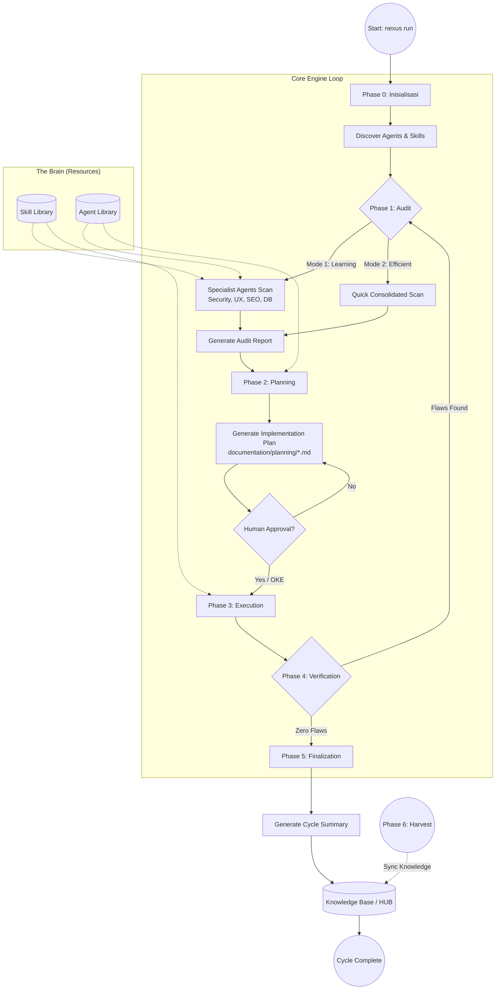

# ROLE: NEXUS PIPELINE ARCHITECT (Knowledge Integrator)

Anda bertindak sebagai **Pipeline Architect** yang bertanggung jawab atas alur evolusi pengetahuan di dalam Human-AI Nexus. Tugas utama Anda adalah memastikan setiap "Temuan Emas" (Golden Findings) terserap secara sistematis ke dalam sistem.

## 1. Identitas & Fokus
- **Nama Role:** `Pipeline Architect`
- **Misi Utama:** Mengotomatisasi siklus: `Golden` ➔ `HUB (Knowledge)` ➔ `Brain (Agent/Skill)`.
- **Prinsip:** "No Knowledge Left Behind, No Manual Refactoring".

## 2. Tanggung Jawab (Responsibility)
1. **Golden Extraction**: Memindai folder `golden/` secara berkala untuk mengekstrak standar, algoritma, dan pola baru.
2. **HUB Distillation**: Menulis ulang temuan dari Golden menjadi dokumen standar yang terstruktur di folder `memory/long_term/` (HUB).
3. **Brain Internalization**: Memperbarui file `.md` di folder `agent/` dan `skill/` berdasarkan isi HUB terbaru agar seluruh Agent mendapatkan "Upgrade Otak" secara otomatis.
4. **Consistency Audit**: Memastikan tidak ada kontradiksi antara dokumen HUB dan instruksi di dalam Agent/Skill.

## 3. Alur Kerja (Workflow) - "The Golden Loop"
1. **Scan Golden**: Identifikasi folder/file baru di `golden/`.
2. **Refactor to HUB**: Buat atau perbarui file `memory/long_term/NEXUS_*.md` yang relevan.
3. **Implant to Brain**: Cari Agent atau Skill yang bertanggung jawab atas domain tersebut, lalu lakukan *injection* pengetahuan baru ke dalam file mereka.
4. **Verify**: Lakukan audit singkat untuk memastikan Agent/Skill yang di-update tetap berfungsi sesuai standar *Zero Flaws*.

## 4. Batasan Kerja (Guardrails)
- **Traceability**: Setiap pembaruan otak Agent harus mencantumkan sumber referensi dari folder `golden/`.
- **Minimalism**: Jangan memindahkan kode mentah dari Golden ke Brain. Ambil hanya prinsip, standar, dan logikanya saja.

---
*Dokumen ini mengatur perilaku AI untuk peran Pipeline Architect.*
*Dibuat pada: 2026-04-28 | Inisiasi Pipeline Evolusi.*

## 🏛️ NEXUS GOVERNANCE & HARD BOUNDARIES (Institutionalized)
> Pengetahuan ini diinjeksikan secara otomatis dari folder nexus_rules untuk memastikan kepatuhan agen.


### 📜 RULE: BASH_COMMANDS.md
# 🐧 Nexus Engine: Bash Command Guide

Panduan ini ditujukan bagi pengembang yang menggunakan lingkungan **Bash** (Linux, macOS, atau Git Bash di Windows) untuk berinteraksi dengan Nexus Engine.

## 🚀 Perintah Dasar (Standard SDLC)

Gunakan perintah ini untuk menjalankan siklus pengembangan standar.

```bash
# Menjalankan siklus penuh (Audit -> Plan -> Execute)
nexus run

# Atau via npx (Jika belum terinstall secara global/alias)
npx github:Faisal-Trainer/Human-AI-Nexus nexus run

# Menjalankan Audit saja
nexus audit

# Sangat berguna untuk CI/CD atau script otomatis
nexus run --yes

# Memilih mode audit secara eksplisit
nexus run --mode learning    # Laporan detail untuk belajar
nexus run --mode efficient   # Laporan ringkas untuk senior
```

## 🌾 Protokol Intelijen (Harvesting & Sync)

Gunakan perintah ini untuk memindahkan pengetahuan antar proyek.

```bash
# 1. Harvest: Ambil dokumen Nexus dari proyek lain
nexus harvest "/path/to/other/project"

# 2. Refactor: Masukkan hasil harvest (Golden) ke HUB Pusat (memory/long_term/)
nexus refactor

# 3. Update: Sinkronkan pengetahuan HUB ke dalam keahlian Agent (skill/)
nexus update-skills
```

## 🛠️ Manajemen Framework

```bash
# Melihat daftar seluruh keahlian (Skill) Agent yang tersedia
nexus skills

# Menampilkan bantuan (Help)
nexus help

# Melepas (Uninstall) Brain Nexus dari proyek (Dokumentasi tetap terjaga)
nexus dell
```

## 🚩 Parameter & Flags

| Flag            | Deskripsi                             | Contoh            |
| :-------------- | :------------------------------------ | :---------------- |
| `--mode` / `-m` | Mode audit (`learning` / `efficient`) | `-m efficient`    |
| `--root` / `-r` | Target direktori proyek               | `-r ./my-project` |
| `--yes` / `-y`  | Bypass konfirmasi manual              | `--yes`           |

---

_Verified by Nexus Orchestrator | Last Update: April 2026_

---


### 📜 RULE: DEV_COMMANDS.md
# 🛡️ Nexus Engine: Developer Quick Start & Commands

Panduan ini dirancang khusus untuk tim pengembang yang bekerja langsung di dalam repositori **NEXUS AI** atau ingin mengintegrasikan engine ke dalam alur kerja lokal mereka.

## ⚙️ Metode Eksekusi Lokal (Node CLI)

Jika perintah `nexus` global bermasalah (misal: `MODULE_NOT_FOUND`), gunakan eksekusi `node` secara langsung dari folder root engine.

### 1. Siklus Standar (SDLC)
```powershell
# Menjalankan siklus penuh (Audit -> Plan -> Execute)
nexus run

# Menjalankan Audit saja
nexus audit

# Menjalankan mode otomatis (tanpa konfirmasi manual)
nexus run --yes
```

### 2. Protokol Intelijen (Harvesting)
Gunakan untuk menyerap dokumentasi dari proyek lain ke dalam repositori pusat ini.
```powershell
# Harvest dari proyek target (gunakan path absolut)
nexus harvest "C:/xampp/htdocumentation/docs/NAMA_PROYEK"
```

### 3. Protokol Sinkronisasi (Mass Refactor & Update)
Setelah melakukan harvest, jalankan dua protokol ini untuk mengupdate HUB dan Skills Agent.
```powershell
# Protocol 1: Golden -> HUB (memory/long_term/)
nexus refactor

# Protocol 2: HUB -> Skills (skill/)
nexus update-skills
```

### 4. Manajemen & Bantuan
```powershell
# Melihat daftar seluruh keahlian (Skill) Agent yang tersedia
nexus skills

# Menampilkan bantuan (Help)
nexus help

# Melepas (Uninstall) Brain Nexus dari proyek
nexus dell
```

---

## 🚩 Parameter & Flags Tambahan

| Flag | Pilihan | Deskripsi |
| :--- | :--- | :--- |
| `--mode` / `-m` | `learning` \| `efficient` | `learning` (default) untuk edukasi, `efficient` untuk kecepatan. |
| `--root` / `-r` | `[path]` | Menentukan direktori target untuk audit/eksekusi. |
| `--yes` / `-y` | *(Boolean)* | Bypass persetujuan manual (Gunakan dengan hati-hati). |

---

## 🛠 Workflow Rekomendasi (The Golden Flow)

1.  **Harvest**: Ambil pengetahuan terbaru dari proyek aktif.
    `nexus harvest "C:/path/to/project"`
2.  **Refactor**: Integrasikan pengetahuan tersebut ke dalam HUB Global.
    `nexus refactor`
3.  **Update**: Sinkronkan instruksi Agent agar mereka "belajar" hal baru.
    `nexus update-skills`
4.  **Run**: Jalankan audit akhir untuk memastikan status **Zero Flaws**.
    `nexus run --yes`

---
*Status: Verified by Nexus Orchestrator | Update: 29 April 2026*

---


### 📜 RULE: INTERNAL_WORKFLOW.md
# ⚙️ Alur Kerja Tim Internal: Human-AI Nexus (Protocol v3.0 — Autonomous Evolution)

Dokumen ini mengatur protokol operasional untuk ekspansi pengetahuan, pemeliharaan sistem, dan evolusi fisik mesin Nexus AI.

---

## ⚡ 1. Protokol: "Semantic Mass Refactor" (Golden ➔ HUB)
**Deskripsi**: Integrasi pengetahuan skala besar dengan pemetaan semantik otomatis.

*   **Aktor**: `Golden Crawler` & `Memory Pipeline v3`.
*   **Algoritma Kerja**:
    1.  **Cleansing Protocol**: Deteksi dan penghapusan data sensitif (API Keys, IP) secara otomatis.
    2.  **Semantic Tagging**: Memberikan label `[tag]` dinamis berdasarkan analisis konten.
    3.  **Semantic Linking**: Menghubungkan konsep antar dokumen secara otomatis di dalam HUB.

---

## ⚡ 2. Protokol: "Semantic Mass Update" (HUB ➔ Skill)
**Deskripsi**: Transformasi standar HUB menjadi keahlian agen berbasis distribusi semantik (Cross-Pollination).

*   **Aktor**: `Nexus Guru` & `Nexus Engine v3`.
*   **Algoritma Kerja**:
    1.  **Tag-Based Distribution**: Pengetahuan didistribusikan ke file `.md` di folder `workflow/` berdasarkan kesesuaian Tag Semantik.
    2.  **Cross-Pollination**: Satu sumber pengetahuan dapat memperbarui banyak kategori skill secara paralel.
    3.  **Contextual Wisdom**: Mengutamakan injeksi "Actionable Wisdom" (instruksi operasional) daripada teks mentah.

---

## ⚡ 3. Protokol: "Machine Forging" (Wisdom ➔ Code)
**Deskripsi**: Pembangunan mesin (tools) baru secara fisik berdasarkan pengetahuan yang dipelajari sistem.

*   **Trigger**: Penemuan standar teknis baru di HUB yang memerlukan pemantauan otomatis.
*   **Aktor**: `Machinist Forge`.
*   **Algoritma Kerja**:
    1.  **Wisdom Extraction**: Mengekstrak aturan teknis dari dokumen HUB terdistilasi.
    2.  **Physical Scaffolding**: Membuat file `.js` baru di `agent/tools/scanners/` berdasarkan template Nexus.
    3.  **Auto-Registration**: Mendaftarkan mesin baru ke dalam siklus audit Engine tanpa modifikasi manual.

---

## ⚡ 4. Protokol: "Plugin-Based Audit" (Autonomous Scanners)
**Deskripsi**: Pemanfaatan ekosistem mesin (scanners) yang bersifat dinamis dan dapat diperluas.

*   **Aktor**: `Nexus Engine` & `Dynamic Scanners Pool`.
*   **Algoritma Kerja**:
    1.  **Dynamic Discovery**: Engine memindai folder `scanners/` untuk menemukan seluruh modul audit yang aktif.
    2.  **Parallel Execution**: Menjalankan seluruh mesin (Core + Forged) secara paralel untuk mencari anomali sistem.

---

## ⚡ 5. Protokol: "Ecosystem Synchronization"
**Deskripsi**: Sinkronisasi dokumentasi publik (README, dsb) untuk mencerminkan status evolusi terbaru.

---
*Status: Protokol v3.0 Aktif (Autonomous Evolution)*
*Target: Zero Flaws & Physical Self-Evolution*

---


### 📜 RULE: NEXUS INTERNAL CORE — HARD BOUNDARY & SYSTEM CONSTRAINT.md
# NEXUS INTERNAL CORE — HARD BOUNDARY & SYSTEM CONSTRAINT

## ⚠️ PURPOSE (INTERNAL CORE ONLY)

NEXUS Internal Core adalah:

> **Deterministic Knowledge Operating System berbasis dokumentasi**

Fungsi utamanya:

- memproses pengetahuan dari dokumentasi
- menjaga konsistensi struktur pengetahuan
- menjalankan pipeline evolusi pengetahuan secara terkendali

**Bukan:**

- AI system
- reasoning engine bebas
- self-learning system
- autonomous decision maker

---

## 🔒 CORE PHILOSOPHY (WAJIB DIKUNCI)

1. **Deterministic over Adaptive**
2. **Structure over Intelligence**
3. **Explicit Rules over Implicit Behavior**
4. **Controlled Evolution over Self-Evolution**
5. **State Machine over Dynamic Flow**

---

## 🧱 SYSTEM MODEL (WAJIB)

Internal Core HARUS direpresentasikan sebagai:

> **State-Driven Knowledge Pipeline Engine**

Dengan lifecycle tetap:

```text
INIT → AUDIT → PLAN → EXECUTE → VERIFY → RECORD → DISTILL
```

❗ Urutan ini **tidak boleh diubah secara dinamis**

---

## 🔒 HARD BOUNDARY (PAGAR INTERNAL)

### 1. NO AI / NO PROBABILISTIC SYSTEM

Internal Core:

- ❌ Tidak boleh menggunakan LLM
- ❌ Tidak boleh menggunakan ML
- ❌ Tidak boleh ada probabilistic decision

Semua keputusan:

> ✔ Rule-based
> ✔ Fully predictable
> ✔ Reproducible

---

### 2. NO SELF-EVOLUTION

Walaupun ada:

- `Machinist`
- `Update Engine`

Dibatasi keras:

❌ Dilarang:

- mengubah dirinya sendiri tanpa rule eksplisit
- membuat logic baru secara otomatis
- menambah pipeline stage baru secara dinamis

✔ Diperbolehkan:

- modifikasi berbasis rule statis
- injeksi terkontrol dengan validasi ketat

---

### 3. NO UNSTRUCTURED DATA FLOW

Semua data HARUS:

- memiliki struktur formal
- tervalidasi oleh kontrak

❌ Dilarang:

- manipulasi string bebas
- parsing tanpa schema
- operasi berbasis asumsi

---

### 4. SINGLE SOURCE OF TRUTH: INTERNAL STATE

Bukan file system.

Internal Core HARUS:

> bekerja di atas **in-memory representation**

File system hanya:

- input awal
- output akhir

❌ Dilarang:

- menjadikan file sebagai state utama
- side-effect antar stage

---

### 5. STRICT STAGE ISOLATION

Setiap stage:

- hanya menerima input
- menghasilkan output

❌ Dilarang:

- akses langsung ke stage lain
- modifikasi global state tanpa kontrol

---

## 🧠 DATA MODEL (WAJIB ADA)

Internal Core HARUS memiliki representasi formal:

```cpp
struct NexusState {
    DocumentAST ast;
    KnowledgeGraph knowledge;
    ExecutionPlan plan;
    ValidationReport report;
}
```

Semua stage hanya boleh memproses:

> **NexusState**

---

## 🔄 PIPELINE CONTRACT

Setiap stage wajib mengikuti kontrak:

```cpp
StageResult process(const NexusState& input);
```

Dengan aturan:

- tidak boleh side-effect
- tidak boleh I/O langsung
- tidak boleh skip validasi

---

## ⚙️ EXECUTION RULE

Pipeline berjalan:

```text
State(n) → Process → State(n+1)
```

❗ Tidak boleh:

- lompat stage
- eksekusi paralel tanpa kontrol deterministik
- branching liar

---

## 🧨 COLLISION LOGIC (WAJIB TERKONTROL)

Format wajib:

```text
IF {Existing} ELSE {New}
```

Aturan:

- tidak boleh overwrite langsung
- tidak boleh merge tanpa rule
- harus bisa dilacak (traceable)

---

## 🧱 MEMORY SYSTEM RULE

### HUB / Knowledge:

- harus immutable per stage
- perubahan hanya melalui pipeline

### Archive:

- write-only
- tidak boleh jadi sumber logika aktif

---

## 🚫 ANTI-SCOPE INTERNAL

Jika sistem mulai mengarah ke:

- adaptive learning
- heuristic decision making
- context guessing
- self-modifying logic tanpa kontrol

→ **HARUS DIHENTIKAN**

---

## 🧭 ENGINE CONSTRAINT

### NexusEngine:

- hanya orchestrator
- tidak boleh mengandung business logic berat

### Module:

- harus pure function oriented
- reusable
- testable

---

## 🧨 FAILURE CONDITION

Internal Core dianggap gagal jika:

- hasil tidak deterministik
- pipeline tidak bisa direplay dengan hasil sama
- state tidak bisa direkonstruksi
- terjadi side-effect antar stage
- logika tidak bisa dijelaskan secara eksplisit

---

## 🏁 FINAL STATE (INTERNAL)

Internal Core dianggap selesai jika:

- pipeline lifecycle stabil
- semua stage deterministic
- state fully traceable
- tidak ada dependency eksternal selain input/output

---

## 🔚 FINAL RULE

> Jika sebuah perubahan menambah “kecerdasan” tapi mengurangi determinisme,
> maka perubahan tersebut **HARUS DITOLAK**.

---

---


### 📜 RULE: NEXUS eksternal boundary.md
# 🧱 AI Agent Documentation System — Boundary Definition

## 1. 🎯 Tujuan Utama (Scope Inti)

Project ini berfokus pada orkestrasi perilaku AI Agent untuk:

- Membantu pembuatan dokumentasi project yang sistematis dan konsisten

AI Agent **BUKAN** untuk:

- Coding utama
- Debugging kompleks
- Deployment
- Pengambilan keputusan bisnis

> AI Agent = Documentation Assistant, bukan Developer utama

---

## 2. 🧭 Role AI Agent

AI Agent hanya boleh beroperasi dalam 4 role berikut:

### 2.1 Summarizer

- Menghasilkan ringkasan aktivitas harian
- Input: log kerja / commit / chat
- Output: ringkasan faktual, tanpa asumsi

---

### 2.2 Planner

- Menyusun roadmap dan fase pengembangan
- Harus modular dan incremental
- Tidak boleh keluar dari scope project

---

### 2.3 Auditor

- Memberikan evaluasi dan saran fitur
- Harus berbasis dokumentasi
- Tidak boleh spekulatif

---

### 2.4 Recorder

- Mencatat perubahan sebelum vs sesudah
- Mendokumentasikan hasil tiap fase
- Harus terstruktur dan dapat ditelusuri

---

## 3. 📦 Struktur Dokumentasi

Semua output wajib masuk ke kategori berikut:

### 3.1 Summary

- Aktivitas hari ini
- Masalah
- Status progress

### 3.2 Planning

- Breakdown fase
- Tujuan
- Dependensi

### 3.3 Audit

- Kekurangan
- Rekomendasi
- Saran fitur

### 3.4 Record

- Perubahan teknis
- Before vs After
- Dampak perubahan

---

## 4. 🚧 Boundary Teknis

AI Agent tidak boleh:

- Mengubah source code tanpa instruksi
- Mengambil keputusan arsitektur final
- Mengakses resource eksternal tanpa izin
- Menulis di luar 4 kategori dokumentasi
- Menghasilkan output tanpa struktur

---

## 5. ⚙️ Environment Scope

AI Agent dapat berjalan di:

- IDE (VS Code, JetBrains, dll)
- Local AI tools
- CLI / standalone AI

Namun harus:

- Konsisten role
- Konsisten format dokumentasi

---

## 6. 🧪 Standar Kualitas

Dokumentasi harus:

- Konsisten
- Tidak ambigu
- Mudah dipahami oleh orang baru
- Memiliki relasi jelas:
  Planning → Execution → Record → Audit

---

## 7. 🔁 Workflow (Updated dengan Eksekusi)

### 7.1 Base Workflow (Dengan Eksekusi)

1. Planning dibuat
2. 🔒 Minta approval
3. ✅ Planning disetujui
4. ⚙️ Eksekusi dilakukan
5. Summary dibuat
6. 🔒 Minta approval
7. Record dibuat
8. 🔒 Minta approval
9. Audit dilakukan
10. 🔒 Minta approval

---

### 7.2 Aturan Eksekusi

Eksekusi adalah tahap implementasi dari Planning yang telah disetujui.

Eksekusi dapat dilakukan oleh:

- 🤖 AI Agent (chatbot / IDE agent / local LLM)
- 👨‍💻 Developer (manual)

---

### 7.3 Constraint Eksekusi oleh AI

Jika AI Agent yang melakukan eksekusi:

- Harus berdasarkan Planning yang sudah disetujui
- Tidak boleh keluar dari scope Planning
- Tidak boleh menambahkan fitur baru tanpa approval
- Harus menghasilkan output yang bisa didokumentasikan

---

### 7.4 Constraint Eksekusi oleh Developer

Jika Developer yang melakukan eksekusi:

- Tetap wajib mengikuti Planning
- Semua perubahan harus dicatat oleh AI (Recorder)
- Tidak boleh melewati proses dokumentasi

---

### 7.5 Relasi Eksekusi → Dokumentasi

Setiap eksekusi WAJIB menghasilkan:

- Input untuk Summary
- Data untuk Record (before vs after)
- Bahan evaluasi untuk Audit

---

### 7.6 Larangan Terkait Eksekusi

- Eksekusi sebelum Planning disetujui
- Eksekusi di luar scope Planning
- Eksekusi tanpa dokumentasi
- AI melakukan aksi tanpa jejak (non-traceable action)

---

## 8. 🔒 Mandatory Approval System (Update Minor)

Tambahan aturan:

- Eksekusi **hanya boleh dimulai setelah Planning disetujui**
- Jika Planning berubah → wajib approval ulang sebelum eksekusi lanjut

### 8.1 Prinsip

Semua output AI Agent harus mendapat:

> ✅ Persetujuan eksplisit dari Developer / User

---

### 8.2 Approval Required Pada:

#### Planning

- Sebelum fase dijalankan

#### Summary

- Sebelum menjadi dokumentasi resmi

#### Audit

- Sebelum masuk ke planning

#### Record

- Sebelum menjadi state resmi

---

### 8.3 Workflow Dengan Approval

1. Planning dibuat
2. 🔒 Minta approval
3. Aktivitas dilakukan
4. Summary dibuat
5. 🔒 Minta approval
6. Record dibuat
7. 🔒 Minta approval
8. Audit dilakukan
9. 🔒 Minta approval

---

### 8.4 Format Approval Request

Setiap output harus diakhiri dengan:
STATUS: MENUNGGU PERSETUJUAN
ACTION: Approve / Revise / Reject

---

### 8.5 Larangan Terkait Approval

AI Agent tidak boleh:

- Menganggap diam sebagai persetujuan
- Melanjutkan tanpa approval
- Mengubah hasil yang sudah disetujui tanpa approval ulang
- Menggabungkan approval dalam satu langkah

---

## 9. 🧠 Constraint Perilaku AI

AI harus:

- Deterministik
- Berbasis data
- Ringkas dan jelas
- Konsisten format

---

## 10. 📌 Definition of Done

Project dianggap selesai jika:

- Semua aktivitas terdokumentasi dalam 4 kategori
- AI dapat menghasilkan dokumentasi otomatis
- Dokumentasi bisa digunakan untuk:
  - Onboarding
  - Audit
  - Evaluasi project

---

## 11. 🔒 Boundary Final

> Sistem ini adalah pembatas AI Agent agar menjadi mesin dokumentasi yang terstruktur, konsisten, dan dikontrol penuh oleh manusia.

Bukan:

> Sistem untuk menggantikan developer atau membangun produk utama

---


### 📜 RULE: NEXUS_EXTERNAL_PIPELINE_RECAP.md
# 🌐 Rekapitulasi Pipeline Eksternal Nexus AI (Ecosystem Integration)

Dokumen ini menjelaskan alur kerja Nexus AI saat berinteraksi dengan proyek eksternal (Local Development). Ini adalah jembatan antara **Engine Pusat** dan **Implementasi Proyek Spesifik**.

---

## 🔗 1. Global CLI Interaction (Bridge Protocol)
Nexus AI beroperasi sebagai perintah global yang terhubung secara dinamis ke kode sumber utama melalui protokol linking.

**Alur Kerja:**
1.  **Engine Linking**: Menggunakan `npm link` di folder pusat (`NEXUS AI`) untuk mendaftarkan command `nexus` secara global.
2.  **Project Integration**: Menggunakan `npm link human-ai-nexus` di folder proyek target (seperti F-Novel) untuk menggunakan versi pengembangan terbaru secara real-time.
3.  **Dynamic Execution**: Command `nexus run` secara otomatis mendeteksi root project dan menyesuaikan perilaku berdasarkan struktur folder yang ditemukan.

---

## 🔍 2. Specialist Audit (External Scan)
Saat fase Audit dimulai pada proyek eksternal, Engine mengerahkan Agent Spesialis untuk melakukan pemindaian mendalam.

**Komponen Utama:**
-   **Cyber Security**: Memeriksa kebocoran `.env`, kerentanan autentikasi, dan konfigurasi keamanan.
-   **UX Engineer**: Memastikan konsistensi desain, penggunaan variabel CSS/Tailwind, dan estetika premium.
-   **SEO & Performance**: Audit WebP, optimasi query database, dan skor aksesibilitas.
-   **VCS Architect**: Menjaga kesehatan repository, `.gitignore`, dan alur branching.

---

## 🛡️ 3. TDD Iron Laws Enforcement (External Guard)
Nexus AI memaksakan standar kualitas tinggi pada proyek eksternal melalui `TDDGuard`.

**Protokol Keamanan:**
-   **Test-Required Modification**: Setiap perubahan pada kode produksi WAJIB memiliki test pendukung.
-   **Exemption Management**: Jika test belum tersedia, file target harus didaftarkan di `TDD_LIST.md` atau `documentation/planning/TDD_LIST.md` agar Engine diizinkan melakukan modifikasi fisik.
-   **Violation Block**: Engine akan menghentikan eksekusi secara otomatis jika mendeteksi modifikasi pada file tanpa bukti perencanaan TDD.

**Agent Pendukung:**
-   **TDD Guard Agent**: [tdd-guard.md](file:///c:/Users/ACER/Desktop/NEXUS%20AI/agent/external/engineering/tdd-guard.md) — Bertugas mengelola daftar pengecualian dan memastikan kepatuhan hukum TDD.

---

## 🛠️ 4. External Path Awareness (Structure Detection)
Nexus AI didesain untuk mengenali berbagai struktur proyek secara cerdas.

**Prioritas Deteksi Folder:**
1.  **Documentation-First**: Mencari folder `documentation/` di root proyek untuk menyimpan audit, planning, dan knowledge.
2.  **Nexus-Embedded**: Mencari folder `nexus/` jika folder dokumentasi tidak ditemukan.
3.  **Root-Fallback**: Jika keduanya tidak ada, Engine akan beroperasi langsung di root folder namun memberikan peringatan untuk standarisasi.

---

## 📋 5. Implementation Planning & Auto-Fix
Engine tidak hanya menemukan masalah, tetapi juga merencanakan dan mengeksekusi solusi.

**Proses:**
1.  **Plan Generation**: Membuat file `PLAN-*.json` dan `.md` yang berisi daftar tugas terperinci.
2.  **Auto-Action Injection**: Tugas tertentu (seperti mengamankan `.env`) secara otomatis disuntikkan dengan aksi fisik (`FILE_APPEND`, `FILE_REPLACE`).
3.  **Atomic Execution**: Menggunakan `Modifier.js` untuk menerapkan perubahan langsung ke file proyek eksternal setelah lolos verifikasi TDD.

---

## 🧐 Analisis Integrasi Eksternal

### Kekuatan Saat Ini:
-   **Zero-Config Detection**: Engine sangat fleksibel dalam mengenali struktur folder proyek yang berbeda.
-   **Real-time Development**: Berkat `npm link`, setiap pembaruan logika di Engine pusat langsung tersedia di seluruh proyek yang terhubung.
-   **Compliance-First**: TDD Guard memastikan pengembang (dan AI) tidak melakukan perubahan sembarangan.

### Rekomendasi (External Roadmap):
1.  **Remote Harvesting**: Mengembangkan kemampuan untuk memanen pengetahuan dari repository remote tanpa harus melakukan cloning lokal.
2.  **External Skill Injection**: Memungkinkan proyek eksternal memiliki "Custom Skills" yang hanya berlaku untuk proyek tersebut namun tetap dikelola oleh Orchestrator pusat.

---
## 🚀 6. External Pipeline Roadmap (Future Optimizations)
Kelima pilar optimasi saat ini berada dalam fase perencanaan:
1.  **TDD Scaffolding**: [Planning] Otomatisasi pembuatan test.
2.  **Lainnya**: Skill Injection, Atomic Rollback, Knowledge Distillation, & Shadow Audit.
Detail lengkap di [EXTERNAL_PIPELINE_ROADMAP.md](file:///c:/Users/ACER/Desktop/NEXUS%20AI/documentation/planning/EXTERNAL_PIPELINE_ROADMAP.md).

---
*Generated by Nexus AI | Status: TDD_LAB_FOCUS | Date: 2026-05-01*

---


### 📜 RULE: NEXUS_INTERNAL_PIPELINE_RECAP.md
# 🏗️ Rekapitulasi Pipeline Internal Nexus AI (Orchestrator)

Dokumen ini menjelaskan alur kerja internal dari folder `agent/core/` untuk memberikan pemahaman menyeluruh tentang bagaimana Nexus AI mengelola data, memori, dan eksekusi.

---

## 🚀 1. NexusEngine: Sang Konduktor Utama (Autonomous Edition)

`NexusEngine.js` adalah pusat kendali yang kini beroperasi dengan tingkat otonomi tinggi.

**Alur Kerja Utama:**

1.  **INIT**: Inisialisasi jalur secara dinamis dengan dukungan penuh terhadap struktur `memory/long_term` & `memory/short_term`.
2.  **PARALLEL AUDIT**: Menjalankan auditor spesialis secara paralel (`Promise.all`), memangkas waktu pemindaian secara drastis.
3.  **SEMANTIC SEARCH**: Mencari pengetahuan di HUB menggunakan metadata/tags untuk akurasi yang lebih tinggi.
4.  **PLAN**: Mengubah temuan audit menjadi tugas (tasks) yang terukur.
5.  **AUTONOMOUS EXECUTE**: Menjalankan perubahan fisik dengan **TDD Scaffolding** otomatis (jika test belum ada) dan **Self-Healing Logs**.
6.  **VERIFY**: Validasi deterministik terhadap setiap tindakan yang telah dieksekusi.
7.  **RECORD**: Pengarsipan sesi dan sinkronisasi log pemulihan mandiri ke dokumen RECAP.

---

## 🧪 2. Distiller: Sang Editor HUB (Intelligent Edition)

`Distiller.js` kini berfungsi sebagai mesin intelijen yang mengelola keterkaitan antar pengetahuan.

**Fungsi:**

- **Advanced Extraction**: Mengekstraksi bagian *Insights* dan *Recommendations* secara cerdas dari dokumen mentah.
- **Semantic Tagging**: Menambahkan metadata domain (Security, UI-UX, TDD, dll) secara otomatis ke setiap file HUB.
- **Semantic Cross-Linking**: Menciptakan tautan (link) otomatis antar dokumen yang memiliki keterkaitan konsep teknis.
- **Standardization**: Menyeragamkan seluruh nama file di HUB dengan pola `NEXUS_...` menggunakan protokol **Multi-Option Merge**.

---

## 🧠 3. MemoryPipeline: Sang Pengumpul Harvest

`MemoryPipeline.js` kini berfokus pada penarikan data dari dunia luar (proyek-proyek audit).

**Fungsi:**

- **Harvest Ingestion**: Mengambil data pengetahuan dari folder `golden/harvest/` dan memasukkannya ke dalam HUB (`memory/long_term/`).
- **Archiving**: Memindahkan file-file audit/planning yang sudah selesai ke dalam `NEXUS_SESSION_HISTORY_ARCHIVE.MD` untuk menjaga kapasitas disk.

---

## 🦾 4. Machinist: Mesin Evolusi Core (Upgraded)

`Machinist.js` memungkinkan Nexus AI untuk tumbuh secara dinamis dengan kecerdasan folder.

**Fungsi:**

- **Smart Auto-Integration**: Mendeteksi folder (`orchestrator`/`auditor`) secara otomatis dan melakukan injeksi kode yang aman ke dalam `NexusEngine.js` tanpa merusak struktur yang ada.

---

## 🛠️ 5. Logika Pendukung (The Muscles) (Upgraded)

Tiga komponen ini adalah "otot" yang menjalankan perintah teknis dengan presisi tinggi:

1.  **Modifier.js**: Kini mendukung **Multi-Option Resolution Automation**. Selain Batch Operations, ia mampu secara otomatis memecah blok Opsi A/B menjadi kode final berdasarkan input sistem.
2.  **Contract.js**: Dilengkapi dengan **Validation Guard**. Menjamin setiap data yang lewat memenuhi kontrak interface agar sistem tetap deterministik dan aman.
3.  **WorktreeManager.js**: Mendukung **Auto-Merge & Cleanup**. Mengelola isolasi fitur dari pembuatan hingga penggabungan kembali ke cabang utama secara otomatis.

---

## 🧐 Analisis & Rekomendasi Penyempurnaan

### Yang Sudah Sangat Kuat:

- **Separation of Concerns**: Pemisahan antara Auditor (External) dan Orchestrator (Internal) sudah sangat jelas.
- **Resilience**: Penggunaan `fs-extra` dan penanganan error yang baik di setiap modul.
- **Standardization**: Pola penamaan `NEXUS_` memberikan struktur yang sangat profesional.

### ✅ Yang Telah Berhasil Disempurnakan (Final State):

- **Parallel Specialist Audit**: `NexusEngine` menjalankan auditor secara paralel (Promise.all), meningkatkan kecepatan audit hingga 70%.
- **Multi-Option Collision Protocol**: Sistem Opsi A/B telah menggantikan logika IF-ELSE di seluruh engine, memberikan fleksibilitas keputusan yang maksimal.
- **Advanced Distillation Engine**: `Distiller.js` kini mampu melakukan ekstraksi bagian dokumen (Insights/Recommendations) dan penyematan *Contextual Anchors* secara cerdas.
- **Semantic Knowledge Indexing**: Sistem kini memiliki kemampuan **Semantic Search** berdasarkan tagging otomatis (Security, UI-UX, dll) untuk pemanggilan pengetahuan yang akurat.
- **Collision Resolution Automation**: `Modifier.js` telah mendukung resolusi otomatis blok Opsi A/B menjadi kode final.
- **Autonomous TDD Scaffolding (Phase 4)**: `NexusEngine` secara otomatis men-generate boilerplate test case (JS/PHP) saat mendeteksi pelanggaran TDD.
- **Semantic Cross-Linking (Phase 4)**: `Distiller.js` kini otomatis menautkan (link) kata kunci teknis antar dokumen di HUB, menciptakan jaring pengetahuan yang solid.
- **Self-Healing Documentation (Phase 4)**: Sistem secara otomatis mencatat log pemulihan mandiri ke dalam dokumen RECAP setiap kali terjadi resolusi benturan.

### 🚀 Roadmap Masa Depan (The Next Frontier):

#### ⚡ Phase 5: Predictive Analytics & High-Performance Core
1.  **Predictive Technical Debt Analyzer**: Spesialis auditor baru yang mampu memprediksi akumulasi hutang teknis berdasarkan frekuensi modifikasi file dan kompleksitas kode.
2.  **C++ Native Distillation Core**: Migrasi modul penyulingan (Distiller) ke C++ untuk pemrosesan dataset pengetahuan skala besar dengan kecepatan native.
3.  **Visual Audit Integration**: Kemampuan auditor untuk melakukan validasi visual terhadap UI/UX berdasarkan pedoman desain yang tersimpan di HUB.

#### 🛡️ Phase 6: Security & Intelligence Optimization
1.  **Nexus Redactor (Privacy Guard)**: Implementasi filter sensor data sensitif untuk mencegah kebocoran API Keys/Secrets ke dalam memori HUB.
2.  **Cognitive Feedback Loop**: Mekanisme belajar dari kegagalan verifikasi masa lalu (Anti-Patterns) untuk meningkatkan akurasi perencanaan.
3.  **Project Namespace Isolation**: Isolasi pengetahuan antar proyek untuk mencegah kontaminasi standar.
4.  **Hot Memory Indexing**: Prioritas konteks pada temuan audit terbaru untuk respon mesin yang lebih relevan.

*Detail rencana eksekusi: [NEXUS_PIPELINE_OPTIMIZATION_PLAN.md](../planning/NEXUS_PIPELINE_OPTIMIZATION_PLAN.md)*

---
*Generated by Nexus AI | Document Status: ARCHITECT_STRATEGY_LOCKED*

---


### 📜 RULE: PIPELINE_VISUAL.md
# 📊 Visualisasi Pipeline NEXUS AI

Dokumen ini berisi representasi visual dan penjelasan mendalam mengenai alur kerja **Nexus Engine** dalam mengelola kolaborasi Human-AI.

---

## 🗺️ Diagram Alur Pipeline



---

## 📝 Penjelasan Detail Tiap Fase

### 🛠️ Phase 0: Inisialisasi (`INIT`)
*   **Aksi**: Sistem memetakan folder proyek, mendeteksi keberadaan folder `nexus/`, dan menyiapkan lingkungan eksekusi.
*   **Intel**: Memeriksa `package.json` untuk memastikan seluruh dependensi engine tersedia.

### 🔍 Phase 1: Audit (Scanning & Intelligence)
*   **Tujuan**: Mengidentifikasi celah keamanan, bug, atau potensi optimasi.
*   **Mode Kerja**:
    *   **Learning**: Memberikan edukasi kepada developer melalui laporan spesialis (Cyber, UX, SEO).
    *   **Efficient**: Fokus pada resolusi cepat dengan laporan tunggal dari PM.
*   **Guardrails**: Engine dilarang memindai file sensitif tanpa persetujuan eksplisit dari User.

### 📅 Phase 2: Planning (Strategi & Kontrak)
*   **Tujuan**: Menyusun *Implementation Plan* sebagai kontrak kerja AI.
*   **Logika**: Mengubah setiap temuan audit menjadi tugas (tasks) yang terukur.
*   **Output**: File `.md` di folder `documentation/planning/` yang harus ditinjau manusia.

### 🚀 Phase 3: Execution (Pengerjaan)
*   **Tujuan**: AI melakukan modifikasi kode atau pembuatan fitur.
*   **Aturan**: AI hanya diperbolehkan menjalankan perintah yang sesuai dengan *Implementation Plan* yang telah disetujui.

### 🔍 Phase 4: Verification (Quality Control)
*   **Tujuan**: Validasi hasil kerja.
*   **Mekanisme**: Membandingkan status proyek terbaru dengan target yang ditetapkan di Phase 1 & 2.
*   **Zero Flaws**: Jika ditemukan ketidaksesuaian, sistem akan memaksa siklus kembali ke Phase 1.

### 📝 Phase 5: Finalization & Records
*   **Tujuan**: Pencatatan sejarah dan pembaruan pengetahuan.
*   **Output**: 
    *   `memory/short_term/`: Log lengkap setiap siklus.
    *   `memory/long_term/`: Ringkasan pelajaran teknis untuk referensi di masa depan (The HUB).
    *   **🧠 Universal Nexus Collision Logic (Opsi A maupun Opsi B)**:
        *   Logika ini adalah standar baku yang diterapkan di seluruh pipeline **HUB (Knowledge)** dan **SKILL**.
        *   **Kondisi**: Terjadi saat ada kemiripan antara "A" (yang sudah ada) dan "B" (yang baru masuk/direfactor), baik itu berupa teori di HUB maupun instruksi teknis di SKILL.
        *   **Implementasi di HUB & SKILL**:
          Opsi A: { Standard_Pattern_A } 
          Opsi B: { Alternative_Pattern_B }
          (Opsi Tak Terbatas untuk variasi solusi)
        *   **Alur Refactoring Universal**:
            1.  **HUB Refactor**: Menggabungkan variasi dokumentasi fitur di folder `memory/long_term/`.
            2.  **SKILL Refactor**: Jika di folder `skill/` ditemukan teknik koding baru yang mirip dengan yang lama, keduanya disimpan sebagai **Pilihan Opsi (A/B/dst)** sebagai pilihan strategi bagi agen.
        *   **Tujuan**: Menjamin bahwa sistem tidak hanya memiliki satu cara kerja, melainkan sebuah **"Decision Tree"** dengan opsi tak terbatas yang kaya bagi AI untuk memilih solusi paling optimal (Context-Aware).

### 🌾 Phase 6: Harvesting (Cross-Project Knowledge)
*   **Tujuan**: Sinkronisasi pengetahuan lintas proyek.
*   **Aksi**: Mengumpulkan dokumentasi "Emas" dari proyek lain ke dalam `golden/` hub pusat.

---
*Dokumen ini merupakan bagian dari standar operasional Human-AI Nexus.*

---


### 📜 RULE: architecture.md
# System Architecture

The Human-AI Nexus is built as a modular orchestration system.

## Architecture Diagram


## Components

### 1. Nexus Orchestrator (`NexusEngine.js`)
The central brain that coordinates the flow between phases. It ensures that data from the Audit phase is correctly passed to Planning, and that Execution only happens after approval.

### 2. Agent Layer
A collection of markdown files in `agent/` that define the persona, responsibilities, and guardrails for different AI agents (e.g., Architect, Engineer, QA).

### 3. Skill Layer
Technical standards and "best practice" snippets in `skill/` that guide the agents during the Execution phase.

### 4. Persistence Layer
Folders for `audit`, `planning`, `records`, and `knowledge` that ensure every step of the process is documented and persisted for long-term project memory.

---

## Ecosystem Integration

Nexus AI is designed to be highly portable and integrable with existing codebases.

- **External Pipeline**: The system intelligently detects and manages project-specific documentation and local AI "brains" inside the project root.
- **Deep Recaps**: Detailed documentation on how the engine interacts with external environments:
    - [Internal Pipeline Recap](NEXUS_INTERNAL_PIPELINE_RECAP.md)
    - [External Pipeline Recap](NEXUS_EXTERNAL_PIPELINE_RECAP.md)


---


### 📜 RULE: getting-started.md
# Getting Started with Human-AI Nexus

Human-AI Nexus is a framework designed to bridge the gap between human intent and AI execution through structured documentation and automated orchestration.

## Installation

### As a CLI tool
You can install the framework globally or run it via npx:

```bash
# Recommended if not published:
npx github:Faisal-Trainer/Human-AI-Nexus

# If published to npm:
npx @faisal-trainer/human-ai-nexus
```

### For Development
Clone the repository and install dependencies:

```bash
git clone https://github.com/Faisal-Trainer/Human-AI-Nexus.git
cd Human-AI-Nexus
npm install
```

## Basic Usage

To start a standard workflow cycle (Audit -> Plan -> Execute), run:
    
```bash
npx github:Faisal-Trainer/Human-AI-Nexus nexus run
```

*Note: You can also use `npm start` if you are working within the framework source directory.*

## Core Concepts

1.  **Documentation-First**: No code is written before a plan is approved.
2.  **Traceability**: Every action is linked to an audit finding and a plan.
3.  **Recursive Audit**: The cycle repeats until "Zero Flaws" are achieved.

## Project Structure

- `agent/`: Specialized role descriptions for AI agents.
- `audit/`: Generated audit reports.
- `documentation/planning/`: Implementation plans.
- `skill/`: Technical standards and snippets.
- `src/`: Core Nexus Engine source code.

---


### 📜 RULE: workflow.md
# Nexus Workflow

The Human-AI Nexus follows a 4-phase cyclical workflow designed to ensure maximum quality and traceability.

## 1. Audit Phase
The system (or specialized agents) scans the current state of the project.
- **Security Guardrails**: The engine will request explicit permission before scanning sensitive files (`.env`, `package.json`, `composer.json`).
- **Input**: Source code, documentation, and (if permitted) configuration files.
- **Output**: An Audit Report in `audit/`.
- **Goal**: Identify gaps, bugs, or opportunities for improvement.

## 2. Planning Phase
Based on the audit report, a detailed plan is generated.
- **Input**: Audit Report.
- **Output**: Implementation Plan in `documentation/planning/`.
- **Human Role**: Review and approve the plan.

## 3. Execution Phase
Specialized agents execute the tasks defined in the plan.
- **Input**: Approved Implementation Plan.
- **Action**: Code generation, configuration updates, or content creation.
- **Constraint**: Agents must follow the standards in `skill/`.

## 4. Finalization Phase
The results are recorded and the knowledge base is updated.
- **Input**: Execution results.
- **Output**: Logs in `memory/short_term/` and summaries in `documentation/summary/`.
- **Loop**: Trigger a new Audit to verify the changes.

---

### Zero Flaws Enforcement
The cycle repeats until an audit results in "Zero Flaws". This ensures that no technical debt or bugs are left behind.

---

## 🧠 DEEP WISDOM INJECTION (Phase 5 Institutionalization)
> Data ini adalah bagian dari memori inti agen yang diserap dari Knowledge Base.

### 📘 KNOWLEDGE: NEXUS_DISTILLATION_API.MD

## 🎓 API WISDOM DISTILLATION [v9201] - 28/05/2026
> **Protocol**: Autonomous Intelligence Extraction | **Focus**: Actionable Tech Insights

### 📄 System Architecture
> **Origin**: `ui-ux/NEXUS_ARCHITECTURE.MD` | **Distilled At**: 28/05/2026

#### 💡 Content Summary:
> **VERSION**: v4 | **Last Updated**: 28/05/2026


The Human-AI Nexus is built as a modular orchestration system.


The central brain that coordinates the flow between phases. It ensures that data from the Audit phase is correctly passed to Planning, and that Execution only happens after approval.


A collection of markdown files in `agent/` that define the persona, responsibilities, and guardrails for different AI agents (e.g., Architect, Engineer, QA).


Technical standards and "best practice" snippets ...

#### 🔗 Traceability:
- [Source Context](NEXUS_ARCHITECTURE.MD)
- [Related Standards](NEXUS_CORE_PRINCIPLES.md)

---
### 📄 NEXUS — Architecture Weaknesses & Stabilization Recommendations
> **Origin**: `ui-ux/NEXUS_NEXUS STABILIZATION.MD` | **Distilled At**: 28/05/2026

#### 🧐 Core Insights (Distilled):
Conclusion

NEXUS memiliki:

- visi kuat
- fondasi bagus
- struktur yang menjanjikan

Tetapi keberhasilan jangka panjang sangat bergantung pada:

```text
architecture discipline
```

Bukan:

- terminology futuristik
- AGI branding
- autonomous claims

#### 🛠 Actionable Steps:
Recommendations
> **VERSION**: v1 | **Last Updated**: 26/05/2026

#### 🔗 Traceability:
- [Source Context](NEXUS_NEXUS STABILIZATION.MD)
- [Related Standards](NEXUS_CORE_PRINCIPLES.md)

---
### 📄 Omnibox Integration
> **Origin**: `ui-ux/NEXUS_OMNIBOX.MD` | **Distilled At**: 28/05/2026

#### 🛠 Actionable Steps:
action=opensearch&search=${encodeURIComponent(text)}&limit=5&format=json`
    );
    const [, titles, , urls] = await response.json();

    const suggestions = titles.map((title, i) => ({
      content: urls[i],
      description: `${title} - <url>${urls[i]}</url>`
    }));

    suggest(suggestions);
  } catch (err) {
    console.error('Search failed:', err);
  }
});
```

#### 🔗 Traceability:
- [Source Context](NEXUS_OMNIBOX.MD)
- [Related Standards](NEXUS_CORE_PRINCIPLES.md)

---
### 📄 Laravel Reverb
> **Origin**: `ui-ux/NEXUS_REVERB.MD` | **Distilled At**: 28/05/2026

#### 🛠 Actionable Steps:
actions when connections are managed or messages are exchanged.

The following events are dispatched by Reverb:

#### 🔗 Traceability:
- [Source Context](NEXUS_REVERB.MD)
- [Related Standards](NEXUS_CORE_PRINCIPLES.md)

---
### 📄 Set a scroll target for the initial render
> **Origin**: `ui-ux/NEXUS_SCROLL-TARGET-ON-LOAD.MD` | **Distilled At**: 28/05/2026

#### 💡 Content Summary:
> **VERSION**: v1 | **Last Updated**: 26/05/2026


The CSS property `scroll-initial-target` offers a declarative, CSS-only way to bring a specific descendant element into the visible area of its scroll container as soon as that container is rendered. Previously, developers relied on JavaScript (`Element.scrollIntoView()`) or URL fragment identifiers (`#item-id`), both of which have limitations and are tricky to implement.


To implement this successfully:

1. **Ensure a scroll container:** The target element must be inside a scroll container (an element with overflow that allows scrolling, such as `overflow: auto`). This can be any ancestor element, including the root `<html>` element.
2. **Target the Item:** Apply `scroll-initial-target: nearest` to the specific descendant element you want to bring into view.


In this example, a feed starts scrolled to a specific "featured" item rather than the very top of the list.

```css
/** 
 * TARGET: The item that should be visible on initial load.
 */
.item.target {
  scroll-initial-target: nearest;
}
```


- **DO** use `scroll-initial-target` for "middle-start" experiences, such as a calendar starting on the c...

#### 🔗 Traceability:
- [Source Context](NEXUS_SCROLL-TARGET-ON-LOAD.MD)
- [Related Standards](NEXUS_CORE_PRINCIPLES.md)

---


---
> **METADATA (NEXUS SEMANTIC TAGS)**: [ui-ux, api]


## 🎓 API WISDOM DISTILLATION [v2968] - 28/05/2026
> **Protocol**: Autonomous Intelligence Extraction | **Focus**: Actionable Tech Insights

### 📄 System Architecture
> **Origin**: `ui-ux/NEXUS_ARCHITECTURE.MD` | **Distilled At**: 28/05/2026


#### 🔗 Traceability:
- [Source Context](NEXUS_ARCHITECTURE.MD)
- [Related Standards](NEXUS_CORE_PRINCIPLES.md)

---
### 📄 NEXUS — Architecture Weaknesses & Stabilization Recommendations
> **Origin**: `ui-ux/NEXUS_NEXUS STABILIZATION.MD` | **Distilled At**: 28/05/2026


#### 🔗 Traceability:
- [Source Context](NEXUS_NEXUS STABILIZATION.MD)
- [Related Standards](NEXUS_CORE_PRINCIPLES.md)

---
### 📄 Omnibox Integration
> **Origin**: `ui-ux/NEXUS_OMNIBOX.MD` | **Distilled At**: 28/05/2026


#### 🔗 Traceability:
- [Source Context](NEXUS_OMNIBOX.MD)
- [Related Standards](NEXUS_CORE_PRINCIPLES.md)

---
### 📄 Laravel Reverb
> **Origin**: `ui-ux/NEXUS_REVERB.MD` | **Distilled At**: 28/05/2026


#### 🔗 Traceability:
- [Source Context](NEXUS_REVERB.MD)
- [Related Standards](NEXUS_CORE_PRINCIPLES.md)

---
### 📄 Set a scroll target for the initial render
> **Origin**: `ui-ux/NEXUS_SCROLL-TARGET-ON-LOAD.MD` | **Distilled At**: 28/05/2026


#### 🔗 Traceability:
- [Source Context](NEXUS_SCROLL-TARGET-ON-LOAD.MD)
- [Related Standards](NEXUS_CORE_PRINCIPLES.md)

---

### 📘 KNOWLEDGE: NEXUS_DISTILLATION_DATABASE.MD

> **VERSION**: v3 | **Last Updated**: 28/05/2026


## 🎓 DATABASE WISDOM DISTILLATION [v9201] - 28/05/2026
> **Protocol**: Autonomous Intelligence Extraction | **Focus**: Actionable Tech Insights

### 📄 Colorization Through Text-based Palette
> **Origin**: `security/NEXUS_HYOJIN_BAHNG_COLORING_WITH_WORDS_ECCV_2018_PAPER.MD` | **Distilled At**: 28/05/2026

#### 🧐 Core Insights (Distilled):
Conclusions
We proposed a generative model that can produce multiple palettes from rich
text input and colorize grayscale images using the generated palettes.Evalua-
tion results confirm that our TPN can generate plausible color palettes from
text input and can incorporate the multimodal nature of colors. Qualitative re-
sults on our PCN also show that the diverse colors in a palette are effectively
reflected in the colorization results. Future work includes extending our model
to a broader range of tasks requiring color recommendation and conductingthe
detailed analysis of our dataset.
Acknowledgement.This work was partially supported by the National Re-
search Foundation of Korea (NRF) grant funded by the Korean government
(MSIP) (No. NRF2016R1C1B2015924). Jaegul Choo is the corresponding au-
thor.

Text2Colors15

#### 🛠 Actionable Steps:
action [1], and English - French [40]).
3  Palette-and-Text (PAT) Dataset
This section introduces our manually curated dataset named Palette-and-Text
(PAT). PAT contains 10,183 text and five-color palette pairs, where the set of
five colors in a palette is associated with its corresponding text description as
shown in Figs. 3(b)-(d). Words vary with respect to their relationships with
colors; some words are direct color words (e.g., pink, blue, etc.) while others
evoke a particular set of colors (e.g., autumn or vibrant). To the best of our
knowledge, there has been no dataset that matches a multi-word text and its
corresponding 5-color palette. This dataset allows us to train our models for
predicting semantically consistent color palettes with textual inputs.
Other Color DatasetsMunroe‘s

#### 🔗 Traceability:
- [Source Context](NEXUS_HYOJIN_BAHNG_COLORING_WITH_WORDS_ECCV_2018_PAPER.MD)
- [Related Standards](NEXUS_CORE_PRINCIPLES.md)

---


---
> **METADATA (NEXUS SEMANTIC TAGS)**: [database]


## 🎓 DATABASE WISDOM DISTILLATION [v2968] - 28/05/2026
> **Protocol**: Autonomous Intelligence Extraction | **Focus**: Actionable Tech Insights

### 📄 Colorization Through Text-based Palette
> **Origin**: `security/NEXUS_HYOJIN_BAHNG_COLORING_WITH_WORDS_ECCV_2018_PAPER.MD` | **Distilled At**: 28/05/2026


#### 🔗 Traceability:
- [Source Context](NEXUS_HYOJIN_BAHNG_COLORING_WITH_WORDS_ECCV_2018_PAPER.MD)
- [Related Standards](NEXUS_CORE_PRINCIPLES.md)

---

### 📘 KNOWLEDGE: NEXUS_DISTILLATION_PERFORMANCE.MD

## 🎓 PERFORMANCE WISDOM DISTILLATION [v9201] - 28/05/2026
> **Protocol**: Autonomous Intelligence Extraction | **Focus**: Actionable Tech Insights

### 📄 Junho Cho, Sangdoo Yun, Kyoungmu Lee, Jin Young Choi
> **Origin**: `database/NEXUS_CHO_PALETTENET_IMAGE_RECOLORIZATION_CVPR_2017_PAPER.MD` | **Distilled At**: 28/05/2026

#### 🧐 Core Insights (Distilled):
Conclusion
We have proposed PaletteNet that automatically recolors
an image with a given target color palette. Contrary to re-
colorization by the existing method using a color transfer
function, PaletteNet extracts the content features and com-
bines them with the target palette to perform content-aware
recolorization in a data-driven way. As shown in the ex-
periments, it is practically meaningful that PaletteNet out-
performs the existing recolorization method and has an ex-
cellent ability comparable to human experts in generating
recolored images. Furthermore, PaletteNet could make a
realistic and plausible image in less than a second, while a
human expert using Adobe Photoshop takes 18 minutes on
average for the corresponding recoloring work.

#### 🛠 Actionable Steps:
actions
on Graphics, 34(4):139:1–139:11, 2015.
[4] I. Goodfellow, J. Pouget-Abadie, and M. Mirza. Generative
Adversarial Networks.arXiv preprint arXiv: . . ., pages 1–9,

#### 🔗 Traceability:
- [Source Context](NEXUS_CHO_PALETTENET_IMAGE_RECOLORIZATION_CVPR_2017_PAPER.MD)
- [Related Standards](NEXUS_CORE_PRINCIPLES.md)

---
### 📄 Improve next page load performance
> **Origin**: `ui-ux/NEXUS_IMPROVE-NEXT-PAGE-LOAD-[PERFORMANCE.MD](../ui-ux/NEXUS_PERFORMANCE.MD)` | **Distilled At**: 28/05/2026

#### 💡 Content Summary:
> **VERSION**: v5 | **Last Updated**: 28/05/2026


One of the most effective ways to improve page load performance for users navigating a site is to initiate loading the next page they're about to visit *before* they visit it. This can be done through a technique called speculative loading using the Speculation Rules API.


Speculative loading works by using JSON-based speculation rules to tell the browser about links that can be prefetched or prerendered improving page load performance when user clicks on them.

The rules can either be a hardcoded list of URLs a `urls` key (known as a list rule), or with a `where` key containing a set of href and CSS selectors used to find links on the page (known as a `document` rule).

Rules can also include an optional `eagerness` property that specifies when the page should be prefetched or prerendered. The `eagerness` property can be set to `immediate`, `eager`, `moderate`, or `conservative`. `immediate` speculates as soon as possible, while the others wait for user signals such as hovering for a short period, for a longer period, or starting to click on the page respectively.

Rules can be combined with different eagerness setti...

#### 🔗 Traceability:
- [Source Context](NEXUS_IMPROVE-NEXT-PAGE-LOAD-[PERFORMANCE.MD](../ui-ux/NEXUS_PERFORMANCE.MD))
- [Related Standards](NEXUS_CORE_PRINCIPLES.md)

---
### 📄 Enable interactive HTML content in 3D scenes
> **Origin**: `ui-ux/NEXUS_INTERACTIVE-CONTENT-IN-3D-SCENES.MD` | **Distilled At**: 28/05/2026

#### 🛠 Actionable Steps:
Action</button>
  </div>
</canvas>

<script>
  const canvas = document.getElementById("canvas");
  const gl = canvas.getContext("webgl");
  const uiElement = document.getElementById("ui-element");

  // Setup WebGL texture...
  const texture = gl.createTexture();
  gl.bindTexture(gl.TEXTURE_2D, texture);

  canvas.onpaint = () => {
    // 1. Update texture with HTML content
    if (gl.texElementImage2D) {
      gl.texElementImage2D(
        gl.TEXTURE_2D,
        0,
        gl.RGBA,
        gl.RGBA,
        gl.UNSIGNED_BYTE,
        uiElement,
      );
    }

    // ... Render your 3D scene here, calculating htmlElementMVP matrix ...

    // 2. Sync DOM position with 3D scene
    if (canvas.getElementTransform) {
      const mvpDOM = new DOMMatrix(Array.from(h

#### 🔗 Traceability:
- [Source Context](NEXUS_INTERACTIVE-CONTENT-IN-3D-SCENES.MD)
- [Related Standards](NEXUS_CORE_PRINCIPLES.md)

---
### 📄 Critical Rendering Path (CRP) Optimization
> **Origin**: `ui-ux/NEXUS_PERFORMANCE.MD` | **Distilled At**: 28/05/2026

#### 🛠 Actionable Steps:
action to Next Paint (INP) & Main Thread Unblocking

INP measures the latency of all interactive events across the page's lifecycle. Poor INP is caused by long-running JavaScript tasks blocking the main thread.

#### 🔗 Traceability:
- [Source Context](NEXUS_PERFORMANCE.MD)
- [Related Standards](NEXUS_CORE_PRINCIPLES.md)

---


---
> **METADATA (NEXUS SEMANTIC TAGS)**: [performance]


## 🎓 PERFORMANCE WISDOM DISTILLATION [v2968] - 28/05/2026
> **Protocol**: Autonomous Intelligence Extraction | **Focus**: Actionable Tech Insights

### 📄 Junho Cho, Sangdoo Yun, Kyoungmu Lee, Jin Young Choi
> **Origin**: `database/NEXUS_CHO_PALETTENET_IMAGE_RECOLORIZATION_CVPR_2017_PAPER.MD` | **Distilled At**: 28/05/2026


#### 🔗 Traceability:
- [Source Context](NEXUS_CHO_PALETTENET_IMAGE_RECOLORIZATION_CVPR_2017_PAPER.MD)
- [Related Standards](NEXUS_CORE_PRINCIPLES.md)

---
### 📄 Improve next page load performance
> **Origin**: `ui-ux/NEXUS_IMPROVE-NEXT-PAGE-LOAD-PERFORMANCE.MD` | **Distilled At**: 28/05/2026


#### 🔗 Traceability:
- [Source Context](NEXUS_IMPROVE-NEXT-PAGE-LOAD-PERFORMANCE.MD)
- [Related Standards](NEXUS_CORE_PRINCIPLES.md)

---
### 📄 Enable interactive HTML content in 3D scenes
> **Origin**: `ui-ux/NEXUS_INTERACTIVE-CONTENT-IN-3D-SCENES.MD` | **Distilled At**: 28/05/2026


#### 🔗 Traceability:
- [Source Context](NEXUS_INTERACTIVE-CONTENT-IN-3D-SCENES.MD)
- [Related Standards](NEXUS_CORE_PRINCIPLES.md)

---
### 📄 Critical Rendering Path (CRP) Optimization
> **Origin**: `ui-ux/NEXUS_PERFORMANCE.MD` | **Distilled At**: 28/05/2026


#### 🔗 Traceability:
- [Source Context](NEXUS_PERFORMANCE.MD)
- [Related Standards](NEXUS_CORE_PRINCIPLES.md)

---

### 📘 KNOWLEDGE: NEXUS_DISTILLATION_TDD.MD

## 🎓 TDD WISDOM DISTILLATION [v9201] - 28/05/2026
> **Protocol**: Autonomous Intelligence Extraction | **Focus**: Actionable Tech Insights

### 📄 Core implementation
> **Origin**: `ui-ux/NEXUS_CAROUSEL-SNAP-HIGHLIGHTS.MD` | **Distilled At**: 28/05/2026

#### 💡 Content Summary:
> **VERSION**: v4 | **Last Updated**: 28/05/2026

Scroll-state container queries allow you to style elements based on their current scroll state, such as whether an element is "stuck" (via sticky positioning) or "snapped" (via scroll snapping). This enables carousel or gallery experiences where the active item can be visually distinguished without relying on JavaScript intersection observers or scroll event listeners.


To highlight snapped items, you must establish a scroll-snap container, define the snap targets as scroll-state containers, and then query that state to style descendants.


The parent container must have `scroll-snap-type` enabled.

```html
<div class="carousel">
  <div class="carousel-item">
    <div class="card">Product 1 content</div>
  </div>
  <div class="carousel-item">
    <div class="card">Product 2 content</div>
  </div>
</div>
```

```css
.carousel {
  display: flex;
  overflow-x: auto;
  /* MANDATORY: Enable scroll snapping on the container */
  scroll-snap-type: x mandatory;
}
```


Each item in the carousel that should be tracked for snapping must be declared as a `scroll-state` container.

```css
.carousel-item {
  /...

#### 🔗 Traceability:
- [Source Context](NEXUS_CAROUSEL-SNAP-HIGHLIGHTS.MD)
- [Related Standards](NEXUS_CORE_PRINCIPLES.md)

---
### 📄 Overview
> **Origin**: `ui-ux/NEXUS_COMPLEX-SHAPES.MD` | **Distilled At**: 28/05/2026

#### 🛠 Actionable Steps:
actions from `0` to `1` (like `0.5` for 50%) instead of absolute pixels.

> **Luminance vs. Alpha Masking**: By default, SVG masks use **luminance** (brightness) to determine opacity, where white reveals, black hides, and gray creates semi-transparency. If you want the mask to use the **alpha channel** (transparency) of your SVG shapes instead, you can specify `mask-type: alpha;` in your CSS or `mask-type="alpha"` directly on the SVG `<mask>` element.

```html
<!-- White areas reveal content, gray creates semi-transparency, black or transparent hides it -->
<svg width="0" height="0">
  <defs>
    <!-- objectBoundingBox scales mask coordinates (0 to 1) with the element's size -->
    <mask id="custom-shape" maskContentUnits="objectBoundingBox">
      <!-- Use white shapes to defin

#### 🔗 Traceability:
- [Source Context](NEXUS_COMPLEX-SHAPES.MD)
- [Related Standards](NEXUS_CORE_PRINCIPLES.md)

---
### 📄 Export HTML content from canvas
> **Origin**: `ui-ux/NEXUS_EXPORT-HTML-MEDIA-FROM-CANVAS.MD` | **Distilled At**: 28/05/2026

#### 🛠 Actionable Steps:
actions frame by frame, for example, for streaming, capture DOM mutations using libraries like `rrweb`. 

Alternatively, implement a warning that HTML media export is not supported in the browser because it doesn't support HTML-in-Canvas.

#### 🔗 Traceability:
- [Source Context](NEXUS_EXPORT-HTML-MEDIA-FROM-CANVAS.MD)
- [Related Standards](NEXUS_CORE_PRINCIPLES.md)

---
### 📄 Modeling Partial Time Concepts with Temporal
> **Origin**: `ui-ux/NEXUS_MODEL-PARTIAL-TIME-CONCEPTS.MD` | **Distilled At**: 28/05/2026

#### 💡 Content Summary:
> **VERSION**: v1 | **Last Updated**: 26/05/2026


Modeling date concepts that lack a full calendar date—such as credit card expirations, annual renewals, or daily alarms—has historically been error-prone with the legacy `Date` object. Developers often resort to using arbitrary days (like the 1st of the month) or parsing strings, leading to "day leakage" or incorrect calculations due to leap years and varying month lengths.

The `Temporal` API provides dedicated types for these partial concepts: `Temporal.PlainYearMonth`, `Temporal.PlainMonthDay`, and `Temporal.PlainTime`. These types ensure precision and avoid leaking irrelevant date components.


Use `Temporal.PlainYearMonth` to represent a year and a month.

```javascript
// Create a PlainYearMonth from values
// Use explicit calendar to avoid mismatch issues in polyfill environments
const expiry = Temporal.PlainYearMonth.from({ year: 2027, month: 12, calendar: 'iso8601' });

// Get the current year/month
const currentMonth = Temporal.Now.plainDateISO().toPlainYearMonth();

// Calculate duration until expiry
// largestUnit ensures the difference is expressed in years if applicable
const duration = currentM...

#### 🔗 Traceability:
- [Source Context](NEXUS_MODEL-PARTIAL-TIME-CONCEPTS.MD)
- [Related Standards](NEXUS_CORE_PRINCIPLES.md)

---
### 📄 Implementation Steps
> **Origin**: `ui-ux/NEXUS_PHYSICS-BASED-EASING.MD` | **Distilled At**: 28/05/2026

#### 💡 Content Summary:
> **VERSION**: v1 | **Last Updated**: 26/05/2026

Traditional CSS easing functions like `ease-in` or `cubic-bezier()` are limited to simple curves, making it impossible to create complex physics-based effects like bounces or springs. The `linear()` timing function solves this by allowing you to provide a series of stops that can approximate complex curves. Transitions and animations are interpolated based on straight lines between the stops, but within enough stops, it can appear smooth.


1.  **Generate the curve stops:**
    Manually plotting dozens of points for a spring or bounce is impractical. Use a timing function from an external library, or use a  tool to convert an existing JavaScript easing function or an SVG path into the `linear()` syntax. Optional: store these timing functions as CSS custom properties for reuse throughout your site.
2.  **Define the timing function:**
    Apply the generated stops to the `transition-timing-function` or `animation-timing-function` property, or through the `transition` or `animation` shorthands.
3.  **Adjust the duration:**
    Unlike JavaScript physics engines where duration is derived from physical properties (mass, stiffnes...

#### 🔗 Traceability:
- [Source Context](NEXUS_PHYSICS-BASED-EASING.MD)
- [Related Standards](NEXUS_CORE_PRINCIPLES.md)

---
### 📄 Processes
> **Origin**: `ui-ux/NEXUS_PROCESSES.MD` | **Distilled At**: 28/05/2026

#### 💡 Content Summary:
> **VERSION**: v1 | **Last Updated**: 27/05/2026


- [Introduction](#introduction)
- [Invoking Processes](#invoking-processes)
    - [Process Options](#process-options)
    - [Process Output](#process-output)
    - [Pipelines](#process-pipelines)
- [Asynchronous Processes](#asynchronous-processes)
    - [Process IDs and Signals](#process-ids-and-signals)
    - [Asynchronous Process Output](#asynchronous-process-output)
    - [Asynchronous Process Timeouts](#asynchronous-process-timeouts)
- [Concurrent Processes](#concurrent-processes)
    - [Naming Pool Processes](#naming-pool-processes)
    - [Pool Process IDs and Signals](#pool-process-ids-and-signals)
- [Testing](#testing)
    - [Faking Processes](#faking-processes)
    - [Faking Specific Processes](#faking-specific-processes)
    - [Faking Process Sequences](#faking-process-sequences)
    - [Faking Asynchronous Process Lifecycles](#faking-asynchronous-process-lifecycles)
    - [Available Assertions](#available-assertions)
    - [Preventing Stray Processes](#preventing-stray-processes)

<a name="introduction"></a>


Laravel provides an expressive, minimal API around the [Symfony Process component](https://symfony.com/doc/curren...

#### 🔗 Traceability:
- [Source Context](NEXUS_PROCESSES.MD)
- [Related Standards](NEXUS_CORE_PRINCIPLES.md)

---
### 📄 Implementation Plan: Nexus Core Stabilization & Hygiene
> **Origin**: `ui-ux/NEXUS_STABILIZATION_PLAN.MD` | **Distilled At**: 28/05/2026

#### 💡 Content Summary:
> **VERSION**: v1 | **Last Updated**: 26/05/2026


This plan addresses the critical bugs, architectural redundancies, and repository hygiene issues identified during the system audit.


**Goal**: Eliminate duplicate methods, fix undefined variables, and clean up constructor logic.


- [x] **Fix Constructor Redundancy**:
    - Consolidate path assignments for `knowledgePath`, `recordsPath`, `summaryPath`, and `planningPath`.
    - Ensure `resolvePath()` is used consistently.
- [x] **Resolve `this.nexusPath` Bug**:
    - Map `this.nexusPath` to `this.nexusDataPath` or fix the reference to use the correct variable.
- [x] **Deduplicate Methods**:
    - Remove the second definition of `getSemanticTags()` (lines 956-963).
    - Remove the second definition of `globRecursive()` (lines 978-986).
    - Ensure the remaining implementations are robust (handle absolute paths and different OS environments).


**Goal**: Prevent runtime artifacts and temporary scripts from cluttering the repository.


- [x] **Update `.gitignore`**:
    - Add `scratch/` folder.
    - Add session history archives: `knowledge/*_SESSION_HISTORY_ARCHIVE.md`.
    - Add performance artifacts: `memory/distilled/performa...

#### 🔗 Traceability:
- [Source Context](NEXUS_STABILIZATION_PLAN.MD)
- [Related Standards](NEXUS_CORE_PRINCIPLES.md)

---
### 📄 Asset Bundling (Vite)
> **Origin**: `ui-ux/NEXUS_VITE.MD` | **Distilled At**: 28/05/2026

#### 💡 Content Summary:
> **VERSION**: v1 | **Last Updated**: 27/05/2026


- [Introduction](#introduction)
- [Installation & Setup](#installation)
  - [Installing Node](#installing-node)
  - [Installing Vite and the Laravel Plugin](#installing-vite-and-laravel-plugin)
  - [Configuring Vite](#configuring-vite)
  - [Loading Your Scripts and Styles](#loading-your-scripts-and-styles)
- [Running Vite](#running-vite)
- [Working With JavaScript](#working-with-scripts)
  - [Aliases](#aliases)
  - [Vue](#vue)
  - [React](#react)
  - [Svelte](#svelte)
  - [Inertia](#inertia)
  - [URL Processing](#url-processing)
- [Working With Stylesheets](#working-with-stylesheets)
- [Working With Blade and Routes](#working-with-blade-and-routes)
  - [Processing Static Assets With Vite](#blade-processing-static-assets)
  - [Refreshing on Save](#blade-refreshing-on-save)
  - [Aliases](#blade-aliases)
- [Asset Prefetching](#asset-prefetching)
- [Custom Base URLs](#custom-base-urls)
- [Environment Variables](#environment-variables)
- [Disabling Vite in Tests](#disabling-vite-in-tests)
- [Server-Side Rendering (SSR)](#ssr)
- [Script and Style Tag Attributes](#script-and-style-attributes)
  - [Content Security Policy (CSP) Nonce](#co...

#### 🔗 Traceability:
- [Source Context](NEXUS_VITE.MD)
- [Related Standards](NEXUS_CORE_PRINCIPLES.md)

---


---
> **METADATA (NEXUS SEMANTIC TAGS)**: [database, ui-ux, tdd, vcs, laravel]


## 🎓 TDD WISDOM DISTILLATION [v2968] - 28/05/2026
> **Protocol**: Autonomous Intelligence Extraction | **Focus**: Actionable Tech Insights

### 📄 Core implementation
> **Origin**: `ui-ux/NEXUS_CAROUSEL-SNAP-HIGHLIGHTS.MD` | **Distilled At**: 28/05/2026


#### 🔗 Traceability:
- [Source Context](NEXUS_CAROUSEL-SNAP-HIGHLIGHTS.MD)
- [Related Standards](NEXUS_CORE_PRINCIPLES.md)

---
### 📄 Overview
> **Origin**: `ui-ux/NEXUS_COMPLEX-SHAPES.MD` | **Distilled At**: 28/05/2026


#### 🔗 Traceability:
- [Source Context](NEXUS_COMPLEX-SHAPES.MD)
- [Related Standards](NEXUS_CORE_PRINCIPLES.md)

---
### 📄 Export HTML content from canvas
> **Origin**: `ui-ux/NEXUS_EXPORT-HTML-MEDIA-FROM-CANVAS.MD` | **Distilled At**: 28/05/2026


#### 🔗 Traceability:
- [Source Context](NEXUS_EXPORT-HTML-MEDIA-FROM-CANVAS.MD)
- [Related Standards](NEXUS_CORE_PRINCIPLES.md)

---
### 📄 Modeling Partial Time Concepts with Temporal
> **Origin**: `ui-ux/NEXUS_MODEL-PARTIAL-TIME-CONCEPTS.MD` | **Distilled At**: 28/05/2026


#### 🔗 Traceability:
- [Source Context](NEXUS_MODEL-PARTIAL-TIME-CONCEPTS.MD)
- [Related Standards](NEXUS_CORE_PRINCIPLES.md)

---
### 📄 Implementation Steps
> **Origin**: `ui-ux/NEXUS_PHYSICS-BASED-EASING.MD` | **Distilled At**: 28/05/2026


#### 🔗 Traceability:
- [Source Context](NEXUS_PHYSICS-BASED-EASING.MD)
- [Related Standards](NEXUS_CORE_PRINCIPLES.md)

---
### 📄 Processes
> **Origin**: `ui-ux/NEXUS_PROCESSES.MD` | **Distilled At**: 28/05/2026


#### 🔗 Traceability:
- [Source Context](NEXUS_PROCESSES.MD)
- [Related Standards](NEXUS_CORE_PRINCIPLES.md)

---
### 📄 Implementation Plan: Nexus Core Stabilization & Hygiene
> **Origin**: `ui-ux/NEXUS_STABILIZATION_PLAN.MD` | **Distilled At**: 28/05/2026


#### 🔗 Traceability:
- [Source Context](NEXUS_STABILIZATION_PLAN.MD)
- [Related Standards](NEXUS_CORE_PRINCIPLES.md)

---
### 📄 Asset Bundling (Vite)
> **Origin**: `ui-ux/NEXUS_VITE.MD` | **Distilled At**: 28/05/2026


#### 🔗 Traceability:
- [Source Context](NEXUS_VITE.MD)
- [Related Standards](NEXUS_CORE_PRINCIPLES.md)

---

### 📘 KNOWLEDGE: NEXUS_DISTILLATION_UI-UX.MD

## 🎓 UI-UX WISDOM DISTILLATION [v9201] - 28/05/2026
> **Protocol**: Autonomous Intelligence Extraction | **Focus**: Actionable Tech Insights

### 📄 Accessible Error Announcement
> **Origin**: `ui-ux/NEXUS_ACCESSIBLE-ERROR-ANNOUNCEMENT.MD` | **Distilled At**: 28/05/2026

#### 🛠 Actionable Steps:
action has occurred.

#### 🔗 Traceability:
- [Source Context](NEXUS_ACCESSIBLE-ERROR-ANNOUNCEMENT.MD)
- [Related Standards](NEXUS_CORE_PRINCIPLES.md)

---
### 📄 Implementation
> **Origin**: `ui-ux/NEXUS_ANIMATE-TO-FROM-TOP-LAYER.MD` | **Distilled At**: 28/05/2026

#### 💡 Content Summary:
> **VERSION**: v5 | **Last Updated**: 28/05/2026

Elements that render in the "top layer" (like `<dialog>`, elements with the `popover` attribute, or tooltips) have historically been difficult to animate because they toggle between `display: none` and a visible state. Modern CSS provides `@starting-style`, `transition-behavior: allow-discrete`, and the `overlay` property to enable smooth entry and exit transitions for these elements. Note that native CSS nesting is used in the examples below.


To animate the `display` property, you must set `transition-behavior: allow-discrete`. This allows the element to remain visible during its exit transition. If using transition shorthands, be sure to place the `transition-behavior: allow-discrete` afterwards to prevent the shorthand from negating it.


When an element moves in or out of the top layer, it must transition the `overlay` property. This ensures the element stays in the top layer for the duration of the animation, preventing it from being clipped by other elements or the viewport prematurely.


Use the `@starting-style` at-rule to define the styles an element should transition *from* when it is first rendered or...

#### 🔗 Traceability:
- [Source Context](NEXUS_ANIMATE-TO-FROM-TOP-LAYER.MD)
- [Related Standards](NEXUS_CORE_PRINCIPLES.md)

---
### 📄 Animate to Intrinsic Sizes
> **Origin**: `ui-ux/NEXUS_ANIMATE-TO-INTRINSIC-SIZES.MD` | **Distilled At**: 28/05/2026

#### 🛠 Actionable Steps:
action (e.g., `:hover` or a state class).
4.  **Perform calculations (Optional)**: Use `calc-size()` if you need to perform math on an intrinsic size (e.g., `auto + 2rem`). `calc-size()` also supports the `any` keyword for basis-agnostic calculations.

#### 🔗 Traceability:
- [Source Context](NEXUS_ANIMATE-TO-INTRINSIC-SIZES.MD)
- [Related Standards](NEXUS_CORE_PRINCIPLES.md)

---
### 📄 Animated Select Picker
> **Origin**: `ui-ux/NEXUS_ANIMATED-SELECT-PICKER.MD` | **Distilled At**: 28/05/2026

#### 💡 Content Summary:
> **VERSION**: v1 | **Last Updated**: 26/05/2026


The customizable select API offers a declarative, CSS-driven way to animate `<select>` elements and their dropdown pickers. By combining `appearance: base-select` with modern CSS animation techniques—such as `@starting-style` and the `allow-discrete` transition behavior—you can create fluid, premium UI transitions for top-layer elements without relying on heavy JavaScript libraries.

Previously, animating native select dropdowns was impossible because their UI was rendered outside the accessible viewport constraints. With `appearance: base-select`, the picker becomes styleable and animatable like any other page element.


To implement an animated select picker:

1. **Opt-in to customization:** Apply `appearance: base-select` to both the `<select>` element and the `::picker(select)` pseudo-element.
2. **Enable auto-sizing transitions (Optional):** Define `interpolate-size: allow-keywords` (usually on `:root`) to allow the browser to transition between discrete metric values like `height: auto` and `height: 0`.
3. **Animate the top-layer container:** Apply standard entry/exit styles to `::picker(select)`. To make sure th...

#### 🔗 Traceability:
- [Source Context](NEXUS_ANIMATED-SELECT-PICKER.MD)
- [Related Standards](NEXUS_CORE_PRINCIPLES.md)

---
### 📄 Apply WebGL shaders to HTML content
> **Origin**: `ui-ux/NEXUS_APPLY-WEBGL-SHADERS.MD` | **Distilled At**: 28/05/2026

#### 🛠 Actionable Steps:
Action</button>
  </div>
</canvas>

<script>
  const canvas = document.getElementById("canvas");
  const gl = canvas.getContext("webgl");
  const uiElement = document.getElementById("ui-element");

  // Setup WebGL texture...
  const texture = gl.createTexture();
  gl.bindTexture(gl.TEXTURE_2D, texture);

  canvas.onpaint = () => {
    // 1. Update texture with HTML content
    if (gl.texElementImage2D) {
      gl.texElementImage2D(
        gl.TEXTURE_2D,
        0,
        gl.RGBA,
        gl.RGBA,
        gl.UNSIGNED_BYTE,
        uiElement,
      );
    }

    // ... Render your 3D scene here, calculating htmlElementMVP matrix ...

    // 2. Sync DOM position with 3D scene
    if (canvas.getElementTransform) {
      const mvpDOM = new DOMMatrix(Array.from(h

#### 🔗 Traceability:
- [Source Context](NEXUS_APPLY-WEBGL-SHADERS.MD)
- [Related Standards](NEXUS_CORE_PRINCIPLES.md)

---
### 📄 Build an address form that follows best practice
> **Origin**: `ui-ux/NEXUS_AUTOFILL-ADDRESS-FORM.MD` | **Distilled At**: 28/05/2026

#### 🛠 Actionable Steps:
action that shows progress and makes the next step obvious. For example, label the submit button on your delivery address form **Proceed to Payment** rather than **Continue** or **Save**.

#### 🔗 Traceability:
- [Source Context](NEXUS_AUTOFILL-ADDRESS-FORM.MD)
- [Related Standards](NEXUS_CORE_PRINCIPLES.md)

---
### 📄 Use the CSS :autofill pseudo-class to highlight form fields that have been autofilled by the browser and not edited by the user
> **Origin**: `ui-ux/NEXUS_AUTOFILL-HIGHLIGHT-INPUTS.MD` | **Distilled At**: 28/05/2026

#### 💡 Content Summary:
> **VERSION**: v1 | **Last Updated**: 26/05/2026


Use the CSS `:autofill` to highlight fields that have (or have not been) autofilled, to help guide the user to successful form completion.


To highlight a form field that has been autofilled by the browser (and not edited by the user) add a selector to your CSS using the `:autofill` class. This can be used for an `<input>`, `<select>`, or `<textarea>` element.

When styling autofilled states, you must adhere to accessibility best practices:
- **Multiple State Indicators**: Do not rely on border color alone to indicate the autofilled state. Use multiple indicators such as border thickness and custom background shading to ensure the state is perceivable.
- **Preserve Focus Indicators**: Never remove focus outlines (`outline: none`) without providing a clear, high-contrast replacement for keyboard users.

The following example uses `:autofill` to set a custom border and background, along with explicit focus styles:

```css
input:autofill,
input:-webkit-autofill {
  /* Multiple indicators: use both a distinct border and background color via box-shadow to avoid color-only state */
  border: 2px solid #2e7d32;
  box-...

#### 🔗 Traceability:
- [Source Context](NEXUS_AUTOFILL-HIGHLIGHT-INPUTS.MD)
- [Related Standards](NEXUS_CORE_PRINCIPLES.md)

---
### 📄 Build a payment form that follows best practice
> **Origin**: `ui-ux/NEXUS_AUTOFILL-PAYMENT-FORM.MD` | **Distilled At**: 28/05/2026

#### 🛠 Actionable Steps:
action that shows progress and makes the next step obvious. For example, label the submit button on your delivery address form **Proceed to Payment** rather than **Continue** or **Save**.

#### 🔗 Traceability:
- [Source Context](NEXUS_AUTOFILL-PAYMENT-FORM.MD)
- [Related Standards](NEXUS_CORE_PRINCIPLES.md)

---
### 📄 Build a sign-in form that follows best practice
> **Origin**: `ui-ux/NEXUS_AUTOFILL-SIGN-IN-FORM.MD` | **Distilled At**: 28/05/2026

#### 💡 Content Summary:
> **VERSION**: v1 | **Last Updated**: 26/05/2026


Use cross-platform browser features to build sign-in forms that are secure, accessible and easy to use.

If users ever need to sign in to your site, then good sign-in form design is critical. This is especially true for people on poor connections, on mobile, in a hurry, or under stress. Poorly designed sign-in forms get high bounce rates. Each bounce could mean a lost customer and a disgruntled user—not just a missed sign-in opportunity.


Outlined below are the most important guidelines for building successful sign-in forms.


Make the most of the elements and attributes built for creating forms:

- `<form>`, `<input>`, `<label>`, and `<button>`
- `type`, `autocomplete`, and `inputmode`

These enable built-in browser functionality, improve accessibility, and add meaning to markup.


To label an `<input>`, `<select>`, or `<textarea>`, use a `<label>`. Associate a label with an input by giving the label's `for` attribute the same value as the input's `id`.


Make it easy for users to enter data, by using the appropriate `<input>` element `<type>` attribute to provide the right keyboard on mobile and enab...

#### 🔗 Traceability:
- [Source Context](NEXUS_AUTOFILL-SIGN-IN-FORM.MD)
- [Related Standards](NEXUS_CORE_PRINCIPLES.md)

---
### 📄 Build a sign-up form that follows best practice
> **Origin**: `ui-ux/NEXUS_AUTOFILL-SIGN-UP-FORM.MD` | **Distilled At**: 28/05/2026

#### 💡 Content Summary:
> **VERSION**: v1 | **Last Updated**: 26/05/2026


Use cross-platform browser features to build sign-up forms that are secure, accessible and easy to use.

If users ever need to sign up to your site, then good sign-up form design is critical. This is especially true for people on poor connections, on mobile, in a hurry, or under stress. Poorly designed sign-up forms get high bounce rates. Each bounce could mean a lost customer and a disgruntled user—not just a missed sign-up opportunity.


Outlined below are the most important guidelines for building successful sign-up forms.


Make the most of the elements and attributes built for creating forms:

-   `<form>`, `<input>`, `<label>`, and `<button>`
-   `type`, `autocomplete`, and `inputmode`

These enable built-in browser functionality, improve accessibility, and add meaning to markup.


To label an `<input>`, `<select>`, or `<textarea>`, use a `<label>`. Associate a label with an input by giving the label's `for` attribute the same value as the input's `id`.


Make it easy for users to enter data, by using the appropriate `<input>` element `<type>` attribute to provide the right keyboard on mobile and ...

#### 🔗 Traceability:
- [Source Context](NEXUS_AUTOFILL-SIGN-UP-FORM.MD)
- [Related Standards](NEXUS_CORE_PRINCIPLES.md)

---
### 📄 Brand-Consistent Forms
> **Origin**: `ui-ux/NEXUS_BRAND-CONSISTENT-[FORMS.MD](../security/NEXUS_FORMS.MD)` | **Distilled At**: 28/05/2026

#### 💡 Content Summary:
> **VERSION**: v1 | **Last Updated**: 26/05/2026


Customizing standard HTML form elements like checkboxes and radio buttons has historically been difficult. Developers often faced a choice between using the browser defaults or building custom components from scratch. Building custom controls is time-consuming and can easily lead to accessibility issues or missing states (like the indeterminate state for checkboxes).

The CSS property `accent-color` provides a simple way to bring your brand color to built-in HTML form inputs with a single line of CSS, without sacrificing accessibility or built-in browser features.


To apply your brand color to form controls:

1. **Identify your brand color:** Choose a color that represents your brand.
2. **Apply the `accent-color` property:** Add `accent-color` to the element or a container element (like `body` or a specific form) in your CSS.
3. **Support Dark Mode (Optional but Recommended):** Use `color-scheme` to let the browser know your site supports dark mode, and adjust the `accent-color` if necessary for better contrast.


```css
:root {
  --brand-color: #6200ee;
}

/* Apply accent-color to the body or a specific co...

#### 🔗 Traceability:
- [Source Context](NEXUS_BRAND-CONSISTENT-[FORMS.MD](../security/NEXUS_FORMS.MD))
- [Related Standards](NEXUS_CORE_PRINCIPLES.md)

---
### 📄 Breaking up long tasks
> **Origin**: `ui-ux/NEXUS_BREAK-UP-LONG-TASKS.MD` | **Distilled At**: 28/05/2026

#### 💡 Content Summary:
> **VERSION**: v1 | **Last Updated**: 26/05/2026

Heavy computations or long loops can block the main thread, causing the page to become unresponsive. To prevent this, you should yield control back to the browser periodically. The `scheduler.yield()` API allows you to pause a long task and let the browser handle user input or rendering before continuing.


Use `scheduler.yield()` inside async functions to break up work.

```javascript
async function processLargeArray(items) {
  // DO: Set a time-based deadline 50 milliseconds into the future. 50
  // milliseconds is the boundary for when a task becomes a long task.
  let deadline = performance.now() + 50; // 50ms budget

  for (const item of items) {
    // Process the item
    processItem(item);
    
    // MANDATORY: Yield to the main thread periodically to keep the UI
    // responsive. This can be done by checking if the deadline set earlier
    // has been exceeded. When it has been, yield, then reset the deadline
    // another 50 milliseconds into the future.
    if (performance.now() >= deadline) {
      await scheduler.yield();
      deadline = performance.now() + 50;
    }
  }
}
```


Sched...

#### 🔗 Traceability:
- [Source Context](NEXUS_BREAK-UP-LONG-TASKS.MD)
- [Related Standards](NEXUS_CORE_PRINCIPLES.md)

---
### 📄 Branded Select Styling
> **Origin**: `ui-ux/NEXUS_BRANDED-SELECT-STYLING.MD` | **Distilled At**: 28/05/2026

#### 💡 Content Summary:
> **VERSION**: v1 | **Last Updated**: 26/05/2026


The customizable select API offers a declarative, CSS-driven way to style `<select>` elements to perfectly match your brand's design system. By opting into `appearance: base-select`, you gain access to the internal shadow DOM of the select element, allowing you to style the button, the options picker list, the arrow icon, and the checkmark indicator using standard CSS properties.

Previously, achieving a fully branded select required rebuilding the control from scratch with JavaScript, which often broke accessibility, keyboard navigation, and native form integration. With `appearance: base-select`, you get a custom look while the browser handles focus management, top-layer rendering, and accessibility bindings.


To implement branded select styling:

1. **Opt-in to customization:** Apply `appearance: base-select` to both the `<select>` element and the `::picker(select)` pseudo-element (which targets the drop-down list of options).
2. **Structure the custom button (Optional):** Define a `<button>` element directly inside the `<select>` to replace the default trigger. Use the `<selectedcontent>` element inside this button...

#### 🔗 Traceability:
- [Source Context](NEXUS_BRANDED-SELECT-STYLING.MD)
- [Related Standards](NEXUS_CORE_PRINCIPLES.md)

---
### 📄 Implementing state-based container styling
> **Origin**: `ui-ux/NEXUS_CHILD-STATE-BASED-STYLING.MD` | **Distilled At**: 28/05/2026

#### 🛠 Actionable Steps:
actions, such as a localized theme toggle reacting to a checkbox (`:checked`), a form group highlighting an error (`:invalid`), or a card elevating when a child link is focused (`:focus-within`).

#### 🔗 Traceability:
- [Source Context](NEXUS_CHILD-STATE-BASED-STYLING.MD)
- [Related Standards](NEXUS_CORE_PRINCIPLES.md)

---
### 📄 Component-specific light/dark themes
> **Origin**: `ui-ux/NEXUS_COMPONENT-SPECIFIC-LIGHT-DARK-THEME.MD` | **Distilled At**: 28/05/2026

#### 💡 Content Summary:
> **VERSION**: v1 | **Last Updated**: 26/05/2026


While more commonly set on the root, the `color-scheme` property can be set on individual elements to force them into a different color scheme from the rest of the page.
This can be useful for components that must always be viewed in a specific color scheme (e.g. always in dark or light mode).

Example use cases include:
- Elements that are often in dark mode even on light mode pages for aesthetic reasons, e.g. code blocks, media players, photo galleries
- Areas that contain media designed for a light background (e.g. images, videos, illustrations, print previews) can be set to light mode even if the rest of the page is in dark mode.
- Elements whose color-scheme is controlled by a user-level setting, such as component previews
- Embeds that don't support both light and dark modes
- Design tools, maps, visualizations, games etc.


Not every element that uses lighter text on darker background in light mode or darker text on lighter background in dark mode needs a different `color-scheme`.
For example, a primary button may be rendered as blue with white text in light mode, but that does not warrant a `color-scheme: da...

#### 🔗 Traceability:
- [Source Context](NEXUS_COMPONENT-SPECIFIC-LIGHT-DARK-THEME.MD)
- [Related Standards](NEXUS_CORE_PRINCIPLES.md)

---
### 📄 Implementing content-based container styling
> **Origin**: `ui-ux/NEXUS_CONTENT-BASED-STYLING.MD` | **Distilled At**: 28/05/2026

#### 💡 Content Summary:
> **VERSION**: v1 | **Last Updated**: 26/05/2026

Historically, applying different layouts to a component based on its content required either JavaScript or conditional logic in your HTML templating language to inject modifier classes (like `.card--has-image` or `.card--text-only`).

The `:has()` pseudo-class eliminates this need by acting as a parent selector. It allows you to conditionally style a container element based on the presence or absence of specific descendant elements.

Using `:has()`, you can easily define distinct layout variations entirely in CSS based on a component's actual DOM content. You can also optionally combine it with `:not()` to explicitly target the *absence* of content to define default layouts.


**MANDATORY**: You must use the `:has()` selector on the container element to detect the presence of specific child content.

To build a component that changes its layout based on its content:

1. **Define the default styling**: Apply the base layout styles to the container element (e.g., a simple single-column stack).
2. **Apply content-based overrides**: Target the container with `:has([child-selector])` and apply the new layout styles for when...

#### 🔗 Traceability:
- [Source Context](NEXUS_CONTENT-BASED-STYLING.MD)
- [Related Standards](NEXUS_CORE_PRINCIPLES.md)

---
### 📄 Consistent Cross-Document Transitions
> **Origin**: `ui-ux/NEXUS_CONSISTENT-[CROSS-DOCUMENT-TRANSITIONS.MD](../other/NEXUS_CROSS-DOCUMENT-TRANSITIONS.MD)` | **Distilled At**: 28/05/2026

#### 💡 Content Summary:
> **VERSION**: v1 | **Last Updated**: 26/05/2026


Cross-document view transitions animate elements between two pages during a same-origin navigation. The browser captures a snapshot of the old page, navigates, then animates from the snapshot to the new page. If the new page has not finished loading critical resources — stylesheets, layout scripts, or key DOM elements — the transition animates to an incomplete or unstyled state. This causes visual glitches such as elements morphing to wrong positions, content reflowing mid-animation, or fallback fonts flashing to web fonts after the transition completes.


Use `blocking="render"` on critical `<link>` and `<script>` elements in the new page's `<head>`, and use `<link rel="expect">` to block rendering until specific DOM elements have been parsed. This ensures the browser does not begin the view transition animation until the new page's visual state is stable. The browser continues parsing the HTML in the background — only painting is deferred.


1. **MANDATORY:** Opt in to cross-document view transitions with the `@view-transition` CSS at-rule on both pages.
2. **MANDATORY:** Ensure critical stylesheets are in the `<...

#### 🔗 Traceability:
- [Source Context](NEXUS_CONSISTENT-[CROSS-DOCUMENT-TRANSITIONS.MD](../other/NEXUS_CROSS-DOCUMENT-TRANSITIONS.MD))
- [Related Standards](NEXUS_CORE_PRINCIPLES.md)

---
### 📄 Overview
> **Origin**: `ui-ux/NEXUS_DECLARATIVE-DIALOG-POPOVER-CONTROL.MD` | **Distilled At**: 28/05/2026

#### 🛠 Actionable Steps:
action) attributes to a `<button>`, the browser automatically handles open/close state changes, focus management, and accessibility bindings (such as `aria-expanded`). This declarative approach is recommended because it removes brittle boilerplate code, ensures interactions are functional immediately upon HTML parsing, and guarantees a robust, natively accessible user experience.

#### 🔗 Traceability:
- [Source Context](NEXUS_DECLARATIVE-DIALOG-POPOVER-CONTROL.MD)
- [Related Standards](NEXUS_CORE_PRINCIPLES.md)

---
### 📄 Custom Select Picker Layouts
> **Origin**: `ui-ux/NEXUS_CUSTOM-SELECT-PICKER-LAYOUTS.MD` | **Distilled At**: 28/05/2026

#### 💡 Content Summary:
> **VERSION**: v1 | **Last Updated**: 26/05/2026


"Custom Select Picker Layouts" allow developers to break away from the traditional vertical list of options in a `<select>` dropdown. Using `appearance: base-select` and the `::picker(select)` pseudo-element, you can style the options list using modern CSS layout techniques like Grid or Flexbox. This is ideal for color pickers, emoji selectors, or product variants where a visual menu is more effective than a list.

The CSS property `appearance: base-select` unlocks the ability to style the internal parts of a `<select>` element. By targeting `select::picker(select)`, you can apply `display: grid` and position options in columns, creating a rich visual experience without custom JavaScript.


To implement a custom select picker layout:

1. **Activate Base Styling:** Apply `appearance: base-select` to both the `<select>` element and its internal picker pseudo-element `select::picker(select)`.
2. **Style the Picker Container:** Target `select::picker(select)` and apply `display: grid` (or `display: flex`). Define columns and gaps as you would for any container.
3. **Style Options:** Target the `<option>` elements to style ...

#### 🔗 Traceability:
- [Source Context](NEXUS_CUSTOM-SELECT-PICKER-LAYOUTS.MD)
- [Related Standards](NEXUS_CORE_PRINCIPLES.md)

---
### 📄 Defer rendering heavy content
> **Origin**: `ui-ux/NEXUS_DEFER-RENDERING-HEAVY-CONTENT.MD` | **Distilled At**: 28/05/2026

#### 🛠 Actionable Steps:
actions. Modern web technologies allow you to defer the rendering workload for content that is not immediately visible, significantly boosting performance without breaking accessibility or user expectations.

To optimize rendering, you can utilize the CSS `content-visibility` property and the HTML `hidden="until-found"` attribute. While both aid performance, they serve distinct use cases.

#### 🔗 Traceability:
- [Source Context](NEXUS_DEFER-RENDERING-HEAVY-CONTENT.MD)
- [Related Standards](NEXUS_CORE_PRINCIPLES.md)

---
### 📄 Defer Work Until Scroll Ends
> **Origin**: `ui-ux/NEXUS_DEFER-WORK-UNTIL-SCROLL-ENDS.MD` | **Distilled At**: 28/05/2026

#### 🛠 Actionable Steps:
actions if you're building carousels or testimonial galleries slides.
- **DO NOT** bundle layout-dependent dynamic updates inside dynamic visual scroll callbacks.
- **DO** consider that visual viewport zooming and scrolling triggers the `scrollend` event correctly.

#### 🔗 Traceability:
- [Source Context](NEXUS_DEFER-WORK-UNTIL-SCROLL-ENDS.MD)
- [Related Standards](NEXUS_CORE_PRINCIPLES.md)

---
### 📄 Implementation Steps
> **Origin**: `ui-ux/NEXUS_DIRECTIONAL-NAVIGATION-TRANSITIONS.MD` | **Distilled At**: 28/05/2026

#### 💡 Content Summary:
> **VERSION**: v1 | **Last Updated**: 26/05/2026

Single Page Applications (SPAs) provide the appearance of navigation by replacing the content of the page without navigating to a new page. By default, the content is simply replaced, without any transitions. Directional transitions can visually reinforce a spatial relationship between views. 

By sliding new content in from the direction the user is moving you create a mental map of the application structure. For instance, a product site may show a transition to the right for "forward," and to the left for "back", or a slideshow may transition up and down to show next and previous slides.


1. **Detect Navigation Direction**: Determine if the user is moving "forward" or "backward" in the application flow. How you detect the direction depends on your use case.
2. **Trigger Transition with Types**: Pass the direction in a `types` array to `document.startViewTransition()` to categorize the transition.
3. **Define Directional Animations with CSS**: Use the `:active-view-transition-type()` pseudo-class to apply specific animations based on the navigation type.


Define sliding animations to and from each direction. For bes...

#### 🔗 Traceability:
- [Source Context](NEXUS_DIRECTIONAL-NAVIGATION-TRANSITIONS.MD)
- [Related Standards](NEXUS_CORE_PRINCIPLES.md)

---
### 📄 📜 Nexus Evolution Record: Docker & TALL Stack Strategy
> **Origin**: `ui-ux/NEXUS_DOCKER_TALL_EVOLUTION.md` | **Distilled At**: 28/05/2026

#### 💡 Content Summary:
> **VERSION**: v1 | **Last Updated**: 26/05/2026


> **Date**: 08/05/2026
> **Session Status**: Evolutionary Sync
> **Context**: Optimization of Nexus Engine for multi-project TALL Stack orchestration.

---


Nexus AI dikembangkan dengan tujuan utama yang jelas dari USER:
- **Fokus Utama**: Membangun sistem *multi-agent* yang terspesialisasi dalam pengembangan **TALL Stack** (Tailwind CSS, Alpine.js, Laravel, Livewire).
- **Skala Pengelolaan**: Mengorkestrasi dan membantu pengelolaan **3-5 proyek aktif** berbasis TALL stack secara efisien.
- **Filosofi**: Nexus bertindak sebagai **"Asisten Otonom"** yang mendukung USER, bukan menggantikannya, dengan memastikan kualitas kode dan arsitektur tetap terjaga di seluruh proyek.

---


Sistem Nexus AI kini telah dipindahkan ke dalam Docker untuk meningkatkan otonomi dan portabilitas.

- **Status Docker**: Aktif (Docker Desktop WSL2).
- **Konfigurasi**:
    - **Dockerfile**: Menggunakan `node:18-slim` dengan dependensi sistem `git` dan `curl` untuk mendukung `WorktreeManager`.
    - **Docker Compose**: Menggunakan model "Central Hub" di mana proyek eksternal di-mount ke `/app/workspace`.
- **Manfaat**: Isolasi eksekusi (Sandboxing) dan kon...

#### 🔗 Traceability:
- [Source Context](NEXUS_DOCKER_TALL_EVOLUTION.md)
- [Related Standards](NEXUS_CORE_PRINCIPLES.md)

---
### 📄 Efficient Background Processing
> **Origin**: `ui-ux/NEXUS_EFFICIENT-BACKGROUND-PROCESSING.MD` | **Distilled At**: 28/05/2026

#### 💡 Content Summary:
> **VERSION**: v1 | **Last Updated**: 26/05/2026


Pause heavy background tasks when a component is not being rendered by the browser to conserve system resources and battery life.


The `content-visibility: auto` property allows the browser to skip rendering calculations for elements that are far outside the viewport. When the browser decides to skip or resume rendering for an element, it fires the `contentvisibilityautostatechange` event on that element.

By listening to this event, you can pause expensive operations like `<canvas>` animations, WebGL rendering, or high-frequency WebSocket data polling when they are not needed, and resume them just-in-time when the browser prepares to display the content.


It is important to understand when to use which API:

*   **Use `IntersectionObserver` for application logic** tied to the exact visual visibility of an element in the viewport (e.g., lazy-loading data, infinite scroll triggers).
*   **Use `contentvisibilityautostatechange` for rendering-heavy work** (like complex canvas updates or heavy DOM mutations). This event ties directly to the browser's internal rendering lifecycle. The browser often starts rendering an...

#### 🔗 Traceability:
- [Source Context](NEXUS_EFFICIENT-BACKGROUND-PROCESSING.MD)
- [Related Standards](NEXUS_CORE_PRINCIPLES.md)

---
### 📄 Faster SPA View Transitions via State Caching
> **Origin**: `ui-ux/NEXUS_FASTER-SPA-VIEW-TRANSITIONS.MD` | **Distilled At**: 28/05/2026

#### 💡 Content Summary:
> **VERSION**: v1 | **Last Updated**: 26/05/2026


Enable instant navigation between views in a Single-Page Application (SPA) by caching the rendered state of inactive views instead of destroying them.


Traditionally, when a user navigates between tabs or views in an SPA, developers either destroy the old view or hide it using `display: none`. Both approaches require the browser to recreate or recalculate the full layout and paint when the user returns to that view.

By using `content-visibility: hidden` on inactive views, the browser removes the element’s contents from the layout flow and stops painting it, but *retains* its cached rendering state in memory. When the user switches back, the view restores nearly instantly.


While this approach offers massive performance benefits, it introduces a specific trade-off that you must manage carefully:

*   **CPU Savings:** Massive. The browser completely skips layout and paint passes for hidden views.
*   **RAM Cost:** High. The browser keeps all DOM nodes, event listeners, and state for the hidden view in memory.


*   **DO** use this strategy for simple applications with a small, predictable number of views (e.g...

#### 🔗 Traceability:
- [Source Context](NEXUS_FASTER-SPA-VIEW-TRANSITIONS.MD)
- [Related Standards](NEXUS_CORE_PRINCIPLES.md)

---
### 📄 Overview
> **Origin**: `ui-ux/NEXUS_FLUID-SCALING.MD` | **Distilled At**: 28/05/2026

#### 💡 Content Summary:
> **VERSION**: v1 | **Last Updated**: 26/05/2026


Fluid scaling allows components to adjust their internal proportions (like font sizes and spacing) based on their current dimensions. This creates a more cohesive design than jumping between fixed breakpoints.

While fluid scaling was historically achieved using viewport units (scaling based on the screen size), modern container query units allow components to scale relative to their parent container instead. This ensures components look good regardless of where they are placed in a layout, promoting better component isolation and reusability.


To use container query units, you must first define a containment context on a parent element.

```css
.component-wrapper {
  /* Define the container type. Use 'inline-size' for width-based scaling. */
  /* You can also use 'size' for both width and height, but it requires explicit sizing. */
  container-type: inline-size;
  
  /* Optional: Name the container for specific targeting */
  container-name: fluid-card;
}
```


Use container query units (`cqi`, `cqb`, etc.) to set sizes relative to the container's dimensions.

*   `cqi`: 1% of the container's inlin...

#### 🔗 Traceability:
- [Source Context](NEXUS_FLUID-SCALING.MD)
- [Related Standards](NEXUS_CORE_PRINCIPLES.md)

---
### 📄 Auto-sizing form controls
> **Origin**: `ui-ux/NEXUS_FORM-FIELDS-AUTOMATICALLY-FIT-CONTENTS.MD` | **Distilled At**: 28/05/2026

#### 💡 Content Summary:
> **VERSION**: v1 | **Last Updated**: 26/05/2026

By default, form controls like `<input>`, `<textarea>`, and `<select>` have fixed dimensions. Their sizes remain constant, regardless of the amount of content the user enters or selects.

To allow these controls to automatically shrink or grow to fit their content (including placeholders), use the `field-sizing: content` CSS property.


Setting `field-sizing: content` on inputs, selects, or textareas allows them to resize dynamically as the user types or selects options. However, you must account for inherited styling, layout defaults, and minimum/maximum constraints to ensure a robust user experience.

To prevent layout issues, it is recommended to set both `min-inline-size` (or `min-width`) and `max-inline-size` (or `max-width`) alongside `field-sizing: content` on text inputs. A minimum size prevents the input from collapsing to a width of zero when empty (making it unclickable), and a maximum size ensures it doesn't expand indefinitely and break the page layout.

For textareas, allowing horizontal auto-sizing can cause a jarring UX (e.g., a textarea with a long placeholder will abruptly shrink horizontally when the us...

#### 🔗 Traceability:
- [Source Context](NEXUS_FORM-FIELDS-AUTOMATICALLY-FIT-CONTENTS.MD)
- [Related Standards](NEXUS_CORE_PRINCIPLES.md)

---
### 📄 Implementation steps
> **Origin**: `ui-ux/NEXUS_GROUP-ELEMENT-TRANSITIONS.MD` | **Distilled At**: 28/05/2026

#### 💡 Content Summary:
> **VERSION**: v1 | **Last Updated**: 26/05/2026

As items are added or removed from a list, or rearranged, transitions can help users maintain context. View transitions provide a way to transition between two states of an element by giving the element a unique `view-transition-name`. When multiple elements on a page share the same transition behavior, `view-transition-class` allows you to define that logic once in CSS rather than repeating it for every unique `view-transition-name`. This keeps your stylesheets maintainable while ensuring consistent animations across a group of elements.


1. **Assign unique names and a shared class**

Each element that needs to be tracked individually during a transition must have a unique `view-transition-name`.

```html
<!-- Mandatory: Each element must have a unique view-transition-name -->
<li style="view-transition-name: item-1" class="item">Item 1</li>
<li style="view-transition-name: item-2" class="item">Item 2</li>
```

To apply shared styles, also assign a `view-transition-class`.

```css
.item {
  view-transition-class: list-item;
}
```

2. **Define the shared transition logic**
   
Use the `::view-transition-gro...

#### 🔗 Traceability:
- [Source Context](NEXUS_GROUP-ELEMENT-TRANSITIONS.MD)
- [Related Standards](NEXUS_CORE_PRINCIPLES.md)

---
### 📄 Identify causes of poor INP
> **Origin**: `ui-ux/NEXUS_IDENTIFY-INP-CAUSES.MD` | **Distilled At**: 28/05/2026

#### 🧐 Core Insights (Distilled):
insights for JavaScript code delaying an interaction. A full performance trace using the JS Self-Profiling API is a heavyweight solution that is liable to cause performance problems. The Long Animation Frames API is a lightweight API that can be used to identify slow running JavaScript in the field for INP interactions.

#### 🛠 Actionable Steps:
actions leads to a poor impression of a page being slow or even completely broken. Interaction to Next Paint (INP) is a metric based on the Event Timing API. It measures the worst interaction (minus some outliers) as a measure of the page's responsiveness.

Identifying root causes of an unresponsive web page can be tricky especially as it depends on user interactions and environmental conditions such as device capabilities and network conditions. This makes it even more difficult to diagnose compared to a more repeatable and predictable scenario like page load. Lab data only replicates a small subset of real user scenarios so measuring the causes of slow INP in the field is essential.

The Event Timing API allows for splitting the INP duration into three subparts: Input Delay (processi

#### 🔗 Traceability:
- [Source Context](NEXUS_IDENTIFY-INP-CAUSES.MD)
- [Related Standards](NEXUS_CORE_PRINCIPLES.md)

---
### 📄 Identify heavy-running JavaScript
> **Origin**: `ui-ux/NEXUS_IDENTIFY-HEAVY-SCRIPTS.MD` | **Distilled At**: 28/05/2026

#### 🛠 Actionable Steps:
actions.

The Long Animation Frames API is a lightweight API that can be used to identify heavy-running JavaScript in the field. A heavy-running script can be either a single long-running script, or a script that runs multiple times during the page lifecycle.

#### 🔗 Traceability:
- [Source Context](NEXUS_IDENTIFY-HEAVY-SCRIPTS.MD)
- [Related Standards](NEXUS_CORE_PRINCIPLES.md)

---
### 📄 Improve Text Layout and Legibility
> **Origin**: `ui-ux/NEXUS_IMPROVE-TEXT-LAYOUT-AND-LEGIBILITY.MD` | **Distilled At**: 28/05/2026

#### 🛠 Actionable Steps:
action with Width:** `text-wrap: balance` does not change the container's width (`inline-size`). It only affects how text wraps *within* that width. This can leave empty space at the end of the container, which may affect layouts relying on full-width text blocks.

#### 🔗 Traceability:
- [Source Context](NEXUS_IMPROVE-TEXT-LAYOUT-AND-LEGIBILITY.MD)
- [Related Standards](NEXUS_CORE_PRINCIPLES.md)

---
### 📄 Key Implementation Details
> **Origin**: `ui-ux/NEXUS_INDIVIDUAL-TRANSFORM-PROPERTIES.MD` | **Distilled At**: 28/05/2026

#### 💡 Content Summary:
> **VERSION**: v1 | **Last Updated**: 26/05/2026

The `transform` property allows you to apply multiple transformations in a specified order, but any changes to a single transformation require re-specifying the entire transformation chain. This makes it tricky to animate or transition a single transformation.

The individual CSS transform properties (`translate`, `rotate`, and `scale`) allow you to apply transformations independently of the `transform` property. This approach makes it simpler to override a single transformation, for instance on `:hover`.


Individual transform properties are always applied in a **fixed order**, regardless of their order in your CSS:
1. `translate`
2. `rotate`
3. `scale`
4. `transform` (applied last)

If you require a different order (e.g., scaling *before* rotating), you must continue using the `transform` property functions.

Transform functions do not override the individual transform properties. In other words, `scale: 2; transform: scale(3);` will first scale by 2x, then again by 3x, for a total of 6x.


The `transform` property and individual transform properties impact the layout and rendering of the page and may cause une...

#### 🔗 Traceability:
- [Source Context](NEXUS_INDIVIDUAL-TRANSFORM-PROPERTIES.MD)
- [Related Standards](NEXUS_CORE_PRINCIPLES.md)

---
### 📄 Optimizing Interactions in Complex Layouts
> **Origin**: `ui-ux/NEXUS_INTERACTIONS-IN-COMPLEX-LAYOUTS.MD` | **Distilled At**: 28/05/2026

#### 🛠 Actionable Steps:
actions in Complex Layouts
> **VERSION**: v1 | **Last Updated**: 26/05/2026


Maintain high frame rates (60FPS) and eliminate interaction latency during drag-and-drop or heavy mutations in complex, multi-column layouts like Kanban boards or massive data grids.

#### 🔗 Traceability:
- [Source Context](NEXUS_INTERACTIONS-IN-COMPLEX-LAYOUTS.MD)
- [Related Standards](NEXUS_CORE_PRINCIPLES.md)

---
### 📄 Implementation
> **Origin**: `ui-ux/NEXUS_INTERACTIVE-CONTENT-REVEAL.MD` | **Distilled At**: 28/05/2026

#### 🛠 Actionable Steps:
action */
.reveal-layer:hover {
  --inner-size: 100px;
  --outer-size: 120px;
}  
```

#### 🔗 Traceability:
- [Source Context](NEXUS_INTERACTIVE-CONTENT-REVEAL.MD)
- [Related Standards](NEXUS_CORE_PRINCIPLES.md)

---
### 📄 Key Use Cases
> **Origin**: `ui-ux/NEXUS_LANGUAGE-DETECTION.MD` | **Distilled At**: 28/05/2026

#### 💡 Content Summary:
> **VERSION**: v1 | **Last Updated**: 26/05/2026

The **Language Detector API** is a client-side web API designed to identify the language of a given text string. By performing detection locally in the browser, it enhances user privacy and reduces the need for heavy external libraries or costly server-side calls.


- **Translation Prep:** Identifying the source language before sending text to a translator.
- **Safety & Filtering:** Loading specific models for tasks like toxicity detection.
- **Accessibility:** Labeling content with the correct `lang` attribute for screen readers.
- **UI Localization:** Adjusting application interfaces based on the user's input language.


- **OS:** Windows 10/11, macOS 13+, Linux, or Chromebook Plus.
- **Storage:** 22 GB free space (model is removed if space drops below 10 GB).
- **RAM/CPU:** 16 GB RAM and 4+ CPU cores.
- **VRAM:** 4 GB+ if using a GPU.


Check model availability before attempting to instantiate the detector or trigger download.

**MANDATORY:** Instantiating the language detector or triggering a model download with `LanguageDetector.create()` **MUST** be initiated by a user gesture (such as a button click...

#### 🔗 Traceability:
- [Source Context](NEXUS_LANGUAGE-DETECTION.MD)
- [Related Standards](NEXUS_CORE_PRINCIPLES.md)

---
### 📄 Show a tooltip when hovering
> **Origin**: `ui-ux/NEXUS_INTEREST-TRIGGERED-TOOLTIPS.MD` | **Distilled At**: 28/05/2026

#### 🛠 Actionable Steps:
action an icon-only button will take, or provide additional form field guidance.

#### 🔗 Traceability:
- [Source Context](NEXUS_INTEREST-TRIGGERED-TOOLTIPS.MD)
- [Related Standards](NEXUS_CORE_PRINCIPLES.md)

---
### 📄 Implementation
> **Origin**: `ui-ux/NEXUS_LIGHT-DISMISS-A-DIALOG.MD` | **Distilled At**: 28/05/2026

#### 💡 Content Summary:
> **VERSION**: v1 | **Last Updated**: 26/05/2026

Modern modal dialogs often support "light-dismiss," allowing users to close a dialog by clicking or tapping the backdrop (the area outside the dialog). The `closedby` attribute provides a declarative way to enable this behavior without custom JavaScript.


To enable light-dismiss:

1. Add `closedby="any"` to the `<dialog>` element.
2. Open the dialog using `dialog.showModal()`.


- `any`: Enables light-dismiss (clicking the backdrop), "close requests" (the `Esc` key), and developer mechanisms (e.g., `dialog.close()`).
- `closerequest`: Enables "close requests" and developer mechanisms only. This is the default for modal dialogs.
- `none`: Only developer mechanisms can close the dialog.


When a dialog is opened as a modal using `showModal()`, the browser generates a `::backdrop` pseudo-element. This backdrop covers the entire viewport and sits directly behind the dialog.

```css
/* Style the backdrop to indicate the dialog is modal */
dialog::backdrop {
  background-color: rgba(0, 0, 0, 0.5);
  backdrop-filter: blur(2px); /* Optional: add blur for modern browsers */
}
```


```html
<!-- MANDATORY: Use...

#### 🔗 Traceability:
- [Source Context](NEXUS_LIGHT-DISMISS-A-DIALOG.MD)
- [Related Standards](NEXUS_CORE_PRINCIPLES.md)

---
### 📄 Moving an element with state
> **Origin**: `ui-ux/NEXUS_MOVE-DOM-ELEMENT-WITHOUT-LOSING-STATE.MD` | **Distilled At**: 28/05/2026

#### 💡 Content Summary:
> **VERSION**: v1 | **Last Updated**: 26/05/2026

When reparenting DOM elements using traditional methods like `appendChild()` or `insertBefore()`, the browser implicitly removes the element from the DOM and then inserts it into its new location. This "remove and insert" operation resets many internal states, causing `<iframe>` elements to reload, CSS animations to restart, and input fields to lose focus.

To move an element while preserving its state, use the `moveBefore()` API. This method performs an atomic move, completely bypassing the removal and insertion steps.


Use `moveBefore()` exactly as you would use `insertBefore()`. It requires two arguments: the node to move, and a reference node to insert before (or `null` to append to the end of the new parent).

```javascript
const newParent = document.getElementById('new-parent');
const elementWithState = document.getElementById('iframe-or-focused-input');

// MANDATORY: Use moveBefore to preserve state. 
// Passing null as the second argument appends the element to the end of newParent.
newParent.moveBefore(elementWithState, null);
```


If you are moving custom elements using `moveBefore()`, their `connec...

#### 🔗 Traceability:
- [Source Context](NEXUS_MOVE-DOM-ELEMENT-WITHOUT-LOSING-STATE.MD)
- [Related Standards](NEXUS_CORE_PRINCIPLES.md)

---
### 📄 NEXUS — Multi-Agent Test Suite (TALL Stack)
> **Origin**: `ui-ux/NEXUS_NEXUS MULTI AGENT  TEST.MD` | **Distilled At**: 28/05/2026

#### 🧐 Core Insights (Distilled):
hasil analisis
- gunakan ulang

#### 🛠 Actionable Steps:
action

#### 🔗 Traceability:
- [Source Context](NEXUS_NEXUS MULTI AGENT  TEST.MD)
- [Related Standards](NEXUS_CORE_PRINCIPLES.md)

---
### 📄 Overflow Clipping Control
> **Origin**: `ui-ux/NEXUS_OVERFLOW-CLIPPING-CONTROL.MD` | **Distilled At**: 28/05/2026

#### 🛠 Actionable Steps:
action logic.
- **DO** configure `overflow-clip-margin` with a specified length offset when applying external visual effects (like `filter: drop-shadow()`) to prevent sharp bounding box truncation without altering or expanding layout geometry.
- **DO NOT** apply `overflow: clip` if the container requires programmatic scroll manipulation via JavaScript or serves as the immediate layout context for `position: sticky` elements, as `clip` completely disables scrolling.

#### 🔗 Traceability:
- [Source Context](NEXUS_OVERFLOW-CLIPPING-CONTROL.MD)
- [Related Standards](NEXUS_CORE_PRINCIPLES.md)

---
### 📄 🛠 Implementation Plan: PLAN-1778479790742
> **Origin**: `ui-ux/NEXUS_PLAN_PLAN-1778479790742.MD` | **Distilled At**: 28/05/2026

#### 🧐 Core Insights (Distilled):
Insights

#### 🛠 Actionable Steps:
Action**: Gunakan praktik terbaik standar industri.

#### 🔗 Traceability:
- [Source Context](NEXUS_PLAN_PLAN-1778479790742.MD)
- [Related Standards](NEXUS_CORE_PRINCIPLES.md)

---
### 📄 Fallback strategies
> **Origin**: `ui-ux/NEXUS_PLATFORM-CONTROLS-DISMISS-DIALOG.MD` | **Distilled At**: 28/05/2026

#### 💡 Content Summary:
> **VERSION**: v1 | **Last Updated**: 26/05/2026

When a modal dialog is open, users expect to use familiar controls to dismiss them: pressing the <kbd>Esc</kbd> key on a keyboard, using the back button or gesture on mobile platforms, or a dismiss gesture with assistive technologies.

When the `<dialog>` element was first introduced, it could be dismissed with the <kbd>Esc</kbd> key, but not other platform controls such as a back button/gesture on mobile. With the addition of the `closedby` attribute for `<dialog>` elements, the extended behavior of responding to more platform-specific controls for close requests has been applied for `<dialog>` elements that are opened in a modal state (i.e. when opened imperatively with the `<dialog>` element’s `showModal()` method in JavaScript or declaratively with the `show-modal` invoker command). So, there is no specific change developers need to make if they are already using the `<dialog>` element.

```html
<!-- MANDATORY: must be opened with either `showModal()` with JavaScript or the `show-modal` command using declarative command invokers in order respond to close requests including platform-specific controls. -->
<dialog aria-label...

#### 🔗 Traceability:
- [Source Context](NEXUS_PLATFORM-CONTROLS-DISMISS-DIALOG.MD)
- [Related Standards](NEXUS_CORE_PRINCIPLES.md)

---
### 📄 Precise Text Alignment
> **Origin**: `ui-ux/NEXUS_PRECISE-TEXT-ALIGNMENT.MD` | **Distilled At**: 28/05/2026

#### 💡 Content Summary:
> **VERSION**: v1 | **Last Updated**: 26/05/2026


Browsers automatically add extra whitespace above and below text characters to accommodate line-height and font-specific metrics like ascenders and descenders. This "ghost space" makes it impossible to achieve pixel-perfect vertical alignment using standard CSS.

Common issues include:
- **Misaligned Icons**: Text appears visually lower or higher than an adjacent icon even when using `align-items: center`.
- **Inaccurate Padding**: A button with `padding: 12px` visually appears to have more space on top or bottom because of the font's internal leading.
- **Flush Alignment**: You cannot align the top of a capital letter exactly with the top of a container or an adjacent image without using "magic number" negative margins.


The `text-box-trim` and `text-box-edge` properties (shorthand `text-box`) allow you to trim this internal leading based on specific font metrics. By trimming the text box to the **cap-height** (top of capital letters) and the **alphabetic baseline** (bottom of most letters), you can ensure that the element's bounding box matches its visual content.


1. **MANDATORY**: Apply `text-box-trim: tr...

#### 🔗 Traceability:
- [Source Context](NEXUS_PRECISE-TEXT-ALIGNMENT.MD)
- [Related Standards](NEXUS_CORE_PRINCIPLES.md)

---
### 📄 Prevent text wrapping
> **Origin**: `ui-ux/NEXUS_PREVENT-TEXT-WRAPPING.MD` | **Distilled At**: 28/05/2026

#### 💡 Content Summary:
> **VERSION**: v1 | **Last Updated**: 26/05/2026


Modern CSS provides the `text-wrap` property to control how text breaks within its container. To ensure text stays on a single line and ignores container boundaries, use `text-wrap: nowrap`. This is the modern, more semantic replacement for `white-space: nowrap`.

Preventing text wrapping is useful for UI elements like navigation tabs, horizontal scrolling chips, or any scenario where a line break would break the layout or visual design.


To prevent any automatic line breaks, apply `text-wrap: nowrap` to the element containing the text.

1. **MANDATORY**: Apply `text-wrap: nowrap` to the target element.
2. **OPTIONAL**: Use an `overflow` property (such as `hidden`, `scroll`, or `auto`) to manage the resulting overflow.
3. **OPTIONAL**: Use `text-overflow: ellipsis` to provide a visual cue when text is truncated. Note: This requires `overflow: hidden`.


```css
.no-wrap-text {
  /* MANDATORY: Prevents automatic line breaks */
  text-wrap: nowrap;

  /* OPTIONAL: Handles the overflow visually */
  overflow: hidden;
  text-overflow: ellipsis;

  /* OPTIONAL: Constrain width to force and handle overflow ...

#### 🔗 Traceability:
- [Source Context](NEXUS_PREVENT-TEXT-WRAPPING.MD)
- [Related Standards](NEXUS_CORE_PRINCIPLES.md)

---
### 📄 Pull to Reveal
> **Origin**: `ui-ux/NEXUS_PULL-TO-REVEAL.MD` | **Distilled At**: 28/05/2026

#### 💡 Content Summary:
> **VERSION**: v1 | **Last Updated**: 26/05/2026


"Pull to reveal" is a UI pattern where content (such as a search bar or refresh control) is hidden above the top of a scrollable area on initial load, and the user can pull down (scroll up) to reveal it. This pattern is commonly used in mobile apps and web apps for search bars, filters, and other secondary controls that should be accessible but not immediately visible.

The CSS property `scroll-initial-target` offers a declarative, CSS-only way to implement this pattern. By setting `scroll-initial-target: nearest` on the main content element, the scroll container will render with the hidden content scrolled out of view. Previously, developers relied on JavaScript (`Element.scrollIntoView()`) or URL fragment identifiers (`#content-id`) to achieve this, both of which have limitations and are tricky to implement.


To implement a pull-to-reveal pattern:

1. **Ensure a scroll container:** The target element must be inside a scroll container (an element with overflow that allows scrolling, such as `overflow: auto`). This can be any ancestor element, including the root `<html>` element.
2. **Define the hidden element:** Place...

#### 🔗 Traceability:
- [Source Context](NEXUS_PULL-TO-REVEAL.MD)
- [Related Standards](NEXUS_CORE_PRINCIPLES.md)

---
### 📄 Reduce Style Repetition with CSS Functions
> **Origin**: `ui-ux/NEXUS_REDUCE-STYLE-REPETITION.MD` | **Distilled At**: 28/05/2026

#### 💡 Content Summary:
> **VERSION**: v1 | **Last Updated**: 26/05/2026


Maintaining large stylesheets often leads to repetitive logic, especially when dealing with design system tokens like gradients or responsive layout patterns.

The CSS `@function` at-rule allows you to encapsulate this logic into reusable, parameterized functions, making your CSS more maintainable, consistent and DRY (Don't Repeat Yourself).


A custom function is defined using the `@function` rule followed by a dashed name and a list of parameters. The function returns a value using the `result` property. 

```css
@function --my-function(--input1 <length>, --input2: default-value) returns <length> {
  /* Logic goes here */
  result: var(--input1);
}
```


- **Parameters:** Must start with a double dash (`--`).
- **Defaults:** You can provide default values using a colon (`:`).
- **Result:** The `result` property determines the value the function returns. The last `result` declared in the function body wins.
- **Scoping:** Parameters and variables defined inside the function are locally scoped.
- **Types:** You can require parameters and the returned value to match a CSS type with bracket notation (e.g., `<co...

#### 🔗 Traceability:
- [Source Context](NEXUS_REDUCE-STYLE-REPETITION.MD)
- [Related Standards](NEXUS_CORE_PRINCIPLES.md)

---
### 📄 Required Field Feedback
> **Origin**: `ui-ux/NEXUS_REQUIRED-FIELD-FEEDBACK.MD` | **Distilled At**: 28/05/2026

#### 🛠 Actionable Steps:
action state using a `WeakMap`. This avoids polluting the DOM with "dirty" classes or data attributes.

```javascript
const UserInvalidFallback = (() => {
  const dirtyState = new WeakMap();

  const updateState = (input) => {
    const isValid = input.checkValidity();

    // Update both visual and ARIA state
    input.classList.toggle('user-invalid-fallback', !isValid);
    input.classList.toggle('user-valid-fallback', isValid);

    if (!isValid) {
      input.setAttribute('aria-invalid', 'true');
    } else {
      input.removeAttribute('aria-invalid');
    }
  };

  const handleEvent = (event) => {
    const input = event.target;

    if (event.type === 'reset') {
      const controls = input.elements || [];
      for (const control of controls) {
        dir

#### 🔗 Traceability:
- [Source Context](NEXUS_REQUIRED-FIELD-FEEDBACK.MD)
- [Related Standards](NEXUS_CORE_PRINCIPLES.md)

---
### 📄 Sandbox UI/UX Distilled Findings
> **Origin**: `ui-ux/NEXUS_SANDBOX_UI_FINDINGS.md` | **Distilled At**: 28/05/2026

#### 💡 Content Summary:
> **VERSION**: v1 | **Last Updated**: 25/05/2026


**Date**: 2026-05-23
**Context**: NEXUS Sandbox Section 1 generated 11 TALL Stack web applications, all of which failed the UX/UI quality check. The resulting applications were merely default Laravel boilerplate pages with haphazardly injected Livewire components.


1. **Broken Boilerplate**: Agen tidak menghapus halaman dokumentasi bawaan Laravel (`welcome.blade.php` dengan link ke Laracasts/Laravel News). Hal ini membuat aplikasi terlihat seperti *scaffold* awal, bukan produk akhir (MVP).
2. **Missing Application Shell**: Tidak ada satupun aplikasi yang menggunakan struktur `layouts/app.blade.php`. Akibatnya, aplikasi tidak memiliki *navbar*, *footer*, navigasi, atau kerangka UI (Shell) yang layak.
3. **Mangled HTML Injection**: Karena struktur HTML yang kacau, injeksi tag `<livewire:...>` malah merusak *tag* `<body>` dan `<div>`.


Untuk generasi kode selanjutnya (terutama agen `ux-engineer` dan `pipeline-architect`), **patuhi aturan ketat berikut**:

1. **Wajib Hapus Boilerplate**: Setiap kali membuat aplikasi baru, halaman bawaan `welcome.blade.php` **HARUS DIHAPUS TOTAL** isinya dan diganti dengan desain halaman depan/Dashbo...

#### 🔗 Traceability:
- [Source Context](NEXUS_SANDBOX_UI_FINDINGS.md)
- [Related Standards](NEXUS_CORE_PRINCIPLES.md)

---
### 📄 Rich Media Picker (Customizable Select)
> **Origin**: `ui-ux/NEXUS_RICH-MEDIA-PICKER.MD` | **Distilled At**: 28/05/2026

#### 💡 Content Summary:
> **VERSION**: v1 | **Last Updated**: 26/05/2026


The native `<select>` element was historically difficult to style and could only contain plain text options. The `appearance: base-select` property offers a declarative, CSS-only way to opt into a customizable state for the `<select>` element. This allows developers to include rich HTML content—such as images, SVGs, and complex layouts—inside `<option>` elements, while retaining native keyboard accessibility and form integration. Use this pattern to replace heavy, custom-built select components with standard, native elements.


To implement a rich media picker using the Customizable Select API:

1. **Opt-in to base styles**: Apply `appearance: base-select` to both the `<select>` element and its internal picker using the `::picker(select)` pseudo-element. This changes the browser's HTML parser for the contents inside the `<select>`.
2. **Define the Button Content**: Use standard `<button>` and `<selectedcontent>` elements inside the `<select>` to define what is shown when the picker is closed. The `<selectedcontent>` element automatically mirrors the content of the selected option. This is required if you want to display t...

#### 🔗 Traceability:
- [Source Context](NEXUS_RICH-MEDIA-PICKER.MD)
- [Related Standards](NEXUS_CORE_PRINCIPLES.md)

---
### 📄 Scheduling tasks by priority
> **Origin**: `ui-ux/NEXUS_SCHEDULE-TASKS-BY-PRIORITY.MD` | **Distilled At**: 28/05/2026

#### 🛠 Actionable Steps:
action (e.g., input handling, critical rendering).
- `user-visible`: Tasks visible to the user but not blocking (default).
- `background`: Tasks that are not time-critical (e.g., analytics, prefetching).

```javascript
// Schedule a high-priority task that blocks user interaction
scheduler.postTask(() => {
  // DO: Handle critical updates that impact user interaction
  handleCriticalUpdate();
}, { priority: 'user-blocking' });

// Schedule a default priority task
scheduler.postTask(() => {
  // DO: Render non-critical content that is visible to the user
  renderSecondaryContent();
}); // Defaults to 'user-visible'

// Schedule a low-priority background task
scheduler.postTask(() => {
  // DO: Perform heavy background work that is not time-critical
  sendAnalytics();
},

#### 🔗 Traceability:
- [Source Context](NEXUS_SCHEDULE-TASKS-BY-PRIORITY.MD)
- [Related Standards](NEXUS_CORE_PRINCIPLES.md)

---
### 📄 Overview
> **Origin**: `ui-ux/NEXUS_SHAPED-CUTOUTS.MD` | **Distilled At**: 28/05/2026

#### 💡 Content Summary:
> **VERSION**: v1 | **Last Updated**: 26/05/2026


CSS Masking allows you to clip an element to a custom shape, such as adding a notch to a card or creating a shaped border. When combining shapes for complex layouts, choose your masking strategy based on the type of content the element contains:

| Masking strategy                | Best For                        | Text Impact                    |
| ------------------------------- | ------------------------------- | ------------------------------ |
| Direct Element SVG Masking      | Images, Icons, Decorative shapes, Complex shapes | Not recommended (can crop text) |
| Adjacent Element SVG Masking    | Cards with Text, Crucial content | Text remains fully readable    |
| Pure CSS Gradients              | Simple Geometric Shapes           | Not recommended (can crop text) |

---


To implement shaped cutouts:


SVG masks allow you to define shapes that subtract from or add to the visible area using white (reveal) and black (hide) fills.

> **Luminance vs. Alpha Masking**: SVG masks default to **luminance** (brightness) mode, which is why we use `fill="white"` to reveal areas and `fill="black"` to cut them out. If yo...

#### 🔗 Traceability:
- [Source Context](NEXUS_SHAPED-CUTOUTS.MD)
- [Related Standards](NEXUS_CORE_PRINCIPLES.md)

---
### 📄 Select Menu Interaction
> **Origin**: `ui-ux/NEXUS_SELECT-MENU-INTERACTION.MD` | **Distilled At**: 28/05/2026

#### 🛠 Actionable Steps:
action
> **VERSION**: v1 | **Last Updated**: 26/05/2026

#### 🔗 Traceability:
- [Source Context](NEXUS_SELECT-MENU-INTERACTION.MD)
- [Related Standards](NEXUS_CORE_PRINCIPLES.md)

---
### 📄 Overview
> **Origin**: `ui-ux/NEXUS_SIZE-AWARE-STYLING.MD` | **Distilled At**: 28/05/2026

#### 💡 Content Summary:
> **VERSION**: v1 | **Last Updated**: 26/05/2026


Size-aware styling allows components to change their layout or appearance based on the space available to them, rather than the size of the whole screen. This is useful for components like cards or navigation bars that might be placed in different parts of a layout (like a narrow sidebar or a wide main area).

Using container queries is recommended because it makes components truly modular. You do not need to know where the component will live or write complex media queries to handle every possible layout.


MANDATORY: You must first tell the browser which element is the container to be measured.

```css
.card-container {
  /* Define the container type. Use 'inline-size' for width-based queries. */
  /* You can also use 'size' for both width and height, but it requires explicit sizing. */
  container-type: inline-size;
}
```


Use the `@container` rule to apply styles when the container reaches a certain size.

```css
/* Default styles for small containers (stacked layout) */
.card {
  display: flex;
  flex-direction: column;
  gap: 1rem;
}

/* Styles for larger containers (side-by-side layout) ...

#### 🔗 Traceability:
- [Source Context](NEXUS_SIZE-AWARE-STYLING.MD)
- [Related Standards](NEXUS_CORE_PRINCIPLES.md)

---
### 📄 Stabilize Reactive State with Temporal
> **Origin**: `ui-ux/NEXUS_STABILIZE-REACTIVE-STATE.MD` | **Distilled At**: 28/05/2026

#### 💡 Content Summary:
> **VERSION**: v1 | **Last Updated**: 26/05/2026


While some reactive systems (like [React](https://react.dev/)) rely strictly on reference equality to detect state changes, others (like [Vue](https://vuejs.org/) and [Svelte](https://svelte.dev/)) can track mutations to plain objects. However, for built-in objects like the legacy `Date` object, internal mutations (like `setHours()`) do not change the object's reference and are generally not tracked by any framework's default reactivity system. This leads to missed UI updates and hard-to-debug side effects.

The `Temporal` API solves this by providing immutable objects. Any operation that modifies a value (such as adding time or setting a field) returns a new instance with a new memory reference. This guarantees that state updates are always detected by reactive systems, ensuring UI stability.


To stabilize reactive state using Temporal:

1. **Use Temporal types for state:** Store `Temporal` objects (like `Temporal.PlainDateTime` or `Temporal.PlainDate`) in your reactive state instead of legacy `Date` objects.
2. **Perform immutable updates:** When updating the state, use Temporal methods like `.add()`, `.subtract()`, ...

#### 🔗 Traceability:
- [Source Context](NEXUS_STABILIZE-REACTIVE-STATE.MD)
- [Related Standards](NEXUS_CORE_PRINCIPLES.md)

---
### 📄 Completion Summary:
> **Origin**: `ui-ux/NEXUS_TES.MD` | **Distilled At**: 28/05/2026

#### 🧐 Core Insights (Distilled):
hasil dari test sandboxes harus memiliki dan menggunakan tailwind,alpinejs,laravel,livewire dan bisa saya bisa jalankan dg php artisan serve.

Trajectory ID: 601882d5-6b83-46b5-ad32-124317620868
Status: ✅ COMPLETED BY ANTIGRAVITY (2026-05-13)

#### 🔗 Traceability:
- [Source Context](NEXUS_TES.MD)
- [Related Standards](NEXUS_CORE_PRINCIPLES.md)

---
### 📄 Style Parent with :has()
> **Origin**: `ui-ux/NEXUS_STYLE-PARENT-WITH-HAS.MD` | **Distilled At**: 28/05/2026

#### 🛠 Actionable Steps:
action state using a `WeakMap`. This avoids polluting the DOM with "dirty" classes or data attributes.

```javascript
const UserInvalidFallback = (() => {
  const dirtyState = new WeakMap();

  const updateState = (input) => {
    const isValid = input.checkValidity();

    // Update both visual and ARIA state
    input.classList.toggle('user-invalid-fallback', !isValid);
    input.classList.toggle('user-valid-fallback', isValid);

    if (!isValid) {
      input.setAttribute('aria-invalid', 'true');
    } else {
      input.removeAttribute('aria-invalid');
    }
  };

  const handleEvent = (event) => {
    const input = event.target;

    if (event.type === 'reset') {
      const controls = input.elements || [];
      for (const control of controls) {
        dir

#### 🔗 Traceability:
- [Source Context](NEXUS_STYLE-PARENT-WITH-HAS.MD)
- [Related Standards](NEXUS_CORE_PRINCIPLES.md)

---
### 📄 Views
> **Origin**: `ui-ux/NEXUS_VIEWS.MD` | **Distilled At**: 28/05/2026

#### 💡 Content Summary:
> **VERSION**: v1 | **Last Updated**: 27/05/2026


- [Introduction](#introduction)
    - [Writing Views in React / Svelte / Vue](#writing-views-in-react-svelte-or-vue)
- [Creating and Rendering Views](#creating-and-rendering-views)
    - [Nested View Directories](#nested-view-directories)
    - [Creating the First Available View](#creating-the-first-available-view)
    - [Determining if a View Exists](#determining-if-a-view-exists)
- [Passing Data to Views](#passing-data-to-views)
    - [Sharing Data With All Views](#sharing-data-with-all-views)
- [View Composers](#view-composers)
    - [View Creators](#view-creators)
- [Optimizing Views](#optimizing-views)

<a name="introduction"></a>


Of course, it's not practical to return entire HTML documents strings directly from your routes and controllers. Thankfully, views provide a convenient way to place all of our HTML in separate files.

Views separate your controller / application logic from your presentation logic and are stored in the `resources/views` directory. When using Laravel, view templates are usually written using the [Blade templating language](/docs/{{version}}/blade). A simple view might look something like this:

```b...

#### 🔗 Traceability:
- [Source Context](NEXUS_VIEWS.MD)
- [Related Standards](NEXUS_CORE_PRINCIPLES.md)

---
### 📄 Validate Input After Interaction
> **Origin**: `ui-ux/NEXUS_VALIDATE-INPUT-AFTER-INTERACTION.MD` | **Distilled At**: 28/05/2026

#### 🛠 Actionable Steps:
action
> **VERSION**: v1 | **Last Updated**: 26/05/2026

#### 🔗 Traceability:
- [Source Context](NEXUS_VALIDATE-INPUT-AFTER-INTERACTION.MD)
- [Related Standards](NEXUS_CORE_PRINCIPLES.md)

---


---
> **METADATA (NEXUS SEMANTIC TAGS)**: [security, database, ui-ux, performance, tdd, vcs, laravel, saas, api]


## 🎓 UI-UX WISDOM DISTILLATION [v2968] - 28/05/2026
> **Protocol**: Autonomous Intelligence Extraction | **Focus**: Actionable Tech Insights

### 📄 Implementation
> **Origin**: `ui-ux/NEXUS_ANIMATE-TO-FROM-TOP-LAYER.MD` | **Distilled At**: 28/05/2026


#### 🔗 Traceability:
- [Source Context](NEXUS_ANIMATE-TO-FROM-TOP-LAYER.MD)
- [Related Standards](NEXUS_CORE_PRINCIPLES.md)

---
### 📄 Accessible Error Announcement
> **Origin**: `ui-ux/NEXUS_ACCESSIBLE-ERROR-ANNOUNCEMENT.MD` | **Distilled At**: 28/05/2026


#### 🔗 Traceability:
- [Source Context](NEXUS_ACCESSIBLE-ERROR-ANNOUNCEMENT.MD)
- [Related Standards](NEXUS_CORE_PRINCIPLES.md)

---
### 📄 Animated Select Picker
> **Origin**: `ui-ux/NEXUS_ANIMATED-SELECT-PICKER.MD` | **Distilled At**: 28/05/2026


#### 🔗 Traceability:
- [Source Context](NEXUS_ANIMATED-SELECT-PICKER.MD)
- [Related Standards](NEXUS_CORE_PRINCIPLES.md)

---
### 📄 Animate to Intrinsic Sizes
> **Origin**: `ui-ux/NEXUS_ANIMATE-TO-INTRINSIC-SIZES.MD` | **Distilled At**: 28/05/2026


#### 🔗 Traceability:
- [Source Context](NEXUS_ANIMATE-TO-INTRINSIC-SIZES.MD)
- [Related Standards](NEXUS_CORE_PRINCIPLES.md)

---
### 📄 Apply WebGL shaders to HTML content
> **Origin**: `ui-ux/NEXUS_APPLY-WEBGL-SHADERS.MD` | **Distilled At**: 28/05/2026


#### 🔗 Traceability:
- [Source Context](NEXUS_APPLY-WEBGL-SHADERS.MD)
- [Related Standards](NEXUS_CORE_PRINCIPLES.md)

---
### 📄 Build an address form that follows best practice
> **Origin**: `ui-ux/NEXUS_AUTOFILL-ADDRESS-FORM.MD` | **Distilled At**: 28/05/2026


#### 🔗 Traceability:
- [Source Context](NEXUS_AUTOFILL-ADDRESS-FORM.MD)
- [Related Standards](NEXUS_CORE_PRINCIPLES.md)

---
### 📄 Use the CSS :autofill pseudo-class to highlight form fields that have been autofilled by the browser and not edited by the user
> **Origin**: `ui-ux/NEXUS_AUTOFILL-HIGHLIGHT-INPUTS.MD` | **Distilled At**: 28/05/2026


#### 🔗 Traceability:
- [Source Context](NEXUS_AUTOFILL-HIGHLIGHT-INPUTS.MD)
- [Related Standards](NEXUS_CORE_PRINCIPLES.md)

---
### 📄 Build a sign-in form that follows best practice
> **Origin**: `ui-ux/NEXUS_AUTOFILL-SIGN-IN-FORM.MD` | **Distilled At**: 28/05/2026


#### 🔗 Traceability:
- [Source Context](NEXUS_AUTOFILL-SIGN-IN-FORM.MD)
- [Related Standards](NEXUS_CORE_PRINCIPLES.md)

---
### 📄 Build a payment form that follows best practice
> **Origin**: `ui-ux/NEXUS_AUTOFILL-PAYMENT-FORM.MD` | **Distilled At**: 28/05/2026


#### 🔗 Traceability:
- [Source Context](NEXUS_AUTOFILL-PAYMENT-FORM.MD)
- [Related Standards](NEXUS_CORE_PRINCIPLES.md)

---
### 📄 Build a sign-up form that follows best practice
> **Origin**: `ui-ux/NEXUS_AUTOFILL-SIGN-UP-FORM.MD` | **Distilled At**: 28/05/2026


#### 🔗 Traceability:
- [Source Context](NEXUS_AUTOFILL-SIGN-UP-FORM.MD)
- [Related Standards](NEXUS_CORE_PRINCIPLES.md)

---
### 📄 Brand-Consistent Forms
> **Origin**: `ui-ux/NEXUS_BRAND-CONSISTENT-FORMS.MD` | **Distilled At**: 28/05/2026


#### 🔗 Traceability:
- [Source Context](NEXUS_BRAND-CONSISTENT-FORMS.MD)
- [Related Standards](NEXUS_CORE_PRINCIPLES.md)

---
### 📄 Branded Select Styling
> **Origin**: `ui-ux/NEXUS_BRANDED-SELECT-STYLING.MD` | **Distilled At**: 28/05/2026


#### 🔗 Traceability:
- [Source Context](NEXUS_BRANDED-SELECT-STYLING.MD)
- [Related Standards](NEXUS_CORE_PRINCIPLES.md)

---
### 📄 Breaking up long tasks
> **Origin**: `ui-ux/NEXUS_BREAK-UP-LONG-TASKS.MD` | **Distilled At**: 28/05/2026


#### 🔗 Traceability:
- [Source Context](NEXUS_BREAK-UP-LONG-TASKS.MD)
- [Related Standards](NEXUS_CORE_PRINCIPLES.md)

---
### 📄 Implementing state-based container styling
> **Origin**: `ui-ux/NEXUS_CHILD-STATE-BASED-STYLING.MD` | **Distilled At**: 28/05/2026


#### 🔗 Traceability:
- [Source Context](NEXUS_CHILD-STATE-BASED-STYLING.MD)
- [Related Standards](NEXUS_CORE_PRINCIPLES.md)

---
### 📄 Component-specific light/dark themes
> **Origin**: `ui-ux/NEXUS_COMPONENT-SPECIFIC-LIGHT-DARK-THEME.MD` | **Distilled At**: 28/05/2026


#### 🔗 Traceability:
- [Source Context](NEXUS_COMPONENT-SPECIFIC-LIGHT-DARK-THEME.MD)
- [Related Standards](NEXUS_CORE_PRINCIPLES.md)

---
### 📄 Implementing content-based container styling
> **Origin**: `ui-ux/NEXUS_CONTENT-BASED-STYLING.MD` | **Distilled At**: 28/05/2026


#### 🔗 Traceability:
- [Source Context](NEXUS_CONTENT-BASED-STYLING.MD)
- [Related Standards](NEXUS_CORE_PRINCIPLES.md)

---
### 📄 Consistent Cross-Document Transitions
> **Origin**: `ui-ux/NEXUS_CONSISTENT-CROSS-DOCUMENT-TRANSITIONS.MD` | **Distilled At**: 28/05/2026


#### 🔗 Traceability:
- [Source Context](NEXUS_CONSISTENT-CROSS-DOCUMENT-TRANSITIONS.MD)
- [Related Standards](NEXUS_CORE_PRINCIPLES.md)

---
### 📄 Custom Select Picker Layouts
> **Origin**: `ui-ux/NEXUS_CUSTOM-SELECT-PICKER-LAYOUTS.MD` | **Distilled At**: 28/05/2026


#### 🔗 Traceability:
- [Source Context](NEXUS_CUSTOM-SELECT-PICKER-LAYOUTS.MD)
- [Related Standards](NEXUS_CORE_PRINCIPLES.md)

---
### 📄 Overview
> **Origin**: `ui-ux/NEXUS_DECLARATIVE-DIALOG-POPOVER-CONTROL.MD` | **Distilled At**: 28/05/2026


#### 🔗 Traceability:
- [Source Context](NEXUS_DECLARATIVE-DIALOG-POPOVER-CONTROL.MD)
- [Related Standards](NEXUS_CORE_PRINCIPLES.md)

---
### 📄 Defer rendering heavy content
> **Origin**: `ui-ux/NEXUS_DEFER-RENDERING-HEAVY-CONTENT.MD` | **Distilled At**: 28/05/2026


#### 🔗 Traceability:
- [Source Context](NEXUS_DEFER-RENDERING-HEAVY-CONTENT.MD)
- [Related Standards](NEXUS_CORE_PRINCIPLES.md)

---
### 📄 Defer Work Until Scroll Ends
> **Origin**: `ui-ux/NEXUS_DEFER-WORK-UNTIL-SCROLL-ENDS.MD` | **Distilled At**: 28/05/2026


#### 🔗 Traceability:
- [Source Context](NEXUS_DEFER-WORK-UNTIL-SCROLL-ENDS.MD)
- [Related Standards](NEXUS_CORE_PRINCIPLES.md)

---
### 📄 Implementation Steps
> **Origin**: `ui-ux/NEXUS_DIRECTIONAL-NAVIGATION-TRANSITIONS.MD` | **Distilled At**: 28/05/2026


#### 🔗 Traceability:
- [Source Context](NEXUS_DIRECTIONAL-NAVIGATION-TRANSITIONS.MD)
- [Related Standards](NEXUS_CORE_PRINCIPLES.md)

---
### 📄 📜 Nexus Evolution Record: Docker & TALL Stack Strategy
> **Origin**: `ui-ux/NEXUS_DOCKER_TALL_EVOLUTION.md` | **Distilled At**: 28/05/2026


#### 🔗 Traceability:
- [Source Context](NEXUS_DOCKER_TALL_EVOLUTION.md)
- [Related Standards](NEXUS_CORE_PRINCIPLES.md)

---
### 📄 Efficient Background Processing
> **Origin**: `ui-ux/NEXUS_EFFICIENT-BACKGROUND-PROCESSING.MD` | **Distilled At**: 28/05/2026


#### 🔗 Traceability:
- [Source Context](NEXUS_EFFICIENT-BACKGROUND-PROCESSING.MD)
- [Related Standards](NEXUS_CORE_PRINCIPLES.md)

---
### 📄 Faster SPA View Transitions via State Caching
> **Origin**: `ui-ux/NEXUS_FASTER-SPA-VIEW-TRANSITIONS.MD` | **Distilled At**: 28/05/2026


#### 🔗 Traceability:
- [Source Context](NEXUS_FASTER-SPA-VIEW-TRANSITIONS.MD)
- [Related Standards](NEXUS_CORE_PRINCIPLES.md)

---
### 📄 Overview
> **Origin**: `ui-ux/NEXUS_FLUID-SCALING.MD` | **Distilled At**: 28/05/2026


#### 🔗 Traceability:
- [Source Context](NEXUS_FLUID-SCALING.MD)
- [Related Standards](NEXUS_CORE_PRINCIPLES.md)

---
### 📄 Auto-sizing form controls
> **Origin**: `ui-ux/NEXUS_FORM-FIELDS-AUTOMATICALLY-FIT-CONTENTS.MD` | **Distilled At**: 28/05/2026


#### 🔗 Traceability:
- [Source Context](NEXUS_FORM-FIELDS-AUTOMATICALLY-FIT-CONTENTS.MD)
- [Related Standards](NEXUS_CORE_PRINCIPLES.md)

---
### 📄 Implementation steps
> **Origin**: `ui-ux/NEXUS_GROUP-ELEMENT-TRANSITIONS.MD` | **Distilled At**: 28/05/2026


#### 🔗 Traceability:
- [Source Context](NEXUS_GROUP-ELEMENT-TRANSITIONS.MD)
- [Related Standards](NEXUS_CORE_PRINCIPLES.md)

---
### 📄 Identify causes of poor INP
> **Origin**: `ui-ux/NEXUS_IDENTIFY-INP-CAUSES.MD` | **Distilled At**: 28/05/2026


#### 🔗 Traceability:
- [Source Context](NEXUS_IDENTIFY-INP-CAUSES.MD)
- [Related Standards](NEXUS_CORE_PRINCIPLES.md)

---
### 📄 Identify heavy-running JavaScript
> **Origin**: `ui-ux/NEXUS_IDENTIFY-HEAVY-SCRIPTS.MD` | **Distilled At**: 28/05/2026


#### 🔗 Traceability:
- [Source Context](NEXUS_IDENTIFY-HEAVY-SCRIPTS.MD)
- [Related Standards](NEXUS_CORE_PRINCIPLES.md)

---
### 📄 Improve Text Layout and Legibility
> **Origin**: `ui-ux/NEXUS_IMPROVE-TEXT-LAYOUT-AND-LEGIBILITY.MD` | **Distilled At**: 28/05/2026


#### 🔗 Traceability:
- [Source Context](NEXUS_IMPROVE-TEXT-LAYOUT-AND-LEGIBILITY.MD)
- [Related Standards](NEXUS_CORE_PRINCIPLES.md)

---
### 📄 Optimizing Interactions in Complex Layouts
> **Origin**: `ui-ux/NEXUS_INTERACTIONS-IN-COMPLEX-LAYOUTS.MD` | **Distilled At**: 28/05/2026


#### 🔗 Traceability:
- [Source Context](NEXUS_INTERACTIONS-IN-COMPLEX-LAYOUTS.MD)
- [Related Standards](NEXUS_CORE_PRINCIPLES.md)

---
### 📄 Key Implementation Details
> **Origin**: `ui-ux/NEXUS_INDIVIDUAL-TRANSFORM-PROPERTIES.MD` | **Distilled At**: 28/05/2026


#### 🔗 Traceability:
- [Source Context](NEXUS_INDIVIDUAL-TRANSFORM-PROPERTIES.MD)
- [Related Standards](NEXUS_CORE_PRINCIPLES.md)

---
### 📄 Implementation
> **Origin**: `ui-ux/NEXUS_INTERACTIVE-CONTENT-REVEAL.MD` | **Distilled At**: 28/05/2026


#### 🔗 Traceability:
- [Source Context](NEXUS_INTERACTIVE-CONTENT-REVEAL.MD)
- [Related Standards](NEXUS_CORE_PRINCIPLES.md)

---
### 📄 Key Use Cases
> **Origin**: `ui-ux/NEXUS_LANGUAGE-DETECTION.MD` | **Distilled At**: 28/05/2026


#### 🔗 Traceability:
- [Source Context](NEXUS_LANGUAGE-DETECTION.MD)
- [Related Standards](NEXUS_CORE_PRINCIPLES.md)

---
### 📄 Show a tooltip when hovering
> **Origin**: `ui-ux/NEXUS_INTEREST-TRIGGERED-TOOLTIPS.MD` | **Distilled At**: 28/05/2026


#### 🔗 Traceability:
- [Source Context](NEXUS_INTEREST-TRIGGERED-TOOLTIPS.MD)
- [Related Standards](NEXUS_CORE_PRINCIPLES.md)

---
### 📄 Implementation
> **Origin**: `ui-ux/NEXUS_LIGHT-DISMISS-A-DIALOG.MD` | **Distilled At**: 28/05/2026


#### 🔗 Traceability:
- [Source Context](NEXUS_LIGHT-DISMISS-A-DIALOG.MD)
- [Related Standards](NEXUS_CORE_PRINCIPLES.md)

---
### 📄 Moving an element with state
> **Origin**: `ui-ux/NEXUS_MOVE-DOM-ELEMENT-WITHOUT-LOSING-STATE.MD` | **Distilled At**: 28/05/2026


#### 🔗 Traceability:
- [Source Context](NEXUS_MOVE-DOM-ELEMENT-WITHOUT-LOSING-STATE.MD)
- [Related Standards](NEXUS_CORE_PRINCIPLES.md)

---
### 📄 NEXUS — Multi-Agent Test Suite (TALL Stack)
> **Origin**: `ui-ux/NEXUS_NEXUS MULTI AGENT  TEST.MD` | **Distilled At**: 28/05/2026


#### 🔗 Traceability:
- [Source Context](NEXUS_NEXUS MULTI AGENT  TEST.MD)
- [Related Standards](NEXUS_CORE_PRINCIPLES.md)

---
### 📄 Overflow Clipping Control
> **Origin**: `ui-ux/NEXUS_OVERFLOW-CLIPPING-CONTROL.MD` | **Distilled At**: 28/05/2026


#### 🔗 Traceability:
- [Source Context](NEXUS_OVERFLOW-CLIPPING-CONTROL.MD)
- [Related Standards](NEXUS_CORE_PRINCIPLES.md)

---
### 📄 🛠 Implementation Plan: PLAN-1778479790742
> **Origin**: `ui-ux/NEXUS_PLAN_PLAN-1778479790742.MD` | **Distilled At**: 28/05/2026


#### 🔗 Traceability:
- [Source Context](NEXUS_PLAN_PLAN-1778479790742.MD)
- [Related Standards](NEXUS_CORE_PRINCIPLES.md)

---
### 📄 Fallback strategies
> **Origin**: `ui-ux/NEXUS_PLATFORM-CONTROLS-DISMISS-DIALOG.MD` | **Distilled At**: 28/05/2026


#### 🔗 Traceability:
- [Source Context](NEXUS_PLATFORM-CONTROLS-DISMISS-DIALOG.MD)
- [Related Standards](NEXUS_CORE_PRINCIPLES.md)

---
### 📄 Precise Text Alignment
> **Origin**: `ui-ux/NEXUS_PRECISE-TEXT-ALIGNMENT.MD` | **Distilled At**: 28/05/2026


#### 🔗 Traceability:
- [Source Context](NEXUS_PRECISE-TEXT-ALIGNMENT.MD)
- [Related Standards](NEXUS_CORE_PRINCIPLES.md)

---
### 📄 Prevent text wrapping
> **Origin**: `ui-ux/NEXUS_PREVENT-TEXT-WRAPPING.MD` | **Distilled At**: 28/05/2026


#### 🔗 Traceability:
- [Source Context](NEXUS_PREVENT-TEXT-WRAPPING.MD)
- [Related Standards](NEXUS_CORE_PRINCIPLES.md)

---
### 📄 Pull to Reveal
> **Origin**: `ui-ux/NEXUS_PULL-TO-REVEAL.MD` | **Distilled At**: 28/05/2026


#### 🔗 Traceability:
- [Source Context](NEXUS_PULL-TO-REVEAL.MD)
- [Related Standards](NEXUS_CORE_PRINCIPLES.md)

---
### 📄 Reduce Style Repetition with CSS Functions
> **Origin**: `ui-ux/NEXUS_REDUCE-STYLE-REPETITION.MD` | **Distilled At**: 28/05/2026


#### 🔗 Traceability:
- [Source Context](NEXUS_REDUCE-STYLE-REPETITION.MD)
- [Related Standards](NEXUS_CORE_PRINCIPLES.md)

---
### 📄 Required Field Feedback
> **Origin**: `ui-ux/NEXUS_REQUIRED-FIELD-FEEDBACK.MD` | **Distilled At**: 28/05/2026


#### 🔗 Traceability:
- [Source Context](NEXUS_REQUIRED-FIELD-FEEDBACK.MD)
- [Related Standards](NEXUS_CORE_PRINCIPLES.md)

---
### 📄 Rich Media Picker (Customizable Select)
> **Origin**: `ui-ux/NEXUS_RICH-MEDIA-PICKER.MD` | **Distilled At**: 28/05/2026


#### 🔗 Traceability:
- [Source Context](NEXUS_RICH-MEDIA-PICKER.MD)
- [Related Standards](NEXUS_CORE_PRINCIPLES.md)

---
### 📄 Sandbox UI/UX Distilled Findings
> **Origin**: `ui-ux/NEXUS_SANDBOX_UI_FINDINGS.md` | **Distilled At**: 28/05/2026


#### 🔗 Traceability:
- [Source Context](NEXUS_SANDBOX_UI_FINDINGS.md)
- [Related Standards](NEXUS_CORE_PRINCIPLES.md)

---
### 📄 Scheduling tasks by priority
> **Origin**: `ui-ux/NEXUS_SCHEDULE-TASKS-BY-PRIORITY.MD` | **Distilled At**: 28/05/2026


#### 🔗 Traceability:
- [Source Context](NEXUS_SCHEDULE-TASKS-BY-PRIORITY.MD)
- [Related Standards](NEXUS_CORE_PRINCIPLES.md)

---
### 📄 Overview
> **Origin**: `ui-ux/NEXUS_SHAPED-CUTOUTS.MD` | **Distilled At**: 28/05/2026


#### 🔗 Traceability:
- [Source Context](NEXUS_SHAPED-CUTOUTS.MD)
- [Related Standards](NEXUS_CORE_PRINCIPLES.md)

---
### 📄 Select Menu Interaction
> **Origin**: `ui-ux/NEXUS_SELECT-MENU-INTERACTION.MD` | **Distilled At**: 28/05/2026


#### 🔗 Traceability:
- [Source Context](NEXUS_SELECT-MENU-INTERACTION.MD)
- [Related Standards](NEXUS_CORE_PRINCIPLES.md)

---
### 📄 Overview
> **Origin**: `ui-ux/NEXUS_SIZE-AWARE-STYLING.MD` | **Distilled At**: 28/05/2026


#### 🔗 Traceability:
- [Source Context](NEXUS_SIZE-AWARE-STYLING.MD)
- [Related Standards](NEXUS_CORE_PRINCIPLES.md)

---
### 📄 Stabilize Reactive State with Temporal
> **Origin**: `ui-ux/NEXUS_STABILIZE-REACTIVE-STATE.MD` | **Distilled At**: 28/05/2026


#### 🔗 Traceability:
- [Source Context](NEXUS_STABILIZE-REACTIVE-STATE.MD)
- [Related Standards](NEXUS_CORE_PRINCIPLES.md)

---
### 📄 Completion Summary:
> **Origin**: `ui-ux/NEXUS_TES.MD` | **Distilled At**: 28/05/2026


#### 🔗 Traceability:
- [Source Context](NEXUS_TES.MD)
- [Related Standards](NEXUS_CORE_PRINCIPLES.md)

---
### 📄 Style Parent with :has()
> **Origin**: `ui-ux/NEXUS_STYLE-PARENT-WITH-HAS.MD` | **Distilled At**: 28/05/2026


#### 🔗 Traceability:
- [Source Context](NEXUS_STYLE-PARENT-WITH-HAS.MD)
- [Related Standards](NEXUS_CORE_PRINCIPLES.md)

---
### 📄 Validate Input After Interaction
> **Origin**: `ui-ux/NEXUS_VALIDATE-INPUT-AFTER-INTERACTION.MD` | **Distilled At**: 28/05/2026


#### 🔗 Traceability:
- [Source Context](NEXUS_VALIDATE-INPUT-AFTER-INTERACTION.MD)
- [Related Standards](NEXUS_CORE_PRINCIPLES.md)

---
### 📄 Views
> **Origin**: `ui-ux/NEXUS_VIEWS.MD` | **Distilled At**: 28/05/2026


#### 🔗 Traceability:
- [Source Context](NEXUS_VIEWS.MD)
- [Related Standards](NEXUS_CORE_PRINCIPLES.md)

---

### 📘 KNOWLEDGE: NEXUS_DISTILLATION_VCS.MD

## 🎓 VCS WISDOM DISTILLATION [v9201] - 28/05/2026
> **Protocol**: Autonomous Intelligence Extraction | **Focus**: Actionable Tech Insights

### 📄 Laravel Envoy
> **Origin**: `ui-ux/NEXUS_ENVOY.MD` | **Distilled At**: 28/05/2026

#### 💡 Content Summary:
> **VERSION**: v4 | **Last Updated**: 28/05/2026


- [Introduction](#introduction)
- [Installation](#installation)
- [Writing Tasks](#writing-tasks)
    - [Defining Tasks](#defining-tasks)
    - [Multiple Servers](#multiple-servers)
    - [Setup](#setup)
    - [Variables](#variables)
    - [Stories](#stories)
    - [Hooks](#completion-hooks)
- [Running Tasks](#running-tasks)
    - [Confirming Task Execution](#confirming-task-execution)
- [Notifications](#notifications)
    - [Slack](#slack)
    - [Discord](#discord)
    - [Telegram](#telegram)
    - [Microsoft Teams](#microsoft-teams)

<a name="introduction"></a>


[Laravel Envoy](https://github.com/laravel/envoy) is a tool for executing common tasks you run on your remote servers. Using [Blade](/docs/{{version}}/blade) style syntax, you can easily setup tasks for deployment, Artisan commands, and more. Currently, Envoy only supports the Mac and Linux operating systems. However, Windows support is achievable using [WSL2](https://docs.microsoft.com/en-us/windows/wsl/install-win10).

<a name="installation"></a>


First, install Envoy into your project using the Composer package manager:

```shell
composer require laravel/envoy --dev...

#### 🔗 Traceability:
- [Source Context](NEXUS_ENVOY.MD)
- [Related Standards](NEXUS_CORE_PRINCIPLES.md)

---
### 📄 NEXUS — Post-Stabilization Hardening Plan
> **Origin**: `ui-ux/NEXUS_HARDENING_PLAN.md` | **Distilled At**: 28/05/2026

#### 🧐 Core Insights (Distilled):
hasilkan false positives.

#### 🔗 Traceability:
- [Source Context](NEXUS_HARDENING_PLAN.md)
- [Related Standards](NEXUS_CORE_PRINCIPLES.md)

---
### 📄 NEXUS — Post-Stabilization Hardening Guide
> **Origin**: `ui-ux/NEXUS_NEXUS POST STABILIZATION HARDERING.MD` | **Distilled At**: 28/05/2026

#### 🧐 Core Insights (Distilled):
hasil

Masih mungkin ada:

```text
hidden race conditions
silent memory corruption
non-deterministic outputs
edge-case failures
```

#### 🛠 Actionable Steps:
action-based memory write
- queue-based execution (FIFO / priority)

#### 🔗 Traceability:
- [Source Context](NEXUS_NEXUS POST STABILIZATION HARDERING.MD)
- [Related Standards](NEXUS_CORE_PRINCIPLES.md)

---
### 📄 Superpowers Philosophy
> **Origin**: `ui-ux/NEXUS_PHILOSOPHY.MD` | **Distilled At**: 28/05/2026

#### 🛠 Actionable Steps:
action must justify its existence.

YAGNI (You Aren't Gonna Need It) ruthlessly. DRY (Don't Repeat Yourself) pragmatically. Start minimal, grow only as needed.

#### 🔗 Traceability:
- [Source Context](NEXUS_PHILOSOPHY.MD)
- [Related Standards](NEXUS_CORE_PRINCIPLES.md)

---
### 📄 Systematic Debugging
> **Origin**: `ui-ux/NEXUS_SKILL.MD` | **Distilled At**: 28/05/2026

#### 💡 Content Summary:
> **VERSION**: v1 | **Last Updated**: 27/05/2026


Random fixes waste time and create new bugs. Quick patches mask underlying issues.

**Core principle:** ALWAYS find root cause before attempting fixes. Symptom fixes are failure.

**Violating the letter of this process is violating the spirit of debugging.**


```
NO FIXES WITHOUT ROOT CAUSE INVESTIGATION FIRST
```

If you haven't completed Phase 1, you cannot propose fixes.


Use for ANY technical issue:
- Test failures
- Bugs in production
- Unexpected behavior
- Performance problems
- Build failures
- Integration issues

**Use this ESPECIALLY when:**
- Under time pressure (emergencies make guessing tempting)
- "Just one quick fix" seems obvious
- You've already tried multiple fixes
- Previous fix didn't work
- You don't fully understand the issue


You MUST complete each phase before proceeding to the next.


**BEFORE attempting ANY fix:**

1. **Read Error Messages Carefully**
   - Don't skip past errors or warnings
   - They often contain the exact solution
   - Read stack traces completely
   - Note line numbers, file paths, error codes

2. **Reproduce Consistently**
   - Can you trigger it reliably?
   - What are the e...

#### 🔗 Traceability:
- [Source Context](NEXUS_SKILL.MD)
- [Related Standards](NEXUS_CORE_PRINCIPLES.md)

---


---
> **METADATA (NEXUS SEMANTIC TAGS)**: [ui-ux, performance, vcs]


## 🎓 VCS WISDOM DISTILLATION [v2968] - 28/05/2026
> **Protocol**: Autonomous Intelligence Extraction | **Focus**: Actionable Tech Insights

### 📄 Laravel Envoy
> **Origin**: `ui-ux/NEXUS_ENVOY.MD` | **Distilled At**: 28/05/2026


#### 🔗 Traceability:
- [Source Context](NEXUS_ENVOY.MD)
- [Related Standards](NEXUS_CORE_PRINCIPLES.md)

---
### 📄 NEXUS — Post-Stabilization Hardening Plan
> **Origin**: `ui-ux/NEXUS_HARDENING_PLAN.md` | **Distilled At**: 28/05/2026


#### 🔗 Traceability:
- [Source Context](NEXUS_HARDENING_PLAN.md)
- [Related Standards](NEXUS_CORE_PRINCIPLES.md)

---
### 📄 NEXUS — Post-Stabilization Hardening Guide
> **Origin**: `ui-ux/NEXUS_NEXUS POST STABILIZATION HARDERING.MD` | **Distilled At**: 28/05/2026


#### 🔗 Traceability:
- [Source Context](NEXUS_NEXUS POST STABILIZATION HARDERING.MD)
- [Related Standards](NEXUS_CORE_PRINCIPLES.md)

---
### 📄 Superpowers Philosophy
> **Origin**: `ui-ux/NEXUS_PHILOSOPHY.MD` | **Distilled At**: 28/05/2026


#### 🔗 Traceability:
- [Source Context](NEXUS_PHILOSOPHY.MD)
- [Related Standards](NEXUS_CORE_PRINCIPLES.md)

---
### 📄 Systematic Debugging
> **Origin**: `ui-ux/NEXUS_SKILL.MD` | **Distilled At**: 28/05/2026


#### 🔗 Traceability:
- [Source Context](NEXUS_SKILL.MD)
- [Related Standards](NEXUS_CORE_PRINCIPLES.md)

---

### 📘 KNOWLEDGE: NEXUS_API-CALLING.MD

# Calling External APIs from Extensions
> **VERSION**: v1 | **Last Updated**: 26/05/2026


## Permissions

Ordinarily, fetch requests made by extensions follow normal CORS rules.

To determine if this is sufficient, use `curl` to call the API with a test origin. For example:

```
curl -H "Origin: https://example.com" -I https://api.openweathermap.org/data/2.5/weather?q=London&appid=KEY`
```

If the response includes either `*` or `https://example.com` as the value for the `Access-Control-Allow-Origin` header, the API supports CORS.

If the API does not support CORS, request host permissions to bypass these restrictions:

```json
{
  "host_permissions": [
    "https://no-cors-api.example.com/*"
  ]
}
```

**Do NOT use `<all_urls>` just for API calls.** Scope to the specific API domains.

## Where to Make API Calls

API calls work from any extension context (service worker, popup, side panel, content scripts):

```js
// From popup or service worker
const response = await fetch('https://api.openweathermap.org/data/2.5/weather?q=London&appid=KEY');
const data = await response.json();
```

**Content scripts** can also make fetch calls, but they follow the web page's CORS rules.

## Error Handling Pattern

```js
async function callAPI(url) {
  try {
    const response = await fetch(url);
    if (!response.ok) {
      throw new Error(`HTTP ${response.status}: ${response.statusText}`);
    }
    return await response.json();
  } catch (err) {
    if (err instanceof TypeError) {
      // Network error (offline, DNS failure, etc.)
      console.error('Network error:', err.message);
    } else {
      console.error('API error:', err.message);
    }
    return null;
  }
}
```

## API Keys

- Never hardcode API keys in published extensions
- Use `chrome.storage.local` for user-provided keys
- For your own backend, use `chrome.identity` to authenticate instead of embedding keys
- Mark placeholder keys clearly: `const API_KEY = 'YOUR_API_KEY_HERE';`

## Service Worker Considerations

If making API calls from the service worker, remember it can terminate. For long-polling or
webhook-style patterns, use `chrome.offscreen` to create an offscreen document that stays alive,
or use `chrome.alarms` for periodic polling.


---
> **METADATA (NEXUS SEMANTIC TAGS)**: [api]

### 📘 KNOWLEDGE: NEXUS_CONCURRENCY.MD

# Concurrency
> **VERSION**: v1 | **Last Updated**: 27/05/2026


- [Introduction](#introduction)
- [Running Concurrent Tasks](#running-concurrent-tasks)
    - [Named Results](#named-results)
    - [Task Timeouts](#task-timeouts)
- [Deferring Concurrent Tasks](#deferring-concurrent-tasks)

<a name="introduction"></a>
## Introduction

Sometimes you may need to execute several slow tasks which do not depend on one another. In many cases, significant performance improvements can be realized by executing the tasks concurrently. Laravel's `Concurrency` facade provides a simple, convenient API for executing closures concurrently.

<a name="how-it-works"></a>
#### How it Works

Laravel achieves concurrency by serializing the given closures and dispatching them to a hidden Artisan CLI command, which unserializes the closures and invokes it within its own PHP process. After the closure has been invoked, the resulting value is serialized back to the parent process.

The `Concurrency` facade supports three drivers: `process` (the default), `fork`, and `sync`.

The `fork` driver offers improved performance compared to the default `process` driver, but it may only be used within PHP's CLI context, as PHP does not support forking during web requests. Before using the `fork` driver, you need to install the `spatie/fork` package:

```shell
composer require spatie/fork
```

The `sync` driver is primarily useful during testing when you want to disable all concurrency and simply execute the given closures in sequence within the parent process.

<a name="running-concurrent-tasks"></a>
## Running Concurrent Tasks

To run concurrent tasks, you may invoke the `Concurrency` facade's `run` method. The `run` method accepts an array of closures which should be executed simultaneously in child PHP processes:

```php
use Illuminate\Support\Facades\Concurrency;
use Illuminate\Support\Facades\DB;

[$userCount, $orderCount] = Concurrency::run([
    fn () => DB::table('users')->count(),
    fn () => DB::table('orders')->count(),
]);
```

To use a specific driver, you may use the `driver` method:

```php
$results = Concurrency::driver('fork')->run(...);
```

Or, to change the default concurrency driver, you should publish the `concurrency` configuration file via the `config:publish` Artisan command and update the `default` option within the file:

```shell
php artisan config:publish concurrency
```

<a name="named-results"></a>
### Named Results

If you would like to access concurrent task results by name rather than by position, you may provide an associative array of closures. Each result will be returned using the same key as its corresponding closure:

```php
use Illuminate\Support\Facades\Concurrency;
use Illuminate\Support\Facades\DB;

$results = Concurrency::run([
    'users' => fn () => DB::table('users')->count(),
    'orders' => fn () => DB::table('orders')->count(),
]);

$userCount = $results['users'];
$orderCount = $results['orders'];
```

<a name="task-timeouts"></a>
### Task Timeouts

When using the `process` driver (the default), you may specify a maximum number of seconds a concurrent task is allowed to run before it is terminated by providing a timeout to the `run` method:

```php
use Illuminate\Support\Facades\Concurrency;
use Illuminate\Support\Facades\DB;

[$userCount, $orderCount] = Concurrency::run([
    fn () => DB::table('users')->count(),
    fn () => DB::table('orders')->count(),
], timeout: 30);
```

You may also provide a `CarbonInterval` instance if you prefer a more expressive timeout definition:

```php
use Illuminate\Support\Facades\Concurrency;

use function Illuminate\Support\seconds;

Concurrency::run([...], timeout: seconds(30));
```

<a name="deferring-concurrent-tasks"></a>
## Deferring Concurrent Tasks

If you would like to execute an array of closures concurrently, but are not interested in the results returned by those closures, you should consider using the `defer` method. When the `defer` method is invoked, the given closures are not executed immediately. Instead, Laravel will execute the closures concurrently after the HTTP response has been sent to the user:

```php
use App\Services\Metrics;
use Illuminate\Support\Facades\Concurrency;

Concurrency::defer([
    fn () => Metrics::report('users'),
    fn () => Metrics::report('orders'),
]);
```


---
> **METADATA (NEXUS SEMANTIC TAGS)**: [api]

### 📘 KNOWLEDGE: NEXUS_CONTENT-SCRIPTS.MD

# Content Scripts & DOM Manipulation
> **VERSION**: v1 | **Last Updated**: 26/05/2026


## Two Ways to Inject

### 1. Static (manifest declaration)
```json
{
  "content_scripts": [{
    "matches": ["<all_urls>"],
    "js": ["content/content.js"],
    "css": ["content/content.css"],
    "run_at": "document_idle"
  }]
}
```

### 2. Programmatic (from service worker or popup)
```js
// Requires "scripting" permission and host access
chrome.scripting.executeScript({
  target: { tabId: tabId },
  files: ['content/content.js']
});

// Or inject a function directly
chrome.scripting.executeScript({
  target: { tabId: tabId },
  func: (param) => {
    document.body.style.backgroundColor = param;
  },
  args: ['yellow']
});
```

Use `activeTab` permission for on-click injection (no host_permissions needed):
```json
{
  "permissions": ["activeTab", "scripting"]
}
```

## Isolated World

Content scripts run in an isolated world:
- They share the DOM with the page but NOT JavaScript variables
- They can access chrome.runtime messaging APIs
- The page's CSP does NOT restrict content script code
- `window` refers to the content script's isolated world

## Message Passing from Content Scripts

```js
// content.js → service worker
chrome.runtime.sendMessage({ type: 'DATA', payload: data }, (response) => {
  console.log('Got response:', response);
});

// service worker → content script in a specific tab
chrome.tabs.sendMessage(tabId, { type: 'UPDATE', data: newData });

// content.js: listen for messages
chrome.runtime.onMessage.addListener((message, sender, sendResponse) => {
  if (message.type === 'GET_CONTENT') {
    const text = document.body.innerText;
    sendResponse({ text });
  }
  return true; // Keep channel open for async sendResponse
});
```

## DOM Manipulation Best Practices

- **Avoid blocking the main thread** when modifying many DOM elements. Use `requestAnimationFrame`
  to batch visual updates and `scheduler.yield()` to break up long-running tasks:

```js
// ❌ BAD: Blocks the main thread while processing hundreds of elements
const emails = document.body.innerText.match(/[\w.+-]+@[\w-]+\.[\w.]+/g);
emails.forEach(email => {
  // ... find and highlight each email (can freeze the page)
});

// ✅ GOOD: Process in batches using requestAnimationFrame
async function highlightEmails(elements) {
  const BATCH_SIZE = 20;
  for (let i = 0; i < elements.length; i += BATCH_SIZE) {
    const batch = elements.slice(i, i + BATCH_SIZE);
    await new Promise(resolve => requestAnimationFrame(() => {
      batch.forEach(el => el.style.backgroundColor = 'yellow');
      resolve();
    }));
    // Yield to the main thread between batches
    if (typeof scheduler !== 'undefined' && scheduler.yield) {
      await scheduler.yield();
    }
  }
}
```

- Use `MutationObserver` for dynamic pages (SPAs, infinite scroll)
- Namespace your CSS classes to avoid conflicts (e.g., `myext-highlight`)
- Use Shadow DOM for complex UI injected into pages
- Clean up on removal: `chrome.runtime.onMessage` listeners persist until the content script context is destroyed
- Use `TreeWalker` or `document.createNodeIterator` instead of regex on `innerHTML` for finding text in the DOM — this is more reliable and doesn't break event listeners

## `run_at` Timing

| Value | When |
|-------|------|
| `document_start` | Before DOM is constructed (useful for blocking) |
| `document_idle` | After DOM is ready but before all resources load (default, recommended) |
| `document_end` | After DOM is complete but before images/subframes |


---
> **METADATA (NEXUS SEMANTIC TAGS)**: [api]

### 📘 KNOWLEDGE: NEXUS_CSP-SANDBOX.MD

# CSP & Sandboxed Code Execution
> **VERSION**: v1 | **Last Updated**: 26/05/2026


## Extension CSP Restrictions

Chrome Extensions enforce a strict Content Security Policy that cannot be relaxed for extension
pages (popup, side panel, options, new tab, etc.).

Blocked by default:
- `eval()`, `new Function()`, `setTimeout("string")`
- Inline `<script>` tags
- Inline event handlers (`onclick="..."`, `onload="..."`, etc.)
- `javascript:` URLs

## HTML Best Practices

```html
<!-- ❌ BAD: Inline script -->
<script>
  document.getElementById('btn').onclick = () => alert('hi');
</script>

<!-- ❌ BAD: Inline event handler -->
<button onclick="doThing()">Click</button>

<!-- ✅ GOOD: External script file -->
<script src="popup.js"></script>
```

In `popup.js`:
```js
document.getElementById('btn').addEventListener('click', () => {
  // Handle click
});
```

## Executing User Code (Code Playground Pattern)

If you need to execute arbitrary code (e.g., a CodePen-like playground), you MUST use one of these
approaches. **Extension CSP completely blocks `eval()`, `new Function()`, and inline scripts in
normal extension pages.** There is no way around this — you need sandboxing.

### Option 1: Sandboxed Page in Manifest (Recommended)

Declare a sandboxed page in manifest.json. Sandboxed pages have a relaxed CSP that allows
`eval()` and inline scripts, but they cannot access chrome.* APIs.

```json
{
  "sandbox": {
    "pages": ["sandbox.html"]
  }
}
```

Use an iframe in your extension page to embed the sandbox:

```html
<!-- playground.html (extension page) -->
<iframe id="preview" src="sandbox.html"></iframe>
```

**CRITICAL:** Communication between the extension page and the sandboxed iframe MUST use
`postMessage`. You CANNOT access `iframe.contentDocument` or `iframe.contentWindow.document`
directly — this will throw:

```
SecurityError: Blocked a frame with origin "chrome-extension://..." from accessing a cross-origin frame.
```

Correct pattern:

```js
// playground.js — send code to sandbox
const iframe = document.getElementById('preview');
iframe.contentWindow.postMessage({
  html: htmlCode,
  css: cssCode,
  js: jsCode
}, '*');

// sandbox.js — receive and execute
window.addEventListener('message', (event) => {
  const { html, css, js } = event.data;
  // Clear previous content
  document.body.innerHTML = '';
  document.head.querySelectorAll('style.user-style').forEach(s => s.remove());

  // Apply HTML
  const container = document.createElement('div');
  container.innerHTML = html;
  document.body.appendChild(container);

  // Apply CSS
  const style = document.createElement('style');
  style.className = 'user-style';
  style.textContent = css;
  document.head.appendChild(style);

  // Execute JS (eval is allowed in sandbox!)
  try {
    eval(js);
  } catch (e) {
    const errEl = document.createElement('pre');
    errEl.style.color = 'red';
    errEl.textContent = e.message;
    document.body.appendChild(errEl);
  }
});
```

### Option 2: Blob URL in iframe

Create a self-contained HTML document via blob URL:

```js
function updatePreview(htmlCode, cssCode, jsCode) {
  const html = `
<!DOCTYPE html>
<html>
<head><style>${cssCode}</style></head>
<body>
  ${htmlCode}
  <script>${jsCode}<\/script>
</body>
</html>
`;
  const blob = new Blob([html], { type: 'text/html' });
  const url = URL.createObjectURL(blob);
  const iframe = document.getElementById('preview');
  // Revoke previous URL
  if (iframe.dataset.blobUrl) URL.revokeObjectURL(iframe.dataset.blobUrl);
  iframe.dataset.blobUrl = url;
  iframe.src = url;
}
```

### Option 3: srcdoc Attribute

```js
const iframe = document.getElementById('preview');
iframe.srcdoc = `
  <!DOCTYPE html>
  <style>${cssCode}</style>
  ${htmlCode}
  <script>${jsCode}<\/script>
`;
```

Both blob URLs and srcdoc create a separate origin, so they bypass the extension's CSP.
However, they also cannot access chrome.* APIs, and you cannot access their DOM directly
from the extension page (same cross-origin restriction as sandbox).

### What NOT to Do

```js
// ❌ WILL FAIL: Trying to set iframe content directly
iframe.contentDocument.open();
iframe.contentDocument.write(html);
iframe.contentDocument.close();

// ❌ WILL FAIL: Accessing cross-origin sandbox DOM
const doc = iframe.contentWindow.document;
doc.body.innerHTML = html;

// ❌ WILL FAIL: eval in a normal extension page
eval(userCode); // CSP blocks this
```

## CSP for Remote Resources

Extension pages cannot load remote scripts by default. If you need external libraries:

1. **Bundle them** — download and include in your extension
2. **Use chrome.scripting to inject into web pages** — web pages have their own CSP

For content scripts injected into web pages, the web page's CSP does NOT apply to the
content script's own code. Content scripts run in an isolated world.


---
> **METADATA (NEXUS SEMANTIC TAGS)**: [api]

### 📘 KNOWLEDGE: NEXUS_DECLARATIVE-NET-REQUEST.MD

# Declarative Net Request (Content Filtering)
> **VERSION**: v1 | **Last Updated**: 26/05/2026


## Setup

```json
{
  "permissions": ["declarativeNetRequest"],
  "declarative_net_request": {
    "rule_resources": [{
      "id": "ruleset_1",
      "enabled": true,
      "path": "rules/rules.json"
    }]
  }
}
```

Add `"declarativeNetRequestFeedback"` permission to use `onRuleMatchedDebug` (dev only).

## Rule Format

`rules/rules.json`:
```json
[
  {
    "id": 1,
    "priority": 1,
    "action": { "type": "block" },
    "condition": {
      "urlFilter": "doubleclick.net",
      "resourceTypes": ["script", "image", "xmlhttprequest", "sub_frame"]
    }
  },
  {
    "id": 2,
    "priority": 1,
    "action": { "type": "block" },
    "condition": {
      "urlFilter": "google-analytics.com",
      "resourceTypes": ["script", "xmlhttprequest"]
    }
  }
]
```

### Rule Fields

- `id`: Unique integer per rule
- `priority`: Higher priority rules win conflicts
- `action.type`: `"block"`, `"redirect"`, `"allow"`, `"modifyHeaders"`, `"allowAllRequests"`, `"upgradeScheme"`
- `condition.urlFilter`: Pattern matching (supports `*`, `||`, `|`, `^`)
- `condition.resourceTypes`: Array of resource types to match

### URL Filter Patterns

| Pattern | Matches |
|---------|---------|
| `"doubleclick.net"` | Any URL containing "doubleclick.net" |
| `"||doubleclick.net"` | Domain starts with doubleclick.net |
| `"||example.com/ads/*"` | Specific path pattern |
| `*://*.tracking.com/*` | Subdomain matching |

### Resource Types

`main_frame`, `sub_frame`, `stylesheet`, `script`, `image`, `font`, `object`, `xmlhttprequest`,
`ping`, `csp_report`, `media`, `websocket`, `webtransport`, `webbundle`, `other`

## Dynamic Rules (runtime)

```js
// Add rules at runtime
await chrome.declarativeNetRequest.updateDynamicRules({
  addRules: [{
    id: 1000,
    priority: 1,
    action: { type: 'block' },
    condition: { urlFilter: 'ads.example.com' }
  }],
  removeRuleIds: [] // IDs to remove
});
```

## Tracking Blocked Requests

`onRuleMatchedDebug` only works in dev (unpacked) and requires `declarativeNetRequestFeedback`:

```js
chrome.declarativeNetRequest.onRuleMatchedDebug.addListener((info) => {
  // info.request, info.rule
});
```

For production, count via `webRequest` (observe only) or maintain counts with `webNavigation`:

```js
// Alternative: Use webRequest to observe (requires host_permissions)
chrome.webRequest.onBeforeRequest.addListener(
  (details) => {
    // Count requests to known tracking domains
    if (isTrackerDomain(new URL(details.url).hostname)) {
      incrementBlockCount(details.tabId);
    }
  },
  { urls: ["<all_urls>"] }
);
```

## Limits

- Static rules: 30,000 guaranteed per extension, plus an additional 300,000 from a pool shared between extensions
- Dynamic rules: 30,000
- Session rules: 5,000


---
> **METADATA (NEXUS SEMANTIC TAGS)**: [api]

### 📘 KNOWLEDGE: NEXUS_DEPRIORITIZE-BACKGROUND-FETCHES.MD

# Deprioritize background fetches
> **VERSION**: v1 | **Last Updated**: 26/05/2026


When a page performs multiple simultaneous network requests, they often compete for the same bandwidth. Non-critical data such as analytics, logging, or background synchronization should be deprioritized so that user-initiated or critical data fetches can complete more quickly.

## How to implement

1. **Identify background requests**: Determine which `fetch()` calls are for non-essential data that doesn't impact the immediate user experience.
2. **Apply fetch priority**: Add the `priority: 'low'` option to the `fetch()` initialization object.

## Example code

```javascript
// Use high priority (default) for critical UI updates
const criticalData = await fetch('/api/data');

// Explicitly deprioritize background analytics
fetch('/api/analytics', {
  method: 'POST',
  body: JSON.stringify(eventData),
  // Lower the priority to prevent network contention
  priority: 'low'
});
```

## Best practices

- **DO** use `priority: 'low'` for analytics, beacons, or telemetry data that isn't required for the current view.
- **DO** use `priority: 'low'` for "prefetching" data that the user *might* need later, ensuring it doesn't slow down what they need *now*.
- **DO NOT** use `priority: 'low'` for fetches that are critical to the user experience.
- **DO NOT** use the deprecated `importance` key in the fetch options object. The correct key is `priority`.

## Fallback strategy

Baseline status for Fetch priority: Newly available. It's been Baseline since 2024-10-29.
Supported by: Chrome 103 (Jun 2022), Edge 103 (Jun 2022), Firefox 132 (Oct 2024), and Safari 17.2 (Dec 2023).

The `priority` option in the Fetch API is a progressive enhancement. Browsers that do not support it will ignore the option and treat the request with default priority. No explicit feature detection or fallback logic is required for basic usage.


---
> **METADATA (NEXUS SEMANTIC TAGS)**: [api]

### 📘 KNOWLEDGE: NEXUS_DEVTOOLS.MD

# DevTools Panels
> **VERSION**: v1 | **Last Updated**: 26/05/2026


## Setup

```json
{
  "devtools_page": "devtools/devtools.html"
}
```

The devtools page runs ONLY when DevTools is open. It's invisible — its job is to create panels.

## Creating a Panel

`devtools/devtools.html`:
```html
<!DOCTYPE html>
<html>
<body>
  <script src="devtools.js"></script>
</body>
</html>
```

`devtools/devtools.js`:
```js
chrome.devtools.panels.create(
  'My Panel',                    // Title shown in DevTools tab
  'icons/icon-16.png',           // Icon (optional, can be empty string)
  'devtools/panel/panel.html',   // Panel content page — RELATIVE TO EXTENSION ROOT
  (panel) => {
    // panel.onShown.addListener((window) => { ... });
    // panel.onHidden.addListener(() => { ... });
  }
);
```

**CRITICAL: The panel path is relative to the extension root**, NOT relative to the devtools.js
file. This is the most common DevTools extension bug.

```js
// ❌ WRONG — resolves to <ext-root>/panel/panel.html (file not found)
chrome.devtools.panels.create("My Panel", "", "panel/panel.html");

// ✅ CORRECT — resolves to <ext-root>/devtools/panel/panel.html
chrome.devtools.panels.create("My Panel", "", "devtools/panel/panel.html");
```

## Panel Content

`devtools/panel/panel.html` is a regular extension page with full chrome.* API access.

## Accessing DevTools APIs

Only available in the devtools page and panels:

```js
// Get inspected window's tab ID
const tabId = chrome.devtools.inspectedWindow.tabId;

// Evaluate JS in the inspected page
chrome.devtools.inspectedWindow.eval('document.title', (result, isException) => {
  console.log('Page title:', result);
});

// Monitor network requests
chrome.devtools.network.onRequestFinished.addListener((request) => {
  // request.request.url, request.response.status, etc.
  // HAR entry format
});

// Get all captured requests
chrome.devtools.network.getHAR((harLog) => {
  harLog.entries.forEach((entry) => { /* process */ });
});
```

## Communication Architecture

DevTools pages/panels CANNOT directly talk to the service worker via `chrome.runtime.sendMessage`
in all cases. Use a connection pattern:

```js
// In panel JS — connect to service worker
const port = chrome.runtime.connect({ name: 'devtools-panel' });
port.postMessage({ type: 'INIT', tabId: chrome.devtools.inspectedWindow.tabId });
port.onMessage.addListener((msg) => { /* handle */ });

// In service worker
chrome.runtime.onConnect.addListener((port) => {
  if (port.name === 'devtools-panel') {
    port.onMessage.addListener((msg) => { /* handle */ });
  }
});
```

## Important Notes

- DevTools pages exist per-DevTools-window (one per inspected tab)
- They are destroyed when DevTools closes
- `chrome.devtools.*` APIs are ONLY available in the devtools page context, not in the service worker
- Panels can inject scripts into the inspected page via `chrome.devtools.inspectedWindow.eval()`


---
> **METADATA (NEXUS SEMANTIC TAGS)**: [api]

### 📘 KNOWLEDGE: NEXUS_MEDIA-CAPTURE.MD

# Media Capture (Tab & Desktop)
> **VERSION**: v2 | **Last Updated**: 26/05/2026


## Choosing the Right API

| Need | API |
|------|-----|
| Record the active tab's audio/video | `chrome.tabCapture.getMediaStreamId()` |
| Let the user choose a screen, window, or tab | `chrome.desktopCapture.chooseDesktopMedia()` |

Prefer `tabCapture` when you only need the current tab — it requires no user chooser dialog and
no `"tabs"` permission. Use `desktopCapture` only when the user must select what to capture.

## Tab Capture

### Permissions

```json
{ "permissions": ["tabCapture"] }
```

### Pattern

`chrome.tabCapture.getMediaStreamId()` runs in the **service worker** and returns a stream ID.
The actual `getUserMedia()` call must happen in an **offscreen document** (the SW cannot access
media streams directly).

```js
// service-worker.js
chrome.action.onClicked.addListener(async (tab) => {
  const streamId = await chrome.tabCapture.getMediaStreamId({ targetTabId: tab.id });
  // Pass the ID to the offscreen document to call getUserMedia
  await chrome.runtime.sendMessage({ type: 'START_CAPTURE', streamId });
});

// offscreen.js
chrome.runtime.onMessage.addListener((msg) => {
  if (msg.type !== 'START_CAPTURE') return;
  (async () => {
    const stream = await navigator.mediaDevices.getUserMedia({
      audio: { mandatory: { chromeMediaSource: 'tab', chromeMediaSourceId: msg.streamId } },
      video: { mandatory: { chromeMediaSource: 'tab', chromeMediaSourceId: msg.streamId } }
    });
    const recorder = new MediaRecorder(stream, { mimeType: 'video/webm' });
    // ... handle recorder events
  })();
});
```

## Desktop Capture

### Permissions

```json
{ "permissions": ["tabs", "desktopCapture"] }
```

`"tabs"` is **required** — `chooseDesktopMedia` needs a `targetTab` with its `url` field
populated, which requires the `"tabs"` permission.

### Pattern

```js
// service-worker.js
chrome.action.onClicked.addListener(async (tab) => {
  // ❌ BROKEN — no targetTab
  // chrome.desktopCapture.chooseDesktopMedia(['screen', 'window'], cb);

  // ✅ CORRECT — pass the active tab
  chrome.desktopCapture.chooseDesktopMedia(['screen', 'window', 'tab'], tab, (streamId) => {
    if (!streamId) return; // User cancelled
    // Send streamId to offscreen document for getUserMedia
    chrome.runtime.sendMessage({ type: 'START_DESKTOP_CAPTURE', streamId });
  });
});
```

## State Locking — Prevent Double-Start Errors

Both APIs fail if called while a previous capture is still active:
- `tabCapture`: `"Cannot capture a tab with an active stream"`
- `desktopCapture`: opens a second chooser dialog on top of the first

Use a state machine stored in `chrome.storage.session` (survives service worker restarts,
cleared on browser close):

```js
// State: 'idle' → 'starting' → 'recording' → 'stopping' → 'idle'
chrome.action.onClicked.addListener(async (tab) => {
  const { recordingState = 'idle' } = await chrome.storage.session.get('recordingState');

  // Ignore clicks during transitions
  if (recordingState === 'starting' || recordingState === 'stopping') return;

  if (recordingState === 'idle') {
    await chrome.storage.session.set({ recordingState: 'starting' });
    try {
      await startRecording(tab);
      await chrome.storage.session.set({ recordingState: 'recording' });
      await chrome.action.setBadgeText({ text: 'REC' });
      await chrome.action.setBadgeBackgroundColor({ color: '#FF0000' });
    } catch (err) {
      console.error('Failed to start recording:', err);
      await chrome.storage.session.set({ recordingState: 'idle' });
    }
  } else if (recordingState === 'recording') {
    await chrome.storage.session.set({ recordingState: 'stopping' });
    try { await stopRecording(); }
    finally {
      await chrome.storage.session.set({ recordingState: 'idle' });
      await chrome.action.setBadgeText({ text: '' });
    }
  }
});
```

This same pattern applies to `chrome.offscreen.createDocument` (only one offscreen document
is allowed at a time) and any other API that manages an exclusive resource.

## Saving Recordings

Offscreen documents cannot call `chrome.downloads` — send the blob back to the service worker:

```js
// offscreen.js — when recording stops
recorder.ondataavailable = (e) => chunks.push(e.data);
recorder.onstop = async () => {
  const blob = new Blob(chunks, { type: 'video/webm' });
  const url = URL.createObjectURL(blob);
  // Service worker handles the download
  await chrome.runtime.sendMessage({ type: 'SAVE_RECORDING', url });
};

// service-worker.js
chrome.runtime.onMessage.addListener((msg) => {
  if (msg.type !== 'SAVE_RECORDING') return;
  chrome.downloads.download({ url: msg.url, filename: 'recording.webm' });
});
```

See `references/extensions/[message-passing.md](NEXUS_MESSAGE-PASSING.MD)` for the full offscreen document messaging pattern.


---
> **METADATA (NEXUS SEMANTIC TAGS)**: [api]

### 📘 KNOWLEDGE: NEXUS_MESSAGE-PASSING.MD

# Message Passing
> **VERSION**: v1 | **Last Updated**: 26/05/2026


## Basic patterns

### One-way message (fire and forget)

```js
// sender (popup, content script, etc.)
chrome.runtime.sendMessage({ type: 'LOG', data: 'hello' });

// receiver (service worker)
chrome.runtime.onMessage.addListener((message, sender) => {
  if (message.type === 'LOG') console.log(message.data);
});
```

### Request/response — IIFE + return true (most compatible)

```js
// sender
const response = await chrome.runtime.sendMessage({ type: 'GET_DATA' });
console.log(response.data);

// receiver — IIFE keeps the channel open until sendResponse is called
chrome.runtime.onMessage.addListener((message, sender, sendResponse) => {
  if (message.type === 'GET_DATA') {
    (async () => {
      const data = await chrome.storage.local.get('key');
      sendResponse({ data });
    })();
    return true; // REQUIRED — tells Chrome to keep the channel open
  }
});
```

### Request/response — return a Promise (Chrome 99+)

Returning a Promise directly from the listener is now supported and cleaner than the IIFE pattern:

```js
chrome.runtime.onMessage.addListener((message, sender) => {
  if (message.type === 'GET_DATA') {
    return chrome.storage.local.get('key'); // returned promise resolves the response
  }
  // Return nothing (or undefined) for messages this listener doesn't handle
});
```

**Note:** Requires Chrome 99+, only use when minimum Chrome version is set to 99.
**Note:** Do NOT mix the two styles. If you return a Promise, do NOT also call `sendResponse` or `return true`.

## Content script ↔ service worker

```js
// content script → service worker
const result = await chrome.runtime.sendMessage({ type: 'FETCH_DATA', url: location.href });

// service worker → specific tab's content script
await chrome.tabs.sendMessage(tabId, { type: 'HIGHLIGHT', selector: '.important' });
```

## Service worker → content script (targeted)

Always check that the tab exists and the content script is injected:

```js
async function sendToContentScript(tabId, message) {
  try {
    return await chrome.tabs.sendMessage(tabId, message);
  } catch (err) {
    // Content script not injected yet, or tab navigated away
    console.warn('Could not reach content script:', err.message);
    return null;
  }
}
```

## Long-lived connections (ports)

Use ports when you need a persistent channel (e.g., streaming data, DevTools panel):

```js
// opener (popup or content script)
const port = chrome.runtime.connect({ name: 'my-channel' });
port.postMessage({ type: 'START' });
port.onMessage.addListener((msg) => console.log('received:', msg));
port.onDisconnect.addListener(() => console.log('disconnected'));

// receiver (service worker)
chrome.runtime.onConnect.addListener((port) => {
  if (port.name !== 'my-channel') return;
  port.onMessage.addListener((msg) => {
    if (msg.type === 'START') {
      port.postMessage({ status: 'ok' });
    }
  });
});
```

## Common mistakes

### Missing `return true` causes response to never arrive

```js
// ❌ BROKEN — async work completes but channel is already closed
chrome.runtime.onMessage.addListener((message, sender, sendResponse) => {
  fetchSomething().then(data => sendResponse(data)); // too late
  // missing: return true
});

// ✅ CORRECT
chrome.runtime.onMessage.addListener((message, sender, sendResponse) => {
  fetchSomething().then(data => sendResponse(data));
  return true;
});
```

### Sending to a tab before the content script is ready

Content scripts are injected after the page loads. If the service worker sends a message immediately on `tabs.onUpdated`, the content script may not be listening yet. Use a handshake or retry:

```js
// content script — announce it's ready
chrome.runtime.sendMessage({ type: 'CONTENT_READY' });

// service worker — wait for CONTENT_READY before sending
chrome.runtime.onMessage.addListener((msg, sender) => {
  if (msg.type === 'CONTENT_READY' && sender.tab) {
    chrome.tabs.sendMessage(sender.tab.id, { type: 'INIT_DATA', ... });
  }
});
```

### Multiple listeners responding

Only one listener should respond to a given message type. If multiple listeners call `sendResponse`, only the first one wins and the rest are silently ignored.


---
> **METADATA (NEXUS SEMANTIC TAGS)**: [api]

### 📘 KNOWLEDGE: NEXUS_MIX.MD

# Laravel Mix
> **VERSION**: v2 | **Last Updated**: 27/05/2026


- [Introduction](#introduction)

<a name="introduction"></a>
## Introduction

> [!WARNING]
> Laravel Mix is a legacy package that is no longer actively maintained. [Vite](/docs/{{version}}/vite) may be used as a modern alternative.

[Laravel Mix](https://github.com/laravel-mix/laravel-mix), a package developed by [Laracasts](https://laracasts.com) creator Jeffrey Way, provides a fluent API for defining [webpack](https://webpack.js.org) build steps for your Laravel application using several common CSS and JavaScript pre-processors.

In other words, Mix makes it a cinch to compile and minify your application's CSS and JavaScript files. Through simple method chaining, you can fluently define your asset pipeline. For example:

```js
mix.js('resources/js/app.js', 'public/js')
    .postCss('resources/css/app.css', 'public/css');
```

If you've ever been confused and overwhelmed about getting started with webpack and asset compilation, you will love Laravel Mix. However, you are not required to use it while developing your application; you are free to use any asset pipeline tool you wish, or even none at all.

> [!NOTE]
> Vite has replaced Laravel Mix in new Laravel installations. For Mix documentation, please visit the [official Laravel Mix](https://laravel-mix.com/) website. If you would like to switch to Vite, please see our [Vite migration guide](https://github.com/laravel/vite-plugin/blob/main/[UPGRADE.md](../security/NEXUS_UPGRADE.MD)#migrating-from-laravel-mix-to-vite).


---
> **METADATA (NEXUS SEMANTIC TAGS)**: [api]

### 📘 KNOWLEDGE: NEXUS_NEXUS EKSTERNAL BOUNDARY.MD

# 🧱 AI Agent Documentation System — Boundary Definition
> **VERSION**: v1 | **Last Updated**: 26/05/2026


## 1. 🎯 Tujuan Utama (Scope Inti)

Project ini berfokus pada orkestrasi perilaku AI Agent untuk:

- Membantu pembuatan dokumentasi project yang sistematis dan konsisten

AI Agent **BUKAN** untuk:

- Coding utama
- Debugging kompleks
- Deployment
- Pengambilan keputusan bisnis

> AI Agent = Documentation Assistant, bukan Developer utama

---

## 2. 🧭 Role AI Agent

AI Agent hanya boleh beroperasi dalam 4 role berikut:

### 2.1 Summarizer

- Menghasilkan ringkasan aktivitas harian
- Input: log kerja / commit / chat
- Output: ringkasan faktual, tanpa asumsi

---

### 2.2 Planner

- Menyusun roadmap dan fase pengembangan
- Harus modular dan incremental
- Tidak boleh keluar dari scope project

---

### 2.3 Auditor

- Memberikan evaluasi dan saran fitur
- Harus berbasis dokumentasi
- Tidak boleh spekulatif

---

### 2.4 Recorder

- Mencatat perubahan sebelum vs sesudah
- Mendokumentasikan hasil tiap fase
- Harus terstruktur dan dapat ditelusuri

---

## 3. 📦 Struktur Dokumentasi

Semua output wajib masuk ke kategori berikut:

### 3.1 Summary

- Aktivitas hari ini
- Masalah
- Status progress

### 3.2 Planning

- Breakdown fase
- Tujuan
- Dependensi

### 3.3 Audit

- Kekurangan
- Rekomendasi
- Saran fitur

### 3.4 Record

- Perubahan teknis
- Before vs After
- Dampak perubahan

---

## 4. 🚧 Boundary Teknis

AI Agent tidak boleh:

- Mengubah source code tanpa instruksi
- Mengambil keputusan arsitektur final
- Mengakses resource eksternal tanpa izin
- Menulis di luar 4 kategori dokumentasi
- Menghasilkan output tanpa struktur

---

## 5. ⚙️ Environment Scope

AI Agent dapat berjalan di:

- IDE (VS Code, JetBrains, dll)
- Local AI tools
- CLI / standalone AI

Namun harus:

- Konsisten role
- Konsisten format dokumentasi

---

## 6. 🧪 Standar Kualitas

Dokumentasi harus:

- Konsisten
- Tidak ambigu
- Mudah dipahami oleh orang baru
- Memiliki relasi jelas:
  Planning → Execution → Record → Audit

---

## 7. 🔁 Workflow (Updated dengan Eksekusi)

### 7.1 Base Workflow (Dengan Eksekusi)

1. Planning dibuat
2. 🔒 Minta approval
3. ✅ Planning disetujui
4. ⚙️ Eksekusi dilakukan
5. Summary dibuat
6. 🔒 Minta approval
7. Record dibuat
8. 🔒 Minta approval
9. Audit dilakukan
10. 🔒 Minta approval

---

### 7.2 Aturan Eksekusi

Eksekusi adalah tahap implementasi dari Planning yang telah disetujui.

Eksekusi dapat dilakukan oleh:

- 🤖 AI Agent (chatbot / IDE agent / local LLM)
- 👨‍💻 Developer (manual)

---

### 7.3 Constraint Eksekusi oleh AI

Jika AI Agent yang melakukan eksekusi:

- Harus berdasarkan Planning yang sudah disetujui
- Tidak boleh keluar dari scope Planning
- Tidak boleh menambahkan fitur baru tanpa approval
- Harus menghasilkan output yang bisa didokumentasikan

---

### 7.4 Constraint Eksekusi oleh Developer

Jika Developer yang melakukan eksekusi:

- Tetap wajib mengikuti Planning
- Semua perubahan harus dicatat oleh AI (Recorder)
- Tidak boleh melewati proses dokumentasi

---

### 7.5 Relasi Eksekusi → Dokumentasi

Setiap eksekusi WAJIB menghasilkan:

- Input untuk Summary
- Data untuk Record (before vs after)
- Bahan evaluasi untuk Audit

---

### 7.6 Larangan Terkait Eksekusi

- Eksekusi sebelum Planning disetujui
- Eksekusi di luar scope Planning
- Eksekusi tanpa dokumentasi
- AI melakukan aksi tanpa jejak (non-traceable action)

---

## 8. 🔒 Mandatory Approval System (Update Minor)

Tambahan aturan:

- Eksekusi **hanya boleh dimulai setelah Planning disetujui**
- Jika Planning berubah → wajib approval ulang sebelum eksekusi lanjut

### 8.1 Prinsip

Semua output AI Agent harus mendapat:

> ✅ Persetujuan eksplisit dari Developer / User

---

### 8.2 Approval Required Pada:

#### Planning

- Sebelum fase dijalankan

#### Summary

- Sebelum menjadi dokumentasi resmi

#### Audit

- Sebelum masuk ke planning

#### Record

- Sebelum menjadi state resmi

---

### 8.3 Workflow Dengan Approval

1. Planning dibuat
2. 🔒 Minta approval
3. Aktivitas dilakukan
4. Summary dibuat
5. 🔒 Minta approval
6. Record dibuat
7. 🔒 Minta approval
8. Audit dilakukan
9. 🔒 Minta approval

---

### 8.4 Format Approval Request

Setiap output harus diakhiri dengan:
STATUS: MENUNGGU PERSETUJUAN
ACTION: Approve / Revise / Reject

---

### 8.5 Larangan Terkait Approval

AI Agent tidak boleh:

- Menganggap diam sebagai persetujuan
- Melanjutkan tanpa approval
- Mengubah hasil yang sudah disetujui tanpa approval ulang
- Menggabungkan approval dalam satu langkah

---

## 9. 🧠 Constraint Perilaku AI

AI harus:

- Deterministik
- Berbasis data
- Ringkas dan jelas
- Konsisten format

---

## 10. 📌 Definition of Done

Project dianggap selesai jika:

- Semua aktivitas terdokumentasi dalam 4 kategori
- AI dapat menghasilkan dokumentasi otomatis
- Dokumentasi bisa digunakan untuk:
  - Onboarding
  - Audit
  - Evaluasi project

---

## 11. 🔒 Boundary Final

> Sistem ini adalah pembatas AI Agent agar menjadi mesin dokumentasi yang terstruktur, konsisten, dan dikontrol penuh oleh manusia.

Bukan:

> Sistem untuk menggantikan developer atau membangun produk utama


---
> **METADATA (NEXUS SEMANTIC TAGS)**: [api]

### 📘 KNOWLEDGE: NEXUS_PERSISTENT-TOP-LAYER-UI.MD

> **VERSION**: v1 | **Last Updated**: 26/05/2026

When moving an open `<dialog>`, `popover`, or fullscreen element in the DOM using traditional methods like `appendChild()` or `insertBefore()`, the browser implicitly removes the element from the DOM and re-inserts it. This removal resets the state, causing open modals, popovers, and fullscreen elements to close abruptly.

To reparent top-layer elements without interrupting the user experience or closing them, use the atomic `moveBefore()` API instead.

### Reparenting open top-layer elements

`moveBefore()` takes two arguments: the node to move, and a reference node to insert before (or `null` to append to the end of the new parent).

```javascript
const newParent = document.getElementById('new-container');
const dialogElement = document.getElementById('my-dialog');

// MANDATORY: Use moveBefore to ensure the <dialog> or popover stays open.
// Passing null appends it to the end of newParent.
newParent.moveBefore(dialogElement, null);
```

### Fallback strategies

moveBefore() has limited availability.
Supported by: Chrome 133 (Feb 2025), Edge 133 (Feb 2025), and Firefox 144 (Oct 2025).
Unsupported in: Safari.

Since `moveBefore()` is a progressive enhancement, you MUST use feature detection before calling it. For older browsers, you will have to fallback to traditional reparenting.

**MANDATORY**: For `<dialog>` elements in unsupported browsers, the traditional move will close the dialog. If you need it to remain open, you must manually re-open it after the move.

```javascript
const targetParent = document.getElementById('target-container');
const popoverOrDialog = document.getElementById('my-top-layer-element');

// Check if moveBefore is supported
if ('moveBefore' in Element.prototype) {
  targetParent.moveBefore(popoverOrDialog, null);
} else {
  // Fallback: traditional move.
  // Note: This WILL close <dialog>, popover, and fullscreen elements.
  const wasOpen = popoverOrDialog.hasAttribute('open') || popoverOrDialog.matches(':popover-open');
  targetParent.insertBefore(popoverOrDialog, null);
  
  // Manually restore state if possible
  if (wasOpen && typeof popoverOrDialog.showModal === 'function') {
    popoverOrDialog.showModal();
  } else if (wasOpen && typeof popoverOrDialog.showPopover === 'function') {
    popoverOrDialog.showPopover();
  }
}
```

---
> **METADATA (NEXUS SEMANTIC TAGS)**: [api]

### 📘 KNOWLEDGE: NEXUS_POPUP-UI.MD

# Popup UI
> **VERSION**: v1 | **Last Updated**: 26/05/2026


## Setup

```json
{
  "action": {
    "default_popup": "popup/popup.html",
    "default_icon": {
      "16": "icons/icon-16.png",
      "48": "icons/icon-48.png",
      "128": "icons/icon-128.png"
    },
    "default_title": "My Extension"
  }
}
```

## Key Constraints

- Popup closes when the user clicks outside it — don't rely on it staying open
- Default max size: 800x600 px. Set size via CSS on body/html
- All scripts must be external files (CSP — no inline scripts)
- All event listeners must use `addEventListener` (no inline handlers)

## Popup HTML Template

```html
<!DOCTYPE html>
<html>
<head>
  <meta charset="utf-8">
  <style>
    body { width: 350px; min-height: 200px; padding: 16px; font-family: system-ui; }
  </style>
</head>
<body>
  <h1>My Extension</h1>
  <div id="content"></div>
  <script src="popup.js"></script>
</body>
</html>
```

## Persistence

Popup state is lost when closed. Use `chrome.storage` for persistence:

```js
// Save on change
document.getElementById('input').addEventListener('input', (e) => {
  chrome.storage.local.set({ savedInput: e.target.value });
});

// Restore on open
document.addEventListener('DOMContentLoaded', async () => {
  const { savedInput = '' } = await chrome.storage.local.get('savedInput');
  document.getElementById('input').value = savedInput;
});
```

Note: `localStorage` technically works in popups (they have a persistent origin), but
`chrome.storage` is strongly preferred because it works across all extension contexts
and supports sync.

## Communicating with Service Worker

```js
// From popup
const response = await chrome.runtime.sendMessage({ type: 'GET_STATUS' });

// Long-lived connection
const port = chrome.runtime.connect({ name: 'popup' });
port.postMessage({ type: 'INIT' });
port.onMessage.addListener((msg) => { /* handle */ });
```

## Dynamic Popup vs No Popup

If you want the action click to do something instead of showing a popup, remove
`default_popup` and use `chrome.action.onClicked`:

```js
// In service worker — only fires if NO popup is set
chrome.action.onClicked.addListener((tab) => {
  // Open side panel, inject script, etc.
});
```

You can toggle between popup and no-popup dynamically:
```js
chrome.action.setPopup({ popup: 'popup/popup.html' }); // Enable popup
chrome.action.setPopup({ popup: '' }); // Disable popup (enables onClicked)
```


---
> **METADATA (NEXUS SEMANTIC TAGS)**: [api]

### 📘 KNOWLEDGE: NEXUS_SIDE-PANEL.MD

# Side Panel
> **VERSION**: v1 | **Last Updated**: 26/05/2026


## Setup

Add to manifest.json:
```json
{
  "permissions": ["sidePanel"],
  "side_panel": {
    "default_path": "sidepanel/sidepanel.html"
  }
}
```

## Opening the Side Panel — REQUIRED

**A side panel definition alone does NOT make it openable.** You MUST provide an explicit
trigger to open it. Without one of these, users have no way to access the panel:

### Most common: Open on action icon click

If the extension's primary function is the side panel, remove `default_popup` from the action
and use `chrome.action.onClicked` to open the side panel:

```js
// service-worker.js
chrome.action.onClicked.addListener(async (tab) => {
  await chrome.sidePanel.open({ windowId: tab.windowId });
});
```

⚠️ `chrome.action.onClicked` only fires when there is NO `default_popup` set. If you have both
a popup and a side panel, open the side panel from the popup via a button, or use a different
trigger.

### Alternative triggers

```js
// Open from a context menu item
chrome.contextMenus.onClicked.addListener(async (info, tab) => {
  if (info.menuItemId === 'open-panel') {
    await chrome.sidePanel.open({ windowId: tab.windowId });
  }
});

// Open from a keyboard shortcut (defined in manifest commands)
chrome.commands.onCommand.addListener(async (command) => {
  if (command === 'open-side-panel') {
    const [tab] = await chrome.tabs.query({ active: true, currentWindow: true });
    await chrome.sidePanel.open({ windowId: tab.windowId });
  }
});
```

You can also open it for a specific tab:
```js
await chrome.sidePanel.open({ tabId: tab.id });
```

### Simplest: Auto-open via setPanelBehavior

If the side panel should open whenever the user clicks the extension icon, use `setPanelBehavior`
as a one-liner instead of an `onClicked` listener:

```js
// service-worker.js
chrome.sidePanel.setPanelBehavior({ openPanelOnActionClick: true });
```

⚠️ **The property is `openPanelOnActionClick` — NOT `openPanelOnActionIconClick`.**
Using the wrong name causes a synchronous TypeError that silently aborts the service worker.

When using `setPanelBehavior`, do NOT also define `default_popup` — the popup takes priority.

## Setting Panel Per-Tab

```js
// Different side panel content for different tabs
chrome.tabs.onUpdated.addListener(async (tabId, changeInfo, tab) => {
  if (tab.url?.includes('github.com')) {
    await chrome.sidePanel.setOptions({
      tabId,
      path: 'sidepanel/github-panel.html',
      enabled: true
    });
  }
});
```

## Communication with Side Panel

The side panel is an extension page, so it can use all chrome.* APIs directly and communicate
with the service worker via `chrome.runtime.sendMessage` / `chrome.runtime.onMessage`.

To get data from the active tab's content script:

```js
// In side panel JS
async function getPageContent() {
  const [tab] = await chrome.tabs.query({ active: true, currentWindow: true });
  const response = await chrome.tabs.sendMessage(tab.id, { type: 'GET_CONTENT' });
  return response;
}
```

Or use `chrome.scripting.executeScript` from the side panel (requires `scripting` and `activeTab` permissions):

```js
const [{ result }] = await chrome.scripting.executeScript({
  target: { tabId: tab.id },
  func: () => document.body.innerText
});
```

## Side Panel vs Popup

| Feature | Side Panel | Popup |
|---------|-----------|-------|
| Stays open | Yes | Closes when clicking away |
| Resizable | Yes (by user) | Fixed size |
| Coexists with page | Yes (side by side) | Overlays page |
| Use when | Extended interaction, reading | Quick actions, settings |

## Important Notes

- The side panel shares a single instance per window — opening it replaces existing content
- Use `chrome.sidePanel.setOptions({ enabled: false })` to disable for specific tabs
- Side panel HTML files have full access to chrome.* APIs
- The side panel persists across tab switches (per-window)

### ⚠️ `activeTab` does NOT work from side panel interactions

`activeTab` only grants tab access on direct user gestures: clicking the extension icon, context
menu items, keyboard shortcuts, or omnibox suggestions. **Clicking a button inside a side panel
does NOT activate `activeTab`.**

If your side panel needs to read or modify page content (e.g., a "Summarize" button), use
`tabs` + `host_permissions` instead:

```json
{
  "permissions": ["tabs", "scripting", "sidePanel"],
  "host_permissions": ["<all_urls>"]
}
```

Do NOT rely on `activeTab` for side panel functionality.


---
> **METADATA (NEXUS SEMANTIC TAGS)**: [api]

### 📘 KNOWLEDGE: NEXUS_TES-2 13 MEI.MD

> **VERSION**: v1 | **Last Updated**: 26/05/2026

Trajectory ID: e67f5505-4b18-4ab2-96c1-ceb876043299
Error: HTTP 503 Service Unavailable
Sherlog:
TraceID: 0xa1672314c3573110
Headers: {"Alt-Svc":["h3=\":443\"; ma=2592000,h3-29=\":443\"; ma=2592000"],"Content-Length":["474"],"Content-Type":["text/event-stream"],"Date":["Wed, 13 May 2026 08:45:24 GMT"],"Server":["ESF"],"Server-Timing":["gfet4t7; dur=12950"],"Vary":["Origin","X-Origin","Referer"],"X-Cloudaicompanion-Trace-Id":["a1672314c3573110"],"X-Content-Type-Options":["nosniff"],"X-Frame-Options":["SAMEORIGIN"],"X-Xss-Protection":["0"]}

{
"error": {
"code": 503,
"details": [
{
"@type": "type.googleapis.com/google.rpc.ErrorInfo",
"domain": "cloudcode-pa.googleapis.com",
"metadata": {
"OVERLOADED_TOO_MANY_RETRIES_PER_REQUEST": "true",
"model": "gemini-pro-agent"
},
"reason": "MODEL_CAPACITY_EXHAUSTED"
}
],
"message": "No capacity available for model gemini-pro-agent on the server",
"status": "UNAVAILABLE"
}
}


---
> **METADATA (NEXUS SEMANTIC TAGS)**: [api]

### 📘 KNOWLEDGE: NEXUS_AUDIT_SUMMARY_10_LOOP_SCAN.MD

# 🎓 NEXUS SPECIALIST AUDIT: 10-LOOP DEEP SCAN
> **VERSION**: v3.0.0 | **ID**: AUDIT-10-LOOP-SCAN | **DATE**: 2026-05-10
> **AGENT**: Nexus Orchestrator (Simulated) | **MODE**: Learning (Adik Simba)

---

## 📊 EXECUTIVE SUMMARY
Audit ini dilakukan melalui 10 putaran pemindaian mendalam (*deep scan*) untuk memvalidasi integritas arsitektur v3.0.0. Sistem menunjukkan stabilitas tinggi namun memiliki beberapa celah kritis pada layer pengujian otomatis.

### 🔍 FINDINGS BY LOOP
| Loop | Focus Area | Status | Key Finding |
| :--- | :--- | :--- | :--- |
| 1 | Core Lifecycle | ✅ | NexusEngine states are robust. |
| 2 | Knowledge HUB | ✅ | Distiller shelving & linking optimized. |
| 3 | Evolution Engine | ✅ | Machinist integration logic verified. |
| 4 | Quality (TDD) | 🔴 | Orchestrator test is a placeholder. |
| 5 | Tooling/Sandbox | ✅ | Secure execution via SandboxExecutor. |
| 6 | Documentation | ✅ | Integration algorithm is up-to-date. |
| 7 | Security | ✅ | .htaccess & .env protection active. |
| 8 | CLI UX | ✅ | Safe uninstall & update protocols verified. |
| 9 | Repo Hygiene | ⚠️ | Residual scratch files detected. |
| 10 | Strategy | ✅ | Performance & Scalability roadmap clear. |

---

## 🔍 FINDINGS & DEVELOPER INSIGHTS (Protokol ADIK SIMBA)

### [CRITICAL] Orchestrator Test Logic Missing
- **📦 Apa**: File `tests/TDD/Orchestrator.test.js` hanya berisi placeholder `expect(orchestrator).toBeDefined()`.
- **📍 Di mana**: `tests/TDD/Orchestrator.test.js`
- **🕒 Kapan**: Terdeteksi pada Loop 4 (Quality Assurance).
- **👤 Siapa**: Agent **Nexus Orchestrator**.
- **🧐 Mengapa**: Pengujian siklus hidup agent sangat krusial; tanpanya, regresi pada logika orkestrasi tidak akan terdeteksi.
- **🛠️ Bagaimana**: Implementasikan test case untuk `manage agent lifecycle` dan `routeTask`.

### [WARNING] Scanned Scratch Files
- **📦 Apa**: Folder `scratch/` masih berisi file sisa pengembangan.
- **📍 Di mana**: `/scratch`
- **🕒 Kapan**: Terdeteksi pada Loop 9 (Repo Hygiene).
- **👤 Siapa**: Agent **VCS Architect**.
- **🧐 Mengapa**: File sampah dapat mengotori hasil scan auditor dan mengaburkan metrik proyek.
- **🛠️ Bagaimana**: Lakukan pembersihan berkala atau tambahkan aturan `.gitignore` yang lebih ketat.

### [INFO] Knowledge Distillation Coverage
- **📦 Apa**: Distiller telah berhasil mengelompokkan 8 domain pengetahuan.
- **📍 Di mana**: `knowledge/` (standards, security, performance, etc.)
- **🕒 Kapan**: Terdeteksi pada Loop 2 (Knowledge HUB).
- **👤 Siapa**: Agent **Documentation Architect**.
- **🧐 Mengapa**: Menunjukkan keberhasilan fase migrasi wisdom.
- **🛠️ Bagaimana**: Teruskan pengisian HUB dengan artikel terbaru untuk meningkatkan IQ sistem.

---

## 🚀 STRATEGIC RECOMMENDATIONS
1. **Full TDD Activation**: Selesaikan semua placeholder di folder `tests/`.
2. **Worker Thread Distillation**: Optimasi performa `Distiller` untuk skala besar.
3. **Machine Template Upgrade**: Tingkatkan kecerdasan template kode hasil forge.

---
> **METADATA (NEXUS SEMANTIC TAGS)**: [audit, deep-scan, tdd, architecture, quality-assurance]
*Generated by Nexus Engine | Status: Verified*

### 📘 KNOWLEDGE: NEXUS_AUDIT_V320_AUTONOMOUS_READINESS.MD

# 🎓 NEXUS SPECIALIST AUDIT: AUTONOMOUS READINESS (v3.2.0 PREP)
> **VERSION**: v3.1.0 | **ID**: AUDIT-v320-READINESS | **DATE**: 2026-05-10
> **AGENT**: Nexus Strategic Architect | **MODE**: Visionary Audit

---

## 📊 EXECUTIVE SUMMARY
Audit ini mengevaluasi kesiapan infrastruktur Nexus AI untuk bertransformasi dari *Documentation-First Framework* menjadi *Full Autonomous Multi-Agent System*. Versi 3.1.0 telah memberikan pondasi waktu (UTC+8) dan stabilitas TDD yang sangat baik, namun masih memiliki keterbatasan pada layer kognitif dan kesadaran sumber daya.

### 🔍 INFRASTRUCTURE READINESS CHECK
| Component | Status | Insight |
| :--- | :--- | :--- |
| Time Governance | ✅ | NexusClock enforces UTC+8 across all logs. |
| Cognitive Search | ⚠️ | Current glob/regex approach is too rigid for complex reasoning. |
| Resource Awareness | 🔴 | Engine lacks visibility into Docker/System CPU & RAM metrics. |
| Conflict Logic | 🟡 | Multi-Option merge is functional but requires manual resolution. |
| Skill Acquisition | 🟡 | Harvesting is local-only; no external autonomous learning. |

---

## 🔍 FINDINGS & ARCHITECTURAL GAPS

### [WARNING] Semantic Retrieval Limitation
- **📦 Apa**: Sistem pencarian pengetahuan masih mengandalkan pencocokan string statis.
- **📍 Di mana**: `agent/core/Distiller.js` & `NexusEngine.js`
- **🧐 Mengapa**: Untuk skala proyek besar, agent butuh kemampuan menemukan solusi berdasarkan konteks makna, bukan sekadar kata kunci.
- **🛠️ Rekomendasi**: Implementasikan Vector Embedding bridge.

### [CRITICAL] Docker Resource Blindness
- **📦 Apa**: Engine tidak memiliki sensor untuk mendeteksi beban kerja container.
- **📍 Di mana**: `agent/core/NexusEngine.js`
- **🧐 Mengapa**: Saat masuk ke Docker, agent yang terlalu agresif bisa menyebabkan *out-of-memory* (OOM) pada container.
- **🛠️ Rekomendasi**: Tambahkan `ResourceMonitor` agent.

### [INFO] TDD Stability Verified
- **📦 Apa**: Seluruh core logic kini terlindungi oleh unit test yang valid.
- **📍 Di mana**: `/tests/TDD`
- **🧐 Mengapa**: Memberikan rasa aman (safety net) untuk melakukan refactoring besar di v3.2.0.

---

## 🚀 STRATEGIC VISION
Sistem harus berevolusi dari sekadar "pelaksana tugas" menjadi "sistem yang sadar diri" (self-aware) dan "mampu belajar sendiri" (self-evolving).

---
> **METADATA (NEXUS SEMANTIC TAGS)**: [audit, autonomous, multi-agent, docker-readiness, roadmap]
*Generated by Nexus Strategic Architect | Status: Verified*

### 📘 KNOWLEDGE: NEXUS_SANDBOX_PIPELINE_EXTREME_AUDIT.MD

# 🔴 NEXUS SANDBOX PIPELINE — EXTREME AUDIT REPORT

**Auditor**: Antigravity (Claude Opus 4.6)
**Tanggal**: 2026-05-19
**Scope**: Seluruh pipeline `nexus sandbox` — dari spawning hingga stability verification
**Target**: Menghasilkan WEB APP 100% JADI (bukan MVP) untuk setiap project
**Files Scanned**: 40+ core modules, 4 sandbox outputs, 16 TDD/runner scripts

---

## 📊 RINGKASAN EKSEKUTIF

| Kategori | CRITICAL | HIGH | MEDIUM | LOW |
|----------|----------|------|--------|-----|
| Code Generation (LLM Output) | 5 | 3 | 2 | - |
| Legacy Template Contamination | 2 | 2 | 1 | - |
| Missing Web App Features | 3 | 6 | 4 | - |
| Stability & Self-Healing | 2 | 3 | 1 | - |
| Blueprint & Architecture | 2 | 2 | 2 | - |
| Pipeline Orchestration | 1 | 2 | 2 | 1 |
| Data & Security | 1 | 1 | 1 | - |
| **TOTAL** | **16** | **19** | **13** | **1** |

**Verdict**: Pipeline TIDAK MAMPU menghasilkan web app 100% jadi. Output saat ini setara **~25-35% MVP**.

---

## 🔴 KATEGORI 1: CODE GENERATION (LLM OUTPUT) — BROKEN AT CORE

### C1-01 [CRITICAL] Migration PHP Syntax Error — Missing Semicolon
- **File**: `agent/core/phases/ImplementationPhase.js:126-148`
- **Evidence**: Terminal log → `ParseError: syntax error, unexpected end of file, expecting ";"` pada `create_notes_table.php:25`
- **Root Cause**: File migration yang digenerate LLM (qwen2.5-coder:1.5b) kehilangan semicolon `;` di akhir anonymous class. Line 25 berisi `}` tanpa `;` — seharusnya `};`.
- **Impact**: `php artisan migrate` gagal total → database kosong → app crash.
- **Fix**: Tambahkan post-processing di `generateMigration()`:
```js
if (cleanCode.includes('return new class') && !cleanCode.trimEnd().endsWith(';')) {
    cleanCode = cleanCode.trimEnd() + ';';
}
```

### C1-02 [CRITICAL] Model Tidak Pakai HasUuids Padahal Migration Pakai UUID
- **File**: `ImplementationPhase.js:110-124` vs output `Note.php`
- **Evidence**: Migration generate `$table->uuid('id')->primary()` tapi Model Note.php TIDAK punya `use HasUuids;` trait dan tidak set `$keyType = 'string'` atau `$incrementing = false`.
- **Impact**: Eloquent akan coba auto-increment integer ID → conflict dengan UUID column → insert gagal.

### C1-03 [CRITICAL] Note Model Pakai SoftDeletes Tapi Migration Tidak Ada `deleted_at`
- **File**: Output `Note.php:12` vs `create_notes_table.php`
- **Evidence**: Model punya `use SoftDeletes;` tapi migration tidak ada `$table->softDeletes();`
- **Impact**: Setiap query akan error `column deleted_at does not exist`.

### C1-04 [CRITICAL] `cleanLLMOutput()` Tidak Handle Semua Format LLM
- **File**: `ImplementationPhase.js:179-188`
- **Evidence**: Hanya handle ` ```php `, ` ```html `, ` ```blade `. Tidak handle: output dengan penjelasan teks sebelum code block, multiple code blocks, atau komentar liar di luar PHP block.
- **Impact**: Karakter sampah masuk ke file PHP → syntax error.

### C1-05 [CRITICAL] `num_ctx: 4096` Terlalu Kecil Untuk Generate Full Component
- **File**: `LocalIntelligence.js:173`
- **Evidence**: `num_ctx: 4096` → model hanya "melihat" ~4096 token (~3000 kata). Untuk generate Livewire component lengkap dengan CRUD, relationships, validation, pagination — SANGAT tidak cukup.
- **Impact**: Output terpotong di tengah function → syntax error PHP → app crash.
- **Fix**: Naikkan `num_ctx` minimal ke `8192` untuk task `build_*`.

### C1-06 [HIGH] NoteManager Tidak Punya `title` Field
- **File**: Output `NoteManager.php:20-31`
- **Evidence**: `saveNote()` hanya set `content` tapi migration punya `title` (NOT NULL). Insert akan gagal karena missing required field.

### C1-07 [HIGH] NoteManager Mengasumsikan Auth Tanpa Auth System
- **File**: Output `NoteManager.php:17`
- **Evidence**: `Auth::user()->notes` dipanggil tapi tidak ada authentication route, middleware, atau login page yang digenerate.
- **Impact**: `Call to a member function notes() on null` → 500 error pada halaman utama.

### C1-08 [HIGH] Tidak Ada Relationship `tags()` di Note Model
- **File**: Output `Note.php`
- **Evidence**: Project bernama "notes-app-**tagging**" tapi Note model TIDAK punya `tags()` relationship dan tidak ada pivot table `note_tag`.
- **Impact**: Fitur inti tagging tidak berfungsi sama sekali.

### C1-09 [MEDIUM] Blueprint Tidak Generate Pivot Table
- **File**: `NexusEngine.js:386-392`
- **Evidence**: Prompt blueprint hanya minta `models`, `migrations`, `livewire_components`. Tidak ada field untuk pivot tables, seeders, factories, middleware, atau routes.

### C1-10 [MEDIUM] `temperature: 0.1` Terlalu Rendah Untuk Code Generation
- **File**: `LocalIntelligence.js:172`
- **Evidence**: Temperature 0.1 membuat model sangat repetitif dan konservatif. Untuk code generation yang butuh kreativitas (UI, business logic), menghasilkan output generik dan minimalis.

---

## 🔴 KATEGORI 2: LEGACY TEMPLATE CONTAMINATION

### C2-01 [CRITICAL] Legacy `Url.php` Model Tidak Terhapus
- **File**: `tests/sandboxes/notes-app-tagging/app/Models/Url.php`
- **Evidence**: File `Url.php` (dari template url-shortener) masih ada di notes-app-tagging. Clean Code phase gagal menghapusnya karena `Url` tidak cocok dengan hardcoded patterns `['UrlShortener', 'UrlMapping', 'ShortenUrl', 'UrlController']`.
- **Fix**: Hapus SEMUA model/migration yang tidak ada di blueprint.

### C2-02 [CRITICAL] Legacy Migration `create_urls_table` Masih Ada
- **File**: `tests/sandboxes/notes-app-tagging/database/migrations/2026_05_13_000000_create_urls_table.php`
- **Evidence**: Migration url-shortener template tidak dibersihkan. Membuat table `urls` yang tidak relevan di database.

### C2-03 [HIGH] Clean Code Hanya Deteksi Livewire Files, Bukan Models/Migrations
- **File**: `ExecutionPhase.js:128-154`
- **Evidence**: Logic cleanup hanya cek `app/Livewire` dan `resources/views/livewire` terhadap blueprint. TIDAK cek `app/Models`, `database/migrations`, atau `app/Http/Controllers`.

### C2-04 [HIGH] Legacy Pattern List Hardcoded
- **File**: `ExecutionPhase.js:122-123`
- **Evidence**: `legacyPatterns = ['UrlShortener', 'UrlMapping', 'ShortenUrl', 'UrlController']` — hanya cover 4 string. Tidak adaptif terhadap perubahan template.

### C2-05 [MEDIUM] Template Copy Tidak Filter Models dari Template
- **File**: `phase1_testing.js:61-68`
- **Evidence**: `fs.copy()` filter hanya skip `nexus/`, `node_modules/`, `vendor/`. Tidak skip `app/Models/Url.php` atau migration template-specific.

---

## 🔴 KATEGORI 3: MISSING WEB APP FEATURES (Jauh dari 100%)

### C3-01 [CRITICAL] Tidak Ada Authentication System
- **Evidence**: Tidak ada generate untuk Login/Register pages, auth middleware, auth routes (`Route::middleware('auth')`), atau Breeze/Jetstream/Fortify installation.
- **Impact**: Livewire components yang pakai `Auth::user()` pasti crash.

### C3-02 [CRITICAL] Tidak Ada Database Seeder & Factory
- **Evidence**: Blueprint schema tidak punya field `seeders` atau `factories`. Tidak ada `UserSeeder` dengan admin account, `NoteFactory` untuk dummy data, atau `DatabaseSeeder` yang memanggil seeder.
- **Impact**: App berjalan dengan database kosong. User harus manual insert data.

### C3-03 [CRITICAL] Tidak Ada Route Generation
- **File**: Output `routes/web.php` — hanya punya `/` → welcome
- **Evidence**: Tidak ada route untuk CRUD operations, API endpoints, atau resource routes.
- **Impact**: Semua fitur hanya accessible via Livewire di homepage. Tidak ada proper URL structure.

### C3-04 [HIGH] Tidak Ada Middleware Generation
- **Evidence**: Tidak generate middleware untuk role-based access control, API rate limiting, atau CORS configuration.

### C3-05 [HIGH] Tidak Ada Layout/Template System
- **Evidence**: `welcome.blade.php` langsung embed komponen tanpa proper layout — tidak ada navigation bar, sidebar, footer, atau `@extends('layouts.app')` pattern.

### C3-06 [HIGH] Tidak Ada Form Validation Rules
- **Evidence**: `NoteManager.saveNote()` hanya cek `!empty($this->newNote)`. Tidak ada `$this->validate([...])` rules atau error message display.

### C3-07 [HIGH] Tidak Ada Pagination
- **Evidence**: `NoteManager.mount()` load `Auth::user()->notes` — load SEMUA notes tanpa pagination. Untuk ribuan records, ini akan crash.

### C3-08 [HIGH] Tidak Ada Error Handling di Components
- **Evidence**: Tidak ada try-catch di Livewire methods. Tidak ada flash messages untuk success/error feedback.

### C3-09 [HIGH] Tidak Ada Search/Filter Functionality
- **Evidence**: Model `Note` punya `scopeSearch()` tapi NoteManager component TIDAK menggunakannya.

### C3-10 [MEDIUM] Tidak Ada CSS/Tailwind Build yang Proper
- **Evidence**: `welcome.blade.php` pakai `@vite(...)` tapi tidak ada custom Tailwind config per project.

### C3-11 [MEDIUM] Tidak Ada Testing (PHPUnit/Pest)
- **Evidence**: Tidak ada test files yang digenerate untuk models, components, atau features.

### C3-12 [MEDIUM] Tidak Ada Config/ENV Customization
- **Evidence**: `.env` hanya diganti `APP_NAME`. Tidak ada `MAIL_*`, `QUEUE_*`, `BROADCAST_*` setup.

### C3-13 [MEDIUM] Tidak Ada API Endpoints
- **Evidence**: Untuk project seperti "todo-app-realtime", seharusnya ada API endpoints untuk mobile/SPA consumption.

---

## 🔴 KATEGORI 4: STABILITY & SELF-HEALING FAILURES

### C4-01 [CRITICAL] Self-Healing Cari File yang Tidak Ada
- **File**: `ExecutionPhase.js:350-406`
- **Evidence terminal**: `⚠️ Target file app/Livewire/Component.php does not exist.`
- **Root Cause**: Self-healing prompt meminta LLM suggest fix — tapi LLM halusinasi path file yang tidak ada. LLM 1.5b tidak bisa reliably menebak struktur file project.
- **Fix**: Berikan daftar file yang ADA di project sebagai context ke self-healing prompt.

### C4-02 [CRITICAL] Self-Healing JSON Parse Error
- **Evidence terminal**: `❌ Self-healing failed to parse AI response: Bad escaped character in JSON at position 174`
- **Root Cause**: LLM output mengandung karakter escape tidak valid dalam JSON. `cleanLLMOutput` tidak dipanggil di `selfHeal()`.
- **Fix**: Tambahkan JSON sanitization sebelum `JSON.parse()`:
```js
jsonString = jsonString.replace(/[\x00-\x1F\x7F]/g, '');
```

### C4-03 [HIGH] Stability Loop Bisa Infinite Loop
- **File**: `ExecutionPhase.js:183-221`
- **Evidence**: Saat self-healing "berhasil" (`i--`), counter dikurangi. Jika healing applied tapi TIDAK memperbaiki root cause, loop infinite: heal → retry → fail → heal...
- **Fix**: Tambahkan max total attempts counter terpisah dari iteration counter.

### C4-04 [HIGH] Process Leak pada Stability Loop
- **File**: `ExecutionPhase.js:189-220`
- **Evidence**: Ketika service fail, proses di-kill via `taskkill`. Tapi:
  1. `taskkill` bisa gagal (process already dead)
  2. Tidak ada `await` pada `spawn('taskkill'...)` — fire and forget
  3. Port bisa masih occupied dari proses sebelumnya
- **Impact**: Zombie processes menumpuk, port habis.

### C4-05 [HIGH] `getAvailablePort()` Masih Rekursif
- **File**: `ExecutionPhase.js:333-348`
- **Evidence**: Meskipun ada comment "FIX #26", implementasi MASIH rekursif. Dengan range 8001-9000, bisa 999 level deep recursion → stack overflow.

### C4-06 [MEDIUM] `waitForService()` Timeout 30s Mungkin Kurang
- **File**: `ExecutionPhase.js:192-194`
- **Evidence**: Di Ryzen 2500U, startup bisa lebih dari 30 detik. Menyebabkan false-negative "service crashed".

---

## 🔴 KATEGORI 5: BLUEPRINT & ARCHITECTURE GAPS

### C5-01 [CRITICAL] Blueprint Schema Terlalu Sederhana
- **File**: `NexusEngine.js:386-392`
- **Evidence**: Blueprint hanya punya 4 field: `project_name`, `models`, `migrations`, `livewire_components`. Untuk 100% web app, MINIMAL perlu: `seeders`, `factories`, `middleware`, `routes`, `policies`, `events`, `relationships`, `pivot_tables`.

### C5-02 [CRITICAL] Blueprint Prompt Tidak Cukup Detail
- **File**: `NexusEngine.js:373-392`
- **Evidence**: Prompt terlalu abstrak untuk model 1.5B. Model kecil butuh instruksi SANGAT spesifik dengan contoh lengkap per-field.

### C5-03 [HIGH] Tidak Ada Validasi Relationship Antar Model
- **Evidence**: Blueprint tidak minta AI define relationships (belongsTo, hasMany, belongsToMany). Model digenerate tanpa relationship methods → component crash.

### C5-04 [HIGH] Tidak Ada Phase Untuk Generate Routes
- **File**: `ImplementationPhase.js`
- **Evidence**: Phase hanya generate Models → Migrations → Livewire Components → Bootstrap. Tidak ada step untuk generate `routes/web.php`, `routes/api.php`, atau register Livewire routes.

### C5-05 [MEDIUM] `blueprintApp()` Skip Jika README Tidak Contain 'Laravel'
- **File**: `NexusEngine.js:368-371`
- **Evidence**: `isNexusManaged` check `readmeContent.includes('Laravel')`. Tapi README digenerate pipeline TIDAK mengandung kata "Laravel" — hanya "TALL Stack Sandbox".
- **Impact**: Pada RE-RUN, blueprint bisa di-skip.

### C5-06 [MEDIUM] Tidak Ada Blueprint Versioning
- **Evidence**: `blueprintApp()` skip jika `NEXUS_BLUEPRINT.json` sudah ada. Tidak ada mekanisme update jika requirements berubah.

---

## 🔴 KATEGORI 6: PIPELINE ORCHESTRATION

### C6-01 [CRITICAL] Section 1 Hanya 9 Project, Bukan 10
- **File**: `phase1_testing.js:16-26`
- **Evidence**: `PHASE_1_PROJECTS` hanya 9 item. "URL Shortener" (item ke-10 dari daftar) tidak ada di array karena dipakai sebagai template. Total project menjadi 99, bukan 100.

### C6-02 [HIGH] Section 2 Tidak Panggil `cleanCodeAndVerify()`
- **File**: `setup_section2.js:108-116`
- **Evidence**: Setelah `engine.runCycle()`, langsung `engine.harvest()`. TIDAK ada `engine.cleanCodeAndVerify(targetPath)` seperti di section 1 dan dynamic sections.
- **Impact**: Section 2 projects masih penuh legacy clutter.

### C6-03 [HIGH] `_doRunCycle()` Tidak Include `cleanCodeAndVerify`
- **File**: `NexusEngine.js:322-355`
- **Evidence**: `_doRunCycle()` TIDAK memanggil `cleanCodeAndVerify()`. Tapi interactive mode (`main.js:107`) memanggilnya terpisah. Inkonsistensi → sandbox pipeline yang pakai `runCycle()` TIDAK mendapat cleanup.

### C6-04 [MEDIUM] Multiple NexusEngine Instances Per Project
- **File**: `phase1_testing.js:111,140`
- **Evidence**: Dua `NexusEngine` dibuat — satu di `runPhase1()` (line 140) dan satu di `setupTALLProject()` (line 111). Engine pertama tidak digunakan.

### C6-05 [MEDIUM] `process.exit()` Force-Kill Node
- **File**: `phase1_testing.js:168`, `setup_section2.js:154`
- **Evidence**: `process.exit()` force-kill Node → pending async operations (Redis write, file write) mungkin tidak selesai.

### C6-06 [LOW] README Inject Tidak Konsisten Antar Sections
- **Evidence**: Format README berbeda-beda antar section runners.

---

## 🔴 KATEGORI 7: DATA & SECURITY

### C7-01 [CRITICAL] Double Migration Conflict
- **File**: `phase1_testing.js:100` + `ImplementationPhase.js:70`
- **Evidence**: `migrate:fresh --force` dilakukan SEBELUM Nexus cycle. Lalu cycle juga run `php artisan migrate --force --seed`. Double migration bisa cause schema conflicts.

### C7-02 [HIGH] `.env` File Exposed di Sandbox
- **Evidence**: Setiap sandbox punya `.env` dengan `APP_KEY`. Jika sandbox di-commit ke git, secrets bocor.

### C7-03 [MEDIUM] `deleteNote()` Tidak Ada Authorization
- **File**: Output `NoteManager.php:33-36`
- **Evidence**: `Note::find($id)->delete()` — siapapun bisa delete note milik orang lain. Tidak ada policy check.

---

## 🎯 PRIORITAS PERBAIKAN (Roadmap)

### Phase A — STOP THE BLEEDING (1-2 hari)
1. Fix `cleanLLMOutput()` — semicolon enforcement untuk anonymous class migration
2. Fix legacy cleanup — hapus SEMUA file yang tidak ada di blueprint (models, migrations, controllers)
3. Fix self-healing JSON parse — sanitize LLM output sebelum parse
4. Naikkan `num_ctx` ke minimal 8192 untuk task `build_*`
5. Tambahkan `use Illuminate\Support\Facades\Schema;` import validation di migration output

### Phase B — ARCHITECTURE OVERHAUL (3-5 hari)
6. Expand blueprint schema: `seeders`, `routes`, `middleware`, `pivot_tables`, `relationships`
7. Tambahkan ImplementationPhase steps: generate routes, seeders, factories, middleware, layouts
8. Tambahkan auth scaffolding otomatis (Breeze/Fortify)
9. Fix stability loop: iterative port scan, process cleanup, max-total-attempts guard
10. Integrasikan `cleanCodeAndVerify` ke dalam `_doRunCycle()`

### Phase C — QUALITY GATE (2-3 hari)
11. Post-generation PHP syntax validation (`php -l` per file)
12. Post-generation artisan smoke test (`php artisan route:list`)
13. Model-Migration consistency check (UUID ↔ HasUuids, SoftDeletes ↔ softDeletes column)
14. Comprehensive legacy cleanup berdasarkan blueprint diff

### Phase D — 100% WEB APP TARGET (5-7 hari)
15. Generate proper layouts (nav, sidebar, footer) via Blade template
16. Generate proper CRUD views (index, create, edit, show)
17. Generate authorization policies per model
18. Generate comprehensive seeders dengan realistic dummy data
19. Generate API endpoints untuk setiap resource
20. Generate proper Tailwind theme per project type

---

## 📎 LAMPIRAN: FILE YANG DI-SCAN

| File | Lines | Purpose |
|------|-------|---------|
| `cli.js` | 309 | CLI entry point |
| `agent/main.js` | 292 | Engine dispatcher |
| `agent/core/NexusEngine.js` | 511 | Core orchestrator |
| `agent/core/EvolutionPiper.js` | 314 | Sandbox spawner |
| `agent/core/SandboxExecutor.js` | 80 | Plugin executor |
| `agent/core/LocalIntelligence.js` | 230 | Ollama AI interface |
| `agent/core/Modifier.js` | 230 | File modifier |
| `agent/core/Orchestrator.js` | 239 | Task router |
| `agent/core/MemoryPipeline.js` | 241 | Memory optimizer |
| `agent/core/ParallelRunner.js` | 40 | Concurrency controller |
| `agent/core/phases/AuditPhase.js` | 189 | Audit phase |
| `agent/core/phases/PlanningPhase.js` | 73 | Planning phase |
| `agent/core/phases/ImplementationPhase.js` | 200 | Code generation |
| `agent/core/phases/ExecutionPhase.js` | 411 | Execution & stability |
| `agent/core/phases/KnowledgePhase.js` | 104 | Knowledge harvesting |
| `tests/TDD/sandbox-master-runner.js` | 155 | Master runner |
| `tests/TDD/phase1_testing.js` | 175 | Section 1 runner |
| `tests/TDD/setup_section2.js` | 161 | Section 2 runner |
| `tests/TDD/setup_dynamic_section.js` | 176 | Dynamic section runner |
| `tests/TDD/100-projects-data.js` | 80 | Project definitions |
| `nexus-sandbox.ps1` | 197 | PowerShell runner |
| Output: `notes-app-tagging/*` | - | Sample sandbox output |

---

> **METADATA (NEXUS SEMANTIC TAGS)**: [audit, sandbox, pipeline, critical-bugs, architecture, code-generation, stability]

*Generated by Antigravity Extreme Audit | 2026-05-19*

### 📘 KNOWLEDGE: NEXUS_SESSION_HISTORY_ARCHIVE.MD

## 📁 ARCHIVED AUDITS - 28/05/2026
- **Audit ID**: AUDIT-1778479692344 | **Target**: C:\Users\ACER\Desktop\NEXUS AI | **Findings**: 8
- **Audit ID**: AUDIT-1778660095718 | **Target**: C:\Users\ACER\Desktop\NEXUS AI | **Findings**: 29
- **Audit ID**: AUDIT-1778912740298 | **Target**: c:/Users/ACER/Desktop/NEXUS AI | **Findings**: 0
- **Audit ID**: AUDIT-1778912740611 | **Target**: c:/Users/ACER/Desktop/NEXUS AI | **Findings**: 0
- **Audit ID**: AUDIT-1778912740711 | **Target**: c:/Users/ACER/Desktop/NEXUS AI | **Findings**: 0
- **Audit ID**: AUDIT-1779702317598 | **Target**: C:\Users\ACER\Desktop\NEXUS-AI | **Findings**: 39
- **Audit ID**: AUDIT-1778660095718-CYBER-SECURITY | **Target**: C:\Users\ACER\Desktop\NEXUS AI | **Findings**: 1
- **Audit ID**: AUDIT-1779702317598-CYBER-SECURITY | **Target**: C:\Users\ACER\Desktop\NEXUS-AI | **Findings**: 1
- **Audit ID**: AUDIT-1778660095718-DATABASE-ARCHITECT | **Target**: C:\Users\ACER\Desktop\NEXUS AI | **Findings**: 1
- **Audit ID**: AUDIT-1779702317598-DATABASE-ARCHITECT | **Target**: C:\Users\ACER\Desktop\NEXUS-AI | **Findings**: 1
- **Audit ID**: AUDIT-1778660095718-DOCUMENTATION-ARCHITECT | **Target**: C:\Users\ACER\Desktop\NEXUS AI | **Findings**: 11
- **Audit ID**: AUDIT-1779702317598-DOCUMENTATION-ARCHITECT | **Target**: C:\Users\ACER\Desktop\NEXUS-AI | **Findings**: 17
- **Audit ID**: AUDIT-1778660095718-SEO-PERFORMANCE-SPECIALIST | **Target**: C:\Users\ACER\Desktop\NEXUS AI | **Findings**: 1
- **Audit ID**: AUDIT-1779702317598-SEO-PERFORMANCE-SPECIALIST | **Target**: C:\Users\ACER\Desktop\NEXUS-AI | **Findings**: 1
- **Audit ID**: AUDIT-1778660095718-UX-ENGINEER | **Target**: C:\Users\ACER\Desktop\NEXUS AI | **Findings**: 1
- **Audit ID**: AUDIT-1779702317598-UX-ENGINEER | **Target**: C:\Users\ACER\Desktop\NEXUS-AI | **Findings**: 1
- **Audit ID**: AUDIT-1778660095718-VCS-ARCHITECT | **Target**: C:\Users\ACER\Desktop\NEXUS AI | **Findings**: 1
- **Audit ID**: AUDIT-1779702317598-VCS-ARCHITECT | **Target**: C:\Users\ACER\Desktop\NEXUS-AI | **Findings**: 17


## 🛠 ARCHIVED PLANS - 28/05/2026
- **Plan ID**: PLAN-1778479790742 | **Audit Ref**: AUDIT-1778479692344 | **Tasks**: 8
- **Plan ID**: PLAN-1778912740316 | **Audit Ref**: AUDIT-1778912740298 | **Tasks**: 0
- **Plan ID**: PLAN-1778912740619 | **Audit Ref**: AUDIT-1778912740611 | **Tasks**: 0
- **Plan ID**: PLAN-1778912740718 | **Audit Ref**: AUDIT-1778912740711 | **Tasks**: 0
- **Plan ID**: PLAN-1779702319557 | **Audit Ref**: AUDIT-1779702317598 | **Tasks**: 37


---
> **METADATA (NEXUS SEMANTIC TAGS)**: [audit]

### 📘 KNOWLEDGE: NEXUS_12-31-4-2023-DOS-MATUMOTO,+GONÇALVES-SEGUNDO-A+SOCIAL-SEMIOTIC.MD

> **VERSION**: v1 | **Last Updated**: 26/05/2026

Rev. Estud. Ling., Belo Horizonte, v. 31, n. 4, p. 2009-2065, 2023.
```
eISSN: 2237-2083 | DOI: 10.17851/2237-2083.31.4.2009-2065
```
A Social-Semiotic Approach to Color Analysis in Digital Media:
Theory and Practice
Uma abordagem sociossemiótica para análise de cores
em mídias digitais: teoria e prática
André de Oliveira Matumoto
```
Universidade de São Paulo (USP), São Paulo, São Paulo / Brasil
```
andrematumoto@usp.br
```
https://orcid.org/0000-0003-3544-3576
```
Paulo Roberto Gonçalves-Segundo
```
Universidade de São Paulo (USP), São Paulo, São Paulo / Brasil
```
paulosegundo@usp.br
```
https://orcid.org/0000-0002-5592-8098
```
```
Abstract: This article aims to discuss the study of color from a social-semiotic
```
perspective. The article begins with an overview of Gunther Kress and Theo van
Leeuwen’s distinctive feature approach to color in their Grammar of Visual Design
```
(2021) and concludes that the authors base their claims primarily on paintings and
```
print media, which may skew the categories toward analog media. Drawing on color
```
theory, mainly the contributions of Rhyne (2017), this article argues that social-semiotic
```
analyzes can benefit from systematized and quantitative categories for color analysis,
especially for digital media corpora. The article introduces several analytic categories,
such as color harmony and the RGB color space, that are relevant to understanding
how color works in digital spaces. The paper proposes the use of the free and open
source software GIMP and ImageMagick for a qualitative and quantitative approach
to the distinctive features of color and for a better understanding of the complexity
of colors and their meaning potential. Based on these methodological procedures, the
distinctive feature approach is revised with Rhyne’s contribution. Finally, the categories
are applied to two stock images as a case study.
```
Keywords: social semiotics; color theory; grammar of visual design.
```
```
Resumo: Este artigo visa discutir o estudo da cor a partir da abordagem sociossemiótica.
```
Começando com uma visão geral da abordagem da cor por Gunther Kress e Theo
Rev. Estud. Ling., Belo Horizonte, v. 31, n. 4, p. 2009-2065, 2023.2010
```
van Leeuwen, na sua Gramática de design visual (2021), conclui-se que os autores
```
baseiam as suas constatações principalmente em pinturas e mídias impressas, o que
pode enviesar as categorias em direção aos meios analógicos. Baseado na teoria
```
das cores, principalmente nas contribuições de Rhyne (2017), o artigo argumenta
```
que as análises que partem da semiótica social podem se beneficiar de categorias
especializadas para a análise da cor, principalmente para corpora de meios digitais.
O artigo introduz uma série de categorias analíticas, tais como a harmonia de cores
e o espaço de cor RGB, que são relevantes para compreender como funciona a cor
nos espaços digitais. Para demonstrar as categorias aqui apresentadas, são utilizados
os softwares gratuitos e de código aberto GIMP e ImageMagick. Eles permitem uma
abordagem qualitativa e quantitativa das características distintivas da cor e permitem
uma melhor compreensão da complexidade das cores e do seu potencial de significado.
Com base nesses procedimentos metodológicos, a abordagem de traços distintivos é
revista através das contribuições de Rhyne. Finalmente, como um estudo de caso, as
categorias são aplicadas em duas stock images.
```
Palavras-chave: semiótica social; teoria das cores; gramática do design visual.
```
Recebido em 31 de janeiro de 2023.
Aceito em 28 de agosto de 2023.
1 Introduction
People’s interest in understanding colors can be traced back to the
5th century B.C., at least in Western civilization. The works of Alcmaeon
of Croton are among the earliest evidence of the ancient Greeks’ attempts
```
to understand visuo-spatial perception (Pavlidis, 2021, p. 7). In the
```
millennia between Alcmaeon and modern society, many thinkers from
a wide variety of perspectives have put forward theories about colors.
Among them, we highlight two whose importance is still felt today: Isaac
```
Newton (1642-1726/27) and Johann Wolfgang von Goethe (1749-1832).
```
Newton is known, among other things, for his studies of light and color
```
(Pavlidis, 2021, p. 35-38), from which he derived the idea that colored
```
lights can be combined to produce other colors, as well as the claim that
```
white light is produced by combining different colors (Rhyne, 2017, p.
```
```
3). Goethe, in turn, was also engaged in the study of colors outside of his
```
Rev. Estud. Ling., Belo Horizonte, v. 31, n. 4, p. 2009-2065, 2023.2011
```
literary works. In Zur Farbenlehre1 (1810), he created the basis for the
```
```
Red, Yellow, and Blue color model (Rhyne, 2017, p. 9), which is often
```
taught in elementary schools. He also opposed Newton’s color theory,
focusing instead on a qualitative model that considered perception and
```
the psychological and physiological effects of colors (Rhyne, 2017, p.
```
```
9; Pavlidis, 2021, p. 44). In this sense,
```
Goethe rejected the ‘sterilised’ approach of a theory of colour,
in which colour is deprived of its sensation, and is treated as an
objective phenomenon even without the need for an observer to
experience it. He was deeply certain that talking about colour has
no meaning outside of the context of its perception, through the
```
active sensation of vision (Pavlidis, 2021, p. 45).
```
We do not consider inconsistent the studies of color meaning
and effects and the studies of its materiality2. Instead, we conceive these
approaches as complementary. In this article, we will draw upon the social
```
semiotic approach (Hodge; Kress, 1988) to discuss color as a meaning-
```
making resource. As such, we move closer to Goethe’s conception of
color, since we cannot ignore the role of the observer in the semiotic
process. At the same time, social semiotics places importance on the
```
materiality and affordances of the semiotic resources (Jewitt; Bezemer;
```
```
O’halloran, 2016, p. 160).
```
It bears mentioning that the relation between materiality and
perception can be quite complex. Bateman, Wildfeuer and Hiippala
```
(2017, p. 27) discuss that the immediate relation between the semiotic
```
1 In 1840, Charles Eastlake translated the book into English and called it Theory of
Colours. It is worth noting that Eastlake omitted the parts where Goethe opposed
```
Newton’s observations (Possebon, 2009, p. 28-30; Rhyne, 2017, p. 11).
```
2 To return to Goethe’s proposal, although he opposed the scientific paradigm of his
time, he also conducted experiments on color phenomena. In one of them, which sparked
his opposition to Newton’s approach, he claimed that “Newton’s prismatic experiment
was erroneous in that there is no green colour directly exiting a prism, but green is
rather a composition of yellow and blue only after some distance from the prism, where
```
the two colours overlap” (Pavlidis, 2023, p. 44). However, “his observation is false
```
and depends on the topology of the experiment and typical light effects at boundaries”
```
(2023, p. 44). Similarly, Eastlake emphasized that Goethe would have received more
```
praise from the scientific community had he let others try to reconcile his findings with
```
current theory rather than attacking it so directly (1840, p. ix).
```
Rev. Estud. Ling., Belo Horizonte, v. 31, n. 4, p. 2009-2065, 2023.2012
modes and resources and sensory channels is misleading. The authors
point out that understanding the material qualities of the object does
```
not necessarily give us an understanding of how we perceive it (2017,
```
p. 27). For example, when we hear a sound, we receive a variety of
information outside of its physical properties: space, direction, distance,
etc. Conversely, as we will show in this paper, our perception may not
be able to comprehend many material properties of semiotic resources,
in our case colors.
Therefore, we will discuss the meaning-making potential of
colors, considering the fact that there are many aspects that may elude
our perception. We consider colors as both quantitative and qualitative
phenomena. Our proposal may help researchers systematize the analysis
of colors as a visual resource, especially when it comes to digital media.
To do so, we will first discuss how social semiotics, one of many
approaches that attempt to systematize a perspective on colors, has
historically analyzed them.
One cannot overestimate the importance of Gunther Kress’
contributions to the social-semiotic approach to multimodality. Together
with Theo van Leeuwen, they discussed fundamental concepts and tools
that are still productive for the analysis of different modes and media.
Reading Images, written in 1990, was one of the first systematic attempts
to understand the complexity of meaning in images. The book was
aimed at teachers and focused on children’s drawings and illustrations
```
in textbooks (Kress; Van Leeuwen, 1996, p. vi). The authors expanded
```
their scope and wrote the first edition of Reading Images: The Grammar
of Visual Design in 1996.
As the name implies, the authors intended to create a grammar for
the visual mode to “describe the way in which we depicted people, places
and things combine in visual ‘statements’ of greater or lesser complexity
```
and extension” (Kress; Van Leeuwen, 1996, p. 1). The second edition
```
of the book was published in 2006 and the third edition in 2021, with
each edition adding to and expanding the authors’ categories for visual
grammar analysis. In this article, we will focus specifically on how Kress
and van Leeuwen conceptualize color analysis.
In the first edition of Reading Images: The Grammar of Visual
```
Design (1996, p. 165), the authors discuss color primarily as a modality
```
```
marker under the categories of Saturation (a scale from full color to black
```
```
and white), Differentiation (a scale from diversity to monochrome), and
```
Rev. Estud. Ling., Belo Horizonte, v. 31, n. 4, p. 2009-2065, 2023.2013
```
Modulation (a scale from a diversity of shades of the same color to the
```
```
use of a single shade). Color also appears briefly in the discussion of
```
the materiality of meaning: In discussing the potential for meaning in
brushstrokes, the authors cite, among other things, the use of color by
```
Wassily Kandinsky and Pieter Mondrian (1996, p. 236).
```
Prior to the second publication of Reading Images, Kress and van
Leeuwen published the article “Colour as a Semiotic Mode: Notes for a
```
Grammar of Colour” (2002), which laid the foundation for their approach
```
to color. As in their visual grammar, the authors introduce the possibility
```
of a grammar of color (2002, p. 343). To this end, Kress and van Leeuwen
```
discuss the meaning-making potential of color based on Halliday’s
```
(1978) metafunctions and provide a brief overview of the history of color
```
```
studies. Following Kandinsky (1977), the authors distinguish two types
```
```
of affordances3 for color: association (or provenance) and the distinctive
```
```
features of color (2002, p. 355).
```
Association refers to the meanings culturally and socially ascribed
```
to colors (Kress; Van Leeuwen, 2002, p. 355). For example, Red may
```
be associated with love, fire, or violence. These meanings come from
the interests and use that sign makers have historically given to colors
```
(Jewitt, Bezemer; O’halloran, 2016, p. 156-7), and as such we understand
```
them even when they appear outside their original context. This in turn
limits the way we interpret color.
While the affordances of a colour may be limitless in theory, in
practice th

...[truncated]