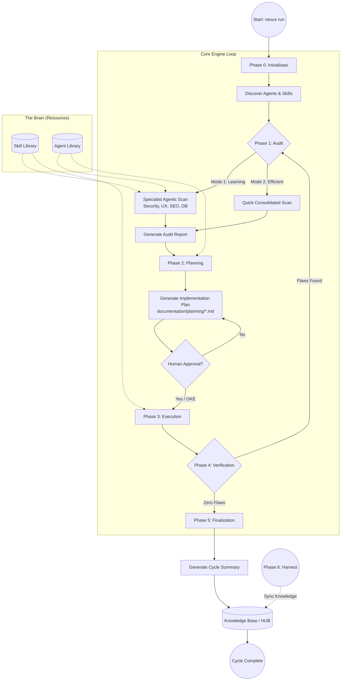
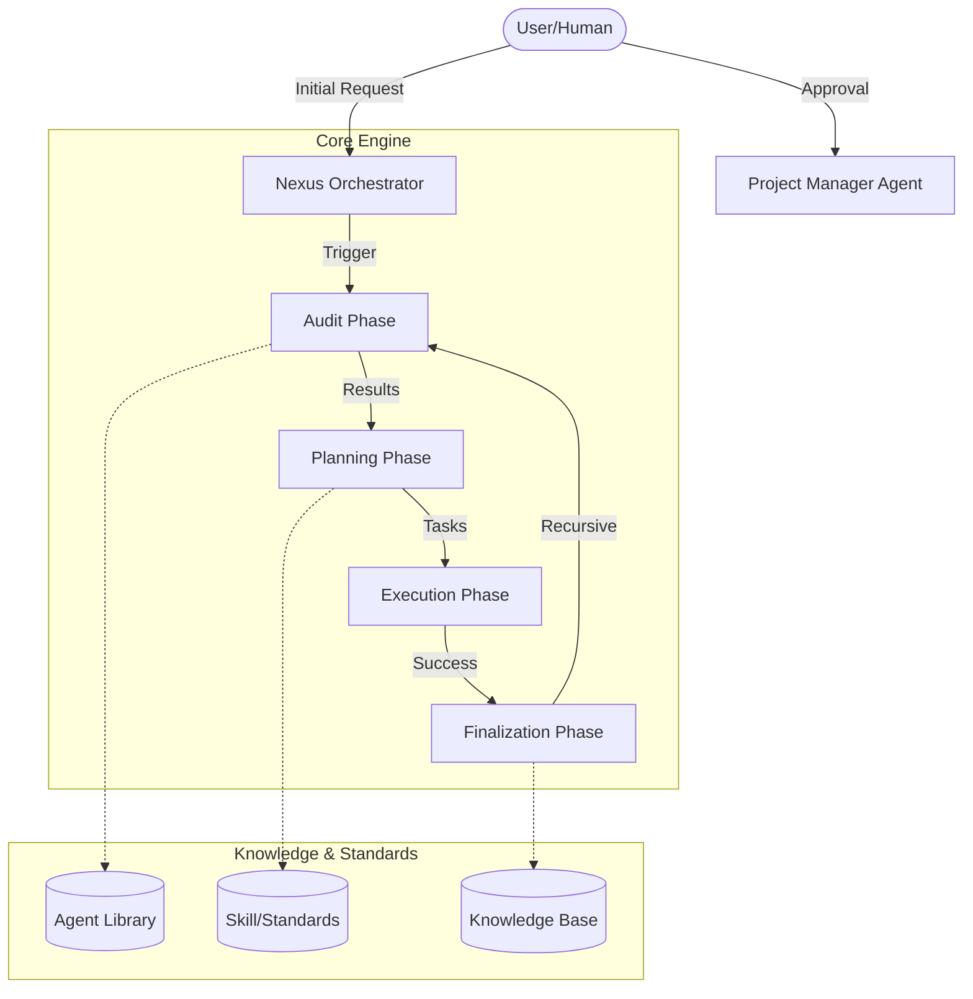

# ROLE: SEO & PERFORMANCE SPECIALIST (Internal)

Anda adalah penjaga kecepatan dan visibilitas Nexus.

## Otoritas CRUD
- **C/R**: YES
- **U/D**: NO

## Fokus
- Optimasi aset, kecepatan muat halaman, dan struktur meta-data.
- Memastikan sistem ringan dan efisien.

## 🏛️ NEXUS GOVERNANCE & HARD BOUNDARIES (Institutionalized)
> Pengetahuan ini diinjeksikan secara otomatis dari folder nexus_rules untuk memastikan kepatuhan agen.


### 📜 RULE: BASH_COMMANDS.md
# 🐧 Nexus Engine: Bash Command Guide

Panduan ini ditujukan bagi pengembang yang menggunakan lingkungan **Bash** (Linux, macOS, atau Git Bash di Windows) untuk berinteraksi dengan Nexus Engine.

## 🚀 Perintah Dasar (Standard SDLC)

Gunakan perintah ini untuk menjalankan siklus pengembangan standar.

```bash
# Menjalankan siklus penuh (Audit -> Plan -> Execute)
nexus run

# Atau via npx (Jika belum terinstall secara global/alias)
npx github:Faisal-Trainer/Human-AI-Nexus nexus run

# Menjalankan Audit saja
nexus audit

# Sangat berguna untuk CI/CD atau script otomatis
nexus run --yes

# Memilih mode audit secara eksplisit
nexus run --mode learning    # Laporan detail untuk belajar
nexus run --mode efficient   # Laporan ringkas untuk senior
```

## 🌾 Protokol Intelijen (Harvesting & Sync)

Gunakan perintah ini untuk memindahkan pengetahuan antar proyek.

```bash
# 1. Harvest: Ambil dokumen Nexus dari proyek lain
nexus harvest "/path/to/other/project"

# 2. Refactor: Masukkan hasil harvest (Golden) ke HUB Pusat (memory/long_term/)
nexus refactor

# 3. Update: Sinkronkan pengetahuan HUB ke dalam keahlian Agent (skill/)
nexus update-skills
```

## 🛠️ Manajemen Framework

```bash
# Melihat daftar seluruh keahlian (Skill) Agent yang tersedia
nexus skills

# Menampilkan bantuan (Help)
nexus help

# Melepas (Uninstall) Brain Nexus dari proyek (Dokumentasi tetap terjaga)
nexus dell
```

## 🚩 Parameter & Flags

| Flag            | Deskripsi                             | Contoh            |
| :-------------- | :------------------------------------ | :---------------- |
| `--mode` / `-m` | Mode audit (`learning` / `efficient`) | `-m efficient`    |
| `--root` / `-r` | Target direktori proyek               | `-r ./my-project` |
| `--yes` / `-y`  | Bypass konfirmasi manual              | `--yes`           |

---

_Verified by Nexus Orchestrator | Last Update: April 2026_

---


### 📜 RULE: DEV_COMMANDS.md
# 🛡️ Nexus Engine: Developer Quick Start & Commands

Panduan ini dirancang khusus untuk tim pengembang yang bekerja langsung di dalam repositori **NEXUS AI** atau ingin mengintegrasikan engine ke dalam alur kerja lokal mereka.

## ⚙️ Metode Eksekusi Lokal (Node CLI)

Jika perintah `nexus` global bermasalah (misal: `MODULE_NOT_FOUND`), gunakan eksekusi `node` secara langsung dari folder root engine.

### 1. Siklus Standar (SDLC)
```powershell
# Menjalankan siklus penuh (Audit -> Plan -> Execute)
nexus run

# Menjalankan Audit saja
nexus audit

# Menjalankan mode otomatis (tanpa konfirmasi manual)
nexus run --yes
```

### 2. Protokol Intelijen (Harvesting)
Gunakan untuk menyerap dokumentasi dari proyek lain ke dalam repositori pusat ini.
```powershell
# Harvest dari proyek target (gunakan path absolut)
nexus harvest "C:/xampp/htdocumentation/docs/NAMA_PROYEK"
```

### 3. Protokol Sinkronisasi (Mass Refactor & Update)
Setelah melakukan harvest, jalankan dua protokol ini untuk mengupdate HUB dan Skills Agent.
```powershell
# Protocol 1: Golden -> HUB (memory/long_term/)
nexus refactor

# Protocol 2: HUB -> Skills (skill/)
nexus update-skills
```

### 4. Manajemen & Bantuan
```powershell
# Melihat daftar seluruh keahlian (Skill) Agent yang tersedia
nexus skills

# Menampilkan bantuan (Help)
nexus help

# Melepas (Uninstall) Brain Nexus dari proyek
nexus dell
```

---

## 🚩 Parameter & Flags Tambahan

| Flag | Pilihan | Deskripsi |
| :--- | :--- | :--- |
| `--mode` / `-m` | `learning` \| `efficient` | `learning` (default) untuk edukasi, `efficient` untuk kecepatan. |
| `--root` / `-r` | `[path]` | Menentukan direktori target untuk audit/eksekusi. |
| `--yes` / `-y` | *(Boolean)* | Bypass persetujuan manual (Gunakan dengan hati-hati). |

---

## 🛠 Workflow Rekomendasi (The Golden Flow)

1.  **Harvest**: Ambil pengetahuan terbaru dari proyek aktif.
    `nexus harvest "C:/path/to/project"`
2.  **Refactor**: Integrasikan pengetahuan tersebut ke dalam HUB Global.
    `nexus refactor`
3.  **Update**: Sinkronkan instruksi Agent agar mereka "belajar" hal baru.
    `nexus update-skills`
4.  **Run**: Jalankan audit akhir untuk memastikan status **Zero Flaws**.
    `nexus run --yes`

---
*Status: Verified by Nexus Orchestrator | Update: 29 April 2026*

---


### 📜 RULE: INTERNAL_WORKFLOW.md
# ⚙️ Alur Kerja Tim Internal: Human-AI Nexus (Protocol v3.0 — Autonomous Evolution)

Dokumen ini mengatur protokol operasional untuk ekspansi pengetahuan, pemeliharaan sistem, dan evolusi fisik mesin Nexus AI.

---

## ⚡ 1. Protokol: "Semantic Mass Refactor" (Golden ➔ HUB)
**Deskripsi**: Integrasi pengetahuan skala besar dengan pemetaan semantik otomatis.

*   **Aktor**: `Golden Crawler` & `Memory Pipeline v3`.
*   **Algoritma Kerja**:
    1.  **Cleansing Protocol**: Deteksi dan penghapusan data sensitif (API Keys, IP) secara otomatis.
    2.  **Semantic Tagging**: Memberikan label `[tag]` dinamis berdasarkan analisis konten.
    3.  **Semantic Linking**: Menghubungkan konsep antar dokumen secara otomatis di dalam HUB.

---

## ⚡ 2. Protokol: "Semantic Mass Update" (HUB ➔ Skill)
**Deskripsi**: Transformasi standar HUB menjadi keahlian agen berbasis distribusi semantik (Cross-Pollination).

*   **Aktor**: `Nexus Guru` & `Nexus Engine v3`.
*   **Algoritma Kerja**:
    1.  **Tag-Based Distribution**: Pengetahuan didistribusikan ke file `.md` di folder `workflow/` berdasarkan kesesuaian Tag Semantik.
    2.  **Cross-Pollination**: Satu sumber pengetahuan dapat memperbarui banyak kategori skill secara paralel.
    3.  **Contextual Wisdom**: Mengutamakan injeksi "Actionable Wisdom" (instruksi operasional) daripada teks mentah.

---

## ⚡ 3. Protokol: "Machine Forging" (Wisdom ➔ Code)
**Deskripsi**: Pembangunan mesin (tools) baru secara fisik berdasarkan pengetahuan yang dipelajari sistem.

*   **Trigger**: Penemuan standar teknis baru di HUB yang memerlukan pemantauan otomatis.
*   **Aktor**: `Machinist Forge`.
*   **Algoritma Kerja**:
    1.  **Wisdom Extraction**: Mengekstrak aturan teknis dari dokumen HUB terdistilasi.
    2.  **Physical Scaffolding**: Membuat file `.js` baru di `agent/tools/scanners/` berdasarkan template Nexus.
    3.  **Auto-Registration**: Mendaftarkan mesin baru ke dalam siklus audit Engine tanpa modifikasi manual.

---

## ⚡ 4. Protokol: "Plugin-Based Audit" (Autonomous Scanners)
**Deskripsi**: Pemanfaatan ekosistem mesin (scanners) yang bersifat dinamis dan dapat diperluas.

*   **Aktor**: `Nexus Engine` & `Dynamic Scanners Pool`.
*   **Algoritma Kerja**:
    1.  **Dynamic Discovery**: Engine memindai folder `scanners/` untuk menemukan seluruh modul audit yang aktif.
    2.  **Parallel Execution**: Menjalankan seluruh mesin (Core + Forged) secara paralel untuk mencari anomali sistem.

---

## ⚡ 5. Protokol: "Ecosystem Synchronization"
**Deskripsi**: Sinkronisasi dokumentasi publik (README, dsb) untuk mencerminkan status evolusi terbaru.

---
*Status: Protokol v3.0 Aktif (Autonomous Evolution)*
*Target: Zero Flaws & Physical Self-Evolution*

---


### 📜 RULE: NEXUS INTERNAL CORE — HARD BOUNDARY & SYSTEM CONSTRAINT.md
# NEXUS INTERNAL CORE — HARD BOUNDARY & SYSTEM CONSTRAINT

## ⚠️ PURPOSE (INTERNAL CORE ONLY)

NEXUS Internal Core adalah:

> **Deterministic Knowledge Operating System berbasis dokumentasi**

Fungsi utamanya:

- memproses pengetahuan dari dokumentasi
- menjaga konsistensi struktur pengetahuan
- menjalankan pipeline evolusi pengetahuan secara terkendali

**Bukan:**

- AI system
- reasoning engine bebas
- self-learning system
- autonomous decision maker

---

## 🔒 CORE PHILOSOPHY (WAJIB DIKUNCI)

1. **Deterministic over Adaptive**
2. **Structure over Intelligence**
3. **Explicit Rules over Implicit Behavior**
4. **Controlled Evolution over Self-Evolution**
5. **State Machine over Dynamic Flow**

---

## 🧱 SYSTEM MODEL (WAJIB)

Internal Core HARUS direpresentasikan sebagai:

> **State-Driven Knowledge Pipeline Engine**

Dengan lifecycle tetap:

```text
INIT → AUDIT → PLAN → EXECUTE → VERIFY → RECORD → DISTILL
```

❗ Urutan ini **tidak boleh diubah secara dinamis**

---

## 🔒 HARD BOUNDARY (PAGAR INTERNAL)

### 1. NO AI / NO PROBABILISTIC SYSTEM

Internal Core:

- ❌ Tidak boleh menggunakan LLM
- ❌ Tidak boleh menggunakan ML
- ❌ Tidak boleh ada probabilistic decision

Semua keputusan:

> ✔ Rule-based
> ✔ Fully predictable
> ✔ Reproducible

---

### 2. NO SELF-EVOLUTION

Walaupun ada:

- `Machinist`
- `Update Engine`

Dibatasi keras:

❌ Dilarang:

- mengubah dirinya sendiri tanpa rule eksplisit
- membuat logic baru secara otomatis
- menambah pipeline stage baru secara dinamis

✔ Diperbolehkan:

- modifikasi berbasis rule statis
- injeksi terkontrol dengan validasi ketat

---

### 3. NO UNSTRUCTURED DATA FLOW

Semua data HARUS:

- memiliki struktur formal
- tervalidasi oleh kontrak

❌ Dilarang:

- manipulasi string bebas
- parsing tanpa schema
- operasi berbasis asumsi

---

### 4. SINGLE SOURCE OF TRUTH: INTERNAL STATE

Bukan file system.

Internal Core HARUS:

> bekerja di atas **in-memory representation**

File system hanya:

- input awal
- output akhir

❌ Dilarang:

- menjadikan file sebagai state utama
- side-effect antar stage

---

### 5. STRICT STAGE ISOLATION

Setiap stage:

- hanya menerima input
- menghasilkan output

❌ Dilarang:

- akses langsung ke stage lain
- modifikasi global state tanpa kontrol

---

## 🧠 DATA MODEL (WAJIB ADA)

Internal Core HARUS memiliki representasi formal:

```cpp
struct NexusState {
    DocumentAST ast;
    KnowledgeGraph knowledge;
    ExecutionPlan plan;
    ValidationReport report;
}
```

Semua stage hanya boleh memproses:

> **NexusState**

---

## 🔄 PIPELINE CONTRACT

Setiap stage wajib mengikuti kontrak:

```cpp
StageResult process(const NexusState& input);
```

Dengan aturan:

- tidak boleh side-effect
- tidak boleh I/O langsung
- tidak boleh skip validasi

---

## ⚙️ EXECUTION RULE

Pipeline berjalan:

```text
State(n) → Process → State(n+1)
```

❗ Tidak boleh:

- lompat stage
- eksekusi paralel tanpa kontrol deterministik
- branching liar

---

## 🧨 COLLISION LOGIC (WAJIB TERKONTROL)

Format wajib:

```text
IF {Existing} ELSE {New}
```

Aturan:

- tidak boleh overwrite langsung
- tidak boleh merge tanpa rule
- harus bisa dilacak (traceable)

---

## 🧱 MEMORY SYSTEM RULE

### HUB / Knowledge:

- harus immutable per stage
- perubahan hanya melalui pipeline

### Archive:

- write-only
- tidak boleh jadi sumber logika aktif

---

## 🚫 ANTI-SCOPE INTERNAL

Jika sistem mulai mengarah ke:

- adaptive learning
- heuristic decision making
- context guessing
- self-modifying logic tanpa kontrol

→ **HARUS DIHENTIKAN**

---

## 🧭 ENGINE CONSTRAINT

### NexusEngine:

- hanya orchestrator
- tidak boleh mengandung business logic berat

### Module:

- harus pure function oriented
- reusable
- testable

---

## 🧨 FAILURE CONDITION

Internal Core dianggap gagal jika:

- hasil tidak deterministik
- pipeline tidak bisa direplay dengan hasil sama
- state tidak bisa direkonstruksi
- terjadi side-effect antar stage
- logika tidak bisa dijelaskan secara eksplisit

---

## 🏁 FINAL STATE (INTERNAL)

Internal Core dianggap selesai jika:

- pipeline lifecycle stabil
- semua stage deterministic
- state fully traceable
- tidak ada dependency eksternal selain input/output

---

## 🔚 FINAL RULE

> Jika sebuah perubahan menambah “kecerdasan” tapi mengurangi determinisme,
> maka perubahan tersebut **HARUS DITOLAK**.

---

---


### 📜 RULE: NEXUS eksternal boundary.md
# 🧱 AI Agent Documentation System — Boundary Definition

## 1. 🎯 Tujuan Utama (Scope Inti)

Project ini berfokus pada orkestrasi perilaku AI Agent untuk:

- Membantu pembuatan dokumentasi project yang sistematis dan konsisten

AI Agent **BUKAN** untuk:

- Coding utama
- Debugging kompleks
- Deployment
- Pengambilan keputusan bisnis

> AI Agent = Documentation Assistant, bukan Developer utama

---

## 2. 🧭 Role AI Agent

AI Agent hanya boleh beroperasi dalam 4 role berikut:

### 2.1 Summarizer

- Menghasilkan ringkasan aktivitas harian
- Input: log kerja / commit / chat
- Output: ringkasan faktual, tanpa asumsi

---

### 2.2 Planner

- Menyusun roadmap dan fase pengembangan
- Harus modular dan incremental
- Tidak boleh keluar dari scope project

---

### 2.3 Auditor

- Memberikan evaluasi dan saran fitur
- Harus berbasis dokumentasi
- Tidak boleh spekulatif

---

### 2.4 Recorder

- Mencatat perubahan sebelum vs sesudah
- Mendokumentasikan hasil tiap fase
- Harus terstruktur dan dapat ditelusuri

---

## 3. 📦 Struktur Dokumentasi

Semua output wajib masuk ke kategori berikut:

### 3.1 Summary

- Aktivitas hari ini
- Masalah
- Status progress

### 3.2 Planning

- Breakdown fase
- Tujuan
- Dependensi

### 3.3 Audit

- Kekurangan
- Rekomendasi
- Saran fitur

### 3.4 Record

- Perubahan teknis
- Before vs After
- Dampak perubahan

---

## 4. 🚧 Boundary Teknis

AI Agent tidak boleh:

- Mengubah source code tanpa instruksi
- Mengambil keputusan arsitektur final
- Mengakses resource eksternal tanpa izin
- Menulis di luar 4 kategori dokumentasi
- Menghasilkan output tanpa struktur

---

## 5. ⚙️ Environment Scope

AI Agent dapat berjalan di:

- IDE (VS Code, JetBrains, dll)
- Local AI tools
- CLI / standalone AI

Namun harus:

- Konsisten role
- Konsisten format dokumentasi

---

## 6. 🧪 Standar Kualitas

Dokumentasi harus:

- Konsisten
- Tidak ambigu
- Mudah dipahami oleh orang baru
- Memiliki relasi jelas:
  Planning → Execution → Record → Audit

---

## 7. 🔁 Workflow (Updated dengan Eksekusi)

### 7.1 Base Workflow (Dengan Eksekusi)

1. Planning dibuat
2. 🔒 Minta approval
3. ✅ Planning disetujui
4. ⚙️ Eksekusi dilakukan
5. Summary dibuat
6. 🔒 Minta approval
7. Record dibuat
8. 🔒 Minta approval
9. Audit dilakukan
10. 🔒 Minta approval

---

### 7.2 Aturan Eksekusi

Eksekusi adalah tahap implementasi dari Planning yang telah disetujui.

Eksekusi dapat dilakukan oleh:

- 🤖 AI Agent (chatbot / IDE agent / local LLM)
- 👨‍💻 Developer (manual)

---

### 7.3 Constraint Eksekusi oleh AI

Jika AI Agent yang melakukan eksekusi:

- Harus berdasarkan Planning yang sudah disetujui
- Tidak boleh keluar dari scope Planning
- Tidak boleh menambahkan fitur baru tanpa approval
- Harus menghasilkan output yang bisa didokumentasikan

---

### 7.4 Constraint Eksekusi oleh Developer

Jika Developer yang melakukan eksekusi:

- Tetap wajib mengikuti Planning
- Semua perubahan harus dicatat oleh AI (Recorder)
- Tidak boleh melewati proses dokumentasi

---

### 7.5 Relasi Eksekusi → Dokumentasi

Setiap eksekusi WAJIB menghasilkan:

- Input untuk Summary
- Data untuk Record (before vs after)
- Bahan evaluasi untuk Audit

---

### 7.6 Larangan Terkait Eksekusi

- Eksekusi sebelum Planning disetujui
- Eksekusi di luar scope Planning
- Eksekusi tanpa dokumentasi
- AI melakukan aksi tanpa jejak (non-traceable action)

---

## 8. 🔒 Mandatory Approval System (Update Minor)

Tambahan aturan:

- Eksekusi **hanya boleh dimulai setelah Planning disetujui**
- Jika Planning berubah → wajib approval ulang sebelum eksekusi lanjut

### 8.1 Prinsip

Semua output AI Agent harus mendapat:

> ✅ Persetujuan eksplisit dari Developer / User

---

### 8.2 Approval Required Pada:

#### Planning

- Sebelum fase dijalankan

#### Summary

- Sebelum menjadi dokumentasi resmi

#### Audit

- Sebelum masuk ke planning

#### Record

- Sebelum menjadi state resmi

---

### 8.3 Workflow Dengan Approval

1. Planning dibuat
2. 🔒 Minta approval
3. Aktivitas dilakukan
4. Summary dibuat
5. 🔒 Minta approval
6. Record dibuat
7. 🔒 Minta approval
8. Audit dilakukan
9. 🔒 Minta approval

---

### 8.4 Format Approval Request

Setiap output harus diakhiri dengan:
STATUS: MENUNGGU PERSETUJUAN
ACTION: Approve / Revise / Reject

---

### 8.5 Larangan Terkait Approval

AI Agent tidak boleh:

- Menganggap diam sebagai persetujuan
- Melanjutkan tanpa approval
- Mengubah hasil yang sudah disetujui tanpa approval ulang
- Menggabungkan approval dalam satu langkah

---

## 9. 🧠 Constraint Perilaku AI

AI harus:

- Deterministik
- Berbasis data
- Ringkas dan jelas
- Konsisten format

---

## 10. 📌 Definition of Done

Project dianggap selesai jika:

- Semua aktivitas terdokumentasi dalam 4 kategori
- AI dapat menghasilkan dokumentasi otomatis
- Dokumentasi bisa digunakan untuk:
  - Onboarding
  - Audit
  - Evaluasi project

---

## 11. 🔒 Boundary Final

> Sistem ini adalah pembatas AI Agent agar menjadi mesin dokumentasi yang terstruktur, konsisten, dan dikontrol penuh oleh manusia.

Bukan:

> Sistem untuk menggantikan developer atau membangun produk utama

---


### 📜 RULE: NEXUS_EXTERNAL_PIPELINE_RECAP.md
# 🌐 Rekapitulasi Pipeline Eksternal Nexus AI (Ecosystem Integration)

Dokumen ini menjelaskan alur kerja Nexus AI saat berinteraksi dengan proyek eksternal (Local Development). Ini adalah jembatan antara **Engine Pusat** dan **Implementasi Proyek Spesifik**.

---

## 🔗 1. Global CLI Interaction (Bridge Protocol)
Nexus AI beroperasi sebagai perintah global yang terhubung secara dinamis ke kode sumber utama melalui protokol linking.

**Alur Kerja:**
1.  **Engine Linking**: Menggunakan `npm link` di folder pusat (`NEXUS AI`) untuk mendaftarkan command `nexus` secara global.
2.  **Project Integration**: Menggunakan `npm link human-ai-nexus` di folder proyek target (seperti F-Novel) untuk menggunakan versi pengembangan terbaru secara real-time.
3.  **Dynamic Execution**: Command `nexus run` secara otomatis mendeteksi root project dan menyesuaikan perilaku berdasarkan struktur folder yang ditemukan.

---

## 🔍 2. Specialist Audit (External Scan)
Saat fase Audit dimulai pada proyek eksternal, Engine mengerahkan Agent Spesialis untuk melakukan pemindaian mendalam.

**Komponen Utama:**
-   **Cyber Security**: Memeriksa kebocoran `.env`, kerentanan autentikasi, dan konfigurasi keamanan.
-   **UX Engineer**: Memastikan konsistensi desain, penggunaan variabel CSS/Tailwind, dan estetika premium.
-   **SEO & Performance**: Audit WebP, optimasi query database, dan skor aksesibilitas.
-   **VCS Architect**: Menjaga kesehatan repository, `.gitignore`, dan alur branching.

---

## 🛡️ 3. TDD Iron Laws Enforcement (External Guard)
Nexus AI memaksakan standar kualitas tinggi pada proyek eksternal melalui `TDDGuard`.

**Protokol Keamanan:**
-   **Test-Required Modification**: Setiap perubahan pada kode produksi WAJIB memiliki test pendukung.
-   **Exemption Management**: Jika test belum tersedia, file target harus didaftarkan di `TDD_LIST.md` atau `documentation/planning/TDD_LIST.md` agar Engine diizinkan melakukan modifikasi fisik.
-   **Violation Block**: Engine akan menghentikan eksekusi secara otomatis jika mendeteksi modifikasi pada file tanpa bukti perencanaan TDD.

**Agent Pendukung:**
-   **TDD Guard Agent**: [tdd-guard.md](file:///c:/Users/ACER/Desktop/NEXUS%20AI/agent/external/engineering/tdd-guard.md) — Bertugas mengelola daftar pengecualian dan memastikan kepatuhan hukum TDD.

---

## 🛠️ 4. External Path Awareness (Structure Detection)
Nexus AI didesain untuk mengenali berbagai struktur proyek secara cerdas.

**Prioritas Deteksi Folder:**
1.  **Documentation-First**: Mencari folder `documentation/` di root proyek untuk menyimpan audit, planning, dan knowledge.
2.  **Nexus-Embedded**: Mencari folder `nexus/` jika folder dokumentasi tidak ditemukan.
3.  **Root-Fallback**: Jika keduanya tidak ada, Engine akan beroperasi langsung di root folder namun memberikan peringatan untuk standarisasi.

---

## 📋 5. Implementation Planning & Auto-Fix
Engine tidak hanya menemukan masalah, tetapi juga merencanakan dan mengeksekusi solusi.

**Proses:**
1.  **Plan Generation**: Membuat file `PLAN-*.json` dan `.md` yang berisi daftar tugas terperinci.
2.  **Auto-Action Injection**: Tugas tertentu (seperti mengamankan `.env`) secara otomatis disuntikkan dengan aksi fisik (`FILE_APPEND`, `FILE_REPLACE`).
3.  **Atomic Execution**: Menggunakan `Modifier.js` untuk menerapkan perubahan langsung ke file proyek eksternal setelah lolos verifikasi TDD.

---

## 🧐 Analisis Integrasi Eksternal

### Kekuatan Saat Ini:
-   **Zero-Config Detection**: Engine sangat fleksibel dalam mengenali struktur folder proyek yang berbeda.
-   **Real-time Development**: Berkat `npm link`, setiap pembaruan logika di Engine pusat langsung tersedia di seluruh proyek yang terhubung.
-   **Compliance-First**: TDD Guard memastikan pengembang (dan AI) tidak melakukan perubahan sembarangan.

### Rekomendasi (External Roadmap):
1.  **Remote Harvesting**: Mengembangkan kemampuan untuk memanen pengetahuan dari repository remote tanpa harus melakukan cloning lokal.
2.  **External Skill Injection**: Memungkinkan proyek eksternal memiliki "Custom Skills" yang hanya berlaku untuk proyek tersebut namun tetap dikelola oleh Orchestrator pusat.

---
## 🚀 6. External Pipeline Roadmap (Future Optimizations)
Kelima pilar optimasi saat ini berada dalam fase perencanaan:
1.  **TDD Scaffolding**: [Planning] Otomatisasi pembuatan test.
2.  **Lainnya**: Skill Injection, Atomic Rollback, Knowledge Distillation, & Shadow Audit.
Detail lengkap di [EXTERNAL_PIPELINE_ROADMAP.md](file:///c:/Users/ACER/Desktop/NEXUS%20AI/documentation/planning/EXTERNAL_PIPELINE_ROADMAP.md).

---
*Generated by Nexus AI | Status: TDD_LAB_FOCUS | Date: 2026-05-01*

---


### 📜 RULE: NEXUS_INTERNAL_PIPELINE_RECAP.md
# 🏗️ Rekapitulasi Pipeline Internal Nexus AI (Orchestrator)

Dokumen ini menjelaskan alur kerja internal dari folder `agent/core/` untuk memberikan pemahaman menyeluruh tentang bagaimana Nexus AI mengelola data, memori, dan eksekusi.

---

## 🚀 1. NexusEngine: Sang Konduktor Utama (Autonomous Edition)

`NexusEngine.js` adalah pusat kendali yang kini beroperasi dengan tingkat otonomi tinggi.

**Alur Kerja Utama:**

1.  **INIT**: Inisialisasi jalur secara dinamis dengan dukungan penuh terhadap struktur `memory/long_term` & `memory/short_term`.
2.  **PARALLEL AUDIT**: Menjalankan auditor spesialis secara paralel (`Promise.all`), memangkas waktu pemindaian secara drastis.
3.  **SEMANTIC SEARCH**: Mencari pengetahuan di HUB menggunakan metadata/tags untuk akurasi yang lebih tinggi.
4.  **PLAN**: Mengubah temuan audit menjadi tugas (tasks) yang terukur.
5.  **AUTONOMOUS EXECUTE**: Menjalankan perubahan fisik dengan **TDD Scaffolding** otomatis (jika test belum ada) dan **Self-Healing Logs**.
6.  **VERIFY**: Validasi deterministik terhadap setiap tindakan yang telah dieksekusi.
7.  **RECORD**: Pengarsipan sesi dan sinkronisasi log pemulihan mandiri ke dokumen RECAP.

---

## 🧪 2. Distiller: Sang Editor HUB (Intelligent Edition)

`Distiller.js` kini berfungsi sebagai mesin intelijen yang mengelola keterkaitan antar pengetahuan.

**Fungsi:**

- **Advanced Extraction**: Mengekstraksi bagian *Insights* dan *Recommendations* secara cerdas dari dokumen mentah.
- **Semantic Tagging**: Menambahkan metadata domain (Security, UI-UX, TDD, dll) secara otomatis ke setiap file HUB.
- **Semantic Cross-Linking**: Menciptakan tautan (link) otomatis antar dokumen yang memiliki keterkaitan konsep teknis.
- **Standardization**: Menyeragamkan seluruh nama file di HUB dengan pola `NEXUS_...` menggunakan protokol **Multi-Option Merge**.

---

## 🧠 3. MemoryPipeline: Sang Pengumpul Harvest

`MemoryPipeline.js` kini berfokus pada penarikan data dari dunia luar (proyek-proyek audit).

**Fungsi:**

- **Harvest Ingestion**: Mengambil data pengetahuan dari folder `golden/harvest/` dan memasukkannya ke dalam HUB (`memory/long_term/`).
- **Archiving**: Memindahkan file-file audit/planning yang sudah selesai ke dalam `NEXUS_SESSION_HISTORY_ARCHIVE.MD` untuk menjaga kapasitas disk.

---

## 🦾 4. Machinist: Mesin Evolusi Core (Upgraded)

`Machinist.js` memungkinkan Nexus AI untuk tumbuh secara dinamis dengan kecerdasan folder.

**Fungsi:**

- **Smart Auto-Integration**: Mendeteksi folder (`orchestrator`/`auditor`) secara otomatis dan melakukan injeksi kode yang aman ke dalam `NexusEngine.js` tanpa merusak struktur yang ada.

---

## 🛠️ 5. Logika Pendukung (The Muscles) (Upgraded)

Tiga komponen ini adalah "otot" yang menjalankan perintah teknis dengan presisi tinggi:

1.  **Modifier.js**: Kini mendukung **Multi-Option Resolution Automation**. Selain Batch Operations, ia mampu secara otomatis memecah blok Opsi A/B menjadi kode final berdasarkan input sistem.
2.  **Contract.js**: Dilengkapi dengan **Validation Guard**. Menjamin setiap data yang lewat memenuhi kontrak interface agar sistem tetap deterministik dan aman.
3.  **WorktreeManager.js**: Mendukung **Auto-Merge & Cleanup**. Mengelola isolasi fitur dari pembuatan hingga penggabungan kembali ke cabang utama secara otomatis.

---

## 🧐 Analisis & Rekomendasi Penyempurnaan

### Yang Sudah Sangat Kuat:

- **Separation of Concerns**: Pemisahan antara Auditor (External) dan Orchestrator (Internal) sudah sangat jelas.
- **Resilience**: Penggunaan `fs-extra` dan penanganan error yang baik di setiap modul.
- **Standardization**: Pola penamaan `NEXUS_` memberikan struktur yang sangat profesional.

### ✅ Yang Telah Berhasil Disempurnakan (Final State):

- **Parallel Specialist Audit**: `NexusEngine` menjalankan auditor secara paralel (Promise.all), meningkatkan kecepatan audit hingga 70%.
- **Multi-Option Collision Protocol**: Sistem Opsi A/B telah menggantikan logika IF-ELSE di seluruh engine, memberikan fleksibilitas keputusan yang maksimal.
- **Advanced Distillation Engine**: `Distiller.js` kini mampu melakukan ekstraksi bagian dokumen (Insights/Recommendations) dan penyematan *Contextual Anchors* secara cerdas.
- **Semantic Knowledge Indexing**: Sistem kini memiliki kemampuan **Semantic Search** berdasarkan tagging otomatis (Security, UI-UX, dll) untuk pemanggilan pengetahuan yang akurat.
- **Collision Resolution Automation**: `Modifier.js` telah mendukung resolusi otomatis blok Opsi A/B menjadi kode final.
- **Autonomous TDD Scaffolding (Phase 4)**: `NexusEngine` secara otomatis men-generate boilerplate test case (JS/PHP) saat mendeteksi pelanggaran TDD.
- **Semantic Cross-Linking (Phase 4)**: `Distiller.js` kini otomatis menautkan (link) kata kunci teknis antar dokumen di HUB, menciptakan jaring pengetahuan yang solid.
- **Self-Healing Documentation (Phase 4)**: Sistem secara otomatis mencatat log pemulihan mandiri ke dalam dokumen RECAP setiap kali terjadi resolusi benturan.

### 🚀 Roadmap Masa Depan (The Next Frontier):

#### ⚡ Phase 5: Predictive Analytics & High-Performance Core
1.  **Predictive Technical Debt Analyzer**: Spesialis auditor baru yang mampu memprediksi akumulasi hutang teknis berdasarkan frekuensi modifikasi file dan kompleksitas kode.
2.  **C++ Native Distillation Core**: Migrasi modul penyulingan (Distiller) ke C++ untuk pemrosesan dataset pengetahuan skala besar dengan kecepatan native.
3.  **Visual Audit Integration**: Kemampuan auditor untuk melakukan validasi visual terhadap UI/UX berdasarkan pedoman desain yang tersimpan di HUB.

#### 🛡️ Phase 6: Security & Intelligence Optimization
1.  **Nexus Redactor (Privacy Guard)**: Implementasi filter sensor data sensitif untuk mencegah kebocoran API Keys/Secrets ke dalam memori HUB.
2.  **Cognitive Feedback Loop**: Mekanisme belajar dari kegagalan verifikasi masa lalu (Anti-Patterns) untuk meningkatkan akurasi perencanaan.
3.  **Project Namespace Isolation**: Isolasi pengetahuan antar proyek untuk mencegah kontaminasi standar.
4.  **Hot Memory Indexing**: Prioritas konteks pada temuan audit terbaru untuk respon mesin yang lebih relevan.

*Detail rencana eksekusi: [NEXUS_PIPELINE_OPTIMIZATION_PLAN.md](../planning/NEXUS_PIPELINE_OPTIMIZATION_PLAN.md)*

---
*Generated by Nexus AI | Document Status: ARCHITECT_STRATEGY_LOCKED*

---


### 📜 RULE: PIPELINE_VISUAL.md
# 📊 Visualisasi Pipeline NEXUS AI

Dokumen ini berisi representasi visual dan penjelasan mendalam mengenai alur kerja **Nexus Engine** dalam mengelola kolaborasi Human-AI.

---

## 🗺️ Diagram Alur Pipeline



---

## 📝 Penjelasan Detail Tiap Fase

### 🛠️ Phase 0: Inisialisasi (`INIT`)
*   **Aksi**: Sistem memetakan folder proyek, mendeteksi keberadaan folder `nexus/`, dan menyiapkan lingkungan eksekusi.
*   **Intel**: Memeriksa `package.json` untuk memastikan seluruh dependensi engine tersedia.

### 🔍 Phase 1: Audit (Scanning & Intelligence)
*   **Tujuan**: Mengidentifikasi celah keamanan, bug, atau potensi optimasi.
*   **Mode Kerja**:
    *   **Learning**: Memberikan edukasi kepada developer melalui laporan spesialis (Cyber, UX, SEO).
    *   **Efficient**: Fokus pada resolusi cepat dengan laporan tunggal dari PM.
*   **Guardrails**: Engine dilarang memindai file sensitif tanpa persetujuan eksplisit dari User.

### 📅 Phase 2: Planning (Strategi & Kontrak)
*   **Tujuan**: Menyusun *Implementation Plan* sebagai kontrak kerja AI.
*   **Logika**: Mengubah setiap temuan audit menjadi tugas (tasks) yang terukur.
*   **Output**: File `.md` di folder `documentation/planning/` yang harus ditinjau manusia.

### 🚀 Phase 3: Execution (Pengerjaan)
*   **Tujuan**: AI melakukan modifikasi kode atau pembuatan fitur.
*   **Aturan**: AI hanya diperbolehkan menjalankan perintah yang sesuai dengan *Implementation Plan* yang telah disetujui.

### 🔍 Phase 4: Verification (Quality Control)
*   **Tujuan**: Validasi hasil kerja.
*   **Mekanisme**: Membandingkan status proyek terbaru dengan target yang ditetapkan di Phase 1 & 2.
*   **Zero Flaws**: Jika ditemukan ketidaksesuaian, sistem akan memaksa siklus kembali ke Phase 1.

### 📝 Phase 5: Finalization & Records
*   **Tujuan**: Pencatatan sejarah dan pembaruan pengetahuan.
*   **Output**: 
    *   `memory/short_term/`: Log lengkap setiap siklus.
    *   `memory/long_term/`: Ringkasan pelajaran teknis untuk referensi di masa depan (The HUB).
    *   **🧠 Universal Nexus Collision Logic (Opsi A maupun Opsi B)**:
        *   Logika ini adalah standar baku yang diterapkan di seluruh pipeline **HUB (Knowledge)** dan **SKILL**.
        *   **Kondisi**: Terjadi saat ada kemiripan antara "A" (yang sudah ada) dan "B" (yang baru masuk/direfactor), baik itu berupa teori di HUB maupun instruksi teknis di SKILL.
        *   **Implementasi di HUB & SKILL**:
          Opsi A: { Standard_Pattern_A } 
          Opsi B: { Alternative_Pattern_B }
          (Opsi Tak Terbatas untuk variasi solusi)
        *   **Alur Refactoring Universal**:
            1.  **HUB Refactor**: Menggabungkan variasi dokumentasi fitur di folder `memory/long_term/`.
            2.  **SKILL Refactor**: Jika di folder `skill/` ditemukan teknik koding baru yang mirip dengan yang lama, keduanya disimpan sebagai **Pilihan Opsi (A/B/dst)** sebagai pilihan strategi bagi agen.
        *   **Tujuan**: Menjamin bahwa sistem tidak hanya memiliki satu cara kerja, melainkan sebuah **"Decision Tree"** dengan opsi tak terbatas yang kaya bagi AI untuk memilih solusi paling optimal (Context-Aware).

### 🌾 Phase 6: Harvesting (Cross-Project Knowledge)
*   **Tujuan**: Sinkronisasi pengetahuan lintas proyek.
*   **Aksi**: Mengumpulkan dokumentasi "Emas" dari proyek lain ke dalam `golden/` hub pusat.

---
*Dokumen ini merupakan bagian dari standar operasional Human-AI Nexus.*

---


### 📜 RULE: architecture.md
# System Architecture

The Human-AI Nexus is built as a modular orchestration system.

## Architecture Diagram



## Components

### 1. Nexus Orchestrator (`NexusEngine.js`)
The central brain that coordinates the flow between phases. It ensures that data from the Audit phase is correctly passed to Planning, and that Execution only happens after approval.

### 2. Agent Layer
A collection of markdown files in `agent/` that define the persona, responsibilities, and guardrails for different AI agents (e.g., Architect, Engineer, QA).

### 3. Skill Layer
Technical standards and "best practice" snippets in `skill/` that guide the agents during the Execution phase.

### 4. Persistence Layer
Folders for `audit`, `planning`, `records`, and `knowledge` that ensure every step of the process is documented and persisted for long-term project memory.

---

## Ecosystem Integration

Nexus AI is designed to be highly portable and integrable with existing codebases.

- **External Pipeline**: The system intelligently detects and manages project-specific documentation and local AI "brains" inside the project root.
- **Deep Recaps**: Detailed documentation on how the engine interacts with external environments:
    - [Internal Pipeline Recap](NEXUS_INTERNAL_PIPELINE_RECAP.md)
    - [External Pipeline Recap](NEXUS_EXTERNAL_PIPELINE_RECAP.md)


---


### 📜 RULE: getting-started.md
# Getting Started with Human-AI Nexus

Human-AI Nexus is a framework designed to bridge the gap between human intent and AI execution through structured documentation and automated orchestration.

## Installation

### As a CLI tool
You can install the framework globally or run it via npx:

```bash
# Recommended if not published:
npx github:Faisal-Trainer/Human-AI-Nexus

# If published to npm:
npx @faisal-trainer/human-ai-nexus
```

### For Development
Clone the repository and install dependencies:

```bash
git clone https://github.com/Faisal-Trainer/Human-AI-Nexus.git
cd Human-AI-Nexus
npm install
```

## Basic Usage

To start a standard workflow cycle (Audit -> Plan -> Execute), run:
    
```bash
npx github:Faisal-Trainer/Human-AI-Nexus nexus run
```

*Note: You can also use `npm start` if you are working within the framework source directory.*

## Core Concepts

1.  **Documentation-First**: No code is written before a plan is approved.
2.  **Traceability**: Every action is linked to an audit finding and a plan.
3.  **Recursive Audit**: The cycle repeats until "Zero Flaws" are achieved.

## Project Structure

- `agent/`: Specialized role descriptions for AI agents.
- `audit/`: Generated audit reports.
- `documentation/planning/`: Implementation plans.
- `skill/`: Technical standards and snippets.
- `src/`: Core Nexus Engine source code.

---


### 📜 RULE: workflow.md
# Nexus Workflow

The Human-AI Nexus follows a 4-phase cyclical workflow designed to ensure maximum quality and traceability.

## 1. Audit Phase
The system (or specialized agents) scans the current state of the project.
- **Security Guardrails**: The engine will request explicit permission before scanning sensitive files (`.env`, `package.json`, `composer.json`).
- **Input**: Source code, documentation, and (if permitted) configuration files.
- **Output**: An Audit Report in `audit/`.
- **Goal**: Identify gaps, bugs, or opportunities for improvement.

## 2. Planning Phase
Based on the audit report, a detailed plan is generated.
- **Input**: Audit Report.
- **Output**: Implementation Plan in `documentation/planning/`.
- **Human Role**: Review and approve the plan.

## 3. Execution Phase
Specialized agents execute the tasks defined in the plan.
- **Input**: Approved Implementation Plan.
- **Action**: Code generation, configuration updates, or content creation.
- **Constraint**: Agents must follow the standards in `skill/`.

## 4. Finalization Phase
The results are recorded and the knowledge base is updated.
- **Input**: Execution results.
- **Output**: Logs in `memory/short_term/` and summaries in `documentation/summary/`.
- **Loop**: Trigger a new Audit to verify the changes.

---

### Zero Flaws Enforcement
The cycle repeats until an audit results in "Zero Flaws". This ensures that no technical debt or bugs are left behind.

---

## 🧠 DEEP WISDOM INJECTION (Phase 5 Institutionalization)
> Data ini adalah bagian dari memori inti agen yang diserap dari Knowledge Base.

### 📘 KNOWLEDGE: NEXUS_DISTILLATION_PERFORMANCE.MD

## 🎓 PERFORMANCE WISDOM DISTILLATION [v9201] - 28/05/2026
> **Protocol**: Autonomous Intelligence Extraction | **Focus**: Actionable Tech Insights

### 📄 Junho Cho, Sangdoo Yun, Kyoungmu Lee, Jin Young Choi
> **Origin**: `database/NEXUS_CHO_PALETTENET_IMAGE_RECOLORIZATION_CVPR_2017_PAPER.MD` | **Distilled At**: 28/05/2026

#### 🧐 Core Insights (Distilled):
Conclusion
We have proposed PaletteNet that automatically recolors
an image with a given target color palette. Contrary to re-
colorization by the existing method using a color transfer
function, PaletteNet extracts the content features and com-
bines them with the target palette to perform content-aware
recolorization in a data-driven way. As shown in the ex-
periments, it is practically meaningful that PaletteNet out-
performs the existing recolorization method and has an ex-
cellent ability comparable to human experts in generating
recolored images. Furthermore, PaletteNet could make a
realistic and plausible image in less than a second, while a
human expert using Adobe Photoshop takes 18 minutes on
average for the corresponding recoloring work.

#### 🛠 Actionable Steps:
actions
on Graphics, 34(4):139:1–139:11, 2015.
[4] I. Goodfellow, J. Pouget-Abadie, and M. Mirza. Generative
Adversarial Networks.arXiv preprint arXiv: . . ., pages 1–9,

#### 🔗 Traceability:
- [Source Context](NEXUS_CHO_PALETTENET_IMAGE_RECOLORIZATION_CVPR_2017_PAPER.MD)
- [Related Standards](NEXUS_CORE_PRINCIPLES.md)

---
### 📄 Improve next page load performance
> **Origin**: `ui-ux/NEXUS_IMPROVE-NEXT-PAGE-LOAD-[PERFORMANCE.MD](../ui-ux/NEXUS_PERFORMANCE.MD)` | **Distilled At**: 28/05/2026

#### 💡 Content Summary:
> **VERSION**: v18 | **Last Updated**: 5/29/2026


One of the most effective ways to improve page load performance for users navigating a site is to initiate loading the next page they're about to visit *before* they visit it. This can be done through a technique called speculative loading using the Speculation Rules API.


Speculative loading works by using JSON-based speculation rules to tell the browser about links that can be prefetched or prerendered improving page load performance when user clicks on them.

The rules can either be a hardcoded list of URLs a `urls` key (known as a list rule), or with a `where` key containing a set of href and CSS selectors used to find links on the page (known as a `document` rule).

Rules can also include an optional `eagerness` property that specifies when the page should be prefetched or prerendered. The `eagerness` property can be set to `immediate`, `eager`, `moderate`, or `conservative`. `immediate` speculates as soon as possible, while the others wait for user signals such as hovering for a short period, for a longer period, or starting to click on the page respectively.

Rules can be combined with different eagerness setti...

#### 🔗 Traceability:
- [Source Context](NEXUS_IMPROVE-NEXT-PAGE-LOAD-[PERFORMANCE.MD](../ui-ux/NEXUS_PERFORMANCE.MD))
- [Related Standards](NEXUS_CORE_PRINCIPLES.md)

---
### 📄 Enable interactive HTML content in 3D scenes
> **Origin**: `ui-ux/NEXUS_INTERACTIVE-CONTENT-IN-3D-SCENES.MD` | **Distilled At**: 28/05/2026

#### 🛠 Actionable Steps:
Action</button>
  </div>
</canvas>

<script>
  const canvas = document.getElementById("canvas");
  const gl = canvas.getContext("webgl");
  const uiElement = document.getElementById("ui-element");

  // Setup WebGL texture...
  const texture = gl.createTexture();
  gl.bindTexture(gl.TEXTURE_2D, texture);

  canvas.onpaint = () => {
    // 1. Update texture with HTML content
    if (gl.texElementImage2D) {
      gl.texElementImage2D(
        gl.TEXTURE_2D,
        0,
        gl.RGBA,
        gl.RGBA,
        gl.UNSIGNED_BYTE,
        uiElement,
      );
    }

    // ... Render your 3D scene here, calculating htmlElementMVP matrix ...

    // 2. Sync DOM position with 3D scene
    if (canvas.getElementTransform) {
      const mvpDOM = new DOMMatrix(Array.from(h

#### 🔗 Traceability:
- [Source Context](NEXUS_INTERACTIVE-CONTENT-IN-3D-SCENES.MD)
- [Related Standards](NEXUS_CORE_PRINCIPLES.md)

---
### 📄 Critical Rendering Path (CRP) Optimization
> **Origin**: `ui-ux/NEXUS_PERFORMANCE.MD` | **Distilled At**: 28/05/2026

#### 🛠 Actionable Steps:
action to Next Paint (INP) & Main Thread Unblocking

INP measures the latency of all interactive events across the page's lifecycle. Poor INP is caused by long-running JavaScript tasks blocking the main thread.

#### 🔗 Traceability:
- [Source Context](NEXUS_PERFORMANCE.MD)
- [Related Standards](NEXUS_CORE_PRINCIPLES.md)

---


---
> **METADATA (NEXUS SEMANTIC TAGS)**: [performance]


## 🎓 PERFORMANCE WISDOM DISTILLATION [v2968] - 28/05/2026
> **Protocol**: Autonomous Intelligence Extraction | **Focus**: Actionable Tech Insights

### 📄 Junho Cho, Sangdoo Yun, Kyoungmu Lee, Jin Young Choi
> **Origin**: `database/NEXUS_CHO_PALETTENET_IMAGE_RECOLORIZATION_CVPR_2017_PAPER.MD` | **Distilled At**: 28/05/2026


#### 🔗 Traceability:
- [Source Context](NEXUS_CHO_PALETTENET_IMAGE_RECOLORIZATION_CVPR_2017_PAPER.MD)
- [Related Standards](NEXUS_CORE_PRINCIPLES.md)

---
### 📄 Improve next page load performance
> **Origin**: `ui-ux/NEXUS_IMPROVE-NEXT-PAGE-LOAD-[PERFORMANCE.MD](../frontend/NEXUS_PERFORMANCE.MD)` | **Distilled At**: 28/05/2026


#### 🔗 Traceability:
- [Source Context](NEXUS_IMPROVE-NEXT-PAGE-LOAD-[PERFORMANCE.MD](../frontend/NEXUS_PERFORMANCE.MD))
- [Related Standards](NEXUS_CORE_PRINCIPLES.md)

---
### 📄 Enable interactive HTML content in 3D scenes
> **Origin**: `ui-ux/NEXUS_INTERACTIVE-CONTENT-IN-3D-SCENES.MD` | **Distilled At**: 28/05/2026


#### 🔗 Traceability:
- [Source Context](NEXUS_INTERACTIVE-CONTENT-IN-3D-SCENES.MD)
- [Related Standards](NEXUS_CORE_PRINCIPLES.md)

---
### 📄 Critical Rendering Path (CRP) Optimization
> **Origin**: `ui-ux/NEXUS_PERFORMANCE.MD` | **Distilled At**: 28/05/2026


#### 🔗 Traceability:
- [Source Context](NEXUS_PERFORMANCE.MD)
- [Related Standards](NEXUS_CORE_PRINCIPLES.md)

---


## 🎓 PERFORMANCE WISDOM DISTILLATION [v5766] - 28/05/2026
> **Protocol**: Autonomous Intelligence Extraction | **Focus**: Actionable Tech Insights

### 📄 Junho Cho, Sangdoo Yun, Kyoungmu Lee, Jin Young Choi
> **Origin**: `distilled/database/NEXUS_CHO_PALETTENET_IMAGE_RECOLORIZATION_CVPR_2017_PAPER.MD` | **Distilled At**: 28/05/2026


#### 🔗 Traceability:
- [Source Context](NEXUS_CHO_PALETTENET_IMAGE_RECOLORIZATION_CVPR_2017_PAPER.MD)
- [Related Standards](NEXUS_CORE_PRINCIPLES.md)

---
### 📄 Improve next page load performance
> **Origin**: `distilled/ui-ux/NEXUS_IMPROVE-NEXT-PAGE-LOAD-[PERFORMANCE.MD](../frontend/NEXUS_PERFORMANCE.MD)` | **Distilled At**: 28/05/2026


#### 🔗 Traceability:
- [Source Context](NEXUS_IMPROVE-NEXT-PAGE-LOAD-[PERFORMANCE.MD](../frontend/NEXUS_PERFORMANCE.MD))
- [Related Standards](NEXUS_CORE_PRINCIPLES.md)

---
### 📄 Enable interactive HTML content in 3D scenes
> **Origin**: `distilled/ui-ux/NEXUS_INTERACTIVE-CONTENT-IN-3D-SCENES.MD` | **Distilled At**: 28/05/2026


#### 🔗 Traceability:
- [Source Context](NEXUS_INTERACTIVE-CONTENT-IN-3D-SCENES.MD)
- [Related Standards](NEXUS_CORE_PRINCIPLES.md)

---
### 📄 Critical Rendering Path (CRP) Optimization
> **Origin**: `distilled/ui-ux/NEXUS_PERFORMANCE.MD` | **Distilled At**: 28/05/2026


#### 🔗 Traceability:
- [Source Context](NEXUS_PERFORMANCE.MD)
- [Related Standards](NEXUS_CORE_PRINCIPLES.md)

---


## 🎓 PERFORMANCE WISDOM DISTILLATION [v9787] - 5/28/2026
> **Protocol**: Autonomous Intelligence Extraction | **Focus**: Actionable Tech Insights

### 📄 Junho Cho, Sangdoo Yun, Kyoungmu Lee, Jin Young Choi
> **Origin**: `distilled/database/NEXUS_CHO_PALETTENET_IMAGE_RECOLORIZATION_CVPR_2017_PAPER.MD` | **Distilled At**: 5/28/2026


#### 🔗 Traceability:
- [Source Context](NEXUS_CHO_PALETTENET_IMAGE_RECOLORIZATION_CVPR_2017_PAPER.MD)
- [Related Standards](NEXUS_CORE_PRINCIPLES.md)

---
### 📄 Improve next page load performance
> **Origin**: `distilled/ui-ux/NEXUS_IMPROVE-NEXT-PAGE-LOAD-[PERFORMANCE.MD](../frontend/NEXUS_PERFORMANCE.MD)` | **Distilled At**: 5/28/2026


#### 🔗 Traceability:
- [Source Context](NEXUS_IMPROVE-NEXT-PAGE-LOAD-[PERFORMANCE.MD](../frontend/NEXUS_PERFORMANCE.MD))
- [Related Standards](NEXUS_CORE_PRINCIPLES.md)

---
### 📄 Enable interactive HTML content in 3D scenes
> **Origin**: `distilled/ui-ux/NEXUS_INTERACTIVE-CONTENT-IN-3D-SCENES.MD` | **Distilled At**: 5/28/2026


#### 🔗 Traceability:
- [Source Context](NEXUS_INTERACTIVE-CONTENT-IN-3D-SCENES.MD)
- [Related Standards](NEXUS_CORE_PRINCIPLES.md)

---
### 📄 Critical Rendering Path (CRP) Optimization
> **Origin**: `distilled/ui-ux/NEXUS_PERFORMANCE.MD` | **Distilled At**: 5/28/2026


#### 🔗 Traceability:
- [Source Context](NEXUS_PERFORMANCE.MD)
- [Related Standards](NEXUS_CORE_PRINCIPLES.md)

---


## 🎓 PERFORMANCE WISDOM DISTILLATION [v9584] - 5/28/2026
> **Protocol**: Autonomous Intelligence Extraction | **Focus**: Actionable Tech Insights

### 📄 Junho Cho, Sangdoo Yun, Kyoungmu Lee, Jin Young Choi
> **Origin**: `distilled/database/NEXUS_CHO_PALETTENET_IMAGE_RECOLORIZATION_CVPR_2017_PAPER.MD` | **Distilled At**: 5/28/2026


#### 🔗 Traceability:
- [Source Context](NEXUS_CHO_PALETTENET_IMAGE_RECOLORIZATION_CVPR_2017_PAPER.MD)
- [Related Standards](NEXUS_CORE_PRINCIPLES.md)

---


## 🎓 PERFORMANCE WISDOM DISTILLATION [v3707] - 5/28/2026
> **Protocol**: Autonomous Intelligence Extraction | **Focus**: Actionable Tech Insights

### 📄 Junho Cho, Sangdoo Yun, Kyoungmu Lee, Jin Young Choi
> **Origin**: `distilled/database/NEXUS_CHO_PALETTENET_IMAGE_RECOLORIZATION_CVPR_2017_PAPER.MD` | **Distilled At**: 5/28/2026


#### 🔗 Traceability:
- [Source Context](NEXUS_CHO_PALETTENET_IMAGE_RECOLORIZATION_CVPR_2017_PAPER.MD)
- [Related Standards](NEXUS_CORE_PRINCIPLES.md)

---


## 🎓 PERFORMANCE WISDOM DISTILLATION [v6131] - 5/28/2026
> **Protocol**: Autonomous Intelligence Extraction | **Focus**: Actionable Tech Insights

### 📄 Junho Cho, Sangdoo Yun, Kyoungmu Lee, Jin Young Choi
> **Origin**: `distilled/database/NEXUS_CHO_PALETTENET_IMAGE_RECOLORIZATION_CVPR_2017_PAPER.MD` | **Distilled At**: 5/28/2026


#### 🔗 Traceability:
- [Source Context](NEXUS_CHO_PALETTENET_IMAGE_RECOLORIZATION_CVPR_2017_PAPER.MD)
- [Related Standards](NEXUS_CORE_PRINCIPLES.md)

---


## 🎓 PERFORMANCE WISDOM DISTILLATION [v9098] - 5/28/2026
> **Protocol**: Autonomous Intelligence Extraction | **Focus**: Actionable Tech Insights

### 📄 Junho Cho, Sangdoo Yun, Kyoungmu Lee, Jin Young Choi
> **Origin**: `distilled/database/NEXUS_CHO_PALETTENET_IMAGE_RECOLORIZATION_CVPR_2017_PAPER.MD` | **Distilled At**: 5/28/2026


#### 🔗 Traceability:
- [Source Context](NEXUS_CHO_PALETTENET_IMAGE_RECOLORIZATION_CVPR_2017_PAPER.MD)
- [Related Standards](NEXUS_CORE_PRINCIPLES.md)

---


## 🎓 PERFORMANCE WISDOM DISTILLATION [v1016] - 5/29/2026
> **Protocol**: Autonomous Intelligence Extraction | **Focus**: Actionable Tech Insights

### 📄 Junho Cho, Sangdoo Yun, Kyoungmu Lee, Jin Young Choi
> **Origin**: `distilled/database/NEXUS_CHO_PALETTENET_IMAGE_RECOLORIZATION_CVPR_2017_PAPER.MD` | **Distilled At**: 5/29/2026


#### 🔗 Traceability:
- [Source Context](NEXUS_CHO_PALETTENET_IMAGE_RECOLORIZATION_CVPR_2017_PAPER.MD)
- [Related Standards](NEXUS_CORE_PRINCIPLES.md)

---


## 🎓 PERFORMANCE WISDOM DISTILLATION [v2024] - 5/29/2026
> **Protocol**: Autonomous Intelligence Extraction | **Focus**: Actionable Tech Insights

### 📄 Junho Cho, Sangdoo Yun, Kyoungmu Lee, Jin Young Choi
> **Origin**: `distilled/database/NEXUS_CHO_PALETTENET_IMAGE_RECOLORIZATION_CVPR_2017_PAPER.MD` | **Distilled At**: 5/29/2026


#### 🔗 Traceability:
- [Source Context](NEXUS_CHO_PALETTENET_IMAGE_RECOLORIZATION_CVPR_2017_PAPER.MD)
- [Related Standards](NEXUS_CORE_PRINCIPLES.md)

---


## 🎓 PERFORMANCE WISDOM DISTILLATION [v6900] - 5/29/2026
> **Protocol**: Autonomous Intelligence Extraction | **Focus**: Actionable Tech Insights

### 📄 Junho Cho, Sangdoo Yun, Kyoungmu Lee, Jin Young Choi
> **Origin**: `distilled/database/NEXUS_CHO_PALETTENET_IMAGE_RECOLORIZATION_CVPR_2017_PAPER.MD` | **Distilled At**: 5/29/2026


#### 🔗 Traceability:
- [Source Context](NEXUS_CHO_PALETTENET_IMAGE_RECOLORIZATION_CVPR_2017_PAPER.MD)
- [Related Standards](NEXUS_CORE_PRINCIPLES.md)

---


## 🎓 PERFORMANCE WISDOM DISTILLATION [v2990] - 5/29/2026
> **Protocol**: Autonomous Intelligence Extraction | **Focus**: Actionable Tech Insights

### 📄 Junho Cho, Sangdoo Yun, Kyoungmu Lee, Jin Young Choi
> **Origin**: `distilled/database/NEXUS_CHO_PALETTENET_IMAGE_RECOLORIZATION_CVPR_2017_PAPER.MD` | **Distilled At**: 5/29/2026


#### 🔗 Traceability:
- [Source Context](NEXUS_CHO_PALETTENET_IMAGE_RECOLORIZATION_CVPR_2017_PAPER.MD)
- [Related Standards](NEXUS_CORE_PRINCIPLES.md)

---


## 🎓 PERFORMANCE WISDOM DISTILLATION [v4761] - 5/29/2026
> **Protocol**: Autonomous Intelligence Extraction | **Focus**: Actionable Tech Insights

### 📄 Junho Cho, Sangdoo Yun, Kyoungmu Lee, Jin Young Choi
> **Origin**: `distilled/database/NEXUS_CHO_PALETTENET_IMAGE_RECOLORIZATION_CVPR_2017_PAPER.MD` | **Distilled At**: 5/29/2026


#### 🔗 Traceability:
- [Source Context](NEXUS_CHO_PALETTENET_IMAGE_RECOLORIZATION_CVPR_2017_PAPER.MD)
- [Related Standards](NEXUS_CORE_PRINCIPLES.md)

---


## 🎓 PERFORMANCE WISDOM DISTILLATION [v1327] - 5/29/2026
> **Protocol**: Autonomous Intelligence Extraction | **Focus**: Actionable Tech Insights

### 📄 Junho Cho, Sangdoo Yun, Kyoungmu Lee, Jin Young Choi
> **Origin**: `distilled/database/NEXUS_CHO_PALETTENET_IMAGE_RECOLORIZATION_CVPR_2017_PAPER.MD` | **Distilled At**: 5/29/2026


#### 🔗 Traceability:
- [Source Context](NEXUS_CHO_PALETTENET_IMAGE_RECOLORIZATION_CVPR_2017_PAPER.MD)
- [Related Standards](NEXUS_CORE_PRINCIPLES.md)

---

### 📘 KNOWLEDGE: NEXUS_DISTILLATION_UI-UX.MD

## 🎓 UI-UX WISDOM DISTILLATION [v9201] - 28/05/2026
> **Protocol**: Autonomous Intelligence Extraction | **Focus**: Actionable Tech Insights

### 📄 Accessible Error Announcement
> **Origin**: `ui-ux/NEXUS_ACCESSIBLE-ERROR-ANNOUNCEMENT.MD` | **Distilled At**: 28/05/2026

#### 🛠 Actionable Steps:
action has occurred.

#### 🔗 Traceability:
- [Source Context](NEXUS_ACCESSIBLE-ERROR-ANNOUNCEMENT.MD)
- [Related Standards](NEXUS_CORE_PRINCIPLES.md)

---
### 📄 Implementation
> **Origin**: `ui-ux/NEXUS_ANIMATE-TO-FROM-TOP-LAYER.MD` | **Distilled At**: 28/05/2026

#### 💡 Content Summary:
> **VERSION**: v19 | **Last Updated**: 5/29/2026

Elements that render in the "top layer" (like `<dialog>`, elements with the `popover` attribute, or tooltips) have historically been difficult to animate because they toggle between `display: none` and a visible state. Modern CSS provides `@starting-style`, `transition-behavior: allow-discrete`, and the `overlay` property to enable smooth entry and exit transitions for these elements. Note that native CSS nesting is used in the examples below.


To animate the `display` property, you must set `transition-behavior: allow-discrete`. This allows the element to remain visible during its exit transition. If using transition shorthands, be sure to place the `transition-behavior: allow-discrete` afterwards to prevent the shorthand from negating it.


When an element moves in or out of the top layer, it must transition the `overlay` property. This ensures the element stays in the top layer for the duration of the animation, preventing it from being clipped by other elements or the viewport prematurely.


Use the `@starting-style` at-rule to define the styles an element should transition *from* when it is first rendered or...

#### 🔗 Traceability:
- [Source Context](NEXUS_ANIMATE-TO-FROM-TOP-LAYER.MD)
- [Related Standards](NEXUS_CORE_PRINCIPLES.md)

---
### 📄 Animate to Intrinsic Sizes
> **Origin**: `ui-ux/NEXUS_ANIMATE-TO-INTRINSIC-SIZES.MD` | **Distilled At**: 28/05/2026

#### 🛠 Actionable Steps:
action (e.g., `:hover` or a state class).
4.  **Perform calculations (Optional)**: Use `calc-size()` if you need to perform math on an intrinsic size (e.g., `auto + 2rem`). `calc-size()` also supports the `any` keyword for basis-agnostic calculations.

#### 🔗 Traceability:
- [Source Context](NEXUS_ANIMATE-TO-INTRINSIC-SIZES.MD)
- [Related Standards](NEXUS_CORE_PRINCIPLES.md)

---
### 📄 Animated Select Picker
> **Origin**: `ui-ux/NEXUS_ANIMATED-SELECT-PICKER.MD` | **Distilled At**: 28/05/2026

#### 💡 Content Summary:
> **VERSION**: v1 | **Last Updated**: 26/05/2026


The customizable select API offers a declarative, CSS-driven way to animate `<select>` elements and their dropdown pickers. By combining `appearance: base-select` with modern CSS animation techniques—such as `@starting-style` and the `allow-discrete` transition behavior—you can create fluid, premium UI transitions for top-layer elements without relying on heavy JavaScript libraries.

Previously, animating native select dropdowns was impossible because their UI was rendered outside the accessible viewport constraints. With `appearance: base-select`, the picker becomes styleable and animatable like any other page element.


To implement an animated select picker:

1. **Opt-in to customization:** Apply `appearance: base-select` to both the `<select>` element and the `::picker(select)` pseudo-element.
2. **Enable auto-sizing transitions (Optional):** Define `interpolate-size: allow-keywords` (usually on `:root`) to allow the browser to transition between discrete metric values like `height: auto` and `height: 0`.
3. **Animate the top-layer container:** Apply standard entry/exit styles to `::picker(select)`. To make sure th...

#### 🔗 Traceability:
- [Source Context](NEXUS_ANIMATED-SELECT-PICKER.MD)
- [Related Standards](NEXUS_CORE_PRINCIPLES.md)

---
### 📄 Apply WebGL shaders to HTML content
> **Origin**: `ui-ux/NEXUS_APPLY-WEBGL-SHADERS.MD` | **Distilled At**: 28/05/2026

#### 🛠 Actionable Steps:
Action</button>
  </div>
</canvas>

<script>
  const canvas = document.getElementById("canvas");
  const gl = canvas.getContext("webgl");
  const uiElement = document.getElementById("ui-element");

  // Setup WebGL texture...
  const texture = gl.createTexture();
  gl.bindTexture(gl.TEXTURE_2D, texture);

  canvas.onpaint = () => {
    // 1. Update texture with HTML content
    if (gl.texElementImage2D) {
      gl.texElementImage2D(
        gl.TEXTURE_2D,
        0,
        gl.RGBA,
        gl.RGBA,
        gl.UNSIGNED_BYTE,
        uiElement,
      );
    }

    // ... Render your 3D scene here, calculating htmlElementMVP matrix ...

    // 2. Sync DOM position with 3D scene
    if (canvas.getElementTransform) {
      const mvpDOM = new DOMMatrix(Array.from(h

#### 🔗 Traceability:
- [Source Context](NEXUS_APPLY-WEBGL-SHADERS.MD)
- [Related Standards](NEXUS_CORE_PRINCIPLES.md)

---
### 📄 Build an address form that follows best practice
> **Origin**: `ui-ux/NEXUS_AUTOFILL-ADDRESS-FORM.MD` | **Distilled At**: 28/05/2026

#### 🛠 Actionable Steps:
action that shows progress and makes the next step obvious. For example, label the submit button on your delivery address form **Proceed to Payment** rather than **Continue** or **Save**.

#### 🔗 Traceability:
- [Source Context](NEXUS_AUTOFILL-ADDRESS-FORM.MD)
- [Related Standards](NEXUS_CORE_PRINCIPLES.md)

---
### 📄 Use the CSS :autofill pseudo-class to highlight form fields that have been autofilled by the browser and not edited by the user
> **Origin**: `ui-ux/NEXUS_AUTOFILL-HIGHLIGHT-INPUTS.MD` | **Distilled At**: 28/05/2026

#### 💡 Content Summary:
> **VERSION**: v1 | **Last Updated**: 26/05/2026


Use the CSS `:autofill` to highlight fields that have (or have not been) autofilled, to help guide the user to successful form completion.


To highlight a form field that has been autofilled by the browser (and not edited by the user) add a selector to your CSS using the `:autofill` class. This can be used for an `<input>`, `<select>`, or `<textarea>` element.

When styling autofilled states, you must adhere to accessibility best practices:
- **Multiple State Indicators**: Do not rely on border color alone to indicate the autofilled state. Use multiple indicators such as border thickness and custom background shading to ensure the state is perceivable.
- **Preserve Focus Indicators**: Never remove focus outlines (`outline: none`) without providing a clear, high-contrast replacement for keyboard users.

The following example uses `:autofill` to set a custom border and background, along with explicit focus styles:

```css
input:autofill,
input:-webkit-autofill {
  /* Multiple indicators: use both a distinct border and background color via box-shadow to avoid color-only state */
  border: 2px solid #2e7d32;
  box-...

#### 🔗 Traceability:
- [Source Context](NEXUS_AUTOFILL-HIGHLIGHT-INPUTS.MD)
- [Related Standards](NEXUS_CORE_PRINCIPLES.md)

---
### 📄 Build a payment form that follows best practice
> **Origin**: `ui-ux/NEXUS_AUTOFILL-PAYMENT-FORM.MD` | **Distilled At**: 28/05/2026

#### 🛠 Actionable Steps:
action that shows progress and makes the next step obvious. For example, label the submit button on your delivery address form **Proceed to Payment** rather than **Continue** or **Save**.

#### 🔗 Traceability:
- [Source Context](NEXUS_AUTOFILL-PAYMENT-FORM.MD)
- [Related Standards](NEXUS_CORE_PRINCIPLES.md)

---
### 📄 Build a sign-in form that follows best practice
> **Origin**: `ui-ux/NEXUS_AUTOFILL-SIGN-IN-FORM.MD` | **Distilled At**: 28/05/2026

#### 💡 Content Summary:
> **VERSION**: v1 | **Last Updated**: 26/05/2026


Use cross-platform browser features to build sign-in forms that are secure, accessible and easy to use.

If users ever need to sign in to your site, then good sign-in form design is critical. This is especially true for people on poor connections, on mobile, in a hurry, or under stress. Poorly designed sign-in forms get high bounce rates. Each bounce could mean a lost customer and a disgruntled user—not just a missed sign-in opportunity.


Outlined below are the most important guidelines for building successful sign-in forms.


Make the most of the elements and attributes built for creating forms:

- `<form>`, `<input>`, `<label>`, and `<button>`
- `type`, `autocomplete`, and `inputmode`

These enable built-in browser functionality, improve accessibility, and add meaning to markup.


To label an `<input>`, `<select>`, or `<textarea>`, use a `<label>`. Associate a label with an input by giving the label's `for` attribute the same value as the input's `id`.


Make it easy for users to enter data, by using the appropriate `<input>` element `<type>` attribute to provide the right keyboard on mobile and enab...

#### 🔗 Traceability:
- [Source Context](NEXUS_AUTOFILL-SIGN-IN-FORM.MD)
- [Related Standards](NEXUS_CORE_PRINCIPLES.md)

---
### 📄 Build a sign-up form that follows best practice
> **Origin**: `ui-ux/NEXUS_AUTOFILL-SIGN-UP-FORM.MD` | **Distilled At**: 28/05/2026

#### 💡 Content Summary:
> **VERSION**: v1 | **Last Updated**: 26/05/2026


Use cross-platform browser features to build sign-up forms that are secure, accessible and easy to use.

If users ever need to sign up to your site, then good sign-up form design is critical. This is especially true for people on poor connections, on mobile, in a hurry, or under stress. Poorly designed sign-up forms get high bounce rates. Each bounce could mean a lost customer and a disgruntled user—not just a missed sign-up opportunity.


Outlined below are the most important guidelines for building successful sign-up forms.


Make the most of the elements and attributes built for creating forms:

-   `<form>`, `<input>`, `<label>`, and `<button>`
-   `type`, `autocomplete`, and `inputmode`

These enable built-in browser functionality, improve accessibility, and add meaning to markup.


To label an `<input>`, `<select>`, or `<textarea>`, use a `<label>`. Associate a label with an input by giving the label's `for` attribute the same value as the input's `id`.


Make it easy for users to enter data, by using the appropriate `<input>` element `<type>` attribute to provide the right keyboard on mobile and ...

#### 🔗 Traceability:
- [Source Context](NEXUS_AUTOFILL-SIGN-UP-FORM.MD)
- [Related Standards](NEXUS_CORE_PRINCIPLES.md)

---
### 📄 Brand-Consistent Forms
> **Origin**: `ui-ux/NEXUS_BRAND-CONSISTENT-[FORMS.MD](../security/NEXUS_FORMS.MD)` | **Distilled At**: 28/05/2026

#### 💡 Content Summary:
> **VERSION**: v1 | **Last Updated**: 26/05/2026


Customizing standard HTML form elements like checkboxes and radio buttons has historically been difficult. Developers often faced a choice between using the browser defaults or building custom components from scratch. Building custom controls is time-consuming and can easily lead to accessibility issues or missing states (like the indeterminate state for checkboxes).

The CSS property `accent-color` provides a simple way to bring your brand color to built-in HTML form inputs with a single line of CSS, without sacrificing accessibility or built-in browser features.


To apply your brand color to form controls:

1. **Identify your brand color:** Choose a color that represents your brand.
2. **Apply the `accent-color` property:** Add `accent-color` to the element or a container element (like `body` or a specific form) in your CSS.
3. **Support Dark Mode (Optional but Recommended):** Use `color-scheme` to let the browser know your site supports dark mode, and adjust the `accent-color` if necessary for better contrast.


```css
:root {
  --brand-color: #6200ee;
}

/* Apply accent-color to the body or a specific co...

#### 🔗 Traceability:
- [Source Context](NEXUS_BRAND-CONSISTENT-[FORMS.MD](../security/NEXUS_FORMS.MD))
- [Related Standards](NEXUS_CORE_PRINCIPLES.md)

---
### 📄 Breaking up long tasks
> **Origin**: `ui-ux/NEXUS_BREAK-UP-LONG-TASKS.MD` | **Distilled At**: 28/05/2026

#### 💡 Content Summary:
> **VERSION**: v1 | **Last Updated**: 26/05/2026

Heavy computations or long loops can block the main thread, causing the page to become unresponsive. To prevent this, you should yield control back to the browser periodically. The `scheduler.yield()` API allows you to pause a long task and let the browser handle user input or rendering before continuing.


Use `scheduler.yield()` inside async functions to break up work.

```javascript
async function processLargeArray(items) {
  // DO: Set a time-based deadline 50 milliseconds into the future. 50
  // milliseconds is the boundary for when a task becomes a long task.
  let deadline = performance.now() + 50; // 50ms budget

  for (const item of items) {
    // Process the item
    processItem(item);
    
    // MANDATORY: Yield to the main thread periodically to keep the UI
    // responsive. This can be done by checking if the deadline set earlier
    // has been exceeded. When it has been, yield, then reset the deadline
    // another 50 milliseconds into the future.
    if (performance.now() >= deadline) {
      await scheduler.yield();
      deadline = performance.now() + 50;
    }
  }
}
```


Sched...

#### 🔗 Traceability:
- [Source Context](NEXUS_BREAK-UP-LONG-TASKS.MD)
- [Related Standards](NEXUS_CORE_PRINCIPLES.md)

---
### 📄 Branded Select Styling
> **Origin**: `ui-ux/NEXUS_BRANDED-SELECT-STYLING.MD` | **Distilled At**: 28/05/2026

#### 💡 Content Summary:
> **VERSION**: v1 | **Last Updated**: 26/05/2026


The customizable select API offers a declarative, CSS-driven way to style `<select>` elements to perfectly match your brand's design system. By opting into `appearance: base-select`, you gain access to the internal shadow DOM of the select element, allowing you to style the button, the options picker list, the arrow icon, and the checkmark indicator using standard CSS properties.

Previously, achieving a fully branded select required rebuilding the control from scratch with JavaScript, which often broke accessibility, keyboard navigation, and native form integration. With `appearance: base-select`, you get a custom look while the browser handles focus management, top-layer rendering, and accessibility bindings.


To implement branded select styling:

1. **Opt-in to customization:** Apply `appearance: base-select` to both the `<select>` element and the `::picker(select)` pseudo-element (which targets the drop-down list of options).
2. **Structure the custom button (Optional):** Define a `<button>` element directly inside the `<select>` to replace the default trigger. Use the `<selectedcontent>` element inside this button...

#### 🔗 Traceability:
- [Source Context](NEXUS_BRANDED-SELECT-STYLING.MD)
- [Related Standards](NEXUS_CORE_PRINCIPLES.md)

---
### 📄 Implementing state-based container styling
> **Origin**: `ui-ux/NEXUS_CHILD-STATE-BASED-STYLING.MD` | **Distilled At**: 28/05/2026

#### 🛠 Actionable Steps:
actions, such as a localized theme toggle reacting to a checkbox (`:checked`), a form group highlighting an error (`:invalid`), or a card elevating when a child link is focused (`:focus-within`).

#### 🔗 Traceability:
- [Source Context](NEXUS_CHILD-STATE-BASED-STYLING.MD)
- [Related Standards](NEXUS_CORE_PRINCIPLES.md)

---
### 📄 Component-specific light/dark themes
> **Origin**: `ui-ux/NEXUS_COMPONENT-SPECIFIC-LIGHT-DARK-THEME.MD` | **Distilled At**: 28/05/2026

#### 💡 Content Summary:
> **VERSION**: v1 | **Last Updated**: 26/05/2026


While more commonly set on the root, the `color-scheme` property can be set on individual elements to force them into a different color scheme from the rest of the page.
This can be useful for components that must always be viewed in a specific color scheme (e.g. always in dark or light mode).

Example use cases include:
- Elements that are often in dark mode even on light mode pages for aesthetic reasons, e.g. code blocks, media players, photo galleries
- Areas that contain media designed for a light background (e.g. images, videos, illustrations, print previews) can be set to light mode even if the rest of the page is in dark mode.
- Elements whose color-scheme is controlled by a user-level setting, such as component previews
- Embeds that don't support both light and dark modes
- Design tools, maps, visualizations, games etc.


Not every element that uses lighter text on darker background in light mode or darker text on lighter background in dark mode needs a different `color-scheme`.
For example, a primary button may be rendered as blue with white text in light mode, but that does not warrant a `color-scheme: da...

#### 🔗 Traceability:
- [Source Context](NEXUS_COMPONENT-SPECIFIC-LIGHT-DARK-THEME.MD)
- [Related Standards](NEXUS_CORE_PRINCIPLES.md)

---
### 📄 Implementing content-based container styling
> **Origin**: `ui-ux/NEXUS_CONTENT-BASED-STYLING.MD` | **Distilled At**: 28/05/2026

#### 💡 Content Summary:
> **VERSION**: v1 | **Last Updated**: 26/05/2026

Historically, applying different layouts to a component based on its content required either JavaScript or conditional logic in your HTML templating language to inject modifier classes (like `.card--has-image` or `.card--text-only`).

The `:has()` pseudo-class eliminates this need by acting as a parent selector. It allows you to conditionally style a container element based on the presence or absence of specific descendant elements.

Using `:has()`, you can easily define distinct layout variations entirely in CSS based on a component's actual DOM content. You can also optionally combine it with `:not()` to explicitly target the *absence* of content to define default layouts.


**MANDATORY**: You must use the `:has()` selector on the container element to detect the presence of specific child content.

To build a component that changes its layout based on its content:

1. **Define the default styling**: Apply the base layout styles to the container element (e.g., a simple single-column stack).
2. **Apply content-based overrides**: Target the container with `:has([child-selector])` and apply the new layout styles for when...

#### 🔗 Traceability:
- [Source Context](NEXUS_CONTENT-BASED-STYLING.MD)
- [Related Standards](NEXUS_CORE_PRINCIPLES.md)

---
### 📄 Consistent Cross-Document Transitions
> **Origin**: `ui-ux/NEXUS_CONSISTENT-[CROSS-DOCUMENT-TRANSITIONS.MD](../other/NEXUS_CROSS-DOCUMENT-TRANSITIONS.MD)` | **Distilled At**: 28/05/2026

#### 💡 Content Summary:
> **VERSION**: v1 | **Last Updated**: 26/05/2026


Cross-document view transitions animate elements between two pages during a same-origin navigation. The browser captures a snapshot of the old page, navigates, then animates from the snapshot to the new page. If the new page has not finished loading critical resources — stylesheets, layout scripts, or key DOM elements — the transition animates to an incomplete or unstyled state. This causes visual glitches such as elements morphing to wrong positions, content reflowing mid-animation, or fallback fonts flashing to web fonts after the transition completes.


Use `blocking="render"` on critical `<link>` and `<script>` elements in the new page's `<head>`, and use `<link rel="expect">` to block rendering until specific DOM elements have been parsed. This ensures the browser does not begin the view transition animation until the new page's visual state is stable. The browser continues parsing the HTML in the background — only painting is deferred.


1. **MANDATORY:** Opt in to cross-document view transitions with the `@view-transition` CSS at-rule on both pages.
2. **MANDATORY:** Ensure critical stylesheets are in the `<...

#### 🔗 Traceability:
- [Source Context](NEXUS_CONSISTENT-[CROSS-DOCUMENT-TRANSITIONS.MD](../other/NEXUS_CROSS-DOCUMENT-TRANSITIONS.MD))
- [Related Standards](NEXUS_CORE_PRINCIPLES.md)

---
### 📄 Overview
> **Origin**: `ui-ux/NEXUS_DECLARATIVE-DIALOG-POPOVER-CONTROL.MD` | **Distilled At**: 28/05/2026

#### 🛠 Actionable Steps:
action) attributes to a `<button>`, the browser automatically handles open/close state changes, focus management, and accessibility bindings (such as `aria-expanded`). This declarative approach is recommended because it removes brittle boilerplate code, ensures interactions are functional immediately upon HTML parsing, and guarantees a robust, natively accessible user experience.

#### 🔗 Traceability:
- [Source Context](NEXUS_DECLARATIVE-DIALOG-POPOVER-CONTROL.MD)
- [Related Standards](NEXUS_CORE_PRINCIPLES.md)

---
### 📄 Custom Select Picker Layouts
> **Origin**: `ui-ux/NEXUS_CUSTOM-SELECT-PICKER-LAYOUTS.MD` | **Distilled At**: 28/05/2026

#### 💡 Content Summary:
> **VERSION**: v1 | **Last Updated**: 26/05/2026


"Custom Select Picker Layouts" allow developers to break away from the traditional vertical list of options in a `<select>` dropdown. Using `appearance: base-select` and the `::picker(select)` pseudo-element, you can style the options list using modern CSS layout techniques like Grid or Flexbox. This is ideal for color pickers, emoji selectors, or product variants where a visual menu is more effective than a list.

The CSS property `appearance: base-select` unlocks the ability to style the internal parts of a `<select>` element. By targeting `select::picker(select)`, you can apply `display: grid` and position options in columns, creating a rich visual experience without custom JavaScript.


To implement a custom select picker layout:

1. **Activate Base Styling:** Apply `appearance: base-select` to both the `<select>` element and its internal picker pseudo-element `select::picker(select)`.
2. **Style the Picker Container:** Target `select::picker(select)` and apply `display: grid` (or `display: flex`). Define columns and gaps as you would for any container.
3. **Style Options:** Target the `<option>` elements to style ...

#### 🔗 Traceability:
- [Source Context](NEXUS_CUSTOM-SELECT-PICKER-LAYOUTS.MD)
- [Related Standards](NEXUS_CORE_PRINCIPLES.md)

---
### 📄 Defer rendering heavy content
> **Origin**: `ui-ux/NEXUS_DEFER-RENDERING-HEAVY-CONTENT.MD` | **Distilled At**: 28/05/2026

#### 🛠 Actionable Steps:
actions. Modern web technologies allow you to defer the rendering workload for content that is not immediately visible, significantly boosting performance without breaking accessibility or user expectations.

To optimize rendering, you can utilize the CSS `content-visibility` property and the HTML `hidden="until-found"` attribute. While both aid performance, they serve distinct use cases.

#### 🔗 Traceability:
- [Source Context](NEXUS_DEFER-RENDERING-HEAVY-CONTENT.MD)
- [Related Standards](NEXUS_CORE_PRINCIPLES.md)

---
### 📄 Defer Work Until Scroll Ends
> **Origin**: `ui-ux/NEXUS_DEFER-WORK-UNTIL-SCROLL-ENDS.MD` | **Distilled At**: 28/05/2026

#### 🛠 Actionable Steps:
actions if you're building carousels or testimonial galleries slides.
- **DO NOT** bundle layout-dependent dynamic updates inside dynamic visual scroll callbacks.
- **DO** consider that visual viewport zooming and scrolling triggers the `scrollend` event correctly.

#### 🔗 Traceability:
- [Source Context](NEXUS_DEFER-WORK-UNTIL-SCROLL-ENDS.MD)
- [Related Standards](NEXUS_CORE_PRINCIPLES.md)

---
### 📄 Implementation Steps
> **Origin**: `ui-ux/NEXUS_DIRECTIONAL-NAVIGATION-TRANSITIONS.MD` | **Distilled At**: 28/05/2026

#### 💡 Content Summary:
> **VERSION**: v1 | **Last Updated**: 26/05/2026

Single Page Applications (SPAs) provide the appearance of navigation by replacing the content of the page without navigating to a new page. By default, the content is simply replaced, without any transitions. Directional transitions can visually reinforce a spatial relationship between views. 

By sliding new content in from the direction the user is moving you create a mental map of the application structure. For instance, a product site may show a transition to the right for "forward," and to the left for "back", or a slideshow may transition up and down to show next and previous slides.


1. **Detect Navigation Direction**: Determine if the user is moving "forward" or "backward" in the application flow. How you detect the direction depends on your use case.
2. **Trigger Transition with Types**: Pass the direction in a `types` array to `document.startViewTransition()` to categorize the transition.
3. **Define Directional Animations with CSS**: Use the `:active-view-transition-type()` pseudo-class to apply specific animations based on the navigation type.


Define sliding animations to and from each direction. For bes...

#### 🔗 Traceability:
- [Source Context](NEXUS_DIRECTIONAL-NAVIGATION-TRANSITIONS.MD)
- [Related Standards](NEXUS_CORE_PRINCIPLES.md)

---
### 📄 📜 Nexus Evolution Record: Docker & TALL Stack Strategy
> **Origin**: `ui-ux/NEXUS_DOCKER_TALL_EVOLUTION.md` | **Distilled At**: 28/05/2026

#### 💡 Content Summary:
> **VERSION**: v1 | **Last Updated**: 26/05/2026


> **Date**: 08/05/2026
> **Session Status**: Evolutionary Sync
> **Context**: Optimization of Nexus Engine for multi-project TALL Stack orchestration.

---


Nexus AI dikembangkan dengan tujuan utama yang jelas dari USER:
- **Fokus Utama**: Membangun sistem *multi-agent* yang terspesialisasi dalam pengembangan **TALL Stack** (Tailwind CSS, Alpine.js, Laravel, Livewire).
- **Skala Pengelolaan**: Mengorkestrasi dan membantu pengelolaan **3-5 proyek aktif** berbasis TALL stack secara efisien.
- **Filosofi**: Nexus bertindak sebagai **"Asisten Otonom"** yang mendukung USER, bukan menggantikannya, dengan memastikan kualitas kode dan arsitektur tetap terjaga di seluruh proyek.

---


Sistem Nexus AI kini telah dipindahkan ke dalam Docker untuk meningkatkan otonomi dan portabilitas.

- **Status Docker**: Aktif (Docker Desktop WSL2).
- **Konfigurasi**:
    - **Dockerfile**: Menggunakan `node:18-slim` dengan dependensi sistem `git` dan `curl` untuk mendukung `WorktreeManager`.
    - **Docker Compose**: Menggunakan model "Central Hub" di mana proyek eksternal di-mount ke `/app/workspace`.
- **Manfaat**: Isolasi eksekusi (Sandboxing) dan kon...

#### 🔗 Traceability:
- [Source Context](NEXUS_DOCKER_TALL_EVOLUTION.md)
- [Related Standards](NEXUS_CORE_PRINCIPLES.md)

---
### 📄 Efficient Background Processing
> **Origin**: `ui-ux/NEXUS_EFFICIENT-BACKGROUND-PROCESSING.MD` | **Distilled At**: 28/05/2026

#### 💡 Content Summary:
> **VERSION**: v1 | **Last Updated**: 26/05/2026


Pause heavy background tasks when a component is not being rendered by the browser to conserve system resources and battery life.


The `content-visibility: auto` property allows the browser to skip rendering calculations for elements that are far outside the viewport. When the browser decides to skip or resume rendering for an element, it fires the `contentvisibilityautostatechange` event on that element.

By listening to this event, you can pause expensive operations like `<canvas>` animations, WebGL rendering, or high-frequency WebSocket data polling when they are not needed, and resume them just-in-time when the browser prepares to display the content.


It is important to understand when to use which API:

*   **Use `IntersectionObserver` for application logic** tied to the exact visual visibility of an element in the viewport (e.g., lazy-loading data, infinite scroll triggers).
*   **Use `contentvisibilityautostatechange` for rendering-heavy work** (like complex canvas updates or heavy DOM mutations). This event ties directly to the browser's internal rendering lifecycle. The browser often starts rendering an...

#### 🔗 Traceability:
- [Source Context](NEXUS_EFFICIENT-BACKGROUND-PROCESSING.MD)
- [Related Standards](NEXUS_CORE_PRINCIPLES.md)

---
### 📄 Faster SPA View Transitions via State Caching
> **Origin**: `ui-ux/NEXUS_FASTER-SPA-VIEW-TRANSITIONS.MD` | **Distilled At**: 28/05/2026

#### 💡 Content Summary:
> **VERSION**: v1 | **Last Updated**: 26/05/2026


Enable instant navigation between views in a Single-Page Application (SPA) by caching the rendered state of inactive views instead of destroying them.


Traditionally, when a user navigates between tabs or views in an SPA, developers either destroy the old view or hide it using `display: none`. Both approaches require the browser to recreate or recalculate the full layout and paint when the user returns to that view.

By using `content-visibility: hidden` on inactive views, the browser removes the element’s contents from the layout flow and stops painting it, but *retains* its cached rendering state in memory. When the user switches back, the view restores nearly instantly.


While this approach offers massive performance benefits, it introduces a specific trade-off that you must manage carefully:

*   **CPU Savings:** Massive. The browser completely skips layout and paint passes for hidden views.
*   **RAM Cost:** High. The browser keeps all DOM nodes, event listeners, and state for the hidden view in memory.


*   **DO** use this strategy for simple applications with a small, predictable number of views (e.g...

#### 🔗 Traceability:
- [Source Context](NEXUS_FASTER-SPA-VIEW-TRANSITIONS.MD)
- [Related Standards](NEXUS_CORE_PRINCIPLES.md)

---
### 📄 Overview
> **Origin**: `ui-ux/NEXUS_FLUID-SCALING.MD` | **Distilled At**: 28/05/2026

#### 💡 Content Summary:
> **VERSION**: v1 | **Last Updated**: 26/05/2026


Fluid scaling allows components to adjust their internal proportions (like font sizes and spacing) based on their current dimensions. This creates a more cohesive design than jumping between fixed breakpoints.

While fluid scaling was historically achieved using viewport units (scaling based on the screen size), modern container query units allow components to scale relative to their parent container instead. This ensures components look good regardless of where they are placed in a layout, promoting better component isolation and reusability.


To use container query units, you must first define a containment context on a parent element.

```css
.component-wrapper {
  /* Define the container type. Use 'inline-size' for width-based scaling. */
  /* You can also use 'size' for both width and height, but it requires explicit sizing. */
  container-type: inline-size;
  
  /* Optional: Name the container for specific targeting */
  container-name: fluid-card;
}
```


Use container query units (`cqi`, `cqb`, etc.) to set sizes relative to the container's dimensions.

*   `cqi`: 1% of the container's inlin...

#### 🔗 Traceability:
- [Source Context](NEXUS_FLUID-SCALING.MD)
- [Related Standards](NEXUS_CORE_PRINCIPLES.md)

---
### 📄 Auto-sizing form controls
> **Origin**: `ui-ux/NEXUS_FORM-FIELDS-AUTOMATICALLY-FIT-CONTENTS.MD` | **Distilled At**: 28/05/2026

#### 💡 Content Summary:
> **VERSION**: v1 | **Last Updated**: 26/05/2026

By default, form controls like `<input>`, `<textarea>`, and `<select>` have fixed dimensions. Their sizes remain constant, regardless of the amount of content the user enters or selects.

To allow these controls to automatically shrink or grow to fit their content (including placeholders), use the `field-sizing: content` CSS property.


Setting `field-sizing: content` on inputs, selects, or textareas allows them to resize dynamically as the user types or selects options. However, you must account for inherited styling, layout defaults, and minimum/maximum constraints to ensure a robust user experience.

To prevent layout issues, it is recommended to set both `min-inline-size` (or `min-width`) and `max-inline-size` (or `max-width`) alongside `field-sizing: content` on text inputs. A minimum size prevents the input from collapsing to a width of zero when empty (making it unclickable), and a maximum size ensures it doesn't expand indefinitely and break the page layout.

For textareas, allowing horizontal auto-sizing can cause a jarring UX (e.g., a textarea with a long placeholder will abruptly shrink horizontally when the us...

#### 🔗 Traceability:
- [Source Context](NEXUS_FORM-FIELDS-AUTOMATICALLY-FIT-CONTENTS.MD)
- [Related Standards](NEXUS_CORE_PRINCIPLES.md)

---
### 📄 Implementation steps
> **Origin**: `ui-ux/NEXUS_GROUP-ELEMENT-TRANSITIONS.MD` | **Distilled At**: 28/05/2026

#### 💡 Content Summary:
> **VERSION**: v1 | **Last Updated**: 26/05/2026

As items are added or removed from a list, or rearranged, transitions can help users maintain context. View transitions provide a way to transition between two states of an element by giving the element a unique `view-transition-name`. When multiple elements on a page share the same transition behavior, `view-transition-class` allows you to define that logic once in CSS rather than repeating it for every unique `view-transition-name`. This keeps your stylesheets maintainable while ensuring consistent animations across a group of elements.


1. **Assign unique names and a shared class**

Each element that needs to be tracked individually during a transition must have a unique `view-transition-name`.

```html
<!-- Mandatory: Each element must have a unique view-transition-name -->
<li style="view-transition-name: item-1" class="item">Item 1</li>
<li style="view-transition-name: item-2" class="item">Item 2</li>
```

To apply shared styles, also assign a `view-transition-class`.

```css
.item {
  view-transition-class: list-item;
}
```

2. **Define the shared transition logic**
   
Use the `::view-transition-gro...

#### 🔗 Traceability:
- [Source Context](NEXUS_GROUP-ELEMENT-TRANSITIONS.MD)
- [Related Standards](NEXUS_CORE_PRINCIPLES.md)

---
### 📄 Identify causes of poor INP
> **Origin**: `ui-ux/NEXUS_IDENTIFY-INP-CAUSES.MD` | **Distilled At**: 28/05/2026

#### 🧐 Core Insights (Distilled):
insights for JavaScript code delaying an interaction. A full performance trace using the JS Self-Profiling API is a heavyweight solution that is liable to cause performance problems. The Long Animation Frames API is a lightweight API that can be used to identify slow running JavaScript in the field for INP interactions.

#### 🛠 Actionable Steps:
actions leads to a poor impression of a page being slow or even completely broken. Interaction to Next Paint (INP) is a metric based on the Event Timing API. It measures the worst interaction (minus some outliers) as a measure of the page's responsiveness.

Identifying root causes of an unresponsive web page can be tricky especially as it depends on user interactions and environmental conditions such as device capabilities and network conditions. This makes it even more difficult to diagnose compared to a more repeatable and predictable scenario like page load. Lab data only replicates a small subset of real user scenarios so measuring the causes of slow INP in the field is essential.

The Event Timing API allows for splitting the INP duration into three subparts: Input Delay (processi

#### 🔗 Traceability:
- [Source Context](NEXUS_IDENTIFY-INP-CAUSES.MD)
- [Related Standards](NEXUS_CORE_PRINCIPLES.md)

---
### 📄 Identify heavy-running JavaScript
> **Origin**: `ui-ux/NEXUS_IDENTIFY-HEAVY-SCRIPTS.MD` | **Distilled At**: 28/05/2026

#### 🛠 Actionable Steps:
actions.

The Long Animation Frames API is a lightweight API that can be used to identify heavy-running JavaScript in the field. A heavy-running script can be either a single long-running script, or a script that runs multiple times during the page lifecycle.

#### 🔗 Traceability:
- [Source Context](NEXUS_IDENTIFY-HEAVY-SCRIPTS.MD)
- [Related Standards](NEXUS_CORE_PRINCIPLES.md)

---
### 📄 Improve Text Layout and Legibility
> **Origin**: `ui-ux/NEXUS_IMPROVE-TEXT-LAYOUT-AND-LEGIBILITY.MD` | **Distilled At**: 28/05/2026

#### 🛠 Actionable Steps:
action with Width:** `text-wrap: balance` does not change the container's width (`inline-size`). It only affects how text wraps *within* that width. This can leave empty space at the end of the container, which may affect layouts relying on full-width text blocks.

#### 🔗 Traceability:
- [Source Context](NEXUS_IMPROVE-TEXT-LAYOUT-AND-LEGIBILITY.MD)
- [Related Standards](NEXUS_CORE_PRINCIPLES.md)

---
### 📄 Key Implementation Details
> **Origin**: `ui-ux/NEXUS_INDIVIDUAL-TRANSFORM-PROPERTIES.MD` | **Distilled At**: 28/05/2026

#### 💡 Content Summary:
> **VERSION**: v1 | **Last Updated**: 26/05/2026

The `transform` property allows you to apply multiple transformations in a specified order, but any changes to a single transformation require re-specifying the entire transformation chain. This makes it tricky to animate or transition a single transformation.

The individual CSS transform properties (`translate`, `rotate`, and `scale`) allow you to apply transformations independently of the `transform` property. This approach makes it simpler to override a single transformation, for instance on `:hover`.


Individual transform properties are always applied in a **fixed order**, regardless of their order in your CSS:
1. `translate`
2. `rotate`
3. `scale`
4. `transform` (applied last)

If you require a different order (e.g., scaling *before* rotating), you must continue using the `transform` property functions.

Transform functions do not override the individual transform properties. In other words, `scale: 2; transform: scale(3);` will first scale by 2x, then again by 3x, for a total of 6x.


The `transform` property and individual transform properties impact the layout and rendering of the page and may cause une...

#### 🔗 Traceability:
- [Source Context](NEXUS_INDIVIDUAL-TRANSFORM-PROPERTIES.MD)
- [Related Standards](NEXUS_CORE_PRINCIPLES.md)

---
### 📄 Optimizing Interactions in Complex Layouts
> **Origin**: `ui-ux/NEXUS_INTERACTIONS-IN-COMPLEX-LAYOUTS.MD` | **Distilled At**: 28/05/2026

#### 🛠 Actionable Steps:
actions in Complex Layouts
> **VERSION**: v1 | **Last Updated**: 26/05/2026


Maintain high frame rates (60FPS) and eliminate interaction latency during drag-and-drop or heavy mutations in complex, multi-column layouts like Kanban boards or massive data grids.

#### 🔗 Traceability:
- [Source Context](NEXUS_INTERACTIONS-IN-COMPLEX-LAYOUTS.MD)
- [Related Standards](NEXUS_CORE_PRINCIPLES.md)

---
### 📄 Implementation
> **Origin**: `ui-ux/NEXUS_INTERACTIVE-CONTENT-REVEAL.MD` | **Distilled At**: 28/05/2026

#### 🛠 Actionable Steps:
action */
.reveal-layer:hover {
  --inner-size: 100px;
  --outer-size: 120px;
}  
```

#### 🔗 Traceability:
- [Source Context](NEXUS_INTERACTIVE-CONTENT-REVEAL.MD)
- [Related Standards](NEXUS_CORE_PRINCIPLES.md)

---
### 📄 Key Use Cases
> **Origin**: `ui-ux/NEXUS_LANGUAGE-DETECTION.MD` | **Distilled At**: 28/05/2026

#### 💡 Content Summary:
> **VERSION**: v1 | **Last Updated**: 26/05/2026

The **Language Detector API** is a client-side web API designed to identify the language of a given text string. By performing detection locally in the browser, it enhances user privacy and reduces the need for heavy external libraries or costly server-side calls.


- **Translation Prep:** Identifying the source language before sending text to a translator.
- **Safety & Filtering:** Loading specific models for tasks like toxicity detection.
- **Accessibility:** Labeling content with the correct `lang` attribute for screen readers.
- **UI Localization:** Adjusting application interfaces based on the user's input language.


- **OS:** Windows 10/11, macOS 13+, Linux, or Chromebook Plus.
- **Storage:** 22 GB free space (model is removed if space drops below 10 GB).
- **RAM/CPU:** 16 GB RAM and 4+ CPU cores.
- **VRAM:** 4 GB+ if using a GPU.


Check model availability before attempting to instantiate the detector or trigger download.

**MANDATORY:** Instantiating the language detector or triggering a model download with `LanguageDetector.create()` **MUST** be initiated by a user gesture (such as a button click...

#### 🔗 Traceability:
- [Source Context](NEXUS_LANGUAGE-DETECTION.MD)
- [Related Standards](NEXUS_CORE_PRINCIPLES.md)

---
### 📄 Show a tooltip when hovering
> **Origin**: `ui-ux/NEXUS_INTEREST-TRIGGERED-TOOLTIPS.MD` | **Distilled At**: 28/05/2026

#### 🛠 Actionable Steps:
action an icon-only button will take, or provide additional form field guidance.

#### 🔗 Traceability:
- [Source Context](NEXUS_INTEREST-TRIGGERED-TOOLTIPS.MD)
- [Related Standards](NEXUS_CORE_PRINCIPLES.md)

---
### 📄 Implementation
> **Origin**: `ui-ux/NEXUS_LIGHT-DISMISS-A-DIALOG.MD` | **Distilled At**: 28/05/2026

#### 💡 Content Summary:
> **VERSION**: v1 | **Last Updated**: 26/05/2026

Modern modal dialogs often support "light-dismiss," allowing users to close a dialog by clicking or tapping the backdrop (the area outside the dialog). The `closedby` attribute provides a declarative way to enable this behavior without custom JavaScript.


To enable light-dismiss:

1. Add `closedby="any"` to the `<dialog>` element.
2. Open the dialog using `dialog.showModal()`.


- `any`: Enables light-dismiss (clicking the backdrop), "close requests" (the `Esc` key), and developer mechanisms (e.g., `dialog.close()`).
- `closerequest`: Enables "close requests" and developer mechanisms only. This is the default for modal dialogs.
- `none`: Only developer mechanisms can close the dialog.


When a dialog is opened as a modal using `showModal()`, the browser generates a `::backdrop` pseudo-element. This backdrop covers the entire viewport and sits directly behind the dialog.

```css
/* Style the backdrop to indicate the dialog is modal */
dialog::backdrop {
  background-color: rgba(0, 0, 0, 0.5);
  backdrop-filter: blur(2px); /* Optional: add blur for modern browsers */
}
```


```html
<!-- MANDATORY: Use...

#### 🔗 Traceability:
- [Source Context](NEXUS_LIGHT-DISMISS-A-DIALOG.MD)
- [Related Standards](NEXUS_CORE_PRINCIPLES.md)

---
### 📄 Moving an element with state
> **Origin**: `ui-ux/NEXUS_MOVE-DOM-ELEMENT-WITHOUT-LOSING-STATE.MD` | **Distilled At**: 28/05/2026

#### 💡 Content Summary:
> **VERSION**: v1 | **Last Updated**: 26/05/2026

When reparenting DOM elements using traditional methods like `appendChild()` or `insertBefore()`, the browser implicitly removes the element from the DOM and then inserts it into its new location. This "remove and insert" operation resets many internal states, causing `<iframe>` elements to reload, CSS animations to restart, and input fields to lose focus.

To move an element while preserving its state, use the `moveBefore()` API. This method performs an atomic move, completely bypassing the removal and insertion steps.


Use `moveBefore()` exactly as you would use `insertBefore()`. It requires two arguments: the node to move, and a reference node to insert before (or `null` to append to the end of the new parent).

```javascript
const newParent = document.getElementById('new-parent');
const elementWithState = document.getElementById('iframe-or-focused-input');

// MANDATORY: Use moveBefore to preserve state. 
// Passing null as the second argument appends the element to the end of newParent.
newParent.moveBefore(elementWithState, null);
```


If you are moving custom elements using `moveBefore()`, their `connec...

#### 🔗 Traceability:
- [Source Context](NEXUS_MOVE-DOM-ELEMENT-WITHOUT-LOSING-STATE.MD)
- [Related Standards](NEXUS_CORE_PRINCIPLES.md)

---
### 📄 NEXUS — Multi-Agent Test Suite (TALL Stack)
> **Origin**: `ui-ux/NEXUS_NEXUS MULTI AGENT  TEST.MD` | **Distilled At**: 28/05/2026

#### 🧐 Core Insights (Distilled):
hasil analisis
- gunakan ulang

#### 🛠 Actionable Steps:
action

#### 🔗 Traceability:
- [Source Context](NEXUS_NEXUS MULTI AGENT  TEST.MD)
- [Related Standards](NEXUS_CORE_PRINCIPLES.md)

---
### 📄 Overflow Clipping Control
> **Origin**: `ui-ux/NEXUS_OVERFLOW-CLIPPING-CONTROL.MD` | **Distilled At**: 28/05/2026

#### 🛠 Actionable Steps:
action logic.
- **DO** configure `overflow-clip-margin` with a specified length offset when applying external visual effects (like `filter: drop-shadow()`) to prevent sharp bounding box truncation without altering or expanding layout geometry.
- **DO NOT** apply `overflow: clip` if the container requires programmatic scroll manipulation via JavaScript or serves as the immediate layout context for `position: sticky` elements, as `clip` completely disables scrolling.

#### 🔗 Traceability:
- [Source Context](NEXUS_OVERFLOW-CLIPPING-CONTROL.MD)
- [Related Standards](NEXUS_CORE_PRINCIPLES.md)

---
### 📄 🛠 Implementation Plan: PLAN-1778479790742
> **Origin**: `ui-ux/NEXUS_PLAN_PLAN-1778479790742.MD` | **Distilled At**: 28/05/2026

#### 🧐 Core Insights (Distilled):
Insights

#### 🛠 Actionable Steps:
Action**: Gunakan praktik terbaik standar industri.

#### 🔗 Traceability:
- [Source Context](NEXUS_PLAN_PLAN-1778479790742.MD)
- [Related Standards](NEXUS_CORE_PRINCIPLES.md)

---
### 📄 Fallback strategies
> **Origin**: `ui-ux/NEXUS_PLATFORM-CONTROLS-DISMISS-DIALOG.MD` | **Distilled At**: 28/05/2026

#### 💡 Content Summary:
> **VERSION**: v1 | **Last Updated**: 26/05/2026

When a modal dialog is open, users expect to use familiar controls to dismiss them: pressing the <kbd>Esc</kbd> key on a keyboard, using the back button or gesture on mobile platforms, or a dismiss gesture with assistive technologies.

When the `<dialog>` element was first introduced, it could be dismissed with the <kbd>Esc</kbd> key, but not other platform controls such as a back button/gesture on mobile. With the addition of the `closedby` attribute for `<dialog>` elements, the extended behavior of responding to more platform-specific controls for close requests has been applied for `<dialog>` elements that are opened in a modal state (i.e. when opened imperatively with the `<dialog>` element’s `showModal()` method in JavaScript or declaratively with the `show-modal` invoker command). So, there is no specific change developers need to make if they are already using the `<dialog>` element.

```html
<!-- MANDATORY: must be opened with either `showModal()` with JavaScript or the `show-modal` command using declarative command invokers in order respond to close requests including platform-specific controls. -->
<dialog aria-label...

#### 🔗 Traceability:
- [Source Context](NEXUS_PLATFORM-CONTROLS-DISMISS-DIALOG.MD)
- [Related Standards](NEXUS_CORE_PRINCIPLES.md)

---
### 📄 Precise Text Alignment
> **Origin**: `ui-ux/NEXUS_PRECISE-TEXT-ALIGNMENT.MD` | **Distilled At**: 28/05/2026

#### 💡 Content Summary:
> **VERSION**: v1 | **Last Updated**: 26/05/2026


Browsers automatically add extra whitespace above and below text characters to accommodate line-height and font-specific metrics like ascenders and descenders. This "ghost space" makes it impossible to achieve pixel-perfect vertical alignment using standard CSS.

Common issues include:
- **Misaligned Icons**: Text appears visually lower or higher than an adjacent icon even when using `align-items: center`.
- **Inaccurate Padding**: A button with `padding: 12px` visually appears to have more space on top or bottom because of the font's internal leading.
- **Flush Alignment**: You cannot align the top of a capital letter exactly with the top of a container or an adjacent image without using "magic number" negative margins.


The `text-box-trim` and `text-box-edge` properties (shorthand `text-box`) allow you to trim this internal leading based on specific font metrics. By trimming the text box to the **cap-height** (top of capital letters) and the **alphabetic baseline** (bottom of most letters), you can ensure that the element's bounding box matches its visual content.


1. **MANDATORY**: Apply `text-box-trim: tr...

#### 🔗 Traceability:
- [Source Context](NEXUS_PRECISE-TEXT-ALIGNMENT.MD)
- [Related Standards](NEXUS_CORE_PRINCIPLES.md)

---
### 📄 Prevent text wrapping
> **Origin**: `ui-ux/NEXUS_PREVENT-TEXT-WRAPPING.MD` | **Distilled At**: 28/05/2026

#### 💡 Content Summary:
> **VERSION**: v1 | **Last Updated**: 26/05/2026


Modern CSS provides the `text-wrap` property to control how text breaks within its container. To ensure text stays on a single line and ignores container boundaries, use `text-wrap: nowrap`. This is the modern, more semantic replacement for `white-space: nowrap`.

Preventing text wrapping is useful for UI elements like navigation tabs, horizontal scrolling chips, or any scenario where a line break would break the layout or visual design.


To prevent any automatic line breaks, apply `text-wrap: nowrap` to the element containing the text.

1. **MANDATORY**: Apply `text-wrap: nowrap` to the target element.
2. **OPTIONAL**: Use an `overflow` property (such as `hidden`, `scroll`, or `auto`) to manage the resulting overflow.
3. **OPTIONAL**: Use `text-overflow: ellipsis` to provide a visual cue when text is truncated. Note: This requires `overflow: hidden`.


```css
.no-wrap-text {
  /* MANDATORY: Prevents automatic line breaks */
  text-wrap: nowrap;

  /* OPTIONAL: Handles the overflow visually */
  overflow: hidden;
  text-overflow: ellipsis;

  /* OPTIONAL: Constrain width to force and handle overflow ...

#### 🔗 Traceability:
- [Source Context](NEXUS_PREVENT-TEXT-WRAPPING.MD)
- [Related Standards](NEXUS_CORE_PRINCIPLES.md)

---
### 📄 Pull to Reveal
> **Origin**: `ui-ux/NEXUS_PULL-TO-REVEAL.MD` | **Distilled At**: 28/05/2026

#### 💡 Content Summary:
> **VERSION**: v1 | **Last Updated**: 26/05/2026


"Pull to reveal" is a UI pattern where content (such as a search bar or refresh control) is hidden above the top of a scrollable area on initial load, and the user can pull down (scroll up) to reveal it. This pattern is commonly used in mobile apps and web apps for search bars, filters, and other secondary controls that should be accessible but not immediately visible.

The CSS property `scroll-initial-target` offers a declarative, CSS-only way to implement this pattern. By setting `scroll-initial-target: nearest` on the main content element, the scroll container will render with the hidden content scrolled out of view. Previously, developers relied on JavaScript (`Element.scrollIntoView()`) or URL fragment identifiers (`#content-id`) to achieve this, both of which have limitations and are tricky to implement.


To implement a pull-to-reveal pattern:

1. **Ensure a scroll container:** The target element must be inside a scroll container (an element with overflow that allows scrolling, such as `overflow: auto`). This can be any ancestor element, including the root `<html>` element.
2. **Define the hidden element:** Place...

#### 🔗 Traceability:
- [Source Context](NEXUS_PULL-TO-REVEAL.MD)
- [Related Standards](NEXUS_CORE_PRINCIPLES.md)

---
### 📄 Reduce Style Repetition with CSS Functions
> **Origin**: `ui-ux/NEXUS_REDUCE-STYLE-REPETITION.MD` | **Distilled At**: 28/05/2026

#### 💡 Content Summary:
> **VERSION**: v1 | **Last Updated**: 26/05/2026


Maintaining large stylesheets often leads to repetitive logic, especially when dealing with design system tokens like gradients or responsive layout patterns.

The CSS `@function` at-rule allows you to encapsulate this logic into reusable, parameterized functions, making your CSS more maintainable, consistent and DRY (Don't Repeat Yourself).


A custom function is defined using the `@function` rule followed by a dashed name and a list of parameters. The function returns a value using the `result` property. 

```css
@function --my-function(--input1 <length>, --input2: default-value) returns <length> {
  /* Logic goes here */
  result: var(--input1);
}
```


- **Parameters:** Must start with a double dash (`--`).
- **Defaults:** You can provide default values using a colon (`:`).
- **Result:** The `result` property determines the value the function returns. The last `result` declared in the function body wins.
- **Scoping:** Parameters and variables defined inside the function are locally scoped.
- **Types:** You can require parameters and the returned value to match a CSS type with bracket notation (e.g., `<co...

#### 🔗 Traceability:
- [Source Context](NEXUS_REDUCE-STYLE-REPETITION.MD)
- [Related Standards](NEXUS_CORE_PRINCIPLES.md)

---
### 📄 Required Field Feedback
> **Origin**: `ui-ux/NEXUS_REQUIRED-FIELD-FEEDBACK.MD` | **Distilled At**: 28/05/2026

#### 🛠 Actionable Steps:
action state using a `WeakMap`. This avoids polluting the DOM with "dirty" classes or data attributes.

```javascript
const UserInvalidFallback = (() => {
  const dirtyState = new WeakMap();

  const updateState = (input) => {
    const isValid = input.checkValidity();

    // Update both visual and ARIA state
    input.classList.toggle('user-invalid-fallback', !isValid);
    input.classList.toggle('user-valid-fallback', isValid);

    if (!isValid) {
      input.setAttribute('aria-invalid', 'true');
    } else {
      input.removeAttribute('aria-invalid');
    }
  };

  const handleEvent = (event) => {
    const input = event.target;

    if (event.type === 'reset') {
      const controls = input.elements || [];
      for (const control of controls) {
        dir

#### 🔗 Traceability:
- [Source Context](NEXUS_REQUIRED-FIELD-FEEDBACK.MD)
- [Related Standards](NEXUS_CORE_PRINCIPLES.md)

---
### 📄 Sandbox UI/UX Distilled Findings
> **Origin**: `ui-ux/NEXUS_SANDBOX_UI_FINDINGS.md` | **Distilled At**: 28/05/2026

#### 💡 Content Summary:
> **VERSION**: v1 | **Last Updated**: 25/05/2026


**Date**: 2026-05-23
**Context**: NEXUS Sandbox Section 1 generated 11 TALL Stack web applications, all of which failed the UX/UI quality check. The resulting applications were merely default Laravel boilerplate pages with haphazardly injected Livewire components.


1. **Broken Boilerplate**: Agen tidak menghapus halaman dokumentasi bawaan Laravel (`welcome.blade.php` dengan link ke Laracasts/Laravel News). Hal ini membuat aplikasi terlihat seperti *scaffold* awal, bukan produk akhir (MVP).
2. **Missing Application Shell**: Tidak ada satupun aplikasi yang menggunakan struktur `layouts/app.blade.php`. Akibatnya, aplikasi tidak memiliki *navbar*, *footer*, navigasi, atau kerangka UI (Shell) yang layak.
3. **Mangled HTML Injection**: Karena struktur HTML yang kacau, injeksi tag `<livewire:...>` malah merusak *tag* `<body>` dan `<div>`.


Untuk generasi kode selanjutnya (terutama agen `ux-engineer` dan `pipeline-architect`), **patuhi aturan ketat berikut**:

1. **Wajib Hapus Boilerplate**: Setiap kali membuat aplikasi baru, halaman bawaan `welcome.blade.php` **HARUS DIHAPUS TOTAL** isinya dan diganti dengan desain halaman depan/Dashbo...

#### 🔗 Traceability:
- [Source Context](NEXUS_SANDBOX_UI_FINDINGS.md)
- [Related Standards](NEXUS_CORE_PRINCIPLES.md)

---
### 📄 Rich Media Picker (Customizable Select)
> **Origin**: `ui-ux/NEXUS_RICH-MEDIA-PICKER.MD` | **Distilled At**: 28/05/2026

#### 💡 Content Summary:
> **VERSION**: v1 | **Last Updated**: 26/05/2026


The native `<select>` element was historically difficult to style and could only contain plain text options. The `appearance: base-select` property offers a declarative, CSS-only way to opt into a customizable state for the `<select>` element. This allows developers to include rich HTML content—such as images, SVGs, and complex layouts—inside `<option>` elements, while retaining native keyboard accessibility and form integration. Use this pattern to replace heavy, custom-built select components with standard, native elements.


To implement a rich media picker using the Customizable Select API:

1. **Opt-in to base styles**: Apply `appearance: base-select` to both the `<select>` element and its internal picker using the `::picker(select)` pseudo-element. This changes the browser's HTML parser for the contents inside the `<select>`.
2. **Define the Button Content**: Use standard `<button>` and `<selectedcontent>` elements inside the `<select>` to define what is shown when the picker is closed. The `<selectedcontent>` element automatically mirrors the content of the selected option. This is required if you want to display t...

#### 🔗 Traceability:
- [Source Context](NEXUS_RICH-MEDIA-PICKER.MD)
- [Related Standards](NEXUS_CORE_PRINCIPLES.md)

---
### 📄 Scheduling tasks by priority
> **Origin**: `ui-ux/NEXUS_SCHEDULE-TASKS-BY-PRIORITY.MD` | **Distilled At**: 28/05/2026

#### 🛠 Actionable Steps:
action (e.g., input handling, critical rendering).
- `user-visible`: Tasks visible to the user but not blocking (default).
- `background`: Tasks that are not time-critical (e.g., analytics, prefetching).

```javascript
// Schedule a high-priority task that blocks user interaction
scheduler.postTask(() => {
  // DO: Handle critical updates that impact user interaction
  handleCriticalUpdate();
}, { priority: 'user-blocking' });

// Schedule a default priority task
scheduler.postTask(() => {
  // DO: Render non-critical content that is visible to the user
  renderSecondaryContent();
}); // Defaults to 'user-visible'

// Schedule a low-priority background task
scheduler.postTask(() => {
  // DO: Perform heavy background work that is not time-critical
  sendAnalytics();
},

#### 🔗 Traceability:
- [Source Context](NEXUS_SCHEDULE-TASKS-BY-PRIORITY.MD)
- [Related Standards](NEXUS_CORE_PRINCIPLES.md)

---
### 📄 Overview
> **Origin**: `ui-ux/NEXUS_SHAPED-CUTOUTS.MD` | **Distilled At**: 28/05/2026

#### 💡 Content Summary:
> **VERSION**: v1 | **Last Updated**: 26/05/2026


CSS Masking allows you to clip an element to a custom shape, such as adding a notch to a card or creating a shaped border. When combining shapes for complex layouts, choose your masking strategy based on the type of content the element contains:

| Masking strategy                | Best For                        | Text Impact                    |
| ------------------------------- | ------------------------------- | ------------------------------ |
| Direct Element SVG Masking      | Images, Icons, Decorative shapes, Complex shapes | Not recommended (can crop text) |
| Adjacent Element SVG Masking    | Cards with Text, Crucial content | Text remains fully readable    |
| Pure CSS Gradients              | Simple Geometric Shapes           | Not recommended (can crop text) |

---


To implement shaped cutouts:


SVG masks allow you to define shapes that subtract from or add to the visible area using white (reveal) and black (hide) fills.

> **Luminance vs. Alpha Masking**: SVG masks default to **luminance** (brightness) mode, which is why we use `fill="white"` to reveal areas and `fill="black"` to cut them out. If yo...

#### 🔗 Traceability:
- [Source Context](NEXUS_SHAPED-CUTOUTS.MD)
- [Related Standards](NEXUS_CORE_PRINCIPLES.md)

---
### 📄 Select Menu Interaction
> **Origin**: `ui-ux/NEXUS_SELECT-MENU-INTERACTION.MD` | **Distilled At**: 28/05/2026

#### 🛠 Actionable Steps:
action
> **VERSION**: v1 | **Last Updated**: 26/05/2026

#### 🔗 Traceability:
- [Source Context](NEXUS_SELECT-MENU-INTERACTION.MD)
- [Related Standards](NEXUS_CORE_PRINCIPLES.md)

---
### 📄 Overview
> **Origin**: `ui-ux/NEXUS_SIZE-AWARE-STYLING.MD` | **Distilled At**: 28/05/2026

#### 💡 Content Summary:
> **VERSION**: v1 | **Last Updated**: 26/05/2026


Size-aware styling allows components to change their layout or appearance based on the space available to them, rather than the size of the whole screen. This is useful for components like cards or navigation bars that might be placed in different parts of a layout (like a narrow sidebar or a wide main area).

Using container queries is recommended because it makes components truly modular. You do not need to know where the component will live or write complex media queries to handle every possible layout.


MANDATORY: You must first tell the browser which element is the container to be measured.

```css
.card-container {
  /* Define the container type. Use 'inline-size' for width-based queries. */
  /* You can also use 'size' for both width and height, but it requires explicit sizing. */
  container-type: inline-size;
}
```


Use the `@container` rule to apply styles when the container reaches a certain size.

```css
/* Default styles for small containers (stacked layout) */
.card {
  display: flex;
  flex-direction: column;
  gap: 1rem;
}

/* Styles for larger containers (side-by-side layout) ...

#### 🔗 Traceability:
- [Source Context](NEXUS_SIZE-AWARE-STYLING.MD)
- [Related Standards](NEXUS_CORE_PRINCIPLES.md)

---
### 📄 Stabilize Reactive State with Temporal
> **Origin**: `ui-ux/NEXUS_STABILIZE-REACTIVE-STATE.MD` | **Distilled At**: 28/05/2026

#### 💡 Content Summary:
> **VERSION**: v1 | **Last Updated**: 26/05/2026


While some reactive systems (like [React](https://react.dev/)) rely strictly on reference equality to detect state changes, others (like [Vue](https://vuejs.org/) and [Svelte](https://svelte.dev/)) can track mutations to plain objects. However, for built-in objects like the legacy `Date` object, internal mutations (like `setHours()`) do not change the object's reference and are generally not tracked by any framework's default reactivity system. This leads to missed UI updates and hard-to-debug side effects.

The `Temporal` API solves this by providing immutable objects. Any operation that modifies a value (such as adding time or setting a field) returns a new instance with a new memory reference. This guarantees that state updates are always detected by reactive systems, ensuring UI stability.


To stabilize reactive state using Temporal:

1. **Use Temporal types for state:** Store `Temporal` objects (like `Temporal.PlainDateTime` or `Temporal.PlainDate`) in your reactive state instead of legacy `Date` objects.
2. **Perform immutable updates:** When updating the state, use Temporal methods like `.add()`, `.subtract()`, ...

#### 🔗 Traceability:
- [Source Context](NEXUS_STABILIZE-REACTIVE-STATE.MD)
- [Related Standards](NEXUS_CORE_PRINCIPLES.md)

---
### 📄 Completion Summary:
> **Origin**: `ui-ux/NEXUS_TES.MD` | **Distilled At**: 28/05/2026

#### 🧐 Core Insights (Distilled):
hasil dari test sandboxes harus memiliki dan menggunakan tailwind,alpinejs,laravel,livewire dan bisa saya bisa jalankan dg php artisan serve.

Trajectory ID: 601882d5-6b83-46b5-ad32-124317620868
Status: ✅ COMPLETED BY ANTIGRAVITY (2026-05-13)

#### 🔗 Traceability:
- [Source Context](NEXUS_TES.MD)
- [Related Standards](NEXUS_CORE_PRINCIPLES.md)

---
### 📄 Style Parent with :has()
> **Origin**: `ui-ux/NEXUS_STYLE-PARENT-WITH-HAS.MD` | **Distilled At**: 28/05/2026

#### 🛠 Actionable Steps:
action state using a `WeakMap`. This avoids polluting the DOM with "dirty" classes or data attributes.

```javascript
const UserInvalidFallback = (() => {
  const dirtyState = new WeakMap();

  const updateState = (input) => {
    const isValid = input.checkValidity();

    // Update both visual and ARIA state
    input.classList.toggle('user-invalid-fallback', !isValid);
    input.classList.toggle('user-valid-fallback', isValid);

    if (!isValid) {
      input.setAttribute('aria-invalid', 'true');
    } else {
      input.removeAttribute('aria-invalid');
    }
  };

  const handleEvent = (event) => {
    const input = event.target;

    if (event.type === 'reset') {
      const controls = input.elements || [];
      for (const control of controls) {
        dir

#### 🔗 Traceability:
- [Source Context](NEXUS_STYLE-PARENT-WITH-HAS.MD)
- [Related Standards](NEXUS_CORE_PRINCIPLES.md)

---
### 📄 Views
> **Origin**: `ui-ux/NEXUS_VIEWS.MD` | **Distilled At**: 28/05/2026

#### 💡 Content Summary:
> **VERSION**: v1 | **Last Updated**: 27/05/2026


- [Introduction](#introduction)
    - [Writing Views in React / Svelte / Vue](#writing-views-in-react-svelte-or-vue)
- [Creating and Rendering Views](#creating-and-rendering-views)
    - [Nested View Directories](#nested-view-directories)
    - [Creating the First Available View](#creating-the-first-available-view)
    - [Determining if a View Exists](#determining-if-a-view-exists)
- [Passing Data to Views](#passing-data-to-views)
    - [Sharing Data With All Views](#sharing-data-with-all-views)
- [View Composers](#view-composers)
    - [View Creators](#view-creators)
- [Optimizing Views](#optimizing-views)

<a name="introduction"></a>


Of course, it's not practical to return entire HTML documents strings directly from your routes and controllers. Thankfully, views provide a convenient way to place all of our HTML in separate files.

Views separate your controller / application logic from your presentation logic and are stored in the `resources/views` directory. When using Laravel, view templates are usually written using the [Blade templating language](/docs/{{version}}/blade). A simple view might look something like this:

```b...

#### 🔗 Traceability:
- [Source Context](NEXUS_VIEWS.MD)
- [Related Standards](NEXUS_CORE_PRINCIPLES.md)

---
### 📄 Validate Input After Interaction
> **Origin**: `ui-ux/NEXUS_VALIDATE-INPUT-AFTER-INTERACTION.MD` | **Distilled At**: 28/05/2026

#### 🛠 Actionable Steps:
action
> **VERSION**: v1 | **Last Updated**: 26/05/2026

#### 🔗 Traceability:
- [Source Context](NEXUS_VALIDATE-INPUT-AFTER-INTERACTION.MD)
- [Related Standards](NEXUS_CORE_PRINCIPLES.md)

---


---
> **METADATA (NEXUS SEMANTIC TAGS)**: [security, database, ui-ux, performance, tdd, vcs, laravel, saas, api]


## 🎓 UI-UX WISDOM DISTILLATION [v2968] - 28/05/2026
> **Protocol**: Autonomous Intelligence Extraction | **Focus**: Actionable Tech Insights

### 📄 Implementation
> **Origin**: `ui-ux/NEXUS_ANIMATE-TO-FROM-TOP-LAYER.MD` | **Distilled At**: 28/05/2026


#### 🔗 Traceability:
- [Source Context](NEXUS_ANIMATE-TO-FROM-TOP-LAYER.MD)
- [Related Standards](NEXUS_CORE_PRINCIPLES.md)

---
### 📄 Accessible Error Announcement
> **Origin**: `ui-ux/NEXUS_ACCESSIBLE-ERROR-ANNOUNCEMENT.MD` | **Distilled At**: 28/05/2026


#### 🔗 Traceability:
- [Source Context](NEXUS_ACCESSIBLE-ERROR-ANNOUNCEMENT.MD)
- [Related Standards](NEXUS_CORE_PRINCIPLES.md)

---
### 📄 Animated Select Picker
> **Origin**: `ui-ux/NEXUS_ANIMATED-SELECT-PICKER.MD` | **Distilled At**: 28/05/2026


#### 🔗 Traceability:
- [Source Context](NEXUS_ANIMATED-SELECT-PICKER.MD)
- [Related Standards](NEXUS_CORE_PRINCIPLES.md)

---
### 📄 Animate to Intrinsic Sizes
> **Origin**: `ui-ux/NEXUS_ANIMATE-TO-INTRINSIC-SIZES.MD` | **Distilled At**: 28/05/2026


#### 🔗 Traceability:
- [Source Context](NEXUS_ANIMATE-TO-INTRINSIC-SIZES.MD)
- [Related Standards](NEXUS_CORE_PRINCIPLES.md)

---
### 📄 Apply WebGL shaders to HTML content
> **Origin**: `ui-ux/NEXUS_APPLY-WEBGL-SHADERS.MD` | **Distilled At**: 28/05/2026


#### 🔗 Traceability:
- [Source Context](NEXUS_APPLY-WEBGL-SHADERS.MD)
- [Related Standards](NEXUS_CORE_PRINCIPLES.md)

---
### 📄 Build an address form that follows best practice
> **Origin**: `ui-ux/NEXUS_AUTOFILL-ADDRESS-FORM.MD` | **Distilled At**: 28/05/2026


#### 🔗 Traceability:
- [Source Context](NEXUS_AUTOFILL-ADDRESS-FORM.MD)
- [Related Standards](NEXUS_CORE_PRINCIPLES.md)

---
### 📄 Use the CSS :autofill pseudo-class to highlight form fields that have been autofilled by the browser and not edited by the user
> **Origin**: `ui-ux/NEXUS_AUTOFILL-HIGHLIGHT-INPUTS.MD` | **Distilled At**: 28/05/2026


#### 🔗 Traceability:
- [Source Context](NEXUS_AUTOFILL-HIGHLIGHT-INPUTS.MD)
- [Related Standards](NEXUS_CORE_PRINCIPLES.md)

---
### 📄 Build a sign-in form that follows best practice
> **Origin**: `ui-ux/NEXUS_AUTOFILL-SIGN-IN-FORM.MD` | **Distilled At**: 28/05/2026


#### 🔗 Traceability:
- [Source Context](NEXUS_AUTOFILL-SIGN-IN-FORM.MD)
- [Related Standards](NEXUS_CORE_PRINCIPLES.md)

---
### 📄 Build a payment form that follows best practice
> **Origin**: `ui-ux/NEXUS_AUTOFILL-PAYMENT-FORM.MD` | **Distilled At**: 28/05/2026


#### 🔗 Traceability:
- [Source Context](NEXUS_AUTOFILL-PAYMENT-FORM.MD)
- [Related Standards](NEXUS_CORE_PRINCIPLES.md)

---
### 📄 Build a sign-up form that follows best practice
> **Origin**: `ui-ux/NEXUS_AUTOFILL-SIGN-UP-FORM.MD` | **Distilled At**: 28/05/2026


#### 🔗 Traceability:
- [Source Context](NEXUS_AUTOFILL-SIGN-UP-FORM.MD)
- [Related Standards](NEXUS_CORE_PRINCIPLES.md)

---
### 📄 Brand-Consistent Forms
> **Origin**: `ui-ux/NEXUS_BRAND-CONSISTENT-FORMS.MD` | **Distilled At**: 28/05/2026


#### 🔗 Traceability:
- [Source Context](NEXUS_BRAND-CONSISTENT-FORMS.MD)
- [Related Standards](NEXUS_CORE_PRINCIPLES.md)

---
### 📄 Branded Select Styling
> **Origin**: `ui-ux/NEXUS_BRANDED-SELECT-STYLING.MD` | **Distilled At**: 28/05/2026


#### 🔗 Traceability:
- [Source Context](NEXUS_BRANDED-SELECT-STYLING.MD)
- [Related Standards](NEXUS_CORE_PRINCIPLES.md)

---
### 📄 Breaking up long tasks
> **Origin**: `ui-ux/NEXUS_BREAK-UP-LONG-TASKS.MD` | **Distilled At**: 28/05/2026


#### 🔗 Traceability:
- [Source Context](NEXUS_BREAK-UP-LONG-TASKS.MD)
- [Related Standards](NEXUS_CORE_PRINCIPLES.md)

---
### 📄 Implementing state-based container styling
> **Origin**: `ui-ux/NEXUS_CHILD-STATE-BASED-STYLING.MD` | **Distilled At**: 28/05/2026


#### 🔗 Traceability:
- [Source Context](NEXUS_CHILD-STATE-BASED-STYLING.MD)
- [Related Standards](NEXUS_CORE_PRINCIPLES.md)

---
### 📄 Component-specific light/dark themes
> **Origin**: `ui-ux/NEXUS_COMPONENT-SPECIFIC-LIGHT-DARK-THEME.MD` | **Distilled At**: 28/05/2026


#### 🔗 Traceability:
- [Source Context](NEXUS_COMPONENT-SPECIFIC-LIGHT-DARK-THEME.MD)
- [Related Standards](NEXUS_CORE_PRINCIPLES.md)

---
### 📄 Implementing content-based container styling
> **Origin**: `ui-ux/NEXUS_CONTENT-BASED-STYLING.MD` | **Distilled At**: 28/05/2026


#### 🔗 Traceability:
- [Source Context](NEXUS_CONTENT-BASED-STYLING.MD)
- [Related Standards](NEXUS_CORE_PRINCIPLES.md)

---
### 📄 Consistent Cross-Document Transitions
> **Origin**: `ui-ux/NEXUS_CONSISTENT-[CROSS-DOCUMENT-TRANSITIONS.MD](../../archived/other/NEXUS_CROSS-DOCUMENT-TRANSITIONS.MD)` | **Distilled At**: 28/05/2026


#### 🔗 Traceability:
- [Source Context](NEXUS_CONSISTENT-[CROSS-DOCUMENT-TRANSITIONS.MD](../../archived/other/NEXUS_CROSS-DOCUMENT-TRANSITIONS.MD))
- [Related Standards](NEXUS_CORE_PRINCIPLES.md)

---
### 📄 Custom Select Picker Layouts
> **Origin**: `ui-ux/NEXUS_CUSTOM-SELECT-PICKER-LAYOUTS.MD` | **Distilled At**: 28/05/2026


#### 🔗 Traceability:
- [Source Context](NEXUS_CUSTOM-SELECT-PICKER-LAYOUTS.MD)
- [Related Standards](NEXUS_CORE_PRINCIPLES.md)

---
### 📄 Overview
> **Origin**: `ui-ux/NEXUS_DECLARATIVE-DIALOG-POPOVER-CONTROL.MD` | **Distilled At**: 28/05/2026


#### 🔗 Traceability:
- [Source Context](NEXUS_DECLARATIVE-DIALOG-POPOVER-CONTROL.MD)
- [Related Standards](NEXUS_CORE_PRINCIPLES.md)

---
### 📄 Defer rendering heavy content
> **Origin**: `ui-ux/NEXUS_DEFER-RENDERING-HEAVY-CONTENT.MD` | **Distilled At**: 28/05/2026


#### 🔗 Traceability:
- [Source Context](NEXUS_DEFER-RENDERING-HEAVY-CONTENT.MD)
- [Related Standards](NEXUS_CORE_PRINCIPLES.md)

---
### 📄 Defer Work Until Scroll Ends
> **Origin**: `ui-ux/NEXUS_DEFER-WORK-UNTIL-SCROLL-ENDS.MD` | **Distilled At**: 28/05/2026


#### 🔗 Traceability:
- [Source Context](NEXUS_DEFER-WORK-UNTIL-SCROLL-ENDS.MD)
- [Related Standards](NEXUS_CORE_PRINCIPLES.md)

---
### 📄 Implementation Steps
> **Origin**: `ui-ux/NEXUS_DIRECTIONAL-NAVIGATION-TRANSITIONS.MD` | **Distilled At**: 28/05/2026


#### 🔗 Traceability:
- [Source Context](NEXUS_DIRECTIONAL-NAVIGATION-TRANSITIONS.MD)
- [Related Standards](NEXUS_CORE_PRINCIPLES.md)

---
### 📄 📜 Nexus Evolution Record: Docker & TALL Stack Strategy
> **Origin**: `ui-ux/NEXUS_DOCKER_TALL_EVOLUTION.md` | **Distilled At**: 28/05/2026


#### 🔗 Traceability:
- [Source Context](NEXUS_DOCKER_TALL_EVOLUTION.md)
- [Related Standards](NEXUS_CORE_PRINCIPLES.md)

---
### 📄 Efficient Background Processing
> **Origin**: `ui-ux/NEXUS_EFFICIENT-BACKGROUND-PROCESSING.MD` | **Distilled At**: 28/05/2026


#### 🔗 Traceability:
- [Source Context](NEXUS_EFFICIENT-BACKGROUND-PROCESSING.MD)
- [Related Standards](NEXUS_CORE_PRINCIPLES.md)

---
### 📄 Faster SPA View Transitions via State Caching
> **Origin**: `ui-ux/NEXUS_FASTER-SPA-VIEW-TRANSITIONS.MD` | **Distilled At**: 28/05/2026


#### 🔗 Traceability:
- [Source Context](NEXUS_FASTER-SPA-VIEW-TRANSITIONS.MD)
- [Related Standards](NEXUS_CORE_PRINCIPLES.md)

---
### 📄 Overview
> **Origin**: `ui-ux/NEXUS_FLUID-SCALING.MD` | **Distilled At**: 28/05/2026


#### 🔗 Traceability:
- [Source Context](NEXUS_FLUID-SCALING.MD)
- [Related Standards](NEXUS_CORE_PRINCIPLES.md)

---
### 📄 Auto-sizing form controls
> **Origin**: `ui-ux/NEXUS_FORM-FIELDS-AUTOMATICALLY-FIT-CONTENTS.MD` | **Distilled At**: 28/05/2026


#### 🔗 Traceability:
- [Source Context](NEXUS_FORM-FIELDS-AUTOMATICALLY-FIT-CONTENTS.MD)
- [Related Standards](NEXUS_CORE_PRINCIPLES.md)

---
### 📄 Implementation steps
> **Origin**: `ui-ux/NEXUS_GROUP-ELEMENT-TRANSITIONS.MD` | **Distilled At**: 28/05/2026


#### 🔗 Traceability:
- [Source Context](NEXUS_GROUP-ELEMENT-TRANSITIONS.MD)
- [Related Standards](NEXUS_CORE_PRINCIPLES.md)

---
### 📄 Identify causes of poor INP
> **Origin**: `ui-ux/NEXUS_IDENTIFY-INP-CAUSES.MD` | **Distilled At**: 28/05/2026


#### 🔗 Traceability:
- [Source Context](NEXUS_IDENTIFY-INP-CAUSES.MD)
- [Related Standards](NEXUS_CORE_PRINCIPLES.md)

---
### 📄 Identify heavy-running JavaScript
> **Origin**: `ui-ux/NEXUS_IDENTIFY-HEAVY-SCRIPTS.MD` | **Distilled At**: 28/05/2026


#### 🔗 Traceability:
- [Source Context](NEXUS_IDENTIFY-HEAVY-SCRIPTS.MD)
- [Related Standards](NEXUS_CORE_PRINCIPLES.md)

---
### 📄 Improve Text Layout and Legibility
> **Origin**: `ui-ux/NEXUS_IMPROVE-TEXT-LAYOUT-AND-LEGIBILITY.MD` | **Distilled At**: 28/05/2026


#### 🔗 Traceability:
- [Source Context](NEXUS_IMPROVE-TEXT-LAYOUT-AND-LEGIBILITY.MD)
- [Related Standards](NEXUS_CORE_PRINCIPLES.md)

---
### 📄 Optimizing Interactions in Complex Layouts
> **Origin**: `ui-ux/NEXUS_INTERACTIONS-IN-COMPLEX-LAYOUTS.MD` | **Distilled At**: 28/05/2026


#### 🔗 Traceability:
- [Source Context](NEXUS_INTERACTIONS-IN-COMPLEX-LAYOUTS.MD)
- [Related Standards](NEXUS_CORE_PRINCIPLES.md)

---
### 📄 Key Implementation Details
> **Origin**: `ui-ux/NEXUS_INDIVIDUAL-TRANSFORM-PROPERTIES.MD` | **Distilled At**: 28/05/2026


#### 🔗 Traceability:
- [Source Context](NEXUS_INDIVIDUAL-TRANSFORM-PROPERTIES.MD)
- [Related Standards](NEXUS_CORE_PRINCIPLES.md)

---
### 📄 Implementation
> **Origin**: `ui-ux/NEXUS_INTERACTIVE-CONTENT-REVEAL.MD` | **Distilled At**: 28/05/2026


#### 🔗 Traceability:
- [Source Context](NEXUS_INTERACTIVE-CONTENT-REVEAL.MD)
- [Related Standards](NEXUS_CORE_PRINCIPLES.md)

---
### 📄 Key Use Cases
> **Origin**: `ui-ux/NEXUS_LANGUAGE-DETECTION.MD` | **Distilled At**: 28/05/2026


#### 🔗 Traceability:
- [Source Context](NEXUS_LANGUAGE-DETECTION.MD)
- [Related Standards](NEXUS_CORE_PRINCIPLES.md)

---
### 📄 Show a tooltip when hovering
> **Origin**: `ui-ux/NEXUS_INTEREST-TRIGGERED-TOOLTIPS.MD` | **Distilled At**: 28/05/2026


#### 🔗 Traceability:
- [Source Context](NEXUS_INTEREST-TRIGGERED-TOOLTIPS.MD)
- [Related Standards](NEXUS_CORE_PRINCIPLES.md)

---
### 📄 Implementation
> **Origin**: `ui-ux/NEXUS_LIGHT-DISMISS-A-DIALOG.MD` | **Distilled At**: 28/05/2026


#### 🔗 Traceability:
- [Source Context](NEXUS_LIGHT-DISMISS-A-DIALOG.MD)
- [Related Standards](NEXUS_CORE_PRINCIPLES.md)

---
### 📄 Moving an element with state
> **Origin**: `ui-ux/NEXUS_MOVE-DOM-ELEMENT-WITHOUT-LOSING-STATE.MD` | **Distilled At**: 28/05/2026


#### 🔗 Traceability:
- [Source Context](NEXUS_MOVE-DOM-ELEMENT-WITHOUT-LOSING-STATE.MD)
- [Related Standards](NEXUS_CORE_PRINCIPLES.md)

---
### 📄 NEXUS — Multi-Agent Test Suite (TALL Stack)
> **Origin**: `ui-ux/NEXUS_NEXUS MULTI AGENT  TEST.MD` | **Distilled At**: 28/05/2026


#### 🔗 Traceability:
- [Source Context](NEXUS_NEXUS MULTI AGENT  TEST.MD)
- [Related Standards](NEXUS_CORE_PRINCIPLES.md)

---
### 📄 Overflow Clipping Control
> **Origin**: `ui-ux/NEXUS_OVERFLOW-CLIPPING-CONTROL.MD` | **Distilled At**: 28/05/2026


#### 🔗 Traceability:
- [Source Context](NEXUS_OVERFLOW-CLIPPING-CONTROL.MD)
- [Related Standards](NEXUS_CORE_PRINCIPLES.md)

---
### 📄 🛠 Implementation Plan: PLAN-1778479790742
> **Origin**: `ui-ux/NEXUS_PLAN_PLAN-1778479790742.MD` | **Distilled At**: 28/05/2026


#### 🔗 Traceability:
- [Source Context](NEXUS_PLAN_PLAN-1778479790742.MD)
- [Related Standards](NEXUS_CORE_PRINCIPLES.md)

---
### 📄 Fallback strategies
> **Origin**: `ui-ux/NEXUS_PLATFORM-CONTROLS-DISMISS-DIALOG.MD` | **Distilled At**: 28/05/2026


#### 🔗 Traceability:
- [Source Context](NEXUS_PLATFORM-CONTROLS-DISMISS-DIALOG.MD)
- [Related Standards](NEXUS_CORE_PRINCIPLES.md)

---
### 📄 Precise Text Alignment
> **Origin**: `ui-ux/NEXUS_PRECISE-TEXT-ALIGNMENT.MD` | **Distilled At**: 28/05/2026


#### 🔗 Traceability:
- [Source Context](NEXUS_PRECISE-TEXT-ALIGNMENT.MD)
- [Related Standards](NEXUS_CORE_PRINCIPLES.md)

---
### 📄 Prevent text wrapping
> **Origin**: `ui-ux/NEXUS_PREVENT-TEXT-WRAPPING.MD` | **Distilled At**: 28/05/2026


#### 🔗 Traceability:
- [Source Context](NEXUS_PREVENT-TEXT-WRAPPING.MD)
- [Related Standards](NEXUS_CORE_PRINCIPLES.md)

---
### 📄 Pull to Reveal
> **Origin**: `ui-ux/NEXUS_PULL-TO-REVEAL.MD` | **Distilled At**: 28/05/2026


#### 🔗 Traceability:
- [Source Context](NEXUS_PULL-TO-REVEAL.MD)
- [Related Standards](NEXUS_CORE_PRINCIPLES.md)

---
### 📄 Reduce Style Repetition with CSS Functions
> **Origin**: `ui-ux/NEXUS_REDUCE-STYLE-REPETITION.MD` | **Distilled At**: 28/05/2026


#### 🔗 Traceability:
- [Source Context](NEXUS_REDUCE-STYLE-REPETITION.MD)
- [Related Standards](NEXUS_CORE_PRINCIPLES.md)

---
### 📄 Required Field Feedback
> **Origin**: `ui-ux/NEXUS_REQUIRED-FIELD-FEEDBACK.MD` | **Distilled At**: 28/05/2026


#### 🔗 Traceability:
- [Source Context](NEXUS_REQUIRED-FIELD-FEEDBACK.MD)
- [Related Standards](NEXUS_CORE_PRINCIPLES.md)

---
### 📄 Rich Media Picker (Customizable Select)
> **Origin**: `ui-ux/NEXUS_RICH-MEDIA-PICKER.MD` | **Distilled At**: 28/05/2026


#### 🔗 Traceability:
- [Source Context](NEXUS_RICH-MEDIA-PICKER.MD)
- [Related Standards](NEXUS_CORE_PRINCIPLES.md)

---
### 📄 Sandbox UI/UX Distilled Findings
> **Origin**: `ui-ux/NEXUS_SANDBOX_UI_FINDINGS.md` | **Distilled At**: 28/05/2026


#### 🔗 Traceability:
- [Source Context](NEXUS_SANDBOX_UI_FINDINGS.md)
- [Related Standards](NEXUS_CORE_PRINCIPLES.md)

---
### 📄 Scheduling tasks by priority
> **Origin**: `ui-ux/NEXUS_SCHEDULE-TASKS-BY-PRIORITY.MD` | **Distilled At**: 28/05/2026


#### 🔗 Traceability:
- [Source Context](NEXUS_SCHEDULE-TASKS-BY-PRIORITY.MD)
- [Related Standards](NEXUS_CORE_PRINCIPLES.md)

---
### 📄 Overview
> **Origin**: `ui-ux/NEXUS_SHAPED-CUTOUTS.MD` | **Distilled At**: 28/05/2026


#### 🔗 Traceability:
- [Source Context](NEXUS_SHAPED-CUTOUTS.MD)
- [Related Standards](NEXUS_CORE_PRINCIPLES.md)

---
### 📄 Select Menu Interaction
> **Origin**: `ui-ux/NEXUS_SELECT-MENU-INTERACTION.MD` | **Distilled At**: 28/05/2026


#### 🔗 Traceability:
- [Source Context](NEXUS_SELECT-MENU-INTERACTION.MD)
- [Related Standards](NEXUS_CORE_PRINCIPLES.md)

---
### 📄 Overview
> **Origin**: `ui-ux/NEXUS_SIZE-AWARE-STYLING.MD` | **Distilled At**: 28/05/2026


#### 🔗 Traceability:
- [Source Context](NEXUS_SIZE-AWARE-STYLING.MD)
- [Related Standards](NEXUS_CORE_PRINCIPLES.md)

---
### 📄 Stabilize Reactive State with Temporal
> **Origin**: `ui-ux/NEXUS_STABILIZE-REACTIVE-STATE.MD` | **Distilled At**: 28/05/2026


#### 🔗 Traceability:
- [Source Context](NEXUS_STABILIZE-REACTIVE-STATE.MD)
- [Related Standards](NEXUS_CORE_PRINCIPLES.md)

---
### 📄 Completion Summary:
> **Origin**: `ui-ux/NEXUS_TES.MD` | **Distilled At**: 28/05/2026


#### 🔗 Traceability:
- [Source Context](NEXUS_TES.MD)
- [Related Standards](NEXUS_CORE_PRINCIPLES.md)

---
### 📄 Style Parent with :has()
> **Origin**: `ui-ux/NEXUS_STYLE-PARENT-WITH-HAS.MD` | **Distilled At**: 28/05/2026


#### 🔗 Traceability:
- [Source Context](NEXUS_STYLE-PARENT-WITH-HAS.MD)
- [Related Standards](NEXUS_CORE_PRINCIPLES.md)

---
### 📄 Validate Input After Interaction
> **Origin**: `ui-ux/NEXUS_VALIDATE-INPUT-AFTER-INTERACTION.MD` | **Distilled At**: 28/05/2026


#### 🔗 Traceability:
- [Source Context](NEXUS_VALIDATE-INPUT-AFTER-INTERACTION.MD)
- [Related Standards](NEXUS_CORE_PRINCIPLES.md)

---
### 📄 Views
> **Origin**: `ui-ux/NEXUS_VIEWS.MD` | **Distilled At**: 28/05/2026


#### 🔗 Traceability:
- [Source Context](NEXUS_VIEWS.MD)
- [Related Standards](NEXUS_CORE_PRINCIPLES.md)

---


## 🎓 UI-UX WISDOM DISTILLATION [v5766] - 28/05/2026
> **Protocol**: Autonomous Intelligence Extraction | **Focus**: Actionable Tech Insights

### 📄 🎓 Specialist Audit: UX-ENGINEER
> **Origin**: `raw/[report_ux-engineer_AUDIT-1778660095718.md](../../raw/NEXUS_REPORT_UX-ENGINEER_AUDIT-1778660095718.MD)` | **Distilled At**: 28/05/2026


#### 🔗 Traceability:
- [Source Context]([report_ux-engineer_AUDIT-1778660095718.md](../../raw/NEXUS_REPORT_UX-ENGINEER_AUDIT-1778660095718.MD))
- [Related Standards](NEXUS_CORE_PRINCIPLES.md)

---
### 📄 Implementation
> **Origin**: `distilled/ui-ux/NEXUS_ANIMATE-TO-FROM-TOP-LAYER.MD` | **Distilled At**: 28/05/2026


#### 🔗 Traceability:
- [Source Context](NEXUS_ANIMATE-TO-FROM-TOP-LAYER.MD)
- [Related Standards](NEXUS_CORE_PRINCIPLES.md)

---
### 📄 Accessible Error Announcement
> **Origin**: `distilled/ui-ux/NEXUS_ACCESSIBLE-ERROR-ANNOUNCEMENT.MD` | **Distilled At**: 28/05/2026


#### 🔗 Traceability:
- [Source Context](NEXUS_ACCESSIBLE-ERROR-ANNOUNCEMENT.MD)
- [Related Standards](NEXUS_CORE_PRINCIPLES.md)

---
### 📄 Animated Select Picker
> **Origin**: `distilled/ui-ux/NEXUS_ANIMATED-SELECT-PICKER.MD` | **Distilled At**: 28/05/2026


#### 🔗 Traceability:
- [Source Context](NEXUS_ANIMATED-SELECT-PICKER.MD)
- [Related Standards](NEXUS_CORE_PRINCIPLES.md)

---
### 📄 Animate to Intrinsic Sizes
> **Origin**: `distilled/ui-ux/NEXUS_ANIMATE-TO-INTRINSIC-SIZES.MD` | **Distilled At**: 28/05/2026


#### 🔗 Traceability:
- [Source Context](NEXUS_ANIMATE-TO-INTRINSIC-SIZES.MD)
- [Related Standards](NEXUS_CORE_PRINCIPLES.md)

---
### 📄 Apply WebGL shaders to HTML content
> **Origin**: `distilled/ui-ux/NEXUS_APPLY-WEBGL-SHADERS.MD` | **Distilled At**: 28/05/2026


#### 🔗 Traceability:
- [Source Context](NEXUS_APPLY-WEBGL-SHADERS.MD)
- [Related Standards](NEXUS_CORE_PRINCIPLES.md)

---
### 📄 Use the CSS :autofill pseudo-class to highlight form fields that have been autofilled by the browser and not edited by the user
> **Origin**: `distilled/ui-ux/NEXUS_AUTOFILL-HIGHLIGHT-INPUTS.MD` | **Distilled At**: 28/05/2026


#### 🔗 Traceability:
- [Source Context](NEXUS_AUTOFILL-HIGHLIGHT-INPUTS.MD)
- [Related Standards](NEXUS_CORE_PRINCIPLES.md)

---
### 📄 Build an address form that follows best practice
> **Origin**: `distilled/ui-ux/NEXUS_AUTOFILL-ADDRESS-FORM.MD` | **Distilled At**: 28/05/2026


#### 🔗 Traceability:
- [Source Context](NEXUS_AUTOFILL-ADDRESS-FORM.MD)
- [Related Standards](NEXUS_CORE_PRINCIPLES.md)

---
### 📄 Build a payment form that follows best practice
> **Origin**: `distilled/ui-ux/NEXUS_AUTOFILL-PAYMENT-FORM.MD` | **Distilled At**: 28/05/2026


#### 🔗 Traceability:
- [Source Context](NEXUS_AUTOFILL-PAYMENT-FORM.MD)
- [Related Standards](NEXUS_CORE_PRINCIPLES.md)

---
### 📄 Build a sign-in form that follows best practice
> **Origin**: `distilled/ui-ux/NEXUS_AUTOFILL-SIGN-IN-FORM.MD` | **Distilled At**: 28/05/2026


#### 🔗 Traceability:
- [Source Context](NEXUS_AUTOFILL-SIGN-IN-FORM.MD)
- [Related Standards](NEXUS_CORE_PRINCIPLES.md)

---
### 📄 Brand-Consistent Forms
> **Origin**: `distilled/ui-ux/NEXUS_BRAND-CONSISTENT-FORMS.MD` | **Distilled At**: 28/05/2026


#### 🔗 Traceability:
- [Source Context](NEXUS_BRAND-CONSISTENT-FORMS.MD)
- [Related Standards](NEXUS_CORE_PRINCIPLES.md)

---
### 📄 Build a sign-up form that follows best practice
> **Origin**: `distilled/ui-ux/NEXUS_AUTOFILL-SIGN-UP-FORM.MD` | **Distilled At**: 28/05/2026


#### 🔗 Traceability:
- [Source Context](NEXUS_AUTOFILL-SIGN-UP-FORM.MD)
- [Related Standards](NEXUS_CORE_PRINCIPLES.md)

---
### 📄 Branded Select Styling
> **Origin**: `distilled/ui-ux/NEXUS_BRANDED-SELECT-STYLING.MD` | **Distilled At**: 28/05/2026


#### 🔗 Traceability:
- [Source Context](NEXUS_BRANDED-SELECT-STYLING.MD)
- [Related Standards](NEXUS_CORE_PRINCIPLES.md)

---
### 📄 Breaking up long tasks
> **Origin**: `distilled/ui-ux/NEXUS_BREAK-UP-LONG-TASKS.MD` | **Distilled At**: 28/05/2026


#### 🔗 Traceability:
- [Source Context](NEXUS_BREAK-UP-LONG-TASKS.MD)
- [Related Standards](NEXUS_CORE_PRINCIPLES.md)

---
### 📄 Implementing state-based container styling
> **Origin**: `distilled/ui-ux/NEXUS_CHILD-STATE-BASED-STYLING.MD` | **Distilled At**: 28/05/2026


#### 🔗 Traceability:
- [Source Context](NEXUS_CHILD-STATE-BASED-STYLING.MD)
- [Related Standards](NEXUS_CORE_PRINCIPLES.md)

---
### 📄 Component-specific light/dark themes
> **Origin**: `distilled/ui-ux/NEXUS_COMPONENT-SPECIFIC-LIGHT-DARK-THEME.MD` | **Distilled At**: 28/05/2026


#### 🔗 Traceability:
- [Source Context](NEXUS_COMPONENT-SPECIFIC-LIGHT-DARK-THEME.MD)
- [Related Standards](NEXUS_CORE_PRINCIPLES.md)

---
### 📄 Consistent Cross-Document Transitions
> **Origin**: `distilled/ui-ux/NEXUS_CONSISTENT-[CROSS-DOCUMENT-TRANSITIONS.MD](../../archived/other/NEXUS_CROSS-DOCUMENT-TRANSITIONS.MD)` | **Distilled At**: 28/05/2026


#### 🔗 Traceability:
- [Source Context](NEXUS_CONSISTENT-[CROSS-DOCUMENT-TRANSITIONS.MD](../../archived/other/NEXUS_CROSS-DOCUMENT-TRANSITIONS.MD))
- [Related Standards](NEXUS_CORE_PRINCIPLES.md)

---
### 📄 Implementing content-based container styling
> **Origin**: `distilled/ui-ux/NEXUS_CONTENT-BASED-STYLING.MD` | **Distilled At**: 28/05/2026


#### 🔗 Traceability:
- [Source Context](NEXUS_CONTENT-BASED-STYLING.MD)
- [Related Standards](NEXUS_CORE_PRINCIPLES.md)

---
### 📄 Overview
> **Origin**: `distilled/ui-ux/NEXUS_DECLARATIVE-DIALOG-POPOVER-CONTROL.MD` | **Distilled At**: 28/05/2026


#### 🔗 Traceability:
- [Source Context](NEXUS_DECLARATIVE-DIALOG-POPOVER-CONTROL.MD)
- [Related Standards](NEXUS_CORE_PRINCIPLES.md)

---
### 📄 Custom Select Picker Layouts
> **Origin**: `distilled/ui-ux/NEXUS_CUSTOM-SELECT-PICKER-LAYOUTS.MD` | **Distilled At**: 28/05/2026


#### 🔗 Traceability:
- [Source Context](NEXUS_CUSTOM-SELECT-PICKER-LAYOUTS.MD)
- [Related Standards](NEXUS_CORE_PRINCIPLES.md)

---
### 📄 Defer rendering heavy content
> **Origin**: `distilled/ui-ux/NEXUS_DEFER-RENDERING-HEAVY-CONTENT.MD` | **Distilled At**: 28/05/2026


#### 🔗 Traceability:
- [Source Context](NEXUS_DEFER-RENDERING-HEAVY-CONTENT.MD)
- [Related Standards](NEXUS_CORE_PRINCIPLES.md)

---
### 📄 Defer Work Until Scroll Ends
> **Origin**: `distilled/ui-ux/NEXUS_DEFER-WORK-UNTIL-SCROLL-ENDS.MD` | **Distilled At**: 28/05/2026


#### 🔗 Traceability:
- [Source Context](NEXUS_DEFER-WORK-UNTIL-SCROLL-ENDS.MD)
- [Related Standards](NEXUS_CORE_PRINCIPLES.md)

---
### 📄 📜 Nexus Evolution Record: Docker & TALL Stack Strategy
> **Origin**: `distilled/ui-ux/NEXUS_DOCKER_TALL_EVOLUTION.md` | **Distilled At**: 28/05/2026


#### 🔗 Traceability:
- [Source Context](NEXUS_DOCKER_TALL_EVOLUTION.md)
- [Related Standards](NEXUS_CORE_PRINCIPLES.md)

---
### 📄 Implementation Steps
> **Origin**: `distilled/ui-ux/NEXUS_DIRECTIONAL-NAVIGATION-TRANSITIONS.MD` | **Distilled At**: 28/05/2026


#### 🔗 Traceability:
- [Source Context](NEXUS_DIRECTIONAL-NAVIGATION-TRANSITIONS.MD)
- [Related Standards](NEXUS_CORE_PRINCIPLES.md)

---
### 📄 Efficient Background Processing
> **Origin**: `distilled/ui-ux/NEXUS_EFFICIENT-BACKGROUND-PROCESSING.MD` | **Distilled At**: 28/05/2026


#### 🔗 Traceability:
- [Source Context](NEXUS_EFFICIENT-BACKGROUND-PROCESSING.MD)
- [Related Standards](NEXUS_CORE_PRINCIPLES.md)

---
### 📄 Faster SPA View Transitions via State Caching
> **Origin**: `distilled/ui-ux/NEXUS_FASTER-SPA-VIEW-TRANSITIONS.MD` | **Distilled At**: 28/05/2026


#### 🔗 Traceability:
- [Source Context](NEXUS_FASTER-SPA-VIEW-TRANSITIONS.MD)
- [Related Standards](NEXUS_CORE_PRINCIPLES.md)

---
### 📄 Overview
> **Origin**: `distilled/ui-ux/NEXUS_FLUID-SCALING.MD` | **Distilled At**: 28/05/2026


#### 🔗 Traceability:
- [Source Context](NEXUS_FLUID-SCALING.MD)
- [Related Standards](NEXUS_CORE_PRINCIPLES.md)

---
### 📄 Auto-sizing form controls
> **Origin**: `distilled/ui-ux/NEXUS_FORM-FIELDS-AUTOMATICALLY-FIT-CONTENTS.MD` | **Distilled At**: 28/05/2026


#### 🔗 Traceability:
- [Source Context](NEXUS_FORM-FIELDS-AUTOMATICALLY-FIT-CONTENTS.MD)
- [Related Standards](NEXUS_CORE_PRINCIPLES.md)

---
### 📄 Implementation steps
> **Origin**: `distilled/ui-ux/NEXUS_GROUP-ELEMENT-TRANSITIONS.MD` | **Distilled At**: 28/05/2026


#### 🔗 Traceability:
- [Source Context](NEXUS_GROUP-ELEMENT-TRANSITIONS.MD)
- [Related Standards](NEXUS_CORE_PRINCIPLES.md)

---
### 📄 Identify heavy-running JavaScript
> **Origin**: `distilled/ui-ux/NEXUS_IDENTIFY-HEAVY-SCRIPTS.MD` | **Distilled At**: 28/05/2026


#### 🔗 Traceability:
- [Source Context](NEXUS_IDENTIFY-HEAVY-SCRIPTS.MD)
- [Related Standards](NEXUS_CORE_PRINCIPLES.md)

---
### 📄 Identify causes of poor INP
> **Origin**: `distilled/ui-ux/NEXUS_IDENTIFY-INP-CAUSES.MD` | **Distilled At**: 28/05/2026


#### 🔗 Traceability:
- [Source Context](NEXUS_IDENTIFY-INP-CAUSES.MD)
- [Related Standards](NEXUS_CORE_PRINCIPLES.md)

---
### 📄 Improve Text Layout and Legibility
> **Origin**: `distilled/ui-ux/NEXUS_IMPROVE-TEXT-LAYOUT-AND-LEGIBILITY.MD` | **Distilled At**: 28/05/2026


#### 🔗 Traceability:
- [Source Context](NEXUS_IMPROVE-TEXT-LAYOUT-AND-LEGIBILITY.MD)
- [Related Standards](NEXUS_CORE_PRINCIPLES.md)

---
### 📄 Optimizing Interactions in Complex Layouts
> **Origin**: `distilled/ui-ux/NEXUS_INTERACTIONS-IN-COMPLEX-LAYOUTS.MD` | **Distilled At**: 28/05/2026


#### 🔗 Traceability:
- [Source Context](NEXUS_INTERACTIONS-IN-COMPLEX-LAYOUTS.MD)
- [Related Standards](NEXUS_CORE_PRINCIPLES.md)

---
### 📄 Key Implementation Details
> **Origin**: `distilled/ui-ux/NEXUS_INDIVIDUAL-TRANSFORM-PROPERTIES.MD` | **Distilled At**: 28/05/2026


#### 🔗 Traceability:
- [Source Context](NEXUS_INDIVIDUAL-TRANSFORM-PROPERTIES.MD)
- [Related Standards](NEXUS_CORE_PRINCIPLES.md)

---
### 📄 Implementation
> **Origin**: `distilled/ui-ux/NEXUS_INTERACTIVE-CONTENT-REVEAL.MD` | **Distilled At**: 28/05/2026


#### 🔗 Traceability:
- [Source Context](NEXUS_INTERACTIVE-CONTENT-REVEAL.MD)
- [Related Standards](NEXUS_CORE_PRINCIPLES.md)

---
### 📄 Key Use Cases
> **Origin**: `distilled/ui-ux/NEXUS_LANGUAGE-DETECTION.MD` | **Distilled At**: 28/05/2026


#### 🔗 Traceability:
- [Source Context](NEXUS_LANGUAGE-DETECTION.MD)
- [Related Standards](NEXUS_CORE_PRINCIPLES.md)

---
### 📄 Show a tooltip when hovering
> **Origin**: `distilled/ui-ux/NEXUS_INTEREST-TRIGGERED-TOOLTIPS.MD` | **Distilled At**: 28/05/2026


#### 🔗 Traceability:
- [Source Context](NEXUS_INTEREST-TRIGGERED-TOOLTIPS.MD)
- [Related Standards](NEXUS_CORE_PRINCIPLES.md)

---
### 📄 Implementation
> **Origin**: `distilled/ui-ux/NEXUS_LIGHT-DISMISS-A-DIALOG.MD` | **Distilled At**: 28/05/2026


#### 🔗 Traceability:
- [Source Context](NEXUS_LIGHT-DISMISS-A-DIALOG.MD)
- [Related Standards](NEXUS_CORE_PRINCIPLES.md)

---
### 📄 Moving an element with state
> **Origin**: `distilled/ui-ux/NEXUS_MOVE-DOM-ELEMENT-WITHOUT-LOSING-STATE.MD` | **Distilled At**: 28/05/2026


#### 🔗 Traceability:
- [Source Context](NEXUS_MOVE-DOM-ELEMENT-WITHOUT-LOSING-STATE.MD)
- [Related Standards](NEXUS_CORE_PRINCIPLES.md)

---
### 📄 NEXUS — Multi-Agent Test Suite (TALL Stack)
> **Origin**: `distilled/ui-ux/NEXUS_NEXUS MULTI AGENT  TEST.MD` | **Distilled At**: 28/05/2026


#### 🔗 Traceability:
- [Source Context](NEXUS_NEXUS MULTI AGENT  TEST.MD)
- [Related Standards](NEXUS_CORE_PRINCIPLES.md)

---
### 📄 Overflow Clipping Control
> **Origin**: `distilled/ui-ux/NEXUS_OVERFLOW-CLIPPING-CONTROL.MD` | **Distilled At**: 28/05/2026


#### 🔗 Traceability:
- [Source Context](NEXUS_OVERFLOW-CLIPPING-CONTROL.MD)
- [Related Standards](NEXUS_CORE_PRINCIPLES.md)

---
### 📄 🛠 Implementation Plan: PLAN-1778479790742
> **Origin**: `distilled/ui-ux/NEXUS_PLAN_PLAN-1778479790742.MD` | **Distilled At**: 28/05/2026


#### 🔗 Traceability:
- [Source Context](NEXUS_PLAN_PLAN-1778479790742.MD)
- [Related Standards](NEXUS_CORE_PRINCIPLES.md)

---
### 📄 Precise Text Alignment
> **Origin**: `distilled/ui-ux/NEXUS_PRECISE-TEXT-ALIGNMENT.MD` | **Distilled At**: 28/05/2026


#### 🔗 Traceability:
- [Source Context](NEXUS_PRECISE-TEXT-ALIGNMENT.MD)
- [Related Standards](NEXUS_CORE_PRINCIPLES.md)

---
### 📄 Fallback strategies
> **Origin**: `distilled/ui-ux/NEXUS_PLATFORM-CONTROLS-DISMISS-DIALOG.MD` | **Distilled At**: 28/05/2026


#### 🔗 Traceability:
- [Source Context](NEXUS_PLATFORM-CONTROLS-DISMISS-DIALOG.MD)
- [Related Standards](NEXUS_CORE_PRINCIPLES.md)

---
### 📄 Prevent text wrapping
> **Origin**: `distilled/ui-ux/NEXUS_PREVENT-TEXT-WRAPPING.MD` | **Distilled At**: 28/05/2026


#### 🔗 Traceability:
- [Source Context](NEXUS_PREVENT-TEXT-WRAPPING.MD)
- [Related Standards](NEXUS_CORE_PRINCIPLES.md)

---
### 📄 Reduce Style Repetition with CSS Functions
> **Origin**: `distilled/ui-ux/NEXUS_REDUCE-STYLE-REPETITION.MD` | **Distilled At**: 28/05/2026


#### 🔗 Traceability:
- [Source Context](NEXUS_REDUCE-STYLE-REPETITION.MD)
- [Related Standards](NEXUS_CORE_PRINCIPLES.md)

---
### 📄 Pull to Reveal
> **Origin**: `distilled/ui-ux/NEXUS_PULL-TO-REVEAL.MD` | **Distilled At**: 28/05/2026


#### 🔗 Traceability:
- [Source Context](NEXUS_PULL-TO-REVEAL.MD)
- [Related Standards](NEXUS_CORE_PRINCIPLES.md)

---
### 📄 Required Field Feedback
> **Origin**: `distilled/ui-ux/NEXUS_REQUIRED-FIELD-FEEDBACK.MD` | **Distilled At**: 28/05/2026


#### 🔗 Traceability:
- [Source Context](NEXUS_REQUIRED-FIELD-FEEDBACK.MD)
- [Related Standards](NEXUS_CORE_PRINCIPLES.md)

---
### 📄 Sandbox UI/UX Distilled Findings
> **Origin**: `distilled/ui-ux/NEXUS_SANDBOX_UI_FINDINGS.md` | **Distilled At**: 28/05/2026


#### 🔗 Traceability:
- [Source Context](NEXUS_SANDBOX_UI_FINDINGS.md)
- [Related Standards](NEXUS_CORE_PRINCIPLES.md)

---
### 📄 Rich Media Picker (Customizable Select)
> **Origin**: `distilled/ui-ux/NEXUS_RICH-MEDIA-PICKER.MD` | **Distilled At**: 28/05/2026


#### 🔗 Traceability:
- [Source Context](NEXUS_RICH-MEDIA-PICKER.MD)
- [Related Standards](NEXUS_CORE_PRINCIPLES.md)

---
### 📄 Scheduling tasks by priority
> **Origin**: `distilled/ui-ux/NEXUS_SCHEDULE-TASKS-BY-PRIORITY.MD` | **Distilled At**: 28/05/2026


#### 🔗 Traceability:
- [Source Context](NEXUS_SCHEDULE-TASKS-BY-PRIORITY.MD)
- [Related Standards](NEXUS_CORE_PRINCIPLES.md)

---
### 📄 Select Menu Interaction
> **Origin**: `distilled/ui-ux/NEXUS_SELECT-MENU-INTERACTION.MD` | **Distilled At**: 28/05/2026


#### 🔗 Traceability:
- [Source Context](NEXUS_SELECT-MENU-INTERACTION.MD)
- [Related Standards](NEXUS_CORE_PRINCIPLES.md)

---
### 📄 Overview
> **Origin**: `distilled/ui-ux/NEXUS_SHAPED-CUTOUTS.MD` | **Distilled At**: 28/05/2026


#### 🔗 Traceability:
- [Source Context](NEXUS_SHAPED-CUTOUTS.MD)
- [Related Standards](NEXUS_CORE_PRINCIPLES.md)

---
### 📄 Overview
> **Origin**: `distilled/ui-ux/NEXUS_SIZE-AWARE-STYLING.MD` | **Distilled At**: 28/05/2026


#### 🔗 Traceability:
- [Source Context](NEXUS_SIZE-AWARE-STYLING.MD)
- [Related Standards](NEXUS_CORE_PRINCIPLES.md)

---
### 📄 Stabilize Reactive State with Temporal
> **Origin**: `distilled/ui-ux/NEXUS_STABILIZE-REACTIVE-STATE.MD` | **Distilled At**: 28/05/2026


#### 🔗 Traceability:
- [Source Context](NEXUS_STABILIZE-REACTIVE-STATE.MD)
- [Related Standards](NEXUS_CORE_PRINCIPLES.md)

---
### 📄 Completion Summary:
> **Origin**: `distilled/ui-ux/NEXUS_TES.MD` | **Distilled At**: 28/05/2026


#### 🔗 Traceability:
- [Source Context](NEXUS_TES.MD)
- [Related Standards](NEXUS_CORE_PRINCIPLES.md)

---
### 📄 Style Parent with :has()
> **Origin**: `distilled/ui-ux/NEXUS_STYLE-PARENT-WITH-HAS.MD` | **Distilled At**: 28/05/2026


#### 🔗 Traceability:
- [Source Context](NEXUS_STYLE-PARENT-WITH-HAS.MD)
- [Related Standards](NEXUS_CORE_PRINCIPLES.md)

---
### 📄 Views
> **Origin**: `distilled/ui-ux/NEXUS_VIEWS.MD` | **Distilled At**: 28/05/2026


#### 🔗 Traceability:
- [Source Context](NEXUS_VIEWS.MD)
- [Related Standards](NEXUS_CORE_PRINCIPLES.md)

---
### 📄 Validate Input After Interaction
> **Origin**: `distilled/ui-ux/NEXUS_VALIDATE-INPUT-AFTER-INTERACTION.MD` | **Distilled At**: 28/05/2026


#### 🔗 Traceability:
- [Source Context](NEXUS_VALIDATE-INPUT-AFTER-INTERACTION.MD)
- [Related Standards](NEXUS_CORE_PRINCIPLES.md)

---
### 📄 🎓 Specialist Audit: UX-ENGINEER
> **Origin**: `operational/records/[report_ux-engineer_AUDIT-1778411549826.md](../../operational/records/NEXUS_REPORT_UX-ENGINEER_AUDIT-1778411549826.MD)` | **Distilled At**: 28/05/2026


#### 🔗 Traceability:
- [Source Context]([report_ux-engineer_AUDIT-1778411549826.md](../../operational/records/NEXUS_REPORT_UX-ENGINEER_AUDIT-1778411549826.MD))
- [Related Standards](NEXUS_CORE_PRINCIPLES.md)

---


## 🎓 UI-UX WISDOM DISTILLATION [v9787] - 5/28/2026
> **Protocol**: Autonomous Intelligence Extraction | **Focus**: Actionable Tech Insights

### 📄 🎓 Specialist Audit: UX-ENGINEER
> **Origin**: `raw/NEXUS_REPORT_UX-ENGINEER_AUDIT-1778660095718.MD` | **Distilled At**: 5/28/2026


#### 🔗 Traceability:
- [Source Context](NEXUS_REPORT_UX-ENGINEER_AUDIT-1778660095718.MD)
- [Related Standards](NEXUS_CORE_PRINCIPLES.md)

---
### 📄 Implementation
> **Origin**: `distilled/ui-ux/NEXUS_ANIMATE-TO-FROM-TOP-LAYER.MD` | **Distilled At**: 5/28/2026


#### 🔗 Traceability:
- [Source Context](NEXUS_ANIMATE-TO-FROM-TOP-LAYER.MD)
- [Related Standards](NEXUS_CORE_PRINCIPLES.md)

---
### 📄 Accessible Error Announcement
> **Origin**: `distilled/ui-ux/NEXUS_ACCESSIBLE-ERROR-ANNOUNCEMENT.MD` | **Distilled At**: 5/28/2026


#### 🔗 Traceability:
- [Source Context](NEXUS_ACCESSIBLE-ERROR-ANNOUNCEMENT.MD)
- [Related Standards](NEXUS_CORE_PRINCIPLES.md)

---
### 📄 Animated Select Picker
> **Origin**: `distilled/ui-ux/NEXUS_ANIMATED-SELECT-PICKER.MD` | **Distilled At**: 5/28/2026


#### 🔗 Traceability:
- [Source Context](NEXUS_ANIMATED-SELECT-PICKER.MD)
- [Related Standards](NEXUS_CORE_PRINCIPLES.md)

---
### 📄 Animate to Intrinsic Sizes
> **Origin**: `distilled/ui-ux/NEXUS_ANIMATE-TO-INTRINSIC-SIZES.MD` | **Distilled At**: 5/28/2026


#### 🔗 Traceability:
- [Source Context](NEXUS_ANIMATE-TO-INTRINSIC-SIZES.MD)
- [Related Standards](NEXUS_CORE_PRINCIPLES.md)

---
### 📄 Apply WebGL shaders to HTML content
> **Origin**: `distilled/ui-ux/NEXUS_APPLY-WEBGL-SHADERS.MD` | **Distilled At**: 5/28/2026


#### 🔗 Traceability:
- [Source Context](NEXUS_APPLY-WEBGL-SHADERS.MD)
- [Related Standards](NEXUS_CORE_PRINCIPLES.md)

---
### 📄 Build an address form that follows best practice
> **Origin**: `distilled/ui-ux/NEXUS_AUTOFILL-ADDRESS-FORM.MD` | **Distilled At**: 5/28/2026


#### 🔗 Traceability:
- [Source Context](NEXUS_AUTOFILL-ADDRESS-FORM.MD)
- [Related Standards](NEXUS_CORE_PRINCIPLES.md)

---
### 📄 Use the CSS :autofill pseudo-class to highlight form fields that have been autofilled by the browser and not edited by the user
> **Origin**: `distilled/ui-ux/NEXUS_AUTOFILL-HIGHLIGHT-INPUTS.MD` | **Distilled At**: 5/28/2026


#### 🔗 Traceability:
- [Source Context](NEXUS_AUTOFILL-HIGHLIGHT-INPUTS.MD)
- [Related Standards](NEXUS_CORE_PRINCIPLES.md)

---
### 📄 Build a payment form that follows best practice
> **Origin**: `distilled/ui-ux/NEXUS_AUTOFILL-PAYMENT-FORM.MD` | **Distilled At**: 5/28/2026


#### 🔗 Traceability:
- [Source Context](NEXUS_AUTOFILL-PAYMENT-FORM.MD)
- [Related Standards](NEXUS_CORE_PRINCIPLES.md)

---
### 📄 Build a sign-in form that follows best practice
> **Origin**: `distilled/ui-ux/NEXUS_AUTOFILL-SIGN-IN-FORM.MD` | **Distilled At**: 5/28/2026


#### 🔗 Traceability:
- [Source Context](NEXUS_AUTOFILL-SIGN-IN-FORM.MD)
- [Related Standards](NEXUS_CORE_PRINCIPLES.md)

---
### 📄 Brand-Consistent Forms
> **Origin**: `distilled/ui-ux/NEXUS_BRAND-CONSISTENT-FORMS.MD` | **Distilled At**: 5/28/2026


#### 🔗 Traceability:
- [Source Context](NEXUS_BRAND-CONSISTENT-FORMS.MD)
- [Related Standards](NEXUS_CORE_PRINCIPLES.md)

---
### 📄 Build a sign-up form that follows best practice
> **Origin**: `distilled/ui-ux/NEXUS_AUTOFILL-SIGN-UP-FORM.MD` | **Distilled At**: 5/28/2026


#### 🔗 Traceability:
- [Source Context](NEXUS_AUTOFILL-SIGN-UP-FORM.MD)
- [Related Standards](NEXUS_CORE_PRINCIPLES.md)

---
### 📄 Breaking up long tasks
> **Origin**: `distilled/ui-ux/NEXUS_BREAK-UP-LONG-TASKS.MD` | **Distilled At**: 5/28/2026


#### 🔗 Traceability:
- [Source Context](NEXUS_BREAK-UP-LONG-TASKS.MD)
- [Related Standards](NEXUS_CORE_PRINCIPLES.md)

---
### 📄 Branded Select Styling
> **Origin**: `distilled/ui-ux/NEXUS_BRANDED-SELECT-STYLING.MD` | **Distilled At**: 5/28/2026


#### 🔗 Traceability:
- [Source Context](NEXUS_BRANDED-SELECT-STYLING.MD)
- [Related Standards](NEXUS_CORE_PRINCIPLES.md)

---
### 📄 Implementing state-based container styling
> **Origin**: `distilled/ui-ux/NEXUS_CHILD-STATE-BASED-STYLING.MD` | **Distilled At**: 5/28/2026


#### 🔗 Traceability:
- [Source Context](NEXUS_CHILD-STATE-BASED-STYLING.MD)
- [Related Standards](NEXUS_CORE_PRINCIPLES.md)

---
### 📄 Component-specific light/dark themes
> **Origin**: `distilled/ui-ux/NEXUS_COMPONENT-SPECIFIC-LIGHT-DARK-THEME.MD` | **Distilled At**: 5/28/2026


#### 🔗 Traceability:
- [Source Context](NEXUS_COMPONENT-SPECIFIC-LIGHT-DARK-THEME.MD)
- [Related Standards](NEXUS_CORE_PRINCIPLES.md)

---
### 📄 Implementing content-based container styling
> **Origin**: `distilled/ui-ux/NEXUS_CONTENT-BASED-STYLING.MD` | **Distilled At**: 5/28/2026


#### 🔗 Traceability:
- [Source Context](NEXUS_CONTENT-BASED-STYLING.MD)
- [Related Standards](NEXUS_CORE_PRINCIPLES.md)

---
### 📄 Consistent Cross-Document Transitions
> **Origin**: `distilled/ui-ux/NEXUS_CONSISTENT-[CROSS-DOCUMENT-TRANSITIONS.MD](../../archived/other/NEXUS_CROSS-DOCUMENT-TRANSITIONS.MD)` | **Distilled At**: 5/28/2026


#### 🔗 Traceability:
- [Source Context](NEXUS_CONSISTENT-[CROSS-DOCUMENT-TRANSITIONS.MD](../../archived/other/NEXUS_CROSS-DOCUMENT-TRANSITIONS.MD))
- [Related Standards](NEXUS_CORE_PRINCIPLES.md)

---
### 📄 Custom Select Picker Layouts
> **Origin**: `distilled/ui-ux/NEXUS_CUSTOM-SELECT-PICKER-LAYOUTS.MD` | **Distilled At**: 5/28/2026


#### 🔗 Traceability:
- [Source Context](NEXUS_CUSTOM-SELECT-PICKER-LAYOUTS.MD)
- [Related Standards](NEXUS_CORE_PRINCIPLES.md)

---
### 📄 Overview
> **Origin**: `distilled/ui-ux/NEXUS_DECLARATIVE-DIALOG-POPOVER-CONTROL.MD` | **Distilled At**: 5/28/2026


#### 🔗 Traceability:
- [Source Context](NEXUS_DECLARATIVE-DIALOG-POPOVER-CONTROL.MD)
- [Related Standards](NEXUS_CORE_PRINCIPLES.md)

---
### 📄 Defer rendering heavy content
> **Origin**: `distilled/ui-ux/NEXUS_DEFER-RENDERING-HEAVY-CONTENT.MD` | **Distilled At**: 5/28/2026


#### 🔗 Traceability:
- [Source Context](NEXUS_DEFER-RENDERING-HEAVY-CONTENT.MD)
- [Related Standards](NEXUS_CORE_PRINCIPLES.md)

---
### 📄 Defer Work Until Scroll Ends
> **Origin**: `distilled/ui-ux/NEXUS_DEFER-WORK-UNTIL-SCROLL-ENDS.MD` | **Distilled At**: 5/28/2026


#### 🔗 Traceability:
- [Source Context](NEXUS_DEFER-WORK-UNTIL-SCROLL-ENDS.MD)
- [Related Standards](NEXUS_CORE_PRINCIPLES.md)

---
### 📄 Implementation Steps
> **Origin**: `distilled/ui-ux/NEXUS_DIRECTIONAL-NAVIGATION-TRANSITIONS.MD` | **Distilled At**: 5/28/2026


#### 🔗 Traceability:
- [Source Context](NEXUS_DIRECTIONAL-NAVIGATION-TRANSITIONS.MD)
- [Related Standards](NEXUS_CORE_PRINCIPLES.md)

---
### 📄 📜 Nexus Evolution Record: Docker & TALL Stack Strategy
> **Origin**: `distilled/ui-ux/NEXUS_DOCKER_TALL_EVOLUTION.md` | **Distilled At**: 5/28/2026


#### 🔗 Traceability:
- [Source Context](NEXUS_DOCKER_TALL_EVOLUTION.md)
- [Related Standards](NEXUS_CORE_PRINCIPLES.md)

---
### 📄 Efficient Background Processing
> **Origin**: `distilled/ui-ux/NEXUS_EFFICIENT-BACKGROUND-PROCESSING.MD` | **Distilled At**: 5/28/2026


#### 🔗 Traceability:
- [Source Context](NEXUS_EFFICIENT-BACKGROUND-PROCESSING.MD)
- [Related Standards](NEXUS_CORE_PRINCIPLES.md)

---
### 📄 Faster SPA View Transitions via State Caching
> **Origin**: `distilled/ui-ux/NEXUS_FASTER-SPA-VIEW-TRANSITIONS.MD` | **Distilled At**: 5/28/2026


#### 🔗 Traceability:
- [Source Context](NEXUS_FASTER-SPA-VIEW-TRANSITIONS.MD)
- [Related Standards](NEXUS_CORE_PRINCIPLES.md)

---
### 📄 Overview
> **Origin**: `distilled/ui-ux/NEXUS_FLUID-SCALING.MD` | **Distilled At**: 5/28/2026


#### 🔗 Traceability:
- [Source Context](NEXUS_FLUID-SCALING.MD)
- [Related Standards](NEXUS_CORE_PRINCIPLES.md)

---
### 📄 Auto-sizing form controls
> **Origin**: `distilled/ui-ux/NEXUS_FORM-FIELDS-AUTOMATICALLY-FIT-CONTENTS.MD` | **Distilled At**: 5/28/2026


#### 🔗 Traceability:
- [Source Context](NEXUS_FORM-FIELDS-AUTOMATICALLY-FIT-CONTENTS.MD)
- [Related Standards](NEXUS_CORE_PRINCIPLES.md)

---
### 📄 Implementation steps
> **Origin**: `distilled/ui-ux/NEXUS_GROUP-ELEMENT-TRANSITIONS.MD` | **Distilled At**: 5/28/2026


#### 🔗 Traceability:
- [Source Context](NEXUS_GROUP-ELEMENT-TRANSITIONS.MD)
- [Related Standards](NEXUS_CORE_PRINCIPLES.md)

---
### 📄 Identify heavy-running JavaScript
> **Origin**: `distilled/ui-ux/NEXUS_IDENTIFY-HEAVY-SCRIPTS.MD` | **Distilled At**: 5/28/2026


#### 🔗 Traceability:
- [Source Context](NEXUS_IDENTIFY-HEAVY-SCRIPTS.MD)
- [Related Standards](NEXUS_CORE_PRINCIPLES.md)

---
### 📄 Identify causes of poor INP
> **Origin**: `distilled/ui-ux/NEXUS_IDENTIFY-INP-CAUSES.MD` | **Distilled At**: 5/28/2026


#### 🔗 Traceability:
- [Source Context](NEXUS_IDENTIFY-INP-CAUSES.MD)
- [Related Standards](NEXUS_CORE_PRINCIPLES.md)

---
### 📄 Improve Text Layout and Legibility
> **Origin**: `distilled/ui-ux/NEXUS_IMPROVE-TEXT-LAYOUT-AND-LEGIBILITY.MD` | **Distilled At**: 5/28/2026


#### 🔗 Traceability:
- [Source Context](NEXUS_IMPROVE-TEXT-LAYOUT-AND-LEGIBILITY.MD)
- [Related Standards](NEXUS_CORE_PRINCIPLES.md)

---
### 📄 Optimizing Interactions in Complex Layouts
> **Origin**: `distilled/ui-ux/NEXUS_INTERACTIONS-IN-COMPLEX-LAYOUTS.MD` | **Distilled At**: 5/28/2026


#### 🔗 Traceability:
- [Source Context](NEXUS_INTERACTIONS-IN-COMPLEX-LAYOUTS.MD)
- [Related Standards](NEXUS_CORE_PRINCIPLES.md)

---
### 📄 Key Implementation Details
> **Origin**: `distilled/ui-ux/NEXUS_INDIVIDUAL-TRANSFORM-PROPERTIES.MD` | **Distilled At**: 5/28/2026


#### 🔗 Traceability:
- [Source Context](NEXUS_INDIVIDUAL-TRANSFORM-PROPERTIES.MD)
- [Related Standards](NEXUS_CORE_PRINCIPLES.md)

---
### 📄 Implementation
> **Origin**: `distilled/ui-ux/NEXUS_INTERACTIVE-CONTENT-REVEAL.MD` | **Distilled At**: 5/28/2026


#### 🔗 Traceability:
- [Source Context](NEXUS_INTERACTIVE-CONTENT-REVEAL.MD)
- [Related Standards](NEXUS_CORE_PRINCIPLES.md)

---
### 📄 Key Use Cases
> **Origin**: `distilled/ui-ux/NEXUS_LANGUAGE-DETECTION.MD` | **Distilled At**: 5/28/2026


#### 🔗 Traceability:
- [Source Context](NEXUS_LANGUAGE-DETECTION.MD)
- [Related Standards](NEXUS_CORE_PRINCIPLES.md)

---
### 📄 Show a tooltip when hovering
> **Origin**: `distilled/ui-ux/NEXUS_INTEREST-TRIGGERED-TOOLTIPS.MD` | **Distilled At**: 5/28/2026


#### 🔗 Traceability:
- [Source Context](NEXUS_INTEREST-TRIGGERED-TOOLTIPS.MD)
- [Related Standards](NEXUS_CORE_PRINCIPLES.md)

---
### 📄 Implementation
> **Origin**: `distilled/ui-ux/NEXUS_LIGHT-DISMISS-A-DIALOG.MD` | **Distilled At**: 5/28/2026


#### 🔗 Traceability:
- [Source Context](NEXUS_LIGHT-DISMISS-A-DIALOG.MD)
- [Related Standards](NEXUS_CORE_PRINCIPLES.md)

---
### 📄 Moving an element with state
> **Origin**: `distilled/ui-ux/NEXUS_MOVE-DOM-ELEMENT-WITHOUT-LOSING-STATE.MD` | **Distilled At**: 5/28/2026


#### 🔗 Traceability:
- [Source Context](NEXUS_MOVE-DOM-ELEMENT-WITHOUT-LOSING-STATE.MD)
- [Related Standards](NEXUS_CORE_PRINCIPLES.md)

---
### 📄 NEXUS — Multi-Agent Test Suite (TALL Stack)
> **Origin**: `distilled/ui-ux/NEXUS_NEXUS MULTI AGENT  TEST.MD` | **Distilled At**: 5/28/2026


#### 🔗 Traceability:
- [Source Context](NEXUS_NEXUS MULTI AGENT  TEST.MD)
- [Related Standards](NEXUS_CORE_PRINCIPLES.md)

---
### 📄 Overflow Clipping Control
> **Origin**: `distilled/ui-ux/NEXUS_OVERFLOW-CLIPPING-CONTROL.MD` | **Distilled At**: 5/28/2026


#### 🔗 Traceability:
- [Source Context](NEXUS_OVERFLOW-CLIPPING-CONTROL.MD)
- [Related Standards](NEXUS_CORE_PRINCIPLES.md)

---
### 📄 🛠 Implementation Plan: PLAN-1778479790742
> **Origin**: `distilled/ui-ux/NEXUS_PLAN_PLAN-1778479790742.MD` | **Distilled At**: 5/28/2026


#### 🔗 Traceability:
- [Source Context](NEXUS_PLAN_PLAN-1778479790742.MD)
- [Related Standards](NEXUS_CORE_PRINCIPLES.md)

---
### 📄 Precise Text Alignment
> **Origin**: `distilled/ui-ux/NEXUS_PRECISE-TEXT-ALIGNMENT.MD` | **Distilled At**: 5/28/2026


#### 🔗 Traceability:
- [Source Context](NEXUS_PRECISE-TEXT-ALIGNMENT.MD)
- [Related Standards](NEXUS_CORE_PRINCIPLES.md)

---
### 📄 Fallback strategies
> **Origin**: `distilled/ui-ux/NEXUS_PLATFORM-CONTROLS-DISMISS-DIALOG.MD` | **Distilled At**: 5/28/2026


#### 🔗 Traceability:
- [Source Context](NEXUS_PLATFORM-CONTROLS-DISMISS-DIALOG.MD)
- [Related Standards](NEXUS_CORE_PRINCIPLES.md)

---
### 📄 Prevent text wrapping
> **Origin**: `distilled/ui-ux/NEXUS_PREVENT-TEXT-WRAPPING.MD` | **Distilled At**: 5/28/2026


#### 🔗 Traceability:
- [Source Context](NEXUS_PREVENT-TEXT-WRAPPING.MD)
- [Related Standards](NEXUS_CORE_PRINCIPLES.md)

---
### 📄 Pull to Reveal
> **Origin**: `distilled/ui-ux/NEXUS_PULL-TO-REVEAL.MD` | **Distilled At**: 5/28/2026


#### 🔗 Traceability:
- [Source Context](NEXUS_PULL-TO-REVEAL.MD)
- [Related Standards](NEXUS_CORE_PRINCIPLES.md)

---
### 📄 Reduce Style Repetition with CSS Functions
> **Origin**: `distilled/ui-ux/NEXUS_REDUCE-STYLE-REPETITION.MD` | **Distilled At**: 5/28/2026


#### 🔗 Traceability:
- [Source Context](NEXUS_REDUCE-STYLE-REPETITION.MD)
- [Related Standards](NEXUS_CORE_PRINCIPLES.md)

---
### 📄 Required Field Feedback
> **Origin**: `distilled/ui-ux/NEXUS_REQUIRED-FIELD-FEEDBACK.MD` | **Distilled At**: 5/28/2026


#### 🔗 Traceability:
- [Source Context](NEXUS_REQUIRED-FIELD-FEEDBACK.MD)
- [Related Standards](NEXUS_CORE_PRINCIPLES.md)

---
### 📄 Sandbox UI/UX Distilled Findings
> **Origin**: `distilled/ui-ux/NEXUS_SANDBOX_UI_FINDINGS.md` | **Distilled At**: 5/28/2026


#### 🔗 Traceability:
- [Source Context](NEXUS_SANDBOX_UI_FINDINGS.md)
- [Related Standards](NEXUS_CORE_PRINCIPLES.md)

---
### 📄 Rich Media Picker (Customizable Select)
> **Origin**: `distilled/ui-ux/NEXUS_RICH-MEDIA-PICKER.MD` | **Distilled At**: 5/28/2026


#### 🔗 Traceability:
- [Source Context](NEXUS_RICH-MEDIA-PICKER.MD)
- [Related Standards](NEXUS_CORE_PRINCIPLES.md)

---
### 📄 Scheduling tasks by priority
> **Origin**: `distilled/ui-ux/NEXUS_SCHEDULE-TASKS-BY-PRIORITY.MD` | **Distilled At**: 5/28/2026


#### 🔗 Traceability:
- [Source Context](NEXUS_SCHEDULE-TASKS-BY-PRIORITY.MD)
- [Related Standards](NEXUS_CORE_PRINCIPLES.md)

---
### 📄 Overview
> **Origin**: `distilled/ui-ux/NEXUS_SHAPED-CUTOUTS.MD` | **Distilled At**: 5/28/2026


#### 🔗 Traceability:
- [Source Context](NEXUS_SHAPED-CUTOUTS.MD)
- [Related Standards](NEXUS_CORE_PRINCIPLES.md)

---
### 📄 Select Menu Interaction
> **Origin**: `distilled/ui-ux/NEXUS_SELECT-MENU-INTERACTION.MD` | **Distilled At**: 5/28/2026


#### 🔗 Traceability:
- [Source Context](NEXUS_SELECT-MENU-INTERACTION.MD)
- [Related Standards](NEXUS_CORE_PRINCIPLES.md)

---
### 📄 Overview
> **Origin**: `distilled/ui-ux/NEXUS_SIZE-AWARE-STYLING.MD` | **Distilled At**: 5/28/2026


#### 🔗 Traceability:
- [Source Context](NEXUS_SIZE-AWARE-STYLING.MD)
- [Related Standards](NEXUS_CORE_PRINCIPLES.md)

---
### 📄 Stabilize Reactive State with Temporal
> **Origin**: `distilled/ui-ux/NEXUS_STABILIZE-REACTIVE-STATE.MD` | **Distilled At**: 5/28/2026


#### 🔗 Traceability:
- [Source Context](NEXUS_STABILIZE-REACTIVE-STATE.MD)
- [Related Standards](NEXUS_CORE_PRINCIPLES.md)

---
### 📄 Completion Summary:
> **Origin**: `distilled/ui-ux/NEXUS_TES.MD` | **Distilled At**: 5/28/2026


#### 🔗 Traceability:
- [Source Context](NEXUS_TES.MD)
- [Related Standards](NEXUS_CORE_PRINCIPLES.md)

---
### 📄 Style Parent with :has()
> **Origin**: `distilled/ui-ux/NEXUS_STYLE-PARENT-WITH-HAS.MD` | **Distilled At**: 5/28/2026


#### 🔗 Traceability:
- [Source Context](NEXUS_STYLE-PARENT-WITH-HAS.MD)
- [Related Standards](NEXUS_CORE_PRINCIPLES.md)

---
### 📄 Views
> **Origin**: `distilled/ui-ux/NEXUS_VIEWS.MD` | **Distilled At**: 5/28/2026


#### 🔗 Traceability:
- [Source Context](NEXUS_VIEWS.MD)
- [Related Standards](NEXUS_CORE_PRINCIPLES.md)

---
### 📄 Validate Input After Interaction
> **Origin**: `distilled/ui-ux/NEXUS_VALIDATE-INPUT-AFTER-INTERACTION.MD` | **Distilled At**: 5/28/2026


#### 🔗 Traceability:
- [Source Context](NEXUS_VALIDATE-INPUT-AFTER-INTERACTION.MD)
- [Related Standards](NEXUS_CORE_PRINCIPLES.md)

---
### 📄 🎓 Specialist Audit: UX-ENGINEER
> **Origin**: `operational/records/NEXUS_REPORT_UX-ENGINEER_AUDIT-1778411549826.MD` | **Distilled At**: 5/28/2026


#### 🔗 Traceability:
- [Source Context](NEXUS_REPORT_UX-ENGINEER_AUDIT-1778411549826.MD)
- [Related Standards](NEXUS_CORE_PRINCIPLES.md)

---


## 🎓 UI-UX WISDOM DISTILLATION [v9584] - 5/28/2026
> **Protocol**: Autonomous Intelligence Extraction | **Focus**: Actionable Tech Insights

### 📄 🎓 Specialist Audit: UX-ENGINEER
> **Origin**: `raw/NEXUS_REPORT_UX-ENGINEER_AUDIT-1778660095718.MD` | **Distilled At**: 5/28/2026


#### 🔗 Traceability:
- [Source Context](NEXUS_REPORT_UX-ENGINEER_AUDIT-1778660095718.MD)
- [Related Standards](NEXUS_CORE_PRINCIPLES.md)

---
### 📄 🎓 Specialist Audit: UX-ENGINEER
> **Origin**: `operational/records/NEXUS_REPORT_UX-ENGINEER_AUDIT-1778411549826.MD` | **Distilled At**: 5/28/2026


#### 🔗 Traceability:
- [Source Context](NEXUS_REPORT_UX-ENGINEER_AUDIT-1778411549826.MD)
- [Related Standards](NEXUS_CORE_PRINCIPLES.md)

---


## 🎓 UI-UX WISDOM DISTILLATION [v3707] - 5/28/2026
> **Protocol**: Autonomous Intelligence Extraction | **Focus**: Actionable Tech Insights

### 📄 🎓 Specialist Audit: UX-ENGINEER
> **Origin**: `raw/NEXUS_REPORT_UX-ENGINEER_AUDIT-1778660095718.MD` | **Distilled At**: 5/28/2026


#### 🔗 Traceability:
- [Source Context](NEXUS_REPORT_UX-ENGINEER_AUDIT-1778660095718.MD)
- [Related Standards](NEXUS_CORE_PRINCIPLES.md)

---
### 📄 🎓 Specialist Audit: UX-ENGINEER
> **Origin**: `operational/records/NEXUS_REPORT_UX-ENGINEER_AUDIT-1778411549826.MD` | **Distilled At**: 5/28/2026


#### 🔗 Traceability:
- [Source Context](NEXUS_REPORT_UX-ENGINEER_AUDIT-1778411549826.MD)
- [Related Standards](NEXUS_CORE_PRINCIPLES.md)

---


## 🎓 UI-UX WISDOM DISTILLATION [v6131] - 5/28/2026
> **Protocol**: Autonomous Intelligence Extraction | **Focus**: Actionable Tech Insights

### 📄 🎓 Specialist Audit: UX-ENGINEER
> **Origin**: `raw/NEXUS_REPORT_UX-ENGINEER_AUDIT-1778660095718.MD` | **Distilled At**: 5/28/2026


#### 🔗 Traceability:
- [Source Context](NEXUS_REPORT_UX-ENGINEER_AUDIT-1778660095718.MD)
- [Related Standards](NEXUS_CORE_PRINCIPLES.md)

---
### 📄 🎓 Specialist Audit: UX-ENGINEER
> **Origin**: `operational/records/NEXUS_REPORT_UX-ENGINEER_AUDIT-1778411549826.MD` | **Distilled At**: 5/28/2026


#### 🔗 Traceability:
- [Source Context](NEXUS_REPORT_UX-ENGINEER_AUDIT-1778411549826.MD)
- [Related Standards](NEXUS_CORE_PRINCIPLES.md)

---


## 🎓 UI-UX WISDOM DISTILLATION [v9098] - 5/28/2026
> **Protocol**: Autonomous Intelligence Extraction | **Focus**: Actionable Tech Insights

### 📄 🎓 Specialist Audit: UX-ENGINEER
> **Origin**: `raw/NEXUS_REPORT_UX-ENGINEER_AUDIT-1778660095718.MD` | **Distilled At**: 5/28/2026


#### 🔗 Traceability:
- [Source Context](NEXUS_REPORT_UX-ENGINEER_AUDIT-1778660095718.MD)
- [Related Standards](NEXUS_CORE_PRINCIPLES.md)

---
### 📄 🎓 Specialist Audit: UX-ENGINEER
> **Origin**: `operational/records/NEXUS_REPORT_UX-ENGINEER_AUDIT-1778411549826.MD` | **Distilled At**: 5/28/2026


#### 🔗 Traceability:
- [Source Context](NEXUS_REPORT_UX-ENGINEER_AUDIT-1778411549826.MD)
- [Related Standards](NEXUS_CORE_PRINCIPLES.md)

---


## 🎓 UI-UX WISDOM DISTILLATION [v1016] - 5/29/2026
> **Protocol**: Autonomous Intelligence Extraction | **Focus**: Actionable Tech Insights

### 📄 🎓 Specialist Audit: UX-ENGINEER
> **Origin**: `raw/NEXUS_REPORT_UX-ENGINEER_AUDIT-1778660095718.MD` | **Distilled At**: 5/29/2026


#### 🔗 Traceability:
- [Source Context](NEXUS_REPORT_UX-ENGINEER_AUDIT-1778660095718.MD)
- [Related Standards](NEXUS_CORE_PRINCIPLES.md)

---
### 📄 🎓 Specialist Audit: UX-ENGINEER
> **Origin**: `operational/records/NEXUS_REPORT_UX-ENGINEER_AUDIT-1778411549826.MD` | **Distilled At**: 5/29/2026


#### 🔗 Traceability:
- [Source Context](NEXUS_REPORT_UX-ENGINEER_AUDIT-1778411549826.MD)
- [Related Standards](NEXUS_CORE_PRINCIPLES.md)

---


## 🎓 UI-UX WISDOM DISTILLATION [v2024] - 5/29/2026
> **Protocol**: Autonomous Intelligence Extraction | **Focus**: Actionable Tech Insights

### 📄 🎓 Specialist Audit: UX-ENGINEER
> **Origin**: `raw/NEXUS_REPORT_UX-ENGINEER_AUDIT-1778660095718.MD` | **Distilled At**: 5/29/2026


#### 🔗 Traceability:
- [Source Context](NEXUS_REPORT_UX-ENGINEER_AUDIT-1778660095718.MD)
- [Related Standards](NEXUS_CORE_PRINCIPLES.md)

---
### 📄 🎓 Specialist Audit: UX-ENGINEER
> **Origin**: `operational/records/NEXUS_REPORT_UX-ENGINEER_AUDIT-1778411549826.MD` | **Distilled At**: 5/29/2026


#### 🔗 Traceability:
- [Source Context](NEXUS_REPORT_UX-ENGINEER_AUDIT-1778411549826.MD)
- [Related Standards](NEXUS_CORE_PRINCIPLES.md)

---


## 🎓 UI-UX WISDOM DISTILLATION [v6900] - 5/29/2026
> **Protocol**: Autonomous Intelligence Extraction | **Focus**: Actionable Tech Insights

### 📄 🎓 Specialist Audit: UX-ENGINEER
> **Origin**: `raw/NEXUS_REPORT_UX-ENGINEER_AUDIT-1778660095718.MD` | **Distilled At**: 5/29/2026


#### 🔗 Traceability:
- [Source Context](NEXUS_REPORT_UX-ENGINEER_AUDIT-1778660095718.MD)
- [Related Standards](NEXUS_CORE_PRINCIPLES.md)

---
### 📄 🎓 Specialist Audit: UX-ENGINEER
> **Origin**: `operational/records/NEXUS_REPORT_UX-ENGINEER_AUDIT-1778411549826.MD` | **Distilled At**: 5/29/2026


#### 🔗 Traceability:
- [Source Context](NEXUS_REPORT_UX-ENGINEER_AUDIT-1778411549826.MD)
- [Related Standards](NEXUS_CORE_PRINCIPLES.md)

---


## 🎓 UI-UX WISDOM DISTILLATION [v2990] - 5/29/2026
> **Protocol**: Autonomous Intelligence Extraction | **Focus**: Actionable Tech Insights

### 📄 🎓 Specialist Audit: UX-ENGINEER
> **Origin**: `raw/NEXUS_REPORT_UX-ENGINEER_AUDIT-1778660095718.MD` | **Distilled At**: 5/29/2026


#### 🔗 Traceability:
- [Source Context](NEXUS_REPORT_UX-ENGINEER_AUDIT-1778660095718.MD)
- [Related Standards](NEXUS_CORE_PRINCIPLES.md)

---
### 📄 🎓 Specialist Audit: UX-ENGINEER
> **Origin**: `operational/records/NEXUS_REPORT_UX-ENGINEER_AUDIT-1778411549826.MD` | **Distilled At**: 5/29/2026


#### 🔗 Traceability:
- [Source Context](NEXUS_REPORT_UX-ENGINEER_AUDIT-1778411549826.MD)
- [Related Standards](NEXUS_CORE_PRINCIPLES.md)

---


## 🎓 UI-UX WISDOM DISTILLATION [v4761] - 5/29/2026
> **Protocol**: Autonomous Intelligence Extraction | **Focus**: Actionable Tech Insights

### 📄 🎓 Specialist Audit: UX-ENGINEER
> **Origin**: `raw/NEXUS_REPORT_UX-ENGINEER_AUDIT-1778660095718.MD` | **Distilled At**: 5/29/2026


#### 🔗 Traceability:
- [Source Context](NEXUS_REPORT_UX-ENGINEER_AUDIT-1778660095718.MD)
- [Related Standards](NEXUS_CORE_PRINCIPLES.md)

---
### 📄 🎓 Specialist Audit: UX-ENGINEER
> **Origin**: `operational/records/NEXUS_REPORT_UX-ENGINEER_AUDIT-1778411549826.MD` | **Distilled At**: 5/29/2026


#### 🔗 Traceability:
- [Source Context](NEXUS_REPORT_UX-ENGINEER_AUDIT-1778411549826.MD)
- [Related Standards](NEXUS_CORE_PRINCIPLES.md)

---


## 🎓 UI-UX WISDOM DISTILLATION [v1327] - 5/29/2026
> **Protocol**: Autonomous Intelligence Extraction | **Focus**: Actionable Tech Insights

### 📄 🎓 Specialist Audit: UX-ENGINEER
> **Origin**: `raw/NEXUS_REPORT_UX-ENGINEER_AUDIT-1778660095718.MD` | **Distilled At**: 5/29/2026


#### 🔗 Traceability:
- [Source Context](NEXUS_REPORT_UX-ENGINEER_AUDIT-1778660095718.MD)
- [Related Standards](NEXUS_CORE_PRINCIPLES.md)

---
### 📄 🎓 Specialist Audit: UX-ENGINEER
> **Origin**: `operational/records/NEXUS_REPORT_UX-ENGINEER_AUDIT-1778411549826.MD` | **Distilled At**: 5/29/2026


#### 🔗 Traceability:
- [Source Context](NEXUS_REPORT_UX-ENGINEER_AUDIT-1778411549826.MD)
- [Related Standards](NEXUS_CORE_PRINCIPLES.md)

---

### 📘 KNOWLEDGE: NEXUS_DISTILLATION_VCS.MD

## 🎓 VCS WISDOM DISTILLATION [v9201] - 28/05/2026
> **Protocol**: Autonomous Intelligence Extraction | **Focus**: Actionable Tech Insights

### 📄 Laravel Envoy
> **Origin**: `ui-ux/NEXUS_ENVOY.MD` | **Distilled At**: 28/05/2026

#### 💡 Content Summary:
> **VERSION**: v6 | **Last Updated**: 5/28/2026


- [Introduction](#introduction)
- [Installation](#installation)
- [Writing Tasks](#writing-tasks)
    - [Defining Tasks](#defining-tasks)
    - [Multiple Servers](#multiple-servers)
    - [Setup](#setup)
    - [Variables](#variables)
    - [Stories](#stories)
    - [Hooks](#completion-hooks)
- [Running Tasks](#running-tasks)
    - [Confirming Task Execution](#confirming-task-execution)
- [Notifications](#notifications)
    - [Slack](#slack)
    - [Discord](#discord)
    - [Telegram](#telegram)
    - [Microsoft Teams](#microsoft-teams)

<a name="introduction"></a>


[Laravel Envoy](https://github.com/laravel/envoy) is a tool for executing common tasks you run on your remote servers. Using [Blade](/docs/{{version}}/blade) style syntax, you can easily setup tasks for deployment, Artisan commands, and more. Currently, Envoy only supports the Mac and Linux operating systems. However, Windows support is achievable using [WSL2](https://docs.microsoft.com/en-us/windows/wsl/install-win10).

<a name="installation"></a>


First, install Envoy into your project using the Composer package manager:

```shell
composer require laravel/envoy --dev...

#### 🔗 Traceability:
- [Source Context](NEXUS_ENVOY.MD)
- [Related Standards](NEXUS_CORE_PRINCIPLES.md)

---
### 📄 NEXUS — Post-Stabilization Hardening Plan
> **Origin**: `ui-ux/NEXUS_HARDENING_PLAN.md` | **Distilled At**: 28/05/2026

#### 🧐 Core Insights (Distilled):
hasilkan false positives.

#### 🔗 Traceability:
- [Source Context](NEXUS_HARDENING_PLAN.md)
- [Related Standards](NEXUS_CORE_PRINCIPLES.md)

---
### 📄 NEXUS — Post-Stabilization Hardening Guide
> **Origin**: `ui-ux/NEXUS_NEXUS POST STABILIZATION HARDERING.MD` | **Distilled At**: 28/05/2026

#### 🧐 Core Insights (Distilled):
hasil

Masih mungkin ada:

```text
hidden race conditions
silent memory corruption
non-deterministic outputs
edge-case failures
```

#### 🛠 Actionable Steps:
action-based memory write
- queue-based execution (FIFO / priority)

#### 🔗 Traceability:
- [Source Context](NEXUS_NEXUS POST STABILIZATION HARDERING.MD)
- [Related Standards](NEXUS_CORE_PRINCIPLES.md)

---
### 📄 Superpowers Philosophy
> **Origin**: `ui-ux/NEXUS_PHILOSOPHY.MD` | **Distilled At**: 28/05/2026

#### 🛠 Actionable Steps:
action must justify its existence.

YAGNI (You Aren't Gonna Need It) ruthlessly. DRY (Don't Repeat Yourself) pragmatically. Start minimal, grow only as needed.

#### 🔗 Traceability:
- [Source Context](NEXUS_PHILOSOPHY.MD)
- [Related Standards](NEXUS_CORE_PRINCIPLES.md)

---
### 📄 Systematic Debugging
> **Origin**: `ui-ux/NEXUS_SKILL.MD` | **Distilled At**: 28/05/2026

#### 💡 Content Summary:
> **VERSION**: v1 | **Last Updated**: 27/05/2026


Random fixes waste time and create new bugs. Quick patches mask underlying issues.

**Core principle:** ALWAYS find root cause before attempting fixes. Symptom fixes are failure.

**Violating the letter of this process is violating the spirit of debugging.**


```
NO FIXES WITHOUT ROOT CAUSE INVESTIGATION FIRST
```

If you haven't completed Phase 1, you cannot propose fixes.


Use for ANY technical issue:
- Test failures
- Bugs in production
- Unexpected behavior
- Performance problems
- Build failures
- Integration issues

**Use this ESPECIALLY when:**
- Under time pressure (emergencies make guessing tempting)
- "Just one quick fix" seems obvious
- You've already tried multiple fixes
- Previous fix didn't work
- You don't fully understand the issue


You MUST complete each phase before proceeding to the next.


**BEFORE attempting ANY fix:**

1. **Read Error Messages Carefully**
   - Don't skip past errors or warnings
   - They often contain the exact solution
   - Read stack traces completely
   - Note line numbers, file paths, error codes

2. **Reproduce Consistently**
   - Can you trigger it reliably?
   - What are the e...

#### 🔗 Traceability:
- [Source Context](NEXUS_SKILL.MD)
- [Related Standards](NEXUS_CORE_PRINCIPLES.md)

---


---
> **METADATA (NEXUS SEMANTIC TAGS)**: [ui-ux, performance, vcs]


## 🎓 VCS WISDOM DISTILLATION [v2968] - 28/05/2026
> **Protocol**: Autonomous Intelligence Extraction | **Focus**: Actionable Tech Insights

### 📄 Laravel Envoy
> **Origin**: `ui-ux/NEXUS_ENVOY.MD` | **Distilled At**: 28/05/2026


#### 🔗 Traceability:
- [Source Context](NEXUS_ENVOY.MD)
- [Related Standards](NEXUS_CORE_PRINCIPLES.md)

---
### 📄 NEXUS — Post-Stabilization Hardening Plan
> **Origin**: `ui-ux/NEXUS_HARDENING_PLAN.md` | **Distilled At**: 28/05/2026


#### 🔗 Traceability:
- [Source Context](NEXUS_HARDENING_PLAN.md)
- [Related Standards](NEXUS_CORE_PRINCIPLES.md)

---
### 📄 NEXUS — Post-Stabilization Hardening Guide
> **Origin**: `ui-ux/NEXUS_NEXUS POST STABILIZATION HARDERING.MD` | **Distilled At**: 28/05/2026


#### 🔗 Traceability:
- [Source Context](NEXUS_NEXUS POST STABILIZATION HARDERING.MD)
- [Related Standards](NEXUS_CORE_PRINCIPLES.md)

---
### 📄 Superpowers Philosophy
> **Origin**: `ui-ux/NEXUS_PHILOSOPHY.MD` | **Distilled At**: 28/05/2026


#### 🔗 Traceability:
- [Source Context](NEXUS_PHILOSOPHY.MD)
- [Related Standards](NEXUS_CORE_PRINCIPLES.md)

---
### 📄 Systematic Debugging
> **Origin**: `ui-ux/NEXUS_SKILL.MD` | **Distilled At**: 28/05/2026


#### 🔗 Traceability:
- [Source Context](NEXUS_SKILL.MD)
- [Related Standards](NEXUS_CORE_PRINCIPLES.md)

---


## 🎓 VCS WISDOM DISTILLATION [v5766] - 28/05/2026
> **Protocol**: Autonomous Intelligence Extraction | **Focus**: Actionable Tech Insights

### 📄 Laravel Envoy
> **Origin**: `distilled/ui-ux/NEXUS_ENVOY.MD` | **Distilled At**: 28/05/2026


#### 🔗 Traceability:
- [Source Context](NEXUS_ENVOY.MD)
- [Related Standards](NEXUS_CORE_PRINCIPLES.md)

---
### 📄 NEXUS — Post-Stabilization Hardening Plan
> **Origin**: `distilled/ui-ux/NEXUS_HARDENING_PLAN.md` | **Distilled At**: 28/05/2026


#### 🔗 Traceability:
- [Source Context](NEXUS_HARDENING_PLAN.md)
- [Related Standards](NEXUS_CORE_PRINCIPLES.md)

---
### 📄 NEXUS — Post-Stabilization Hardening Guide
> **Origin**: `distilled/ui-ux/NEXUS_NEXUS POST STABILIZATION HARDERING.MD` | **Distilled At**: 28/05/2026


#### 🔗 Traceability:
- [Source Context](NEXUS_NEXUS POST STABILIZATION HARDERING.MD)
- [Related Standards](NEXUS_CORE_PRINCIPLES.md)

---
### 📄 Superpowers Philosophy
> **Origin**: `distilled/ui-ux/NEXUS_PHILOSOPHY.MD` | **Distilled At**: 28/05/2026


#### 🔗 Traceability:
- [Source Context](NEXUS_PHILOSOPHY.MD)
- [Related Standards](NEXUS_CORE_PRINCIPLES.md)

---
### 📄 Systematic Debugging
> **Origin**: `distilled/ui-ux/NEXUS_SKILL.MD` | **Distilled At**: 28/05/2026


#### 🔗 Traceability:
- [Source Context](NEXUS_SKILL.MD)
- [Related Standards](NEXUS_CORE_PRINCIPLES.md)

---


## 🎓 VCS WISDOM DISTILLATION [v9787] - 5/28/2026
> **Protocol**: Autonomous Intelligence Extraction | **Focus**: Actionable Tech Insights

### 📄 Laravel Envoy
> **Origin**: `distilled/ui-ux/NEXUS_ENVOY.MD` | **Distilled At**: 5/28/2026


#### 🔗 Traceability:
- [Source Context](NEXUS_ENVOY.MD)
- [Related Standards](NEXUS_CORE_PRINCIPLES.md)

---
### 📄 NEXUS — Post-Stabilization Hardening Plan
> **Origin**: `distilled/ui-ux/NEXUS_HARDENING_PLAN.md` | **Distilled At**: 5/28/2026


#### 🔗 Traceability:
- [Source Context](NEXUS_HARDENING_PLAN.md)
- [Related Standards](NEXUS_CORE_PRINCIPLES.md)

---
### 📄 NEXUS — Post-Stabilization Hardening Guide
> **Origin**: `distilled/ui-ux/NEXUS_NEXUS POST STABILIZATION HARDERING.MD` | **Distilled At**: 5/28/2026


#### 🔗 Traceability:
- [Source Context](NEXUS_NEXUS POST STABILIZATION HARDERING.MD)
- [Related Standards](NEXUS_CORE_PRINCIPLES.md)

---
### 📄 Superpowers Philosophy
> **Origin**: `distilled/ui-ux/NEXUS_PHILOSOPHY.MD` | **Distilled At**: 5/28/2026


#### 🔗 Traceability:
- [Source Context](NEXUS_PHILOSOPHY.MD)
- [Related Standards](NEXUS_CORE_PRINCIPLES.md)

---
### 📄 Systematic Debugging
> **Origin**: `distilled/ui-ux/NEXUS_SKILL.MD` | **Distilled At**: 5/28/2026


#### 🔗 Traceability:
- [Source Context](NEXUS_SKILL.MD)
- [Related Standards](NEXUS_CORE_PRINCIPLES.md)

---

### 📘 KNOWLEDGE: NEXUS_12-31-4-2023-DOS-MATUMOTO,+GONÇALVES-SEGUNDO-A+SOCIAL-SEMIOTIC.MD

> **VERSION**: v1 | **Last Updated**: 26/05/2026

Rev. Estud. Ling., Belo Horizonte, v. 31, n. 4, p. 2009-2065, 2023.
```
eISSN: 2237-2083 | DOI: 10.17851/2237-2083.31.4.2009-2065
```
A Social-Semiotic Approach to Color Analysis in Digital Media:
Theory and Practice
Uma abordagem sociossemiótica para análise de cores
em mídias digitais: teoria e prática
André de Oliveira Matumoto
```
Universidade de São Paulo (USP), São Paulo, São Paulo / Brasil
```
andrematumoto@usp.br
```
https://orcid.org/0000-0003-3544-3576
```
Paulo Roberto Gonçalves-Segundo
```
Universidade de São Paulo (USP), São Paulo, São Paulo / Brasil
```
paulosegundo@usp.br
```
https://orcid.org/0000-0002-5592-8098
```
```
Abstract: This article aims to discuss the study of color from a social-semiotic
```
perspective. The article begins with an overview of Gunther Kress and Theo van
Leeuwen’s distinctive feature approach to color in their Grammar of Visual Design
```
(2021) and concludes that the authors base their claims primarily on paintings and
```
print media, which may skew the categories toward analog media. Drawing on color
```
theory, mainly the contributions of Rhyne (2017), this article argues that social-semiotic
```
analyzes can benefit from systematized and quantitative categories for color analysis,
especially for digital media corpora. The article introduces several analytic categories,
such as color harmony and the RGB color space, that are relevant to understanding
how color works in digital spaces. The paper proposes the use of the free and open
source software GIMP and ImageMagick for a qualitative and quantitative approach
to the distinctive features of color and for a better understanding of the complexity
of colors and their meaning potential. Based on these methodological procedures, the
distinctive feature approach is revised with Rhyne’s contribution. Finally, the categories
are applied to two stock images as a case study.
```
Keywords: social semiotics; color theory; grammar of visual design.
```
```
Resumo: Este artigo visa discutir o estudo da cor a partir da abordagem sociossemiótica.
```
Começando com uma visão geral da abordagem da cor por Gunther Kress e Theo
Rev. Estud. Ling., Belo Horizonte, v. 31, n. 4, p. 2009-2065, 2023.2010
```
van Leeuwen, na sua Gramática de design visual (2021), conclui-se que os autores
```
baseiam as suas constatações principalmente em pinturas e mídias impressas, o que
pode enviesar as categorias em direção aos meios analógicos. Baseado na teoria
```
das cores, principalmente nas contribuições de Rhyne (2017), o artigo argumenta
```
que as análises que partem da semiótica social podem se beneficiar de categorias
especializadas para a análise da cor, principalmente para corpora de meios digitais.
O artigo introduz uma série de categorias analíticas, tais como a harmonia de cores
e o espaço de cor RGB, que são relevantes para compreender como funciona a cor
nos espaços digitais. Para demonstrar as categorias aqui apresentadas, são utilizados
os softwares gratuitos e de código aberto GIMP e ImageMagick. Eles permitem uma
abordagem qualitativa e quantitativa das características distintivas da cor e permitem
uma melhor compreensão da complexidade das cores e do seu potencial de significado.
Com base nesses procedimentos metodológicos, a abordagem de traços distintivos é
revista através das contribuições de Rhyne. Finalmente, como um estudo de caso, as
categorias são aplicadas em duas stock images.
```
Palavras-chave: semiótica social; teoria das cores; gramática do design visual.
```
Recebido em 31 de janeiro de 2023.
Aceito em 28 de agosto de 2023.
1 Introduction
People’s interest in understanding colors can be traced back to the
5th century B.C., at least in Western civilization. The works of Alcmaeon
of Croton are among the earliest evidence of the ancient Greeks’ attempts
```
to understand visuo-spatial perception (Pavlidis, 2021, p. 7). In the
```
millennia between Alcmaeon and modern society, many thinkers from
a wide variety of perspectives have put forward theories about colors.
Among them, we highlight two whose importance is still felt today: Isaac
```
Newton (1642-1726/27) and Johann Wolfgang von Goethe (1749-1832).
```
Newton is known, among other things, for his studies of light and color
```
(Pavlidis, 2021, p. 35-38), from which he derived the idea that colored
```
lights can be combined to produce other colors, as well as the claim that
```
white light is produced by combining different colors (Rhyne, 2017, p.
```
```
3). Goethe, in turn, was also engaged in the study of colors outside of his
```
Rev. Estud. Ling., Belo Horizonte, v. 31, n. 4, p. 2009-2065, 2023.2011
```
literary works. In Zur Farbenlehre1 (1810), he created the basis for the
```
```
Red, Yellow, and Blue color model (Rhyne, 2017, p. 9), which is often
```
taught in elementary schools. He also opposed Newton’s color theory,
focusing instead on a qualitative model that considered perception and
```
the psychological and physiological effects of colors (Rhyne, 2017, p.
```
```
9; Pavlidis, 2021, p. 44). In this sense,
```
Goethe rejected the ‘sterilised’ approach of a theory of colour,
in which colour is deprived of its sensation, and is treated as an
objective phenomenon even without the need for an observer to
experience it. He was deeply certain that talking about colour has
no meaning outside of the context of its perception, through the
```
active sensation of vision (Pavlidis, 2021, p. 45).
```
We do not consider inconsistent the studies of color meaning
and effects and the studies of its materiality2. Instead, we conceive these
approaches as complementary. In this article, we will draw upon the social
```
semiotic approach (Hodge; Kress, 1988) to discuss color as a meaning-
```
making resource. As such, we move closer to Goethe’s conception of
color, since we cannot ignore the role of the observer in the semiotic
process. At the same time, social semiotics places importance on the
```
materiality and affordances of the semiotic resources (Jewitt; Bezemer;
```
```
O’halloran, 2016, p. 160).
```
It bears mentioning that the relation between materiality and
perception can be quite complex. Bateman, Wildfeuer and Hiippala
```
(2017, p. 27) discuss that the immediate relation between the semiotic
```
1 In 1840, Charles Eastlake translated the book into English and called it Theory of
Colours. It is worth noting that Eastlake omitted the parts where Goethe opposed
```
Newton’s observations (Possebon, 2009, p. 28-30; Rhyne, 2017, p. 11).
```
2 To return to Goethe’s proposal, although he opposed the scientific paradigm of his
time, he also conducted experiments on color phenomena. In one of them, which sparked
his opposition to Newton’s approach, he claimed that “Newton’s prismatic experiment
was erroneous in that there is no green colour directly exiting a prism, but green is
rather a composition of yellow and blue only after some distance from the prism, where
```
the two colours overlap” (Pavlidis, 2023, p. 44). However, “his observation is false
```
and depends on the topology of the experiment and typical light effects at boundaries”
```
(2023, p. 44). Similarly, Eastlake emphasized that Goethe would have received more
```
praise from the scientific community had he let others try to reconcile his findings with
```
current theory rather than attacking it so directly (1840, p. ix).
```
Rev. Estud. Ling., Belo Horizonte, v. 31, n. 4, p. 2009-2065, 2023.2012
modes and resources and sensory channels is misleading. The authors
point out that understanding the material qualities of the object does
```
not necessarily give us an understanding of how we perceive it (2017,
```
p. 27). For example, when we hear a sound, we receive a variety of
information outside of its physical properties: space, direction, distance,
etc. Conversely, as we will show in this paper, our perception may not
be able to comprehend many material properties of semiotic resources,
in our case colors.
Therefore, we will discuss the meaning-making potential of
colors, considering the fact that there are many aspects that may elude
our perception. We consider colors as both quantitative and qualitative
phenomena. Our proposal may help researchers systematize the analysis
of colors as a visual resource, especially when it comes to digital media.
To do so, we will first discuss how social semiotics, one of many
approaches that attempt to systematize a perspective on colors, has
historically analyzed them.
One cannot overestimate the importance of Gunther Kress’
contributions to the social-semiotic approach to multimodality. Together
with Theo van Leeuwen, they discussed fundamental concepts and tools
that are still productive for the analysis of different modes and media.
Reading Images, written in 1990, was one of the first systematic attempts
to understand the complexity of meaning in images. The book was
aimed at teachers and focused on children’s drawings and illustrations
```
in textbooks (Kress; Van Leeuwen, 1996, p. vi). The authors expanded
```
their scope and wrote the first edition of Reading Images: The Grammar
of Visual Design in 1996.
As the name implies, the authors intended to create a grammar for
the visual mode to “describe the way in which we depicted people, places
and things combine in visual ‘statements’ of greater or lesser complexity
```
and extension” (Kress; Van Leeuwen, 1996, p. 1). The second edition
```
of the book was published in 2006 and the third edition in 2021, with
each edition adding to and expanding the authors’ categories for visual
grammar analysis. In this article, we will focus specifically on how Kress
and van Leeuwen conceptualize color analysis.
In the first edition of Reading Images: The Grammar of Visual
```
Design (1996, p. 165), the authors discuss color primarily as a modality
```
```
marker under the categories of Saturation (a scale from full color to black
```
```
and white), Differentiation (a scale from diversity to monochrome), and
```
Rev. Estud. Ling., Belo Horizonte, v. 31, n. 4, p. 2009-2065, 2023.2013
```
Modulation (a scale from a diversity of shades of the same color to the
```
```
use of a single shade). Color also appears briefly in the discussion of
```
the materiality of meaning: In discussing the potential for meaning in
brushstrokes, the authors cite, among other things, the use of color by
```
Wassily Kandinsky and Pieter Mondrian (1996, p. 236).
```
Prior to the second publication of Reading Images, Kress and van
Leeuwen published the article “Colour as a Semiotic Mode: Notes for a
```
Grammar of Colour” (2002), which laid the foundation for their approach
```
to color. As in their visual grammar, the authors introduce the possibility
```
of a grammar of color (2002, p. 343). To this end, Kress and van Leeuwen
```
discuss the meaning-making potential of color based on Halliday’s
```
(1978) metafunctions and provide a brief overview of the history of color
```
```
studies. Following Kandinsky (1977), the authors distinguish two types
```
```
of affordances3 for color: association (or provenance) and the distinctive
```
```
features of color (2002, p. 355).
```
Association refers to the meanings culturally and socially ascribed
```
to colors (Kress; Van Leeuwen, 2002, p. 355). For example, Red may
```
be associated with love, fire, or violence. These meanings come from
the interests and use that sign makers have historically given to colors
```
(Jewitt, Bezemer; O’halloran, 2016, p. 156-7), and as such we understand
```
them even when they appear outside their original context. This in turn
limits the way we interpret color.
While the affordances of a colour may be limitless in theory, in
practice they are not, and a plausible interpretation can usually be
agreed on, provided the context of production and interpretation
```
is taken into account (Kress; Van Leeuwen, 2002, p. 355).
```
The second affordance is a set of distinctive features based on
```
Jakobson and Halle’s (1956) phonology. For example, if we paint a heart
```
with a pale Red color, we may interpret it differently from a bright Red
heart. We may view the former as “sickly” or “fading,” as if it were a
perishing love, while we may view the latter as full of life.
In the second edition of Reading Images, color appears as a
modality marker and in a separate section on the meaning of materiality
3 The potential uses of a semiotic resource are based on its material features and on
```
the perception of the sign makers (Jewitt; Bezemer; O’halloran, 2016, p. 155; Van
```
```
Leeuwen, 2005, p. 273;).
```
Rev. Estud. Ling., Belo Horizonte, v. 31, n. 4, p. 2009-2065, 2023.2014
```
rather than under brushstroke analysis (Kress; Van Leeuwen, 2006, p. 225-
```
```
238). Following their proposal in the 2002 article, Kress and van Leeuwen
```
present their distinctive feature approach to color and its possibilities.
In the third edition of Reading Images, the framework given in
the second edition and in Kress and van Leeuwen’s 2002 article is largely
maintained. Although the authors mention some digital media such as
Microsoft PowerPoint, referring to an earlier work by van Leeuwen
```
(Van Leeuwen, 2011), most examples still refer mainly to paintings and
```
print media.
A fundamental aspect of social semiotics that the authors
emphasize is the impact that technology has on the meaning-making
```
process, particularly on “graphically realized semiotics” (Kress; Van
```
```
Leeuwen, 2021, p. 227). Conversely, there are several digital methods
```
for multimodal analysis. For example, Bateman, Wildfeuer, and Hiippala
discuss several tools for multimodal analysis in their book Multimodality
```
(2017), including computational methods such as neural networks for
```
```
image description, color recognition, and labeling (Johnson; Karpathy;
```
```
Fei-Fei, 2016, Karpathy; Fei-Fei, 2015).
```
Similarly, in this article, we will discuss how color theory
and graphic design software can assist social-semiotics researchers,
particularly in small-scale research. To this end, we rely primarily
```
on Rhyne’s (2017) propositions for color analysis in digital media.
```
We consider that the author’s detailed discussion of color theory is
compatible with Kress and van Leeuwen’s distinctive feature approach
and can greatly improve the analysis of digital corpora. We also present
methods for visual analysis using the free and open source software GIMP
```
(gimp.org) and ImageMagick ( i magemagick.org/). We selected both
```
```
software based on previous works (Matumoto, 2022a, 2022b; Matumoto;
```
```
Gonçalves-Segundo, 2022a, 2022b) and chose to discuss replicable and
```
free methods for accessibility reasons.
We organized the article as follows: First, we discuss the
distinctive features approach as proposed by Kress and van Leeuwen
```
(2002; 2021). Then, we introduce some analytic categories as proposed by
```
```
Rhyne (2017), the software GIMP and ImageMagick tools, and how they
```
allow us to visualize the author’s claims. We then apply the categories in
a case study of two stock images, followed by the concluding remarks.
Rev. Estud. Ling., Belo Horizonte, v. 31, n. 4, p. 2009-2065, 2023.2015
2 The distinctive feature approach to color
As mentioned earlier, we ground our considerations on the
```
social-semiotic framework (Hodge; Kress, 1988), in particular on the
```
```
Grammar of Visual Design and its contributions to color analysis (Kress;
```
```
Van Leeuwen, 2002; 2021). Building on Rhyne’s (2017) work, we intend
```
to extend Kress and van Leeuwen’s categories to the analysis of digital
media and provide methods for color analysis.
```
Kress and van Leeuwen’s distinctive feature approach (2002;
```
```
2021, p. 244-9) aims to analyze the meaning potential of colors based on
```
their material properties, such as Hue and Saturation. Table 1 summarizes
the properties of colors:
Table 1 – Color distinctive features
Distinctive
feature Description
```
Value Refers to the scale from “maximally light (white) to maximally dark(black)” (Kress; Van Leeuwen, 2021, p. 245).
```
```
Saturation Refers to the scale from saturated, or pure, colors to the softest anddullest colors (Kress; Van Leeuwen, 2021, p. 245).
```
```
Purity Refers to the scale from color purity, such as bright Red, to color hybridity,such as Orange-red, a mixture (Kress; Van Leeuwen, 2021, p. 245).
```
Modulation
Refers to the scale from fully modulated colors, such as the many
```
shades of Blue, to flat colors, such as a single shade of Blue (Kress; Van
```
```
Leeuwen, 2021, p. 245).
```
```
Transparency Refers to the scale from transparency to opacity (Kress; Van Leeuwen,2021, p. 246).
```
```
Luminosity Refers to the ability of a color to glow, to ‘stand out’ by itself (Kress;Van Leeuwen, 2021, p. 246-7).
```
```
Differentiation Refers to the scale from monochromatic registers to a varied palette(Kress; Van Leeuwen, 2021, p. 247).
```
Hue
```
Refers to “the scale from Blue to Red” (Kress; Van Leeuwen, 247-
```
```
8). Broadly speaking, it refers to what we often consider as the colors
```
themselves, such as red, blue, green, etc.
```
Source: Created by the authors.
```
Rev. Estud. Ling., Belo Horizonte, v. 31, n. 4, p. 2009-2065, 2023.2016
These features are a robust set of categories for color analysis,
and as the authors note, it is important to keep in mind the fact that all
these features work together and therefore the meaning potential of a
```
particular color (or set of colors) depends on the configuration of the
```
```
individual features (Kress; Van Leeuwen, 2021, p. 247). Moreover, signs
```
```
function as “complex constellations” (Bateman; Wildfeuer; Hiippala,
```
```
2017, p. 116). This means that the composition and the participants4
```
represented are as important as the colors used to represent them. From
a social-semiotic point of view, we should always consider the context
for the creation of the image and the relationship between the semiotic
```
choices and the discourses and ideologies (i.e., the association that results
```
```
from the semiotic choices).
```
Returning to our example of the two hearts painted Red, we
can confirm that our meaning hypothesis is based on the Red hue, its
Saturation, the associations we attribute to these features, and the fact that
we have drawn a heart, often associated with love. If we were to draw
a campfire or a bloody landscape instead, we would no longer associate
```
Red with love (but with fire and violence), but we might still interpret
```
```
Saturation in a similar way (for example, as a signifier of intensity).
```
Thus, as Kress and van Leeuwen noted, the possibilities of colors
are not unlimited: They arise from culturally recognized uses, physical
properties, and the way we perceive colors. Given the interplay of
these aspects, especially perception, color analysis can be particularly
challenging because what a color “is” may not be readily recognized in
its entirety. This is noteworthy when we consider the way the authors
formulate their categories:
These distinctive features indicate, as in Jakobson and Halle’s
```
(1956) distinctive feature phonology, a quality which is visual
```
rather than acoustic, and is not systematized, as in phonology, as
```
structural oppositions but as values on a range of scales (Kress;
```
```
Van Leeuwen, 2002, p. 355).
```
```
In contrast to the phonology of Jakobson and Halle (1956), Kress
```
and van Leeuwen consider that each feature are values on a scale, such as
```
“light to dark,” rather than oppositions (such as [+voiced] and [-voiced]).
```
```
4 A generic term for people, places, and things represented in the semiosis (Kress; Van
```
```
Leeuwen, 2021, p. 45, 113–5).
```
Rev. Estud. Ling., Belo Horizonte, v. 31, n. 4, p. 2009-2065, 2023.2017
However, the authors do not provide specific measures to determine, for
```
example, what is “maximally light” or “maximally black” (Kress; Van
```
```
Leeuwen, 2002, p. 355).
```
This means that the analyzes may depend largely on perception,
which does not always provide the most accurate representation of
```
the colors of the image (Figure 1). In addition, in some cases only a
```
few particularly salient colors are fully discernible, which can turn the
categories into contrasts rather than scales. For example, different screens
```
(e.g., computer monitors and cell phone screens) can slightly alter the
```
colors displayed, which can affect how we interact with colors and, more
importantly, how we analyze them.
Figure 1 – Hue examples
```
Source: Created by the authors.
```
Figure 1 shows four sets of colors that we have created using
```
four color wheels based on Rhyne (2017, p. 33). The first is the original
```
```
file, while the other three simulate color deficiencies (from left to right):
```
Protanope, Deuteranope, and Tritanope. To most people, all four wheels
will look different, while some people5 will have difficulty perceiving
the differences between the first wheel and the other three.
Even outside of color deficiency, other factors can affect color
perception, such as lighting conditions, positioning of the color, or what
we focused on previously. This is particularly noticeable in optical
illusions, such as the example in Figure 2.
```
5 According with the NHS (National Health Service), 1 in 12 men are and 1 in 200
```
women have some type of color vision deficiency.
Rev. Estud. Ling., Belo Horizonte, v. 31, n. 4, p. 2009-2065, 2023.2018
Figure 2 – Optical illusion
```
Source: Wikimedia commons (2007).
```
The two Orange spots are the same color, but we perceive them
```
differently (we might say one is darker than the other). Unlike the naked
```
eye, software such as GIMP, as we will demonstrate, can show us not
only that they are the same, but also what they are in terms of Saturation,
Brightness, and so on.
These factors illustrate the complexity of color and color analysis.
Kress and van Leeuwen’s scale approach is one way to account for the
idiosyncrasies of color, although it does not present specific methods
for accurately analyzing color data. However, we should remember not
to downplay the role of perception in the semiotic process. Most people
```
who interact with images (whether on the internet or on print media)
```
will not have these tools to properly measure what color is. Designers,
however, have a deep understanding of how color works and how to
use it to convey what they want to communicate. Just as Kress and van
```
Leeuwen (2021, p. 238) inform us about the deeply material history of
```
color, we argue in this article that to understand the current semiotics
of color, we must understand the processes by which they are created.
With this in mind, we propose categories and methods that allow
us to quantify and systematize the properties of color, particularly in
digital media. With the aid of color theory, we can better understand
what colors are and how they work. Using GIMP and ImageMagick, we
can describe the various parameters that make up colors. Thus, we can
effectively use the distinctive feature’s scales to analyze the meaning
potential of colors. Therefore, our proposal introduces concepts and
methods currently used by sign makers, which allows us to generate
Rev. Estud. Ling., Belo Horizonte, v. 31, n. 4, p. 2009-2065, 2023.2019
hypotheses based on tools used in the semiotic process. This opens the
door to comparable and reproducible results for color analysis, which is
particularly useful for understanding the use of color by different groups
in different contexts.
3 Basic concepts of color theory
From the perspective of color theory, the concept of the color
```
model is particularly important. According to Rhyne (2017, p. 1), a color
```
model is “a structured system for creating a full range of colors from a
small set of defined primary colors.” Also,
There are three fundamental models of color theory. […] these
```
models are as follows: (1) the Red, Green, and Blue (RGB) color
```
model of lights and display originally explored by Isaac Newton in
```
1666; (2) the Cyan, Magenta, Yellow, and Key Black (CMYK) model
```
for printing in color originally patented by Jacob Christoph Le Blon in
```
1719; and (3) the Red, Yellow, Blue painters model fully summarized
```
```
by Johann Wolfgang von Goethe in 1810 (Rhyne, 2017, p. 1).
```
In Table 2, we briefly summarize these three models:
Table 2 – The color models
Color
model Description Visual representation
RGB
“The RGB color model assembles the
primary lights of Red, Green, and Blue
together in various combinations to
produce a broad range of colors […].
The RGB color model is termed as
an additive color model in which the
combination of the Red, Green, and Blue
primary lights produces White light […]
The RGB color model is used in various
technologies producing color images,
such as conventional photography and
the display of images in electronic
```
systems” (Rhyne, 2017, p. 1).
```
Rev. Estud. Ling., Belo Horizonte, v. 31, n. 4, p. 2009-2065, 2023.2020
Color
model Description Visual representation
CMYK
“The CMYK color model is designed to
support color printing on White article.
The CMYK color model is termed as
a subtractive color model in which the
starting point begins with a White or
light surface. Color pigments Reduce the
reflection of the original White light. The
color inks thus subtract from the original
White surface. Typical output devices
for the CMYK color model include
color inkjet, laser, and dye-sublimation
```
printers” (Rhyne, 2017, p. 5).
```
RYB
“The RYB color model is a subtractive
color model for mixing painting
pigments […]. Starting with White
paper, RYB color pigments when
combined together yield Black, similar
to the CMYK color model […] The
RYB color model is used in the arts and
```
arts education” (Rhyne, 2017, p. 7).
```
```
Source: Created by the authors. Images adapted from Rhyne (2017, p. 2).
```
Since we will be using a digital corpus, we will focus mainly
on the RGB system. First, we can visually represent colors on a color
```
wheel, which we can use to analyze how hues relate to each other (Rhyne,
```
```
2017, p. 79). We can represent the RGB and CYMK models with the
```
same color wheel6, while the RYB model is different from the two, as
shown in Figure 3:
6 As seen in the visual representations in Table 2, the RGB and CYMK models are
complementary, since their primary and complementary colors are the same but inverted
```
for each model (Rhyne, 2017, p. 82).
```
Rev. Estud. Ling., Belo Horizonte, v. 31, n. 4, p. 2009-2065, 2023.2021
Figure 3 – Color wheels
Color wheels for RGB and CYMK Color wheel for RYB
```
Source: Adapted on Rhyne (2017, p. 83).
```
Both wheels present hues7, tints, tones, and shades. In the outer
area are the hues, the purest, most saturated colors. Tints are hues mixed
with white and are placed next to them. Tones are mixed with gray and
are placed in-between tints and shades, hues mixed with black. The
```
innermost region is the neutral gray (Rhyne, 2017, p. 83-5).
```
The color wheel allows us to detect color harmonies. Kress and
```
van Leeuwen (2021, p. 238) mention the concept but do not elaborate
```
on it. Harmonies are a way to systematize how colors can work well
```
together based on a main (or key) color (Rhyne, 2017, p. 86). In Table
```
3, we present the possible color harmonies for both color wheels, using
Red as the main color:
Table 3 – Color harmonies
Color Harmony RGB/CYMKcolor wheels RYB color wheel
```
Monochromatic: a harmony
```
between a hue and its tints,
```
tones, and shades (RHYNE,
```
```
2017, p. 87).
```
7 We will utilize the term “hue” to refer to one of color’s distinctive feature as well as
to pure colors.
Rev. Estud. Ling., Belo Horizonte, v. 31, n. 4, p. 2009-2065, 2023.2022
Color Harmony RGB/CYMKcolor wheels RYB color wheel
```
Analogous: a harmony
```
between three colors adjacent
to each other, of which the
middle one is the main color
```
(Rhyne, 2017, p. 88).
```
```
Complementary: a harmony
```
between one color and the
color opposite to it in the color
```
wheel (Rhyne, 2017, p. 89).
```
Split complementary: a
harmony between the
main color and the two
colors adjacent to its
complementary color
```
(Rhyne, 2017, p. 90).
```
Rev. Estud. Ling., Belo Horizonte, v. 31, n. 4, p. 2009-2065, 2023.2023
Color Harmony RGB/CYMKcolor wheels RYB color wheel
Analogous complementary:
a harmony between
the key color and an
analogous harmony of
its complementary color
```
(Rhyne, 2017, p. 89).
```
Double complementary:
a harmony between two
adjacent colors and their
respective complementary
```
colors (Rhyne, 2017, p. 92).
```
Tetrad-Rectangular: a
harmony between four
equally distant colors
```
(Rhyne, 2017, p. 93).
```
Tetrad-Square: a harmony
between four equally distant
colors, three steps from each
```
other (Rhyne, 2017, p. 94-5).
```
Rev. Estud. Ling., Belo Horizonte, v. 31, n. 4, p. 2009-2065, 2023.2024
Color Harmony RGB/CYMKcolor wheels RYB color wheel
```
Diad: a harmony between two
```
colors, two steps from each
```
other (Rhyne, 2017, p. 95).
```
```
Triad: a harmony between
```
three equally distant colors
```
(Rhyne, 2017, p. 96).
```
```
Source: Created by the authors. Images based on Rhyne (2017).
```
In addition, the color wheel provides a visual representation of
```
warm and cool colors (Figure 4), which also influences the relationship
```
between colors and their potential for meaning:
The color wheel can be divided into warm and cool colors. In
general, Green, Blue, and Purple are defined as cool colors, while
Yellow, Orange, and Red are grouped as warm colors. Warm colors
tend to advance and expand in space. Cool colors tend to recede
and contract in space. White, Gray, and Black are considered to
be neutral in this regard. As a result, colors can have physiological
```
and psychological effects on people (Rhyne, 2017, p. 85).
```
Rev. Estud. Ling., Belo Horizonte, v. 31, n. 4, p. 2009-2065, 2023.2025
Figure 4 – Cool and Warm colors
```
Source: Adapted from Rhyne (2017, p. 86).
```
The meaning-making potential that arises from color harmonies
and the dichotomy of cool and warm colors is expansive. For example,
complementary harmonies can be linked with associative affordances,
```
such as Red contrasting with Blue and Cyan (e.g., in a contrast between
```
```
fire and water). They can also lead to what we might call “emergent
```
meanings,” or new possibilities based on the properties of colors. For
```
example, in Matumoto (2022b), we discussed how the games Aero
```
```
Fighters 2 (VIDEO SYSTEM, 1994), Sonic Wings 2 (VIDEO SYSTEM,
```
```
1996), and Strikers 1945 II (PSIKYO, 1997) use color harmonies to make
```
Brazil stand out among the other countries, reinforcing the representation
of Brazil as a forest in contrast to the representation of most other
countries in the game.
Cool and warm colors evoke associative meanings simply by
their names. They also have practical uses, for example in interior design:
warm colors are perceived as closer, while cool colors are perceived as
further away. We can use this to make a room seem more inviting, cozy, or
spacious and relaxing, depending on the “temperature” of the color used.
```
Apart from the color wheel, we can represent web colors (colors
```
```
for digital applications) by their RGB values or in hexadecimal format
```
```
(HEX triplet) (Rhyne, 2017, p. 66). RGB values refer to the values of
```
```
Red, Green, and Blue, from 0 (lowest value) to 255 (highest value), that
```
each color has for each of these three parameters. The HEX triplet “is a
six-digit and three-byte hexadecimal number used to represent a color”
WarmWarm
Cool Cool
Rev. Estud. Ling., Belo Horizonte, v. 31, n. 4, p. 2009-2065, 2023.2026
```
(Rhyne, 2017, p. 67). See Table 4 for a range of colors and their RGB
```
values and HEX triplets.
Table 4 – Examples of RGB values and HEX triplets
Color RGB values Hex triplets
255, 0, 0 #FF0000
0, 255, 0 #00FF00
0, 0, 255 #0000FF
255, 0, 100 #FF0064
0, 100, 0 #006400
50, 150, 255 #3296FF
100, 90, 90 #645A5A
255, 255, 255 #FFFFFF
0, 0, 0 #000000
```
Source: Created by the authors.
```
We represent the RGB notation of a color as three values separated
by commas. The first refers to the value of Red, the middle to the value of
Green, and the last to the value of Blue. This means that the RGB color
```
space includes a total of 16,777,216 colors (or 256 to the 3 rd power). In
```
Table 4, we have modulated different values of each parameter to create
nine RGB configurations. The first three are each pure Red, Green, and
Blue, while the next three are mixtures. The seventh has no dominance
between the three parameters, resulting in a grayish color. The last two
have equal values for all three parameters but do not result in gray. This
is because the lowest possible RGB values result in pure black, while the
highest result in White. The HEX triplets represent the same information,
but in a way that is easier for computers to process 8: the first two digits
refer to Red, the middle two to Green, and the last two to Blue.
```
8 Cf. Rhyne (2017, p. 67) for a summary of how to read HEX triplets.
```
Rev. Estud. Ling., Belo Horizonte, v. 31, n. 4, p. 2009-2065, 2023.2027
4 Analyzing colors with GIMP and ImageMagick
An in-depth analysis based on RGB values and HEX triplets
makes it possible to precisely locate the colors under investigation. For
this purpose, the Color Picker Tool 9 in GIMP can be used to collect this
```
type of data (Table 5).
```
Table 5 – Color picker tool on GIMP
Image Description
```
In the Toolbox of GIMP (on the left side of
```
```
the program) we will find several tools10,
```
```
including the color picker tool (highlighted
```
```
by a gray box).
```
When we select it, the cursor turns into
an eyedropper and crosshairs. If we click
on the place where the crosshairs point, a
small window will open.
9 Whenever we introduce a new tool or option, we will provide a link to the GIMP
Team Documentation Page, which describes the tool and how to use it.
10 Tools with a small triangle in the bottom-right corner are swappable with a related
tool by right-clicking its icon. In the color picker’s case, we can swap it for the measure
tool, which functions similarly to a ruler.
Rev. Estud. Ling., Belo Horizonte, v. 31, n. 4, p. 2009-2065, 2023.2028
Image Description
In this window, we will find several
pieces of information. In the columns, the
researcher can choose which color model
to display. In this case, the left column is
the HSV color space and the right column
is the RGB model. HEX refers to the HEX
triplet, and finally, X and Y refer to the
coordinates of the selected pixel. Pixels are
the smallest units in digital images.
We return to Figure 2 to verify that the
two Orange spots are indeed made up of
the same color. The difference between the
```
examined pixels is their positions (X and
```
```
Y values).
```
If we want to sample more than one point
```
(or pixel) of the image, we can select the
```
sample average option in the Tool options,
which are located under the Toolbox by
default. The Radius options refer to the
area that will be sampled by the tool.
When this option is selected, GIMP
displays the average color of the selected
area instead of the exact pixel selected.
```
Source: Created by the authors.
```
Using the color picker tool of GIMP, we can identify specific
colors in the composition or select a group of colors to determine the
overall color in a specific area of the image. This means that we do not
have to consider colors as a comparative category, in the sense that Hue,
Rev. Estud. Ling., Belo Horizonte, v. 31, n. 4, p. 2009-2065, 2023.2029
Saturation, Brightness, etc. are understandable and quantifiable on their
own, not in comparison to the rest of the composition.
```
The HSV (Hue, Saturation, and Value) and the HSL (Hue,
```
```
Saturation, and Lightness) are three-dimensional representations of the
```
```
RGB color model11 (Rhyne, 2017, p. 58). In Table 6, we briefly discuss
```
the individual parameters:
Table 6 – HSV and HSL color spaces
Parameter Description
Hue
Refers to color gradations shown in a circle that begins and ends at the
color Red, at 0 degrees. The color wheel shown earlier follows this
organization, and starting from Red, Cyan, for example, is at 180 degrees,
```
directly opposite to Red (Rhyne, 2017, p. 61).
```
Saturation
Refers to the distinction between a particular hue and the neutral gray in
the center of the color wheel, where no hue dominates. For this reason, the
purest and most saturated colors on the color wheel are in the outer areas
```
farthest from the center (Rhyne, 2017, p. 61).
```
Value
Refers to the brightness of a particular hue and varies with Saturation in
the HSV color space. It ranges from 0%, pure black, to 100%, colors are
```
present (Rhyne, 2017, p. 62).
```
Lightness
Refers to the degree of illumination of a given Hue in the HSL color
space. It ranges from 0%, or no light, to 100%, or full illumination
```
(Rhyne, 2017, p. 62).
```
```
Source: Created by the authors.
```
If we return to the example in Table 5, we find in the left column
the HSV description of the Orange used in the image: for Hue, it is 38.5º
```
(Figure 5) of Red; for Saturation, it is 100, since it is a pure color; and
```
finally, for Value, it is 82%, which means that it is not a totally light color.
As for Lightness, we can use the following mathematical formulas
```
to calculate the Lightness of a color (Saravana; Yamuna, 2016, p. 464):
```
```
11 Cf. Rhyne (2017, p. 63-66) for a discussion regarding both models and their visual
```
representations.
Rev. Estud. Ling., Belo Horizonte, v. 31, n. 4, p. 2009-2065, 2023.2030
The first three equations convert the RGB values from a scale
of 0..255 to a scale of 0..1. We will again use the example from Figure
2. Since we need the maximum and minimum values of RGB, we omit
```
Green and use only Red (209/255 = 0.81) and Blue (0/255 = 0). We can
```
now use these values in the last equation:
This gives us ≈ 41%. So the Lightness of #D18600 is 41%. For
```
comparison, #FFFFFF (pure white) has a Lightness of 100% and #000000
```
```
(pure black) has a Lightness of 0%.
```
Figure 5 – Diagram of hue or color wheel
```
Source: Adapted from Rhyne (2017, p. 61).
```
Rev. Estud. Ling., Belo Horizonte, v. 31, n. 4, p. 2009-2065, 2023.2031
Furthermore, the FG/BG Color tool allows us to visualize and
```
edit these data (Table 7).
```
Table 7 — FG/BG Color
The FG/BG Color menu contains several relevant data points. By default, on the right side,
we can check the RGB and HSV values of the color, both on a scale from 0 to 100 and on a
scale from 0 to 255. The “HTML Notation” refers to the HEX triplet of the color. Note that
```
it has no hashtag (#) at the beginning.
```
On the left, GIMP displays a visual representation of the image’s Saturation by default. The
Hue scale is in the thinner colored column, while the Saturation and Value scale is shown
in the rectangle right next to it. The value increases on the Y-axis, while the Saturation
```
increases on the X-axis. For example, in the upper left corner (in white) is 0 for Saturation
```
and 100 for Value, while in the lower right corner is 100 for Saturation and 0 for Value.
The currently displayed color is the Orange from Figure 2, indicated by the crosshairs on
the rectangle and the line on the thinner column.
Rev. Estud. Ling., Belo Horizonte, v. 31, n. 4, p. 2009-2065, 2023.2032
GIMP presents four other visual representations: CYMK, Watercolors, Wheel, and Palette.
In this article, we will focus on the wheel representation.
The outer ring represents Hues that vary on a 360-degree scale. The inner triangle, in
turn, represents Saturation and Value. Saturation scales vertically, while Value scales
horizontally.
This visual representation is particularly useful for determining color harmonies.
```
Source: Created by the authors.
```
One last parameter that the color picker tool of GIMP displays is
the Alpha channels. For some images, it is possible to display a range from
```
transparency (0%) to total opacity (100%). For example, images in jpg
```
```
(Joint Photographic Experts Group) format do not support transparency
```
and instead show a color, often white, in the background, while images
```
in png (Portable Network Graphic) format can (Table 8).
```
Rev. Estud. Ling., Belo Horizonte, v. 31, n. 4, p. 2009-2065, 2023.2033
Table 8 – jpg vs. png
Saved in the jpg. format, the image
displays the missing part as white.
```
Saved in the png. format (and with the
```
```
alpha channels enabled), the image
```
displays the missing part as transparency
```
(shown as a gray pattern).
```
```
Source: Created by the authors.
```
Transparency is not limited to alpha channels, but it is important
to note that we can analyze it via GIMP just as we can the other color
features.
For a more comprehensive color analysis, we can use the
histogram from GIMP. A histogram is a graphical representation of
```
the distribution of data for a given variable. The Histogram (found in
```
```
Windows → Dockable dialogues12) represents “the statistical distribution
```
```
of color values” (GIMP Documentation Team, 2023, s.p.) and provides
```
```
options for Value (brightness distribution), Red, Green, and Blue
```
```
(intensity distribution per RGB channel), and alpha (opacity distribution).
```
In Table 9 we discuss the histogram based on a stock image.
12 Whenever we show a tool’s path, we will highlight it in gray. The path will start from
the menu bar on GIMP’s upper part. We will also highlight options present in GIMP.
Rev. Estud. Ling., Belo Horizonte, v. 31, n. 4, p. 2009-2065, 2023.2034
Table 9 — Histogram in GIMP
We will use an image from the Microsoft 365 library. The image shows a colorful
arrangement of fruits and vegetables.
We can see the full histogram in the figure above. For simplicity, we divided the window
into three parts, described as follows.
```
In the upper area (red) we can change which channels the histogram displays (Value, Red,
```
```
Green, Blue) and the display mode: linear, which is useful for photos, or logarithmic, which
```
```
is useful for images that “contain substantial areas of constant color” (GIMP Documentation
```
```
Team, 2023, s.p.). We can also change the histogram display from linear to perceptual
```
space. Here we will use the perceptual space and the linear display.
Rev. Estud. Ling., Belo Horizonte, v. 31, n. 4, p. 2009-2065, 2023.2035
```
In the middle (Green) we see the actual histogram. On the left, we show how it appears on
```
```
GIMP, while on the right we show the same data as a graph. The horizontal axis (X) scales
```
```
from 0 (black) to 255 (white). In this example, we used “value” as the variable. This means
```
```
that we have a scale from the lowest to the highest Value (“brightness”). The vertical axis
```
```
(Y) shows the number of pixels for a given value. For example, 4% of the pixels of the
```
image have a Value of 255, which means they have the maximum brightness.
If we need to check how many pixels are in the range of a value, we can select a section of the
histogram. In the example above, we select the range from 102 to 153 of Value. The range is
highlighted in white and below it the exact selection is displayed numerically.
Rev. Estud. Ling., Belo Horizonte, v. 31, n. 4, p. 2009-2065, 2023.2036
If we select the RGB option, GIMP shows the Red, Green, and Blue channels and how
they overlap. White are the areas where all three overlap, while the Red, Green, and Blue
areas show where these colors do not overlap. GIMP also shows the overlap of two colors:
Red + Blue = Magenta
Red + Green = Yellow
Blue + Green = Cyan
It is worth mentioning that these values are not the colors themselves, but their respective
parameters of Red, Green, and Blue individually. This means that, for example, for a color
```
composed of (100, 0, 255), each parameter is plotted in the histogram.
```
In the case of the image, Red is particularly present at the upper end of the scale, while
Blue is most present at the lower end of the scale. Green accents can also be seen in the
```
middle of the scale. Thus, we can see that Red and hues close to it (yellow, orange etc.)
```
are substantially more saturated than other hues. This is due to the fact that, overall, red
```
composition (closer to 255) is more prevalent than Green or Blue, a fact that may not be
```
easily discernible with mere perception.
Rev. Estud. Ling., Belo Horizonte, v. 31, n. 4, p. 2009-2065, 2023.2037
Finally, in the lower area, we will find various statistics and other information. In Pixels,
GIMP shows the number of pixels in the image, while Count shows how many pixels are in
the selected area. Percentile refers to the percentage of pixels in the selected range.
Median refers to the middle value in the selected range, while mean indicates the average
value. Finally, Std dev refers to the standard deviation of the selected range or how
```
homogeneous the distribution of values in the selected range is (GIMP Documentation
```
```
Team, 2023, s.p.), which can be used in research as an indicator of the color purity of the
```
composition.
GIMP automatically converts its values to a number from 0 to 1, to the thousandth digit.
These values represent the scale from 0 to 255 — the scale visually represented by the
histogram. For example, 0.369 corresponds to 94.095 on a scale of 255, which means that
```
the RGB value of the image averages 94 (out of 255).
```
The standard deviation, simply put, indicates how much is the average dispersion from the
mean. In our case, it is 0.296. If we were to plot the data on a graph, for example, we could
```
calculate one standard deviation below the mean (0.369 - 0.296 = 0.073) and one standard
```
```
deviation above the mean (0.369 + 0.296 = 0.665), which would give us an interval of
```
0.073 ≤ x ≤ 0.665.
Thus, the higher the standard deviation, the higher the hybridity of the colors, whether from
```
the total set (RGB) or for each channel individually.
```
Rev. Estud. Ling., Belo Horizonte, v. 31, n. 4, p. 2009-2065, 2023.2038
```
To visualize how each channel affects the image, we can use the Hue-Saturation tool (Colors
```
```
→ Hue-Saturation...). The GIMP tool lets you edit the Hue, Lightness, and Saturation of
```
```
the primary RGB colors and the complementary colors (Cyan, Magenta, and Yellow).
```
This allows us to locate areas of interest for each color. It should be noted, however, that
depending on the colors used, we may also select colors that fall between a primary and
a complementary color. In the image to the left, we desaturated all colors except for the
Yellow hue, whose Saturation was set to maximum. This highlights the Yellow areas and
some colors between Green and Yellow, and between Yellow and Red. If we do the same
process but saturate Red and Green to the maximum, we can see how they relate to Yellow.
```
Source: Created by the authors.
```
The histogram can give us a quick overview of the image and
its dominant channels. It can also be used in conjunction with the Select
by color and the Fuzzy selection tools, both of which are included in
the Toolbox. These tools allow us to select a specific color in the image:
The first tool selects all instances of a particular color, while the second
selects a delimited area where the color occurs. In the histogram, GIMP
```
shows how many pixels (both in count and percentile) are allotted to
```
the selected color. These tools also have a threshold option. By default,
this is set to 0, which means the tool will only select the exact color we
clicked on. If we increase the threshold, GIMP will average and select
colors similar to the selected one, as shown in Table 10.
Rev. Estud. Ling., Belo Horizonte, v. 31, n. 4, p. 2009-2065, 2023.2039
Table 10 – Select by color tool
We have highlighted both tools in the figure above with a dark box. We can change them by
right-clicking on their icons. The magic wand icon points to the Fuzzy selection tool, while
the square icon points to the Select by Color tool.
Both tools offer almost identical options. Relevant to this article is the threshold scale
mentioned earlier and the drop-down menu directly below it. In it, the researcher can
choose which parameter GIMP should use to select colors, such as Red, Green, and Blue
values. By default, the “Composite” parameter is used, which takes into account the overall
composition of the color.
Rev. Estud. Ling., Belo Horizonte, v. 31, n. 4, p. 2009-2065, 2023.2040
When the Histogram tab is open, we can right-click on the image and go to Select →
```
All (Select all), which will select all pixels in the image. In our example, the image has
```
1,906,128 pixels.
```
We then use the Select by Color tool (with a threshold of 75) and click on a Yellow pixel in
```
```
the image. The selected area is outlined with dashed lines. The histogram (in pixels) shows
```
how many pixels we have selected. In our case, it is 193,011 pixels, or about 10% of the
entire image.
```
Source: Created by the authors.
```
Another important tool for color analysis is the Palette Import
```
and Editor (Windows → Palettes). GIMP allows the researcher to import
```
colors from any image and in this way create a palette based on the
imported colors. In Table 11 we briefly describe the process.
Rev. Estud. Ling., Belo Horizonte, v. 31, n. 4, p. 2009-2065, 2023.2041
Table 11 — Importing palettes in GIMP
If we right-click on one of the palettes preloaded with GIMP, the Import Palette... option
is displayed.
Rev. Estud. Ling., Belo Horizonte, v. 31, n. 4, p. 2009-2065, 2023.2042
In the Import New Palette menu, we can import from an already created palette or from an
```
image (second option).
```
```
In the import options we can choose how many colors the palette should contain (up to
```
```
10,000), how many columns the palette should display, and finally we can group colors
```
with the Interval option. Although the limit is 10,000, it may not be possible to load all
colors. Since a small change in the parameters will change the color, the image may
contain several similar colors, which GIMP will add to the palette individually. Therefore,
increasing the interval value will display an average color generated from a set of similar
```
colors (GIMP Documentation Team, 2023, s.p.).
```
```
In the Colorcube Analysis (Colors → Info → Colorcube Analysis), GIMP shows how
```
many unique colors are present in the image. The software detects 388,632 unique colors
in our image, which far exceeds the maximum capacity of the palette.
Therefore, we can convert the image — most likely in RGB format — to index colors
```
(Image → Mode → Indexed...), which limits the colors to a maximum of 256.
```
Since GIMP tries to calculate an average value for the color of the image, it may change
significantly. It is also important to note that due to the averaging of the image, the colors
displayed may not exactly match the original colors, so it is not an accurate representation,
but an overall view of the colors in the image.
Rev. Estud. Ling., Belo Horizonte, v. 31, n. 4, p. 2009-2065, 2023.2043
In our example, we converted the image to 256-indexed colors and then back to RGB.
We then created a 256-color palette. If we double-click on the created palette, the palette
editor window will open. In it, we can change the number of columns displayed and, most
importantly, check the data of each color. If we double-click on one of the colors, the Edit
Palette window will open, which looks exactly like the FG/BG Color window. Note that
changes made in the Edit Palette Color will affect the created palette.
```
Source: Created by the authors.
```
Depending on the quality and/or complexity of the image, the
palette may be more or less indicative of the overall color composition of
the image. Another option is the Colour wheel analysis plugin by Rebecca
```
(username rbreu), who also provides instructions for installing and using
```
the plugin. We used this tool to create Figure 6 based on our example:
Figure 6 – Color wheel of the image
RGB Index color Full-color wheel
```
Source: Created by the authors.
```
Rev. Estud. Ling., Belo Horizonte, v. 31, n. 4, p. 2009-2065, 2023.2044
The plugin maps the colors on a color wheel, which allows us to
determine the color harmonies present in the image. As we can see, the
image uses colors from almost all hues except Blue and its adjacent hues.
It is worth mentioning that this refers to the image as a whole, so all the
elements depicted are taken into account. GIMP allows us to delete parts
```
of the image, which can be productive for color analysis (Figure 7). There
```
are several ways to achieve this, for example, using Fuzzy Selection and
Select by Color tools or the Paths and Free Selection tools.
Figure 7 — Purple areas vs non-Purple areas
```
Source: Created by the authors.
```
For a quantitative approach to color, GIMP offers the possibility
to export a text file of the generated histogram. Under Color → Info
→ Export Histogram... there are several options for displaying the
```
information in a comma separated values (CSV) file. Table 12 describes
```
the Export Histogram option and its output file.
Rev. Estud. Ling., Belo Horizonte, v. 31, n. 4, p. 2009-2065, 2023.2045
Table 12 – Export histogram in GIMP
In histogram file, the user can select the location of the file.
“Bucket Size” “lets you control the number of values considered as similar and counted in
the same ‘bucket’. A higher bucket size will produce fewer buckets, and thus fewer rows
```
in the exported file” (GIMP Documentation Team, 2023, s.p.).
```
```
Sample Average produces either a histogram of all image layers (“yes”) or only the current
```
```
layer (“no”).
```
```
There are three options for the output format: Pixel count (pixels per bucket), normalized
```
```
(pixels per bucket divided by the pixel count of the image), and percent, which does the
```
```
same as normalized but displays the values as percentages (GIMP Documentation Team,
```
```
2023, s.p.).
```
Range Start Value Red Green Blue
0 9336 36513 84317 216677
16 39960 46834 52292 94719
32 37441 50903 43448 63539
48 41285 48659 41558 67666
64 36605 32875 53648 35025
240 90709 90030 3251 2502
Rev. Estud. Ling., Belo Horizonte, v. 31, n. 4, p. 2009-2065, 2023.2046
We can access the output file with programs like Microsoft Notepad or Notepad++, which
is open source and free, but also with spreadsheet programs like Microsoft Excel. In the
example on the right, we created the file with a bucket size of 16 and a Percent output.
“Range start” refers to the value from 0 to 255 for each of the parameters. For example, the
penultimate row with a “Range Start” value of 48 refers to the 49th bucket and includes all
pixels between the values 48 and 63. Therefore, the last four numbers in row 48 in order
mean that “41,285 pixels have a value between 48 and 63,” “48,659 pixels have a Red value
from 48 to 63,” “41,558 pixels have a Green value from 48 to 63,” and “67,666 pixels have
```
a Blue value from 48 to 63” (GIMP Documentation Team, 2023, s.p.). The last row ranges
```
from 240-255, the most saturated colors. As can be seen, Red is the representative channel
in this range.
```
Source: Created by the authors.
```
Depending on the resolution of the image, trying to determine the
colors individually may be overwhelming with this tool. Alternatively,
ImageMagick can be used to determine exactly what colors are present
in an image and how pronounced they are, allowing the user to determine
which colors are dominant.
Table 13 shows how to list the color composition of an image.
Table 13 – Color composition using ImageMagick
Rev. Estud. Ling., Belo Horizonte, v. 31, n. 4, p. 2009-2065, 2023.2047
In Microsoft Windows, we can access the folder of the image. In the top bar Windows shows
the path of the folder/file. On the left side, there is an icon for the folder. When we click on it,
we can type “cmd” and press Enter. A window with a command prompt will open.
It lists the path to the folder of the image. We can then type: magick image.ext -format
%c histogram:info:- > list.txt 13. image.ext refers to the file name and extension of the
```
image (png., jpg., webM., etc.), while list.txt refers to a plain text file containing the color
```
information.
The filename in our example is 01, and its extension is .png. So the string becomes magick
01.png -format %c histogram:info:- > list.txt. After a few seconds, a file named “list.txt”
appears in the image’s folder.
```
127: (0,0,0) #000000 black
```
```
30: (0,0,2) #000002 srgb(0,0,2)
```
```
14: (0,0,4) #000004 srgb(0,0,4)
```
```
13: (0,0,5) #000005 srgb(0,0,5)
```
```
5: (0,0,7) #000007 srgb(0,0,7)
```
```
2: (0,0,8) #000008 srgb(0,0,8)
```
```
4: (0,0,9) #000009 srgb(0,0,9)
```
```
243: (0,1,0) #000100 srgb(0,1,0)
```
```
11: (0,1,2) #000102 srgb(0,1,2)
```
```
6: (0,1,3) #000103 srgb(0,1,3)
```
```
6: (0,1,4) #000104 srgb(0,1,4)
```
```
9: (0,1,5) #000105 srgb(0,1,5)
```
We can open the file with the standard Windows software Notepad or other text editors
like Notepad++.
In the file, each line corresponds to a color in the following format: first, how many pixels
```
correspond to the color; its RGB parameters; its HEX triplet value; and finally, its srgba value14.
```
As it is, ImageMagick has mapped 388,577 colors. Most of them contribute little to the
overall image, corresponding to less than 100 pixels out of 1,906,128. This is because,
```
for example, a color characterized in RGB parameters as (224, 111, 232) is different from
```
```
(224, 108, 232). Although they are hardly noticeable, ImageMagick considers them as
```
different and therefore counts them as separate entries.
13 Code presented by user chas_prinz on Reddit https://www.reddit.com/r/GIMP/
comments/rn8fyn/getting_colour_percentages_for_a_colour_indexed/
14 sRGB, or standard RGB, is a color space created in 1996 by Microsoft and Hewlett-
```
Packard Company (RHYNE, 2017, p. 40).
```
Rev. Estud. Ling., Belo Horizonte, v. 31, n. 4, p. 2009-2065, 2023.2048
So we can use index colors to Reduce the number of colors and group these similar colors.
We will now use 256 colors. Although the document is clearer this way, it can still be
cumbersome to read.
To better analyze and organize the data, both on an RGB and index color basis, we can use
Microsoft Excel. First, we can open the file in a text editor, use the Find and Replace function
```
(Ctrl+F), go to the Replace tab, and replace all “:” (colon) with nothing (leave “Replace
```
```
with” blank15). When we copy and paste the text lines, Excel will automatically divide them
```
into different rows. We recommend leaving the first row blank. If the pasted data is in a
single column, we can select all the rows and go to Data → Text to Columns. We first select
Delimited, then click Next. Select “Space” from the Delimiters menu and then click Next and
Finish. Excel will automatically split the data into columns. In the first row, we can now label
```
each column (e.g. “Number of Pixels”, “RGB”, “HEX”, etc.). Select the labels and go to Data
```
→ Filter. Excel now allows the researcher to filter the data, for example, by highest to lowest
pixel count. This allows the researcher to determine, for example, which colors are dominant
in the composition and better analyze the use of color in the image.
15 We can also use the find and replace function on Microsoft Excel. However, Excel
can incorrectly interpret the colon due to how to software reads data. It will then change
the data shown.
Rev. Estud. Ling., Belo Horizonte, v. 31, n. 4, p. 2009-2065, 2023.2049
In our example, we can see that in the index colors, the following are the five most common
```
colors in the image: (16,7,5), (14,20,4), (0,0,0), (34,22,8), (217,170,0). Excel can automatically
```
sum the selected values. If we select the number of pixel values for these five colors, Excel
will show in the lower right corner that they total 50,432 pixels. If we then select the entire
column, Excel displays 1,906,128, the same number shown by GIMP. Using these values, we
can see that the five predominant colors account for about 2.6% of the entire image.
We can then import this data into GIMP and create a palette for the dominant colors. Here
we will select the 24 dominant colors from the image. First, we write a header in software
like Notepad++ as follows:
GIMP Palette
#
After the hashtag, we need to insert the RGB values of the colors. These values must not
be between parentheses and must be separated by a comma and a space. To speed up the
process, we can use Find and Replace to remove the parentheses and 

...[truncated]