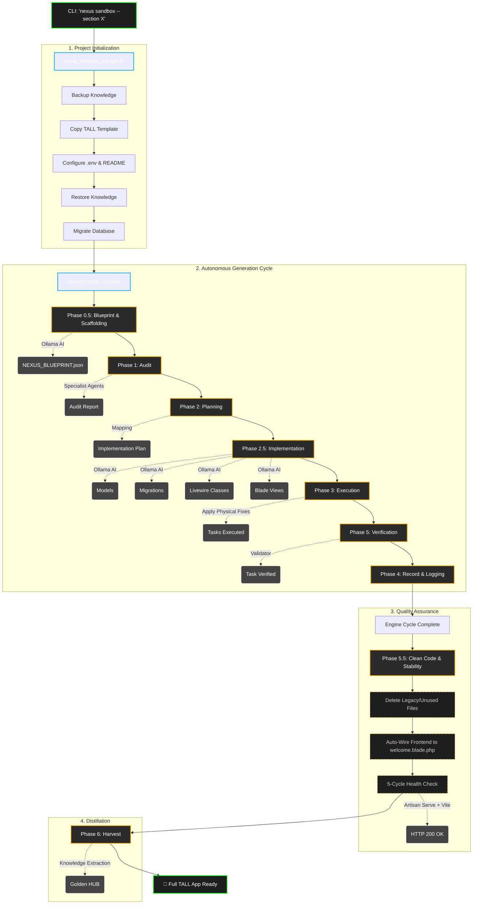

# Nexus Sandbox Pipeline Architecture

This diagram visualizes the complete end-to-end autonomous code generation pipeline when executing `nexus sandbox --section <X>`.

```mermaid
graph TD
    %% Styling
    classDef cli fill:#1e1e1e,stroke:#00ff00,stroke-width:2px,color:#fff
    classDef js file fill:#2b2b2b,stroke:#00aaff,stroke-width:2px,color:#fff
    classDef phase fill:#2b2b2b,stroke:#ffaa00,stroke-width:2px,color:#fff
    classDef subphase fill:#1e1e1e,stroke:#ffaa00,stroke-width:1px,stroke-dasharray: 5 5,color:#ccc
    classDef ext fill:#444,stroke:#fff,stroke-width:1px,color:#fff
    
    A[CLI: 'nexus sandbox --section X']:::cli --> B[setup_dynamic_section.js]:::js
    
    subgraph Sandbox Preparation [1. Project Initialization]
        B --> C[Backup Knowledge]
        C --> D[Copy TALL Template]
        D --> E[Configure .env & README]
        E --> F[Restore Knowledge]
        F --> G[Migrate Database]
    end

    G --> H[NexusEngine.runCycle]:::js

    subgraph Core Engine [2. Autonomous Generation Cycle]
        H --> P05[Phase 0.5: Blueprint & Scaffolding]:::phase
        P05 -.->|Ollama AI| BP(NEXUS_BLUEPRINT.json):::ext
        
        P05 --> P1[Phase 1: Audit]:::phase
        P1 -.->|Specialist Agents| AR(Audit Report):::ext
        
        P1 --> P2[Phase 2: Planning]:::phase
        P2 -.->|Mapping| IP(Implementation Plan):::ext
        
        P2 --> P25[Phase 2.5: Implementation]:::phase
        P25 -.->|Ollama AI| Models(Models):::ext
        P25 -.->|Ollama AI| Migs(Migrations):::ext
        P25 -.->|Ollama AI| LWC(Livewire Classes):::ext
        P25 -.->|Ollama AI| Blade(Blade Views):::ext
        
        P25 --> P3[Phase 3: Execution]:::phase
        P3 -.->|Apply Physical Fixes| Fix(Tasks Executed):::ext
        
        P3 --> P5[Phase 5: Verification]:::phase
        P5 -.->|Validator| ValResult(Task Verified):::ext

        P5 --> P4[Phase 4: Record & Logging]:::phase
    end

    P4 --> I[Engine Cycle Complete]

    subgraph Verification [3. Quality Assurance]
        I --> P55[Phase 5.5: Clean Code & Stability]:::phase
        P55 --> CC1[Delete Legacy/Unused Files]:::subphase
        CC1 --> CC2[Auto-Wire Frontend to welcome.blade.php]:::subphase
        CC2 --> HC[5-Cycle Health Check]:::subphase
        HC -.->|Artisan Serve + Vite| HTTP(HTTP 200 OK):::ext
    end

    HC --> P6[Phase 6: Harvest]:::phase
    
    subgraph Finalization [4. Distillation]
        P6 -.->|Knowledge Extraction| HUB(Golden HUB):::ext
    end

    P6 --> Z[🚀 Full TALL App Ready]:::cli
```
