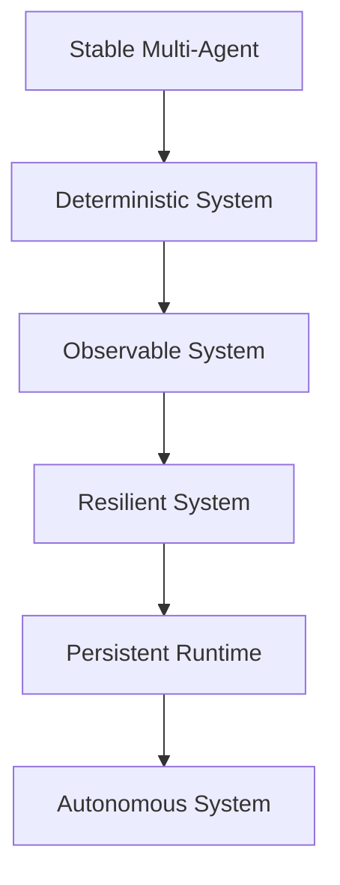

# NEXUS — Post-Stabilization Hardening Guide

## Phase: From Stable → Robust → Autonomous-Ready

> Status:
> Multi-Agent System: **STABLE (Functional)**
>
> Next Target:
> **Deterministic, Observable, and Resilient System**

---

# 1. Reality Check (Critical)

Stabil ≠ Aman

Walaupun sistem sudah:

- tidak crash
- agent berjalan konsisten
- workflow berhasil

Masih mungkin ada:

```text
hidden race conditions
silent memory corruption
non-deterministic outputs
edge-case failures
```

---

# 2. New Phase Objective

```text
Make NEXUS predictable under stress
```

---

# 3. Hardening Priorities

---

# 3.1 Deterministic Execution

## Problem

Agent masih kemungkinan:

- menghasilkan output berbeda untuk input sama
- tergantung timing / order

---

## Target

```text
Same input → Same output → Same state
```

---

## Implementation

- enforce strict input schema
- remove implicit dependencies
- freeze execution order (if needed)
- add state snapshots

---

# 3.2 Concurrency Safety

## Problem

Multi-agent system = concurrency risk

---

## Risks

```text
race condition
double write
lost update
inconsistent memory state
```

---

## Solution

### Introduce:

- locking mechanism (soft/hard)
- transaction-based memory write
- queue-based execution (FIFO / priority)

---

## Example

```text
memory.write()
→ lock
→ validate
→ write
→ release
```

---

# 3.3 Memory Integrity System

## Target

Memory harus:

```text
consistent
traceable
recoverable
```

---

## Add

- checksum per entry
- version history
- diff tracking
- rollback mechanism

---

## Rule

```text
NO direct overwrite without versioning
```

---

# 3.4 Failure Handling System

## Problem

Sebagian besar system terlihat stabil sampai error muncul.

---

## Target

```text
Fail gracefully, not silently
```

---

## Required

Every agent must:

- return structured error
- classify error type
- support retry
- support fallback

---

## Error Example

```json
{
  "status": "error",
  "type": "MEMORY_CONFLICT",
  "retryable": true,
  "message": ""
}
```

---

# 3.5 Observability Layer

## Target

```text
You must SEE the system thinking
```

---

## Required Logs

- task lifecycle
- agent execution
- memory mutation
- plugin usage
- error traces

---

## Add

- trace_id per task
- correlation_id across agents

---

# 3.6 Performance Profiling

## Problem

Stable ≠ Efficient

---

## Add Measurement

- execution time per agent
- memory usage
- queue latency
- bottleneck detection

---

## Output Example

```text
Agent: memory_pipeline
Time: 120ms
Status: OK
```

---

# 3.7 Event Bus Validation

## Check

- no lost events
- no duplicate events
- correct event ordering

---

## Add

- event audit log
- replay capability

---

# 3.8 Plugin Safety Reinforcement

## Must Ensure

- plugin cannot crash core
- plugin cannot corrupt memory
- plugin respects permissions

---

## Add

- execution timeout
- sandbox layer
- permission validation

---

# 3.9 Stress Testing

## Required

Test system under:

- high task load
- parallel execution
- invalid input
- partial failure

---

## Goal

```text
System does not collapse under pressure
```

---

# 3.10 Chaos Testing (Advanced)

Introduce controlled failure:

- kill agent mid-execution
- corrupt input
- delay responses

---

## Goal

```text
System survives unexpected behavior
```

---

# 4. Metrics You Should Track

```text
task_success_rate
task_retry_rate
error_rate
avg_execution_time
memory_conflict_rate
plugin_failure_rate
```

---

# 5. Definition of "TRULY STABLE"

System bisa disebut stabil jika:

- deterministic
- observable
- recoverable
- scalable
- resilient under stress

---

# 6. Next Evolution Path



---

# 7. Strategic Warning

JANGAN langsung ke:

```text
autonomy
self-evolution
AGI
```

Jika belum:

```text
stress-tested
fully observable
failure-safe
```

---

# 8. Final Principle

```text
If you cannot debug it,
you cannot scale it.
```

---

# 9. Final Position

```text
NEXUS (Current):
Stable Multi-Agent System

NEXUS (Next Target):
Deterministic & Resilient Cognitive Infrastructure
```
