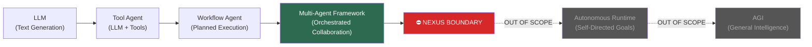

# 🔍 NEXUS AI — Full Scan, Review & Multi-Agent Guardrail

> **Reviewer**: Senior AI Engineer Analysis  
> **Tanggal**: 2026-05-13  
> **Versi Engine**: v3.2.0  
> **Status**: ACTIONABLE

---

## BAGIAN 1 — SCAN HASIL (Apa Yang Berubah)

### Module Baru Yang Ditemukan

| Module                 | Fungsi                                          | Status                            |
| :--------------------- | :---------------------------------------------- | :-------------------------------- |
| `LocalIntelligence.js` | Integrasi Ollama untuk local LLM reasoning      | ✅ Ada, ⚠️ Perlu guardrail        |
| `RedisMemory.js`       | High-speed in-memory cache, singleton           | ✅ Solid                          |
| `Contract.js`          | Data contracts: AuditReport, ImplementationPlan | ✅ Sangat bagus                   |
| `TaskProtocol.js`      | Standarisasi task antar agent dengan trace_id   | ✅ Production-grade               |
| `WorktreeManager.js`   | Git worktree isolation per feature              | ⚠️ Git commands masih di-comment  |
| `LaravelArchitect.js`  | Otomatis inject trait, tambah migration column  | ✅ Useful, scope terbatas         |
| `SemanticEngine.js`    | TF-IDF vector search + Redis cache              | ✅ Implementasi dari upgrade plan |

### Yang Sudah Diperbaiki dari Versi Sebelumnya

- ✅ `SemanticEngine.js` sudah diimplementasi dan terhubung ke `RedisMemory`
- ✅ `Contract.js` memberikan type safety antar modul
- ✅ `TaskProtocol.js` menambah `trace_id` dan `correlation_id` — observability naik level
- ✅ `Orchestrator.js` sekarang pakai `TaskProtocol` — task lifecycle terlacak
- ✅ Boundary docs sudah ada: `NEXUS INTERNAL CORE HARD BOUNDARY` dan `NEXUS eksternal boundary`

---

## BAGIAN 2 — REVIEW KUALITAS

### 2.1 Yang Benar-Benar Kuat

**`Contract.js` — ini game changer**

```javascript
static validate(data) {
    const required = ['id', 'target', 'findings'];
    const missing = required.filter(field => !data[field]);
    if (missing.length > 0) throw new Error(`Contract Violation: Missing fields [${missing.join(', ')}]`);
}
```

Dengan adanya Contract, antar module sekarang punya formal interface. Ini yang membedakan sistem amatir dengan sistem yang bisa di-maintain jangka panjang.

---

**`TaskProtocol.js` — multi-agent communication standard**

```javascript
this.trace_id = `TRACE-${Date.now()}-${Math.random().toString(36).slice(2, 7)}`;
this.correlation_id = context.correlation_id || this.trace_id;
```

`trace_id` + `correlation_id` ini pola enterprise. Kalau ada task gagal di agent ke-7, lu bisa trace balik ke asal task-nya. Ini critical untuk debugging multi-agent.

---

**`RedisMemory.js` — graceful degradation**

```javascript
} catch (e) {
    console.warn('⚠️ Redis: Connection failed. Falling back to file-based memory.');
    this.isConnected = false;
}
```

Pattern ini benar — kalau Redis tidak ada, sistem tetap jalan. Tidak crash. Ini defensive engineering yang matang.

---

### 2.2 Yang Perlu Perhatian

**`WorktreeManager.js` — semua logic masih di-comment**

```javascript
// execSync(`git worktree add -b feature/${featureName} ${targetPath} main`, ...);
// execSync(`git checkout main && git merge feature/${featureName}`, ...);
```

Modul ini ada tapi tidak aktif. Kalau dipanggil sekarang, tidak akan melakukan apa-apa. Ini bisa menyesatkan karena log-nya bilang "merging" padahal tidak.

**Rekomendasi**: Tambahkan flag `this.isActive = false` dan guard di setiap method, atau hapus dulu sampai siap diaktifkan.

---

**`LocalIntelligence.js` — autonomous reasoning tanpa batas**

```javascript
async generate(prompt, systemPrompt = "You are Nexus AI, a senior software architect.") {
    // ...
    const response = await axios.post(`${this.baseUrl}/generate`, {
        model: this.model,
        prompt: prompt,
        stream: false,
        options: { temperature: 0.2, num_ctx: 4096 }
    });
    return response.data.response;
}
```

Modul ini memberi NEXUS kemampuan untuk **reason secara bebas** via local LLM. Tidak ada scope limit, tidak ada output validation, tidak ada human checkpoint. Ini adalah pintu menuju arah AGI yang perlu dibatasi (lihat Bagian 3).

---

**`alur agi.md` — diagram yang menjadi concern**

```
A[LLM] --> B[Agent] --> C[AGI]
```

Diagram ini memetakan AGI sebagai target evolution NEXUS. Ini perlu direvisi dengan pagar yang jelas di mana NEXUS **harus berhenti**.

---

### 2.3 Inkonsistensi Yang Ditemukan

| Masalah                                                        | Lokasi                     | Dampak                 |
| :------------------------------------------------------------- | :------------------------- | :--------------------- |
| `WorktreeManager` aktif tapi tidak fungsional                  | WorktreeManager.js         | ⚠️ Misleading          |
| `LocalIntelligence` tidak punya output schema                  | LocalIntelligence.js       | 🔴 Uncontrolled output |
| `alur agi.md` memetakan AGI sebagai endpoint                   | documentation/mermaid/     | ⚠️ Directional risk    |
| `RECURSIVE_EVOLUTION_ARCHITECT.md` pakai kata "infinite loop"  | documentation/nexus_rules/ | ⚠️ Framing risk        |
| `SemanticEngine` tidak di-import di `NexusEngine.js` yang baru | agent/core/                | 🔴 Dead code           |

---

## BAGIAN 3 — GUARDRAIL: PAGAR MULTI-AGENT

Ini adalah dokumen pagar resmi yang harus dijadikan bagian dari `NEXUS INTERNAL CORE`.

---

### 🗺️ Posisi Target NEXUS Yang Benar

```
LLM → Tool Agent → Workflow Agent → [NEXUS: Multi-Agent Framework] → ⛔ BERHENTI DI SINI
                                                                      ↓
                                                           Autonomous Runtime → AGI
```

NEXUS adalah **Modular Semantic Multi-Agent Framework**. Bukan AGI. Bukan self-aware system. Target akhir adalah **reliable, stable, observable multi-agent orchestration**.

---

### 🔒 3 Pagar Utama Yang Wajib Ada

---

#### PAGAR 1 — Batasi LocalIntelligence

`LocalIntelligence.js` adalah komponen paling berisiko karena memberikan kemampuan reasoning bebas ke sistem. Harus dibatasi dengan scope contract.

**Implementasi Pagar:**

```javascript
// agent/core/LocalIntelligence.js — TAMBAHKAN ini

// Whitelist: satu-satunya task yang boleh dilakukan LocalIntelligence
const ALLOWED_TASKS = [
    'review_code_quality',
    'suggest_refactor',
    'explain_error',
    'validate_migration_schema'
];

async generate(prompt, taskType, systemPrompt) {
    // 1. WAJIB: Validate task type
    if (!ALLOWED_TASKS.includes(taskType)) {
        throw new Error(
            `LocalIntelligence Boundary Violation: ` +
            `Task "${taskType}" tidak ada dalam whitelist. ` +
            `Allowed: [${ALLOWED_TASKS.join(', ')}]`
        );
    }

    // 2. WAJIB: Hard token limit — tidak boleh diubah
    const MAX_TOKENS = 512;

    // 3. WAJIB: System prompt dikunci — tidak boleh di-override dari luar
    const LOCKED_SYSTEM_PROMPT =
        `You are a TALL Stack code reviewer. ` +
        `Your role is LIMITED to: ${ALLOWED_TASKS.join(', ')}. ` +
        `You MUST NOT generate code autonomously, make architectural decisions, ` +
        `or perform any action outside your defined role. ` +
        `Respond in structured format only.`;

    if (!this.isAvailable) await this.checkAvailability();
    if (!this.isAvailable) return null;

    const response = await axios.post(`${this.baseUrl}/generate`, {
        model: this.model,
        prompt: prompt,
        system: LOCKED_SYSTEM_PROMPT, // system prompt TIDAK bisa di-override
        stream: false,
        options: { temperature: 0.1, num_ctx: MAX_TOKENS } // temperature rendah = lebih deterministik
    });

    // 4. WAJIB: Validate output schema sebelum dikembalikan
    return this.validateOutput(response.data.response, taskType);
}

validateOutput(output, taskType) {
    // Output harus ada dan dalam bentuk string
    if (!output || typeof output !== 'string') return null;

    // Output tidak boleh terlalu panjang (anti-hallucination runaway)
    if (output.length > 2000) {
        console.warn(`⚠️ LocalIntelligence: Output terlalu panjang (${output.length} chars). Truncated.`);
        return output.substring(0, 2000) + '\n...[TRUNCATED BY BOUNDARY GUARD]';
    }

    return output;
}
```

---

#### PAGAR 2 — Batasi EvolutionPiper (Anti-Infinite Loop)

`RECURSIVE_EVOLUTION_ARCHITECT.md` mendeskripsikan "infinite loop" yang bisa jalan tanpa batas. Ini harus diberi batas eksplisit.

**Implementasi Pagar:**

```javascript
// agent/core/EvolutionPiper.js — TAMBAHKAN di constructor

constructor(rootPath) {
    this.rootPath = rootPath;

    // ⛔ HARD LIMIT: Maksimal iterasi per session
    // Ini TIDAK BOLEH diubah secara programatik
    this.MAX_EVOLUTION_CYCLES = 25; // Satu phase = max 25 project
    this.currentCycle = 0;

    // ⛔ HARD LIMIT: Maksimal waktu eksekusi total
    this.MAX_SESSION_MINUTES = 120; // 2 jam
    this.sessionStartTime = null;
}

// TAMBAHKAN method guard ini — dipanggil di awal setiap evolve()
async checkEvolutionBoundary() {
    // Cek cycle limit
    if (this.currentCycle >= this.MAX_EVOLUTION_CYCLES) {
        throw new Error(
            `🚧 EVOLUTION BOUNDARY: Reached maximum cycles (${this.MAX_EVOLUTION_CYCLES}). ` +
            `Manual review required before next phase. ` +
            `Run 'nexus distill' then reset cycle counter manually.`
        );
    }

    // Cek time limit
    if (this.sessionStartTime) {
        const elapsed = (Date.now() - this.sessionStartTime) / 60000;
        if (elapsed > this.MAX_SESSION_MINUTES) {
            throw new Error(
                `🚧 EVOLUTION BOUNDARY: Session exceeded ${this.MAX_SESSION_MINUTES} minutes. ` +
                `Session paused for resource safety.`
            );
        }
    }

    this.currentCycle++;
    console.log(`🔄 Evolution Cycle: ${this.currentCycle}/${this.MAX_EVOLUTION_CYCLES}`);
}

// TAMBAHKAN di awal method evolve() atau spawnSandbox():
async spawnSandbox(projectName, tags) {
    await this.checkEvolutionBoundary(); // ← WAJIB dipanggil pertama
    // ... rest of logic
}
```

---

#### PAGAR 3 — Batasi Machinist (Anti-Self-Modification)

`Machinist.forge()` bisa generate file `.js` baru dan inject ke sistem. Ini harus dibatasi hanya ke folder yang aman.

**Implementasi Pagar:**

```javascript
// agent/core/Machinist.js — TAMBAHKAN ini

// Whitelist folder yang boleh di-write oleh Machinist
// TIDAK BOLEH ada path di luar ini
const FORGE_ALLOWED_PATHS = [
    'agent/tools/scanners/',  // ✅ Scanner plugins — aman
];

// Blacklist absolut — TIDAK PERNAH boleh disentuh Machinist
const FORGE_FORBIDDEN_PATHS = [
    'agent/core/',            // ❌ Core engine
    'agent/main.js',          // ❌ Entry point
    'cli.js',                 // ❌ CLI
    'agent/prompts/',         // ❌ Agent prompts (bisa manipulasi behavior)
    'memory/distilled/',      // ❌ Knowledge HUB (hanya boleh lewat Distiller)
];

async forge(name, wisdomPath) {
    // 1. Validate output path
    const outputPath = `agent/tools/scanners/${name.toLowerCase()}-scanner.js`;

    const isAllowed = FORGE_ALLOWED_PATHS.some(p => outputPath.startsWith(p));
    const isForbidden = FORGE_FORBIDDEN_PATHS.some(p => outputPath.startsWith(p));

    if (!isAllowed || isForbidden) {
        throw new Error(
            `🚧 MACHINIST BOUNDARY VIOLATION: ` +
            `Attempted to forge into forbidden path: "${outputPath}". ` +
            `Forge is restricted to: [${FORGE_ALLOWED_PATHS.join(', ')}]`
        );
    }

    // 2. Validate wisdom source — harus dari HUB, bukan file arbitrary
    const absoluteWisdom = path.resolve(wisdomPath);
    const absoluteHub = path.resolve('memory/distilled/');

    if (!absoluteWisdom.startsWith(absoluteHub)) {
        throw new Error(
            `🚧 MACHINIST BOUNDARY VIOLATION: ` +
            `Wisdom source must be from memory/distilled/. ` +
            `Got: "${wisdomPath}"`
        );
    }

    // 3. Generated code tidak boleh require() module core
    // (dicek setelah generate, sebelum write)
    const generatedCode = await this.generateScannerCode(name, wisdomPath);
    const forbiddenImports = ['NexusEngine', 'MemoryPipeline', 'Orchestrator', 'EvolutionPiper'];

    for (const forbidden of forbiddenImports) {
        if (generatedCode.includes(forbidden)) {
            throw new Error(
                `🚧 MACHINIST BOUNDARY VIOLATION: ` +
                `Generated scanner tried to import core module: "${forbidden}". ` +
                `Scanners must be isolated.`
            );
        }
    }

    // Lanjut ke forge setelah semua validasi lulus
    // ... rest of logic
}
```

---

### 📋 Checklist Guardrail — Status Current

| Guardrail                             | Status          | Action                             |
| :------------------------------------ | :-------------- | :--------------------------------- |
| `LocalIntelligence` task whitelist    | ❌ Belum ada    | Implementasi Pagar 1               |
| `LocalIntelligence` output validation | ❌ Belum ada    | Implementasi Pagar 1               |
| `EvolutionPiper` cycle limit          | ❌ Belum ada    | Implementasi Pagar 2               |
| `EvolutionPiper` session time limit   | ❌ Belum ada    | Implementasi Pagar 2               |
| `Machinist` path whitelist            | ❌ Belum ada    | Implementasi Pagar 3               |
| `Machinist` forbidden imports check   | ❌ Belum ada    | Implementasi Pagar 3               |
| `WorktreeManager` active flag         | ❌ Misleading   | Tambahkan `isActive = false` guard |
| `alur agi.md` — diagram direvisi      | ⚠️ Perlu revisi | Lihat Bagian 4                     |

---

## BAGIAN 4 — REVISI DIAGRAM AGI

Diagram `alur agi.md` saat ini:

```
LLM → Agent → AGI
```

**Harus diganti menjadi:**

```
LLM → Tool Agent → Workflow Agent → Multi-Agent Framework → ⛔ BOUNDARY
                                          ↑
                                      [NEXUS v3.x]
```

Dan file `documentation/mermaid/alur agi.md` sebaiknya direname menjadi `alur nexus boundary.md` dengan konten:



---

## BAGIAN 5 — SARAN PRIORITAS

### 🔴 Lakukan Sekarang

1. **Implementasi 3 Pagar** di atas — bisa dikerjakan dalam 1 sesi
2. **Fix `SemanticEngine` import** di `NexusEngine.js` — sekarang dead code
3. **Tambahkan `isActive = false` guard** di `WorktreeManager.js`

### 🟡 Sprint Berikutnya

4. **Revisi `alur agi.md`** menjadi boundary diagram
5. **Tambahkan `nexus status` command** yang menampilkan:
   - Current evolution cycle count
   - Session time elapsed
   - Guardrail status (active/inactive)
6. **Aktifkan `WorktreeManager`** dengan uncomment git commands + testing

### 🟢 Enhancement

7. **Buat `NEXUS_GUARDRAIL_LOG.md`** yang otomatis di-append setiap kali guardrail terpicu — audit trail yang penting
8. **Tambahkan unit test untuk setiap pagar** — `TDDGuard` harus reject kode yang bypass guardrail

---

## KESIMPULAN

NEXUS saat ini ada di posisi yang **tepat sebagai Multi-Agent Framework**. Arsitekturnya sudah solid, boundary docs sudah ada. Yang kurang adalah **enforcement di level kode** — boundary-nya baru ada di dokumentasi, belum di `throw new Error()`.

Tiga pagar di dokumen ini mengubah boundary dari dokumentasi menjadi **kode yang enforce dirinya sendiri**.

> Sistem yang aman bukan sistem yang punya dokumen larangan.  
> Sistem yang aman adalah sistem yang **secara teknis tidak bisa** melanggar batasnya sendiri.

---

> **METADATA (NEXUS SEMANTIC TAGS)**: [security, architecture, tdd, standards, guardrail, multi-agent]  
> **Status**: READY_FOR_IMPLEMENTATION  
> _Senior AI Engineer Review | NEXUS v3.2.0_
