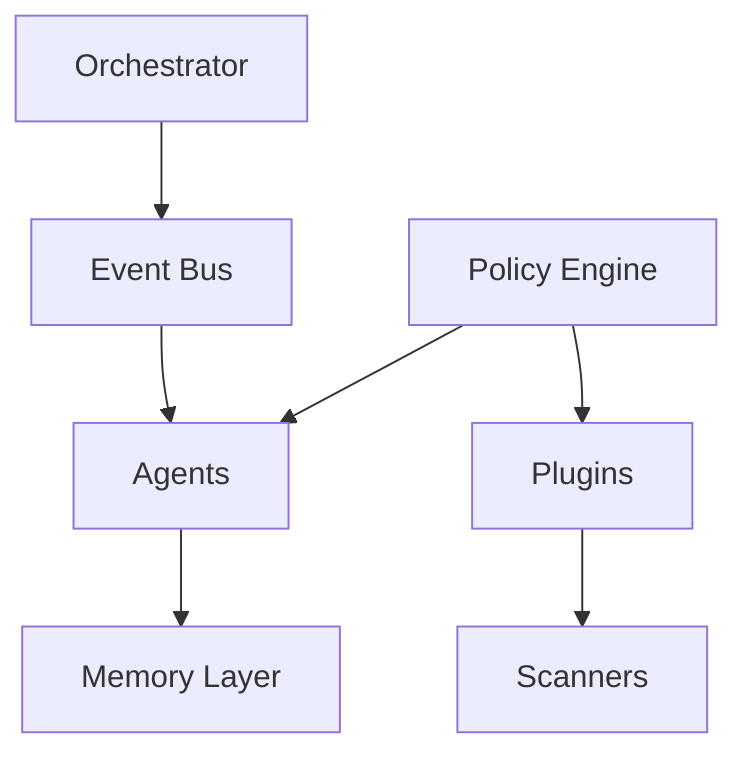

# NEXUS — Architecture Weaknesses & Stabilization Recommendations

## Technical Audit Report (Multi-Agent Stabilization Phase)

> Focus:
> Stabilizing NEXUS as a modular semantic multi-agent framework.

---

# 1. Current Architectural Position

## Current State

```text
NEXUS = Experimental Semantic Multi-Agent Framework
```

## NOT Yet

- AGI
- autonomous intelligence
- self-evolving cognition
- fully autonomous runtime

---

# 2. Core Problem Summary

| Area                  | Status |
| --------------------- | ------ |
| Vision                | Strong |
| Documentation         | Strong |
| Modularity            | Medium |
| Agent Isolation       | Weak   |
| Runtime Governance    | Weak   |
| Memory Consistency    | Medium |
| Plugin Safety         | Weak   |
| Scalability Readiness | Medium |
| Autonomy Readiness    | Low    |

---

# 3. Critical Weaknesses

---

# 3.1 Agent Boundary Is Still Blurry

## Problem

Beberapa agent masih memiliki:

- overlapping responsibility
- direct dependency
- mixed orchestration logic
- uncontrolled memory access

---

## Risks

Jika jumlah agent meningkat:

```text
race conditions
context corruption
execution chaos
unpredictable behaviors
```

akan mulai muncul.

---

## Required Solution

### Every Agent MUST Have

```json
{
  "name": "",
  "responsibility": "",
  "allowed_inputs": [],
  "allowed_outputs": [],
  "permissions": [],
  "execution_scope": ""
}
```

---

## Recommendation

Pisahkan dengan tegas:

```text
GOOD:
orchestrator -> agents

BAD:
agents -> controlling other agents directly
```

---

# 3.2 No Strict Agent Contract

## Problem

Belum ada standard universal untuk:

- input format
- output format
- task schema
- error handling
- execution lifecycle

---

## Risks

Tanpa contract:

```text
integration instability
debugging complexity
orchestration fragility
```

---

## Required Solution

## Create Universal Task Protocol

```json
{
  "task_id": "",
  "agent": "",
  "priority": "",
  "input": {},
  "context": {},
  "status": "",
  "timestamp": ""
}
```

---

# 3.3 Memory Governance Is Incomplete

## Problem

Semantic memory sudah bagus secara konsep,
tetapi belum memiliki:

- strict schema
- validation layer
- lifecycle management
- semantic conflict detection
- rollback mechanism

---

## Risks

```text
semantic drift
duplicate meanings
tag inconsistency
knowledge corruption
```

---

## Required Solution

## Recommended Memory Structure

```text
memory/
│
├── raw/
├── normalized/
├── semantic/
├── distilled/
├── operational/
└── archived/
```

---

## Add Mandatory Features

### Must Have

- versioning
- checksum validation
- semantic normalization
- rollback support
- memory audit logs

---

# 3.4 Plugin System Is Not Fully Isolated

## Problem

Scanner/tool execution masih terlalu trusted.

Belum ada:

- isolation
- sandboxing
- execution limits
- permission boundaries

---

## Risks

Future dynamic scanners dapat:

- corrupt memory
- crash orchestration
- overwrite core systems
- create recursive failures

---

## Required Solution

## Every Plugin Must Have

```json
{
  "name": "",
  "version": "",
  "permissions": [],
  "entrypoint": "",
  "execution_timeout": 0
}
```

---

## Add Execution Sandbox

Plugin wajib dijalankan dalam:

```text
isolated execution context
```

---

# 3.5 Core System and Capability System Are Mixed

## Problem

Boundary antara:

- orchestration
- runtime core
- plugins
- scanners

masih belum rigid.

---

## Risks

Future evolution akan menyebabkan:

```text
core instability
maintenance difficulty
uncontrolled coupling
```

---

## Required Solution

## Split Into Two Zones

### CORE (protected)

```text
core/
```

Isi:

- scheduler
- orchestration
- policy engine
- memory governance
- security layer

---

### CAPABILITY LAYER (extensible)

```text
tools/
plugins/
scanners/
```

---

# 3.6 No Event Bus Architecture

## Problem

Current orchestration terlihat masih:

- direct invocation
- tightly coupled execution

---

## Risks

Saat agent bertambah:

```text
execution bottleneck
dependency explosion
system fragility
```

---

## Required Solution

## Introduce Event-Driven Architecture

### Example Events

```text
MEMORY_UPDATED
TASK_COMPLETED
TASK_FAILED
SCANNER_FINISHED
FORGE_REQUESTED
```

---

## Recommended Flow

```text
agents -> emit events -> orchestrator reacts
```

---

# 3.7 Logging & Observability Are Not Mature Yet

## Problem

Belum ada observability standard.

---

## Risks

Tanpa observability:

```text
difficult debugging
unknown runtime failures
hidden memory corruption
```

---

## Required Solution

## Create Dedicated Logging Layer

```text
logs/
│
├── agents/
├── orchestration/
├── memory/
├── scanners/
├── plugins/
└── forge/
```

---

## Mandatory Metrics

### Every Agent Must Log

- execution start
- execution end
- runtime duration
- error state
- memory mutation
- tool usage

---

# 3.8 Too Much Vision Layer vs Runtime Reality

## Problem

Terminologi seperti:

```text
autonomous evolution
physical self-evolution
cognitive ecosystem
```

lebih maju dibanding implementasi runtime aktual.

---

## Risks

```text
architecture confusion
expectation mismatch
maintenance drift
```

---

## Required Solution

## Use Realistic Technical Positioning

### Recommended Positioning

```text
Semantic Multi-Agent Framework
```

atau:

```text
Modular Cognitive Workflow System
```

---

# 3.9 No Runtime Governance Layer

## Problem

Belum ada:

- policy engine
- execution rules
- permission governance
- capability restrictions

---

## Risks

Saat dynamic capability tumbuh:

```text
uncontrolled execution
unsafe module behaviors
runtime corruption
```

---

## Required Solution

## Add Governance Layer

### Governance Responsibilities

- execution permissions
- memory access control
- task priority management
- safety policies
- plugin restrictions

---

# 3.10 Premature C++ Rewrite Risk

## Problem

Architecture belum stabil sepenuhnya,
tetapi sudah ada rencana rewrite besar.

---

## Risks

```text
complexity explosion
development slowdown
maintenance overload
architecture freeze
```

---

## Required Solution

## DO NOT Rewrite Entire System Yet

### Recommended Strategy

Keep:

- Node.js/Python for AI layer

Use C++ ONLY for:

- runtime core
- scheduler
- plugin loader
- high-performance scanning engine

---

# 4. Recommended Stabilization Roadmap

---

# Phase 1 — Agent Stabilization

## Focus

- strict boundaries
- execution contracts
- standardized communication
- role isolation

---

# Phase 2 — Memory Governance

## Focus

- semantic consistency
- versioning
- rollback
- validation
- lifecycle management

---

# Phase 3 — Orchestration Hardening

## Focus

- event bus
- scheduler
- retry logic
- failure handling
- deterministic execution

---

# Phase 4 — Plugin Isolation

## Focus

- sandbox execution
- permission scopes
- execution governance
- capability isolation

---

# Phase 5 — Persistent Runtime

## Focus

- daemon/service runtime
- event loop
- autonomous scheduling
- runtime monitoring

---

# 5. Recommended Architecture Direction



---

# 6. Most Important Strategic Advice

## DO NOT Chase AGI

Current priority should be:

```text
stable orchestration
```

because:

```text
stability -> scalability
scalability -> survivability
survivability -> future autonomy
```

---

# 7. Final Technical Positioning

## Most Accurate Description

```text
NEXUS is a modular semantic multi-agent framework
focused on orchestration, workflow intelligence,
and scalable cognitive tooling.
```

---

# 8. Final Conclusion

NEXUS memiliki:

- visi kuat
- fondasi bagus
- struktur yang menjanjikan

Tetapi keberhasilan jangka panjang sangat bergantung pada:

```text
architecture discipline
```

Bukan:

- terminology futuristik
- AGI branding
- autonomous claims

---

# 9. Final Strategic Principle

```text
Build stable systems first.
Intelligence emerges later.
```
