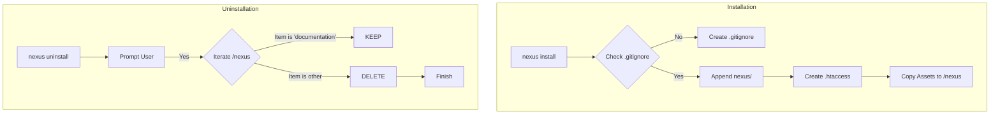

# 🛠️ Installation & Uninstallation Workflow (v3.1)
> **VERSION**: v2 | **Last Updated**: 28/05/2026

Dokumen ini menjelaskan protokol standar untuk memasang dan melepas engine Nexus AI pada sebuah project untuk memastikan keamanan data dan kerapihan struktur.

---

## 1. 📥 Alur Kerja Instalasi (Hardened Mode)

Proses instalasi dirancang untuk membuat lingkungan kerja AI yang mandiri (*self-contained*) dan aman dari eksposur publik.

### Langkah-langkah:
1.  **Eksekusi Command**: Menjalankan `nexus install` atau `install.ps1`.
2.  **Pengecekan Environment**: Engine mendeteksi direktori project dan keberadaan file `.gitignore`.
3.  **Hardening (Auto-Gitignore)**: 
    *   Engine secara otomatis menambahkan entri `nexus/` ke file `.gitignore`.
    *   **Tujuan**: Mencegah data audit lokal dan memori agent masuk ke repositori git publik.
4.  **Security Barrier (.htaccess)**:
    *   Membuat file `.htaccess` di dalam folder `nexus/` dengan kebijakan `Deny from all`.
    *   **Tujuan**: Memblokir akses langsung browser ke file log dan dokumentasi sensitif.
5.  **Strukturisasi**:
    *   Memasang folder `agent/`, `workflow/`, `documentation/`, `memory/`, dan `logs/`.
    *   Menyalin `[README.md](../vcs/NEXUS_README.MD)` dan `ALGORITMA_INTEGRASI.md` ke dalam folder `nexus/`.

---

## 2. 📤 Alur Kerja Uninstalasi (Safe Mode)

Proses uninstalasi menggunakan protokol **Selective Deletion** untuk melindungi aset intelektual (Audit & Planning) yang telah dihasilkan.

### Langkah-langkah:
1.  **Eksekusi Command**: Menjalankan `nexus uninstall` atau `uninstall.ps1`.
2.  **Peringatan & Konfirmasi**: User diberikan peringatan keras tentang penghapusan engine dan memori.
3.  **Selective Deletion**:
    *   🗑️ **Dihapus**: Folder `agent/`, `memory/`, `logs/`, dan file sistem (`.htaccess`, `[README.md](../vcs/NEXUS_README.MD)`).
    *   🛡️ **Dipertahankan**: Folder `documentation/` (berisi `planning/`, `audit/`, `records/`, `summary/`).
4.  **Final State**: Engine terlepas dari project, namun seluruh riwayat perubahan dan hasil audit tetap tersimpan untuk referensi manual developer.

---

## 📊 Visualisasi Alur

---

## 📌 Aturan Emas (Golden Rules)
1.  **Jangan hapus folder `documentation` secara manual** kecuali Anda benar-benar ingin membuang seluruh riwayat riset project.
2.  **Selalu pastikan `.gitignore` aktif** sebelum melakukan `git commit` pertama setelah instalasi Nexus.
3.  **Gunakan Safe Uninstall** jika Anda ingin mengupgrade versi engine tanpa merusak data memori yang sudah ada.

---
> **METADATA (NEXUS SEMANTIC TAGS)**: [vcs]
