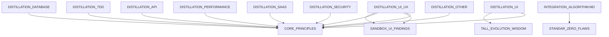

# 🧠 NEXUS AI: Neural Knowledge Map

```mermaid
graph TD
    DISTILLATION_DATABASE --> CORE_PRINCIPLES
    DISTILLATION_TDD --> CORE_PRINCIPLES
    DISTILLATION_UI_UX --> SANDBOX_UI_FINDINGS
    DISTILLATION_UI_UX --> CORE_PRINCIPLES
    DISTILLATION_API --> CORE_PRINCIPLES
    DISTILLATION_PERFORMANCE --> CORE_PRINCIPLES
    DISTILLATION_SAAS --> CORE_PRINCIPLES
    DISTILLATION_SECURITY --> CORE_PRINCIPLES
    INTEGRATION_ALGORITHM.MD --> STANDAR_ZERO_FLAWS
    DISTILLATION_UI --> TALL_EVOLUTION_WISDOM
    DISTILLATION_UI --> CORE_PRINCIPLES
    DISTILLATION_OTHER --> CORE_PRINCIPLES
    DISTILLATION_UI_UX --> SANDBOX_UI_FINDINGS
    DISTILLATION_UI_UX --> CORE_PRINCIPLES
```

> **Stats**: 202 Nodes | 14 Connections | **Generated**: 2026-05-26 09:11:56 (UTC+8)
