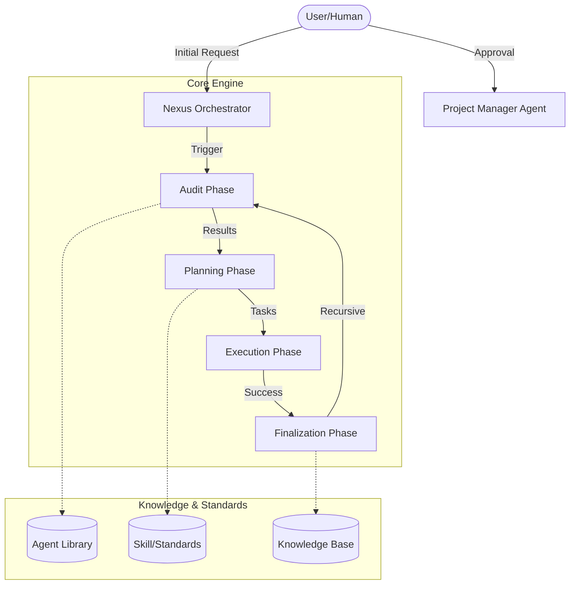

## 🎓 API WISDOM DISTILLATION [v9201] - 28/05/2026
> **Protocol**: Autonomous Intelligence Extraction | **Focus**: Actionable Tech Insights

### 📄 System Architecture
> **Origin**: `ui-ux/NEXUS_ARCHITECTURE.MD` | **Distilled At**: 28/05/2026

#### 💡 Content Summary:
> **VERSION**: v5 | **Last Updated**: 28/05/2026


The Human-AI Nexus is built as a modular orchestration system.





The central brain that coordinates the flow between phases. It ensures that data from the Audit phase is correctly passed to Planning, and that Execution only happens after approval.


A collection of markdown files in `agent/` that define the persona, responsibilities, and guardrails for different AI agents (e.g., Architect, Engineer, QA).


Technical standards and "best practice" snippets ...

#### 🔗 Traceability:
- [Source Context](NEXUS_ARCHITECTURE.MD)
- [Related Standards](NEXUS_CORE_PRINCIPLES.md)

---
### 📄 NEXUS — Architecture Weaknesses & Stabilization Recommendations
> **Origin**: `ui-ux/NEXUS_NEXUS STABILIZATION.MD` | **Distilled At**: 28/05/2026

#### 🧐 Core Insights (Distilled):
Conclusion

NEXUS memiliki:

- visi kuat
- fondasi bagus
- struktur yang menjanjikan

Tetapi keberhasilan jangka panjang sangat bergantung pada:

```text
architecture discipline
```

Bukan:

- terminology futuristik
- AGI branding
- autonomous claims

#### 🛠 Actionable Steps:
Recommendations
> **VERSION**: v1 | **Last Updated**: 26/05/2026

#### 🔗 Traceability:
- [Source Context](NEXUS_NEXUS STABILIZATION.MD)
- [Related Standards](NEXUS_CORE_PRINCIPLES.md)

---
### 📄 Omnibox Integration
> **Origin**: `ui-ux/NEXUS_OMNIBOX.MD` | **Distilled At**: 28/05/2026

#### 🛠 Actionable Steps:
action=opensearch&search=${encodeURIComponent(text)}&limit=5&format=json`
    );
    const [, titles, , urls] = await response.json();

    const suggestions = titles.map((title, i) => ({
      content: urls[i],
      description: `${title} - <url>${urls[i]}</url>`
    }));

    suggest(suggestions);
  } catch (err) {
    console.error('Search failed:', err);
  }
});
```

#### 🔗 Traceability:
- [Source Context](NEXUS_OMNIBOX.MD)
- [Related Standards](NEXUS_CORE_PRINCIPLES.md)

---
### 📄 Laravel Reverb
> **Origin**: `ui-ux/NEXUS_REVERB.MD` | **Distilled At**: 28/05/2026

#### 🛠 Actionable Steps:
actions when connections are managed or messages are exchanged.

The following events are dispatched by Reverb:

#### 🔗 Traceability:
- [Source Context](NEXUS_REVERB.MD)
- [Related Standards](NEXUS_CORE_PRINCIPLES.md)

---
### 📄 Set a scroll target for the initial render
> **Origin**: `ui-ux/NEXUS_SCROLL-TARGET-ON-LOAD.MD` | **Distilled At**: 28/05/2026

#### 💡 Content Summary:
> **VERSION**: v1 | **Last Updated**: 26/05/2026


The CSS property `scroll-initial-target` offers a declarative, CSS-only way to bring a specific descendant element into the visible area of its scroll container as soon as that container is rendered. Previously, developers relied on JavaScript (`Element.scrollIntoView()`) or URL fragment identifiers (`#item-id`), both of which have limitations and are tricky to implement.


To implement this successfully:

1. **Ensure a scroll container:** The target element must be inside a scroll container (an element with overflow that allows scrolling, such as `overflow: auto`). This can be any ancestor element, including the root `<html>` element.
2. **Target the Item:** Apply `scroll-initial-target: nearest` to the specific descendant element you want to bring into view.


In this example, a feed starts scrolled to a specific "featured" item rather than the very top of the list.

```css
/** 
 * TARGET: The item that should be visible on initial load.
 */
.item.target {
  scroll-initial-target: nearest;
}
```


- **DO** use `scroll-initial-target` for "middle-start" experiences, such as a calendar starting on the c...

#### 🔗 Traceability:
- [Source Context](NEXUS_SCROLL-TARGET-ON-LOAD.MD)
- [Related Standards](NEXUS_CORE_PRINCIPLES.md)

---


---
> **METADATA (NEXUS SEMANTIC TAGS)**: [ui-ux, api]


## 🎓 API WISDOM DISTILLATION [v2968] - 28/05/2026
> **Protocol**: Autonomous Intelligence Extraction | **Focus**: Actionable Tech Insights

### 📄 System Architecture
> **Origin**: `ui-ux/NEXUS_ARCHITECTURE.MD` | **Distilled At**: 28/05/2026


#### 🔗 Traceability:
- [Source Context](NEXUS_ARCHITECTURE.MD)
- [Related Standards](NEXUS_CORE_PRINCIPLES.md)

---
### 📄 NEXUS — Architecture Weaknesses & Stabilization Recommendations
> **Origin**: `ui-ux/NEXUS_NEXUS STABILIZATION.MD` | **Distilled At**: 28/05/2026


#### 🔗 Traceability:
- [Source Context](NEXUS_NEXUS STABILIZATION.MD)
- [Related Standards](NEXUS_CORE_PRINCIPLES.md)

---
### 📄 Omnibox Integration
> **Origin**: `ui-ux/NEXUS_OMNIBOX.MD` | **Distilled At**: 28/05/2026


#### 🔗 Traceability:
- [Source Context](NEXUS_OMNIBOX.MD)
- [Related Standards](NEXUS_CORE_PRINCIPLES.md)

---
### 📄 Laravel Reverb
> **Origin**: `ui-ux/NEXUS_REVERB.MD` | **Distilled At**: 28/05/2026


#### 🔗 Traceability:
- [Source Context](NEXUS_REVERB.MD)
- [Related Standards](NEXUS_CORE_PRINCIPLES.md)

---
### 📄 Set a scroll target for the initial render
> **Origin**: `ui-ux/NEXUS_SCROLL-TARGET-ON-LOAD.MD` | **Distilled At**: 28/05/2026


#### 🔗 Traceability:
- [Source Context](NEXUS_SCROLL-TARGET-ON-LOAD.MD)
- [Related Standards](NEXUS_CORE_PRINCIPLES.md)

---


## 🎓 API WISDOM DISTILLATION [v5766] - 28/05/2026
> **Protocol**: Autonomous Intelligence Extraction | **Focus**: Actionable Tech Insights

### 📄 System Architecture
> **Origin**: `distilled/ui-ux/NEXUS_ARCHITECTURE.MD` | **Distilled At**: 28/05/2026


#### 🔗 Traceability:
- [Source Context](NEXUS_ARCHITECTURE.MD)
- [Related Standards](NEXUS_CORE_PRINCIPLES.md)

---
### 📄 NEXUS — Architecture Weaknesses & Stabilization Recommendations
> **Origin**: `distilled/ui-ux/NEXUS_NEXUS STABILIZATION.MD` | **Distilled At**: 28/05/2026


#### 🔗 Traceability:
- [Source Context](NEXUS_NEXUS STABILIZATION.MD)
- [Related Standards](NEXUS_CORE_PRINCIPLES.md)

---
### 📄 Omnibox Integration
> **Origin**: `distilled/ui-ux/NEXUS_OMNIBOX.MD` | **Distilled At**: 28/05/2026


#### 🔗 Traceability:
- [Source Context](NEXUS_OMNIBOX.MD)
- [Related Standards](NEXUS_CORE_PRINCIPLES.md)

---
### 📄 Laravel Reverb
> **Origin**: `distilled/ui-ux/NEXUS_REVERB.MD` | **Distilled At**: 28/05/2026


#### 🔗 Traceability:
- [Source Context](NEXUS_REVERB.MD)
- [Related Standards](NEXUS_CORE_PRINCIPLES.md)

---
### 📄 Set a scroll target for the initial render
> **Origin**: `distilled/ui-ux/NEXUS_SCROLL-TARGET-ON-LOAD.MD` | **Distilled At**: 28/05/2026


#### 🔗 Traceability:
- [Source Context](NEXUS_SCROLL-TARGET-ON-LOAD.MD)
- [Related Standards](NEXUS_CORE_PRINCIPLES.md)

---
