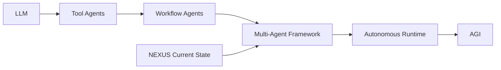
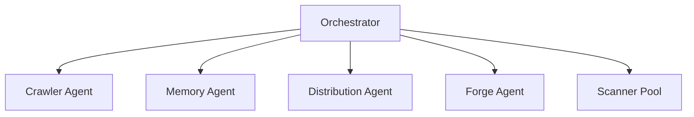
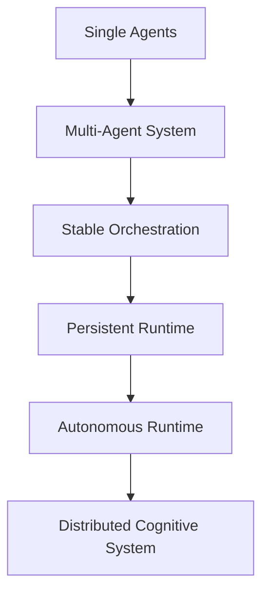

# NEXUS Architecture Roadmap
> **VERSION**: v1 | **Last Updated**: 26/05/2026


## Phase Focus: Multi-Agent Stabilization

> Current Classification:
> **Semantic Modular Multi-Agent Framework**

---

# 1. Objective

Fokus utama NEXUS saat ini adalah:

- menstabilkan komunikasi antar agent
- memastikan konsistensi memory
- membangun orchestration yang modular
- membuat capability system yang scalable
- mengurangi coupling antar subsystem

Target fase ini **BUKAN AGI** dan **BUKAN full autonomy**.

Target utama:

```text
Reliable Multi-Agent Cognitive Infrastructure
```

---

# 2. Current System Boundary

## Included Scope

NEXUS saat ini mencakup:

- semantic knowledge processing
- multi-agent orchestration
- dynamic plugin execution
- knowledge distribution pipeline
- modular scanner ecosystem
- workflow intelligence

---

## Excluded Scope

NEXUS saat ini BELUM mencakup:

- AGI
- self-awareness
- autonomous goal creation
- recursive architecture redesign
- independent cognition
- fully autonomous runtime

---

# 3. Architectural Position



---

# 4. Core Stabilization Priorities

## 4.1 Agent Role Isolation

Setiap agent wajib memiliki:

- single responsibility
- clear execution boundary
- predictable input/output
- minimal side effects

---

## Recommended Structure

```text
agents/
│
├── crawler/
├── memory/
├── distribution/
├── forge/
├── scanners/
└── orchestration/
```

---

## Anti-Pattern

Hindari:

```text
1 agent mengerjakan semuanya
```

atau:

```text
shared mutable logic antar agent
```

---

# 5. Standardized Agent Protocol

Semua agent wajib menggunakan protocol yang sama.

## Recommended Protocol

```json
{
  "agent": "memory_pipeline",
  "task_id": "UUID",
  "input": {},
  "context": {},
  "priority": "normal",
  "timestamp": "",
  "status": "pending"
}
```

---

## Required Rules

### Every Agent Must:

- validate input
- return structured output
- log execution result
- expose error states
- avoid direct filesystem mutation outside scope

---

# 6. Orchestration Layer

## Current Recommendation

Pisahkan orchestration dari logic agent.

```text
GOOD:
orchestrator -> agents

BAD:
agents -> control agents directly
```

---

## Recommended Architecture



---

# 7. Memory Consistency

## Critical Rule

Semantic memory wajib menjadi:

```text
single source of truth
```

---

## Recommended Layers

```text
memory/
│
├── raw/
├── normalized/
├── semantic/
├── distilled/
└── operational/
```

---

## Required Stability Features

### Must Have:

- checksum validation
- versioning
- rollback capability
- conflict detection
- tag normalization

---

# 8. Plugin System Stabilization

## Recommended Plugin Boundary

Setiap scanner/plugin wajib memiliki:

```text
manifest
execution contract
permission scope
output schema
```

---

## Example

```json
{
  "name": "security_scanner",
  "version": "1.0",
  "permissions": ["read_logs"],
  "entry": "scanner.js"
}
```

---

# 9. Dynamic Scanner Safety

## Required Protection

Dynamic execution WAJIB memiliki:

- timeout
- execution isolation
- crash protection
- retry limits
- logging

---

## Recommended

Gunakan:

```text
sandbox execution layer
```

untuk scanner hasil forging.

---

# 10. Knowledge-to-Code Boundary

## IMPORTANT

Machine Forging TIDAK BOLEH:

- overwrite core engine
- mutate orchestration layer
- modify memory protocols
- self-register unrestricted permissions

---

## Safe Boundary

Forging hanya boleh:

```text
generate isolated capability modules
```

---

# 11. Logging & Observability

## Mandatory

Semua subsystem wajib memiliki:

- execution logs
- error logs
- task tracing
- performance metrics

---

## Recommended Structure

```text
logs/
│
├── agents/
├── orchestration/
├── scanners/
├── memory/
└── forge/
```

---

# 12. Stability Before Autonomy

## Current Priority

Fokus utama saat ini:

```text
stability > intelligence
```

Karena:

- unstable agents cannot evolve
- unstable orchestration creates chaos
- unstable memory corrupts cognition

---

# 13. Recommended Technical Direction

## Short-Term

### Keep:

- rapid iteration
- modular architecture
- semantic workflows

### Avoid:

- premature AGI claims
- uncontrolled self-modification
- overcomplex autonomy loops

---

# 14. Recommended Tech Stack

## Suggested Hybrid Model

### Core Runtime

- C++
- Rust
- Go

### AI Layer

- Python

### Memory Layer

- SQLite
- PostgreSQL
- Vector DB
- Graph DB

---

# 15. Long-Term Evolution Path



---

# 16. Final Positioning

## Accurate Technical Description

```text
NEXUS is a modular semantic multi-agent framework
focused on dynamic knowledge orchestration,
capability distribution, and scalable cognitive workflows.
```

---

# 17. Strategic Principle

```text
Do not optimize for AGI.
Optimize for stable orchestration first.
```

Karena:

- orchestration menghasilkan scalability
- stability menghasilkan survivability
- modularity menghasilkan evolvability
- observability menghasilkan maintainability

Tanpa itu, autonomous system akan menjadi tidak terkendali.


---
> **METADATA (NEXUS SEMANTIC TAGS)**: [database, ui-ux, performance, vcs, api]
