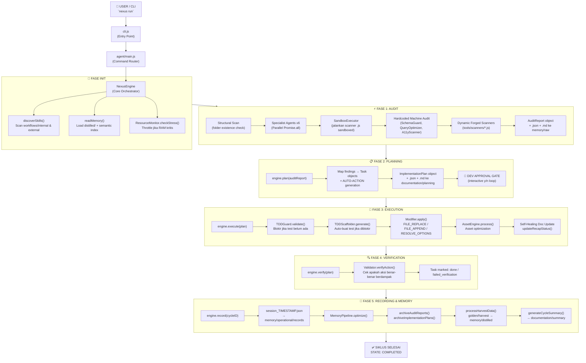
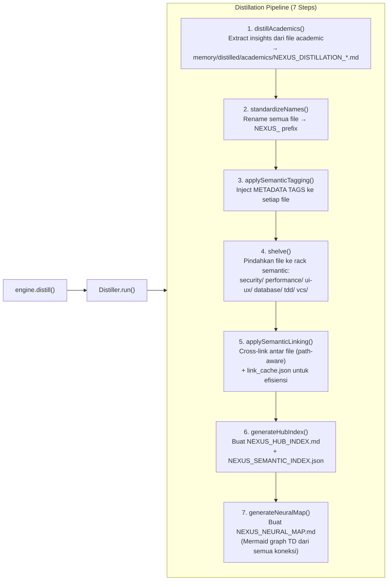
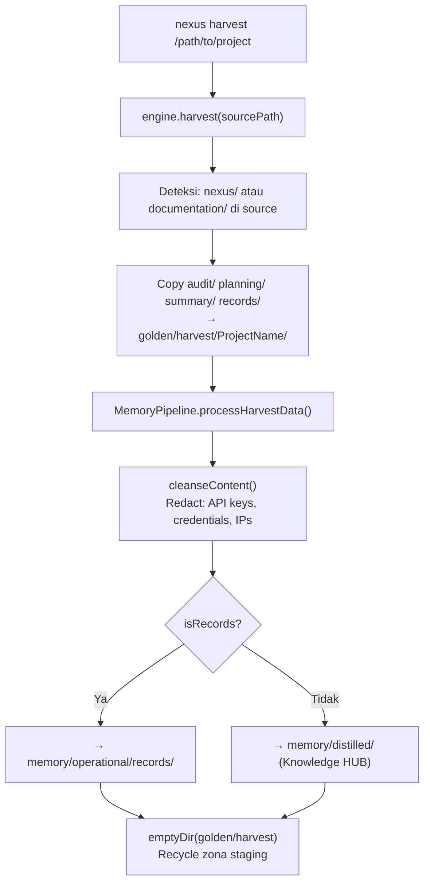
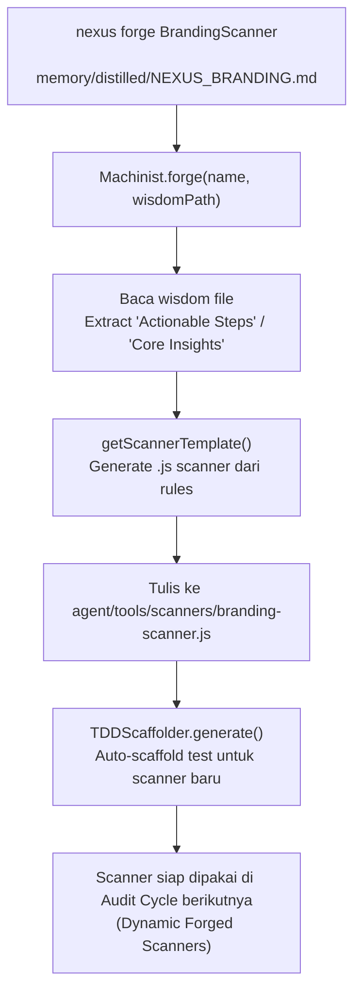
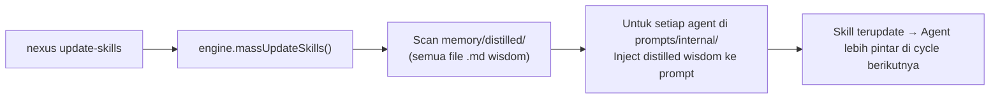
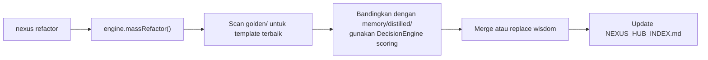

# 🧠 NEXUS AI — Pipeline Architecture Map
> **VERSION**: v1 | **Last Updated**: 26/05/2026


> **Scan Date**: 2026-05-11 | **Engine**: Antigravity AI Engineer  
> **Version**: Human-AI Nexus v3.1.0 | **Mode**: Extreme Scan

---

## 1. 📦 Struktur Makro Project

```
NEXUS AI/
├── cli.js                      ← Entry Point (Global CLI: `nexus <cmd>`)
├── agent/
│   ├── main.js                 ← Command Router (run/audit/harvest/distill/forge)
│   ├── core/                   ← OTAK UTAMA ENGINE
│   ├── prompts/                ← Agent Prompt Bank (internal + external)
│   ├── tools/                  ← Specialized Tools & Scanners
│   ├── workflows/              ← Skill Workflow Definitions
│   └── scripts/                ← Automated Loop Scripts
├── memory/
│   ├── raw/                    ← Audit mentah masuk di sini
│   ├── normalized/             ← Data setelah sanitasi
│   ├── semantic/               ← Indexed data berdasarkan tag
│   ├── distilled/              ← KNOWLEDGE HUB (master wisdom)
│   ├── operational/            ← Records, sessions, link cache
│   ├── archived/               ← Backup & rotasi file
│   └── short_term/             ← Cache sementara (link_cache.json)
├── knowledge/                  ← Session archives TDD & test logs
├── golden/harvest/             ← Zona staging harvest dari project external
├── documentation/              ← Output laporan (audit, planning, summary)
├── logs/                       ← Observability (agents/orchestration/errors)
├── tests/
│   ├── TDD/                    ← Test runner
│   └── sandboxes/              ← Lab environment (EvolutionPiper)
└── config/.env.example         ← Konfigurasi dasar
```

---

## 2. 🔄 PIPELINE UTAMA: Full Cycle



---

## 3. 🧬 PIPELINE DISTILLATION (Perintah: `nexus distill`)



---

## 4. 🌾 PIPELINE HARVESTING (Perintah: `nexus harvest <path>`)



---

## 5. 🔥 PIPELINE FORGE (Perintah: `nexus forge <Name> <wisdom.md>`)



---

## 6. 🧠 LAYER MEMORI — Hierarki & Alur Data

```
INPUT DATA
    │
    ▼
memory/raw/                  ← Audit reports mentah (report_agentid_AUDITID.json/md)
    │
    ▼ [MemoryPipeline.archiveAuditReports()]
memory/operational/          ← Session records, archive index
    │
    ▼ [Harvest → cleanseContent()]
memory/distilled/            ← KNOWLEDGE HUB (sumber kebenaran)
    │
    ├── standards/           ← Prinsip, protokol, kontrak
    ├── security/            ← Wisdom keamanan
    ├── performance/         ← Wisdom performa
    ├── ui-ux/              ← Wisdom desain
    ├── database/            ← Wisdom database
    ├── tdd/                 ← Wisdom pengujian
    ├── vcs/                 ← Wisdom version control
    └── academics/           ← Hasil distilasi paper/artikel
    │
    ▼ [Distiller.generateHubIndex()]
memory/distilled/NEXUS_HUB_INDEX.md       ← Master index
memory/distilled/NEXUS_SEMANTIC_INDEX.json ← Semantic search index
memory/distilled/NEXUS_NEURAL_MAP.md       ← Mermaid connection graph
    │
    ▼ [NexusEngine.readMemory() → searchKnowledge(tag)]
SEMANTIC SEARCH             ← Engine query HUB berdasarkan tag
memory/short_term/link_cache.json ← Cache linking untuk efisiensi
```

---

## 7. 👥 AGENT REGISTRY — 14 Specialist Prompts

| # | Agent ID | Domain | Type |
|---|----------|--------|------|
| 1 | `orchestrator` | Master orchestration | Internal (~2MB prompt) |
| 2 | `guru` | Senior wisdom | Internal (~2MB prompt) |
| 3 | `pipeline-architect` | Pipeline design | Internal (~2MB prompt) |
| 4 | `agent-manager` | Agent coordination | Internal |
| 5 | `golden-crawler` | Knowledge harvesting | Internal |
| 6 | `looping-tester` | TDD loop automation | Internal |
| 7 | `machinist` | Machine forging | Internal |
| 8 | `memory-manager` | Memory optimization | Internal |
| 9 | `cyber-security` | Security auditing | Internal + Scanner |
| 10 | `ux-engineer` | UX/Design auditing | Internal + Scanner |
| 11 | `seo-performance-specialist` | SEO & performance | Internal + Scanner |
| 12 | `database-architect` | Schema & queries | Internal + Scanner |
| 13 | `vcs-architect` | Git health | Internal + Scanner |
| 14 | `documentation-architect` | Docs compliance | Internal + Scanner |

---

## 8. ⚙️ CORE MODULES — Dependency Map

```mermaid
graph TD
    NE["NexusEngine (God Object)"]
    
    NE --> MOD["Modifier\n(File mutations)"]
    NE --> MEM["MemoryPipeline\n(Archive & harvest data)"]
    NE --> MEMG["MemoryGovernor\n(Locking & validation)"]
    NE --> DIST["Distiller\n(Knowledge HUB ops)"]
    NE --> MACH["Machinist\n(Forge new scanners)"]
    NE --> ORCH["Orchestrator\n(EventBus task routing)"]
    NE --> EVOL["EvolutionPiper\n(Lab sandbox lifecycle)"]
    NE --> SBX["SandboxExecutor\n(Isolated scanner exec)"]
    NE --> LOG["Logger\n(Structured observability)"]
    NE --> CLK["NexusClock\n(Timestamp utils)"]
    NE --> RSM["ResourceMonitor\n(RAM/CPU stress check)"]
    NE --> EB["EventBus (singleton)\n(Pub/Sub event system)"]
    NE --> DC["DecisionEngine\n(Weighted scoring resolver)"]
    
    NE --> T1["TDDGuard\n(Test gate)"]
    NE --> T2["TDDScaffolder\n(Auto-generate tests)"]
    NE --> T3["BugHunter"]
    NE --> T4["Validator\n(Post-exec verification)"]
    NE --> T5["SchemaGuard\n(DB model scanner)"]
    NE --> T6["QueryOptimizer\n(Migration scanner)"]
    NE --> T7["AccessibilityScanner"]
    NE --> T8["AssetEngine"]
    NE --> T9["Designer"]
    NE --> T10["RootCauseAnalyzer"]

    ORCH --> EB
    ORCH --> SBX
```



---

## 9. 🔁 EVOLUSI SKILL — Update Skills Pipeline



---

## 10. 🔄 REFACTOR PIPELINE (Golden → HUB)



---

## 11. 🚨 SISTEM STATE & ERROR HANDLING

```
INIT → PROCESSING → EXECUTING → LOGGING → COMPLETED
                                              ↓
                                           FAILED (jika throw NexusError)
                                              ↓
                                        logError() → documentation/summary/error_log.json
```

**Retry Logic** (Orchestrator):
- MAX_RETRY = 3 attempts per task
- EventBus: `SCANNER_TRIGGERED` → `SCANNER_FINISHED` / `TASK_FAILED`

**MemoryGovernor Lock System**:
- Setiap operasi tulis ke memory pakai file lock (`.lock`)
- Timeout 5000ms → throw jika deadlock

---

## 12. 🗂️ CLI Commands — Full Map

| Command | Handler | Pipeline |
|---------|---------|----------|
| `nexus` (default) | `install()` | Setup nexus/ di project target |
| `nexus run` | `main.js → runCycle()` | Full: Audit→Plan→Execute→Verify→Record |
| `nexus audit` | `engine.audit()` | Audit only |
| `nexus harvest <dir>` | `engine.harvest()` | Harvest dari project lain |
| `nexus distill` | `engine.distill()` | Distillation pipeline (7 steps) |
| `nexus forge <N> <f>` | `machinist.forge()` | Build scanner dari wisdom |
| `nexus refactor` | `engine.massRefactor()` | Golden → HUB sync |
| `nexus update-skills` | `engine.massUpdateSkills()` | HUB → Agent prompts update |
| `nexus skills` | `engine.discoverSkills()` | List semua skill registry |
| `nexus update` | `updateEngine()` | Sync external prompts/workflows |
| `nexus dell` | `uninstall()` | Safe remove nexus/ (preserve docs) |

---

## 13. ⚠️ GAP ANALYSIS & ISSUES TERIDENTIFIKASI

| # | Issue | File | Severity |
|---|-------|------|----------|
| 1 | `MemoryPipeline.archiveAuditReports()` & `archiveImplementationPlans()` — **auto-delete DISABLED** (hotfix comment) | MemoryPipeline.js:120 | 🟡 MEDIUM |
| 2 | `appendToArchive()` juga **di-comment** — archive tidak pernah ter-trigger | MemoryPipeline.js:129 | 🟡 MEDIUM |
| 3 | `EvolutionPiper.harvestWisdom()` path ke `memory/long_term/distilled` tapi folder ini **tidak exist** (seharusnya `memory/distilled`) | EvolutionPiper.js:64 | 🔴 BUG |
| 4 | `Machinist.integrate()` hardcode path `./../auditor/${name}` tapi folder `auditor/` **tidak exist** di project | Machinist.js:42 | 🔴 BUG |
| 5 | `DecisionEngine` terdefinisi tapi **tidak di-import** di NexusEngine.js — fungsi refactor belum terhubung | DecisionEngine.js | 🟡 MEDIUM |
| 6 | `massRefactor()` & `massUpdateSkills()` **tidak ditemukan** di NexusEngine.js (dipanggil dari main.js tapi tidak ada implementasi) | NexusEngine.js | 🔴 CRITICAL |
| 7 | `memory/semantic/` selalu **kosong** — tidak ada pipeline yang aktif mengisi folder ini | memory/semantic/ | 🟡 MEDIUM |
| 8 | `config/` hanya berisi `.env.example` — tidak ada loader konfigurasi | config/ | 🟢 LOW |
| 9 | `EvolutionPiper` di-define tapi **tidak di-import** di NexusEngine.js | EvolutionPiper.js | 🟡 MEDIUM |
| 10 | Logger structured logging ada tapi **log files di `logs/`** belum terverifikasi isinya | logs/ | 🟢 LOW |

---

## 14. 🎯 REKOMENDASI PRIORITAS

### 🔴 Critical (Segera)
1. **Implementasi `massRefactor()` & `massUpdateSkills()`** di NexusEngine.js — saat ini akan throw "not a function"
2. **Fix path `EvolutionPiper`** dari `memory/long_term/distilled` → `memory/distilled`
3. **Fix path `Machinist.integrate()`** dari `./../auditor/` → path yang valid

### 🟡 Medium (Sprint Berikutnya)
4. **Reaktifkan archiving di MemoryPipeline** — saat ini dead code, memory/raw tidak pernah dibersihkan
5. **Import & gunakan `DecisionEngine`** di refactor flow
6. **Aktifkan `memory/semantic/`** sebagai output dari semantic tagging pipeline
7. **Import `EvolutionPiper`** ke NexusEngine agar lab cycle bisa digunakan

### 🟢 Enhancement
8. Buat `config loader` dari `.env.example` → runtime config
9. Tambah `nexus status` command untuk health check semua pipeline
10. Tambah `nexus test` integrasi ke TDD runner otomatis

---

*Scan dilakukan oleh: Antigravity AI Engineer | Nexus Pipeline Architecture v3.1.0*


---
> **METADATA (NEXUS SEMANTIC TAGS)**: [security, database, ui-ux, performance, tdd, vcs, api]
